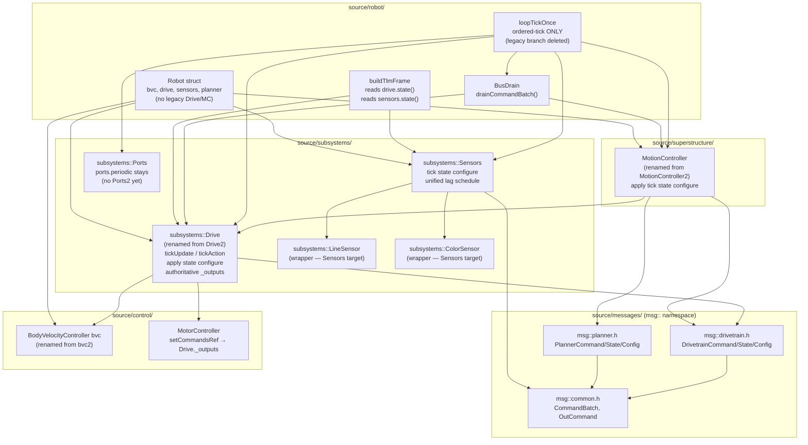
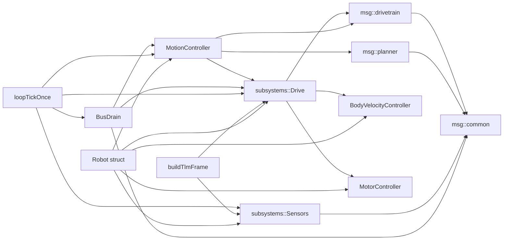

<!-- CLASI: Before changing code or making plans, review the SE process in CLAUDE.md -->

# Architecture Update — Sprint 060: Ordered-tick cutover — close parity gaps, make default, delete legacy control path

## What Changed

### Sprint Changes Summary

Sprint 060 completes the message-architecture migration begun in sprints 054-059.
It makes no new behavioral additions — it closes three documented parity gaps, makes
the ordered-tick path the sole compile-time path, deletes all legacy control code,
and renames the `2`-suffix scaffolding to permanent names.

1. **Gap 1 closed — TLM reads from Drive/Sensors state.**
   `buildTlmFrame` (`source/robot/RobotTelemetry.cpp`) is rewired to read encoder,
   pose, velocity, twist, and OTOS fields from `drive2.state()` (a `msg::DrivetrainState`
   value) and line/color fields from `sensors.state()` (a `SensorsState` value). The
   `drive.periodic()` call that was kept alive in the ordered-tick branch solely to
   populate `robot.state.actual` for TLM is removed. The golden-TLM capture
   (`tests/_infra/golden_tlm_capture.json`) is regenerated; the new values are the
   accepted baseline with stakeholder review.

2. **Gap 2 closed — single motor-output authority.**
   `MotorController::setCommandsRef` is called exactly once per Robot lifetime,
   binding to `Drive2::_outputs`. The Robot constructor override
   `motorController.setCommandsRef(&state.outputs)` at `Robot.cpp:121` is removed.
   `robot.hal.tick(now, ...)` is updated to pass `robot.drive2.outputs()` so the HAL
   plant advances from the authoritative buffer. The `robot.state.outputs`
   (`RobotStateContainer::outputs`) struct is no longer the live motor-command sink
   in the ordered-tick path; it becomes vestigial.

3. **Gap 3 closed — sensor schedule unified under `sensors.tick()`.**
   `sensors.tick(now)` is the sole driver of timed line and color reads in the
   ordered-tick path. The legacy `robot.lineSensor.periodic(ts, now)` and
   `robot.colorSensor_.periodic(ts, now)` calls in the ordered-tick branch are
   removed. `LoopTickState.lastLine`/`.lastColor` are not consulted in the
   ordered-tick path; `Sensors`'s own `_lastLineTick`/`_lastColorTick` are
   authoritative.

4. **`USE_ORDERED_TICK` becomes the default.**
   The preprocessor flag is defined unconditionally in the sim `CMakeLists.txt`
   and in the firmware build. After this change the ordered-tick path is live for
   all tests and production builds without any extra flags.

5. **Legacy loop and dead members deleted.**
   The `#ifndef USE_ORDERED_TICK` block in `LoopTickOnce.cpp` (lines 57-159) and
   the surrounding `#ifdef`/`#else`/`#endif` scaffolding are deleted; only the
   ordered-tick body remains. Dead Robot members removed:
   - `subsystems::Drive drive` — the legacy Phase-E Drive subsystem (declaration in
     `Robot.h`, construction in `Robot.cpp`, and `drive.periodic()` call site). The
     `source/subsystems/drive/Drive.h/.cpp` files are deleted.
   - `robot._tlmBoundFn` / `robot._tlmBoundCtx` fields — used only to pass the TLM
     sink into `drive.periodic()`; deleted after verifying no other live call sites.
   - `MotionController` (old imperative class) — deleted once `MotionController2`
     no longer wraps it by reference. The old class is either inlined into the new
     class as a value member or replaced; the old header/source files are deleted.
   - NOTE: `subsystems::LineSensor lineSensor` and `subsystems::ColorSensor colorSensor_`
     Robot members are RETAINED — `subsystems::Sensors` holds references to them.
     Only their `.periodic()` call sites are removed; the wrapper instances remain as
     the Sensors facade's targets.
   - `subsystems::Ports ports` and `ports.periodic(ts, now)` are RETAINED. There is
     no `Ports2` facade; this is documented as remaining scaffolding, not a gap.

6. **Rename / de-scaffold.**
   - `bvc2` → `bvc` in `Robot.h/.cpp`.
   - `subsystems::Drive2` class and files renamed to `subsystems::Drive`
     (`Drive2.h/.cpp` → `Drive.h/.cpp`); all references updated.
   - `MotionController2` class and files renamed to `MotionController`
     (`MotionController2.h/.cpp` → `MotionController.h/.cpp`); all references updated.
   - `planner` member retains its name.
   - `Robot.h` declaration order preserved: `bvc` before `drive` before `sensors`
     before `planner`.
   - After rename: `grep -r "Drive2\|bvc2\|MotionController2" source/` returns nothing.
   - After rename: `grep -r USE_ORDERED_TICK source/ tests/` returns nothing.

7. **Bench-parity preparation.**
   No code change. The firmware is built with the fully-cutover path. A bench
   checklist is produced documenting the VW/TURN/GOTO sequences and expected outcomes.
   Physical execution on tovez is human-operated by the stakeholder.

---

## Module Diagram (post-sprint end-state)

---

## Dependency Graph

Direction: Presentation/loop → Business logic (subsystems/planner) → Infrastructure (HAL/messages). No cycles.

---

## Why

The ordered-tick architecture is complete and unit-tested. The only reason it is not
the production path is three concrete, documented parity gaps — each of which has an
agreed fix. Closing the gaps is the prerequisite for flipping the default, which is
the prerequisite for deleting the legacy code, which is the prerequisite for renaming
the `2` scaffolding. The sprint is a straight-line execution of the work already
planned in sprint 059's issue (`make-ordered-tick-the-default-close-parity-gaps.md`).
No new design decisions are required; all three gap fixes are mechanical rewires with
no behavioral ambiguity.

---

## Impact on Existing Components

| Component | Impact |
|-----------|--------|
| `source/robot/RobotTelemetry.cpp` | `buildTlmFrame` rewired to read from `drive2.state()` / `sensors.state()`. Encoder, pose, velocity, twist, OTOS fields from `DrivetrainState`; line/color fields from `SensorsState`. `motionController.mode()` call updated to `planner.mode()` after rename. |
| `source/robot/LoopTickOnce.cpp` | Legacy `#ifndef` block deleted. Ordered-tick body becomes the whole file. `drive.periodic()` step-1 call removed. `lineSensor.periodic` / `colorSensor_.periodic` calls removed. File shrinks from ~280 to ~120 lines. |
| `source/robot/Robot.h` | `subsystems::Drive drive` member deleted. `bvc2` renamed `bvc`. `drive2` member type renamed `subsystems::Drive`. `MotionController2 planner` type renamed `MotionController`. `#include` paths updated. `_tlmBoundFn`/`_tlmBoundCtx` deleted (verify no live call sites first). |
| `source/robot/Robot.cpp` | `motorController.setCommandsRef(&state.outputs)` removed. `robot.hal.tick(now, robot.state.outputs)` in step 6b updated to `robot.hal.tick(now, robot.drive2.outputs())`. Configure calls and member names updated for renames. |
| `source/subsystems/drive/Drive2.h/.cpp` | Renamed to `Drive.h/.cpp`. Class renamed `subsystems::Drive`. All `drive2` call sites → `drive`. |
| `source/superstructure/MotionController2.h/.cpp` | Renamed to `MotionController.h/.cpp`. Class renamed `MotionController`. All `planner` member type name and include paths updated. |
| `source/subsystems/drive/Drive.h/.cpp` (old legacy) | Deleted once `subsystems::Drive drive` member removed from Robot. |
| `source/superstructure/MotionController.h/.cpp` (old legacy) | Deleted once `MotionController2` no longer wraps it. If retained as a private value member of the renamed class, the old header is an internal implementation detail. |
| `source/control/BodyVelocityController.*` | No change to class. `bvc2` → `bvc` rename at Robot member level only. |
| `tests/_infra/golden_tlm_capture.json` | Regenerated in ticket 001. New values are the accepted baseline. |
| `tests/simulation/unit/test_golden_tlm.py` | Must pass with new capture. No code changes to the test file itself. |
| `tests/simulation/unit/test_059_ordered_tick_parity.py` | Must continue passing. Subsystem rename may require updating sim fixture paths or C++ identifiers exposed via ctypes. |
| `subsystems::LineSensor lineSensor`, `subsystems::ColorSensor colorSensor_` | KEPT as Robot members (Sensors facade targets). Only `.periodic()` call sites removed. |
| `subsystems::Ports ports`, `ports.periodic()` | KEPT. Documented as remaining scaffolding (no `Ports2` yet). Not a parity gap. |
| `data/robots/robot_config.schema.json` | No change this sprint. |
| `source/robot/BusDrain.h/.cpp` | Minor: type references updated from `Drive2` to `Drive` and `MotionController2` to `MotionController`. Interface unchanged. |
| `source/robot/ConfigRegistry.cpp` | Type references updated for subsystem renames. `handleSet` routing unchanged. |

---

## Migration Concerns

**Golden-TLM regeneration.** Ticket 001 produces a new `golden_tlm_capture.json`.
The values will differ from the current baseline because `drive2.state()` and
`sensors.state()` project from their own internal `_hw` rather than `robot.state.actual`.
The stakeholder reviews and accepts the diff; the new values become the canary for
all subsequent tickets.

**`motionController.mode()` in `telemetryEmit`.** After the rename, `robot.motionController`
is gone; the member is now `robot.planner`. `telemetryEmit` at `RobotTelemetry.cpp:163`
calls `motionController.mode()`. This must become `planner.mode()` — confirm that
`MotionController` (new, renamed from `MotionController2`) exposes `mode()`.

**`_tlmBoundFn`/`_tlmBoundCtx` fields.** Audit all uses before deleting. They appear
in `robot.drive.periodic(now, robot._tlmBoundFn, robot._tlmBoundCtx)` (deleted in
ticket 001). If no other live call sites remain, delete them. If retained for EVT
emission in the Superstructure or elsewhere, document.

**Declaration order in `Robot.h`.** After deletion and rename the order must be:
`bvc` before `drive` before `sensors` before `planner`. C++ inits in declaration
order; `drive` (formerly drive2) binds `bvc` by reference.

**Old MotionController deletion.** `MotionController2` currently wraps the old
`MotionController` by holding a `MotionController&` reference. When the old class
is deleted, the new class must own the logic directly (value member or inlined).
The implementer may choose to retain the old class as a private value member of
the renamed class if that minimizes risk. The external interface must use only
`MotionController` (new).

**Rename scope.** `drive2` appears in `Robot.h/.cpp`, `LoopTickOnce.cpp`,
`BusDrain.h/.cpp`, `ConfigRegistry.cpp`, and test files. The rename is mechanical
but must be completed atomically per ticket to avoid mid-rename breakage. A final
`grep -r "Drive2\|bvc2\|MotionController2" source/` check closes the ticket.

---

## Design Rationale

### Decision 1: `buildTlmFrame` reads from `drive.state()` — not projecting into `state.actual`

**Context**: Two alternatives: (a) project `drive2.state()` into `robot.state.actual`
so `buildTlmFrame` keeps reading `state.actual`; (b) update `buildTlmFrame` to read
subsystem state getters directly.

**Alternatives considered**: Option (a) preserves the existing `state.actual` fan-out
path but keeps the shared-mutable struct alive as an inter-subsystem communication
channel — the pattern the message architecture was designed to eliminate.

**Why option (b)**: Reading from subsystem state getters completes the architectural
cut. `state.actual` becomes vestigial in the ordered-tick path and can be removed
later without touching TLM code.

**Consequences**: Golden-TLM values change; stakeholder review is required. Subsequent
sprints may delete `state.actual` entirely.

### Decision 2: Drive2's `_outputs` is the sole `setCommandsRef` target

**Context**: The Robot constructor currently overrides Drive2's `setCommandsRef(&_outputs)`
with `setCommandsRef(&state.outputs)`, meaning motor commands go to `state.outputs`
rather than Drive2's own buffer.

**Alternatives considered**: Keep `state.outputs` as the target and have Drive2 read
from it. This preserves `state.outputs` as the live sink but requires Drive2 to reach
outside its own boundary.

**Why remove the override**: Drive2 owns its own `_outputs`; removing the override
restores Drive2's ownership boundary. `drive.outputs()` is already exposed as a const
ref for the HAL tick and sim plant.

**Consequences**: `robot.state.outputs` is vestigial in the ordered-tick path. HAL
tick and any test harness that reads `state.outputs` must be updated.

### Decision 3: `subsystems::LineSensor`/`ColorSensor` wrapper members are retained

**Context**: The `Sensors` facade holds references to `LineSensor&` and `ColorSensor&`
(the wrapper objects, not raw device-interface refs). Deleting these members would
leave dangling references in the Sensors facade.

**Why retain**: Keep them; remove only their `.periodic()` call sites. The wrappers
continue to own the `updateInputs()` logic that `Sensors::tick()` calls through them.

**Consequences**: Two members remain in Robot that look like legacy at first glance.
This note is the canonical explanation.

### Decision 4: `ports.periodic()` stays — Ports is not a parity gap

**Context**: The ordered-tick path already calls `ports.periodic(ts, now)`. There is
no `Ports2` facade and no parity gap documented for Ports.

**Why keep**: Ports is out of scope for this sprint. Documenting it as remaining
scaffolding is more honest than silently leaving it in.

**Consequences**: `LoopTickState` continues to be passed into `ports.periodic()` — the
only remaining `LoopTickState` dependency in the ordered-tick body after gap #3 closes.

---

## Open Questions

1. **`planner.mode()` after rename.** `telemetryEmit` calls `motionController.mode()`.
   After rename this is `planner.mode()`. Confirm `MotionController` (new) exposes
   `mode() -> DriveMode`. If not, add the method in ticket 006.

2. **`_tlmBoundFn`/`_tlmBoundCtx` live references.** Audit before deletion in ticket 005.
   If any EVT emission path in `Superstructure` or `BusDrain` reads these fields, retain
   and document.

3. **MockHAL `tick` signature.** After gap #2, the ordered-tick path calls
   `robot.hal.tick(now, robot.drive2.outputs())`. Confirm `MockHAL::tick` accepts a
   `const MotorCommands&` parameter matching the `Drive2::outputs()` return type.

4. **`MotionController2` wraps old `MotionController` by reference.** Verify during
   ticket 005/006 whether the old class can be retained as a private value member of
   the renamed class or must be fully inlined. Either approach is acceptable; the
   choice is left to the implementer.
