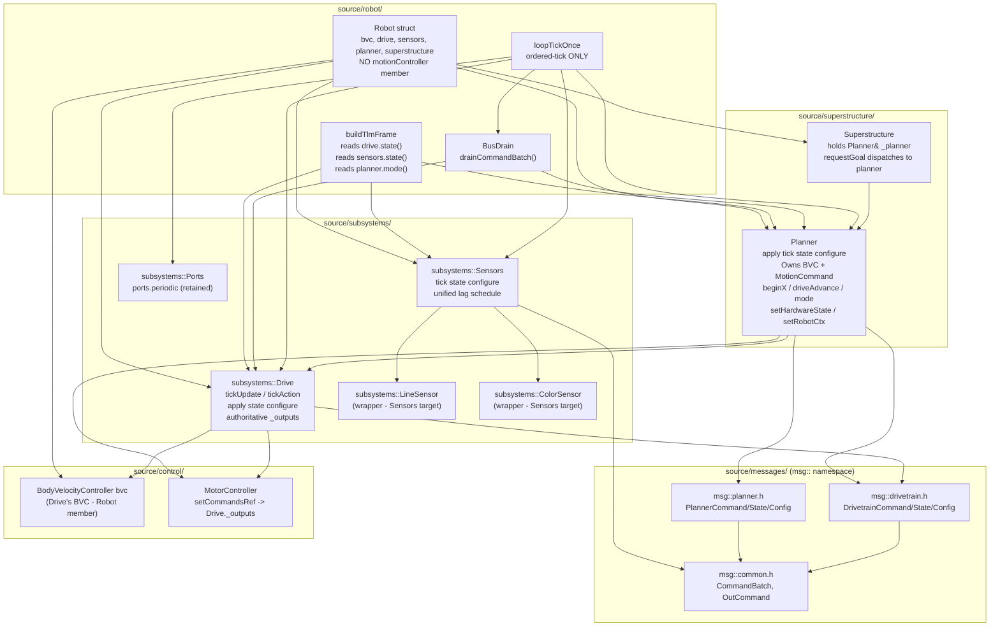
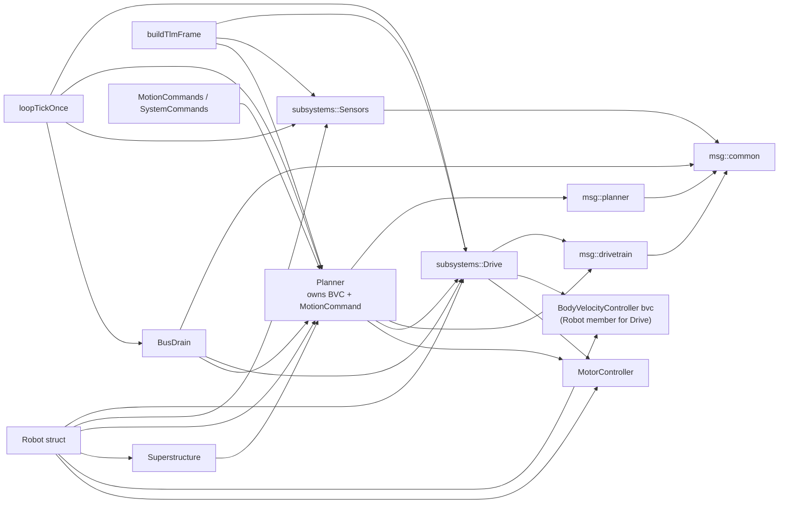

<!-- CLASI: Before changing code or making plans, review the SE process in CLAUDE.md -->

# Architecture Update — Sprint 061: Eliminate legacy MotionController — fold goal-closure into Planner, scrub scaffolding names

## What Changed

### Sprint Changes Summary

Sprint 061 completes the internalization of the legacy `MotionController`
class into `Planner`. Sprint 060 deferred this step — `MotionController` was
retained as a public `Robot` value member, wrapped by reference inside both
`Planner` and `Superstructure`, because fully rerouting its call sites was
out of scope. This sprint performs that rerouting.

There are no behavior changes. This is a structural move: the same S/T/D/G
state machines, BVC, and begin*() logic are compiled into `Planner` instead
of `MotionController`. Golden-TLM byte identity is the preservation canary.

The changes are:

1. **`Planner` absorbs the `MotionController` implementation.**
   The private members that `MotionController` owned (`_bvc`,
   `_activeCmd`, `_hwState`, `_safeOneShotDisable`, `_mode`, `_robot`, and
   all the D/G/PURSUE state variables) are moved into `Planner` as private
   members. The begin*() body translation unit (`MotionControllerBegin.cpp`)
   is renamed `PlannerBegin.cpp` and its methods become `Planner::beginX()`.
   The `driveAdvance()` body moves into `Planner.cpp`. The static helper
   methods (`_checkSafeOneShot`, `_startPreRotate`, `emitEvt`, `fullStop`,
   etc.) become private `Planner` methods.

2. **`Planner` public interface expanded to cover all call-site needs.**
   The previously delegated-through methods are now native `Planner` methods:
   `mode()`, `beginStream`, `beginVelocity`, `beginTimed`, `beginDistance`,
   `beginGoTo`, `beginTurn`, `beginRotation`, `stop`, `cancel`, `softStop`,
   `beginRawVelocity`, `disableSafetyOneShot`, `hasActiveCommand`,
   `emitToActiveChannel`, `activeCmd()`, `setHardwareState`, `setRobotCtx`,
   `setBvcStateRef`, `hardwareState()`.
   The `syncWireContext()` method is retained as-is.

3. **`Planner` constructor changes signature.**
   Old: `Planner(MotionController& mc, const subsystems::Drive& drive, const RobotConfig& cfg)`.
   New: `Planner(MotorController& mc_ctrl, Odometry& odo, const subsystems::Drive& drive, const RobotConfig& cfg)`.
   `Planner` constructs its own `_bvc(mc_ctrl, cfg)` and `_activeCmd` members
   in its member-initializer list, matching the order constraint documented in
   `MotionController`: `_bvc` must be declared before `_activeCmd`.

4. **`Superstructure` holds `Planner&` instead of `MotionController&`.**
   `Superstructure.h` forward-declares `Planner` (not `MotionController`).
   `Superstructure::_mc` is renamed `_planner` and its type changes to
   `Planner&`. The `mc()` accessor is renamed `planner()` and returns `Planner&`.
   `requestGoal`'s switch dispatches to `_planner.beginX(...)`. `Robot.h`
   constructs `Superstructure` with `planner` (not `motionController`).
   Because `Robot.h` declaration order is load-bearing and `Superstructure`
   must come after `Planner`, the new order becomes:
   `bvc -> drive -> sensors -> planner -> superstructure`.

5. **`MotionCtx::mc` changes from `MotionController*` to `Planner*`.**
   `MotionCommands.h` no longer forward-declares `MotionController`; it
   forward-declares `Planner`. `MotionCtx::mc` is `Planner*`. All handler
   lambdas that cast `ctx->mc` and call `mc->beginX()` work unchanged because
   `Planner` now has the same method signatures.

6. **Call sites in `Robot.cpp`, `RobotTelemetry.cpp`, `SystemCommands.cpp`
   rerouted.**
   - `Robot.cpp` constructor: `motionController` value member removed; `planner`
     constructor arguments change; `motionController.setHardwareState` call
     becomes `planner.setHardwareState`; `motionController.setRobotCtx` becomes
     `planner.setRobotCtx`; `_motionCtx.mc = &planner`.
   - `Robot.cpp::otosCorrect`: `motionController.hasActiveCommand()` and
     `motionController.emitToActiveChannel(...)` become `planner.*`.
   - `Robot.cpp::distanceDrive`: `motionController.beginDistance(...)` becomes
     `planner.beginDistance(...)`.
   - `RobotTelemetry.cpp`: `motionController.mode()` becomes `planner.mode()`
     in both the switch and the `_lastActiveMs` guard.
   - `SystemCommands.cpp`: `robot->motionController.disableSafetyOneShot()`
     becomes `robot->planner.disableSafetyOneShot()` (two call sites).

7. **`Robot` drops the `motionController` value member.**
   `Robot.h` removes the `MotionController motionController` declaration,
   removes `#include "superstructure/MotionController.h"`, and updates the
   comment block describing the declaration order.

8. **Legacy files deleted.**
   `source/superstructure/MotionController.h`, `MotionController.cpp`,
   `source/control/MotionControllerBegin.cpp` are deleted. Build system files
   (`CMakeLists.txt`) updated to remove those sources and add `PlannerBegin.cpp`.
   All `#include "superstructure/MotionController.h"` directives removed from
   `Planner.h`, `Superstructure.cpp`, `Robot.cpp`, `MotionCommands.h`,
   `SystemCommands.cpp`, and `planner_api.cpp`.

9. **`planner_api.cpp` test shim updated.**
   `PlannerHandle` in `tests/_infra/sim/planner_api.cpp` currently owns a
   `MotionController motion_ctrl` member and passes it to `Planner`. After the
   absorb, `PlannerHandle` removes `motion_ctrl` and constructs `Planner`
   directly with `(mc_ctrl, est.odometry(), drive, cfg)`. Comments updated.

10. **Test-infra scaffolding names scrubbed.**
    `tests/_infra/sim/drive2_api.cpp` is renamed `drive_api.cpp`; all
    `drive2_api_*` symbols renamed `drive_api_*` (both C++ `extern "C"` and
    Python `ctypes` call sites). `bus_drain_api_drive2_*` symbols renamed
    `bus_drain_api_drive_*`. `Drive2Ctx` Python struct renamed `DriveCtx`.
    `test_drive2_subsystem.py` renamed `test_drive_subsystem.py`.
    `test_motioncontroller2_smoke.py` renamed `test_planner_subsystem_smoke.py`.
    C++ and Python changes are atomic within the same ticket.

11. **Bench checklist.**
    `tests/bench/061_bench_checklist.md` is produced with the VW/TURN/GOTO/
    DISTANCE/RT command sequences and expected EVT completions for tovez.
    Sprint branch is left open for the stakeholder bench-test before merging
    to master.

---

## Module Diagram (post-sprint end-state)

---

## Dependency Graph (post-sprint)

Direction: Robot/loop -> Planner/Drive/Sensors -> messages/control. No cycles.
`MotionController` is removed; `Planner` is the single leaf of the goal-closure
subtree.

---

## Why

`MotionController` was retained in sprint 060 because rerouting its call
sites was out of scope for that sprint's acceptance criteria. Now that the
ordered-tick path is the only compile-time path and all subsystems have been
renamed to their canonical names, eliminating the retained class is the final
structural cleanup. The result is a dependency graph with a single cohesive
goal-closure component (`Planner`) instead of two classes in a
by-reference wrapper relationship.

The absorb-into-Planner approach is chosen over alternatives (see Design
Rationale) because it produces a single cohesive class that owns all
goal-closure state, eliminating the indirection layer and the risk of
accidental dual-reference errors.

---

## Impact on Existing Components

| Component | Impact |
|-----------|--------|
| `source/superstructure/Planner.h/.cpp` | Major: absorbs all `MotionController` private members and method bodies. Constructor changes signature. `_mc` reference member removed; `_bvc`, `_activeCmd`, `_hwState`, `_mode`, `_safeOneShotDisable`, `_robot`, D/G/PURSUE state vars added. All public methods now implemented directly (not delegated). `#include "MotionController.h"` removed. |
| `source/control/PlannerBegin.cpp` | New file: `MotionControllerBegin.cpp` bodies moved here; methods renamed `Planner::beginX(...)`. Added to CMakeLists.txt. |
| `source/superstructure/MotionController.h/.cpp` | **DELETED.** No remaining references in `source/`. |
| `source/control/MotionControllerBegin.cpp` | **DELETED.** Content moved to `PlannerBegin.cpp`. |
| `source/superstructure/Superstructure.h/.cpp` | `MotionController& _mc` -> `Planner& _planner`. `mc()` accessor renamed `planner()` returning `Planner&`. `requestGoal` switch calls `_planner.beginX(...)`. Forward-declares `Planner` not `MotionController`. |
| `source/robot/Robot.h` | `MotionController motionController` member removed. `#include "superstructure/MotionController.h"` removed. `superstructure` declaration moves after `planner` (load-bearing order). Declaration-order comment updated. |
| `source/robot/Robot.cpp` | Constructor: `motionController(...)` line removed from initializer list; `planner(...)` initializer changes from `(motionController, drive, config)` to `(motorController, estimate.odometry(), drive, config)`; `superstructure(...)` from `(motionController, haltController, config)` to `(planner, haltController, config)`. Setup calls `planner.setHardwareState`, `planner.setRobotCtx`, `planner.setBvcStateRef`. `_motionCtx.mc = &planner`. |
| `source/robot/Robot.cpp::otosCorrect` | `motionController.hasActiveCommand()` -> `planner.hasActiveCommand()`. `motionController.emitToActiveChannel(...)` -> `planner.emitToActiveChannel(...)`. |
| `source/robot/Robot.cpp::distanceDrive` | `motionController.beginDistance(...)` -> `planner.beginDistance(...)`. |
| `source/robot/RobotTelemetry.cpp` | `motionController.mode()` -> `planner.mode()` in two places. |
| `source/commands/SystemCommands.cpp` | `robot->motionController.disableSafetyOneShot()` -> `robot->planner.disableSafetyOneShot()` (two call sites). `_motionCtx.mc = &planner`. |
| `source/commands/MotionCommands.h` | `MotionController* mc` -> `Planner* mc` in `MotionCtx`. Forward-declare `Planner` instead of `MotionController`. |
| `source/robot/LoopScheduler.h` | Remove any `MotionController` forward-declaration or include; update to `Planner` if needed. |
| `source/robot/LoopTickOnce.cpp` | Update provenance comments referencing `MotionController`; no functional changes. |
| `source/COMMANDS.md` | Doc references to `MotionController` replaced with `Planner`. |
| `source/commands/MotionCommand.h/.cpp` | Comments referencing `MotionController::...` updated to `Planner::...`; no code change to the class itself. |
| `source/control/MotionEventSink.h` | Retained as-is; shared type used by `MotionCommand`. Verify no include chain requires `MotionController.h`. |
| `tests/_infra/sim/planner_api.cpp` | `PlannerHandle` removes `MotionController motion_ctrl` member. Planner constructor updated to `(mc_ctrl, est.odometry(), drive, cfg)`. `#include "superstructure/MotionController.h"` removed. |
| `tests/_infra/sim/drive2_api.cpp` | Renamed `drive_api.cpp`. All `drive2_api_*` symbols renamed `drive_api_*`. CMakeLists.txt updated. |
| `tests/_infra/sim/bus_drain_api.cpp` | `bus_drain_api_drive2_*` symbols renamed `bus_drain_api_drive_*`. |
| `tests/simulation/unit/test_drive2_subsystem.py` | Renamed `test_drive_subsystem.py`. Python ctypes bindings updated `drive2_api_*` -> `drive_api_*`. `Drive2Ctx` -> `DriveCtx`. |
| `tests/simulation/unit/test_motioncontroller2_smoke.py` | Renamed `test_planner_subsystem_smoke.py`. Comment updated; `planner_api_*` bindings unchanged. |
| `tests/simulation/unit/test_059_config_routing.py` | Two test method names with `drive2` prefix may be renamed; C binding dependency confirmed in ticket 006. |
| `tests/_infra/sim/config_routing_api.cpp` | Comment and any `drive2_api_*` call references updated to `drive_api_*`. |
| `tests/bench/061_bench_checklist.md` | New file: bench checklist for tovez with VW/TURN/GOTO/DISTANCE/RT sequences and expected EVT completions. |

---

## Migration Concerns

**Declaration order in `Robot.h` changes.** `motionController` was at position 7
(after `estimate`). After the absorb, this slot is gone. `Planner`'s constructor
requires `motorController`, `estimate.odometry()`, and `drive` — all of which
already precede it. `Superstructure` requires `planner` and `haltController` —
both preceding it. The new load-bearing order is:
`motorController -> estimate -> motionController(REMOVED) -> haltController ->
[phase-E subsystems] -> superstructure` becomes
`motorController -> estimate -> haltController -> [phase-E subsystems] ->
bvc -> drive -> sensors -> planner -> superstructure`.

**`_bvc` before `_activeCmd` invariant.** Within `Planner`'s private section,
`_bvc` must be declared before `_activeCmd` (the constructor passes `&_bvc` to
`_activeCmd.configure()`). This invariant is documented in `MotionController.h`
and must be preserved in `Planner.h`.

**`planner.setBvcStateRef` wiring.** `Robot.cpp` calls
`motionController.setBvcStateRef(&state.desired)` to wire the BVC publish
target. After the absorb, `planner.setBvcStateRef(&state.desired)` serves the
same role. The `syncWireContext()` method in `Planner` that propagates reply
context from the wire path into `_desired` is unchanged.

**`planner_api.cpp` test handle construction.** `PlannerHandle` currently holds
a `MotionController motion_ctrl` member between `bvc` and `planner`. After the
absorb, `motion_ctrl` is removed; `planner` is constructed as
`Planner(mc_ctrl, est.odometry(), drive, cfg)`. All `planner_api_*` C-ABI
functions pass through to `Planner` methods unchanged.

**Test-infra C-ABI symbol rename is atomic.** Python ctypes binds C functions
by string name. The rename of `drive2_api_*` to `drive_api_*` MUST have the
C++ `extern "C"` symbol rename and the Python ctypes call-site update in the
same commit. Any split would break the test suite mid-ticket.

**Golden-TLM byte identity.** After the absorb, `planner.mode()` reads the
same `_mode` field (now owned by `Planner`) with the same values and
transitions as `motionController.mode()` did. Byte identity of golden-TLM
is expected and is the regression gate.

---

## Design Rationale

### Decision 1: Absorb-into-Planner (chosen) vs. thin-delegation forwarding

**Context**: Sprint 060 chose to keep `MotionController` as a value member
of `Robot` and have `Planner` delegate to it by `&` reference. That was
appropriate for 060's scope. Two options exist for sprint 061:

**Alternatives considered**:
- *Thin delegation (keep `MotionController` as private `Planner` value member)*:
  `MotionController` stays as a type but becomes a private value inside
  `Planner`. Avoids moving the implementation files; call sites reach `Planner`
  which forwards. `MotionController` class persists.
- *Full absorb (chosen)*: `Planner.h` owns the implementation directly. No
  `MotionController` class exists.

**Why full absorb**: The thin-delegation option keeps `MotionController` as a
class that must be maintained in parallel with `Planner`. Any future change to
goal-closure logic requires understanding two class boundaries. The absorb
produces a single cohesive class — one file to read, one file to edit. It also
closes the deferred OQ from sprint 060 completely. The implementation risk is
mitigated by the additive-then-reroute-then-absorb ticket sequence.

**Consequences**: `Planner.h` grows; it no longer declares `Planner` as a thin
wrapper. `PlannerBegin.cpp` is a new file name. The `planner_api.cpp`
test-handle struct gets slightly simpler (one fewer member).

### Decision 2: `Superstructure` holds `Planner&`, accessor renamed `planner()`

**Context**: `Superstructure`'s `requestGoal` dispatches begin*() calls.
Currently it holds `MotionController& _mc`. After rerouting, the begin*()
methods are on `Planner`.

**Why `Planner&`**: There is no value in keeping a `MotionController&` in
`Superstructure` once the class is deleted. The `mc()` accessor is renamed
`planner()` to match what it actually returns. `evaluateSafety()` does not
touch the motion member and is unaffected.

**Consequences**: Any external call to `superstructure.mc()` must be updated
to `superstructure.planner()`. The only live call site found was in
`LoopScheduler.h` (a comment, not a call). This must be verified by the
programmer in ticket 002.

### Decision 3: `MotionCtx::mc` becomes `Planner*` in one step

**Context**: `MotionCtx::mc` is used by every motion command handler lambda.

**Why single-step**: An alias typedef `using MotionController = Planner` would
avoid touching handler lambdas but would be misleading and create confusion
during future debugging. Because `Planner` exposes the same method signatures
as `MotionController`, the pointer type rename is mechanical and all handler
lambdas compile unchanged.

**Consequences**: `MotionCommands.h` forward-declares `Planner` not
`MotionController`. `getMotionCommands(MotionCtx*)` signature is unchanged.

### Decision 4: `PlannerBegin.cpp` as the renamed begin-bodies file

**Context**: `MotionControllerBegin.cpp` holds begin*() method bodies.
Options are to move those bodies into `Planner.cpp`, or to keep them in a
separate translation unit renamed `PlannerBegin.cpp`.

**Why separate file**: `Planner.cpp` + `driveAdvance` is already substantial.
Keeping the begin*() bodies in their own translation unit (`PlannerBegin.cpp`)
preserves build locality — a change to a begin*() method recompiles only that
TU, not the entire Planner.cpp. The cost is one more file in the build system.

**Consequences**: CMakeLists.txt gains `PlannerBegin.cpp` and loses
`MotionControllerBegin.cpp`. No include changes needed — the method
implementations include `"superstructure/Planner.h"`.

---

## Open Questions

1. **`LoopScheduler.h` MotionController reference scope.** The issue lists
   `LoopScheduler.h` as a call site. Whether this is a forward-declaration,
   an include, or only a comment must be confirmed before ticket 003. If it
   is a field type or function parameter type, it must be updated to `Planner`.

2. **`Superstructure.mc()` external callers.** The `mc()` accessor returning
   `MotionController&` must be audited for external callers beyond
   `LoopTickOnce.cpp`. If any handler or test calls `superstructure.mc()`
   directly, those call sites must be included in ticket 002.

3. **`config_routing_api.cpp` drive2_api call sites.** Line 212 references
   "the existing drive2_api pattern". The programmer should confirm whether
   this file calls `drive2_api_*` C symbols directly (requiring ticket 006
   update) or only uses the pattern conceptually (comment update only).

4. **`test_059_config_routing.py` method names with `drive2`.** Two test
   method names (`test_drive2_vel_kp_non_zero_at_init`,
   `test_drive2_planner_sensors_default_consistent`) carry the `drive2` prefix.
   Confirm whether they bind `drive2_api_*` C symbols (require rename in
   ticket 006) or are pure Python names (rename optional but desirable).
