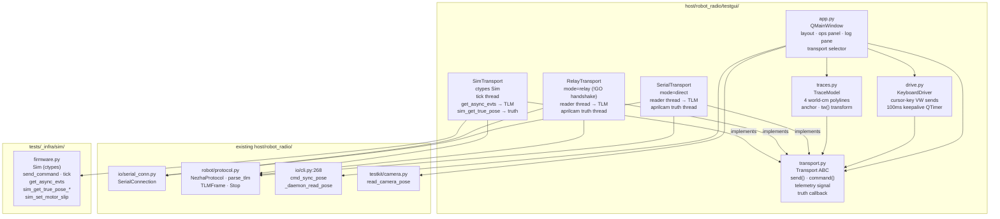
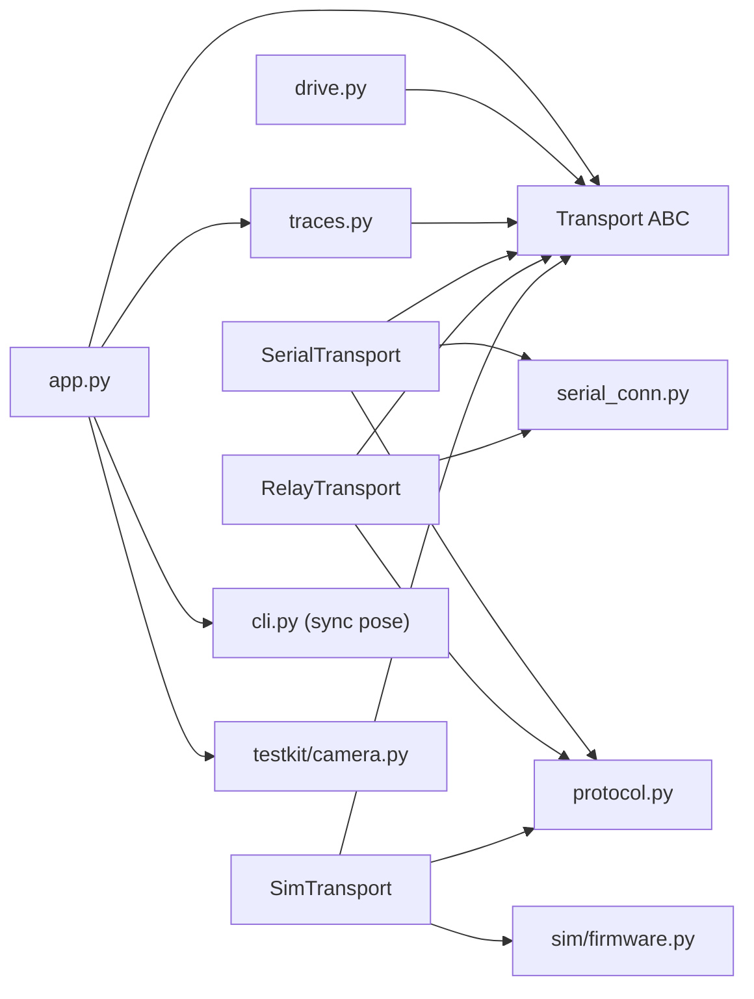

<!-- CLASI: Before changing code or making plans, review the SE process in CLAUDE.md -->

# Architecture Update — Sprint 062: Robot Test GUI (PySide6) and config-golden/schema baseline fix

## What Changed

### Sprint Changes Summary

Sprint 062 introduces two independent host-side changes:

1. **New `testgui` package** (`host/robot_radio/testgui/`) — a PySide6 desktop
   application for interactive robot control and pose-trace visualization. The
   package is new host tooling; it does not change any existing module's public
   interface, does not introduce any firmware changes, and does not alter the
   `rogo` CLI or the `robot_radio` runtime modules.

2. **Schema fix for `tag_offset_mm.z`** — `data/robots/robot_config.schema.json`
   adds `z: {type: number}` to the `OffsetXYYaw` shared definition so that robot
   configs carrying a tag mount height (`tovez`: `z=120.0`) validate cleanly.
   This is a one-line schema addition with no code changes.

### New Modules

#### `host/robot_radio/testgui/` — interactive test cockpit

| Module | Purpose |
|--------|---------|
| `testgui/__init__.py` | Package marker; exposes `__version__` |
| `testgui/__main__.py` | Entry point: `python -m robot_radio.testgui` |
| `testgui/transport.py` | `Transport` ABC + three concrete backends |
| `testgui/traces.py` | Four-polyline world-cm pose accumulator |
| `testgui/app.py` | `QMainWindow` — layout, wiring, operations panel |
| `testgui/drive.py` | Cursor-key interactive driving + keepalive timer |

#### `tests/testgui/` — headless smoke tests

A small pytest suite runnable with `QT_QPA_PLATFORM=offscreen`; kept outside
`tests/simulation/` to avoid mixing GUI tests with the firmware simulation gate.

### Schema Change

`data/robots/robot_config.schema.json` — `$defs.OffsetXYYaw.properties` gains
a `z` property (`{type: number}`). No firmware-generated artifacts are affected
(the `z` key carries no `firmware` annotation and is host-side only).

---

## Module Diagrams

### Component Diagram — `testgui` package and its dependencies

### Dependency Graph — transport and trace direction

Direction: `app → transport ABC ← concrete backends → existing io/testkit modules`.
No cycles. The Transport ABC isolates `app.py` from backend details.

---

## Why

The project has low-level tooling (protocol client, ctypes simulator, aprilcam
daemon, ad-hoc bench scripts) but no unified cockpit for interactive control and
live pose comparison. The four pose estimates — camera truth, encoder odometry,
OTOS odometry, fused EKF — exist as separate data streams with no common
visualization. Developers rely on reading log lines to detect drift, which makes
sensor calibration and algorithm tuning slow.

The `testgui` package fills this gap by providing a single window that:
- connects to any backend through one transport interface,
- renders all four traces on a playfield image in real time,
- exposes every firmware motion command through labeled fields (eliminating
  wire-format memorization), and
- works against the firmware simulator with no hardware present.

The schema `z` fix is unrelated but bundled here as a known baseline failure
(two failing CI tests) that is trivial to resolve.

---

## Impact on Existing Components

| Component | Impact |
|-----------|--------|
| `host/robot_radio/io/serial_conn.py` | **Read-only.** `SerialTransport` and `RelayTransport` wrap `SerialConnection` by composition; no changes to `serial_conn.py`. |
| `host/robot_radio/robot/protocol.py` | **Read-only.** `parse_tlm`, `TLMFrame`, `NezhaProtocol`, `Stop` are imported; no changes. |
| `host/robot_radio/io/cli.py` | **Read-only.** The sync-pose logic at line 268 is reused by calling `cmd_sync_pose` / `_daemon_read_pose` directly (or by extracting the pattern into `app.py`). No changes to `cli.py`. |
| `host/robot_radio/testkit/camera.py` | **Read-only.** `read_camera_pose` is imported and called by the camera-truth polling thread. No changes. |
| `tests/_infra/sim/firmware.py` | **Read-only.** `Sim` class is used by `SimTransport` via composition. No changes. |
| `data/robots/robot_config.schema.json` | **Modified.** `$defs.OffsetXYYaw` gains `z: {type: number}`. No other changes. |
| `host/pyproject.toml` | **Modified.** A new `[dependency-groups] gui` entry adds `PySide6`. The existing `dev` group is unchanged. |
| `tests/simulation/` (existing gate) | **Unaffected.** New `tests/testgui/` directory is kept separate. The simulation gate (`uv run python -m pytest tests/simulation`) must continue to pass. |
| Firmware (`source/`) | **Unaffected.** No firmware changes. |

---

## Migration Concerns

**PySide6 is a new optional dependency.** It lives in the `gui` dependency
group; developers who do not need the GUI do not install it. Existing `uv sync`
(without `--group gui`) continues to produce a working dev environment. No
transitive changes to the `dev` or base groups.

**`tests/testgui/` and the existing simulation gate.** The headless smoke tests
use `QT_QPA_PLATFORM=offscreen`. They must not be added to the `tests/simulation`
path to avoid injecting a Qt dependency into the firmware simulation CI gate.
Recommended placement: `tests/testgui/` with its own conftest setting the offscreen
platform env var.

**Schema `additionalProperties: false` is preserved.** Adding `z` to `OffsetXYYaw`
does not relax the schema against genuinely unknown keys; it makes it correct for
the existing tovez robot config. The `odometry_offset_mm` field also uses
`OffsetXYYaw` (via `$ref`); this fix therefore also allows `z` on
`odometry_offset_mm` objects, which is intentional (the field describes a 3-D
offset of which `z` is the vertical component).

---

## Design Rationale

### Decision 1: `Transport` ABC as the single isolation layer

**Context:** The GUI must work against three backends (Sim, Serial, Relay) with
identical UI behavior. The UI must not branch on backend type.

**Alternatives considered:**
- *No abstraction:* `app.py` imports all three backends and uses `isinstance` switches.
- *`Transport` ABC (chosen):* A thin interface with `send()`, `command()`,
  `telemetry` signal/callback, and `truth` callback.

**Why this choice:** The ABC contains the fan-out at one seam. `app.py` is
written once against the interface; new backends (e.g., UDP, Bluetooth) can be
added without touching `app.py`. The three concrete backends are the only places
where `SerialConnection` / `Sim` details appear.

**Consequences:** A thin `Transport` ABC must be defined before the backends are
written (ticket 002 precedes ticket 003).

### Decision 2: `SimTransport` owns the tick-thread, not the Sim fixture

**Context:** `tests/_infra/sim/firmware.py` has a pytest fixture that manages
`Sim` lifecycle. For the GUI, `Sim` must run in a background thread permanently.

**Why:** The `Sim` ctypes object is not thread-safe for concurrent `tick()` and
`send_command()`. `SimTransport` owns one `Sim` instance, one tick-thread, and a
lock. Commands are queued to the tick-thread rather than called from the Qt main
thread. This mirrors how `SerialConnection` keeps a reader thread separate from
command sends.

**Consequences:** `SimTransport.connect()` starts the tick-thread;
`disconnect()` stops it cleanly. The Sim fixture (for pytest) is unchanged.

### Decision 3: Reuse `cmd_sync_pose` / `_daemon_read_pose` rather than re-implementing

**Context:** `cli.py:268` already implements the correct read-camera-pose →
firmware `P` setpose sequence, including edge cases (daemon not available,
timeout handling).

**Why:** Duplicating this logic would create two implementations that could
diverge. The function exists in a module that `testgui` can import without
coupling to the full CLI. The programmer may need to extract the helper into a
shared location if it cannot be imported cleanly from `cli.py` — but no behavior
is duplicated.

**Consequences:** If the sync-pose logic is tightly coupled to CLI argument
parsing, the programmer in ticket 005 may need to extract it to a small helper in
`host/robot_radio/robot/` or `testkit/`. This is a ticket-level decision, not an
architecture-level one.

### Decision 4: Headless smoke tests in `tests/testgui/`, not `tests/simulation/`

**Context:** The simulation gate (`tests/simulation`) runs against the ctypes
firmware. Adding Qt to that gate would require PySide6 in the CI environment for
every simulation-only run.

**Why:** Keeping `tests/testgui/` separate allows the simulation gate to remain
PySide6-free. The headless smoke tests use the offscreen platform and a fake
Transport — they do not load the firmware lib and do not require `gui` deps beyond
what the test environment provides.

**Consequences:** A developer running `uv run python -m pytest tests/testgui`
needs `uv sync --group gui` first.

### Decision 5: Schema — add `z` to `OffsetXYYaw`, not a new `OffsetXYZYaw` def

**Context:** The schema has two uses of `OffsetXYYaw`: `vision.tag_offset_mm`
and `geometry.odometry_offset_mm`. Adding `z` affects both.

**Why:** The `z` component (vertical height) is semantically valid on any 3-D
offset. Creating a second definition `OffsetXYZYaw` would require migrating refs
and adds complexity for a one-field addition. `additionalProperties: false`
continues to block genuinely unknown keys.

**Consequences:** `odometry_offset_mm` objects may now carry a `z` field without
schema rejection. This is harmless — no existing configs set it, and no host code
reads it.

---

## Open Questions

1. **`cmd_sync_pose` importability.** `host/robot_radio/io/cli.py` is a Click
   CLI entry point. Whether `cmd_sync_pose` and `_daemon_read_pose` are cleanly
   importable without triggering Click's `@main.command` registration needs
   verification in ticket 005. If not, a small extraction to `testkit/` or
   `robot/` is required.

2. **Playfield image path.** The default playfield image is
   `tests/old/playfield_tour/playfield.jpg` with
   `tests/old/playfield_tour/playfield_calibration.json`. The
   `testgui` package lives in `host/`; accessing test assets via a relative
   `../../tests/` path is brittle. Ticket 006 should decide whether to embed the
   image in the package or accept a configurable path defaulting to the
   project-root-relative location.

3. **`DefaultConfig.cpp` SSOT confirmation.** The `yawRateMax` / `odomOffY`
   golden mismatch requires stakeholder confirmation before refreshing the
   golden snapshot. This is a requirements-level question; the ticket (011)
   models it as a gated acceptance criterion. The team-lead will escalate to the
   stakeholder.
