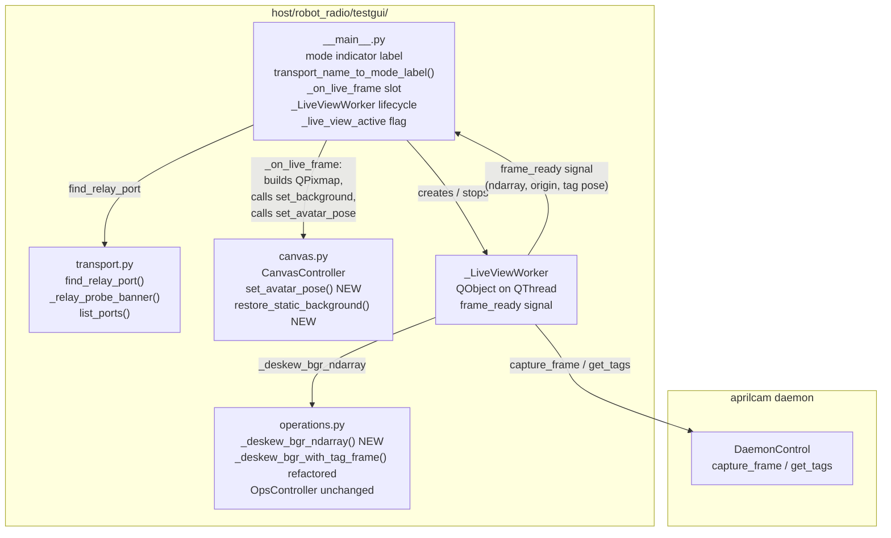
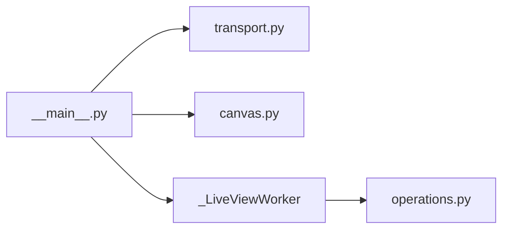
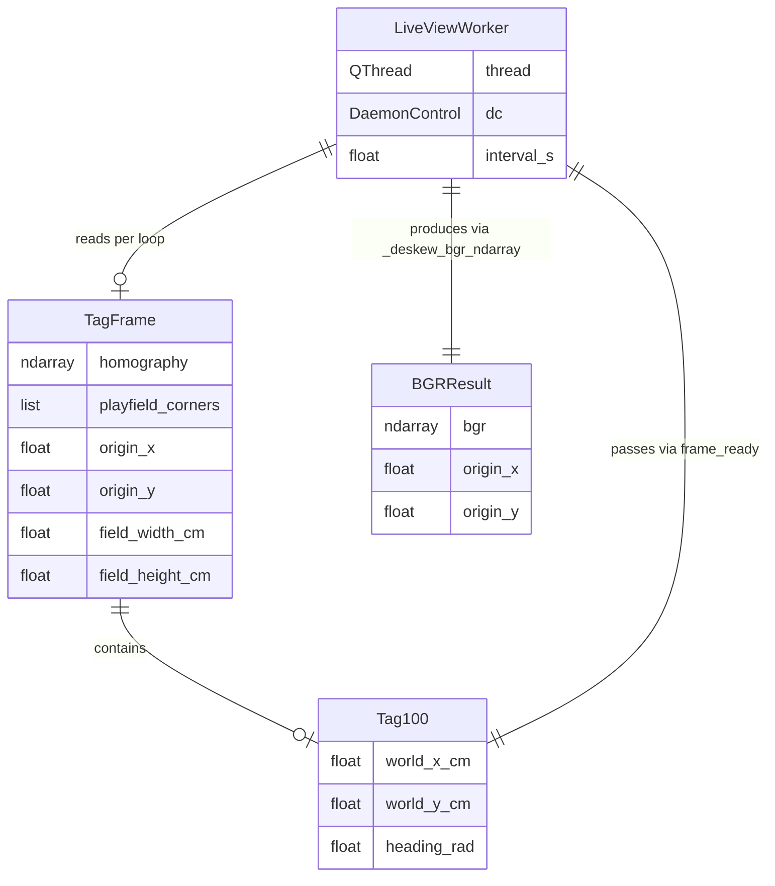

<!-- CLASI: Before changing code or making plans, review the SE process in CLAUDE.md -->

# Architecture Update — Sprint 063: Mode-driven Test GUI

## Sprint Changes Summary

Sprint 063 makes three targeted additions to the `testgui` package
(`host/robot_radio/testgui/`). No other host modules or firmware are affected.

1. **Mode indicator** — a `QLabel` near the top of the right panel displays
   the current operating mode (SIM MODE / BENCH MODE / PLAYFIELD MODE) derived
   from the transport combo selection. A pure function
   `transport_name_to_mode_label()` encodes the mapping.

2. **Live-view worker** — `_LiveViewWorker` is a `QObject` moved to a
   `QThread` that loops at ~10–15 Hz, calls the aprilcam daemon to capture and
   deskew a frame off the Qt main thread, and emits a `frame_ready` signal
   carrying a BGR ndarray, origin coords, and tag-100 pose. The main thread
   builds the `QPixmap` on receipt, calls `canvas_ctrl.set_background()`, and
   calls the new `canvas_ctrl.set_avatar_pose()`. The existing deskew logic in
   `operations.py` is refactored into a Qt-free `_deskew_bgr_ndarray()` helper.
   `CanvasController` gains `set_avatar_pose()` and `restore_static_background()`.

3. **Relay auto-discovery** — a pure function `find_relay_port(port_list,
   probe_fn)` in `transport.py` probes each serial port candidate for the
   `RADIOBRIDGE` banner and returns the matching port. `_on_connect()` in
   `__main__.py` invokes this when Relay is selected, replacing the manual
   `port_edit` read.

---

## What Changed

### New pure helpers

**`transport_name_to_mode_label(name: str) -> tuple[str, str]`** in `__main__.py`
Maps a transport combo display name to `(label_text, css_color)`.
- `"Sim"` → `("SIM MODE", "#808080")`
- `"Serial"` → `("BENCH MODE", "#4080ff")`
- `"Relay"` → `("PLAYFIELD MODE", "#20c020")`

**`find_relay_port(port_list: list[str], probe_fn: Callable) -> str | None`** in `transport.py`
Iterates `port_list`, calls `probe_fn(port) -> str | None` for each, and returns
the first port whose banner contains `"RADIOBRIDGE"`. Returns `None` if no match.

**`_relay_probe_banner(port: str) -> str | None`** in `transport.py`
Opens the port with DTR asserted (matching the relay's reset/announce protocol
described in `.clasi/knowledge/`), reads up to ~1 s for the `DEVICE:` banner
line, returns it or `None` on timeout/error. Closes the port before returning.

**`_deskew_bgr_ndarray(raw_bgr, tag_frame, ppc) -> tuple[ndarray, float, float] | None`**
in `operations.py`
Extracted from the body of `_deskew_bgr_with_tag_frame()`. Returns
`(deskewed_bgr, origin_x, origin_y)` with no Qt dependency. The existing
function delegates to this helper then calls `_bgr_ndarray_to_pixmap()`.

### New class

**`_LiveViewWorker(QObject)`** in `testgui/__main__.py` (or `testgui/live_view.py`)
- Signals: `frame_ready(object, float, float, float, float, float)` carrying
  `(bgr_ndarray, origin_x, origin_y, tag_x_cm, tag_y_cm, tag_yaw_rad)`.
- Slots: `run()` — the main loop; `stop()` — signals the loop to exit.
- Moved to a `QThread` by `__main__.py` after construction.
- Loop body: connect daemon, `capture_frame()`, `get_tags()` (including tag 100
  pose), call `_deskew_bgr_ndarray()`, emit `frame_ready`. Sleep to target
  ~10–15 Hz. On daemon unavailability: log once, backoff, retry.
- No QPixmap, no `QGraphicsScene` calls — all Qt canvas work is in the slot.

### New `CanvasController` methods

**`set_avatar_pose(x_cm: float, y_cm: float, yaw_rad: float) -> None`**
Positions and rotates the marker at explicit world coordinates. Does not consult
`trace_model`. Rotation formula: `rotation_deg = 90.0 - degrees(yaw_rad)`.

**`restore_static_background() -> None`**
Replaces the canvas pixmap with a grey placeholder (via `_make_grey_placeholder`)
and resets the origin to the field-centre fallback. Calls `refresh()` to
re-render traces and marker using `trace_model.fused`.

### Modified wiring in `__main__.py`

- Mode indicator `QLabel` added at top of right panel; updated in
  `_on_transport_changed()`.
- `_on_connect()` for Relay: calls `find_relay_port(list_ports(),
  _relay_probe_banner)` before constructing `RelayTransport`. On success,
  populates `port_edit` with the discovered port for visibility. On failure,
  logs "[WARN] No relay found" and returns.
- `_on_connect()` for Relay: after transport.connect(), creates
  `_LiveViewWorker`, moves it to a `QThread`, connects `frame_ready` to a
  main-thread slot `_on_live_frame`, and starts the thread.
- `_on_disconnect()`: if `_live_view_active` flag is set, calls
  `worker.stop()`, `thread.quit()`, `thread.wait()`, then
  `canvas_ctrl.restore_static_background()`.
- `_on_live_frame(bgr, ox, oy, tx, ty, tyaw)` slot: builds `QPixmap` via
  `_bgr_ndarray_to_pixmap(bgr)`, calls `canvas_ctrl.set_background(pm, ox, oy)`,
  calls `canvas_ctrl.set_avatar_pose(tx, ty, tyaw)`.
- In PLAYFIELD MODE, `on_truth_ready` telemetry bridge slot does NOT call
  `canvas_ctrl.refresh(fused_yaw)` for the avatar (live view owns the avatar);
  it still feeds `trace_model.feed_truth()` for the green camera trace line.

---

## Module Diagrams

### Component Diagram — sprint 063 additions to testgui

### Dependency Graph — new arrows only

No cycles. `CanvasController` has no new dependencies. The worker depends on
`OPS` (for `_deskew_bgr_ndarray`) and the daemon (external). Dependency
direction: `__main__` → worker → ops. `TRANSPORT` and `CANVAS` remain leaves.

### Entity-Relationship Diagram — live-view data flow

---

## Why

The Test GUI lacked situational awareness for playfield runs: no mode label,
no live camera, and no relay discovery forced the user to remember context
that the software should provide. These three features improve operational
clarity without changing any existing behavior in Sim/Serial modes.

The implementation reuses established patterns (the `_TelemetryBridge`
signal/slot pattern, the existing deskew code, `list_ports()`) to minimize
new surface area and keep the changes well within the existing architecture.

---

## Impact on Existing Components

| Component | Impact |
|-----------|--------|
| `testgui/__main__.py` | **Modified.** Adds mode label, `_LiveViewWorker` lifecycle, relay discovery call, `_on_live_frame` slot, `_live_view_active` flag. No existing wiring removed. |
| `testgui/transport.py` | **Modified.** Adds `find_relay_port()` and `_relay_probe_banner()`. All existing public API unchanged. |
| `testgui/operations.py` | **Modified.** Extracts `_deskew_bgr_ndarray()` from `_deskew_bgr_with_tag_frame()`. Existing function behavior is unchanged. `OpsController` public API unchanged. |
| `testgui/canvas.py` | **Modified.** Adds `set_avatar_pose()` and `restore_static_background()` to `CanvasController`. All existing methods unchanged. |
| `testgui/commands.py`, `drive.py`, `traces.py` | **Unaffected.** |
| `tests/testgui/` | **Extended.** New test cases added. Existing tests unchanged. |
| All `host/robot_radio/` modules outside `testgui/` | **Unaffected.** |
| Firmware (`source/`) | **Unaffected.** |

---

## Migration Concerns

**Relay connect flow.** The existing code path `RelayTransport(port_edit.text())`
is replaced by `find_relay_port(...) → RelayTransport(discovered_port)`. The
programmer should populate `port_edit` with the discovered port for user
visibility, so the flow remains inspectable.

**`_deskew_bgr_with_tag_frame()` refactor.** Splitting this function into a
Qt-free `_deskew_bgr_ndarray()` helper and the QPixmap wrapper is a pure
internal refactor. The existing caller (`_capture_playfield_frame_and_calib`)
remains unchanged in behavior. Tests that mock `_deskew_bgr_with_tag_frame`
do not need to change.

**Thread lifetime.** `_LiveViewWorker` must be fully stopped before
`_on_disconnect()` returns. The sequence is: `worker.stop()` →
`thread.quit()` → `thread.wait(timeout=3s)`. The `QThread` and worker
references should be set to `None` afterward.

**`on_truth_ready` in PLAYFIELD MODE.** When `_live_view_active` is `True`,
the `on_truth_ready` slot should still call `trace_model.feed_truth()` to
populate the green camera trace, but should NOT call
`canvas_ctrl.refresh(fused_yaw)` (which would move the avatar to a telemetry
position). The programmer should gate this with the `_live_view_active` flag.

---

## Design Rationale

### Decision 1: BGR ndarray emitted across thread boundary (not QPixmap)

**Context:** `QPixmap` may only be constructed on the Qt main thread.

**Alternatives:**
- Build `QImage` off-thread (safe since Qt 5.14); more complex lifetime.
- Build `QPixmap` off-thread (unsafe per Qt docs).
- Emit BGR ndarray, build `QPixmap` in the main-thread slot (chosen).

**Why:** The ndarray approach is the safest and most consistent with the
existing `_TelemetryBridge` pattern (which emits primitive types).
`_bgr_ndarray_to_pixmap()` is already in `operations.py` and is called
on the main thread.

**Consequences:** One extra call in the main-thread slot. The slot must not
block; numpy-to-QPixmap conversion is fast (<5 ms for a ~1000×700 image).

### Decision 2: `find_relay_port()` takes an injectable `probe_fn`

**Context:** Serial port probing is hardware I/O; unit tests cannot open
real ports.

**Why:** An injectable `probe_fn(port) -> str | None` makes the selection
logic pure and testable. The real probe (`_relay_probe_banner`) is the only
function with hardware I/O. Tests inject a lambda.

**Consequences:** Two functions to maintain. `_relay_probe_banner` must handle
timeouts gracefully; a well-behaved device that responds slowly should not
block discovery for more than ~1 s per port.

### Decision 3: Avatar routing stays in `__main__.py`, not in `CanvasController`

**Context:** In PLAYFIELD MODE the avatar follows the camera tag; in other
modes it follows fused telemetry. The canvas should not need to know about modes.

**Why:** `CanvasController` exposes atomic primitives (`set_avatar_pose`,
`refresh`, `restore_static_background`). The main window, which already owns
the transport and mode state, decides which primitive to call. This keeps
`CanvasController` cohesive (one concern: render the canvas) and testable
without mode logic.

**Consequences:** `__main__.py` holds a `_live_view_active` bool. The
`on_truth_ready` slot must check this flag before updating the avatar. This
is a single guard in one function.

### Decision 4: `RelayTransport.__init__` is unchanged

**Context:** Discovery is a pre-connect concern.

**Why:** `RelayTransport(port)` stays simple. `_on_connect()` discovers the
port first, then constructs `RelayTransport(discovered_port)`. No new
constructor overloads or optional discovery behavior inside `RelayTransport`.

**Consequences:** `RelayTransport` is untouched. Discovery is entirely in the
two new functions in `transport.py` and the updated `_on_connect()`.

---

## Resolved Decisions (formerly Open Questions)

The following were open questions at architecture-review time. All three have
been answered by the stakeholder and are now firm requirements.

1. **Port edit UX after discovery — DECIDED: populate `port_edit`.**
   On successful auto-discovery, `_on_connect()` must set
   `port_edit.setText(discovered_port)` before constructing `RelayTransport`.
   Both the field update and the "[INFO] Relay found on ..." log entry are
   required; the log alone is not sufficient. See ticket 063-002 AC.

2. **`_LiveViewWorker` location — DECIDED: new module `testgui/live_view.py`.**
   The worker class and its `build_live_view_worker()` factory live in
   `host/robot_radio/testgui/live_view.py`, not inline in `__main__.py`.
   This keeps the class importable in headless tests without triggering the
   full window-building code in `__main__`. See ticket 063-003 file list.

3. **Avatar when tag 100 not visible — DECIDED: hold last known pose.**
   When tag 100 is absent from `get_tags()`, the worker emits `frame_ready`
   with the last known `(tag_x, tag_y, tag_yaw)`. The avatar stays at its
   last camera position; it does NOT snap to (0, 0) and is NOT hidden.
   `_last_tag` is initialized to `(0.0, 0.0, 0.0)` and updated only when
   tag 100 is successfully read. See ticket 063-003 AC and test
   `test_live_view_worker_holds_last_tag_when_tag_missing`.
