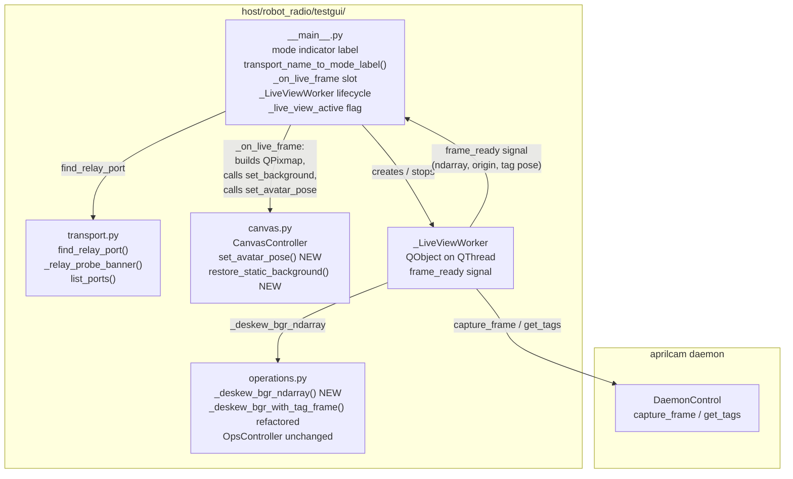
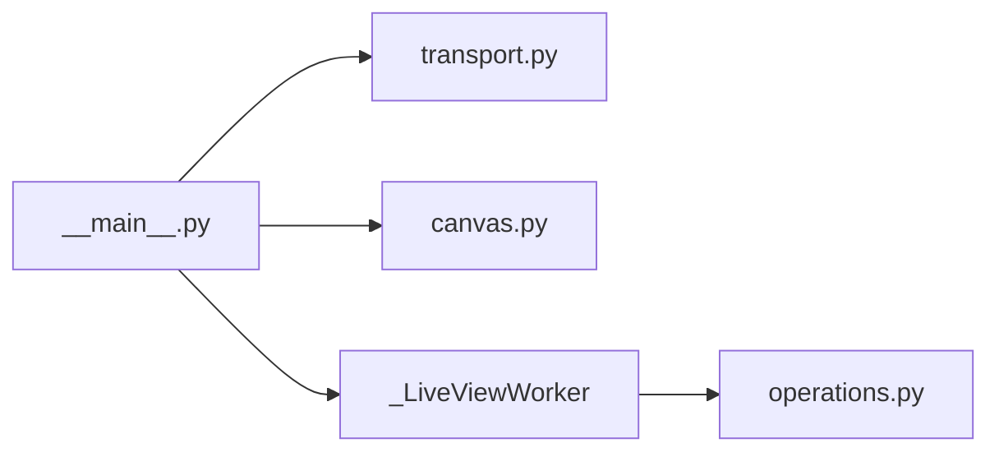
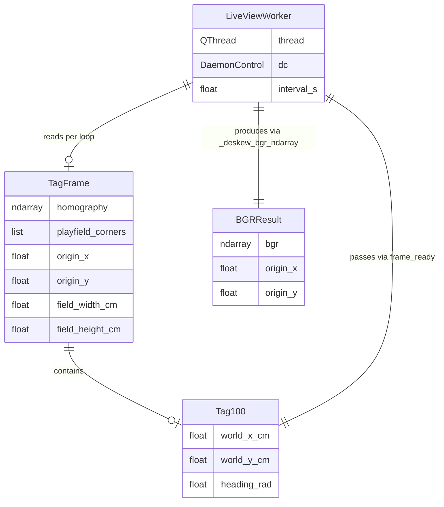
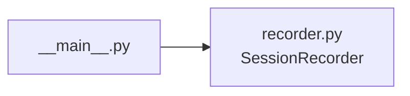
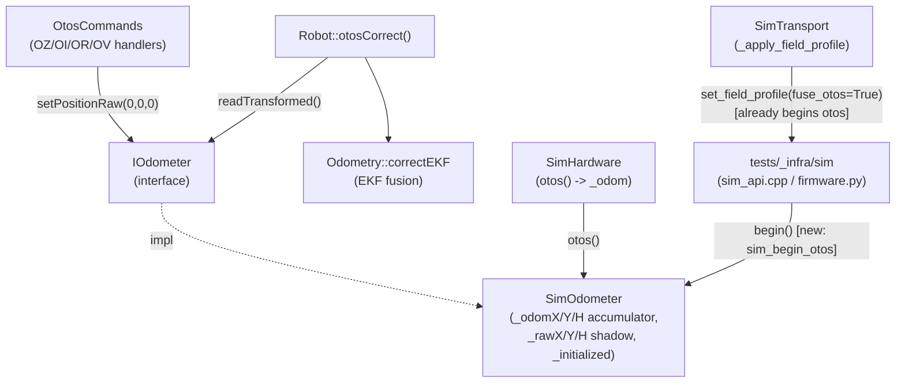

<!-- CLASI: Before changing code or making plans, review the SE process in CLAUDE.md -->

# Architecture Update — Sprint 063: Mode-driven Test GUI

## Sprint Changes Summary

Sprint 063 makes three targeted additions to the `testgui` package
(`host/robot_radio/testgui/`). No other host modules or firmware are affected.

1. **Mode indicator** — a `QLabel` near the top of the right panel displays
   the current operating mode (SIM MODE / BENCH MODE / PLAYFIELD MODE) derived
   from the transport combo selection. A pure function
   `transport_name_to_mode_label()` encodes the mapping.

2. **Live-view worker** — `_LiveViewWorker` is a `QObject` moved to a
   `QThread` that loops at ~10–15 Hz, calls the aprilcam daemon to capture and
   deskew a frame off the Qt main thread, and emits a `frame_ready` signal
   carrying a BGR ndarray, origin coords, and tag-100 pose. The main thread
   builds the `QPixmap` on receipt, calls `canvas_ctrl.set_background()`, and
   calls the new `canvas_ctrl.set_avatar_pose()`. The existing deskew logic in
   `operations.py` is refactored into a Qt-free `_deskew_bgr_ndarray()` helper.
   `CanvasController` gains `set_avatar_pose()` and `restore_static_background()`.

3. **Relay auto-discovery** — a pure function `find_relay_port(port_list,
   probe_fn)` in `transport.py` probes each serial port candidate for the
   `RADIOBRIDGE` banner and returns the matching port. `_on_connect()` in
   `__main__.py` invokes this when Relay is selected, replacing the manual
   `port_edit` read.

---

## What Changed

### New pure helpers

**`transport_name_to_mode_label(name: str) -> tuple[str, str]`** in `__main__.py`
Maps a transport combo display name to `(label_text, css_color)`.
- `"Sim"` → `("SIM MODE", "#808080")`
- `"Serial"` → `("BENCH MODE", "#4080ff")`
- `"Relay"` → `("PLAYFIELD MODE", "#20c020")`

**`find_relay_port(port_list: list[str], probe_fn: Callable) -> str | None`** in `transport.py`
Iterates `port_list`, calls `probe_fn(port) -> str | None` for each, and returns
the first port whose banner contains `"RADIOBRIDGE"`. Returns `None` if no match.

**`_relay_probe_banner(port: str) -> str | None`** in `transport.py`
Opens the port with DTR asserted (matching the relay's reset/announce protocol
described in `.clasi/knowledge/`), reads up to ~1 s for the `DEVICE:` banner
line, returns it or `None` on timeout/error. Closes the port before returning.

**`_deskew_bgr_ndarray(raw_bgr, tag_frame, ppc) -> tuple[ndarray, float, float] | None`**
in `operations.py`
Extracted from the body of `_deskew_bgr_with_tag_frame()`. Returns
`(deskewed_bgr, origin_x, origin_y)` with no Qt dependency. The existing
function delegates to this helper then calls `_bgr_ndarray_to_pixmap()`.

### New class

**`_LiveViewWorker(QObject)`** in `testgui/__main__.py` (or `testgui/live_view.py`)
- Signals: `frame_ready(object, float, float, float, float, float)` carrying
  `(bgr_ndarray, origin_x, origin_y, tag_x_cm, tag_y_cm, tag_yaw_rad)`.
- Slots: `run()` — the main loop; `stop()` — signals the loop to exit.
- Moved to a `QThread` by `__main__.py` after construction.
- Loop body: connect daemon, `capture_frame()`, `get_tags()` (including tag 100
  pose), call `_deskew_bgr_ndarray()`, emit `frame_ready`. Sleep to target
  ~10–15 Hz. On daemon unavailability: log once, backoff, retry.
- No QPixmap, no `QGraphicsScene` calls — all Qt canvas work is in the slot.

### New `CanvasController` methods

**`set_avatar_pose(x_cm: float, y_cm: float, yaw_rad: float) -> None`**
Positions and rotates the marker at explicit world coordinates. Does not consult
`trace_model`. Rotation formula: `rotation_deg = 90.0 - degrees(yaw_rad)`.

**`restore_static_background() -> None`**
Replaces the canvas pixmap with a grey placeholder (via `_make_grey_placeholder`)
and resets the origin to the field-centre fallback. Calls `refresh()` to
re-render traces and marker using `trace_model.fused`.

### Modified wiring in `__main__.py`

- Mode indicator `QLabel` added at top of right panel; updated in
  `_on_transport_changed()`.
- `_on_connect()` for Relay: calls `find_relay_port(list_ports(),
  _relay_probe_banner)` before constructing `RelayTransport`. On success,
  populates `port_edit` with the discovered port for visibility. On failure,
  logs "[WARN] No relay found" and returns.
- `_on_connect()` for Relay: after transport.connect(), creates
  `_LiveViewWorker`, moves it to a `QThread`, connects `frame_ready` to a
  main-thread slot `_on_live_frame`, and starts the thread.
- `_on_disconnect()`: if `_live_view_active` flag is set, calls
  `worker.stop()`, `thread.quit()`, `thread.wait()`, then
  `canvas_ctrl.restore_static_background()`.
- `_on_live_frame(bgr, ox, oy, tx, ty, tyaw)` slot: builds `QPixmap` via
  `_bgr_ndarray_to_pixmap(bgr)`, calls `canvas_ctrl.set_background(pm, ox, oy)`,
  calls `canvas_ctrl.set_avatar_pose(tx, ty, tyaw)`.
- In PLAYFIELD MODE, `on_truth_ready` telemetry bridge slot does NOT call
  `canvas_ctrl.refresh(fused_yaw)` for the avatar (live view owns the avatar);
  it still feeds `trace_model.feed_truth()` for the green camera trace line.

---

## Module Diagrams

### Component Diagram — sprint 063 additions to testgui

### Dependency Graph — new arrows only

No cycles. `CanvasController` has no new dependencies. The worker depends on
`OPS` (for `_deskew_bgr_ndarray`) and the daemon (external). Dependency
direction: `__main__` → worker → ops. `TRANSPORT` and `CANVAS` remain leaves.

### Entity-Relationship Diagram — live-view data flow

---

## Why

The Test GUI lacked situational awareness for playfield runs: no mode label,
no live camera, and no relay discovery forced the user to remember context
that the software should provide. These three features improve operational
clarity without changing any existing behavior in Sim/Serial modes.

The implementation reuses established patterns (the `_TelemetryBridge`
signal/slot pattern, the existing deskew code, `list_ports()`) to minimize
new surface area and keep the changes well within the existing architecture.

---

## Impact on Existing Components

| Component | Impact |
|-----------|--------|
| `testgui/__main__.py` | **Modified.** Adds mode label, `_LiveViewWorker` lifecycle, relay discovery call, `_on_live_frame` slot, `_live_view_active` flag. No existing wiring removed. |
| `testgui/transport.py` | **Modified.** Adds `find_relay_port()` and `_relay_probe_banner()`. All existing public API unchanged. |
| `testgui/operations.py` | **Modified.** Extracts `_deskew_bgr_ndarray()` from `_deskew_bgr_with_tag_frame()`. Existing function behavior is unchanged. `OpsController` public API unchanged. |
| `testgui/canvas.py` | **Modified.** Adds `set_avatar_pose()` and `restore_static_background()` to `CanvasController`. All existing methods unchanged. |
| `testgui/commands.py`, `drive.py`, `traces.py` | **Unaffected.** |
| `tests/testgui/` | **Extended.** New test cases added. Existing tests unchanged. |
| All `host/robot_radio/` modules outside `testgui/` | **Unaffected.** |
| Firmware (`source/`) | **Unaffected.** |

---

## Migration Concerns

**Relay connect flow.** The existing code path `RelayTransport(port_edit.text())`
is replaced by `find_relay_port(...) → RelayTransport(discovered_port)`. The
programmer should populate `port_edit` with the discovered port for user
visibility, so the flow remains inspectable.

**`_deskew_bgr_with_tag_frame()` refactor.** Splitting this function into a
Qt-free `_deskew_bgr_ndarray()` helper and the QPixmap wrapper is a pure
internal refactor. The existing caller (`_capture_playfield_frame_and_calib`)
remains unchanged in behavior. Tests that mock `_deskew_bgr_with_tag_frame`
do not need to change.

**Thread lifetime.** `_LiveViewWorker` must be fully stopped before
`_on_disconnect()` returns. The sequence is: `worker.stop()` →
`thread.quit()` → `thread.wait(timeout=3s)`. The `QThread` and worker
references should be set to `None` afterward.

**`on_truth_ready` in PLAYFIELD MODE.** When `_live_view_active` is `True`,
the `on_truth_ready` slot should still call `trace_model.feed_truth()` to
populate the green camera trace, but should NOT call
`canvas_ctrl.refresh(fused_yaw)` (which would move the avatar to a telemetry
position). The programmer should gate this with the `_live_view_active` flag.

---

## Design Rationale

### Decision 1: BGR ndarray emitted across thread boundary (not QPixmap)

**Context:** `QPixmap` may only be constructed on the Qt main thread.

**Alternatives:**
- Build `QImage` off-thread (safe since Qt 5.14); more complex lifetime.
- Build `QPixmap` off-thread (unsafe per Qt docs).
- Emit BGR ndarray, build `QPixmap` in the main-thread slot (chosen).

**Why:** The ndarray approach is the safest and most consistent with the
existing `_TelemetryBridge` pattern (which emits primitive types).
`_bgr_ndarray_to_pixmap()` is already in `operations.py` and is called
on the main thread.

**Consequences:** One extra call in the main-thread slot. The slot must not
block; numpy-to-QPixmap conversion is fast (<5 ms for a ~1000×700 image).

### Decision 2: `find_relay_port()` takes an injectable `probe_fn`

**Context:** Serial port probing is hardware I/O; unit tests cannot open
real ports.

**Why:** An injectable `probe_fn(port) -> str | None` makes the selection
logic pure and testable. The real probe (`_relay_probe_banner`) is the only
function with hardware I/O. Tests inject a lambda.

**Consequences:** Two functions to maintain. `_relay_probe_banner` must handle
timeouts gracefully; a well-behaved device that responds slowly should not
block discovery for more than ~1 s per port.

### Decision 3: Avatar routing stays in `__main__.py`, not in `CanvasController`

**Context:** In PLAYFIELD MODE the avatar follows the camera tag; in other
modes it follows fused telemetry. The canvas should not need to know about modes.

**Why:** `CanvasController` exposes atomic primitives (`set_avatar_pose`,
`refresh`, `restore_static_background`). The main window, which already owns
the transport and mode state, decides which primitive to call. This keeps
`CanvasController` cohesive (one concern: render the canvas) and testable
without mode logic.

**Consequences:** `__main__.py` holds a `_live_view_active` bool. The
`on_truth_ready` slot must check this flag before updating the avatar. This
is a single guard in one function.

### Decision 4: `RelayTransport.__init__` is unchanged

**Context:** Discovery is a pre-connect concern.

**Why:** `RelayTransport(port)` stays simple. `_on_connect()` discovers the
port first, then constructs `RelayTransport(discovered_port)`. No new
constructor overloads or optional discovery behavior inside `RelayTransport`.

**Consequences:** `RelayTransport` is untouched. Discovery is entirely in the
two new functions in `transport.py` and the updated `_on_connect()`.

---

---

## Addendum — Tickets 004 and 005

*Added when tickets 004–005 were appended to the sprint (2026-07-01).*

### Ticket 004: Full pose reset in `_set_origin()`

`_set_origin()` in `__main__.py` is extended to send two wire commands before
the existing display reset:

1. `transport.command("ZERO enc")` — resets encoder counters.
2. `transport.command(build_setpose_command(0.0, 0.0, 0.0))` — sends `SI 0 0 0`
   to set firmware pose to (0 mm, 0 mm, 0 centidegrees).

No new modules, classes, or public APIs are introduced. The change is entirely
inside the existing closure. Connection gating is a single `if transport is not
None:` guard; the display reset runs regardless.

**Component impact**: `__main__.py` only. `operations.build_setpose_command` is
already imported. `OpsController.on_zero_encoders` is NOT called (it carries
additional UI state logic); the command is sent directly on the transport.

### Ticket 005: `SessionRecorder` and Record/Pause/Stop UI

A new module `testgui/recorder.py` provides `SessionRecorder` — a Qt-free
state machine with three states (`idle`, `recording`, `paused`). It appends
JSONL entries to an open file and is the only component with file-system access
for recording.

`__main__.py` is extended with:
- Three `QPushButton` widgets (`record_btn`, `pause_btn`, `stop_btn`) in a
  horizontal layout in the left panel.
- A `SessionRecorder` instance scoped to `_build_main_window()`.
- Extension of `_append_log(line, direction=None)` — adds an optional
  `direction` parameter; when `"TX"` or `"RX"`, routes to
  `recorder.append(direction, line)`.

**Tap architecture**: the tap is at `_append_log`, not inside any transport
class. This means the recorder captures exactly what the log pane displays,
independent of transport type, without modifying any transport interface.

**Dependency**: `recorder.py` has no dependencies outside the Python standard
library (`json`, `time`, `datetime`, `pathlib`). No Qt, no aprilcam, no
robot_radio imports.

**Dependency graph addition** (no cycles):

`recorder.py` is a leaf module. All existing arrows are unchanged.

---

## Addendum — Ticket 006: Functional simulated OTOS for EKF fusion and heading-reset testing

*Added when ticket 006 was appended to the sprint (2026-07-01), from issue
`sim-otos-device-for-kalman-and-heading-reset.md`.*

### Investigation summary (corrects the issue's initial diagnosis)

The issue text speculated that `OtosCtx.otos` is unwired in the sim/host build.
Investigation (reading `Robot.cpp` construction order and empirically probing
`libfirmware_host.dylib` via `tests/_infra/sim/firmware.py`) found this is **not**
the root cause — `Robot::Robot()` already calls
`_otosCommands.setCtx(&otos, &state.actual)` unconditionally
(`source/robot/Robot.cpp:130`), and `otos` is `hal.otos()`, which in
`SimHardware` (`source/hal/sim/SimHardware.h:44`) returns the same `SimOdometer&`
instance (`_odom`) used everywhere else (`Drive`, `otosCorrect`). The command
context is correctly wired in both builds.

The real root causes are two independent, narrower gaps:

1. **`SimOdometer` is never `begin()`-initialised outside test-only hooks.**
   `Sensor::is_initialized()` gates every OTOS command handler
   (`otosReady()` in `OtosCommands.cpp`) and `Robot::otosCorrect()`
   (`activeOtos.is_initialized()` guard, `Robot.cpp:179`). `SimOdometer::begin()`
   is currently called from exactly one place: the test-only C ABI function
   `sim_set_otos_fusion()` (`tests/_infra/sim/sim_api.cpp:578-581`), which is
   reached from Python only via `Sim.set_otos_fusion()` /
   `Sim.set_field_profile(fuse_otos=True)`. `SimTransport._apply_field_profile()`
   (`host/robot_radio/testgui/transport.py`) already calls
   `sim.set_field_profile(fuse_otos=True)` on every Sim-mode connect, so the Test
   GUI's Sim mode *does* already flip `_initialized = true` — confirmed empirically:
   `OZ`/`OI`/`OR`/`OV` all return `OK` once `set_field_profile(fuse_otos=True)` has
   run, and `ERR nodev` before it. Any other sim/host entry point that doesn't call
   this (e.g. a bare `tests/simulation` fixture that talks to the command surface
   without going through `set_field_profile`) still sees `nodev`. This is a
   sequencing/initialization gap, not a missing-wire gap.

2. **`OZ`/`OV` (`setPositionRaw`) do not reset the accumulator the EKF actually
   reads — this is the real heading-reset gap, confirmed empirically.**
   `SimOdometer::readTransformed()` returns `{_odomX, _odomY, _odomH}` when
   `_useSimModel` is on (the path enabled by `enableSimModel(true)`, which
   `set_field_profile`/`set_otos_fusion` also turns on). `setPositionRaw()`
   (`SimOdometer.cpp:54-59`, invoked by `OZ`/`OV`) only writes `_rawX/_rawY/_rawH`
   — the raw-register shadow copy used by `getPositionRaw()`/`OP`'s underlying
   registers — and never touches `_odomX/_odomY/_odomH`. Only
   `setInjectedPose()` (used exclusively by `sim_set_otos_pose`, a different
   test-only hook, not reachable from any command) resets the accumulator.
   Empirical probe (turn robot to h=0.1245 rad, stop, call `OZ`, re-read
   `sim.get_otos_pose()`): the accumulator is **unchanged** by `OZ`. Consequently
   today, in sim, `OZ` is a no-op on the value the EKF fuses, and `SI 0 0 0`
   (`Odometry::setPose`) does not visibly "drift back" either — because there is
   nothing pulling it back toward a *different* reference; the OTOS accumulator
   just keeps reporting the same absolute heading it always would, `SI` doesn't
   change it, and `correctEKF` re-applies it every tick regardless of `SI`. The
   sim therefore fails to reproduce the hardware bug in **both** directions:
   `OZ` doesn't fix anything (it's a no-op) and `SI`-alone's drift-back is not
   currently demonstrable because there's no re-referencing step to compare
   against.

Both gaps are independent of the standalone `BenchOtosSensor`
(`sim_bench_otos_*` / `DBG OTOS BENCH`), which remains a separate model used
only by that debug command and is out of scope here — confirmed by grep: no
call site connects `BenchOtosSensor` to `Robot::otosCorrect()` or the EKF.

### Responsibility change

**Module: `SimOdometer` (sim OTOS observation model)**
Purpose: model the OTOS as an independent absolute-heading sensor that a
command/fusion caller can zero, read, and re-tick, matching the real
`OtosSensor`'s contract as closely as a kinematic model allows.
Boundary: inside — `_odomX/Y/H` accumulator, error/noise model, raw-register
shadow, `_initialized` gate. Outside — the plant truth it reads from
(`PhysicsWorld`, via `tick()`'s velocity args, already supplied by
`SimHardware`), the EKF it feeds (`Odometry`/`PhysicalStateEstimate`, already
decoupled via `IOdometer`).
Use cases served: SUC-005 (pose reset), SUC-007 (new, sim OTOS testability).

No new module is introduced. This is a targeted change to `SimOdometer`'s
`setPositionRaw()` plus an initialization-sequencing fix so `begin()` happens
on every sim/host path that exercises the OTOS command surface, not only the
`set_field_profile` test fixture path.

### What changes

1. **`SimOdometer::setPositionRaw(x, y, h)`** (`source/hal/sim/SimOdometer.cpp`)
   is extended to also re-reference the accumulator: after writing the raw
   shadow registers, set `_odomX = x; _odomY = y; _odomH = h;` (same values,
   converted from the raw int16 LSB units `setPositionRaw` already receives —
   `OZ` calls it with `(0,0,0)`, so no unit-conversion subtlety for the zero
   case; `OV`'s non-zero case reuses the existing raw→float conversion
   `getPositionRaw`/`setPositionRaw` already define for the real `OtosSensor`,
   so `SimOdometer` must apply the identical LSB scale before writing
   `_odomX/Y/H`). This makes `OZ`/`OV` re-reference the accumulator exactly as
   the real OTOS's `setPositionRaw` re-references the chip's internal tracker —
   closing gap 2. `resetTracking()` (`OR`) and `init()` (`OI`) remain no-ops
   (documented open question below — a kinematic model has no Kalman filter of
   its own to reset).

2. **Initialization sequencing**: `SimOdometer::begin()` must be called
   wherever a sim/host build brings up the OTOS command surface for real use,
   not only inside the test-only `sim_set_otos_fusion()` shim. Two call sites
   need it:
   - `SimTransport` (`host/robot_radio/testgui/transport.py`): already calls
     `sim.set_field_profile(fuse_otos=True)` on connect, which already begins
     the sim OTOS — **no change needed here**, confirmed empirically. This
     addendum documents that this call is now load-bearing for ticket-006
     acceptance, not just for the noise/slip profile.
   - `tests/_infra/sim/firmware.py` / `sim_api.cpp`: add a dedicated,
     narrowly-named hook (e.g. `sim_begin_otos(h)` wrapping
     `hal.simOdometer().begin()`, mirroring the existing
     `drive_api_begin_otos()` pattern in `drive_api.cpp:232-235`) so
     `tests/simulation` tests can bring up the OTOS command surface
     (`OZ`/`OI`/`OR`/`OV`) WITHOUT also pulling in the full noise/slip
     side-effects of `set_field_profile()`. This keeps "OTOS is ready" and
     "field-realistic error injection" as separately controllable test
     fixtures, matching the existing separation between
     `sim_enable_otos_model()` (accumulator on) and `sim_set_otos_fusion()`
     (fusion + `begin()`).

3. **No change to `Robot.cpp`, `OtosCommands.cpp`, `Odometry.cpp`, or
   `SimHardware.h`.** The command-context wiring and the EKF fusion path are
   already correct; this ticket only fixes the sim OTOS's own state machine
   and where it gets initialized.

### Diagrams

No new nodes and no new dependency edges beyond one new harness-only entry
point (`sim_begin_otos`); the command/fusion dependency direction is
unchanged. No ERD changes (no data-model change — same `Pose2D`/`BodyTwist`
value types).

### Impact on existing components

- `SimOdometer`: behavior-preserving for every existing caller of
  `setPositionRaw()` that does NOT rely on the accumulator staying stale after
  a raw-register write — grep confirms the only callers are `OZ`/`OV`
  handlers and tests that assert `getPositionRaw()` (raw shadow, unaffected)
  or exercise `OZ` end-to-end (which currently asserts nothing about the
  accumulator, since it was previously a no-op there).
- `Drive::tickUpdate`'s `_otosEverReady`/lag-gate logic is unaffected — it
  gates on `is_initialized()` and `now - _lastOtosMs`, neither of which this
  ticket touches.
- Test GUI: no code change required in `transport.py`; `_apply_field_profile`
  already does the right thing. This ticket's fix in `SimOdometer` makes that
  existing call path behave correctly end-to-end for "Set Robot @ 0,0."

### Migration concerns

- **Golden-TLM / behavior-preservation risk**: `SimOdometer`'s header
  explicitly promises bit-identical behavior against the retired
  `MockOtosSensor` for `tests/simulation/unit/test_golden_tlm.py`. The
  `setPositionRaw` change only fires on `OZ`/`OV` calls. Confirmed by reading
  `test_golden_tlm.py`'s fixed command sequence (`SET sTimeout=...`,
  `STREAM 50`, `T 100 100 10000`, `X`) — it contains **no** `OZ`/`OV`/`OI`/`OR`
  calls, so the golden capture is unaffected by this ticket. Still run
  `test_golden_tlm.py` after implementation to confirm.
- **`test_ekf_dual_source.py` / `test_dbg_otos_commands.py` / `test_ekf.py`**:
  these exercise `enable_otos_model()`/`begin_otos()`/OTOS fusion directly;
  none currently call `OZ`/`OV` through the command surface (confirmed by
  grep — they use `sim_set_otos_pose`/`drive_api` hooks instead), so they are
  expected to be unaffected, but must be run to confirm.
  `test_dbg_otos_commands.py` tests the **bench** OTOS (`DBG OTOS BENCH`), a
  different model — out of scope, unaffected by construction.
  `sim_bench_otos_reset` and `sim_get_bench_otos_*` are also untouched.
- **Sequencing**: implement the `SimOdometer::setPositionRaw` fix first
  (independently testable), then the `sim_begin_otos` harness hook, then the
  `tests/simulation` regression test. No firmware behavior on real hardware
  changes (the real `OtosSensor`'s `setPositionRaw` already re-references the
  physical chip's tracker; this ticket only brings the sim model in line).

### Design rationale

**Decision: fix `SimOdometer::setPositionRaw`, not add a new sim OTOS class.**
- Context: the issue's suggested framing ("wire OtosCtx.otos to sim") implied
  a missing-integration problem; investigation found the integration already
  correct and the bug narrower (a stale accumulator).
- Alternatives considered: (a) build a new "independent absolute-heading sim
  OTOS" class replacing `SimOdometer`'s injected/accumulated dual-mode design;
  (b) patch `setPositionRaw` in place.
- Why this choice: `SimOdometer` already has the required shape — an
  accumulator with a `_useSimModel` toggle, a raw-register shadow, and error
  injection. The bug is a single missing line (accumulator not reset by
  `setPositionRaw`). Introducing a new class would duplicate the
  behavior-preservation guarantees `SimOdometer` already carries for
  golden-TLM and risk exactly the regression this ticket must avoid.
- Consequences: the fix is minimal and localized, but the two-mode design
  (`_injectedX/Y/H` vs `_odomX/Y/H`, only one active depending on
  `_useSimModel`) remains slightly confusing — `setPositionRaw` after this
  change writes to `_rawX/Y/H` AND `_odomX/Y/H`, but NOT `_injectedX/Y/H`
  (matching `setInjectedPose`'s asymmetric behavior, which resets only its own
  channel). This asymmetry is called out as an open question below.

**Decision: separate `sim_begin_otos()` harness hook rather than requiring
`tests/simulation` tests to call `set_field_profile()`.**
- Context: `set_field_profile()` bundles OTOS-begin with turn-slip injection
  and OTOS noise — side effects a test asserting exact heading-reset behavior
  does not want.
- Alternatives considered: (a) reuse `set_field_profile(fuse_otos=True)` in
  the new regression test; (b) add a narrow `sim_begin_otos()`/`begin_otos()`
  hook mirroring `drive_api_begin_otos()`.
- Why this choice: (b) keeps the regression test's error model at zero
  (deterministic assertions on exact heading values) while still exercising
  the real `is_initialized()` gate — consistent with the existing
  `drive_api_begin_otos()` precedent for the same reason.
- Consequences: one new tiny C ABI function + Python binding; no behavior
  change to any existing hook.

### Open questions

1. Should `OI` (`init()`) or `OR` (`resetTracking()`) do anything in
   `SimOdometer` beyond remaining no-ops, now that `OZ`/`OV` have real effects?
   On real hardware `OI` re-runs signal processing + Kalman reset and `OR`
   resets the chip's internal Kalman tracking — neither has a kinematic
   equivalent in a model with no internal filter. Recommend: leave both as
   no-ops (matches today) but return `OK` (not `nodev`) once `begin()` has
   run, which ticket 006's acceptance criteria already require. Flagging for
   stakeholder confirmation that "no-op but OK" is acceptable for `OI`/`OR` in
   sim, versus needing a documented simulated effect.
2. `setPositionRaw`'s raw-LSB scale factor must match whatever
   `getPositionRaw`/the real `OtosSensor` use for OTOS registers — needs a
   quick confirmation read of the real `OtosSensor::setPositionRaw` /
   `getPositionRaw` conversion during implementation so `OZ 0 0 0` (the only
   value it's called with today) and `OV x y h` (arbitrary values) convert
   consistently. `OZ` uses `(0,0,0)`, which is scale-invariant, so this only
   matters for `OV`'s non-zero case and for future ticket work, not for the
   heading-reset acceptance criteria in this ticket.

---

## Resolved Decisions (formerly Open Questions)

The following were open questions at architecture-review time. All three have
been answered by the stakeholder and are now firm requirements.

1. **Port edit UX after discovery — DECIDED: populate `port_edit`.**
   On successful auto-discovery, `_on_connect()` must set
   `port_edit.setText(discovered_port)` before constructing `RelayTransport`.
   Both the field update and the "[INFO] Relay found on ..." log entry are
   required; the log alone is not sufficient. See ticket 063-002 AC.

2. **`_LiveViewWorker` location — DECIDED: new module `testgui/live_view.py`.**
   The worker class and its `build_live_view_worker()` factory live in
   `host/robot_radio/testgui/live_view.py`, not inline in `__main__.py`.
   This keeps the class importable in headless tests without triggering the
   full window-building code in `__main__`. See ticket 063-003 file list.

3. **Avatar when tag 100 not visible — DECIDED: hold last known pose.**
   When tag 100 is absent from `get_tags()`, the worker emits `frame_ready`
   with the last known `(tag_x, tag_y, tag_yaw)`. The avatar stays at its
   last camera position; it does NOT snap to (0, 0) and is NOT hidden.
   `_last_tag` is initialized to `(0.0, 0.0, 0.0)` and updated only when
   tag 100 is successfully read. See ticket 063-003 AC and test
   `test_live_view_worker_holds_last_tag_when_tag_missing`.
