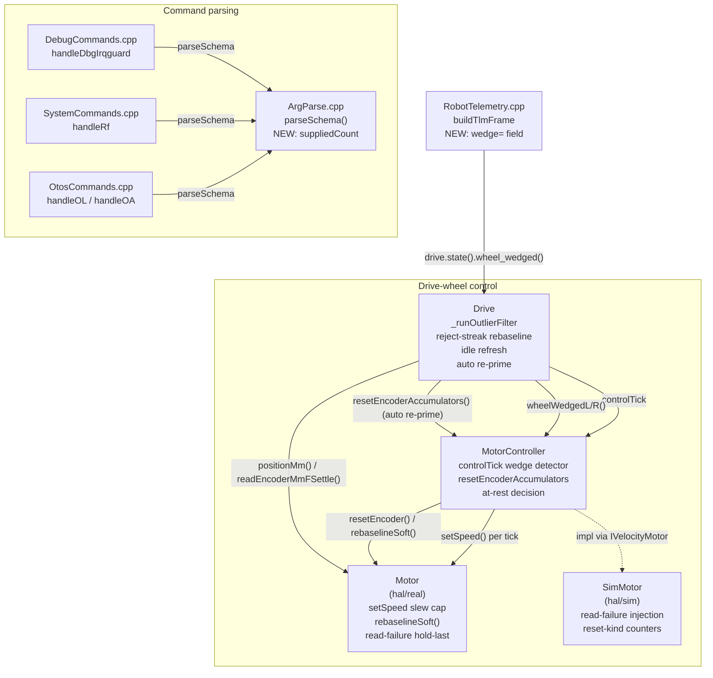

<!-- CLASI: Before changing code or making plans, review the SE process in CLAUDE.md -->

# Architecture Update -- Sprint 064: Encoder pipeline hardening: wedge triggers, IRQGUARD query bug, read-failure and outlier-filter recovery

## Sprint Changes Summary

Six independent, narrowly-scoped fixes to the encoder pipeline, all inside
already-existing modules (`Motor`, `MotorController`, `Drive`, `DebugCommands`
/`ArgParse`, `RobotTelemetry`, `SystemCommands`/`OtosCommands`). No new
subsystem is introduced. No message-contract (`msg::*`) shapes change except
one additive TLM field. Ordered by the ticket sequence (see `sprint.md`):

1. **ArgSchema query-safe fix** — `parseSchema()` gains a way to tell
   "token omitted" from "token supplied, defaulted value happens to match."
   Fixes `DBG IRQGUARD` and three previously-undetected siblings (`RF`,
   `OL`, `OA`).
2. **`Motor::setSpeed` ΔPWM slew cap** — bounds the magnitude of any single
   0x60 write, closing the full-speed-reversal wedge trigger.
3. **Reset-while-moving software rebaseline** — `MotorController::
   resetEncoderAccumulators()` chooses a software-only rebaseline instead of
   the hardware atomic-read burst whenever the drivetrain is not at rest.
4. **Wedge detector blind-spot removal + TLM field + auto re-prime** — the
   per-wheel stuck-counter no longer resets on target==0 or waits for an
   arming grace; `wedge=` is added to TLM; an idle-at-rest wedge triggers one
   automatic re-prime attempt.
5. **Encoder read-failure hold-last-value** — `Motor`'s encoder read paths
   check I2C return codes and hold the last known-good value on failure,
   matching the existing `readSpeedRaw()` pattern; `SimMotor` gains a
   parallel fault-injection model so the consuming pipeline (outlier filter,
   EKF) is testable in the sim tier.
6. **Outlier-filter reject-streak rebaseline + idle refresh** —
   `Drive::_runOutlierFilter` consumes the already-declared
   `kFilterRejectStreakThreshold` to escape a permanent freeze, and
   refreshes its baseline unconditionally while idle.

---

## Step 1-2: Problem and Responsibility Groups

The mechanism evidence
(`docs/knowledge/2026-07-01-encoder-wedge-boundary-latch-flavor.md`) isolated
two independent physical triggers for the Nezha encoder-readback latch (full
-speed PWM reversal transients, and atomic encoder resets fired while wheels
rotate), plus three code defects that hide or worsen the consequences: the
`DBG IRQGUARD` query-mutates-state ArgSchema bug (which itself compromised
the stand session's own A/B baselines), the wedge detector's two structural
blind spots, and the encoder-read/outlier-filter pair's total lack of
failure recovery (CR-02/CR-03).

Five distinct responsibilities are touched, each changing for its own
reason and owned by its own existing module — no new module is warranted:

| Responsibility | Owning module | Why it changes |
|---|---|---|
| Distinguish "argument omitted" from "argument defaulted" in the declarative command parser | `ArgParse.{h,cpp}` / `ArgSchema.h` (types layer) | `parseSchema()`'s positional path always fills every declared slot, so `args.count` cannot signal omission — a parser-layer defect, not a per-command one. |
| Bound the physical violence of a single motor-PWM write | `Motor` (`source/hal/real/Motor.{h,cpp}`) | `setSpeed()` is the sole writer of the 0x60 register; the reversal-transient trigger lives entirely inside its write-immediate-on-reversal path. |
| Decide hardware-atomic-reset vs. software-only rebaseline | `MotorController` (`resetEncoderAccumulators`) + `Motor` (new `rebaselineSoft()`) | `MotorController` already owns the per-wheel velocity/position bookkeeping and is the single call path shared by every current and future caller of a "reset the encoder baseline" operation. |
| See every wedge episode and report it | `MotorController` (wedge detector inside `controlTick`) + `RobotTelemetry` (`buildTlmFrame`) | The detector's state machine and the wire format are two different concerns (detection vs. reporting) already split across these two files today. |
| Survive a failed I2C transaction without fabricating position | `Motor` (read paths) | Same module that already has the correct pattern in `readSpeedRaw()`. |
| Recover from a stale or wildly-diverged encoder baseline | `Drive::_runOutlierFilter` | The filter already declares (but does not use) the reject-streak fields; this closes existing dead code, in the module that owns the filter. |

No responsibility spans more than one natural module boundary; no new
subsystem, message type, or cross-cutting service is needed. This sprint is
therefore six point-fixes inside existing cohesive modules, not a
redesign.

---

## Step 3: Module Diagram

No cycles. `ArgParse` and `Motor`/`SimMotor` remain leaves (no outward
dependencies). Dependency direction is unchanged from the existing
architecture: command handlers → parser; `Drive` → `MotorController` →
`Motor`/`SimMotor`; `RobotTelemetry` → `Drive`. No module's fan-out grows
past its current count.

No entity-relationship diagram: no persisted data model changes (TLM gains
one wire field, not a new entity; `ArgList` gains one scalar field, not a
new relationship).

---

## Step 4-5: What Changed, module by module

### 1. ArgSchema query-safe fix (`source/types/ArgSchema.h`, `source/commands/ArgParse.{h,cpp}`, `DebugCommands.cpp`, `SystemCommands.cpp`, `OtosCommands.cpp`)

**Root cause, confirmed by reading `parseSchema()`'s positional branch**
(`ArgParse.cpp:60-96`): for a non-variadic schema the loop
`for (int i = 0; i < schema.ndefs; ++i)` always appends one `Argument` per
declared def, using `atoi(nullptr) == 0` / `atof(nullptr) == 0.0f` / `""`
when `i >= ntokens`. `res.args.count` is therefore **always `== ndefs`**,
independent of how many tokens were actually supplied. Any handler that
tests `args.count >= 1` to decide "was an optional arg given" is checking a
value that can never be less than `ndefs` — the check is dead code.

**Audit result.** Grepping every `ArgSchema` instance in the codebase for
the shape `ndefs >= 1 && minTokens < ndefs && !variadic` (a schema with at
least one *optional* positional arg — the only shape where this defect can
bite) found exactly four matches, all in production command handlers:

| Command | Schema | Handler behavior on a bare query today |
|---|---|---|
| `DBG IRQGUARD` | `{dbgIrqguardDefs, 1, 0, false, nullptr}` | Silently disables the IRQ guard (the filed issue). |
| `RF` | `{rfDefs, 1, 0, false, nullptr}` | `args.count < 1` is unreachable dead code; falls through to `ch = 0`, which is in-range (`radiochan::kMin == 0`) — **silently retunes the radio to channel 0 and persists it to flash**, breaking the link. Worse than the IRQGUARD case. |
| `OL` | `{olDefs, 1, 0, false, nullptr}` | `args.count >= 1` is always true; silently zeros the OTOS linear calibration scalar. |
| `OA` | `{oaDefs, 1, 0, false, nullptr}` | Same as `OL`, for the angular calibration scalar. |

Every other `ArgSchema` in the codebase either has `minTokens == ndefs`
(all-or-nothing — `gSchema`, `rtSchema`, `ovSchema`, `siSchema`: a missing
token fails `minTokens` outright, so the handler never runs with a silently
-defaulted value) or is variadic (`args.count` there already equals the real
token count). The defect is fully and exactly characterized by this one
schema shape.

**Fix mechanism.** `ArgList` (`source/types/CommandTypes.h`) gains one new
field: `int suppliedCount;`. It stays a plain aggregate (no default member
initializer) so `ParseResult`'s C++11 unrestricted-union constraint — called
out explicitly in the existing header comments — is preserved.
`parseSchema()` sets it:
- Positional path: `suppliedCount = min(ntokens, schema.ndefs)` — token `i`
  was actually supplied iff `i < suppliedCount`.
- Variadic / no-arg path: `suppliedCount = count` (already equals the real
  token count; no behavior change).
- Every hand-rolled `ParseFn` (`parseDbgWedge`, `parseDbgOtosBench`,
  `parseI2cw`, `parseI2cr`) is updated to set `res.args.suppliedCount =
  res.args.count;` for consistency — those parsers already reflect presence
  correctly via `count`, so this is a documentation-equivalent no-op, not a
  behavior change, and it means `suppliedCount` is never left uninitialized
  on any path.

`handleDbgIrqguard`, `handleRf`, `handleOL`, `handleOA` change their single
guard line from `args.count >= 1` to `args.suppliedCount >= 1` (and `RF`'s
existing-but-dead `args.count < 1` query branch becomes reachable via
`args.suppliedCount < 1`). No other line in any of the four handlers
changes.

**Why not widen `Argument`'s per-slot info instead of adding a list-level
counter?** See Design Rationale below.

### 2. `Motor::setSpeed` ΔPWM slew cap (`source/hal/real/Motor.{h,cpp}`, new `source/hal/real/MotorSlew.h`)

**Mechanism.** `setSpeed()` already exempts a stop (`pct==0`) and a
direction reversal from its 40 ms write-rate throttle, writing either
*immediately*. For a reversal this write carries the **full** requested
swing (observed: −100 → +100, a 200-point step) in one 0x60 transaction
while 0x46 traffic may be in flight — arm 5 of the stand session's stress
matrix reproduced a persistent latch this way with **no** resets involved
and the IRQ guard **on**.

**Fix.** A small, dependency-free helper —
`int8_t MotorSlew::clampStep(int8_t lastWritten, int8_t target, uint8_t
maxDelta)` — returns `target` unchanged if `|target - lastWritten| <=
maxDelta`, otherwise returns `lastWritten` stepped by `maxDelta` toward
`target`. `Motor::setSpeed()` calls this for every write **except** the
`pct == 0` stop path (stop stays a full, immediate 0-write — the sprint's
explicit safety exemption). The reversal-exemption from the 40 ms *rate*
throttle is unchanged (a reversal is still written every tick, un-throttled)
— only the *magnitude* per write is now bounded. Because `_lastWrittenPct`
is updated to the *clamped* (not the requested) value, and the existing
write-on-change guard compares the caller's `pct` against
`_lastWrittenPct`, a large reversal now converges over several consecutive
`controlTick()` calls instead of one instant slam — each still I2C-cheap,
none carrying more than `maxDelta` of physical/electrical violence.

**Cap value.** `kMaxDeltaPwmPerWrite = 25` (of the ±100 PWM-percent range).
Justification from existing config defaults (`DefaultConfig.cpp`):
`aMax = 300 mm/s²`, `velKff = 0.15`, `controlPeriodMs` nominal 10 ms
(measured loop period up to ~24 ms per `MotorController`'s own dt-clamp
comment). A BVC-profiled ramp's per-tick velocity delta is `aMax * dt ≈
300 * 0.024 ≈ 7.2 mm/s`; converted through the feed-forward gain alone that
is `~1 PWM-percent/tick` — even generously multiplying for P/I contribution
under normal tracking error, profiled per-tick ΔPWM stays a single-digit
percentage, well under 25. A raw full ±100 reversal now takes ≥8 write
cycles to complete instead of 1. This constant is marked
`// BENCH-CONFIRM`-style in code (matching the project's existing
convention for values awaiting hardware confirmation, e.g.
`readSpeed()`'s `kUnitFactor`) — HITL slam-matrix validation (deferred,
per sprint scope) is the final confirmation.

**Testability (no hardware, no CODAL).** `source/hal/real/Motor.{h,cpp}`
is excluded from the `HOST_BUILD` sim library (`MicroBit.h` dependency;
confirmed via `tests/_infra/sim/CMakeLists.txt`'s explicit `hal/real/`
exclusion) — the real `Motor::setSpeed()` itself is not reachable from
`pytest`, a pre-existing, project-wide constraint on all of `hal/real/`,
not something this sprint introduces. `MotorSlew.h` is deliberately a
standalone header with **no** CODAL/MicroBit include, so it compiles into
`libfirmware_host` on its own. A new `sim_motor_clamp_slew(current, target,
maxDelta)` C-ABI hook (mirroring the existing `sim_parse_schema` pattern)
exercises the exact arithmetic the firmware runs. `SimMotor` is **not**
modified to add slewing — see Design Rationale (risk to the golden-TLM
canary and the many existing behavioral tests that assume instant PWM
application outweighs the benefit of a second, sim-only slew
implementation).

### 3. Reset-while-moving software rebaseline (`source/hal/capability/IVelocityMotor.h`, `Motor.{h,cpp}`, `SimMotor.{h,cpp}`, `MotorController.{h,cpp}`)

**Mechanism.** `Robot::resetEncoders()` → `MotorController::
resetEncoderAccumulators()` → `Motor::resetEncoder()` ×2 fires 3 atomic
0x46 reads + a readback-verify per wheel — 6+ atomic transactions — with no
regard for whether the wheels are currently rotating. `Robot::
distanceDrive()` is the primary trigger (`D`-preemption fires this while the
previous command's wheels are still spinning — arm 3 of the stress matrix:
13 transient latches / 10 cycles, persistent at ~80). A second, independent
call site was found during the audit: `Planner::beginDistance()`
(`PlannerBegin.cpp:261`) calls `_mc_ctrl.resetEncoderAccumulators()`
**directly**, before `Robot::distanceDrive()`'s own call — every `D`
command currently fires the full hardware burst *twice*. A third call site,
`SystemCommands.cpp`'s `handleZero` (`ZERO enc`), goes through `Robot::
resetEncoders()` and is covered by the same fix.

**Fix — single choke point, no call-site signature changes.**
`MotorController::resetEncoderAccumulators()` (unchanged signature) computes
an at-rest decision from state it already owns and now additionally tracks:
- Commanded component: `_cmds->tgtMms[0] == 0.0f && _cmds->tgtMms[1] ==
  0.0f` (via the existing `_cmds` pointer).
- Measured component: two new members, `_lastVelMmsL/R`, refreshed each
  `controlTick()` call from `inputs.velMms[]` *after* that tick's per-wheel
  ZOH velocity update runs (the same values the per-wheel PID reads
  immediately afterward) — no new coupling to `Drive`/`Robot`.
- At rest iff both components hold within a small epsilon
  (`kAtRestVelEpsilonMms`, default 5 mm/s).

When at rest: `_motorL.resetEncoder(); _motorR.resetEncoder();` — unchanged
hardware atomic re-prime. When not at rest: `_motorL.rebaselineSoft();
_motorR.rebaselineSoft();` — a new `IVelocityMotor` method.
`Motor::rebaselineSoft()` folds the already-tick-cached `_lastPositionMm`
(obtained by the normal per-tick 0x46 read, not a special burst) back into
raw tenths-of-degrees and adds it to `_encOffset`, **issuing no I2C
transaction**, then zeros the cache exactly as `resetEncoder()`'s success
path already does — keeping `Motor`'s own `positionMm()` in lockstep with
the host-side baselines that `Robot::resetEncoders()`/`Drive::
resetEncoders()` zero unconditionally afterward (mismatch here would look
like a fresh outlier-filter freeze, so this lockstep property is load
-bearing, not cosmetic).

Because the decision lives inside `resetEncoderAccumulators()` itself, all
three current call sites (`Robot::distanceDrive`, `SystemCommands::
handleZero`, `Planner::beginDistance`) — and any future caller — get the
safe behavior automatically, with zero signature changes anywhere in the
call chain.

**`SimMotor` mirror + testability.** `SimMotor::rebaselineSoft()` performs
the same effect `resetEncoder()` already does in sim (zero the reported
accumulator) — sim has no I2C timing race to avoid, so the two paths are
behaviorally identical there. What *is* testable end-to-end is the
**decision**: both `Motor` and `SimMotor` gain `hardResetCount()` /
`softResetCount()` accessors (default-returning-zero on the `IVelocityMotor`
base, so no other implementer needs to change), incremented by
`resetEncoder()` / `rebaselineSoft()` respectively. New sim hooks
`sim_get_motor_hard_reset_count_l/r`, `sim_get_motor_soft_reset_count_l/r`
let a full-pipeline sim test (drive, preempt mid-flight with a second `D`,
assert `softResetCount` incremented and `hardResetCount` did not) reproduce
the stand session's arm-3 scenario exactly.

### 4. Wedge detector blind-spot removal + TLM field + auto re-prime (`MotorController.{h,cpp}`, `RobotTelemetry.cpp`, `Drive.{h,cpp}`)

**Blind spot 1 — target==0 reset.** `controlTick()`'s per-wheel wedge block
currently zeros `_stuckCountW`/`_wedgeEmittedW` every tick the wheel's
target is 0 — including the transient tick(s) at a command's own
deceleration/stop boundary, exactly where the mechanism evidence shows the
latch actually onsets. This wipes any streak accumulated during the tail of
the command before it can reach `kWedgeThreshold`.

**Blind spot 2 — arming grace.** The 033-005d "has moved since command
start" gate (`_hasMovedL/R`) additionally prevents counting for a wheel that
enters a *new* command already frozen — the encoder value never changes, so
`_hasMovedW` never becomes true, so counting never starts. Episode A (RT
turn frozen for 14 TLM frames, zero EVT) is this blind spot exactly.

**Fix.** The per-wheel comparison becomes unconditional: identical
consecutive raw readings increment the streak; a **changed** reading resets
it. Both the `tgtW != 0.0f` branch and the `_hasMovedW` gate are removed
from the counting logic — `_hasMovedL/R` become dead fields and are deleted,
along with their clearing in `startDriveClean()`/`startDrive()`/`stop()`.
`kWedgeThreshold` (10) and the latched, single-shot `EVT enc_wedged` line
are unchanged. This is a deliberate, sprint-directed trade: during a
genuinely idle, uncommanded period the detector now also latches (correctly
— the encoder value really is constant) and stays latched until the value
changes; TLM's `mode=` field lets a host distinguish idle quiescence from an
in-motion fault, matching the diagnostic heuristic the KB doc itself
recommends ("`enc` exactly constant... while `mode` is V/D").

**TLM field.** `RobotTelemetry::buildTlmFrame()` gains
`wedge=<L>,<R>` (0/1 per wheel, L-then-R wire order matching the existing
`enc=`/`vel=` convention), reading `drive.state().wheel_wedged()[1]` (L) and
`[0]` (R) — the array `Drive::tickUpdate` already populates every tick from
`_mc.wheelWedgedL()/R()`. **Emitted unconditionally**, not gated by the
`config.tlmFields` bitmask. See Design Rationale for why (the bitmask is a
full `uint8_t` with all 8 bits already assigned).

**Auto re-prime at idle (optional, sprint-scoped minimally).**
`Drive::tickUpdate()`'s existing wedge-push step (STEP 3) gains: if
`anyWedged` and the drivetrain is at rest (reusing ticket 3's at-rest
concept) and no re-prime has been attempted for this latch episode yet, call
`_mc.resetEncoderAccumulators()` (which, since the drivetrain is
confirmed at rest, takes the hardware re-prime path from ticket 3) and set a
new one-shot flag. The flag clears when `anyWedged` next goes false
(mirrors the existing `_prevAnyWedged` pattern already in `tickUpdate`). One
shared flag (not per-wheel) is sufficient since the reset call already
covers both wheels. A persistent latch (KB doc: only a full power cycle
clears it) is therefore probed exactly once per episode, not hammered every
idle tick.

### 5. Encoder read-failure hold-last-value (`Motor.{h,cpp}`, `SimMotor.{h,cpp}`)

**Real firmware fix.** `collectEncoder()`, `readEncoderAtomic()`,
`readEncoderMmFSettle()`, and `requestEncoder()` currently ignore
`_i2c.read()`/`_i2c.write()` return codes; on failure the response buffer
stays `{0,0,0,0}`, so the computed "position" becomes `0 - _encOffset` — a
jump to a large, arbitrary value. `readSpeedRaw()` (same file) already
shows the correct pattern: check both calls' return codes, return a
sentinel/hold on failure. The fix applies that same pattern: a new
`mutable int32_t _lastGoodRawEnc` (raw ticks, offset-applied — the same
domain `collectEncoder()`/`readEncoderAtomic()` already return) is updated
on every successful read and returned unchanged on failure, instead of
computing from a zeroed buffer. The split-phase pair is closed too:
`requestEncoder()`'s write-status is cached in `_pendingEncRequestOk`;
`collectEncoder()` treats either half failing as a combined failure (a
failed phase-1 write means phase 2's response, even if its own read()
call reports OK, is for a stale prior request). `readEncoderMmF()` already
delegates to `collectEncoder()`, so it is protected automatically with no
separate change. `resetEncoder()`'s median-of-3 + readback-verify + retry
loop is **not** separately instrumented — it already self-corrects: if all
three atomic samples happen to be held-last-value (I2C down for the whole
sequence), the offset ends up approximately correct (not garbage), and if a
mix of good/held samples produces a bad offset, the existing readback-verify
step detects `|readback| > kReadbackThreshold` and retries the whole
snapshot up to `kMaxRetries` — see Design Rationale.

**Testability gap and mitigation.** Exactly like ticket 2, `Motor.cpp` is
excluded from `HOST_BUILD` — these four functions' new I2C-status-check
lines cannot be exercised by `pytest` directly. This is mitigated two ways:
(a) the change closely mirrors the already-reviewed, already-shipped
`readSpeedRaw()` pattern in the same file, and (b) a **parallel** fault
-injection model in `SimMotor` validates the downstream contract this fix
exists to protect. `SimMotor` gains `setReadFailure(bool)` (mirroring the
existing `SimOdometer::setReadFailure`, used identically by
`sim_set_otos_read_failure`): when injected, `tick()` does not promote a
fresh `reportedEncMm()` (holds `_lastPositionMm`), and
`readEncoderMmFSettle()`/`readEncoderMmFAtomic()`/`collectEncoder()`
likewise hold. New hook `sim_set_motor_read_failure(h, side, fail)`. A new
sim test drives the full pipeline (`Drive::_runOutlierFilter` →
`MotorController::controlTick` → `Odometry`/EKF) with an injected failure
for N ticks during an active command and asserts the fused pose does not
jump — the acceptance criterion the issue itself specifies.

### 6. Outlier-filter reject-streak rebaseline + idle refresh (`Drive.{h,cpp}`)

**Reject-streak rebaseline.** `_runOutlierFilter()` already increments
`_filterRejectStreakL/R` on each rejected delta and resets it to 0 on an
accepted one, but never consumes it — `kFilterRejectStreakThreshold = 3`
(`Drive.h:148`) sits unused. A large, *persistent* divergence (the wheel's
true position has genuinely moved far from `_hw.encMm[]`, e.g. after a hand
-roll while idle, or a genuine sensor jump) is therefore rejected forever:
every fresh read differs from the same stale baseline by the same large
delta, so it never falls inside `kMaxDeltaMm` and the filter holds `_hw.
encMm[]` frozen indefinitely — `Odometry::predict()` then sees zero deltas
and the fused heading/pose freezes while the commanded motion continues
(the "freakout" failure scenario in the filed issue). Fix: when a rejection
's retries are exhausted, increment the streak as today, but once it
reaches `kFilterRejectStreakThreshold`, **rebaseline** — accept the
already-computed fresh reading (`_motorR.positionMm()`/`_motorL.
positionMm()`, no extra I2C) as the new `_hw.encMm[]` value and reset the
streak to 0. Three consecutive persistent rejections (not one) still
protects against a single transient outlier being over-trusted.

**Idle refresh (the "decide consciously" item).** The filter's whole block
is currently gated `if (driving)`; the `else` branch only resets the reject
-streak counters, leaving `_hw.encMm[]` frozen at its pre-idle value for the
entire idle period. **Decision: refresh unconditionally while idle** — the
`else` branch now also copies `_hw.encMm[0] = _motorR.positionMm();
_hw.encMm[1] = _motorL.positionMm();` every tick, with no outlier gate.
See Design Rationale for why no gate is needed at rest.

---

## Why

Every change traces to a specific, evidenced failure: two physical wedge
triggers isolated by controlled bench testing (SUC-002, SUC-003), a
diagnostic regression that contaminated the bench session's own baselines
and, independently, silently retunes the radio (SUC-001), a detector that
missed 100% of ~18 real episodes (SUC-004, SUC-005), and a code-review
-flagged pair of defects that fabricate encoder jumps and can freeze
odometry permanently (SUC-006, SUC-007). None of these are speculative —
each has either a reproducible stand-session trigger or a cited code
location with the exact defect already read and confirmed in this
planning pass.

---

## Impact on Existing Components

| Component | Impact |
|---|---|
| `source/types/CommandTypes.h` (`ArgList`) | **Modified.** One new `int suppliedCount` field. Every existing reader of `.count`/`.args[]` is unaffected — no removed or renamed fields. |
| `source/commands/ArgParse.cpp` | **Modified.** `parseSchema()` additionally sets `suppliedCount`; parsing/validation behavior (what makes a call `ok`, what values land in `args[]`) is byte-for-byte unchanged. |
| `source/commands/DebugCommands.cpp`, `SystemCommands.cpp`, `OtosCommands.cpp` | **Modified.** One guard-condition line changes in each of `handleDbgIrqguard`, `handleRf`, `handleOL`, `handleOA`. No other handler changes. |
| `source/hal/capability/IVelocityMotor.h` | **Modified.** Two new methods: `rebaselineSoft()` (pure virtual — both current implementers, `Motor` and `SimMotor`, are updated in this sprint) and `hardResetCount()`/`softResetCount()` (default-returning-zero, so any *other* implementer outside this sprint's reach keeps compiling). |
| `source/hal/real/Motor.{h,cpp}` | **Modified.** `setSpeed()` gains the slew cap; `resetEncoder()`/new `rebaselineSoft()` gain reset-kind counters; `collectEncoder`/`readEncoderAtomic`/`readEncoderMmFSettle`/`requestEncoder` gain I2C-status checks + hold-last-value. Not reachable by `pytest` (pre-existing `HOST_BUILD` exclusion). |
| `source/hal/real/MotorSlew.h` | **New.** Pure, CODAL-free header; included by `Motor.cpp` and by the new sim test hook. |
| `source/hal/sim/SimMotor.{h,cpp}` | **Modified.** `rebaselineSoft()`, reset-kind counters, `setReadFailure()` fault injection. `setSpeed()` is **not** changed (no slewing added in sim — see Design Rationale). |
| `source/control/MotorController.{h,cpp}` | **Modified.** `resetEncoderAccumulators()` gains the at-rest decision (new `_lastVelMmsL/R` members, updated each `controlTick()`); the wedge-detector block loses the `tgtW==0` reset and the `_hasMovedL/R` arming-grace gate (fields deleted). `controlTick()`'s PID/ZOH velocity logic is otherwise untouched. |
| `source/subsystems/drive/Drive.{h,cpp}` | **Modified.** `_runOutlierFilter()` consumes the reject-streak threshold and refreshes unconditionally while idle; `tickUpdate()`'s wedge-push step (STEP 3) gains the one-shot auto-re-prime call. |
| `source/robot/RobotTelemetry.cpp` | **Modified.** `buildTlmFrame()` gains one unconditional `wedge=` field. |
| `source/robot/Robot.cpp`, `source/control/PlannerBegin.cpp`, `source/commands/SystemCommands.cpp` (`handleZero`) | **Unaffected in signature.** All three existing callers of the reset path get the new at-rest behavior automatically — zero call-site changes. |
| `tests/_infra/sim/sim_api.cpp` | **Extended.** New hooks: `sim_motor_clamp_slew`, `sim_get_motor_hard_reset_count_l/r`, `sim_get_motor_soft_reset_count_l/r`, `sim_set_motor_read_failure`. Existing hooks unchanged. |
| Every other module (`Planner`, `Odometry`/EKF, `BodyVelocityController`, sensors, comms) | **Unaffected.** No interface they depend on changes shape; `IVelocityMotor`'s two new methods are additive with safe defaults where not overridden. |

---

## Migration Concerns

- **Golden-TLM byte-exact fixtures.** `wedge=` becomes unconditional in
  `buildTlmFrame()`, so `tests/simulation/unit/test_golden_tlm.py`'s
  captured expected frames will change length/content and must be
  regenerated/updated as part of ticket 4. `tlmBuf[160]`'s existing
  bounds-checked `snprintf` pattern means a too-long frame silently drops
  the tail rather than overflowing, but the added ~9 bytes (`wedge=0,0`)
  should comfortably fit today's typical frame; verify against the actual
  fixture during implementation.
- **Double hardware reset per `D` command (pre-existing, adjacent, NOT
  fixed by this sprint).** `Planner::beginDistance()` and `Robot::
  distanceDrive()` both currently call the reset path once each — this
  sprint makes *both* calls respect the at-rest gate but does not eliminate
  the redundancy when genuinely at rest (two consecutive hardware re-primes
  fire, as they do today). Flagged as an Open Question below rather than
  silently expanding scope.
- **`Motor.cpp`/`hal/real/` remains untestable in CI.** Tickets 2 and 5 add
  real-firmware logic that `pytest` cannot reach, matching the existing,
  accepted constraint on all of `hal/real/`. Mitigated by close
  pattern-matching to `readSpeedRaw()` (an already-shipped, already
  -reviewed template for this exact class of fix) and by parallel sim
  -reachable fault-injection models (`SimMotor::setReadFailure`,
  `sim_motor_clamp_slew`) that validate the *consuming* pipeline. HITL
  slam-matrix validation is explicitly deferred to the stakeholder
  (sprint scope, unchanged).
- **`IVelocityMotor` interface growth.** Two new methods are added to a
  capability interface with (as far as this sprint's grep found) exactly
  two implementers, `Motor` and `SimMotor`; both are updated in this
  sprint. If a third implementer exists outside `source/hal/{real,sim}/`
  it would need `rebaselineSoft()` (pure virtual) implemented before it
  compiles — the reset-count accessors are safely defaulted.
- **No data/config migration.** No persisted schema, no `RobotConfig` wire
  field, no `SET`/`GET` key changes.
- **Deployment sequencing (firmware build).** Per project knowledge
  (`docs/knowledge/stale-incremental-build-on-volumes.md`), incremental ARM
  builds on this checkout go stale silently. `sprint.md`'s own success
  criteria already requires `--clean`; this applies to any HITL validation
  build for this sprint's `Motor.cpp`/`MotorController.cpp` changes exactly
  as it does for every other firmware sprint — noted here so the ticket
  acceptance criteria carry it forward rather than relying on tribal
  knowledge.

---

## Design Rationale

### Decision 1: a list-level `suppliedCount`, not a per-argument `has` flag

**Context:** `parseSchema()` needs to tell handlers "this optional
positional token was actually supplied" without breaking `ParseResult`'s
C++11 unrestricted-union trivial-constructibility requirement (explicitly
documented in the existing header comments).

**Alternatives considered:**
(a) Add `bool has;` to `Argument` itself (one flag per slot).
(b) Add `int suppliedCount;` to `ArgList` (one count for the whole call).
(c) Drop the default-fill behavior entirely and shrink `args.count` to the
real token count for positional schemas.

**Why (b):** The only consumers of "was this optional" are the four
handlers found by the audit, and in every one of them the question is
"was arg 0 supplied" — a single scalar answers it exactly as well as a
per-slot flag for this codebase's actual schemas (none currently mix
required and optional positional args in a way that needs per-slot
granularity). (c) would silently change `args.count`'s long-established
meaning ("how many `Argument` slots are populated," relied on by every
existing positional-schema handler to index `args.args[i]` up to `ndefs`
safely) — a much larger blast radius for the same fix. (b) is additive,
touches one struct, and is a pure "no worse than before" change for every
handler that does not opt in.

**Consequences:** A future schema that genuinely needs per-slot
"which specific token(s) were omitted" (e.g., three independent optional
args) would need a follow-up change (a bitmask or per-slot flag). No such
schema exists today; this is not a present limitation.

### Decision 2: `wedge=` is unconditional, not gated by `tlmFields`

**Context:** Every other conditional TLM field is gated by a bit in
`config.tlmFields`, a `uint8_t`. All 8 bits are already assigned
(`TLM_FIELD_ENC` through `TLM_FIELD_EKFREJ`).

**Alternatives considered:** (a) widen `tlmFields` to `uint16_t` and add a
9th bit; (b) emit `wedge=` unconditionally, like `mode=`/`seq=`/`t=` in the
frame header.

**Why (b):** Widening `tlmFields` touches the config wire format, the
`STREAM fields=` parser (`SystemCommands.cpp`), the field-name lookup table
used for round-tripping, and (transitively) anything that persists or
diffs `RobotConfig` — a much larger, riskier change for a field whose whole
purpose is diagnostic visibility that should not be optionally subscribed
away. `mode=`/`seq=`/`t=` already establish the precedent that
safety/diagnostic-critical header fields are unconditional.

**Consequences:** `wedge=` cannot be individually unsubscribed from a
bandwidth-constrained link (e.g. the ~5 Hz-capped radio TLM path); its two
bytes of payload are judged acceptable against that constraint given the
existing header fields already share the same unconditional treatment.

### Decision 3: `SimMotor::setSpeed` is not given a matching slew cap

**Context:** `SimMotor` feeds the plant physics that dozens of existing
sim tests (including the golden-TLM byte-exact canary) depend on for exact
per-tick PWM application.

**Alternatives considered:** (a) mirror the slew cap in `SimMotor` so a
full-pipeline behavioral test can assert bounded PWM through `Drive`/
`MotorController`; (b) leave `SimMotor` unchanged; verify the cap via a
pure-function hook against the shared `MotorSlew.h` helper instead.

**Why (b):** The cap's entire purpose is to bound a *physical/electrical*
I2C write — a concern that exists only in `Motor` (`hal/real/`). `SimMotor`
has no comparable hazard to defend against, and introducing slewing there
risks the golden-TLM canary and any existing test that assumes instant PWM
application on a raw reversal (several wedge-related tests intentionally
command raw reversals). The pure-function hook tests the exact arithmetic
the real firmware runs, without touching the sim's established behavior
-preservation guarantees.

**Consequences:** There is no full-pipeline sim test proving "a reversal
through the whole Drive/MotorController stack produces a bounded PWM
sequence" — only that `Motor::setSpeed()`'s own clamp arithmetic
(`MotorSlew::clampStep`) is correct, and that `Motor.cpp` calls it
correctly (verified by code review against the `readSpeedRaw()` precedent,
per the accepted `hal/real/` testability gap noted above).

### Decision 4: `resetEncoder()`'s median-of-3 gets no new explicit
failure-tracking

**Context:** The issue text calls out "`resetEncoder` must not compute
offsets from failed reads" as a named acceptance point.

**Alternatives considered:** (a) add explicit per-sample failure tracking
inside `resetEncoder()`, skipping/retrying a specific failed sample; (b)
rely on `readEncoderAtomic()`'s own hold-last-value fix (ticket 5) plus the
existing readback-verify retry loop.

**Why (b):** Once `readEncoderAtomic()` itself never returns a
garbage-buffer-derived value, `resetEncoder()`'s median-of-3 can only ever
combine real or held-last-value samples — never a fabricated jump. If a
held-last-value sample skews the offset, the existing readback-verify step
(`|readback| > kReadbackThreshold` ⇒ retry, up to `kMaxRetries`) already
detects and retries. Adding a second, parallel failure-tracking mechanism
inside `resetEncoder()` would duplicate a self-correcting property the fix
already provides for free.

**Consequences:** A persistent (not transient) I2C fault spanning the
entire retry budget still falls through to "apply anyway" — identical to
today's behavior for a genuine hardware fault, not a regression.

### Decision 5: idle-time outlier-filter refresh is unconditional (no gate)

**Context:** CR-02's second defect — the filter never runs while idle, so a
hand-rolled robot's baseline goes stale.

**Alternatives considered:** (a) leave the baseline frozen while idle,
relying solely on the reject-streak escape hatch (ticket 6a) to recover
within 3 ticks of the *next* command; (b) refresh continuously while idle,
with no outlier gate.

**Why (b):** While idle, PWM is 0 and no PID/EKF stability is at stake — a
transient bad idle read self-corrects on the next good tick with zero
control-loop consequence, unlike the same event during active driving. (b)
closes the gap at its root (a hand-roll is absorbed silently before the
next command even starts) rather than merely bounding the recovery time to
~3 ticks of frozen/rejected reads at the start of the next command, and is
exactly what the issue's own acceptance test describes ("jump the plant
encoders while idle... then command a TURN — odometry must track the
turn" — no mention of a brief initial freeze being acceptable).

**Consequences:** None identified — idle has no time pressure and no
runaway-control risk that the outlier gate was ever protecting against.

---

## Open Questions

1. **Double hardware atomic reset per `D` command.** `Planner::
   beginDistance()` and `Robot::distanceDrive()` both call the reset path;
   when genuinely at rest both still fire a full hardware re-prime,
   back-to-back — doubling I2C exposure versus a single call, though no
   longer exposed to the *while-moving* trigger this sprint fixes. Worth a
   follow-up sprint to consolidate to one call; out of scope here to keep
   this sprint's blast radius to the evidenced triggers.
2. **`kMaxDeltaPwmPerWrite = 25` and `kAtRestVelEpsilonMms = 5.0` are
   design-time estimates**, reasoned from existing config defaults
   (`aMax`, `velKff`, measured loop period) but not bench-confirmed. Flagged
   the same way the codebase already flags `readSpeed()`'s `kUnitFactor` —
   acceptable for a sim-verified sprint per the stated test strategy, with
   HITL slam-matrix validation as the final confirmation (explicitly
   deferred to the stakeholder, unchanged sprint scope).
3. **Should the auto-re-prime (ticket 4) eventually become per-wheel**
   instead of resetting both wheels' baselines when only one is wedged?
   The current design intentionally reuses the existing "reset both"
   semantics for simplicity, matching every other reset call site in the
   codebase today. Revisit if a future sprint needs single-wheel recovery
   without disturbing the healthy wheel's baseline.
