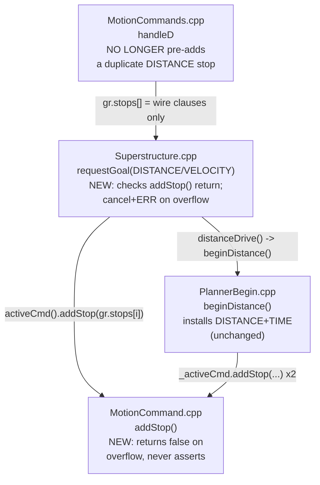
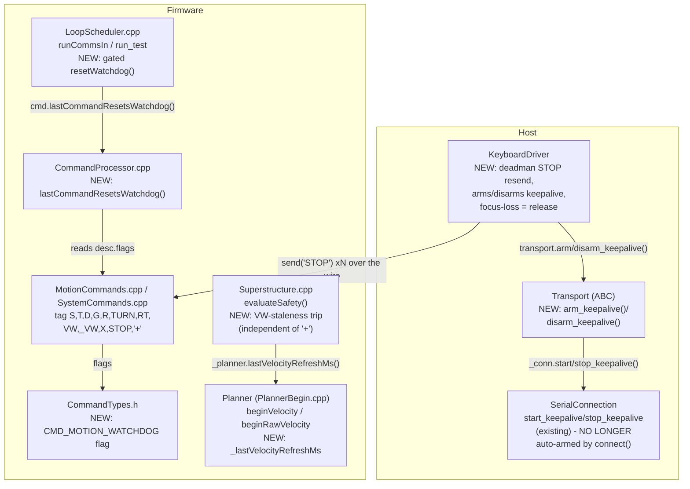
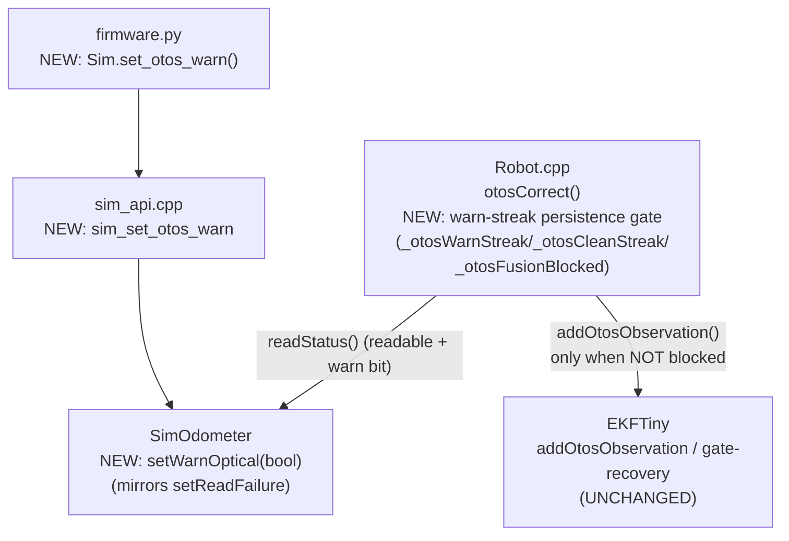

<!-- CLASI: Before changing code or making plans, review the SE process in CLAUDE.md -->

# Architecture Update -- Sprint 065: Stop reliability and safety: stop-clause overflow, STOP delivery and motion watchdog, OTOS warn-bit fusion gate

## Sprint Changes Summary

Three independent problem areas (CR-01, CR-04/CR-05, CR-06), broken into six
narrowly-scoped fixes, all inside already-existing modules (`MotionCommand`,
`Superstructure`, `CommandProcessor`/command descriptors, `Planner`, `Robot`,
`SimOdometer`, `SerialConnection`, `KeyboardDriver`). No new subsystem is
introduced; one new command-descriptor flag bit and one new `Planner`
timestamp are the only additive interface surface on the firmware side.
Ordered by the ticket sequence (see `sprint.md`); numbering matches Step 4-5
below:

1. **D-command stop-clause double-booking removed; `addStop` overflow becomes
   a recoverable `ERR`** (CR-01, critical) — `Superstructure::requestGoal`'s
   `DISTANCE` case re-adds a stop the goal's own `beginDistance()` already
   installed; combined with two or more wire `stop=`/`sensor=` clauses this
   overflows `MotionCommand::kMaxStopConds` and hits a live `assert(false)`
   that aborts the sim-hosting Python process (and would panic real firmware).
2. **Motion watchdog reset narrowed to `+`/motion verbs** (CR-05a, high) —
   today the firmware watchdog resets on *any* inbound line (`GET`, `SNAP`,
   ...), not just `+`/motion commands, both on real firmware and in the
   sim's parallel entry point.
3. **VW-class staleness cap, independent of `+`** (CR-05b, high) — even after
   (2), an ambient `+` alone must not be sufficient to keep an open-ended
   `VW`/`S`/`R` alive if the host's velocity-issuing layer has itself
   stalled (e.g. a frozen GUI event loop with an independent keepalive
   thread still running).
4. **TestGUI STOP becomes a bounded deadman resend; focus-loss treated as
   release** (CR-04, high) — `KeyboardDriver` sends `STOP` once,
   fire-and-forget, over a link that drops 15-50% of lines, and never sends
   it at all if the window loses focus while a key is held.
5. **Host keepalive armed only while a motion source is active** (CR-05b,
   host side, high) — `SerialConnection` streams `+` continuously from
   `connect()` regardless of whether anything is actually driving; arming
   moves to the layer that owns motion (`KeyboardDriver`).
6. **OTOS fusion gated on WARNING-bit persistence, not just readability**
   (CR-06, high) — a 2026-06-17 change collapsed the two-tier D9
   READABLE/HEALTHY gate to one tier, so a persistently degraded-but-readable
   OTOS reading (lifted robot, freshly placed robot) is fused every tick;
   the EKF's own gate-recovery force-snap then adopts the frozen reading as
   truth after ~10 rejections — reopening the exact "spin on placement"
   failure the original D9 gate existed to prevent.

All six are point-fixes inside existing cohesive modules; none require a new
subsystem, a new message-contract shape (beyond one additive sim-only ABI
hook and one additive `ERR` code), or a redesign of any control-loop
boundary.

---

## Step 1-2: Problem and Responsibility Groups

Each of the three problems has a distinct, independently-evidenced trigger
and touches its own module boundary. None share a root cause; they are
grouped into one sprint because all three are safety-relevant "the robot
doesn't stop when it should, or the sim/firmware crashes instead of
reporting an error" defects surfaced by the same code review
(`docs/code_review/2026-07-01-full-codebase-review.md`).

| Responsibility | Owning module | Why it changes |
|---|---|---|
| Decide how many stop conditions a goal installs, once | `Superstructure` (`requestGoal`) + `Planner` (`beginDistance`) | `Superstructure::requestGoal`'s `DISTANCE` case re-adds the goal's own primary stop on top of what `beginDistance()` already installed — the double-booking lives entirely at this seam, not inside either `begin*()` body. |
| Fail safely, not fatally, when a command's stop-condition array is full | `MotionCommand` (`addStop`) + `Superstructure` (`requestGoal`'s overflow handling) | `addStop()` is the single choke point that knows the array is full; `requestGoal` is the single place that has a reply channel to turn that into a wire-visible `ERR` and a safe teardown. |
| Classify which wire commands legitimately refresh the motion watchdog | Command-descriptor table (`CommandTypes.h`, `MotionCommands.cpp`, `SystemCommands.cpp`) + `CommandProcessor` (dispatch) | The classification ("is this `+` or a motion verb?") is a property of the *command table*, already the single source of truth for every other per-command property (`ForceReply`, `CMD_ACCESS_HARDWARE`). |
| Decide when the firmware watchdog timestamp advances | `LoopScheduler` (`runCommsIn`, `run_test`) + `tests/_infra/sim/sim_api.cpp` (`sim_command`, the sim's parallel entry point) | Both are the sole call sites of `resetWatchdog`/`_ts.watchdogMs =`; both must apply the same classification so sim and firmware stay behaviorally identical. |
| Detect a stalled *velocity-target* refresh independent of the generic keepalive | `Planner` (`beginVelocity`, `beginRawVelocity`) + `Superstructure` (`evaluateSafety`) | `Planner` already owns the only code paths that legitimately refresh an open-ended (S/VW/R) target; `Superstructure::evaluateSafety` already owns the per-tick watchdog trip logic and already holds a `Planner&`. |
| Deliver a reliable STOP over a lossy link from the keyboard-driving UI | `KeyboardDriver` (`host/robot_radio/testgui/drive.py`) | The single-shot fire-and-forget `STOP` send and the focus-loss gap both live entirely inside this class's key-event handlers. |
| Arm/disarm the ambient host-side keepalive around an actual motion session | `SerialConnection` (`start_keepalive`/`stop_keepalive`, already named correctly) + `Transport` (new thin arm/disarm passthrough) + `KeyboardDriver` (the caller that now owns arming) | `SerialConnection` already exposes the right verbs; the defect is *only* that `connect()`/`disconnect()` call them unconditionally instead of the motion-owning layer. |
| Distinguish a transient OTOS WARNING blip from a persistent one before fusing | `Robot` (`otosCorrect`) | `Robot::otosCorrect` is the sole caller of `Odometry::addOtosObservation` (via `EKFTiny`); the two-tier READABLE/HEALTHY gate has always lived here, not in `EKFTiny` itself. |
| Present a warn-bit-set-but-readable OTOS state to the sim tier | `SimOdometer` + `tests/_infra/sim/sim_api.cpp` + `tests/_infra/sim/firmware.py` | Mirrors the existing `setReadFailure`/`sim_set_otos_read_failure` fault-injection pattern one-for-one; `SimOdometer` is already the sole `IOdometer` implementation reachable from `pytest`. |

No responsibility spans more than one natural module boundary beyond the
listed pairs (each pair is a single call-seam, not a shared concern). No new
module, message type, or cross-cutting service is introduced.

---

## Step 3: Module Diagrams

### 3a. Stop-clause overflow (CR-01)



No cycles. `MotionCommand` remains a leaf (no outward dependencies).
Dependency direction is unchanged: command handlers → `Superstructure` →
`Planner`/`MotionCommand`.

### 3b. Stop delivery and motion watchdog (CR-04/CR-05)



No cycles in either half. `CommandTypes.h`/`MotionCommand` stay leaves.
`SerialConnection`'s existing `start_keepalive`/`stop_keepalive` API is
unchanged in shape — only *who calls it, and when* moves from `connect()`/
`disconnect()` to `KeyboardDriver`. Firmware and host halves communicate only
over the existing wire protocol (`+`, `VW`, `STOP`) — no new coupling.

### 3c. OTOS warn-bit fusion gate (CR-06)



No cycles. `SimOdometer` remains a leaf. `EKFTiny` is unchanged — the fix is
entirely upstream of it, in `Robot::otosCorrect`'s decision to call
`addOtosObservation` at all. This directly prevents the EKF's own
gate-recovery force-snap (10-consecutive-rejection K≈1 inflation) from ever
firing against a garbage observation, without touching that (independently
useful, for genuinely transient sensor noise) recovery mechanism.

No entity-relationship diagram: no persisted data model changes anywhere in
this sprint (no new `RobotConfig` field, no `SET`/`GET` key, no wire-message
shape change beyond one additive `ERR` code and one additive sim-only ABI
hook).

---

## Step 4-5: What Changed, module by module

### 1. Stop-clause double-booking + non-fatal overflow (CR-01)

**Root cause, confirmed by reading the call chain.** `Planner::
beginDistance()` (`PlannerBegin.cpp:292-295`) already installs
`DISTANCE(targetMm)` + `TIME(timeoutMs)` — 2 stops — computing `timeoutMs`
from the actual commanded wheel speeds (`2x nominal + 2s margin`), logic that
cannot be trivially replicated at the wire layer. `MotionCommands.cpp`'s
`handleD` (line 759, pre-fix) *also* pre-populates
`gr.stops[gr.nStops++] = makeDistanceStop(mm)` before calling
`requestGoal()`. `Superstructure::requestGoal`'s `Goal::DISTANCE` case then
unconditionally re-adds every entry of `gr.stops[]` onto the `MotionCommand`
that `distanceDrive()`/`beginDistance()` just populated:

```cpp
gr.robot->distanceDrive(...);                       // installs DISTANCE + TIME (2)
if (_planner.hasActiveCommand()) {
    for (uint8_t i = 0; i < gr.nStops; ++i)
        _planner.activeCmd().addStop(gr.stops[i]);   // RE-ADDS gr.stops[0] = dup DISTANCE
}
```

Plain `D` = 3 stops (1 wasted duplicate). `D ... stop=... sensor=...` (2 wire
clauses) = 5 stops against a 4-slot array — `addStop()`'s
`assert(false && "addStop overflow")` fires. The sim build
(`tests/_infra/sim/CMakeLists.txt`) sets no `NDEBUG`, so the assert is live:
it aborts the whole Python process hosting the sim (pytest run or the
TestGUI's `SimTransport` tick-thread — which, per the "hung host" analysis
in this same sprint, silently drops the robot's *only* remaining safety net
if it happens mid-drive). Real firmware panics via the CODAL assert path.

**Note on `T`:** the equivalent `Goal::VELOCITY` path (`handleT` →
`beginVelocity()` → `Superstructure::requestGoal`) has *no* analogous bug —
`beginVelocity()` deliberately installs zero stops internally (its own
comment: "Stop conditions for S / VW with stop= are added by
`Superstructure::requestGoal` after this call"), so `requestGoal`'s
re-add loop is the *only* place stops are installed for `T`/`VW`/`S`/`R`. The
double-booking is specific to `Goal::DISTANCE`, because `beginDistance()` is
the one `begin*()` that both installs its own stops *and* is fed
`gr.stops[]` afterward.

**Fix — two layers, per the issue's own fix direction:**

1. **Eliminate the duplicate at the source.** `handleD` no longer
   pre-populates `gr.stops[0]` with `makeDistanceStop(mm)` — `beginDistance()`
   already installs the equivalent stop internally via `distanceDrive()`.
   `gr.stops[]` now carries *only* the wire-supplied `stop=`/`sensor=`
   clauses, starting at index 0. Recount: plain `D` = 2 stops (DISTANCE +
   TIME, no duplicate); `D ... stop=time:9000 sensor=line0>500` = 2 (internal)
   + 2 (wire) = 4 — exactly at `kMaxStopConds`, no overflow, and the earliest
   -firing clause governs as intended.
2. **Make overflow recoverable, never fatal.** `MotionCommand::addStop()`
   drops the `assert(false ...)` and simply `return false;` when
   `_nStops >= kMaxStopConds` (the function already had this return type and
   this exact branch — only the assert line is removed). `Superstructure::
   requestGoal`'s `DISTANCE` and `VELOCITY` cases now check each `addStop()`
   call's return value; on the first `false`, the just-started command is
   cancelled (`activeCmd().cancel(HARD)` — immediate stop, "err toward
   stopping") and the host receives a wire-visible `ERR stopoverflow` via the
   goal's own reply channel (`gr.corrId`/`gr.replyFn`/`gr.replyCtx`, already
   in scope at that call site) instead of continuing to drive with silently
   -incomplete stop coverage. This is defense-in-depth beyond fix (1): a
   command with 3+ wire clauses can still theoretically reach the ceiling,
   and this path guarantees a safe, observable failure instead of a crash no
   matter how many clauses are supplied.

Layer 1 alone closes the sprint's specific regression scenario and removes
the wasted slot; layer 2 is what makes "assert, ever" impossible for *any*
future clause combination, matching the issue's explicit acceptance
criterion ("Overflow, if still reachable, produces a wire-visible ERR, never
an assert").

### 2. Motion watchdog scoped to `+`/motion verbs (CR-05a)

**Root cause, confirmed by reading `LoopScheduler::runCommsIn`**
(`LoopScheduler.cpp:49-90`): every inbound line, regardless of verb, ends
with an unconditional `sched.resetWatchdog(now)` — `GET`, `SNAP`, and any
other non-motion query resets the same timestamp `+` and `VW` do. The sim's
parallel entry point, `sim_api.cpp`'s `sim_command()`, has the identical
pattern (`s->_ts.watchdogMs = ...` unconditionally, explicitly commented "mirrors
LoopScheduler's resetWatchdog"). `LoopScheduler::run_test()`'s hardware-free
loop has the same unconditional call a third time.

**Fix — classify at the command-descriptor table, gate at the two call
sites.** `CommandTypes.h` gains one new bitmask constant alongside the
existing `CMD_ACCESS_HARDWARE`:

```cpp
static constexpr uint8_t CMD_MOTION_WATCHDOG = 2;
```

Every motion-verb descriptor (`S`, `T`, `D`, `G`, `R`, `TURN`, `RT`, `VW`,
`_VW`, `X`, `STOP` in `MotionCommands.cpp`) and the keepalive descriptor
(`+` in `SystemCommands.cpp`) get this flag OR'd into their existing `flags`
value (e.g. `VW` becomes `CMD_ACCESS_HARDWARE | CMD_MOTION_WATCHDOG`; `S`
goes from `CMD_NONE` to `CMD_MOTION_WATCHDOG`). No other descriptor changes.
`CommandProcessor::dispatchTable()` records the matched descriptor's flags
into a new private member (`_lastDispatchFlags`) immediately after a
successful parse — before the enqueue-vs-immediate-dispatch branch, so the
classification is correct for both the production queue path and the
sim/no-queue fallback. A new public accessor,
`bool CommandProcessor::lastCommandResetsWatchdog() const`, exposes it.

`LoopScheduler::runCommsIn` and `run_test` replace their unconditional
`resetWatchdog(now)` calls with `if (cmd.lastCommandResetsWatchdog())
resetWatchdog(now);`. `sim_api.cpp`'s `sim_command()` applies the identical
gate to `s->_ts.watchdogMs = ...`, keeping sim and firmware behaviorally
identical (both read the same `CommandProcessor` classification — there is
only one implementation of "which commands count," not two to keep in
sync). `SystemCommands.cpp`'s `handleKeepalive` keeps its own explicit
`sched->resetWatchdog(...)` call (now redundant with the gate for the `+`
line specifically, but harmless and left as-is — it is the belt to the
gate's suspenders, not a second competing mechanism).

### 3. VW-class staleness cap, independent of `+` (CR-05b, the "optional" layer — included)

**Why this is needed even after fix 2.** Narrowing the watchdog to
`+`/motion verbs closes the "any line resets it" hole, but `+` itself
*still* resets the watchdog by design — that is its whole purpose. If the
host's `SerialConnection` keepalive daemon thread is still alive and still
emitting `+` (a background OS thread, independent of the GUI event loop or
whatever code is supposed to be resending `VW`), a frozen `KeyboardDriver`
resend timer (e.g. the Qt main thread wedged behind a modal dialog or an
unhandled exception) is invisible to the firmware: `+` keeps arriving, the
watchdog keeps resetting, and the robot keeps driving at the last `VW`
target. This is the mechanism the issue calls "keepalife thread outlives a
frozen VW-issuing layer" and is distinct from (and not fixed by) narrowing
*which lines* count.

**Fix — track velocity-target freshness at its source, not at the wire
layer.** `Planner` (the only code that legitimately updates an open-ended
target) gains a new private member `uint32_t _lastVelocityRefreshMs = 0;`
and a public getter `uint32_t lastVelocityRefreshMs() const`.
`beginVelocity()` (covers `S`, `VW`, `T`, `R` — all of `Goal::VELOCITY`)
stamps it on every call with the `now_ms` it already receives.
`beginRawVelocity()` (covers `_VW`) gains a `uint32_t now_ms` parameter
(currently missing; its single call site, `MotionCommands.cpp:1293`, already
has `ctx->robot->systemTime()` in scope) and stamps the same member.
Stamping at the `Planner` layer, not by enumerating wire verbs in the
command table, means the check is correct by construction for every current
and future path that creates an open-ended command — no risk of silently
missing a verb.

`Superstructure::evaluateSafety()`'s existing watchdog block already computes
`needsWatchdog` — true if and only if the active command has no `TIME` stop,
which (by construction — `T`/`D`/`G`/`TURN`/`RT`/PRE_ROTATE all install a
`TIME` net) is true if and only if the active command is an open-ended
`S`/`VW`/`R`/`_VW` twist. The block's trip condition becomes:

```cpp
int32_t wdDelta = (int32_t)(now - ts.watchdogMs);
int32_t vwDelta = (int32_t)(now - _planner.lastVelocityRefreshMs());
bool stale = (wdDelta > (int32_t)cfg.sTimeoutMs) ||
             (vwDelta > (int32_t)cfg.sTimeoutMs);
if (cfg.safetyEnabled && ts.watchdogMs != 0 && ts.activeFn != nullptr &&
    needsWatchdog && stale) {
    ... existing safety_stop + X sequence, unchanged ...
}
```

No new `RobotConfig` field — the existing `sTimeoutMs` (default 500 ms) is
reused as the staleness threshold for both signals, keeping the safety
contract to one tunable, not two. `_lastVelocityRefreshMs` is causally
guaranteed to be non-zero whenever `needsWatchdog` is true (an open-ended
command cannot become active without first calling `beginVelocity`/
`beginRawVelocity`), so no special-casing is needed for "never set."

### 4. TestGUI STOP deadman resend + focus-loss handling (CR-04)

**Root cause.** `KeyboardDriver._on_key_release` (`drive.py:263-288`) stops
the `VW` resend timer and sends exactly one `STOP` over `transport.send()`
(fire-and-forget, no ack, no retry). A direct-USB link intermittently drops
15-50% of lines (project knowledge:
`docs/knowledge/radio-link-max-data-rate.md`-adjacent findings); a dropped
`STOP` combined with the (pre-fix) ambient keepalive means the robot coasts
at the last commanded velocity indefinitely. Separately, if the window loses
focus while an arrow key is logically held, Qt never delivers the
`keyReleaseEvent` at all — `_on_key_release` never runs, so neither the
timer stops nor any `STOP` is sent; the robot keeps being resent the last
held-key `VW` forever.

**Fix — deadman resend, plus focus-loss treated as release.** On release,
instead of stopping the timer and sending one `STOP`, `KeyboardDriver` sets
`self._cmd = "STOP"` and lets the *existing* timer keep firing for a bounded
count (`STOP_RESEND_COUNT`, a small constant — e.g. 5 ticks at the existing
100 ms interval, ≈500 ms of resends) before actually stopping the timer.
`_on_timer_tick` resends `STOP` on each of those ticks instead of a stale
`VW`. With a 15-50% per-line drop rate, the probability all N resends are
lost is bounded by `(0.5)^N` — vanishingly small at N=5. This reuses the
*existing* timer/`_send_cmd` machinery; no new thread, no blocking
`command()` call on the Qt main thread (a blocking ack-and-retry design was
considered and rejected — see Design Rationale). `KeyboardDriver` also
overrides `window.focusOutEvent` (monkeypatched alongside the existing
`keyPressEvent`/`keyReleaseEvent` overrides in `attach()`/`detach()`) so a
focus-loss while a key is tracked as held triggers the same deadman sequence
a real key-release would.

### 5. Host keepalive armed only while a motion source is active (CR-05b, host side)

**Root cause.** `SerialConnection.connect()` calls `self.start_keepalive()`
unconditionally (both the fast cache-hit path and the normal handshake path,
`serial_conn.py:314` and `:363`); `disconnect()` calls `stop_keepalive()`.
The daemon thread streams `+` for the entire lifetime of the connection,
independent of whether anything is actually driving. A grep of all
maintained call sites confirms `start_keepalive`/`stop_keepalive` are called
*only* from `connect()`/`disconnect()` today — no other code arms or disarms
it, and no maintained bench script or `rogo` path depends on the ambient
daemon (T/D/G/TURN/RT are already watchdog-exempt via their own `TIME` net,
and `smoke_ritual` already sends `+` explicitly per its own design).

**Fix.** `SerialConnection.connect()` no longer calls `start_keepalive()`
automatically; `disconnect()` still calls `stop_keepalive()` (idempotent
cleanup — harmless whether or not it was armed). `Transport` (the ABC in
`testgui/transport.py`) gains two new methods, `arm_keepalive()` /
`disarm_keepalive()`, defaulting to no-ops; `_HardwareTransport` (the shared
`SerialTransport`/`RelayTransport` base) overrides them to call
`self._conn.start_keepalive()`/`stop_keepalive()`. `SimTransport` inherits
the no-op default — the sim has no real serial link or ambient-keepalive
concept (its own parallel watchdog-classification fix, item 2 above, is
firmware-identical logic exercised directly by `sim_command()`).
`KeyboardDriver` calls `self._transport.arm_keepalive()` when a driving
session starts (first key press) and `self._transport.disarm_keepalive()`
once the deadman `STOP` sequence completes (or on `detach()`). This makes
"is `+` flowing" track "is a motion source actually driving," matching the
issue's "armed/disarmed by the layer that owns motion, not by `connect()`"
requirement, and — combined with fix 3 above — closes the gap where an
independent keepalive thread outlives a frozen motion-issuing layer for
*any* other reason.

**Test impact (explicit, since this changes observable behavior of
`SerialConnection`).** Two existing tests in
`tests/simulation/unit/test_serial_relay_handshake.py`
(`test_keepalive_is_plain`, `test_keepalive_plain_plus`) currently rely on
`connect()` auto-arming the keepalive; both now call `conn.start_keepalive()`
explicitly after `connect()` to preserve their original intent (verify `+`
is sent plain, never relay-prefixed) under the new arm-on-demand contract.

### 6. OTOS warn-bit persistence gate (CR-06)

**Root cause, confirmed by reading `Robot::otosCorrect`**
(`Robot.cpp:168-295`): the two-tier D9 gate (READABLE — is there a usable
reading at all; HEALTHY — is it good enough to fuse) was collapsed to
`bool healthy = poseOk;` on 2026-06-17, with the stated rationale that
benign WARNING bits (`warnTiltAngle`, `warnOpticalTracking`) shouldn't drop
fusion *entirely*. The rationale is legitimate but the implementation lost
the transient-vs-persistent distinction: a *persistently* degraded reading
(lifted robot, robot on the stand, freshly placed robot — all of which set
`warnOpticalTracking` continuously) is now fused every tick, forever. The
Mahalanobis gate in `EKFTiny::updatePosition`/`updateHeading`
(`EKFTiny.cpp:213-257`, `:408-437`) rejects the frozen observation
temporarily, but its own gate-recovery path (10 consecutive rejections →
inflate `P` so `K≈1`, unconditionally accept) then force-snaps fused
position/heading to that stale value — reopening exactly the "spin on
placement" failure the original D9 gate existed to prevent.

**Fix — restore the persistence distinction, entirely upstream of
`EKFTiny`.** `Robot` gains three new private members, alongside the existing
`_otosInvalidStartMs`/`_otosLostEmitted` (which already track the *fully
unreadable* case and are unaffected by this fix):

```cpp
uint8_t _otosWarnStreak    = 0;      // consecutive ticks with a WARNING bit set (readable, degraded)
uint8_t _otosCleanStreak   = 0;      // consecutive clean (otosStatus==0) ticks since a block
bool    _otosFusionBlocked = false;  // true once the warn streak exceeds K
static constexpr uint8_t kOtosWarnPersistK  = 3;  // fuse through <=K consecutive warn ticks
static constexpr uint8_t kOtosCleanReadmitN = 5;  // require N clean ticks to re-admit
```

`otosCorrect()`'s existing `bool healthy = poseOk;` / "unreadable" branch is
unchanged (that branch already correctly handles the hard-error/unreadable
case via `_otosInvalidStartMs`/`EVT otos lost`). Immediately after that
branch (i.e. only once `healthy` is true — the reading is readable),
`otosStatus != 0` (a WARNING bit set, since HARD errors are already excluded
by `readable`) increments `_otosWarnStreak` and, once it exceeds
`kOtosWarnPersistK`, sets `_otosFusionBlocked = true`. A clean tick
(`otosStatus == 0`) resets `_otosWarnStreak` to 0 and, if currently blocked,
increments `_otosCleanStreak`; once that reaches `kOtosCleanReadmitN`,
`_otosFusionBlocked` clears. When `_otosFusionBlocked` is true, `otosCorrect`
returns before calling `addOtosObservation` — the raw pose is still written
to `state.actual.optical.pose`/`otos.valid` earlier in the function
(telemetry visibility unchanged, per the issue's own constraint), but the
EKF never sees it, so `EKFTiny`'s own gate-recovery streak (`_rejPos_streak`/
`_rejHead_streak`) never advances against this data — the force-snap path is
never invoked. `EKFTiny` itself is untouched.

**Sim ABI addition, following the `setReadFailure` pattern exactly.**
`SimOdometer` gains `setWarnOptical(bool on)` (mirrors `setLift`/
`setReadFailure`'s shape). `readStatus()` becomes:

```cpp
bool readStatus(uint8_t& out) const override {
    if (_lift || _readFailure) { out = 0xFF; return false; }   // unchanged
    if (_warnOptical) { out = 0x02; return true; }             // NEW: warnOpticalTracking, readable
    out = 0;
    return true;
}
```

`tick()` additionally gains: when `_warnOptical` is true, skip the
odometry-accumulator update and zero `_velV`/`_velOmega`/`_accAx`/`_accAy`
for that tick — matching the real-hardware symptom the issue describes
("frozen OTOS pose and near-zero velocity") so a sim test can reproduce
"hold the robot in the air while wheels spin" exactly: encoders (driven by
true wheel velocity) keep advancing while the simulated OTOS pose stays
pinned. `readTransformed()`/`readVelocityTransformed()` are otherwise
unchanged — still return `true` (readable) with whatever the (now frozen)
accumulator holds, exactly modeling "readable but degraded," distinct from
`_lift`'s "unreadable" (`out=0xFF`, `readTransformed` returns `false`).
`tests/_infra/sim/sim_api.cpp` gains `sim_set_otos_warn(void* h, int on)`
(mirrors `sim_set_otos_read_failure`); `tests/_infra/sim/firmware.py` gains
`Sim.set_otos_warn(on: bool)` (mirrors `set_otos_read_failure`). No other
sim ABI hook changes.

---

## Why

Every change traces to a specific, cited code location with the exact
defect already read and confirmed in this planning pass, matching a critical
or high-severity finding from the 2026-07-01 full-codebase review:

- CR-01 (critical): the stop-clause double-booking is the strongest
  identified candidate for "the simulation is crashing" — a live `assert`
  that aborts the Python process hosting every sim test and the TestGUI's
  `SimTransport`, and would panic real firmware mid-drive.
- CR-04/CR-05 (high): the STOP-delivery and watchdog gaps are the same
  "safety-stop watchdog silenced by keepalives" mechanism the project has
  already seen once (the June wild-spin postmortem, per the issue text),
  now shown to be structural rather than a one-off.
- CR-06 (high): the OTOS fusion regression reopens a previously-fixed,
  previously-tested failure mode (D9 / 027-005, "spin on placement") via a
  well-intentioned but incomplete follow-up change.

None of these are speculative — each has a cited file/line, a traced call
chain, and a concrete sim-reproducible regression scenario in `sprint.md`'s
Success Criteria.

---

## Impact on Existing Components

| Component | Impact |
|---|---|
| `source/commands/MotionCommand.{h,cpp}` | **Modified.** `addStop()` loses its `assert(false ...)` line; return-value contract (`bool`, already existed) is now the only overflow signal. No signature change. |
| `source/commands/MotionCommands.cpp` (`handleD`) | **Modified.** No longer pre-populates `gr.stops[0]` with a duplicate `makeDistanceStop`. `handle_VW` passes `now_ms` to `beginRawVelocity`. Motion-verb descriptors gain `CMD_MOTION_WATCHDOG`. |
| `source/superstructure/Superstructure.{h,cpp}` | **Modified.** `requestGoal`'s `DISTANCE`/`VELOCITY` cases check `addStop()`'s return value (cancel + `ERR` on overflow). `evaluateSafety()`'s watchdog block gains the VW-staleness check against `_planner.lastVelocityRefreshMs()`. |
| `source/superstructure/Planner.{h,cpp}` (incl. `PlannerBegin.cpp`) | **Modified.** New `_lastVelocityRefreshMs` member + `lastVelocityRefreshMs()` getter, stamped by `beginVelocity()`. `beginRawVelocity()` gains a `now_ms` parameter (signature change, single call site updated). |
| `source/types/CommandTypes.h` | **Modified.** One new bitmask constant, `CMD_MOTION_WATCHDOG`. Existing `CMD_NONE`/`CMD_ACCESS_HARDWARE` and `CommandDescriptor` shape unchanged (flags remain a plain `uint8_t`, OR-combinable). |
| `source/commands/CommandProcessor.{h,cpp}` | **Modified.** New private `_lastDispatchFlags` member, set in `dispatchTable()`; new public accessor `lastCommandResetsWatchdog()`. No change to `process()`'s signature or existing behavior. |
| `source/commands/SystemCommands.cpp` | **Modified.** `+` descriptor gains `CMD_MOTION_WATCHDOG`. `handleKeepalive`'s existing explicit `resetWatchdog` call is unchanged (now redundant-but-harmless with the gated path). |
| `source/robot/LoopScheduler.cpp` | **Modified.** `runCommsIn` and `run_test` gate their `resetWatchdog(now)` calls on `cmd.lastCommandResetsWatchdog()` instead of calling unconditionally. |
| `source/robot/Robot.{h,cpp}` | **Modified.** `otosCorrect()` gains the warn-persistence gate; three new private members (`_otosWarnStreak`/`_otosCleanStreak`/`_otosFusionBlocked`) alongside the existing `_otosInvalidStartMs`/`_otosLostEmitted`. No change to the unreadable-path branch. |
| `source/state/EKFTiny.{h,cpp}` | **Unaffected.** The fix is entirely upstream; the existing gate-recovery mechanism (useful for genuinely transient sensor noise elsewhere) is untouched. |
| `source/hal/sim/SimOdometer.{h,cpp}` | **Modified.** New `setWarnOptical(bool)`; `readStatus()` and `tick()` branch on it. Default `false` — a fresh `SimOdometer` remains PERFECT, no behavior change for any existing test that doesn't call the new setter. |
| `tests/_infra/sim/sim_api.cpp`, `tests/_infra/sim/firmware.py` | **Extended.** New hooks: `sim_set_otos_warn` / `Sim.set_otos_warn()` (mirrors `sim_set_otos_read_failure`). `sim_command()`'s watchdog-reset line becomes gated (mirrors the firmware `LoopScheduler` fix) instead of unconditional. Existing hooks unchanged. |
| `host/robot_radio/io/serial_conn.py` | **Modified.** `connect()` no longer calls `start_keepalive()` automatically. `disconnect()` still calls `stop_keepalive()`. Public API shape (`start_keepalive`/`stop_keepalive`) unchanged — only the caller moves. |
| `host/robot_radio/testgui/transport.py` | **Modified.** `Transport` ABC gains `arm_keepalive()`/`disarm_keepalive()` (default no-op). `_HardwareTransport` overrides them to delegate to `SerialConnection`. `SimTransport` uses the no-op default. |
| `host/robot_radio/testgui/drive.py` (`KeyboardDriver`) | **Modified.** Key-release becomes a bounded deadman `STOP` resend instead of a single fire-and-forget send; new `focusOutEvent` override treats focus loss as a release; calls `arm_keepalive()`/`disarm_keepalive()` around a driving session. |
| `tests/simulation/unit/test_serial_relay_handshake.py` | **Modified.** `test_keepalive_is_plain`/`test_keepalive_plain_plus` call `conn.start_keepalive()` explicitly after `connect()` to preserve their intent under the new arm-on-demand contract. |
| Every other module (`BodyVelocityController`, `Odometry`, sensors not touched by CR-06, radio/relay comms) | **Unaffected.** No interface they depend on changes shape. |

---

## Migration Concerns

- **`beginRawVelocity()` signature change.** Adding `uint32_t now_ms` is a
  source-breaking change for any caller outside this sprint's reach; a repo
  -wide grep found exactly one call site (`MotionCommands.cpp:1293`, updated
  as part of this sprint). No header is publicly exported outside this
  firmware image, so no external-consumer migration is needed.
- **`SerialConnection.connect()` no longer arms the keepalive daemon —
  observable behavior change.** Any *unmaintained* script under `tests/old/`
  that calls `start_keepalive()`/`stop_keepalive()` directly is unaffected
  (those calls remain valid, idempotent API). A hypothetical maintained
  caller that issues a bare `VW`/`S`/`R` and relies solely on the ambient
  daemon (not `KeyboardDriver`, not a resend loop of its own) to keep it
  alive would need to call `transport.arm_keepalive()` itself — the repo
  -wide grep for `start_keepalive`/`stop_keepalive` call sites found none in
  maintained code today; flagged as an Open Question below for completeness.
- **`ERR stopoverflow` is a new wire-visible error code.** Additive only —
  no existing `ERR` code is renamed or removed; no host-side parser is known
  to fail closed on an unrecognized `ERR` code (the existing `ERR <code>
  <detail> [#id]` taxonomy is designed to be extensible).
- **`CMD_MOTION_WATCHDOG` reuses the existing `uint8_t flags` field** — no
  `CommandDescriptor` size or layout change (2 of 8 bits now assigned,
  6 free for future use, same as before this sprint).
- **No data/config migration.** No persisted schema, no `RobotConfig` wire
  field, no `SET`/`GET` key changes. `sTimeoutMs` is reused, not added to.
- **Deployment sequencing (firmware build).** Per project knowledge
  (`docs/knowledge/stale-incremental-build-on-volumes.md`), incremental ARM
  builds on this checkout go stale silently; a `--clean` build is required
  before any HITL validation of this sprint's firmware changes, exactly as
  for every other firmware sprint.
- **Two existing host-side tests need explicit updates**
  (`test_keepalive_is_plain`, `test_keepalive_plain_plus` — see Impact table
  above); flagged here so the ticket that changes `serial_conn.py` carries
  the update forward rather than discovering it as a surprise CI failure.

---

## Design Rationale

### Decision 1: fix the D-command duplicate at the wire-handler layer, not by changing `beginDistance()`'s internal stops

**Context:** The double-booking could be fixed either by removing
`beginDistance()`'s internal `DISTANCE`/`TIME` stops (letting the caller
supply everything) or by removing `handleD`'s redundant pre-population of
`gr.stops[0]`.

**Alternatives considered:** (a) strip `beginDistance()`'s internal stops
and have every caller (including the no-queue fallback path in `handleD`'s
`else` branch) supply the `DISTANCE`+`TIME` pair explicitly; (b) remove only
`handleD`'s redundant `gr.stops[0]` pre-population, leaving
`beginDistance()`'s internal installation as the single source of the
primary `DISTANCE`+`TIME` pair.

**Why (b):** `beginDistance()`'s internal `TIME` safety-net computation
(`2x nominal travel time + 2s margin`, derived from the actual commanded
`leftMms`/`rightMms`) is non-trivial domain logic that belongs with the
motion-baseline code that also resets encoders and zeroes the software
mirror in the same function — splitting it out to the wire-handler layer
would duplicate that computation (or require threading it back through
`GoalRequest`) for no benefit. (b) is a one-line deletion in `handleD`, is
symmetric with how `beginVelocity()` already works (installs zero stops
internally, expects the caller to supply everything via `gr.stops[]`), and
leaves the no-queue fallback path (`handleD`'s `else` branch, which calls
`distanceDrive()` directly and never touches `gr.stops[]` at all) completely
unaffected — it was never part of the double-booking in the first place.

**Consequences:** `Goal::DISTANCE` and `Goal::VELOCITY` remain intentionally
asymmetric in *how many* stops `begin*()` installs internally (2 vs. 0) —
this is pre-existing (`Goal::DISTANCE` is kept specifically to preserve the
atomic encoder reset, per the existing `Superstructure.h` comment) and this
sprint does not change that asymmetry, only removes the redundant re-add on
top of it.

### Decision 2: overflow recovery cancels the command and replies `ERR`, rather than silently truncating the clause list

**Context:** When `addStop()` returns `false` inside `requestGoal`'s re-add
loop, the goal has *already started* (`begin*()`/`start()` already ran) with
fewer stop conditions than the operator supplied.

**Alternatives considered:** (a) silently stop adding further clauses and
let the command run with whatever subset fit; (b) cancel the just-started
command (`HARD` stop) and reply a wire-visible `ERR`.

**Why (b):** A silently-dropped clause could be the operator's *only*
safety-relevant stop (e.g. a `sensor=line0>500` obstacle-detection clause
truncated off the end while the less-important `TIME` net survives) — the
sprint's overarching principle ("err toward stopping") means an operator
should never discover a missing safety clause by the robot failing to stop
where expected. (b) makes the failure loud and immediate: the robot halts
and the host gets `ERR stopoverflow`, so the operator can retry with fewer
clauses or split the safety-relevant one into its own command.

**Consequences:** A command that legitimately needs more than 4 total stop
conditions (2 internal + 2+ wire, or 4+ wire on `S`/`VW`/`R`/`TURN`/`RT`,
which install 0 internally) cannot be expressed today and must be split into
sequential commands or have `kMaxStopConds` raised in a future sprint if a
real use case needs it — not evidenced by any current caller.

### Decision 3: VW-staleness is tracked at the `Planner` layer, not by enumerating wire verbs in the command table

**Context:** The staleness check needs to know "was an open-ended velocity
target genuinely refreshed recently," and could be implemented either by
tagging specific wire verbs (`S`, `VW`, `_VW`, `R`) with a second
command-table flag, or by stamping a timestamp at the `Planner` call sites
that actually create/refresh an open-ended command.

**Alternatives considered:** (a) a second command-descriptor flag (e.g.
`CMD_OPEN_ENDED_REFRESH`) tagging exactly the open-ended-producing verbs; (b)
a `Planner`-owned timestamp stamped by `beginVelocity()`/`beginRawVelocity()`.

**Why (b):** (a) requires correctly enumerating every wire verb that can
produce an open-ended command today (`S`, `VW`, `_VW`, `R`) and staying
correct if a future verb is added — a classification that can silently drift
out of sync with `Planner`'s actual `Goal::VELOCITY`/`beginRawVelocity`
dispatch (which is the actual, authoritative definition of "open-ended").
(b) stamps the timestamp at the single point of truth for what "a fresh
velocity target" means, so it is correct by construction for every current
and future path, with zero enumeration risk. It also reuses `needsWatchdog`
(already exactly "no TIME stop, i.e. open-ended") as the gate for *when* the
staleness check applies, rather than duplicating that classification a
second time.

**Consequences:** `Planner` gains one small piece of state
(`_lastVelocityRefreshMs`) that is not part of any per-command reset
(`configure()`) — it persists across commands by design, since its only
purpose is "how long since a velocity target was last set," which is
meaningful independent of which specific `MotionCommand` instance is active.

### Decision 4: `KeyboardDriver`'s STOP reliability uses a bounded deadman resend, not an acked `command()` retry loop

**Context:** `Transport` already exposes a synchronous, acked `command(line,
read_ms)` that blocks until a reply or timeout. Using it for `STOP` with a
retry loop was considered as an alternative to the deadman-resend design.

**Alternatives considered:** (a) on release, call
`transport.command("STOP", read_ms=...)` in a retry loop until `OK` or a
retry budget is exhausted; (b) reuse the existing fire-and-forget resend
timer, redirecting it to resend `STOP` a bounded number of times after
release.

**Why (b):** `command()` blocks the calling thread; called from
`_on_key_release` (the Qt main/GUI thread), a retry loop would freeze the
UI for up to `N * read_ms` on every key release, and — worse — a genuinely
hung host (the exact failure mode CR-05 is about) would have its GUI thread
*already* stalled, so a retry loop gains nothing there while making the
common case (a healthy host, an occasional dropped line) visibly janky. (b)
reuses the existing non-blocking `send()`/timer machinery that already works
correctly for the held-key `VW` resend case, adding only a bounded resend
count and a target-string swap — no new thread, no new blocking call, no
change to the existing timer's cadence or lifecycle.

**Consequences:** The deadman resend does not *guarantee* delivery (a
sufficiently pathological run of drops could still lose all N `STOP`s,
probability `<= (0.5)^N`, negligible at N=5) — the true backstop for that
residual case is the firmware-side fix (item 3): even if every `STOP` is
lost, the robot's `VW` target also stops being refreshed the moment the key
is released, so the VW-staleness cap independently halts the robot within
`sTimeoutMs` regardless of whether `STOP` itself ever arrives.

### Decision 5: OTOS persistence thresholds (`K=3` warn ticks, `N=5` clean ticks) are design-time estimates, not bench-tuned

**Context:** The issue specifies the *shape* of the gate ("fuse through <=K
transient warn samples, block after, re-admit after N clean") but not exact
values.

**Alternatives considered:** (a) make `K`/`N` `RobotConfig` fields, tunable
over the wire; (b) fixed `constexpr` values, matching the style of the
existing `EKFTiny` gate-recovery constants (`10` consecutive rejections,
not configurable) and `kSoftDeadlineMs` (`3000`, not configurable).

**Why (b):** No current caller or test needs runtime tuning of this gate;
adding `SET`/`GET` wire surface for two new tunables is unjustified scope
for a sprint whose test strategy is entirely sim-tier. `K=3` (roughly 30-90
ms of consecutive warn ticks at typical loop rates) treats a true blip as
transient while a lifted/placed robot (which holds the warn bit for seconds)
clears the threshold almost immediately. `N=5` adds mild hysteresis against
flapping right at the boundary without meaningfully delaying re-admission
once the sensor is genuinely healthy again.

**Consequences:** Marked the same way the codebase already flags
design-time-estimated constants (e.g. sprint 064's `kMaxDeltaPwmPerWrite`,
`kAtRestVelEpsilonMms`) — acceptable for a sim-verified sprint; HITL
placement-recovery timing (how many real ticks a "spin on placement" episode
takes to clear) is the natural follow-up bench confirmation, deferred to the
stakeholder per this sprint's sim-only test strategy.

---

## Open Questions

1. **`kOtosWarnPersistK`/`kOtosCleanReadmitN` are unconfirmed against real
   OTOS tick-rate/warn-bit-flap behavior.** Sim tests validate the *gate
   logic* is correct for a given K/N; whether K=3/N=5 are the right values
   for the real sensor's actual warn-bit flap rate during a genuine
   placement event is a HITL question, out of scope for this sim-only
   sprint (matches the sprint's stated test strategy).
2. **No maintained caller today arms/disarms `SerialConnection`'s keepalive
   outside `KeyboardDriver`.** If a future host tool issues a bare
   `VW`/`S`/`R` and expects the connection to auto-keepalive it (as every
   caller implicitly could before this sprint), it must now call
   `transport.arm_keepalive()` itself. Not a regression for any code that
   exists today (verified by grep), but worth calling out explicitly since
   it is a behavior change to a previously-implicit contract.
3. **`STOP_RESEND_COUNT` (deadman resend length) is a design-time estimate**
   (5 ticks at the existing 100 ms timer interval, ≈500 ms), reasoned from
   the cited 15-50% drop-rate range but not bench-confirmed against the
   worst observed drop rate. Acceptable for the sim/unit-test tier this
   sprint targets; a materially worse real-world drop rate would be a
   follow-up tuning question, not a design defect (the firmware-side
   VW-staleness cap is the actual bound-guaranteeing backstop regardless of
   this value).
4. **Should `kMaxStopConds` (4) be raised** to give commands more headroom
   for wire-supplied clauses now that the wasted internal duplicate is
   removed? Not evidenced by any current caller needing more than today's
   effective 2 (DISTANCE) / 4 (open-ended) wire-clause budget; deferred
   unless a future issue demonstrates a real need.
