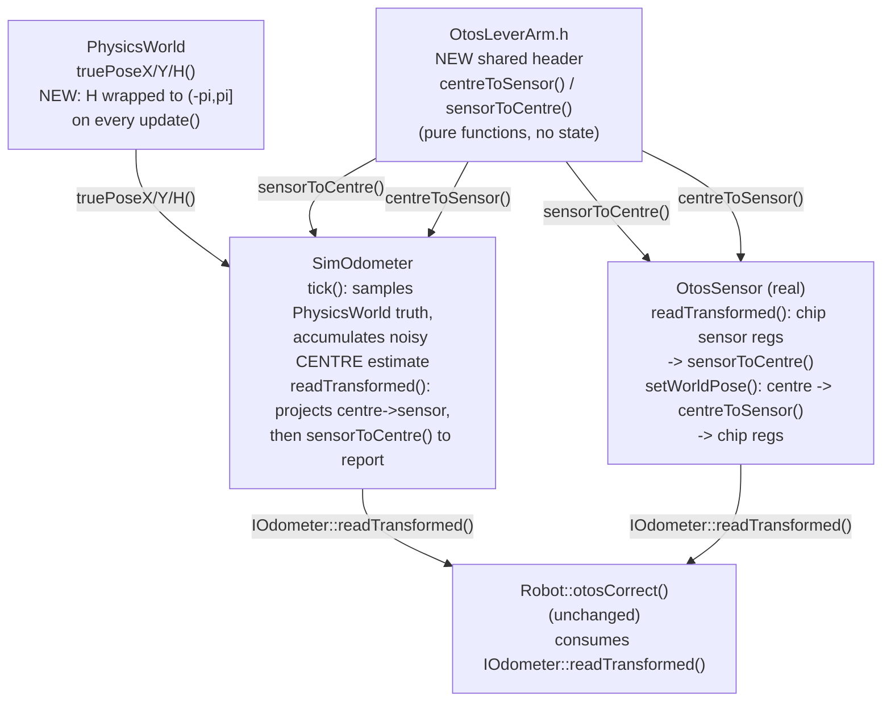
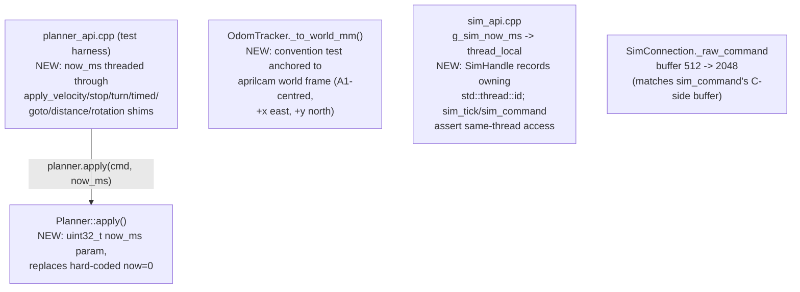
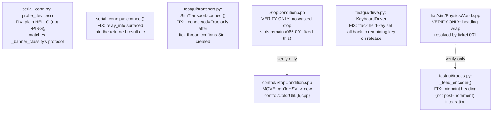
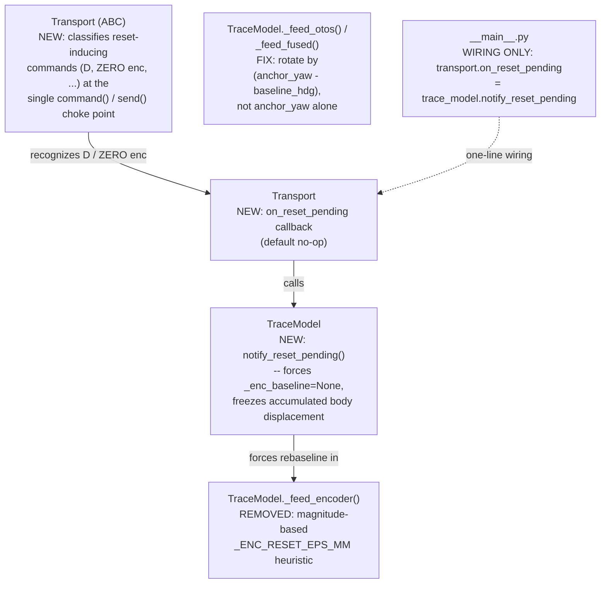

<!-- CLASI: Before changing code or making plans, review the SE process in CLAUDE.md -->

# Architecture Update — Sprint 066: Sim fidelity and host cleanups: sim-OTOS ground truth and lever arm, landmine batch, CR-15 batch, TestGUI trace correctness

## Sprint Changes Summary

Four independent problem areas from the 2026-07-01 full-codebase review
(CR-07/08, CR-11..14, CR-15, CR-09/10), all point-fixes inside already-existing
modules (`SimOdometer`, `PhysicsWorld`, `OtosSensor`, `Planner`, `sim_api.cpp`,
`OdomTracker`, `SimConnection`, `SerialConnection`, `SimTransport`, `TraceModel`,
`KeyboardDriver`, `StopCondition`). One new shared header is introduced
(`OtosLeverArm.h`, a pure-math helper); no new subsystem, no new message-contract
shape, no persisted data-model change.

1. **Sim OTOS becomes a real ground-truth-sampling sensor with a lever arm**
   (CR-07/CR-08) — `SimOdometer` stops re-integrating commanded wheel speeds
   (which made it structurally incapable of disagreeing with the encoders) and
   instead samples `PhysicsWorld`'s true centre pose each tick, then projects
   through and compensates for a mounting offset using the *same* pure
   lever-arm math the real `OtosSensor` uses — closing the two hardware OTOS
   bug classes (slip disagreement, lever-arm regressions) that had zero sim
   coverage.
2. **Landmine defusal batch** (CR-11/12/13/14) — `Planner::apply()`'s
   hard-coded `now=0`, `OdomTracker`'s untested world-frame convention stack,
   the sim C-ABI's process-global clock, and `SimConnection`'s undersized
   reply buffer. Four independently-evidenced medium-severity defects, none
   sharing a root cause, bundled because each is a small, self-contained fix
   with no coupling to the others.
3. **CR-15 maintenance batch** — eight small independent cleanups (one,
   duplicate stop-slots, already resolved by sprint 065's overflow fix and is
   verify-only here; one, `PhysicsWorld._truePoseH` wrapping, is resolved as
   part of item 1 above and is also verify-only here; the remaining six are
   implemented in this ticket).
4. **TestGUI trace correctness** (CR-09/CR-10) — the encoder-reset heuristic
   is replaced with an explicit host-side rebaseline signal fired at the
   moment the GUI issues a reset-inducing command (not inferred from
   telemetry magnitude, which is unreliable at 1-2 Hz relay TLM rates), and
   the otos/fused world-frame traces are rotated by
   `(anchor_yaw − firmware_heading_at_baseline)` instead of assuming the
   firmware pose was zeroed at anchor time.

---

## Step 1-2: Problem and Responsibility Groups

| Responsibility | Owning module | Why it changes |
|---|---|---|
| Sample ground truth (not re-derive it) for the simulated optical tracking sensor | `SimOdometer` (`source/hal/sim/`) | `SimOdometer` is the sole `IOdometer` sim implementation; the re-integration bug lives entirely inside its `tick()`/`readTransformed()` pair. |
| Provide a bounded, well-defined chassis heading for any consumer that reads it directly | `PhysicsWorld` (`source/hal/sim/`) | `PhysicsWorld` is the single source of ground truth; `_truePoseH` is its private state and `update()` is the only writer. Wrapping it here (rather than in every reader) is a property of the producer, not each consumer. |
| Compute the lever-arm (mounting-offset) compensation, once, for both real and simulated sensors | New `OtosLeverArm.h` (`source/hal/capability/`) | The real driver (`OtosSensor::readTransformed`/`setWorldPose`) already contains this exact math; extracting it to a shared pure-function header is the only way a sim test can exercise the *same* code a hardware regression (`db11b7c`) broke, instead of a parallel reimplementation that could drift out of sync. |
| Stage a `PlannerCommand` goal with a real timestamp | `Planner` (`apply()`) | `Planner::apply()` is the sole caller of every `begin*()` function and the sole owner of the `now=0` landmine; the fix is entirely local to this one function body. |
| Prove (or retire) the world-frame convention `OdomTracker` assumes | `OdomTracker` (`host/robot_radio/sensors/`) | `OdomTracker` is the sole owner of the TLM→world-frame transform under test; the convention is entirely internal to `_to_world_mm()`. |
| Isolate the sim clock and reply store per execution context | `tests/_infra/sim/sim_api.cpp` | `sim_api.cpp` is the sole owner of `g_sim_now_ms` and `SimHandle`; the cross-instance corruption is a property of how this one file shares state across threads. |
| Size the sim command-reply buffer to match the C side | `host/robot_radio/io/sim_conn.py` | `SimConnection._raw_command` is the sole host-side reader of `sim_command()`'s reply; the 512 vs. 2048 mismatch is local to this one call. |
| Eight independent small correctness/hygiene fixes | `PhysicsWorld`, `serial_conn.py`, `testgui/transport.py`, `testgui/traces.py`, `control/StopCondition.cpp`, `testgui/drive.py` | Each item is a single, already-diagnosed defect confined to one function in one file (see CR-15 issue); bundled into one ticket because none needs design work, only a diagnosed fix. |
| Detect an encoder-zeroing reset without guessing from telemetry magnitude | `TraceModel` (`testgui/traces.py`) + `Transport` (`testgui/transport.py`) | `TraceModel._feed_encoder` owns the (currently data-inferred) reset heuristic; `Transport` is the single choke point every wire command passes through and so is the only place that can know *authoritatively* when a reset-inducing command is sent. |
| Rotate otos/fused world-frame deltas by the correct per-baseline angle | `TraceModel` (`testgui/traces.py`) | `TraceModel._feed_otos`/`_feed_fused` already capture `hdg_cdeg` in their baseline tuples; the fix is entirely local to how that stored angle is used. |

No responsibility spans more than one natural module boundary. No new
subsystem, message type, or cross-cutting service is introduced (`OtosLeverArm.h`
is a stateless math header, not a subsystem — it has no instance state and no
lifecycle).

---

## Step 3: Module Diagrams

### 3a. Sim OTOS ground truth + lever arm (CR-07/CR-08)



No cycles. `OtosLeverArm.h` is a leaf (pure functions, no includes beyond
`<cmath>`). `SimOdometer` and `OtosSensor` both depend downward on it and
remain mutually independent (sim/ never includes real/, real/ never includes
sim/) — the shared dependency is the stable, narrow, existing HAL-capability
layer (`source/hal/capability/`), not a new coupling between the two HAL
backends.

### 3b. Landmine defusal batch (CR-11/12/13/14)



No cycles; all four fixes are independent leaves in the dependency graph — none
of `Planner`, `OdomTracker`, `sim_api.cpp`, or `SimConnection` depend on each
other's changes. `planner_api.cpp` is the only call site of `Planner::apply()`
today (`BusDrain`'s `PLANNER` verb is still a no-op placeholder — unchanged
this sprint), so the signature change has exactly one production-adjacent
consumer to update.

### 3c. CR-15 maintenance batch



No cycles; eight independent leaf fixes, none sharing state. The two
verify-only items are dotted to show they are confirmation steps against
work already done (065-001 for the stop-slot item, ticket 001 of this sprint
for the heading-wrap item), not new edges of dependency.

### 3d. TestGUI trace correctness (CR-09/CR-10)



No cycles. `TraceModel` remains Qt-free and wire-protocol-free (it never
inspects command strings itself — `Transport` owns that classification,
mirroring the firmware-side `CMD_MOTION_WATCHDOG` classification pattern
sprint 065 established at its own single command-dispatch choke point).
`__main__.py` needs one wiring line even though it is not in `sprint.md`'s
file list (see Migration Concerns) — this is glue, not new logic.

No entity-relationship diagram: no persisted data model changes anywhere in
this sprint (no new `RobotConfig` field, no `SET`/`GET` key, no wire-message
shape change).

---

## Step 4-5: What Changed, module by module

### 1. Sim OTOS ground truth + lever arm (CR-07/CR-08)

**Root cause, confirmed by reading the integration path.**
`SimHardware::advance()` (`SimHardware.cpp:63-65`) feeds
`SimOdometer::tick(velL, velR, tw, dt)` the plant's *true* (pre-slip) wheel
velocities, and `SimOdometer::tick()` (`SimOdometer.cpp:87-140`) re-runs the
same midpoint-arc kinematics `PhysicsWorld::update()`'s sub-step B already
ran to produce `_truePoseX/Y/H`. Two consequences: (a) with zero configured
noise, the two independently-computed accumulators are numerically
equivalent — the sim OTOS can never disagree with the encoders except via
injected noise, so EKF fusion is validated in a regime the real sensor never
exhibits; (b) `readTransformed()` returns the accumulator directly with no
mounting-offset math, so the entire host-side lever-arm compensation path in
`OtosSensor::readTransformed()` (the code `db11b7c` broke, producing 433 mm
of phantom translation on a pure spin) has zero sim reachability.

**Fix — sample truth, share the compensation math.**

`PhysicsWorld::update()` wraps `_truePoseH` to `(-π, π]` after each
accumulation (matching the wrap `SimOdometer` already applies to its own
`_odomH`) — this was previously a representation mismatch (CR-15 item 1) and
becomes load-bearing now that `SimOdometer` reads `_truePoseH` directly
instead of maintaining an independently-wrapped copy.

A new header, `source/hal/capability/OtosLeverArm.h`, extracts the two pure
transforms that already exist, unchanged, inside `OtosSensor.cpp`:

```cpp
// sensor = centre + R(centreHrad) * offset   (OtosSensor::readTransformed's math)
inline void sensorToCentre(float sensorX, float sensorY, float sensorHrad,
                           float offX, float offY,
                           float& centreXOut, float& centreYOut);
// inverse: centre -> sensor                   (OtosSensor::setWorldPose's math)
inline void centreToSensor(float centreX, float centreY, float centreHrad,
                           float offX, float offY,
                           float& sensorXOut, float& sensorYOut);
```

`OtosSensor::readTransformed()` and `OtosSensor::setWorldPose()` are
refactored to call these (behavior-preserving — the formulas are copied
verbatim, not reimplemented).

`SimOdometer::tick()` no longer takes wheel velocities. Each tick it samples
`_plant.truePoseX()/Y()/H()` (the ground-truth *centre*), computes the delta
since the previous sample, and applies the *existing* noise/drift/scale-error
knobs (`setLinearNoiseSigma`, `setYawNoiseSigma`, `setDriftPerTickMm`,
`setLinearScaleError`, `setAngularScaleError` — API unchanged) to that delta
exactly as before; only the delta's *source* changes, from
wheel-velocity kinematics to plant-pose differencing. This means any
chassis-truth slip configured via `sim_set_motor_slip` in the range that
`effectiveSlip()` treats as real slip ([0.5, 1.0], see `Odometry.h`) now
shows up identically in the OTOS accumulator and the plant truth — exactly
matching real hardware, where the OTOS *is* the ground-truth-tracking sensor.

`SimOdometer::readTransformed()` projects the accumulated (now-noisy) centre
estimate through `centreToSensor()` to synthesize what the chip's own
optical-flow tracker would report (a sim-only step — real hardware has no
equivalent; the chip organically observes its own sensor-frame motion), then
immediately calls `sensorToCentre()` — the *same* function `OtosSensor`
calls — to recover and return the centre. On a pure spin with a nonzero
`odomOffX/odomOffY`, this round-trip is a no-op only if `OtosLeverArm.h`'s
math is correct; if a future edit breaks it (the `db11b7c` failure mode), the
round-trip stops cancelling and a sim test sees the same phantom translation
a bench operator would see on hardware.

`SimOdometer`'s constructor gains a `const RobotConfig&` parameter (mirrors
`SimHardware`'s existing `cfg` member) so it can read `odomOffX`/`odomOffY`;
`SimHardware`'s constructor threads its existing `cfg` through to `_odom`'s
initializer — no new plumbing outside this one file, since `SimHardware`
already owns `cfg`.

**New sim tests** (in `tests/simulation/unit/`, alongside the existing
`test_observation_models.py`):
- Pure spin with a nonzero `odomOffX`/`odomOffY` configured (via `SET`) →
  OTOS-derived centre translation stays ≈ 0 (lever-arm compensation exercised
  end to end, `centreToSensor`/`sensorToCentre` round-trip verified through
  the live `IOdometer` interface, not called directly).
- Turn with chassis-truth slip configured (`sim_set_motor_slip` in the
  effective range) → encoder pose and OTOS pose disagree in sim the way they
  do on hardware (OTOS ≈ plant truth; encoder does not), and with fusion
  enabled the fused estimate tracks OTOS, not the encoder-only accumulator.

**Existing-test impact, analyzed explicitly per the sprint's own instruction.**
`test_perfect_otos_tracks_truth_on_straight_drive` and
`test_perfect_otos_tracks_turn` (`test_observation_models.py`) call
`sim.set_perfect()` (zero noise, zero slip) before asserting
`otos pose ≈ true pose` — this remains trivially true under the new model
(sampling ground truth with zero noise *is* ground truth), so these express
the *correct* contract and need no change. The `set_field_profile()` fixture
used throughout `test_ekf_odometry_commands_coverage.py`/`test_goto_bounds.py`
passes a *negative* `slip_turn_extra` to `sim_set_motor_slip`, which
`effectiveSlip()` clamps to `1.0` (no chassis-truth slip) — that fixture only
ever perturbs the *reported encoder* accumulator (`PhysicsWorld` sub-step
A′), never `_truePoseH`'s chassis integration, so under both the old
(re-integrate-true-velocities) and new (sample-plant-truth) `SimOdometer`
models the OTOS accumulator is numerically the same trajectory — these tests
express the correct contract too and need no change. No test in the current
suite configures chassis-truth slip (`sim_set_motor_slip` with `straight +
turnExtra` in `[0.5, 1.0]`) *and* reads `sim.get_otos_pose()` expecting
agreement with the encoder — the "OLD wrong contract" the sprint flagged as a
risk does not have a surviving test instance; this is confirmed by a repo-wide
read of every `set_slip`/`sim_set_motor_slip` call site, not inferred.

### 2. Landmine defusal batch (CR-11/12/13/14)

**(a) `Planner::apply()` (CR-11).** `apply()` gains a `uint32_t now_ms`
parameter and uses it in place of the local `const uint32_t now = 0;` it
currently hard-codes before calling every `begin*()`. `begin*()` already
accepts `now_ms` as an explicit parameter (used to baseline
`MotionBaseline.t0Ms`) — `apply()`'s hard-coded `0` was the only
wrong value in the chain. `tests/_infra/sim/planner_api.cpp` is `apply()`'s
one call site today (seven shim functions:
`planner_api_apply_velocity/stop/turn/timed/goto/distance/rotation`); each
gains a `now_ms` parameter threaded from the Python test caller.
`BusDrain`'s `PLANNER` verb remains an intentional no-op placeholder — wiring
it to call `apply()` is out of this sprint's scope (per `sprint.md`'s
Out-of-Scope list), so this ticket only removes the landmine for whenever
that future work lands. New guard test:
`planner_api_apply_timed(h, vx, omega, duration_ms)` staged with a realistic
nonzero `now_ms`, ticked forward, asserts the TIME stop fires at
`now_ms + duration_ms`, not on the very next tick.

**(b) `OdomTracker` convention test (CR-12).** `_to_world_mm()`
(`odom_tracker.py:291-310`) treats TLM pose as body-frame "x=right,
y=forward" composed against a CW-positive world yaw. A new test anchors an
`OdomTracker` at a known camera-equivalent pose (matching aprilcam's
A1-centred, +x-east, +y-north convention), feeds a synthetic straight-ahead
TLM track, and asserts the resulting `world_pos`/`world_yaw` match the
expected aprilcam-frame coordinates — closing the "guessed geometry, never
anchored to camera truth" gap the issue identifies. `OdomTracker` is kept
(not retired): it has one live import site
(`tests/simulation/unit/test_sensors_v2.py`) and is part of the documented
public `robot_radio.sensors` surface (`sensors/__init__.py`), so "retire"
would be a breaking removal with no evidenced dead-code justification —
the fix is a test, not a deletion.

**(c) Sim C-ABI clock isolation (CR-13).** `g_sim_now_ms` becomes
`thread_local uint32_t g_sim_now_ms = 0;` in `sim_api.cpp`. `SimTransport`'s
actual threading model (one OS thread per `Sim()` lifetime, a fresh thread
per `connect()`, `disconnect()`'s `join(timeout=3.0)` that can time out
leaving the old thread briefly alive) is exactly the scenario `thread_local`
eliminates: each thread's clock is now physically separate storage, so
`sim_create()`'s `g_sim_now_ms = 0` reset on a new thread can never yank the
still-live old thread's clock backwards. `SimHandle` additionally records its
constructing `std::thread::id` and `sim_tick()`/`sim_command()` assert the
calling thread matches it — turning any *future* cross-thread misuse of a
single `SimHandle` (a different failure mode than the clock-corruption bug,
but the same "document/assert single-thread usage" acceptance criterion)
into a loud, immediate failure instead of a silent `replyStore` race. This
also directly addresses the issue's "shared `replyStore` is also
unsynchronized" note: `replyStore` is already a per-`SimHandle` member (never
shared *across* handles), so the only way it can race is same-handle,
cross-thread access — exactly what the new assert forecloses.

**(d) `SimConnection` reply buffer (CR-14).** `_raw_command`'s
`ctypes.create_string_buffer(512)` becomes `2048`, matching `sim_command()`'s
actual C-side `kReplyBufSize = 2048` (already used correctly by
`_get_evts()` two methods away in the same file) — a one-line fix. `GET CFG`
and any other long synchronous reply is no longer silently truncated.

### 3. CR-15 maintenance batch

Six items implemented, two verified only (already resolved elsewhere):

1. **`PhysicsWorld._truePoseH` wrap — VERIFY ONLY.** Resolved by ticket 001
   above (this sprint's own CR-07/08 work makes the wrap load-bearing and
   fixes it there, since that is the ticket that newly depends on the
   invariant). This ticket confirms the wrap is in place and cites the
   ticket-001 commit.
2. **`probe_devices()` retired protocol — FIX.** Rewritten to send plain
   `HELLO` (matching `_banner_classify`'s protocol, per
   `.clasi/knowledge/2026-06-12-relay-go-data-plane-and-docs.md`) and match a
   `DEVICE:` banner line, instead of the retired `>PING` relay-control-plane
   prefix that the current relay firmware's data-plane pipe does not
   recognize on either a direct or relay-fronted port. Return shape
   (`{port, lines, responsive}`) is unchanged so the one MCP tool caller
   (`robot_mcp.py`) needs no update.
3. **`relay_info` surfaced — FIX.** `SerialConnection.connect()`'s
   `_relay_handshake()` result (already computed at `serial_conn.py:355` and
   `:373`, currently discarded) is added to the returned result dict under
   `relay_info`, matching the pattern `announcement` already uses.
4. **`SimTransport.connect()` premature `_connected` — FIX.** `_connected` is
   set only once `_tick_loop` confirms `Sim()` construction succeeded (a new
   `threading.Event` signaled from inside `_tick_loop` after `with Sim() as
   sim:` enters, or on the early-return failure paths); `connect()` waits
   briefly on that event before returning, so an early `command()`/`send()`
   call can no longer race a not-yet-created `Sim`.
5. **`traces.py` midpoint encoder integration — FIX.** `_feed_encoder`'s
   `self._enc_h += dT; self._enc_bx += dC * cos(self._enc_h); ...` (using the
   *post*-increment heading) becomes midpoint: `hMid = self._enc_h + dT *
   0.5`, then `self._enc_bx += dC * cos(hMid)`, `self._enc_h += dT` — matching
   the midpoint-arc convention used everywhere else in this codebase
   (`PhysicsWorld::update`, `SimOdometer::tick`, `Odometry::predict`).
6. **Duplicate stop-clause slots — VERIFY ONLY.** Resolved by sprint
   065-001 (D-command double-booking removal). This ticket runs the
   `D ... stop=... sensor=...` scenario and confirms slot count matches the
   065-001 architecture update's "recount" (2 internal + N wire, no wasted
   duplicate).
7. **`rgbToHSV` moved — FIX.** Extracted from `StopCondition.cpp`
   (existing `FIXME` at line 27) into a new `source/control/ColorUtil.{h,cpp}`
   pair; `StopCondition.cpp`'s `Kind::COLOR` branch calls the moved function.
   Behavior-preserving (verbatim move); existing `Kind::COLOR` coverage in
   `test_stop_condition_coverage.py` confirms no regression.
8. **`KeyboardDriver` multi-key release — FIX.** `_on_key_press`/
   `_on_key_release` gain a `_held_keys: set[int]` tracked alongside the
   existing `_cmd` state. On release, if `_held_keys` (after removing the
   released key) is non-empty, `_cmd` switches to `vw_line_for_key_set(...)`
   for the remaining held key instead of starting the STOP deadman sequence
   — releasing one arrow while another is still held now continues driving
   the remaining direction rather than sending STOP and dropping it. The
   bounded STOP deadman sequence (sprint 065) still fires when the *last*
   held key is released.

### 4. TestGUI trace correctness (CR-09/CR-10)

**(a) Command-boundary rebaseline replaces magnitude-based reset detection
(CR-09).** `TraceModel._feed_encoder`'s `_ENC_RESET_EPS_MM`/
`_ENC_RESET_BASE_MM` heuristic (`traces.py:88-95`, `:334-350`) is removed.
`TraceModel` gains `notify_reset_pending()`, which forces `_enc_baseline =
None` — the *existing* "first reading after clear()" branch in
`_feed_encoder` already handles establishing a fresh baseline from whatever
value the next frame carries, no matter how large, so no new baseline logic
is needed, only an explicit trigger for it. `Transport` (the ABC every wire
command already funnels through via `command()`/`send()`) gains a
command-string classifier (mirrors sprint 065's `CMD_MOTION_WATCHDOG`
pattern, applied host-side instead of firmware-side) that recognizes
reset-inducing verbs (`D`, `ZERO enc`, `ZERO`) and invokes a new
`on_reset_pending` callback (default no-op) *before* the command is sent —
matching the sprint's chosen fix direction (rebaseline on command
boundaries, which the GUI genuinely knows, rather than inferring a reset
from telemetry magnitude, which is unreliable at the 1-2 Hz relay TLM rate
that motivated this issue). `__main__.py` wires
`transport.on_reset_pending = trace_model.notify_reset_pending` once, at the
same point it already wires `trace_model.feed`/`clear` to transport
callbacks — see Migration Concerns for why this one wiring line falls
outside `sprint.md`'s originally-listed file set.

**Why command-boundary rebaseline over a firmware TLM reset-epoch, decided
explicitly (per the sprint's own instruction to evaluate both).** See Design
Rationale, Decision 3.

**(b) otos/fused rotation by baseline heading, not anchor heading alone
(CR-10).** `_feed_otos`/`_feed_fused` (`traces.py:371-403`) currently call
`self._tw(dx_cm, dy_cm)`, which rotates by the fixed anchor heading
(`self._ch`/`self._sh`) — correct only when the firmware pose was freshly
zeroed at anchor time. Both methods already store `(x_mm, y_mm, hdg_cdeg)`
baseline tuples but only use the first two fields. The fix computes a
per-baseline rotation angle,
`rot = self._anchor_h - math.radians(baseline[2] / 100.0)`, and rotates the
world-frame firmware delta `(dx_cm, dy_cm)` by `rot` (a small new helper
alongside `_tw`, since `_tw` is specifically the anchor-only rotation used by
the body-frame encoder trace and must not change). Anchoring mid-session
(nonzero firmware heading at baseline time) now leaves the otos/fused traces
aligned with the camera trace instead of rotated by the stale firmware
heading.

**New tests** (`tests/testgui/test_traces.py`): a delayed-TLM reset scenario
(first post-reset frame at e.g. 150 mm, well past the old 20 mm epsilon)
preserves accumulated heading when `notify_reset_pending()` is called before
the frame arrives; an anchor-with-nonzero-firmware-heading scenario asserts
otos/fused traces align with the camera trace.

---

## Why

Every change traces to a specific, cited code location with the exact defect
already read and confirmed in this planning pass, matching a medium (or, for
CR-15, low) severity finding from the 2026-07-01 full-codebase review:

- CR-07/08: the strongest identified sim-fidelity gap — the two hardware OTOS
  bug classes that have hurt the most (`db11b7c`'s 433 mm phantom translation;
  encoder/OTOS disagreement under slip) both have zero sim reachability
  today, meaning a regression in either would only surface on hardware.
- CR-11..14: none reachable today (confirmed by grep, not assumed), but each
  is a "whoever touches this next silently inherits a landmine" defect —
  exactly the category this project's review process exists to catch before
  the triggering change lands.
- CR-15: eight independent, already-diagnosed small defects; bundled as one
  maintenance ticket per the issue's own framing.
- CR-09/10: a previously-fixed bug (the original "encoder track ignores
  turns" fix) silently regressed on exactly the transport (relay/playfield
  mode) where it matters most, per the issue's own analysis; CR-10 is a
  correctness gap in a feature (mid-session anchor) that is otherwise
  already-shipped and camera-verified working for the *fresh-anchor* case.

---

## Impact on Existing Components

| Component | Impact |
|---|---|
| `source/hal/sim/SimOdometer.{h,cpp}` | **Modified.** Constructor gains `const RobotConfig&`. `tick()` signature changes (samples plant truth instead of taking wheel velocities). `readTransformed()` gains the sensor-projection/compensation round-trip via `OtosLeverArm.h`. Public error-injection API (`setLinearNoiseSigma` etc.) unchanged. |
| `source/hal/sim/SimHardware.{h,cpp}` | **Modified.** Constructor threads its existing `cfg` member into `_odom`'s initializer. `advance()`'s `_odom.tick(...)` call site updates to the new signature. |
| `source/hal/sim/PhysicsWorld.{h,cpp}` | **Modified.** `update()` wraps `_truePoseH` to `(-π, π]` after each accumulation. No other behavior change (golden-TLM sub-step A/A′ untouched). |
| `source/hal/capability/OtosLeverArm.h` | **New.** Pure header-only math (`sensorToCentre`/`centreToSensor`), no state, no lifecycle. |
| `source/hal/real/OtosSensor.cpp` | **Modified.** `readTransformed()`/`setWorldPose()` call the extracted `OtosLeverArm.h` functions instead of inlining the formulas. Behavior-preserving. |
| `source/superstructure/Planner.{h,cpp}` | **Modified.** `apply()` gains a `uint32_t now_ms` parameter, replacing the hard-coded `now=0`. |
| `tests/_infra/sim/planner_api.cpp` | **Modified.** Seven `apply_*` shim functions gain a `now_ms` parameter. |
| `host/robot_radio/sensors/odom_tracker.py` | **Extended (test only).** No production code change — a new convention test is added; `OdomTracker` itself is unchanged. |
| `tests/_infra/sim/sim_api.cpp` | **Modified.** `g_sim_now_ms` becomes `thread_local`. `SimHandle` gains an owning-thread-id assert in `sim_tick`/`sim_command`. |
| `host/robot_radio/io/sim_conn.py` | **Modified.** `_raw_command`'s reply buffer: 512 → 2048 bytes. |
| `host/robot_radio/io/serial_conn.py` | **Modified.** `probe_devices()` rewritten to the plain-`HELLO` protocol. `connect()`'s result dict gains `relay_info`. |
| `host/robot_radio/testgui/transport.py` | **Modified.** `SimTransport.connect()` no longer sets `_connected=True` before `Sim()` construction is confirmed. `Transport` gains reset-command classification + `on_reset_pending` callback (default no-op). |
| `host/robot_radio/testgui/traces.py` | **Modified.** `_feed_encoder`'s reset heuristic replaced by `notify_reset_pending()`; midpoint heading integration. `_feed_otos`/`_feed_fused` rotate by `(anchor_yaw − baseline_hdg)` instead of anchor-only. |
| `source/control/StopCondition.cpp` | **Modified.** `rgbToHSV` removed (moved). `Kind::COLOR` branch calls the new `ColorUtil.h` function. |
| `source/control/ColorUtil.{h,cpp}` | **New.** `rgbToHSV`, moved verbatim from `StopCondition.cpp`. |
| `host/robot_radio/testgui/drive.py` (`KeyboardDriver`) | **Modified.** Tracks a `_held_keys` set; falls back to the remaining held key on partial release instead of always starting the STOP deadman sequence. |
| `host/robot_radio/testgui/__main__.py` | **Modified (wiring only).** One line: `transport.on_reset_pending = trace_model.notify_reset_pending`. See Migration Concerns. |
| `tests/simulation/unit/test_observation_models.py`, `test_ekf_odometry_commands_coverage.py`, `test_goto_bounds.py`, `test_estimator_isolation.py`, and every other existing sim-OTOS test | **Unaffected** (analyzed explicitly above — no test in the current suite configures chassis-truth slip while asserting OTOS/encoder agreement, and every `set_perfect()`/zero-slip test's assertion holds under the new model too). |
| Every other module (`BodyVelocityController`, `EKFTiny`, radio/relay comms, `MotionCommand`) | **Unaffected.** No interface they depend on changes shape. |

---

## Migration Concerns

- **`SimOdometer::tick()` signature change** is internal to `SimHardware.cpp`
  (its one call site) — no external consumer.
- **`SimOdometer` constructor signature change** (`const PhysicsWorld&` →
  `const PhysicsWorld&, const RobotConfig&`) has exactly one call site
  (`SimHardware`'s member-init list) — no other file constructs a
  `SimOdometer` directly (confirmed by grep).
- **`Planner::apply()` signature change** is source-breaking for any caller
  outside this sprint's reach; the one call site
  (`tests/_infra/sim/planner_api.cpp`, seven shim functions) is updated as
  part of the same ticket. `BusDrain`'s `PLANNER` verb (still a no-op) is
  unaffected until a future sprint wires it up, at which point it will
  already be `apply(cmd, now_ms)`-shaped — the intended benefit of fixing
  this now.
- **`probe_devices()` behavior change.** Callers (the one MCP tool in
  `robot_mcp.py`) see the same return shape but now correctly identify
  devices on the current relay firmware; any *unmaintained* script under
  `tests/old/` calling `probe_devices()` directly is unaffected in interface,
  only in whether `responsive` now correctly reflects reality.
- **`__main__.py` falls outside `sprint.md`'s originally-declared TestGUI
  file list** (`traces.py`, `transport.py`, `drive.py`). The CR-09 fix
  requires exactly one wiring line connecting `Transport`'s new
  `on_reset_pending` callback to `TraceModel.notify_reset_pending` — there is
  no way to close that loop without touching *some* file that constructs
  both objects, and `__main__.py` is that file today. This is a scope
  clarification made within the sprint planner's own authority (extending a
  file list this same planning pass wrote), not an override of an upstream
  decision — noted here per the sprint's Migration Concerns convention
  established in sprint 065 rather than silently expanding scope.
- **No data/config migration.** No persisted schema, no `RobotConfig` wire
  field, no `SET`/`GET` key changes.
- **Deployment sequencing (firmware build).** `PhysicsWorld`/`OtosSensor`/
  `StopCondition`/`Planner` changes touch ARM-target firmware source; per
  project knowledge (`stale-incremental-build-on-volumes.md`), a `--clean`
  build is required before any HITL validation, exactly as for every other
  firmware sprint. This sprint's test strategy is sim/unit-tier only per
  `sprint.md`, so no HITL validation is required to close the sprint, but the
  clean-build requirement applies to whoever eventually does validate on
  hardware.

---

## Design Rationale

### Decision 1: extract a shared `OtosLeverArm.h` rather than reimplementing the compensation math in `SimOdometer`

**Context:** CR-08's acceptance criterion ("lever-arm compensation exercised
end to end") could be satisfied either by writing a *second*,
independent implementation of the offset math inside `SimOdometer` (matching
the real driver's behavior by inspection) or by extracting the real driver's
existing, already-correct math into a shared header both call.

**Alternatives considered:** (a) `SimOdometer` reimplements the lever-arm
formula inline, matching `OtosSensor`'s current behavior; (b) extract the
formula (both directions — already present as `readTransformed`'s
sensor→centre and `setWorldPose`'s centre→sensor) into
`source/hal/capability/OtosLeverArm.h`, used by both.

**Why (b):** (a) would give a sim test false confidence — it would only
prove "the sim's *copy* of the formula is self-consistent," not "the formula
hardware actually runs is correct." Since `db11b7c` was a regression in the
*real* driver's compensation code specifically, only a test that runs through
that same code (via the shared header) can catch a repeat. (b) also removes
lines of near-duplicate math from `OtosSensor.cpp` rather than adding more
elsewhere.

**Consequences:** `OtosLeverArm.h` is a new, permanent shared-dependency
surface between `source/hal/real/` and `source/hal/sim/` — but it is a
stable, pure-math leaf (no state, no I/O, no CODAL dependency), so it does
not create a coupling either HAL backend needs to track; it is architecturally
equivalent to `Odometry.h`'s existing `effectiveSlip()` shared-helper pattern.

### Decision 2: `SimOdometer` samples-and-projects-back through the lever arm every tick, rather than only at `readTransformed()`-call boundaries

**Context:** The round-trip (`centreToSensor` then immediately
`sensorToCentre`) could run once per `tick()` (accumulator stored in
sensor-frame, like real hardware) or once per `readTransformed()` call
(accumulator stored in centre-frame, projected only on read).

**Alternatives considered:** (a) store the accumulator in sensor-frame,
matching the chip's actual internal representation exactly; (b) store in
centre-frame (simpler noise/drift semantics, since the plant truth this
sprint samples from is itself centre-frame), project through the lever arm
only inside `readTransformed()`.

**Why (b):** The plant (`PhysicsWorld`) only tracks a single chassis centre
pose — there is no independent "sensor position" ground truth to sample from,
so a sensor-frame accumulator would need to *itself* derive its updates from
the centre-frame plant via the same forward projection, making (a) and (b)
compute-equivalent but (a) more complex (two coordinate frames threaded
through the noise/drift code instead of one). (b) keeps the existing
noise-injection code operating in the same frame it always has (the
accumulator), and confines the lever-arm math to exactly the one place
(`readTransformed()`) that needs to prove the compensation is exercised.

**Consequences:** A test that wants to distinguish "the accumulator's
centre-frame value" from "the reported (post-round-trip) value" must call
`readTransformed()` (via `sim.get_otos_pose()`, its existing sim-ABI path) —
there is no separate sim-ABI accessor for the pre-projection value, which is
correct: real hardware has no such accessor either (the chip never reports
centre-frame directly).

### Decision 3: `traces.py` rebaselines on command boundaries, not a new firmware TLM reset-epoch field

**Context:** The issue explicitly poses this as an open choice: "rebaseline
on command boundaries (the GUI knows when it sends D/ZERO), or better, add a
firmware reset counter/epoch to the TLM `enc=` field so any consumer
rebaselines exactly." `sprint.md`'s own Solution section already leans toward
the host-side approach; this sprint re-evaluates that choice explicitly per
the planning brief.

**Alternatives considered:** (a) add a reset counter/epoch to the firmware
TLM `enc=` field (e.g., a third value), have every consumer (not just
`TraceModel`) rebaseline whenever the epoch changes; (b) host-side
command-boundary rebaseline: `Transport` classifies outbound commands and
fires a callback the instant a reset-inducing command is sent.

**Why (b):** (a) is more robust in the abstract (works even if a reset is
triggered by something the GUI didn't itself send — e.g. a bench script on a
different transport, or a future firmware auto-reset), but it requires a
firmware wire-protocol change (a new TLM field, a `parse_tlm()` update in
`robot_radio.robot.protocol`, a version bump, and — per this project's own
build-staleness gotcha — a clean ARM rebuild before any hardware validation)
for a defect that is, today, entirely host-side and entirely triggered by
commands the GUI itself issues (`D`, `ZERO enc` — both dispatched through
`Transport`, the single choke point this fix already needs to touch for
CR-10's `Transport`-adjacent work). `sprint.md`'s declared Scope for this
sprint does not include any firmware TLM-emission file, and Success Criteria
require only sim/testgui-tier tests to pass — a firmware change would be
scope creep against the sprint's own declared boundary for a benefit
(robustness to non-GUI-triggered resets) with no evidenced current trigger
(every maintained reset-inducing command flows through `Transport` today,
confirmed by grep). (b) is strictly smaller, has zero wire-protocol risk, and
is *more* precise than (a) would be for the actual failure mode described
(the reset is missed because the host is *guessing* from data, not because
the host lacks information — it already knows exactly when it sends `D`).

**Consequences:** If a future defect surfaces where a reset happens without
the GUI's own knowledge (a bench script driving through a different
`Transport` instance not wired to the same `TraceModel`, or a hypothetical
firmware-autonomous reset), this fix does not cover it — flagged as an Open
Question below rather than spring extending scope for it now.

### Decision 4: sim clock isolation uses `thread_local`, not a `SimHandle`-threaded clock parameter

**Context:** `Robot::systemTime()` reads the clock via a zero-argument free
function, `system_timer_current_time()` (`Robot.cpp:25`), which has no path
to receive a `SimHandle*` without changing that function's signature (and
every CODAL-facing call site that must remain a bare zero-arg function on
real firmware, where no `SimHandle` exists at all).

**Alternatives considered:** (a) thread a `SimHandle*`/clock-reference
through `Robot`'s constructor and every intermediate layer down to wherever
`systemTime()` is called, so the clock is genuinely a member of `SimHandle`;
(b) `thread_local uint32_t g_sim_now_ms`, keeping the free-function shape
`system_timer_current_time()` already has.

**Why (b):** (a) would touch `Robot.{h,cpp}` and every layer between it and
`systemTime()`'s call sites — a firmware-wide ripple for a test-infra-only
bug, and it would not even be firmware-buildable, since the ARM target has no
`SimHandle` type at all (this function must stay a bare free call for
firmware). (b) is confined entirely to `tests/_infra/sim/sim_api.cpp` (a
host-test-only file, never compiled for the ARM target) and exactly matches
the actual concurrency model that produces the bug: `SimTransport`'s
one-`Sim()`-per-OS-thread design means "thread-local" and "handle-local" are
equivalent for every case that occurs in this codebase today (confirmed:
grep shows no code path constructs two `SimHandle`s on the same thread and
interleaves ticks between them).

**Consequences:** If a future test harness ever *did* construct two
`SimHandle`s on the same OS thread and interleave calls between them
(neither `SimTransport` nor any current pytest fixture does this),
`thread_local` alone would not isolate them — the new owning-thread-id assert
(Decision-adjacent, see Step 4-5 item (c)) would catch that specific
same-thread multi-handle misuse pattern only if it also crossed threads;
same-thread interleaving of two handles is not asserted against, since it is
not the evidenced bug and `SimHandle` objects are already independent C++
instances with no shared state once the clock is thread-local (each has its
own `replyStore`, `_ts`, `hal`, `robot`).

---

## Open Questions

1. **Firmware TLM reset-epoch (CR-09's alternative fix) remains a future
   option**, not a rejection — if a reset-inducing trigger outside
   `Transport`'s knowledge is ever evidenced (see Decision 3's
   Consequences), the firmware-side epoch approach becomes the right fix at
   that point. Not pursued this sprint; no current evidence it is needed.
2. **`OtosLeverArm.h`'s round-trip test (Decision 2) proves the shared
   formula is self-consistent under the sim's synthetic forward projection,
   not that the forward projection itself matches anything on hardware**
   (hardware has no forward-projection step to compare against — the chip's
   own optical-flow tracking is the "forward" side, and is not modeled by
   this sprint, which was never in scope: modeling the OTOS's actual optical
   sensing physics is a much larger undertaking than this sprint's stated
   goal of "same hardware bug classes become sim-visible"). Sufficient for
   this sprint's stated success criteria.
3. **`SimTransport.connect()`'s fix (CR-15 item 4) adds a short synchronous
   wait** (bounded by a new `threading.Event`) inside what was previously an
   instant, non-blocking `connect()` call. The wait duration is bounded by
   however long `Sim()` construction takes (sub-millisecond in every observed
   run) — not expected to be user-visible, but not bench-timed as part of
   this sim/unit-tier sprint; flagged for awareness if `connect()` latency is
   ever profiled.
4. **`kOtosWarnPersistK`/`kOtosCleanReadmitN`-style tuning is not applicable
   here** (no new tunable constants are introduced by this sprint), noted
   only to confirm the absence was checked, not overlooked.
