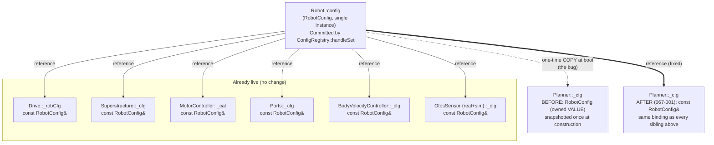

<!-- CLASI: Before changing code or making plans, review the SE process in CLAUDE.md -->

# Architecture Update — Sprint 067: SET-to-Planner config propagation fix

## Sprint Changes Summary

`SET rotSlip=1.0` replies `OK`, `GET rotSlip` reads `1.0`, and turn behavior
does not change. This sprint traces the defect to its root cause, audits
every other plain (unannotated) `CFG_F`/`CFG_I`/`CFG_FI` registry entry for
the same disease, and fixes every live instance found:

1. **`Planner` is the one subsystem in the whole control stack that holds a
   `RobotConfig` by VALUE instead of by live reference.** Every sibling —
   `Drive` (`_robCfg`), `Superstructure` (`_cfg`), `MotorController` (`_cal`),
   `Ports` (`_cfg`), `BodyVelocityController` (`_cfg`), `Motor` (`_cfg`),
   `OtosSensor` real and sim (`_cfg`) — holds `const RobotConfig&`, bound at
   construction to the single `RobotConfig` `Robot` owns, and therefore
   automatically observes every committed `SET`, annotated or not. `Planner`
   alone snapshots a private copy (`RobotConfig _cfg;`) once at boot; its
   `configure(msg::PlannerConfig)` push only ever patches eleven whitelisted
   fields, and **only when a `"planner"`-annotated key is SET in the same
   command** (the whitelist fields themselves are not required to be
   annotated — `toPlannerConfig()` always projects the full struct, so an
   unrelated annotated key in the same `SET` line happens to smuggle a
   bundled field through; alone, it does nothing). `rotationalSlip`,
   `trackwidthMm`, `vWheelMax`, `rotationGainPos`, `rotationGainNeg`, and
   `controlPeriodMs` are read directly off this private copy throughout
   `PlannerBegin.cpp`/`Planner.cpp` and are frozen at the boot default
   forever, regardless of `SET`. **This is the entire reported bug.**
2. **`Drive` has a second, narrower instance of the same disease against
   itself.** `Drive::_drvCfg` (a `msg::DrivetrainConfig` snapshot, refreshed
   only when a `"drive"`-annotated key is SET) shadows the live `_robCfg`
   fallback for `trackwidthMm` and `lagOtosMs`: the fallback's `> 0.0f` guard
   can only fire before `_drvCfg` is first populated (i.e. never, after
   boot's initial `configure()` call), so `SET tw=<x>` alone never reaches
   `Drive`'s EKF-predict step either — even though `Drive` otherwise reads
   `rotationalSlip` from the same `_robCfg` correctly, one line below.
3. **EKF sensor-fusion noise is a third, distinct failure mode.**
   `PhysicalStateEstimate::initEKF()` → `EKFTiny::init()` is called exactly
   once, from `Drive`'s constructor. No live-update path exists for the one
   currently-exposed key (`ekfRHead`/`ekfROtosTheta`), annotated or not.
   Naively "fixing" this by re-invoking `initEKF()` on every relevant `SET`
   would be a regression in its own right: `EKFTiny::init()`'s documented
   contract is "set noise parameters; **reset state and covariance**" — it
   zeroes `_ekf.x[]`/`_ekf.P[]`, so a live re-init would teleport the robot's
   fused pose to the origin mid-mission.
4. **The sprint's own smoking-gun test currently passes for the wrong
   reason.** `tests/simulation/unit/test_rt_slip.py` claims to prove
   `rotSlip` changes RT's arc — and passes on `master` today. Empirical
   instrumentation during this planning pass (a temporary `fprintf` on
   `Planner::_cfg.rotationalSlip` inside `beginRotation()`, compiled,
   exercised, and reverted — no net source change) proved `_cfg.rotationalSlip`
   is `0.920000` on every call regardless of any `SET rotSlip=...` sent
   beforehand. The test's `_arc_after_rt()` helper calls
   `sim.send_command("ZERO")` with **no token**; `parseZero()`
   (`source/commands/SystemCommands.cpp`) requires at least one of
   `enc`/`pose`/`T`/`D` and replies `ERR badarg` to a bare `ZERO` — a reply
   the test never checks. Encoder readings therefore accumulate, un-reset,
   across the two sequential `RT 9000` calls each test function makes. A
   corrected, isolated measurement (fresh `Sim()` per value, `ZERO enc`
   instead of bare `ZERO`) shows the arc is **identical** — 105.02 mm — at
   `rotSlip=1.0` and `rotSlip=0.5`, direct proof of both the bug and of why
   the existing test cannot see it.

This sprint fixes (1), (2), and (3), corrects the (4) test-methodology
defect, and documents (without changing) every registry key the audit found
has no live consumer at all — those keys are inert config, not a
propagation bug, and there is nothing to converge them onto.

---

## Step 1-2: Problem and Responsibility Groups

### Full audit: every plain (unannotated) `CFG_F`/`CFG_I`/`CFG_FI` registry entry

Legend: **LIVE** = consumer already holds a `const RobotConfig&`/equivalent
reference and observes `SET` immediately, no fix needed. **STALE** = a real
propagation bug, fixed this sprint. **DEAD** = no consumer found anywhere in
the current tick path; `SET` already "worked" in the sense that nothing was
ever listening — documented, not fixed. **DEFERRED** = a real propagation
gap, out of this sprint's testable scope (see Open Questions).

| Key(s) | Field(s) | Consumer | Status | Disposition |
|---|---|---|---|---|
| `rotSlip` | `rotationalSlip` | `Planner` (`PlannerBegin.cpp` RT arc target) | STALE | Ticket 001 |
| `tw` | `trackwidthMm` | `Planner` (kinematics, RT/turn omega, decel) | STALE | Ticket 001 |
| `tw` | `trackwidthMm` | `Drive` (`_drvCfg` shadow, EKF-predict) | STALE | Ticket 002 |
| `vWheelMax` | `vWheelMax` | `Planner` (RT `omegaMax` cap) | STALE | Ticket 001 |
| `vWheelMax`, `steerHeadroom` | same | `BodyVelocityController` (wheel saturation) | LIVE (`const RobotConfig&`) | none |
| `rotGainPos`, `rotGainNeg` | `rotationGainPos/Neg` | `Planner` (RT feedforward gain) | STALE | Ticket 001 |
| `rotOffPos`, `rotOffNeg` | `rotationOffsetDeg`/`Neg` | *(none found)* | DEAD | document only |
| `turnGate` | `turnInPlaceGate` | `Planner` (bearing gate; also in `msg::PlannerConfig`'s whitelist but only pushed when bundled with an annotated key) | STALE outside bundling | Ticket 001 (subsumed) |
| `ctrlPeriod` | `controlPeriodMs` | `Planner` (self tick-throttle) | STALE | Ticket 001 |
| `ctrlPeriod` | `controlPeriodMs` | `LoopScheduler` (reads `_robot.config` directly) | LIVE | none |
| `aMax`, `vBodyMax`, `yawRateMax`, `arriveTol` | — | `Planner` via `_cfg`, pushed through `msg::PlannerConfig` whitelist when these annotated keys are SET | Correct today only because a fully-live `_cfg` (Ticket 001) makes the whitelist redundant, not wrong | Ticket 001 makes this unconditionally correct instead of annotation-dependent |
| `aDecel`, `yawAccMax`, `jMax`, `yawJerkMax`, `turnThr`, `doneTol`, `minSpeed` | — | `Planner` via `_cfg`, in the whitelist but **not** annotated — only propagate today when bundled with an annotated key in the same `SET` | STALE outside bundling (same class as `turnGate`) | Ticket 001 (subsumed) |
| `alphaPos`, `alphaYaw`, `otosGate` | OTOS complementary-filter blend | *(none — `Odometry::correct()` has zero call sites; superseded by `correctEKF()` in the EKF cutover)* | DEAD | document only |
| `otosLinSc`, `otosAngSc` | OTOS chip scalar registers | `OtosSensor::init()` — one-time I2C register write in the constructor path, no `configure()` hook exists | STALE, hardware register — **not reachable from sim** (no `OtosSensor` in the sim HAL) | DEFERRED — see Open Questions |
| `ekfRHead` | `ekfROtosTheta` | `Drive` ctor → `PhysicalStateEstimate::initEKF()` (once) | STALE, and unsafe to fix by re-calling `initEKF()` (resets pose/covariance) | Ticket 003 |
| `ml`, `mr`, `kff`, `klf`, `klb`, `krf`, `krb`, `adjThr`, `adjGain` | motor calibration | `Motor`/`MotorController` via `const RobotConfig&` | LIVE | none |
| `vel.kP/kI/kFF/iMax/kAw`, `minWheelMms` | velocity-loop gains | `MotorController::updateVelGains()` — explicit bespoke push in `ConfigRegistry::handleSet`, independent of the annotation mechanism | LIVE | none |
| `vel.filt`, `sync` | `velFiltAlpha`/`syncGain` | read live per-tick (per existing code comment at `ConfigRegistry.cpp:529`) | LIVE | none (verified, not re-derived) |
| `lag.line`, `lag.color` | sensor lag budgets | `Sensors::configure()`, already annotated `"sensors"` (059-004) | LIVE | none |
| `lag.ports` | `lagPortsMs` | `Ports` via `const RobotConfig&` | LIVE | none |
| `lag.otos` | `lagOtosMs` | `Drive` `_drvCfg` shadow — identical bug shape to `tw` | STALE | Ticket 002 |
| `sTimeout` | `sTimeoutMs` | `Superstructure` via `const RobotConfig&` | LIVE | none |
| `tick` | `tickMs` | *(none — `DriveMode::TIMED` retired, T now routes through `beginVelocity`)* | DEAD | document only |
| `tlmPeriod` | `tlmPeriodMs` | `RobotTelemetry`/`LoopTickOnce`, read via a fresh `robot.config` parameter each call | LIVE | none |
| `odomOffX`, `odomOffY`, `odomYaw` | OTOS lever-arm | `OtosSensor` (real + sim) via `const RobotConfig&` | LIVE | none (this is the issue's "odom offsets" — checked, already correct) |
| `turnThr`, `doneTol`, `minSpeed` | legacy go-to tolerances | *(none beyond Planner's own dead `_cfg` mirror)* | DEAD | document only |
| *(not registered)* | `ekfQxy`, `ekfQtheta`, `ekfROtosXy`, `ekfQv`, `ekfQomega`, `ekfROtosV`, `ekfREncV` | `Drive` ctor → `initEKF()` (once) | Not SET-able at all today | out of scope — note for whoever exposes them (sprint 069 candidate) |

### Responsibility groups

| Responsibility | Owning module | Why it changes |
|---|---|---|
| Read live motion-limit/geometry/calibration config throughout Planner's goal-closure math | `Planner` (`source/superstructure/Planner.h`/`.cpp`, `source/control/PlannerBegin.cpp`) | Sole owner of the private `_cfg` snapshot; every reader in this sprint's STALE rows above is a `Planner::_cfg.<field>` read. The fix is entirely a matter of what memory `_cfg` denotes, not a redesign of any consumer. |
| Read live trackwidth/OTOS-lag config in Drive's EKF-predict step | `subsystems::Drive` (`source/subsystems/drive/Drive.cpp`) | Sole owner of the `_drvCfg` shadow-cache and its broken `>0.0f` fallback; the fix is local to two ternaries in one function. |
| Push a live EKF noise update without disturbing filter state | `PhysicalStateEstimate` / `Odometry` / `EKFTiny` (`source/state/PhysicalStateEstimate.*`, `source/control/Odometry.*`, `source/state/EKFTiny.*`) | Sole owners of the EKF's internal `_Q`/`_rOtosXy`/`_rOtosV`/`_rEncV` storage; only they can add a noise-only setter that leaves `x`/`P` untouched. `Drive::configure()` is the trigger point (already receives every committed field via `_robCfg`). |
| Prove SET→consumer propagation and prevent silent recurrence | test suite (`tests/simulation/unit/test_rt_slip.py`, new sweep test) | The existing blind spot is itself confined to one helper function in one file; the sweep test is new, purpose-built coverage for the audit's STALE rows. |

No responsibility spans more than one natural module boundary. The three
fixes (Planner, Drive, EKF) touch disjoint files and have no ordering
dependency on each other.

---

## Step 3: Module Diagrams

### 3a. Config-reference topology — before and after



No cycles: `Robot::config` is the single stable dependency root; every
subsystem depends on it in one direction only, none of them depend on each
other's config views. `Planner`'s conversion from a dotted (copy) edge to a
solid (reference) edge is the entire Ticket 001 change — no other edge in
this graph moves.

### 3b. Drive's internal shadow-cache fix (Ticket 002) and EKF noise push (Ticket 003)

```mermaid
graph TD
    ROBCFG["Drive::_robCfg\nconst RobotConfig& (live)"]
    DRVCFG["Drive::_drvCfg\nmsg::DrivetrainConfig snapshot\nrefreshed only on a \"drive\"-annotated SET"]
    TICKUPDATE["Drive::tickUpdate()\nSTEP 4: EKF predict"]
    EST["PhysicalStateEstimate\nNEW: setNoise(...)"]
    ODO["Odometry\nNEW: setNoise(...)\n(updates cached _rOtosTheta too)"]
    EKF["EKFTiny\nNEW: setNoise(...) — touches _Q/_rOtosXy/_rOtosV/_rEncV ONLY\ninit() (existing) — ALSO resets x[]/P[], now reserved for boot only"]
    CONFIGURE["Drive::configure()\n(fires on any \"drive\"-annotated SET)"]

    ROBCFG -->|"trackwidthMm, lagOtosMs\n(067-002: read directly, bypassing _drvCfg)"| TICKUPDATE
    DRVCFG -.->|"REMOVED for tw/lag.otos\n(067-002)"| TICKUPDATE
    CONFIGURE -->|"setNoise(live _robCfg EKF fields)\n(067-003, annotate ekfRHead \"drive\")"| EST
    EST --> ODO
    ODO --> EKF
```

No cycles. `Drive::configure()` gains one new outbound call
(`_est.setNoise(...)`); nothing downstream of `EKFTiny` calls back up.
`_drvCfg` is not removed as a type (`trackwidthMm`/`lagOtosMs` are among many
fields it still legitimately carries for other purposes, e.g.
`drivetrain_type`) — only these two read sites in `tickUpdate()` stop
consulting it.

---

## Step 4-5: What Changed, module by module

### 1. `Planner` — live `RobotConfig` reference (Ticket 001)

- `source/superstructure/Planner.h`: `RobotConfig _cfg;` (owned value) →
  `const RobotConfig& _cfg;` (reference, matching every sibling subsystem).
  Header comment updated to describe the new contract.
- `source/superstructure/Planner.cpp`: constructor's `_cfg(cfg)` member-init
  syntax is unchanged (reference members bind with the same syntax as value
  members); `Planner::configure()` loses the twelve lines that assigned into
  `_cfg.<field>` (lines 634–645 today) — those assignments would not compile
  against a `const`-qualified reference, and are no longer needed since
  `_cfg` is always current. `_planCfg = cfg;` (a separate, still-owned
  `msg::PlannerConfig` member) is unaffected and retained — see Design
  Rationale Decision 4.
- `source/control/PlannerBegin.cpp`: no changes. Every `_cfg.<field>` read in
  this file is already read-only; it now reads live data for free.
- `tests/simulation/unit/test_rt_slip.py`: `_arc_after_rt()`'s bare
  `sim.send_command("ZERO")` → `sim.send_command("ZERO enc")`, with the reply
  checked (`assert "OK" in reply`) so a future rejected `ZERO` fails loudly
  instead of silently degrading the test into an accumulation artifact.

### 2. `Drive` — stop shadowing the live config for `tw`/`lag.otos` (Ticket 002)

- `source/subsystems/drive/Drive.cpp`, `tickUpdate()`: the two
  `_drvCfg.get_trackwidth() > 0.0f ? _drvCfg.get_trackwidth() :
  _robCfg.trackwidthMm` / `_drvCfg.get_lag_otos() > 0 ? ... :
  _robCfg.lagOtosMs` ternaries are replaced with direct
  `_robCfg.trackwidthMm` / `_robCfg.lagOtosMs` reads — the same pattern the
  very next line already uses correctly for `rotationalSlip`.
- No signature changes; no other call site is affected.

### 3. EKF noise — a noise-only update path (Ticket 003)

- `source/state/EKFTiny.h`/`.cpp`: new `setNoise(q_xy, q_theta, q_v,
  q_omega, r_otos_xy, r_otos_v, r_enc_v)` — updates `_Q`'s diagonal and
  `_rOtosXy`/`_rOtosV`/`_rEncV` exactly as `init()` does, but does **not**
  touch `_ekf.x[]`/`_ekf.P[]`/the rejection-streak counters.
- `source/control/Odometry.h`/`.cpp`: new `setNoise(...)` forwarding to
  `_ekf.setNoise(...)` and additionally refreshing `_rOtosTheta` (Odometry's
  own cached heading-noise value, read by `correctEKF()`).
- `source/state/PhysicalStateEstimate.h`/`.cpp`: new `setNoise(...)`
  forwarding to `_odometry.setNoise(...)`.
- `source/subsystems/drive/Drive.cpp`, `Drive::configure()`: gains a call to
  `_est.setNoise(_robCfg.ekfQxy, _robCfg.ekfQtheta, _robCfg.ekfQv,
  _robCfg.ekfQomega, _robCfg.ekfROtosXy, _robCfg.ekfROtosV,
  _robCfg.ekfREncV, _robCfg.ekfROtosTheta)`, sourced from the live `_robCfg`
  (already reflects the just-committed SET) rather than the `cfg` parameter.
- `source/robot/ConfigRegistry.cpp`: `CFG_F("ekfRHead", ekfROtosTheta)` →
  `CFG_F_SS("ekfRHead", ekfROtosTheta, "drive")`, routing through the
  existing `driveChanged` → `Drive::configure()` path.

### 4. Regression coverage (Ticket 004)

- New sweep test exercising `SET` → observable-consumer-behavior for
  `rotSlip`, `tw`, `vWheelMax`, `rotGainPos`, `rotGainNeg`, `turnGate`,
  `ctrlPeriod`, and `ekfRHead`, each measured in isolation (fresh `Sim()` or
  a reply-checked `ZERO enc`).
- Full default pytest suite run to confirm no regression (baseline 2506
  passed, 0 failed).

---

## Why

Every change traces to a specific, cited, and — for the primary `rotSlip`
defect — **empirically reproduced** root cause:

- Ticket 001 fixes the exact mechanism the issue describes
  (`clasi/issues/set-config-not-propagated-to-planner.md`): the config
  registry's `configure()` push only reaches subsystems for annotated keys,
  and `Planner` additionally holds a copy that even the annotated push only
  partially updates. Converting `Planner` to the same live-reference pattern
  already proven correct by five other subsystems removes the entire class
  of bug — including four sibling keys (`tw`, `vWheelMax`, `rotGainPos/Neg`)
  the issue's own scope explicitly asked to be audited, plus the fragile
  "only propagates when bundled" behavior of `turnGate`/`aDecel`/`yawAccMax`/
  `jMax`/`yawJerkMax`/`turnThr`/`doneTol`/`minSpeed`.
- Ticket 002 fixes a second, independently-discovered instance of the exact
  same disease pattern (a cached snapshot shadowing a live reference)
  inside `Drive` itself — found only because the audit checked every
  `_drvCfg` read site, not just the ones the issue named.
- Ticket 003 fixes the issue's explicitly-named "EKF noise keys" audit item,
  and does so carefully: naively applying the issue's suggested "annotate +
  push" fix by re-calling `initEKF()` would introduce a new, worse bug (pose
  reset on every noise tune) — the ticket exists specifically to add the
  narrower `setNoise()` API this requires.
- Ticket 004 exists because this planning pass discovered the project's own
  regression test for this exact bug (`test_rt_slip.py`) is a false
  positive, and "the audit is recorded" is not enough — the issue's own
  acceptance criteria demand a regression test that would actually have
  caught the reported bug.

---

## Impact on Existing Components

| Component | Impact |
|---|---|
| `source/superstructure/Planner.h` | **Modified.** `_cfg` changes from `RobotConfig` to `const RobotConfig&`. No public method signature changes. |
| `source/superstructure/Planner.cpp` | **Modified.** `configure()` loses its now-invalid `_cfg.<field> =` assignments; `_planCfg = cfg;` retained. |
| `source/control/PlannerBegin.cpp` | **Unaffected in code** — every `_cfg` read here is read-only and compiles unchanged against a reference; behavior changes (for the better) because the data is now live. |
| `source/subsystems/drive/Drive.cpp` | **Modified.** Two ternaries in `tickUpdate()` (trackwidth, OTOS lag) read `_robCfg` directly; `Drive::configure()` gains one new call to `_est.setNoise(...)`. |
| `source/state/EKFTiny.{h,cpp}` | **Modified.** New `setNoise(...)` method; `init()` unchanged (still resets state — now documented as boot-only). |
| `source/control/Odometry.{h,cpp}` | **Modified.** New `setNoise(...)` forwarding method; refreshes the cached `_rOtosTheta`. |
| `source/state/PhysicalStateEstimate.{h,cpp}` | **Modified.** New `setNoise(...)` forwarding method. |
| `source/robot/ConfigRegistry.cpp` | **Modified.** `ekfRHead`'s registry row gains a `"drive"` subsystem annotation (`CFG_F` → `CFG_F_SS`). No other row changes — dead/live keys found by the audit are left exactly as they are (see Design Rationale Decision 5). |
| `tests/simulation/unit/test_rt_slip.py` | **Modified.** `ZERO` → `ZERO enc`, reply-checked. |
| New test file (Ticket 004) | **New.** Sweep coverage for the full STALE-row list above. |
| `msg::PlannerConfig`, `PlannerConfig.{h,cpp}` (`toPlannerConfig`), the `"planner"` annotation in `ConfigRegistry.cpp` | **Unaffected.** Left in place as harmless, now-largely-redundant plumbing — see Design Rationale Decision 4. |
| `Superstructure`, `MotorController`, `Ports`, `BodyVelocityController`, `Motor`, `OtosSensor` (real + sim), `Sensors` | **Unaffected.** Already correct; audited and confirmed, not modified. |
| `data/robots/tovez.json`, `DefaultConfig.cpp` | **Unaffected.** No default-value or schema change. The per-robot `rotational_slip: 0.92` calibration now genuinely takes effect if recalibrated at runtime — that recalibration itself is out of this sprint's scope. |

---

## Migration Concerns

- **No wire-protocol change.** No `SET`/`GET` key is added, renamed, or
  removed (Ticket 003 only adds a subsystem annotation to an existing key's
  internal registry row — invisible on the wire). No `RobotConfig` field is
  added, removed, or resized.
- **No data/schema migration.** `RobotConfig` layout is unchanged; no
  persisted state format changes.
- **Reference-lifetime safety (Ticket 001).** `Planner::_cfg` becomes a
  reference bound to `Robot::config` in the Planner constructor's
  initializer list, exactly mirroring `Drive`'s already-working
  `_robCfg(cfg)` binding from the same constructor call chain. `Robot`
  already declares `config` before `planner` in its member list (required
  for `Drive`'s existing reference to be valid) — Planner's new reference
  has no additional lifetime requirement beyond what already holds for
  `Drive`.
- **Behavioral change on already-shipped robots.** Any deployed
  configuration that happens to run with `rotSlip`, `tw`, `vWheelMax`,
  `rotGainPos`/`rotGainNeg`, or `turnGate` SET away from
  `DefaultConfig.cpp`'s compiled value via a runtime `SET` (not the
  per-robot JSON, which is read at boot and therefore was never affected by
  this bug) will see its **first** post-boot `SET` of that key start taking
  effect where it silently did not before. `tovez.json`'s
  `rotational_slip: 0.92` is unaffected (it equals the compiled default and
  is loaded at boot through the normal JSON path, not through this bug).
- **EKF noise re-application is not reachable from sim only** for the
  hardware-scalar keys `otosLinSc`/`otosAngSc` (no `OtosSensor` in the sim
  HAL) — deferred, see Open Questions. The `ekfRHead` fix (Ticket 003) IS
  sim-reachable (the EKF is shared code between real firmware and sim) and
  is tested as part of this sprint.
- **Deployment sequencing (firmware build).** `Planner`/`Drive`/`EKFTiny`/
  `Odometry`/`PhysicalStateEstimate`/`ConfigRegistry` changes touch
  ARM-target firmware source; per project knowledge
  (`stale-incremental-build-on-volumes.md`), a `--clean` build is required
  before any HITL validation. This sprint's test strategy is sim/unit-tier
  only, so no HITL validation is required to close the sprint, but the
  clean-build requirement applies to whoever validates on hardware
  afterward — and, per this planning pass's own experience, to the sim
  build too (a stale sim `.dylib`/`.so` was the first, incorrect hypothesis
  investigated before instrumentation proved the bug is real and the
  passing test is the anomaly).

---

## Design Rationale

### Decision 1: convert `Planner::_cfg` to a live reference, rather than annotating each stale key

**Context:** The issue itself proposes two options: annotate each stale key
with its owning subsystem so the existing `configure()` push fires, or
convert `Planner` to a live reference like `Superstructure` already uses.
The audit found **six** distinct plain keys with a live Planner consumer
(`rotSlip`, `tw`, `vWheelMax`, `rotGainPos`, `rotGainNeg`, `ctrlPeriod`) plus
seven more (`turnGate`, `aDecel`, `yawAccMax`, `jMax`, `yawJerkMax`,
`turnThr`, `doneTol`, `minSpeed`) that are in `msg::PlannerConfig`'s
whitelist but only propagate when bundled with an annotated key in the same
`SET` line.

**Alternatives considered:**
- *Annotate each of the six newly-found keys `"planner"`, and extend
  `msg::PlannerConfig`/`toPlannerConfig()`/`Planner::configure()` to carry
  and apply them* (the issue's first option, applied literally). This
  requires: a new field on the `msg::PlannerConfig` wire-adjacent struct, a
  new `toPlannerConfig()` projection line, and a new `_cfg.<field> =`
  assignment in `configure()` — **per key**. Six keys means six sets of
  three-line additions across three files, plus the thirteen already-listed
  fragile-bundling fields would still only propagate opportunistically
  (any future plain key Planner starts reading would silently reintroduce
  this exact bug, since nothing in the type system flags "Planner reads a
  `RobotConfig` field that isn't in the whitelist").
- *Live reference (chosen).* One field-declaration change
  (`RobotConfig` → `const RobotConfig&`), a twelve-line deletion in
  `configure()`, and zero changes to any of the thirty-plus call sites in
  `PlannerBegin.cpp`/`Planner.cpp` that read `_cfg.<field>` today. Every
  current and *future* plain key Planner reads is live by construction —
  the same guarantee `Drive`/`Superstructure`/`MotorController`/`Ports`/
  `BodyVelocityController`/`Motor`/`OtosSensor` already provide.

**Why this choice:** The annotation approach doesn't just cost more lines —
it leaves the exact same landmine in place for the next engineer who adds a
config-driven behavior to `Planner`. The live-reference approach makes
`Planner` structurally identical to every other config consumer in the
codebase; there is no longer a "the Planner is different" fact to remember.
Six-for-one is also simply the smaller diff.

**Consequences:** `Planner::configure()`'s eleven-field whitelist becomes
functionally redundant for anything that mirrors a `RobotConfig` field
one-to-one (which is all eleven of its fields) — see Decision 4 for why it
is retained rather than deleted this sprint. `msg::PlannerConfig`/`_planCfg`
become confirmed-dead internal state (already partially true before this
sprint — `_planCfg` was never read anywhere, only written).

### Decision 2: fix Drive's `_drvCfg` shadow by reading `_robCfg` directly, not by widening the annotation

**Context:** `Drive::tickUpdate()`'s trackwidth/lag-otos ternaries already
*intend* a live fallback (`_drvCfg.get_X() > 0.0f ? _drvCfg.get_X() :
_robCfg.X`) — the bug is that the fallback's guard condition can never be
true again once boot's `configure()` call populates a positive `_drvCfg`
value, since neither `tw` nor `lag.otos` is `"drive"`-annotated.

**Alternatives considered:**
- *Annotate `tw` and `lag.otos` `"drive"`* so `Drive::configure()` (and
  hence a refreshed `_drvCfg`) fires on every `SET tw=...`. This would also
  retroactively fix any *other* field `_drvCfg` shadows the same way
  (audited: none currently do — `otosLinSc`/`otosAngSc`/`rotGainPos/Neg`/
  `rotOffPos/Neg` are projected into `_drvCfg` but never read back out of
  it in `Drive.cpp`, so annotating them would have no effect on `Drive`).
  But this reintroduces exactly the "propagates only when this
  specific key is annotated" fragility Decision 1 just eliminated for
  Planner, one layer down.
- *Read `_robCfg` directly (chosen).* `Drive.cpp` already does this,
  correctly, one line below (`rotationalSlip`) — the fix makes `tw`/
  `lag.otos` consistent with their own neighbor instead of introducing a
  second mechanism.

**Why this choice:** `_drvCfg` remains useful for fields it does something
`_robCfg` cannot do directly (the `msg::DrivetrainConfig` accessor API,
`drivetrain_type`'s capability-reporting use) — this fix does not remove
`_drvCfg`, it just stops two specific reads from consulting a cache that
never refreshes for their keys.

**Consequences:** None beyond the two changed read sites; no signature or
cross-file change.

### Decision 3: add a dedicated `setNoise()` rather than reusing `EKFTiny::init()`

**Context:** `EKFTiny::init()`'s only current caller is `Drive`'s
constructor, at boot, when `_ekf.x`/`_ekf.P` are already zero — the reset is
harmless there. Calling it again from a live `SET` would not be harmless:
it would zero the robot's actual, in-flight pose and covariance.

**Alternatives considered:**
- *Reuse `init()`, guard the reset with a "first call only" flag.* Adds
  hidden statefulness to a class whose entire value is being a small,
  stateless-feeling numeric object; a future caller (e.g. a hardware
  recalibration flow that legitimately wants a full reset) would need a
  second method anyway.
- *`setNoise()` as a new, narrow method (chosen).* Touches only `_Q`'s
  diagonal and the three cached measurement-noise scalars; `init()`'s
  contract is unchanged and is now explicitly documented as boot-only.

**Why this choice:** Matches the project's existing idiom for "update a
subset of a subsystem's internal state without disturbing the rest" —
`MotorController::updateVelGains()` is the precedent (pushes gains without
touching the PID's running integrator state).

**Consequences:** `EKFTiny`/`Odometry`/`PhysicalStateEstimate` each gain one
small new method; no existing method signature changes.

### Decision 4: leave `msg::PlannerConfig`/`_planCfg`/the `"planner"` registry annotation in place

**Context:** After Decision 1, nothing reads `_planCfg`, and
`Planner::configure()`'s eleven-field whitelist no longer does anything
`_cfg` (now live) doesn't already provide for free.

**Alternatives considered:**
- *Remove `msg::PlannerConfig`, `toPlannerConfig()`, `Planner::configure()`,
  and the `"planner"` annotation rows in `ConfigRegistry.cpp` this sprint.*
  Correctly-scoped as a follow-up simplification, but it touches the
  `SubsystemContract` uniformity (`Drive`/`Sensors`/`Planner` all currently
  expose a `configure(SomeConfigMsg)` entry point) and would need its own
  review of whether any test (`test_059_config_routing.py`'s
  `test_set_amax_routes_to_planner`) needs rewriting rather than deleting.
- *Leave it in place (chosen).* `Planner::configure()` still compiles, still
  gets called, still writes `_planCfg` (a harmless, unread struct) — zero
  behavioral risk, and it preserves the `SubsystemContract`-shaped
  `configure()` entry point in case a future field is added to `Planner`
  that genuinely needs a delta-only push (e.g. something that isn't a
  one-to-one `RobotConfig` mirror).

**Why this choice:** Sprint scope discipline — this sprint's job is to make
`SET` reach every live consumer, not to delete now-redundant plumbing that
isn't broken. Flagged as Open Question 2 for a future cleanup sprint.

**Consequences:** `test_059_config_routing.py::test_set_amax_routes_to_planner`
continues to pass unchanged (it asserts the projected `PlannerConfig.a_max`
reflects the SET value, which remains true).

### Decision 5: document dead keys; do not "fix" them

**Context:** `alphaPos`/`alphaYaw`/`otosGate` (no consumer — `Odometry::correct()`
is dead code since the EKF cutover), `rotOffPos`/`rotOffNeg` (no consumer
found anywhere), and `turnThr`/`doneTol`/`minSpeed` (no consumer beyond
Planner's own now-dead `_cfg` mirror) all have **zero** live consumers.

**Alternatives considered:**
- *Wire them into something* (e.g. resurrect `Odometry::correct()`, add a
  consumer for the rotation offsets). Out of scope — this sprint fixes
  propagation to *existing* consumers; inventing new consumers for
  previously-inert knobs is a feature addition, not a bug fix, and was not
  asked for.
- *Remove the dead registry keys.* Also out of scope, and riskier than
  leaving them: removing a `GET`/`SET`-able key is a wire-protocol change
  that could break an external caller that reads (even if it does nothing
  with) that value.
- *Document and leave alone (chosen).*

**Why this choice:** The issue's acceptance criterion is "every stale-copy
key either annotated or its consumer converted to live-reference reads" —
these keys have no stale copy to converge, because they have no consumer at
all. Recording that fact in this document closes the audit criterion
precisely without expanding scope.

**Consequences:** None — no code changes. A stakeholder who wants these
knobs to do something again has that entered as Open Question in this
document.

---

## Open Questions

1. **`otosLinSc`/`otosAngSc` hardware-scalar re-apply.** These SET real
   OTOS-chip registers once, at `OtosSensor::init()`, with no `configure()`
   hook to re-apply a later `SET`. This is a genuine propagation bug of the
   same species as the rest of this sprint, but (a) it is not reachable from
   the sim test suite at all (no `OtosSensor` in the sim HAL — only
   `SimOdometer`), so this sprint's sim-only test strategy cannot verify a
   fix, and (b) I2C register writes on every unrelated `"drive"`-annotated
   `SET` would need a change-detection guard to avoid needless hardware
   traffic. Recommend: file a follow-up issue for a HIL-validated fix in a
   sprint with bench/hardware test capacity, rather than ship an unverifiable
   change here.
2. **Remove the now-redundant `msg::PlannerConfig`/`_planCfg`/`"planner"`
   registry annotation** in a future cleanup sprint, once Decision 4's
   "leave it, it's harmless" holds up in practice. Not blocking.
3. **`EKFTiny::init()`'s dual role** (set noise + reset state) is a latent
   hazard for any *other* future caller, not just this sprint's. Should its
   API be split/renamed at the type level (e.g. `init()` asserts it is only
   ever called once, or is renamed `resetForBoot()`) beyond adding the
   narrower `setNoise()` this sprint needs? Deferred — no second caller
   exists today to motivate it.
4. **Should the `test_rt_slip.py` false-positive pattern (unchecked command
   reply + state accumulation across sequential measurements within one
   test) prompt an audit of other existing sim tests for the same
   anti-pattern?** Out of this sprint's scope (which fixes the one instance
   this bug's investigation surfaced), but worth a stakeholder decision on
   whether it's worth a dedicated future sprint.
5. **The seven not-yet-SET-able EKF process/measurement-noise fields**
   (`ekfQxy`, `ekfQtheta`, `ekfROtosXy`, `ekfQv`, `ekfQomega`, `ekfROtosV`,
   `ekfREncV`) are candidates for the same `Ticket 003` `setNoise()` path if
   a future sprint (069's sim-to-hardware fitting workflow is the likely
   candidate) exposes them via the registry — the plumbing this sprint adds
   already accepts all of them; only new registry rows would be needed.
