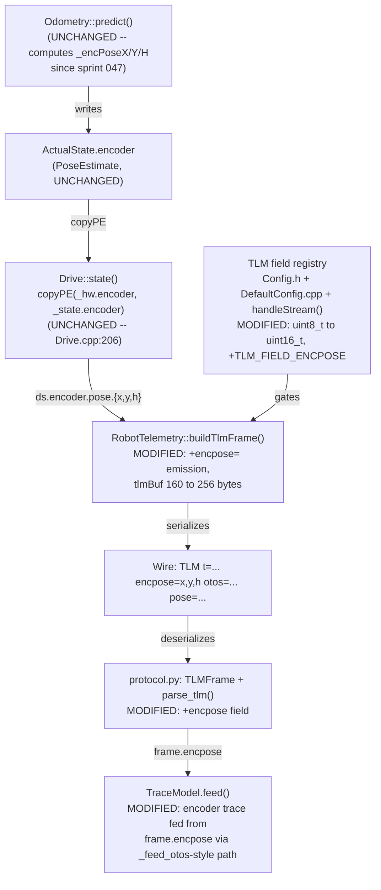
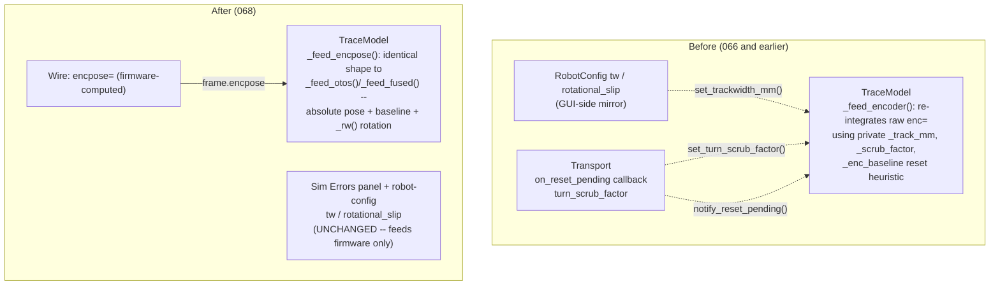

<!-- CLASI: Before changing code or making plans, review the SE process in CLAUDE.md -->

# Architecture Update — Sprint 068: Three world poses in TLM (firmware `encpose=`)

## Sprint Changes Summary

Telemetry carries `otos=` (raw OTOS pose) and `pose=` (fused EKF), but no
encoder-only dead-reckoned pose — the host reconstructs one in
`TraceModel._feed_encoder` (`host/robot_radio/testgui/traces.py`) using a
private trackwidth constant, a reset-detection heuristic, and a turn-scrub
knob synced to the *simulator's* injected error. That reconstruction has
produced three known defects (missed-reset heading cancellation 2026-07-01,
CR-09's slow-TLM reset misses, the 2026-07-02 scrub-knob desync).

**The central finding of this planning pass: the firmware already computes
the encoder-only pose and has since sprint 047.** `Odometry::predict()`
(`source/control/Odometry.cpp`) maintains a private `_encPoseX/Y/H`
accumulator, arc-integrated from wheel deltas only, written every tick into
`ActualState.encoder` (`source/state/ActualState.h`) — a `PoseEstimate` field
that sits alongside `.optical` (raw OTOS) and `.fused` (EKF) in the same
struct. `subsystems::Drive::state()` already copies it through into
`msg::DrivetrainState.encoder` (`source/messages/drivetrain.h`,
`Drive.cpp:206`: `copyPE(_hw.encoder, _state.encoder);`) — identically to how
`.fused` and `.optical` are copied. **The only thing missing is one
`snprintf` call in `Robot::buildTlmFrame()`** (`source/robot/RobotTelemetry.cpp`)
to put `ds.encoder.pose.{x,y,h}` on the wire. This sprint is a wire-exposure
and host-simplification sprint, not a new-integration-math sprint — exactly
as the issue predicted.

Two non-trivial findings surfaced during investigation that shape the
ticket plan:

1. **The TLM field-subscription bitmask (`RobotConfig::tlmFields`) is a
   `uint8_t` with all 8 bits already assigned** (`source/types/Config.h:7-15`,
   confirmed by the sprint-064 comment at `RobotTelemetry.cpp:82`: "the
   uint8_t bitmask's 8 bits are all already assigned"). A 9th field needs a
   wider bitmask, not just a new constant.
2. **The `buildTlmFrame()` stack buffer (`char tlmBuf[160]`,
   `RobotTelemetry.cpp:208`) is already close to (and, under worst-case
   coordinate magnitudes, over) its limit** with the *existing* field set.
   Adding a 24-30-byte `encpose=` field without growing the buffer would
   silently truncate trailing fields (`line=`/`color=`/`ekf_rej=`) on any
   frame that also carries `otos=` and near-boundary coordinates. See
   Design Rationale Decision 2 for the arithmetic.

This sprint (a) exposes `encpose=` on the wire behind the widened bitmask,
(b) grows the TLM buffer to remove the truncation risk, (c) teaches the host
protocol layer the new field, and (d) deletes the entire host-side encoder
re-integration in `TraceModel`, replacing it with the same
absolute-world-pose-plus-baseline-rotation pattern already used for
`otos=`/`pose=` (`_feed_otos`/`_feed_fused`). The Sim Errors panel and all
robot-config calibration values (`tw`, `rotational_slip`) are untouched —
they already feed the firmware integrator live, thanks to sprint 067.

---

## Step 1: Understand the Problem

**What changes:** the wire protocol gains one new named TLM field
(`encpose=`), the field-subscription mechanism widens to accommodate it, and
one host module (`TraceModel`) loses roughly half its code — the half that
existed only to fake, host-side, what the firmware now transmits directly.

**What does not change:** the odometry math. `Odometry::predict()`'s encoder
accumulator, `Drive`'s state-copy plumbing, and the `msg::DrivetrainState`
schema are all already correct and already wired end-to-end inside the
firmware process — this sprint's firmware ticket adds a read of data that
already exists, not a new computation.

**Why now:** sprint 067 made `SET tw`/`SET rotSlip` reach `Planner` and
`Drive` live (`Planner::_cfg`, `Drive::_drvCfg` shadow fix). The firmware
encoder-only accumulator (`Odometry::predict`, called from
`Drive::tickUpdate()` via `_est.addOdometryObservation(_hw, trackwidth,
rotSlip, now)` at `Drive.cpp:127-129`) already reads `_robCfg.trackwidthMm`/
`_robCfg.rotationalSlip` directly — both **live** post-067. Before 067, a
firmware-side `encpose=` would have been calibrated against a frozen
boot-time trackwidth/slip on the `Planner` side (irrelevant to `Odometry`
itself, which was never the buggy consumer) — but the *host* would have had
no live signal that recalibration had happened either way. This sprint
depends on 067 only in the sense that "the whole system's calibration story
is now internally consistent" — not because `Odometry::predict()` itself was
touched by 067.

---

## Step 2: Identify Responsibilities

| Responsibility | Changes independently because... |
|---|---|
| Decide which TLM fields exist and how they're named/subscribed | Adding a named field is a protocol-surface decision (bitmask width, `STREAM fields=` vocabulary, default subscription) independent of what data the field carries. |
| Serialize the per-tick pose/sensor snapshot into the wire TLM line | `buildTlmFrame()` is the single point that turns internal state into text; it changes whenever a field is added, regardless of where the data came from. |
| Compute the encoder-only pose | `Odometry::predict()` — **unchanged this sprint** (already correct since 047); listed for completeness so it's clear what is and isn't being touched. |
| Parse a TLM wire line into a host-side structured frame | `protocol.py::parse_tlm`/`TLMFrame` is the mirror-image serializer/deserializer boundary; it changes in lockstep with the wire format, never independently of it. |
| Accumulate and render world-frame trace polylines for the TestGUI | `TraceModel` — today conflates "receive absolute poses and rotate them into the display frame" (already correct, used by otos/fused) with "reconstruct an approximate pose from raw counts" (the code being deleted). Splitting these was always the right boundary; this sprint completes it by removing the second half entirely. |
| Classify commands as reset-inducing / wire scrub calibration into the trace model | `Transport`/`__main__.py`'s `on_reset_pending`/`turn_scrub_factor`-to-trace wiring exists **only** to feed the code being deleted. It has no other reason to exist and changes for the same reason `_feed_encoder` does. |

No responsibility spans more than one of the modules below. The firmware
field-registry change and the firmware serializer change touch adjacent but
distinct files (`Config.h`/`DefaultConfig.cpp`/`SystemCommands.cpp` vs.
`RobotTelemetry.cpp`) and have no ordering dependency on each other within
the same ticket. The host protocol change and the TestGUI change are
strictly sequential: `TraceModel` cannot consume `frame.encpose` until
`TLMFrame` has it.

---

## Step 3: Subsystems and Modules

| Module | Purpose (one sentence, no "and") | Boundary | Use cases served |
|---|---|---|---|
| **TLM field registry** (`source/types/Config.h`, `source/robot/DefaultConfig.cpp`, `source/commands/SystemCommands.cpp::handleStream`) | Defines which named telemetry fields exist and which are currently subscribed. | Inside: bitmask constants, the `RobotConfig::tlmFields` storage type, the `STREAM fields=<csv>` name table. Outside: what each field's *content* is (that's the serializer's job) and how the field is computed (that's `Odometry`'s/sensor drivers' job). | SUC-001, SUC-004 |
| **TLM serializer** (`source/robot/RobotTelemetry.cpp::buildTlmFrame`) | Renders the current tick's subscribed fields into one wire-format text line. | Inside: `snprintf` calls, field ordering, buffer-capacity management. Outside: what data a field carries (reads it from `drive.state()`/`sensors.state()`, doesn't compute it) and which fields are subscribed (reads `config.tlmFields`, doesn't decide it). | SUC-001 |
| **Encoder-only pose accumulator** (`source/control/Odometry.{h,cpp}`, `source/state/ActualState.h`) | Dead-reckons a world pose from wheel-encoder deltas only. | Inside: `_encPoseX/Y/H` integration, `ActualState.encoder`. Outside: the EKF (`.fused`), OTOS readings (`.optical`), and TLM transmission — none of which this module knows about. **Unchanged this sprint** — cited for boundary clarity only. | SUC-001, SUC-003 |
| **Host wire protocol** (`host/robot_radio/robot/protocol.py`: `TLMFrame`, `parse_tlm`) | Translates one TLM wire line into a structured, typed frame. | Inside: field-name-to-dataclass-attribute mapping, numeric parsing/tuple-shaping. Outside: what any consumer does with a parsed field. | SUC-001 |
| **Trace accumulator** (`host/robot_radio/testgui/traces.py::TraceModel`) | Converts a stream of absolute sensor poses into world-cm polylines for display. | Inside: anchor/baseline bookkeeping, the `_rw()` rotation-and-translate transform, per-trace enable flags. Outside: how a pose was computed upstream (encoder, OTOS, or EKF) — after this sprint, `TraceModel` treats all three exactly alike. | SUC-002 |
| **TestGUI transport wiring** (`host/robot_radio/testgui/transport.py`, `host/robot_radio/testgui/__main__.py`) | Bridges the serial/sim connection's command and telemetry events to GUI-facing callbacks. | Inside: command classification, callback dispatch. Outside: trace math (delegates entirely to `TraceModel`). This sprint removes the one callback family (`on_reset_pending`) whose only consumer is code being deleted. | SUC-002 |

### Explicitly out of this sprint's module set

`transport.py`'s `turn_scrub_factor` property and the Sim Errors panel it
backs are **not** in the table above — they are unchanged. They configure
the *simulator's plant* (injected error), a different concern from the
*display-layer reconstruction* being deleted. The only edge removed is
`__main__.py:1736`'s wiring of that value **into `TraceModel`** — the
property, its sim-side consumer, and the GUI panel that sets it all remain.

---

## Step 4: Diagrams

### 4a. Firmware data flow — mostly unchanged, one new tap point



No cycles. Data flows one direction, sensor/estimator → wire → host, exactly
as `otos=`/`pose=` already do; `encpose=` is a third parallel instance of an
existing flow shape, not a new shape.

### 4b. Host TestGUI — decoupling `TraceModel` from `Transport`/config mirroring



No cycles in either graph. The "after" graph has **strictly fewer edges**
into `TraceModel`: it now depends on exactly one thing (the wire frame),
matching the dependency shape `otos`/`fused` already had. `SimErrors`/robot
config keep their existing edge into the firmware (via `SET tw`/`SET
rotSlip`, sprint 067) — that edge is outside this diagram's scope because it
doesn't touch `TraceModel` at all, which is the point.

### ER diagram / dependency graph

Not included. No persisted or wire-*schema* data model changes shape
(`msg::DrivetrainState`, `ActualState`, and `PoseEstimate` are all
pre-existing, untouched structs — this sprint reads one already-populated
field of an existing struct). No new inter-module *dependency* is
introduced anywhere in the firmware; the one dependency that disappears
(`TraceModel` ← `Transport.on_reset_pending`/`turn_scrub_factor`) is shown
in 4b instead, since "a dependency graph if module dependencies change"
is best read alongside the before/after component diagram it explains.

---

## Step 5: What Changed / Why / Impact / Migration

### What Changed

**Firmware:**

- `source/types/Config.h`: `RobotConfig::tlmFields` widens `uint8_t` →
  `uint16_t`; new `constexpr uint16_t TLM_FIELD_ENCPOSE = (1u << 8);`;
  `TLM_FIELD_ALL` widens from `0xFFu` to `0x1FFu` (9 bits).
- `source/robot/DefaultConfig.cpp:119`: `p.tlmFields = 0xFF;` →
  `p.tlmFields = TLM_FIELD_ALL;` (now `0x1FF`) so `encpose=` is on by
  default — required because TestGUI and every existing sim test call bare
  `STREAM <ms>` with no `fields=` clause (verified: no call site in
  `host/` or `tests/` narrows the default subscription for live use;
  `STREAM fields=...` appears only in protocol-unit-test fixtures and a few
  `tests/old/dev/` probe scripts).
- `source/commands/SystemCommands.cpp::handleStream`: local `mask` widens
  `uint8_t` → `uint16_t`; add `if (strcmp(fbuf, "encpose") == 0) mask |=
  TLM_FIELD_ENCPOSE;`; `kFieldNames[]` table (and its `bit` field type)
  gains the `{TLM_FIELD_ENCPOSE, "encpose"}` entry; the loop bound `fi < 8`
  → `fi < 9`.
- `source/robot/RobotTelemetry.cpp::buildTlmFrame`: new block, gated on
  `config.tlmFields & TLM_FIELD_ENCPOSE`, inserted immediately after the
  existing `pose=` block (before `vel=`):
  ```cpp
  if (config.tlmFields & TLM_FIELD_ENCPOSE) {
      n = snprintf(buf + pos, (size_t)rem, " encpose=%d,%d,%d",
                   (int)ds.encoder.pose.x,
                   (int)ds.encoder.pose.y,
                   (int)(ds.encoder.pose.h * kRadToCdeg));
      if (n > 0 && n < rem) { pos += n; rem -= n; }
  }
  ```
  No freshness/staleness gate (unlike `otos=`/`line=`/`color=`) — the
  encoder pose updates unconditionally every control tick, it is never
  stale in the sense external hardware readings can be.
- `source/robot/RobotTelemetry.cpp::telemetryEmit`: `char tlmBuf[160]` →
  `char tlmBuf[256]` (see Decision 2).
- `docs/protocol-v2.md` §8: document `encpose=` in the TLM Frame Format
  table and the field-name list, alongside a fix for the pre-existing drift
  already present in that section (see Migration Concerns).

**Host protocol:**

- `host/robot_radio/robot/protocol.py`: `TLMFrame` gains `encpose:
  tuple[int, int, int] | None = None`; `parse_tlm()` gains a parse block
  for `"encpose"` identical in shape to the existing `"otos"` block.
- `tests/_infra/golden_tlm_capture.json`: regenerated (every frame in the
  fixed sequence now carries `encpose=`).

**TestGUI:**

- `host/robot_radio/testgui/traces.py` (`TraceModel`): **deleted** —
  `_TRACK_MM` module constant; `_geom_track_mm`, `_scrub_factor`,
  `_track_mm` instance attributes; `_recompute_track()`,
  `set_trackwidth_mm()`, `set_turn_scrub_factor()`, `notify_reset_pending()`,
  `_feed_encoder()`; `_enc_baseline`, `_enc_h`, `_enc_bx`, `_enc_by`
  instance attributes and their resets in `_reset_baselines()`. **Added** —
  `_encpose_baseline` attribute and `_feed_encpose()`, structurally
  identical to `_feed_otos()`/`_feed_fused()` (absolute world pose,
  baseline-on-first-frame, `_rw()` rotation). `feed()` calls
  `self._feed_encpose(frame.encpose)` in place of
  `self._feed_encoder(frame.enc)`. The `encoder` trace list, its `enabled`
  flag, and its rendering are otherwise unchanged — only its data source
  changes.
- `host/robot_radio/testgui/__main__.py`: remove the `trace_model.set_trackwidth_mm(...)`
  call (~line 1313), the `trace_model.set_turn_scrub_factor(...)` call
  (~line 1736), and the `transport.on_reset_pending = trace_model.notify_reset_pending`
  wiring (~line 1757). Nothing else at these call sites changes — the
  surrounding code that reads `tw`/`turn_scrub_factor` for *other* purposes
  (if any) is untouched.
- `host/robot_radio/testgui/transport.py`: remove `is_reset_inducing_command()`,
  the `on_reset_pending` attribute, and `_maybe_notify_reset_pending()`
  (and its four call sites). **Do not touch** `turn_scrub_factor` (the
  property backing the Sim Errors panel) — it has a second, independent
  consumer (the simulator's injected-error configuration) and stays.
- `tests/testgui/test_traces.py`: remove tests exercising the deleted
  `notify_reset_pending()`/`set_turn_scrub_factor()`/`set_trackwidth_mm()`
  API; add tests for `_feed_encpose()` mirroring the existing
  `_feed_otos()`/`_feed_fused()` test coverage.
- `tests/testgui/test_transport.py`: remove the `on_reset_pending`
  test classes/cases; **retain** the `turn_scrub_factor` /
  `apply_error_profile()` test class (Sim Errors panel backing —
  unaffected by this sprint).

**New regression test:**

- A zero-injected-error sim test (tier: `tests/simulation/system/`, a
  multi-leg maneuver in the shape of the TestGUI's `TOUR_1` sequence) that
  asserts `encpose`, `otos`, `pose` (all three wire poses) and
  `sim.get_true_pose()` (plant ground truth) agree within a small tolerance
  throughout the maneuver.

### Why

Every change traces directly to the issue's requirement or an
implementation fact discovered while planning it:

- The firmware field-registry and serializer changes exist because
  `encpose=` is new wire vocabulary and the existing bitmask has no room
  (Decision 1) and the existing buffer has no headroom (Decision 2) — both
  discovered, not assumed, by reading the actual current code rather than
  the (stale) `docs/protocol-v2.md`.
- No change to `Odometry`/`ActualState`/`Drive` is needed because the
  encoder-only accumulator and its plumbing through to `msg::DrivetrainState`
  already exist (sprint 047) and already consume live trackwidth/slip
  (sprint 067) — confirmed by direct code reading, not inferred from the
  issue's description (which correctly predicted this but did not cite the
  exact call chain).
- The host protocol and `TraceModel` changes exist because the issue's
  explicit requirement is "hosts become dumb plotters" — `_feed_otos()`/
  `_feed_fused()` already are dumb plotters of an absolute wire pose;
  `_feed_encpose()` reuses that exact shape rather than inventing a fourth
  pattern.
- The `transport.py`/`__main__.py` deletions exist because
  `on_reset_pending`/the trace-bound half of `turn_scrub_factor` usage have
  no remaining purpose once `_feed_encoder()` is gone — confirmed by
  grep: their only call sites are the ones being deleted.

### Impact on Existing Components

| Component | Impact |
|---|---|
| `source/control/Odometry.{h,cpp}` | **Unaffected.** Already produces the data this sprint exposes. |
| `source/state/ActualState.h`, `source/messages/drivetrain.h` | **Unaffected.** `PoseEstimate encoder` already exists in both structs. |
| `source/subsystems/drive/Drive.cpp` | **Unaffected.** `copyPE(_hw.encoder, _state.encoder)` already runs every tick. |
| `source/types/Config.h` | **Modified.** `tlmFields` type widens; one new bitmask constant; `TLM_FIELD_ALL` widens. No other `RobotConfig` field changes. |
| `source/robot/DefaultConfig.cpp` | **Modified.** One literal changes (`0xFF` → `TLM_FIELD_ALL`, now `0x1FF`). |
| `source/commands/SystemCommands.cpp` | **Modified.** `handleStream`'s local mask type, name table, and loop bound. No other command handler touched. |
| `source/robot/RobotTelemetry.cpp` | **Modified.** One new field block; buffer size constant. `buildTlmFrame`'s existing fields are unchanged in content; `encpose=` is inserted between `pose=` and `vel=` in emission order. |
| `docs/protocol-v2.md` | **Modified.** §8 gains `encpose=`; pre-existing drift (missing `wedge=`/`twist=`/`otos=`/`ekf_rej=`, all older additions) is a known, separate issue — this sprint documents only what it adds, and flags the drift rather than doing a full rewrite (see Open Questions). |
| `host/robot_radio/robot/protocol.py` | **Modified.** `TLMFrame`/`parse_tlm` gain one field, mirroring `otos`'s exact shape. No other frame field affected. |
| `host/robot_radio/testgui/traces.py` | **Modified, net negative line count.** `TraceModel`'s public surface loses `set_trackwidth_mm`, `set_turn_scrub_factor`, `notify_reset_pending`; gains nothing new on the public surface (`_feed_encpose` is private, matching `_feed_otos`/`_feed_fused`). |
| `host/robot_radio/testgui/transport.py` | **Modified.** Loses the reset-pending callback family. `turn_scrub_factor` property, `apply_error_profile()`, and all Sim-Errors-panel backing code are **unaffected**. |
| `host/robot_radio/testgui/__main__.py` | **Modified.** Three call sites removed; Sim Errors panel UI and its other wiring unaffected. |
| `tests/_infra/golden_tlm_capture.json` | **Regenerated.** Mechanically required — any TLM frame format change invalidates this exact-match fixture. |
| `tests/testgui/test_traces.py`, `tests/testgui/test_transport.py` | **Modified.** Tests for deleted APIs removed; tests for `turn_scrub_factor`/Sim-Errors-panel backing retained unchanged. |

### Migration Concerns

- **No wire-protocol break for existing fields.** `enc=`, `pose=`, `otos=`,
  `vel=`, `twist=`, `line=`, `color=`, `ekf_rej=`, `wedge=` are unchanged in
  content and format. `encpose=` is purely additive; a host that doesn't
  parse it is unaffected (extra `key=value` tokens are already ignored by
  `parse_response`'s generic kv-splitting).
- **`RobotConfig::tlmFields` type change (`uint8_t`→`uint16_t`) is
  internal-only.** It is never transmitted raw — `GET`/`SET` don't expose
  it (only `STREAM fields=<names>` does, by name) — so no wire format is
  affected. `sizeof(RobotConfig)` grows by at most a few bytes from
  alignment; negligible on a 128 KB-RAM part.
- **Old firmware / old host version skew.** A pre-068 host talking to
  post-068 firmware sees an extra `encpose=` token it ignores (safe, as
  above). A post-068 host talking to pre-068 firmware sees `frame.encpose
  is None` — `TraceModel._feed_encpose` must handle `None` the same way
  `_feed_otos`/`_feed_fused` already handle an absent field (skip; no trace
  point appended that tick). No crash, degrades to "no encoder trace,"
  exactly like an OTOS-less robot already shows no `otos=` trace today.
  This same skew note already applies to `wedge=` (064-004) and is not new
  to this sprint.
- **Golden-capture regeneration must land in the same commit/ticket as the
  firmware field addition.** `test_golden_tlm_unchanged` does an exact
  string match; it fails the instant `encpose=` appears in any frame,
  before any other ticket in this sprint runs. This sprint's firmware
  ticket therefore owns the regeneration (not deferred to a later "test
  coverage" ticket) so `uv run python -m pytest` stays green after each
  ticket, per this project's execution discipline.
  Regeneration requires a `--clean` sim build first (project knowledge:
  stale incremental builds on `/Volumes` — build banners lie).
- **Deployment sequencing (firmware build).** All firmware changes are
  ARM-target-and-sim-shared source; a `--clean` build is required for both
  the sim `.dylib`/`.so` (to regenerate the golden capture correctly) and
  any hardware flash that later validates this sprint on a bench, per
  project knowledge.
- **`docs/protocol-v2.md` is already stale independent of this sprint** —
  its TLM Frame Format table and example currently omit `wedge=`, `twist=`,
  `otos=`, and `ekf_rej=`, all shipped in earlier sprints. This sprint adds
  `encpose=` to the table (so the doc doesn't fall one more field further
  behind) but does not undertake a full backfill of the pre-existing gaps —
  flagged as Open Question 1.

---

## Step 6: Design Rationale

### Decision 1: widen the TLM field bitmask to `uint16_t` rather than making `encpose=` unconditional

**Context:** `RobotConfig::tlmFields` is a `uint8_t` with all 8 bits
assigned (`TLM_FIELD_ENC` through `TLM_FIELD_EKFREJ`). Sprint 064-004 hit
the identical wall adding `wedge=` and resolved it by making that field
**unconditional** (always emitted, not gated by the bitmask at all) —
explicitly because "the uint8_t bitmask's 8 bits are all already assigned."

**Alternatives considered:**
- *Make `encpose=` unconditional, following the 064-004 precedent exactly.*
  Zero registry changes needed. But `wedge=` is a 1-bit-per-wheel health
  latch (10 bytes worst case) that every consumer plausibly wants
  unconditionally, for safety-monitoring reasons specific to that field.
  `encpose=` is a full pose (24-29 bytes) that a bandwidth-constrained radio
  consumer might legitimately want to *exclude* — exactly the scenario the
  issue's own "weigh relay bandwidth" instruction anticipates. Making it
  unconditional forecloses that choice permanently.
- *Add a second, separate bitmask byte ("TLM verbosity flags") just for new
  fields going forward.* Solves the immediate problem but introduces a
  second parallel subscription mechanism a host must learn, split
  arbitrarily between "fields in the first byte" and "fields in the
  second" with no principled boundary.
- *Widen `tlmFields` to `uint16_t` (chosen).* One field's storage type
  changes; `TLM_FIELD_ENCPOSE = (1u << 8)` slots in as bit 9 of a now
  16-bit-wide space (7 bits of headroom left for future fields); the
  existing `STREAM fields=<name>,...` mechanism — already exactly the
  right tool for "let an operator opt in/out of a field to manage
  bandwidth" — is extended, not replaced or duplicated.

Separately, the issue also floats *"emit in STREAM TLM only"* (implicitly
excluding `SNAP`) as a candidate mitigation. This is rejected: `buildTlmFrame()`
is explicitly documented (`Robot.h:198`) as "shared by STREAM and SNAP," and
every existing pose-shaped field (`pose=`, `otos=`) already appears in both
without distinction. Splitting `encpose=` out to STREAM-only would require
threading a new "which caller" flag through the one function that currently
has no reason to know or care — and would not even address the actual
bandwidth concern, since `SNAP` is a one-shot diagnostic query, not the
sustained-streaming path the radio-bandwidth worry is about. The bitmask
(gating both STREAM and SNAP identically, exactly like every other field)
is simpler and more consistent than a caller-specific carve-out.

**Why this choice:** the issue explicitly asks for a bandwidth trade-off to
be "weighed," and the project already has a working, tested mechanism for
exactly that (`STREAM fields=`) — reusing it is simpler than any
alternative and gives operators the granular control an "always send it"
design would remove. The 064-004 precedent for unconditional fields is
right for a 2-bit health latch; it does not generalize to a
24-29-byte pose field without giving up real control.

**Consequences:** `TLM_FIELD_ALL` becomes `0x1FF` (was `0xFF`); any code
that assumed `tlmFields` fits in a byte (audited: only `SystemCommands.cpp`'s
local `mask`/`kFieldNames[].bit` — both updated in this ticket) must widen.
`RobotConfig`'s size grows negligibly. `encpose=` defaults **on** — see
Decision 3 for why default-on rather than default-off is intentional
despite the bandwidth discussion.

### Decision 2: grow the TLM buffer, not just add the field

**Context:** `telemetryEmit()`'s stack buffer is `char tlmBuf[160]`. Worst
realistic-case byte accounting for the *existing* field set (coordinates
bounded by the documented `G` command range of ±10,000 mm, heading
±18,000 cdeg, velocities ±1,000 mm/s, `t=` at its true `uint32_t` worst
case, no line/color hardware):

```
"TLM t=4294967295 mode=V seq=65535"   34
" wedge=1,1"                          10
" enc=-10000,-10000"                  18
" pose=-10000,-10000,-18000"          26
" vel=-1000,-1000"                    16
" twist=-1000,-3142"                  18
" otos=-10000,-10000,-18000"          26
" ekf_rej=999999"                     15
                                     -----
                                      163  <- already exceeds 160
```

This is a **pre-existing near-miss risk**, not one this sprint introduces —
the current golden capture never hits it because its recorded distances are
small (max observed frame: 86 bytes). Adding `encpose=` (another ~26-29
bytes) pushes the realistic worst case to **~192 bytes** without line/color,
or **~243 bytes** with a line+color-equipped robot streaming everything —
both comfortably over 160. Because the emit loop's overflow behavior is
silent-drop (a field whose `snprintf` return would exceed remaining space
is simply skipped, not truncated garbage — safe, but invisible), this would
manifest as an intermittent, magnitude-dependent field disappearance with
no error signal.

**Alternatives considered:**
- *Leave the buffer at 160 and accept that some field combinations drop
  trailing fields.* Rejected — this directly threatens the sprint's own
  acceptance criterion (all three wire poses must agree over a full tour;
  a silently-dropped `encpose=` on large-coordinate frames would make the
  new regression test flaky in a way that has nothing to do with the
  odometry math being tested).
- *Grow the buffer to the minimum that fits the new worst case (~192
  bytes), rounded to a clean number.* Reasonable, but leaves no headroom
  for the next field some future sprint adds.
- *Grow to 256 bytes (chosen).* Comfortably covers the full worst case
  including line+color (~243 bytes) with margin, at a stack cost (96 extra
  bytes on a non-recursive, single-caller stack frame) that is immaterial
  on a 128 KB-RAM part already running far larger buffers elsewhere
  (`LoopScheduler.cpp`'s `char buf[512]` for the identical class of
  problem).

**Why this choice:** 256 is the smallest clean, round number that removes
both the new risk this sprint introduces and the latent pre-existing one,
with headroom for one more field-sized addition before this arithmetic
needs revisiting again.

**Consequences:** none beyond the trivial stack-cost increase. No API
change; `buildTlmFrame(char* buf, int len)` already takes a length
parameter, so the call site (`telemetryEmit`) is the only place that
changes.

### Decision 3: default `encpose=` **on** (part of `TLM_FIELD_ALL`), rely on `STREAM fields=` for bandwidth-constrained opt-out

**Context:** every current call site that starts telemetry — the TestGUI,
every sim test in `tests/simulation/`, every bench script under
`tests/old/dev/` that doesn't explicitly narrow fields — sends a bare
`STREAM <ms>` with no `fields=` clause, relying on the default
(`TLM_FIELD_ALL`) subscription. If `encpose=` defaulted **off**, none of
this sprint's own acceptance criteria (TestGUI plots it; the sim regression
test sees it) would be satisfiable without also editing every one of those
call sites — a much larger, and unrelated, diff.

**Alternatives considered:**
- *Default off; require every consumer to opt in via `STREAM
  fields=...,encpose`.* Correctly conservative for bandwidth, but breaks
  the sprint's own acceptance criteria as written and silently regresses
  every existing tool that relies on the default subscription (a new
  "invisible" behavior a caller must already know to ask for).
- *Default on (chosen), narrow via `STREAM fields=` only when a specific
  bandwidth-constrained deployment (e.g., sustained radio streaming to a
  relay) needs to shed bytes.* Matches how `pose=`/`otos=` themselves
  already default on despite being comparably sized. The existing
  `kRadioMinMs` 5 Hz floor (`RobotTelemetry.cpp:201`, bench-measured
  radio-link behavior) already throttles *frequency* when TLM is bound to
  radio — the per-frame *byte* cost this decision is about is a smaller,
  secondary lever than the frequency cap that's already in place.

**Why this choice:** correctness and continuity for the sprint's own
tests and TestGUI outweigh a byte-budget concern that (a) the project
already has a working mitigation for (frequency capping) and (b) the
issue itself frames as "weigh," not "must minimize at all costs." A
future sprint with actual bench-measured evidence that `encpose=` degrades
radio delivery can narrow the default or have specific radio-bound call
sites opt out — that's a `STREAM fields=` config change, not a firmware
change.

**Consequences:** `encpose=` behaves exactly like every other default-on
field. A future bandwidth crunch is addressed by narrowing a `STREAM
fields=` call, not by revisiting this architecture.

### Decision 4: `_feed_encpose()` reuses the `_feed_otos()`/`_feed_fused()` shape, not a new one

**Context:** `TraceModel` currently has two fundamentally different feed
patterns: `_feed_encoder()` (body-frame re-integration from raw deltas,
with baseline-reset heuristics) and `_feed_otos()`/`_feed_fused()`
(absolute world-pose ingestion with a one-time baseline and a fixed
rotation correction, `_rw()`). `encpose=` is, like `otos=`/`pose=`, an
*absolute* wire pose — the firmware already did the integration.

**Alternatives considered:**
- *Keep `_feed_encoder()`'s shape but point it at `frame.encpose` instead
  of `frame.enc`.* Would retain the baseline-reset heuristic and
  trackwidth/scrub state this sprint is explicitly deleting — defeats the
  purpose; `encpose=` values need no reset-detection at all because the
  firmware's `Odometry::setPose()`/`zero()` (not per-drive-command encoder
  zeroing) are the only events that ever discontinuously change it, and
  the host has no reason to special-case those (same as it doesn't for
  `otos=`/`pose=`, which are re-referenced by the identical firmware
  events via `SI`/`OV`/`ZERO pose`).
- *Write a new, third feed pattern specific to `encpose=`.* Unnecessary —
  `encpose=`'s wire semantics (absolute world pose, re-referenced only by
  explicit pose-set commands) are identical in shape to `otos=`'s and
  `pose=`'s. A third bespoke pattern for identical semantics would be
  duplicated code with no behavioral justification.
- *Reuse `_feed_otos()`/`_feed_fused()`'s shape verbatim as `_feed_encpose()`
  (chosen).*

**Why this choice:** this is the structural realization of "hosts become
dumb plotters" — the `encoder` trace stops being a special case (the one
trace requiring host-side sensor fusion) and becomes a third instance of
the pattern the other two traces already use. The issue's requirement and
the codebase's existing idiom point at the same answer.

**Consequences:** `TraceModel.__init__`'s `_enc_h`/`_enc_bx`/`_enc_by`/
`_track_mm`-family state disappears entirely, replaced by one baseline
tuple (`_encpose_baseline`) matching `_otos_baseline`/`_pose_baseline`'s
shape exactly. Anyone reading `TraceModel` after this sprint sees three
structurally identical feed methods instead of one odd one out.

---

## Step 7: Open Questions

1. **`docs/protocol-v2.md`'s TLM Frame Format section is stale beyond this
   sprint's scope** (missing `wedge=`, `twist=`, `otos=`, `ekf_rej=` from
   earlier sprints, in addition to now needing `encpose=`). This sprint
   adds `encpose=` only, to avoid falling one field further behind, but
   does not backfill the pre-existing gaps. Recommend a small
   documentation-sync ticket in a future sprint (or as a CR-batch item,
   per the project's existing CR-15-style maintenance-batch precedent) to
   bring the whole TLM section current in one pass.
2. **`tests/simulation/unit/test_tlm_stream.py::TestFieldNames.CANONICAL_FIELDS`**
   is a hardcoded 5-name set (`enc, pose, vel, line, color`) that already
   doesn't reflect the 8 real field names in production (missing `twist`,
   `otos`, `ekf_rej` from earlier sprints) — a pre-existing drift this
   sprint does not need to touch (the test doesn't validate against actual
   firmware behavior, so it won't fail from this sprint's change), but the
   ticket author may optionally add `encpose` while there to avoid the
   drift growing by one more name. Not a blocking requirement.
3. **Bandwidth on the actual radio/relay path is not bench-measured for
   the new, larger frame** — Decision 3 argues from the existing frequency
   cap and the sprint's own test-continuity needs, not from a fresh bench
   measurement. If a future bench session finds the larger `encpose=`-
   inclusive frame degrades relay delivery beyond what `kRadioMinMs`
   already compensates for, the fix is a `STREAM fields=` narrowing at the
   affected call site(s), not a re-opening of this architecture.
4. **Should `docs/usecases.md` gain a new top-level UC** for "compare
   encoder/OTOS/EKF poses via telemetry," rather than this sprint's SUCs
   narrowing the older, SO/SZ-era UC-006 ("Query and Zero Dead-Reckoning
   Odometry")? UC-006's wording predates protocol v2 and doesn't mention
   TLM streaming at all. Flagged for the stakeholder; not blocking — 067
   set the precedent of narrowing an imperfectly-matched parent UC rather
   than always minting a new one.
