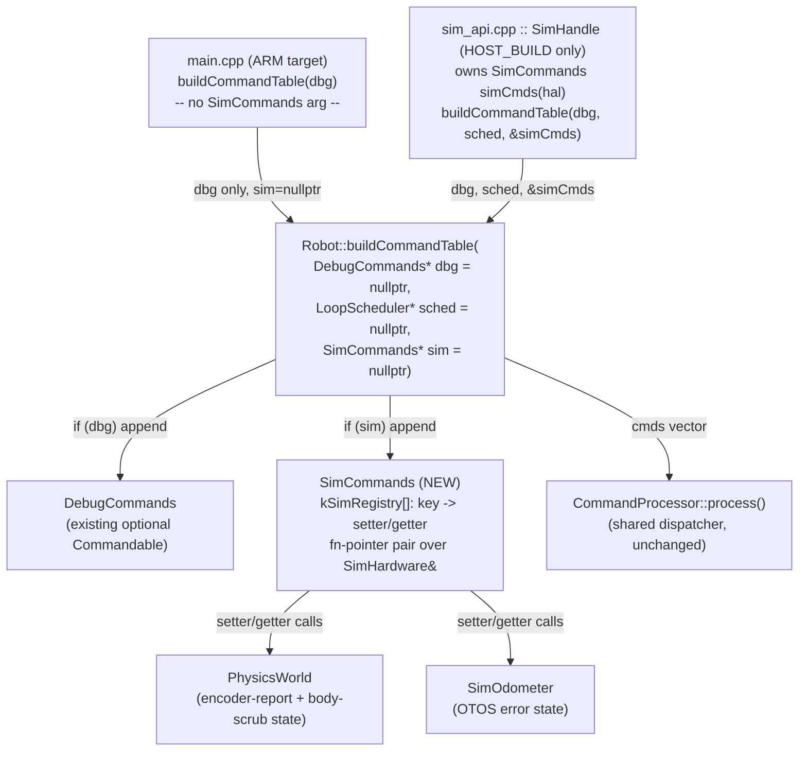
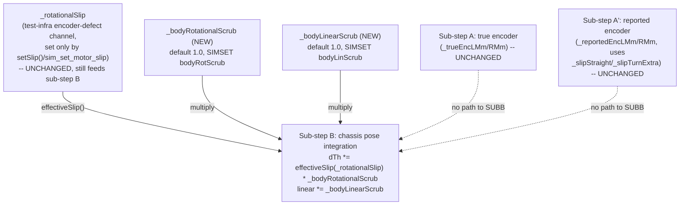
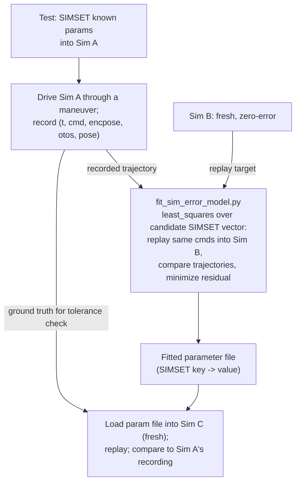

<!-- CLASI: Before changing code or making plans, review the SE process in CLAUDE.md -->

# Architecture Update — Sprint 069: Sim error model: runtime-settable, plant-complete, hardware-fit

## Sprint Changes Summary

Three structural gaps, one genuine plant-model addition, and one new host
tool, all serving a single rule: **the simulator and the real robot must be
tunable to behave identically.**

1. **A new sim-only wire-command surface, `SIMSET`/`SIMGET`**, gives every
   simulator plant/error parameter the same runtime-settable, uniform,
   extensible mechanism `SET`/`GET` already gives `RobotConfig` — reusing the
   existing `Commandable`/`CommandDescriptor` extension point
   (`Robot::buildCommandTable`'s already-optional `DebugCommands*` parameter
   gains a sibling `SimCommands*`), not a reserved key namespace inside the
   shared `ConfigRegistry`/`RobotConfig` (which is compiled into the ARM
   firmware target and must not carry sim-only fields). The existing
   per-field ctypes C-ABI functions (`sim_set_encoder_scale_error`,
   `sim_set_otos_linear_noise`, …) become thin wrappers over the same
   underlying setter functions the registry calls — a single source of truth
   per knob, matching the sprint's own instruction.
2. **A genuine plant-model addition: independent body-rotational and
   body-linear scrub.** `PhysicsWorld` sub-step B (chassis pose integration)
   already has a `slip` multiplier on the heading term, but it is coupled to
   the same `_rotationalSlip` field the encoder-report error model
   (`sim_set_motor_slip`) uses — a test-infrastructure knob, not a
   hardware-realistic parameter, and in every current test usage that sum
   evaluates to `<= 0`, which `effectiveSlip()` clamps to 1.0 (no scrub).
   Two new, independent fields (`_bodyRotationalScrub`, `_bodyLinearScrub`,
   default 1.0 = no scrub) are added and combined multiplicatively with the
   existing (unchanged) coupled term — closing the "plant body never
   scrubs" gap without touching the 066-001 chassis-truth-slip test's
   behavior at all.
3. **Six existing-but-hidden knobs surface** (per-wheel encoder scale
   error/slip/noise, OTOS linear/angular scale error, OTOS linear/yaw
   drift) — all already implemented in `PhysicsWorld`/`SimOdometer`, missing
   only getters and a wire row. This is issue-1's TestGUI-knob-exposure ask,
   folded entirely into the `SIMSET`/`SIMGET` surface rather than plumbed
   through the legacy per-field ctypes path first.
4. **Seven EKF process/measurement-noise `RobotConfig` fields get `SET`/`GET`
   rows.** Sprint 067 already built the noise-only `setNoise()` push all the
   way from `ConfigRegistry` through `Drive::configure()` to `EKFTiny` for
   all eight EKF fields — only one (`ekfRHead`) has a registry row today.
   Adding the other seven is a same-shape, near-zero-risk closure of 067's
   own Open Question 5, and it directly serves the hardware-fit goal (fusion
   noise is a real, hardware-applicable tuning surface, not a sim-only one —
   hence `SET`, not `SIMSET`).
5. **A host-side fit script** (`host/robot_radio/calibration/`) regresses
   the deterministic/bias-shaped subset of the new registry (scale errors,
   drift, body scrub, trackwidth, actuation offset — not noise sigmas, which
   don't bias a mean trajectory) against a recorded run's `encpose=`/
   `otos=`/`pose=` samples, using `scipy.optimize.least_squares`. Validated
   sim-to-sim this sprint (inject known `SIMSET` values, record, fit,
   recover the injected values within tolerance); real-hardware Tour-1
   record→fit→replay is explicitly deferred to a follow-up HIL task (see
   Open Questions).
6. **The TestGUI Sim Errors panel** is extended to the full knob set,
   re-plumbed to send one `SIMSET` command per Apply instead of per-field
   ctypes calls.

No change to `RobotConfig`'s wire-visible shape beyond the seven new `SET`
keys (item 4) — no new `RobotConfig` fields, no ARM-firmware behavior
change. All `SIMSET`/`SIMGET`/`SimCommands`/plant-scrub code is host-build
(sim-library) only; the ARM target never compiles or links any of it.

---

## Step 1: Understand the Problem

**What changes:** the simulator gains a wire-native configuration surface
for everything that is conceptually "how the plant behaves" (as opposed to
"how the firmware is configured," which `SET`/`GET` already owns); the plant
gains one new physical capability (body scrub) it structurally lacked;
seven already-plumbed EKF fields become reachable; the TestGUI and a new
host script become the surface's first two real consumers.

**What does not change:** the firmware's own encoder-only dead-reckoning
(`Odometry::predict()`), the EKF fusion algorithm, the OTOS ground-truth
sampling + lever-arm math (066), the `SET`→consumer live-reference
propagation (067), and the three-pose TLM wire format (068) — this sprint
*consumes* all four, verbatim, as already-landed infrastructure.

**Why now, and why this closes the RT-90° gap specifically.**
`Planner::beginRotation()` (`PlannerBegin.cpp:518-524`) computes the RT arc
target as `arc = |Δθ| · (tw/2) / effectiveSlip(cfg.rotationalSlip)` —
*dividing* by the configured slip factor to *inflate* the commanded wheel
arc, on the assumption that the real chassis will only achieve
`effectiveSlip(rotationalSlip)` of that arc's naive rotation
(`RobotConfig.rotationalSlip` defaults to 0.92, `data/robots/*.json`
confirms this is the real, bench-calibrated per-robot value). Critically,
**`Odometry::predict()` applies this exact same `effectiveSlip(rotationalSlip)`
factor when dead-reckoning the encoder-only pose** — so `encpose=` is not
naive wheel-arc kinematics, it is wheel-arc kinematics *pre-corrected* by
the same calibration constant the Planner uses to over-command. This is a
deliberate, existing design: on real hardware, where the chassis genuinely
does scrub by roughly `rotationalSlip`, this correction makes `encpose=`
track true motion reasonably well *without* needing an independent truth
source. The sim's plant, however, has never been able to produce that
scrub — so a "zero-error" sim run receives the Planner's inflated command
and simply executes all of it, over-rotating (RT 9000 → 95.2° instead of
90°). The fix is not to touch `Odometry::predict()` or `Planner` (both are
already doing the physically-correct thing) — it is to make the **plant**
capable of the physical effect the firmware has always assumed it has:
independent body-rotational/linear scrub, wire-settable so it can be
matched to any given robot's calibrated `rotationalSlip` (or fit against a
real recording).

---

## Step 2: Identify Responsibilities

| Responsibility | Owning module | Why it changes independently |
|---|---|---|
| Register a family of wire commands and dispatch them, sim-build only | New `SimCommands` (`source/commands/SimCommands.{h,cpp}`) | Sole owner of the `SIMSET`/`SIMGET` verb pair and its key registry; the ARM target never constructs one. |
| Genuinely scrub the plant's true chassis pose, independent of encoder reporting | `PhysicsWorld` (`source/hal/sim/`) | Sole owner of sub-step B (chassis pose integration); the new fields and their read/write are entirely internal to this one class. |
| Report already-configured-but-write-only OTOS error state | `SimOdometer` (`source/hal/sim/`) | Sole owner of `_linearScaleErr`/`_angularScaleErr`/`_driftPerTickMm`/`_driftPerTickRad`; needs getters it never needed before (write-only was fine when only ctypes test code set them). |
| Push seven already-computed EKF noise fields onto the wire | `ConfigRegistry` (`source/robot/ConfigRegistry.cpp`) | Sole owner of the key→field mapping table; the consumer path (`Drive::configure()` → `PhysicalStateEstimate::setNoise()`) is already complete and unchanged. |
| Route a `SIMSET`/`SIMGET` reply the same way `SET`/`GET` does | `CommandProcessor`/`Robot::buildCommandTable` (`source/commands/`, `source/robot/`) | The dispatch/reply plumbing is shared infrastructure; the only change is one new optional constructor-style parameter, mirroring the existing `DebugCommands*` pattern exactly. |
| Keep the legacy per-field ctypes C-ABI working without a second implementation | `tests/_infra/sim/sim_api.cpp`, `drive_api.cpp` | Sole owners of the `extern "C"` surface; each function becomes a one-line forward to the same setter `SimCommands` calls. |
| Present the full knob set to a human operator | TestGUI (`host/robot_radio/testgui/sim_prefs.py`, `transport.py`, `__main__.py`) | Sole owner of the Sim Errors panel's fields and its Apply-to-wire translation. |
| Regress plant parameters from a recorded trajectory | New `host/robot_radio/calibration/fit_sim_error_model.py` | Sole new module; depends on the wire surface (item 1) and the three TLM poses (068) as its only inputs — no other module needs to know a fit exists. |

No responsibility spans more than one of the modules above. `SimCommands`
and `PhysicsWorld`/`SimOdometer` are strictly producer/consumer (registry
calls setters); the fit script and TestGUI are both pure *clients* of the
wire surface and have no dependency on each other or on `SimCommands`'s
internals.

---

## Step 3: Subsystems and Modules

| Module | Purpose (one sentence, no "and") | Boundary | Use cases served |
|---|---|---|---|
| **`SimCommands`** (`source/commands/SimCommands.{h,cpp}`, new) | Registers and dispatches the `SIMSET`/`SIMGET` wire-command pair. | Inside: the key→setter/getter dispatch table, `SIMSET`/`SIMGET` parsing/reply formatting (reusing the existing `parseSet`/variadic-schema machinery `SET`/`GET` already use). Outside: what a setter *does* to the plant (that's `PhysicsWorld`'s/`SimOdometer`'s job) — `SimCommands` holds a reference to `SimHardware&`, never a copy of any value. | SUC-002 – SUC-006 |
| **`PhysicsWorld` body-scrub extension** (`source/hal/sim/PhysicsWorld.{h,cpp}`, modified) | Integrates the plant's true chassis pose, now with an independently-configurable rotation/translation efficiency. | Inside: `_bodyRotationalScrub`/`_bodyLinearScrub` fields, their setters/getters, sub-step B's multiplication. Outside: encoder reporting (sub-step A/A′, untouched) and the pre-existing `_rotationalSlip`/`setSlip()` test-infra channel (untouched, combined multiplicatively). | SUC-003 |
| **`SimOdometer` getters** (`source/hal/sim/SimOdometer.{h,cpp}`, modified) | Reports the OTOS sim model's currently-configured error state. | Inside: four new const accessors mirroring the four existing setters. Outside: no change to `tick()`/`readTransformed()` behavior. | SUC-005 |
| **`ConfigRegistry` EKF rows** (`source/robot/ConfigRegistry.cpp`, modified) | Maps seven more `RobotConfig` fields to wire keys. | Inside: seven `CFG_F_SS(..., "drive")` table rows. Outside: `Drive::configure()`'s `setNoise()` call, already complete. | SUC-001 |
| **Command-table wiring** (`source/robot/Robot.h/.cpp`, `source/commands/SystemCommands.cpp`, modified) | Aggregates an optional `SimCommands`'s descriptors into the dispatch table. | Inside: one new optional parameter on `buildCommandTable`, one `if (sim) append(sim->getCommands())` line. Outside: `SimCommands`'s internal registry. | (infrastructure — serves all of SUC-002–006) |
| **ctypes thin wrappers** (`tests/_infra/sim/sim_api.cpp`, `drive_api.cpp`, modified) | Preserve the existing C-ABI surface for direct-linked test code. | Inside: one-line forwards to the shared setter functions. Outside: `SimCommands`'s wire parsing (ctypes callers never go through `CommandProcessor::process()` text parsing for these — they call the C function directly, same as today). | SUC-002 – SUC-005 (implementation continuity) |
| **TestGUI Sim Errors panel** (`host/robot_radio/testgui/sim_prefs.py`, `transport.py`, `__main__.py`, modified) | Presents and applies the full sim-error knob set as one `SIMSET` command. | Inside: profile keys/defaults, spinbox widgets, `apply_error_profile()`'s wire-command construction. Outside: how `SimCommands` interprets the command once sent. | SUC-007 |
| **Fit script** (`host/robot_radio/calibration/fit_sim_error_model.py`, new) | Regresses a bias-shaped `SIMSET` parameter subset from a recorded trajectory. | Inside: replay-and-compare loop, `scipy.optimize.least_squares` call, parameter-file emission. Outside: how the recording was produced (wire-log format is a plain, transport-agnostic list of `(t, cmd | frame)` records; a HIL recorder is a future producer of the same format). | SUC-008 |

Every module above addresses at least one SUC; no module is speculative
(each is driven directly by a named acceptance criterion).

---

## Step 4: Diagrams

### 4a. `SIMSET`/`SIMGET` command-table integration (mirrors the existing `DebugCommands*` pattern)

No cycles. The ARM build path never references `SimCommands` (its header is
only `#include`d by the HOST_BUILD-only translation unit that constructs
one — `Robot.h` forward-declares `class SimCommands;` exactly as it already
forward-declares `class DebugCommands;`), so `PhysicsWorld`/`SimOdometer`
(sim-only types) never enter the ARM link.

### 4b. `PhysicsWorld` sub-step B — decoupled scrub

No cycles; the new fields are pure additive multipliers, default-neutral
(1.0), so every existing test that never calls the new setters observes
byte-identical sub-step B output. `test_turn_with_slip_otos_matches_truth_encoder_diverges`
(066-001) exercises the `LEGACY` path only and is unaffected.

### 4c. Fit-tool data flow (sim-to-sim, this sprint's validated slice)

No cycles. Real-hardware recording is a drop-in replacement for the `INJECT
→ RECORD` box's *source* (same output shape) — not built this sprint, see
Open Questions.

---

## Step 5: What Changed / Why / Impact / Migration

### What Changed

**Firmware / sim-library (C++):**

- `source/hal/sim/PhysicsWorld.{h,cpp}`: new `_bodyRotationalScrub`,
  `_bodyLinearScrub` fields (default `1.0f`), `setBodyRotationalScrub(float)`/
  `bodyRotationalScrub()`, `setBodyLinearScrub(float)`/`bodyLinearScrub()`.
  Sub-step B: `slip = effectiveSlip(_rotationalSlip) * clampScrub(_bodyRotationalScrub)`;
  linear term multiplied by `clampScrub(_bodyLinearScrub)`. `clampScrub()` is
  a new, local, simpler helper (range `(0, 1]`, out-of-range clamps to the
  nearer bound) — deliberately NOT `effectiveSlip()`'s 0-means-legacy-unset
  semantics, since these are brand-new fields with no pre-existing "0 was
  always the default" population to stay compatible with (see Design
  Rationale Decision 2). New getters: `offsetFactorL()`/`offsetFactorR()`
  (mirroring the existing `setOffsetFactor`), `encoderScaleErrL/R()`,
  `encoderSlipL/R()` (mirroring the existing 058-001 setters).
- `source/hal/sim/SimOdometer.{h,cpp}`: new const getters
  `linearScaleError()`, `angularScaleError()`, `driftPerTickMm()`,
  `driftPerTickRad()`, `linearNoiseSigma()`, `yawNoiseSigma()` mirroring the
  six existing setters.
- `source/commands/SimCommands.{h,cpp}` (new): `Commandable`-implementing
  class. Constructor takes `SimHardware&`. `kSimRegistry[]`: an array of
  `{key, setterFn, getterFn}` rows (function-pointer dispatch, not
  `offsetof` — `PhysicsWorld`/`SimOdometer` are encapsulated classes with
  invariants, not POD structs, so the registry calls their named setters/
  getters rather than reading/writing raw memory, see Design Rationale
  Decision 3). `getCommands()` returns two `CommandDescriptor`s: `SIMSET`
  (reuses the existing `parseSet` parser — the same generic
  `key=value…`-token grammar `SET` uses, no new parsing code) and `SIMGET`
  (reuses `GET`'s variadic `ArgSchema`). Reply shapes mirror `SET`/`GET`
  exactly: `OK simset <applied-key>=<value>…` / `SIMCFG <key>=<value>…`,
  `ERR badkey <key>`, `ERR badval <key>=<value>`.
  First registry rows: `bodyRotScrub`, `bodyLinScrub`, `trackwidthMm`
  (→ `SimHardware::setTrackwidth()`, existing), `motorOffsetL`/`motorOffsetR`
  (→ `PhysicsWorld::setOffsetFactor()`, existing), `encScaleErrL/R`,
  `encSlipL/R`, `encNoiseL/R` (all existing `PhysicsWorld` setters),
  `otosLinScaleErr`/`otosAngScaleErr`/`otosLinNoise`/`otosYawNoise` (existing
  `SimOdometer` setters) and `otosLinDriftMmS`/`otosYawDriftDegS` (existing
  `SimOdometer` per-tick setters — `SimCommands` converts the wire's
  per-second value to per-tick using `RobotConfig::controlPeriodMs` before
  calling `setDriftPerTickMm/Rad`, and converts back on `SIMGET`).
- `source/robot/Robot.h`: forward-declares `class SimCommands;`;
  `buildCommandTable()` gains a third optional parameter,
  `SimCommands* sim = nullptr`.
- `source/commands/SystemCommands.cpp`: `Robot::buildCommandTable()` gains
  `if (sim) append(sim->getCommands());`, mirroring the existing
  `if (dbg) append(dbg->getCommands());` line immediately above it.
- `source/robot/ConfigRegistry.cpp`: seven new rows —
  `CFG_F_SS("ekfQxy", ekfQxy, "drive")`, and the same shape for `ekfQtheta`,
  `ekfQv`, `ekfQomega`, `ekfROtosXy`, `ekfROtosV`, `ekfREncV`.
- `tests/_infra/sim/sim_api.cpp`: `SimHandle` gains a `SimCommands _simCmds`
  member (constructed from `hal`); the `SimHandle`→`Robot`
  `buildCommandTable()` call site passes `&_simCmds`. Existing per-field
  ctypes functions (`sim_set_motor_slip` untouched — out of scope, see
  below; `sim_set_encoder_noise`, `sim_set_otos_linear_noise`,
  `sim_set_otos_yaw_noise`, and new equivalents for scale-error/drift/
  offset-factor/trackwidth) become one-line forwards to the same setter
  functions `SimCommands`'s registry rows call (a small shared, free-function
  layer, e.g. `namespace simsetters { void encoderScaleErrorL(SimHardware&,
  float); … }`, called by both `SimCommands`'s handler and the ctypes
  function — single source of truth per knob).
- `tests/_infra/sim/drive_api.cpp`: `setSlip`-adjacent existing exports
  unaffected; no change needed (Drive-level test harness doesn't touch the
  new scrub fields directly — it exercises `Drive`, not raw `PhysicsWorld`).
- `docs/protocol-v2.md`: new `## 15. Sim-Only: SIMSET / SIMGET` section
  (grammar mirrors §7 exactly, with a note that these verbs exist ONLY in
  sim/HOST_BUILD binaries and return `ERR unknown SIMSET` on real firmware);
  §7's Named Key Table gains the seven `ekfQ*`/`ekfROtos*`/`ekfREncV` rows.

**Host (Python):**

- `host/robot_radio/testgui/sim_prefs.py`: `DEFAULT_PROFILE` extended from 4
  keys to the full set (existing 4 + `enc_scale_err_l/r`, `otos_lin_scale_err`,
  `otos_ang_scale_err`, `otos_lin_drift_mms`, `otos_yaw_drift_degs`,
  `motor_offset_l/r`, `trackwidth_mm`, `body_rot_scrub`, `body_lin_scrub`);
  a new module-level table maps each profile key to its `SIMSET` wire-key
  name.
- `host/robot_radio/testgui/transport.py`: `apply_error_profile()` rewritten
  to build one `SIMSET k1=v1 k2=v2 …` string from the full profile (via the
  new key-name map) and send it through the existing `send_command()`/
  `command()` path, replacing the current per-field `SimConnection` ctypes
  calls. `turn_scrub_factor` (the pre-existing property backing 068's
  now-deleted `TraceModel` wiring) is unaffected — it reads `slip_turn_extra`
  from the SAME profile dict, unrelated to the new keys.
- `host/robot_radio/testgui/__main__.py`: Sim Errors panel gains grouped
  spinbox rows (Encoder Report Error / Body-Truth Scrub / Geometry &
  Actuation / OTOS Error) for the new profile keys.
- `host/robot_radio/io/sim_conn.py`: unaffected — `SimConnection`'s existing
  per-field ctypes wrapper methods are retained for direct-ctypes callers
  (pytest fixtures); `apply_error_profile()` no longer calls them, but they
  remain valid, now-thin-wrapper entry points (Migration Concerns).
- `host/robot_radio/calibration/fit_sim_error_model.py` (new): CLI script.
  Inputs: a recorded run (JSONL: `{t, cmd}` for issued commands and `{t,
  encpose, otos, pose}` for parsed TLM frames — transport-agnostic, produced
  this sprint only by a sim-side recorder helper in the same module) and a
  candidate parameter-name list (defaults to the full deterministic/
  bias-shaped `SIMSET` key set). Uses `scipy.optimize.least_squares`
  (bounded, Trust Region Reflective) minimizing summed squared position +
  heading residual (heading wrapped to `(-π, π]` before differencing) across
  all three TLM poses at every recorded timestamp. Emits a JSON parameter
  file (`SIMSET` key → fitted value) and a small CLI to load it
  (`SIMSET`-batch over a live connection).
- `pyproject.toml`: adds `scipy` as a host dependency (currently only
  `numpy` is present) — see Design Rationale Decision 5.

**New tests:**

- `tests/simulation/unit/test_physics_world_body_scrub.py`: direct
  `PhysicsWorld` unit coverage — `bodyRotScrub`/`bodyLinScrub` default-1.0
  no-op; each independently reduces the corresponding sub-step B term;
  combines multiplicatively with the existing `setSlip()` channel without
  disturbing it.
- `tests/simulation/system/test_069_rt_90deg_body_scrub.py`: the two
  headline acceptance points — `SIMSET bodyRotScrub=0.92` (defaults
  otherwise) → `RT 9000` lands on 90° true; `SIMSET bodyRotScrub=1.0
  bodyLinScrub=1.0` + `SET rotSlip=1.0` → `RT 9000` exact.
- `tests/simulation/unit/test_sim_commands_registry.py`: `SIMSET`/`SIMGET`
  grammar (unknown key → `ERR badkey`, atomic all-or-nothing apply, dump-all
  `SIMGET`), and confirms `SIMSET`/`SIMGET` are `ERR unknown` on a
  freshly-checked non-HOST_BUILD command table (via the existing `HELP`
  command's descriptor list, or a targeted grep-based build-config check —
  ticket to decide the exact mechanism).
- `tests/simulation/system/test_069_knob_telemetry_sweep.py`: for every
  `kSimRegistry[]` row, `SIMSET` a non-default value, tick, assert the
  expected TLM field responds (comprehensive, registry-driven — new knobs
  added in a future sprint are covered automatically if they're added to
  the same table this test iterates).
- `tests/testgui/test_sim_prefs.py`, `test_transport.py`: extended for the
  new profile keys and the `apply_error_profile()` → single-`SIMSET`
  rewrite.
- `host_tests` (or `tests/host/calibration/`) `test_fit_sim_error_model.py`:
  sim-to-sim validation — inject known params, record, fit, assert recovery
  within a stated tolerance (e.g., ±10% relative or an absolute floor for
  near-zero true values).
- Full `uv run python -m pytest` run to confirm the post-068 baseline count
  (confirm exact number at ticket-execution time) plus this sprint's new
  tests, 0 failures.

### Why

Every change traces to a specific acceptance criterion or an explicitly
surfaced open item from a prior sprint:

- The `SimCommands`/`SIMSET`/`SIMGET` surface exists because issue 2's
  requirement #1 is explicit: "nothing conceptually a simulator parameter
  should require a recompile [of a NEW C-ABI shape]... the simulator needs
  the equivalent command surface for plant/error values" — and the codebase
  already has the exact extension point (`buildCommandTable`'s optional
  `Commandable*` pattern) needed to add one without touching ARM-firmware
  code paths.
- Body-rotational/linear scrub exists because issue 2's requirement #2 is
  explicit and because the current code, read directly, confirms the "plant
  never scrubs in practice" claim precisely (sub-step B's slip term is fed
  only by a channel every current test drives to `<= 0`).
- The six knob-getter additions exist because issue 1's entire ask is
  exposure, not new modeling — confirmed by reading `PhysicsWorld.h`/
  `SimOdometer.h` directly; the setters were already there.
- The seven EKF registry rows exist because 067's own Open Question 5
  named this exact sprint as the likely place to close it, and the
  plumbing it names (`setNoise()`) is confirmed, by direct code read, to
  already be complete and waiting for registry rows.
- The fit script exists because it is issue 2's stated acceptance vehicle;
  scoping it to sim-to-sim (not real hardware) matches this sprint's
  explicit autonomous-execution boundary.
- The TestGUI change exists because issue 1's plumbing instructions are
  followed to the letter, redirected at the wire surface per this sprint's
  explicit "fold issue 1 into the wire-command surface of issue 2" directive
  rather than the legacy ctypes path.

### Impact on Existing Components

| Component | Impact |
|---|---|
| `source/hal/sim/PhysicsWorld.{h,cpp}` | **Modified.** Two new fields/setter-pairs, two new getters for offset factors, sub-step B gains two multiplicative terms (default-neutral). No existing method signature changes. |
| `source/hal/sim/SimOdometer.{h,cpp}` | **Modified, additive only.** Six new const getters; zero behavior change to any existing method. |
| `source/hal/sim/SimHardware.{h,cpp}` | **Unaffected.** `setTrackwidth()` already exists and already does the right thing; `SimCommands` calls it, does not change it. |
| `source/robot/Robot.h`, `source/commands/SystemCommands.cpp` | **Modified.** One new optional parameter, one new conditional `append()` call — identical shape to the existing `dbg` parameter/call. |
| `source/robot/ConfigRegistry.cpp` | **Modified.** Seven new rows, same macro shape as the existing `ekfRHead` row. No existing row changes. |
| `source/commands/SimCommands.{h,cpp}` | **New.** Zero ARM-firmware footprint (never `#include`d nor linked into the ARM build). |
| `source/control/Odometry.{h,cpp}`, `source/superstructure/PlannerBegin.cpp` | **Unaffected.** Both already apply `effectiveSlip(RobotConfig.rotationalSlip)` correctly (024-006, confirmed by direct read); this sprint makes the *plant* capable of producing the physical effect they've always assumed, without touching either file. |
| `tests/_infra/sim/sim_api.cpp` | **Modified.** `SimHandle` gains a `SimCommands` member and one changed `buildCommandTable()` call-site argument; several existing `sim_set_*` functions' bodies become one-line forwards (behavior-preserving). |
| `tests/_infra/sim/drive_api.cpp` | **Unaffected.** Drive-level harness does not touch the new scrub fields. |
| `host/robot_radio/testgui/sim_prefs.py`, `transport.py`, `__main__.py` | **Modified.** Profile/key-map extended; `apply_error_profile()`'s transport mechanism changes (ctypes calls → one `SIMSET` string) but its external behavior (Apply button applies the whole profile) is unchanged. |
| `host/robot_radio/io/sim_conn.py` | **Unaffected in interface.** Existing per-field ctypes methods remain callable by direct pytest fixtures; simply no longer called by `apply_error_profile()`. |
| `host/robot_radio/calibration/` | **New file added.** No existing file in this package is modified (confirm at ticket time — package contents not fully enumerated during planning). |
| `pyproject.toml` / `uv.lock` | **Modified.** `scipy` added as a host dependency. |
| `docs/protocol-v2.md` | **Modified.** New §15 (`SIMSET`/`SIMGET`); seven new Named Key Table rows in §7. |
| `tests/simulation/unit/test_sim_otos_lever_arm.py` (066-001) | **Unaffected — verified, not just asserted.** Its `sim_set_motor_slip(side=2, straight=0.7, turn_extra=0.0)` call only ever touches `_rotationalSlip`/the legacy coupled channel; the new fields default to 1.0 and are never touched by this test, so sub-step B's output is byte-identical to today. |
| `tests/simulation/system/test_ekf_odometry_commands_coverage.py`, `test_goto_bounds.py`, `test_cancel_on_begin.py` (`set_field_profile` callers) | **Unaffected.** `set_field_profile()` calls only `sim_set_motor_slip`/`sim_set_encoder_noise`, neither touched by this sprint's new fields. |
| `data/robots/tovez.json`, `togov.json`, `DefaultConfig.cpp` | **Unaffected.** No default-value change; `rotational_slip: 0.92` continues to mean exactly what it means today. |
| Every ARM-firmware-only file not listed above | **Unaffected.** `SimCommands`/`PhysicsWorld`/`SimOdometer` changes are host-build-only; the ARM link set is unchanged. |

### Migration Concerns

- **No wire-protocol break.** `SET`/`GET`/`STREAM`/`SNAP`/motion commands are
  byte-identical. `SIMSET`/`SIMGET` are new verbs, absent from real
  firmware's command table — `ERR unknown SIMSET` on real hardware, exactly
  like any other unrecognized verb; no existing client is affected.
- **No `RobotConfig` shape change beyond the seven new `SET` keys** (item 4)
  — `sizeof(RobotConfig)` is unaffected by this sprint's sim-only work
  (those fields live in `PhysicsWorld`/`SimOdometer`, never in
  `RobotConfig`).
- **ctypes back-compat.** Every existing `sim_set_*`/`sim_get_*` C-ABI
  function keeps its exact signature; pytest fixtures that call them
  directly (not through `SIMSET`) need no changes. New knobs added by this
  sprint (scale-error getters, scrub, trackwidth, offset-factor) gain BOTH a
  `SIMSET` row and, where a ctypes caller in the existing test suite needs
  one, a thin-wrapper C function — added on demand per ticket, not
  speculatively for every row.
- **`scipy` is a new host dependency.** `numpy` is already present;
  `scipy.optimize` is a standard, widely-used numerical dependency for
  exactly this problem shape (bounded nonlinear least squares) — see Design
  Rationale Decision 5 for the alternative considered and rejected.
- **Deployment sequencing (sim library build).** `PhysicsWorld`/
  `SimOdometer`/`SimCommands`/`ConfigRegistry` changes require a `--clean`
  sim build before any test run that exercises them (project knowledge:
  stale incremental builds on `/Volumes` — build banners lie). No ARM
  firmware rebuild is required for this sprint's own testing (sim/host-tier
  only), but the ARM build is affected (new optional `buildCommandTable`
  parameter, seven new `ConfigRegistry` rows) and must be rebuilt before any
  future hardware validation of the EKF-noise or general `SET`/`GET`
  surface.
- **Golden-TLM fixture unaffected.** The new `PhysicsWorld` fields default
  to `1.0` (no-op); `tests/_infra/golden_tlm_capture.json` requires no
  regeneration (confirm at ticket time by running the golden-capture test
  unmodified before touching any sim source).

---

## Step 6: Design Rationale

### Decision 1: a new `SIMSET`/`SIMGET` verb pair, not a reserved key namespace inside `ConfigRegistry`/`RobotConfig`

**Context:** the sprint brief frames this as the pivotal decision. Both
issues describe the target as "SET/GET-equivalent... a sim-build-only
`SIMSET`/`SIMGET` or a reserved key namespace." `ConfigRegistry.cpp` and
`RobotConfig` (`source/types/Config.h`) are compiled into **both** the ARM
firmware target and the sim library — confirmed by reading `Config.h`
(plain POD struct, no `#ifdef HOST_BUILD` anywhere in it) and
`ConfigRegistry.cpp` (its `kRegistry[]` macros expand to `offsetof(RobotConfig,
field)` — a compile-time requirement that the field exist in the one shared
struct for both targets).

**Alternatives considered:**
- *Reserved namespace inside `RobotConfig`/`ConfigRegistry` (e.g., a
  `sim.*`-prefixed key block, still going through `SET`/`GET`).* Every sim
  error/plant parameter (17 by this sprint's own count) would need a
  corresponding `RobotConfig` field — bloating the ARM firmware's flash/RAM
  footprint with fields that mean nothing on real hardware, requiring the
  per-robot JSON schema (`data/robots/robot_config.schema.json`) and
  `scripts/gen_default_config.py` to carry sim-only defaults, and requiring
  every `ConfigRegistry.cpp` row referencing a sim-only field to somehow
  avoid compiling when the field's *consumer* (`PhysicsWorld`) doesn't exist
  in the ARM build — which is not just inconvenient but structurally
  impossible without `#ifdef HOST_BUILD` blocks scattered through a file
  that today has none, or a second parallel `RobotConfig`-like struct
  (defeating the "reserved namespace in the *existing* struct" premise).
- *A new `SIMSET`/`SIMGET` verb pair, sim-build-only (chosen).* Zero
  `RobotConfig` footprint. Zero footprint in `ConfigRegistry.cpp`.
  `SimCommands` (the new home for these fields' registry) lives in its own
  translation unit, included only by the HOST_BUILD-only file that
  constructs one (`tests/_infra/sim/sim_api.cpp`); `Robot.h`/`Robot.cpp`
  need only a forward declaration and one conditional `append()` call —
  the exact same integration cost the codebase already paid for
  `DebugCommands*`.

**Why this choice:** the codebase's own precedent settles this decisively.
`DebugCommands` already demonstrates "an optional, separately-owned
`Commandable*` that the ARM build can omit and the sim/bench build can
supply" as a proven, zero-risk pattern (`if (dbg) append(dbg->getCommands())`,
`buildCommandTable`'s default-`nullptr` parameter). `SimCommands` is a
second instance of the identical pattern, not a new architectural idea.
Choosing the reserved-namespace alternative would mean fighting this
precedent, not extending it.

**Consequences:** `SIMSET`/`SIMGET` keys and `SET`/`GET` keys live in
disjoint namespaces (verb-scoped, not string-scoped) — a `SIMSET` key and a
`SET` key may coincidentally share a string (none do in this sprint's table)
without ambiguity, since the verb always disambiguates. A future engineer
adding a new sim error knob adds one `kSimRegistry[]` row and recompiles the
sim library only — no ARM rebuild, no `RobotConfig` change, no per-robot
JSON schema change.

### Decision 2: new scrub fields use simple `(0, 1]` clamp semantics, not `effectiveSlip()`'s legacy 0-means-unset clamp

**Context:** `effectiveSlip()` (`Odometry.h`) maps `<= 0` and unset to `1.0`
specifically because `RobotConfig.rotationalSlip` predates sprint 024-006's
wiring and needed a migration-safe default for already-deployed configs
that had never set it. `_bodyRotationalScrub`/`_bodyLinearScrub` have no
such history — every existing config, test, and robot JSON is unaware of
them.

**Alternatives considered:**
- *Reuse `effectiveSlip()` verbatim for the new fields* (mapping `[0, 0.5)`
  to a hard floor of `0.5`, `> 1.0` to a ceiling of `1.0`, `<=0` to `1.0`).
  Importable with zero new code, but the `[0.5, 1.0]` floor is specific to
  `rotationalSlip`'s empirically-observed real range (bench-calibrated
  robots run `0.7`–`0.95`) — an OTOS/geometry-fit context might legitimately
  want to explore `bodyLinScrub` values below `0.5` (e.g., modeling severe
  wheel slip for a stress test) without hitting an arbitrary floor
  inherited from an unrelated field's calibration history.
- *A new, simpler `(0, 1]` clamp with no floor beyond avoiding
  division-by-zero/sign-flip pathologies* (chosen). Clamps only at the
  boundaries that would make the physics nonsensical (zero or negative
  scrub, or > 1.0 which would mean the chassis rotates/travels *more* than
  naive kinematics predicts — not a scrub, a different physical claim this
  sprint isn't modeling).

**Why this choice:** the two fields have different, and correctly
different, valid ranges from `rotationalSlip`'s hardware-calibration
history — reusing `effectiveSlip()` would either wrongly import
`rotationalSlip`'s `[0.5,1.0]` floor as gospel for a fit-tool parameter that
should be allowed to explore more freely, or require `effectiveSlip()`
itself to grow a parameter it doesn't need for its one real caller.

**Consequences:** two clamp helpers exist in the sim-only code
(`effectiveSlip()`, reused unchanged, and a new local `clampScrub()`) with
deliberately different ranges — documented at both definitions to prevent a
future reader from assuming they should be merged.

### Decision 3: `SimCommands`'s registry dispatches through named setter/getter functions, not `offsetof`

**Context:** `ConfigRegistry`'s `kRegistry[]` maps a wire key directly to a
byte offset into the POD `RobotConfig` struct — trivial and fast because
`RobotConfig` has no invariants to protect (any float is a legal value for
most fields; the few that need validation are checked in `handleSet` before
the write). `PhysicsWorld`/`SimOdometer` are not POD: their fields are
private, and several setters exist specifically because the class wants
control over what happens on write (e.g., `SimOdometer` deliberately keeps
`_odomX/Y/H`'s live accumulator separate from its raw-register shadow;
`PhysicsWorld::setTrackwidth()` updates a plant field that `SimHardware`
also caches).

**Alternatives considered:**
- *`offsetof`-style direct memory mapping*, same as `ConfigRegistry`. Would
  require either making `PhysicsWorld`/`SimOdometer`'s error-model fields
  public (breaking encapsulation for the sake of the registry, and risking
  a future field write bypassing a setter's side effect — e.g., a
  hypothetical future `setTrackwidth()` change that also needs to update a
  cached OTOS trackwidth value would silently stop firing for anyone who
  wrote the field directly) or duplicating each field into a separate
  public POD struct the registry could safely offset into, then pushing
  that struct into the real objects on every `SIMSET` (reintroducing
  exactly the "snapshot copy that can go stale" antipattern sprint 067
  spent its entire scope eliminating from `Planner`/`Drive`).
- *Function-pointer dispatch through named setters/getters* (chosen). No
  encapsulation break, no snapshot, no staleness — every `SIMSET` writes
  directly and immediately through the same setter method a ctypes caller
  would use.

**Why this choice:** Decision 3 is a direct application of sprint 067's own
lesson (live reference/live call, never a copy) to a superficially
different code shape (classes with setters, not a POD struct with public
fields) — the *principle* transfers even though the *mechanism* (function
pointers vs. `offsetof`) necessarily differs.

**Consequences:** `kSimRegistry[]`'s row type is slightly larger (two
function pointers instead of one offset + one type tag) and each row is a
few more characters to write; this is a fixed, one-time cost with no
runtime staleness risk, unlike the rejected snapshot alternative.

### Decision 4: keep the existing `_rotationalSlip`/`setSlip()` encoder-defect channel completely untouched; combine multiplicatively rather than replace

**Context:** `_rotationalSlip` (set only by `setSlip()`/`sim_set_motor_slip`)
already has one committed, passing test that depends on its specific
current coupling to sub-step B
(`test_turn_with_slip_otos_matches_truth_encoder_diverges`, 066-001).

**Alternatives considered:**
- *Retire `_rotationalSlip`'s effect on sub-step B entirely, replacing it
  with the new `_bodyRotationalScrub` as the sole scrub source*, requiring
  066-001's test to be rewritten to use the new field. Cleaner-looking
  long-term (one clearly-named scrub knob instead of two overlapping ones),
  but changes a landed, sprint-boundary-crossing test's semantics for a
  sprint whose brief explicitly says "must not re-cover [066]."
- *Add the new fields as independent multipliers, leaving `_rotationalSlip`'s
  existing role and every consumer of it completely unchanged* (chosen).

**Why this choice:** sprint 069's own scope boundary (set by the team-lead's
brief, not something this planning pass has authority to override) says
sprint 066's OTOS ground-truth/lever-arm work — which includes the
chassis-truth-slip test — must not be re-covered. Leaving `_rotationalSlip`
untouched and additive is the only way to add real, independent
body-scrub capability without touching that test's assumptions.

**Consequences:** two ways to make the plant's true rotation scrub now
coexist (`_rotationalSlip` via the legacy test-only `setSlip()` channel, and
the new wire-settable `bodyRotScrub`) — documented explicitly in both
`PhysicsWorld.h`'s class comment and this document's Step 4b diagram so a
future reader isn't surprised to find two mechanisms. A future cleanup
sprint could consider consolidating them once 066-001's test is old enough
to safely rewrite — flagged as an Open Question, not attempted here.

### Decision 5: use `scipy.optimize.least_squares` for the fit tool; add `scipy` as a new host dependency

**Context:** the host currently depends on `numpy` but not `scipy`. The fit
problem — recover a bounded parameter vector (roughly a dozen deterministic/
bias-shaped `SIMSET` values) that minimizes a nonlinear (trajectory
replay is not a closed-form function of the parameters — it requires
re-simulating) least-squares residual — is a textbook `scipy.optimize`
use case.

**Alternatives considered:**
- *Hand-roll a coordinate-descent or grid-search optimizer using only
  `numpy`*, avoiding the new dependency. Avoids one `pyproject.toml` line,
  but reimplements (worse, without bounds-handling, convergence
  diagnostics, or Jacobian-free trust-region robustness) a well-tested
  piece of numerical software for a problem shape scipy solves directly —
  a poor trade for a tool whose entire purpose is producing trustworthy
  fitted parameters.
- *Add `scipy.optimize.least_squares` (chosen).* One new, extremely
  standard, pure-Python-installable dependency; bounded nonlinear
  least-squares with a documented, well-tested implementation.

**Why this choice:** the fit tool's credibility (it is the acceptance
vehicle for the entire "hardware fit" line of work) depends on using a
numerically sound optimizer; reinventing one is a worse use of this
sprint's scope than adding one dependency.

**Consequences:** `pyproject.toml`/`uv.lock` gain `scipy`; CI/dev
environments need `uv sync` to pick it up (flagged in Migration Concerns).
If the stakeholder prefers to avoid the new dependency, the fallback is a
`numpy`-only coordinate-descent implementation — noted as an Open Question
rather than assumed away, since dependency additions are worth a stakeholder
nod even when technically within planning authority.

### Decision 6: seven EKF noise `SET` keys ride in this sprint rather than waiting for a dedicated sprint

**Context:** 067's Open Question 5 explicitly named "069's sim-to-hardware
fitting workflow" as the likely place to close this gap, and this planning
pass confirmed by direct code read that `Drive::configure()` already
computes and pushes all eight fields — only the registry rows are missing.

**Alternatives considered:**
- *Leave it for a future sprint*, keeping 069 strictly about sim plant/error
  parameters. Defensible (EKF noise is a firmware, not sim, concern), but
  leaves a near-zero-cost, already-flagged, hardware-fit-relevant gap open
  for no scoping reason beyond taxonomy purity.
- *Close it now* (chosen) — seven `CFG_F_SS` rows, same shape as the
  existing `ekfRHead` row, zero new C++ logic, directly useful to the same
  hardware-fit goal this sprint exists to serve (fusion noise shapes how
  much the fused `pose=` trusts OTOS vs. encoder, which the fit tool's
  trajectory-agreement metric is sensitive to).

**Why this choice:** the cost is genuinely negligible (Ticket 001, no
dependencies, touches one file) and the benefit (closing a sprint-067-flagged
gap, directly relevant to this sprint's own goal) is concrete — not
scope creep, since 067's own architecture document already earmarked this
sprint for it by name.

**Consequences:** none beyond the seven registry rows and their doc/test
coverage; no interaction with the `SIMSET` surface (these are real `SET`
keys, reachable on hardware too).

---

## Step 7: Open Questions

1. **Real-hardware Tour-1 record→fit→replay** (the issue's ultimate
   acceptance) is explicitly deferred to a follow-up HIL task — needs the
   physical robot, a wire-log recorder for a live serial/relay connection
   (this sprint's recorder helper only captures from a `Sim()` instance),
   and bench time. This sprint delivers everything the HIL task will need
   (the wire-settable knobs, the fit algorithm, the recording *format*) —
   the follow-up's scope should be narrow: a HIL-side recorder producing the
   same JSONL shape, plus a bench session.
2. **`scipy` as a new host dependency** (Decision 5) — flagged for
   stakeholder awareness even though it is within this planning pass's
   authority; a `numpy`-only fallback exists if rejected.
3. **Response lag / motor coast-down** (issue 2's "response lag / coast" —
   listed as part of the "initial set, extend as the fitting work demands")
   is NOT modeled by this sprint. No existing plant hook exists for it
   (`MotorSlew::clampStep()` is a pure, currently-unused-in-the-tick-path
   helper exercised only by a standalone test hook) — adding first-order
   PWM response dynamics is a genuinely new dynamics feature, not a
   knob-exposure task, and none of this sprint's acceptance criteria
   require it. Recommend a follow-up ticket/sprint if the fit tool's
   real-hardware validation (Open Question 1) later shows response-lag
   mismatch is a significant residual source.
4. **Consolidating `_rotationalSlip`/`setSlip()` with the new
   `bodyRotScrub`/`bodyLinScrub` fields** (Decision 4's Consequences) — two
   mechanisms now independently scrub sub-step B. Worth a future cleanup
   once 066-001's test can be safely rewritten; not attempted here to avoid
   touching sprint-066 scope.
5. **New top-level use cases UC-020/UC-021** (proposed in `usecases.md`) —
   flagged for the stakeholder/consolidation pass to confirm minting new UCs
   rather than narrowing an existing one, mirroring 068's Open Question 4 on
   the same class of decision.
6. **GUI scope for `encSlipL`/`encSlipR`/`encNoiseL`/`encNoiseR`.** This
   document's TestGUI ticket (007) exposes the full `SIMSET` registry in the
   panel for acceptance-criterion clarity ("full knob set"); if the panel
   becomes unwieldy, the ticket implementer may group these under a
   collapsible "Advanced" section rather than trim them — flagged so the
   stakeholder can weigh in during ticket review if a smaller panel is
   preferred.
7. **Wire-log recorder format** (used by the fit tool, `host/robot_radio/
   calibration/fit_sim_error_model.py`) is defined ad hoc by this sprint
   (JSONL of `{t, cmd}`/`{t, encpose, otos, pose}` records) since no
   existing recorder produces this shape. If a different, pre-existing log
   format is discovered during ticket execution (e.g., something already
   used by `tests/bench/` scripts), the ticket should prefer reusing it
   over inventing a third format — flagged for the ticket implementer to
   check before building the recorder helper.

---

## Architecture Self-Review

**Consistency.** The Sprint Changes Summary's six numbered items match the
Step 5 "What Changed" file list one-to-one (item 1 → `SimCommands`/
`Robot.h`/`SystemCommands.cpp`/ctypes files; item 2 → `PhysicsWorld`; item 3
→ `SimOdometer` getters + `SimCommands` rows; item 4 → `ConfigRegistry`;
item 5 → `fit_sim_error_model.py`; item 6 → TestGUI files). Design
Rationale Decisions 1–6 each correspond to a specific claim made earlier in
the document (Decision 1 to the Sprint Changes Summary's opening claim;
Decision 4 to the "byte-identical" claim in the Impact table) — no rationale
was written for a decision not actually reflected in the What-Changed
section, and no structural claim in What-Changed lacks a rationale where one
was warranted.

**Codebase Alignment.** Every structural claim in this document was checked
against the actual current source, not inferred from the issue text alone:
`PhysicsWorld.cpp`'s sub-step B was read in full (confirming the exact
`effectiveSlip(_rotationalSlip)` coupling and that no independent scrub
exists); `Odometry.h`'s `effectiveSlip()` and `PlannerBegin.cpp`'s RT arc
formula were read directly (confirming the "why 95.2°" narrative
mathematically, not just by citing the issue); `Drive.cpp`'s `setNoise()`
call sites were grepped and read (confirming all eight EKF fields are
already pushed, not just claimed); `Commandable`/`CommandDescriptor`/
`Robot::buildCommandTable`'s existing `DebugCommands*` optional-parameter
pattern was read in `CommandTypes.h`/`SystemCommands.cpp` directly
(confirming the proposed `SimCommands*` extension is a literal structural
copy of an existing, proven pattern, not a novel mechanism). `ConfigCommands.cpp`
was read to confirm `SET`/`GET`'s existing `parseSet`/variadic-`ArgSchema`
machinery is reusable as-is for `SIMSET`/`SIMGET`. No drift was found
between documented and actual architecture that this sprint's plan does not
already account for.

**Design Quality.**
- *Cohesion:* every module in Step 3's table passes the one-sentence,
  no-"and" test. `SimCommands` dispatches; `PhysicsWorld` integrates
  physics; `SimOdometer` reports OTOS error state; `ConfigRegistry` maps
  keys to fields; the fit script regresses parameters. None mixes concerns.
- *Coupling:* `SimCommands` depends downward on `SimHardware`/`PhysicsWorld`/
  `SimOdometer` (stable, existing types); nothing in `source/hal/sim/`
  depends upward on `SimCommands`. The ARM firmware has zero dependency on
  any of this sprint's new sim-only code. Fan-out: `SimCommands`'s registry
  has ~17 rows but each row is an independent `{key, setter, getter}}`
  tuple, not 17 hand-maintained call sites — the class itself has a fan-out
  of 2 (PhysicsWorld, SimOdometer), well within the 4-5 guideline.
- *Boundaries:* `SimCommands`'s only cross-boundary contract is the wire
  text grammar (`SIMSET key=value…`) — identical in shape to `SET`'s
  already-proven contract. No shared mutable state: every `SIMSET` writes
  immediately through a setter; nothing is buffered or snapshotted.
- *Dependency direction:* Presentation (TestGUI, fit script) → wire protocol
  (`SIMSET`/`SIMGET`) → plant (`PhysicsWorld`/`SimOdometer`) is consistent
  with the existing `SET`/`GET` → `RobotConfig` → subsystem direction; no
  new direction is introduced.

**Anti-Pattern Detection.**
- *God component:* `SimCommands` could trend this way if every future sim
  knob's *logic* (not just its registry row) were added there — mitigated
  by the registry pattern itself: `SimCommands` never contains error-model
  math, only key→setter dispatch, exactly like `ConfigRegistry` never
  contains `MotorController`'s PID math.
- *Shotgun surgery:* adding a future sim knob touches exactly one file
  (`SimCommands.cpp`, one new registry row) plus the owning class's setter/
  getter pair if they don't already exist — not scattered across the
  codebase.
- *Feature envy:* none found — `SimCommands` calls public setters/getters,
  never reaches into `PhysicsWorld`/`SimOdometer`'s private state.
- *Shared mutable state:* none introduced — see Boundaries above.
- *Circular dependencies:* none in any of the four Mermaid diagrams (checked
  explicitly per diagram, as annotated under each).
- *Leaky abstraction:* the one place this was scrutinized hardest —
  `_bodyRotationalScrub`/`_bodyLinearScrub` living directly in
  `PhysicsWorld` (which also holds the unrelated legacy `_rotationalSlip`)
  rather than a new, separate "ScrubModel" class. Judged acceptable: both
  fields are pure per-tick multipliers consumed only inside `update()`'s
  sub-step B, with no cross-cutting behavior — introducing a separate class
  for two floats and their clamp would be the speculative-generality
  anti-pattern in the other direction.
- *Speculative generality:* the registry's function-pointer row shape
  supports exactly the ~17 keys this sprint needs, not a hypothetical
  future generic "any C++ type" system; `SIMGET`'s per-second/per-tick
  conversion is hardcoded for the two OTOS drift keys that need it, not
  built as a generic unit-conversion framework.

**Risks.**
- *Data migration:* none — no persisted schema changes.
- *Breaking changes:* none on real hardware (new verbs are additive,
  unreachable); ctypes back-compat is explicitly preserved (Migration
  Concerns).
- *Performance:* `SimCommands`'s registry is a small (~17-row) linear scan
  per `SIMSET`/`SIMGET` call, matching `ConfigRegistry`'s existing scan
  pattern — negligible at sim-tick rates and never runs on the ARM target
  at all.
- *Security:* none — sim-only, host-development surface, no new exposure on
  a fielded robot.
- *Deployment sequencing:* covered in Migration Concerns (`--clean` sim
  build requirement, standard project knowledge already documented
  elsewhere).

**Verdict: APPROVE.**

No structural issues (no circular dependencies, no god components, no
inconsistency between the Sprint Changes Summary and the document body).
The one deliberately-accepted trade-off (two coexisting scrub mechanisms in
`PhysicsWorld`, Decision 4) is explicitly justified by an out-of-authority
sprint-boundary constraint (must not re-cover 066), documented at both the
code-comment level (planned) and in this document, and flagged as a
tracked, non-blocking Open Question for future cleanup — exactly the shape
of issue "APPROVE WITH CHANGES" would flag, except here it is not a defect
being deferred, it is a correct design response to an explicit scope
boundary, so it does not rise to a review concern. Proceed to ticketing.
