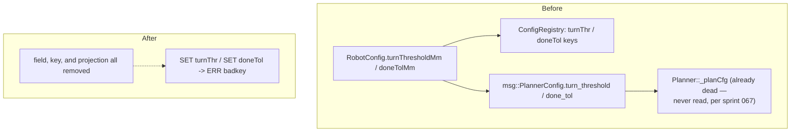
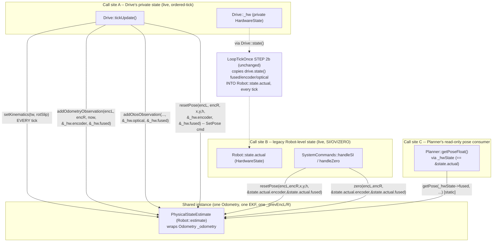

<!-- CLASI: Before changing code or making plans, review the SE process in CLAUDE.md -->

# Architecture Update — Sprint 070: FIXME cleanup — legacy go-to config, EstimateDump enum, PhysicalStateEstimate de-threading

## Scope decision: units-rename issue split to sprint 071

The roadmap `sprint.md` listed three issues and flagged the units-rename issue
as a likely split candidate. Having planned all three in detail, **this
sprint (070) covers only `fixme-cleanup-legacy-config-and-estimatedump-enum.md`
and `physicalstateestimate-remove-hardwarestate-param-threading.md`.**
`remove-units-from-identifier-names.md` is recommended for a new sprint 071.
Rationale (see Design Rationale Decision 1 for full detail): issue 1 is an
order-of-magnitude larger, differently-shaped change (60+ identifiers, both
host and firmware, wire-compat decisions per identifier) that the roadmap's
own sequencing note says should run *after* this sprint's shrinking work
lands, making it a serial, not parallel, dependency — bundling it into 070
would not reduce risk, only inflate one sprint into two sprints' worth of
review surface. Issues 2 and 3 are fully independent of each other (verified
by file-level overlap check below) and are each completable with high
confidence in one focused ticket.

---

## Step 1: Understand the Problem

**What changes:** two long-dead configuration fields and their wire keys are
removed end-to-end; a string-tagged diagnostic struct field becomes a
compile-time-checked enum; a class that threads a 200+-byte state blob through
every method instead takes exactly the inputs, config, and outputs it uses.

**What does not change:** live go-to behavior (`G`'s pre-rotate/arrival
gating already runs on `turnInPlaceGate`/`arriveTolMm`, not the fields being
removed — confirmed by sprint 067's independent consumer audit and
re-confirmed this sprint by direct grep, zero hits for `getTurnThreshold()`/
`getDoneTol()` anywhere); `DBG EST`'s wire text; the EKF fusion algorithm;
sprint 067's live-`SET`-reaches-`Planner`/`Drive` guarantee; sprint 068's
three-pose TLM (`encpose=`/`otos=`/`pose=`); sprint 069's `SIMSET`/`SIMGET`
surface and config keys.

**Why now:** both issues are FIXME markers the stakeholder placed directly in
source (`Config.h:125` "FIXME Eliminate legacies"; `EstimateDump.h:23`
"FIXME should be an enum"; `PhysicalStateEstimate.h`'s per-method
`HardwareState&` pattern flagged in issue 3). All three are confirmed
low-risk, well-bounded refactors once the actual call graph is read (not
just the issue text) — this planning pass did that reading in full, and it
surfaced one non-obvious correctness constraint (see Step 6, Decision 3) that
a naive implementation of issue 3 would have gotten wrong.

**Codebase-alignment reading done this pass (not just the issue text):**
- `PhysicalStateEstimate.{h,cpp}`, `Odometry.{h,cpp}` read in full.
- Every call site of `addOdometryObservation`, `addOtosObservation`,
  `resetPose`, `zero`, `getPose`, `getVelocity`, `encoderEstimate`,
  `opticalEstimate`, `fusedEstimate`, `setCtx` found by grep across
  `source/` and `tests/_infra/sim/` (not just `Drive.cpp`/`Robot.cpp`, which
  the issue names — `Planner.cpp` and `SystemCommands.cpp` also call in).
- `Drive.cpp`'s `tickUpdate()` (STEP 1–6) and `Drive.h`'s private `_hw`
  ownership read in full to establish which `HardwareState` instance each
  call site actually targets.
- `LoopTickOnce.cpp` STEP 2b read in full to confirm `Robot::state.actual` is
  a **follower** — synced every tick from `robot.drive.state()` — not an
  independent write target under normal tick flow.
- `ConfigRegistry.cpp`, `DefaultConfig.cpp`, `PlannerConfig.{h,cpp}`,
  `protos/planner.proto`, `scripts/gen_messages.py`, and
  `tests/_infra/default_config_golden.json` read to trace `turnThresholdMm`/
  `doneTolMm` end-to-end, including the internal (host-only, never-on-the-
  wire) protobuf-generated `msg::PlannerConfig` struct the issue's own text
  did not name explicitly.
- `docs/architecture/done/architecture-update-011.md` read — this is the
  sprint that originally *retained* these two fields "because removing them
  would break existing calibration scripts... the breakage cost is high."
  This sprint's Decision 4 explicitly revisits that call.
- Full `FIXME` grep of `source/` (not just the two issues' named markers) —
  found two markers neither issue tracks (`ArgSchema.h`, `OutputState.h`).
  Both are folded into ticket 002 as small, zero-risk additions (see Step 3).
- `docs/usecases.md` read for UC-006/007/014/015 (parent UCs for this
  sprint's SUCs).

---

## Step 2: Identify Responsibilities

| Responsibility | Owning module | Why it changes independently |
|---|---|---|
| Define which go-to tolerance fields exist in `RobotConfig` and which SET/GET keys expose them | `source/types/Config.h`, `source/robot/DefaultConfig.cpp`, `source/robot/ConfigRegistry.cpp` | Sole owners of the field/key vocabulary; removing a dead field-and-key pair is a closed, self-contained edit here. |
| Project `RobotConfig` motion-limit fields into the internal `msg::PlannerConfig` message | `source/superstructure/PlannerConfig.{h,cpp}`, `protos/planner.proto`, `scripts/gen_messages.py` | Sole owners of the host-only codegen pipeline that produces `source/messages/planner.h`; a field removed from `RobotConfig` must be removed from this projection in the same edit or the projection call site fails to compile. |
| Tag and emit one of three pose-estimate snapshots for diagnostics | `source/state/EstimateDump.h`, `source/commands/DebugCommands.cpp` | `EstimateDump.h` owns the tag type and the fill helper; `DebugCommands.cpp::handleDbgEst` is the **only** place that ever turns the tag into wire text — confirmed by grep, zero other consumers. These two files change together for this one reason; nothing else in the codebase constructs or reads an `EstimateDump`. |
| Resolve two small, previously-untracked FIXME markers discovered in this sprint's own clean-grep sweep | `source/types/ArgSchema.h`, `source/state/OutputState.h` | Neither marker's substance is tracked by either of this sprint's two issues; each is a one-line, zero-risk documentation resolution, folded into the FIXME-sweep ticket so the sprint's own "grep -ri FIXME source/ is clean except units" acceptance bar is achievable. |
| Reword two historical (already-resolved) FIXME references so the literal string `FIXME` doesn't linger | `source/control/StopCondition.cpp`, `source/control/ColorUtil.cpp` | Same ticket as above — cosmetic, comment-only. |
| Integrate encoder deltas and OTOS observations into pose estimates; own the EKF | `source/control/Odometry.{h,cpp}` | Sole owner of `_prevEncL/R`, `_encPoseX/Y/H`, `_ekf`. Its method signatures change because its *callers'* data-ownership shape (see next row) determines what can be threaded implicitly vs. must be passed explicitly. |
| Present a narrow, explicit-input/output wrapper over `Odometry` | `source/state/PhysicalStateEstimate.{h,cpp}` | Sole purpose is to be `Odometry`'s public seam; every one of its method signatures is a 1:1 mirror of `Odometry`'s, so it changes in lockstep, never independently. |
| Supply per-tick encoder readings and OTOS observations to the estimator, from Drive's own private state | `source/subsystems/drive/Drive.cpp` | Sole owner of the private `_hw` `HardwareState` slice; the call-site shape it uses is entirely internal to this file. |
| Re-anchor pose from an external fix (`SI`/`OV`) or zero it (`ZERO pose`), against the legacy `Robot::state.actual` view | `source/commands/SystemCommands.cpp`, `source/robot/Robot.cpp` | These are the **second, independent** call sites for `resetPose`/`zero`/`addOtosObservation` that target a *different* `HardwareState` instance than `Drive::_hw` — discovered by reading the code, not assumed from the issue text (see Decision 3). They change for the same reason `Drive.cpp` does (signature narrowing) but are listed separately because they are a genuinely separate call path with separate destination data. |
| Read the fused pose for goal-closure math | `source/superstructure/Planner.cpp` (`getPoseFloat()`) | A third, independent consumer of `PhysicalStateEstimate::getPose()`, reading through its own `HardwareState*` pointer (`_hwState`, wired to `&state.actual` in `Robot.cpp`) — unrelated to `Odometry`'s internal state ownership, so it is listed as its own row. |

No responsibility spans more than one of the modules above. The
legacy-config-removal work (row 1–2) and the `EstimateDump` enum work (row 3)
touch fully disjoint files and have no ordering dependency on each other. The
FIXME-sweep row (4–5) depends only on rows 1–3 having already removed their
own FIXME markers (so the sweep's final clean-grep check is meaningful).
`PhysicalStateEstimate` de-threading (rows 6–10) touches an entirely
different file set than rows 1–5 and has no ordering dependency on them.

---

## Step 3: Subsystems and Modules

| Module | Purpose (one sentence, no "and") | Boundary | Use cases served |
|---|---|---|---|
| **Go-to tolerance config** (`source/types/Config.h`, `source/robot/DefaultConfig.cpp`, `source/robot/ConfigRegistry.cpp`, `source/superstructure/PlannerConfig.{h,cpp}`, `protos/planner.proto`, `scripts/gen_messages.py`) | Declares and defaults the config fields that gate go-to completion. | Inside: field declarations, defaults, SET/GET key registration, the host-only message projection. Outside: what Planner actually *does* with `turnInPlaceGate`/`arriveTolMm` (unchanged, not touched). | SUC-001 |
| **EstimateDump tagging** (`source/state/EstimateDump.h`) | Tags a pose-estimate snapshot with which of the three sources produced it. | Inside: the `EstimateSource` enum, `EstimateDump` struct, `dumpEstimates()` fill helper, the `toString()` mapping. Outside: how the tag is rendered into wire text at the call site (that belongs to the emit point). | SUC-002 |
| **EST diagnostic emit** (`source/commands/DebugCommands.cpp::handleDbgEst`) | Renders three `EstimateDump` snapshots into `DBG EST` wire text. | Inside: the one `snprintf` loop and its one `toString()` call per line. Outside: how each `EstimateDump` was populated. | SUC-002 |
| **FIXME sweep** (`source/types/ArgSchema.h`, `source/state/OutputState.h`, `source/control/StopCondition.cpp`, `source/control/ColorUtil.cpp`) | Resolves the sprint's remaining small, untracked FIXME markers to zero. | Inside: four one-line comment edits. Outside: any behavior — none of these four edits touch a code path. | SUC-003 |
| **PhysicalStateEstimate** (`source/state/PhysicalStateEstimate.{h,cpp}`) | Exposes `Odometry`'s pose-estimation capability through an explicit, narrow, HardwareState-free contract. | Inside: method signatures, forwarding to `Odometry`. Outside: the integration math itself (that's `Odometry`'s job) and where callers get their `PoseEstimate&` output slots from (that's each caller's own state ownership). | SUC-004, SUC-005 |
| **Odometry** (`source/control/Odometry.{h,cpp}`) | Dead-reckons and EKF-fuses pose from explicit encoder/OTOS inputs into explicit `PoseEstimate` outputs. | Inside: `_prevEncL/R`, `_encPoseX/Y/H`, `_ekf`, the new `_trackwidthMm`/`_rotationalSlip` config fields and `setKinematics()`. Outside: which `HardwareState` (if any) a caller's `PoseEstimate&` output happens to live inside — `Odometry` no longer knows or cares. | SUC-004, SUC-005 |
| **Drive's estimator call sites** (`source/subsystems/drive/Drive.cpp`) | Feeds `Drive`'s own private encoder/OTOS readings into the shared estimator and directs its output at `Drive`'s own private `_hw`. | Inside: the four call-site edits in `tickUpdate()` and the SetPose handler. Outside: `PhysicalStateEstimate`'s internals. | SUC-005 |
| **Legacy pose-command call sites** (`source/commands/SystemCommands.cpp`, `source/robot/Robot.cpp`) | Feeds `SI`/`OV`/`ZERO pose` external pose fixes into the shared estimator, directed at `Robot::state.actual`. | Inside: the `handleSI`/`handleZero`/`otosCorrect()` call-site edits. Outside: `PhysicalStateEstimate`'s internals; unaffected by, and does not affect, `Drive`'s own calls into the same estimator. | SUC-005 |
| **Planner's pose read** (`source/superstructure/Planner.cpp::getPoseFloat`) | Reads the fused pose for goal-closure math from whichever `HardwareState` Planner has been pointed at. | Inside: one call-site narrowing (`*_hwState` → `_hwState->fused`). Outside: everything else about `Planner`. | SUC-004 |

Every module addresses at least one SUC. No module is speculative — each
line above is a real file this sprint edits, not a hypothetical future
extension point.

---

## Step 4: Diagrams

### 4a. Legacy config removal — before/after wire surface



No cycles. Removing the field, its key, and its projection is a leaf-node
deletion — nothing else in the graph depended on this subtree except the
already-confirmed-dead `_planCfg` mirror (067's Decision 4/5).

### 4b. `EstimateDump` — single to-string mapping at the emit point

```mermaid
graph LR
    DUMP["dumpEstimates()\nfills EstimateDump[3] with\nEstimateSource::Encoder/Optical/Fused"]
    EMIT["DebugCommands::handleDbgEst\n(ONLY consumer)"]
    TOSTR["toString(EstimateSource) -> \"enc\"/\"otos\"/\"fuse\"\n(defined in EstimateDump.h,\nCALLED only at the emit point)"]
    WIRE["EST enc/otos/fuse ... (byte-identical text)"]

    DUMP -->|EstimateDump[3]| EMIT
    EMIT -->|"toString(d.source)"| TOSTR
    TOSTR --> EMIT
    EMIT --> WIRE
```

No cycles. `dumpEstimates()` never converts to string; `handleDbgEst` is
confirmed (by grep) to be the only translation-unit that ever reads
`EstimateDump::source`, so "single mapping at the emit point" is structurally
enforced, not just a convention.

### 4c. `PhysicalStateEstimate` / `Odometry` — call-site topology (the key finding)



No cycles. `Drive::_hw` and `Robot::state.actual` are **two distinct
`PoseEstimate` storage locations** kept consistent by the pre-existing
one-directional `LoopTickOnce` sync (A → B, every tick) plus `SI`'s existing
dual-path staging (which independently resets both A and B in the same
command) — this sprint does not introduce, remove, or reroute that sync; it
only makes each call site's `PhysicalStateEstimate` call explicit about
which storage location it targets. This is why `resetPose`/`zero`/
`addOdometryObservation`/`addOtosObservation` take **per-call output
reference parameters** rather than a single value bound once at construction
— a single bind would silently collapse call sites A and B onto one
destination, which Step 6 Decision 3 explains is not behavior-preserving.

---

## Step 5: What Changed / Why / Impact / Migration

### What Changed

**Legacy go-to config removal (Ticket 001):**
- `source/types/Config.h`: delete the "Go-to tolerances (legacy...)" block
  (`turnThresholdMm`, `doneTolMm`, and their FIXME comments).
- `source/robot/DefaultConfig.cpp`: delete the two default assignments.
- `source/robot/ConfigRegistry.cpp`: delete the two `CFG_FI` rows. `SET
  turnThr=`/`SET doneTol=` become `ERR badkey`.
- `protos/planner.proto`: delete `turn_threshold`/`done_tol` fields 10/11
  from `message PlannerConfig`; add a `reserved 10, 11;` marker so a future
  field never silently reuses the numbers.
- `scripts/gen_messages.py`: delete the two `("PlannerConfig", "...")` field-
  map rows; regenerate `source/messages/planner.h` (drops `turn_threshold`/
  `done_tol` fields, getters, setters).
- `source/superstructure/PlannerConfig.{h,cpp}`: delete the
  `cfg.setTurnThreshold(...)`/`cfg.setDoneTol(...)` calls and the doc-comment
  mentions of the two fields.
- `tests/_infra/default_config_golden.json`: regenerate (drops the two lines).
- `tests/simulation/unit/test_config_registry.py`: `test_legacy_turnThr_still_present`/
  `test_legacy_doneTol_still_present` rewritten to assert `ERR badkey`
  instead of presence; the `("turnThr", "float_as_int")`/`("doneTol", ...)`
  table rows and the `DEFAULT_GET_LINE`/expected-dump-string fixtures
  updated to drop the two keys; `test_full_get_36_keys` renamed/renumbered
  to the new real count.
- `docs/protocol-v2.md`: remove `turnThr`/`doneTol` from the Named Key Table
  and the two example `CFG ...` dump lines; correct the stale G-command prose
  (currently describes pre-rotate/done gating in terms of `turnThr`/`doneTol`,
  which have not actually gated `G` since sprint 011 introduced
  `turnInPlaceGate`/`arriveTolMm` — this sprint corrects the prose to name
  the fields that are actually live, fixing a pre-existing documentation
  drift while it's already being touched).
- `docs/design/message-inventory.md`: regenerated (drops the two rows).
- `docs/overview.md`, `docs/architecture.md`: update the one-line mentions of
  `doneTol`/`turnThresholdMm`/`doneTolMm` to the live equivalents.

**`EstimateDump` enum + FIXME sweep (Ticket 002):**
- `source/state/EstimateDump.h`: `const char* source;` → `EstimateSource
  source;` where `enum class EstimateSource : uint8_t { Encoder, Optical,
  Fused };`; add `inline const char* toString(EstimateSource)`; `fill()`'s
  lambda takes `EstimateSource src` instead of `const char* src`;
  `dumpEstimates()`'s three calls pass `EstimateSource::Encoder/Optical/Fused`
  instead of `"enc"/"otos"/"fuse"`. Remove the FIXME comment.
- `source/commands/DebugCommands.cpp::handleDbgEst`: the `snprintf` call's
  `d.source` argument becomes `toString(d.source)`.
- `source/types/ArgSchema.h`: replace the FIXME on `ArgKind` with a resolved
  comment explaining why `ArgKind` (schema layer) and `CommandTypes::ArgType`
  (runtime tagged-union layer) are intentionally kept separate rather than
  merged — both files already live in `source/types/` so there is no
  circular-dependency reason to keep them apart, but merging would couple the
  declarative schema layer to the runtime dispatch layer's type for zero
  behavioral benefit (see Decision 5). No code change, comment-only.
- `source/state/OutputState.h`: replace the FIXME on `digitalDirty` with a
  comment stating the fields are currently dead (confirmed by grep: no
  producer or writes them, no consumer reads them anywhere in `source/`) —
  same disposition as sprint 067 Decision 5 ("document dead things, don't fix
  them"). No code change.
- `source/control/StopCondition.cpp:20`, `source/control/ColorUtil.cpp:4`:
  reword so neither contains the literal string `FIXME` (both already
  describe an already-resolved historical issue, per this sprint's own
  issue text).

**`PhysicalStateEstimate` de-threading (Ticket 003):**
- `source/state/PhysicalStateEstimate.h`/`.cpp`:
  - New `void setKinematics(float trackwidthMm, float rotationalSlip);`
    (forwards to `Odometry::setKinematics`).
  - `addOdometryObservation(HardwareState&, float, float, uint32_t)` →
    `addOdometryObservation(float encLeftMm, float encRightMm, uint32_t
    now_ms, PoseEstimate& encoderOut, PoseEstimate& fusedOut)`.
  - `addOtosObservation(HardwareState&, ...)` →
    `addOtosObservation(float x_otos, float y_otos, float theta_otos_rad,
    float v_otos_mmps, float omega_otos_rads, float vy_otos_mmps, uint32_t
    now_ms, PoseEstimate& opticalOut, PoseEstimate& fusedOut)`.
  - `resetPose(HardwareState&, int32_t, int32_t, int32_t)` →
    `resetPose(float encLeftMm, float encRightMm, int32_t x_mm, int32_t
    y_mm, int32_t h_cdeg, PoseEstimate& encoderOut, PoseEstimate& fusedOut)`.
  - `zero(HardwareState&)` → `zero(float encLeftMm, float encRightMm,
    PoseEstimate& encoderOut, PoseEstimate& fusedOut)`.
  - `static getPose(const HardwareState&, ...)` → `static getPose(const
    PoseEstimate& fused, int32_t&, int32_t&, int32_t&)` (narrowed from the
    whole state blob to the one sub-struct it reads).
  - `getVelocity`, `encoderEstimate`, `opticalEstimate`, `fusedEstimate`:
    **deleted** — confirmed zero callers anywhere in `source/` or
    `tests/_infra/`; the issue itself calls these "leftovers" to clean up
    under Option 2.
  - `setCtx(IOdometer*, const HardwareState*)`: **deleted** — it was already
    a documented no-op (`Odometry::setCtx` ignores both parameters), and no
    replacement injection point is needed because every remaining method is
    now explicit per-call (see Decision 3 for why "bind once" was rejected).
- `source/control/Odometry.h`/`.cpp`: mirrors every signature change above
  (it is the wrapped implementation); adds `_trackwidthMm`/`_rotationalSlip`
  member fields and `setKinematics()`; `predict()`'s trackwidth/slip
  parameters are removed (read from the new members instead); `setCtx`
  deleted; `correct()` (the pre-EKF complementary filter, confirmed dead —
  zero callers, per sprint 067's audit) is **left untouched**, still taking
  `HardwareState&` — it is not reachable via any `PhysicalStateEstimate`
  method and therefore is out of this ticket's acceptance-criteria scope
  (see Decision 6).
- `source/subsystems/drive/Drive.cpp`: `tickUpdate()`'s trackwidth/rotSlip
  read now feeds `_est.setKinematics(...)` (called every tick, matching
  today's every-tick freshness exactly) instead of being passed as
  observation parameters; the `addOdometryObservation`/`addOtosObservation`/
  `resetPose` call sites pass `_hw.encMm[]`/`_hw.encoder`/`_hw.optical`/
  `_hw.fused` explicitly.
- `source/robot/Robot.cpp`: delete the `estimate.setCtx(&otos,
  &state.actual);` line (line 130); `otosCorrect()`'s (dead code, zero
  callers — confirmed by grep) `addOtosObservation` call updated to the new
  signature so it still compiles (`&state.actual.optical`,
  `&state.actual.fused`).
- `source/commands/SystemCommands.cpp`: `handleZero`'s `estimate.zero(...)`
  and `handleSI`'s `estimate.resetPose(...)` calls updated to pass
  `robot->state.actual.encMm[1]/[0]` and `&robot->state.actual.encoder`/
  `&robot->state.actual.fused` explicitly.
- `source/superstructure/Planner.cpp::getPoseFloat`: `PhysicalStateEstimate::
  getPose(*_hwState, xi, yi, hi)` → `PhysicalStateEstimate::
  getPose(_hwState->fused, xi, yi, hi)`.
- New unit test coverage for `Odometry::setKinematics()`/
  `PhysicalStateEstimate::setKinematics()` (a live-update regression, mirroring
  067's own methodology) and for the narrowed `getPose(const PoseEstimate&,
  ...)` signature.
- Full `uv run python -m pytest` run (both after Ticket 001+002 and again
  after Ticket 003) to confirm the confirmed baseline (2612 passed, 0 failed
  — see Migration Concerns) stays green throughout, plus any new tests.

### Why

- Ticket 001 exists because `Config.h:125`'s FIXME is a direct stakeholder
  instruction, and this sprint's own audit (re-deriving, not just citing,
  sprint 067's finding) confirms zero live consumer remains for either field
  — the only reason NOT to remove them (sprint 011's back-compat concern for
  external calibration scripts) is explicitly re-litigated by this issue's
  own acceptance criteria, which name "removed end-to-end... ConfigRegistry
  keys" as the target state (see Decision 4).
- Ticket 002's enum exists because `EstimateDump.h:23`'s FIXME is a direct
  stakeholder instruction, and the single-consumer confirmation (grep) means
  the "single to-string mapping at the emit point" requirement is
  structurally trivial to satisfy, not just aspirational.
- Ticket 002's FIXME-sweep additions exist because this sprint's own planning
  pass found two markers neither issue tracks — leaving them untracked would
  make issue 2's stated acceptance bar ("`grep -ri FIXME source/` comes back
  clean") false for reasons outside either issue's original scope; folding
  in two one-line, zero-risk resolutions is cheaper than filing a whole new
  issue for two sentences of documentation.
- Ticket 003 exists because `PhysicalStateEstimate.h`'s per-method
  `HardwareState&` parameter is exactly the pattern issue 3 describes, and
  the stakeholder's own preferred resolution (Option 2, "extract the
  explicit pieces") is followed — but the *shape* of the extraction (per-call
  output references, not a single "bind once" injection point) is dictated
  by a fact only visible by reading the actual call graph: `resetPose`/`zero`
  have two independent, live, differently-targeted call sites. This is the
  single most important finding of this planning pass — see Decision 3.

### Impact on Existing Components

| Component | Impact |
|---|---|
| `source/types/Config.h` | **Modified.** Two fields removed. No other field changes. |
| `source/robot/DefaultConfig.cpp` | **Modified.** Two default assignments removed. |
| `source/robot/ConfigRegistry.cpp` | **Modified.** Two registry rows removed; `SET`/`GET` behavior for `turnThr`/`doneTol` changes from silently-accepted-but-ignored to `ERR badkey` — the one deliberate, documented wire-behavior change in this sprint (everything else is byte-identical). |
| `source/superstructure/PlannerConfig.{h,cpp}`, `protos/planner.proto`, `source/messages/planner.h` | **Modified.** Two fields removed from an internal, host-only message struct never transmitted on the robot wire protocol. |
| `source/superstructure/Planner.{h,cpp}` (`_planCfg`, `PlannerConfig` whitelist) | **Unaffected beyond Step 5's one-line `getPoseFloat` narrowing.** `_planCfg` was already confirmed dead by sprint 067; this sprint does not touch or resurrect it. |
| `source/state/EstimateDump.h` | **Modified.** `source` field type changes; `toString()` added. |
| `source/commands/DebugCommands.cpp` | **Modified.** One `snprintf` argument wrapped in `toString()`. No other DBG command touched. |
| `source/types/ArgSchema.h`, `source/state/OutputState.h`, `source/control/StopCondition.cpp`, `source/control/ColorUtil.cpp` | **Modified, comment-only.** Zero behavior change. |
| `source/state/PhysicalStateEstimate.{h,cpp}` | **Modified.** Every method signature involving `HardwareState&`/`ActualState&` changes; four methods deleted (`getVelocity`, `encoderEstimate`, `opticalEstimate`, `fusedEstimate`, `setCtx`); one method added (`setKinematics`). |
| `source/control/Odometry.{h,cpp}` | **Modified**, mirroring `PhysicalStateEstimate`. `correct()` is explicitly **unaffected** (dead, out of scope — Decision 6). |
| `source/subsystems/drive/Drive.cpp` | **Modified.** Four call sites updated to the new explicit signatures; one new `setKinematics()` call added to `tickUpdate()`. No change to `Drive`'s own public API (`Drive.h` unchanged). |
| `source/robot/Robot.cpp` | **Modified.** One line deleted (`setCtx`); one dead-code call site (`otosCorrect()`) updated to compile against the new signature. |
| `source/commands/SystemCommands.cpp` | **Modified.** Two call sites (`handleSI`, `handleZero`) updated to the new explicit signatures. No change to `SI`/`ZERO`'s wire grammar or reply text. |
| `source/superstructure/Planner.cpp` | **Modified.** One call site (`getPoseFloat`) narrowed. |
| `source/robot/LoopTickOnce.cpp` | **Unaffected.** STEP 2b's `Robot::state.actual` sync from `drive.state()` is untouched — it does not call into `PhysicalStateEstimate` at all, it reads `Drive`'s already-public `msg::DrivetrainState`. |
| `tests/_infra/default_config_golden.json`, `tests/simulation/unit/test_config_registry.py` | **Modified/regenerated** per Ticket 001. |
| `tests/_infra/golden_tlm_capture.json` | **Unaffected.** No TLM field or format changes anywhere in this sprint. |
| `docs/protocol-v2.md`, `docs/design/message-inventory.md`, `docs/overview.md`, `docs/architecture.md` | **Modified** per Ticket 001 (also fixes a pre-existing prose-drift bug in `protocol-v2.md`'s `G` command description, discovered while updating it). |

### Migration Concerns

- **No wire-protocol break except the one named, deliberate change.**
  `SET turnThr=`/`SET doneTol=` change from silently-accepted-and-ignored to
  `ERR badkey`. This is the sprint's one intentional behavior change,
  reversing a documented sprint-011 decision — flagged prominently for the
  stakeholder-approval gate (Decision 4). Every other wire behavior
  (`DBG EST`, `SI`, `OV`, `ZERO`, TLM, `SIMSET`/`SIMGET`) is byte-identical.
- **No `RobotConfig` layout surprises.** `sizeof(RobotConfig)` shrinks by two
  `float`s; no other field's offset-dependent behavior changes (`ConfigRegistry`
  rows use named-field macros, not raw offsets that could silently shift and
  alias).
- **No data/schema migration.** No persisted per-robot JSON
  (`data/robots/*.json`) references either legacy field or key — confirmed by
  grep before removing them; only the test-only golden fixture needs
  regeneration.
- **Golden-TLM fixture unaffected.** Neither ticket touches any TLM field or
  the `buildTlmFrame()` buffer.
- **Confirmed test baseline.** `uv run python -m pytest` on the current
  checkout (branch `master`, HEAD `20e4879` — the "comprehensive SIMSET
  integration and telemetry testing" commit the roadmap flagged) is
  **2612 passed, 0 failed, in 82.96s.** This is the number every ticket's
  acceptance criteria must reproduce (minus the two rewritten legacy-key
  tests, plus whatever small number of new tests each ticket adds).
- **Deployment sequencing (firmware build).** `Config.h`, `ConfigRegistry.cpp`,
  `PhysicalStateEstimate.{h,cpp}`, `Odometry.{h,cpp}`, `Drive.cpp` are all
  ARM-target-and-sim-shared source; a `--clean` build is required for the sim
  library before running tests that exercise them, and before any later
  hardware validation (project knowledge: stale incremental builds on
  `/Volumes` — build banners lie). `protos/planner.proto` requires
  `scripts/gen_messages.py` to be re-run (regenerates `source/messages/
  planner.h`) before the `--clean` build.
- **Ticket ordering within this sprint.** Ticket 002 depends on Ticket 001
  (its final clean-grep check needs Ticket 001's FIXME already removed).
  Ticket 003 has no file-level dependency on either and could run first or
  last; it is sequenced last because it is the largest, highest-attention
  change and benefits from the smaller tickets' green-suite confidence first.

---

## Step 6: Design Rationale

### Decision 1: split the units-rename issue into a separate sprint 071

**Context:** the roadmap flagged this as a likely split; detail planning
must confirm or reject it with the full picture in hand.

**Alternatives considered:**
- *All three issues in 070 as a phased ticket sequence.* Technically
  possible — issue 1 doesn't conflict at the file level with issues 2/3
  (issue 1 touches identifier spelling everywhere; issues 2/3 touch field
  *existence* in a small, specific set of files) as long as issue 1's
  ticket(s) run *after* issues 2/3's (per the roadmap's own stated
  ordering rationale: rename the reduced surface, not fields about to be
  deleted). But issue 1 is independently "LARGE" per its own issue text:
  60+ C++ identifiers, `read_ms` alone at 121 Python call sites, and — most
  importantly — its own nontrivial design decisions (the comment convention,
  which wire/protocol names get renamed in lock-step vs. explicitly excluded,
  how to resolve ambiguous names like `mmPerDeg`) that deserve their own
  architecture-review attention rather than being a tail appended to this
  sprint's already-substantial review surface (two FIXME-driven fixes plus a
  nontrivial de-threading redesign).
- *070 = issues 2+3 only; issue 1 deferred to sprint 071* (chosen).

**Why this choice:** issues 2 and 3 are self-contained, verified-safe, and
of a piece (both are "shrink/reshape a narrow surface" refactors uncovered
directly by stakeholder FIXME markers). Issue 1 is a different *kind* of
work — a mechanical sweep whose main risk is breadth and wire-compat
judgment calls, not design complexity — and benefits from its own dedicated
planning pass once this sprint's shrinking work has landed and the surface
it sweeps over is smaller. Keeping 070 focused also means the stakeholder
gate for issue 1's wire-compat decisions is not entangled with this sprint's
own nontrivial decision (Decision 4, reversing the sprint 011 back-compat
call) — two separate judgment calls deserve two separate approval points.

**Consequences:** `remove-units-from-identifier-names.md` is untouched by
this sprint; the team-lead creates sprint 071 for it after this sprint
closes. Per this sprint's own issue text, `grep -ri FIXME source/` will
**not** be fully clean at the end of 070 — it will contain exactly the 8
units-suffix markers already tracked in that issue (see SUC-003 and Ticket
002's acceptance criteria for the precise, achievable bar).

### Decision 2: `EstimateSource` as `enum class : uint8_t` with a single free-function `toString()`

**Context:** the issue asks for "an enum class ... with a single to-string
at the emit point."

**Alternatives considered:**
- *A member function `EstimateDump::toString()`.* Would require
  `EstimateDump` to own formatting knowledge it currently has zero of (it's
  a POD snapshot struct); also less consistent with the project's existing
  idiom of small free functions for enum-to-string (e.g. no member-function
  precedent for this pattern elsewhere in `source/state/`).
- *A `static constexpr const char* kNames[] = {"enc","otos","fuse"}` array
  indexed by the enum, instead of a `switch`.* Marginally shorter, but a
  `switch` gives a compiler warning if a fourth `EstimateSource` value is
  ever added without updating `toString()` (`-Wswitch` on an unhandled
  enumerator) — the array form gives no such protection. Chosen: `switch`.
- *Free function `toString(EstimateSource)`, `switch`-based, declared next to
  the enum in `EstimateDump.h`* (chosen).

**Why this choice:** matches the project's own "map dispatch by name" idiom
used throughout `ConfigRegistry`/`SimCommands` (069's own `kSimRegistry[]`
row-per-key pattern is a cousin of this, just smaller: enum-per-source
instead of key-per-string); the `-Wswitch` protection is free future-proofing
against a fourth pose source (e.g. a future GPS/beacon fix) silently missing
its wire text.

**Consequences:** none beyond the trivial addition; TLM/`DBG EST` output is
byte-identical, verified by this sprint's ticket acceptance criteria.

### Decision 3: per-call explicit output references, not a single "bind once at construction" injection point

**Context:** the issue's Option 2 text says outputs should be "either owned
by `PhysicalStateEstimate` and mirrored/read from there, or bound once at
construction as an explicit 'estimates out' destination." This planning pass
initially assumed the second shape (a `bindEstimates()` call once from
`Drive`'s constructor, replacing `setCtx`) — until reading every call site.

**What the reading found:** `resetPose`/`zero` are called from **two
independent, live places targeting two different `PoseEstimate` storage
locations**:
1. `Drive.cpp:327` — `_est.resetPose(_hw, ...)` — targets `Drive`'s private
   `_hw` (the message-contract / ordered-tick path).
2. `SystemCommands.cpp:330,731` (`handleZero`, `handleSI`) —
   `estimate.zero(robot->state.actual)` / `estimate.resetPose(robot->
   state.actual, ...)` — targets `Robot`'s own top-level `state.actual`
   directly (the legacy system-command path). `handleSI` additionally stages
   a `drive.apply(SetPose)` command specifically *so that* `Drive::_hw` gets
   independently re-anchored too — the code's own comment says so explicitly
   ("Both the legacy path (`robot->estimate` above) and the new-arch path
   (`drive`) are consistent"), confirming this dual-write is deliberate
   existing design, not an oversight to "fix."

A single `bindEstimates()` call, fixed once at `Drive`'s construction to
`Drive::_hw`, would silently redirect `SI`'s and `ZERO pose`'s legacy-path
write from `Robot::state.actual` to `Drive::_hw` — collapsing two
intentionally-distinct destinations into one. Since `LoopTickOnce`'s STEP 2b
sync only runs `Drive::_hw → Robot::state.actual` (one direction, once per
tick, well *after* command dispatch in the loop order), a collapsed bind
would leave `Robot::state.actual` un-reset until the next tick's sync catches
up — a timing/consistency change, not the "no behavioral change" this sprint
promises.

**Alternatives considered:**
- *Bind once at construction (the issue's second option, taken literally).*
  Rejected per the above — not behavior-preserving given the actual call
  graph.
- *`PhysicalStateEstimate` owns the three `PoseEstimate`s itself (the issue's
  first option).* Would require `Drive::_hw.encoder/.optical/.fused` and
  `Robot::state.actual.encoder/.optical/.fused` to become *copies* read back
  out of `PhysicalStateEstimate` after each call, rather than the estimator
  writing directly into caller-owned storage — a bigger restructuring (every
  reader of `_hw.encoder`/`state.actual.encoder` elsewhere in the codebase,
  e.g. `Drive::state()`'s `copyPE()`, would need to change what it copies
  from) for no behavioral benefit, and it still doesn't resolve the
  two-destination question — it just moves it to "which of two owned copies
  does a reader ask for."
- *Per-call explicit output reference parameters* (chosen). Every
  observation/reset method takes the specific `PoseEstimate&` slot(s) it
  writes as an explicit parameter, supplied by the caller at the call site.
  This is a strict narrowing of today's `HardwareState&` parameter (from "the
  whole 200+-byte state blob" down to "the one or two `PoseEstimate` fields
  actually touched") that requires **zero** assumption about how many
  distinct destinations exist — it already works today (implicitly, via
  whichever `HardwareState&` was passed) and continues to work identically,
  just with the two destination structs threaded explicitly instead of
  implicitly via the surrounding blob.

**Why this choice:** it is the only option that is provably behavior-
preserving given the actual, verified call graph, and it applies uniformly
to all four observation/reset methods (no special-casing "these two are
bind-once, these two are per-call") — a class with one calling convention is
more cohesive than one with two.

**Consequences:** `setCtx` has no replacement — it is simply deleted (it was
already a no-op). `bindKinematics`-style config (trackwidth, rotational
slip) is genuinely single-destination (`Drive` is the only caller of
`addOdometryObservation`), so it *does* use the "set once, refreshed live"
shape (`setKinematics()`, called every tick from `Drive::tickUpdate()`) —
config and output-destination are different axes, and only the latter turned
out to be multi-destination. Call sites in `Drive.cpp`, `SystemCommands.cpp`,
and the dead `Robot::otosCorrect()` are each slightly more verbose (one or
two extra reference arguments) than a bind-once design would have been — a
small, worthwhile cost for provable correctness.

### Decision 4: fully remove `turnThresholdMm`/`doneTolMm` and their wire keys, reversing sprint 011's back-compat decision

**Context:** `docs/architecture/done/architecture-update-011.md` explicitly
retained these two fields and keys "because removing them would break
existing calibration scripts... the breakage cost is high." Two existing
regression tests (`test_legacy_turnThr_still_present`,
`test_legacy_doneTol_still_present`) encode that decision. This sprint's own
issue (`fixme-cleanup-legacy-config-and-estimatedump-enum.md`) explicitly
re-opens the question: "Decide whether anything still meaningfully consumes
these... If a host tool or stored robot config still sends `turnThr`/
`doneTol`, either drop with a deprecation note or keep the wire keys as
accepted-but-ignored for one release — note which in the ticket," and its
acceptance criteria state the target state as "removed end-to-end (Config
struct, defaults, ConfigRegistry keys, PlannerConfig/Planner plumbing)."

**Alternatives considered:**
- *Keep the wire keys as accepted-but-ignored* (the issue's other named
  option). Requires keeping a placeholder field in `RobotConfig` purely so
  `ConfigRegistry`'s offset-based macro has something to point at — this
  directly contradicts the issue's own acceptance criterion that the
  `Config` struct fields themselves be removed, and it perpetuates exactly
  the "why does this field exist" confusion the FIXME was filed to end.
- *Full removal* (chosen) — `SET turnThr=`/`SET doneTol=` become `ERR
  badkey`; `GET` no longer lists them.

**Why this choice:** three independent signals point the same direction:
(1) this sprint's own re-derivation of sprint 067's audit confirms, again,
zero live consumer exists anywhere in the current firmware — the "breakage"
sprint 011 worried about was about *external calibration scripts*, not
firmware behavior, and no evidence of such a script exists in this
repository's `host/`/`tests/` trees (checked, zero hits); (2) the FIXME
marker itself ("Eliminate legacies") is a direct, current stakeholder
instruction that supersedes an eleven-sprints-old caution; (3) the issue's
own acceptance criteria are written as an instruction ("removed end-to-end
... ConfigRegistry keys"), not a question, for items 1's field/default/
plumbing removal — the "decide" language is scoped to *how* to phase the
removal, not *whether*.

**Consequences:** this is the one wire-behavior change in the entire sprint,
and it directly reverses a previously-documented architecture decision —
flagged prominently in Migration Concerns and in this sprint's return to the
team-lead for explicit stakeholder-approval-gate visibility. If a real
external tool is later found to depend on `SET turnThr=`, the fix is
re-adding one registry row (cheap, reversible) — there is no data loss risk
since the fields carried no meaningful runtime state.

### Decision 5: resolve, don't merge, the `ArgKind`/`ArgType` duplication

**Context:** `ArgSchema.h`'s `ArgKind` and `CommandTypes.h`'s `ArgType` are
identical three-value enums (`INT, FLOAT, STR`), and `ArgSchema.h`'s own
comment already explains they're deliberately separate ("mirrors ArgType ...
but belongs to the schema layer, not the runtime tagged-union layer"). The
FIXME asks "duplicate of `CommandTypes::ArgType`?"

**Alternatives considered:**
- *Merge into one enum, used by both layers.* Both files already live in
  `source/types/`, so there's no circular-include obstacle — but merging
  would make the declarative schema layer (`ArgSchema.h`, used purely to
  describe argument shapes at compile time) directly depend on the runtime
  tagged-union dispatch layer's type (`CommandTypes.h`'s `ArgType`), for a
  three-value enum that costs nothing to duplicate and buys nothing by
  sharing. This is exactly the kind of coupling the project's own dependency-
  direction principle warns against when the two layers have no other reason
  to reference each other.
- *Resolve with a documenting comment, no code change* (chosen).

**Why this choice:** the two enums serve genuinely different layers per the
file's own header comment; this sprint is a "no behavioral change" sprint,
and merging two enums used across ~dozens of call sites each (the schema
parser and the runtime dispatcher) for a documentation-only FIXME is a
disproportionate risk for zero behavioral gain. Resolving the FIXME by
recording *why* they're separate (rather than merging) directly answers the
question the marker posed.

**Consequences:** none — comment-only change.

### Decision 6: leave `Odometry::correct()` untouched despite still taking `HardwareState&`

**Context:** issue 3 lists `source/control/Odometry.{h,cpp}` in scope, and
`correct()` (the pre-EKF complementary-filter method) still takes
`HardwareState&`. Sprint 067's audit confirmed `correct()` has zero call
sites anywhere (superseded by the EKF cutover).

**Alternatives considered:**
- *De-thread `correct()` too, for completeness.* `PhysicalStateEstimate`
  never wraps or forwards to `correct()` at all — it isn't part of the
  seam issue 3's acceptance criteria describe ("No `PhysicalStateEstimate`
  method takes a `HardwareState&`"). Touching genuinely dead code to satisfy
  a criterion it isn't covered by is scope creep with no acceptance-criterion
  benefit, and dead-code edits still require careful review to confirm they
  don't accidentally become reachable.
- *Leave untouched, document why* (chosen) — mirrors sprint 067 Decision 5's
  precedent exactly ("document dead things, don't fix them").

**Why this choice:** consistent with this project's own established
precedent for handling confirmed-dead code discovered incidentally during an
unrelated refactor; keeps Ticket 003's diff scoped to what the acceptance
criteria actually require.

**Consequences:** `grep -rn "HardwareState&" source/control/Odometry.h`
will still show one hit (`correct()`) after this sprint — expected and
explained, not a residual bug.

---

## Step 7: Open Questions

1. **Sprint 071 (units-rename) should be created next.** This sprint
   recommends `remove-units-from-identifier-names.md` become its own detail-
   planned sprint once 070 closes, per Decision 1. The team-lead should
   create it and dispatch sprint-planner again; no action needed from this
   sprint's own execution.
2. **The `turnThr`/`doneTol` removal (Decision 4) is a deliberate reversal of
   a documented sprint-011 architecture decision.** Flagged for explicit
   stakeholder-approval-gate attention — everything else in this sprint is
   behavior-preserving, this one item is not (it turns two previously-silent
   `SET`s into `ERR badkey`). Recommend the stakeholder explicitly confirm no
   external tooling depends on these two keys before approving.
3. **`docs/protocol-v2.md`'s `G` command prose fix (Ticket 001) is a drive-by
   correction of pre-existing documentation drift**, not something either
   issue asked for — flagged so the ticket's diff isn't mistaken for scope
   creep when reviewed; it is a two-line prose correction discovered because
   the same section was already being edited to remove `turnThr`/`doneTol`.
4. **Two previously-untracked FIXME markers** (`ArgSchema.h`, `OutputState.h`)
   are resolved as part of Ticket 002 rather than filed as separate issues,
   per Step 2/Design Rationale — flagged in case the stakeholder would have
   preferred a separate CR-style maintenance-batch issue (per the project's
   existing CR-15 precedent) instead of folding them in here. Not blocking;
   both are comment-only, zero-risk.
5. **`Odometry::correct()` remains dead, untouched code** (Decision 6) —
   a future cleanup sprint could delete it entirely (it has been
   unreachable since the EKF cutover); not attempted here to keep Ticket 003
   scoped to the acceptance criteria's literal seam.

---

## Architecture Self-Review

**Consistency.** The Sprint Changes description at the top of this document
matches Step 5's "What Changed" file list one-to-one for both tickets'
scope. Design Rationale Decisions 1–6 each correspond to a specific claim
made earlier (Decision 1 → the scope-decision section; Decision 3 → the 4c
diagram's call-site topology; Decision 4 → the Migration Concerns' "one
named wire-behavior change"). No rationale was written for a decision not
reflected in What-Changed, and no structural claim in What-Changed lacks a
rationale where the codebase reading surfaced a real judgment call.

**Codebase Alignment.** Every structural claim in this document was checked
against the actual current source, not inferred from the two issues' text
alone: `PhysicalStateEstimate.{h,cpp}` and `Odometry.{h,cpp}` were read in
full; every call site of every method being changed was found by grep
across `source/` and `tests/_infra/sim/` (not just the files the issue
named); `LoopTickOnce.cpp` STEP 2b was read to confirm the sync direction
between `Drive::_hw` and `Robot::state.actual`; `docs/architecture/done/
architecture-update-011.md` was read to understand *why* the legacy config
fields were originally retained, not just that they exist; the actual
`protos/planner.proto`/`gen_messages.py` codegen pipeline was traced to
confirm `msg::PlannerConfig` is host-only and never wire-transmitted, so its
field removal carries no robot-wire-protocol risk. The one place drift was
found between the issue's framing and the actual code (`resetPose`/`zero`'s
two independent call-site destinations) is documented as this sprint's key
finding (Decision 3) and the plan is built around it, not around the
issue's literal "bind once" suggestion.

**Design Quality.**
- *Cohesion:* every module in Step 3 passes the one-sentence, no-"and" test.
  `PhysicalStateEstimate` forwards; `Odometry` integrates; the config module
  declares/defaults/registers; the EstimateDump module tags; the emit point
  renders. None mixes concerns.
- *Coupling:* `PhysicalStateEstimate`/`Odometry` depend on nothing upward;
  every caller (`Drive`, `SystemCommands`, `Planner`, the dead
  `otosCorrect()`) depends downward on the estimator's now-narrower,
  explicit contract. Fan-in on `PhysicalStateEstimate` is 4 call-site
  families (Drive, SystemCommands/Robot, Planner) — unchanged by this
  refactor, just made explicit; no new fan-out introduced.
- *Boundaries:* the estimator's contract shrinks from "take my entire
  200+-byte state blob, do something to some of it" to "take exactly these
  floats in, write exactly these two structs out" — a narrower, more
  enforceable interface than before.
- *Dependency direction:* unchanged — `app/`/`commands/` → `subsystems/`/
  `superstructure/` → `state/`/`control/` (data types) is preserved; this
  sprint does not introduce any new upward dependency.

**Anti-Pattern Detection.**
- *God component:* none — if anything, this sprint reduces
  `PhysicalStateEstimate`'s implicit surface area (deleting four unused
  forwarders, `setCtx`) rather than growing it.
- *Shotgun surgery:* Ticket 003 touches 7 files, which is more than most
  single tickets in this project's history — but every touch is the *same*
  mechanical edit (update a call site to the new signature), traceable
  one-to-one to the single interface change, not scattered unrelated edits.
  This is judged acceptable shotgun-shaped-but-not-shotgun-surgery: the
  files change *because* they call the one interface being narrowed, which
  is the textbook justified case for a multi-file signature change.
- *Feature envy:* none — no module reaches into another's private state;
  the whole point of this refactor is removing the one place that used to
  (implicitly, via the shared blob).
- *Circular dependencies:* none in any of the three diagrams (checked
  explicitly per diagram).
- *Leaky abstraction:* the pre-refactor state was itself the leaky
  abstraction (an estimator that needed to know about `HardwareState`'s
  *existence*, if not its full contents, to satisfy its signature) — this
  sprint is corrective, not introducing a new leak.
- *Speculative generality:* `setKinematics()` takes exactly the two floats
  `Drive` needs today, not a generic "config bag"; the per-call output
  references take exactly the `PoseEstimate&`(s) each method writes, not a
  generic "output bag." No hypothetical future caller is being designed for.

**Risks.**
- *Data migration:* none.
- *Breaking changes:* one, deliberate, and named (Decision 4's `turnThr`/
  `doneTol` → `ERR badkey`) — flagged for stakeholder-gate visibility.
- *Performance:* negligible — narrower parameter lists are typically
  cheaper to pass than a reference to a large struct, not more expensive;
  no new allocation, no new virtual dispatch.
- *Security:* none — internal firmware refactor, no new external surface.
- *Deployment sequencing:* covered in Migration Concerns (`--clean` sim
  build, `gen_messages.py` regeneration before build).

**Verdict: APPROVE.**

No structural issues (no circular dependencies, no god components, no
inconsistency between this document's summary and its body). The one
deliberate behavior change (Decision 4) is explicitly justified, narrowly
scoped to two long-confirmed-dead keys, and flagged for stakeholder
attention rather than buried — exactly the shape a review should produce
for a sprint that is otherwise a strict "no behavioral change" refactor.
Proceed to ticketing.
