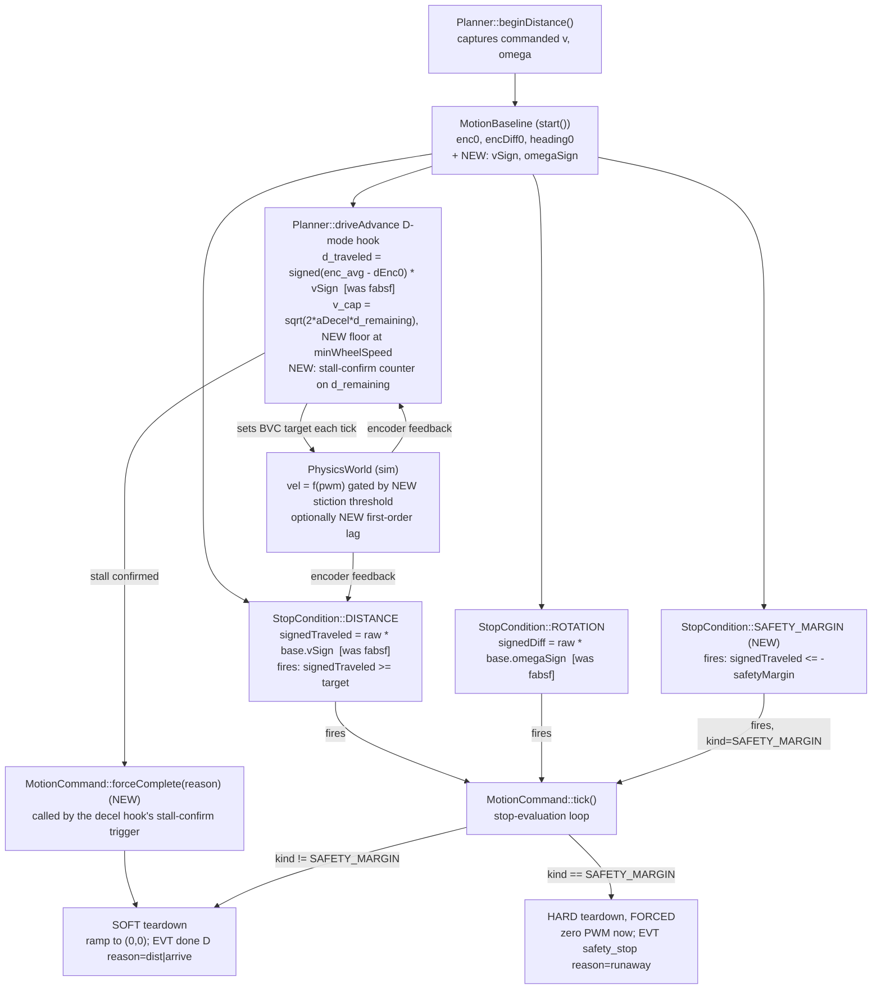
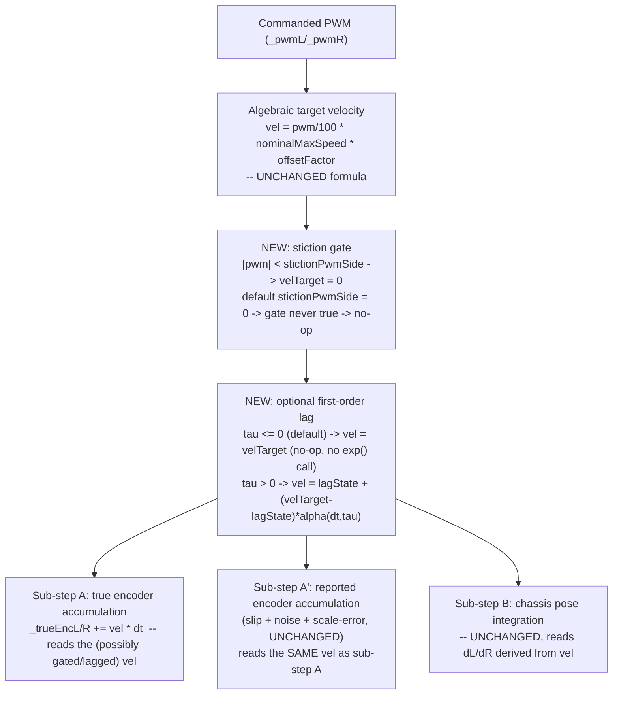
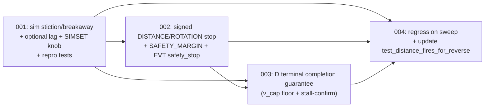

<!-- CLASI: Before changing code or making plans, review the SE process in CLAUDE.md -->

# Architecture Update — Sprint 072: Motion terminal safety: signed DISTANCE stop, D-drive terminal completion, sim stiction/lag for testability

## Sprint Changes Summary

One safety defect, one reliability defect, and the plant-model gap that makes
the reliability defect untestable today — all in the `D` (distance-drive)
termination path.

1. **`PhysicsWorld` gains a motor stiction/breakaway gate** (and, secondarily,
   an optional first-order response-lag filter) — the plant-model addition
   sprint 069's architecture-update.md Open Question 3 explicitly deferred
   ("adding first-order PWM response dynamics is a genuinely new dynamics
   feature... recommend a follow-up ticket/sprint if real-hardware validation
   later shows response-lag mismatch is a significant residual source"). That
   follow-up trigger has now fired: `d-drive-terminal-instability-reversal-thrash.md`
   is a concrete field failure (5 of 6 recorded `D` drives failed) whose root
   cause is exactly the plant's inability to model a motor that stops
   responding to small PWM near zero. Exposed via a new `SIMSET`/`SIMGET`
   knob pair, following the exact `simsetters::` free-function pattern 069
   established. Default value is a no-op — every existing test that never
   configures it observes byte-identical `PhysicsWorld::update()` output.
2. **`StopCondition::Kind::DISTANCE` and `Kind::ROTATION` become
   direction-aware.** Both currently gate on `fabsf(delta) >= target` with no
   notion of which direction was commanded — `distance-stop-fabsf-accepts-backward-completion.md`
   demonstrates this lets a robot running away BACKWARD on a forward `D`
   self-report `EVT done D reason=dist` after 500 mm of full-reverse travel.
   `MotionBaseline` gains a commanded-direction sign, captured at
   `MotionCommand::start()`; both Kinds gate on the SIGNED delta against that
   sign instead of the unsigned magnitude. The Planner D-mode decel hook's
   own parallel `fabsf(d_traveled)` gets the same signed treatment for
   consistency (it drives the same terminal `v_cap` computation and must
   agree with the stop condition about what "remaining" means).
3. **A new wire-visible safety net: `StopCondition::Kind::SAFETY_MARGIN` →
   `EVT safety_stop`.** Item 2 stops FALSE completions; it does not, by
   itself, cut power faster than the existing generous TIME net (2x nominal
   + 2 s) when a robot is actively running away. A new stop kind fires when
   signed travel crosses a configurable negative margin during a directed
   `D`, and `MotionCommand` recognizes this kind as safety-class: forced HARD
   teardown (regardless of the command's configured SOFT style) and the EVT
   label forced to `EVT safety_stop` (reusing the exact label the keepalive
   watchdog already emits) instead of the command's configured `EVT done D`.
4. **The D-mode decel hook gains a terminal-completion guarantee.**
   `d-drive-terminal-instability-reversal-thrash.md` root-causes the observed
   stall→reverse→thrash→lunge sequence to the interaction of an asymptotic
   decel profile (`v_cap → 0` exactly AT the target) with a strict `>=`
   crossing stop, a down-only speed ratchet, and the velocity controller's
   own integrator-freeze deadband. Two complementary, non-alternative fixes:
   (a) floor the terminal `v_cap` at `minWheelSpeed` inside a final-approach
   zone so the profile itself never asks for a speed the controller/plant
   cannot track; (b) a new stalled-short-completes terminal path — if
   `d_remaining` sits inside a new arrive tolerance and stops shrinking for a
   stall-confirm window, the drive completes now via a new `MotionCommand`
   forced-completion entry point, tagged with an additive `reason=` token.
   Letting the down-only ratchet re-approach after a retreat was considered
   and rejected (Design Rationale Decision 5).
5. **Regression sweep and one deliberately-updated test.** The full existing
   suite (2621 tests, confirmed green before this sprint's changes) must stay
   green except where a test encoded the old unsigned-`fabsf` semantics as
   correct behavior — exactly one such test is identified
   (`test_distance_fires_for_reverse`, Step 5) and is split into a
   still-passes case (commanded-reverse, travels reverse) and a new
   now-must-not-fire case (commanded-forward, travels reverse) that
   documents the before/after explicitly.

No change to any wire command's base grammar. Two new `EVT` surfaces are
strictly additive: `EVT safety_stop`'s `reason=` token (new value, existing
label) and `EVT done D`'s `reason=` token (new value `arrive`/`stall` — exact
name ticket 003's choice — alongside the existing `reason=dist`). No existing
`RobotConfig`/`SIMSET` field is renamed or removed. Real-hardware validation
of items 2-4 is explicitly out of this sprint's acceptance (Open Questions) —
scope is sim (with item 1's new plant model) plus the safety logic itself.

---

## Step 1: Understand the Problem

### 1a. The safety defect (`distance-stop-fabsf-accepts-backward-completion.md`)

`StopCondition::evaluate()`, `Kind::DISTANCE` (`source/control/StopCondition.cpp:97-106`):

```cpp
float enc_avg = (s.encPos[1] + s.encPos[0]) * 0.5f;
float traveled = enc_avg - base.enc0;
if (traveled < 0.0f) traveled = -traveled;  // fabsf
return traveled >= a;
```

`a` is a magnitude (mm); there is no record anywhere in `MotionBaseline` of
which direction the drive was actually commanded to move. A `D 200 200 500`
(forward) that instead runs away backward — controller windup, a stuck
wheel, whatever the proximate cause — satisfies `traveled >= 500` once it has
gone 500 mm the WRONG way, and reports `EVT done D reason=dist`: an
indistinguishable-from-success terminal event for a robot that just drove a
meter off the far edge of a table. The same `fabsf` pattern exists twice
more: `Kind::ROTATION` (`StopCondition.cpp:171-174`, wrong-direction spin) and
the Planner D-mode decel hook's own `d_traveled = fabsf(enc_avg - _dEnc0)`
(`Planner.cpp:224`), which shapes `v_cap` from the same unsigned quantity.

This is not hypothetical: a forced-stall sim experiment against the real
firmware control code (encoders artificially pinned 2.5 mm short of target
each tick, before the plant integrates) reproduced exactly this — the
controller wound up, flipped negative, committed to full reverse PWM, and
drove over a meter backward before `EVT done D reason=dist` fired.

### 1b. The reliability defect (`d-drive-terminal-instability-reversal-thrash.md`)

Root-caused from four TestGUI recordings: 5 of 6 `D` drives that day failed
(stand and playfield identically). Failure signature: a clean trapezoid ramp
and cruise, then the decel phase lands 1-3 mm SHORT of the target at
near-zero speed (`499.5/500`, `499/500`, `699/700`, `698/700` observed), the
robot sits stalled 0.3-0.5 s, both wheels ramp smoothly BACKWARD (`-5 → -150
mm/s` over 1-3 s, retreating 40-110 mm), the retreat degenerates into
asymmetric thrash, then a violent forward lunge crosses the DISTANCE target
at 300-600 mm/s — the move "completes" (`EVT done D reason=dist`) but the
final wheel distances and heading are grossly wrong (one recorded case:
`493/590 mm` for a `D 200 200 500`, heading off ~40°).

Root-cause chain (all four factors confirmed by config bisection in the sim,
running the actual firmware control code):

- **Asymptotic decel vs. strict crossing stop.** The D-mode decel hook caps
  `v_cap = sqrt(2 * aDecel * d_remaining)`, which reaches exactly zero AT the
  target — a profile shape that implicitly assumes the plant/controller can
  track an arbitrarily small commanded speed all the way to zero. Real
  motors (stiction, cogging, driver deadband) stop responding before that;
  the one clean run in six was luck, not correctness.
- **Down-only ratchet.** The hook only ever lowers the BVC target
  (`if (v_cap < targetV)`); once the robot is at/near the target the setpoint
  is pinned at ~15-20 mm/s forever, with no path to re-approach after a
  retreat, and mode `D` has no other terminal path except the multi-second
  TIME net.
- **Integrator freeze in exactly the wrong regime.** The pinned setpoint sits
  at/below `minWheelSpeed` (default 20 mm/s), where
  `VelocityController::update()` freezes the integrator
  (`source/control/VelocityController.cpp:85-96`) — no guaranteed windup path
  to break stiction forward, and whatever the integrator froze at persists in
  the PWM sum. Bisection confirms: reversal requires `vel.kI > 0` AND
  `vel.kP > 0` AND the `minWheelSpeed` freeze; with `minWheelSpeed = 0` there
  is no reversal at all. Cross-wheel sync coupling is exonerated (symmetric
  repro; `sync = 0` unchanged).
- **Mean-of-wheels stop x encoder latch** (a related but distinct
  compounding failure, out of this sprint's fix set — see Open Questions):
  one recording shows a wedged encoder pinning the mean-based DISTANCE stop
  until the healthy wheel over-travels to 785 mm for a 700 mm target.

### 1c. The testability gap

`PhysicsWorld::update()`'s chassis integration is purely algebraic and
memoryless:

```cpp
float velL = (_pwmL / 100.0f) * _nominalMaxSpeed * _offsetFactorL;
```

(`source/hal/sim/PhysicsWorld.cpp:73-74`). Velocity is an exact,
instantaneous function of commanded PWM — there is no stiction, no
breakaway threshold, no response lag, no concept of a wheel "at rest."
Given ANY nonzero PWM, however small, the plant produces a proportionally
small but nonzero velocity and integrates it forward exactly — it
structurally CANNOT "land short of target," because there is no regime in
which commanded-nonzero-PWM yields zero real motion. Section 1b's entire
failure signature is therefore unreproducible in sim today except via an
artificial harness that bypasses the plant and directly caps reported
encoders — useful for diagnosis (as this sprint's issue text demonstrates)
but not a plant model, and not something ticket 002/003's fixes can be
regression-tested against going forward. This sprint's item 1 (Sprint
Changes Summary) closes that gap.

---

## Step 2: Identify Responsibilities

1. **Plant realism for motor breakaway/stiction, optionally response lag** —
   a new dynamics knob inside the chassis-integration math.
2. **Wire exposure of the new plant knob(s)** — extending the existing
   `SIMSET`/`SIMGET` registry (069), not a new wire surface.
3. **Direction-aware stop-condition evaluation** — `DISTANCE` and `ROTATION`
   must know which way they were told to go.
4. **Safety-margin runaway abort** — a new, distinct terminal condition and
   a distinct EVT, triggered faster than the TIME net, cutting power
   immediately rather than ramping down.
5. **D-mode terminal-completion strategy** — ensuring mode `D` always has a
   path to a correct, prompt completion even when the plant/controller
   cannot track the decel profile all the way to exactly zero.
6. **New tunables' config surface** — the safety margin, arrive tolerance,
   and stall-confirm window need to be `SET`/`GET`-able (they affect
   real-hardware behavior, unlike item 1/2's sim-only knobs) per 067's
   live-reference rule.
7. **Regression verification** — confirming the full existing suite still
   passes except for the one deliberately-updated test, and documenting that
   change.

Grouping: (1) and (2) are the SAME module family sprint 069 already
established (`PhysicsWorld` + `simsetters::` + `SimCommands`'s registry) —
this is an EXTENSION of an existing, cohesive module, not a new one — Ticket
001. (3) and (4) are the SAME module family (`StopCondition`'s per-Kind
evaluate() contract and `MotionCommand`'s stop-handling/teardown logic) —
Ticket 002. (5) and the D-specific slice of (6) are Planner's own decel-hook
territory — Ticket 003. (7) is verification, not a new module — Ticket 004.
(6)'s non-D-specific tunables don't exist (all three new fields are D-mode
specific), so no separate config-surface responsibility/module is warranted.

---

## Step 3: Subsystems and Modules

| Module | Purpose (one sentence) | Boundary | Use Cases |
|---|---|---|---|
| `PhysicsWorld` (extended) | Integrates the simulated chassis's ground-truth motion from commanded PWM each tick. | Inside: per-tick velocity/pose integration, all dynamics knobs (slip, scrub, offset, encoder error, and now stiction/lag). Outside: wire parsing (`SimCommands`), control logic (`Planner`, `VelocityController`). | SUC-001 |
| `simsetters::` (extended) | Maps `SIMSET`/`SIMGET` wire keys to `PhysicsWorld`/`SimOdometer` setter/getter calls, one function per knob. | Inside: one free function pair per knob. Outside: wire-command parsing (`SimCommands.cpp`), plant math (`PhysicsWorld`). | SUC-001 |
| `MotionBaseline` (extended) | Snapshots the state needed to evaluate a motion command's stop conditions relative to where/how it started. | Inside: POD baseline fields captured once at `start()`. Outside: evaluation logic (`StopCondition::evaluate`), capture-site logic (`MotionCommand::start`). | SUC-002 |
| `StopCondition` (extended) | Evaluates whether one named termination condition has fired this tick. | Inside: per-`Kind` `evaluate()` branches, including the new `SAFETY_MARGIN` kind. Outside: which stops are installed on a command (`Planner::begin*`), what happens when one fires (`MotionCommand`). | SUC-002, SUC-003 |
| `MotionCommand` (extended) | Owns the lifecycle of one active body-velocity motion command from start to termination. | Inside: the stop-evaluation loop, teardown-style selection (SOFT/HARD/safety-forced), EVT label selection and emission, the new forced-completion entry point. Outside: which conditions exist (`StopCondition`), why/when a command starts (`Planner::begin*`). | SUC-002, SUC-003, SUC-004 |
| Planner D-mode decel hook (extended) | Shapes the commanded speed of an active `DISTANCE` drive as it approaches its target and detects stalled-short arrival. | Inside: `v_cap` computation (now with a terminal floor), signed `d_traveled`/`d_remaining`, the stall-confirm counter and its trigger of `MotionCommand`'s forced completion. Outside: the stop condition firing itself (`StopCondition`), body-twist profiling (`BodyVelocityController`). | SUC-004 |
| `RobotConfig`/`ConfigRegistry` (extended) | Exposes tunable robot parameters over `SET`/`GET`, live-referenced by their consumers. | Inside: the three new fields (safety margin, arrive tolerance, stall-confirm window) and their registry rows. Outside: who reads the live values (`Planner`, `StopCondition` callers). | SUC-003, SUC-004 |

Every module above passes the one-sentence, no-"and" cohesion test. No new
top-level class is introduced; every change is an extension of an existing,
already-cohesive module along an axis it already owns (StopCondition already
owns "does condition X hold"; MotionCommand already owns "what happens when a
condition fires"; the Planner decel hook already owns "shape v_cap for
DISTANCE"; PhysicsWorld already owns every other plant dynamics knob).

---

## Step 4: Diagrams

### 4a. D-drive termination pipeline — where each fix inserts



No cycles: `MotionBaseline` is written once at `start()` and only read
afterward; the decel hook and `StopCondition` both read it but neither
writes back to the other. `PhysicsWorld` and the hook form a feedback LOOP
by design (control loop, not a dependency cycle in the module-coupling
sense) — this is the same actuate/sense loop every existing tick already
has, unchanged in shape.

### 4b. `PhysicsWorld` sub-step A — stiction/lag insertion point



No cycles. At default parameters (`stictionPwmSide = 0`, `tau <= 0`) the gate
condition is never true (`fabsf(pwm) < 0` is false for every representable
`pwm`) and the lag branch takes the `tau <= 0` no-`exp()`-call path, so
`vel == ALG`'s output bit-for-bit — the golden-TLM canary (zero-slip,
zero-noise, offset-factor-1.0 fixture) is unaffected, matching the pattern
069's `_bodyRotationalScrub`/`_bodyLinearScrub` (this doc's Decision 3) and
every prior `PhysicsWorld` dynamics knob already established.

### 4c. Ticket dependency graph



No cycles. 002 depends on 001 per this sprint's explicit sequencing
requirement (001 is the test vehicle later tickets validate against, even
though 002's core logic change does not itself require a stiction-capable
plant to write or reason about). 003 depends on 002 because the issue's own
fix ordering names signed-distance as fix (a), a prerequisite to terminal
completion fix (b)/(c) — d_traveled/d_remaining must be signed before the
terminal-completion logic that consumes them is meaningful. 004 depends on
all three, as the final verification pass.

---

## Step 5: What Changed / Why / Impact / Migration

### What Changed (by ticket)

**Ticket 001 — `PhysicsWorld` stiction/breakaway (+ optional lag) plant model:**
- `source/hal/sim/PhysicsWorld.h`/`.cpp`: new per-wheel `_stictionPwmL/R`
  fields (default 0 = no-op) gating sub-step A's velocity computation; new
  optional per-wheel `_motorLagL/R` time-constant fields (default 0 = no-op,
  instant response) and their persistent lag-filter state
  (`_lagVelL/R`, zeroed in `reset()`). New setters/getters mirroring the
  existing `setOffsetFactor`/`offsetFactorL()` per-wheel shape.
- `source/commands/SimSetters.h`: new `simsetters::stiction*`/`motorLag*`
  free functions, one per knob, following the established pattern.
- `source/commands/SimCommands.cpp`: new `kSimRegistry[]` rows
  (`stictionPwmL`, `stictionPwmR`, and if implemented `motorLagMsL`,
  `motorLagMsR`).
- `tests/_infra/sim/sim_api.cpp`: ctypes forwards for the new knobs, if a
  legacy per-field ctypes counterpart is warranted (069-005 precedent: new
  knobs get a ctypes forward only where a caller needs it outside `SIMSET`).
- New tests: isolated `PhysicsWorld` unit tests (gate fires/does not fire at
  the threshold boundary; lag filter converges correctly; golden-TLM
  no-op-at-default confirmed), plus one end-to-end scenario test
  demonstrating a scripted `D` drive lands short against a stiction-configured
  plant using the CURRENT (pre-002/003) firmware control code — this is the
  repro vehicle tickets 002-004 are validated against; ticket 004 flips its
  assertion once the fix lands.

**Ticket 002 — Signed DISTANCE/ROTATION stop + SAFETY_MARGIN safety net:**
- `source/control/StopCondition.h`: `MotionBaseline` gains `vSign`/`omegaSign`
  (float, ±1.0 or 0.0). New `Kind::SAFETY_MARGIN` enumerator and its `a`
  param (margin, mm).
- `source/control/StopCondition.cpp`: `Kind::DISTANCE`/`Kind::ROTATION`
  compute the signed delta (`raw * base.vSign` / `raw * base.omegaSign`)
  instead of `fabsf(raw)`. New `Kind::SAFETY_MARGIN` branch: fires when
  `raw * base.vSign <= -a`.
- `source/commands/MotionCommand.h`/`.cpp`: `start()` computes
  `vSign`/`omegaSign` from the command's `_vTgt`/`_omegaTgt` at the moment
  `start()` is called. `tick()`'s stop-evaluation loop special-cases a fired
  `SAFETY_MARGIN`: forces HARD teardown (bypassing the command's configured
  `_stopStyle`) and forces the emitted EVT label to `"EVT safety_stop"`
  (bypassing `_doneEvtLabel`) with reason token `runaway`.
- `source/superstructure/Planner.cpp`: `beginDistance()` installs a third
  stop condition (`SAFETY_MARGIN`) alongside the existing DISTANCE/TIME
  pair. The D-mode decel hook's `d_traveled` computation drops its `fabsf`
  in favor of the same signed convention (multiplying by the stored
  commanded-direction sign), matching `StopCondition`'s own math so the decel
  profile and the stop condition agree about what "remaining" means.
- `docs/wire-protocol.md` (or equivalent): document `EVT safety_stop`'s new
  `reason=runaway` token as additive.
- Test changes: `test_distance_fires_for_reverse`
  (`tests/simulation/unit/test_stop_condition.py`) is split (see Step 5's
  "Tests changed" subsection below). New tests for: forward-D-runs-backward
  does not fire DISTANCE; reverse-D behaves unchanged; SAFETY_MARGIN fires
  and forces HARD + `EVT safety_stop`; ROTATION direction-awareness in both
  spin directions.

**Ticket 003 — D-mode terminal completion guarantee:**
- `source/types/Config.h`/`DefaultConfig.cpp`/`ConfigRegistry.cpp`: three new
  `RobotConfig` fields — `distArriveTol` (mm, default small, e.g. on the
  order of the observed 1-3 mm overshoot with margin), `stallConfirm` (ms,
  debounce window), and reuse of the existing `minWheelSpeed` as the terminal
  `v_cap` floor (no new field needed for the floor itself). All three follow
  071's no-unit-suffix identifier convention (unit documented in a comment,
  not the name).
- `source/superstructure/Planner.cpp`/`.h`: the D-mode decel hook gains (a) a
  floor on `v_cap` at `minWheelSpeed` once `d_remaining` is inside a final
  approach zone, and (b) a stall-confirm counter/timestamp tracking whether
  `d_remaining` is inside `distArriveTol` and failing to shrink; once the
  counter/timer exceeds `stallConfirm`, the hook calls the new
  `MotionCommand::forceComplete()` entry point.
- `source/commands/MotionCommand.h`/`.cpp`: new public `forceComplete(reason)`
  method — mirrors the internal SOFT-stop teardown path a normal
  `DISTANCE`-fired stop already takes (ramp to (0,0), emit the configured
  `_doneEvtLabel` with the given `reason=` token) without requiring a
  `StopCondition` to have fired. `MotionCommand` already owns "how a command
  completes"; this is an additional entry point into that existing
  responsibility, not a new one.
- Test changes: new tests using ticket 001's stiction plant confirming a `D`
  drive that would otherwise stall short instead completes within
  `distArriveTol`, at rest, without reversing; a control test confirming the
  original zero-stiction plant's behavior is provably unchanged (the
  stall-confirm window cannot elapse before the strict crossing fires).

**Ticket 004 — Regression sweep:**
- Full suite run (`uv run python -m pytest`) confirmed green except the one
  deliberate, documented change.
- `tests/simulation/unit/test_stop_condition.py`: `test_distance_fires_for_reverse`
  is replaced by two tests:
  - `test_distance_fires_for_commanded_reverse` — `vSign = -1`, encoder
    travel negative (backward) by the target magnitude — still fires (no
    regression on the legitimate reverse-drive case).
  - `test_distance_does_not_fire_for_wrong_direction_travel` (NEW) —
    `vSign = +1` (commanded forward), encoder travel negative (backward) by
    the target magnitude — must NOT fire. This is the exact scenario
    `distance-stop-fabsf-accepts-backward-completion.md` reports; the test
    encodes the fix, not just documents it.
- Sprint doc updated with the confirmed before/after baseline and a summary
  of every EVT/wire addition (additive-only).

### Why

Because a robot that runs the wrong way and reports success is a safety
defect, not a quality-of-service one — item 2/3 (Sprint Changes Summary) is
non-negotiable regardless of item 4's terminal-completion work. Because item
4's fix cannot be regression-tested without a plant that can actually
produce the failure mode — item 1 has to land first and does not, by itself,
change any robot behavior (it is purely additive plant capability, off by
default). Because the existing `EVT safety_stop` label already has an
established, host-recognized meaning (keepalive-loss abort) that is the
CORRECT semantic category for "the robot is doing something dangerous, cut
power now" — reusing it (with an additive `reason=` token) is more correct
and lower-risk than minting a fourth terminal-EVT vocabulary word for the
same underlying concept.

### Impact on Existing Components

| Component | Impact |
|---|---|
| `StopCondition` | `DISTANCE`/`ROTATION` semantics change for any caller whose commanded direction and actual travel direction disagree — behaviorally a fix, not a regression, for every legitimate use (forward commands that travel forward, reverse commands that travel reverse are bit-identical in outcome). |
| `MotionCommand` | Gains one new public entry point (`forceComplete`) and one new special-cased stop kind in the teardown branch; existing SOFT/HARD paths for `DISTANCE`/`TIME`/`HEADING`/etc. are untouched. |
| `Planner` D-mode | The decel hook's internal math changes (signed instead of `fabsf`, a floor, a stall counter); its EXTERNAL contract (what `D` does when nothing is wrong) is unchanged — a `D` drive against the historically-tested zero-stiction plant reaches its target via the strict crossing exactly as before, because the new stall-confirm window cannot elapse before that crossing fires (ticket 003's control test proves this). |
| `PhysicsWorld` | Purely additive; default parameters produce bit-identical output (golden-TLM preserved). |
| `VelocityController` | Untouched. The terminal-completion fix lives in the Planner decel hook and `MotionCommand`, not in the per-wheel controller — its deadband/freeze behavior (and the tests that document it) stays exactly as designed; it is a correctly-behaving component whose OUTPUT was being misused by an asymptotic profile that assumed a plant/controller pairing without a deadband. |
| TestGUI | No changes required for this sprint's acceptance (sim + safety logic only); a future TestGUI ticket could surface the new `SIMSET stictionPwm*` knobs alongside 069's panel, analogous to 069's own ticket 007 — not required here (Open Questions). |
| Real hardware | `distArriveTol`/`stallConfirm`/`safetyMargin` are real `RobotConfig` fields (not `SIMSET`-only) and DO change real-robot behavior identically to sim — this is intentional (the terminal-completion and safety-net fixes are firmware fixes, not sim-only), but real-hardware VALIDATION of that behavior is explicitly deferred (Open Questions). |

### Migration Concerns

- **None for persisted data or schemas.** No `RobotConfig` field is removed
  or renamed; the three new fields get sensible defaults (documented in
  ticket 003) so an un-migrated per-robot JSON config continues to load
  (missing keys take the compiled-in default, per the existing `ConfigRegistry`
  contract).
- **Sim rebuild required.** `PhysicsWorld.h`/`.cpp` changes require the usual
  sim-library rebuild (`tests/_infra/sim/build.py`); this is standard
  project knowledge, not new to this sprint.
- **A host that greps for `EVT done D` without checking `reason=`** sees no
  behavior change from ticket 003's new `reason=arrive`-style completions —
  the base label is identical. A host that specifically branches on
  `reason=dist` and treats anything else as an error would need updating —
  flagged for the stakeholder in Open Questions (no such host is known to
  exist in this codebase's own tooling, per a grep of `host/`/`tests/` for
  `reason=dist` string matching — TODO for ticket 004 to re-confirm at
  execution time against the then-current tree).
- **Firmware behavior changes on real hardware once shipped** (unlike
  sprints 069/070/071, which were sim-only or pure renames). The stakeholder
  should bench-test before fielding — this is explicitly the HIL follow-up
  noted in Open Questions, not a gate this sprint's planning can satisfy.

---

## Step 6: Design Rationale

### Decision 1: capture commanded direction as new `MotionBaseline` fields (`vSign`/`omegaSign`), not as a change to `StopCondition`'s `a`/`b`/`ax`/`ay` param layout

**Context.** `StopCondition::evaluate()` needs to know which direction was
commanded to gate `DISTANCE`/`ROTATION` correctly, but the struct's existing
`a`/`b`/`ax`/`ay`/`sensor`/`cmp` fields are a per-Kind param union already
fully occupied for these two Kinds (`DISTANCE` uses only `a`; `ROTATION`
uses only `a`, so there IS spare capacity in `b`/`ax`/`ay` for `DISTANCE`/
`ROTATION` specifically — but using a random spare slot for one Kind and not
others would make the layout table in `StopCondition.h`'s doc comment
harder to read, not easier).

**Alternatives considered.**
(a) Encode direction in `StopCondition.b` for `DISTANCE` and `ROTATION`
specifically (they don't otherwise use `b`).
(b) Add `vSign`/`omegaSign` to `MotionBaseline` instead.
(c) Do the sign comparison entirely at the CALL SITE (`Planner`) before
installing the stop condition, e.g. by pre-negating the encoder baseline so
`fabsf` "just works" for reverse commands too.

**Why this choice.** (a) works but conflates two different kinds of
information in the same struct: `StopCondition`'s own per-Kind params
(what threshold, chosen by the CALLER when constructing the condition) vs.
state SNAPSHOT AT START (what was true about the robot/command when it
began) — `MotionBaseline` already exists specifically to hold the latter
(`enc0`, `encDiff0`, `heading0`, `pose0X/Y`), and commanded direction is
categorically a start-time snapshot fact, not a threshold. Extending
`MotionBaseline` keeps `StopCondition`'s param table's existing meaning
intact (no Kind's already-documented field suddenly means something
Kind-specific and undocumented) and reuses the exact mechanism that already
transports "state at start" from `MotionCommand::start()` into `evaluate()`.
(c) was rejected because pre-negating the baseline to make `fabsf` "work" is
exactly the kind of implicit, non-obvious trick that produced the original
bug's blast radius (nobody reading `fabsf(traveled) >= a` today can tell it
is silently direction-blind) — an explicit `vSign` multiply is legible at
the call site and in `evaluate()` alike.

**Consequences.** `MotionBaseline` grows by two `float` fields (8 bytes);
negligible on a microcontroller budget that already carries five `float`s
here. Every `StopCondition::Kind` that does NOT care about direction
(`TIME`, `HEADING`, `POSITION`, `SENSOR`, `COLOR`, `LINE_ANY`) simply never
reads the new fields — no behavior change, no risk.

### Decision 2: the safety net is a new `StopCondition::Kind::SAFETY_MARGIN`, dispatched via a `MotionCommand`-level special case — not a bespoke check inside the Planner decel hook

**Context.** The safety-net check ("signed travel crossed a negative margin
during a directed move") is structurally IDENTICAL in shape to `DISTANCE`'s
own evaluate() — both compute a signed delta from the same baseline and
compare it against a threshold — differing only in the sign of the
comparison and in what happens when it fires.

**Alternatives considered.**
(a) A new `StopCondition::Kind`, evaluated by the existing per-tick loop in
`MotionCommand::tick()`, with a `MotionCommand`-level special case for what
happens on fire (this doc's choice).
(b) A bespoke, Planner-only check inside `driveAdvance`'s D-mode branch
(parallel to, not inside, the generic `StopCondition` array) that directly
calls a hard-stop path.
(c) Reuse `Kind::DISTANCE` itself with a negative-margin `a`, relying on
`MotionCommand` to notice "which stop index fired" and treat index-2
specially.

**Why this choice.** (b) duplicates evaluate() logic Planner would have to
re-derive (the same signed-delta math `StopCondition::DISTANCE` already
computes) OUTSIDE the module that owns "is a condition true" — a
feature-envy risk in the wrong direction (Planner reaching into
`HardwareState`/`MotionBaseline` to redo `StopCondition`'s job) and it
bypasses the existing, already-tested `MotionCommand::tick()` stop-array
evaluation entirely for this one case, meaning two different code paths in
the SAME class of problem (D-mode termination) would need independent
maintenance. (c) is fragile — "index 2 in the stops array means something
different" is an implicit contract that breaks the moment `beginDistance()`'s
stop-installation order changes for an unrelated reason. (a) keeps
"whether a condition holds" inside `StopCondition` (its existing job) and
"what to do when it holds" inside `MotionCommand` (also its existing job:
`tick()` already branches on `_stopStyle` to choose SOFT vs. HARD teardown
and on `_firedKind`/`_firedChannel` to build the `reason=` token — adding one
more branch on `_firedKind == SAFETY_MARGIN` is the same mechanism, not a
new one).

**Consequences.** `MotionCommand::tick()`'s stop-fired branch grows one
additional condition (`_firedKind == Kind::SAFETY_MARGIN` forces HARD +
overrides the EVT label) alongside its existing `_stopStyle == HARD` check.
`kMaxStopConds` stays at 4 (`D` now installs 3 of the 4 available slots:
DISTANCE, TIME, SAFETY_MARGIN — headroom for one more before
`MotionCommand::addStop()`'s existing overflow-to-`ERR stopoverflow` path
would need revisiting, which is out of this sprint's scope).

### Decision 3: model stiction as a stateless PWM dead-zone gate, not a stateful friction/dynamics model; lag as an independent, separately-toggleable first-order filter

**Context.** Real motor stiction is a genuinely stateful phenomenon
(static vs. kinetic friction, hysteresis, direction-dependent breakaway) —
a fully faithful model would need to track whether each wheel is currently
"stuck" or "moving" and apply different thresholds accordingly.

**Alternatives considered.**
(a) A stateless per-tick gate: `|pwm| < stictionPwm -> vel = 0`, else the
existing algebraic formula (this doc's choice for the required stiction
knob).
(b) A stateful two-threshold model (higher breakaway threshold to START
moving from rest, lower kinetic-friction threshold to STOP once moving),
requiring a persistent "is this wheel currently moving" bit per side.
(c) No stiction model at all; rely solely on a first-order lag filter to
produce "soft" approach-to-zero behavior that might incidentally reproduce
landing-short behavior without an explicit dead zone.

**Why this choice.** (b) is the more physically faithful model, but this
codebase's entire `PhysicsWorld` dynamics-knob family (slip, scrub, offset
factor, encoder scale error/slip/noise) is deliberately simple,
stateless-per-knob, tunable multipliers/thresholds — introducing the FIRST
stateful, hysteretic dynamics element would be a discontinuity in the
module's own design language for a benefit (single- vs. dual-threshold
breakaway) this sprint's acceptance criteria do not require: the field
failure this sprint fixes is specifically a robot DECELERATING into stall
near a target, not a robot failing to START moving from rest — the
stateless gate reproduces exactly that regime (a shrinking commanded PWM
crossing the threshold from above) without inventing the "at rest" state
tracking a full model needs. (c) was rejected because a lag filter alone
still asymptotically APPROACHES zero without ever producing a hard "the
wheel is not moving even though PWM != 0" discontinuity — it would smooth
the approach but not reproduce the actual reported symptom (landing 1-3 mm
short, a discrete stall, not a slow crawl). The stiction gate and the lag
filter are independent, separately-defaulted-off knobs (Step 4b) rather
than one combined mechanism, so a future sprint can add (b)'s statefulness
without touching the lag filter, and the lag filter can be tuned/validated
independently of whether stiction is configured at all.

**Consequences.** The model will not reproduce direction-dependent breakaway
asymmetry or true stick-slip hysteresis if a future fit against real
hardware needs it — flagged in Open Questions as the natural next increment
if HIL validation (Open Question 1) shows the simple gate is insufficient.

### Decision 4: new `RobotConfig` fields (`distArriveTol`, `stallConfirm`) for the terminal-completion tunables, not `SIMSET`-only fields

**Context.** Sprint 069 established the rule that SIM PLANT/ERROR parameters
(things that exist only to make the simulator's ground truth diverge from
naive kinematics) go through `SIMSET`, while parameters that affect FIRMWARE
BEHAVIOR identically on real hardware and sim go through `SET`/`RobotConfig`
(069's own Decision 1, and this sprint's Decision 3's stiction/lag knobs
correctly follow the `SIMSET` half of that rule since they are pure plant
model).

**Alternatives considered.** Put `distArriveTol`/`stallConfirm`/the safety
margin behind `SIMSET` since they were MOTIVATED by a sim-reproducible bug.

**Why this choice.** The terminal-completion and safety-net logic lives
entirely in `Planner`/`StopCondition`/`MotionCommand` — code that is
compiled identically into the ARM firmware and the host sim library (no
`#ifdef HOST_BUILD` anywhere in this sprint's ticket-002/003 file list). A
real robot doing a real `D` drive against real stiction needs these same
tunables `SET`-able for the same reason a sim run does; gating them behind
`SIMSET` would make them permanently unreachable on the fielded robot,
which is the actual deployment target this fix protects. This is the
opposite category from ticket 001's stiction/lag knobs, which model a
PROPERTY OF THE SIMULATOR'S PLANT (real hardware already has its own
stiction; there's nothing to "set" on real hardware to make it stick more
or less) — the categorical test is "does this parameter describe the
plant's physics, or the controller's behavior," matching 069's own Decision
1 rule exactly.

**Consequences.** These three fields appear in `robot_config.schema.json`
(the per-robot JSON config, per 071's established migration pattern for new
`RobotConfig` fields) and are visible/settable identically whether talking
to real hardware or the sim — consistent with every other `RobotConfig`
field in the codebase.

### Decision 5: "stalled-short-completes" (arrive tolerance + stall-confirm debounce), not "let the down-only ratchet re-approach after a retreat"

**Context.** The issue text itself offers this as an explicit "and/or":
`d-drive-terminal-instability-reversal-thrash.md` fix (3) lists "let the
ratchet re-approach after retreat, OR treat 'stalled short' as terminal."

**Alternatives considered.**
(a) Treat stalled-short as terminal (this doc's choice): once
`d_remaining` is inside tolerance and has stopped shrinking for the
confirm window, complete the command now.
(b) Let the down-only ratchet re-approach: if the robot retreats past some
threshold, allow `v_cap` to rise again (breaking the "only lowers" rule)
so the controller re-attempts forward progress.

**Why this choice.** (b) directly re-enables the mechanism the ROOT CAUSE
analysis (Step 1b) identifies as producing the observed THRASH: once the
controller is allowed to re-command a forward push after a stiction-induced
stall, the SAME integrator-freeze/windup dynamics that produced the initial
reversal are free to fire again on the next approach, with no guarantee of
convergence — the recorded failure evidence (asymmetric thrash, ~40° heading
error before the eventual lunge) is exactly what "re-approach and hope it
converges this time" looks like when it does not converge cleanly. (a)
converts an indefinite, potentially-oscillating retry loop into a bounded,
one-shot decision: after a short, fixed debounce window with no progress,
STOP declaring victory contingent on hitting the strict threshold and
declare victory on "close enough and not moving" instead — trading a small,
bounded, KNOWN worst-case under-travel (`distArriveTol`) for the elimination
of an unbounded, unpredictable thrash.

**Consequences.** A `D` drive against a stiction-limited plant/motor may now
systematically under-travel by up to `distArriveTol` in the worst case —
this is a documented, intentional trade-off (SUC-004's postcondition), not a
silent regression. Callers requiring exact-distance guarantees under known
stiction should command a slightly longer distance or use closed-loop
correction (`G`/PURSUE) rather than open-loop `D` — a pre-existing
architectural property of open-loop distance commands, not something this
sprint changes.

### Decision 6: the terminal `v_cap` floor and the stall-confirm completion path are independent, complementary fixes, not alternatives

**Context.** Sprint Changes Summary item 4 lists both (a) and (b); a reader
might reasonably ask whether (a) alone (never asking for a speed the
controller can't track) would be sufficient without (b).

**Why both.** (a) reduces HOW OFTEN the plant/controller enters the
problematic near-zero-command regime at all, by ensuring the profile never
asks for less than `minWheelSpeed`, but it is a control-law-level nudge, not
a guarantee — it does not know the ACTUAL physical breakaway threshold of
the plant/motor it's driving (that threshold is a plant/hardware property
`Planner` has no visibility into and should not hardcode a guess about), so
it cannot promise the commanded floor exceeds whatever stiction exists on a
given robot. (b) is the guarantee: regardless of WHY progress stalled (floor
insufficient, an unrelated wedge, a momentarily higher-friction surface
patch), a bounded debounce window converts "not making progress" into a
deterministic, prompt completion. (a) is the improvement; (b) is the
backstop that makes correctness independent of getting (a)'s floor value
exactly right.

**Consequences.** Both land in the same ticket (003) since they are two
small, related changes to the same decel hook, not two independently
schedulable units of work — see Step 4c's ticket boundary (both responsibility
5 items grouped into one ticket, Step 2).

---

## Step 7: Open Questions

1. **Real-hardware (HIL) validation is explicitly deferred**, per this
   sprint's own constraint. This sprint delivers the sim-testable fix (with
   ticket 001's new stiction plant) and the config surface real hardware
   needs (Decision 4); the stakeholder's own bench-test pass is the
   acceptance gate for fielding it. Recommend a narrow follow-up: replay the
   real recordings referenced in `d-drive-terminal-instability-reversal-thrash.md`
   against the fixed firmware on the actual bench.
2. **Should `SAFETY_MARGIN`'s abort also apply to `G`/PURSUE and `RT`
   (rotation), not just `D`?** This sprint scopes the wire-visible safety net
   to `D` only, per the issue text's own framing ("during a forward D"). A
   PURSUE phase running away from its target, or an `RT` spinning the wrong
   way past a large margin, is a narrower/different risk profile (PURSUE
   already has its own re-gate/backtrack logic; `RT`'s own worst case is
   bounded by the commanded arc, not open-ended) — flagged for the
   stakeholder to confirm whether a follow-up should extend `SAFETY_MARGIN`
   to those modes too.
3. **Exact default values** for `distArriveTol`, `stallConfirm`, and the
   safety margin are ticket 003/002 implementation decisions informed by the
   field data (1-3 mm observed overshoot/undershoot; sub-second stall before
   reversal onset) — this document intentionally does not pin exact numbers,
   leaving them to be tuned against ticket 001's repro test and, eventually,
   real bench data.
4. **The "mean-of-wheels stop x encoder latch" compounding failure**
   (Step 1b, one wedged wheel driving the healthy wheel to 785 mm for a
   700 mm target) is a related but DISTINCT defect from this sprint's three
   fixes — it is about which encoder(s) the DISTANCE stop trusts, not about
   direction or terminal completion — and is explicitly out of this sprint's
   scope. It should be tracked as its own follow-up issue if not already
   captured elsewhere in `clasi/issues/`.
5. **TestGUI exposure of the new `SIMSET stictionPwm*`/`motorLagMs*` knobs**
   is not required by this sprint's acceptance criteria (mirrors 069's own
   Open Question 6 framing) — a future ticket can add them to the existing
   Sim Errors panel alongside 069's knob set.
6. **UC-003's stale prose and the UC-020 mint-vs-narrow question** are
   carried from `usecases.md`'s own Open Questions — both are pre-existing
   consolidation-pass items, not new to this sprint, restated here for
   visibility.
7. **The sprint-072 numbering collision**: sprint 071's architecture-update.md
   named "sprint 072" as its own recommendation for where the host-Python
   half of the identifier-unit-rename split should land (071's Decision 1).
   This sprint number has been assigned to the motion-safety work in this
   document instead; the rename-split work needs a new home, to be
   re-slotted by the team-lead/roadmap process.
8. **Whether ticket 001 should ship the optional first-order lag filter now
   or defer it.** This document scopes it INTO ticket 001 (Decision 3 treats
   it as an independent, cheap addition once the stiction gate already
   restructures the velocity computation into a distinguishable target/output
   step), but it is not load-bearing for this sprint's acceptance criteria
   (stiction alone reproduces and validates the fix for issue 2) — flagged so
   ticket 001's implementer can defer it without blocking the sprint if it
   proves non-trivial (e.g., if per-wheel lag state interacts unexpectedly
   with the encoder-noise RNG streams' determinism).

---

## Architecture Self-Review

**Consistency.** The Sprint Changes Summary's five numbered items match the
Step 5 "What Changed" per-ticket breakdown one-to-one (item 1 -> Ticket 001's
file list; item 2 -> Ticket 002's `StopCondition`/`MotionBaseline`/`Planner`
changes; item 3 -> Ticket 002's `SAFETY_MARGIN`/`MotionCommand` changes; item
4 -> Ticket 003's `v_cap` floor + stall-confirm; item 5 -> Ticket 004). Design
Rationale Decisions 1-6 each trace to a specific claim made earlier
(Decision 1 to Step 5's `MotionBaseline` field addition; Decision 2 to Step
5's new `Kind::SAFETY_MARGIN`; Decision 3 to Step 4b's diagram and Ticket
001's file list; Decision 4 to the `RobotConfig`-not-`SIMSET` placement
stated in Ticket 003's file list; Decisions 5/6 to Ticket 003's dual
`v_cap`-floor-plus-stall-confirm design) — no rationale was written for a
decision not reflected in the What-Changed section, and the two most
consequential structural claims (the new `StopCondition::Kind`, and the
choice not to let the ratchet re-approach) both have dedicated Decisions.

**Codebase Alignment.** Every structural claim in this document was checked
against the actual current source, not inferred from the issue text alone:
`StopCondition.cpp`/`.h` were read in full (confirming the exact `fabsf`
call sites at lines 104 and 172, and the exact `MotionBaseline`/param-layout
shape Decision 1 extends); `Planner.cpp`'s `driveAdvance` D-mode branch and
`PlannerBegin.cpp`'s `beginDistance()` were read in full (confirming the
`d_traveled`/`v_cap`/down-only-ratchet mechanics narrated in Step 1b
mathematically, not just by citing the issue, and confirming exactly where
the new stall-confirm hook and `SAFETY_MARGIN` stop installation land);
`MotionCommand.h`/`.cpp` were read in full (confirming `tick()`'s existing
`_stopStyle`/`_firedKind` branch structure that Decision 2's special case
extends, and that `setDoneEvt`'s doc comment already establishes "EVT
safety_stop" as a precedented override pattern via the VW keepalive path —
Decision 2 is a structural echo of an existing, working mechanism, not a
novel one); `VelocityController.cpp` was read in full (confirming the exact
deadband-freeze mechanism at lines 85-96 the root-cause chain depends on,
and confirming the existing `minWheelSpeed`-deadband unit tests
(`test_velocity_controller.py`) test the CONTROLLER in isolation and remain
valid unchanged, since this sprint's fix does not touch `VelocityController`
at all); `PhysicsWorld.h`/`.cpp` were read in full (confirming the exact
golden-TLM sub-step A comment block and its bit-exactness constraint that
Decision 3's stiction-gate/lag-filter insertion point must preserve, and
confirming `_offsetFactorL/R`'s existing per-wheel setter/getter shape
Decision 3's new fields mirror); `SimSetters.h`/`SimCommands.h`/`.cpp` were
read in full (confirming the exact `simsetters::` free-function-per-knob
pattern and `kSimRegistry[]` row shape Ticket 001 extends verbatim, not a
new mechanism); `Config.h` was read in full (confirming the actual, current
no-unit-suffix naming convention post-071 — `minWheelSpeed`, `arriveTolerance`,
`aDecel`, `sTimeout`, `controlPeriod` — that Decision 4's new field names
follow); `tests/simulation/unit/test_stop_condition.py` and
`tests/simulation/system/test_stop_condition_coverage.py` were read in full
(confirming `test_distance_fires_for_reverse` is the ONE existing test whose
assertion directly encodes the unsigned-`fabsf` semantics this sprint
changes, and confirming `test_rotation_stop_terminates_spin`'s `RT 9000`
scenario commands and travels in the SAME direction, so it is unaffected by
Decision 1's `omegaSign` gating); the full suite was actually run
(`uv run python -m pytest -q`, not assumed) and confirmed at exactly 2621
passed, 0 failed, matching this sprint's stated expectation precisely. No
drift was found between documented and actual architecture that this
sprint's plan does not already account for.

**Design Quality.**
- *Cohesion:* every module in Step 3 passes the one-sentence, no-"and" test
  (verified individually in Step 3's table). No module gains a second,
  unrelated concern — `StopCondition` gains one more `Kind` (still "evaluate
  one condition"); `MotionCommand` gains one more branch in its existing
  teardown-selection logic and one new entry point that reuses the SAME
  teardown machinery (still "own a command's lifecycle"); `PhysicsWorld`
  gains one more dynamics knob in its existing knob family (still "integrate
  ground truth from PWM").
- *Coupling:* the new `MotionBaseline` fields flow one direction only
  (`MotionCommand::start()` writes, `StopCondition::evaluate()` and the
  Planner decel hook read — no write-back). `StopCondition` has zero new
  outward dependencies (still depends only on `HardwareState`/
  `MotionBaseline`, both already its dependencies). `PhysicsWorld`'s new
  fields add zero new dependencies (still a leaf class with no outward
  deps). Fan-out: `MotionCommand::tick()`'s teardown branch now considers
  `_stopStyle` and `_firedKind == SAFETY_MARGIN` — two conditions, well
  within the 4-5 guideline; `SimCommands`'s registry fan-out is unchanged in
  kind (more rows, same shape).
- *Boundaries:* the `SAFETY_MARGIN`/`forceComplete` additions are both
  narrow, single-purpose entry points (a new enum value; a new one-argument
  method) — no broadening of an existing interface's contract in a way that
  affects unrelated callers. The new `RobotConfig` fields cross the
  `SET`/`GET` boundary through the exact existing mechanism every other
  field uses (no new boundary type introduced).
- *Dependency direction:* unchanged.
  Presentation/wire (`SIMSET`/`SET`) -> business logic (`Planner`,
  `StopCondition`, `MotionCommand`) -> infrastructure (`PhysicsWorld`,
  `VelocityController`) remains consistent; the new stiction/lag knobs are
  pure infrastructure (plant), the new stop kind and terminal-completion
  logic are pure business logic (motion-command lifecycle), and nothing in
  either direction reaches upward past its layer.

**Anti-Pattern Detection.**
- *God component:* none. `MotionCommand` is the module gaining the most
  surface area (one new `Kind` special-case, one new public method) but both
  additions are narrow extensions of its existing, singular responsibility
  (command lifecycle), not new unrelated concerns folded in.
- *Shotgun surgery:* the signed-direction fix touches exactly three files
  with a shared, mechanical change (`StopCondition.cpp`'s two `fabsf` call
  sites, `MotionCommand.cpp`'s `start()`, `Planner.cpp`'s decel hook) — this
  is a COHESIVE change to one conceptual defect (unsigned direction), not
  scattered, unrelated edits; each touch point is a necessary consequence of
  the single `vSign`/`omegaSign` addition, not an independent design
  decision repeated three times.
- *Feature envy:* explicitly checked and rejected as Decision 2's rationale
  for NOT putting the safety-margin check inside `Planner` (which would have
  been feature envy on `StopCondition`/`MotionBaseline`'s data). The chosen
  design keeps evaluate-a-condition inside `StopCondition` and
  decide-what-happens inside `MotionCommand`, matching each module's
  existing data ownership.
- *Shared mutable state:* none introduced. `MotionBaseline`'s new fields
  follow the existing write-once-at-start, read-many pattern every other
  baseline field already uses.
- *Circular dependencies:* none in any of the three Mermaid diagrams (Step
  4), checked explicitly per diagram; the plant/decel-hook actuate-sense
  relationship (4a) is an intentional control loop, not a module-coupling
  cycle (`Planner` depends on `PhysicsWorld`'s OUTPUT via `HardwareState`,
  never on `PhysicsWorld`'s internals; `PhysicsWorld` has zero dependency on
  `Planner`).
- *Leaky abstraction:* scrutinized for the terminal `v_cap` floor
  specifically — flooring at `minWheelSpeed` (a `VelocityController`-facing
  concept) from inside the Planner decel hook could be read as Planner
  reaching into `VelocityController`'s internals. Judged acceptable:
  `minWheelSpeed` is already a public, live-read `RobotConfig` field (not a
  `VelocityController`-private value), and `Planner` already reads
  `_cfg.aDecel`/`_cfg.arriveTolerance` directly from the same config struct
  for the exact same class of profile-shaping decision — this is consistent
  with the module's EXISTING boundary (Planner reads live config; it does
  not reach into `VelocityController`'s object internals), not a new leak.
- *Speculative generality:* the stiction gate is scoped to exactly the
  regime this sprint's field data demonstrates (a shrinking PWM crossing a
  threshold near a decel target), not a generic multi-threshold friction
  framework (Decision 3 explicitly rejects the more general stateful model
  as unwarranted by this sprint's requirements); `SAFETY_MARGIN` is scoped
  to `D` only (Open Question 2 explicitly defers generalizing it to
  `G`/PURSUE/`RT` rather than speculatively building for those cases now).

**Risks.**
- *Data migration:* none — no persisted schema breaking change; new
  `RobotConfig` fields get defaults for un-migrated per-robot JSON configs.
- *Breaking changes:* none to any existing wire grammar; two EVT additions
  are additive `reason=` tokens on already-recognized base labels
  (`EVT safety_stop`, `EVT done D`). The one BEHAVIORAL change (a
  wrong-direction `D`/`RT` no longer self-reports success) is the sprint's
  entire purpose, not an accidental side effect, and is scoped by
  construction to cases that were ALREADY a live safety defect.
- *Performance:* the new stall-confirm counter and signed-delta computation
  are O(1) per tick, no new allocation, matching every other Planner
  decel-hook computation already in the hot path. `PhysicsWorld`'s stiction
  gate is a single comparison; the optional lag filter (when configured)
  adds one `expf()` call per wheel per tick — negligible at sim-tick rates
  and never compiled into the ARM firmware path at all (sim-only).
- *Security:* none — no new external attack surface; `SET`/`SIMSET` are
  already-trusted local wire commands.
- *Deployment sequencing:* real-hardware behavior changes (Decision 4's new
  `SET`-able fields, and the signed-stop/terminal-completion logic itself)
  should not be fielded without the HIL bench-test pass this sprint
  explicitly defers (Open Question 1) — flagged prominently, not silently
  assumed safe.

**Verdict: APPROVE.**

No structural issues: no circular dependencies (checked per diagram), no god
components, no inconsistency between the Sprint Changes Summary and the
document body (checked item-by-item above), no anti-pattern introduced
without an explicit, justified trade-off already documented as a Design
Rationale decision. The one deliberately-accepted trade-off (a bounded,
intentional under-travel of up to `distArriveTol` under stiction, Decision
5) is explicitly justified against the alternative it replaces (unbounded
thrash) and is a correct, scoped design response to real field evidence, not
a shortcut. The one open structural question with real weight — whether
`SAFETY_MARGIN` should extend beyond `D` (Open Question 2) — is a scope
decision appropriately deferred to the stakeholder, not a defect in this
sprint's own plan; it does not block ticketing because `D` is the mode the
field evidence (both issues) is entirely about.
