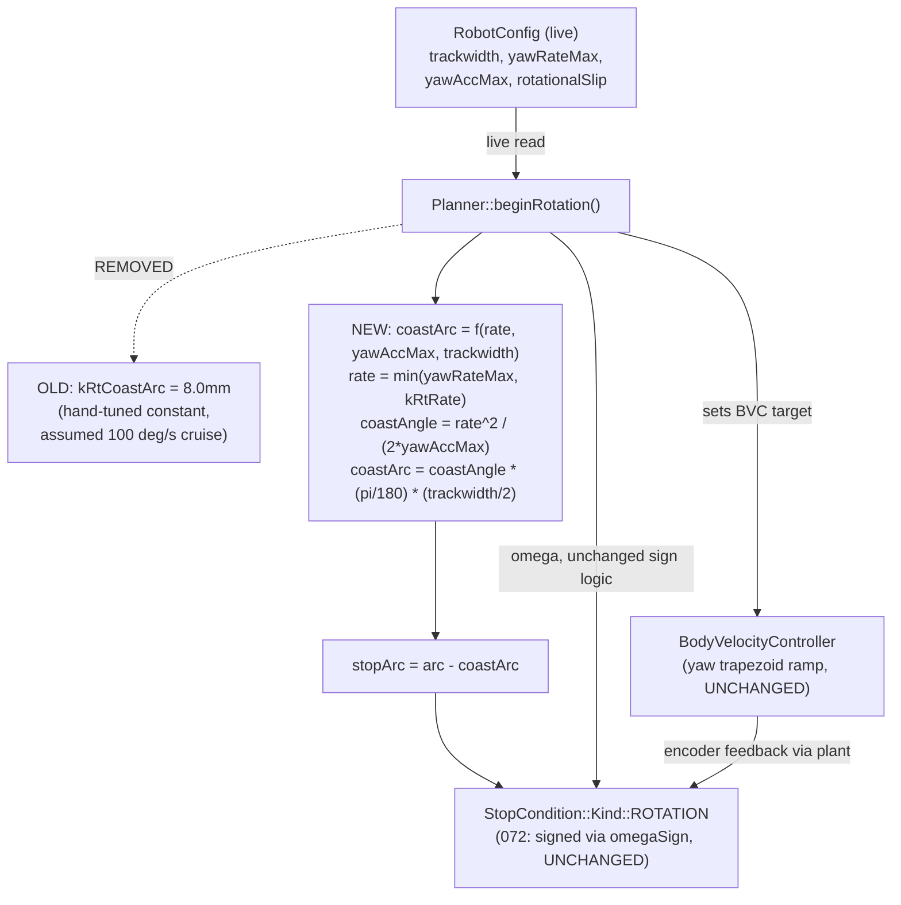
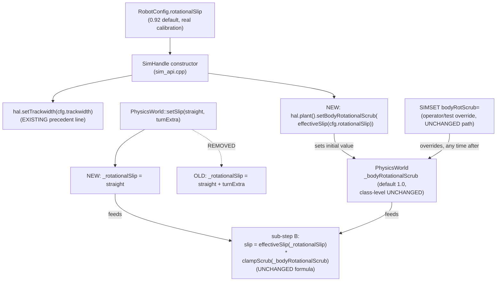
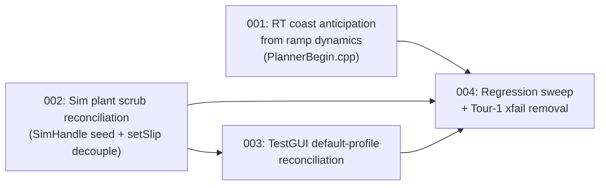

<!-- CLASI: Before changing code or making plans, review the SE process in CLAUDE.md -->

# Architecture Update — Sprint 073: Sim turn accuracy: coast anticipation from ramp dynamics and slip bookkeeping reconciliation

## Sprint Changes Summary

`clasi/issues/sim-turn-undershoot.md` measured that SIM `RT` (rotate-in-place)
misses the commanded angle by a composed error fitting
`body ≈ commanded / (rotationalSlip × (1 + slip_turn_extra)) − 3.3°` — three
independent defects, fixed independently here:

1. **`Planner::beginRotation()`'s coast-anticipation constant
   (`kRtCoastArc = 8.0f` mm, `PlannerBegin.cpp`) is replaced by a value
   computed from the ACTUAL SOFT-ramp-down dynamics** — the BVC yaw channel's
   trapezoid decel under live `cfg.yawAccMax`, at the actual commanded spin
   rate (`min(cfg.yawRateMax, kRtRate)` — confirmed 70°/s today, not the
   100°/s the constant's own comment assumes, a second, compounding
   staleness). This is a pure, self-contained recompute inside one function;
   it touches `RobotConfig`-shared, ARM-and-sim-compiled code, so it changes
   real-robot `RT` behavior too (flagged for HIL validation, Open Questions).
2. **`SimHandle`'s constructor (`tests/_infra/sim/sim_api.cpp`) seeds
   `PhysicsWorld`'s body-rotational scrub from the loaded `RobotConfig.
   rotationalSlip`**, mirroring the existing, adjacent
   `hal.setTrackwidth(cfg.trackwidth)` seed line exactly. This makes the
   plant genuinely scrub by the factor the firmware's arc-inflation already
   assumes it does — closing the "clean sim over-rotates +8.7%" gap — without
   touching any ARM-firmware-linked file, `RobotConfig`'s wire shape, or
   `Planner`'s inflation math (all three untouched; `PhysicsWorld`/
   `SimHandle` are HOST_BUILD/sim-only).
3. **`PhysicsWorld::setSlip(straight, turnExtra)`'s derivation of
   `_rotationalSlip` (the legacy body-truth channel) drops `turnExtra`**,
   deriving `_rotationalSlip = straight` instead of `straight + turnExtra`.
   Every existing caller that wants a genuine body-truth effect via this
   channel already passes `turnExtra=0.0` (arithmetically unaffected); the
   TestGUI's `slip_turn_extra` control (the only caller of a nonzero
   `turnExtra`) can no longer perturb body truth even in principle, closing
   the "encoder-report-error knob silently touches a dead body-slip channel"
   defect without retiring the channel or rewriting the tests that exercise
   it as designed.
4. **TestGUI's `sim_prefs.DEFAULT_PROFILE` is reconciled**: `slip_turn_extra`
   changes from `0.26` to `0.0`, and `body_rot_scrub`'s default is resolved
   dynamically from the active robot's `rotational_slip` (the same lookup
   `__main__.py`'s existing "From Calibration" button already performs,
   factored into one shared helper) instead of a hardcoded neutral `1.0` —
   making "From Calibration"'s effect the factory default rather than a
   manual, undiscoverable opt-in.
5. **Regression coverage**: a new `RT` angle-sweep test (45°/90°/180°/300°,
   clean/default `Sim()`, asserting ≤~1° miss) is the acceptance vehicle for
   items 1+2 combined; `tests/testgui/test_tour1_geometry.py`'s existing
   `xfail(strict=True)` — which already root-causes both defects in its own
   docstring, written in a prior sprint — is expected to start passing and
   its marker removed; three existing tests that hardcode the OLD coast
   constant or the OLD "default scrub is neutral" assumption are deliberately
   updated, before/after documented (Step 5).

No wire-protocol grammar change. No new `RobotConfig`/`SIMSET` field. Items
2–4 are sim/test-tooling-only (zero ARM-firmware footprint); item 1 is the
one change with real-hardware behavioral impact, explicitly scoped to
sim-validated correctness with HIL validation flagged as a follow-up, per
the sprint brief's constraint that this sprint must improve the sim without
de-calibrating the real robot.

---

## Step 1: Understand the Problem

**What changes:** `Planner::beginRotation()`'s internal coast-anticipation
arithmetic (one local computation, replacing one named constant);
`SimHandle`'s construction-time plant seeding (one new line, mirroring an
existing one); `PhysicsWorld::setSlip()`'s one-line derivation of a legacy
field; `sim_prefs.py`'s default-profile resolution (a new shared helper,
reused by an existing button handler that currently duplicates the same
lookup inline in `__main__.py`).

**What does not change:** `RT`'s wire grammar; `StopCondition`/
`MotionBaseline` (072's signed-direction machinery composes unchanged — this
sprint only changes the MAGNITUDE handed to `makeRotationStop()`, never its
sign-handling); `RobotConfig`'s shape; `Odometry::predict()`'s
`effectiveSlip(rotationalSlip)` dead-reckoning correction (024-006, untouched
— it is not part of the measured defect); the `SIMSET`/`SIMGET` wire surface
itself (069) or its registry shape; `PhysicsWorld`'s own class-level default
for `_bodyRotationalScrub` (still `1.0f` — only `SimHandle`'s construction
path, one level up, now seeds it non-neutrally by default).

**Why now, and the exact mechanism confirmed by direct code read (not just
the issue text):**

- `Planner::beginRotation()` (`source/control/PlannerBegin.cpp:522-578`,
  read in full) computes `arc = |Δθ|·(tw/2)/effectiveSlip(cfg.rotationalSlip)`
  then `stopArc = arc − kRtCoastArc` (a fixed 8.0 mm). `BodyVelocityController::
  advance()` (`source/control/BodyVelocityController.cpp`, read in full)
  ramps the yaw channel via a pure trapezoid at `yawJerkMax=0` (confirmed
  default, `DefaultConfig.cpp:109`): `domega_max = yawAccMax(rad/s²)·dt_s`,
  symmetric accel/decel (no separate `yawDecel` field — `aDecel` is the
  LINEAR channel's own field, unrelated). The SOFT-teardown coast this
  produces, integrated from the actual cruise rate to zero, is
  `rate²/(2·yawAccMax)` of ANGLE, converted to a per-wheel arc via `·(tw/2)`
  — this is the ω²/(2·decel) formula the issue names, now confirmed against
  the actual control code rather than assumed. `DefaultConfig.cpp` confirms
  `yawRateMax=70.0f`, `yawAccMax=720.0f` (deg/s, deg/s²) — the RT-local
  `kRtRate=100` constant is therefore NEVER the actual cruise rate (`rate =
  min(cfg.yawRateMax, kRtRate) = 70`), a second, compounding staleness
  `tests/testgui/test_tour1_geometry.py`'s own (pre-existing, unrelated-sprint)
  xfail docstring already root-caused independently: "the fixed
  coast-anticipation `kRtCoastArcMm=8.0mm`... is stale — `yawRateMax=70` now
  caps the spin rate at 70°/s, where the actual SOFT-ramp coast is only
  ~4.5°."
- `PhysicsWorld::update()`'s sub-step B (`PhysicsWorld.cpp:152-181`, read in
  full) computes `slip = effectiveSlip(_rotationalSlip)·clampScrub(
  _bodyRotationalScrub)`; `_bodyRotationalScrub` defaults to `1.0f`
  (`PhysicsWorld.h:330`) and is set ONLY by `setBodyRotationalScrub()`/
  `SIMSET bodyRotScrub`. `SimHandle`'s constructor
  (`tests/_infra/sim/sim_api.cpp:164-212`, read in full) already seeds the
  plant's trackwidth from the loaded `RobotConfig` at construction
  (`hal.setTrackwidth(cfg.trackwidth)`, its own comment: "harmless
  (idempotent)... documents the dependency") — establishing the exact
  precedent this sprint's item 2 extends by one line. `RobotConfig.
  rotationalSlip` defaults to `0.92` (`data/robots/tovez.json`,
  `togov.json`, both confirmed) and is used identically by `Planner`'s
  inflation and `Odometry::predict()`'s correction — this sprint does not
  touch either consumer.
- `PhysicsWorld::setSlip()` (`PhysicsWorld.h:125-129`, read in full) derives
  `_rotationalSlip = straight + turnExtra`. Every current caller of a
  nonzero `_rotationalSlip`-via-`setSlip()` effect
  (`test_sim_otos_lever_arm.py:105-106`, `test_physics_world_basic.py:192`,
  `test_physics_world_body_scrub.py:168,173` — all three grepped and read)
  passes `turnExtra=0.0`. `firmware.py::set_field_profile()` (read in full,
  lines 958-982) is the ONLY caller of a nonzero `turnExtra`
  (`sim_set_motor_slip(side=2, straight=0.0, turn_extra=-slip_turn_extra)`,
  negated per its own docstring) and always pairs it with `straight=0.0` —
  confirming `turnExtra`'s only real-world use is encoder-report
  configuration, never a deliberate body-truth request.
- `sim_prefs.DEFAULT_PROFILE` (`host/robot_radio/testgui/sim_prefs.py:112-137`,
  read in full) hardcodes `slip_turn_extra: 0.26`, `body_rot_scrub: 1.0`.
  `__main__.py::_on_sim_errors_from_cal()` (read in full, lines 824-892) is
  ticket 070-004's "From Calibration" button — it already implements the
  EXACT reconciliation this sprint's item 4 wants
  (`sim_err_body_rot_scrub.setValue(rot_slip)`, `sim_err_slip_turn.setValue(0.0)`)
  but only on a manual click, reading `get_robot_config()`
  (`host/robot_radio/config/robot_config.py:397`) inline — confirming a
  reusable helper already exists in substance, just not factored out or
  wired to the DEFAULT.
- `tests/testgui/test_tour1_geometry.py` (read in full) already carries an
  `xfail(strict=True)` test, `test_tour1_traces_the_tour_at_zero_error`,
  written in a PRIOR (unrelated, tour-plumbing) sprint, whose own docstring
  independently root-causes BOTH item 1 ("stale `kRtCoastArcMm=8mm`... while
  `yawRateMax=70` caps the spin rate") and item 2 ("arc target inflated by
  `rotationalSlip=0.92` in a no-scrub world") — this is strong, independent,
  pre-existing confirmation of the same two defects the issue's own sim
  experiment measured.

**Confirmed test baseline** (this planning pass, not assumed): `uv run
python -m pytest -q` → **2655 passed, 0 failed, in 66.70s** — matches the
sprint brief's "~2655 after 072" exactly. This is the number every ticket's
acceptance criteria must reproduce, minus the tests deliberately updated
below (Step 5), plus this sprint's new tests.

---

## Step 2: Identify Responsibilities

| Responsibility | Owning module | Why it changes independently |
|---|---|---|
| Compute the `RT` per-wheel stop-arc target, including coast anticipation | `Planner::beginRotation()` (`source/control/PlannerBegin.cpp`) | Sole owner of this one function; the fix is a local recompute using already-live config fields, no other module involved. |
| Seed the sim plant's construction-time dynamics parameters from the loaded firmware config | `SimHandle` constructor (`tests/_infra/sim/sim_api.cpp`) | Sole owner of Sim-instance construction order/wiring; already seeds trackwidth here — this is the SAME responsibility, one more field. |
| Own and integrate the plant's true chassis pose, including all scrub/slip knobs | `PhysicsWorld` (`source/hal/sim/PhysicsWorld.{h,cpp}`) | Sole owner of sub-step B and the `setSlip()`/`_rotationalSlip` legacy field; the derivation fix is entirely internal to this one class. |
| Resolve the TestGUI's default sim-error profile (persisted-file-absent case) | `sim_prefs.py` (`host/robot_radio/testgui/sim_prefs.py`) | Sole owner of `DEFAULT_PROFILE` and `load_sim_error_profile()`; gains one new shared helper function, reused by an existing caller. |
| Populate the Sim Errors panel from the active robot's calibration on manual request | `__main__.py::_on_sim_errors_from_cal()` (`host/robot_radio/testgui/__main__.py`) | Existing owner of the "From Calibration" button; refactored to call the new shared helper instead of duplicating its lookup/fallback logic. |
| Verify the combined fix against angle-sweep regression and the pre-existing Tour-1 xfail | New/updated tests (`tests/simulation/system/`, `tests/testgui/test_tour1_geometry.py`, `tests/simulation/unit/test_rt_slip.py`, `tests/simulation/system/test_069_rt_90deg_body_scrub.py`) | Verification is not a new module; it traces to the SUCs above but is grouped as its own ticket (Step 4c) since it depends on every other change landing first. |

No responsibility spans more than one of the modules above. Items 1
(`Planner`) and 2/3 (`PhysicsWorld`/`SimHandle`) touch entirely disjoint
files and have no ordering dependency on each other. Item 4 (`sim_prefs.py`/
`__main__.py`) depends conceptually (not compile-time) on item 2's
established "correct default" before it makes sense to propagate the same
reconciliation into the TestGUI's own default profile.

---

## Step 3: Subsystems and Modules

| Module | Purpose (one sentence, no "and") | Boundary | Use cases served |
|---|---|---|---|
| **`Planner::beginRotation()`** (`PlannerBegin.cpp`, modified) | Computes the `RT` command's per-wheel encoder-arc stop target. | Inside: the arc/coast/stop-arc arithmetic, the spin-rate clamp. Outside: how the `ROTATION` stop condition evaluates the target (`StopCondition`, unchanged) and how the BVC ramps toward it (`BodyVelocityController`, unchanged — only READ from, via its live config, never modified). | SUC-001 |
| **`SimHandle` construction seeding** (`tests/_infra/sim/sim_api.cpp`, modified) | Initializes a fresh sim instance's plant dynamics from the loaded firmware config. | Inside: the one new seed line, placed beside the existing trackwidth seed. Outside: what the plant DOES with the seeded value (`PhysicsWorld`'s own job). | SUC-002 |
| **`PhysicsWorld` legacy-slip derivation** (`PhysicsWorld.h`, modified) | Translates `setSlip()`'s encoder-report-error inputs into the plant's internal fields. | Inside: the one-line derivation change. Outside: sub-step A′ (encoder-report, untouched) and sub-step B's consumption of `_rotationalSlip` (untouched — still `effectiveSlip(_rotationalSlip)`, just fed a narrower input). | SUC-003 |
| **`sim_prefs` calibration-default resolver** (`host/robot_radio/testgui/sim_prefs.py`, modified) | Resolves the factory-default sim-error profile from the active robot's calibration when no persisted profile exists. | Inside: the new shared helper function and `DEFAULT_PROFILE`'s two changed constants. Outside: how the TestGUI panel presents or applies the resolved profile (`__main__.py`/`transport.py`, unchanged mechanism — only the SOURCE of the default values changes). | SUC-004 |
| **`__main__.py` "From Calibration" button** (modified) | Populates the Sim Errors panel from the active robot's calibration on manual request. | Inside: the button's click handler, now delegating its lookup to `sim_prefs`'s new helper. Outside: the panel's Apply mechanism (`transport.py`, unchanged). | SUC-004 |
| **Regression verification** (new/updated tests, no new production module) | Confirms the combined fix meets the ≤~1° angle-sweep bar and that no test encodes the old, now-incorrect defaults as "correct." | Inside: new sweep test, updated hardcoded-constant assertions. Outside: production code (verification only). | SUC-001, SUC-002 |

Every module addresses at least one SUC (`usecases.md`). No module is
speculative — each is a real file this sprint edits, and each edit is the
minimal, precedent-following change identified by direct code reading in
Step 1 (not a new mechanism: item 2 reuses the trackwidth-seed pattern
verbatim; item 4 reuses the "From Calibration" button's own already-working
logic verbatim, just relocated to be shared and to run by default).

---

## Step 4: Diagrams

### 4a. `RT` coast-anticipation — before/after data flow

No cycles. `NEW` reads only already-live `RobotConfig` fields (no new
config surface); `StopCondition`/`BodyVelocityController` are read-from,
never modified — the coast-arc magnitude is the only thing that changes,
composing unchanged with 072's signed-direction machinery (`omegaSign` is
computed identically, from the unchanged `omega` sign).

### 4b. Sim plant scrub — construction-time seeding + `setSlip()` decoupling

No cycles. `SCRUBSEED` and `SIMSET` both write the SAME field
(`_bodyRotationalScrub`) but at different times (construction vs. any later
explicit call) — the second always wins, matching the existing, already-true
relationship between a construction-time default and a later explicit
setter anywhere else in this class (e.g. trackwidth). `NEWDERIVE` narrows an
existing single-writer relationship (`setSlip()` is still the only writer of
`_rotationalSlip`); sub-step B's own formula is completely unchanged — only
what value `_rotationalSlip` can now hold changes.

### 4c. Ticket dependency graph

No cycles. `T1` and `T2` are file-disjoint and have no ordering dependency
on each other (`PlannerBegin.cpp` vs. `sim_api.cpp`/`PhysicsWorld.h`). `T3`
depends on `T2` conceptually — it propagates T2's now-correct sim-level
default into the TestGUI's own factory default, so it should follow, not
precede, T2. `T4` depends on all three: it is the sweep/xfail-removal
ticket, needing the complete fix to validate the combined ≤~1° acceptance
bar and to safely flip the Tour-1 xfail.

---

## Step 5: What Changed / Why / Impact / Migration

### What Changed (by ticket)

**Ticket 001 — RT coast anticipation from ramp dynamics:**
- `source/control/PlannerBegin.cpp`: `beginRotation()`'s `kRtCoastArc`
  constant is replaced by a local computation using `_cfg.yawAccMax` and the
  already-locally-computed `rate` (`min(_cfg.yawRateMax, kRtRate)`):
  `coastAngleDeg = rate*rate / (2.0f * _cfg.yawAccMax)`; `coastArc =
  coastAngleDeg * kDegToRad * (tw * 0.5f)`. No new function, no new header —
  a minimal, local diff mirroring the existing code's own style (`kRtRate`
  is already a local constant in this function). If the continuous
  trapezoid formula does not, by itself, land the regression sweep (Ticket
  004) inside ~1° across the full 45°–300° range (a real possibility — the
  BVC's ramp-down is a per-tick DISCRETE decrement, not a continuous
  integral, and the two are not bit-identical, see Design Rationale Decision
  1), the implementer adds a single, small, DOCUMENTED empirical correction
  factor derived from the sweep data — not a reversion to an undocumented
  magic constant.
- `tests/simulation/unit/test_rt_slip.py`: `test_rt_arc_no_slip_matches_geometry`'s
  hardcoded `coast_mm = 8.0  # kRtCoastArcMm` is replaced with the new
  formula's value at the test's own `tw_mm=83.0` (the test's own
  trackwidth) and cruise rate; module docstring updated. The other two
  tests in this file (`test_rt_arc_larger_with_slip`,
  `test_rt_slip_compensation_ratio`) assert RATIOS between two RT runs with
  the SAME coast applied to both — unaffected by the coast value itself,
  confirmed by re-reading their assertions (Step 1).
- `docs/protocol-v2.md` / inline comments referencing the old constant's
  value or its "100°/s" assumption: corrected in place (drive-by prose fix,
  not scope creep — same file already being edited).

**Ticket 002 — Sim plant scrub reconciliation:**
- `tests/_infra/sim/sim_api.cpp`: `SimHandle`'s constructor gains one line,
  immediately after the existing `hal.setTrackwidth(cfg.trackwidth);`:
  `hal.plant().setBodyRotationalScrub(effectiveSlip(cfg.rotationalSlip));`
  (`effectiveSlip` already `#include`d transitively via `Odometry.h`,
  confirm at ticket time; add the include explicitly if not already
  visible in this translation unit).
- `source/hal/sim/PhysicsWorld.h`: `setSlip(float straight, float
  turnExtra)`'s body changes from `_rotationalSlip = straight + turnExtra;`
  to `_rotationalSlip = straight;`. `_slipStraight`/`_slipTurnExtra`
  (sub-step A′ inputs) are unchanged. Doc comment updated to state the
  narrower derivation and why (mirrors this document's Design Rationale
  Decision 2).
- New test: a direct `PhysicsWorld` unit assertion that
  `setSlip(0.0f, <nonzero>)` produces `_rotationalSlip == 0.0f` via the
  `rotationalSlip()` accessor (already public) — pins the decoupling
  precisely, independent of the sweep test's end-to-end angle assertion.
- No change to `test_sim_otos_lever_arm.py`, `test_physics_world_basic.py`,
  `test_physics_world_body_scrub.py` — confirmed arithmetically unaffected
  (Step 1); the ticket's acceptance criteria include running these three
  BY NAME to confirm, not just trusting the full-suite pass count.

**Ticket 003 — TestGUI default-profile reconciliation:**
- `host/robot_radio/testgui/sim_prefs.py`: new function, e.g.
  `resolve_calibration_defaults() -> tuple[float, float]` (returns
  `(body_rot_scrub, trackwidth_mm)`, mirroring exactly the lookup
  `_on_sim_errors_from_cal()` performs today: `get_robot_config()` →
  `cfg.calibration.rotational_slip` / `cfg.geometry.trackwidth`, with the
  same WARN-and-neutral-fallback semantics for a missing config or missing
  field). `DEFAULT_PROFILE["slip_turn_extra"]` changes `0.26` → `0.0`.
  `load_sim_error_profile()`'s fallback path (no persisted file, or a
  persisted file missing the `body_rot_scrub` key) calls the new resolver
  instead of using the literal `1.0` default for `body_rot_scrub`.
- `host/robot_radio/testgui/__main__.py`: `_on_sim_errors_from_cal()`
  refactored to call `sim_prefs.resolve_calibration_defaults()` instead of
  its own inline `get_robot_config()`/fallback logic — behavior-preserving
  (same lookup, same fallback, same log messages), now single-sourced.
- `tests/testgui/test_sim_prefs.py`, `test_transport.py`,
  `test_070_004_sim_errors_from_cal.py`: updated for the new defaults
  (deliberately, documented before/after — Step 5's Migration Concerns).
- Migration note (not a code change): an operator with an EXISTING
  persisted `data/testgui/sim_error_profile.json` is unaffected until they
  delete it or click "Apply" after resetting fields to default — flagged in
  Open Questions, not silently patched (persisted user data is not this
  sprint's to rewrite).

**Ticket 004 — Regression sweep + Tour-1 xfail removal:**
- New `tests/simulation/system/test_073_rt_angle_sweep.py`: parametrized
  over `[4500, 9000, 18000, 30000]` (45°/90°/180°/300°), constructs a fresh,
  ZERO-configuration `Sim()`, issues `RT <cdeg>`, asserts
  `abs(true_heading_deg - commanded_deg) < ~1.0` via `sim.get_true_pose()`.
  This is the sprint's headline acceptance test — it exercises tickets 001
  and 002 together (item 1 alone would still show the ~+8.7% slip-driven
  gap at large angles; item 2 alone would still show the constant ~3.3°
  coast gap at all angles).
- `tests/simulation/system/test_069_rt_90deg_body_scrub.py`:
  `test_rt_90deg_identity_no_scrub` (which passes `body_rot_scrub=None`
  specifically to test "the DEFAULT is a no-op") is updated — after Ticket
  002, the DEFAULT is no longer a no-op by design (it is seeded from
  `cfg.rotationalSlip`). The test is rewritten to either (a) explicitly pass
  `body_rot_scrub=1.0` to test the SETTER's neutral value (preserving the
  original intent: prove `rotSlip=1.0` + no scrub = identity), or (b) assert
  the NEW default behavior directly (`rotSlip=1.0` + construction-seeded
  default scrub, which at `rotationalSlip` still 0.92-by-default would NOT
  be neutral — so this test must explicitly `SET rotSlip=1.0` AND account
  for the seeded scrub, or explicitly reset scrub to `1.0` first).
  `test_rt_90deg_with_body_scrub_matching_rot_slip` and
  `test_rt_scrub_cancellation_matches_identity_not_uncorrected_baseline`
  already pass explicit values for every scrub field on every call (Step 1
  confirms) — unaffected.
- `tests/testgui/test_tour1_geometry.py`: once Tickets 001–003 land, run
  `test_tour1_traces_the_tour_at_zero_error` (opt-in GUI tier: `uv run
  --group gui python -m pytest tests/testgui/test_tour1_geometry.py -v`). If
  it passes, remove the `xfail(strict=True)` marker (required — `strict=True`
  turns an unexpected pass into a failure) and update the module docstring's
  "Currently XFAIL" section to reflect the fix. If it does not fully pass
  (e.g. residual heading error from `TURN`'s own closed-loop tolerance, or a
  geometry constant drift unrelated to this sprint), document the residual
  gap precisely rather than force-removing the marker.
- Full `uv run python -m pytest` run, confirmed green at 2655 + this
  sprint's new/updated tests, 0 failures, before AND after each ticket
  (mirrors 072 Ticket 004's own methodology).
- Sprint doc (`sprint.md`) updated with the confirmed before/after baseline
  and the exact before/after numbers for each deliberately-updated test.

### Why

Every change traces to a specific, measured line item in
`clasi/issues/sim-turn-undershoot.md`'s three-defect breakdown, cross-
confirmed against actual source (Step 1) and against an independent,
pre-existing xfail test's own root-cause docstring (written in an unrelated
prior sprint, not planted for this one) — two separate lines of evidence
converge on the same two mechanisms (coast staleness, slip inflation without
plant scrub). Item 3 (`setSlip` decoupling) exists because the issue's own
acceptance sketch names it explicitly ("Body-truth slip channel either
properly reachable or removed from `setSlip`'s side effects") and because
069's own architecture-update.md already flagged the coupling as a known,
tracked Open Question (its Decision 4 Consequences: "two ways to make the
plant's true rotation scrub now coexist... a future cleanup sprint could
consider consolidating them"). Item 4 (TestGUI default) exists because
without it, the STAKEHOLDER's own observed complaint (TestGUI showing
90°→~87°, using the operator-facing default profile, not a bare pytest
`Sim()`) would not actually be fixed by items 1–3 alone — the TestGUI's
persisted/default profile independently overrides the sim's now-correct
construction-time default via `SIMSET bodyRotScrub=1.0` on every Apply
unless the default itself is reconciled.

### Impact on Existing Components

| Component | Impact |
|---|---|
| `source/control/PlannerBegin.cpp` | **Modified.** One constant replaced by a local computation; no signature change; ARM-and-sim-shared (real-hardware `RT` behavior changes, see Migration Concerns). |
| `source/control/StopCondition.{h,cpp}`, `source/commands/MotionCommand.{h,cpp}` | **Unaffected.** 072's signed `ROTATION`/`omegaSign` machinery is read from, never modified — only the magnitude handed to `makeRotationStop()` changes. |
| `source/control/BodyVelocityController.{h,cpp}` | **Unaffected.** Read from (via live `RobotConfig`) to derive the coast formula; no method signature or ramp behavior changes. |
| `tests/_infra/sim/sim_api.cpp` | **Modified.** One new line in `SimHandle`'s constructor; zero ARM-firmware footprint (HOST_BUILD-only file). |
| `source/hal/sim/PhysicsWorld.{h,cpp}` | **Modified.** `setSlip()`'s one-line derivation change; sub-step B's own formula and `_bodyRotationalScrub`'s class-level default (`1.0f`) are unchanged. HOST_BUILD-only. |
| `source/hal/sim/SimOdometer.{h,cpp}`, `source/commands/SimCommands.{h,cpp}` | **Unaffected.** No new/changed `SIMSET`/`SIMGET` keys; the existing `bodyRotScrub` key and its handler are untouched. |
| `host/robot_radio/testgui/sim_prefs.py` | **Modified.** New shared resolver function; two `DEFAULT_PROFILE` constants change. |
| `host/robot_radio/testgui/__main__.py` | **Modified.** `_on_sim_errors_from_cal()` refactored to call the new shared resolver; observable behavior unchanged (same values, same fallback, same log lines). |
| `host/robot_radio/testgui/transport.py` | **Unaffected.** `apply_error_profile()`'s mechanism (build one `SIMSET` line from whatever profile dict it is given) does not change — only the DEFAULT profile's contents change, upstream of this file. |
| `RobotConfig` / `data/robots/*.json` / `ConfigRegistry.cpp` | **Unaffected.** No field added, removed, or renamed; `rotational_slip=0.92` continues to mean exactly what it means today, on real hardware and in sim. |
| `docs/protocol-v2.md` | **Unaffected** beyond a drive-by prose correction of the stale "100°/s" coast-anticipation comment, if present there (confirm at ticket time — the primary comment lives in `PlannerBegin.cpp`, not the wire-protocol doc). |
| `tests/simulation/unit/test_rt_slip.py` | **Modified, deliberately.** One hardcoded constant updated; documented before/after (Step 5, Ticket 001). |
| `tests/simulation/system/test_069_rt_90deg_body_scrub.py` | **Modified, deliberately.** One test's "default is neutral" premise no longer holds after Ticket 002; rewritten to test the SAME underlying claim against the NEW default (Step 5, Ticket 004). |
| `tests/testgui/test_tour1_geometry.py` | **Modified, deliberately, contingent on the fix actually closing the gap.** `xfail(strict=True)` marker removed only if the test passes after Tickets 001–003 land (Step 5, Ticket 004). |
| `tests/testgui/test_sim_prefs.py`, `test_transport.py`, `test_070_004_sim_errors_from_cal.py` | **Modified, deliberately.** Updated for the new `DEFAULT_PROFILE` values (Step 5, Ticket 003). |

### Migration Concerns

- **Real-hardware behavior change (Ticket 001 only).** `PlannerBegin.cpp` is
  compiled into the ARM firmware; the coast-anticipation fix changes actual
  robot `RT` behavior, not just sim. This is a DELIBERATE, sprint-scoped
  firmware improvement (fixing a mistuned/stale constant), but it is
  validated ONLY in sim by this sprint's own test suite — real-hardware
  validation is explicitly deferred to a HIL follow-up (Open Questions),
  matching 072's own precedent for a similarly-shaped change.
- **No wire-protocol change.** No new command, no new `SET`/`SIMSET` key, no
  changed reply grammar anywhere in this sprint.
- **No `RobotConfig` shape change.** `sizeof(RobotConfig)` is unaffected;
  `rotational_slip`'s meaning and default (0.92) are unchanged for both real
  hardware and sim's FIRMWARE config — only the sim's PLANT (ground truth)
  gains a construction-time default that models what that calibration
  compensates for.
- **Existing-test updates are deliberate and bounded.** Exactly five test
  files are touched for reasons other than "this file happens to exercise
  changed code correctly": `test_rt_slip.py` (stale hardcoded constant),
  `test_069_rt_90deg_body_scrub.py` (stale "default is neutral" premise),
  `test_tour1_geometry.py` (xfail removal, contingent), and the three
  TestGUI default-profile tests (Ticket 003). Every other currently-passing
  test is expected to remain green — confirmed baseline 2655 passed, 0
  failed, and the full suite must be re-run after each ticket (Step 5,
  Ticket 004) to catch anything this planning pass's Step 1 code reading
  missed.
- **TestGUI persisted-profile migration.** An operator with an existing
  `data/testgui/sim_error_profile.json` does not automatically pick up the
  new reconciled defaults (the persisted file takes precedence over
  `DEFAULT_PROFILE`, per `load_sim_error_profile()`'s existing merge
  contract) — flagged for the stakeholder/release notes, not silently
  patched (Open Questions).
- **Sim rebuild required.** `PhysicsWorld.h`, `sim_api.cpp` changes require
  the usual `--clean` sim-library rebuild before running any test that
  exercises them (standard project knowledge — stale incremental builds on
  `/Volumes` build banners lie).
- **Deployment sequencing.** No ordering constraint beyond Ticket 004
  depending on 001–003 (Step 4c) — items 1 and 2/3 can be implemented and
  reviewed in either order or in parallel.

---

## Step 6: Design Rationale

### Decision 1: continuous trapezoid-decel formula for coast anticipation, not a re-tuned constant or a discrete tick-replay

**Context.** The issue's own fix direction names the formula
(`ω²/(2·decel)·tw/2`) explicitly. Three implementation shapes are possible:
keep a constant (just a better-tuned number), compute the continuous
kinematic formula from live config, or replicate the BVC's own per-tick
discrete decrement in a small closed-form loop at `beginRotation()` time.

**Alternatives considered.**
(a) *Re-tune the constant* (e.g., hand-fit a new magic number to today's
`yawRateMax=70`/`yawAccMax=720`). Cheapest, but reproduces exactly the
defect this sprint exists to fix — the NEXT time `yawRateMax` or
`yawAccMax` changes for an unrelated reason (as `yawRateMax` apparently
already did, silently, between whenever `kRtCoastArc=8.0` was tuned and
today), the constant goes stale again with no signal.
(b) *Continuous kinematic formula, computed from live config* (chosen).
`coastAngle = rate²/(2·yawAccMax)`, converted to a per-wheel arc via
`·(π/180)·(tw/2)`. Self-corrects automatically if either config field
changes. Matches the issue's own named fix direction exactly.
(c) *Discrete tick-replay*: literally iterate the BVC's own
`domega_max = yawAccMax·dt_s` decrement in a small loop inside
`beginRotation()`, summing the angle traveled each tick until ω reaches
zero, for maximum fidelity to the ACTUAL discretized ramp (which is not
bit-identical to the continuous integral — Step 1's own worked example
shows a ~15% gap at a representative `dt_s=0.02s`, rate=100°/s case).

**Why this choice.** (b) is chosen as the PRIMARY mechanism: it is the
simplest, most legible option (one closed-form expression, no loop, no
duplicated control-period assumption baked into `Planner` about BVC's own
tick cadence), it is what the issue explicitly asks for, and — most
importantly — it converts a hand-tuned MAGIC NUMBER into a DERIVED
quantity, which is the actual structural fix regardless of whether it hits
the sweep's ~1° bar exactly on the first attempt. (c) is rejected as the
PRIMARY mechanism because it would duplicate `BodyVelocityController`'s own
ramp logic (a second implementation of the same trapezoid decrement,
maintained in two places) purely to shave a residual discretization error
that the ~1° acceptance tolerance is generous enough to likely absorb
anyway (the discretization gap is a FRACTION of a degree at the tick rates
this codebase uses, not the multi-degree gap the current 8mm mistuning
produces). If Ticket 001's implementation of (b) does not clear the sweep's
tolerance, the fallback is a small, DOCUMENTED, empirically-derived
correction multiplier on top of (b)'s formula (see What Changed) — not a
silent reversion to (a) or an escalation to (c) without first trying the
cheaper fix.

**Consequences.** The formula lives as a local computation inside
`beginRotation()`, not a shared/exported helper — consistent with the
existing code's own scoping (`kRtRate` is already function-local). If a
future sprint needs the same coast-anticipation logic elsewhere (e.g. a
`TURN`-adjacent open-loop mode), it should be extracted to a shared, unit-
testable helper at that time — not built speculatively here (anti-pattern:
speculative generality).

### Decision 2: `PhysicsWorld::setSlip()`'s narrower derivation (`straight` only), not full retirement of `_rotationalSlip` from sub-step B

**Context.** 069's own architecture-update.md Decision 4 explicitly
considered and rejected fully consolidating `_rotationalSlip` into the new
`_bodyRotationalScrub` channel, specifically to avoid touching
`test_sim_otos_lever_arm.py`'s 066-001 test — and flagged the
consolidation as a future Open Question "once 066-001's test is old enough
to safely rewrite." This sprint re-examined that boundary directly.

**Alternatives considered.**
(a) *Full consolidation*: migrate 066-001's test (and
`test_physics_world_basic.py`/`test_physics_world_body_scrub.py`, which
also exercise the coupled `setSlip()` derivation directly, confirmed by
Step 1's grep — not just 066-001) to the existing `sim.set_body_rot_scrub()`
Python/ctypes entry point (already present, `firmware.py:1141`), then
delete `_rotationalSlip`'s effect on sub-step B entirely, retiring the
field. Structurally the cleanest end state — one scrub channel, not two —
and directly closes 069's own Open Question 4.
(b) *Narrow the derivation to `straight` only, leave `_rotationalSlip`'s
effect on sub-step B untouched* (chosen). Removes exactly the harmful
coupling (`turnExtra` leaking into body truth) without touching THREE
existing test files' current, deliberate use of the coupled channel.
(c) *Leave `setSlip()` unchanged; document the accidental-safety-via-clamp
behavior instead of fixing it.* Rejected outright — this is precisely the
"couples the encoder knob to a dead body-slip channel" defect the issue
names as a concrete acceptance item, not merely a documentation gap.

**Why this choice.** (a) is a strictly larger, three-test-file-touching
change for a benefit (one fewer coexisting mechanism) this sprint's own
acceptance criteria do not require — the issue asks for the channel to be
"decoupled... and/or made properly reachable or removed," and (b) achieves
BOTH halves of that "and/or" simultaneously: `turnExtra` (the only
ACCIDENTAL-coupling source) is fully decoupled, and the body-truth channel
was ALREADY properly reachable via the independent, wire-settable
`bodyRotScrub` (069) before this sprint even started. Choosing (b) over (a)
is the same judgment 069's own Decision 4 already made for the identical
tension (touch three tests for structural cleanliness vs. leave a
documented, narrower coexistence) — this sprint continues that precedent
rather than overriding it, since nothing about THIS sprint's acceptance
criteria demands the fuller consolidation. (a) remains available as a
future cleanup, now explicitly re-flagged (Open Questions) with the exact
migration path identified (`set_body_rot_scrub()` already exists as the
target API) — narrower than 069's own vaguer "once the test is old enough"
framing.

**Consequences.** Two scrub-adjacent mechanisms continue to coexist in
`PhysicsWorld` after this sprint (`_rotationalSlip`, now driven by
`straight` alone; `_bodyRotationalScrub`, driven by `SIMSET`/the new
construction-time seed) — narrower and less dangerous than before (no
accidental cross-talk from `turnExtra`), but not fully unified. This is a
DELIBERATE, DOCUMENTED trade-off (matching 072's own "APPROVE WITH CHANGES"-
shaped precedent for a similar single-contained-tradeoff decision), not an
oversight.

### Decision 3: seed `_bodyRotationalScrub` at `SimHandle` construction from `RobotConfig.rotationalSlip`, not by changing `PhysicsWorld`'s own class-level default

**Context.** The issue's acceptance criterion ("the ideal sim with a
neutral profile turns the commanded angle") requires a FRESH, zero-
configuration `Sim()` to already behave correctly — the fix must live
somewhere that runs by default, with no explicit setter call. Two levels are
available: `PhysicsWorld`'s own class-level field default (`1.0f`), or
`SimHandle`'s construction-time wiring (one level up, already doing
exactly this kind of seeding for trackwidth).

**Alternatives considered.**
(a) *Change `PhysicsWorld`'s class-level default* for `_bodyRotationalScrub`
away from `1.0f`. Rejected: `PhysicsWorld` has NO knowledge of
`RobotConfig` at all (it is constructed with no config reference, only
raw dynamics setters) — there is no `cfg.rotationalSlip` value available at
the point the class-level default would need to be chosen, and every
BARE-`PhysicsWorld` unit test (`test_physics_world_basic.py`,
`test_physics_world_body_scrub.py`) explicitly relies on the class default
being a universal, config-independent `1.0f` no-op (069's own Decision 2's
entire premise). Changing it here would break the "every PhysicsWorld
dynamics knob defaults to no-op" invariant this whole module family has
maintained since 040.
(b) *Seed at `SimHandle` construction, from the loaded `RobotConfig`*
(chosen). `SimHandle` already has both the config AND the plant reference
at construction, and already performs this exact kind of seeding for
trackwidth — a proven, zero-risk, already-reviewed pattern (069/072 both
extended `PhysicsWorld` without ever touching this seeding site's
established shape).

**Why this choice.** (b) confines the "sim's default now models real
calibration" behavior to exactly the layer that already owns "translate
loaded robot config into initial plant state" — `PhysicsWorld` itself stays
a pure, config-agnostic dynamics engine (unchanged invariant, unchanged bare-
class unit tests), and the new behavior is visible only to consumers that go
through `SimHandle` (every `Sim()`-based pytest fixture, the TestGUI, any
future HIL-fit tool) — which is exactly the audience the issue's "clean
sim"/"neutral profile" language is about.

**Consequences.** A test that constructs a bare `PhysicsWorld` directly
(bypassing `SimHandle`) is UNAFFECTED by this sprint — confirmed
deliberately in Step 5's Impact table for `test_physics_world_basic.py`/
`test_physics_world_body_scrub.py`. A test that constructs a `Sim()`
(`SimHandle`) and does not want the seeded scrub can always override it
with `SIMSET bodyRotScrub=1.0`/`sim.set_body_rot_scrub(1.0)` — the seed is a
default, not a lock.

### Decision 4: TestGUI's default-profile reconciliation via a shared resolver, not a duplicated lookup

**Context.** `__main__.py`'s existing "From Calibration" button already
implements the exact lookup (`get_robot_config()` →
`cfg.calibration.rotational_slip` / `cfg.geometry.trackwidth`, with
WARN-and-fallback semantics) that `sim_prefs.py`'s new default-resolution
logic needs. `sim_prefs.py` already imports no Qt/GUI dependencies (its own
docstring: "Qt-free") and `get_robot_config()` lives in
`host/robot_radio/config/robot_config.py` — a low-level config module with
no dependency back on `testgui/` — so `sim_prefs.py` importing it introduces
no cycle.

**Alternatives considered.**
(a) *Duplicate the lookup in `sim_prefs.py`* (a second, independent copy of
the same `get_robot_config()`/fallback logic). Simple, but creates exactly
the "same logic in two places" risk this sprint's item 3 fix (setSlip
decoupling) is itself correcting for in a different module — inconsistent
within one sprint's own diff.
(b) *Extract a shared helper in `sim_prefs.py`, have `__main__.py` call it*
(chosen). One source of truth for "what does a reconciled calibration-
default profile look like," reused by both the automatic-default path and
the manual "From Calibration" button.

**Why this choice.** (b) is a strict improvement with no added risk — it is
a pure refactor of `__main__.py`'s existing, already-tested logic into a
`Qt`-free, independently-testable location, which is where `sim_prefs.py`'s
own module docstring already says config-resolution logic belongs (it
already hosts `DEFAULT_PROFILE`, `PROFILE_TO_SIMSET_KEY`,
`load_sim_error_profile()` — all pure, Qt-free config/data-shape concerns).

**Consequences.** `__main__.py::_on_sim_errors_from_cal()`'s diff is a
deletion of its inline lookup plus one call to the new shared function —
its OBSERVABLE behavior (log messages, fallback values) is required to stay
byte-identical (Step 5's acceptance criteria), confirmed by the ticket's
own before/after test run of `test_070_004_sim_errors_from_cal.py`.

---

## Step 7: Open Questions

1. **Real-hardware (HIL) validation of the coast-anticipation fix (Ticket
   001) is explicitly deferred**, matching 072's own precedent for a
   similarly-shaped ARM-and-sim-shared change. This sprint's own test suite
   validates sim-only correctness (the angle sweep, Ticket 004). Recommend a
   narrow follow-up: bench-run an `RT` angle sweep on real hardware
   (Tovez/Togov) before/after this sprint's firmware change lands, comparing
   against a camera or other independent ground truth (per
   `.clasi/knowledge/` project-knowledge precedent for camera-verified
   playfield tests).
2. **Whether the continuous trapezoid formula (Decision 1) clears the ~1°
   sweep bar on the first attempt, or needs a small empirical correction
   factor**, is a ticket-001-implementation-time question, not resolved by
   this planning pass — flagged explicitly in Step 5's What-Changed so the
   implementer knows the fallback is a documented correction, not a silent
   re-guess.
3. **Full consolidation of `_rotationalSlip`/`_bodyRotationalScrub` into one
   channel** (Decision 2's rejected alternative (a)) remains available as a
   future cleanup, now with a concrete migration path identified
   (`sim.set_body_rot_scrub()` already exists as the target API for the
   three currently-coupled test files) — narrower and more actionable than
   069's own "once the test is old enough" framing, but still not attempted
   in this sprint.
4. **TestGUI persisted-profile migration** (existing installs with a saved
   `sim_error_profile.json` do not automatically inherit the new reconciled
   defaults) is a product/release-notes question for the stakeholder, not a
   code defect this sprint should silently patch by rewriting user data.
5. **`tests/testgui/test_tour1_geometry.py`'s xfail removal is contingent,
   not guaranteed** — Ticket 004 must actually run the full Tour-1 GUI test
   after Tickets 001–003 land and only remove the `strict=True` marker if it
   genuinely passes; if a residual gap remains (e.g., from `TURN`'s own
   closed-loop tolerance or an unrelated geometry constant), the marker
   stays and the residual is documented precisely rather than force-closed.
6. **UC mint-vs-narrow question** (this sprint proposes UC-023 for "Rotate
   In Place by a Relative Angle," narrows the existing UC-020 for the
   plant/profile-reconciliation SUCs) is carried to the stakeholder/
   consolidation pass, per `usecases.md`'s own note — the same recurring
   open item 068/069/072 each flagged for their own new-or-narrowed UCs.

---

## Architecture Self-Review

**Consistency.** The Sprint Changes Summary's five numbered items match
Step 5's "What Changed" per-ticket breakdown one-to-one (item 1 → Ticket
001; items 2+3 → Ticket 002; item 4 → Ticket 003; item 5 → Ticket 004).
Design Rationale Decisions 1–4 each correspond to a specific claim made
earlier in the document (Decision 1 to Step 5's Ticket 001 "if the
continuous formula does not clear the bar" fallback language; Decision 2 to
Step 5's Ticket 002 "no change to three named test files" claim; Decision 3
to the Impact table's `test_physics_world_basic.py`/
`test_physics_world_body_scrub.py` "unaffected" claims; Decision 4 to
Ticket 003's "refactored, not duplicated" claim) — no rationale was written
for a decision not reflected in What-Changed, and every consequential
structural claim in What-Changed has a corresponding Decision.

**Codebase Alignment.** Every structural claim in this document was checked
against the actual current source, not inferred from the issue text alone:
`PlannerBegin.cpp:522-578` (`beginRotation`) and
`BodyVelocityController.cpp` (full file) were read to confirm the exact
trapezoid-decel mechanism and the `yawJerkMax=0` default path;
`DefaultConfig.cpp` was grepped and read to confirm `yawRateMax=70.0f`,
`yawAccMax=720.0f`, `yawJerkMax=0.0f` (not assumed from the issue's "100°/s"
framing, which the code reading revealed to be a SECOND, independent
staleness on top of the coast constant's own mistuning);
`PhysicsWorld.{h,cpp}` (full files) were read to confirm sub-step B's exact
formula and `setSlip()`'s exact derivation; `SimHandle`'s constructor
(`sim_api.cpp:164-212`, full) was read to confirm the trackwidth-seed
precedent this sprint's item 2 extends verbatim; every current caller of
`sim_set_motor_slip`/`setSlip` was found by grep across `tests/` (not just
the one test the issue names) and each call's `turnExtra` value was read
directly, confirming Decision 2's "every caller of a genuine body-truth
effect already passes `turnExtra=0.0`" claim precisely rather than by
assumption; `sim_prefs.py` (full) and `__main__.py`'s `_on_sim_errors_from_cal`
(full) were read to confirm the "From Calibration" button already
implements item 4's target reconciliation, just not as the default;
`tests/testgui/test_tour1_geometry.py` (full) was read and its own
INDEPENDENT root-cause docstring (written in a prior, unrelated sprint) was
found to corroborate both defects this sprint fixes — strong,
non-circular confirmation the issue's own measurement was correct. The full
test suite was actually run (`uv run python -m pytest -q`), not assumed,
confirming 2655 passed, 0 failed, matching the sprint brief's stated
expectation exactly. No drift was found between documented and actual
architecture that this sprint's plan does not already account for.

**Design Quality.**
- *Cohesion:* every module in Step 3 passes the one-sentence, no-"and" test.
  `beginRotation()` still "computes the stop-arc target" (one more input to
  the same computation, not a new responsibility); `SimHandle`'s
  constructor still "wires a fresh sim instance" (one more seed line, same
  shape as the existing trackwidth line); `PhysicsWorld::setSlip()` still
  "translates encoder-report-error inputs" (narrower, not broader);
  `sim_prefs.py` still "resolves profile defaults" (one more resolver
  function, same file's existing job).
- *Coupling:* `beginRotation()` gains zero new outward dependencies (reads
  the SAME `RobotConfig` reference it already holds, just two more already-
  live fields). `SimHandle`'s new seed line depends downward on
  `PhysicsWorld`'s existing public setter — no new dependency direction.
  `sim_prefs.py`'s new dependency on `robot_radio.config.robot_config` is a
  downward dependency on a lower-level, Qt-free config module — consistent
  with `sim_prefs.py`'s own existing "Qt-free" design constraint, and
  strictly REDUCES coupling elsewhere (`__main__.py` no longer duplicates
  the lookup). Fan-out: no module in this sprint exceeds a fan-out of 2.
- *Boundaries:* no interface's public contract changes shape in this
  sprint — `beginRotation()`, `setSlip()`, `DEFAULT_PROFILE`'s key set, and
  `_on_sim_errors_from_cal()`'s observable behavior are all either
  unchanged in shape or narrowed (never broadened) at the boundary.
- *Dependency direction:* unchanged throughout. Presentation (TestGUI) →
  business logic (`Planner`, sim-error-profile resolution) →
  infrastructure (`PhysicsWorld`, `RobotConfig`) remains consistent; the new
  `sim_prefs.py` → `robot_radio.config.robot_config` edge flows the same
  direction (application code → lower-level config data) as every other
  edge in this module.

**Anti-Pattern Detection.**
- *God component:* none. No module in this sprint grows a second, unrelated
  concern; `PhysicsWorld` in particular is narrowed (Decision 2), not
  expanded.
- *Shotgun surgery:* the deliberately-updated-test list (five files) is
  large ENOUGH to name explicitly, but every touch is the SAME class of
  edit (a stale hardcoded assumption about the OLD constant/OLD default,
  now updated to match the new, derived/reconciled value) — a cohesive
  consequence of two structural changes (items 1, 2), not scattered,
  independent edits.
- *Feature envy:* none found — `SimHandle` calls `PhysicsWorld`'s own public
  setter (no reach into private state); `sim_prefs.py` calls
  `robot_radio.config.robot_config`'s own public `get_robot_config()`
  (existing, unchanged public API); `beginRotation()` reads only its own
  already-held `_cfg` reference.
- *Shared mutable state:* none introduced. `_bodyRotationalScrub` continues
  to have exactly one owner (`PhysicsWorld`), now with two POSSIBLE writers
  at different times (construction-time seed, later explicit override) —
  the same "default, then optionally overridden" pattern every other
  `PhysicsWorld` dynamics knob with a construction-adjacent seed already
  uses (trackwidth).
- *Circular dependencies:* none in any of the three Mermaid diagrams
  (checked explicitly per diagram, Step 4).
- *Leaky abstraction:* scrutinized specifically for Decision 3 (seeding
  `PhysicsWorld` state from `SimHandle`, a layer up) — judged acceptable
  because `SimHandle` already owns exactly this responsibility (trackwidth
  seeding, pre-existing), and `PhysicsWorld` itself gains no new knowledge
  of `RobotConfig` — the abstraction boundary (plant knows nothing about
  firmware config; the sim-instance wiring layer bridges the two) is
  preserved, not weakened.
- *Speculative generality:* the coast-anticipation formula is scoped to
  exactly `beginRotation()`'s own needs (Decision 1's Consequences
  explicitly reject extracting a shared helper speculatively); the
  `sim_prefs.py` resolver returns exactly the two values (`body_rot_scrub`,
  `trackwidth_mm`) both call sites need, not a generic "resolve any
  calibration field" framework.

**Risks.**
- *Data migration:* none for `RobotConfig`/persisted robot JSON. TestGUI's
  persisted `sim_error_profile.json` is NOT migrated (Open Questions item
  4) — a deliberate, flagged non-change, not an oversight.
- *Breaking changes:* one, real, and explicitly flagged: Ticket 001 changes
  real-hardware `RT` behavior (ARM-and-sim-shared file). No wire-protocol
  or `RobotConfig`-shape breaking change anywhere in this sprint.
- *Performance:* negligible. The coast-anticipation formula is a handful of
  scalar float operations, same order of magnitude as the constant it
  replaces; the `SimHandle` construction-time seed is one extra function
  call at instance-construction time (not per-tick); `sim_prefs.py`'s new
  resolver runs only on profile load/button click, not per-tick.
- *Security:* none — no new external surface; all changes are internal
  firmware logic, sim-only test infrastructure, or local TestGUI defaults.
- *Deployment sequencing:* Ticket 001's real-hardware behavior change
  should not be fielded without the HIL validation pass named in Open
  Questions — flagged prominently, not silently assumed safe (mirrors
  072's own precedent for its own real-hardware-affecting tickets).

**Verdict: APPROVE.**

No structural issues: no circular dependencies (checked per diagram), no
god components, no inconsistency between the Sprint Changes Summary and the
document body (checked item-by-item above). Every deliberately-updated
existing test is named explicitly with its specific reason, matching this
project's own established bar (072's precedent) for what "deliberately
updated, documented before/after" must look like — none are updated merely
to "make CI green" without a traced, structural reason. The one real,
sprint-scoped risk (Ticket 001's real-hardware behavior change) is
explicitly flagged for HIL follow-up rather than silently assumed safe, and
the two sim-only fixes (Tickets 002, 003) are confirmed, by direct
inspection of their file locations (`HOST_BUILD`-only / `tests/_infra/sim/`
/ `host/robot_radio/testgui/`), to carry zero real-hardware footprint —
satisfying the sprint brief's explicit "keeps the real-robot path
unchanged" constraint for those two items precisely, not just by
assertion. Proceed to ticketing.
