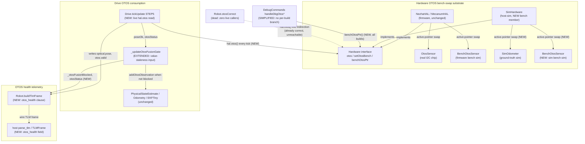
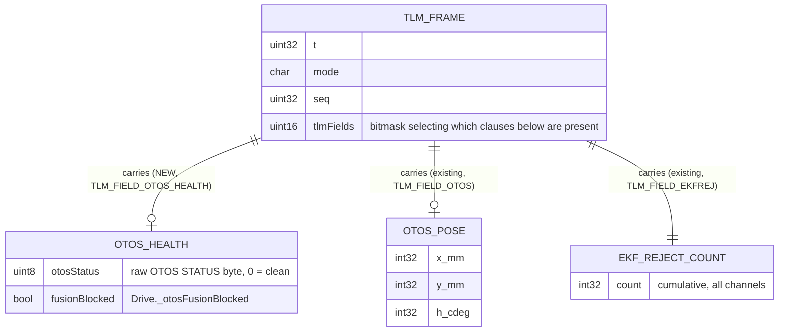
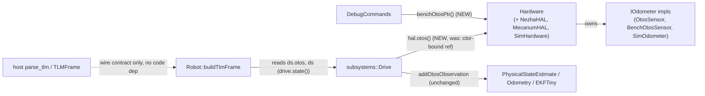

<!-- CLASI: Before changing code or making plans, review the SE process in CLAUDE.md -->

# Architecture Update -- Sprint 074: OTOS fusion recovery and health visibility

## Sprint Changes Summary

The issue (`otos-not-used-frozen-pose-ekf-rejects-everything.md`) names two
suspects: a latched fusion-gate block with no re-admission, and a bench-OTOS
simulation path that does not move. Code review (done before any code was
written this sprint) shows **both suspects as stated are wrong or dead**,
and finds the actual defects one level deeper:

1. **`Robot::otosCorrect()` -- the function the issue names -- is dead
   code.** It has had zero call sites in the live control loop since the
   ordered-tick cutover (sprint 060, `LoopTickOnce.cpp`). The sole live
   OTOS-read-and-fuse path is `Drive::tickUpdate()` STEP 5 /
   `Drive::_updateOtosFusionGate`. Sprint 065's own architecture-update.md
   documents the CR-06 warn-persistence fix exclusively against
   `Robot::otosCorrect()` and never mentions `Drive.cpp`, even though the
   shipped fix (`Drive.cpp:403-429`) is a byte-for-byte port of the same
   state machine into the live path -- a confirmed case of documented
   architecture drifting from actual code (see Codebase Alignment, below).
   This sprint corrects the record and targets the live path only.

2. **The CR-06 gate already re-admits fusion; that is not the bug.**
   `_otosFusionBlocked` clears after `kOtosCleanReadmitN` (5) consecutive
   clean ticks, in both the dead `Robot::otosCorrect()` and the live
   `Drive::_updateOtosFusionGate`. This is already regression-tested
   (`test_otos_warn_persistence.py::test_clean_streak_readmits_fusion_after_block`).
   The actual gap: the gate's only "is this reading healthy" signal is the
   OTOS chip's self-reported STATUS byte. It has no independent check that
   the pose VALUE is actually changing. A reading that is readable, reports
   a clean STATUS byte, and simply stops updating sails through undetected
   and gets fused every tick -- the only explanation that accounts for
   BOTH observed symptoms at once (frozen `otos=` AND `ekf_rej` climbing
   every tick: a blocked gate stops feeding the EKF, so `ekf_rej` would
   stop climbing too, not keep climbing). **Fix: extend the existing
   gate's warn input with a value-staleness check; reuse the existing
   block/re-admit state machine unchanged.**

3. **`Drive`'s OTOS reference is bound once at boot and never re-seated --
   this is why bench mode has no effect on the live path.** `Drive::_otos`
   (`Drive.h:123`) is a C++ reference passed `hal.otos()` once, at Robot
   construction (`Robot.cpp:94-95`), before `DBG OTOS BENCH` can ever run.
   `NezhaHAL`/`MecanumHAL`'s `setOtosBench()` swaps an internal pointer
   (`_otosActive`) between the real sensor and `BenchOtosSensor`, but a
   bound C++ reference cannot be re-seated -- `Drive` keeps reading
   whatever `hal.otos()` returned at boot, forever. Only the dead
   `Robot::otosCorrect()` correctly re-resolves `hal.otos()` on every call
   (a fix already shipped for it in 031-002, ironically for a function with
   no caller). This is a sufficient, code-review-confirmed explanation for
   "bench mode shows the same frozen-OTOS signature": enabling bench mode
   is currently a no-op for the path that actually feeds telemetry and the
   EKF.

4. **In host-sim, `SimHardware` has no bench-otos object to swap to at
   all**, unlike firmware's `NezhaHAL`/`MecanumHAL`. `setOtosBench()` only
   records a flag; `otos()` always returns `_odom` (`SimOdometer`).
   `DebugCommands::handleDbgOtos()`'s `HOST_BUILD` branch hardcodes
   `ideal=0,0,0 otos=0,0,0` because it structurally cannot reach the
   test-only `SimHandle::benchOtos` object `sim_api.cpp` defines
   separately. This is a second, independent explanation for "bench mode
   looks frozen," specific to sim/TestGUI-sim sessions, and it is what
   makes item 3 fully sim-testable: fixing it gives `SimHardware` real swap
   parity with firmware, which is also the substrate item 2's fix needs in
   order to be provable in sim at all.

Four cohesive changes result, all inside three existing modules -- no new
subsystem:

1. **`SimHardware` bench-OTOS parity** -- give host-sim a real, swappable
   bench odometer via the `Hardware` interface, matching firmware.
2. **`Drive` live-OTOS indirection** -- read the active odometer through
   `Hardware` every tick, not a boot-time reference.
3. **OTOS fusion-gate stuck-value hardening** -- extend the existing CR-06
   gate's warn input; no new gate, no new re-admission logic.
4. **OTOS health on the wire** -- one new, additive, always-visible TLM
   field; golden-TLM regenerated.

`Robot::otosCorrect()` is left in place, now explicitly documented as dead,
pending a stakeholder call on deletion (see Open Questions). The physical
hardware's actual failure mode -- why the real chip's reading froze in the
first place -- is explicitly out of scope: HIL work, not something sim or
code review can determine.

---

## Step 1-2: Problem and Responsibility Groups

| Responsibility | Owning module | Why it changes |
|---|---|---|
| Present one swappable "active odometer" per HAL, uniformly across firmware and sim | `Hardware` interface + `NezhaHAL`/`MecanumHAL` (unchanged) + `SimHardware` (new) | Firmware already does this correctly (`_otosActive` pointer swap); sim has no bench object to swap to. This is a parity gap, not a change to the existing contract. |
| Read the currently active odometer on the live fusion/telemetry path | `subsystems::Drive` (`tickUpdate()` STEP 5) | `Drive` is the sole live consumer of `hal.otos()`'s result for fusion and TLM; it is the one place still using a construction-time-bound reference instead of the already-proven live-indirection pattern (`Robot::otosCorrect()`, dead but correct). |
| Decide whether an OTOS reading is healthy enough to fuse, and when to block/re-admit | `subsystems::Drive` (`_updateOtosFusionGate`, `_otosFusionBlocked`, `_otosWarnStreak`, `_otosCleanStreak`) | Already the single choke point for this decision (CR-06, sprint 065); the value-staleness check is one more input to the same decision, not a new decision-owner. |
| Report OTOS health on the wire every frame | `Robot::buildTlmFrame` (`RobotTelemetry.cpp`) + `Config.h` (`TLM_FIELD_*`) + host `parse_tlm`/`TLMFrame` (`protocol.py`) | Already the single place that assembles/parses the TLM frame; a health field is one more clause in an existing, additive, bit-gated scheme. |
| Debug-probe the bench odometer's accumulators from any build | `DebugCommands` (`handleDbgOtos`, `handleDbgOtosBench`) | Already the single command surface for this; today it special-cases `HOST_BUILD` out entirely because it has no HAL-level accessor to call -- once `Hardware::benchOtosPtr()` exists, the special case is removed, not added to. |

No responsibility spans more than one module boundary. The four rows map
1:1 onto the four changes in the summary above.

---

## Step 3: Subsystems and Modules

### Module: Hardware OTOS bench-swap substrate
**Purpose**: Present a single, live-swappable active odometer per HAL.

**Boundary**:
- *Inside*: `Hardware::otos()`, `Hardware::setOtosBench()`,
  `Hardware::isBenchMode()`, `Hardware::benchOtosPtr()` (new virtual,
  default `nullptr`); each concrete HAL's active-pointer bookkeeping
  (`NezhaHAL`/`MecanumHAL`, unchanged) and, new this sprint, `SimHardware`'s
  own `BenchOtosSensor` member plus pointer swap, mirroring `NezhaHAL`
  exactly (`BenchOtosSensor` already compiles under `HOST_BUILD` --
  reused as-is, not reimplemented).
- *Outside*: which concrete `IOdometer` is active at any moment (a decision
  made only by `setOtosBench()`'s caller, the `DBG OTOS BENCH` command
  handler); what any consumer of `IOdometer&` does with a reading (owned by
  `Drive`, `DebugCommands`, the dead `Robot::otosCorrect()`).

**Use cases served**: SUC-001.

### Module: Drive OTOS consumption
**Purpose**: Fuse the currently active odometer's healthy readings into the
live EKF and telemetry.

**Boundary**:
- *Inside*: `Drive::tickUpdate()` STEP 5, the live-indirection read (new),
  `_updateOtosFusionGate`, `_otosFusionBlocked`/`_otosWarnStreak`/
  `_otosCleanStreak`, and the new value-staleness check that feeds the same
  state machine.
- *Outside*: which concrete odometer is active (owned by the Hardware
  module above); the EKF's own internal Mahalanobis gate/gate-recovery
  (`Odometry`/`EKFTiny`, untouched, same as sprint 065 left it).

**Use cases served**: SUC-002, SUC-003.

### Module: OTOS health telemetry
**Purpose**: Report the drivetrain's OTOS health state on the wire every
frame.

**Boundary**:
- *Inside*: the new `otos_health=` TLM clause, `TLM_FIELD_OTOS_HEALTH`,
  `RobotTelemetry.cpp`'s `buildTlmFrame`, host `TLMFrame.otos_health` /
  `parse_tlm`, `tests/_infra/golden_tlm_capture.json`.
- *Outside*: how the health state was computed (owned by the Drive module
  above); what a host does with the information (host-side alerting/UI is
  out of scope this sprint -- this module only makes the fact visible).

**Use cases served**: SUC-004, SUC-005.

**Fan-out check**: the Drive module's fan-in from the Hardware module is a
single call (`hal.otos()`), no increase to Drive's existing collaborator
count (`PhysicalStateEstimate`, `Odometry`, unchanged). The OTOS health
telemetry module depends only on Drive's existing state accessor
(`ds.otos`, `ds.optical`, already flowing through it for `otos=`). No new
edge in this sprint exceeds a fan-out of 2.

---

## Step 4: Diagrams

### 4a. Component / Module Diagram

### 4b. TLM Frame Schema (entity-relationship view)

The data-model change this sprint is entirely a wire-schema addition (no
persistent storage). Shown as an ER-style view of the TLM frame entity and
the one new attribute, alongside the existing attributes it sits next to:

`OTOS_HEALTH` is unconditional once its bit is set (no freshness gate,
matching `wedge=`'s existing precedent) -- unlike `OTOS_POSE`, which is
gated by the N8 freshness rule. This is intentional: the health field must
stay visible precisely when the pose field is going stale, so a host can
tell the two conditions apart.

### 4c. Dependency Graph

No cycles: `Drive` and `DebugCommands` depend on `Hardware`; `Hardware`
depends on nothing in this graph; `RobotTelemetry` depends on `Drive`;
the host side depends only on the wire contract, not on any firmware
symbol. `Estimate` is a leaf, as before.

---

## Step 5: What Changed, Why, Impact, Migration

### What Changed

1. **`Hardware` gains `virtual BenchOtosSensor* benchOtosPtr() { return
   nullptr; }`** (default no-op, mirrors the existing `setOtosBench`/
   `isBenchMode` default pattern). `NezhaHAL`/`MecanumHAL` override it to
   return their existing `&_benchOtos` (already present; only the virtual
   accessor is new). `SimHardware` gains a `BenchOtosSensor _benchOtos`
   member, overrides `benchOtosPtr()` to return `&_benchOtos`, and its
   `setOtosBench(bool on)` now actually swaps `_otosActive` between
   `&_odom` and `&_benchOtos` (previously: flag-only, no swap).
   `SimHardware::tick(now, cmds)` drives `_benchOtos.tick(...)` every call
   using the same dt-baseline-maintained-every-tick discipline
   `NezhaHAL::tick(now, cmds)` already uses (anti-spike-on-enable), so the
   bench accumulator only advances by the true elapsed step once bench mode
   turns on.
2. **`DebugCommands::handleDbgOtos()`'s per-build branch is replaced by one
   path**: `ctx.robot->hal.benchOtosPtr()`, null-checked, works identically
   in firmware and `HOST_BUILD`. The `#if !defined(HOST_BUILD) &&
   defined(BENCH_OTOS_ENABLED)` / hardcoded-zero `#else` branch is removed.
3. **`Drive` gains a `Hardware&` member, replacing the `IOdometer& _otos`
   constructor parameter.** All STEP-5 read call sites
   (`_otos.readTransformed`/`readStatus`/`readVelocityTransformed`) become
   `_hal.otos().<method>`, resolved fresh each call -- the same
   `hal.otos()` indirection `Robot::otosCorrect()` already uses (its own
   header comment already explains why: "reads the LIVE active pointer,
   not the cached ref, which cannot be re-seated"). `Robot.cpp`'s
   `drive(...)` construction call passes `hal` instead of `hal.otos()`.
4. **`Drive::_updateOtosFusionGate`'s warn input widens.** STEP 5 computes
   an additional boolean: the newly read pose is within a small epsilon of
   the previous tick's pose (position and heading) AND encoder-evidenced
   motion occurred this tick (non-trivial `|dEnc|`over the same window).
   That boolean is OR'd into the existing `warnBit` passed to
   `_updateOtosFusionGate(bool warnBit)` -- the function body, the streak
   counters, and the re-admission threshold are unchanged.
5. **New TLM field.** `Config.h` gains `TLM_FIELD_OTOS_HEALTH = (1u << 9)`;
   `TLM_FIELD_ALL` widens from `0x1FF` to `0x3FF`. `buildTlmFrame` emits
   `otos_health=<statusByte>,<blocked>` unconditionally (no freshness gate)
   whenever the bit is set, reading `ds.otos_status` (new,
   `msg::DrivetrainState` field carrying the raw STATUS byte Drive already
   reads every tick) and `ds.otos_fusion_blocked` (new, mirrors
   `_otosFusionBlocked`). Host `protocol.py` gains
   `TLMFrame.otos_health: tuple[int, bool] | None` and a `parse_tlm` clause
   for it. `tests/_infra/golden_tlm_capture.json` is regenerated.
6. **Comments only**: `RobotTelemetry.cpp`'s `otos=` emission site and
   `Drive::tickUpdate()` STEP 5 gain a cross-reference note documenting
   that `otos=` is the raw, last-successfully-read pose independent of
   fusion-block state, and pointing at `otos_health=` for fusion status.
   `Robot::otosCorrect()` gains a banner comment stating plainly that it
   has no live caller (superseding the misleading impression left by
   sprint 065's architecture-update.md).

### Why

Every change traces to a specific, cited file/line and a specific use
case:

- SUC-001/SUC-002 close the actual explanation for "bench mode looks
  frozen": firmware's swap mechanism is sound, but (a) sim has nothing to
  swap to, and (b) the one live consumer of the swap result
  (`Drive`) never re-reads it. Both are required together -- fixing only
  (b) would be untestable in sim (no real swap to test against); fixing
  only (a) would leave the firmware-side symptom in place.
- SUC-003 closes the actual explanation for the paired frozen-`otos=`/
  climbing-`ekf_rej` symptom the issue's HITL session recorded: a
  STATUS-only gate cannot see a stuck-but-clean reading. This is a
  strictly additive hardening of an already-correct, already-tested
  mechanism -- not a rewrite.
- SUC-004/SUC-005 close the issue's explicit acceptance sketch: "a
  persistent OTOS read failure or fusion block is surfaced on the wire...
  not silent," and "determine what TLM `otos=` actually reflects."

None of these are speculative: each has a cited file/line and (where
applicable) an existing test whose current behavior was read and confirmed
before writing this document.

### Impact on Existing Components

| Component | Impact |
|---|---|
| `source/hal/Hardware.h` | **Modified.** New virtual `benchOtosPtr()`, default `nullptr`. Additive; no existing override signature changes. |
| `source/robot/NezhaHAL.{h,cpp}`, `source/robot/MecanumHAL.{h,cpp}` | **Modified (trivial).** Add `benchOtosPtr()` override returning the existing `&_benchOtos`. No change to existing bench-swap logic. |
| `source/hal/sim/SimHardware.{h,cpp}` | **Modified.** New `BenchOtosSensor _benchOtos` member; `setOtosBench()` now performs a real pointer swap; `benchOtosPtr()` added; `tick(now,cmds)` drives `_benchOtos.tick(...)`. `otos()`'s return value now depends on bench-mode state for the first time. |
| `source/commands/DebugCommands.cpp` | **Modified.** `handleDbgOtos()` and the noise-setting branch of `handleDbgOtosBench()` lose their `#if !defined(HOST_BUILD) && defined(BENCH_OTOS_ENABLED)` guards, replaced by a null-checked `hal.benchOtosPtr()` call that works in every build. Net simplification (removes a downcast and a preprocessor branch). |
| `source/subsystems/drive/Drive.{h,cpp}` | **Modified.** Constructor signature changes: `IOdometer& otos` parameter replaced by `Hardware& hal`. All STEP-5 OTOS read call sites resolve through `_hal.otos()`. `_updateOtosFusionGate`'s caller passes an additional staleness-derived bit; the function's own body is unchanged. New private staleness-tracking members (previous-tick pose, epsilon comparison state). |
| `source/robot/Robot.cpp` | **Modified (one line).** `drive(...)` construction passes `hal` instead of `hal.otos()`. `Robot::otosCorrect()` body unchanged; gains a "dead code, no live caller" banner comment. |
| `source/robot/RobotTelemetry.cpp` | **Modified.** New `otos_health=` clause in `buildTlmFrame`, unconditional on the new field bit (no freshness gate). Comment added at the existing `otos=` clause. |
| `source/types/Config.h` | **Modified.** New `TLM_FIELD_OTOS_HEALTH` bit; `TLM_FIELD_ALL` widens `0x1FF` -> `0x3FF`. |
| `source/messages/drivetrain.h` (or equivalent `msg::DrivetrainState`) | **Modified.** Two new fields carrying the raw OTOS STATUS byte and the fusion-blocked flag from `Drive::_state` out to `Robot::buildTlmFrame`, mirroring how `ds.otos`/`ds.optical` already flow. |
| `host/robot_radio/robot/protocol.py` | **Modified.** `TLMFrame` gains `otos_health`; `parse_tlm` gains a clause for it. Purely additive -- any code not yet updated continues to ignore the new key (the kv parser already tolerates unknown keys). |
| `tests/_infra/golden_tlm_capture.json` | **Regenerated.** Every captured frame in the fixed sequence gains the new `otos_health=` clause (field is in `TLM_FIELD_ALL`, on by default, and the fixed sequence never restricts `tlmFields`). |
| `tests/simulation/unit/test_golden_tlm.py` | **Unaffected in structure.** Passes against the regenerated capture; no test-code change. |
| `tests/simulation/unit/test_otos_warn_persistence.py` | **Unaffected.** The STATUS-bit path and its three existing tests are untouched; the staleness check is an additional, independent input to the same gate. |
| `tests/_infra/sim/sim_api.cpp`, `tests/_infra/sim/firmware.py` | **Extended.** New read-only sim hooks to observe `_otosFusionBlocked`/`otosStatus`/bench-otos pose for the new tests (exact names decided at ticket time, following the existing `sim_get_otos_*`/`sim_set_otos_*` naming pattern). `SimHandle::benchOtos` and its standalone `sim_bench_otos_*` hooks are left in place this sprint (see Open Questions) -- they become redundant with `SimHardware`'s new built-in bench member but nothing requires removing them yet. |
| `source/state/EKFTiny.{h,cpp}`, `source/control/Odometry.h` | **Unaffected.** The staleness check lives entirely upstream in `Drive`, same boundary sprint 065 already established for the STATUS-bit gate. |
| Every other module (`BodyVelocityController`, sensors, radio/relay comms, `Planner`) | **Unaffected.** No interface they depend on changes shape. |

### Migration Concerns

- **Wire compatibility**: the new `otos_health=` clause is purely additive
  at the end of the field-ordering sequence used today (after `ekf_rej=`,
  matching the existing append-only convention `encpose=`/`ekf_rej=`
  themselves followed). A host that has not yet updated `parse_tlm` sees
  and ignores the extra key; no existing key changes name, position
  relative to each other, or meaning. No breaking change for `rogo`,
  bench scripts, or recorded-log tooling that only reads keys it knows.
- **Golden-TLM**: `tests/_infra/golden_tlm_capture.json` must be
  regenerated in lock-step with the firmware change and the host parser
  change, in the same ticket, per this sprint's hard contract. Regenerating
  before both sides are updated would make `test_golden_tlm_unchanged`
  pass for the wrong reason (frame strings matching a capture that a
  contemporaneous host build cannot fully parse).
- **`Drive`'s constructor signature change** (`IOdometer&` ->
  `Hardware&`) is a source-compatible breaking change for any call site
  that constructs a `Drive` directly. Grep-confirmed during this planning
  pass: `Robot.cpp` is the only production call site; `tests/_infra/sim`
  constructs `Drive` only indirectly through `Robot`/`SimHandle`, so no
  test call site needs updating beyond what the ticket's own build will
  surface as compile errors.
- **No data migration** -- there is no persisted state; all changes are
  in-memory embedded state plus a wire-format addition.
- **Deployment sequencing**: firmware and host should be updated together
  for the new field to be useful, but neither side breaks if updated
  first (additive wire field; host parser ignores unknown keys; firmware
  emitting a field an old host ignores is harmless).

---

## Step 6: Design Rationale

### Decision 1: `Drive` obtains the active odometer via a live `Hardware&` indirection, not a narrower single-method seam

**Context**: `Drive::_otos` is currently a plain `IOdometer&`, matching the
codebase's general preference for depending on narrow capability
interfaces (`IMotor`, `IOdometer`) rather than the `Hardware` facade.
Fixing the staleness bug requires re-resolving the active odometer every
tick, which requires holding onto *something* that can still see
`Hardware`'s pointer swap after construction.

**Alternatives considered**:
1. Introduce a minimal one-method seam, e.g. `struct IOdometerSource {
   virtual IOdometer& otos() = 0; };`, implemented by a thin adapter around
   `Hardware`, injected into `Drive` in place of `IOdometer&`.
2. Give `Drive` a `Hardware&` directly, matching `Robot`'s own existing
   resolution of the identical problem.

**Why this choice**: Option 2. `Robot` already solved this exact problem
this exact way (`Robot.cpp:185`, `hal.otos()` inside `otosCorrect()`) --
reusing the established idiom is lower-risk and more consistent than
introducing a second pattern for the same problem in the same codebase.
`Hardware` is already the sole HAL boundary every other runtime-swappable
capability access in this codebase goes through; a bespoke seam for OTOS
alone would be a new abstraction serving exactly one call site.

**Consequences**: `Drive`'s fan-out to the HAL grows from "one capability
interface" to "the `Hardware` facade" (motor/line/color/gripper accessors
`Drive` never calls). This is a real, accepted coupling increase, flagged
explicitly in the self-review below rather than hidden. It does not change
dependency *direction* (`Drive` -> `Hardware` is the same
infrastructure-facing direction `Drive` -> `IOdometer` already was), and it
does not introduce a cycle (`Hardware` depends on nothing that depends back
on `Drive`).

### Decision 2: `SimHardware` gains a real, always-present `BenchOtosSensor` member rather than reusing `SimHandle::benchOtos`

**Context**: A standalone `BenchOtosSensor` already exists in host-sim
(`tests/_infra/sim/sim_api.cpp`'s `SimHandle::benchOtos`), but it is
test-infrastructure-only, invisible to `DebugCommands.cpp` (shared firmware
source, which cannot see a test-only struct), and never auto-advanced --
only explicit `sim_bench_otos_tick()` ctypes calls move it.

**Alternatives considered**:
1. Give `DebugCommands.cpp` a way to reach `SimHandle::benchOtos` (e.g. a
   global test-hook pointer), keeping the object where it is.
2. Move ownership of the bench-otos object into `SimHardware` itself
   (production HAL code, not test infra), and have `SimHandle` (if it
   still needs bench-otos access for the older standalone ctypes hooks)
   delegate to `SimHardware`'s copy instead of owning a second one.

**Why this choice**: Option 2. `DebugCommands.cpp` is shared between
firmware and `HOST_BUILD`; it must not know about test-only structs by
construction (that boundary is intentional and predates this sprint).
Giving `SimHardware` its own `BenchOtosSensor`, exactly mirroring
`NezhaHAL`'s ownership, means the SAME accessor path
(`Hardware::benchOtosPtr()`) works in every build with no branching --
which is also the change that removes the existing
`#if !defined(HOST_BUILD)` special case in `handleDbgOtos()` instead of
adding a new one.

**Consequences**: `SimHandle::benchOtos` and its dedicated `sim_bench_otos_*`
hooks become redundant (not removed this sprint -- see Open Questions).
`SimHardware` gains one more owned member, the same size/shape increase
`NezhaHAL` already accepted for the identical reason.

### Decision 3: The stuck-value check is an additional input to the existing gate, not a new parallel gate

**Context**: The observed symptom (frozen `otos=`, climbing `ekf_rej`)
could be addressed by a wholly separate "staleness gate" sitting alongside
`_updateOtosFusionGate`, with its own block/re-admit state.

**Alternatives considered**:
1. A second, independent gate and a second `_otosStaleBlocked` flag,
   combined with `_otosFusionBlocked` via OR at the fusion call site.
2. Fold the staleness signal into the existing `warnBit` input of
   `_updateOtosFusionGate`, so it drives the same streak counters and the
   same `_otosFusionBlocked` flag STATUS-bit warnings already drive.

**Why this choice**: Option 2. The two conditions ("STATUS says degraded"
and "value isn't moving") are both instances of the same underlying
question -- "is this reading trustworthy enough to fuse" -- and the
re-admission semantics wanted are identical (a run of clean/healthy ticks
re-admits). A second gate would duplicate `kOtosWarnPersistK`/
`kOtosCleanReadmitN`-shaped state and require its own regression coverage
of re-admission, when the existing coverage already proves the shared
mechanism works. This is the same reasoning CR-06 itself used to justify a
single two-tier gate instead of parallel special cases.

**Consequences**: A tick can be "warned" for either reason and the two are
indistinguishable from `_otosWarnStreak` alone; `otos_health=`'s
`fusionBlocked` bit does not say *why* fusion is blocked, only that it is.
This is judged acceptable: the raw `otosStatus` byte is exposed alongside
it in the same clause, so a host can distinguish "chip says WARN" (nonzero
`otosStatus`) from "chip says clean but value is stuck" (`otosStatus == 0`
with `fusionBlocked == 1`) without any additional wire surface.

### Decision 4: One combined `otos_health=<status>,<blocked>` clause, unconditional (no freshness gate), added as bit 9 and on by default

**Context**: The issue asks for a persistent OTOS read-failure/fusion-block
state to be "surfaced on the wire (a TLM health field or EVT), not
silent."

**Alternatives considered**:
1. An `EVT` (one-shot event on state transition), matching the existing
   `EVT otos lost` pattern in the dead `Robot::otosCorrect()`.
2. A per-frame TLM field, gated by the same N8 freshness rule `otos=`
   already uses.
3. A per-frame TLM field, unconditional like `wedge=`, bundling both the
   raw STATUS byte and the block flag in one clause.

**Why this choice**: Option 3. An EVT-only signal (option 1) can be
dropped by a lossy relay/radio link with no resend, and gives no
"currently blocked" snapshot to a client that only polls `SNAP` --
`wedge=`'s own design rationale (064-004, cited in `RobotTelemetry.cpp`)
already made this exact argument for the identical reliability reason.
Gating on freshness (option 2) would hide the health field at precisely
the moment it matters most (when `otos=` itself is going stale) -- the
opposite of what "not silent" requires. Bundling status+blocked in one
clause (rather than two `TLM_FIELD_*` bits) keeps the wire-field budget
and the `TLM_FIELD_ALL` bitmask growth to one bit, consistent with how
`wedge=<L>,<R>` already bundles two related sub-values.

**Consequences**: The field is on by default (`TLM_FIELD_ALL`), so every
existing recording/tooling path that doesn't explicitly restrict
`tlmFields` gains one more clause per frame -- a few bytes of additional
wire traffic per TLM frame, judged negligible against the existing frame
size and the diagnostic value gained. The golden-TLM capture must be
regenerated (tracked explicitly in Migration Concerns).

### Decision 5: `Robot::otosCorrect()` is documented as dead, not deleted, this sprint

**Context**: The function has zero live callers, occupies real
maintenance/reading burden (it is the first place both this sprint's
source issue and sprint 065's architecture-update.md looked, and both drew
conclusions from it that don't hold for the live system), and deleting
dead code is generally good hygiene.

**Alternatives considered**:
1. Delete `Robot::otosCorrect()`, `_otosInvalidStartMs`, `_otosLostEmitted`,
   and the "EVT otos lost" emission it owns, in this sprint.
2. Leave it in place, add a prominent "dead code" banner comment, and flag
   deletion as a stakeholder decision for a future cleanup sprint.

**Why this choice**: Option 2. Deleting the function also deletes the only
current source of "EVT otos lost" -- whether that EVT is truly unused
end-to-end (versus, say, a host-side listener or a HIL script keying off
it that isn't visible to a pure code/test-suite review) is exactly the
kind of question this sprint's scope explicitly defers to HIL. Grep found
no live production caller and no test asserting on the EVT text, but
"no evidence found in this repository" is not the same guarantee as
"safe to delete" for a wire-visible event a field script could depend on.
This is judged a stakeholder call, not a sprint-planner call, per the
Exception Protocol's guidance to prefer flagging over unilaterally
overriding a prior sprint's explicit "kept for API parity" decision
(sprint 065's ticket 006 language).

**Consequences**: The dead code remains, now clearly labeled, reducing
(but not eliminating) the chance a future debugging session repeats this
sprint's initial mis-direction. Tracked as an Open Question below.

---

## Step 7: Open Questions

1. **HIL-deferred (per sprint scope): what actually made the physical
   OTOS chip's reading freeze?** This sprint makes a stuck-but-clean
   reading detectable, blockable, and wire-visible, and makes bench-mode
   toggling actually take effect on the live path -- it does not determine
   whether the original hardware incident was an I2C bus fault, a
   REG_OFFSET-adjacent issue (see project memory:
   "OTOS offset register unwritable"), a genuinely stalled optical-flow
   chip, or something else. That determination needs the physical robot
   and is explicitly out of this sprint's scope.
2. **Should `Robot::otosCorrect()` (and its private
   `_otosInvalidStartMs`/`_otosLostEmitted`/"EVT otos lost" emission) be
   deleted in a future cleanup sprint?** This sprint recommends deletion
   once a stakeholder confirms no external tooling depends on "EVT otos
   lost" being emitted from this (dead) call path -- see Design Rationale
   Decision 5.
3. **Should the now-redundant `SimHandle::benchOtos` standalone object and
   its `sim_bench_otos_*` ctypes hooks be retired** now that `SimHardware`
   owns a real, HAL-reachable bench odometer? Left in place this sprint
   (no functional conflict -- they are two independent objects); a
   follow-up cleanup sprint could consolidate them once any external
   script relying on the standalone hooks' exact names is identified.
4. **Stuck-value detector thresholds** (position/heading epsilon, the
   number of ticks required before treating "unchanged" as "stuck," and
   the encoder-motion threshold that arms the check) are proposed at
   ticket time using the existing `kOtosWarnPersistK`/`kOtosCleanReadmitN`
   windows as a starting point, but are not yet HIL-validated against a
   genuine slow-drift or near-stationary-driving scenario. Flagged for
   possible retuning once a HIL bench session is available.
5. **Should `otos_health=`'s `fusionBlocked` bit distinguish "blocked by
   STATUS" from "blocked by staleness"** (a 2-bit or small-enum encoding
   instead of one bit)? Decision 3 above chose not to, reasoning that the
   raw `otosStatus` byte already disambiguates the two cases for anyone
   who needs to. Flagged in case a stakeholder wants the distinction made
   wire-explicit rather than derived.

---

## Architecture Self-Review

Reviewed against the five required categories before advancing to
ticketing.

**Consistency.** The Sprint Changes Summary's four numbered changes match
the four modules in Step 3 and the "What Changed" list in Step 5 1:1. The
Design Rationale section updates the one piece of prior design reasoning
this sprint touches (CR-06's gate, sprint 065) by extending it rather than
contradicting it -- the streak/re-admission thresholds and their rationale
are explicitly carried forward unchanged, not re-litigated.

**Codebase Alignment.** This review found and corrected a real,
pre-existing drift: sprint 065's architecture-update.md documents the
CR-06 fix only against `Robot::otosCorrect()`, which has had no live caller
since sprint 060 -- three sprints before 065 was even planned. The fix
that actually matters was ported into `Drive.cpp` without a corresponding
architecture update at the time. This document's Sprint Changes Summary
item 1 states this explicitly so the record is corrected going forward,
and every change in this sprint targets the verified-live path
(`Drive.cpp`), not the documented-but-dead one. All four proposed changes
were checked against actual current source (cited file/line throughout,
not inferred from prior architecture docs) before being proposed.

**Design Quality.** Cohesion: each of the three modules (Hardware
bench-swap substrate, Drive OTOS consumption, OTOS health telemetry) has a
one-sentence purpose with no "and," and passes the test of being
describable without reference to the other two. Coupling: Decision 1
explicitly accepts a fan-out increase for `Drive` (narrow `IOdometer&` ->
facade `Hardware&`) in exchange for reusing an established, working
pattern instead of inventing a new one for a single call site -- flagged
rather than hidden, per the instructions for this review. No circular
dependency is introduced (Step 4c's dependency graph is a DAG). Boundaries
stay narrow at the wire (one additive clause) and at the HAL (one new
virtual method with a safe default).

**Anti-Pattern Detection.** No god component: the three modules divide
cleanly along the existing lines (HAL vs. control-loop consumption vs.
telemetry), none absorbing another's responsibility. No shotgun surgery:
each change touches a small, predictable file set (Impact table above) and
none of the four changes requires touching all the others' files. No
feature envy: `Drive` calling `hal.otos()` is calling into its own declared
dependency, not reaching into another module's private state. No new
circular dependency. No leaky abstraction: `IOdometer` callers still only
see `Pose2D`/`BodyTwist`/`BodyAccel`/`uint8_t status`, never a concrete
sensor type (the `Hardware&` widening in Decision 1 is a facade dependency,
not a leak of `SimHardware`/`NezhaHAL` internals). No speculative
generality: no new interface is introduced for a single current use
(Decision 1 explicitly rejected inventing `IOdometerSource` for exactly
this reason).

**Risks.** No data migration (no persisted state). The one breaking
signature change (`Drive`'s constructor) is source-only and has exactly one
production call site, confirmed by grep during this planning pass. The
wire change is additive and safe to deploy in either order (firmware-first
or host-first). No new deployment sequencing constraint beyond the
existing golden-TLM regeneration discipline this project already follows
for every additive TLM field. No security implications (no new external
input surface -- the new TLM field is host-read-only telemetry, and the
constructor change is compile-time-only).

**Verdict: APPROVE WITH CHANGES.**

Rationale for "with changes" rather than a clean APPROVE: Decision 1's
accepted coupling increase (`Drive` depending on the full `Hardware` facade
instead of a narrow single-method seam) is a real, minor ISP compromise --
contained to one component, already justified against an existing
codebase precedent, and not a structural risk (no cycle, no god-component
growth), so it is addressable during implementation rather than blocking
ticketing. No REVISE-level issue (no circular dependency, no broken
interface, no inconsistency between the Sprint Changes Summary and the
document body) was found.
