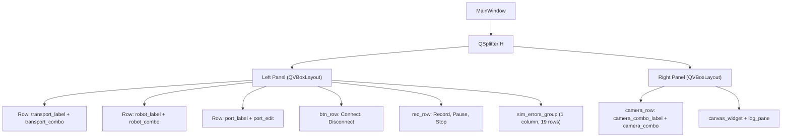
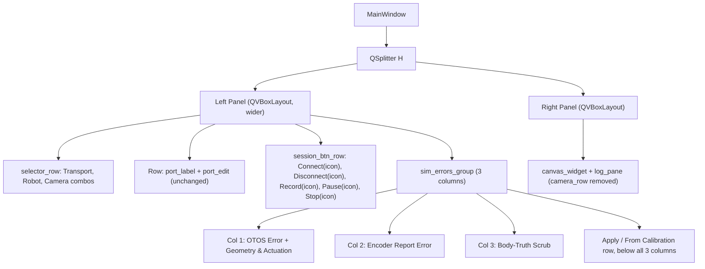

<!-- CLASI: Before changing code or making plans, review the SE process in CLAUDE.md -->

# Architecture Update -- Sprint 075: TestGUI layout reorganization: single-row selectors and session buttons with icons, three-column sim-errors panel

## Sprint Changes Summary

1. **Session-setup selectors** (`transport_combo`, `robot_combo`,
   `camera_combo`) move from four stacked label/combo rows spanning two
   panels into one `QHBoxLayout` row in the left panel.
2. **Session-control buttons** (`connect_btn`, `disconnect_btn`,
   `record_btn`, `pause_btn`, `stop_btn`) move from two separate rows
   (Connect/Disconnect; Record/Pause/Stop) into one shared row, and each
   gains a `QStyle.StandardPixmap` icon.
3. **Sim Errors panel** (`sim_errors_group`) moves from one stacked
   `QVBoxLayout` (4 sections, 15 spin rows, ~19 rows tall) into a
   3-column layout, with OTOS Error and Geometry & Actuation sharing the
   left column, and narrower per-row label/spin-box widths.

No wire protocol, handler, persisted-data, or test-observable-behavior
change. Every widget keeps its existing `objectName`; only parent
layouts, row groupings, icons, and a handful of label strings/widths
change.

## Step 1-2: Problem and Responsibility Groups

**Problem** (from `clasi/issues/testgui-layout-space-reorganization.md`):
the TestGUI's left panel and Sim Errors panel are taller and harder to
scan than they need to be, because (a) each selector/button currently
gets its own row even though several fit naturally side by side, and (b)
the Sim Errors panel stacks 15 label+spinbox rows in a single column.

Two responsibility groups change, and they change for different reasons:

- **Session-initiation ergonomics**: how the operator picks a
  transport/robot/camera and starts/stops/records a session. Changes
  because these controls are scattered across too many rows (and, for
  the camera selector, a different panel) for how frequently they're
  used together at connect time.
- **Sim-error tuning ergonomics**: how a developer reads/edits the
  simulator's plant and sensor error knobs. Changes because the flat
  15-row list is tall and slow to scan; the fix is purely about column
  layout and field width, not which knobs exist or how they're applied.

These two groups don't interact — nothing in the selector/button row
touches Sim Errors panel state, and vice versa — so they're addressed as
two independent layout changes below.

## Step 3: Subsystems and Modules

Both modules below are internal regions of the existing TestGUI Main
Window (`host/robot_radio/testgui/__main__.py`, `_build_main_window()`);
this sprint does not introduce a new top-level module or change the
window's external dependencies (transport, camera_prefs, sim_prefs,
robot_config remain exactly as consumed today).

### Module: Session-Initiation Controls Strip

- **Purpose**: Presents the operator's session-initiation controls
  compactly at the top of the left panel.
- **Boundary**:
  - *Inside*: the selector row's `QHBoxLayout` (holding
    `transport_label`/`transport_combo`, `robot_label`/`robot_combo`,
    `camera_combo_label`/`camera_combo`); the session-button row's
    `QHBoxLayout` (holding `connect_btn`, `disconnect_btn`, `record_btn`,
    `pause_btn`, `stop_btn`); each button's `QIcon` assignment.
  - *Outside*: every click/selection handler
    (`_on_transport_changed`, `_on_robot_changed`,
    `_on_camera_combo_changed`, connect/disconnect wiring,
    `_on_record_clicked`/pause/stop handlers), `camera_prefs`,
    `robot_config`, `transport.py`, and the `port_label`/`port_edit` row
    (unchanged, stays its own row below the selector row — it is a
    `QLineEdit`, not one of the "three combo boxes" the issue scopes in).
- **Use cases served**: SUC-001, SUC-002.

### Module: Sim Errors Panel Layout

- **Purpose**: Presents the simulator's error-injection knobs in a
  compact multi-column grid.
- **Boundary**:
  - *Inside*: `sim_errors_group`'s internal layout — the 3 column
    `QVBoxLayout`s, which section goes in which column, per-column
    label/spin-box widths, and the button row's position relative to the
    columns.
  - *Outside*: the 15 `sim_err_*` spin box values, their
    min/max/decimals/defaults, `_on_sim_errors_apply`,
    `_on_sim_errors_from_cal`, `sim_prefs.py`'s persisted-profile schema,
    and `SimTransport.apply_error_profile` — none of this sprint's
    changes touch how a value gets from a spin box to the wire.
- **Use cases served**: SUC-003.

## Step 4: Diagrams

### 4a. Widget/Layout Tree — Before (Component Diagram)

### 4b. Widget/Layout Tree — After (Component Diagram)

Camera_combo moves from the right panel's `camera_row` into the left
panel's `selector_row`; its label, tooltip, `objectName`, and change
handler are unchanged.

### 4c. Entity-Relationship Diagram

Not applicable — no data model change. `sim_prefs`'s persisted-profile
schema and `RobotConfig`/camera-preference files are untouched.

### 4d. Dependency Graph

Not applicable — no module dependency change. This sprint only moves
widgets between layouts that are already children of `_build_main_window`
in the same file; no new imports, no new inter-module calls, no
externally-visible interface changes.

## Step 5: What Changed, Why, Impact, Migration

### What Changed

- `selector_row` (new `QHBoxLayout`) replaces four separate
  label/combo rows with one row holding all three combos.
- `session_btn_row` (new `QHBoxLayout`) replaces `btn_row` + `rec_row`
  with one row holding all five buttons, each carrying a
  `QStyle.StandardPixmap` icon.
- `sim_errors_group`'s internal `QVBoxLayout` is replaced by a
  3-column arrangement (column container `QHBoxLayout` of three
  `QVBoxLayout`s) plus a button row below the columns; per-row label and
  spin-box fixed widths shrink to fit three columns in roughly the
  panel's current width.
- `camera_row` and its wrapper widget are removed from the right panel;
  `camera_combo`/`camera_combo_label` are re-parented into `selector_row`.
- Left/right splitter default proportions (`splitter.setSizes([...])`)
  widen the left pane modestly so the 3-column Sim Errors panel and the
  wider selector row don't feel cramped.

### Why

Directly implements
`clasi/issues/testgui-layout-space-reorganization.md`: reduce vertical
space used by the control area and the Sim Errors panel, and make the
five session buttons distinguishable by icon, not just by label text.

### Impact on Existing Components

- **Right panel**: loses `camera_row`; `right_layout` now goes straight
  from `mode_label` to `right_splitter`. No functional impact —
  `_populate_camera_combo()` and `_on_camera_combo_changed()` operate on
  the same `camera_combo` object regardless of which panel owns it.
- **`ops_panel` insertion** (`left_layout.insertWidget(left_layout.count()
  - 1, ops_panel)`, line ~1844): unaffected. It inserts relative to
  `left_layout`'s last item (the trailing `addStretch()`), which stays
  last; reordering earlier rows doesn't change that relationship.
- **Headless tests**: all current TestGUI tests locate widgets via
  `window.findChild(WidgetType, "object_name")`, which searches the
  whole widget tree regardless of parent layout — confirmed no test
  asserts a specific parent, row membership, or label text for any
  widget this sprint touches (`grep` across `tests/testgui/*.py` for
  `.layout()`/`itemAt`/`parentWidget`/`QHBoxLayout`/`QVBoxLayout`/
  `QGridLayout` found no structural-position assertions). Full baseline
  confirmed green before this sprint: `uv run python -m pytest -q` →
  **2682 passed**, 0 failed.
- **Port field**: explicitly out of scope. It stays a `QLineEdit` (not
  one of "the three combo boxes"), keeps its own row, and its
  enable/disable-on-transport-change behavior is untouched.

### Migration Concerns

None. No persisted data, wire protocol, or config schema changes. Purely
an in-process widget-tree rearrangement rebuilt fresh every time the GUI
launches.

## Step 6: Design Rationale

### Decision 1: The issue's third "import" selector is `camera_combo`

- **Context**: The issue asks for "the three combo boxes (transport,
  robot, import)" on one row. `host/robot_radio/testgui/__main__.py` has
  exactly three `QComboBox` widgets total: `transport_combo`,
  `robot_combo`, `camera_combo`. There is no combo box, button, or
  feature anywhere in the TestGUI code named or behaving like an
  "import" selector, and no config-import mechanism exists in
  `robot_config.py` to attach one to.
- **Alternatives considered**: (a) build a new "import" combo box —
  rejected, contradicts the issue's own "no functional changes" scope;
  (b) treat the row as transport+robot only and leave camera_combo where
  it is — rejected, fails the explicit "three combo boxes... single row"
  acceptance criterion.
- **Why this choice**: `camera_combo` is the only remaining combo in the
  codebase; relocating it is a pure layout move — its `objectName`,
  label, tooltip, population logic, and change handler are all reused
  unchanged.
- **Consequences**: Camera selection moves out of the right panel's
  "above the canvas" context into the left panel's session-setup strip.
  Flagged in Open Questions for stakeholder confirmation before
  ticketing, since it's an inference, not a literal match to the issue
  text.

### Decision 2: OTOS Error and Geometry & Actuation share the left column

- **Context**: The issue says "Move the OTOS error group (and likely
  geometry and actuation too) into a left-side column."
- **Alternatives considered**: OTOS alone in the left column, with
  Geometry & Actuation joining Encoder or Scrub in another column —
  considered, but doesn't follow the issue's explicit "and likely
  geometry and actuation too" hint, and produces the same kind of
  uneven-column-height outcome without a clear topical rationale.
- **Why this choice**: Follows the issue's guidance literally, and
  groups the two "device/plant calibration" sections (sensor error,
  physical geometry) together, leaving the two "behavioral" sections
  (encoder reporting, body-truth scrub) as the other two columns —
  topically coherent, not just a row-count balancing act.
- **Consequences**: The left column is taller (9 spin rows across 2
  sections) than the other two (3 spin rows each). Still a net height
  reduction from today's single 15-row column. Flagged in Open
  Questions in case the stakeholder prefers row-count balance over
  topical grouping.

### Decision 3: Icon choices use Qt's affirmative/negative and media-transport glyph families, not custom-drawn icons

- **Context**: The issue's suggested icons ("plug/unplug", "record dot")
  don't exist as literal `QStyle.StandardPixmap` values — Qt's standard
  icon set has no plug or dot glyph. The task's own constraint is
  explicit: use built-in `QStyle.StandardPixmap` icons only, no external
  asset files.
- **Alternatives considered**: (a) draw custom `QPixmap` icons at
  runtime (a red circle for Record, plug shapes for Connect/Disconnect)
  — rejected, the instruction calls for built-in standard icons, not
  generated ones; (b) leave Connect/Disconnect without icons since no
  exact "plug" match exists — rejected, fails "each with a distinguishing
  icon."
- **Why this choice**: `SP_DialogYesButton` / `SP_DialogNoButton` form a
  natural affirmative/negative pair matching Connect/Disconnect's
  opposite semantics. `SP_MediaPlay` / `SP_MediaPause` / `SP_MediaStop`
  form one coherent "media transport" family for Record/Pause/Stop —
  Pause and Stop are exact matches ("pause bars", "stop square"); Play is
  the closest available standard analog to "start capturing," and
  reusing the same enum family keeps the three-button group visually
  consistent.
- **Consequences**: Icons are a best-effort semantic approximation, not
  literal depictions of "plug" or "dot." Flagged in Open Questions in
  case the stakeholder wants a custom-drawn icon in a follow-up sprint.

## Step 7: Open Questions

1. **Is `camera_combo` really what the issue means by "import"?**
   (Decision 1.) It's the only combo box left to map onto that name, and
   treating it otherwise leaves the acceptance criterion unsatisfiable
   without a new feature. Flagged for stakeholder confirmation before
   ticketing proceeds — if the answer is "no, that's a different,
   not-yet-built feature," this sprint should scope selectors to
   transport+robot only and defer the third selector.
2. **Are the Record/Connect/Disconnect icon substitutions acceptable?**
   (Decision 3.) `SP_MediaPlay` for Record and `SP_DialogYesButton`/
   `SP_DialogNoButton` for Connect/Disconnect are semantic
   approximations, not literal "record dot"/"plug" glyphs. A follow-up
   sprint could add hand-drawn `QPixmap` icons if these read ambiguous
   in practice.
3. **Is the 9-row-vs-3-row left-column imbalance acceptable?** (Decision
   2.) The topical grouping the issue suggests produces an uneven column
   height; an alternative is splitting purely for row-count balance
   across all three columns instead.
4. **Exact left-splitter target width** for the widened selector row and
   3-column Sim Errors panel is deferred to ticket/implementation time —
   this document commits to "modestly wider," not a specific pixel
   value.

---

## Architecture Self-Review

Reviewed against the five required categories before advancing to
ticketing.

**Consistency.** The Sprint Changes Summary's three numbered items match
the two modules in Step 3 (item 1 and 2 both belong to the
Session-Initiation Controls Strip module; item 3 is the Sim Errors Panel
Layout module) and the "What Changed" list in Step 5 one-for-one. Design
Rationale doesn't contradict any prior sprint's decisions — this is the
first architecture update to describe the TestGUI's top control rows or
Sim Errors panel as a *layout* concern (sprint 069's architecture update
described the Sim Errors panel's *knob set*, a disjoint concern from this
sprint's column layout; no conflict).

**Codebase Alignment.** Every widget, handler, and object name cited
above was confirmed against the current
`host/robot_radio/testgui/__main__.py` (read in full for the relevant
sections, not inferred from prior architecture docs): the exact line
ranges for `transport_combo`/`robot_combo` (383-414), `port_edit`
(416-428), `btn_row`/`rec_row` (430-461), `camera_row` (900-918), and
`sim_errors_group`'s four sections (656-876). The claim that no headless
test asserts widget parenting or row membership was verified by grepping
`tests/testgui/*.py` for `.layout()`, `itemAt`, `parentWidget`,
`QVBoxLayout`, `QHBoxLayout`, `QGridLayout`, and `count()` — the only
hits are unrelated `QComboBox.count()` item-count assertions in
`test_camera_combo.py`. Full test baseline was run, not assumed: **2682
passed**, 0 failed (`uv run python -m pytest -q`).

**Design Quality.** Cohesion: both modules pass the one-sentence,
no-"and" test (Step 3). Coupling: neither module's boundary changes what
crosses it — the Session-Initiation Controls Strip still calls the exact
same handler functions it always did, just from widgets under a
different parent layout; the Sim Errors Panel Layout still feeds the
exact same `_on_sim_errors_apply`/`_on_sim_errors_from_cal` functions. No
new interfaces, no new fan-out. Boundaries: both modules' "outside" lists
are the same functions/modules that already existed pre-sprint — this
sprint adds no new cross-module contract. Dependency direction: unchanged
(presentation-layer widgets still call into the same handler functions;
handlers still call into `sim_prefs`/`transport`/`camera_prefs`/
`robot_config` exactly as before).

**Anti-Pattern Detection.** No god component: the two modules divide
along genuinely independent operator workflows (connecting/recording vs.
tuning sim errors) that were already independent before this sprint — the
sprint doesn't merge or split any existing responsibility incorrectly.
No shotgun surgery: every change is confined to
`host/robot_radio/testgui/__main__.py`'s `_build_main_window()`; no other
file needs a change for either module (confirmed no test file asserts
row/parent structure, per Codebase Alignment above). No feature envy: no
module reaches into another's private state — `camera_combo`'s
relocation moves a variable's parent-layout assignment, not a
cross-module data access. No circular dependencies: none introduced (no
dependency graph changes at all, per Step 4d). No leaky abstraction: the
handler functions still receive only the same widget references they
always did. No speculative generality: no new interface, base class, or
configuration knob is introduced for a single current need — this is a
pure widget-tree rearrangement.

**Risks.** No data migration (no persisted schema changes). No breaking
changes to any external interface (wire protocol, config file formats,
CLI). No performance implications (identical widget count, just
different parents). No security implications. No deployment-sequencing
concern (this ships as one atomic GUI change with no other component
depending on the TestGUI's window layout). The only genuine risk is
visual/ergonomic: the three Open Questions above (icon substitutions,
left-column imbalance, "import" mapping) are readability/interpretation
judgment calls, not correctness risks — none of them can produce a
behavioral bug, since no behavior changes.

**Verdict: APPROVE WITH CHANGES.**

No structural issues (no god component, no circular dependency, no
broken interface, Sprint Changes Summary matches the document body).
"Changes" here are non-blocking: the three Open Questions (1-3) are
judgment calls the programmer ticket(s) should carry forward as
inline comments or a quick stakeholder check at ticket-execution time,
not something requiring a second planning pass — none of them can be
resolved more precisely by more architecture-level analysis; they need a
human's visual/aesthetic judgment on the running GUI. Proceeding to
ticketing is appropriate.
