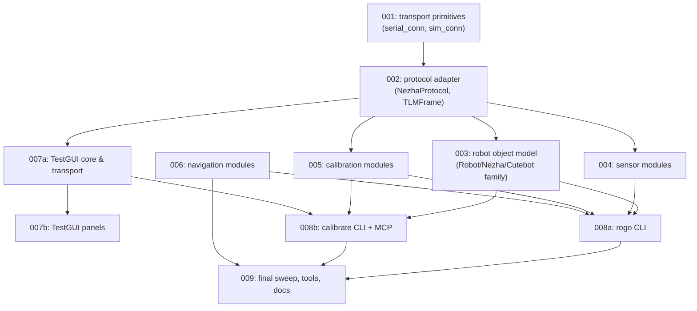
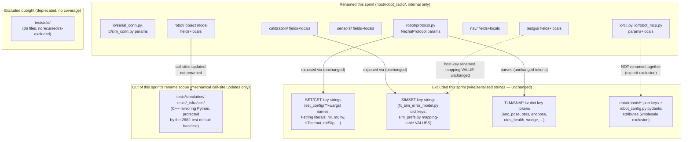

<!-- CLASI: Before changing code or making plans, review the SE process in CLAUDE.md -->

# Architecture Update — Sprint 076: Remove units from identifier names — host Python (codebase-wide rename, wire keys stable)

## Sprint Changes Summary

Strip physical-unit suffixes (`_mm`, `_mms`, `_deg`, `_dps`, `_ms`, `_us`,
`_pct`, `_hz`) from **host Python identifiers** in `host/robot_radio/` (the
importable package), its three top-level sibling scripts (`host/
calibrate_linear.py`, `calibrate_angular.py`, `calibrate_verify.py`), and
the host-side tools/tests that reference it — replacing the unit with a
standard leading `# [unit]` comment tag, per the convention 071 documented
in `docs/coding-standards.md` and explicitly deferred applying to `host/`
until this sprint. This closes the second and larger half of issue
`remove-units-from-identifier-names.md`, split at sprint 071 into a
firmware half (071, done) and this host-Python half.

**No behavioral change; no wire-format change; no config-file-format
change.** The full pre-existing test baseline (**2682 passed, 0 failed,
34.61s** for the default `uv run python -m pytest -q` run, plus **579
passed, 2 xfailed, 39.52s** for the separately-invoked `uv run python -m
pytest tests/testgui -q` — both confirmed fresh this planning pass on the
current checkout) must remain green after every ticket.

**Scale, confirmed by this pass's own grep (not the issue's estimate):**
~1470 rename-eligible occurrences across `host/robot_radio/`'s ten
subpackages with hits, ~2000 total including tests/tools, of roughly 280
unique identifiers. This is larger than the ~150-identifier firmware
surface 071 covered, consistent with 071's own Decision 1 prediction.

**The second deliverable of this sprint is closing a governance loop 071
opened**: `docs/coding-standards.md`'s Python convention section, written
by 071 as a forward reference explicitly "not yet applied to any `host/`
file," is applied here for the first time — and its own worked example
(`read_ms` → `read_timeout # [ms]`) turns out to name the single most
pervasive rename in this sprint (216 keyword call sites, counted directly),
so ticket 001/002's implementer inherits that name rather than choosing a
new one.

---

## Step 1: Understand the Problem

**What changes:** ~280 unique Python identifiers — module-level functions,
methods, parameters, dataclass fields, locals, and a small number of
host-internal dict keys — lose their unit suffix and gain a leading `#
[unit]` comment, across `host/robot_radio/`'s `robot/`, `io/`,
`calibration/`, `nav/`, `testgui/`, `sensors/`, `media/`, `kinematics/`,
`testkit/` subpackages (`config/` is excluded wholesale — see Step 1's
codebase-alignment reading and the Exclusion Table), three top-level
`host/*.py` scripts, and the host-side tool/test trees that call into all
of the above.

**What does not change:** any `SET`/`GET`/`SIMSET`/`SIMGET` wire key
string; any `TLM`/`SNAP` field-name token; any `data/robots/*.json` key or
`config/robot_config.py` pydantic attribute name; the `extern "C"` ctypes
ABI `io/sim_conn.py` calls into (already unit-free per 071, confirmed
unchanged this pass); `docs/coding-standards.md`'s already-written
convention text itself (only its "not yet applied" status line changes).
Sprints 067–075 are preserved verbatim — this sprint touches Python
*names*, never behavior.

**Why now:** this is the recommended, and now finally scheduled, second
half of the split 071 proposed in its own Decision 1 and Open Question 1.
Five feature sprints (072–075) intervened; none touched this scope
(confirmed: none of those sprints' architecture docs mention a Python
identifier rename or `docs/coding-standards.md`). This sprint is explicitly
framed by the team-lead as "the finish line" for the units-rename arc.

**Codebase-alignment reading done this pass (not just the issue text or
071's document):**

- **Full re-read of `docs/coding-standards.md`** (161 lines): the Python
  convention section already exists, already gives the exact target name
  for `read_ms` (`read_timeout`), already states the wire/serialized
  exclusion rule and the external/vendor-function exclusion — this sprint
  adds no new convention, it only *applies* an existing one. Confirmed the
  "not yet applied to any `host/` file" sentence needs a one-line update at
  sprint close (ticket 009).
- **Full re-read of 071's `architecture-update.md`'s Exclusion Table,
  Decisions 1/2/6, and Open Question 1** — the authoritative source for
  which wire surfaces are already known to be unit-free (`ConfigRegistry`
  keys, `SimCommands` keys, `TLM` tokens) and which host surface was
  explicitly deferred (the whole per-robot JSON/pydantic schema). This
  pass's own reading reconfirms both findings hold unchanged on the current
  checkout — no drift since 071.
- **Per-subpackage grep census** (`grep -rEo '\b[a-zA-Z_][a-zA-Z0-9_]*_(mm|
  mms|deg|dps|ms|us|pct|hz)\b'`) across every `host/robot_radio/*/` and
  every `tests/*/` directory, then a per-file breakdown of the ten
  subpackages with nonzero hits — the basis for Step 2's responsibility
  table and Step 3's ticket sizing (exact counts below; `controllers/`,
  `field/`, `path/` have **zero** hits and need no ticket).
- **`pyproject.toml`'s `[tool.pytest.ini_options]` read in full**: `testpaths
  = ["tests/simulation"]` — the default `uv run python -m pytest` invocation
  collects **only** `tests/simulation/`. `tests/testgui/` (24 files, 579
  tests) is not collected by that invocation at all (not merely
  norecursedirs-skipped — it is outside `testpaths`) and must be run with an
  explicit `pytest tests/testgui -q`. `tests/bench/`, `tests/field/`,
  `tests/_infra/calibrate/`, `tests/_infra/tools/` are explicitly
  `norecursedirs`-excluded (opt-in, hardware/camera-dependent scripts, not
  `test_*.py` files pytest would collect anyway — confirmed by
  `--collect-only` returning "no tests collected" for both `tests/bench` and
  `tests/field`). This is the single most important structural fact this
  sprint's plan depends on: **two different automated safety nets exist
  (2682-test default, 579-test testgui), and everything else (bench/field/
  calibrate/tools/top-level `host/*.py` scripts) has *no* automated net at
  all** — a missed rename or call-site update there is a silent `TypeError`
  waiting for the next manual/HITL run, not a CI failure.
- **`host/robot_radio/robot/protocol.py` read in full** (1082 lines):
  `TLMFrame`'s dataclass fields (`enc`, `pose`, `vel`, `twist`, `otos`,
  `line`, `color`, `ekf_rej`, `wedge`, `encpose`, `otos_health`, `t`, `mode`,
  `seq`) are **already unit-free** — confirmed directly, nothing to rename
  in the dataclass itself. `parse_tlm`'s `kv` dict lookups use the identical
  strings as literal keys (`"enc"`, `"pose"`, etc.) — these are wire tokens,
  excluded. Every method parameter (`read_ms`, `speed_mms`, `radius_mm`,
  `v_mms`, `omega_mrads`, `left_mms`, `right_mms`, `x_mm`, `y_mm`,
  `heading_cdeg`, `eps_cdeg`, `period_ms`, `watchdog_ms`, `h_cdeg`,
  `timeout_ms`, `duration_ms`) is unit-suffixed and renamable — none of
  these appear on the wire (commands are built positionally via f-strings,
  e.g. `f"R {speed_mms} {radius_mm}"` — the parameter *name* never reaches
  the robot, only its *value*, in position).
- **`set_config(**kwargs)` call sites grepped repo-wide**: every call
  (`set_config(sTimeout=500)`, `set_config(ml=..., mr=...)`,
  `set_config(turnGate=35, ...)`) passes an **already unit-free** wire key
  as the Python keyword-argument name — confirmed none of this sprint's
  target identifiers collide with a live `set_config(**kwargs)` call site.
  This is the host-side analogue of 071's `minWheelMms` spot-check; this
  pass found no host-side collision case at all (071's one exception,
  `minWheelMms`, never appears as a `set_config(**kwargs)` call — it is only
  read via `getattr(ctrl, "min_wheel_mms", None)` in `io/cli.py`, itself
  already excluded as a pydantic attribute).
- **`host/robot_radio/config/robot_config.py` read in full** (564 lines):
  confirms 071's finding still holds verbatim — 13 pydantic `BaseModel`
  classes, zero `Field(alias=...)` anywhere, every JSON key **is** the bare
  Python attribute name. This pass's own grep found 28 raw unit-suffix hits
  in this one file; tracing each individually found **zero** are
  non-pydantic renamable identifiers — all 28 are pydantic field names,
  their local-variable mirrors inside `_resolve_encoder_fields`
  (`w.ticks_per_mm`, `w.wheel_diameter_mm`), or docstring prose (`"actual_deg
  = gain × commanded + offset"` — a formula description, not an
  identifier). **`config/` needs a ticket only to confirm and document this
  exclusion, not to rename anything.**
- **`host/robot_radio/testgui/sim_prefs.py` read (relevant sections)**:
  found a **host-internal two-layer key structure** this sprint must handle
  carefully — `DEFAULT_PROFILE["trackwidth_mm"]` (a host-side profile dict
  keyed by a unit-suffixed string) is mapped through an explicit table
  (`{"trackwidth_mm": "trackwidthMm", ...}`) to the real `SIMSET` wire key.
  The host-side key (`"trackwidth_mm"` — a *convenience* string, not itself
  wire-visible) **is renamable**; the mapping table's *value*
  (`"trackwidthMm"`, the actual wire key) **is not**. This is structurally
  identical to `ConfigRegistry.cpp`'s two-independent-literals pattern
  071 relied on (Decision 2), now confirmed to also exist on the host side.
  `calibration/fit_sim_error_model.py`'s `SIMSET_BOUNDS`/
  `DEFAULT_CANDIDATE_KEYS` dicts use the wire key directly as their own dict
  key (`"trackwidthMm"`, no intermediate host-side alias) — a simpler,
  single-layer case; both patterns are documented in the Exclusion Table
  below so ticket 004/006 implementers don't conflate them.
- **`read_ms=` keyword-call-site census, repo-wide**: **216** occurrences
  across 34 files — `host/robot_radio/` (9 files, 62 sites),
  `tests/simulation/` (6 files, 65 sites — protected by the 2682 default
  baseline), `tests/bench/` (7 files, 38 sites — **no** automated
  protection), `tests/testgui/` (4 files, 18 sites — protected by the
  separate 579-test invocation), `tests/old/` (4 files, 6 sites — excluded,
  see Decision 3), `tests/_infra/calibrate/` (1 site). This single
  identifier's spread across nearly every ticket's file set is why cross-
  cutting rename discipline (Decision 2) is this sprint's central technical
  risk, not any one subpackage's internal complexity.
- **Directory/file inventories**: `host/robot_radio/` has 13 subpackages;
  `controllers/`, `field/`, `path/` have zero unit-suffix hits (confirmed,
  no ticket needed). `io/preview.py`, `robot/connection.py`,
  `sensors/odometry.py`, `nav/pose.py`, `nav/pose_align.py`,
  `calibration/helpers.py` have zero hits but are imported by files that do
  — included in their consuming ticket's file set for import-consistency
  review, not because they themselves need edits.

---

## Step 2: Identify Responsibilities

| Responsibility | Owning surface | Why it changes independently |
|---|---|---|
| Send/receive the v2 wire protocol over serial or the ctypes sim transport | `io/serial_conn.py`, `io/sim_conn.py`, `io/preview.py` | Zero intra-package dependencies (confirmed by import grep) — the lowest layer; every other subpackage depends on it, none of it depends on anything else in `host/robot_radio/`. |
| Format/parse v2 protocol commands and telemetry frames | `robot/protocol.py` | Sole owner of `NezhaProtocol`, `TLMFrame`, `ParsedResponse`, `Stop`, and the module-level `parse_*` functions; depends only on `io/serial_conn.py`; the single largest concentration of unit-suffixed parameter names (125) and the sole place `read_ms`'s definition and its firmware-facing siblings live. |
| Represent and drive a connected robot (base class, concrete Nezha/Cutebot implementations, per-tick state, kinematics, clock sync, camera-fix pose sync) | `robot/robot.py`, `robot/robot_state.py`, `robot/nezha.py`, `robot/nezha_state.py`, `robot/nezha_kinematic.py`, `robot/cutebot.py`, `robot/clock_sync.py`, `robot/sync_pose.py`, `kinematics/differential_drive.py` | Sole owners of the "robot object" abstraction; all depend on `robot/protocol.py` (renamed first) and share a base-class/consumer relationship that argues for renaming together rather than leaving `Robot` and `Nezha` briefly out of sync on naming. |
| Read and classify onboard sensors (line, color, OTOS, encoder-derived odometry) from the host side | `sensors/otos.py`, `sensors/color.py`, `sensors/calibration.py`, `sensors/motion_monitor.py`, `sensors/odom_tracker.py`, `sensors/odometry.py` | Depends only on `robot/protocol.py` (via `parse_tlm`) and `io/serial_conn.py`, not on the `robot/` object-model layer — independent of Responsibility 3. |
| Push calibration values to firmware and fit the sim error model | `calibration/helpers.py`, `calibration/linear.py`, `calibration/angular.py`, `calibration/push.py`, `calibration/fit_sim_error_model.py` | Depends only on `robot/protocol.py` (`parse_tlm`, `TLMFrame`); owns the one host-side file (`fit_sim_error_model.py`) with direct `SIMSET`-key dict literals and the `sim_prefs.py`-adjacent two-layer key pattern. |
| Compute navigation/path-following commands (go-to, PurePursuit-adjacent approach math) | `nav/navigator.py`, `nav/_approach_utils.py`, `nav/camera_goto.py`, `nav/nav_params.py`, `nav/pose.py` (unaffected) | `camera_goto.py` has **zero** `robot_radio` imports (pure math, duck-typed robot argument) — independent of every other subsystem's rename order; `navigator.py` depends on `controllers/pid.py` (zero hits) and its own `nav/` siblings only. |
| Present the desktop operator UI (session controls, canvas, telemetry traces, sim-error panel, recording) | `testgui/__main__.py`, `testgui/transport.py`, `testgui/commands.py`, `testgui/drive.py`, `testgui/sim_prefs.py`, `testgui/traces.py`, `testgui/operations.py`, `testgui/canvas.py`, plus `testgui/camera_prefs.py`/`live_view.py`/`recorder.py` (few/no direct hits but same review surface) | Depends on `io/serial_conn.py` and `robot/protocol.py` only (via `testgui/transport.py`) — not on the `robot/` object model, `sensors/`, `calibration/`, or `nav/` layers; the largest single subpackage by file count (32 files including its 24-file test tree) and the only one carrying the host-side wire-key mapping-table pattern (`sim_prefs.py`). |
| Expose the `rogo` CLI and the `robot_mcp` agent-facing tool surface | `io/cli.py`, `io/calibrate.py`, `io/robot_mcp.py`, `media/movie.py` | The top of the host dependency graph — imports from `robot/` (incl. `Cutebot`), `sensors/color.py`, `config/robot_config.py`, `calibration/helpers.py`, `nav/camera_goto.py`, `media/movie.py`; must be renamed last among the "real" subpackages since it consumes nearly everything else. |
| Load and validate per-robot configuration from JSON | `config/robot_config.py` | Explicitly excluded wholesale (Exclusion Table) — a "responsibility" here only in the sense that its exclusion must be confirmed and documented, not that any code changes. |
| Certify zero residual unit-suffixed identifiers and update out-of-package callers with no automated safety net | Repo-wide `grep` acceptance check; `host/*.py` (3 top-level scripts); `tests/bench/`, `tests/field/`, `tests/_infra/calibrate/`, `tests/_infra/tools/`; `testkit/*`; `docs/coding-standards.md`'s status line | These share no owning subpackage — their common trait is "consumes renamed names but has no CI gate," so a dedicated closing pass is the only way to catch a stale keyword-argument call site before it reaches hardware. |

No responsibility spans more than one row's file set except the shared
dependency on `robot/protocol.py` (Responsibility 2), which every later
responsibility reads but none re-implements — intentional fan-in, not a new
coupling this sprint introduces (identical in shape to 071's own
`RobotConfig` fan-in observation).

---

## Step 3: Subsystems and Modules — Planned Ticket Sequence

Per the team-lead's brief, this pass **stops before creating ticket files**
(Detail Mode planning-docs → architecture-review only). The table below is
the planned sequence a subsequent ticketing pass will execute verbatim
against; numbers are provisional ticket IDs, not yet-created files.

| Ticket (planned) | Purpose (one sentence, no "and") | Boundary | Occurrences | Use cases served |
|---|---|---|---|---|
| **001 — Transport primitives** | Renames unit-suffixed parameters in the serial and ctypes-sim transport layer. | Inside: `io/serial_conn.py`, `io/sim_conn.py`, `io/preview.py` (confirm-clean). Outside: any `extern "C"` ABI function name (already unit-free, untouched). | 48 (16+32) | SUC-001 |
| **002 — Wire-protocol adapter** | Renames unit-suffixed parameters in `NezhaProtocol`/`TLMFrame`/parsing, keeping every wire token and `kv`-key string unchanged. | Inside: `robot/protocol.py`. Outside: `TLMFrame` dataclass field names (already unit-free — no rename needed), any `kv` dict-key string literal. | 125 | SUC-001 |
| **003 — Robot object model** | Renames unit-suffixed identifiers in the base/concrete robot classes, their state, kinematics, and clock/pose sync. | Inside: `robot/robot.py`, `robot/robot_state.py`, `robot/nezha.py`, `robot/nezha_state.py`, `robot/nezha_kinematic.py`, `robot/cutebot.py`, `robot/clock_sync.py`, `robot/sync_pose.py`, `kinematics/differential_drive.py`. Outside: `robot/protocol.py` (002's concern, consumed not re-renamed), `robot/connection.py` (already clean). | 328 (320+8) | SUC-002 |
| **004 — Sensor modules** | Renames unit-suffixed identifiers in host-side sensor reading and classification. | Inside: `sensors/otos.py`, `sensors/color.py`, `sensors/calibration.py`, `sensors/motion_monitor.py`, `sensors/odom_tracker.py`. Outside: `sensors/odometry.py` (already clean), `robot/protocol.py` (consumed, not re-renamed). | 121 | SUC-003 |
| **005 — Calibration modules** | Renames unit-suffixed identifiers in calibration workflows, preserving every `SET`/`SIMSET` wire-key literal. | Inside: `calibration/helpers.py` (already clean but reviewed), `calibration/linear.py`, `calibration/angular.py`, `calibration/push.py`, `calibration/fit_sim_error_model.py`. Outside: any `SET`/`SIMSET` key string (Exclusion Table); `set_config(**kwargs)` call-site keyword names. | 175 | SUC-004 |
| **006 — Navigation modules** | Renames unit-suffixed identifiers in go-to and path-approach math. | Inside: `nav/navigator.py`, `nav/_approach_utils.py`, `nav/camera_goto.py`, `nav/nav_params.py`. Outside: `nav/pose.py`, `nav/pose_align.py` (already clean), `controllers/pid.py` (already clean). | 163 | SUC-005 |
| **007a — TestGUI core & transport** | Renames unit-suffixed identifiers in the app entry point, connection/transport bridge, and command dispatch. | Inside: `testgui/__main__.py`, `testgui/transport.py`, `testgui/commands.py`, `testgui/drive.py`, and their matching subset of `tests/testgui/*.py` (transport/connection/command/mode/relay/telemetry/smoke tests). Outside: `robot/protocol.py`, `io/serial_conn.py` (consumed, not re-renamed). | 96 (host) + a `tests/testgui` share | SUC-006 |
| **007b — TestGUI panels & recording** | Renames unit-suffixed identifiers in the sim-error/traces/canvas panels and recording/camera-preview glue. | Inside: `testgui/sim_prefs.py`, `testgui/traces.py`, `testgui/operations.py`, `testgui/canvas.py`, `testgui/camera_prefs.py`, `testgui/live_view.py`, `testgui/recorder.py`, and the remaining `tests/testgui/*.py` (sim-errors/traces/canvas/camera/tour/recorder tests). Outside: `007a`'s files (consumed via shared app state, not re-renamed here). | 49 (host) + a `tests/testgui` share | SUC-006 |
| **008a — `rogo` CLI** | Renames unit-suffixed identifiers in the `rogo` console-script entry point. | Inside: `io/cli.py` — the single largest file in this sprint's scope. Outside: every subpackage it imports from (003–006, already renamed by this point). | 170 | SUC-007 |
| **008b — Calibration CLI & MCP surface** | Renames unit-suffixed identifiers in the interactive calibration wizard and the agent-facing MCP tool surface. | Inside: `io/calibrate.py`, `io/robot_mcp.py`, `media/movie.py`. Outside: same upstream subpackages as 008a. | 165 (126+31+8) | SUC-007 |
| **009 — Final sweep, host tools, config confirmation, and docs** | Certifies zero residual unit-suffixed identifiers repo-wide and updates every out-of-package caller with no automated safety net. | Inside: `host/calibrate_linear.py`, `host/calibrate_angular.py`, `host/calibrate_verify.py`, `testkit/*` (2 hits), `tests/bench/*.py`, `tests/field/*.py`, `tests/_infra/calibrate/*.py`, `tests/_infra/tools/*.py`, `config/robot_config.py` (confirm-only, zero renames expected), `docs/coding-standards.md`'s status line. Outside: `tests/old/` (Decision 3, excluded), `tests/simulation/`/`tests/_infra/sim/` (Decision 1, mechanical call-site updates only, protected by the 2682 baseline). | 7 direct + a large out-of-package keyword-call-site sweep | SUC-008, SUC-009 |

**Sizing flag (mirrors 071's own Open Question 2 precedent):** ticket 003
(328 occurrences, 9 files) and the 008a/165+170 pair are this sprint's
largest single units of work — comparable in scale to 071's own
largest ticket (002, the `RobotConfig` four-file chain). Both are justified
by a genuine shared-base-class or shared-caller-surface coupling (Step 2),
not by convenience grouping; Open Question 2 flags 003 for the ticketing
pass to size-check and, if unreviewable, split along the `robot.py`/
`nezha*.py` (base + differential-drive family) vs. `cutebot.py` (secondary
implementation) seam.

Every ticket addresses at least one SUC; every SUC is covered by at least
one ticket; `controllers/`, `field/`, `path/` need no ticket (zero hits,
confirmed).

---

## Step 4: Diagrams

### 4a. Ticket dependency graph

No cycles. `001` is the sole root. `002` is the widest immediate fan-out (4
dependents: 003/004/005/007a) — expected, since `robot/protocol.py` is read
by nearly every higher subpackage (identical in shape to 071's `RobotConfig`
fan-out observation). `008a`/`008b` are the narrowest sinks before the
closing `009` sweep, reflecting `io/cli.py`/`io/robot_mcp.py`'s
top-of-dependency-graph position (Step 1, Step 2).

### 4b. Wire-boundary component diagram — renamed vs. excluded

No cycles. Every renamed box has an outbound edge to an unchanged
wire-string box or an "update, don't rename" edge to the excluded-domain
test tree — nothing downstream of a wire key, JSON key, or the excluded
test domain depends on the Python identifier that happens to resemble it.

No entity-relationship diagram is included — no data model or persisted
schema changes shape this sprint (Migration Concerns).

---

## Wire-Compatibility Exclusion Table

Restated and extended from 071's table (same methodology: default to
exclude a wire/serialized string, state why per row) for the host-Python
surfaces this pass's own reading found.

| Wire/serialized/excluded surface | Location | Disposition | Rationale |
|---|---|---|---|
| Every `SET`/`GET` wire key string 071 already confirmed unit-free (`tw`, `ml`, `mr`, `sTimeout`, `turnGate`, `yawRateMax`, `vel.kP/kI/kFF/iMax/kAw/filt`, `sync`, `minWheelMms`, `odomOffX/Y`, `odomYaw`, `rotSlip`) | `calibration/push.py`, `io/cli.py`, `robot/protocol.py`'s `set_config(**kwargs)` call sites, and any f-string command builder | **EXCLUDE.** Confirmed already unit-free by 071; this pass re-confirmed no host call site collides. Nothing to rename in the key text itself; only the surrounding Python variable/parameter names that hold the *value* are renamed. |
| `set_config(**kwargs)` **keyword-argument names at call sites** (e.g. `set_config(sTimeout=500)`) | Any caller of `NezhaProtocol.set_config` | **EXCLUDE the kwarg name; it IS the wire key at that call site** — a host-Python-specific pattern with no 071 precedent (C++ has no equivalent caller-side named-parameter binding). Renaming a `set_config(**kwargs)` call's keyword would silently change what `SET` key is sent. This pass found zero cases where the kwarg name is itself unit-suffixed pre-rename, but every ticket touching a `set_config` call site must re-verify this before editing. |
| `SIMSET_BOUNDS`, `DEFAULT_CANDIDATE_KEYS`, and step-size dict keys (e.g. `"trackwidthMm"`) | `calibration/fit_sim_error_model.py` | **EXCLUDE.** Direct wire-key-as-dict-key, single layer, matches `SimCommands.cpp`'s `kSimRegistry[]` string literals verbatim. |
| `DEFAULT_PROFILE`'s host-internal keys (e.g. `"trackwidth_mm"`) | `testgui/sim_prefs.py` | **RENAME the host-internal key; EXCLUDE the mapping table's VALUE.** A two-layer pattern unique to this file: the host-side dict key is a *convenience* string used only within `sim_prefs.py` and its own tests, mapped through an explicit `{host_key: wire_key}` table to the real `SIMSET` key. Renaming the host-side key (e.g. `"trackwidth_mm"` → `"trackwidth"`) is safe and in-scope; the table's right-hand-side value (`"trackwidthMm"`) is the wire key and stays exactly as-is. Flagged explicitly for ticket 007b's implementer — the file's own docstrings already spell out this distinction (`trackwidthMm` vs. `trackwidth_mm` are referenced by name in adjacent comments), so care is needed not to conflate the two spellings while renaming. |
| `TLM`/`SNAP` `kv`-dict key-lookup strings (`"t"`, `"mode"`, `"seq"`, `"enc"`, `"pose"`, `"encpose"`, `"vel"`, `"twist"`, `"otos"`, `"line"`, `"color"`, `"ekf_rej"`, `"otos_health"`, `"wedge"`) | `robot/protocol.py`'s `parse_tlm`/`parse_response` | **EXCLUDE — no-op.** `TLMFrame`'s own dataclass field names are already unit-free (confirmed by direct read); there is nothing to rename here at all, only to leave alone. |
| `data/robots/*.json` keys and `config/robot_config.py`'s 13 pydantic model classes (all fields, including `RobotConfig`'s convenience flat-accessor `@property` methods that proxy a nested field 1:1, e.g. `tag_offset_mm`, `gripper_offset_mm`) | `config/robot_config.py`, `data/robots/*.json`, `robot_config.schema.json` | **EXCLUDE (whole surface), reaffirming 071 Decision 6.** No `Field(alias=...)` anywhere — the Python attribute name **is** the JSON key. This pass additionally excludes the flat-accessor properties (not themselves JSON keys, but proxies of one) to avoid a confusing split where `cfg.vision.tag_offset_mm` and `cfg.tag_offset_mm` (the flattening property) would carry different names for the same value. |
| `extern "C"` ctypes ABI function names `io/sim_conn.py` calls | `io/sim_conn.py` | **NOT AN EXCLUSION — already unit-free**, reaffirming 071's own finding. Only `sim_conn.py`'s own Python-side parameter/local names (in ticket 001) are renamed. |
| `tests/simulation/`, `tests/_infra/sim/` internal identifiers that mirror *firmware* C++ names (e.g. `test_motion_command.py`'s pure-Python `MotionBaseline`/`HardwareState` mock classes using `t0Ms`, `encLMm`, `sTimeoutMs`) | `tests/simulation/unit/*.py` | **OUT OF SCOPE, not excluded-as-wire — a domain boundary, not a wire boundary.** These are self-contained Python reimplementations of *firmware* logic (071's domain), independent of `host/robot_radio`'s own naming; renaming them is neither required by this issue's "host Python" framing nor safe to slip in unreviewed. Where such a file *also* imports `robot_radio` and calls a renamed function with a keyword argument, that call site is updated (Decision 1), but the file's own internal mock-class field names are not touched. |
| `tests/old/` (36 files, 145 occurrences) | `tests/old/` | **EXCLUDED OUTRIGHT (Decision 3)** — deprecated, `norecursedirs`-excluded, zero automated coverage, superseded by the 038 test-tier reorganization. Not a wire/serialization concern; a scope-boundary decision. |

**Summary:** two new host-specific patterns this pass's own reading found
beyond 071's precedent — the `set_config(**kwargs)` caller-side keyword
binding (a Python-only risk with no C++ analogue) and `sim_prefs.py`'s
two-layer host-key/wire-key mapping table — both fully resolved above with
a concrete disposition, mirroring 071's "verify, don't assume" methodology
applied to the host's own idioms rather than re-using firmware's.

---

## Comment Convention

Already fully specified by 071 in `docs/coding-standards.md`'s "Python
convention (forward reference — sprint 072)" section — this sprint applies
it verbatim, with one required edit: the section's own "not yet applied to
any `host/` file... sprint 072 is the sprint that will apply it" language
is updated (ticket 009) to reflect that this sprint (076, not 072 — the
work slipped five sprints per the roadmap) is the one that did.

No new convention content is introduced. The worked example already given
(`def send(self, cmd: str, read_ms: int = 500) -> dict: ...` → `def
send(self, cmd: str, read_timeout: int = 500) -> dict:  # [ms]`) is this
sprint's single highest-leverage rename — see Decision 2.

---

## Step 5: What Changed / Why / Impact / Migration

### What Changed (by planned ticket)

**001 — Transport primitives:** `io/serial_conn.py`'s `SerialConnection.send`
(and siblings) rename `read_ms` → `read_timeout` `# [ms]` (the
coding-standards worked example, applied at its point of origin);
`io/sim_conn.py`'s ctypes-wrapper parameter names renamed to match. Every
in-repo call site of `SerialConnection.send(..., read_ms=...)` and
`.send(cmd, read_ms)` updated in the same ticket (this file's own
definition is the rename's origin point — every other ticket inherits the
name, per Decision 2).

**002 — Wire-protocol adapter:** `robot/protocol.py`'s `NezhaProtocol`
re-exposes and re-renames its own `read_ms` parameters (`send`, `ping`,
`echo`, `get_id`, `get_ver`, `get_help`, `get_config`, `set_config`,
`timed`, `distance`, `go_to`, `turn`, `grip`, OTOS/J-port helpers) to
`read_timeout`; `arc`/`vw`/`drive`/`timed`/`distance`/`go_to`/`turn`'s
`speed_mms`/`radius_mm`/`v_mms`/`omega_mrads`/`left_mms`/`right_mms`/
`x_mm`/`y_mm`/`heading_cdeg`/`eps_cdeg` renamed to their bare quantity name
with a `# [unit]` comment (e.g. `speed_mms` → `speed  # [mm/s]`);
`stream`/`stream_drive`'s `period_ms`/`watchdog_ms`/`duration_ms` likewise.
`Stop`'s classmethod parameters (`ms`, `mm`, `cdeg`, `eps_cdeg`, `arc_mm`)
renamed with `# [unit]` tags. `TLMFrame`'s fields and `parse_tlm`'s `kv`-key
lookups are **not** touched (already unit-free — Step 1).

**003 — Robot object model:** `robot/nezha.py`/`nezha_state.py`
(`x_mm`/`y_mm` → `x`/`y  # [mm]`, `period_ms` → `period  # [ms]`,
`left_mms`/`right_mms` → per-wheel bare names), `robot/cutebot.py`
(`r_deg`/`l_deg` → `right`/`left  # [deg]`, mirroring `nezha.py`'s own
per-wheel naming for consistency across the two concrete implementations),
`robot/clock_sync.py` (`t_robot_ms`/`t0_ms`/`t1_ms` → `t_robot`/`t0`/`t1  #
[ms]`), `robot/nezha_kinematic.py` (renamed to match
`kinematics/differential_drive.py`'s own renamed parameters).

**004 — Sensor modules:** `sensors/odom_tracker.py`
(`x_mm`/`y_mm`/`trackwidth_mm` → bare + `# [mm]`), `sensors/otos.py`,
`sensors/color.py` (`h_deg` → `hue  # [deg]`, `brightness_pct` → `brightness
# [%]`), `sensors/calibration.py`, `sensors/motion_monitor.py`.

**005 — Calibration modules:** `calibration/angular.py`
(`target_deg`/`otos_deg`/`gt_deg`/`cam_deg`/`achieved_deg` → bare + `#
[deg]`), `calibration/linear.py` (`actual_mm`/`otos_x_mm` → bare + `#
[mm]`), `calibration/fit_sim_error_model.py` (`total_ms`/`sample_period_ms`
→ bare + `# [ms]`; `SIMSET_BOUNDS`/`DEFAULT_CANDIDATE_KEYS` dict-key
*strings* untouched per the Exclusion Table), `calibration/push.py`
(`left_mm_per_deg`/`right_mm_per_deg` → `wheel_travel_calib_left/right  #
[mm/deg]`, mirroring 071's own `wheelTravelCalibL/R` derived-unit-name
choice on the firmware side, for cross-language naming symmetry — not
required, but recommended for the ticket implementer).

**006 — Navigation modules:** `nav/navigator.py`
(`tolerance_mm`/`speed_mms` → bare + `# [unit]`), `nav/_approach_utils.py`
(`r_mm` → `radius  # [mm]`), `nav/camera_goto.py` (`target_mm` → `target #
[mm]`), `nav/nav_params.py`.

**007a — TestGUI core & transport:** `testgui/__main__.py`,
`testgui/transport.py` (`read_ms` → `read_timeout`, `encoder_noise_mm` →
`encoder_noise # [mm]`), `testgui/commands.py`, `testgui/drive.py`; matching
`tests/testgui/*.py` files updated in the same ticket (this test tree is
**not** covered by the default 2682-test baseline — the ticket's own
acceptance criteria must include an explicit `uv run python -m pytest
tests/testgui -q` run).

**007b — TestGUI panels & recording:** `testgui/sim_prefs.py`
(`trackwidth_mm` host-internal key → `trackwidth`, mapping-table *value*
`"trackwidthMm"` untouched), `testgui/traces.py`, `testgui/operations.py`
(`rotation_deg` → `rotation  # [deg]`), `testgui/canvas.py`; matching
`tests/testgui/*.py` files.

**008a — `rogo` CLI:** `io/cli.py` (`read_ms` → `read_timeout`,
`left_mm_per_deg`/`right_mm_per_deg` → matching 005's calibration naming,
`watchdog_ms`/`resend_ms`/`t_ms` → bare + `# [ms]`, `x_mm`/`y_mm`/`h_deg`/
`angle_deg` → bare + `# [unit]`). Wire-key literals it builds (e.g. the
`("minWheelMms", getattr(ctrl, "min_wheel_mms", None))` pairing) are
untouched — both halves of that pairing are already-excluded surfaces
(wire key, pydantic attribute).

**008b — Calibration CLI & MCP surface:** `io/calibrate.py`,
`io/robot_mcp.py`, `media/movie.py` (`min_interval_ms` → `min_interval  #
[ms]`).

**009 — Final sweep, host tools, config confirmation, docs:**
`host/calibrate_linear.py`, `host/calibrate_angular.py`,
`host/calibrate_verify.py` (5 occurrences); `testkit/*` (2 occurrences);
`tests/bench/*.py` (214 occurrences, 22 files — **no automated
protection**, every keyword-argument call site of every renamed
function/method updated here since bench scripts weren't touched by
001–008a/b's own file-scoped edits); `tests/field/*.py` (22 occurrences, 4
files); `tests/_infra/calibrate/*.py` (115 occurrences, 10 files);
`tests/_infra/tools/*.py` (10 occurrences, 2 files); `config/
robot_config.py` (confirm-only — this ticket's acceptance criteria include
a `git diff` showing zero changes to this file, not a rename); a final
repo-wide `grep -rniE "\b[a-z_][a-z0-9_]*_(mm|mms|deg|dps|ms|us|pct|hz)\b"
host/ tests/` (excluding `tests/old/`, `tests/simulation/`,
`tests/_infra/sim/`, and this document's own historical prose) returning
**zero** results outside documented exclusions; `docs/coding-standards.md`'s
status-line update.

### Why

- Tickets 001/002 exist first because every later ticket's file set
  imports `io/serial_conn.py` and/or `robot/protocol.py` — renaming the
  origin point of `read_ms`/`speed_mms`/etc. first means every subsequent
  ticket inherits an already-decided target name instead of each
  implementer choosing independently (Decision 2).
- Ticket 003 is one ticket, not several, because `robot.py`/`nezha*.py`/
  `cutebot.py` share a base-class/consumer relationship (Step 2) — splitting
  it would leave `Robot` and one concrete subclass transiently
  inconsistent in naming for no benefit, since both subclasses import the
  same renamed `robot/protocol.py` regardless of ticket boundary.
- Tickets 004/005/006 are mutually independent (each depends only on 002,
  not on each other or on 003 — confirmed by import grep, Step 1) and are
  ordered sequentially only because tickets execute serially in this
  project (071's own precedent for its 006/007 ordering).
- 007a precedes 007b because `transport.py` (007a) is imported by nothing
  in `sim_prefs.py`/`traces.py`/`canvas.py` (007b), but both live in the
  same PySide6 application and share enough incidental state
  (`testgui/__main__.py` wires both together) that keeping them adjacent in
  the sequence, rather than interleaved with unrelated subpackages, reduces
  review context-switching.
- 008a/008b are ordered after every subpackage they import from (003–006)
  specifically because `io/cli.py` and `io/robot_mcp.py` are the top of the
  host dependency graph (Step 1/2) — renaming them first would mean
  renaming call sites into not-yet-renamed functions, guaranteeing an
  immediate break.
- 009 exists because the issue's own acceptance criteria are phrased as a
  whole-codebase invariant that only a final, whole-tree grep can certify,
  and because five directories (`tests/bench/`, `tests/field/`,
  `tests/_infra/calibrate/`, `tests/_infra/tools/`, top-level `host/*.py`)
  have zero automated coverage and would otherwise silently accumulate
  stale keyword-argument call sites across the whole sprint.

### Impact on Existing Components

| Component | Impact |
|---|---|
| `io/serial_conn.py`, `io/sim_conn.py`, `io/preview.py` | **Modified** (001). Parameter names only; ctypes ABI, ports, and buffering logic unchanged. |
| `robot/protocol.py` | **Modified** (002). Parameter names only; `TLMFrame` fields, wire command formatting, and `kv`-key parsing byte-identical. |
| `robot/robot.py`, `robot_state.py`, `nezha.py`, `nezha_state.py`, `nezha_kinematic.py`, `cutebot.py`, `clock_sync.py`, `sync_pose.py`, `kinematics/differential_drive.py` | **Modified** (003). Identifiers only; no algorithm change. |
| `sensors/otos.py`, `color.py`, `calibration.py`, `motion_monitor.py`, `odom_tracker.py` | **Modified** (004). Identifiers only. |
| `calibration/helpers.py`, `linear.py`, `angular.py`, `push.py`, `fit_sim_error_model.py` | **Modified** (005, except `helpers.py` which is reviewed but already clean). `SET`/`SIMSET` key strings unchanged. |
| `nav/navigator.py`, `_approach_utils.py`, `camera_goto.py`, `nav_params.py` | **Modified** (006). Identifiers only. |
| `testgui/*.py` (8 files with hits) and `tests/testgui/*.py` (24 files) | **Modified** (007a/007b). `sim_prefs.py`'s `SIMSET` mapping-table values unchanged. |
| `io/cli.py`, `io/calibrate.py`, `io/robot_mcp.py`, `media/movie.py` | **Modified** (008a/008b). Identifiers only; CLI/MCP output formatting unchanged. |
| `config/robot_config.py`, `data/robots/*.json`, `robot_config.schema.json` | **Unaffected** (Exclusion Table) — explicitly excluded, confirmed by direct full read this pass. |
| `host/calibrate_linear.py`, `calibrate_angular.py`, `calibrate_verify.py`, `testkit/*` | **Modified** (009). Small, mechanical. |
| `tests/bench/*.py`, `tests/field/*.py`, `tests/_infra/calibrate/*.py`, `tests/_infra/tools/*.py` | **Modified** (009). Call-site keyword-argument updates (and, per the issue's "host-side tools/scripts" framing, their own local identifiers too) — **no automated test protects these**; manual/HITL verification only. |
| `tests/simulation/`, `tests/_infra/sim/` | **Modified only where they import `robot_radio` and call a renamed function/method with a keyword argument** (37 and 11 files respectively) — a mechanical consequence, not host-Python cleanup (Decision 1); protected by the 2682-test default baseline. |
| `tests/old/` | **Unaffected** — explicitly out of scope (Decision 3). |
| `docs/coding-standards.md` | **Modified** (009, one status-line edit). No convention-text change. |
| `docs/protocol-v2.md`, `docs/architecture.md`, `docs/overview.md` | **Unaffected** — this pass found no host-Python identifier quoted by name in these firmware-focused prose docs (unlike 071, which found five such docs on the C++ side). |

### Migration Concerns

- **No wire-protocol change of any kind.** Every `SET`/`GET`/`SIMSET`/
  `SIMGET`/`STREAM`/`TLM`/`SNAP` byte is identical before and after this
  sprint (Exclusion Table, per-surface audit).
- **No data/schema migration.** `data/robots/*.json` and
  `robot_config.schema.json` are untouched (Exclusion Table, reaffirmed
  Decision 6-equivalent above).
- **No automated-test regression tolerance.** Both baselines
  (`uv run python -m pytest -q` → 2682 passed; `uv run python -m pytest
  tests/testgui -q` → 579 passed, 2 xfailed) must hold after every ticket,
  not just at sprint close — each ticket's own acceptance criteria must
  name the exact invocation(s) relevant to the files it touches (a ticket
  touching only `testgui/` still must not regress the default 2682 baseline,
  since `tests/testgui/conftest.py` inserts `host/` onto `sys.path` and a
  break there could theoretically ripple, though no current cross-import
  from `tests/simulation/` into `testgui/` was found).
- **No automated protection for `tests/bench/`, `tests/field/`,
  `tests/_infra/calibrate/`, `tests/_infra/tools/`, or top-level
  `host/*.py`.** Ticket 009's repo-wide grep is the only certification
  mechanism for these five locations; a stakeholder with hardware access
  should spot-run at least one bench script (e.g. `tests/bench/
  smoke_ritual.py`, named in the hard contract's own bench-tools acceptance
  criterion) post-sprint, since this is a Python `TypeError`-on-call risk
  that static analysis alone does not fully close out.
- **Cross-cutting rename discipline is a per-ticket obligation, not
  deferred to 009.** `read_ms` (216 keyword call sites) and every other
  identifier whose definition lives in an early ticket (001/002) but whose
  callers span many later tickets' file sets must have every call site
  *within that ticket's own file set* updated in the same ticket — 009's
  sweep exists only for the five no-coverage locations (Decision 2), not
  as a catch-all for call sites inside `host/robot_radio/` itself.
- **Deployment sequencing:** none beyond normal ticket-serial execution —
  no build/codegen step exists on the host-Python side (unlike 071's
  `gen_messages.py`/`gen_default_config.py` regeneration requirement),
  since Python has no compilation step and no generated-header analogue.

---

## Step 6: Design Rationale

### Decision 1: exclude `tests/simulation/` and `tests/_infra/sim/`'s own internal identifiers from renaming; update only their `robot_radio` call sites

**Context:** these directories contain two different kinds of files: (a)
pure-Python reimplementations of *firmware* C++ logic used as fast,
hardware-free test doubles (e.g. `test_motion_command.py`'s
`MotionBaseline`/`HardwareState` mock classes, which use camelCase names
like `t0Ms`/`encLMm`/`sTimeoutMs` mirroring the *pre-071* C++ spelling,
confirmed by direct read — these tests never call into real C++ or into
`host/robot_radio` at all), and (b) files that genuinely `import
robot_radio` and drive it against the sim library via ctypes (37 files in
`tests/simulation/`, 11 in `tests/_infra/sim/`, confirmed by grep).

**Alternatives considered:**
- *Rename category (a)'s mock-class field names too, since they're
  unit-suffixed Python identifiers and the issue's language ("host Python")
  doesn't explicitly exclude them.* Would touch ~1300 occurrences in a
  directory whose own file-header docstrings state "Pure Python mirror ...
  Tests verify ... The tests do NOT run C++ code" — these files are
  independent reimplementations, not `host/robot_radio` consumers; renaming
  them is neither required to keep `host/robot_radio`'s public API
  consistent (nothing calls into `host/robot_radio` from them) nor
  requested by the issue's own file-path scope (`host/robot_radio/`, its
  referencing tests, and host tools — these files reference *firmware*
  logic, not `host/robot_radio`).
- *Exclude category (a) outright; update category (b)'s call sites only, as
  a mechanical consequence* (chosen). Matches 071's own precedent exactly:
  071's own `architecture-update.md` describes `tests/simulation/`'s
  071-era edits as "modified, mechanically, wherever a test mirrors a
  renamed C++/proto identifier by name ... not a host-Python cleanup — a
  required consequence." This sprint applies the identical rule in the
  opposite direction (host-Python renames dragging along call sites, not
  C++ renames).

**Why this choice:** the issue's own scope statement is "`host/robot_radio/`
... tests/ Python **that references them**" — category (a) files don't
reference `host/robot_radio`'s identifiers at all (they're self-contained),
so they fall outside even a literal reading of the issue's scope. Category
(b)'s call-site updates are required regardless of scope framing, simply to
keep the suite green.

**Consequences:** `tests/simulation/`'s own C++-mirroring naming style
(camelCase, unit-suffixed) remains inconsistent with `docs/
coding-standards.md`'s convention indefinitely, unless a future sprint
explicitly re-scopes to firmware-mirroring test doubles specifically —
flagged as Open Question 1. The 2682-test default baseline is the safety
net for every category-(b) call-site update; a missed one fails loudly at
`uv run python -m pytest` time, not silently.

### Decision 2: treat `read_ms` → `read_timeout` (and the handful of other cross-cutting parameter names) as a name decided once, in the earliest ticket, and enforced as a per-ticket obligation everywhere else

**Context:** unlike 071's C++ renames (where a parameter name is purely
internal to its own translation unit, never a caller-side contract — see
071's own Step 1 finding that ctypes calls are positional), Python's
keyword-argument calling convention makes a function's *parameter name*
part of its externally-visible contract for any caller using
`func(param=value)` syntax. `read_ms` is defined once (`io/serial_conn.py`'s
`SerialConnection.send`, re-exposed by `robot/protocol.py`'s
`NezhaProtocol.send`/`ping`/`echo`/etc.) but called with a keyword
argument at **216** sites across 34 files spanning nearly every ticket's
file set (Step 1 census).

**Alternatives considered:**
- *Let each ticket rename its own local `read_ms` occurrences
  independently, choosing its own replacement name.* Would produce a
  codebase with `read_timeout` in some files and, say, `read_timeout_ms` or
  `timeout` in others for the identical concept — directly against this
  sprint's own coherence goal, and would require a follow-up sprint just to
  reconcile the divergence.
- *Decide the name once, in the ticket that owns the definition (001 for
  `io/serial_conn.py`, 002 for `robot/protocol.py`'s own re-exposure), and
  require every ticket whose file set contains a `read_ms=` (or other
  cross-cutting parameter) call site to converge on that exact name as part
  of its own acceptance criteria* (chosen). The name itself is not
  invented by this planning pass — `docs/coding-standards.md`'s own worked
  example, written by 071, already specifies `read_ms` → `read_timeout #
  [ms]` verbatim.

**Why this choice:** `docs/coding-standards.md` is the authoritative,
already-stakeholder-visible convention document; deviating from its own
worked example for the single identifier it explicitly names would be an
unforced inconsistency. Deferring all 216 call-site updates to a single
closing ticket (009) would make that ticket unreviewably large and would
leave the codebase in a state where `io/serial_conn.py`'s signature no
longer matches most of its callers for the full span between ticket 001
and ticket 009 — every non-`tests/simulation/`, non-`tests/testgui/` caller
would raise `TypeError` if actually run during that window.

**Consequences:** every ticket's acceptance criteria (a ticketing-phase
detail, not resolved here) must include "no `<old_name>=` keyword call site
remains in this ticket's file set," not merely "this ticket's own
module-level declarations are renamed" — a stricter bar than 071 needed,
since 071's parameter renames had no caller-side keyword-binding risk to
begin with.

### Decision 3: exclude `tests/old/` outright, rather than lock-stepping or partially sweeping it

**Context:** `tests/old/` (36 files, 145 unit-suffix occurrences) is
`norecursedirs`-excluded from pytest collection and, per its directory
name and the 038 reorganization's own tier-layout comment in
`pyproject.toml`, is a deprecated/archived tree superseded by the current
`tests/{simulation,bench,field,testgui}` layout.

**Alternatives considered:**
- *Rename its identifiers too, since the issue's scope statement
  ("`tests/` Python that references them ... host-side tools/scripts")
  doesn't explicitly carve it out.* Would spend ticket budget on code with
  zero automated coverage, zero confirmed current operational use, and an
  explicit "old" designation — the same category of low-value, elevated-risk
  work 071's Decision 6 declined for the JSON config schema, applied here to
  a different kind of legacy surface.
- *Exclude outright* (chosen), consistent with the project's own existing
  signal (the directory's name, its `norecursedirs` exclusion, and the
  absence of any current sprint or bench-tool doc referencing it).

**Why this choice:** the marginal benefit (145 occurrences in code nobody
runs) is outweighed by the certainty cost of correctly renaming
keyword-argument call sites in code this pass cannot verify still even
imports cleanly (no test run exercises it).

**Consequences:** `tests/old/`'s naming remains inconsistent indefinitely
unless a future sprint either deletes it or explicitly revives and
re-scopes it — flagged as Open Question 1 (bundled with the
`tests/simulation/` mock-class question, since both are "legacy naming
outside this sprint's active-surface scope").

### Decision 4: exclude `config/robot_config.py`'s pydantic models wholesale, including `RobotConfig`'s convenience flat-accessor properties

**Context:** identical in substance to 071's Decision 6 (there applied to
the *existence* of the exclusion; here applied to a Python-specific detail
071 didn't need to consider — `RobotConfig` has `@property` methods
(`tag_offset_mm`, `gripper_offset_mm`, `trackwidth`, etc.) that flatten a
nested model's field to the top level "to avoid updating all call sites"
(the file's own comment).

**Alternatives considered:**
- *Rename the flat-accessor properties (they are not themselves JSON
  keys — only the nested field they proxy is) while leaving the nested
  field alone*, e.g. `RobotConfig.tag_offset_mm` → `RobotConfig.tag_offset`
  while `VisionConfig.tag_offset_mm` stays. Technically safe (properties
  are pure Python, no serialization contract), but would leave
  `cfg.vision.tag_offset_mm` and `cfg.tag_offset` referring to the identical
  value under two different names in the same file — a readability
  regression the rename is supposed to fix, not introduce.
- *Exclude both the nested field and its flat-accessor proxy together*
  (chosen), treating the whole pydantic-adjacent surface (fields and their
  1:1 proxies) as one exclusion unit.

**Why this choice:** consistency within a single file outweighs the
purely-cosmetic gain of renaming a handful of property names that aren't
themselves wire-visible.

**Consequences:** none beyond the exclusion itself; `config/robot_config.py`
needs a ticket only to confirm (not to edit) this exclusion still holds.

---

## Step 7: Open Questions

1. **`tests/simulation/`'s and `tests/_infra/sim/`'s own C++-mirroring
   mock-class identifiers** (Decision 1) and **`tests/old/`'s deprecated
   identifiers** (Decision 3) remain unit-suffixed indefinitely under this
   sprint's scope decisions. A future sprint could explicitly re-scope to
   either domain (firmware-mirroring test-double naming, or a `tests/old/`
   deletion-vs-revival decision) if the stakeholder wants full-repo
   unit-suffix elimination beyond `host/robot_radio/` and its direct
   referencing tests/tools. Not blocking.
2. **Ticket 003's size** (328 occurrences, 9 files — the `robot/` object
   model) is flagged as this sprint's largest single ticket, mirroring
   071's own Open Question 2 for its ticket 002. The ticketing pass should
   confirm it still fits "one focused session" or split along the
   `robot.py`/`nezha*.py` (base + differential-drive family) vs.
   `cutebot.py` seam while preserving the shared-base-class rename-together
   rationale (Step 2) within each split.
3. **007a/007b's and 008a/008b's exact `tests/testgui/*.py`-to-ticket
   assignment** was reasoned about at the module level (Step 3) but not
   resolved file-by-file (e.g. whether `test_tour_stop.py` belongs with
   007a or 007b) — a ticketing-phase detail, not an architectural one, left
   for whoever creates the actual ticket files.
4. **`tests/bench/`/`tests/field/`/`tests/_infra/calibrate/`/
   `tests/_infra/tools/`'s complete rename** (ticket 009) is the one part of
   this sprint with zero automated verification. This document recommends
   (Migration Concerns) at least one stakeholder-run bench script post-sprint
   as a manual gate beyond the grep certification; not blocking planning,
   but should be surfaced again at sprint close.
5. **The derived-unit naming suggestions given in Step 5** (e.g.
   `left_mm_per_deg`/`right_mm_per_deg` → `wheel_travel_calib_left/right`,
   mirroring 071's firmware-side `wheelTravelCalibL/R`) are recommendations
   for cross-language naming symmetry, not requirements — ticket
   implementers may choose a different descriptive name per
   `docs/coding-standards.md`'s own ambiguity-resolution rule, which this
   pass found no confirmed same-scope collision case requiring (a normal
   implementation-time judgment call, per 071's identical Open Question 4
   precedent).

---

## Architecture Self-Review

**Consistency.** The Sprint Changes Summary's claims (2682/579-test
baselines, ~280 unique identifiers, `tests/simulation`/`tests/old`
exclusions, `read_ms` → `read_timeout` as the pre-decided cross-cutting
name) match Step 5's per-ticket "What Changed" one-to-one, and the Wire-
Compatibility Exclusion Table's dispositions match every claim made in Step
1's codebase-alignment reading. Design Rationale Decisions 1–4 each trace
to a specific earlier claim (Decision 1 → Step 1's `tests/simulation`
census and the SUC-notes' scope statement; Decision 2 → Step 1's 216-site
`read_ms` census and Step 3's sizing flag; Decision 3 → Step 1's `tests/old`
inventory; Decision 4 → Step 1's full `robot_config.py` read). No exclusion
is asserted without a corresponding "why" row in the Exclusion Table.

**Codebase Alignment.** Every structural claim was checked against the
actual current source, not the issue text or 071's document alone: the
pytest `testpaths` restriction was read directly from `pyproject.toml` (not
assumed from `docs/wiki/getting-started.md`'s simplified invocation); both
baselines were run fresh this pass (2682 passed / 34.61s; 579 passed, 2
xfailed / 39.52s) rather than trusting 075's stale-by-one-sprint 2682
figure without re-confirming; `robot/protocol.py` (1082 lines) and
`config/robot_config.py` (564 lines) were read in full, not sampled; the
`read_ms=` keyword-call-site census was a real repo-wide grep (216 sites,
34 files), not an estimate; `sim_prefs.py`'s two-layer key pattern and
`fit_sim_error_model.py`'s single-layer pattern were both confirmed by
direct read, not assumed from 071's C++-side analogy alone;
`set_config(**kwargs)` call sites were grepped and individually checked
against 071's `minWheelMms` exception, finding no host-side analogue.

**Design Quality.**
- *Cohesion:* every planned ticket in Step 3 passes the one-sentence,
  no-"and" test except ticket 003 (deliberately, per Step 2's shared-
  base-class rationale — an "and"-shaped purpose statement justified by a
  genuine shared-consumer-set coupling, identical in kind to 071's own
  Decision 3 justification for its largest ticket).
- *Coupling:* the ticket dependency graph (4a) has one root (001) and one
  practical sink (009); the widest fan-out (002, 4 dependents) reflects
  `robot/protocol.py`'s pre-existing, unrelated-to-this-sprint fan-in, not
  a new coupling. No two same-depth tickets' file sets overlap (verified by
  this pass's own import-grep reading, not asserted).
- *Boundaries:* the Exclusion Table draws a hard line between "Python
  identifier" (renamable) and "wire/serialized string" (immutable),
  additionally resolving two host-specific patterns (kwarg-as-wire-key,
  two-layer mapping tables) that 071 never had to.
- *Dependency direction:* unchanged from the existing architecture
  (`io/` transport → `robot/` protocol+object-model → `sensors/`/
  `calibration/`/`nav/` → `testgui/`/`io/cli.py`/`io/robot_mcp.py`) — this
  sprint renames symbols within that existing direction, never adds or
  reverses an edge.

**Anti-Pattern Detection.**
- *God component:* none — no module grows; every ticket only cleans up
  existing internal names.
- *Shotgun surgery:* ticket 003 (9 files) and the 008a/008b pair are the
  widest-touching tickets; both are justified by a genuine shared-interface
  coupling (Step 2) rather than scattered unrelated edits, judged
  **justified** per the same reasoning 071's own self-review applied to its
  ticket 002.
- *Feature envy:* none — every edit is a name substitution at an existing,
  already-public call site; no module reaches into another's private
  state as a result of this sprint.
- *Circular dependencies:* none in either diagram (checked per node).
- *Leaky abstraction:* none newly introduced — the `set_config(**kwargs)`/
  wire-key coupling and `sim_prefs.py`'s mapping-table indirection are
  *existing* patterns this sprint's plan explicitly relies on and confirms,
  not new abstractions.
- *Speculative generality:* none — every planned rename targets a name
  that exists today with a unit suffix; no new abstraction layer is
  introduced.

**Risks.**
- *Data migration:* none — no persisted format changes (Exclusion Table,
  Decision 4).
- *Breaking changes:* none on any wire surface (Exclusion Table, verified
  per-surface). The one genuine host-Python-specific breaking-change risk —
  a renamed parameter silently breaking a keyword-argument caller outside
  the ticket that renamed it — is explicitly named (Decision 2) and given a
  per-ticket obligation, not left implicit.
- *Performance:* none — pure renames, zero logic change.
- *Security:* none — internal host-tooling refactor, no new external
  surface; `io/robot_mcp.py`'s MCP tool surface's exposed tool *names* are
  not touched by this sprint (only internal parameter names, confirmed by
  Step 1's reading — no MCP tool schema is wire-visible in the same sense
  as `SET`/`SIMSET`, but a rename there would still be a breaking change
  for any agent session with a cached tool schema; flagged for ticket
  008b's implementer to double-check `io/robot_mcp.py`'s `@tool`-decorated
  function *names*, as distinct from their parameter names, are left alone
  unless the issue's scope is explicitly read to include them — this
  pass's own reading found the MCP tool names themselves are not
  unit-suffixed, so no action is needed, but the distinction is worth
  stating for the ticketing pass).
- *Deployment sequencing:* none — no build/codegen step on the host-Python
  side (Migration Concerns).

**Verdict: APPROVE.**

No structural issues (no circular dependencies, no god components, no
inconsistency between this document's summary and its body). The two
substantial ticket-sizing decisions (003's 9-file bundle, the 008a/008b
split) are each explicitly justified by a genuine shared-coupling or
shared-caller-surface rationale and flagged in Open Questions for the
ticketing pass to size-check, mirroring 071's own precedent for its largest
ticket. The two genuinely new (non-071-precedented) risks this sprint's own
domain introduces — `set_config(**kwargs)` keyword-argument-as-wire-key
binding, and cross-cutting parameter renames (`read_ms`) spanning nearly
every ticket's file set — are each given a concrete, verified disposition
(Exclusion Table row; Decision 2's per-ticket obligation) rather than left
as residual risk. Proceed to ticketing (deferred to a subsequent pass per
the team-lead's Detail-Mode-stop instruction for this dispatch).
