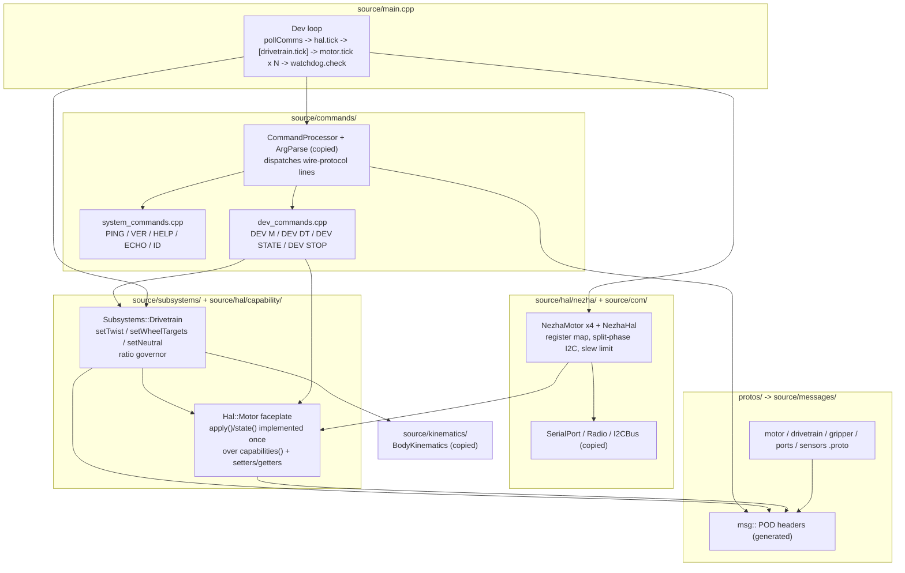
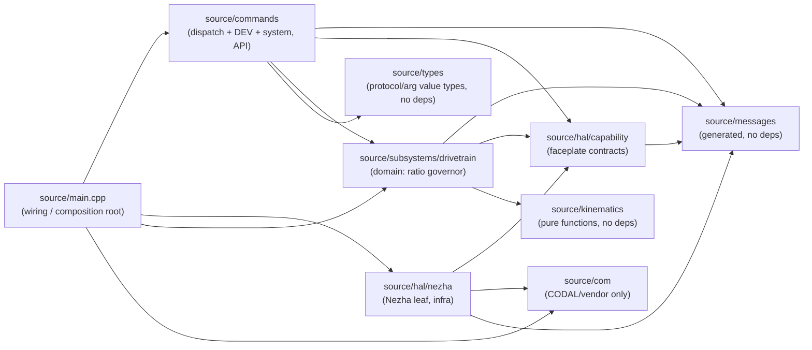
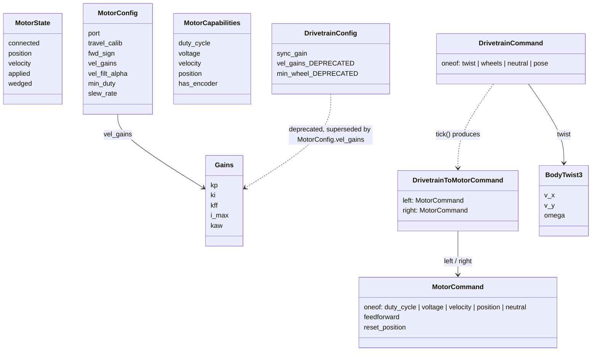

<!-- CLASI: Before changing code or making plans, review the SE process in CLAUDE.md -->

# Architecture Update -- Sprint 077: Greenfield Faceplate HAL, Drivetrain, and DEV Bench System

## Sprint Changes Summary

This sprint does not modify the live `source/`/`tests/` trees in place. It
**parks** them (`git mv source source_old`, `git mv tests tests_old`,
`codal.json` re-pointed at the new `source/` by construction, since it already
reads `"application": "source"`) and builds a second, much smaller tree from
the message layer up:

1. A dependency-clean slice of the old comms/command/kinematics/argument-type
   infrastructure is copied verbatim into the new `source/` (Step 1 of the
   linked issue), with **no** dependency on anything under `state/`,
   `subsystems/`, `robot/`, or `hal/` in the old tree.
2. `protos/motor.proto` gets an accuracy pass — `MotorConfig` gains `port`,
   `vel_gains`, `min_duty`, `slew_rate`; `MotorCapabilities` gains one bool
   per control mode; `MotorCommand` gains `reset_position`. `drivetrain.proto`
   is field-checked (deprecating `vel_gains`/`min_wheel` there, in favor of
   per-motor gains) and `gripper.proto`/`ports.proto`/`sensors.proto` are
   checked for accuracy while the generator is being re-run. `source/messages/`
   is regenerated from the updated protos.
3. `source/hal/capability/` gains one faceplate header per proto component
   (motor, gripper, line sensor, color sensor, ports, odometer). Only the
   motor faceplate is implemented this sprint (`NezhaMotor` + `NezhaHal`); the
   rest are headers for later tickets.
4. `source/subsystems/drivetrain.{h,cpp}` is a new, minimal Drivetrain: body
   twist/wheel-target/neutral commands in, a ratio governor that holds the
   commanded left/right speed ratio under load, `DrivetrainToMotorCommand`
   out. No PID lives here — that stays inside `NezhaMotor`.
5. A new `DEV` command family plus a minimal dev loop in `main.cpp` exercise
   individual motors and the Drivetrain over the standard wire protocol, with
   a non-negotiable serial-silence watchdog.
6. `tests/` gets the same park-and-rebuild treatment: three independent test
   domains (`sim/`, `bench/`, `playfield/`) replace the previous
   `simulation/`/`sim/`/`field/`/`testgui/`/`calibrate/` mix.
7. The whole system is validated on the stand, including a coupled two-motor
   bench rig (ports 3 and 4, mechanically linked) that exercises the
   embedded PID and the ratio governor under real load.

The `source_old`/`tests_old` trees are reference material for porting
implementation guts (register maps, split-phase I2C sequencing, the
`syncGain` ratio-coupling concept) — not code this sprint edits or extends.
Nothing under `source_old/`/`tests_old/` changes after the initial rename
commits.

## Why

The 056-061 message-model refactor (see `docs/architecture/architecture-
update-056.md` through `-061.md`) landed the 3-message/4-verb subsystem
contract (`apply`/`tick`/`state`/`configure`/`capabilities`, documented
structurally in `source_old/subsystems/SubsystemContract.h`) at the
`Drive`/`Sensors`/`Planner` tier, but never at the hardware tier:
`messages/motor.h`/`gripper.h`/`ports.h` have zero includers, `IVelocityMotor`
still exposes ten-plus encoder-plumbing virtuals, and `Motor` exposes six raw
Nezha register verbs directly to its caller. Incrementally refactoring the
live tree to close that gap means shimming the old `IVelocityMotor`/
`MotorController` interfaces one virtual at a time while the planner keeps
running against them — slow, and every shim is scaffolding that has to be
torn out later.

The stakeholder chose a greenfield rebuild instead: park the old tree (still
buildable, one `codal.json` flip away), and build the new hardware tier
directly against the message types, from the protos up. This sprint's slice
of that rebuild is deliberately narrow — "a working debug system... Nothing
else" (per the linked issue) — because the fastest way to prove the faceplate
pattern holds at the hardware tier is to run it against real I2C hardware
through the smallest possible command surface (`DEV`), not to rebuild the
full planner/motion stack on unproven foundations.

The result this sprint targets: a `Hal::Motor` faceplate whose `apply()`/
`state()` are implemented once against `capabilities()` and a set of
primitive setters/getters — extending the same discipline the 056-061 refactor
already established one tier up, but reaching all the way to the I2C wire for
the first time.

## Impact on Existing Components

| Component | Impact |
|---|---|
| `source/` (entire tree) | **Renamed** `source_old/` (pure `git mv`, history preserved). Still buildable via `codal.json` `application: source_old`. No further edits this sprint. |
| `tests/` (entire tree) | **Renamed** `tests_old/` (pure `git mv`). Old `_infra` sim shims left broken against the new tree (expected; not chased this sprint). |
| `codal.json` | Unchanged text (`application: source`) — now resolves to the new tree by construction, not by edit. |
| `build.py` | Conditioned: `gen_default_config.py` and `check_config_sync.py` calls become no-ops (or are skipped) while `source/robot/` does not exist; `gen_messages.py` continues to run unconditionally and continues to target `source/messages/`. |
| `protos/motor.proto` | Modified: `MotorCommand` gains `reset_position`; `MotorConfig` gains `port`/`vel_gains`/`min_duty`/`slew_rate`; `MotorCapabilities` gains per-mode booleans. |
| `protos/drivetrain.proto` | Modified: comment-deprecates `DrivetrainConfig.vel_gains`/`min_wheel` (superseded by per-motor `MotorConfig.vel_gains`); `sync_gain` retained as the ratio governor's knob. |
| `protos/gripper.proto`, `protos/ports.proto`, `protos/sensors.proto` | Field-checked against `source_old` reality; corrected if drifted. No behavioral change expected — these are the faceplate headers later tickets implement. |
| `source/messages/*.h` (new tree) | Regenerated from the above; this is the first population of `source/messages/` in the new tree. |
| `source/com/`, `source/commands/` (minus robot-coupled command families), `source/types/` (minus `Config.h`), `source/kinematics/` (new tree) | New: verbatim copies of the corresponding `source_old/` files, verified dependency-clean against `state/`/`subsystems/`/`robot/`/`hal/`. |
| `source/hal/capability/*.h` (new tree) | New: one faceplate header per proto component. Only `motor.h` backs an implementation this sprint. |
| `source/hal/nezha/nezha_motor.{h,cpp}`, `nezha_hal.{h,cpp}` (new tree) | New: the concrete Nezha leaf, porting register map + split-phase encoder sequencing + slew limiting from `source_old/hal/real/Motor.cpp`. |
| `source/subsystems/drivetrain.{h,cpp}` (new tree) | New: minimal two-wheel Drivetrain with the ratio governor, ported concept from `source_old/control/VelocityController.*`'s `syncGain`. |
| `source/commands/dev_commands.{h,cpp}`, `system_commands.cpp` (new tree) | New: the `DEV` command family and re-registered liveness commands (`PING`/`VER`/`HELP`/`ECHO`/`ID`), ported bodies from `source_old/commands/SystemCommands.cpp`. |
| `source/main.cpp` (new tree) | New: the whole dev-loop wiring — comms poll, HAL tick, conditional Drivetrain tick, motor tick, watchdog check. |
| `docs/protocol-v2.md` | New "Development commands" section documenting the `DEV` vocabulary. |
| `tests/` (new tree) | New: `sim/`, `bench/`, `playfield/`, `unit/`, `tools/`. `tests/CLAUDE.md` rewritten. `pyproject.toml` pytest config repointed. |
| `tests/bench/velocity_chart.py` | Modified: rewired from the old motion-command data source to `DEV DT`/`DEV M` polling. |
| `tests/playfield/plot_square.py`, `world_goto_chart.py` | Carried over verbatim with a "parked" header note; inert until motion/odometry return in later sprints. |

## Migration Concerns

**Two parallel buildable trees.** After the park, `codal.json`'s
`application` field is the single switch between the new dev-loop firmware
(`source`) and the full legacy firmware (`source_old`). Any script or tool
that assumes `source/` is always the "real" tree (CI, `mbdeploy`, editor
tooling / clangd `compile_commands.json`) must be re-pointed or regenerated
after the rename — this is the same "stale incremental build" and "squiggles"
class of gotcha the project has hit before (see
`.clasi/knowledge/squiggles-cdb-application-switch.md` and
`docs/knowledge/stale-incremental-build-on-volumes.md`); ticket 1 explicitly
regenerates `compile_commands.json` and restarts clangd after the move.

**Host-side sim/test builds break and stay broken this sprint.** `tests/
_infra/sim` (parked as part of `tests_old/`) compiles against `source/` paths
that no longer hold the old tree's contents. This is expected and explicitly
out of scope to fix — a fresh sim harness under `tests/sim/` is later-ticket
work, not this sprint's.

**Split-phase encoder sequencing is a hard preservation constraint, not a
redesign opportunity.** `source_old/hal/real/Motor.cpp`'s `requestEncoder()`
(phase 1: issue the 0x46 write, return immediately) / `collectEncoder()`
(phase 2: read the 4-byte response, no busy-wait) split is the direct fix for
the wedge-latch class of bug (see the consolidated
`docs/knowledge/2026-07-04-encoder-wedge.md`). The port
into `NezhaMotor` must reproduce the exact byte sequence and the exact
one-request-then-one-collect-per-loop-tick cadence — this sprint does not
introduce any new wedge mitigation (see Open Questions) and does not add a
`DBG WEDGE`-equivalent diagnostic; it only must not regress the existing
sequencing.

**`min_duty`/`slew_rate` move from `source_old`'s free constants into
`MotorConfig`.** `source_old/hal/real/Motor.cpp` has `kMaxDeltaPwmPerWrite`
as a file-local `constexpr` (25, "design-time estimate... not yet
HITL-validated"). The new `MotorConfig.slew_rate` makes this a runtime-
configurable field. Ticket 3 must decide (and record as Design Rationale) a
sane default when porting, since the old constant was never bench-confirmed
at a different value than 25.

**`DrivetrainConfig.vel_gains`/`min_wheel` become dead-but-present fields.**
Deprecating them in `drivetrain.proto` (rather than deleting) avoids a wire
break for any host tooling that still reads the old drivetrain config shape;
downstream code (this sprint's `Drivetrain`) simply never reads them. Removal
is a later-ticket cleanup once nothing depends on the old shape.

**No production motion command family exists in this firmware.** Because
`DEV` is the only command family beyond liveness, there is no planner to
authority-conflict with — the mutual-exclusion between `DEV M` (per-motor)
and `DEV DT` (drivetrain) mode is the only arbitration this firmware needs,
and it is trivial by construction (per the issue). This means the dev-loop
firmware is not a drop-in replacement for `source_old`'s production firmware;
it coexists as a separate, bench-only build reachable via the `codal.json`
switch.

## Component / Module Diagram

## Dependency Graph

Direction: `main`/`commands` (API) -> `subsystems/drivetrain` (domain) ->
`hal/capability` (domain-owned port) -> `hal/nezha` (infrastructure) /
`com` (infrastructure) -> `messages`/`kinematics`/`types` (shared leaf data
and pure functions). No cycles. `hal/capability` is the swap point: a future
`SimMotor` or `MockMotor` leaf could implement the same faceplate without
`subsystems/drivetrain` or `source/commands` changing — infrastructure is a
plugin behind the faceplate, matching the dependency-direction principle
already established by the 056-061 refactor one tier up.

## Message Schema (data model changed this sprint)

`MotorConfig` is now the sole owner of the velocity-loop tuning surface (the
embedded PID lives inside the motor, per the locked control-architecture
decision); `DrivetrainConfig`'s equivalent fields are annotated deprecated in
the proto rather than removed, so no host tooling reading the old shape
breaks this sprint.

## Design Rationale

### Decision 1: Continue the existing 3-message/4-verb contract, not a new pattern

**Context**: The issue's "faceplate" terminology (`configure`/`apply`/`tick`/
`state`/`capabilities`) reads as new vocabulary, but `source_old/subsystems/
SubsystemContract.h` already formalizes the identical four verbs plus
capabilities for `Drive`/`Sensors` (056-061 refactor).

**Alternatives considered**: Treat "faceplate" as a distinct pattern from the
existing subsystem contract and design it independently; or explicitly
extend/reuse `SubsystemContract.h`'s `FluentBuilder`/`SensorFluentBuilder`
CRTP helpers in the new tree.

**Why this choice**: The verbs are the same (`apply`/`tick`/`state`/
`configure`/`capabilities`); the new terminology is the stakeholder's naming
for the same discipline applied one tier lower (hardware devices, not
subsystems). Treating it as a continuation — not a new pattern — keeps the
codebase's mental model of "every component follows this contract" intact
across the port. However, `SubsystemContract.h` itself is **not** copied in
Step 1 (it lives under `source_old/subsystems/`, out of the dependency-clean
copy list), and its `FluentBuilder` CRTP helper is **not** adopted this
sprint — the issue's own code sketches call `apply(const msg::MotorCommand&)`
directly, and introducing the fluent-builder machinery is unnecessary
scope for a bench debug system.

**Consequences**: `Hal::Motor::apply()`/`state()` are hand-written once in
the faceplate base class (per the issue), not generated by a CRTP mixin. A
later ticket that wants the `newCommand().setX().apply()` ergonomic on the
new hardware tier would need to either port `SubsystemContract.h` at that
point or hand-roll the same pattern — deferred, not precluded.

### Decision 2: `min_duty`/`slew_rate` default values on port

**Context**: `source_old/hal/real/Motor.cpp`'s slew cap
(`kMaxDeltaPwmPerWrite = 25`) is explicitly documented as a "design-time
estimate... not yet HITL-validated." `MotorConfig.slew_rate` makes this a
proto-configurable field for the first time.

**Alternatives considered**: (a) Port the existing value (25) as the default
and leave HITL-confirmation for this sprint's ticket 7 bench pass; (b) treat
this sprint as an opportunity to also land the 2026-07-04-validated
zero-dwell reversal fix (write 0, hold >=50ms, then the new direction) instead
of the slew-cap approach.

**Why this choice**: (a). The issue's locked scope for ticket 3 says "port
the guts" — register map, split-phase sequencing, slew limiting, wedge
detection — from `source_old/hal/real/Motor.cpp` as it stands today. The
zero-dwell fix is real and validated (`docs/knowledge/2026-07-04-encoder-
latch-reversal-write-train.md`) but is documented there as "pending ticket,"
not yet integrated into `source_old` itself; folding it into this greenfield
port would be a scope expansion the issue does not authorize and would make
ticket 3's acceptance criteria ("byte-for-byte identical sequencing") harder
to verify against the reference implementation. It is flagged in Open
Questions below as a strong candidate for the next motor-tier sprint.

**Consequences**: Ticket 3 ports `kMaxDeltaPwmPerWrite = 25` as
`MotorConfig.slew_rate`'s default and inherits its "not yet HITL-validated"
caveat; ticket 7's bench pass is this sprint's first real HITL exercise of
that value on the new tree (though it was already running in `source_old`
in production, so this is not a novel risk — it is the same value already
shipping).

### Decision 3: `NezhaHal` owns one `NezhaMotor` per port (not a hardcoded L/R pair)

**Context**: `source_old/robot/NezhaHAL.h` owns exactly `_motorL`/`_motorR`
as named value members. The issue requires port-addressable, arbitrary-count
motor instantiation (the dev build brings up all four; the coupled bench rig
uses ports 3+4, not the drive pair).

**Alternatives considered**: Keep the L/R-named pair and add ports 3/4 as a
special bench-only pair; or make `NezhaHal` a uniform array/owner of
`NezhaMotor` indexed by port with no L/R naming baked in.

**Why this choice**: The latter. Baking "left"/"right" into the HAL layer
was already identified as one of the couplings the message-model refactor is
unwinding one tier up (`Drivetrain` is where L/R semantics belong, via
`DrivetrainToMotorCommand.left`/`.right`); the HAL tier should only know
about ports. This also directly enables the coupled bench rig (ports 3+4)
without any special-casing in `NezhaHal`.

**Consequences**: `NezhaHal` becomes a small owner/factory over up to four
`NezhaMotor`s keyed by port, with `tick(now)` orchestrating the split-phase
bus schedule across however many are configured. `Drivetrain`'s
`DEV DT PORTS <left> <right>` binding decides which two ports are "left" and
"right" for that session — that mapping is a `Drivetrain`/`DEV`-layer
concern, not a `NezhaHal` one.

### Decision 4: `build.py` conditioning strategy — skip, not stub

**Context**: `gen_default_config.py` reads `data/robots/active_robot.json`
and writes `source/robot/DefaultConfig.cpp`; `check_config_sync.py` lints the
config registry against `source/robot/ConfigRegistry.cpp`. Neither
`source/robot/` file exists in the new tree yet (no `Robot`/`ConfigRegistry`
ticket this sprint).

**Alternatives considered**: (a) Make `build.py` detect `source/robot/`'s
absence and skip both generator calls entirely; (b) stub out
`source/robot/DefaultConfig.cpp` with an empty placeholder so the generators
still "succeed" against nothing.

**Why this choice**: (a). A skip is honest about what exists; a stub file
under a directory (`source/robot/`) this sprint deliberately does not create
would misrepresent the new tree's actual module boundaries (no `Robot`
class, no `ConfigRegistry` this sprint) and would need to be deleted again
whichever future sprint adds the real `source/robot/`.

**Consequences**: `build.py` must condition on the new tree's actual shape
(e.g., `source/robot/` existing) rather than on a version flag, so it
transparently starts running both generators again once a later sprint adds
`source/robot/` back — no follow-up flip required.

## Open Questions

1. **Zero-dwell reversal fix timing.** The validated ≥50 ms zero-dwell
   reversal fix (`docs/knowledge/2026-07-04-encoder-latch-reversal-write-
   train.md`) is not part of this sprint's locked scope (Decision 2 above).
   Should the very next motor-tier sprint land it in `NezhaMotor` before any
   further production motion work resumes, given it is bench-validated and
   the current slew-cap mitigation is explicitly "not yet HITL-validated"?
2. **`CommandQueue` dep-cleanliness.** The issue says copy `CommandQueue`
   "only if dep-clean and needed; DEV dispatches immediately." Confirm during
   ticket 1 whether `CommandQueue` is needed at all for a firmware that never
   queues (DEV is synchronous) — if not needed, it should not be copied,
   simplifying the dependency surface.
3. **`DEV` argument parsing mechanism.** The `DEV M <n> DUTY <duty>` /
   `DEV M <n> CFG k=v ...` shapes mix a positional port number, a mode
   keyword, and either a positional value or KV pairs — this does not map
   cleanly onto the existing declarative `ArgSchema` (positional-only or pure
   KV). Ticket 5 should decide whether to hand-roll a `ParseFn` per `DEV`
   subcommand (consistent with most of `SystemCommands.cpp`'s existing
   verbs) or extend `ArgSchema`. This is an implementation-level choice, not
   an architectural one, but is flagged so ticket 5 does not stall on it.
4. **Bench-rig port binding persistence.** `DEV DT PORTS <left> <right>`
   changes which two `NezhaMotor`s the `Drivetrain` addresses. Does this
   binding reset on `DEV STOP`/watchdog-neutral, or only on reboot? The issue
   does not specify; ticket 5 should pick the safer default (persist across
   `DEV STOP`, reset only on reboot) and document the choice.
5. **`Communicator` reuse vs. inline poll loop.** The issue allows either
   copying `com/Communicator` (if dep-clean — it is, per this sprint's
   research) or writing a ~50-line serial+radio poll loop directly in
   `main.cpp`. `Communicator` is confirmed dependency-clean (only
   `MicroBit.h`/`SerialPort.h`/`Radio.h`); ticket 1 should default to reusing
   it unless a concrete reason to inline emerges.
6. **Mecanum / `vy` dead code in this firmware.** `DrivetrainCommand.twist`
   carries `v_y`, honored only when `capabilities().holonomic`. Since this
   sprint is differential-only (Tovez first, per the locked decision),
   `Drivetrain::capabilities().holonomic` is always false and `v_y` is
   always ignored. Confirm ticket 4 makes this explicit (e.g., an inline
   comment at the ignore site) rather than silently dropping the field,
   so a future mecanum ticket knows exactly where to wire it in.
