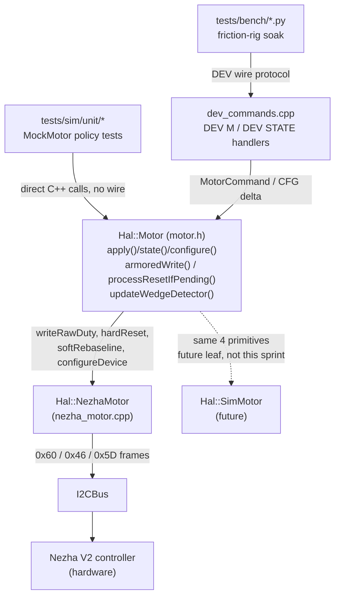
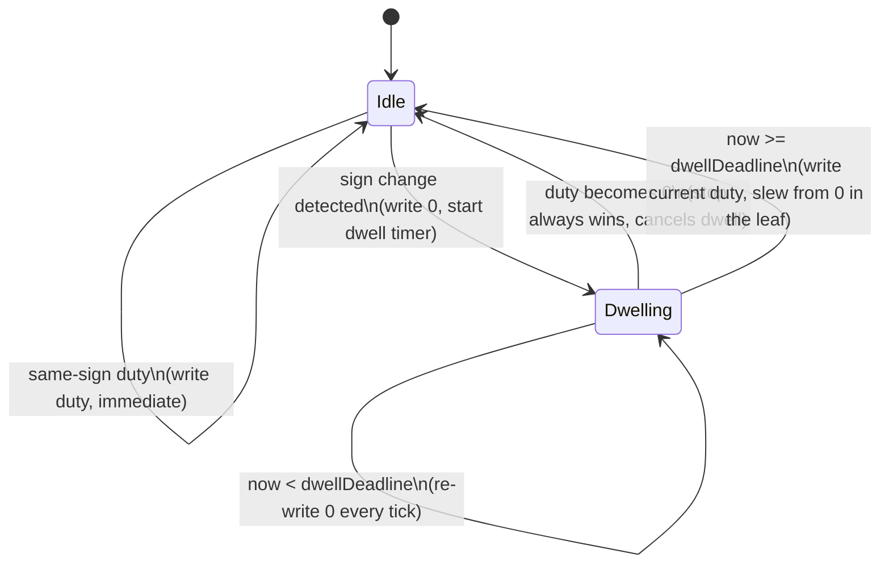

<!-- CLASI: Before changing code or making plans, review the SE process in CLAUDE.md -->

# Architecture Update — Sprint 078: Motor write-path armor: zero-dwell reversal, deadband, guarded resets, qualified wedge reporting

> **Revision note**: an earlier draft of this document (written before this
> revision) placed the armor logic in three new standalone files under
> `source/hal/nezha/` (`motor_write_policy.h`/`motor_reset_guard.h`/
> `motor_wedge_detector.h`), called by `NezhaMotor` as owned helper objects.
> That draft is **superseded in place** by this version: it violated the
> sprint's binding placement constraint (stakeholder correction, 2026-07-04
> — see `sprint.md`'s Architecture Notes and the issue's "Placement"
> section), which requires the armor to be **shared base-class policy in
> `Hal::Motor`** so every current and future leaf inherits it, the same way
> `apply()`/`state()` already are — not leaf-owned composition that a future
> `SimMotor` would have to independently re-wire. This document replaces
> that draft's content entirely (no downstream artifact — `usecases.md`,
> tickets — had been built on it yet, so no `-r1` revision chain is needed;
> see the `architecture-authoring` skill's revision-naming rule, which
> applies to revising an *approved* design, not correcting an unapproved
> draft before its first review).

## What Changed

The reversal-latch armor (zero-dwell reversal, output deadband,
standstill-guarded resets, motion-qualified wedge reporting) is added as
**shared policy in the `Hal::Motor` base class**
(`source/hal/capability/motor.h`), not inside `NezhaMotor`. This mirrors the
existing `apply()`/`state()` pattern: implemented **once**, inline, in the
header (no `motor.cpp` — see Design Rationale 7), calling a small set of new
**protected pure virtuals** that a leaf implements for its own hardware.
`NezhaMotor` becomes the first (and only, this sprint) leaf refit to the new
contract; a future `SimMotor`/`MockMotor` gets the armor for free.

1. **`Hal::Motor` gains four new protected pure virtuals** — the
   device-specific primitives a leaf must supply:
   - `writeRawDuty(float duty)` — perform whatever device-specific write
     shaping (throttle, slew, write-on-change, the actual bus frame) and
     issue it. The base decides *whether/what* to write; the leaf still
     decides *how*.
   - `hardReset()` — the atomic, at-rest hardware re-prime burst.
   - `softRebaseline()` — a software-only rebaseline (no bus transaction),
     folding the leaf's current `position()` reading into whatever internal
     offset it keeps.
   - `configureDevice(const msg::MotorConfig& config)` — device-specific
     config caching (everything except the two armor fields the base now
     owns).
2. **`Hal::Motor` gains shared (non-virtual, inline) policy methods**, called
   by the leaf's `tick()` at documented points (see "The base/leaf split —
   exact contract" below):
   - `armoredWrite(float duty, uint32_t now)` — the zero-dwell-reversal +
     output-deadband write gate. Calls `writeRawDuty()`.
   - `processResetIfPending(uint32_t now)` / `updateRestTracking()` — the
     standstill-guarded reset dispatch. Calls `hardReset()` or
     `softRebaseline()`.
   - `updateWedgeDetector()` — the unconditional stuck-encoder latch
     (unchanged semantics, ported as-is) plus the new motion-qualified
     wedge-**SUSPECT** derivation.
3. **Three `Hal::Motor` public methods change from pure virtual to
   concrete**: `resetPosition()` (now just stages a base-owned
   `resetPending_` flag), `wedged()` (now reads base-owned
   `wedgeLatched_`), `configure()` (now caches the two armor fields, then
   delegates to `configureDevice()`). Two new concrete public methods:
   `wedgeSuspect()`, plus `hardResetCount()`/`softResetCount()` (testability
   counters, ported idea from `source_old`'s `IVelocityMotor`/`Motor.h`
   064-003 precedent).
4. **`NezhaMotor` is refit, not rewritten**: its existing `writeDuty()` body
   becomes the `writeRawDuty()` override, **minus the reversal-exemption
   branch** (structurally dead now — see Design Rationale 6); its existing
   `hardResetEncoder()` becomes the `hardReset()` override, unchanged;
   `softRebaseline()` is new, ported from `source_old`'s
   `Motor::rebaselineSoft()` (064-003); its private wedge-detector fields
   and `updateWedgeDetector()` method are deleted (moved to the base); its
   `resetPending_` field is deleted (moved to the base).
5. **`protos/motor.proto`** — `MotorConfig` gains two `optional` fields
   (`reversal_dwell`, `output_deadband`); `MotorState` gains three
   (`wedge_suspect`, `hard_reset_count`, `soft_reset_count`). Regenerated via
   `scripts/gen_messages.py`.
6. **`docs/protocol-v2.md` §16** — two new `DEV M <n> CFG` keys (`dwell`,
   `deadband`); `DEV M <n> STATE` / `DEV STATE` lines grow from five fields
   to eight (`wsus=`, `hrc=`, `src=` appended); a documentation note on
   `RESET`'s now-deferred-decision semantics.
7. **A new off-hardware policy test seam** (`tests/sim/unit/`) — a
   dependency-free `MockMotor` test leaf exercising `Hal::Motor`'s armor
   policy directly (no I2C, no CODAL), compiled and run via a small
   pytest-invoked subprocess. Collected by `uv run python -m pytest`.
8. **A new friction-rig soak script** (`tests/bench/`) — hot-flip armor
   soak + A/B (dwell on/off) + mid-motion reset-guard check, against real
   hardware.
9. **`docs/knowledge/2026-07-04-encoder-wedge.md`**'s Production guidance
   status line changes from "pending sprint ticket" / "Not yet in production
   firmware" to shipped-in-new-tree, once the soak (ticket 005) passes.

## Why

`docs/knowledge/2026-07-04-encoder-wedge.md` root-caused the dominant
encoder-wedge flavor to the reversal write train and proved both the fix
(zero-dwell reversal) and the companion disciplines (deadband,
standstill-gated hard resets, motion-qualified reporting) on the wedgelab
bench. Sprint 077 ported `source_old`'s write/reset path unchanged into the
new tree — the trigger (immediate sign-flip writes, resets regardless of
motion) is fully present one layer closer to the metal, now compounded by
the new embedded per-motor velocity PID's decel/stop sign-dither. This
sprint closes that gap before sprint 079 raises the PID's tick cadence
(more reversal exposure per second if the armor is not in first — see
Migration Concerns).

The armor is placed in `Hal::Motor` rather than `NezhaMotor` because it is
not a Nezha-specific fact — it is a statement about *any* motor driven by a
signed duty write to a physical H-bridge: reversals need to be armored,
near-zero dither needs to be suppressed, hard resets need to be gated on
motion, and "is this thing actually stuck" needs a motion-qualified
answer. A future `SimMotor` or a different vendor's motor leaf has exactly
the same needs; duplicating this state machine per leaf would be the
project's own named anti-pattern (speculative per-leaf reimplementation of
one concern) waiting to happen the moment a second leaf exists.

## Impact on Existing Components

- **`Hal::Motor`** (`source/hal/capability/motor.h`) — the primary change.
  Gains new protected state (dwell timer, deadband cache, reset-guard
  counters, wedge-detector state — see "The base/leaf split" below) and the
  methods listed in "What Changed." `apply()`/`state()` are otherwise
  unchanged in shape; `state()` gains three lines populating the new
  `MotorState` fields, gated by `caps.has_encoder` exactly like the
  existing `wedged`/`position`/`velocity` fields.
- **`Hal::NezhaMotor`** (`source/hal/nezha/nezha_motor.{h,cpp}`) — refit to
  the new leaf contract (see "What Changed" item 4). Net effect: fewer
  private fields (wedge detector and `resetPending_` move to the base),
  one new private method (`softRebaseline()`'s body), and `writeDuty()`'s
  reversal-exemption branch deleted. `tick()`'s orchestration order changes
  to call the base's shared methods at the points documented below.
  `NezhaHal`, `main.cpp`'s `NezhaHal` construction, and
  `Drivetrain` are **untouched** — `Drivetrain` holds no `Hal::Motor`
  reference at all (see `source/subsystems/drivetrain.h`'s own class
  comment) and the DEV command layer's only touch point,
  `state.hal->motor(port).configure(cfg)` (`dev_commands.cpp:372`), keeps
  the exact same signature (`configure()` changes from pure virtual to
  concrete — zero call-site impact).
- **`source/commands/dev_commands.cpp`** — `handleDevMCfg()`'s key table
  (`applyMotorCfgKey()`) grows two rows (`dwell`, `deadband`); the shared
  state-line formatter (the function building `pos=.. vel=.. applied=..
  wedged=.. conn=..`, used by both `DEV M <n> STATE` and the aggregate
  `DEV STATE`) grows three more tokens (`wsus=`, `hrc=`, `src=`). No other
  `DEV` handler changes; `RESET`'s handler is unchanged (it already just
  calls `apply()` with `reset_position=true`) — only its *documented*
  semantics change (see below).
- **`docs/protocol-v2.md`** §16 — `DEV M <n> STATE`'s "always all five
  fields" language becomes "always all eight fields"; the CFG key table
  gains two rows; a new paragraph documents that `RESET`'s `OK` reply
  reports acceptance, not completion-kind — the hard-vs-soft decision is
  made at the top of the next `tick()`, observable via `hrc=`/`src=`
  deltas on a subsequent `STATE` poll, not via the `RESET` reply itself.
- **`source/main.cpp`**'s `initDefaultMotorConfigs()` — no change is
  *required*: both new `MotorConfig` fields are `optional`
  (`Opt<float>`, `.has == false` by default), and `Hal::Motor::configure()`
  substitutes the safe ship defaults (100 ms dwell, 3% deadband) whenever
  `.has` is false — see Design Rationale 2. A one-line comment is added
  pointing at where those defaults live, so a future reader does not go
  hunting for them in `main.cpp`.
- **`host/robot_radio/robot/protocol.py`**'s `parse_response()` — a generic
  key=value splitter; verified it needs no change to read any of the new
  tokens (additive, not a format change).
- **`tests/bench/dev_exercise.py`, `tests/bench/velocity_chart.py`** —
  checked: neither currently round-trips a commanded reversal inside a
  fixed short settle window, so neither needs a fix for the new dwell
  latency. Flagged for the new soak script (ticket 005), which *does*
  command reversals under test and must size its settle windows to
  `reversal_dwell` explicitly.

## Migration Concerns

- **Sprint 079 handoff (structural, not code-level yet — 079 is still
  roadmap-only).** 079's flip-flop scheduler/lazy-clearance work rewrites
  `NezhaMotor::tick()`'s encoder-read scheduling and raises control-loop
  cadence. The base's shared methods take `now`/`duty` as explicit
  parameters (not an implicit tick count or a captured scheduler state), so
  079 should be able to keep calling `armoredWrite()`/
  `processResetIfPending()`/`updateWedgeDetector()` unchanged from whatever
  new scheduling shape it builds, as long as it preserves the call-order
  contract below. Flagged here for 079's own detail-phase planner to
  re-verify, not resolved by this sprint.
- **Wire compatibility.** The `DEV` family is dev-build-only
  (`ROBOT_DEV_BUILD`) with no external consumer contract beyond this
  repo's own bench tooling — growing `STATE` and adding `CFG` keys is a
  same-sprint, same-repo change with no cross-version compatibility burden.
- **No data migration.** `MotorConfig`/`MotorState` are in-memory wire
  messages regenerated by `scripts/gen_messages.py` on every build; there
  is no persisted instance to migrate.
- **Deployment sequencing.** Ticket order (schema → base policy + leaf
  refit → protocol wiring → off-hardware tests → bench soak) puts the
  schema first (everything else reads the new fields) and the base+leaf
  refit as one ticket (see ticket 002's scope note: splitting base and leaf
  across two tickets would leave the tree non-building in between, since
  `NezhaMotor` is `Hal::Motor`'s only concrete leaf).
- **This sprint must land before sprint 079 wires the flip-flop** (per
  `sprint.md`'s Architecture Notes) — faster PID cadence multiplies
  reversal-train exposure until the armor is in.

## The base/leaf split — exact contract

**Leaf responsibilities (protected pure virtuals a leaf implements):**

| Method | Leaf implements | `NezhaMotor` maps to |
|---|---|---|
| `writeRawDuty(float duty)` | device-specific write shaping + bus write | today's `writeDuty()` body, minus the reversal-exemption branch (write-on-change, 40 ms throttle, ±25 slew, 0x60 frame — all unchanged) |
| `hardReset()` | atomic at-rest register re-prime | today's `hardResetEncoder()`, unchanged |
| `softRebaseline()` | software-only offset fold, no bus transaction | new; ported from `source_old`'s `Motor::rebaselineSoft()` (064-003), using `encOffset_`/`travel_calib`/`fwd_sign` |
| `configureDevice(config)` | device-specific config caching | today's `configure()` body (slew-rate `<= 0` defaulting, etc.) minus the two armor fields |

**Base responsibilities (shared, non-virtual, inline in `motor.h`):**

- `armoredWrite(duty, now)` — deadband + zero-dwell-reversal write gate.
- `processResetIfPending(now)` / `updateRestTracking()` — standstill-guarded
  reset dispatch.
- `updateWedgeDetector()` — raw stuck-encoder latch + motion-qualified
  suspect derivation.
- `configure(config)` — caches `reversalDwell_`/`outputDeadband_`
  (defaulting from the ship constants if unset), then calls
  `configureDevice(config)`.
- `resetPosition()` — stages `resetPending_ = true`.
- `wedged()` / `wedgeSuspect()` / `hardResetCount()` / `softResetCount()` —
  read base-tracked state.

**Base-owned protected state** (lives in `Hal::Motor`, one instance per
motor since each leaf object embeds one `Motor` base subobject):

```
float    reversalDwell_    = 0.0f;   // [ms] cached from MotorConfig
float    outputDeadband_   = 0.0f;   // [-1,1] fraction, cached from MotorConfig
bool     dwelling_         = false;
uint32_t dwellDeadline_    = 0;      // [ms]
float    lastRequestedDuty_= 0.0f;   // [-1,1] last duty actually forwarded to writeRawDuty()

bool     resetPending_     = false;
uint8_t  restTicks_        = 0;      // consecutive at-rest ticks observed
uint32_t hardResetCount_   = 0;
uint32_t softResetCount_   = 0;

float    wedgePrevPosition_  = 0.0f; // [mm]
bool     wedgePrevValid_     = false;
uint8_t  stuckCount_         = 0;    // raw, unconditional (unchanged semantics)
uint8_t  movingStuckCount_   = 0;    // same test, gated by |appliedDuty()| > deadband
bool     wedgeLatched_       = false;
bool     wedgeSuspect_       = false;
```

**Why these specific signals, not new virtuals**: `updateWedgeDetector()`
and `updateRestTracking()` need "is the motor moving" / "is it stuck" /
"what did we last ask it to do" signals — all of which are already public
on `Hal::Motor` (`position()`, `velocity()`, `appliedDuty()`) or
base-tracked (`lastRequestedDuty_`, set by `armoredWrite()` itself). No new
protected virtuals are needed for wedge detection or rest-tracking; only
the write/reset *actions* (the four listed above) need a device-specific
hook, because only those touch actual hardware.

**The leaf's `tick()` contract** — every leaf must call the base's shared
methods in this order (documented here as the sprint's normative sequence;
`NezhaMotor::tick()` is refit to follow it exactly):

1. `processResetIfPending(now)` — first, before this tick's encoder sample
   (mirrors today's `if (resetPending_) hardResetEncoder();` position;
   `restTicks_` reflects prior ticks' rest state, which is fine — the
   "verified standstill" question does not need this tick's not-yet-taken
   sample).
2. Leaf samples its own encoder and updates its own position/velocity
   cache (unchanged, device-specific — `NezhaMotor`'s
   `readEncoderSettle()`/EMA filter/plausibility gate stay exactly as they
   are; this is *not* armor policy).
3. `updateWedgeDetector()` — reads `position()`/`appliedDuty()`, both now
   reflecting this tick's fresh sample and last tick's write.
4. Mode dispatch: `DUTY`/`VELOCITY`/`NEUTRAL` modes compute a duty and call
   `armoredWrite(duty, now)`. `POSITION` mode is **out of the armor's
   scope** — the onboard absolute-angle move (`0x5D`) is a discrete vendor
   command, not a streamed signed duty, and carries none of the reversal-
   write-train risk; it keeps calling the leaf's own
   `writePositionMove()` directly, unchanged.
5. `updateRestTracking()` — reads `velocity()` and `lastRequestedDuty_`
   (just possibly updated by step 4), feeding next tick's
   `processResetIfPending()`.

**Two different "is this motor idle" signals, deliberately** (see Design
Rationale 4): `updateRestTracking()`'s standstill gate uses
`lastRequestedDuty_` (the *commanded* duty the base most recently decided
to forward) — matching `source_old`'s `computeAtRest()`, which gates on
*commanded* target, not applied output. `updateWedgeDetector()`'s
motion-qualification uses `appliedDuty()` (what the leaf actually last
wrote) — matching the issue's literal wording ("stuck while `|appliedDuty|`
above the deadband").

**Construction note**: `Hal::Motor` gets no custom constructor for this
sprint — `configure()` is called explicitly from the *derived* class's
constructor body (as `NezhaMotor`'s constructor already does today, calling
what will become `configure(config)` as its last line), never from
`Motor`'s own constructor. Calling a virtual (`configureDevice()`) from a
base constructor would not dispatch to the derived override during base
construction — a classic C++ pitfall this design avoids structurally by
never adding a `Motor(...)` constructor that calls it.

## `writeRawDuty()`'s reversal-exemption branch is deleted, not ported

`NezhaMotor::writeDuty()`'s current `reversal` boolean (used only to
exempt a detected reversal from the 40 ms write-rate throttle) becomes
**structurally unreachable** once `armoredWrite()` is in place: the base
*never* forwards a raw sign flip to `writeRawDuty()` — it always writes 0
first and holds through the dwell, so by the time a new-direction duty
reaches the leaf, the leaf's own `lastWrittenPct_` is already 0 (from the
dwell's own zero-writes). From the leaf's perspective, every write it ever
sees is either unchanged, a transition to/from zero, or a same-sign
change — never a direct opposite-sign jump. The branch is deleted (see
Design Rationale 6), not preserved as dead code.

## Component / Module Diagram



No cycles. Fan-out from `Hal::Motor` is 2 (current + future leaf) — well
within bounds. `Motor`'s dependency direction is unchanged from sprint 077:
`DEV` layer → faceplate → leaf → bus → hardware, domain-inward.

## Write-path armor state diagram (`armoredWrite`)



`reversalDwell_ == 0` (explicit legacy config, A/B bench only) skips the
`Idle --> Dwelling` transition entirely — a detected reversal falls straight
through to an immediate write, reproducing sprint-077's shipped behavior
(the leaf's own slew cap still applies) for A/B comparison.

## Dependency Graph

Unchanged from sprint 077 at the subsystem level (`DEV` command layer →
`Hal::Motor` faceplate → `NezhaMotor` → `I2CBus`). No new module-level
dependency edges are introduced; the new protected virtuals are calls
*into* the existing leaf, not a new outward dependency from it.

## Message Schema (data model changed this sprint)

`protos/motor.proto`:

```proto
message MotorConfig {
  // ... existing fields 1-7 unchanged ...
  optional float reversal_dwell  = 8;  // [ms] hold at commanded-zero on any
                                        // sign change. Unset -> ship default
                                        // (100 ms). Explicit 0 = legacy
                                        // immediate-reversal, A/B bench
                                        // comparison only -- never ship 0.
  optional float output_deadband = 9;  // [-1,1] fraction; |duty| below this
                                        // writes 0 instead of a signed value.
                                        // Unset -> ship default (0.03).
}

message MotorState {
  // ... existing fields 1-5 unchanged ...
  optional bool   wedge_suspect     = 6;  // stuck latch held WHILE
                                           // |appliedDuty| > output_deadband
                                           // for the same window -- "wedged
                                           // AND was actually asked to move"
  optional uint32 hard_reset_count  = 7;  // cumulative; testability/bench
                                           // verification (064-003 idea)
  optional uint32 soft_reset_count  = 8;  // cumulative; ditto
}
```

Both new `MotorConfig` fields are `optional` — see Design Rationale 2 for
why this is a deliberate departure from `slew_rate`'s existing
"0-means-unconfigured" sentinel convention.

## Design Rationale

### Decision 1: the armor is shared `Hal::Motor` base-class policy, not `NezhaMotor`-owned composition

**Context**: stakeholder-mandated placement (2026-07-04 correction to the
issue, restated as binding in `sprint.md`'s Architecture Notes): the
reversal dwell, output deadband, standstill reset guard, and wedge
detection/qualification are motor-generic, not Nezha-specific.

**Alternatives considered**: three new standalone pure-function/pure-class
helpers under `source/hal/nezha/`, owned and called by `NezhaMotor` (the
superseded earlier draft of this document). Rejected: a future `SimMotor`
or other vendor leaf would have to independently re-wire calls to the same
helpers itself — the armor would not be "free" the way `apply()`/`state()`
already are for every leaf; it is composition bolted onto one leaf, not
inherited base behavior. This is exactly the shape of duplication the
project's anti-pattern list warns about once a second leaf exists.

**Why this choice**: mirrors the *already-established* precedent in this
exact file — `apply()`/`state()` are implemented once, inline, in `Motor`,
built on primitives leaves supply. Extending that same pattern to the
armor (new protected primitives; shared logic built on them) is the
minimal, most consistent way to satisfy the mandate, not a new
architectural style.

**Consequences**: `Hal::Motor` stops being a pure interface-plus-two-
methods and becomes a small stateful base class (new protected data
members). This is a bigger diff to `motor.h` than a leaf-local change would
have been, but it is the *only* placement that gives every leaf the armor
"for free," per the mandate.

### Decision 2: `reversal_dwell`/`output_deadband` are `optional` fields, not the existing zero-sentinel convention

**Context**: `slew_rate` already has an "unconfigured" convention: a
zero-initialized (never-configured) `MotorConfig` reads `slew_rate <= 0`,
and `NezhaMotor` substitutes the safe default (25) in `configureDevice()`.
The issue requires `reversal_dwell == 0` to be a **valid, explicit,
meaningful** configuration (legacy immediate-reversal, A/B bench
comparison only) — directly conflicting with reusing that sentinel: if 0
always meant "unconfigured, apply the safe default," it would be
*impossible* to ever configure the legacy/disabled behavior the
acceptance sketch's A/B test explicitly requires. This matters more here
than for `slew_rate`, because silently falling back to a safe default on
an unset field is fine for a slew cap, but would be actively dangerous to
apply unconditionally to the dwell/deadband: forgetting to set them must
never silently look identical to "explicitly disabled."

**Alternatives considered**: reuse the `slew_rate` sentinel trick
(rejected above — makes explicit-legacy impossible); pick a different
magic sentinel (e.g. a negative dwell, or `UINT32_MAX`) to mean
"unconfigured." Rejected: an invented magic number is worse than a
mechanism the schema already provides for exactly this "distinguish unset
from explicit zero" problem.

**Why this choice**: proto3 `optional` (`Opt<T>`, `.has`/`.val`) is already
used in this exact file for the identical shape of problem —
`MotorCommand.feedforward`/`MotorCommand.reset_position` both need "did the
caller send this or not," not just "what value." Reusing it costs nothing
new in the generator and means an unconfigured field (e.g. a `MotorConfig`
constructed in a test without touching these fields) safely defaults to
the shipped-safe values (100 ms / 0.03) rather than silently disabling the
armor — the base's `configure()` does
`reversalDwell_ = config.reversal_dwell.has ? config.reversal_dwell.val : kDefaultReversalDwell;`
and the same shape for `outputDeadband_`.

**Consequences**: `MotorConfig` now carries two different "how is
unconfigured represented" conventions side by side (`slew_rate`'s sentinel
vs. these fields' `optional`). Documented here so a future reader does not
assume uniformity; retrofitting `slew_rate` to `optional` too would be a
nice consistency cleanup but is out of scope this sprint (Open Question 3).

### Decision 3: expose wedge-SUSPECT as a new sibling field (`wsus=`), not by redefining `wedged=`

**Context**: the issue explicitly offers both options. The internal
unconditional stuck-encoder counter must be kept "exactly as is" (064-004
hardening — do not reintroduce the target-gating/arming-grace blind spots
that made the old detector miss every real field episode). The knowledge
doc's own flavor-triage procedure ("does the freeze clear at the next
at-rest atomic reset? transient vs. escalated latch") depends on observing
the **raw** latch, including while the motor is at rest — exactly the case
a motion-qualified signal is designed to suppress from the *reported*
"suspect" field.

**Alternatives considered**: switch `wedged=`'s meaning to the
motion-qualified signal and move the raw counter to a `DBG` command.
Rejected: equal implementation cost, but strictly more risk — it changes
the meaning of an existing, already-relied-upon wire field with no
compensating benefit, whereas adding `wsus=` is purely additive.

**Why this choice**: `parse_response()` is a generic key=value splitter
(verified — no existing consumer breaks from an added field); keeps the
raw diagnostic signal exactly where operators already look for it; gives
bench scripts the qualified signal to assert on, per the issue's own
"update bench scripts to assert on the motion-qualified signal."

**Consequences**: `DEV M <n> STATE`/`DEV STATE` grow from five fields to
eight (`wsus=`, `hrc=`, `src=`); `docs/protocol-v2.md`'s "always all five
fields" language needs updating in the same ticket that lands the wire
change (Decision 3 and Decision 8 land together).

### Decision 4: two different "is this motor idle" signals — commanded (`lastRequestedDuty_`) for the reset guard, applied (`appliedDuty()`) for wedge-suspect

**Context**: both `updateRestTracking()` and `updateWedgeDetector()` need
an "idle-ness" signal, and the two most obvious candidates
(`lastRequestedDuty_`, the base's own post-armor commanded value; and
`appliedDuty()`, the leaf's actually-last-written value) are not
interchangeable.

**Why this choice**: `source_old`'s `MotorController::computeAtRest()`
gates on `cmdAtRest` — the *commanded target*, not the applied output —
so the reset guard's "verified standstill" check follows that precedent
exactly, using `lastRequestedDuty_`. The issue's wedge-SUSPECT wording is
explicit and different: "stuck while `|appliedDuty|` above the deadband" —
i.e., the hardware is *actually* being asked to move right now, which is
what `appliedDuty()` (the leaf's own actually-written value) reports.

**Consequences**: a reviewer encountering both signals in the same file
might reasonably ask why they differ; this rationale entry is the answer.
No behavioral risk: both signals converge to the same value in the common
case (the leaf's write-on-change dedup means `appliedDuty()` normally
tracks the last requested duty closely), they diverge only during leaf-
internal slew ramping, which is exactly the case where the distinction
matters (the base's commanded value has already changed; the hardware
hasn't caught up yet).

### Decision 5: soft rebaseline, not "defer the hard reset," is the sprint's one mid-motion reset behavior

**Context**: the issue allows either "(a) defer the hard reset until
standstill is observed, or (b) perform a soft rebaseline immediately... and
log which happened." Implementing both would mean an extra config
knob/mode with no evidence either bench cares which.

**Why this choice**: `source_old`'s `MotorController::
resetEncoderAccumulators()` already made this exact decision in production
(064-003) — soft rebaseline immediately when not at rest, never deferred —
and the issue explicitly asks for "a port of `source_old` rebaselineSoft."
Adopting the proven, already-shipped-in-the-old-tree behavior rather than
inventing a second (deferred) mode is the minimal-risk choice, and it keeps
`DEV M <n> RESET`'s wire contract simple: always accepted immediately,
`position()` reads ~0 on the very next `STATE` poll regardless of which
internal path fired.

**Consequences**: no "pending reset, waiting for standstill" state is ever
visible at the wire level — only which counter (`hrc`/`src`) incremented,
after the fact.

### Decision 6: `NezhaMotor::writeDuty()`'s reversal-exemption branch is deleted, not preserved

**Context**: today's `writeDuty()` special-cases a detected reversal only
to exempt it from the 40 ms write-rate throttle (an immediate flip). Once
`armoredWrite()` interposes a mandatory zero-write before any sign change
reaches the leaf, the leaf can structurally never observe a raw sign flip
again.

**Why this choice**: leaving the branch in place (as unreachable dead code)
would violate the project's leaky-abstraction / duplicated-decision
concern — two layers both carrying logic that decides "is this a
reversal," one of which can never fire. Deleting it is a real
simplification enabled directly by centralizing reversal detection at the
base, not a cosmetic cleanup.

**Consequences**: `NezhaMotor`'s write path shrinks; the `reversal` local
and its comment block are removed from `writeDuty()`/`writeRawDuty()`.

### Decision 7: preserve the headers-only constraint on `source/hal/capability/`

**Context**: sprint 077's build acceptance lists `capability/` as
headers-only (no `.cpp`); this sprint's brief explicitly asks whether that
constraint should be revised now that `Hal::Motor` gains real state and
logic.

**Why this choice**: every new base method is simple branching/arithmetic
over primitives already available through the public interface (no need
for a translation-unit-private helper, no large lookup tables, nothing that
benefits from out-of-line compilation). Marking them `inline` (as
`apply()`/`state()` already are) preserves the constraint with zero
downside; introducing a `.cpp` would be a gratuitous structural change
outside this sprint's charter. **Decision: keep headers-only, unrevised.**

**Consequences**: every new `Hal::Motor` method is defined inline in
`motor.h` (in-class or as a free `inline` function below the class, matching
`apply()`/`state()`'s existing style).

### Decision 8: reset-kind observability via `STATE` fields (`hrc=`/`src=`), not a separate query verb

**Context**: `resetPosition()` only stages `resetPending_ = true`; the
hard-vs-soft decision is made later, at the top of the *next* `tick()`. No
synchronous `RESET` reply field could report the decision truthfully
without restructuring `resetPosition()` to decide and act immediately (a
much larger change to the "stage now, execute in `tick()`" architecture
every other mode already uses).

**Alternatives considered**: a separate `DEV M <n> RESETS` query verb
(`OK DEV M <n> hard=<n> soft=<n>`), keeping `STATE`'s five fields
unchanged. This has real appeal (doesn't grow the already-lengthening
`STATE` line) but costs the friction-rig soak script a *second*,
non-atomic round trip per poll — for the soak's "mid-motion reset-guard
check" (assert the soft path fired *while* the motor was still moving),
a single `STATE` poll that reports position/velocity/applied *and* the
reset counters together is more reliable than two separate queries that
could straddle a state change between them.

**Why this choice**: folding `hrc=`/`src=` into the existing `STATE` line
gives the soak script one atomic-enough observation point per poll, at the
cost of a longer wire line (still well within the existing `snprintf`
buffer sizes used elsewhere in `dev_commands.cpp`).

**Consequences**: `DEV M <n> STATE`/`DEV STATE` grow to eight fields total
(this decision plus Decision 3's `wsus=`).

### Decision 9: off-hardware testing via a minimal `MockMotor` host harness, not the deferred simulator or a new `I2CBus` scripted fake

**Context**: the acceptance sketch requires the dwell/deadband/reset-guard/
wedge-suspect decisions be "unit-testable off-hardware... over a scripted
command sequence (sim/host harness or a write-log hook)." Two seams are
referenced elsewhere as "already available": `tests/CLAUDE.md`'s deferred
new-tree simulator harness (explicitly **not yet built** — "a fresh
simulator harness for the new `source/` tree does not exist yet
(later-ticket work)", and `justfile`'s own `build-sim` recipe points at
`tests/_infra/sim`, a directory that does not exist in the new tree yet
either), and an `I2CBus` `HOST_BUILD` scripted-fake seam described in a
same-day stakeholder design sketch
(`clasi/issues/tick-model-command-flow-and-the-command-board-design-sketch.md`)
as something sprint 079's flip-flop/throttle testing will need. Neither
actually exists in operable form today: `i2c_bus.cpp` unconditionally
`#include`s `MicroBit.h` and calls vendor timing functions — it is not
host-compilable as-is, despite `i2c_bus.h`'s conditional
`#ifndef HOST_BUILD` guard around the `MicroBitI2C&`-taking constructor.

**Alternatives considered**:
- Build the deferred `tests/sim`/`tests/_infra/sim` ctypes simulator
  harness now, and test through it. Rejected: a large, explicitly-parked
  infrastructure lift (sprint 077's own issue defers it as "later-ticket
  work"); would balloon this sprint far past "3-5 tickets" for a benefit
  (full-firmware simulation) this sprint doesn't need.
- Build the `I2CBus` `HOST_BUILD` scripted-fake + a new CMake host target,
  and test the *real* `NezhaMotor` end-to-end through it (the shape the
  tick-model design sketch anticipates for sprint 079). Rejected *for this
  sprint*: real, valuable infrastructure, but it is motivated primarily by
  079's more complex flip-flop/throttle/in-use-tracking sequencing needs,
  not by 078's armor logic — which, precisely *because* it lives in
  `Hal::Motor` and depends only on already-public getters
  (`position()`/`velocity()`/`appliedDuty()`) plus four new protected
  virtuals, is fully testable with a trivial dependency-free mock leaf.
  Building the fuller seam here would duplicate effort 079 needs to do
  anyway with more complete requirements in hand. Flagged as Open Question
  4 for the stakeholder/079's planner.
- A write-log hook, verified only on real hardware. Rejected: satisfies the
  bench half of the acceptance sketch but not the explicit "off-hardware"
  half; regressions in the decision logic would only surface on the bench,
  the slowest and least repeatable feedback loop available.

**Why this choice**: a `MockMotor` implementing only the four new
protected virtuals (recording calls instead of touching hardware) tests
`Hal::Motor`'s policy in complete isolation — exactly the emergent benefit
of placing the armor in the base class per Decision 1. It needs no I2C
scripting, no CODAL, and no CMake firmware target: a small standalone
`.cpp` (including only `capability/motor.h` and `messages/*.h`, both
already dependency-free) compiled with the system C++ compiler, run, and
asserted on via a thin `pytest` wrapper (subprocess compile + run,
collected under `tests/sim/unit/` alongside the existing placeholder,
consistent with that domain's "no hardware, developer laptop" charter).

**Consequences**: `NezhaMotor`'s own device-specific write shaping
(throttle/slew/write-on-change) is **not** covered by this off-hardware
seam this sprint — only the base policy is. `NezhaMotor`'s leaf-specific
behavior is verified by code review (it is a narrow refit of existing,
already-shipped logic) and by the friction-rig soak (ticket 005) on real
hardware. This is an accepted, scoped gap, not an oversight.

## Open Questions

1. **Standstill-guard constants (`kRestVelocity`, `kRestTicksRequired`) are
   engineering starting guesses (proposed: 5 mm/s, 5 ticks), not
   stakeholder-set values.** Modeled as file-local constants in `motor.h`
   (not `MotorConfig` fields — the issue does not ask for them to be
   tunable, and `kWedgeThreshold` is the existing precedent for a
   similarly-shaped detector constant living in code, not the config
   schema). Ticket 005's bench pass may find these too eager or too lazy;
   retuning them is in-scope for that ticket, promoting them to config
   fields is not — flag to a future sprint if bench evidence says so.
2. **`output_deadband` (write-path) vs. `min_duty` (PID integrator-freeze
   threshold, itself already a documented naming/semantic quirk — see
   `nezha_motor.cpp`'s own comment that `min_duty` actually gates on
   `|target|` in mm/s "despite its proto name") are two different
   deadband-shaped knobs at two different layers.** Real confusion risk
   for a bench operator tuning both via `DEV M <n> CFG`.
   `docs/protocol-v2.md`'s `deadband` key row should say explicitly "not
   the same knob as `min_duty`" — ticket 003's documentation task.
3. **`slew_rate`'s sentinel-vs-`optional` inconsistency** (Design
   Rationale 2) is flagged, not fixed, this sprint. Worth a follow-up issue
   if it causes confusion in practice.
4. **Should the `I2CBus` `HOST_BUILD` scripted-fake (referenced as an
   available seam by both this sprint's brief and the tick-model design
   sketch, but not actually operable today) be built now, shared with
   sprint 079, or built entirely within 079 once its flip-flop
   requirements are concrete?** This sprint recommends deferring it to 079
   (Decision 9) — flagged explicitly as a stakeholder-facing open question
   since it affects 079's own scope and timeline, not just this sprint's.
5. **Sprint 079 handoff** (Migration Concerns) is a note, not a resolved
   item — the 079 planner should re-verify the base's shared methods and
   the leaf `tick()` call-order contract still fit once the flip-flop
   scheduler lands.
6. **Reset-count fields on the wire (`MotorState.hard_reset_count`/
   `soft_reset_count`) are "testability only," per the `source_old`
   precedent they port.** If a future production (non-`ROBOT_DEV_BUILD`)
   firmware ever wants a leaner `MotorState`, these (and `wedge_suspect`)
   are candidates for a `#ifdef ROBOT_DEV_BUILD`-style exclusion — not
   needed this sprint (there is no production firmware yet), flagged for
   whenever that work starts.
