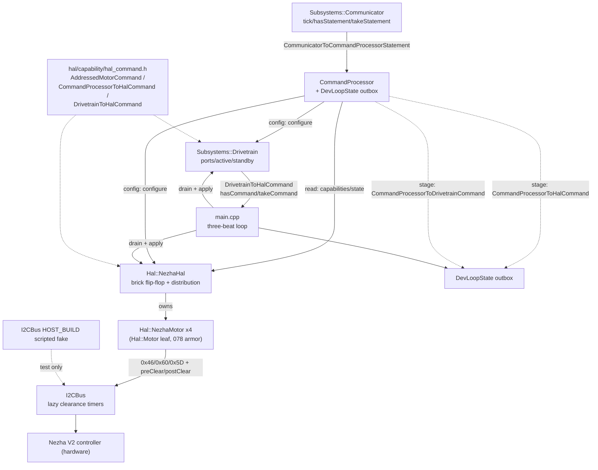
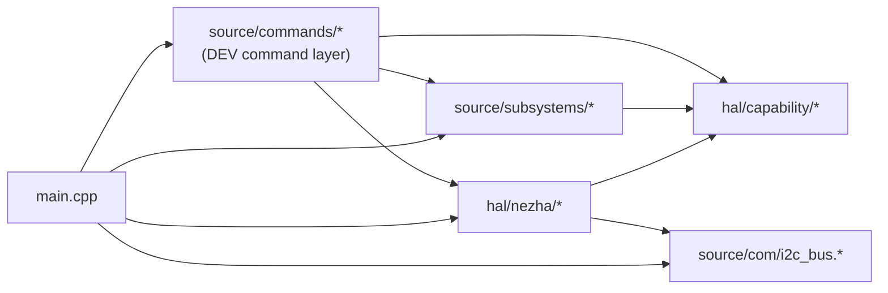

<!-- CLASI: Before changing code or making plans, review the SE process in CLAUDE.md -->

# Architecture Update — Sprint 079: Tick model and command flow: I2C lazy clearance, brick flip-flop, held-output faceplates, statements rename

This document maps the 2026-07-04 tick-model design sketch (all 10 stakeholder
decisions, SETTLED — implemented, not re-litigated here) onto the current
tree as it stands after sprint 078 (the reversal-latch armor, merged). It
resolves the sketch's remaining latitude (exact edge-type homes, the
authority-arbitration mechanism, the shape of the HAL's addressed-command
outbox) as concrete, buildable C++.

Source documents: `clasi/issues/tick-model-command-flow-and-the-command-board-design-sketch.md`,
`clasi/issues/i2c-bus-lazy-clearance-timers.md`, `clasi/issues/rename-wire-lines-to-statements.md`,
`clasi/sprints/done/078-motor-write-path-armor-.../architecture-update.md`.

## What Changed

1. **`I2CBus` gains lazy per-device clearance timers** (`source/com/i2c_bus.{h,cpp}`):
   a `DeviceSlot.lastEnd`/`readyAt` `// [us]` pair; `write()`/`read()` grow
   two new defaulted `// [us]` parameters (`preClear`, `postClear`); a
   non-spinning peek `bool clear(uint16_t addr7) const`. A new `HOST_BUILD`
   scripted-fake implementation (`source/com/i2c_bus_host.cpp`, new file)
   gives ticket 004's HAL tests (and any future host test) a dependency-free
   `I2CBus` to script against.
2. **`NezhaMotor`'s encoder path is wired split-phase**: `requestEncoder()`
   gains a `postClear=4000` on its 0x46 write; a new public `requestSample()`
   wraps it for the HAL's use; `tick()`'s per-tick sample now calls
   `collectEncoder()` (fixed to also set `connected_`) instead of the fused,
   always-blocking `readEncoderSettle()`, which is deleted. Every hand-rolled
   busy-wait in `nezha_motor.cpp` (`readEncoderAtomicRaw()`'s two spins,
   `writePositionMove()`'s trailing spin) is replaced by `preClear`/`postClear`
   arguments — the bus does the waiting now, not the caller.
3. **`NezhaHal` becomes the brick sequencer and the HAL's distribution
   point**: `activePort_`/`phase_` (REQUEST_DUE/COLLECT_DUE) drive one bus
   action per `tick()` slice, cycling only in-use ports; two new
   `apply(...)` overloads (`CommandProcessorToHalCommand`,
   `DrivetrainToHalCommand`, both defined in a new shared header,
   `source/hal/capability/hal_command.h`) mark ports in-use and forward to
   the addressed motor(s), expanding broadcasts.
4. **`Subsystems::Communicator`** (078's faceplate, commit 2599df3):
   `tick(now)` becomes void; `hasStatement()`/`takeStatement()` replace the
   returned edge; the edge type is renamed
   `CommunicatorToCommandProcessorStatement`; an untaken statement pauses
   transport polling.
5. **`Subsystems::Drivetrain`**: `tick()` becomes void +
   `hasCommand()`/`takeCommand()` yielding `Hal::DrivetrainToHalCommand`;
   port binding (`left_port`/`right_port`) moves into `DrivetrainConfig`; a
   new `DrivetrainPorts ports()` accessor and `bool active()` replace
   `DevLoopState::leftPort/rightPort/drivetrainActive`; a new `standby()`
   method plus a `msg::DrivetrainCommand.standby` side-channel field
   formalize authority arbitration (see "Authority arbitration" below).
6. **`CommandProcessor`/`dev_commands.*` become a pure transformer**:
   handlers stop calling `Hal::Motor`/`Drivetrain` write methods directly;
   they pre-validate against `capabilities()` (read-only) and stage addressed
   commands into `DevLoopState`'s new outbox fields; `main.cpp` is the sole
   caller of `hal.apply(...)`/`drivetrain.apply(...)` for anything
   DEV-sourced. `CommandQueue` (`source/commands/command_queue.h`) is
   deleted — vestigial, wired to nothing.
7. **`main.cpp`** gets the three-beat Part-2 loop: `hal.tick(now)` twice per
   pass (slice 1 collects, slice 2 requests/writes), the outbox drain
   in between, the old bound-pair explicit double-tick hack removed.
8. **Statements vocabulary lands**: `.claude/rules/naming-and-style.md` rule
   4 amended to `<Producer>To<Consumer><Payload>` (payload ∈ {Command,
   Statement}); `docs/protocol-v2.md` and source comments sweep "command
   line" → "statement line"/"statement" where they mean the wire line;
   `CommandProcessor`'s class name is kept (decision recorded below).
9. **Message schema** (`protos/drivetrain.proto`, regenerated via
   `scripts/gen_messages.py`): `DrivetrainConfig` gains `left_port`/
   `right_port` (`uint32`); `DrivetrainCommand` gains `optional bool standby`.
   No wire-protocol (ASCII line) changes of any kind — verbs, reply text,
   and `SET`/`GET`/`CFG` keys are frozen.

## Why

`NezhaMotor::tick()` blocks ~8 ms of every 10 ms tick spinning out the 0x46
settle window; with two ports in use the loop already burns most of its
budget on busy-waits, and comms (hence statement latency and watchdog
granularity) inherit that blindness. The command-flow inconsistency
(some edges returned, some pushed, a queue wired to nothing, "command"
naming both wire lines and internal messages) is a second, independent
problem the same design session addressed together. Fixing the cadence
without fixing the flow would leave the new, faster tick calling into a
still-inconsistent command surface; fixing the flow without the cadence
would leave the flip-flop's whole justification (statements polled every
pass, not every 32 ms) unrealized. The three pieces are one sprint because
they are one design.

## Impact on Existing Components

- **`source/com/i2c_bus.{h,cpp}`** — additive. Every existing call site
  (`writeMotorRun()`, `readVersion()`, `setGlobalSpeed()`, `resetHome()`,
  `timedMove()`) keeps its two-argument call untouched; defaults leave their
  behavior identical. `i2c_bus.cpp` remains device-only
  (`#include "MicroBit.h"` unconditional, as today); the new host path is a
  **separate** translation unit, never linked into the same binary.
- **`source/hal/nezha/nezha_motor.{h,cpp}`** — the 078 base/leaf contract's
  5-step call order in `NezhaMotor::tick()` is **preserved exactly**; only
  step 2's mechanism changes (see "The flip-flop and the 078 base-class
  contract" below). `writeRawDuty()`/`hardReset()`/`softRebaseline()`/
  `configureDevice()` (078's four protected primitives) are untouched.
  `Hal::Motor` (`hal/capability/motor.h`) is untouched except one small,
  reusable addition (`motorCommandAllowed()`, see Design Rationale).
- **`source/hal/nezha/nezha_hal.{h,cpp}`** — from a small owner/factory with
  a fixed 4-port sweep to the brick sequencer + distribution point. `Motor&
  motor(uint32_t port)` (the read/query accessor DEV STATE/CAPS and the
  processor's capability pre-checks use) is unchanged.
- **`source/subsystems/drivetrain.{h,cpp}`** — the ratio governor
  (`governRatio()`), kinematics (`commandedWheelTargets()`), and
  `msg::DrivetrainCommand`'s TWIST/WHEELS/NEUTRAL/POSE oneof are untouched.
  New: `DrivetrainToHalCommand`-shaped output, `ports()`/`active()`,
  `standby()`.
- **`source/subsystems/communicator.{h,cpp}`** — touched once (per the
  design's own constraint): `tick()` signature and the edge type change;
  `sendSerial()`/`sendRadio()` primitives, `state()`, `capabilities()`
  unchanged.
- **`source/commands/dev_commands.{h,cpp}`** — every handler that used to
  call `motor.apply(cmd)`/`drivetrain.apply(cmd)` directly now stages into
  `DevLoopState`; `DevLoopState` sheds `leftPort`/`rightPort`/
  `drivetrainActive` (replaced by `drivetrain.ports()`/`.active()`) and gains
  the outbox fields. `motorConfigShadow[]`/`drivetrainConfigShadow` (the
  CFG-delta staging areas) are unchanged — CFG stays a direct, parse-time,
  config-plane operation (see "Config-plane vs. command-plane" below).
- **`source/commands/command_processor.{h,cpp}`** — loses `CommandQueue`
  integration (`setQueue()`/`hasQueue()`/`dequeueOne()`/`_queue`); the
  tokenizer/dispatch-table machinery (`parseTokens()`, `parseKV()`,
  `dispatchTable()`, `process()`) is **unchanged** — see the Design
  Rationale on why the sketch's `processor.tick()/hasHalCommand()`
  pseudocode maps onto `DevLoopState` + the existing `CommandProcessor`
  jointly, not a rewritten `CommandProcessor`.
- **`source/main.cpp`** — the Part-2 loop; `initDefaultMotorConfigs()` and
  the `Hal::NezhaHal`/`Subsystems::Drivetrain` construction are otherwise
  unchanged (still bench-placeholder calibration, still `ROBOT_DEV_BUILD`-gated).
- **`docs/protocol-v2.md`** — §16's "Every DEV handler ... dispatches it
  through `apply()` ... rather than calling a primitive setter directly"
  sentence is corrected to describe the outbox handoff; the `DEV DT PORTS`
  section gains a line noting the binding now lives in `DrivetrainConfig`
  (wire text `DEV DT PORTS <left> <right>` → `OK DEV DT ports=<left>,<right>`
  is unchanged); "command line" language elsewhere becomes "statement line".
- **`.claude/rules/naming-and-style.md`** rule 4 — amended in place (see
  below); no other rule changes.
- **Nothing on the wire changes.** Every ASCII verb, reply field name, and
  `SET`/`GET`/`CFG` key from `docs/protocol-v2.md` §7/§16 is byte-identical
  before and after this sprint.

## Migration Concerns

- **No data migration.** `DrivetrainConfig`/`DrivetrainCommand` are in-memory
  wire messages regenerated by `scripts/gen_messages.py` on every build;
  there is no persisted instance. `left_port`/`right_port` default to 0
  (proto3 zero value) unless `main.cpp` seeds them — ticket 005 must seed
  `dtConfig.left_port=1, right_port=2` explicitly at boot (today's
  `DevLoopState::leftPort{1}/rightPort{2}` member-initializer defaults move
  here 1:1; forgetting this seeding step is a real regression risk since a
  zero-valued port would address `motor(0)`, which `NezhaHal::motor()`
  clamps to port 4 rather than trapping — silently wrong, not a crash).
- **Deployment sequencing** (ticket order, see "Ticket sequencing" below):
  `I2CBus` substrate (001) and statements/Communicator (002) first — both
  are self-contained and everything downstream depends on at least one;
  Drivetrain reshape + shared edge types (003) before the HAL that consumes
  them (004); the HAL before the processor reshape that stages toward it
  (005); the stand pass (006) last, gating the whole sprint's acceptance.
  No ticket leaves the tree non-building at its own boundary — see each
  ticket's own scope note.
- **This sprint sequences after 078** (already merged) — the armor's shared
  base-class methods (`processResetIfPending`/`updateWedgeDetector`/
  `armoredWrite`) take `now`/`duty` as explicit parameters, not implicit
  scheduler state, so they need **no change** here; only the *mechanism* by
  which `NezhaMotor::tick()` obtains its position sample (step 2) changes —
  see the next section for the exact mapping, which is this sprint's
  discharge of 078's own Migration Concerns/Open-Question-5 flag ("the 079
  planner should re-verify the base's shared methods and the leaf `tick()`
  call-order contract still fit").
- **`vel_filt_alpha` retune is a required, not optional, migration step** —
  bench-tuned at the ~10-32 ms cadence, it does not automatically hold at
  the new ~11-26 ms (2 ports) or faster cadence; ticket 006 retunes it on
  the stand. This is explicitly the same silent-failure class the
  `alpha=0` episode already demonstrated (078's `main.cpp` comment) — a
  wrong-but-plausible-looking value produces no error, just a stale
  `vel=` reading.
- **Wire compatibility**: the `DEV` family remains dev-build-only
  (`ROBOT_DEV_BUILD`), no external consumer contract beyond this repo's own
  bench tooling.
- **Shared-0x10 clobber (design sketch risk 1) is a verification concern,
  not a design gap**: `postClear`-on-request plus write-at-collect-only
  (NezhaMotor's `armoredWrite()`/mode dispatch only ever calls
  `writeRawDuty()` from within `tick()`, which the flip-flop only invokes
  during `COLLECT_DUE` after `bus_.clear()` confirms the window elapsed) are
  structural by construction in this design — no code path issues a 0x60/0x5D
  write to `0x10` while a 0x46 request's `readyAt` is still in the future,
  since `I2CBus` itself would spin-hold any such write at entry. What this
  document *cannot* prove is that an **abandoned** collect (HAL scheduler
  moves on before a slow/failed settle) leaves the readback register in a
  state the *next* request cleanly overwrites — that is a hardware timing
  question, not a code-review one, and stays ticket 006's stand-gate
  responsibility (see the ticket).

## The flip-flop and the 078 base-class contract

078's `Hal::Motor` mandates this exact 5-step order inside every leaf's
`tick()` (`architecture-update-078.md`, "The base/leaf split — exact
contract"):

1. `processResetIfPending(now)`
2. leaf samples + caches its own position/velocity
3. `updateWedgeDetector()`
4. mode dispatch → `armoredWrite(duty, now)` (or `writePositionMove()` for
   POSITION, out of the armor's scope)
5. `updateRestTracking()`

079 changes **only step 2's mechanism** — from a fused, blocking
`readEncoderSettle()` (write, spin 4 ms, read, every call) to consuming a
sample that was *requested* in a **previous** HAL slice and is now merely
*collected* (a non-blocking read, gated by the bus's own lazy clearance so
it never returns garbage). Steps 1, 3, 4, 5 and their relative order inside
`NezhaMotor::tick()` are **untouched, byte-for-byte** — this is the
discharge of 078's flagged handoff question.

```cpp
// NezhaMotor::tick() — step 2, before (078/077):
float pos = readEncoderSettle();   // write 0x46, spin 4ms, read -- ~4-8ms every call

// NezhaMotor::tick() — step 2, after (079):
int32_t raw = collectEncoder();    // non-blocking read; bus_.clear() already
                                    // confirmed by the HAL before this call
float pos = (static_cast<float>(raw) / 10.0f)
          * config_.travel_calib * static_cast<float>(config_.fwd_sign);
```

`collectEncoder()` gains the one line it was missing to be tick()-safe:
`connected_ = pendingEncRequestOk_ && (readResult == MICROBIT_OK);` (today it
leaves `connected_` untouched — dead-code-safe only because nothing called
it). `readEncoderSettle()` is **deleted** — its sole caller is gone, and
keeping it as unreferenced code would violate the same
duplicated-decision/leaky-abstraction concern 078's Design Rationale 6 named
for `writeDuty()`'s reversal-exemption branch.

The **HAL** owns *when* step 2's non-blocking read is safe to call — that is
what the brick flip-flop is:

```cpp
// NezhaHal::tick() — the brick sequencer (Part 1 of the design sketch,
// implemented against this tree's actual member/method names).
void NezhaHal::tick(uint32_t now) {
    if (!anyPortInUse()) return;                    // idle schedule (decision 1)
    if (!portInUse_[activePort_ - 1]) {
        activePort_ = nextPortInUse(activePort_);    // defensive resync
    }
    switch (phase_) {
        case Phase::REQUEST_DUE:
            motorAt(activePort_).requestSample();    // 0x46 write, postClear=4000 [us]
            phase_ = Phase::COLLECT_DUE;
            break;
        case Phase::COLLECT_DUE:
            if (!bus_.clear(kNezhaDeviceAddr)) return;   // settle window still open -- pass
            motorAt(activePort_).tick(now);              // the 5-step contract above
            activePort_ = nextPortInUse(activePort_);
            phase_ = Phase::REQUEST_DUE;
            break;
    }
}
```

`requestSample()` is a **new, `NezhaMotor`-only public method** (not a
`Hal::Motor` virtual — request/collect splitting is a Nezha-specific
consequence of four ports sharing one device address, not a universal HAL
concept a future `SimMotor` would need). It wraps the already-ported,
previously-unwired `requestEncoder()`. `motorAt(uint32_t)` is a new private
`NezhaHal` helper returning the concrete `NezhaMotor&` (NezhaHal already
owns concrete members, not `Hal::Motor*` pointers — see today's
`nezha_hal.cpp`); it is used for scheduling and for `apply()`'s distribution
(next section). `kNezhaDeviceAddr` is `0x10`, promoted from
`NezhaMotor::kAddr` (private) to a `namespace Hal` constant shared by both
classes.

**`I2CBus::clear()`'s address convention** — `clear(uint16_t addr7)` takes
the **7-bit** device address, matching `txnCount()`/`errCount()`/`lastErr()`'s
existing convention, *not* the 8-bit wire address (`addr7 << 1`) that
`write()`/`read()` take. `NezhaHal` calls `bus_.clear(kNezhaDeviceAddr)`
with the bare `0x10` — **not** `(kNezhaDeviceAddr << 1)`. This is an easy
off-by-one-bit trap; ticket 004's host tests must assert it explicitly
(script the fake bus's `readyAt` for `0x10` and confirm `clear(0x10)`
reflects it, `clear(0x20)` does not).

## The I2CBus lazy-clearance mechanism — exact contract

`DeviceSlot` (per `clasi/issues/i2c-bus-lazy-clearance-timers.md`
constraint 1 — per-device, not bus-global) gains:

```cpp
struct DeviceSlot {
    uint16_t addr;
    uint32_t txnCount;
    uint32_t errCount;
    int      lastErr;
    uint64_t lastEnd;    // [us] end time of the most recent transaction to this device
    uint64_t readyAt;    // [us] max(lastEnd, previous readyAt) + that transaction's postClear
};
```

`write()`/`read()` gain two new, defaulted `// [us]` parameters:

```cpp
int write(uint16_t address, uint8_t* data, int len, bool repeated = false,
          uint32_t preClear = 0, uint32_t postClear = 0);
int read (uint16_t address, uint8_t* data, int len, bool repeated = false,
          uint32_t preClear = 0, uint32_t postClear = 0);
```

At **entry**, before the re-entrancy guard's `target_disable_irq()` critical
section begins (constraint 2 — the clearance spin must stay **outside** the
IRQ-masked window):

```cpp
int idx = findOrAdd(addr7);
uint64_t entryDeadline = std::max(_devices[idx].readyAt,
                                   _devices[idx].lastEnd + preClear);
uint64_t nowUs = clockUs();   // system_timer_current_time_us() on-device
while (nowUs < entryDeadline) { nowUs = clockUs(); }   // spin -- vendor no-interleave property
```

After the transaction completes (after `record()`/`logTxn()`):

```cpp
_devices[idx].lastEnd  = clockUs();
_devices[idx].readyAt  = _devices[idx].lastEnd + postClear;
```

Every existing call site (`writeMotorRun()`'s 0x60, `readVersion()`'s 0x88,
etc.) keeps its 4-argument call — defaults (`preClear=0, postClear=0`)
collapse `entryDeadline` to `lastEnd`, which is always in the past by the
time the *next* call happens, so the spin costs nothing and today's
behavior is bit-for-bit preserved. **One call site changes**:
`requestEncoder()`'s 0x46 write passes `postClear=4000` — per constraint 4,
this single change holds off *any* subsequent transaction to `0x10`
(including a stray 0x60 velocity write mid-settle), because `readyAt` is
per-**device**, not per-call-site. `collectEncoder()`'s read needs **no**
parameter change: by the time the HAL's `COLLECT_DUE` slice calls it,
`bus_.clear()` has already confirmed `now >= readyAt`, so the entry spin
inside `read()` fires immediately (free) — this is "the timer alone saves
nothing... restructured call sites are where the time comes from" made
concrete. `readEncoderAtomicRaw()` (hardReset's median-of-3 path) and
`writePositionMove()`'s trailing spin both lose their hand-rolled
`while` loops, replaced by `preClear=4000`/`postClear=4000` (atomic path)
and `postClear=4000` (position move) respectively — the busy-wait moves
into `I2CBus`, exactly per the issue's title.

**`HOST_BUILD` stub** (`source/com/i2c_bus_host.cpp`, new file, compiled
only when `HOST_BUILD` is defined, never linked alongside the real
`i2c_bus.cpp`): same public surface (`write`/`read`/`clear`/`txnCount`/etc.),
backed by a scripted transaction queue instead of `MicroBitI2C` — a test
pre-loads expected `(addr, bytes, status)` tuples (for writes) and canned
response bytes (for reads), and the fake still runs the exact
`lastEnd`/`readyAt` bookkeeping above against an **injectable, steppable**
clock (a test-settable counter rather than a wall clock), so a host test can
assert "collect before the settle window elapses returns a value computed
from a spun-remainder wait" without a real 4 ms sleep. Ticket 001 owns the
exact clock-injection mechanism (a function pointer defaulting to a real
clock on-device, a static test-settable counter under `HOST_BUILD` is one
reasonable shape; the choice is implementation, not architecture).

## Config-plane vs. command-plane — which statements cross an outbox

The design sketch itself draws this line: *"Wiring-level statements
(watchdog window; see Part 5 for PORTS) configure the loop state at parse
time — they are not device commands."* This sprint extends that same
principle to every DEV verb that mutates **configuration** rather than a
**streamed setpoint**:

| Statement | Plane | Mechanism |
|---|---|---|
| `DEV M <n> CFG k=v ...` | config | direct: merge into `motorConfigShadow[n-1]`, call `hal->motor(n).configure(cfg)` |
| `DEV DT CFG k=v ...` | config | direct: merge into `drivetrainConfigShadow`, call `drivetrain->configure(cfg)` |
| `DEV DT PORTS <l> <r>` | config | direct: merge `left_port`/`right_port` into `drivetrainConfigShadow`, `configure()`, then refresh the capability cache (`drivetrain->setMotorCapabilities(hal->motor(l).capabilities(), hal->motor(r).capabilities())`) — all read/config-plane, no outbox |
| `DEV WD <window>` | config | direct: `watchdog->setWindow(window)` |
| `DEV M <n> STATE/CAPS`, `DEV DT STATE`, `DEV STATE` | observation | direct: read-only `state()`/`capabilities()`/`ports()`/`active()` |
| `DEV M <n> DUTY/VEL/POS/VOLT/NEUTRAL/RESET` | **command** | staged: `CommandProcessorToHalCommand` (1 addressed entry) |
| `DEV DT VW/WHEELS/NEUTRAL` | **command** | staged: `CommandProcessorToDrivetrainCommand` (== `msg::DrivetrainCommand`) |
| `DEV DT STOP` | **command** | staged: `CommandProcessorToHalCommand` (2 addressed entries, the bound pair) + `CommandProcessorToDrivetrainCommand{NEUTRAL, standby=true}` |
| `DEV STOP` / watchdog fire | **command** | staged (`DEV STOP`) or applied immediately (watchdog — main.cpp is top-of-tree, see "Authority arbitration") via the same `buildBroadcastNeutral()`/`buildDrivetrainStop()` helpers |

Capability validation (`unsupported` `ERR`s) happens **before** staging, via
a read-only `capabilities()` call — see Design Rationale on
`motorCommandAllowed()`. `OK` means "parsed, validated, delivered-for-staging"
— identical wire behavior to today (today's `OK` also fires only after a
guaranteed-successful `apply()`; pre-validating against the same
capability gate makes the guarantee before staging instead of after
applying, with no observable difference at the wire).

## The command-edge types

New header, **`source/hal/capability/hal_command.h`** (headers-only, no
`.cpp` — consistent with 077/078's `capability/` constraint):

```cpp
namespace Hal {

// A MotorCommand plus which port it targets. Shared shape for both of the
// HAL's command-in edges (decisions 3/8): the processor's addressed
// single-motor traffic and the Drivetrain's governed wheel pair both
// address the HAL's ports through this same pair.
struct AddressedMotorCommand {
  uint32_t port = 0;            // 1..NezhaHal::kPortCount
  msg::MotorCommand command;
};

// CommandProcessorToHalCommand -- <Producer>To<Consumer>Command (rule 4).
// count in {0,1,2}: DEV M <n> stages 1; DEV DT STOP stages 2 (the bound
// pair, addressed -- NOT the same as allPorts); DEV STOP / the watchdog
// use allPorts (count ignored, addressed[0].command applied to every port
// NezhaHal owns; the port field is unused for a broadcast). Broadcast does
// NOT mark any port in-use -- see Design Rationale.
struct CommandProcessorToHalCommand {
  bool allPorts = false;
  uint8_t count = 0;
  AddressedMotorCommand addressed[2];
};

// DrivetrainToHalCommand -- <Producer>To<Consumer>Command (rule 4). The
// Drivetrain's governed two-wheel target, addressed via DrivetrainConfig's
// port binding. See Design Rationale for why this lives here (Hal::capability)
// rather than in subsystems/drivetrain.h despite Drivetrain being the
// producer.
struct DrivetrainToHalCommand {
  AddressedMotorCommand wheel[2];   // [0]=left, [1]=right
};

}  // namespace Hal
```

`CommandProcessorToDrivetrainCommand` is **not** a new wrapper type — it is
`msg::DrivetrainCommand` itself (Drivetrain's `apply()` signature is
unchanged), aliased in doc comments as this sprint's
`<Producer>To<Consumer>Command` edge for that direction. Unlike the HAL,
there is exactly one `Drivetrain` instance and no addressing to carry, so a
wrapper struct would add a field nobody reads.

`NezhaHal::apply()` (two overloads, both mark ports in-use per decision 1
except the broadcast case):

```cpp
void NezhaHal::apply(const CommandProcessorToHalCommand& cmd) {
    if (cmd.allPorts) {
        for (uint32_t p = 1; p <= kPortCount; ++p) {
            motorAt(p).apply(cmd.addressed[0].command);
        }
        return;   // broadcast never marks a port in-use -- see Design Rationale
    }
    for (uint8_t i = 0; i < cmd.count; ++i) {
        portInUse_[cmd.addressed[i].port - 1] = true;
        motorAt(cmd.addressed[i].port).apply(cmd.addressed[i].command);
    }
}

void NezhaHal::apply(const DrivetrainToHalCommand& cmd) {
    for (int i = 0; i < 2; ++i) {
        portInUse_[cmd.wheel[i].port - 1] = true;
        motorAt(cmd.wheel[i].port).apply(cmd.wheel[i].command);
    }
}
```

## Authority arbitration — Drivetrain-owned, not DevLoopState-owned

Today, `DevLoopState::drivetrainActive` (external to `Drivetrain`) gates
whether `main.cpp` calls `drivetrain.tick()`/applies its output at all; a
`DEV M` motion verb on a bound port clears it directly
(`isBoundPort()` in `dev_commands.cpp`). Since port binding moves *into*
`DrivetrainConfig` (decision 8), authority — "am I the one actually driving
my bound pair right now" — is the same *kind* of fact and moves with it:

```cpp
// drivetrain.h
struct DrivetrainPorts { uint32_t left; uint32_t right; };

class Drivetrain {
 public:
  bool active() const { return active_; }
  DrivetrainPorts ports() const {
      return {config_.get_left_port(), config_.get_right_port()};
  }
  // The one audited "relinquish authority" path (mirrors Case 4's "neutral
  // staged everywhere via the one audited path"). Does NOT touch mode_ --
  // a caller that also wants mode_ == NEUTRAL sends that via the SAME
  // command's oneof arm (setNeutral()) alongside standby (see below).
  void standby() { active_ = false; }

  bool hasCommand() const { return hasCommand_; }
  Hal::DrivetrainToHalCommand takeCommand();   // clears hasCommand_

  void apply(const msg::DrivetrainCommand& command);   // unchanged signature
  void tick(uint32_t now, const msg::MotorState& leftObs,
            const msg::MotorState& rightObs);           // now void; holds output

 private:
  bool active_ = false;
  bool hasCommand_ = false;
  Hal::DrivetrainToHalCommand heldCommand_ = {};
  ...
};
```

`setTwist()`/`setWheelTargets()`/`setNeutral()` (the existing primitive
setters `apply()`'s oneof dispatch calls) each gain one line,
`active_ = true;` — matching `docs/protocol-v2.md`'s existing rule ("Any
`DEV DT` verb that commands the drivetrain (`VW`, `WHEELS`, `NEUTRAL`)
(re)activates drivetrain authority"). `msg::DrivetrainCommand` gains a new
side-channel field, riding beside the oneof exactly like `MotorCommand`'s
`feedforward`/`reset_position`:

```proto
message DrivetrainCommand {
  oneof control { ... }               // unchanged
  optional bool seed    = 5;          // unchanged
  optional bool standby = 6;          // NEW: relinquish authority, no mode change
}
```

`Drivetrain::apply()` processes the oneof first, then the side-channel:

```cpp
void Drivetrain::apply(const msg::DrivetrainCommand& command) {
    switch (command.get_control_kind()) { /* unchanged TWIST/WHEELS/NEUTRAL/POSE/NONE */ }
    if (command.get_standby().has && command.get_standby().val) {
        standby();
    }
}
```

This one mechanism covers every stop-shaped case with the *same* fidelity
today's two separate free functions (`neutralizeAll`/`neutralizeDrivetrain`)
have:

- **`DEV DT STOP` / `DEV STOP` / watchdog fire** — the caller constructs
  `{control_kind=NEUTRAL(mode), standby=true}`: `setNeutral()` sets
  `mode_=NEUTRAL, active_=true`, then the side-channel immediately drops
  `active_` back to `false` — net: `mode_==NEUTRAL` (so a subsequent
  `STATE` query correctly reports zero targets) and `active_==false` (no
  further re-application). Identical to today's
  `neutralizeDrivetrain()`/`neutralizeAll()` net effect.
- **An unbound-port-safe `DEV M <n>` steals authority** — the processor
  constructs `{control_kind=NONE, standby=true}`: the oneof switch's
  existing `NONE`/`default` case does nothing, `mode_`/the last commanded
  target are **untouched** (preserving today's exact, slightly-quirky
  behavior where a stolen Drivetrain's `STATE` still reports its
  pre-steal target until the next real command), and only `active_` drops.

`isBoundPort()` moves from reading `state.leftPort`/`state.rightPort`
(deleted) to reading `state.drivetrain->ports()` (read-only, allowed).

## The processor is `DevLoopState` + `CommandProcessor`, not a rewritten `CommandProcessor`

The design sketch's Part 2 pseudocode names a single `processor` with
`apply()`/`tick()`/`hasHalCommand()`/`takeHalCommand()`/
`hasDrivetrainCommand()`/`takeDrivetrainCommand()`. The literal
`CommandProcessor` class in this tree is a **generic**, domain-blind
table-driven dispatcher — `system_commands.cpp` (PING/VER/HELP/ECHO/ID)
uses the exact same class with zero HAL/Drivetrain awareness, and the
`#else` (non-`ROBOT_DEV_BUILD`) branch of `main.cpp` runs it with no DEV
family registered at all. Giving `CommandProcessor` itself
`hasHalCommand()`/`hasDrivetrainCommand()` methods would bake DEV-specific
domain knowledge into a class whose entire value is that it *doesn't* know
what any given command family does.

This sprint resolves that tension (a genuine gap the sketch's pseudocode,
written at the conceptual level, did not need to close) by splitting the
sketch's single `processor` across the two things that already jointly play
that role:

- **`CommandProcessor`** keeps its existing, unchanged shape
  (`parseTokens()`/`parseKV()`/`dispatchTable()`) as the "methods below"
  tier — the mechanical tokenize-and-dispatch machinery, reused by every
  command family including non-DEV ones.
- **`DevLoopState`** (already the DEV family's shared handler context,
  already threaded through every DEV `HandlerFn` call as `handlerCtx`)
  becomes the concrete outbox: it gains `hasHalCommand`/`halCommand`/
  `hasDrivetrainCommand`/`drivetrainCommand` fields that DEV handlers stage
  into directly, and `main.cpp` drains them each pass — exactly the
  held/taken discipline the sketch specifies, just realized as struct
  fields on the existing shared-context object rather than new methods on
  the generic dispatcher.

`CommandProcessor::process(line, replyFn, ctx)` is still called once per
statement, from inside `main.cpp`'s loop body (previously it was called
from the same place; only the surrounding loop shape changes — see "The
Part-2 loop" below). Replies are unaffected: they are direct
`comm.sendSerial()`/`comm.sendRadio()` calls (via the existing
`replyFn`/`replyCtx` plumbing), synchronous, exactly as today — the
design sketch's own worked cases show replies firing directly out of
`tick()`-equivalent dispatch ("processor.tick parses → `OK` out serial"),
never through a held/taken outbox. Only **device-mutating** commands
(HAL motor setpoints, Drivetrain setpoints) are held+taken; replies and
config-plane operations are not.

**`CommandQueue` deletion** (decision 5): `source/commands/command_queue.h`
is removed; `CommandProcessor` loses `setQueue()`/`hasQueue()`/
`dequeueOne()`/`_queue`; `command_processor.cpp`'s `#include
"command_queue.h"` and `dequeueOne()` body are removed. No other file
references `CommandQueue` (confirmed by repo-wide grep) — a clean,
self-contained deletion.

## The Part-2 loop

```cpp
while (true) {
    uint32_t now = uBit.systemTime();

    hal.tick(now);                                   // slice 1: due collects land

    comm.tick(now);
    if (comm.hasStatement()) {
        Subsystems::CommunicatorToCommandProcessorStatement in = comm.takeStatement();
        watchdog.feed(now);
        cmd.process(in.line,
                    in.returnPath == Subsystems::Channel::RADIO ? radioReply : serialReply,
                    &comm);
    }

    if (devState.hasHalCommand) {
        hal.apply(devState.halCommand);
        devState.hasHalCommand = false;
    }
    if (devState.hasDrivetrainCommand) {
        drivetrain.apply(devState.drivetrainCommand);
        devState.hasDrivetrainCommand = false;
    }

    if (drivetrain.active()) {
        Subsystems::DrivetrainPorts p = drivetrain.ports();
        drivetrain.tick(now, hal.motor(p.left).state(), hal.motor(p.right).state());
        if (drivetrain.hasCommand()) {
            hal.apply(drivetrain.takeCommand());
        }
    }

    hal.tick(now);                                   // slice 2: requests/writes go out

    if (watchdog.check(now)) {
        hal.apply(buildBroadcastNeutral(msg::Neutral::BRAKE));
        drivetrain.apply(buildDrivetrainStop(msg::Neutral::BRAKE));
        CommandProcessor::replyEvt(wbuf, sizeof(wbuf), "dev_watchdog", nullptr, serialReply, &comm);
    }
}
```

`buildBroadcastNeutral(mode)`/`buildDrivetrainStop(mode)` (free functions,
`dev_commands.{h,cpp}`) are the **one audited construction path** shared by
`DEV STOP`'s handler (which stages their output into `devState`, since it
runs from inside a parsed statement and must respect the held/taken
discipline) and the watchdog-fire path above (which applies them
**immediately** — `main.cpp` is the top of the call tree, already the
"visible mover of every command," and an emergency stop gains nothing from
an extra pass of latency). This is a deliberate, narrow exception to "never
call `apply()` outside main/the HAL," justified by `main.cpp` already being
the one place the design sketch itself calls the unconditional orchestrator,
not a subsystem.

The old bound-pair explicit double-tick (`main.cpp:231-235` today) is
**gone** — folded into the sanctioned double `hal.tick()` call (decision 6);
`hal.tick()`'s own flip-flop now cycles every in-use port evenly, including
whichever pair the Drivetrain is bound to, with no main.cpp-level
special-casing.

## Component / Module Diagram



No cycles. `Hal::capability` (the shared, stable tier: `motor.h` +
new `hal_command.h`) is depended on by both `Hal::nezha` and
`Subsystems::Drivetrain`; neither depends on the other, and `Hal` never
depends on `Subsystems` (see Design Rationale on edge-type placement).
Fan-out: `main.cpp` → {Comm, CP, Hal, DT} = 4, within bounds; `Hal::capability`
→ {Hal::nezha, Subsystems::Drivetrain} = 2 consumers, not a fan-out risk
(it's a leaf dependency, not an orchestrator).

## Dependency Graph



Unchanged direction from 077/078 at the subsystem level
(`[commands] → [subsystems/hal] → [com/hardware]`, domain-inward). The one
**new** edge this sprint introduces is `subsystems → hal/capability`
(`Subsystems::Drivetrain` now includes `hal/capability/hal_command.h` for
`Hal::DrivetrainToHalCommand`) — a data-only dependency on the same stable
tier `Drivetrain` already depends on via `messages/motor.h`, not a new
*kind* of coupling. No edge points from `hal/*` back into `subsystems/*` or
`commands/*` anywhere in this design.

## Brick flip-flop state diagram

```mermaid
stateDiagram-v2
    [*] --> REQUEST_DUE
    REQUEST_DUE --> COLLECT_DUE: anyPortInUse()\n(requestSample() on activePort_)
    REQUEST_DUE --> REQUEST_DUE: !anyPortInUse()\n(idle -- no bus action)
    COLLECT_DUE --> COLLECT_DUE: !bus_.clear(kNezhaDeviceAddr)\n(settle still open -- pass)
    COLLECT_DUE --> REQUEST_DUE: bus_.clear() true\n(tick() collects; activePort_ = nextPortInUse())
```



## Design Rationale

### Decision 1: `CommandProcessorToHalCommand`/`DrivetrainToHalCommand` live in `hal/capability/`, not next to their producers

**Context**: the existing precedent in this tree (`CommunicatorToCommandProcessorStatement`
in `communicator.h`, the old `DrivetrainToMotorCommand` in `drivetrain.h`) is
"the producer's header defines the edge struct." Applying that literally to
`DrivetrainToHalCommand` would put it in `drivetrain.h`, but `NezhaHal` (the
consumer) needs to name the type in its own `apply()` overload signature —
requiring `nezha_hal.h` to `#include "subsystems/drivetrain.h"`, a `Hal →
Subsystems` dependency that does not exist anywhere else in this tree and
inverts the established direction (`Subsystems` depends on `Hal`, never the
reverse — `Drivetrain` today deliberately holds no `Hal::Motor` reference at
all).

**Alternatives considered**: (a) put it in `drivetrain.h` anyway and accept
the new `Hal → Subsystems` include — rejected, it is exactly the kind of
backward/circular coupling the Anti-Pattern list warns about, and would be
the first such edge in the codebase; (b) put it in `commands/` (since the
`CommandProcessor`-sourced edge, `CommandProcessorToHalCommand`, is
"produced" by the DEV command layer) — rejected for the *same* reason in
the other direction: `commands/` sits **above** both `Hal` and `Subsystems`
in the layering, so `NezhaHal` naming a type from `commands/` in its own
header would be an even worse inversion.

**Why this choice**: per the Dependency Direction principle ("depend on
interfaces, not implementations; dependencies flow from unstable toward
stable"), the *consumer* that is lowest/most-stable in the stack should own
the contract type, and producers depend on it — exactly the classic
dependency-inversion shape. `Hal::capability` is already that stable,
data-only tier (`hal/capability/motor.h` holds `msg::MotorCommand`-adjacent
shared types every higher layer depends on); adding `hal_command.h` beside
it is a natural extension, not a new architectural style. `Subsystems::Drivetrain`
including a data-only header from `Hal::capability` is not a new *kind* of
dependency — it already includes `messages/motor.h`, similarly Hal-adjacent
shared data.

**Consequences**: the "producer defines the edge" heuristic from the
Communicator/old-Drivetrain precedent is **not universal** — it holds only
when the producer is also the more-stable party. This document is the
record for a future reader who notices the asymmetry.

### Decision 2: config-plane statements (CFG, PORTS, WD) stay direct calls; only setpoint-shaped statements cross an outbox

**Context**: the design sketch's "no device write access" language, read
literally and generally, could be (mis)taken to mean *every* handler-side
call into `Hal`/`Drivetrain` must be eliminated, including `configure()`.

**Why this choice**: the sketch itself draws the line explicitly — "Wiring-
level statements (watchdog window; see Part 5 for PORTS) configure the loop
state at parse time — they are not device commands." `configure()` is
already a *separate, declared faceplate channel* (config), distinct from
the *command* channel `apply()` serves — this project's four-channel
faceplate contract (config / command-in / command-out / observation)
predates this sprint. Routing config deltas through an outbox would require
inventing addressed config-delta message shapes for no behavioral gain
(config is idempotent, not "held and possibly overwritten before being
acted on" the way a setpoint is), and the sketch's own worked cases never
mention CFG at all.

**Alternatives considered**: route CFG/PORTS/WD through the outbox too, for
uniformity. Rejected — no worked case or decision from the design sketch
calls for it, it would add an addressed-config-delta struct with no
consumer benefit, and it would contradict the sketch's own explicit
"wiring-level statements... are not device commands" carve-out.

**Consequences**: `DevLoopState::motorConfigShadow[]`/`drivetrainConfigShadow`
and their read-modify-write CFG merge logic are **unchanged** by this
sprint; only the *setpoint*-shaped verbs (DUTY/VEL/POS/VOLT/NEUTRAL/RESET,
VW/WHEELS/NEUTRAL, STOP/STOP) move to the held/taken discipline.

### Decision 3: capability pre-validation is a shared, reusable predicate, not duplicated logic

**Context**: the processor must reject an unsupported mode (e.g. `VOLT` on
Nezha) **before** staging, since it no longer calls `apply()` to discover
the rejection after the fact. The gating rule ("which `MotorCapabilities`
bit gates which `ControlKind`") already lives inside `Hal::Motor::apply()`'s
switch.

**Why this choice**: extract that switch into a small, reusable free
function in `hal/capability/motor.h`:

```cpp
inline bool motorCommandAllowed(const msg::MotorCapabilities& caps,
                                 msg::MotorCommand::ControlKind kind) {
    switch (kind) {
        case msg::MotorCommand::ControlKind::DUTY_CYCLE: return caps.duty_cycle;
        case msg::MotorCommand::ControlKind::VOLTAGE:    return caps.voltage;
        case msg::MotorCommand::ControlKind::VELOCITY:   return caps.velocity;
        case msg::MotorCommand::ControlKind::POSITION:   return caps.position;
        case msg::MotorCommand::ControlKind::NEUTRAL:
        case msg::MotorCommand::ControlKind::NONE:
        default: return true;   // never gated
    }
}
```

`Motor::apply()` calls it too (replacing its inline `if (!caps.xxx)` checks
one-for-one), so the gate is defined exactly once. `dev_commands.cpp` calls
`Hal::motorCommandAllowed(motor.capabilities(), cmd.get_control_kind())`
before staging.

**Alternatives considered**: duplicate a thin copy of the switch directly in
`dev_commands.cpp`. Rejected — two independently-maintained copies of "which
capability gates which mode" is exactly the shotgun-surgery risk a future
fifth `MotorCommand::ControlKind` arm would hit (miss one copy, get a
capability-gate mismatch between what `STATE`/`CAPS` implies and what
actually gets staged).

**Consequences**: `Hal::Motor::apply()`'s body shrinks slightly (one
function call replaces five inline `if`s); zero behavior change.

### Decision 4: `CommandProcessorToHalCommand` carries up to 2 addressed entries plus a broadcast flag, not just 1

**Context**: three distinct HAL-addressing shapes exist in the current DEV
vocabulary: one port (`DEV M <n>`), exactly the bound pair, addressed, not
broadcast (`DEV DT STOP` — mirrors today's `neutralizeDrivetrain()`, which
neutrals only `state.leftPort`/`state.rightPort`, never all four), and every
port (`DEV STOP`/watchdog — mirrors `neutralizeAll()`).

**Why this choice**: a single addressed slot could not express `DEV DT
STOP` without either (a) becoming a full broadcast (wrong — it would also
neutral an independent, unbound motor a bench test is using as a load,
silently changing today's scoped-STOP semantics) or (b) two separate
`hal.apply()` calls from the handler (wrong — reintroduces "handler touches
the HAL more than once per statement," and breaks the "one held command per
outbox slot per tick" discipline). A fixed 2-entry array plus a broadcast
flag covers all three shapes exactly, with no dynamic allocation and no
over-general "N addressed ports" facility the current vocabulary does not
need.

**Alternatives considered**: model broadcast as "addressed, all 4 entries" —
rejected, wastes 2 of 4 array slots on every single-motor command (the
overwhelmingly common case) for a rare (STOP-only) shape; a `count`+2-slot
array is smaller and the broadcast flag makes the "all ports, ignore
addressing" case explicit rather than inferred from a full array.

**Consequences**: flagged in Open Questions — if a future verb needs 3+
simultaneously-addressed, non-broadcast ports, this shape needs revisiting;
not a concern for anything in this sprint's scope.

### Decision 5: broadcast HAL commands never mark a port in-use

**Context**: decision 1 of the design sketch ties encoder sampling
activation to "the first command the HAL **distributes** to" a port. `DEV
STOP`/the watchdog's broadcast neutral touches every port, including ones
nobody has ever addressed individually.

**Why this choice**: if broadcast marked ports in-use, a single `DEV STOP`
at boot (or one watchdog trip) would permanently activate encoder sampling
on all four ports forever, defeating decision 1's entire purpose (bound
CPU/bus cost to ports someone actually cares about) as a side effect of the
*safety* path, not a real command. Scoping "in-use" activation to addressed
(non-broadcast) `apply()` calls only preserves decision 1's intent exactly:
sampling turns on because someone commanded that port, never because it
happened to be swept by a global stop.

**Consequences**: an idle port that has *never* been individually addressed
stays silent even across repeated `DEV STOP`s/watchdog trips — consistent
with the sketch's own accepted risk 6 ("no sampling on idle ports").

### Decision 6: the sketch's `processor` maps onto `DevLoopState` + `CommandProcessor` jointly

See "The processor is `DevLoopState` + `CommandProcessor`" above for the
full argument. Recorded here as a rationale entry because it is the
single largest structural judgment call this document makes beyond the
sketch's own text, and because a future reader diffing this sprint against
the sketch's pseudocode needs the explanation for why no `CommandProcessor::
hasHalCommand()` method exists.

### Decision 7: `CommandProcessor`'s class name is kept

Per `rename-wire-lines-to-statements.md`'s open naming call: **kept**. The
class parses statements and dispatches parsed commands — "processor" was
never specifically a "command" name to begin with, and every alternative
considered (`StatementProcessor`, `Dispatcher`) trades a well-understood,
already-referenced-everywhere name (tests, comments, `main.cpp`) for a
marginal vocabulary purity gain the issue itself only weakly recommended.
The DEV "command family" (DEV M / DEV DT) also keeps its name outright, per
the issue's own instruction — a `DEV` verb *is* a command once parsed,
"DEV command family" was never describing the wire line.

## Open Questions

1. **`vel_filt_alpha`'s new value is not predetermined by this document** —
   ticket 006's stand pass sets it via step-response bench tuning at the
   new cadence; no number is prescribed here.
2. **078's standstill-guard constants (`kRestVelocity`/`kRestTicksRequired`)
   may need re-validation at the new, faster cadence** — 078 flagged these
   as engineering starting guesses, not stakeholder-set values; ticket 006's
   stand pass should watch for spurious/missed hard-reset dispatches and
   flag a follow-up issue if the constants need retuning (out of this
   sprint's scope to change without bench evidence).
3. **OTOS/line/color sensors joining the HAL's schedule (Case 5) is
   explicitly out of scope** — Case 5 is validated only as *generic settle-
   window traffic* in ticket 006's A/B (something occupying bus time during
   a settle window, not real device integration); a future sprint wires an
   actual OTOS read into an idle slice.
4. **`CommandProcessorToHalCommand`'s 2-entry cap is sized for today's
   vocabulary**, not a general "N simultaneously-addressed ports" facility
   — see Design Rationale 4. Flag for a future sprint if a new verb needs
   more.
5. **Relay hardware may not be physically connected at ticket 006's
   execution time** — the serial round-trip is the required gate; radio is
   best-effort, checked via `mbdeploy list` at execution time (per the
   sprint's own instructions), not assumed present.
6. **The `HOST_BUILD` `I2CBus` clock-injection mechanism** (function
   pointer vs. a static test-settable counter) is left to ticket 001's
   implementer — an implementation choice, not an architectural one.
