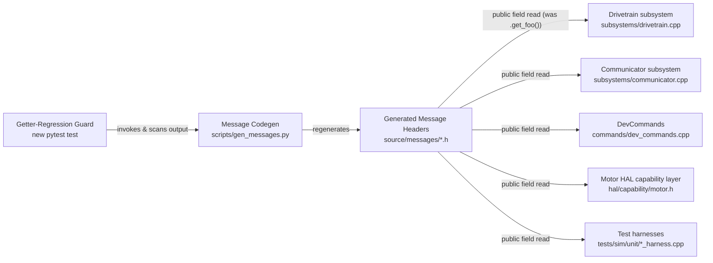

<!-- CLASI: Before changing code or making plans, review the SE process in CLAUDE.md -->

# Architecture Update -- Sprint 080: Remove trivial get_* accessors from generated message headers

## What Changed

- **Message Codegen** (`scripts/gen_messages.py`, `_emit_message`): the
  getter-emission branch is narrowed to remove every `get_*`-prefixed method.
  This covers all six shapes the generator currently emits a `get_` accessor
  for: the oneof-kind discriminator (`get_<oneof>_kind()`), an `Opt<T>`
  wrapper field (`get_<field>()` returning `const Opt<T>&`), an optional
  string field (`get_<field>()` returning `const char*`), a message-typed
  field, an enum-typed field, and a plain scalar field. **Unchanged**:
  chainable setters (`set<Field>(...)`, `Command`/`Config` types only), the
  oneof union/kind-enum machinery itself, and the repeated-field array
  accessor pair (`{field}()` / `{field}_count_val()}`) — those are already
  bare-name (no `get_` prefix) and exist only because the backing array
  member is suffixed `{field}_` to avoid a name collision with the accessor;
  they are out of scope for this sprint.
- **Generated Message Headers** (`source/messages/*.h`, all 9 files —
  `bridges.h`, `common.h`, `communicator.h`, `drivetrain.h`, `gripper.h`,
  `motor.h`, `planner.h`, `ports.h`, `sensors.h`): regenerated from the
  updated generator. Every `get_*` method disappears from the 8 proto-derived
  headers. `bridges.h` (hand-authored by `_emit_bridges_header()`, not
  proto-derived) is untouched by this change. No field layout, default
  value, wire size, or `bridges.h` static_assert is affected — this is a
  pure removal of pass-through methods over already-public fields.
- **Call sites** (existing modules, not new — see Impact table below):
  `Drivetrain` subsystem, `Communicator` subsystem, `DevCommands`, the
  `Motor` HAL capability layer, and two compiled test harnesses convert
  every `x.get_foo()` to a direct field read `x.foo` (`x.foo_kind` for a
  oneof discriminator; `x.foo.has` / `x.foo.val` for an `Opt<T>` field,
  unchanged from today's usage of the Opt wrapper itself). This is the bulk
  of the sprint's work — see "Call-Site Inventory" below.
- **New guard**: a small regression test (module: **Getter-Regression
  Guard**) asserting no message emitted by `gen_messages.py` defines a
  `get_*`-prefixed method, so a reintroduced getter branch fails the
  existing `uv run python -m pytest` gate instead of silently reappearing.

## Why

- `naming-and-style.md` / `coding-standards.md` ban snake_case and
  `get_`-prefixed function names project-wide. The "generated code is
  exempt from hand-editing" clause covers never hand-editing the *output*
  files — it was never license for the generator *template* to keep
  emitting non-conforming API, and the rules docs were annotated to that
  effect on 2026-07-04 (`clasi/issues/remove-generated-get-accessors.md`).
- Every one of these getters is a trivial pass-through to an already-public
  struct field — no computation, no invariant, no validation. The
  Google-style-correct shape for such a field is direct access, no accessor
  method at all (see Decision 1).
- Stakeholder decision 2026-07-04 scheduled this sprint after 077 (greenfield
  faceplate HAL) closed. Sprints 078 and 079 landed in the interim and are
  exactly where the getter call sites in the inventory below come from — the
  issue's premise ("no call sites exist, so no fallout") is now stale. This
  sprint's real work is the call-site sweep, not just the one-line generator
  edit the issue originally scoped.

## Call-Site Inventory

Verified by grepping `source/` and `tests/` for `\.get_[a-z_]*\(`, excluding
`source/messages/` itself. **54 call sites across 6 files** — all in
compiled C++/header code; no Python file, host tool, or `tests/*.py` wrapper
calls a generated getter (see the "False-Lead Correction" note below).

| File | Getter(s) called | Count |
|---|---|---|
| `source/hal/capability/motor.h` | `get_control_kind`, `get_feedforward`, `get_reset_position` | 5 |
| `source/subsystems/communicator.cpp` | `get_radio_channel` | 1 |
| `source/subsystems/drivetrain.cpp` | `get_control_kind`, `get_speed`, `get_standby`, `get_trackwidth`, `get_sync_gain`, `get_velocity`, `get_left_port`, `get_right_port`, `get_position` | 20 |
| `source/commands/dev_commands.cpp` | `get_control_kind` | 6 |
| `tests/sim/unit/drivetrain_harness.cpp` | `get_control_kind` | 4 |
| `tests/sim/unit/dev_command_outbox_harness.cpp` | `get_control_kind`, `get_standby`, `get_reset_position` | 18 |

Every occurrence is a direct `.get_foo()` call (no `->get_foo()` pointer form,
no pointer-to-member usage) — the mechanical conversion is uniform: replace
`.get_foo()` with `.foo`, except the oneof-kind discriminator, whose backing
field is named `foo_kind` (e.g. `command.get_control_kind()` →
`command.control_kind`).

**False-lead correction**: this sprint's own kickoff notes carried three
extra symbol names — `get_nowait` (×6), `get_ver` (×1), `get_robot_config`
(×1) — as if they were part of the same inventory. They are not. Verified by
direct grep: `get_nowait` is Python's stdlib `queue.Queue.get_nowait()`,
called from `tests/bench/velocity_chart.py` / `tests/bench/dev_exercise.py`;
`get_ver()` in `tests/simulation/unit/test_protocol_v2.py`-style files is a
Python wire-protocol test helper; `get_robot_config()` is a hand-written
Python function in `host/robot_radio/config/robot_config.py`. None of the
three touch a generated C++ message struct, and none are renamed by this
sprint. The corrected, complete inventory is the table above — 6 files, 54
call sites, C++ only.

## Impact on Existing Components

| Component | Change | Responsibility/boundary change? |
|---|---|---|
| Message Codegen (`gen_messages.py`) | Narrower emitted API (no `get_*`) | No — same responsibility (proto → C++11 POD header), smaller surface |
| Generated Message Headers (`source/messages/*.h`) | Regenerated, getters gone | No — same structs, same fields, same layout |
| Drivetrain subsystem | 20 call sites converted | No — internal implementation detail only |
| Communicator subsystem | 1 call site converted | No |
| DevCommands | 6 call sites converted | No |
| Motor HAL capability layer | 5 call sites converted | No |
| Test harnesses (`tests/sim/unit/*_harness.cpp`) | 22 call sites converted | No |
| Getter-Regression Guard (new) | New small test module | New, narrow: verifies generator output shape only |

No subsystem gains or loses a responsibility; no dependency edge changes
direction or is added/removed. This is a pure API-narrowing at the codegen
boundary — the six consumer modules already depended on `msg::*` structs;
after this sprint they depend on the same structs' *fields* instead of
their (redundant) accessor *methods*. Cohesion and coupling of Drivetrain,
Communicator, DevCommands, and the Motor HAL capability layer are
unaffected by this sprint.

## Migration Concerns

- **Wire encoding**: none. This changes only the in-memory C++ API surface
  of the generated headers — not serialization, not the proto schemas, not
  `docs/design/message-inventory.md`'s field-to-symbol mapping (which maps
  fields, not accessor methods, and is unaffected in content).
- **Sequencing — this must land as one atomic change**: the generator edit,
  the header regen, and the full call-site sweep (source/ **and** tests/)
  cannot be split across a commit boundary. An intermediate state — headers
  regenerated with no getters, but call sites still calling `.get_foo()` —
  fails to compile. There is no incremental/partial rollout; see Decision 2.
- No data migration, no runtime behavior change, no deployment-order
  concern beyond "the build must be atomic." No hardware bench gate is
  required (per sprint.md Test Strategy) — this is a compile-time-only
  change with zero behavioral surface.

## Component / Module Diagram

**Dependency graph**: not applicable — no module dependency changes. The
existing direction (Presentation/Commands → Domain/Subsystems → Generated
Messages) is preserved and remains acyclic; this sprint only narrows the API
one of those existing edges crosses.

**Entity-relationship diagram**: not applicable — no data model change. No
field is added, removed, renamed, retyped, or re-laid-out.

## Design Rationale

### Decision 1: Drop every getter outright — no bare-name lowerCamelCase method survives, even for the "non-trivial" ones

- **Context**: the issue's fallback clause said a genuinely non-trivial
  getter (oneof-kind discriminator, `Opt<>` wrapper) should either be
  dropped if unused, or renamed to a conforming bare-name lowerCamelCase
  *method* if used.
- **Alternatives considered**:
  (a) Rename the oneof-kind and `Opt<>` getters that DO have call sites
      (`get_control_kind`, `get_standby`, `get_reset_position`,
      `get_feedforward` — all used, per the inventory above) to bare-name
      methods (`controlKind()`, `standby()`, ...), keep them as methods;
      drop only the truly-dead plain-scalar/message/enum/string getters.
  (b) Drop all `get_*` getters unconditionally; every call site reads the
      backing field directly.
- **Why this choice**: (b). Inspecting the generator (`_emit_message`)
  shows every "non-trivial" getter's backing field is *already a public,
  unwrapped struct member* with no invariant or computation behind it — the
  oneof-kind field (`{oneof}_kind`) and the `Opt<T>` field itself are both
  plain public members, identical in kind to the plain-scalar fields. There
  is no case in the current inventory where a getter does anything beyond
  `return field;`. A bare-name method wrapping a public field with no added
  behavior is exactly the same category of dead ceremony the issue set out
  to remove — keeping it under a different name doesn't address the
  complaint.
- **Consequences**: if a *future* field genuinely needs a computed or
  validated read, the generator itself still emits no accessor for it — a
  hand-written wrapper (a small hand-authored class or free function
  outside `source/messages/`) is the escape hatch, not a generator special
  case. Flagged as Open Question 1.

### Decision 2: One ticket, not split into "generator + regen" vs. "call-site sweep"

- **Context**: sprints commonly split "foundation" tickets from "consumer"
  tickets so each ticket lands a working, buildable tree (dependency
  ordering, per the `create-tickets` skill).
- **Alternatives considered**:
  (a) Ticket 001 = generator edit + regen + `source/` call-site sweep;
      ticket 002 = `tests/` call-site sweep + guard.
  (b) One ticket covering generator, regen, the full `source/` **and**
      `tests/` sweep, and the guard.
- **Why this choice**: (b). There is no buildable checkpoint to split at.
  The moment the generator stops emitting getters and headers are
  regenerated, **every** call site across both `source/` and
  `tests/sim/unit/` fails to compile simultaneously — `source/` and
  `tests/` are not independently compiled units with a dependency edge
  between them; they are two directories of call sites against the same
  regenerated headers. Splitting (a) would leave ticket 001's tree
  non-building until ticket 002 lands, violating the norm that each ticket
  leaves a working tree — or it would require ticket 001 to do the full
  sweep anyway, making ticket 002 an empty formality.
- **Consequences**: ticket 001 is larger than a typical single ticket (6
  files, 54 call sites) but it is fully mechanical, uniform, and low-risk —
  the same `.get_foo()` → `.foo` substitution repeated 54 times, verified
  in advance to have no exceptions (no computed getter, no arrow-call form,
  no pointer-to-member use — see inventory above).

### Decision 3: The guard is a pytest test over generator output, not a generator-internal assertion or a header-only grep lint

- **Context**: the issue and sprint both require "a guard (test or
  generator assertion) that trivial getters stay gone."
- **Alternatives considered**:
  (a) An `assert`/`raise` inside `gen_messages.py` itself that fires if any
      emitted line matches a `get_` method signature, failing `build.py`'s
      unconditional pre-build regen step.
  (b) A new pytest test that invokes the generator (in-process, or via its
      `--dry-run` text output) and scans the emitted text for a
      `get_[a-z_]*\(` method-defining pattern.
  (c) A grep-based lint over the checked-in `source/messages/*.h` files
      only (no generator invocation).
- **Why this choice**: (b). It runs under the existing `uv run python -m
  pytest` gate — already part of every sprint's acceptance — rather than
  only firing at firmware-build time (a), which would be a much later,
  noisier failure point and doesn't help a host-only contributor who never
  runs `just build`. It is also more durable than (c): a checked-in-header
  grep only catches a regression the moment someone forgets to regenerate
  before committing; tying the assertion to the generator's *own* emitted
  output catches the regression the instant the template changes, before
  it's even written to disk.
- **Consequences**: one new small test file (see Ticket 001); no build-time
  cost; the checked-in headers and the generator's live output are both
  implicitly covered, since the checked-in headers are produced by running
  the same generator this test invokes.

## Open Questions

1. **No generator escape hatch exists for a genuinely computed/validated
   field read.** None is needed today (every current getter, "non-trivial"
   or not, was a bare pass-through — Decision 1). If a future proto field
   needs one (e.g. a clamped or derived value), does it get a hand-written
   wrapper type layered over the plain generated struct, or does the
   generator need a new `(computed)` proto option? Deferred until a
   concrete need arises — flag for whoever next touches `protos/` with such
   a field.
2. **`docs/design/message-inventory.md` regeneration is optional, zero-risk
   hygiene, not a requirement.** `--emit-inventory`'s output maps fields to
   existing symbols, not accessor methods, so it is unaffected in content by
   this sprint. Left to the ticket executor's judgment whether to
   regenerate it as part of the sweep for freshness.
