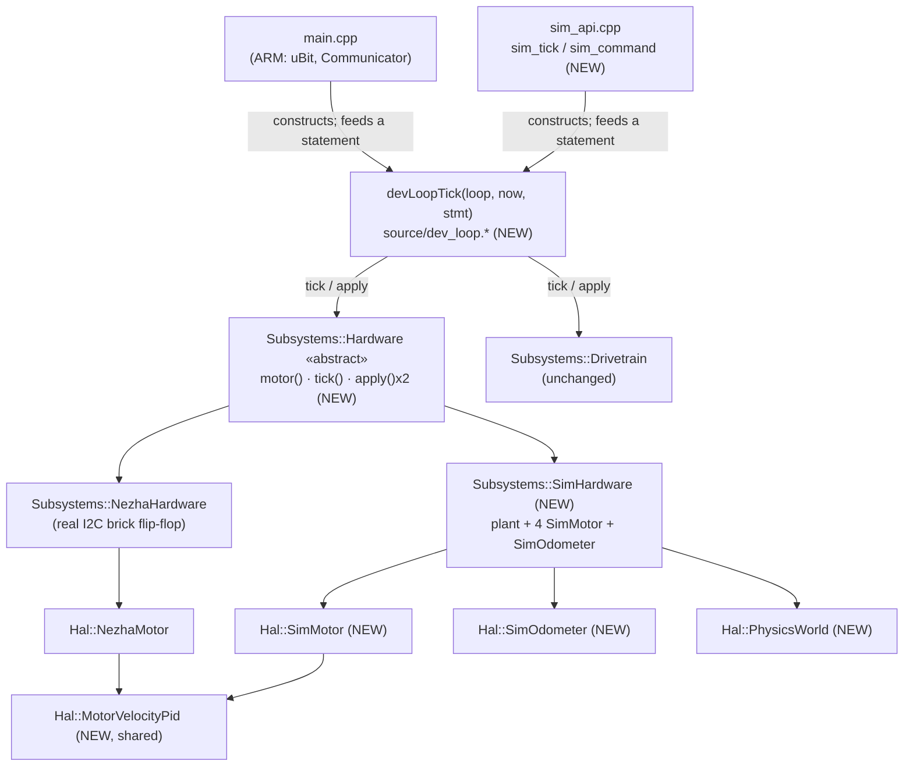
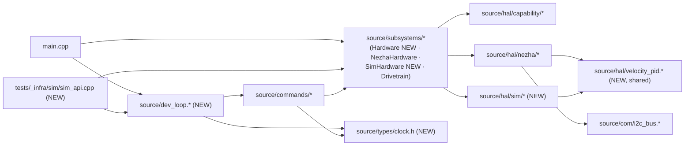

<!-- CLASI: Before changing code or making plans, review the SE process in CLAUDE.md -->

# Architecture Update — Sprint 081: Host-side simulation environment for the new source/ tree

Source document: `clasi/issues/host-side-simulation-environment-for-the-new-tree-design-write-up.md`
(stakeholder-reviewed 2026-07-04, six-ticket sketch, three resolved decisions).
This document is **not** a copy of that write-up — it reconciles it against
the tree as it stands 2026-07-05 (one day later), which has drifted from two
of the design's own load-bearing assumptions. Both drifts are corrected
below rather than silently inherited.

## Reconciliation with the design write-up — read this first

The design write-up is the source of truth for *intent* (the plant/sensor
model, the ctypes-only decision, the risk list). Two of its own structural
assumptions are now stale:

1. **"Resolved decision 1" (fold the loop-extraction ticket into sprint 079)
   is moot.** Sprint 079 rewrote `main.cpp`'s loop *inline* (its own ticket
   005, "the three-beat Part-2 loop" — confirmed by reading the current
   `source/main.cpp`, which still has the full loop body written directly
   in `main()`, not calling out to a shared function). `source/dev_loop.h`,
   `source/dev_loop.cpp`, and the abstract hardware-owner seam the design
   calls `source/hal/capability/motor_hal.h` are all **absent from the
   tree** — verified by direct search, not inferred. Ticket 002 below is
   this sprint's own loop-extraction ticket; it does not ride on 079 because
   079 already merged without doing this extraction.
2. **Every reference to `Hal::NezhaHal`, `Hal::MotorHal`, `DrivetrainToHalCommand`,
   `CommandProcessorToHalCommand`, `hasHalCommand`/`halCommand`/`takeHalCommand`,
   and `DevLoopState::hal`** in the design write-up names a symbol that no
   longer exists. A same-day rename (commit `d5a4cded`, "Refactor Nezha HAL
   to Subsystems::NezhaHardware") landed **the same day** the design was
   reviewed:
   - `Hal::NezhaHal` → `Subsystems::NezhaHardware` (moved *namespace*, from
     `Hal` to `Subsystems`, and *directory*, from `hal/nezha/` to
     `subsystems/`).
   - `CommandProcessorToHalCommand` → `CommandProcessorToHardwareCommand`;
     `DrivetrainToHalCommand` → `DrivetrainToHardwareCommand`.
   - `hasHalCommand`/`halCommand`/`takeHalCommand` → `hasHardwareCommand`/
     `hardwareCommand`/`takeHardwareCommand`.
   - `DevLoopState::hal` → `DevLoopState::hardware`.

   This is not cosmetic: the design's own justification for naming the new
   abstract seam `Hal::MotorHal` was "to match the existing NezhaHal
   naming" — a justification that is now false on both counts (there is no
   `NezhaHal`, and the concrete owner is a `Subsystems` class, not a `Hal`
   class). **Decision 1 below re-derives the seam's name and home from
   scratch** against the tree as it actually is, and happens to land on a
   name the codebase's own 079 rename already anticipated (see Decision 1's
   "Consequences").

The `later/sim-hardware-fault-injection.md` issue the design's "resolved
decision 3" describes already exists (confirmed by direct read) — it is
referenced, not re-filed, by ticket 003 below.

## Step 1: Understand the Problem

Sprint 077's greenfield rebuild parked the old simulation environment
(`source_old/hal/sim/`, `tests_old/_infra/sim/`) and left `tests/sim/` with
one placeholder test. The new `source/` tree — now five sprints deep
(077–080, plus today's rename) — has no simulator at all: every test either
runs on real hardware (`tests/bench/`, HITL) or is an ad hoc, CMake-free
compiled C++ harness (`tests/sim/unit/*_harness.cpp`, introduced by 078/079
specifically to avoid depending on the deferred simulator — see Decision 9
in `architecture-update-078.md`). This sprint is what those harnesses were
deferring: a real, host-compiled `libfirmware_host` shared library, loaded
from Python via ctypes, running the actual firmware C++ (`CommandProcessor`,
`Subsystems::Drivetrain`, the DEV command family) against **two** simulated
devices — motors and OTOS — behind an errorless ground-truth plant.

**What does not change:** the wire protocol (no `SIMSET`/`SIMGET` family, no
sim-only `TLM` field — a firm design decision, not a phase-1 simplification);
`Subsystems::Drivetrain`'s ratio governor and kinematics; `NezhaMotor`'s
device-specific write path (throttle/slew/wedge armor stays exactly as
078/079 left it — only its embedded PID control law moves to a shared
class); anything under `source_old/`/`tests_old/`.

**Why now:** the design write-up is stakeholder-reviewed and the hooks are
already live (`build.py build_host_sim()`, `just build-sim`,
`sim_conn.py`'s ctypes contract) — they self-heal the moment
`tests/_infra/sim/` reappears. The only thing blocking them is that nothing
under `source/` yet compiles cleanly host-side, and no C ABI exists to call.

## Step 2: Identify Responsibilities

| Responsibility | Owning surface | Why it changes independently |
|---|---|---|
| Compute the velocity control law from a target/measured pair, with no device I/O | `Hal::MotorVelocityPid` (new, `source/hal/velocity_pid.{h,cpp}`) | Pulled out of `NezhaMotor` specifically so a simulated motor can run the byte-identical control law instead of a re-derived approximation — the design's own highest-flagged correction. Changes only if the control law itself changes (bench-tuned gains, anti-windup shape), never for sim-vs-real reasons. |
| Run one pass of the shared dev-loop body (hardware tick x2, statement dispatch, outbox drain, Drivetrain governance, watchdog check) with `now` and a statement fully injected | `devLoopTick` (new, `source/dev_loop.{h,cpp}`) | The one piece of logic that must be **authored once** and executed identically by both callers — a hand-mirrored second copy is exactly the drift risk the design write-up itself names (`sim_api.cpp` drifting from `main.cpp`). Changes only when the loop's own ordering/semantics change (a rare, sprint-079-class event), never for firmware-vs-sim reasons. |
| Own the addressable motor-port surface (`motor(port)`, `tick(now)`, the two command-in `apply()` overloads) behind one abstract seam | `Subsystems::Hardware` (new, abstract) + `Subsystems::NezhaHardware` (existing, retrofitted) + `Subsystems::SimHardware` (new) | This is the swap point `devLoopTick`/`commands/dev_commands.*` need to be agnostic to which concrete owner is behind `DevLoopState::hardware`. Each concrete owner changes for its own reasons (real I2C bus scheduling vs. plant/error-model tuning); the abstract seam changes only if the *shared* surface itself grows. |
| Provide one authoritative source of "now" (and, on-target, a real vendor clock call) to code that must run identically host-side and on-target | `source/types/clock.h` (new) | `system_commands.cpp` is the one file in the whole host-clean set that still reads a CODAL vendor clock function directly; everywhere else `now` is already a parameter. Isolated because it is a one-file, one-call-site problem with a narrow, mechanical fix. |
| Integrate one errorless ground-truth plant (pose, wheel travel) and expose two independently-errored sensor models over it (motor/encoder, OTOS) | `Hal::PhysicsWorld` + `Hal::SimMotor` + `Hal::SimOdometer` + `Subsystems::SimHardware` (all new, `source/hal/sim/` + `source/subsystems/`) | The actual simulated-reality responsibility — changes only when the physical model or its error knobs change, never when the loop/ABI/Python layers above it change. |
| Compile the host-clean firmware subset plus the sim leaves into one shared library and expose a stable C ABI over it | `tests/_infra/sim/CMakeLists.txt` + `tests/_infra/sim/sim_api.cpp` (new) | A build/packaging responsibility, independent of what the simulated devices *do* — changes when the compiled source list or the ABI surface changes, not when the plant's physics change. |
| Drive the C ABI from Python with test-friendly ergonomics (context manager, fixtures, `tick_for`) | `tests/_infra/sim/firmware.py`, `tests/sim/conftest.py`, `host/robot_radio/io/sim_conn.py` (new/modified) | A host-Python responsibility, independent of the C++ below it — changes when the Python-facing ergonomics change. |
| Prove the error models against known-good legacy expectations | Ported `tests/sim/unit|system/*` (new, adapted from `tests_old/simulation/`) | Test content, independent of the harness plumbing above it — changes only when the ported assertions themselves need updating. |

No responsibility spans more than one ticket's file set except the shared
dependency every later responsibility has on `Subsystems::Hardware` (ticket
002) and, one level down, on `Hal::MotorVelocityPid` (ticket 001) — the same
kind of intentional fan-in the project's own prior architecture docs (e.g.
076's `robot/protocol.py` fan-in) treat as normal, not a coupling smell.

## Step 3: Subsystems and Modules

| Module | Purpose (one sentence) | Boundary | Use cases served |
|---|---|---|---|
| `Hal::MotorVelocityPid` | Computes a duty command from a target/measured velocity pair and an elapsed interval. | Inside: gains, integral state, anti-windup, the `dt<=0` nominal-interval fallback. Outside: device I/O, mode dispatch, write shaping (stay in `NezhaMotor`/`SimMotor`). | SUC-001, SUC-003 |
| `Subsystems::Hardware` | Presents one addressable motor-port surface regardless of which concrete device family backs it. | Inside: `motor(port)`, `tick(now)`, the two command-in `apply()` overloads, `kPortCount`. Outside: how ports are scheduled (real I2C flip-flop vs. sim plant advance — each concrete leaf's own business). | SUC-002, SUC-003 |
| `Subsystems::NezhaHardware` | Sequences real-I2C-bus motor traffic across up to four Nezha ports. | Unchanged responsibility from sprint 079; now expressed as one concrete implementation of `Subsystems::Hardware` rather than a standalone class. | SUC-002 |
| `Subsystems::SimHardware` | Sequences simulated-device traffic (plant + 4 motors + 1 odometer) across the same port surface. | Inside: the same-`now` re-entry guard, owning `PhysicsWorld`/`SimMotor`x4/`SimOdometer`. Outside: the plant's own physics (stays in `PhysicsWorld`); the ctypes ABI (stays in `sim_api.cpp`). | SUC-003 |
| `DevLoop` / `devLoopTick` | Runs one pass of the shared dev-loop body for whichever caller supplies `now` and an optional statement. | Inside: the two-slice hardware tick, statement-triggered parse, outbox drain, Drivetrain governance, watchdog check, and the loop-originated (not statement-originated) default reply sink. Outside: how a statement got fed in (Communicator vs. ctypes) — that is the caller's job. | SUC-002, SUC-004 |
| `types::systemClockNow` | Answers "what time is it" for the one file (`system_commands.cpp`) that still asks a CODAL vendor function directly. | Inside: the seam declaration + two backing implementations (on-target real clock; host settable clock). Outside: everything already `now`-parameterized (unaffected). | SUC-002 |
| `Hal::PhysicsWorld` | Integrates one errorless ground-truth plant (pose, wheel travel) from commanded actuator input. | Inside: midpoint-arc integration, the *reported* (errored) encoder accumulator. Outside: sensor-specific error models (stay in `SimMotor`/`SimOdometer`); line/color/port truth (dropped, per the design's resolved decision 2). | SUC-003 |
| `Hal::SimMotor` | Presents one simulated wheel-motor channel as a `Hal::Motor` leaf. | Inside: DUTY/VELOCITY dispatch (VELOCITY via the shared PID), the errored-encoder read. Outside: the plant itself (holds a reference, does not own it). | SUC-003 |
| `Hal::SimOdometer` | Presents the simulated OTOS as a `Hal::Odometer` leaf. | Inside: sampling true pose each tick, differencing, applying independent OTOS error. Outside: any firmware consumer (none exists yet — see "The OTOS gap" below). | SUC-003 |
| `tests/_infra/sim/sim_api.cpp` | Exposes the compiled firmware subset as a stable, versioned C ABI. | Inside: `SimHandle` lifecycle, the dt=0 synchronous-command trick, the ctypes-only knob/telemetry surface. Outside: any Python ergonomics (stay in `firmware.py`). | SUC-004 |
| `tests/_infra/sim/firmware.py` (`Sim`) | Gives Python a context-managed, steppable handle onto the C ABI. | Inside: ctypes bindings, `tick_for`, teardown. Outside: pytest fixture policy (stays in `conftest.py`). | SUC-005 |

Every module addresses at least one SUC (Step 3 table, right column); every
SUC is covered by exactly one ticket (Step 5/ticket table). No module's
one-sentence purpose needs "and." No cycles — see the dependency graph
below.

## Step 4: Diagrams

### Component / module diagram

`HwBase --> NezhaHw` / `HwBase --> SimHw` are "implements," drawn downward
per this project's usual Subsystems-owns-Hal orientation, not an inversion —
both concrete classes depend on the abstract base's header, the base never
depends on either leaf.

### Dependency graph (directory level)

No cycles. Unchanged direction from 077–079
(`commands -> subsystems -> hal -> com/hardware`, domain-inward). Two new
facts worth naming explicitly: `source/hal/sim/*` has **no** edge to
`source/com/i2c_bus.*` — the simulated leaves never touch the real bus, by
construction, not by discipline — and `source/hal/velocity_pid.*` is a new
fan-in point with exactly two consumers (`hal/nezha`, `hal/sim`), matching
the fan-out-<=4-5 guidance with room to spare.

No entity-relationship diagram: this sprint adds no persisted data model.
The sim's error knobs and ground-truth reads are ctypes-only, in-memory, and
explicitly never become a wire message or a config schema (see "Why" below).

## Step 5: What Changed / Why / Impact / Migration

### What Changed, by ticket

**001 — Extract the shared velocity PID.** `NezhaMotor::runVelocityPid()`
(`nezha_motor.cpp:291`) moves, byte-for-byte, into `Hal::MotorVelocityPid`
(new, `source/hal/velocity_pid.{h,cpp}`) — gains, the `iOld`-ordered output,
the anti-windup back-calculation, the `min_duty`-as-deadband-threshold
reading of `MotorConfig`, and the `dt<=0 -> kNominalDt` fallback all port
unchanged. `NezhaMotor` gains a `MotorVelocityPid pid_` member and calls
`pid_.compute(velocityTarget_, filteredVelocity_, dt)` where it used to call
`runVelocityPid(...)` directly; nothing else in `tick()`'s 5-step sequence
changes.

**002 — Host-clean seams.** `Subsystems::Hardware` (new,
`source/subsystems/hardware.h`) is introduced as an abstract owner base;
`Subsystems::NezhaHardware` becomes `: public Subsystems::Hardware`
(`override` added to `motor()`/`tick()`/both `apply()` overloads; its own
`kPortCount` redeclaration is removed, inherited from the base instead).
`source/dev_loop.{h,cpp}` (new) hosts `DevLoopStatement`, `DevLoop`, and
`devLoopTick()` — the exact current `main.cpp` loop body (verified against
the real file, not the design's schematic pseudocode), parameterized over
`Subsystems::Hardware*`/`Subsystems::Drivetrain*`/`CommandProcessor*`/
`SerialSilenceWatchdog*` plus a nullable incoming statement and a
loop-originated default reply sink (see Decision 3). `commands/dev_commands.h`'s
`DevLoopState::hardware` retypes from `Subsystems::NezhaHardware*` to
`Subsystems::Hardware*`; its `#include` swaps from
`subsystems/nezha_hardware.h` to `subsystems/hardware.h`. `source/types/clock.h`
(new) declares `systemClockNow()`, backed by `source/types/clock.cpp`
(on-target: `return system_timer_current_time();`) and
`source/types/clock_host.cpp` (new, host-only: a settable global, mirroring
079's `i2c_bus_host.cpp` precedent). `system_commands.cpp`'s `handlePing`
calls `Types::systemClockNow()` instead of the vendor function directly;
`handleId`'s `microbit_friendly_name()`/`microbit_serial_number()` calls sit
behind a `#ifdef HOST_BUILD` branch returning fixed host identity strings.
`main.cpp`'s loop body collapses to: read the clock, tick the Communicator,
build a `DevLoopStatement` from any taken statement, call `devLoopTick()`.

**003 — Plant + sim devices.** `Hal::PhysicsWorld` (new,
`source/hal/sim/physics_world.{h,cpp}`) ports the motor/pose/encoder plant
only (aux line/color/port truth channels dropped — design's resolved
decision 2). `Hal::SimMotor : public Hal::Motor` and
`Hal::SimOdometer : public Hal::Odometer` (new, same directory) implement
the two simulated device faceplates — `SimMotor`'s VELOCITY mode calls the
identical `Hal::MotorVelocityPid` from ticket 001.
`Subsystems::SimHardware : public Subsystems::Hardware` (new,
`source/subsystems/sim_hardware.{h,cpp}`) owns the one `PhysicsWorld` + four
`SimMotor`s + the `SimOdometer`, and implements the same-`now` re-entry
guard (Decision 4). `source/hal/sim/sim_setters.h` (new) adds one `Hal::`
free function per error knob (see Decision 2 on why these are **not** a new
`simsetters::` namespace, correcting the design write-up's own naming).

**004 — Build + C ABI.** `tests/_infra/sim/CMakeLists.txt` (new) builds
`libfirmware_host` from an explicit source list (Step 3's dependency graph);
`tests/_infra/sim/sim_api.cpp` (new) implements `SimHandle` (owning
`SimHardware` + `Drivetrain` + `CommandProcessor` + `DevLoop`), a reply
store, `sim_tick`/`sim_command`, and the ctypes-only knob/telemetry surface
(no `SIMSET`/`SIMGET`, ever).

**005 — Python wrapper + fixtures + first tests.**
`tests/_infra/sim/firmware.py`'s `Sim` class (new); `tests/sim/conftest.py`'s
placeholder becomes real `build_lib`/`sim` fixtures;
`host/robot_radio/io/sim_conn.py` fix-up; first real tests under
`tests/sim/unit|system/`.

**006 — Port high-value legacy tests.** Encoder-error, OTOS-error, and
stiction/lag suites adapted from `tests_old/simulation/` onto the new ABI.

### Why

See "Reconciliation with the design write-up" above for tickets 002/003's
reordering rationale, and Decision 1 below for the abstract-owner naming.
The PID extraction is ticket 001 (not folded elsewhere) because it is the
design's own highest-flagged risk and is 100% independent of everything
else in this sprint — landing and bench-verifying it first means every
later ticket builds on an already-proven-safe foundation rather than
carrying that risk to the end.

### Impact on Existing Components

| Component | Impact |
|---|---|
| `source/hal/nezha/nezha_motor.{h,cpp}` | **Modified** (001). `runVelocityPid()` and `integral_` removed; a `MotorVelocityPid` member added; `tick()`'s VELOCITY case calls `pid_.compute(...)`. No other behavior change. |
| `source/subsystems/nezha_hardware.{h,cpp}` | **Modified** (002). Gains `: public Subsystems::Hardware`; `override` added; no method body changes. |
| `source/commands/dev_commands.{h,cpp}` | **Modified** (002). `DevLoopState::hardware` retypes; `#include` swap; `handleDevState`'s port-count bound reads `Subsystems::Hardware::kPortCount`. |
| `source/commands/system_commands.cpp` | **Modified** (002). `system_timer_current_time()` -> `Types::systemClockNow()`; identity calls gated `#ifdef HOST_BUILD`. |
| `source/main.cpp` | **Modified** (002). Loop body collapses to a `devLoopTick()` call; Communicator wiring unchanged, stays the only CODAL-touching piece. |
| `source/hal/capability/odometer.h` | **Unaffected structurally** (003 provides its first concrete leaf, `Hal::SimOdometer`) — the interface itself does not change. |
| `source/subsystems/drivetrain.h/.cpp` | **Unaffected.** Holds no `Hal::Motor`/`Hardware` reference by design (see its own header comment); nothing in this sprint touches it. |
| `docs/protocol-v2.md` | **Unaffected.** No wire verb, reply field, or `SET`/`GET`/`CFG` key changes — the ctypes-only decision (design write-up, "Error-knob and sim-telemetry surface") is a firm constraint this sprint upholds, not revisits. |
| `build.py`, `justfile` | **Unaffected in logic** — `build_host_sim()`/`just build-sim` already point at `tests/_infra/sim/`; they simply stop no-op'ing once ticket 004 creates that directory. |
| `tests/sim/conftest.py`, `tests/sim/unit/test_placeholder.py` | **Modified/replaced** (005). Real fixtures land; the placeholder test is superseded by real collection. |
| `tests/sim/unit/*_harness.cpp` (078/079's ad hoc compiled harnesses) | **Unaffected.** These stay as they are — a separate, CMake-free acceptance mechanism (078 Decision 9) — this sprint does not fold them into the CMake build; ticket 003 reuses the SAME ad hoc-compile pattern for its own pre-004 acceptance test (see usecases.md SUC-003). |

### Migration Concerns

- **No data/wire migration of any kind.** Confirmed by direct re-read of
  `docs/protocol-v2.md`: no verb, reply field, or `SET`/`GET`/`CFG` key is
  touched. The design's "ctypes backdoor only, no wire family" decision is
  reaffirmed, not revisited, by this document.
- **Sequencing supersedes the design write-up's own ticket order.** The
  design's table sequenced "3: host-clean seams" *after* "2: plant + sim
  devices," gated on 079 merging. Both preconditions have changed: 079 is
  already merged (no cross-sprint gate remains), and `Subsystems::SimHardware`
  (folded into the design's ticket 2) cannot compile without the abstract
  `Subsystems::Hardware` base that only the seams ticket introduces. This
  document's ticket order (001 PID -> 002 seams -> 003 plant/sim -> 004
  build/ABI -> 005 Python -> 006 legacy tests) resolves that forward
  reference; see Decision 5.
- **ARM build behavior must be byte-identical after tickets 001 and 002** —
  both touch the live control loop or the main loop directly. Both carry a
  hardware-bench-testing gate acceptance item (bench step-response for 001;
  bench smoke for 002), per `.claude/rules/hardware-bench-testing.md`, which
  applies to every ticket touching the HAL/motor path.
- **dt=0 re-entry is a real hazard, not a hypothetical one — see Decision 4.**
  It is not limited to the `sim_command` synchronous-replay trick the design
  write-up called out; `devLoopTick`'s own two-slice `hardware.tick(now)`
  call (ordinary `sim_tick`, no special replay) calls `Subsystems::SimHardware::tick()`
  twice per pass with an **unchanged** `now` every single time. On real
  hardware this is harmless because `NezhaHardware`'s microsecond-resolution
  I2C clearance timer (independent of the millisecond `now`) naturally
  blocks the second slice from re-entering a given motor's `tick()`; the sim
  has no equivalent bus latency to lean on and must guard explicitly.
- **No deployment-sequencing concern beyond ticket order** — `tests/_infra/sim/`
  is a fresh directory; nothing it defines is imported by any file outside
  this sprint's own scope, so partial progress cannot break the ARM build
  (verified by the explicit, ARM-excluding source list in ticket 004).

## Step 6: Design Rationale

### Decision 1: the abstract owner base is `Subsystems::Hardware`, not `Hal::MotorHal`

**Context.** The design write-up names the seam `Hal::MotorHal`, justified
as "to match the existing `NezhaHal` naming." `NezhaHal` no longer exists —
it was renamed to `Subsystems::NezhaHardware` (namespace **and** directory
change: `Hal::NezhaHal`/`hal/nezha/nezha_hal.*` -> `Subsystems::NezhaHardware`/
`subsystems/nezha_hardware.*`) the same day the design was reviewed.
`subsystems/nezha_hardware.h`'s own header comment states the rationale for
that move explicitly: `NezhaHardware` "is a Subsystems-tier peer of
`Subsystems::Drivetrain` — the aggregator/scheduler/distributor that
genuinely IS a subsystem, as opposed to a per-device faceplate." Naming the
new abstract base `Hal::MotorHal` would put the interface back in the layer
its own concrete implementation just moved out of.

**Alternatives considered:**
(a) `Hal::MotorHal` as the design write-up proposes — rejected, contradicts
the rationale that just moved `NezhaHardware` out of `Hal`.
(b) Leave the base unnamed / skip the abstraction, and give `dev_commands.*`
two code paths (one per concrete owner) — rejected, this is exactly
alternative (b) the design write-up itself already rejected for the
identical reason: it would duplicate the DEV command-routing logic the sim
exists to exercise.
(c) `Subsystems::Hardware` (chosen) — an abstract base living in the same
namespace and tier as both concrete owners.
(d) Skip runtime polymorphism entirely: a compile-time `using Hardware = ...`
alias selected by `#ifdef HOST_BUILD` (the same macro that already
distinguishes `i2c_bus.cpp`/`i2c_bus_host.cpp` and, this sprint,
`clock.cpp`/`clock_host.cpp`), since any one compiled binary — ARM firmware
or `libfirmware_host` — only ever needs exactly one concrete owner. Rejected:
`Hal::Motor` (the sibling seam one tier down, `motor(port)`'s return type)
is already a runtime-virtual abstract base, chosen by sprint 077 specifically
so a future `SimMotor` could stand in for `NezhaMotor` — its own file header
says so outright. Using a *different* swap mechanism (compile-time alias) for
the Subsystems-tier seam one call away from a tier that already committed to
runtime polymorphism for the identical kind of problem would be an
unjustified inconsistency, not a meaningful performance win: `Hardware::motor(port)`
already returns through one `Hal::Motor` vtable indirection regardless of
which mechanism gates `Hardware` itself, and `Hardware::tick()`/`apply()` are
called 2-3 times per 10-20 ms pass, not a per-sample hot path — the marginal
cost of one more vtable indirection is immaterial next to the indirection
this tree already accepted at the leaf tier.

**Why this choice.** `Subsystems::NezhaHardware` and the new
`Subsystems::SimHardware` are both aggregator/scheduler/distributor classes
— exactly the tier `nezha_hardware.h`'s own comment describes — not
per-device faceplates. The abstraction over "which aggregator owns the
motor ports" is therefore itself a Subsystems-tier concept, and belongs
beside its two implementations, the same way `hal/capability/hal_command.h`
sits beside `Hal::Motor` as the shared, stable tier `Hal`'s own concrete
leaves depend on (Decision 1 of `architecture-update-079.md` makes the
identical argument one namespace down). Placing `Subsystems::Hardware` in
`source/subsystems/hardware.h` requires no `Hal -> Subsystems` include in
either direction: the base depends only on `Hal::Motor`/`Hal::CommandProcessorToHardwareCommand`/
`Hal::DrivetrainToHardwareCommand` (data-only, already how `NezhaHardware`
itself depends on `Hal`), and `Subsystems::NezhaHardware`/`Subsystems::SimHardware`
depending on a same-namespace sibling header is not a new *kind* of
coupling.

**Consequences — a naming decision the codebase already half-made.** The
079 rename left the two command-edge structs named
`CommandProcessorToHardwareCommand`/`DrivetrainToHardwareCommand` —
"Hardware," not "NezhaHardware" — even though at the time
`Subsystems::NezhaHardware` was the only implementation. That naming choice
already anticipated a generic "Hardware" consumer role distinct from any
one concrete owner; this sprint's `Subsystems::Hardware` base makes that
latent generality real rather than introducing a new vocabulary word.
`DevLoopState::hardware` (already named for the *role*, not the concrete
type) retypes from `Subsystems::NezhaHardware*` to `Subsystems::Hardware*`
with no field rename needed.

### Decision 2: the sim owner is `Subsystems::SimHardware`, a Subsystems-tier peer of NezhaHardware — not a `Hal::` leaf

**Context.** The design write-up's `SimHal` was sketched as living beside
`SimMotor`/`SimOdometer` under `source/hal/sim/`, i.e. in `namespace Hal`.

**Why this choice.** The same reasoning that moved `NezhaHal` out of `Hal`
applies identically to its sim counterpart: `SimHardware` owns the plant
plus four motors plus an odometer and runs a tick-cadence policy (Decision 4)
— it aggregates and schedules, it does not itself implement one device's
primitive setters/getters. It is therefore `Subsystems::SimHardware`
(`source/subsystems/sim_hardware.{h,cpp}`), a peer of
`Subsystems::NezhaHardware`, implementing `Subsystems::Hardware`.
`Hal::PhysicsWorld`, `Hal::SimMotor`, and `Hal::SimOdometer` — the actual
per-device/per-plant leaves — stay under `source/hal/sim/`, mirroring
exactly how `Hal::NezhaMotor` (the leaf) lives in `source/hal/nezha/` while
its owner (`Subsystems::NezhaHardware`) lives in `source/subsystems/`. This
is also the precedent the *old* tree already set independently: a prior
sprint's architecture update (`architecture-update-074.md`, pre-greenfield-
rebuild) already named a `Hardware` interface with concrete `NezhaHAL`/
`MecanumHAL`/`SimHardware` implementations — "SimHardware" is not a novel
name invented for this document, it is the same name the project reached
for the last time this exact abstraction was needed.

**A second correction to the design write-up's naming, same root cause:**
`sim_setters.h`'s free functions are written in the design write-up as
`simsetters::` — a lowercase namespace, which would violate
`.claude/rules/naming-and-style.md` rule 3 (namespaces are UpperCamelCase)
for a genuinely new piece of code (rule 5: never propagate a violation, in
plans or examples, even one only sketched by a source document). This
document places them as ordinary free functions directly in the existing,
already-conforming `namespace Hal` (`Hal::setSimMotorScaleError(...)`,
`Hal::setSimStiction(...)`, etc.) — one canonical call site per knob, same
as the design intended, with no new namespace at all.

**Consequences.** `SimHardware`'s ctypes-facing surface (true pose, error
knobs) is reached by `sim_api.cpp` holding the **concrete** `SimHardware`
type directly, never through the abstract `Subsystems::Hardware*` — the
abstract interface only ever needs to expose what `devLoopTick`/
`dev_commands.*` use (Step 3's `Subsystems::Hardware` row). This is a clean
interface-segregation split that falls out for free from the two-tier
placement, not an extra mechanism this document had to invent.

### Decision 3: `devLoopTick` takes a nullable `DevLoopStatement*`, not a held/taken pair, and needs its own loop-originated reply sink

**Context.** The design write-up's own pseudocode writes `loop.hasStatement()`/
`loop.takeStatement()` as if `DevLoop` held a second held/taken state
machine mirroring `Subsystems::Communicator`'s. Communicator's
`CommunicatorToCommandProcessorStatement.line` is a `const char*` that
**aliases Communicator's own internal buffer**, valid only until
Communicator's next `tick()` — a contract specific to Communicator's
ownership model, and `communicator.h` unconditionally includes `MicroBit.h`
(confirmed by direct read), so it cannot be the shared statement type
`dev_loop.h` depends on without pulling CODAL into the sim build.

**Why this choice.** `devLoopTick(DevLoop& loop, uint32_t now, const DevLoopStatement* statement)`
takes a plain, caller-owned, single-call-lifetime pointer: `main.cpp` copies
the line out of its already-taken `CommunicatorToCommandProcessorStatement`
into a `DevLoopStatement` before calling `devLoopTick`; `sim_api.cpp`'s
`sim_command` builds one directly from its ctypes line argument. Neither
caller needs a second held/taken state machine — the firmware side already
has one (Communicator itself), and the sim side is inherently single-shot
per call. A second, redundant "is something held" flag inside `DevLoop`
would duplicate state for no behavioral gain.

A second, real gap the design's schematic pseudocode never had to resolve
(because it is schematic): `main.cpp`'s **actual** watchdog-fire path emits
`EVT dev_watchdog` over serial via
`CommandProcessor::replyEvt(..., serialReply, &comm)` — a reply that is not
triggered by any inbound statement, so it has no statement-supplied
`replyFn`/`replyCtx` to use. `DevLoop` therefore carries one more field: a
`defaultReply`/`defaultReplyCtx` pair, set once by each caller
(`main.cpp`: `serialReply`/`&comm`, byte-identical to today; `sim_api.cpp`:
a small function that appends the line to the async-EVT queue
`sim_get_async_evts` drains), used for any reply `devLoopTick` originates
itself rather than in response to a statement.

**Alternatives considered.** Push the watchdog-fire EVT emission back out
to the caller (return a "did it fire" flag, let `main.cpp`/`sim_api.cpp`
each build the reply) — rejected: it would split the watchdog-check-and-
neutralize logic (which must stay inside `devLoopTick`, since it also
applies the broadcast-neutral hardware/Drivetrain commands) from its own
notification, for no benefit, and would reintroduce exactly the kind of
"loop logic partially outside the shared body" risk ticket 002 exists to
eliminate.

**Consequences.** `DevLoopStatement` is not named as a
`<Producer>To<Consumer>` edge type (naming rule 4) because it is not an
inter-subsystem edge in that sense — it is a plain parameter struct for a
free function with two legitimate, structurally different producers
(Communicator-derived vs. ctypes-derived); forcing an artificial producer
name onto it would be worse than a descriptive, non-rule-4 struct name.

### Decision 4: the dt=0 re-entry guard lives in `Subsystems::SimHardware::tick()`, not inside `Hal::MotorVelocityPid`

**Context.** `NezhaMotor::tick()`'s existing dt computation
(`nezha_motor.cpp:200-218`) sets `haveElapsed = false` whenever
`nowMs == lastTick_`, and `runVelocityPid()`'s first line already does
`if (dt <= 0.0f) dt = kNominalDt;` — substituting a **nonzero** ~24 ms
nominal interval, then integrating against it. On real hardware this is
inert: `Subsystems::NezhaHardware`'s brick flip-flop only calls a given
port's `NezhaMotor::tick()` once per full request/collect cycle, gated by
the I2C bus's microsecond-resolution clearance timer (`079`'s lazy-
clearance mechanism) — a given motor's `tick()` is never actually invoked
twice with the same millisecond `now` in practice, so the `kNominalDt`
substitution's integration-on-a-second-call hazard has never manifested.

`Subsystems::SimHardware` has no equivalent bus latency to lean on. Worse,
this is not only the design write-up's flagged `sim_command`-replay
scenario — it is `devLoopTick`'s **ordinary** two-slice `hardware.tick(now)`
call, called with the identical `now` on every single pass whether or not
any command is being replayed. If `SimHardware::tick()` forwarded straight
through to each `SimMotor::tick()` on both slices, `MotorVelocityPid::compute()`
would run twice per pass, each time substituting `kNominalDt` and
integrating — a real, guaranteed double-integration bug on ordinary sim
operation, not an edge case.

**Alternatives considered.**
(a) Change `MotorVelocityPid::compute()` itself to treat `dt<=0` as a true
no-op (skip the update, return the last output) instead of substituting
`kNominalDt` — rejected: this would change real-hardware behavior at the
very first tick after a mode change (today's `hasLastTick_ == false` case
also produces `dt<=0`, and *is* meant to integrate against a nominal
interval so the very first VELOCITY command doesn't start from a frozen
integrator) — conflating "no prior sample yet" with "this exact timestamp
was already processed" inside the shared, behavior-preservation-mandated
class is exactly the kind of change ticket 001's acceptance criteria
forbids.
(b) Guard inside `Hal::SimMotor::tick()` itself (skip if `now` unchanged
since its own last tick) — workable, but pushes an identical guard into
four independent leaf instances instead of one scheduler, and does not by
itself stop `PhysicsWorld::update()` from being asked to advance a second
time in the same pass.
(c) Guard once, in `Subsystems::SimHardware::tick()` (chosen): track one
`lastAdvancedNow_`, and treat a call with an unchanged `now` as a complete
no-op — no `SimMotor::tick()` call, no `PhysicsWorld::update()` call.

**Why this choice.** `SimHardware` is already the single place that decides
when the plant advances (the design write-up's own words: "its `tick(now)`
advances the plant exactly once per new timestamp"); making it *also* the
single place that decides whether any `SimMotor::tick()` fires this call is
the same responsibility, not a new one, and it is the one guard that
protects `PhysicsWorld` and all four motors' PID state with a single,
auditable check — exactly the "one canonical call site" discipline this
sprint applies everywhere else (Decision 2's setter functions, ticket 001's
single PID class).

**Consequences.** This is now a documented, explicit contract on
`Subsystems::Hardware` itself (doc comment): every concrete
`Hardware::tick(now)` must be safe to call more than once with an unchanged
`now` in the same pass — `NezhaHardware` already satisfies this
(incidentally, via bus timing); `SimHardware` must satisfy it deliberately.
Ticket 003's acceptance criteria (usecases.md SUC-003) requires a standalone
harness proving this before the CMake build (ticket 004) exists to test it
end-to-end.

### Decision 5: ticket order swaps the design write-up's "seams" and "plant + sim devices," and folds `SimHardware` into the plant ticket

**Context.** The design write-up's own table sequences "3: host-clean
seams" after "2: plant + sim devices," because it assumed ticket 3 either
waited on sprint 079 or folded into it. Neither holds any more (079 is
merged; nothing folds). Read literally against the design's own file list,
ticket 2 already bundles the sim owner (`SimHal`, now `SimHardware`) in with
the leaf devices — but `SimHardware`, per Decisions 1/2, must derive from
`Subsystems::Hardware`, which only the seams ticket introduces.

**Why this choice.** Reordering to 001 (PID) -> 002 (seams: `Subsystems::Hardware`,
`devLoopTick`, the clock seam) -> 003 (plant + sim devices, including
`SimHardware`) resolves the forward reference with no other change to the
design's intent: ticket 002's acceptance is provable against the ONE
concrete owner that already exists (`NezhaHardware`) via ARM build + bench
smoke, so it does not need `SimHardware` to exist yet, and ticket 003 gets a
real abstract base to derive from instead of a placeholder.

**Alternatives considered:** keep the design's original order and have
ticket 002 (there, "3") retroactively patch `SimHardware`'s inheritance
after the fact — rejected, this would leave ticket 002 (there, "2") in a
non-building intermediate state for `SimHardware`, or force `SimHardware`
to compile it against no base at all and refactor later, both worse than
simply sequencing the dependency correctly once.

**Consequences:** ticket 001 and ticket 002 have no dependency on each
other (either order is buildable) — 001 is placed first purely because it
is the highest-flagged risk and benefits from being bench-verified before
anything else in this sprint is built on top of the (behavior-preserving,
but real) refactor underneath it.

## Sizing recommendation — flagged, not decided here

This sprint's six tickets split cleanly into two halves with different
resource requirements: **tickets 001-003 need the hardware bench**
(`.claude/rules/hardware-bench-testing.md` gate: 001's step-response
comparison, 002's bench smoke, and — while not itself bench-gated — 003
builds directly on both). **Tickets 004-006 are pure host-side work** — no
robot, no stand, no bench session required at all. If stand availability or
calendar pressure makes it awkward to hold one sprint open across both
halves, splitting after ticket 003 lands (a new sprint scoped to "sim build,
C ABI, Python harness, ported tests") is a reasonable, low-risk split point
— tickets 004-006 have no reason to touch anything bench-gated once 003's
artifacts exist. This document keeps all six tickets in sprint 081 because
their dependency chain is already fully serial either way and splitting
does not change what work happens when — but the choice of whether to
close 081 at ticket 003 and open a follow-on sprint for 004-006, versus
running all six in one sitting, is a stakeholder/scheduling call, not an
architectural one, and is deliberately left open here rather than
truncated silently.

## Architecture Self-Review

- **Consistency**: The per-ticket "What Changed" narrative, the Impact
  table, and the Design Rationale decisions all name the same five new
  files/types (`Hal::MotorVelocityPid`, `Subsystems::Hardware`, `DevLoop`/
  `devLoopTick`, `types::systemClockNow`, `Subsystems::SimHardware` +
  `Hal::PhysicsWorld`/`SimMotor`/`SimOdometer`) with no contradictory
  description across sections. Checked specifically for the two corrections
  this document makes to the design write-up (Hal-rename, ticket-3 folding)
  — both are stated once in "Reconciliation," then consistently assumed
  (never re-litigated or silently reverted to the stale names) in every
  later section.
- **Codebase alignment**: Every claim about current code (main.cpp's loop
  is still inline; `Hal::Odometer` exists but is declared-only;
  `communicator.h` includes `MicroBit.h` unconditionally; `dt<=0 ->
  kNominalDt` is already the real fallback at `nezha_motor.cpp:293`;
  `Subsystems::NezhaHardware`/`Hal::CommandProcessorToHardwareCommand`/
  `Hal::DrivetrainToHardwareCommand`/`Hal::kNezhaDeviceAddr` are the real,
  already-renamed symbols) was verified by direct file read during this
  planning pass, not assumed from the design write-up or from memory.
- **Design quality**: Cohesion checked module-by-module (Step 3 table) —
  every one-sentence purpose is single-responsibility; the few "and"s join
  input nouns, not two verb-phrases of responsibility. Coupling: no cycles
  in either diagram; fan-out stays at 2-3 everywhere, well under the 4-5
  guideline. Boundaries: `Subsystems::Hardware`'s 4-method surface is exactly
  what its two consumers (`devLoopTick`, `commands/dev_commands.*`) use, no
  speculative extra methods. Dependency direction unchanged from 077-079
  throughout.
- **Anti-pattern detection**: No god component (`SimHardware`'s scope
  mirrors `NezhaHardware`'s already-accepted scope, not a new concentration
  of responsibility); no shotgun surgery (the Hal-rename retrofit touches
  exactly two existing files); no feature envy; no circular dependencies; no
  leaky abstraction (`Subsystems::Hardware`'s surface names no Nezha- or
  Sim-specific concept). One candidate speculative-generality flag —
  introducing a virtual abstract base for only two implementations — was
  examined explicitly (Decision 1, alternative (d)) and rejected as
  consistent with, not additional to, the precedent `Hal::Motor` already set
  one tier down for the identical kind of problem.
- **Risks**: No data migration; both bench-gated tickets (001, 002) have an
  explicit hardware-bench-testing acceptance item; the dt=0 double-
  integration hazard (Decision 4) is the one substantive correctness risk
  this document adds beyond the design write-up's own risk list, and it is
  now pinned to a specific owner (`SimHardware::tick()`) and a specific
  ticket (003)'s acceptance criteria rather than left as a general
  "tick(now) must be dt=0-safe" reminder.

**Verdict: APPROVE.** No structural issues (no circular dependency, no god
component, no broken interface, no inconsistency between the Sprint Changes
narrative and the document body). The one gap found during self-review
(Decision 1's missing compile-time-alias alternative) was addressed in this
same pass, not deferred — see Decision 1, alternative (d).

## Step 7: Open Questions

1. **`Subsystems::Hardware::begin()`'s virtuality is a convenience, not a
   load-bearing decision.** Neither `main.cpp` nor `sim_api.cpp` needs to
   call `begin()` through the abstract pointer (each constructs its
   concrete owner directly and calls `begin()` before assigning
   `DevLoopState::hardware`); it is declared as a virtual no-op default
   only for interface completeness. If a future caller needs polymorphic
   `begin()`, no further change is needed; if never used, a future cleanup
   sprint may downgrade it to non-virtual.
2. **Ticket 003's dt=0 guard interacts with `updateRestTracking()`/wedge-
   detector logic 078 added to the shared `Hal::Motor` base** (the standstill-
   guard constants `kRestVelocity`/`kRestTicksRequired`, already flagged as
   engineering guesses in 078's own Open Questions). Whether `SimMotor`
   should tune these differently from `NezhaMotor` is out of this sprint's
   scope — ticket 003's acceptance only requires the dt=0 guard itself, not
   a from-scratch retune of the inherited armor constants.
3. **`Hal::PhysicsWorld`'s namespace placement (`Hal`, not a new
   `namespace Sim`) is a judgment call, not forced.** It is not itself a
   `Hal::` faceplate (no capability interface), but it is private,
   `source/hal/sim/`-local infrastructure in the same sense `I2CBus` is
   `source/com/`-local infrastructure without implementing a `Hal::`
   interface either. If a future sprint finds this placement confusing
   once more sim-only infrastructure accumulates, revisiting it is cheap
   (it has exactly one consumer, `Subsystems::SimHardware`).
4. **Capability divergence (`position=false` in sim, true on Nezha) remains
   a documentation obligation, not a code change** — carried over unchanged
   from the design write-up's own risk list; ticket 003's acceptance
   criteria include a `docs/protocol-v2.md` sim-notes update, not a
   behavior change.
5. **SimTransport/TestGUI revival is explicitly out of this sprint** —
   carried over unchanged from the design write-up (risk 6): the old
   protocol verbs (T/D/VW) above the transport layer do not exist in the
   new firmware; reviving TestGUI's sim path is separate, later work.
