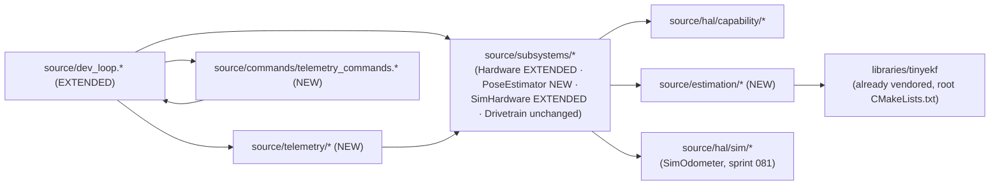

<!-- CLASI: Before changing code or making plans, review the SE process in CLAUDE.md -->

# Architecture Update -- Sprint 082: Host-side simulation pose estimation and telemetry spine (Phase 1 of TestGUI revival)

Source documents: `clasi/issues/plan-revive-testgui-against-the-new-tree-simulator.md`
(the three-phase program plan; this sprint is Phase 1 only) and
`docs/protocol-v2.md` §8 (the `TLM`/`STREAM`/`SNAP` field-vocabulary
reference — a superset spanning the parked `source_old` tree, not
already-built behavior in `source/`).

## Grounding in the current tree — read this first

Two facts, discovered by direct read during this planning pass, materially
shape this document and are not obvious from the sprint brief alone:

1. **The message schema already anticipates this work.** `msg::DrivetrainConfig`
   (`source/messages/drivetrain.h`, generated from `protos/drivetrain.proto`)
   already carries `ekf_q_xy`, `ekf_q_theta`, `ekf_q_v`, `ekf_q_omega`,
   `ekf_r_otos_xy`, `ekf_r_otos_theta`, `ekf_r_otos_v`, `ekf_r_enc_v`,
   `rotational_slip`, `odom_off_x/y`, `odom_yaw`, `lag_otos` — an EKF noise
   surface sized almost exactly to `EKFTiny::init()`'s old parameter list.
   `msg::DrivetrainState` already carries `fused`/`encoder`/`optical`
   (`PoseEstimate`), `enc[]`/`enc_stamp`, `otos` (`ValueSet`),
   `otos_status`/`otos_fusion_blocked`. `Subsystems::Drivetrain::state()`'s
   own doc comment (drivetrain.cpp) says outright: "this differential
   dev-bench Drivetrain has no odometry/EKF this sprint (those return in
   later tickets)." **No proto/message change is needed for this sprint** —
   every field this document's new modules read or write already exists.
   Decision 1 below addresses the one design question this raises: given the
   schema, should the estimation logic live *inside* `Drivetrain`, or beside
   it?
2. **No real-hardware `Hal::Odometer` leaf exists anywhere in `source/`.**
   `Subsystems::NezhaHardware` has no OTOS I2C driver in the new tree (only
   `source_old/hal/nezha/OtosSensor.*`, parked). Only `Hal::SimOdometer`
   (sprint 081, ticket 003, in progress) implements `Hal::Odometer`. This is
   a genuine, pre-existing gap this sprint does not close — see Decision 3
   and the Open Questions.

A third, smaller fact worth naming so it is never re-derived by accident:
`source/kinematics/pose2d.h` defines its OWN `Pose2D`/`BodyTwist`/`BodyTwist3`
family with unit-suffixed field names (`v_mmps`, `omega_rads`) — a *different*,
deliberately-kept-separate type family from `msg::Pose2D`/`msg::BodyTwist3`
(`source/messages/common.h`, conforming `x`/`y`/`h`, `v_x`/`v_y`/`omega`
names), per `drivetrain.cpp`'s own call-out of this exact divergence. Every
new type this sprint introduces uses **only** the `msg::` family — never
`kinematics/pose2d.h`'s parallel, non-conforming structs.

## Step 1: Understand the Problem

The new `source/` tree (five sprints deep: 077-080, plus sprint 081 in
progress) has a `Hal::Odometer` faceplate declared but unconsumed, and no
telemetry surface at all — every existing test either drives the DEV family
directly or reads `DEV M`/`DEV DT STATE` bench queries. TestGUI (Phase 3,
sprint 084) needs a periodic pose stream carrying four distinguishable
sources (truth is external/camera; encoder; OTOS; fused) and a coarse
activity signal (`mode=`). This sprint gives the firmware (a) something that
computes a pose from encoders and, when present, an odometer, and (b) a wire
surface that reports it — closing exactly the gap `Subsystems::Drivetrain`'s
own code already flagged as deferred.

**What does not change:** the wire protocol's existing verbs (`PING`/`VER`/
`HELP`/`ECHO`/`ID`, the `DEV` family); `Subsystems::Drivetrain`'s ratio
governor, kinematics, and command-plane discipline; `Hal::Motor`'s
`position()` already being calibration-corrected mm (no new unit-conversion
layer needed); anything under `source_old/`/`tests_old/`.

**Why now:** sprint 081 (in progress) is about to land the first concrete
`Hal::Odometer` leaf (`Hal::SimOdometer`) and the host sim harness this
sprint verifies against. The message schema has carried the EKF/pose fields
unused since at least sprint 079. Landing the consumer now, right after 081,
avoids a second sprint of schema-carrying-dead-weight.

## Step 2: Identify Responsibilities

| Responsibility | Owning surface | Why it changes independently |
|---|---|---|
| Compute a bounded (x, y, heading) belief from an arc-segment motion model plus 2D position and scalar heading corrections, with no device I/O | `Hal::EkfTiny` (new, `source/estimation/ekf_tiny.{h,cpp}`) | Pure numerical filter — changes only if the filter's own math changes (a different gating strategy, adding the velocity channel back). Never changes for wiring/telemetry reasons. |
| Dead-reckon from wheel encoder deltas and correct the result with a (possibly absent) odometer reading, once per dev-loop pass | `Subsystems::PoseEstimator` (new, `source/subsystems/pose_estimator.{h,cpp}`) | Sensor-fusion tuning (trackwidth, rotational slip, EKF noise) changes independently of `Drivetrain`'s control-law tuning (ratio-governor gain, kinematics) — see Decision 1. |
| Expose whichever concrete `Hal::Odometer` leaf (if any) the active hardware owner has, uniformly to `devLoopTick` | `Subsystems::Hardware::odometer()` (new virtual, defaulted `nullptr`) | The one seam every later responsibility needs to be agnostic to "sim vs. real, real currently having none." Changes only if the shared surface itself grows. |
| Format one `TLM` wire line from a snapshot of pose/encoder/velocity/mode/sequence values, with independent per-field omission | `source/telemetry/tlm_frame.{h,cpp}` (new) | Wire formatting is a pure, stateless transform — changes only when the field vocabulary or its wire syntax changes, never when *how often* it is sent changes. |
| Own the `STREAM`/`SNAP` verbs, the period/channel-binding/`seq` state, and the periodic-emission decision | `source/commands/telemetry_commands.{h,cpp}` + a new `devLoopTick` step | Scheduling/binding policy — changes independently of frame *formatting* (above) and of *what is measured* (`PoseEstimator`, below it). |

No responsibility spans more than one ticket's file set except the shared,
intentional fan-in every later responsibility has on `Hal::EkfTiny` (ticket
001) and `Subsystems::PoseEstimator` (ticket 002) — the same kind of fan-in
sprint 081's own architecture update treats as normal, not a coupling smell.

## Step 3: Subsystems and Modules

| Module | Purpose (one sentence) | Boundary | Use cases served |
|---|---|---|---|
| `Hal::EkfTiny` | Computes a 3-state (x, y, heading) belief from an arc-segment predict step and 2D-position/scalar-heading correction steps. | Inside: state/covariance, the predict/update math, noise parameters. Outside: where its inputs come from (encoder deltas, odometer reads — stays in `PoseEstimator`); velocity-channel fusion, Mahalanobis gating (explicitly deferred — Decision 2). | SUC-001 |
| `Subsystems::PoseEstimator` | Turns per-tick wheel-encoder positions and an optional odometer reading into an encoder-only pose and a fused pose. | Inside: dead-reckoning arc integration, config (trackwidth/slip/EKF noise), owning one `Hal::EkfTiny`. Outside: which port pair is "left/right" (reads it from the same `msg::DrivetrainConfig` `Drivetrain` is configured with, does not derive or own it); any `Hal::Motor`/`Hal::Odometer` reference (takes observations as tick() arguments only, matching `Drivetrain`'s own no-stored-HAL-reference discipline). | SUC-002 |
| `Subsystems::Hardware::odometer()` | Answers "does the active hardware owner have an odometer, and if so, which one" for exactly one caller (`devLoopTick`). | Inside: the virtual seam itself, defaulted to `nullptr`. Outside: any concrete leaf's own behavior. | SUC-003 |
| `devLoopTick`'s estimator step (`source/dev_loop.cpp`, extended) | Samples the bound wheel pair's state and the (optional) odometer once per pass and advances `PoseEstimator`. | Inside: exactly-once-per-pass sequencing (the same double-integration hazard class sprint 081's `SimHardware` dt=0 guard already names). Outside: the estimation math itself (stays in `PoseEstimator`). | SUC-003 |
| `source/telemetry/tlm_frame.*` | Formats one `TLM` wire line from a plain snapshot of values. | Inside: field ordering, per-field omission rules, numeric formatting. Outside: where the values come from, when to send, which channel — all caller concerns. | SUC-004 |
| `source/commands/telemetry_commands.*` | Owns the `STREAM`/`SNAP` verbs, the emission period, the bound reply channel, and the shared `seq` counter. | Inside: verb parsing/registration, period/channel/seq state. Outside: frame formatting (above), estimation (PoseEstimator). | SUC-004 |
| `devLoopTick`'s periodic-emission step (extended) | Decides, once per pass, whether enough time has elapsed to emit a `TLM` frame, and does so on the bound channel. | Inside: the elapsed-time check and the single emission call. Outside: formatting, verb parsing. | SUC-004 |

Every module addresses at least one SUC (right column); every SUC
(usecases.md) is covered by exactly one ticket. No module's one-sentence
purpose needs "and." No cycles — see the dependency graph below.

## Step 4: Diagrams

### Component / module diagram

```mermaid
graph TD
    DevLoop["devLoopTick(loop, now, stmt)<br/>source/dev_loop.* (EXTENDED)"]
    HwBase["Subsystems::Hardware «abstract»<br/>+ odometer() (NEW, defaulted nullptr)"]
    NezhaHw["Subsystems::NezhaHardware<br/>(unchanged — inherits nullptr)"]
    SimHw["Subsystems::SimHardware<br/>(overrides odometer())"]
    PoseEst["Subsystems::PoseEstimator (NEW)<br/>encoderPose() / fusedPose()"]
    Ekf["Hal::EkfTiny (NEW)<br/>3-state predict/correct"]
    Odo["Hal::Odometer «abstract»<br/>(SimOdometer only, this sprint)"]
    Motor["Hal::Motor «abstract»<br/>position() / velocity()"]
    TlmFrame["tlm_frame.* (NEW)<br/>formatTlmFrame(...)"]
    TlmCmds["telemetry_commands.* (NEW)<br/>STREAM / SNAP"]

    DevLoop -->|tick / apply x2| HwBase
    HwBase --> NezhaHw
    HwBase --> SimHw
    SimHw -->|odometer()| Odo
    DevLoop -->|reads bound-pair state()| Motor
    DevLoop -->|reads odometer()->pose()| Odo
    DevLoop -->|tick now, leftObs, rightObs, otosObs| PoseEst
    PoseEst --> Ekf
    DevLoop -->|periodic emission step| TlmFrame
    TlmFrame -->|reads| PoseEst
    TlmCmds -->|stage period / bound channel| DevLoop
```

`HwBase --> NezhaHw` / `HwBase --> SimHw` are "implements," matching sprint
081's own diagram convention. `Subsystems::Drivetrain` is omitted from this
diagram — it is unchanged by this sprint (Decision 1: `PoseEstimator` is a
sibling, not an extension, of `Drivetrain`).

### Dependency graph (directory level)



No cycles. Unchanged direction from 077-081
(`commands -> subsystems -> hal/estimation -> external libs`, domain-inward).
`source/estimation/*` is a new leaf directory at the same tier as
`source/kinematics/*` (pure math, no `Hal`/`Subsystems` device ownership) —
its only dependency is the already-vendored `libraries/tinyekf`, not a new
external dependency this sprint introduces.

**No entity-relationship diagram**: no proto/message field is added, removed,
renamed, or retyped — see "Grounding," fact 1. This sprint is purely new
consumers of an already-existing schema.

## Step 5: What Changed / Why / Impact / Migration

### What Changed, by ticket

**001 — `Hal::EkfTiny`.** New `source/estimation/ekf_tiny.{h,cpp}`, a 3-state
(x, y, heading) EKF ported from `source_old/state/EKFTiny.{h,cpp}` against the
already-vendored `libraries/tinyekf`, trimmed to drop the velocity/omega
sub-block, Mahalanobis gating, and P-inflation gate-recovery (Decision 2).

**002 — `Subsystems::PoseEstimator`.** New
`source/subsystems/pose_estimator.{h,cpp}`. Wraps one `Hal::EkfTiny` plus an
encoder-only dead-reckoning accumulator (arc-segment integration ported from
`source_old/control/Odometry.cpp`'s encoder half). `configure()` reads
`trackwidth`/`rotational_slip`/four EKF noise fields from the same
`msg::DrivetrainConfig` type `Drivetrain` already uses, with a
zero-as-unset-sentinel default fallback (Decision 4). `tick()` takes the two
wheels' `msg::MotorState` (matching `Drivetrain::tick()`'s existing shape)
plus a nullable odometer observation.

**003 — `Subsystems::Hardware::odometer()` + wiring.** `Subsystems::Hardware`
(`source/subsystems/hardware.h`) gains
`virtual Hal::Odometer* odometer() { return nullptr; }` (Decision 3).
`Subsystems::SimHardware` overrides it; `Subsystems::NezhaHardware` is
untouched. `source/dev_loop.h` adds a `Subsystems::PoseEstimator*` field to
`DevLoop`; `dev_loop.cpp` adds one estimator-tick step after the second
`hardware.tick(now)` slice, reading the Drivetrain's bound pair
(`drivetrain.ports()`, queried unconditionally rather than only inside
`if (drivetrain.active())`) and the (possibly null) odometer. `main.cpp`
constructs and configures the `PoseEstimator` and wires it into `DevLoop`.

**004 — Telemetry surface.** New `source/telemetry/tlm_frame.{h,cpp}` (pure
formatting, ported from `source_old/robot/RobotTelemetry.cpp`'s frame-building
logic) and `source/commands/telemetry_commands.{h,cpp}` (`STREAM`/`SNAP`
verbs, a `TelemetryState` struct: period, shared `seq`, bound
`replyFn`/`replyCtx`). `dev_loop.cpp` gains a periodic-emission step.
`main.cpp` concatenates `telemetryCommands()` into the command table.
`mode=` reads `drivetrain.active()` (`I`/`S`, Decision 6). `enc=`/`vel=` read
directly from `hardware.motor(port).position()`/`.velocity()` for the bound
pair, not from `Drivetrain::state()`'s `vel_[]` (a different, commanded-target
semantic — Decision 7).

**005 — Verification.** New sim tests under `tests/sim/` (pose/encpose
tolerance, otos divergence/reconvergence, STREAM/SNAP shape) plus a hardware
bench gate session. No production `source/` file changes.

### Why

See "Grounding" above for the schema-already-exists finding, and Decision 1
for why that finding does not pull the estimation logic into `Drivetrain`
itself. See Decision 2/4/5 for the scope reductions that keep this a
five-ticket sprint rather than a full port of every old-tree EKF/telemetry
refinement accumulated over sprints 022-074.

### Impact on Existing Components

| Component | Impact |
|---|---|
| `source/subsystems/hardware.h` | **Modified** (003). One new defaulted virtual method; no existing method signature changes. |
| `source/subsystems/nezha_hardware.{h,cpp}` | **Unaffected.** Inherits the `nullptr` `odometer()` default; no source change. |
| `source/subsystems/sim_hardware.{h,cpp}` | **Modified** (003). One new `override` returning the already-existing `odometer_` member's address — `SimHardware::odometer()` is a one-line addition to an already-built (081) class. |
| `source/subsystems/drivetrain.{h,cpp}` | **Unaffected.** No method signature, config read, or state-population change — `PoseEstimator` is a sibling, not an extension (Decision 1). `DrivetrainState`'s `fused`/`encoder`/`optical`/`otos` fields remain at their zero defaults; `DEV DT STATE` does not yet surface pose (Open Question). |
| `source/dev_loop.{h,cpp}` | **Modified** (003, 004). Two new fields on `DevLoop` (`PoseEstimator*`, telemetry state), two new steps in `devLoopTick()` (estimator tick, periodic emission) — both additive, ordered after the existing two-slice hardware tick and before the watchdog check. |
| `source/main.cpp` | **Modified** (003, 004). Constructs/configures `PoseEstimator` and `TelemetryState`; concatenates `telemetryCommands()` into the command table. |
| `source/commands/dev_commands.{h,cpp}` | **Unaffected.** No change to any `DEV` verb or `DevLoopState`. |
| `docs/protocol-v2.md` | **Extended, not superseded.** §8's field vocabulary (`t=`/`mode=`/`seq=`/`enc=`/`vel=`/`pose=`/`encpose=`/`otos=`/`twist=`) is the target this sprint implements a subset of behavior against, in the new tree, for the first time — see Decision 5 for what §8 richness is deliberately deferred. |
| `msg::DrivetrainConfig`/`msg::DrivetrainState` (`protos/drivetrain.proto`) | **Unaffected — read, not written to the schema.** Every field this sprint's modules read already exists (Grounding, fact 1). No proto regen. |

### Migration Concerns

- **No data/wire migration.** No proto field added/removed/renamed; `STREAM`/
  `SNAP`/`TLM` are net-new verbs in the new tree, not a changed existing one.
- **Execution gate — this sprint cannot run until sprint 081 closes.** 081
  delivers `Subsystems::Hardware`, `Subsystems::SimHardware`,
  `devLoopTick`, and `Hal::SimOdometer` — every one of this sprint's tickets
  depends on at least one of those. **082 branches from `master` after 081
  merges, not from 081's own in-progress branch.** Ticket execution is
  deferred until that merge; this planning document may be reviewed/approved
  before then, but no ticket work begins first.
- **Sequencing within 082 is fully serial** (001 -> 002 -> 003 -> 004 -> 005) —
  each ticket's acceptance depends on the previous one's artifact existing.
  See the sizing note below for an optional split point.
- **ARM build behavior for existing verbs must be unaffected.** Ticket 003's
  bench-smoke acceptance item confirms `PING`/`DEV` family round-trip
  identically before and after `devLoopTick`'s two new steps land.
- **No deployment-sequencing concern beyond ticket order** — every new file
  is additive; no existing file is deleted; `Subsystems::NezhaHardware`
  requires no change at all.

## Sizing recommendation — flagged, not decided here

Tickets 001-003 are the estimation half (`Hal::EkfTiny`,
`Subsystems::PoseEstimator`, the `Hardware::odometer()` seam + dev-loop
wiring); 004-005 are the telemetry half (`TLM` frame + `STREAM`/`SNAP` +
verification). Splitting after ticket 003 into a follow-on sprint is a
reasonable, low-risk option if stand availability, calendar pressure, or
review-cycle overhead makes one sprint awkward — mirroring sprint 081's own
"flagged, not decided here" sizing note. This document keeps all five
tickets in 082 because the dependency chain is already fully serial either
way and splitting does not change what work happens when; the choice is a
stakeholder/scheduling call, not an architectural one.

## Step 6: Design Rationale

### Decision 1: `Subsystems::PoseEstimator` is a new sibling module, not logic folded into `Subsystems::Drivetrain`

**Context.** "Grounding" fact 1 shows `msg::DrivetrainState`/`DrivetrainConfig`
already carry the pose/EKF fields, and `Drivetrain::state()`'s own comment
says this work "return[s] in later tickets" — read literally, this could mean
`Drivetrain` itself is where the estimation logic was meant to land.

**Alternatives considered:**
(a) Extend `Subsystems::Drivetrain::tick()` to also take an odometer
observation and populate its own `state().fused/encoder/optical` directly —
no new Subsystems-tier class.
(b) A new, separate `Subsystems::PoseEstimator` (chosen), with
`Drivetrain` left untouched this sprint; the schema's already-scaffolded
pose fields on `DrivetrainState` stay unpopulated until (if ever) a later
ticket wires `PoseEstimator`'s output back into `Drivetrain::state()` for
`DEV DT STATE`'s benefit.

**Why this choice.** (b). `Drivetrain`'s own header comment states its
purpose in one sentence: turning a body twist or wheel targets into
governed motor commands — a *control* responsibility. Pose estimation is a
*sensing/perception* responsibility: it changes for different reasons
(EKF noise re-tuning, an odometer lever-arm correction) than the ratio
governor or kinematics do (motor slew/PID tuning, trackwidth calibration).
Folding both into one class would be exactly the old tree's own `Drive`
class shape (`source_old`) — a single class doing control governance AND
odometry AND EKF fusion — which this project's greenfield rebuild has
otherwise been decomposing away from at every other tier (e.g. extracting
`Hal::MotorVelocityPid` out of `NezhaMotor` in sprint 081 ticket 001, for the
identical "shared math, not appropriate as any one leaf's member" reason).
The schema *storing* fused/encoder/optical pose fields on the same message as
wheel-velocity targets is a data-model convenience (both are "public state
the drivetrain subsystem area reports"), not a mandate that one C++ class
compute both.

**Consequences.** `DrivetrainState`'s `fused`/`encoder`/`optical`/`enc`/
`enc_stamp`/`otos`/`otos_status`/`otos_fusion_blocked` fields remain
zero-valued this sprint — `DEV DT STATE` (the bench-diagnostic query verb)
does not yet show pose data. `TLM` (this sprint's actual telemetry surface)
is unaffected — it reads `PoseEstimator` directly, never through
`DrivetrainState`. Wiring `PoseEstimator`'s output back into
`DrivetrainState` for `DEV DT STATE`'s benefit is flagged as Open Question 4,
not blocking.

### Decision 2: a 3-state (x, y, heading) EKF, no velocity-channel fusion, no Mahalanobis gating, no P-inflation gate-recovery

**Context.** `source_old/state/EKFTiny.{h,cpp}` is a 515-line, 5-state
(x, y, theta, v, omega) filter accumulated over sprints 022-024, 050, 067,
074: Mahalanobis chi-squared gating on all three update channels,
rejection-streak counters, P-inflation gate-recovery, a dedicated velocity
fusion channel, live noise re-tuning without a state reset. The sprint
brief's acceptance bar is: `pose=`/`encpose=` track ground truth within
tolerance; `otos=` (the RAW odometer reading, independent of any fusion —
see Decision 7) diverges/re-converges with `SimOdometer`'s own error knobs.

**Alternatives considered:**
(a) Port the full 5-state filter with all of its accumulated robustness
layers, byte-for-byte.
(b) A 3-state (x, y, heading) filter (chosen): predict via the identical
arc-segment motion model minus the velocity sub-block; correct via the same
2D-position and scalar-heading channels; no gating, no rejection streaks, no
P-inflation.
(c) No genuine fusion at all — alias `pose=` to `encpose=` (the roadmap
document's own explicitly-sanctioned fallback if "fusion slips a sprint").

**Why this choice.** (b). The acceptance bar does not require velocity-state
fusion: `twist=` is populated from directly-measured/derived rates (Decision
7), not filtered EKF state, so the velocity sub-block buys nothing this
sprint needs. Gating exists to reject adversarial/outlier observations;
`SimOdometer`'s error model (Gaussian noise, scale error, additive drift) is
smoothly-varying, not adversarial, so an always-accept correction step
already satisfies "diverges/re-converges with the knobs." Porting (a)
verbatim would import untested-in-this-tree Mahalanobis/gate-recovery
machinery whose old parity tests (`test_ekf.py`) live in `tests_old/` and are
not part of this sprint's scope to re-validate — doing so risks a much larger,
higher-defect-surface ticket for capability the acceptance bar does not ask
for (the classic speculative-generality trap this project's own architecture
principles warn against). Option (c) is available and explicitly sanctioned
by the roadmap, but this sprint does better: a real, if simplified, fusion
step exists, so `pose=` is genuinely OTOS-corrected, not an alias.

**Consequences.** `ekf_q_v`, `ekf_q_omega`, `ekf_r_otos_v`, `ekf_r_enc_v`
(four of the eight already-scaffolded EKF fields) are read by nothing this
sprint — reserved, not removed, for a future velocity-fusion ticket (Open
Question 2). Gating/rejection-streak diagnostics (`otos_health=`, `ekf_rej=`)
are not in this sprint's required TLM field list and are not added.

### Decision 3: `Subsystems::Hardware::odometer()` is a defaulted virtual (returns `nullptr`), not a second pure-virtual method

**Context.** `Subsystems::Hardware` (sprint 081) currently has four pure
virtual methods (`motor()`, `tick()`, two `apply()` overloads) every concrete
owner must implement. `Subsystems::NezhaHardware` has no odometer at all
(Grounding, fact 2).

**Alternatives considered:**
(a) A pure virtual `Hal::Odometer& odometer() = 0;` — every owner must
supply one, forcing `NezhaHardware` to either fabricate a null-object
`Hal::Odometer` implementation or the sprint to also port a real OTOS I2C
driver (explicitly out of scope).
(b) A defaulted virtual returning `nullptr` (chosen) — only owners that
actually have an odometer override it.
(c) Skip the seam entirely; have `devLoopTick` downcast or `#ifdef` on the
concrete `Hardware` type to reach `SimHardware::odometer()`.

**Why this choice.** (b). Matches `Subsystems::Hardware::begin()`'s own
existing precedent (already a defaulted no-op virtual, per that file's Open
Question 1) for "not every owner needs this, and forcing an implementation
is worse than a safe default." (a) would force scope this sprint explicitly
excludes (a real OTOS driver) just to satisfy an interface, or push ugly
null-object boilerplate onto `NezhaHardware` for a capability it genuinely
does not have yet. (c) reintroduces exactly the kind of "two code paths, one
per concrete owner" duplication sprint 081's own Decision 1 already rejected
for the identical class of problem.

**Consequences.** `Subsystems::NezhaHardware` requires zero source changes.
Any caller of `hardware.odometer()` must null-check — `devLoopTick`'s new
step does so explicitly (ticket 003's acceptance criteria). When a future
sprint ports a real OTOS driver, that leaf overrides `odometer()` the same
way `SimHardware` does; no interface change is needed at that point.

### Decision 4: un-set EKF config uses a zero-as-sentinel default, not a boot-config generator change

**Context.** `msg::DrivetrainConfig`'s EKF noise fields default to `0.0f`
(proto zero-value). A literal `Q=0, R=0` EKF is numerically degenerate
(covariance can collapse toward zero, making the filter ignore future
corrections). `Config::defaultDrivetrainConfig()` (generated by
`scripts/gen_boot_config.py` from `data/robots/*.json`) is where `trackwidth`
etc. get real boot values — but `SET`/`GET` wiring for these keys, and (by
extension) deciding what belongs in the robot JSON schema, is explicitly
sprint 083's scope (Phase 2: config surface).

**Alternatives considered:**
(a) Extend `scripts/gen_boot_config.py` and every `data/robots/*.json` file
with the four position/heading EKF fields this sprint's 3-state filter uses.
(b) `Subsystems::PoseEstimator::configure()` applies a zero-as-unset-sentinel
substitution (chosen) — any of the four fields arriving as exactly `0.0f` is
replaced with a small, hardcoded, documented default before being handed to
`Hal::EkfTiny::init()` — mirroring the existing `effectiveSlip()` pattern
already in the ported `Odometry` source (0 or negative `rotationalSlip` ->
1.0, a "no correction, legacy-config-safe" fallback).

**Why this choice.** (b). Touching the boot-config generator and every robot
JSON file is exactly the kind of config-surface work sprint 083 owns
end-to-end (it also needs to decide the `SET`/`GET` key names and validation
rules for these fields) — doing it piecemeal here would pre-empt that
sprint's own design authority over the config surface, and risks a key
existing in JSON with no `SET`/`GET` to reach it for months. The sentinel
pattern is self-contained (one function, one file, this sprint), already has
a working precedent in the exact source being ported, and produces the
identical practical outcome (a numerically sane filter with no `SET` ever
issued) without deciding anything that belongs to Phase 2.

**Consequences.** A robot JSON that DOES eventually get real `ekf_*` values
in sprint 083 does not need special-casing here — the sentinel only fires
when the field is exactly zero, so a real non-zero configured value passes
through unchanged from day one of Phase 2.

### Decision 5: `STREAM`/`SNAP` implement only the base mechanism — no `fields=` subscription, no D10 idle-rate or channel-rebinding refinements

**Context.** `docs/protocol-v2.md` §8 documents several refinements layered
onto the base `STREAM`/`TLM` mechanism over many old-tree sprints: a
`fields=<csv>` subscription bitmask, an idle-rate rule (emit at
`max(period, 500ms)` when idle, so a host can distinguish "robot idle" from
"link dropped"), and channel-rebinding restrictions (a `STREAM` on a
different channel does not steal the bound stream).

**Alternatives considered:**
(a) Port every §8 refinement now.
(b) Port only the base mechanism (chosen): `STREAM <ms>` sets a period
(0 disables), `SNAP` returns one frame synchronously, both share one `seq`
counter, and the channel that most recently issued `STREAM` is the bound
recipient of periodic frames. Always emit the full fixed field set this
sprint defines (`fields=` selection is not implemented).

**Why this choice.** (b). This dev-bench tree currently has exactly one
meaningful field set to emit — there is no `line=`/`color=` capability wired
in yet, so a subscription mechanism has no second configuration to select
between. The idle-rate and channel-rebinding refinements are real but
narrow diagnosability improvements from a much later old-tree sprint
(`028-005`, D10) with no acceptance-bar requirement driving them this
sprint. Landing the base mechanism correctly and cleanly, with the
refinements as explicit, named follow-ups, is preferable to a bigger ticket
whose extra surface nothing in Phase 1-3 yet exercises.

**Consequences.** `STREAM fields=<csv>` is not a recognized form this sprint
(a bare `STREAM <ms>` is); if TestGUI (Phase 3) or a later sprint needs field
selection or the idle-rate/channel-rebind refinements, they are additive to
`telemetry_commands.*`'s existing shape, not a redesign.

### Decision 6: `mode=` reports only `I`/`S` this sprint

**Context.** `docs/protocol-v2.md` documents `mode` as `I`/`S`/`T`/`D`/`G` —
the full set belongs to closed-loop motion verbs, sprint 083's scope. The
sprint brief is explicit: define the field now (TestGUI depends on it), give
it a minimal honest value, do not invent motion state that does not exist.

**Why this choice.** `drivetrain.active()` already exists and already means
"is this Drivetrain currently the one driving its bound pair" — exactly what
`S` (streaming/`VW`-style drive) meant in the old protocol, and precisely
the drive mode 082 actually has (`DEV DT VW`/`WHEELS`). No new state is
introduced; `mode=` is a direct read of an existing boolean.

**Consequences.** Sprint 083 extends the mode character set as its own
motion-verb state machine lands; this sprint's `I`/`S` values do not need to
change when that happens, only gain siblings.

### Decision 7: `enc=`/`vel=` in `TLM` read `Hal::Motor` directly, not `Drivetrain::state()`'s `vel_[]`

**Context.** `Drivetrain::state()`'s `vel_[]` already exists and is
populated — but its own doc comment says it reports "the CURRENT commanded
(pre-governor) targets," for `DEV DT STATE`'s bench-query purpose.
`docs/protocol-v2.md` §8 defines `vel=` as "left and right **actual**
velocity in mm/s" — a measured quantity.

**Why this choice.** Reusing `Drivetrain::state().vel_[]` for `TLM`'s `vel=`
would silently conflate two different meanings of "velocity" (commanded vs.
measured) under one wire field name. `Hal::Motor::velocity()` (and
`position()` for `enc=`) are the actual measured getters, already sampled
once per pass by `devLoopTick`'s existing hardware-tick slices — reading
them directly for the telemetry frame is both more correct and requires no
new plumbing.

**Consequences.** `TLM`'s `enc=`/`vel=` and `DEV DT STATE`'s `vel_[]` can
legitimately show different numbers (target vs. actual) — this is existing,
intentional behavior of `DrivetrainState`, not a new inconsistency this
sprint introduces.

## Architecture Self-Review

- **Consistency**: The Sprint Changes narrative (Step 5), the Impact table,
  and the seven Design Rationale decisions all name the same five new/
  extended modules (`Hal::EkfTiny`, `Subsystems::PoseEstimator`,
  `Subsystems::Hardware::odometer()`, `source/telemetry/tlm_frame.*`,
  `source/commands/telemetry_commands.*`) with no contradictory description.
  The two "Grounding" facts (schema already exists; no real OTOS leaf) are
  stated once, then consistently assumed — never re-litigated or silently
  reversed — in every later section.
- **Codebase alignment**: Every claim about current code (`msg::DrivetrainConfig`/
  `DrivetrainState`'s existing fields; `Drivetrain::state()`'s "later tickets"
  comment; `Hal::Motor::position()` already returning calibrated mm;
  `libraries/tinyekf` already vendored and on the root `CMakeLists.txt`
  include path; `Subsystems::Hardware::begin()`'s existing defaulted-virtual
  precedent; `kinematics/pose2d.h`'s separate, non-conforming type family)
  was verified by direct file read during this planning pass, not assumed.
- **Design quality**: Cohesion checked module-by-module (Step 3) — every
  one-sentence purpose is single-responsibility, and Decision 1 explicitly
  defends the cohesion argument for keeping `PoseEstimator` separate from
  `Drivetrain` even though the message schema co-locates their output
  fields. Coupling: no cycles in either diagram; fan-out stays at 2-3
  throughout. Boundaries: `Subsystems::Hardware`'s new method is a single
  defaulted addition, not a widened contract every owner must satisfy.
  Dependency direction unchanged from 077-081.
- **Anti-pattern detection**: No god component — Decision 1 is precisely the
  documented rejection of folding estimation into `Drivetrain`, which would
  have been the god-component risk. No shotgun surgery (`NezhaHardware`
  needs zero changes; `Drivetrain` needs zero changes). No feature envy (no
  new module reaches into another's private state — `PoseEstimator` takes
  observations as tick() arguments, matching `Drivetrain`'s own convention).
  No circular dependencies. No leaky abstraction (`Hardware::odometer()`
  names no Sim- or Nezha-specific concept). Speculative generality was
  actively cut, not added — Decision 2 trims the old 5-state/gated EKF down
  to exactly what the acceptance bar needs, and Decision 5 declines to port
  `fields=`/idle-rate/channel-rebind refinements nothing yet exercises.
- **Risks**: No data migration (Grounding fact 1). The one substantive
  correctness risk this document flags beyond the sprint brief's own list is
  the double-integration hazard for `PoseEstimator.tick()` — devLoopTick
  must call it exactly once per pass despite `hardware.tick()` being called
  twice — pinned to a specific ticket (003) and acceptance criterion (SUC-003),
  the same class of bug sprint 081's `SimHardware` dt=0 guard already
  documents. The pre-existing OTOS hardware gap (no real leaf) is a known,
  named limitation this sprint does not introduce and is not expected to
  close — carried forward honestly into the bench-gate acceptance criteria
  and sprint.md's Success Criteria rather than silently dropped.

**Verdict: APPROVE.** No structural issues (no circular dependency, no god
component, no broken interface, no inconsistency between the Sprint Changes
narrative and the document body). The cohesion question the message schema's
existing shape raises (Decision 1) was examined explicitly and resolved with
a documented rationale, not left implicit.

## Step 7: Open Questions

1. **Should `PoseEstimator`'s output be wired back into `DrivetrainState`'s
   already-scaffolded `fused`/`encoder`/`optical` fields, so `DEV DT STATE`
   (the bench-diagnostic query) also shows pose data?** Not needed for
   TestGUI (which consumes `TLM`, not `DEV DT STATE`) — deferred as a small,
   low-risk follow-up whenever a bench operator wants pose visible on the
   query surface too.
2. **`ekf_q_v`/`ekf_q_omega`/`ekf_r_otos_v`/`ekf_r_enc_v` are read by
   nothing this sprint.** They remain reserved in the schema for a future
   velocity-channel EKF fusion ticket (Decision 2). Flagged for whoever picks
   that up, so the fields are not mistaken for dead/removable.
3. **When does a real-hardware `OtosSensor` (`Hal::Odometer` leaf for the
   physical OTOS chip) get ported?** Not scheduled by this document or the
   three-phase program plan as read. Until it exists, `pose=`/`otos=` are
   sim-only-verifiable, and the hardware bench gate's OTOS checks stay
   explicitly unsatisfiable (sprint.md Success Criteria; SUC-005).
4. **Should `STREAM`'s bound-channel state survive a `DEV STOP`/watchdog
   neutral event, the same way `DEV DT PORTS`'s port binding does?** Not
   specified by the sprint brief; this document assumes yes (channel binding
   is comms-session state, unrelated to drivetrain authority) but flags it
   for explicit confirmation during ticket 004's implementation if a test
   reveals ambiguity.
5. **Gaussian-noise-only verification is what `SimOdometer` currently
   models.** If a future sprint's `otos=` divergence/reconvergence
   expectations need adversarial-outlier coverage (the Mahalanobis gating
   this sprint deliberately deferred, Decision 2), that is the point at
   which porting the gating logic becomes acceptance-bar-driven rather than
   speculative.
