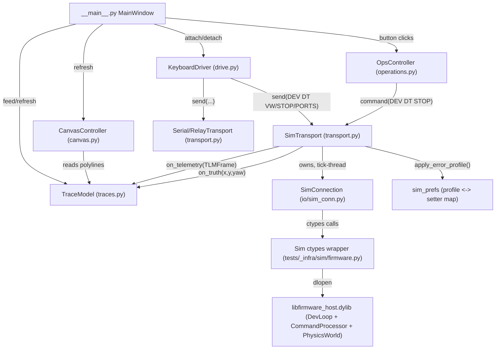
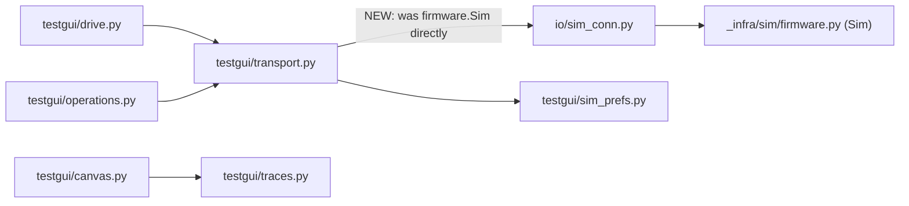

<!-- CLASI: Before changing code or making plans, review the SE process in CLAUDE.md -->

# Architecture Update -- Sprint 083: Host TestGUI sim cockpit

## Step 1: Understand the Problem

`host/robot_radio/testgui/` was built against a pre-greenfield-rebuild
firmware (old `SIMSET`/`SIMGET` wire commands, a top-level `VW`/`STOP` verb
set, an EKF/fusion pose). Sprints 081 (host ctypes sim, `tests/_infra/sim/`)
and 082 (pose telemetry) rebuilt the simulator and the `TLM` wire format
from scratch against the new `source/` tree, but nothing updated TestGUI to
match. Concretely, by reading the actual code (not just the issue's
summary):

- `transport.py`'s `SimTransport` calls **four methods that do not exist** on
  `tests/_infra/sim/firmware.py`'s `Sim` class: `sim.get_true_pose()` (real
  name: `true_pose()`), `sim.send_command()` (real name: `command()`),
  `sim.set_true_velocity()` (no such method — no ctypes symbol exists for it
  at all), and `sim.set_field_profile()` (no such method — the old
  `_rotationalSlip` test-infra channel it drove is gone). It also calls
  `sim.tick_for(total, step_ms=...)` — the real parameter is named `step`.
  Every one of these would raise `AttributeError`/`TypeError` the first time
  it runs; `_apply_profile_to_sim`'s and `set_true_pose`'s bare
  `except Exception` blocks currently swallow the failures silently, so
  `SimTransport` "connects" today but never actually applies an error
  profile and would crash the moment a caller hit `set_true_velocity`
  outside its `try`.
- `_apply_profile_to_sim` builds `SIMSET k=v ...` wire lines. **No `SIMSET`
  verb is registered anywhere in `source/commands/`** — confirmed by
  reading every `makeCmd`/`makeSchemaCmd` registration in
  `source/commands/*.cpp`: the complete verb set the current dev-build
  firmware understands is `PING`, `VER`, `HELP`, `ECHO`, `ID`, `STREAM`,
  `SNAP`, `DEV M`, `DEV DT`, `DEV STATE`, `DEV STOP`, `DEV WD`. This matches
  `docs/protocol-v2.md` §15 ("Sim parameters and telemetry — ctypes-only, no
  `SIMSET`/`SIMGET`") — the doc is already correct; only the code lagged.
- `drive.py`'s `KeyboardDriver` sends bare `VW <v> <omega_mrads>` and bare
  `STOP` — **neither verb is registered** either (same audit). Only
  `DEV DT VW <v_x> <v_y> <omega>` and `DEV DT STOP` exist.
- `operations.py`'s STOP button sends bare `STOP` — same bug, same fix.
  Its Sync Pose (`SI ...`), Zero Encoders (`ZERO enc`), and the
  `commands.py` command-row schema (`S`/`T`/`D`/`R`/`TURN`/`RT`/`G`) send
  verbs that are **also** unregistered. These are genuine, but different
  from the driving/STOP bug: fixing them requires firmware verbs
  (`SET`/`GET`, `ZERO`, `OI`/`OP`/`OV`, and non-`DEV` motion commands) that
  do not exist in `source/` at all yet — not merely a host-side mapping fix.
  This sprint does not add them; see Step 7 Open Questions and the
  Migration Concerns below.
- `canvas.py`/`traces.py` resolve the bundled playfield image/calibration at
  `tests/old/playfield_tour/...`. The greenfield rebuild (sprint 077) parked
  the pre-rebuild tree at `tests_old/`, not `tests/old/` — the actual files
  live at `tests_old/old/playfield_tour/playfield.jpg` and
  `.../playfield_calibration.json` (confirmed by `find`). The path is a
  simple two-token miss, not a missing asset.
- `protocol.py`'s `TLMFrame` dataclass and `traces.py`'s `feed()` already
  match the 082 `TLM` format (`encpose=`/`otos=`/`pose=` as absolute
  `(x_mm, y_mm, heading_cdeg)` triples) — no changes needed there beyond the
  asset-path fix and end-to-end verification against a working
  `SimTransport`.

## Step 2: Identify Responsibilities

1. **Sim process control** — own a `Sim`/`SimConnection` handle, advance
   simulated time at wall-clock rate, and translate GUI-thread commands into
   ctypes calls without racing the tick-thread. (Changes: fix broken method
   names; change which object is owned.)
2. **Sim error-profile application** — map the operator-facing error-profile
   dict to the sim's actual injection surface. (Changes: from wire `SIMSET`
   to direct ctypes setter calls.)
3. **Interactive drive-command generation** — map held arrow keys (and
   release) to the wire verbs that actually drive the plant and stop it.
   (Changes: from top-level `VW`/`STOP` to `DEV DT VW`/`DEV DT PORTS`/
   `DEV DT STOP`.)
4. **Pose-trace accumulation and rendering** — ingest `TLMFrame` fields and
   ground truth into world-cm polylines and paint them over a playfield
   background. (Changes: none to the accumulation logic; fix the
   background-asset path only.)
5. **Packaging and test portability** — make the GUI installable/runnable
   and its non-visual logic testable headlessly in the rebuilt `tests/` tree.
   (Changes: new `tests/testgui/` package, `pyproject.toml` `testpaths`
   entry, `justfile` launch recipe.)

Responsibilities 1 and 2 share one file (`transport.py`'s `SimTransport`)
and one root cause (a stale ctypes/wire surface) — they are not
independently releasable (`connect()` calls the profile-apply path
unconditionally at `Sim`/`SimConnection` construction), so they stay one
ticket rather than being split by bullet-point.

## Step 3: Subsystems and Modules

### `SimTransport` (`host/robot_radio/testgui/transport.py`)
- **Purpose**: Drive the ctypes firmware simulator as a `Transport` backend.
- **Boundary**: Inside — the tick-thread, the command queue, error-profile
  application, ground-truth delivery. Outside — the `Transport` ABC
  contract (`connect`/`disconnect`/`send`/`command`), which the GUI and
  `KeyboardDriver` consume without knowing Sim exists.
- **Use cases served**: SUC-001, SUC-004.
- **Change**: now owns a `SimConnection` (`host/robot_radio/io/sim_conn.py`)
  instead of a raw `Sim` (`tests/_infra/sim/firmware.py`) instance — see
  Design Rationale Decision 1. Every broken method reference above is fixed
  to the real API.

### `SimConnection` (`host/robot_radio/io/sim_conn.py`)
- **Purpose**: Present a `SerialConnection`-shaped, ctypes-backed interface
  to one running `Sim` process.
- **Boundary**: Inside — the 40-symbol ctypes ABI binding, `send`/
  `send_fast`/`tick`/`get_*`/`set_*`. Outside — anything about wall-clock
  pacing or GUI threading (that stays `SimTransport`'s job).
- **Use cases served**: SUC-001, SUC-004 (indirectly, as `SimTransport`'s
  dependency).
- **Change**: none to this module itself — it already exposes everything
  `SimTransport` needs (confirmed by reading it end-to-end this sprint).
  `SimTransport` becomes its first non-test consumer.

### `KeyboardDriver` (`host/robot_radio/testgui/drive.py`)
- **Purpose**: Translate held arrow keys into a bounded, watchdog-safe drive
  session over any `Transport`.
- **Boundary**: Inside — key-event wiring, the resend timer, the STOP
  deadman sequence, keepalive arm/disarm. Outside — what the wire verb
  actually is (that was already parameterized via `Transport.send()`, so
  only the verb strings this module builds need to change).
- **Use cases served**: SUC-002, SUC-005.
- **Change**: wire strings change from `VW <v> <omega_mrads>` / `STOP` to
  `DEV DT VW <v_x> 0 <omega>` (rad/s) / `DEV DT STOP`, plus a one-time
  `DEV DT PORTS <left> <right>` bind per session (Design Rationale
  Decision 2).

### `OpsController` (`host/robot_radio/testgui/operations.py`)
- **Purpose**: One-click session actions (Sync Pose, Zero Encoders, STOP,
  Clear Traces, Refresh Playfield, STREAM toggle, Set Origin).
- **Boundary**: Unchanged this sprint except the STOP handler's wire verb.
- **Use cases served**: SUC-005 (STOP only, this sprint).
- **Change**: `on_stop()`'s bare `STOP` becomes `DEV DT STOP` (Design
  Rationale Decision 3). Sync Pose / Zero Encoders / Refresh Playfield /
  Set Origin are untouched and remain non-functional against live hardware
  verbs that do not exist yet (Refresh Playfield and Set Origin are
  display-only/camera-only and already work; Sync Pose and Zero Encoders
  send verbs the firmware does not register — pre-existing, out of scope).

### `TraceModel` / `CanvasController` (`traces.py`, `canvas.py`)
- **Purpose**: Accumulate and render four world-cm pose polylines over a
  playfield background image.
- **Boundary**: Unchanged. `TraceModel` stays Qt-free; `CanvasController`
  stays the only Qt-aware renderer.
- **Use cases served**: SUC-003.
- **Change**: the three asset-path constants in `canvas.py`
  (`_PLAYFIELD_IMAGE`, `_PLAYFIELD_DESKEWED`, `_PLAYFIELD_CALIB`) move from
  `tests/old/playfield_tour/...` to `tests_old/old/playfield_tour/...`
  (matching `traces.py`'s own docstring reference, which already names the
  right leaf path but the wrong root). No change to `_load_calibration()`,
  `_build_playfield_calibration()`, or any transform math.

### `sim_prefs` (`host/robot_radio/testgui/sim_prefs.py`)
- **Purpose**: Persist and resolve the operator-configurable sim
  error-injection profile.
- **Boundary**: Inside — the profile dict shape, defaults, and calibration
  fallback resolution. Outside — how a profile is *applied* to a running
  sim (that is `SimTransport`'s job; `sim_prefs` only names which field maps
  to which sim setter).
- **Use cases served**: SUC-004.
- **Change**: `PROFILE_TO_SIMSET_KEY` (field → wire key) is replaced by
  `PROFILE_TO_SIM_SETTER` (field → `Sim`/`SimConnection` setter name).
  `motor_offset_l`/`motor_offset_r`/`slip_turn_extra` keep their JSON
  keys (backward-compatible persisted files still load) but are documented
  as having no ctypes backing in the current ABI (Design Rationale
  Decision 4).

### `tests/testgui/` (new)
- **Purpose**: Headless, Qt-offscreen test coverage for the modules above.
- **Boundary**: Inside — ported unit/integration tests. Outside — no
  production code lives here.
- **Use cases served**: SUC-006.
- **Change**: new package; `pyproject.toml` `testpaths` gains an entry;
  `justfile` gains a launch recipe.

## Step 4: Diagrams

### Component diagram

### Dependency graph (module level; changed edge marked)

No cycles: `transport` depends on `sim_conn`/`sim_prefs`; `drive`/
`operations` depend on `transport`'s `Transport` ABC only (they already did,
unchanged); `canvas` depends on `traces` one-way. No new module gained a
dependency on the GUI layer (`__main__.py`) — dependency direction stays
`GUI -> {drive, operations, traces, canvas} -> transport -> sim_conn ->
firmware`.

An entity-relationship diagram is omitted: this sprint adds no persisted
data model beyond the existing `sim_error_profile.json` dict, whose shape
is unchanged (same keys, same JSON file).

## Step 5: What Changed / Why / Impact / Migration

### What Changed

- `transport.py`'s `SimTransport` is rewired to own a `SimConnection`
  instead of a raw `Sim`, and every broken method reference
  (`get_true_pose`/`send_command`/`set_true_velocity`/`set_field_profile`/
  `tick_for(step_ms=...)`) is fixed against the real API.
- `_apply_profile_to_sim` stops building `SIMSET` wire lines and instead
  calls the sprint-081 ctypes error-knob setters directly, one profile field
  at a time, via `sim_prefs.PROFILE_TO_SIM_SETTER`.
- `drive.py`'s `KeyboardDriver` sends `DEV DT VW <v_x> 0 <omega>` (rad/s)
  and `DEV DT STOP` instead of top-level `VW`/`STOP`, and binds
  `DEV DT PORTS 1 2` once per drive session. Its `ROTATE_OMEGA_MRADS`
  constant is renamed to drop the embedded unit.
- `operations.py`'s STOP button sends `DEV DT STOP` instead of bare `STOP`.
- `canvas.py`'s three playfield asset-path constants are corrected to
  `tests_old/old/playfield_tour/...`.
- `sim_prefs.py`'s `PROFILE_TO_SIMSET_KEY` becomes `PROFILE_TO_SIM_SETTER`;
  the three fields with no ctypes backing are documented, not removed.
- A new `tests/testgui/` package is added, ported from `tests_old/testgui/`,
  collected via `pyproject.toml`'s `testpaths`; a `justfile` recipe launches
  the GUI.

### Why

Sprints 081/082 rebuilt the simulator and telemetry wire format from
scratch; TestGUI was never updated to match and today cannot connect,
drive, or inject errors against the current `source/` tree at all (every
wire verb it sends for those three things is unregistered, and its ctypes
calls target methods that no longer exist). This sprint's goal — "launch
the GUI, connect to the simulator, drive with arrow keys, watch pose
traces, inject sim errors, no new firmware work" (sprint.md) — is reachable
purely by reconciling the host side to the ABI/wire surface 081/082 already
shipped; it requires zero firmware changes because every wire verb and
ctypes symbol this cockpit needs already exists.

### Impact on Existing Components

- **`transport.py`**: `SimTransport` internals change substantially
  (construction target, method names, profile-apply mechanism); its
  `Transport` ABC surface (`connect`/`disconnect`/`send`/`command`/
  `arm_keepalive`/`disarm_keepalive`) is unchanged, so `drive.py`,
  `operations.py`, and `__main__.py` need no changes beyond the wire-verb
  fix already scoped into `drive.py`/`operations.py` directly.
- **`drive.py`**: the `ROTATE_OMEGA_MRADS` module constant is renamed (it
  embeds a unit, `naming-and-style.md` rule 1) to a quantity name with a
  `# [rad/s]` tag, and its value changes from milli-rad/s to rad/s. Any
  other code importing this constant (none found outside `drive.py` and its
  tests) must be updated in the same commit.
- **`operations.py`**: one wire string changes (`STOP` -> `DEV DT STOP`);
  no interface change.
- **`sim_prefs.py`**: `PROFILE_TO_SIMSET_KEY` is renamed/repurposed to
  `PROFILE_TO_SIM_SETTER`; any external reader of the old name (none found
  outside `transport.py`) breaks intentionally — this is a private,
  same-sprint-coordinated rename, not a public API.
- **`canvas.py`/`traces.py`**: asset-path constants change value only; no
  call-site signature changes.
- **`pyproject.toml`**: `testpaths` gains `"tests/testgui"`; the `gui`
  dependency group is unchanged (already lists `PySide6`, `aprilcam`).
- **Nothing in `source/` (firmware) changes.** This is a host-only sprint.

### Migration Concerns

- **Persisted `data/testgui/sim_error_profile.json` files** written before
  this sprint remain loadable: `sim_prefs.DEFAULT_PROFILE`'s key set is
  unchanged, so `load_sim_error_profile()`'s merge-over-defaults logic keeps
  working. Only the *application* path changes (ctypes instead of wire), not
  the persisted schema.
- **`motor_offset_l`/`motor_offset_r`/`slip_turn_extra`** have no ctypes
  backing in the current ABI (Design Rationale Decision 4). Existing saved
  profiles that set these to a non-neutral value will silently stop having
  any effect once this sprint lands (they already have no effect today,
  since the wire commands that used to carry them don't exist either — this
  is a migration in name only; behavior does not regress). The Sim Errors
  panel is NOT changed to hide/remove these three spin boxes this sprint (a
  UI decision left to the stakeholder — see Open Questions);
  `SimTransport` logs a one-time `[WARN]` per Apply when any of the three
  is set away from its neutral value.
- **The Sync Pose / Zero Encoders buttons and the entire `commands.py`
  S/T/D/R/TURN/RT/G row schema and `TOURS` remain broken** against the
  current firmware, exactly as before this sprint (verified: none of those
  verbs are registered in `source/commands/`). This is pre-existing
  breakage this sprint does not fix or worsen; flagged as a fast-follow once
  the corresponding firmware verbs exist (tracked by the parent issue's
  sibling, `host-testgui-full-revival`, and sprint 084/085's firmware work).
- **No data migration** (no database, no schema version) — the sim library
  and TLM wire format are already in their sprint-082 shape; this sprint
  only fixes the host side to match them.

## Step 6: Design Rationale

### Decision 1: `SimTransport` owns a `SimConnection`, not a raw `Sim`

- **Context**: The issue's driving directive says "prefer routing through
  `host/robot_radio/io/sim_conn.py`." `SimConnection.send()` advances sim
  time as part of collecting a reply (`_advance()`), which looks, at first
  read, incompatible with `SimTransport`'s existing design where a
  *separate* tick-thread owns all time advancement so the GUI thread can
  issue commands at any moment without itself having to tick.
- **Alternatives considered**: (a) keep wrapping raw `Sim` directly, only
  fixing the broken method names; (b) wrap `SimConnection` and change how
  time is advanced and commands are dispatched to fit its idioms.
- **Why this choice**: (b). Read closely, `SimConnection` already exposes
  exactly the two primitives `SimTransport` needs without double-driving
  time: `send_fast(line)` (fire-and-forget, dispatches through
  `_raw_command()`, consumes zero sim time) for `DEV DT VW`/`STOP`-style
  one-way sends, and `send(line, read_timeout=0, stop_token=None)` for a
  synchronous reply with zero forced time advance (`_advance(0, None, ...)`'s
  loop body never executes because `end_t == self._t`). The tick-thread's
  own periodic advance becomes one `conn.tick(speed_factor *
  _SIM_TICK_STEP_DURATION)` call per wall-clock tick — `tick()` already
  loops in fixed-size steps and drains EVTs after each step internally,
  which is exactly the "drain after every step, not once per wall tick"
  invariant the current code hand-rolls. This also collapses
  `_drain_async_evts`/manual `sim.tick_for()` calls into one call. Using (a)
  instead would still leave every ergonomic advantage on the table and
  diverges from the issue's explicit preference for no offsetting benefit.
- **Consequences**: `SimConnection.tick()` unconditionally appends to its own
  `_state_log` (built for bounded pytest scenarios, not an open-ended GUI
  session) — left unbounded, this leaks memory over a long interactive
  session. The tick-thread must call `conn.clear_state_log()` once per
  iteration (cheap `list.clear()`) since `SimTransport` has no use for that
  log. This is a new invariant to enforce in code review, not a structural
  risk (documented here so it is not lost).

### Decision 2: `KeyboardDriver` owns the `DEV DT PORTS` bind, not `SimTransport`

- **Context**: `DEV DT VW` requires a bound wheel-motor pair. The firmware
  boot default is already `1 2` (confirmed in `docs/protocol-v2.md`), so a
  fresh sim/session does not strictly need an explicit bind — but a stale
  `DEV M`/`DEV DT PORTS` state from an earlier session (or a future
  multi-port test rig) should not silently steal authority.
- **Alternatives considered**: (a) `SimTransport.connect()` sends the bind
  once, sim-only; (b) `KeyboardDriver.attach()` sends it once,
  transport-agnostic.
- **Why this choice**: (b). Binding a drivetrain port pair is a *driving*
  concern, not a *simulation* concern — `SimTransport`'s job is running the
  physics and telemetry loop, not deciding which ports the operator intends
  to drive. `KeyboardDriver` already owns the drive-session lifecycle
  (arm/disarm keepalive); adding one more idempotent session-start command
  keeps that ownership cohesive and makes the same fix apply identically to
  Serial/Relay transports in a later sprint, with no `SimTransport`-specific
  special-casing.
- **Consequences**: `KeyboardDriver.attach()` sends `DEV DT PORTS 1 2`
  exactly once per attach, before any `DEV DT VW`. The port pair is a module
  constant this sprint (matches the firmware boot default for the
  single-drivetrain robots this cockpit targets); making it configurable
  per-robot is deferred (Open Questions).

### Decision 3: fix `operations.py`'s STOP button in this sprint, defer everything else in that file

- **Context**: The issue's explicit scope list does not name
  `operations.py`. Its STOP handler has the *exact same* defect
  (`transport.command("STOP", ...)` — bare `STOP` is unregistered) as the
  keyboard-driver STOP this sprint is explicitly fixing.
- **Alternatives considered**: (a) leave `operations.py` untouched, strictly
  matching the issue's file list; (b) fix only the STOP verb, leaving Sync
  Pose/Zero Encoders/tours/GOTO/commands.py untouched.
- **Why this choice**: (b). Shipping a cockpit whose keyboard-release STOP
  works but whose panic-button STOP silently no-ops (`ERR unknown`, motors
  keep coasting) is an inconsistent, safety-relevant gap in the exact
  feature this sprint delivers ("drive-and-observe") — not scope creep, but
  finishing the one fix the issue already describes ("`DEV DT STOP` on
  release") everywhere STOP is sent. Sync Pose/Zero Encoders/tours/GOTO/the
  `commands.py` row schema are a *different* kind of gap (missing firmware
  verbs, not a mapping bug) and stay untouched.
- **Consequences**: one line changes in `operations.py`; no interface or
  behavior change beyond making the button actually work.

### Decision 4: `motor_offset_l`/`motor_offset_r`/`slip_turn_extra` are documented no-ops, not removed

- **Context**: The sprint-081 ctypes ABI has no setter for per-side motor
  actuation offset at all (`sim_conn.py`'s own `set_motor_offset()` already
  raises `NotImplementedError` with this exact explanation), and no
  turn-rate-dependent slip knob (`set_slip()`'s `turn_extra` parameter is
  accepted-but-ignored-with-a-warning for the same reason). `sim_prefs`'s
  profile dict currently has three fields with nothing to bind to.
- **Alternatives considered**: (a) remove the three fields and their three
  Sim-Errors-panel spin boxes entirely; (b) keep the fields (JSON
  backward-compat) and the UI, but make `SimTransport` skip them with a
  logged warning when set away from neutral.
- **Why this choice**: (b), matching the precedent `sim_conn.py` itself
  already set for `set_motor_offset`/`set_slip`'s `turn_extra` — explicit,
  logged non-application beats either a silent no-op or an
  `AttributeError`. Removing the UI spin boxes is a legitimate follow-up but
  is a stakeholder-facing UI decision (do the boxes disappear, or stay with
  a "not supported yet" tooltip?) better made explicitly than folded
  silently into this sprint (see Open Questions).
- **Consequences**: no `AttributeError`; an operator who sets one of these
  three fields away from neutral sees a `[WARN]` in the log pane explaining
  why nothing changed, rather than assuming it took effect.

## Architecture Self-Review

- **Consistency**: The "What Changed" list, the Impact subsection, and the
  four Design Rationale decisions all name the same modules
  (`SimTransport`, `SimConnection`, `KeyboardDriver`, `OpsController`,
  `sim_prefs`, `canvas.py`) with no contradictory description. The
  method-name/verb-registration facts stated in Step 1 are assumed
  consistently everywhere later (never re-litigated or reversed).
- **Codebase alignment**: Every claim about current code — the four broken
  `Sim` method references, the exact registered verb list in
  `source/commands/*.cpp`, `SimConnection`'s actual `send`/`send_fast`/
  `tick` semantics, the real on-disk location of the playfield assets, and
  `TLMFrame`'s already-current field set — was verified by direct file
  read and `grep`/`find` during this planning pass, not assumed. Nothing
  here is speculative.
- **Design quality**: Cohesion — each module's one-sentence purpose still
  holds after the change (Step 3); Decisions 1-2 explicitly defend keeping
  the sim-control/error-profile pair together and putting the port-bind in
  the driving layer rather than the sim layer. Coupling — the only new
  edge is `transport -> sim_conn` (Step 4's dependency graph), a single
  fan-out addition, no cycle. Boundaries — the `Transport` ABC (the
  narrowest interface in this codebase's GUI layer) is untouched; every
  consumer of `SimTransport` keeps working unmodified. Dependency direction
  is unchanged (`GUI -> {drive, operations, traces, canvas} -> transport ->
  sim_conn -> firmware`).
- **Anti-pattern detection**: No god component (`SimTransport` gains
  fixed method calls and a swapped dependency, not new responsibilities).
  No circular dependencies, no feature envy, no leaky abstraction (no
  module below the GUI layer starts naming Sim-specific concepts it
  shouldn't). No speculative generality — Decision 2 explicitly defers
  making the port pair configurable rather than building unused
  flexibility now. The two-file STOP-verb fix (Decision 3) touches exactly
  two call sites of one identical, already-in-scope bug class with an
  explicit rationale, not an emergent ripple through unrelated components —
  not shotgun surgery.
- **Risks**: No data migration (Migration Concerns). The one open
  correctness question this document does not resolve is the drift-knob
  unit semantics (Open Question 2, `otos_lin_drift`/`otos_yaw_drift`) —
  pinned to ticket 001 with an explicit "read `physics_world.h` before
  wiring the mapping" instruction, the same discipline sprint 081/082 used
  for their own ABI-semantics questions. `SimConnection.tick()`'s unbounded
  `_state_log` growth under a long GUI session (Decision 1 Consequences) is
  identified with its mitigation (`clear_state_log()` each tick) rather than
  left implicit. The pre-existing Sync Pose/Zero Encoders/commands.py
  breakage is a known, named limitation this sprint does not introduce and
  does not worsen.

**Verdict: APPROVE.** No structural issues (no circular dependency, no god
component, no broken interface, no inconsistency between "What Changed" and
the document body). The one unresolved technical detail (drift-knob units)
is a verification task explicitly assigned to ticket 001, not a design gap.

## Step 7: Open Questions

1. Should the three no-ctypes-backing Sim Errors fields (`motor_offset_l`,
   `motor_offset_r`, `slip_turn_extra`) be hidden/removed from the panel
   now, or kept visible with a "not supported in this build" tooltip until
   a ctypes entry point exists? (Decision 4 defers this; either is a small
   follow-up ticket, not a blocker.)
2. `otos_lin_drift`/`otos_yaw_drift`'s historical semantics were a *rate*
   (mm/s, deg/s — the old `SIMSET` wire keys were `otosLinDriftMmS`/
   `otosYawDriftDegS`, converted to per-tick internally by firmware code
   that no longer exists). The new ctypes setters
   (`sim_set_otos_linear_drift`/`sim_set_otos_yaw_drift`) are tagged `[mm]`/
   `[rad]` in `firmware.py`/`sim_conn.py` — a bias, not a rate. Ticket 001
   must read `source/hal/sim/physics_world.h` (or wherever these are
   consumed) to confirm which it actually is before wiring the mapping, and
   correct `sim_prefs`'s field labels/units if the semantics changed.
3. Should the drivetrain port pair (`DEV DT PORTS 1 2`) become a per-robot
   config value (`robot_config.py`) instead of a `drive.py` module constant,
   once a robot with a different wheel-port wiring is added to the fleet?
   Out of scope for this sprint (only one bound pair is in use today).
4. The pre-existing Sync Pose / Zero Encoders / tours / GOTO / `commands.py`
   row-schema breakage is not tracked by an issue yet. Should this sprint
   file one (e.g. `host-testgui-motion-verbs-gap.md`) so it isn't silently
   forgotten before sprint 084/085 firmware work lands the missing verbs?
