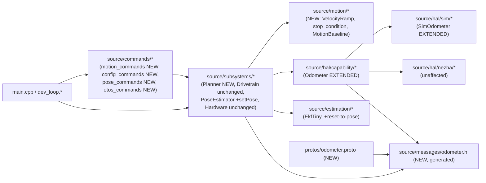
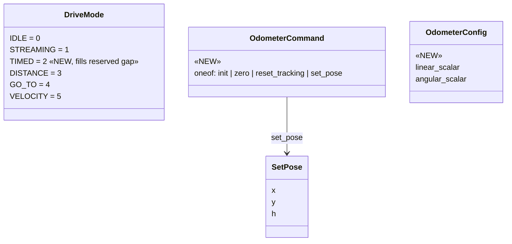

<!-- CLASI: Before changing code or making plans, review the SE process in CLAUDE.md -->

# Architecture Update -- Sprint 084: Firmware motion verbs and config/pose-set surface

Source documents: `clasi/issues/firmware-closed-loop-motion-verbs.md`,
`clasi/issues/firmware-config-and-pose-set-surface.md`, `docs/protocol-v2.md`,
and direct reads of `source_old/{superstructure,control,commands,robot}/*`,
`source/messages/planner.h`, `source/subsystems/{drivetrain,pose_estimator,
hardware}.*`, `source/commands/{dev_commands,telemetry_commands}.h`, and
`source/main.cpp`.

## Grounding in the current tree -- read this first

Five facts, discovered by direct read during this planning pass, materially
shape this document and are not obvious from the sprint brief alone.

**1. The motion-executor message schema already exists, unused.**
`source/messages/planner.h` (generated from `protos/planner.proto`, already
present in the new tree) already defines `msg::PlannerCommand` (oneof:
velocity/goto_goal/turn/distance/timed/rotation/stream/stop),
`msg::PlannerState` (mode/target_x/y/target_speed/distance_target/deadline/
body_twist/active), `msg::PlannerConfig` (a_max/a_decel/v_body_max/
yaw_rate_max/yaw_acc_max/j_max/yaw_jerk_max/arrive_tol/turn_in_place_gate/
min_speed), and `msg::StopCondition` (kind/a/b/ax/ay/sensor/cmp, with kinds
`STOP_TIME/STOP_DISTANCE/STOP_HEADING/STOP_POSITION/STOP_SENSOR/STOP_COLOR/
STOP_LINE_ANY/STOP_ROTATION`) -- sized almost exactly to what
`source_old/superstructure/Planner.h` and `source_old/control/StopCondition.h`
need. **No proto/message change is needed for the motion-executor half of
this sprint.** This is the same pattern sprint 082's architecture update
found for the pose/EKF fields -- the schema was prepared ahead of its
consumer.

**2. `msg::DriveMode`'s enum values skip `2`.** `IDLE=0, STREAMING=1,
DISTANCE=3, GO_TO=4, VELOCITY=5` -- value `2` is conspicuously reserved
exactly where `TIMED` belongs. This sprint fills that gap (Decision 6)
rather than inventing a new value out of sequence.

**3. `msg::DrivetrainConfig` already carries nearly the entire config-registry
surface.** `travel_calib_l/r`, `travel_calib_wheel_[4]`, `fwd_sign_wheel_[4]`,
`trackwidth`, `vel_gains` (`Gains{kp,ki,kff,i_max,kaw}`), `sync_gain`,
`rotational_slip`, `ekf_q_xy`, `ekf_q_theta`, `ekf_r_otos_xy`,
`ekf_r_otos_theta`, `ekf_q_v`, `ekf_q_omega`, `ekf_r_otos_v`, `ekf_r_enc_v`,
`left_port`/`right_port` are all present and already read by
`Drivetrain::configure()`/`PoseEstimator::configure()` (082). The
config-registry half of this sprint is a wire-parsing and re-propagation
problem, not a schema problem. It also confirms 082's own deferred item
("SET/GET wiring... is sprint 083's scope" -- 082 assumed the wrong sprint
number; this sprint is that deferred work).

**4. `msg::DrivetrainCommand` already has a `POSE`/`SetPose{x,y,h}` oneof
arm -- currently a documented no-op.** `Drivetrain::apply()`'s `POSE` case
reads: "this differential dev-bench Drivetrain has no odometry/EKF to
re-anchor... those return in later tickets." This sprint is that later
ticket for `SI`, but per 082's Decision 1 (pose estimation is a
`PoseEstimator` responsibility, never `Drivetrain`'s, even though the
message schema co-locates fields), `SI` is wired directly to a new
`PoseEstimator::setPose()`, **not** through `Drivetrain::apply()`'s `POSE`
arm, which stays a documented no-op permanently (Decision 1 below). This is
confirmed by reading `source_old/commands/SystemCommands.cpp`'s `handleSI`
and `host/robot_radio/testgui/operations.py`: the wire shape is
`SI <x> <y> <h>` (mm, mm, centi-degrees) -- undocumented in
`docs/protocol-v2.md` today (a real doc gap this sprint closes).

**5. `docs/protocol-v2.md` already fully specifies `SET`/`GET`, `ZERO`, and
all seven OTOS verbs (`OI/OZ/OR/OP/OV/OL/OA`) -- but is silent on `R`,
`TURN`, and `RT`.** Grepping every `## `/`### ` heading in the doc confirms
`S`/`T`/`D`/`G`/`VW`/`STOP` are documented (§10) and `SET`/`GET`/`ZERO`/OTOS
are documented (§7, §11), but no `### R`, `### TURN`, or `### RT` section
exists anywhere. Their wire shape is derived from
`source_old/commands/MotionCommands.cpp` (`parseR`/`handleR`/`parseTURN`/
`handleTURN`/`handleRT`) since the spec itself is incomplete here -- ticket
003 both implements and documents these three verbs.

A sixth, corrective fact: `source_old`'s per-wheel velocity PID
(`MotorController`/`VelocityController`) is **not** ported by this sprint --
it was already superseded in sprint 081 (ticket 001, extracting
`Hal::MotorVelocityPid` into `NezhaMotor`/`SimMotor`). The motion executor
this sprint builds sits **above** `Drivetrain` and hands it a body twist or
wheel targets exactly the way `DEV DT VW`/`WHEELS` already do; it never
touches a motor's PID gains directly. Likewise, `source_old/superstructure/
Superstructure.h`'s thin `requestGoal(GoalRequest)` dispatch layer and
`source_old/commands/CommandQueue.h`'s VW-push conversion (`R`/`TURN`/`RT`
enqueue a synthetic `VW` in the old tree) are **not** ported: `CommandQueue`
was deleted in sprint 079, and `Superstructure`'s only job -- translating a
switch on a goal enum into a `Planner::beginX()` call -- is now just "the
command handler constructs a `msg::PlannerCommand` and stages it," since the
oneof already exists. Porting either would be reintroducing scaffolding this
tree's own history deliberately removed.

## Step 1: Understand the Problem

The new `source/` tree (eight sprints deep: 077-083) has `Subsystems::
Drivetrain` (a ratio-governed two-wheel body-twist/wheel-target executor)
and `Subsystems::PoseEstimator` (encoder dead-reckoning + OTOS/EkfTiny
fusion), but nothing above them that closes a goal: no bounded drive
(`D`/`T`), no arc/turn (`R`/`TURN`/`RT`), no go-to (`G`), and no way to
tune the robot's live calibration or re-anchor its pose over the wire
(`SET`/`GET`/`SI`/`ZERO enc`/OTOS verbs) short of a reflash or the
dev-only `DEV M`/`DEV DT CFG` surface. TestGUI's tours, command rows, and
Operations panel (sprint 085) need this surface to exist first. This
sprint restores it, porting the *design* (goal-closure state machine,
stop-condition evaluation, config-registry mapping) from `source_old` while
deliberately not porting the parts of that design the greenfield rebuild
already superseded (wheel-level PID, the command-queue/Superstructure
indirection).

**What does not change:** `Subsystems::Drivetrain`'s ratio governor,
kinematics, and command-plane discipline; `Subsystems::PoseEstimator`'s EKF
(no new fusion channel); `Hal::Motor`'s embedded PID; the `DEV` family;
the wire verbs/keys already shipped in `source/` (`PING`/`VER`/`HELP`/
`ECHO`/`ID`/`STREAM`/`SNAP`/`DEV *`) and already-documented-but-unimplemented
verbs this sprint DOES implement (`SET`/`GET`/`ZERO`/OTOS) keep their
existing `docs/protocol-v2.md` wire shape byte-for-byte.

## Step 2: Identify Responsibilities

| Responsibility | Owning surface | Why it changes independently |
|---|---|---|
| Ramp a commanded body twist toward a target under acceleration/jerk limits, no device I/O | `Motion::VelocityRamp` (new, `source/motion/velocity_ramp.{h,cpp}`) | Pure profiler math -- changes only if the ramp law itself changes (trapezoid vs. S-curve), never for goal-sequencing reasons. |
| Evaluate one stop condition against a motion baseline and current observations, no device I/O | `Motion::evaluateStopCondition` (new, `source/motion/stop_condition.{h,cpp}`) + `Motion::MotionBaseline` (new, `source/motion/motion_baseline.h`) | Pure predicate math -- changes only if a stop-condition kind's own math changes, never for wiring reasons. Ported from `source_old/control/StopCondition.*`. |
| Own the active goal (S/T/D/R/TURN/RT/G), advance it one tick, decide when it completes, and produce a body-twist command | `Subsystems::Planner` (new, `source/subsystems/planner.{h,cpp}`) | Goal-closure sequencing -- changes for different reasons than the ramp math or the stop-predicate math (e.g. adding a new goal kind, changing pre-rotate/pursue phasing). Never touches a motor or the I2C bus. |
| Parse `S`/`T`/`D`/`R`/`TURN`/`RT`/`G`/`STOP` and `stop=` clauses off the wire; stage a `msg::PlannerCommand` | `source/commands/motion_commands.{h,cpp}` (new) | Wire syntax/grammar -- changes independently of goal-closure logic itself (082/077 precedent: command-table files never contain control-law code). |
| Extend `TLM`'s `mode=` to the full verb-family vocabulary | `source/commands/telemetry_commands.cpp` (extended) + `docs/protocol-v2.md` | Wire-observability mapping -- a distinct decision (Decision 6) from what each verb *does*, made once all verb shapes are known. |
| Parse/apply the top-level `SET`/`GET` key table against `Drivetrain`/`Motor`/`Planner` config | `source/commands/config_commands.{h,cpp}` (new) | Wire-to-config-field mapping -- changes independently of the control laws it tunes (same reasoning `ConfigRegistry.cpp` used in `source_old`, minus its `offsetof`-on-one-monolithic-struct mechanism, which has no equivalent in the new per-component message tree -- see Decision 2). |
| Re-anchor believed pose (`SI`) and rezero encoders + the dead-reckoning accumulator together (`ZERO enc`) | `source/commands/pose_commands.{h,cpp}` (new) + `PoseEstimator::setPose()` (new method) | Pose-authority mutation -- a distinct responsibility from ongoing pose *estimation* (082 Decision 1's same cohesion argument, one level up). |
| Own OTOS init/zero/reset/read/calibrate, uniformly over whichever `Hal::Odometer` the active hardware owner has (if any) | `source/commands/otos_commands.{h,cpp}` (new) + `Hal::Odometer` (extended) + `protos/odometer.proto` (new) | The odometer's own command/config surface -- changes only if the odometer's tunable surface changes, independent of pose estimation (which only ever *reads* `pose()`) and independent of the motion executor. |

No responsibility spans more than one ticket's file set except the shared,
intentional fan-in every command-family ticket has on `Subsystems::Planner`/
`Drivetrain`/`PoseEstimator` -- the same kind of fan-in 081's and 082's own
architecture updates treat as normal (a stable, narrow consumer surface),
not a coupling smell.

## Step 3: Subsystems and Modules

| Module | Purpose (one sentence) | Boundary | Use cases served |
|---|---|---|---|
| `Motion::VelocityRamp` | Ramps a live body twist toward a commanded target under configurable acceleration/jerk limits. | Inside: trapezoid/S-curve step math, live limit reads. Outside: kinematics, saturation, motor output (all `Drivetrain`'s job now -- see Decision 3). | SUC-001, SUC-002, SUC-003 |
| `Motion::evaluateStopCondition` / `Motion::MotionBaseline` | Tests whether one stop condition has fired, given a baseline and current observations. | Inside: the per-kind predicate math for `TIME/DISTANCE/HEADING/POSITION/ROTATION` (Decision 4 scopes out `SENSOR/COLOR/LINE_ANY` -- no sensor leaves exist yet). Outside: which conditions are active, teardown sequencing (Planner's job). | SUC-001, SUC-002, SUC-003 |
| `Subsystems::Planner` | Closes a driving goal by advancing a ramped body twist and evaluating its stop conditions once per tick. | Inside: the goal state machine (S/T/D/R/TURN/RT/G), owned `VelocityRamp`, the active command's stop-condition array, held `msg::DrivetrainCommand` output, held EVT-emission descriptor. Outside: wire parsing (commands/), kinematics/governor/motor I/O (`Drivetrain`/`Hal::Motor`), pose estimation (`PoseEstimator`, read via tick() argument only). | SUC-001, SUC-002, SUC-003, SUC-004 |
| `source/commands/motion_commands.*` | Parses the motion verb family and `stop=` clauses off the wire and stages a `msg::PlannerCommand`. | Inside: verb/clause grammar, `MotionLoopState` outbox. Outside: goal-closure semantics (`Planner`). | SUC-001, SUC-002, SUC-003 |
| `source/commands/config_commands.*` | Parses the top-level `SET`/`GET` key table and re-propagates validated deltas into the config-plane. | Inside: key table, atomic-validate-then-apply, its own config shadow. Outside: what each field *does* once configured (`Drivetrain`/`Motor`/`Planner`/`PoseEstimator`). | SUC-005 |
| `source/commands/pose_commands.*` | Owns `SI` and `ZERO enc`. | Inside: verb parsing, calling `PoseEstimator::setPose()` and the bound pair's encoder reset. Outside: the estimator's own tick-by-tick math. | SUC-006 |
| `source/commands/otos_commands.*` | Owns the seven OTOS verbs, uniformly over whichever `Hal::Odometer` (if any) the active hardware owner has. | Inside: verb parsing, capability/nodev gating. Outside: the odometer leaf's own implementation. | SUC-007 |
| `Hal::Odometer` (extended) + `protos/odometer.proto` (new) | Exposes an odometer's command/config surface (init/zero/reset-tracking/set-pose/linear-scalar/angular-scalar) uniformly, the same faceplate discipline `Hal::Motor` already has. | Inside: the faceplate's `apply()`/`configure()` contract. Outside: `Hal::SimOdometer`'s own accumulator math; any future real-hardware leaf. | SUC-007 |

Every module addresses at least one SUC (right column); every SUC
(`usecases.md`) is covered by at least one ticket. No module's one-sentence
purpose needs "and." No cycles -- see the dependency graph below.

## Step 4: Diagrams

### Component / module diagram

```mermaid
graph TD
    subgraph Wire["source/commands/ (API tier)"]
        MC["motion_commands.*\nS T D R TURN RT G STOP + stop="]
        CC["config_commands.*\nSET / GET"]
        PC["pose_commands.*\nSI / ZERO enc"]
        OC["otos_commands.*\nOI OZ OR OP OV OL OA"]
    end

    subgraph Domain["source/subsystems/ (domain tier)"]
        PLAN["Subsystems::Planner (NEW)\napply/tick/state/configure\nheld DrivetrainCommand + held EVT"]
        DT["Subsystems::Drivetrain\n(unchanged: ratio governor, kinematics)"]
        PE["Subsystems::PoseEstimator\n(+ setPose(), NEW)"]
        HW["Subsystems::Hardware\n(odometer() seam, 082)"]
    end

    subgraph PureMath["source/motion/ (NEW, pure math)"]
        RAMP["Motion::VelocityRamp"]
        STOP["Motion::evaluateStopCondition\n+ Motion::MotionBaseline"]
    end

    subgraph Infra["source/hal/ (infra)"]
        ODO["Hal::Odometer (extended)\napply(OdometerCommand)/configure(OdometerConfig)"]
        SIMODO["Hal::SimOdometer (implements)"]
        NEZHA["Subsystems::NezhaHardware\n(odometer() still nullptr)"]
    end

    MAIN["main.cpp / devLoopTick\n(composition root, EXTENDED)"]

    MC -->|stage: msg::PlannerCommand| PLAN
    CC -->|configure deltas| DT
    CC -->|configure deltas| PE
    CC -->|configure deltas| PLAN
    CC -->|configure delta, per motor| HW
    PC -->|setPose| PE
    PC -->|reset encoders| HW
    OC -->|apply/configure, via odometer()| HW
    HW --> ODO
    HW --> NEZHA
    ODO --> SIMODO

    PLAN --> RAMP
    PLAN --> STOP
    MAIN -->|drain: takeCommand -> drivetrain.apply| DT
    MAIN -->|drain: takeEvent -> replyFn| MAIN
    MAIN -->|tick now, leftObs, rightObs, fusedPose| PLAN
    MAIN -->|reads fusedPose\(\)| PE
    PLAN -.->|msg::DrivetrainCommand\(TWIST\), held| DT
```

`HW --> ODO` / `HW --> NEZHA` are "implements," matching 082's diagram
convention. `Drivetrain` is otherwise unaffected by this sprint (no method
signature changes) -- `Planner` is a new *caller* of `Drivetrain::apply()`,
exactly the way `DEV DT` is today; the two calls are peers into the same
entry point, not a new coupling.

### Dependency graph (directory level)



No cycles. Unchanged direction from 077-083
(`commands -> subsystems -> hal/estimation/motion -> messages`,
domain-inward). `source/motion/*` is a new leaf directory at the same tier
as `source/kinematics/*` and `source/estimation/*` (pure math, no `Hal`/
device ownership) -- consistent with, not a departure from, that
established pattern.

### Message schema (data model changed this sprint)



`protos/planner.proto`'s `PlannerCommand`/`PlannerState`/`PlannerConfig`/
`StopCondition` are **unchanged** (Grounding fact 1) except `DriveMode`
gaining `TIMED = 2` (Grounding fact 2/Decision 6). `protos/drivetrain.proto`
is **unchanged** (Grounding fact 3 -- every field this sprint reads/writes
already exists). `protos/odometer.proto` is the only genuinely new proto
file, and only because `hal/capability/odometer.h`'s own file header
explicitly invited it ("a later ticket that adds... tunable parameters
should add a dedicated proto at that point" -- Decision 5).

## Step 5: What Changed / Why / Impact / Migration

### What Changed, by area

**Motion executor (issue: `firmware-closed-loop-motion-verbs.md`).**
New `Motion::VelocityRamp`/`Motion::evaluateStopCondition`/
`Motion::MotionBaseline` (ported math, `source_old/control/
BodyVelocityController.*` and `source_old/control/StopCondition.*`, minus
kinematics/saturation/motor-output, which stay in `Drivetrain`). New
`Subsystems::Planner` (ported goal-closure sequencing, `source_old/
superstructure/Planner.*` + `source_old/commands/MotionCommand.*`, minus
`BodyVelocityController`'s old motor-facing half and the `Superstructure`/
`CommandQueue` indirection -- Grounding). New `source/commands/
motion_commands.*` registers `S`/`T`/`D`/`R`/`TURN`/`RT`/`G`/`STOP` as
top-level verbs (matching 082's own `STREAM`/`SNAP` top-level precedent),
staging a `msg::PlannerCommand` into a new `MotionLoopState` outbox --
**not** `DevLoopState` (Decision 7). `protos/planner.proto`'s `DriveMode`
gains `TIMED = 2`. `source/commands/telemetry_commands.cpp`'s `mode=`
derivation is extended (Decision 6).

**Config registry (issue: `firmware-config-and-pose-set-surface.md`).**
New `source/commands/config_commands.*` registers top-level `SET`/`GET`,
mapping a deliberately-scoped **subset** of `docs/protocol-v2.md` §7's key
table onto real fields already in `msg::DrivetrainConfig`/`msg::MotorConfig`/
`msg::PlannerConfig` (Decision 2's full key-by-key table). Own config
shadow, **not** `DevLoopState`'s (Decision 7).

**Pose-set (same issue).** `Subsystems::PoseEstimator` gains
`setPose(const msg::SetPose&)`, re-anchoring both `encoderPose()` and
`fusedPose()` (requires a small additive `Hal::EkfTiny` re-anchor method --
see Decision 1's Consequences). New `source/commands/pose_commands.*`
registers `SI` (undocumented until this sprint -- Grounding fact 4/5) and
extends the *already-documented* `ZERO enc` to also reset `PoseEstimator`'s
encoder-baseline accumulator (`docs/protocol-v2.md`'s existing `ZERO`
section is extended, not replaced).

**OTOS command surface (same issue).** New `protos/odometer.proto`
(`OdometerCommand`/`OdometerConfig`, Decision 5); `Hal::Odometer` gains
`apply()`/`configure()`; `Hal::SimOdometer` implements them against its own
accumulator/scalar fields; new `source/commands/otos_commands.*` registers
the seven *already-documented* OTOS verbs, resolving them via
`hardware.odometer()` (nullptr on `Subsystems::NezhaHardware` -> `ERR
nodev`, per the seam 082 already built).

**Verification.** New sim tests under `tests/sim/` (per-verb geometry,
`stop=` clause firing, `mode=` mapping, `SET`/`GET` round-trip, `SI`/`ZERO
enc`, OTOS ack-vs-nodev) plus a hardware bench gate session per
`.claude/rules/hardware-bench-testing.md`.

### Why

See Grounding for the schema-already-exists findings that keep this a
proto-light sprint, and Decisions 1-7 below for the scope reductions and
placement calls that keep the ticket count and risk bounded.

### Impact on Existing Components

| Component | Impact |
|---|---|
| `source/subsystems/drivetrain.{h,cpp}` | **Unaffected.** `Planner` calls `Drivetrain::apply()` exactly the way `DEV DT`'s handlers do today -- a new *caller*, not a new dependency edge or signature change. `POSE`'s no-op stays exactly as documented (Decision 1). |
| `source/subsystems/pose_estimator.{h,cpp}` | **Modified.** New `setPose(const msg::SetPose&)` method; `tick()`'s existing signature/behavior unchanged. |
| `source/estimation/ekf_tiny.{h,cpp}` | **Modified.** New small re-anchor-to-pose method (distinct from `init()`, which zeroes -- `setPose()` needs a caller-supplied pose, not always zero). |
| `source/subsystems/hardware.h`, `nezha_hardware.*`, `sim_hardware.*` | **Unaffected.** `odometer()` seam (082) is reused as-is; `NezhaHardware` still returns `nullptr`. |
| `source/hal/capability/odometer.h` | **Modified.** Gains `apply(const msg::OdometerCommand&)`/`configure(const msg::OdometerConfig&)`, filling the gap its own "Gap note" (082) flagged. |
| `source/hal/sim/sim_odometer.{h,cpp}` | **Modified.** Implements the two new methods against a new pair of scalar-calibration fields (linear/angular), kept independent of its existing error-injection knobs (Decision 5's Consequences). |
| `source/commands/dev_commands.*`, `DevLoopState` | **Unaffected.** New command families get their own state structs (Decision 7) -- no field added here. |
| `source/commands/telemetry_commands.cpp` | **Modified.** `mode=` derivation extended from `drivetrain.active() ? 'S' : 'I'` to read `Planner::state().mode` (Decision 6). |
| `source/dev_loop.{h,cpp}` | **Modified.** `DevLoop` gains a `Subsystems::Planner*` field; `devLoopTick()` gains one step: feed `fusedPose()` + `leftObs`/`rightObs` into `planner.tick()`, then drain `hasCommand()`/`takeCommand()` into `drivetrain.apply()` and `hasEvent()`/`takeEvent()` into the captured reply sink -- both additive, ordered after the existing pose-estimation step. |
| `source/main.cpp` | **Modified.** Constructs/configures `Planner` and the four new command-family state structs; concatenates their command tables. Gated behind `ROBOT_DEV_BUILD` for the mechanical reason that it is the only branch with a HAL today -- **not** because these are DEV-family verbs (see Migration Concerns). |
| `docs/protocol-v2.md` | **Extended.** New `### R`, `### TURN`, `### RT`, `### SI` sections (previously absent -- Grounding fact 5); `### ZERO`'s existing text gains one sentence (PoseEstimator accumulator); §7's key table is annotated with this sprint's implemented subset (Decision 2) and the rest marked superseded/deferred; §8's `mode=` table gains `T` (Decision 6). |
| `protos/planner.proto` | **Modified.** `DriveMode` gains `TIMED = 2` (Decision 6). No other field changes (Grounding fact 1). |
| `protos/drivetrain.proto` | **Unaffected --- read, not written to the schema** (Grounding fact 3). |
| `protos/odometer.proto` | **New** (Decision 5). |

### Migration Concerns

- **No persisted-data migration.** All new/changed fields are in-memory
  wire messages regenerated by `scripts/gen_messages.py` on every build;
  nothing is persisted across boots except boot-config JSON, which this
  sprint does not touch (its `ekf_*`/`rotational_slip`/calibration fields
  already exist there or fall back to sane sentinel defaults per 082
  Decision 4 -- unaffected).
- **New command families compile under the same `ROBOT_DEV_BUILD` flag as
  `DEV`/telemetry today, for a mechanical reason, not an architectural
  one.** `main.cpp`'s `#else` branch (no HAL at all) is the only
  alternative today, and sprint 077-083 never built a second, non-dev
  production loop. `motion_commands.*`/`config_commands.*`/
  `pose_commands.*`/`otos_commands.*` are genuine protocol-v2 production
  verbs -- unlike `DEV M`/`DEV DT`, they must **not** be dropped the day a
  real non-dev production build exists. This sprint keeps them physically
  alongside `DEV`/telemetry in `main.cpp`'s `#if ROBOT_DEV_BUILD` block
  (there is nowhere else to put working code today) but gives each its own
  independent state struct (Decision 7) precisely so a future
  production-build split does not have to untangle them from `DevLoopState`.
- **Sequencing.** Motion-executor tickets (001-004) before mode-machine
  (005) before config-registry (006) before pose-set (007) before OTOS
  (008) before verification (009) -- see "Ticket sequencing" in the
  create-tickets output. Motion is sequenced first because it is the
  larger, more foundational half and because mode-machine (005) needs every
  verb family's shape settled before committing to a mode-char mapping
  (Decision 6). Config/pose-set/OTOS (006-008) do not block on motion in
  principle (their only technical dependency is `Subsystems::Planner`
  existing for `PlannerConfig` routing, i.e. ticket 001) but are sequenced
  after it in this single sprint per the brief's own suggested order.
- **Deployment sequencing.** No ticket leaves the tree non-building at its
  own boundary. The hardware bench gate (ticket 009) is the sprint's
  acceptance backstop, per `.claude/rules/hardware-bench-testing.md`.
- **Wire compatibility.** Every verb this sprint lands is either brand new
  (`R`/`TURN`/`RT`/`SI`) or was previously *documented but unimplemented*
  in `source/` (`SET`/`GET`/`ZERO`/OTOS) -- there is no existing `source/`
  wire behavior to break.

## Sizing / structure -- addressed per the sprint brief's request

The brief asked for an explicit recommendation on whether to split. **This
document keeps sprint 084 as one sprint**, with nine dependency-ordered
tickets (see the ticket list). Rationale: (a) the two issues share the same
firmware surface and both feed `Drivetrain`/`PoseEstimator`, so a split
would duplicate review overhead for tightly-coupled work; (b) a
config-surface-only sprint would sit awkwardly between 084 and the
already-planned 085 (host TestGUI full revival), which needs *both* halves
before it can wire tours, GOTO, and calibration push; (c) per-ticket sizing
(nine tickets, each a bounded, single-responsibility unit -- see Step 3's
module table) already provides the safety valve a split would otherwise
provide, without the coordination cost of a second sprint-planning/
architecture-review cycle. If a future review finds the motion half alone
(tickets 001-005) is straining a single execution pass, the natural split
point is **after ticket 005** (mode-machine) -- tickets 001-005 form a
complete, independently-shippable motion-verb surface; 006-008 (config/
pose-set/OTOS) form a complete, independently-shippable config surface;
009 would need to split into two bench-gate passes. This split point is
recorded here in case the team-lead's own review disagrees with "keep as
one," but this document's recommendation is **no split**.

## Step 6: Design Rationale

### Decision 1: `SI` bypasses `Drivetrain::apply()`'s `POSE` arm entirely; it stays a documented no-op forever

**Context.** `msg::DrivetrainCommand`'s `POSE`/`SetPose` oneof arm already
exists and `source_old`'s `handleSI` used a `drive.apply(SetPose)` path
alongside a legacy-estimate path. Read literally, this looks like an
invitation to route `SI` through `Drivetrain::apply()`.

**Alternatives considered:** (a) route `SI` through `Drivetrain::apply()`'s
`POSE` arm, having `Drivetrain` forward the pose to `PoseEstimator` somehow;
(b) bypass `Drivetrain` entirely -- the new `pose_commands.*` handler calls
`PoseEstimator::setPose()` directly, and `Drivetrain::apply()`'s `POSE` case
stays exactly the documented no-op it is today.

**Why this choice.** (b). `Drivetrain` holds no `PoseEstimator` reference
(082 Decision 1: pose estimation is a sibling, not an extension, of
`Drivetrain` -- the schema co-locating fields on adjacent messages is a
data-model convenience, not a mandate that one class own both). Threading
`SI` through `Drivetrain::apply()` would force `Drivetrain` to either gain a
`PoseEstimator` reference (breaking its "no cross-subsystem reference,
arguments only" discipline, established since 077) or silently do nothing
useful with the `POSE` arm forever while a *different* path also existed --
two paths to the same effect, which is exactly the kind of duplicated-
decision risk 078's Design Rationale 6 already named for a different case.
`source_old`'s own dual-path `SI` (legacy `Robot::estimate` + new-arch
`drive.apply(SetPose)`) is a *historical* artifact of two pose-owning
systems coexisting during that codebase's own migration -- the new tree has
exactly one pose owner, so it needs exactly one path.

**Consequences.** `msg::DrivetrainCommand::POSE`/`SetPose` remain in the
schema, permanently unread by `Drivetrain` -- a documented, intentional
dead arm (like `DrivetrainConfig`'s deprecated `vel_gains`/`min_wheel`
fields from sprint 077), not a bug. `PoseEstimator::setPose()` needs a small
additive `Hal::EkfTiny` method (re-anchor state/covariance to a supplied
pose, distinct from `init()`'s always-zero reset) -- a minor, additive
change to an already-small pure-math class.

### Decision 2: the top-level `SET`/`GET` key table is a deliberately-scoped subset, not a verbatim port of `source_old/robot/ConfigRegistry.cpp`

**Context.** `ConfigRegistry.cpp`'s mechanism (`offsetof(RobotConfig, field)`
against one monolithic `RobotConfig` struct) has no equivalent in the new
tree, which has no monolithic config struct -- calibration lives distributed
across `msg::MotorConfig` (per motor), `msg::DrivetrainConfig` (shared), and
`msg::PlannerConfig` (motion limits), each already reachable via its own
`configure()`. Several of `docs/protocol-v2.md` §7's 22 keys have no live
field to map onto in this shape; others were superseded by mechanisms the
greenfield rebuild already shipped.

**Alternatives considered:** (a) invent new fields/mechanisms so every one
of the 22 old keys has a home; (b) port only the keys the issue itself names
("trackwidth, wheel calibration, PID, slip, EKF noise") plus the couple of
cheap, clearly-real-field keys the old table also had (`minSpeed` ->
`PlannerConfig.min_speed`) and a new production streaming-watchdog window
(`sTimeout`, a plain duration, no message field needed -- mirrors how `DEV
WD` already reads/writes `SerialSilenceWatchdog` directly); explicitly drop
the rest with a one-line rationale each.

**Why this choice.** (b). Key-by-key disposition:

| Key(s) | Disposition | New-tree target |
|---|---|---|
| `tw` | Kept | `DrivetrainConfig.trackwidth` |
| `ml` / `mr` | Kept | bound-pair motors' `MotorConfig.travel_calib` (via `hardware.motor(port)`, same field `DEV M <n> CFG travel_calib=` already writes -- `SET` is a convenience alias for the currently-bound pair, not a new storage location) |
| `pid.kp` / `pid.ki` / `pid.kff` / `pid.iMax` / `pid.kaw` | Kept, reshaped | applied identically to both bound motors' `MotorConfig.vel_gains` (the `Gains{kp,ki,kff,i_max,kaw}` shape, superseding the old flat `pid.kp/ki/kd/max` + standalone `kff`; there is no `kd`/`max` in the new `Gains` message -- `i_max` is the clamp) |
| `rotSlip` | Kept | `DrivetrainConfig.rotational_slip` |
| `ekfQxy` / `ekfQtheta` / `ekfROtosXy` / `ekfROtosTheta` | Kept | `DrivetrainConfig`'s matching `ekf_*` fields (closes 082 Decision 4's deferred item) |
| `minSpeed` | Kept | `PlannerConfig.min_speed` |
| `sTimeout` | Kept, new mechanism | new production streaming-drive watchdog window (plain field, not a message -- see ticket 002) |
| `kff` (standalone) | Dropped | folded into `pid.kff` above (one `Gains` struct now carries all velocity-loop gains together) |
| `klf`/`klb`/`krf`/`krb` | Dropped | superseded by `DrivetrainConfig.travel_calib_wheel_[4]`/`fwd_sign_wheel_[4]` (already-generated, more general per-wheel arrays) -- no equivalent asymmetric-direction-scale concept was carried into the new motor model |
| `adjThr` / `adjGain` | Dropped | superseded by `DrivetrainConfig.sync_gain` (the ratio governor, already `SET`-able via `DEV DT CFG`) -- a different, already-shipped mechanism for the same underlying problem |
| `distScale` / `turnScale` | Dropped | no equivalent fudge-factor is needed against the new tree's correctly-modeled kinematics (`BodyKinematics`) the way it was against the old ratio-PID scheme |
| `tick` | Dropped | the loop cadence is now structural (sprint 079's I2C flip-flop tick model), not a runtime knob |
| `tlmPeriod` | Dropped | already implemented as the `STREAM <ms>` verb itself (082) -- a redundant second spelling |

Any key not in this sprint's table is simply not registered, so it
correctly surfaces as `ERR badkey` -- the same wire behavior an operator
sees for any never-existed key, not a special "removed key" error class.

**Consequences.** `config_commands.cpp` owns its own read-modify-write
shadow state per config-plane precedent (`motorConfigShadow[]`/
`drivetrainConfigShadow` in `dev_commands.h`), but as an **independent**
struct (Decision 7) -- not `DevLoopState`'s. A future sprint that wants
`klf`/`adjThr`-class behavior back would need a fresh, explicit design
question, not a silent key re-add.

### Decision 3: `Motion::VelocityRamp` hands a ramped body twist directly to `Drivetrain::setTwist()`; it does not call kinematics, saturation, or a motor itself

**Context.** `source_old/control/BodyVelocityController.cpp`'s per-tick
order is: ramp -> `BodyKinematics::inverse()` -> `saturate()` ->
`MotorController::setTarget()`. `Drivetrain::tick()` already does
kinematics (via `commandedWheelTargets()`) and the ratio governor
(`governRatio()`) for its `TWIST` mode.

**Alternatives considered:** (a) port `BodyVelocityController` verbatim,
duplicating kinematics/saturation inside the new `Planner`/`VelocityRamp`
before handing raw wheel targets to `Drivetrain::setWheelTargets()`
(bypassing its kinematics); (b) `VelocityRamp` produces only a ramped
`(v, omega)`; `Planner` calls `Drivetrain::setTwist(v, omega)` and lets
`Drivetrain` do kinematics/saturation/governing exactly as it already does
for `DEV DT VW`.

**Why this choice.** (b). `Drivetrain`'s own class comment already states
its purpose as owning kinematics + the ratio governor; duplicating either
inside `Planner` would be exactly the shotgun-surgery risk of two
independently-maintained copies of "how do we turn a twist into wheel
targets" (a future track-width or governor-gain change would need updating
in two places). This also means `Planner` never needs `Hal::Motor`
capability information (no `vWheelMax`/`steerHeadroom` reads) -- one fewer
cross-cutting config surface for the goal-closure layer to know about.

**Consequences.** `Planner`'s ramp target is a *pre-governor* commanded
twist -- exactly the same semantic `Drivetrain::state()`'s `vel_[]` already
reports for `DEV DT`. Distance/rotation stop-condition evaluation still
needs *actual* travel, which it gets from `leftObs`/`rightObs` (measured
`msg::MotorState`), not from the commanded twist -- consistent with 082
Decision 7's "measured, not commanded" rule for `TLM`.

### Decision 4: `stop=` clause kinds are limited to `{t, d, heading, pos, rot}` this sprint; `{sensor, color, line}` are recognized-but-rejected

**Context.** `msg::StopCondition`'s `Kind` enum already carries `SENSOR`/
`COLOR`/`LINE_ANY` (inherited from `source_old`'s richer vocabulary,
Grounding fact 1), but the new `source/` tree has **no line or color sensor
Hal leaf** yet -- `hal/capability/line_sensor.h`/`color_sensor.h` are
declared-only (077's faceplate-header-without-implementation pattern, same
as `odometer.h` was before this sprint).

**Alternatives considered:** (a) implement all eight `StopCondition` kinds,
inventing a placeholder sensor reading; (b) implement only the kinds whose
underlying observation already exists (clock, encoders, fused pose) --
`t`/`d`/`heading`/`pos`/`rot` -- and have the wire parser reject
`stop=sensor:`/`stop=color:`/`stop=line:` clauses with `ERR badarg`
(indistinguishable from a malformed clause) until a future sprint lands the
corresponding Hal leaf.

**Why this choice.** (b), for the identical reason 082 Decision 2 trimmed
the ported EKF to a 3-state filter: inventing a sensor reading with nothing
behind it is speculative generality with no acceptance-bar backing (neither
issue's acceptance sketch mentions a `stop=sensor:` clause), and would leave
untestable code in the tree.

**Consequences.** `source_old`'s D-mode-specific `SAFETY_MARGIN` (runaway
safety net) and `ARRIVE` (stall-forced-completion) refinements -- both
`StopCondition::Kind` values *not* present in `msg::StopCondition`'s wire
schema at all (they are internal-only bookkeeping in `source_old`, never a
`stop=` clause) -- are also out of scope this sprint, flagged as Open
Question 1, not silently dropped.

### Decision 5: `protos/odometer.proto` is new; OTOS command/config surface follows the same faceplate discipline as `Hal::Motor`, not ad hoc virtual methods

**Context.** `hal/capability/odometer.h`'s own file header (081) explicitly
flagged the gap: "a later ticket that adds a concrete odometer leaf... and
finds it needs tunable parameters should add a dedicated proto at that
point rather than retrofitting one now." This sprint is that later ticket.

**Alternatives considered:** (a) add plain, non-message virtual methods
(`init()`, `zero()`, `setPose(x,y,h)`, `setLinearScalar(int8_t)`, ...)
directly to `Hal::Odometer`, matching none of the project's established
3-message/4-verb faceplate pattern; (b) add `protos/odometer.proto`
(`OdometerCommand{oneof: init | zero | reset_tracking | set_pose}`,
`OdometerConfig{linear_scalar, angular_scalar}`), giving `Hal::Odometer` a
real `apply()`/`configure()` pair the same shape `Hal::Motor` already has.

**Why this choice.** (b). The project's whole hardware tier (077-081) is
built on "every component follows apply()/tick()/state()/configure()/
capabilities()" -- introducing one faceplate with a bespoke, non-message
API would be the first inconsistency of that pattern at the Hal tier, and
the file header explicitly invited closing the gap correctly rather than
with a quick ad hoc extension.

**Consequences.** `Hal::SimOdometer` implements `apply()`/`configure()`
against two **new** fields (`linearScalar_`/`angularScalar_`), kept
independent of its existing error-injection knobs (`linearNoiseSigma_` etc.
-- 081's own "two error models never share state" acceptance criterion,
extended to "the real-calibration surface and the error-injection surface
never share state" either). `OL`/`OA`'s sim implementation is intentionally
a **store-and-echo, no physical effect** this sprint (there is no scale
error being modeled that a calibration scalar would meaningfully correct
against, unlike a real chip's physical linear/angular scalar registers) --
mirroring sprint 083 Decision 4's precedent for `sim_prefs` fields with no
ctypes-backed physical effect: documented, not silently absent.

### Decision 6: `mode=` maps `T` to every self-terminating, non-`DISTANCE`/non-`GO_TO` `Planner` command (`T`, `R` with a `stop=`, `TURN`, `RT`); open-ended `R`/`S`/`VW` stay `S`

**Context.** `docs/protocol-v2.md` §8 documents only `I`/`S`/`T`/`D`/`G`;
the issue asks for "the full `I/S/T/D/G/...` set." `msg::DriveMode` (even
after adding `TIMED`) has only five values -- no dedicated `TURN`/`ROTATE`
value, mirroring `source_old`'s own Superstructure-level `Goal` enum, which
already collapsed `STREAM`/`TIMED`/`ARC` into one `Goal::VELOCITY` and gave
`TURN`/`ROTATE` no distinct wire-telemetry value either.

**Alternatives considered:** (a) add new `DriveMode` values for `TURN`/
`ROTATE` so every verb family gets its own mode character; (b) map every
self-terminating `VELOCITY`-shaped command (`T`, a `stop=`-bearing `R`,
`TURN`, `RT`) to the single `TIMED` value/`'T'` character, and every
open-ended one (`S`, `VW`, a bare `R`) to `STREAMING`/`'S'`, matching
`source_old`'s own internal collapse.

**Why this choice.** (b). Neither issue's acceptance sketch, nor TestGUI's
tour-completion logic (which only needs `mode=I` at idle, per the issue),
requires distinguishing `TURN` from a generic bounded drive on the wire.
Inventing wire vocabulary (a) with no present consumer is the same
speculative-generality trap Decision 4 already declined for `stop=` clause
kinds.

**Consequences.** Flagged as Open Question 2: a future sprint may want
`TURN`/`RT` to report their own mode characters if TestGUI's tour logic
ever needs to distinguish "turning" from "driving a timed straight" mid-
tour; this document deliberately does not invent that now.

### Decision 7: motion/config/pose-set/OTOS command families each own an independent state struct, not `DevLoopState`

**Context.** `DevLoopState` (`dev_commands.h`) is explicitly the `DEV`
family's shared outbox/shadow-config context, compiled only under
`ROBOT_DEV_BUILD` and conceptually scoped to bench diagnostics. This
sprint's four new command families are production protocol-v2 verbs.

**Alternatives considered:** (a) extend `DevLoopState` with the new
outbox/shadow fields, since it is the only existing shared-context struct
in the tree; (b) each new family gets its own small struct (`MotionLoopState`,
a `ConfigCommandState`, etc.), independently constructed in `main.cpp`
alongside `DevLoopState`/`TelemetryState`.

**Why this choice.** (b). `DevLoopState`'s name and every existing doc
comment on it describe it as the `DEV` family's context; folding unrelated,
non-dev, production-verb state into it would misrepresent the module
boundary the same way sprint 077's Decision 4 declined to stub
`source/robot/` before its ticket existed. It also directly serves the
Migration Concerns point above: a future non-dev production build can carry
these four structs forward without having to first extract them out of
`DevLoopState`.

**Consequences.** `main.cpp` grows four more function-static state structs
and four more command-table concatenations -- the same additive pattern it
already uses for `DevLoopState`/`TelemetryState`. `devLoopTick()`'s `DevLoop`
struct gains one new field (`Subsystems::Planner*`) since `Planner`'s
held-output drain is a per-pass step every caller needs, the same
justification `poseEstimator`/`telemetry` already have there; the other
three new families' state structs are **not** added to `DevLoop` (they have
no per-pass drain step -- `SET`/`GET`/`SI`/`ZERO`/OTOS are all synchronous,
config-plane, or one-shot, with nothing to hold across a tick boundary).

## Architecture Self-Review

- **Consistency.** The "What Changed, by area" narrative, the Impact table,
  and the seven Design Rationale decisions all name the same modules
  (`Motion::VelocityRamp`/`evaluateStopCondition`, `Subsystems::Planner`,
  the four new `commands/*` families, `Hal::Odometer` + `protos/
  odometer.proto`) with no contradictory description. The Grounding
  section's five facts are stated once, then consistently assumed
  everywhere later -- never re-litigated or silently reversed (matching
  082/083's own self-review discipline).
- **Codebase alignment.** Every claim about current code -- `messages/
  planner.h`'s existing oneof/enum shapes, `DriveMode`'s skipped `2`,
  `DrivetrainConfig`'s already-present EKF/calibration fields,
  `Drivetrain::apply()`'s documented `POSE` no-op, `docs/protocol-v2.md`'s
  actual section list (confirmed by grepping every heading), `source_old`'s
  `R`/`TURN`/`RT` handler bodies, `SI`'s wire shape from `SystemCommands.cpp`
  and TestGUI's `operations.py`, `CommandQueue`'s sprint-079 deletion, the
  velocity-PID's sprint-081 extraction into `NezhaMotor` -- was verified by
  direct file read during this planning pass, not assumed.
- **Design quality.** Cohesion: every module's one-sentence purpose in Step
  3 holds; Decision 1 and Decision 3 both explicitly defend keeping
  pose-ownership and kinematics-ownership where 082/077 already put them,
  rather than letting a co-located schema field pull logic into the wrong
  class. Coupling: no cycles in either diagram; the only new
  cross-directory edge (`subsystems -> motion`) is a data-only dependency on
  a new pure-math leaf tier, the same kind of edge `subsystems ->
  kinematics`/`subsystems -> estimation` already are. Boundaries:
  `Drivetrain`'s public surface is untouched; `Hal::Odometer`'s extension
  follows the existing faceplate contract exactly. Fan-out: `main.cpp`/
  `DevLoop` grows to include `Planner` (a composition root, already
  justified at this fan-out by 079's own self-review for the identical
  reason); no other module's fan-out changes.
- **Anti-pattern detection.** No god component (`Planner` does goal
  sequencing only; ramp math and stop-predicate math are split out into
  `Motion::*`, mirroring the `EkfTiny`/`PoseEstimator` split one tier
  below). No shotgun surgery (`Drivetrain`/`Hardware`/`NezhaHardware`
  require zero source changes; `PoseEstimator` gains one additive method).
  No feature envy (`Planner` takes `leftObs`/`rightObs`/`fusedPose` as
  `tick()` arguments, matching `Drivetrain`'s and `PoseEstimator`'s own
  no-stored-reference convention). No circular dependencies. No leaky
  abstraction (`Hal::Odometer`'s new methods name no Sim-specific concept).
  Speculative generality actively cut, not added: Decision 4 declines
  `stop=sensor:`/`color:`/`line:` support, Decision 5's `OL`/`OA` sim
  semantics are a documented no-effect echo rather than a fabricated
  calibration model, Decision 6 declines inventing new `mode=` characters
  with no present consumer.
- **Risks.** No data migration (Migration Concerns). The two correctness
  risks this document flags beyond the sprint brief's own list: (1)
  `Planner`-issued motion and `DEV DT` share `Drivetrain::apply()`'s single
  authority mechanism with no new arbitration -- flagged as Open Question 3,
  not resolved here, since bench-diagnostic `DEV DT` use during production
  motion is an unlikely/unsupported combination, not a normal operating
  mode; (2) the `sTimeout` production streaming watchdog is new,
  independent state (not `SerialSilenceWatchdog`) -- ticket 002 must not
  conflate the two, since they serve different purposes (statement-silence
  vs. streaming-drive-refresh-silence) at different timescales.

**Verdict: APPROVE.** No structural issues (no circular dependency, no god
component, no broken interface, no inconsistency between the "What Changed"
narrative and the document body). The two placement questions the message
schema's existing shape raised (`SI` via `Drivetrain::apply()`'s `POSE` arm;
whether OTOS needs a new proto) were both examined explicitly and resolved
with documented rationale (Decisions 1 and 5), not left implicit. Proceeding
to ticketing.

## Step 7: Open Questions

1. **`SAFETY_MARGIN`/`ARRIVE`-equivalent D-mode refinements (sprint-072-class
   runaway safety net and stall-forced-completion) are out of scope this
   sprint** (Decision 4's Consequences) -- neither issue's acceptance
   sketch requires them. Flag as a candidate follow-up issue once `D` has
   bench mileage on the new tree and a real stall/runaway case is observed
   (not before -- avoids porting untested-here mitigations speculatively).
2. **`TURN`/`RT` share `mode='T'` with plain timed drives this sprint**
   (Decision 6) -- revisit if TestGUI's tour logic (sprint 085) ever needs
   to distinguish "turning" from "driving straight for a bounded time"
   without inspecting which verb was last sent.
3. **No new authority arbitration between `Planner`-issued motion and
   `DEV DT`.** Both drive `Drivetrain` through the same `apply()`/`active()`
   mechanism; whichever last issued a command wins, identically to how
   `DEV M` vs. `DEV DT` already resolves today. Acceptable for a bench-only
   dev build where mixing production motion verbs with `DEV DT` in the same
   session is not an expected operating mode; revisit if it becomes one.
4. **`SI`'s effect on an in-flight `Planner` command is unspecified.**
   `source_old`'s `SI` did not itself cancel an active drive. This sprint
   preserves that: `SI` re-anchors pose only; a `G`/`TURN` in progress keeps
   pursuing its (now pose-shifted) target using the newly-anchored fused
   pose on its very next tick, which may produce a visible course
   correction rather than a smooth continuation. Not resolved here --
   ticket 007's acceptance criteria should note the observed behavior
   rather than silently assume continuity.
5. **`GRIP`/`P`/`PA` are unaffected by this sprint** (neither issue
   mentions them) -- confirmed out of scope, not overlooked.
