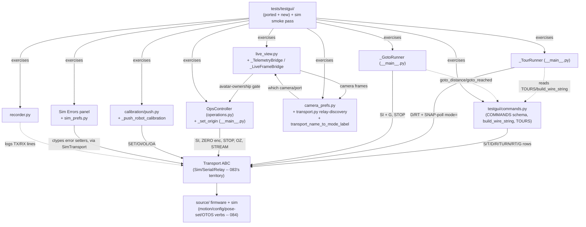
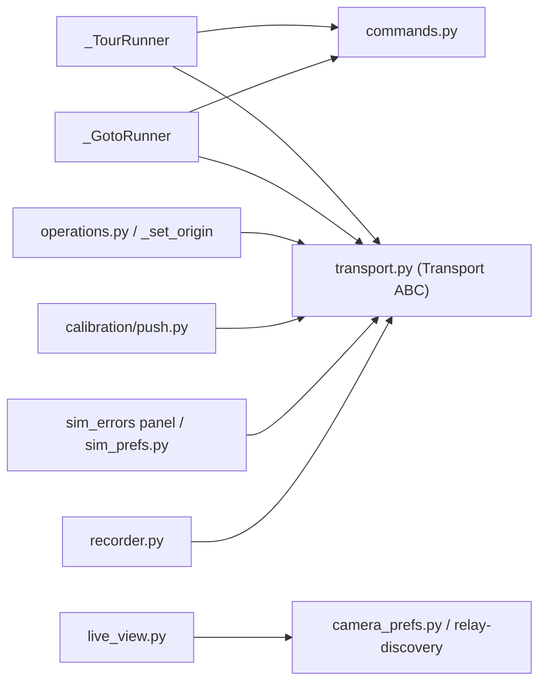

<!-- CLASI: Before changing code or making plans, review the SE process in CLAUDE.md -->

# Architecture Update -- Sprint 085: Host TestGUI full revival

Source documents: `clasi/issues/host-testgui-full-revival.md`,
`clasi/issues/plan-revive-testgui-against-the-new-tree-simulator.md` (the
three-phase program plan; this sprint is Phase 3), `docs/protocol-v2.md`
(§7 SET/GET, §10 Motion Commands, §11 OTOS), and direct reads of
`host/robot_radio/testgui/{__main__.py,operations.py,commands.py,live_view.py,
recorder.py,camera_prefs.py,transport.py}`, `host/robot_radio/calibration/push.py`,
`source/commands/{motion_commands.cpp,config_commands.cpp}`, and every file
under `tests_old/testgui/` and `tests/testgui/`.

## Grounding in the current tree -- read this first

Five facts, discovered by direct read during this planning pass, materially
shrink this sprint's real scope from what the issue's own wording suggests,
and are not obvious from the sprint brief alone.

**1. The host-side reconnection this sprint describes is, for most of its
scope items, already sitting in the tree -- not because a previous sprint did
this work, but because it was never actually broken.** `host/robot_radio/
testgui/__main__.py` (2306 lines), `operations.py`, and `host/robot_radio/
calibration/push.py` predate the greenfield rebuild (`git log` shows their
substantive content landing well before sprint 077, with only sprint 076's
identifier-rename sweep and sprint 083's two narrow fixes -- `SimTransport`'s
ctypes reconciliation and `KeyboardDriver`/`operations.py`'s `DEV DT
VW`/`STOP`/`PORTS` mapping -- touching them since). This old code was written
directly against `source_old`'s wire protocol, which used the **same** verb
shapes 084 just restored (`SI <x> <y> <h>`, `ZERO enc`, `OI`/`OZ`/`OL`/`OA`,
top-level `STOP`, `SET key=value`) -- confirmed by 084's own Grounding facts 4
and 5, which derived those wire shapes from `source_old/commands/
SystemCommands.cpp` and `MotionCommands.cpp` specifically so host callers
like this one would not need to change. Concretely, already present and
already correct, verified by direct read against `docs/protocol-v2.md` and
`source/commands/{motion_commands,config_commands,pose_commands,
otos_commands}.cpp`:

   - `_TourRunner`/`_GotoRunner` (`__main__.py` lines 1254-1490): full
     SNAP-poll `mode=I` completion detection, camera-truth pure-pursuit
     (`SI`+`G` reissue), synchronous- and explicit-stop button re-enabling.
   - `OpsController.on_sync_pose`/`on_zero_encoders`/`on_stream_toggled`
     (`operations.py`): already send `SI`/`ZERO enc`/`STREAM 50`|`STREAM 0`.
   - `_set_origin` (`__main__.py` lines 1722-1788): already runs the full
     `STOP` -> sim-teleport -> `ZERO enc` -> `OZ` -> `SI 0 0 0` sequence the
     issue describes, in the issue's own stated order, with a documented
     rationale for each step.
   - `_push_robot_calibration` (`__main__.py` lines ~1580-1631) and
     `calibration.push.calibration_commands` (`push.py`): already build and
     send `SET ml=/mr=/tw=/rotSlip=`, `OI`, `OL`, `OA`, optional
     `SET odomOffX/Y/Yaw=`, already wired into both the Connect handler and
     `_on_robot_changed`, and already treat an `NODEV` reply as an
     expected, logged skip rather than a failure.
   - The live-view worker (`live_view.py`'s `build_live_view_worker`) and its
     Relay-only start/stop wiring, the `_TelemetryBridge`/`_LiveFrameBridge`
     avatar-ownership gating (`update_marker=False` while live view owns the
     marker), and the Sim-Errors panel (`sim_errors_group`,
     `_on_sim_errors_apply`, `_on_sim_errors_from_cal`) are all already
     built, in `__main__.py`.
   - `pyproject.toml`'s `testpaths` **already lists** `"tests/testgui"`
     (line 111) -- the issue's own scope item asking for this is already
     satisfied.

   This is the identical pattern 082's and 084's own architecture updates
   found in the message schema ("the schema already anticipates this work")
   -- here it is the host GUI code that anticipated 084's firmware, because
   both were independently modeled on the same pre-rebuild wire contract.
   **What actually needs sprint 085's attention is verification (does this
   dormant code, now facing a real 084 firmware/sim for the first time,
   actually work end to end?), the historical test coverage that has never
   run against `source/` at all, and the small number of genuine drift bugs
   below** -- not a rewrite of the reconnection logic itself.

**2. Two of the wire ranges `commands.py`'s interactive rows expose are wider
than the firmware actually accepts -- genuine drift, not a documentation
gap.** Direct comparison of `commands.COMMANDS` against `docs/protocol-v2.md`
§10:

   | Row / field | UI range (pre-sprint) | Firmware range (`source/commands/motion_commands.cpp`, §10) | Consequence |
   |---|---|---|---|
   | `TURN` `eps` | 0-180° (0-18000 cdeg) | 10-1800 cdeg (0.1°-18°) | Entering 19°-180° silently produces `ERR range eps` |
   | `RT` `deg` | ±3600° (±360000 cdeg) | ±180000 cdeg (±1800°, 5 turns) | Entering beyond ±1800° silently produces `ERR range relAngle` |

   Every other row's range already matches exactly: `S`/`T`/`D`/`R`'s
   velocity fields (±1000 mm/s), `D`'s distance (1-10000 mm), `R`'s radius
   (±10000 mm), `TURN`'s wrapped heading (any input wraps onto ±180° before
   conversion, matching the firmware's ±18000 cdeg exactly), `T`'s duration
   (1-30000 ms), and `G`'s x/y (±10000 mm) and speed (1-1000 mm/s). This is
   ticket 001's entire scope -- a two-field range fix plus a verification
   pass recording that every other row already matches.

**3. The two "dead top-level `STOP`" call sites the sprint brief flagged are
not dead, and must not be changed to `DEV DT STOP`.** `source/commands/
motion_commands.cpp`'s `handleStop` (confirmed by direct read) registers a
real, production top-level `STOP` verb: it stages `goal_kind=STOP`, and
`Subsystems::Planner::apply()`'s `STOP` case resets the ramp and **clears the
active goal** -- exactly the behavior needed to cancel an in-flight
Planner-issued `G`/`D`/`RT` (from a tour or GOTO). `docs/protocol-v2.md` §10
confirms this in prose with no "not yet implemented" caveat (unlike, e.g.,
`ZERO pose`'s explicit sprint-084 note): "Stops motors immediately. Clears
any active drive mode." By contrast, `DEV DT STOP` (per 084's own Design
Rationale/Open Question 3) only halts `Drivetrain` directly and has **no**
arbitration with `Subsystems::Planner` -- it would not clear an in-flight
`G`'s goal state, so a `Planner` tick immediately after a `DEV DT STOP` could
re-issue the old goal's twist and undo it. The brief's characterization was
accurate as of sprint 083 (when `STOP` genuinely was unregistered, per that
sprint's own architecture update) but sprint 084 shipped it as a real verb
with exactly the semantics `_GotoRunner._safe_stop()` and `_set_origin()`
already assumed. **No code change is needed at either call site** -- this
sprint's job is to verify (via the new GOTO test, ticket 003, and the
Set-Origin test port, ticket 004) that bare `STOP` actually cancels an
in-flight goal against the current firmware/sim, not to "fix" a verb that
turned out to already be correct.

**4. Camera GOTO (`_GotoRunner`) has no historical test at all.** Grepping
every `tests_old/testgui/*.py` and `tests/testgui/*.py` file for
`_GotoRunner`/`GotoRunner` finds it referenced only in `test_tour_stop.py`
(which tests the `_stop_goto` button-re-enable path, not the pursuit loop
itself) and in `__main__.py`. Unlike the other fifteen files this sprint
ports, ticket 003 (Camera GOTO) writes a **new** sim-driven integration test
-- there is no `tests_old` equivalent to port.

**5. `SET rotSlip=0`'s sentinel convention is confirmed compatible with
`source/`'s live `SET` validation.** `docs/protocol-v2.md` §7's invariant
table says `rotSlip` must be in `[0.5, 1.0]` -- read in isolation this looks
like it would reject `calibration_commands`'s deliberate `SET rotSlip=0`
neutral-sentinel push for an uncalibrated robot. Direct read of
`source/commands/config_commands.cpp`'s `validateCandidate` (line 307)
confirms the actual check is `(slip == 0.0f) || (slip >= 0.5f && slip <=
1.0f)` -- `0.0f` is explicitly allowed as the sentinel, matching
`PoseEstimator::effectiveSlip()`'s `0/negative -> 1.0` convention exactly.
Calibration push (ticket 005) needed no fix here; this is a verification
item (SUC-006's acceptance criteria), not a bug.

## Step 1: Understand the Problem

Sprint 083 built the sim-cockpit drive-and-observe loop; sprint 084 built the
firmware's motion/config/pose-set/OTOS verb surface those tools were always
missing. TestGUI's advanced features -- tours, camera-guided GOTO, the
Operations panel's pose-anchoring actions, connect-time calibration push,
sim-error injection, live camera view, and device selection -- were written
once, long ago, against `source_old`'s wire protocol, and have sat dormant
(untestable, since the corresponding firmware verbs did not exist in
`source/`) since sprint 077 parked that tree. Per Grounding fact 1, most of
this dormant code already matches 084's restored wire shapes byte-for-byte.
The actual problem this sprint solves is: **prove that dormant code now
works against a real `source/`-tree firmware/sim, port the sixteen files of
historical test coverage that have never run against it, fix the handful of
concrete bugs a first real end-to-end pass surfaces (two already found, see
Grounding fact 2), and write the one genuinely-missing test (GOTO, Grounding
fact 4)** -- closing the TestGUI-revival program's acceptance bar.

**What does not change:** any firmware/`source/` file (this is a host-only
sprint, identical in that respect to 083); the `Transport` ABC; `SimTransport`/
`SimConnection`/`KeyboardDriver` (083's territory, unaffected); the message/
wire schema (084 already shipped every verb this sprint needs); `sim_prefs`'s
profile-dict shape (083's territory).

## Step 2: Identify Responsibilities

| Responsibility | Owning surface | Why it changes independently |
|---|---|---|
| Interactive command-row wire-string generation, within firmware-valid ranges | `testgui/commands.py` | Pure UI-schema/formatting concern -- changes only if a row's own range or unit convention changes, never for runner/panel reasons. |
| Pre-programmed multi-step drive sequencing with completion detection | `_TourRunner` (`__main__.py`) | Goal-sequencing/polling policy -- changes independently of what each step's verb does. |
| Camera-truth-corrected pursuit toward a fixed world point | `_GotoRunner` (`__main__.py`) | Pursuit-loop policy -- distinct from tour sequencing (open-ended convergence vs. a fixed step list) even though both are `QObject` worker-thread runners. |
| One-click pose-anchoring/session actions | `OpsController` (`operations.py`) + `_set_origin` (`__main__.py`) | Operator-triggered, synchronous, single-shot actions -- changes independently of the continuous-loop runners above. |
| Push a robot's calibration onto live firmware config | `calibration/push.py` + `_push_robot_calibration` (`__main__.py`) | Config-propagation policy -- changes only if the calibration data model or the `SET`/OTOS key mapping changes. |
| Apply/persist a simulated sensor-error profile, optionally derived from calibration | Sim Errors panel (`__main__.py`) + `sim_prefs.py` | Sim-only fidelity tooling -- a different consumer (the ctypes error-injection ABI, not firmware `SET`) than calibration push above. |
| Render a live, deskewed overhead camera feed and own the avatar marker while active | `live_view.py` + `_TelemetryBridge`/`_LiveFrameBridge` (`__main__.py`) | Rendering/ownership-arbitration concern -- changes independently of which camera is selected or how a tour/GOTO drives. |
| Resolve which camera/relay port to use and label the active transport mode | `camera_prefs.py` + `transport.py`'s relay-discovery helpers + `transport_name_to_mode_label` | Device-selection/labeling concern -- a prerequisite for, but independent of, live view itself. |
| Persist a session's wire traffic to a reviewable log | `recorder.py` | Pure logging concern, zero transport/runner coupling. |
| Prove the whole surface works together against real 084 firmware | `tests/testgui/` (ported + new) + a scripted sim smoke pass | Verification is its own responsibility, sequenced last, depending on every other row in this table. |

No responsibility spans more than one ticket's file set. The GOTO/tour split
(row 2/3) mirrors 083's own precedent of splitting `SimTransport`'s two
"changes for the same reason" responsibilities into one ticket while keeping
genuinely-different-reason responsibilities in separate tickets.

## Step 3: Subsystems and Modules

Every module below already exists (Grounding fact 1); the "Change" column
states this sprint's actual delta -- verification, a small fix, or a new
test file -- not a rewrite.

| Module | Purpose (one sentence) | Boundary | Use cases served | Change this sprint |
|---|---|---|---|---|
| `testgui/commands.py` | Builds a firmware-valid wire string from a command row's schema and field values. | Inside: `COMMANDS` schema, `build_wire_string`, `TOURS`, `goto_distance`/`goto_reached`/`parse_tlm_mode` (Qt-free). Outside: how/when a row is sent (`__main__.py`'s job). | SUC-002 | **Fix**: `TURN.eps` max 180->18°; `RT.deg` min/max ∓3600->∓1800°. Verify every other row's range against `docs/protocol-v2.md` §10 (already matches). |
| `_TourRunner` (`__main__.py`) | Runs a fixed step list to completion, waiting for `mode=I` between steps. | Inside: step iteration, SNAP-poll idle detection, stop-on-request. Outside: what each step's verb does (`Subsystems::Planner`'s job), what the steps are (`commands.TOURS`). | SUC-001 | **Verify only** -- port SUC-001's three test files; run Tour 1/Tour 2 against the sim for the first time since 084 landed. |
| `_GotoRunner` (`__main__.py`) | Repeatedly re-anchors pose to camera truth and re-aims a `G` at a fixed target until arrival. | Inside: the pursuit loop, arrival/timeout/stop handling. Outside: pure geometry (`commands.goto_distance`/`goto_reached`), the pose-anchor verb itself (`SI`, `PoseEstimator`'s job). | SUC-003 | **Verify + new test** (Grounding fact 4) -- no historical test exists. |
| `OpsController` (`operations.py`) | Executes one-click pose/session actions and reflects their result in the log. | Inside: button handlers, `build_setpose_command`, `is_sim_transport`/`is_relay_transport` mode gating. Outside: the tour/GOTO runners (peer callers of the same transport), the wire verbs' own semantics. | SUC-004, SUC-005 | **Verify only** -- port `test_set_origin.py`; confirm Sync-Pose/Zero-Encoders/STREAM-toggle/Set-Origin sequencing against the sim. |
| `_set_origin` (`__main__.py`) | Resets the robot and the display to world origin in one operator action. | Inside: the five-step wire sequence + `TraceModel`/avatar reset. Outside: what each wire step does. | SUC-004 | **Verify only** (Grounding fact 3 covers its `STOP` call specifically). |
| `calibration/push.py` + `_push_robot_calibration` | Translates an active robot's calibration into a `SET`/OTOS wire sequence and sends it. | Inside: `calibration_commands()`'s pure key-mapping function, the connect/robot-change call sites. Outside: what each `SET` key does in firmware (`config_commands.cpp`'s job). | SUC-006 | **Verify only** -- port `test_calibration_push_on_connect.py`; confirm the nocal-neutral and calibrated-value round trips against real `source/` config validation (Grounding fact 5). |
| Sim Errors panel + `sim_prefs.py` | Applies/persists a simulated sensor-error profile, optionally derived from calibration's inverse. | Inside: panel widgets, `_on_sim_errors_apply`/`_on_sim_errors_from_cal`, the profile<->setter map (083's territory, unchanged). Outside: firmware `SET` (a distinct, non-overlapping consumer from calibration push). | SUC-007 | **Verify only** -- port three test files. |
| `live_view.py` + `_TelemetryBridge`/`_LiveFrameBridge` | Streams a live, deskewed camera feed and arbitrates avatar-marker ownership against TLM-driven telemetry while active. | Inside: worker thread, deskew, the two bridges' gating logic. Outside: which camera is selected (`camera_prefs`'s job), what drives the robot. | SUC-008 | **Verify only** -- port three test files. |
| `camera_prefs.py` + `transport.py` relay-discovery + `transport_name_to_mode_label` | Resolves which camera/port to use and labels the active transport mode. | Inside: preference persistence/fallback, relay-banner probing, the name->label map. Outside: what happens once a camera/port is chosen. | SUC-009 | **Verify only** -- port four test files. |
| `recorder.py` | Persists session wire traffic as JSONL. | Inside: `SessionRecorder`, `direction_from_marker`. Outside: everything else -- zero transport/runner coupling, the most independent module in this sprint. | SUC-010 | **Verify only** -- port one test file. |
| `tests/testgui/` (expanded) + scripted sim smoke pass | Proves every module above works, individually and together, against real 084 firmware/sim. | Inside: the ported/new test files, the smoke script. Outside: no production code. | SUC-011 | **New** -- sequenced last; depends on every ticket above. |

Every module addresses at least one SUC; every SUC (`usecases.md`) is covered
by at least one ticket (see the ticket list). No module's one-sentence
purpose needs "and" except where it names two use cases it equally serves
(`OpsController`), which is a coverage note, not a cohesion violation -- its
actions are already split by responsibility in Step 2. No cycles -- see the
dependency graph below.

## Step 4: Diagrams

### Component / module diagram

`Tour`/`Goto` are dashed-linked to `Commands` because they read its pure
data/helpers (`TOURS`, `goto_distance`/`goto_reached`) rather than calling
into runtime state -- a data dependency, not a control dependency. `Live`'s
edge into `Ops` is the avatar-ownership arbitration (Grounding: `Live` gates
what the telemetry-driven marker refresh in `Ops`'s shared canvas does), not
a call relationship in the other direction.

### Dependency graph (module level)

No cycles. Unchanged direction from 083 (`{drive, operations, traces,
canvas, tour/goto runners, ops, cal, sim-errors, live-view} -> transport ->
sim_conn -> firmware`). No module gained a new dependency this sprint --
every edge above already existed pre-085 (Grounding fact 1); this sprint
verifies the edges work end to end and fixes `commands.py`'s two internal
range bugs, which touch no dependency edge at all.

No entity-relationship diagram: no proto/message field, no persisted data
model, and no `sim_error_profile.json`/`robot_config.py` schema changes this
sprint (calibration and sim-error-profile shapes are unchanged, 083's
territory).

## Step 5: What Changed / Why / Impact / Migration

### What Changed, by ticket

**001 -- Command-row wire-shape audit.** `commands.py`'s `TURN.eps` max
180->18 (degrees) and `RT.deg` min/max ∓3600->∓1800 (degrees); every other
row's range confirmed already correct against `docs/protocol-v2.md` §10.

**002 -- Tours.** No production code change anticipated (Grounding fact 1);
port `test_tour_idle_detection.py`, `test_tour_stop.py`,
`test_tour1_geometry.py` to `tests/testgui/`; run Tour 1/Tour 2 against the
sim; fix whatever a real run surfaces (documented as found, not assumed away).

**003 -- Camera GOTO.** No production code change anticipated; write a new
`tests/testgui/test_goto.py` (Grounding fact 4 -- no historical equivalent);
verify the pursuit loop converges and stops correctly (confirms Grounding
fact 3's `STOP`-is-not-dead finding in practice, not just by code
inspection).

**004 -- Operations panel.** No production code change anticipated; port
`test_set_origin.py`; verify Sync-Pose/Zero-Encoders/Set-Origin/STREAM
against the sim.

**005 -- Calibration push.** No production code change anticipated; port
`test_calibration_push_on_connect.py`; verify the nocal-neutral and
calibrated round trips (confirms Grounding fact 5 in practice).

**006 -- Sim Errors panel.** No production code change anticipated; port
`test_sim_errors_panel.py`, `test_sim_errors_from_cal_button.py`,
`test_sim_errors_from_calibration.py`.

**007 -- Live camera view.** No production code change anticipated; port
`test_live_view.py`, `test_live_frame_bridge.py`, `test_telemetry_gating.py`.

**008 -- Camera/relay selection, mode label, session recorder.** No
production code change anticipated; port `test_camera_combo.py`,
`test_camera_prefs.py`, `test_relay_discovery.py`, `test_mode_indicator.py`,
`test_recorder.py`.

**009 -- Final acceptance sweep.** Run the full `tests/testgui/` suite
(pre-existing ~136 plus this sprint's ~17 files); run the scripted sim smoke
pass (tour to completion, GOTO to a point, Sync-Pose/Set-Origin anchor,
calibration push observed); close the parent issue and the program epic.

### Why

Grounding fact 1 is the load-bearing finding: because this dormant code was
written once against a wire protocol 084 has now faithfully restored, the
sprint's real content is proving that restoration holds end to end and
retiring the historical test debt that has accumulated since sprint 077
parked `source_old` -- not re-implementing features that were never actually
missing. Tickets are sized around "one already-existing surface,
comprehensively verified and tested" rather than "one feature built from
scratch."

### Impact on Existing Components

| Component | Impact |
|---|---|
| `testgui/commands.py` | **Modified** (001). Two numeric range constants change; `build_wire_string`'s logic is untouched. |
| `__main__.py` (`_TourRunner`, `_GotoRunner`, `_set_origin`, `_push_robot_calibration`, Sim Errors panel, live-view wiring, camera combo, mode label) | **Unaffected**, pending what tickets 002-008's verification passes find. Any fix discovered is scoped to its own ticket and documented as a deviation from this "no anticipated change" baseline, not silently folded in. |
| `operations.py`, `calibration/push.py`, `live_view.py`, `camera_prefs.py`, `recorder.py`, `sim_prefs.py` | **Unaffected**, same caveat as above. |
| `transport.py`, `drive.py` | **Unaffected** -- 083's territory, out of this sprint's scope entirely. |
| `pyproject.toml` | **Unaffected** -- `testpaths` already includes `"tests/testgui"` (Grounding fact 1). |
| `tests/testgui/` | **Expanded.** ~16 files ported (one to two per ticket 002-008) plus one new file (`test_goto.py`, ticket 003) -- roughly 136 -> ~250+ tests. |
| `tests_old/testgui/` | **Unaffected as a tree** -- files are copied/adapted into `tests/testgui/`, not deleted, matching 083's own precedent (`tests_old/` stays parked, never pruned mid-program). |
| `source/` (firmware) | **Unaffected.** Host-only sprint, identical in kind to 083. |

### Migration Concerns

- **No data/wire migration.** No proto/message field changes (084 already
  shipped everything this sprint's verbs need); no persisted-file schema
  changes (`sim_error_profile.json`, `robot_config.py`, `active_robot.json`
  are all unchanged, 083's/pre-083's territory).
- **Execution gate -- this sprint depends on 083 and 084, both closed.**
  Confirmed via `list_sprints`/`get_sprint_status` before this document was
  written: both are `status: done`. No further gate needed.
- **Sequencing is mostly parallel-safe, not fully serial.** Unlike 084 (a
  single firmware surface built bottom-up), tickets 001-008 touch eight
  largely-independent host modules with no code dependency between most of
  them (Step 4's dependency graph has no edges *among* `tour`/`goto`/`ops`/
  `cal`/`simerr`/`live`/`camsel`/`rec`). Ticket 001 (`commands.py`) is
  sequenced first only because 002/003 read its `TOURS`/`goto_distance`
  data and it is a fast, low-risk, foundational fix -- not because 002/003
  cannot function without it. CLASI's sprint-execution model runs tickets
  serially regardless; this ordering is the lowest-risk serial path, not a
  claim of hard technical dependency beyond ticket 009 (the final sweep,
  which genuinely depends on 001-008 all being done).
- **No deployment-sequencing concern.** Every ticket is additive to
  `tests/testgui/` or a narrow, well-understood fix; no ticket leaves the
  tree in a broken state at its own boundary.
- **Risk of "verification finds nothing to fix."** Unlike a normal
  ticket, tickets 002, 004, 005, 006, 007, 008 may complete with zero
  production-code changes beyond the test port itself -- this is an
  expected, successful outcome given Grounding fact 1, not a sign the
  ticket was miscategorized. Each ticket's acceptance criteria are written
  to require the tests actually pass against the sim, not merely to exist.

## Step 6: Design Rationale

### Decision 1: `STOP` (top-level) is kept as-is at both flagged call sites; `DEV DT STOP` is not substituted

**Context.** The sprint brief (team-lead) flagged `_GotoRunner._safe_stop()`
and `_set_origin()`'s bare `STOP` sends as using "the dead top-level STOP,"
suggesting a fix to `DEV DT STOP` or "the appropriate verb."

**Alternatives considered:** (a) change both call sites to `DEV DT STOP`, as
the brief suggested; (b) verify current firmware behavior first and change
only if still broken (chosen).

**Why this choice.** (b). Direct read of `source/commands/motion_commands.cpp`
(Grounding fact 3) shows `STOP` is now a real, registered, production verb
that clears `Subsystems::Planner`'s active goal -- exactly the semantic these
two call sites need (canceling an in-flight `G`/tour-issued `D`/`RT`) and
exactly the semantic `DEV DT STOP` does **not** have (084's own Open
Question 3: no arbitration between `DEV DT` and `Planner`-issued motion).
Substituting `DEV DT STOP` per the brief's suggestion would have been a
regression: it would stop `Drivetrain` directly but leave `Planner`'s goal
state active, so a subsequent `Planner` tick could re-issue the canceled
move's twist. The brief's characterization was correct for its own
point in time (083's architecture update independently confirmed `STOP` was
unregistered then) but stale relative to 084, which shipped afterward.

**Consequences.** Ticket 003's new GOTO test and ticket 004's ported
Set-Origin test both assert on `STOP`'s actual cancel-in-progress-goal
behavior against the sim, so this decision is verified in practice, not
left as an inference from source reading alone.

### Decision 2: Camera GOTO gets a new test, not a "port," and is its own ticket rather than folded into Tours

**Context.** The issue's scope list presents tours and camera GOTO as two
bullet points of comparable weight; both runners live in the same file and
share the worker-thread/bridge pattern.

**Alternatives considered:** (a) one ticket for "tours and GOTO" (matches the
issue's bullet grouping); (b) two tickets (chosen), since GOTO needs a
genuinely new test asset (Grounding fact 4) while tours only need a port.

**Why this choice.** (b). Cohesion: a tour is a closed, pre-known step list
with discrete completion checks between fixed steps; GOTO is an open-ended
convergence loop driven by external (camera) truth with no fixed step
count -- different failure modes, different test strategies (discrete-step
polling vs. convergence-under-synthetic-truth). Bundling them would produce
a ticket whose acceptance criteria mix "port and run three files" with
"design and write a new integration test from scratch," which is a
meaningfully different, larger unit of work than either alone -- exactly
the kind of ticket-sizing mismatch `create-tickets` cautions against.

**Consequences.** Ticket 003 is somewhat larger/riskier than a typical
"port" ticket in this sprint (it is designing test infrastructure, not just
adapting existing assertions) -- flagged explicitly so the team-lead does
not expect it to be as fast as 002/004-008.

### Decision 3: tickets are grouped by module/responsibility (Step 2/3), not by the issue's literal bullet list, and total nine rather than five

**Context.** The issue's own scope list has six bullets (command rows,
tours, GOTO, operations panel, calibration push, live view + test port).
A literal reading could produce five or six tickets.

**Alternatives considered:** (a) one ticket per issue bullet (five-six
tickets, but "live view + remaining test port" alone would then cover
seven of the sixteen files spanning three unrelated concerns -- live
rendering, device selection, and session recording); (b) group by actual
module cohesion (chosen) -- nine tickets, splitting "live view" into three
(live-view rendering, device selection, recorder) because those are three
different responsibilities that only happened to share one sentence in the
issue's prose, and splitting "operations panel" concerns further only where
a genuinely separate consumer exists (sim-errors panel talks to the ctypes
ABI, not firmware `SET` -- ticket 006 stands alone from ticket 004).

**Why this choice.** (b), for the same reason Step 2 gives: device selection
(camera/relay-port choice) changes for different reasons than live-frame
rendering does, and session recording is the single most independent module
in the whole sprint (zero transport/runner coupling) -- collapsing it into
"live view" would misrepresent its boundary the same way folding
`config_commands` into `DevLoopState` would have misrepresented 084's own
module boundaries (084 Decision 7). Nine tickets, each scoped to one
already-existing surface's comprehensive verification, keeps each unit
completable in one focused session despite the sprint's unusually wide
(eight-module) footprint.

**Consequences.** Ticket count (nine) is comparable to 084's (also nine),
despite this sprint doing far less net-new implementation -- because breadth
of independent surfaces to verify, not depth of new code, is what sizes this
sprint.

## Architecture Self-Review

- **Consistency.** The Grounding section's five facts are stated once and
  then consistently assumed everywhere later: Step 3's "Change" column,
  Step 5's per-ticket "no production code change anticipated" language, and
  Decisions 1-2 all point back to the same facts without re-litigating or
  reversing them. The Sprint Changes narrative (Step 5) and the Impact
  table agree on every module (nothing is claimed changed in one and
  unaffected in the other).
- **Codebase alignment.** Every claim about current code -- the git-log
  history of `__main__.py`/`operations.py`/`calibration/push.py`; the exact
  line ranges of `_TourRunner`/`_GotoRunner`/`_set_origin`/
  `_push_robot_calibration`; `pyproject.toml`'s existing `testpaths` entry;
  `source/commands/motion_commands.cpp`'s `handleStop` and
  `config_commands.cpp`'s `rotSlip` sentinel check; the complete absence of
  a `_GotoRunner` pursuit-loop test in `tests_old/` -- was verified by direct
  file read and `grep`/`git log` during this planning pass, not assumed. The
  one place this document corrects the sprint brief's own stated
  understanding (Decision 1) is backed by a specific file/line citation, not
  a guess.
- **Design quality.** Cohesion: Step 3's one-sentence purposes all hold, and
  Decision 3 explicitly defends the three-way split of what the issue's
  prose treated as one "live view" bullet. Coupling: Step 4's dependency
  graph shows every host module hanging off `transport.py` with no edges
  among tickets 002-008's modules themselves (except the documented
  `live<->ops` avatar-ownership arbitration and `tour/goto -> commands`
  data reads) -- fan-out stays low, no new coupling is introduced (every
  edge pre-existed). Boundaries: the `Transport` ABC, untouched again this
  sprint, remains the narrowest interface in the GUI layer. Dependency
  direction unchanged from 083.
- **Anti-pattern detection.** No god component (each ticket's module already
  has a single, already-documented purpose; this sprint does not merge any
  of them). No shotgun surgery (ticket 001's two-constant fix touches one
  file; every other ticket's anticipated change is zero production files).
  No feature envy, no circular dependencies, no leaky abstraction (nothing
  new is introduced that could leak one). No speculative generality --
  Decision 2 explicitly scopes GOTO's new test to what the acceptance bar
  needs (arrival + stop-cancels-goal), not a general pursuit-loop test
  framework.
- **Risks.** No data migration (Migration Concerns). The one substantive
  risk this document flags beyond the sprint brief's own list: tickets
  002/004/005/006/007/008 are verification-first tickets that may complete
  with zero code changes -- if a real sim run instead surfaces bugs this
  planning pass's static read did not catch (e.g., a timing assumption in
  `_TourRunner`'s `SNAP`-poll that only manifests under real 084 mode-machine
  timing), each ticket's acceptance criteria require the tests to actually
  pass, not merely to exist, so such a bug would surface and get fixed
  within that ticket's scope rather than being silently missed. Ticket 003
  (GOTO) carries the most net-new risk (new test infrastructure, the one
  module never previously exercised) -- Decision 2 already flags this.

**Verdict: APPROVE.** No structural issues (no circular dependency, no god
component, no broken interface, no inconsistency between the Sprint Changes
narrative and the document body). The one place this document overrides part
of the sprint brief's own framing (Decision 1, the `STOP` verb) is a
grounded correction backed by direct firmware-source and protocol-doc
citation, not an unresolved ambiguity -- proceeding to ticketing.

## Step 7: Open Questions

1. **If ticket 002/003's sim runs reveal that `_TourRunner`'s `SNAP`-poll
   timing constants (`SPINUP_S`/`POLL_S`/`SNAP_REPLY_TIMEOUT_S`/
   `MOVE_TIMEOUT_S`) need retuning against real 084 mode-machine latency**
   (as opposed to the pre-084 assumptions they were written under), that
   retuning is in-scope for ticket 002/003 itself, not a separate follow-up
   -- flagged here so it is not mistaken for scope creep if it happens.
2. **Should the three-way "live view" split (Decision 3: tickets 007/008)
   be revisited if a future sprint adds more device-selection surface** (a
   second playfield camera, a persistent relay-port config)? Not needed for
   this sprint's acceptance bar; flagged as a candidate re-grouping point
   only if that surface grows materially.
3. **`test_sim_errors_from_cal_button.py` and
   `test_sim_errors_from_calibration.py` (ticket 006) appear to test
   overlapping ground** (the same "From Calibration" button, one via
   mocked internals, one via a real headless-GUI + real config-loader
   round trip) **from two different historical eras.** Both are ported as-is
   this sprint (neither is redundant enough to justify deleting outright
   without stakeholder input) but ticket 006 should note during
   implementation whether one has been fully superseded by the other, as a
   candidate test-suite cleanup for a future sprint -- not resolved here.
4. **No new authority arbitration is added between a `Planner`-issued goal
   and `DEV DT`** (unchanged from 084 Open Question 3) -- this sprint's
   runners exclusively use top-level motion verbs (`D`/`RT`/`G`/`STOP`),
   never `DEV DT`, so the ambiguity 084 flagged does not arise in TestGUI's
   own usage; it remains an open firmware-level question outside this
   sprint's authority to resolve.
