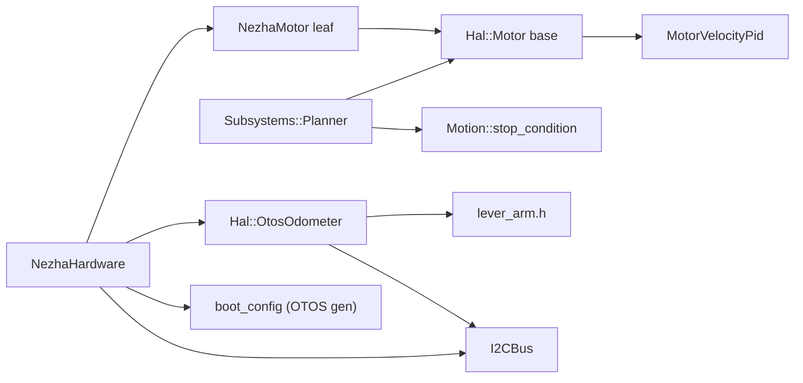

<!-- CLASI: Before changing code or making plans, review the SE process in CLAUDE.md -->

# Architecture Update -- Sprint 086: Motion terminal-overshoot fix, real-hardware OTOS driver, and flip-flop cadence

Source documents: `clasi/issues/motion-turn-drive-terminal-overshoot.md` (the
priority -- already root-caused, stakeholder-ordered fix), `clasi/issues/
nezha-hardware-otos-driver-for-new-source-tree.md`, `clasi/issues/
flip-flop-cadence-below-design-target.md`, `docs/protocol-v2.md` (§10 Motion
Commands, §11 OTOS, §16 DEV), `.claude/rules/hardware-bench-testing.md`,
`.claude/rules/debugging.md`, and direct reads of `source/subsystems/
planner.{h,cpp}`, `source/hal/velocity_pid.{h,cpp}`, `source/hal/capability/
motor.h`, `source/hal/nezha/nezha_motor.{h,cpp}`, `source/motion/
stop_condition.{h,cpp}`, `source/motion/motion_baseline.h`, `source/motion/
velocity_ramp.h`, `source/hal/capability/odometer.h`, `source/hal/sim/
sim_odometer.h`, `source/subsystems/{hardware.h,nezha_hardware.{h,cpp}}`,
`source/com/i2c_bus.h`, `source/dev_loop.cpp`, `source/main.cpp`,
`source/commands/otos_commands.{h,cpp}`, `source_old/hal/real/OtosSensor.{h,cpp}`,
`source_old/hal/capability/OtosLeverArm.h`, `data/robots/tovez.json`,
`data/robots/robot_config.schema.json`, `scripts/gen_boot_config.py`,
`tests/sim/unit/{test_motor_policy.py,test_planner.py,
test_motion_commands_arc_turn.py}`, `tests/testgui/test_tour1_geometry.py`,
and `tests/CLAUDE.md`.

## Grounding in the current tree -- read this first

Nine facts, discovered by direct read during this planning pass, pin down
exactly where each issue's fix lands and rule out several plausible-looking
but wrong approaches.

**1. The GOTO/PURSUE decel-anticipation pattern this sprint needs to extend
to `D`/`TURN`/`RT` already exists, in exactly one place.**
`Subsystems::Planner::pursueSteer()` (`planner.cpp:310-334`) computes
`vCap = sqrtf(2.0f * config_.a_decel * dRemaining)` and clamps the commanded
speed to it every tick, so a GOTO's wheel speed is already near zero when its
`STOP_POSITION` fires. No equivalent exists for `DISTANCE`/`TURN`/`ROTATION`:
those goal kinds only react to their stop condition firing (`planner.cpp`'s
`tick()`, the `stopping_` branch, `~385-435`) and then ramp to zero via
`Motion::VelocityRamp` under `yaw_acc_max`/`a_decel` -- with the wheel still
at full commanded speed at the instant the stop fires. This is precisely
what the issue calls out (`planner.cpp:~319`, "already exists for GOTO/
POSITION... NOT applied to RT/TURN/D") and precisely what ticket 003 below
extends, reusing the same `vCap` shape rather than inventing a second one.

**2. The reverse-spin overshoot is a motor-loop/armor interaction, not a
Planner bug -- the Planner's own stop detection and pose estimate are
already correct.** The issue's own instrumentation confirms `EVT done rt`
fires at the true, correct heading; the damage is entirely in what happens
to the physical wheel *after* that tick, inside `Hal::MotorVelocityPid::
compute()` (`velocity_pid.cpp`) and `Hal::Motor::armoredWrite()`
(`capability/motor.h:297-332`). Two mechanisms compound: (a) `compute()`'s
integrator-freeze deadband triggers on `|target| < minDuty`
(`velocity_pid.cpp:73`), not on `|error|` -- once the ramp's target hits (or
nears) zero, the integrator freezes at whatever value it held while
sustaining the turn, while the proportional term (`kp * err`, with `err`
still large because the physical wheel is still spinning) can swing the raw
duty to the opposite sign; (b) that sign flip is exactly what `armoredWrite()`'s
zero-dwell-reversal gate (`reversalDwell_`, default 100 ms) is built to catch
-- but catching it here means **holding the wheel at commanded-zero (free
coast) for the whole dwell window while the PID's target-side deadband keeps
recomputing a fresh, undamped correction from the ever-growing coast error**,
so the correction that finally lands once the dwell elapses is larger, not
smaller, than if no dwell had intervened. The dwell was designed to protect
against a *spurious/unrequested* reversal (a stale command re-issued or a
genuine direction change), not a *legitimate momentary braking correction*
during a commanded decel-to-zero -- and today's `armoredWrite()` cannot tell
the two apart. This distinction is the fix's actual target (ticket 002),
not a retune of `a_decel`/`yaw_acc_max` alone (those only change how fast the
*commanded* ramp reaches zero, not what the motor loop does once it's there).

**3. The armor this sprint must not weaken is base-class, shared-once
policy, not per-leaf code.** `Hal::Motor::armoredWrite()`/
`processResetIfPending()`/`updateRestTracking()`/`updateWedgeDetector()`
(`capability/motor.h`) are non-virtual, inline, shared by every `Hal::Motor`
leaf (today: `NezhaMotor`; sim's `SimMotor` shares the same base). Any change
ticket 002 makes therefore affects **every** motor channel, sim included --
which is exactly why the ticket's regression bar (SUC-004) requires every
pre-existing `tests/sim/unit/test_motor_policy.py` case to keep passing
unmodified, not just the new zero-crossing case to pass.

**4. `NezhaHardware`'s `odometer()` seam is already fully wired end to end;
this sprint fills in the one missing leaf, nothing else.** `Subsystems::
Hardware::odometer()` (`hardware.h:92`) defaults to `nullptr`; `NezhaHardware`
does not override it today (confirmed: no member, no override in
`nezha_hardware.{h,cpp}`). `source/dev_loop.cpp`'s pose-estimation step
(`~119-128`) already calls `hardware.odometer()`, and -- generically, for
**any** non-null result -- calls its `tick(now)` and reads its `pose()`
before `PoseEstimator::tick()` runs, every pass, unconditionally. `source/
commands/otos_commands.cpp` already resolves `hardware.odometer()` **live,
on every dispatch** for all seven wire verbs and already replies `ERR nodev`
gracefully when it is null. **None of dev_loop.cpp, otos_commands.{h,cpp}, or
the wire schema needs to change.** The entire scope is: implement a real
`Hal::Odometer` leaf, give `NezhaHardware` an instance of it, and override
`odometer()` to return its address.

**5. The OTOS leaf's `tick()` is NOT part of `NezhaHardware`'s brick
flip-flop sequencer, and must not be folded into it.** `NezhaHardware::
tick()`'s `REQUEST_DUE`/`COLLECT_DUE` state machine (`nezha_hardware.cpp`)
exists solely to avoid back-to-back same-address (`0x10`) transactions on a
single in-use motor port (079-006's TWIM-stall root cause). The OTOS chip
lives at a different address (`0x17`) and is driven by `dev_loop.cpp`'s own,
separate, once-per-pass `odometer->tick(now)` call (fact 4) -- entirely
independent of the motor scheduler's phase state. The new leaf's `tick()`
can therefore do a single synchronous burst read per pass (the same shape
`source_old/hal/real/OtosSensor.cpp`'s `readTransformed()`/
`readVelocityTransformed()` already used), reusing `I2CBus`'s existing
per-device `preClear`/`postClear` lazy-clearance mechanism (already generic
over any 7-bit address, `i2c_bus.h:70-83`) rather than inventing a second
bus-safety mechanism -- directly relevant to issue 3's non-goal ("do not
regress the TWIM-stall fix... to chase Hz": this ticket must not become a
*new* source of bus contention either).

**6. The OTOS lever-arm mounting-offset compensation math already exists,
verbatim, as a dependency-free header -- and the config data it needs is
already sitting in the robot JSON, just not consumed by this tree's boot-config
generator.** `source_old/hal/capability/OtosLeverArm.h`'s
`sensorToCentre()`/`centreToSensor()` are pure, stateless, header-only
functions (no I2C, no CODAL) implementing exactly the "OTOS `REG_OFFSET` is
unwritable on this hardware, so the lever-arm must be applied host-side"
quirk the issue calls out -- ported verbatim, this is a zero-risk, zero-new-math
dependency for the new leaf. `data/robots/robot_config.schema.json` already
defines `geometry.odometry_offset_mm` (`$defs/OffsetXYYaw`: x/y/yaw_rad) and
`calibration.otos_linear_scale`/`otos_angular_scale` (explicitly documented:
"Programmed into the OTOS chip at boot from the baked default... via OL/OA,
not SET"), and `data/robots/tovez.json` already carries real, non-null
values (`x: -47.7, y: 3.5, yaw_rad: 0.0`). What is missing is purely the
plumbing: `scripts/gen_boot_config.py` today only maps `geometry.trackwidth`
(confirmed by direct read) -- it has no OTOS-facing generator at all. This
sprint's OTOS ticket set adds that generator function and the leaf
constructor argument it feeds; it invents no new config vocabulary.

**7. Reviving the stale pre-rebuild `DBG OTOS`/`DBG OTOS BENCH` wire family
is explicitly NOT this sprint's path for either OTOS driver work or
flip-flop measurement.** `docs/protocol-v2.md` §14 documents a `DebugCommands`/
`BenchOtosSensor`/`Robot::otosCorrect()` surface that does not exist anywhere
in `source/` (confirmed: no `DBG` dispatch anywhere in `source/commands/`) --
it is `source_old`-era and already flagged stale in `.claude/rules/
hardware-bench-testing.md`. This sprint does not resurrect it. The
bench-mode/error-injection surface OTOS testing might otherwise want is
already covered, for the *sim* path, by `Hal::SimOdometer`'s own noise/drift
knobs (081-003) -- out of this sprint's real-hardware scope.

**8. `I2CBus` already carries the per-device instrumentation issue 3's
measurement ticket needs; only a way to read it live is missing.**
`I2CBus::txnCount()`/`errCount()`/`lastErr()`/`dumpRecent()` (`i2c_bus.h:89-96,
143`) are already compiled into every build (not gated by `HOST_BUILD` or
`ROBOT_DEV_BUILD`) and already timestamp a 24-entry transaction ring
(`TxnLog`, `i2c_bus.h:235-246`). No wire command exposes them today (fact 7).
Per `.claude/rules/debugging.md`, `pyOCD`/`gdb` can already read this live
static instance's memory directly with zero firmware change -- the
"measure first, minimal risk" path the issue's own text prefers. A new
dev-only wire surface is a fallback, not the default plan (Design Rationale
6).

**9. This sprint's three issues touch entirely disjoint code -- motion
(`source/subsystems/planner.*`, `source/hal/{velocity_pid,capability/motor,
nezha/nezha_motor}.*`), OTOS (`source/hal/<new otos dir>/*`,
`source/subsystems/nezha_hardware.*`'s member list, `source/config/
boot_config.*`), and flip-flop measurement (`source/com/i2c_bus.*` read-only,
maybe `source/commands/dev_commands.*`) -- with exactly one shared file
touched by two different issues' tickets (`nezha_hardware.{h,cpp}`: issue 1
touches nothing there; issue 2 adds the `odometer()` override and a new
member). No ticket from one issue's set depends on a ticket from another
issue's set; the three issue-groups can be planned, reviewed, and (later)
executed independently, and are ordered below by priority/risk
(stakeholder-mandated: motion first) and urgency (flip-flop last -- "not
urgent" per the issue itself), not by a technical dependency chain.

## Step 1: Understand the Problem

Three independent, pool-sourced defects/gaps, unrelated to each other except
by sharing this sprint:

1. **Motion terminal overshoot** (priority): turns and drives overshoot
   through zero into a sustained reverse spin at completion, root-caused to
   the motor velocity loop / reversal-dwell armor interaction (fact 2), which
   the Planner's missing decel anticipation for `D`/`TURN`/`RT` (fact 1)
   makes worse by handing the motor loop a larger arrest-from-full-speed
   problem than it needs to solve. Compounds across a multi-leg tour into a
   ~175 mm/~148° wreck. Fix order is stakeholder-mandated: the motor loop
   (root) first, decel anticipation (mitigant) second, because the motor
   loop must be provably safe (armor-preserving) on its own before the
   Planner is asked to hand it a gentler problem.
2. **Real-hardware OTOS driver**: `NezhaHardware` has no `Hal::Odometer`
   leaf (fact 4's seam sits unfilled), so real hardware has no OTOS/fused
   pose at all -- sim-only since sprint 082, an explicit, already-approved
   deferral now being paid off.
3. **Flip-flop cadence**: measured ~44-52 Hz vs. a ~80-90 Hz design estimate
   -- not urgent, not a correctness bug (the embedded PID closes the loop
   fine at the measured cadence) -- needs measurement before any change is
   even considered, per the issue's own explicit mandate.

**What does not change:** the wire schema/message plane for motion (`msg::
PlannerCommand`/`StopCondition` -- ticket set A's fix is entirely inside
`Hal`/`Motion`/`Subsystems::Planner`'s existing contracts); the `Hal::
Odometer`/`msg::OdometerCommand`/`OdometerConfig` message plane (fact 4 --
OTOS ticket set adds a leaf and boot-config plumbing, not new messages,
except the one documented config surface addition in Step 3); `dev_loop.cpp`,
`otos_commands.{h,cpp}` (fact 4); the `I2CBus` clearance mechanism itself
(fact 5/8 -- read, and reused, never modified by ticket set B or C); the
079-006 TWIM-stall fix and the reversal-latch armor's own logic, which
ticket set C treats as a hard non-goal to preserve and ticket set A (a
different armor surface -- the reversal *dwell*, not the *wedge latch*)
treats as a must-hold regression bar.

## Step 2: Identify Responsibilities

| Responsibility | Owning surface | Why it changes independently | Issue |
|---|---|---|---|
| Decelerate a spinning wheel to zero without overshoot | `Hal::MotorVelocityPid` (`velocity_pid.cpp`) + `Hal::Motor::armoredWrite()`'s zero-crossing interaction (`capability/motor.h`) | Control-law/armor-interaction concern -- changes only when the zero-crossing behavior itself is wrong, independent of what commanded the deceleration. | 1 |
| Anticipate an upcoming stop so the ramp already reads near-zero when the stop fires | `Subsystems::Planner`'s stop-evaluation loop (`planner.cpp`'s `tick()`) + a shared "remaining-to-stop" query | Trajectory-shaping policy -- distinct from the motor loop's own zero-crossing behavior (a Planner concern: *when* to start slowing, not *how* the motor arrests). | 1 |
| Prove per-leg geometry and provide a human-reviewable trace | `tests/sim/system/` (new) + `tests/testgui/test_tour1_geometry.py` (retuned) | Verification is its own responsibility, depends on both rows above landing first. | 1 |
| Re-verify the reversal/wedge armor after the velocity-loop change | `tests/sim/unit/test_motor_policy.py` (extended) + a stand HITL pass | A safety-regression gate, not a feature -- changes only alongside the row it re-verifies, but is its own acceptance criterion by stakeholder mandate. | 1 |
| Drive the OTOS chip's register protocol and apply host-side lever-arm compensation | A new `Hal::Odometer` leaf (working name `Hal::OtosOdometer`, final identifier per the implementing ticket) | Device-driver concern -- changes only if the OTOS register map or the lever-arm math changes, never for scheduling or config-plumbing reasons. | 2 |
| Bake the OTOS mounting offset + linear/angular scalar into firmware at boot | `scripts/gen_boot_config.py` (new generator function) + `source/config/boot_config.{h,cpp}` (new struct) | Boot-config-generation concern -- a robot-JSON-to-C++-constant mapping, the same reason `defaultMotorConfigs()`/`defaultDrivetrainConfig()` already exist as their own generators. | 2 |
| Own the OTOS leaf and expose it through the `Hardware::odometer()` seam | `Subsystems::NezhaHardware` (new member + `odometer()` override) | Aggregation/ownership concern, unchanged in kind from how it already owns four `NezhaMotor`s -- adding a fifth owned device, not a new architectural role. | 2 |
| Prove the OTOS leaf works on real hardware | Stand HITL pass (`.claude/rules/hardware-bench-testing.md`) | Verification, depends on the two rows above. | 2 |
| Measure where flip-flop per-slice time actually goes | A stand `pyOCD`/`gdb` measurement session against `I2CBus`'s existing counters/log (fact 8) | Diagnostic/measurement concern -- zero production-code change by design (issue's own "measure first" mandate). | 3 |
| Act on the measurement (optimize or document) | Either a narrow `I2CBus`/`NezhaHardware` clearance fix, or a design-doc correction | Decision made FROM the measurement, not before it -- explicitly may be a no-code-change outcome. | 3 |

No responsibility spans more than one ticket's file set; the three issues'
rows share no file except `nezha_hardware.{h,cpp}` (Grounding fact 9), and
even there the touching tickets (issue 1: none; issue 2: the `odometer()`
row above) never touch the same lines.

## Step 3: Subsystems and Modules

| Module | Purpose (one sentence) | Boundary | Use cases served | Change this sprint |
|---|---|---|---|---|
| `Hal::MotorVelocityPid` | Computes the duty fraction that drives a wheel's measured velocity toward its commanded target. | Inside: the discrete-PI-with-anti-windup control law, the integrator-freeze deadband. Outside: whether/how the result reaches the bus (`Hal::Motor`'s job). | SUC-001, SUC-002, SUC-004 | **Fix**: the zero-crossing/deadband interaction that lets a large `kp*err` swing sign while the integrator is frozen -- exact mechanism (retuned deadband condition, a bounded braking-duty cap near a zero target, or an anti-windup adjustment) is ticket 002's implementation decision, constrained by the invariants in Design Rationale 1. |
| `Hal::Motor` (base, `capability/motor.h`) | Gates every DUTY/VELOCITY/NEUTRAL write through the shared reversal-dwell/output-deadband/wedge-detection armor policy. | Inside: `armoredWrite()`, `processResetIfPending()`, `updateRestTracking()`, `updateWedgeDetector()` (all base, shared by every leaf). Outside: the device-specific write primitive (`writeRawDuty()`, leaf's job). | SUC-001, SUC-002, SUC-004 | **Fix, narrowly**: `armoredWrite()`'s reversal-detection must distinguish a legitimate momentary braking correction near a (near-)zero target from a genuine unrequested reversal -- see Design Rationale 1 for the exact invariant this must preserve. No change to `processResetIfPending()`/`updateWedgeDetector()`/the wedge-latch logic at all. |
| `Subsystems::Planner` (`planner.cpp`'s `tick()`) | Advances the commanded ramp and evaluates stop conditions once per tick, terminating the active goal when one fires. | Inside: the stop-evaluation loop, `stopping_`'s SMOOTH ramp-down. Outside: the motor loop's own zero-crossing behavior (`Hal::Motor`'s job, row above); the stop-condition math itself (`Motion::evaluateStopCondition`'s job). | SUC-001, SUC-002, SUC-003 | **Extend**: apply a `pursueSteer()`-style anticipatory speed/rate cap to `DISTANCE`/`TURN`/`ROTATION` while a goal's stop condition is still open (not yet fired), using a new shared "remaining-to-stop" query (row below) so the cap logic is computed once, not re-derived per goal kind. |
| `Motion::stop_condition` (`.h`/`.cpp`) | Tests one stop condition against a baseline and this tick's observations; (new) also reports how much distance/rotation remains until it would fire. | Inside: the pure predicate math (already `evaluateStopCondition`) plus a new, equally pure "remaining" query built from the SAME per-kind geometry it already computes. Outside: what the caller does with either result (Planner's job). | SUC-001, SUC-002 | **Extend** (additive): add a query alongside `evaluateStopCondition` so `DISTANCE`/`ROTATION`/`HEADING`'s "how far to go" is computed in exactly one place, reused by both the eventual-fire test and the new anticipatory cap -- avoiding a second, drifting copy of the same geometry inside `planner.cpp`. |
| `tests/sim/unit/test_motor_policy.py` + a new zero-crossing case | Proves the shared armor policy (including the zero-crossing fix) behaves correctly in isolation. | Inside: host-clean `Hal::Motor` policy tests. Outside: Planner/tour-level behavior (system-tier tests below). | SUC-004 | **Extend**: every existing case re-verified; new case(s) for the decel-to-zero scenario. |
| `tests/sim/system/` (new files) + `tests/testgui/test_tour1_geometry.py` (retuned) | Proves per-leg tour geometry and produces a human-reviewable trace. | Inside: multi-leg sim-ground-truth assertions, chart rendering. Outside: unit-level motor/Planner correctness (rows above). | SUC-003 | **New** + **retune**. |
| `Hal::OtosOdometer` (working name; new, `source/hal/otos/`) | Drives the SparkFun OTOS chip's I2C register protocol and reports the chassis-centre pose/velocity. | Inside: the register map/read/write sequencing (ported from `source_old/hal/real/OtosSensor.cpp`), calling the shared lever-arm math (row below) inside `pose()`. Outside: the lever-arm math itself, the boot-config values it is constructed with, and how `NezhaHardware` schedules its `tick()` (it doesn't -- fact 5). | SUC-005, SUC-006, SUC-007 | **New.** Implements `Hal::Odometer`'s five primitives + `pose()`/`connected()`/`tick()`/`begin()`. |
| Lever-arm compensation math (working location `source/hal/lever_arm.h`, ported from `source_old/hal/capability/OtosLeverArm.h`) | Converts between the OTOS sensor's own reported pose and the chassis-centre pose, given a fixed mounting offset. | Inside: the two pure, stateless conversion functions. Outside: everything else -- zero dependencies, zero state. | SUC-006 | **Port, verbatim** (concept + math, not necessarily byte-identical C++ given naming-convention differences from `source_old`). |
| `scripts/gen_boot_config.py` (extended) + `source/config/boot_config.{h,cpp}` (new struct) | Maps `data/robots/*.json`'s `geometry.odometry_offset_mm`/`calibration.otos_linear_scale`/`otos_angular_scale` into a boot-time C++ constant the OTOS leaf is constructed with. | Inside: the JSON-to-constant mapping (mirrors the existing `trackwidth`/per-port motor mapping exactly). Outside: what the leaf does with the values. | SUC-005, SUC-006 | **New generator function**, additive to the existing file -- no existing mapping touched. |
| `Subsystems::NezhaHardware` | Owns the shared `I2CBus` plus the four `NezhaMotor`s (and, this sprint, one `Hal::OtosOdometer`) and schedules the motor brick flip-flop. | Inside: the `motor1_..motor4_` members, the flip-flop phase state, (new) an `otos_` member and the `odometer()` override. Outside: OTOS's own register protocol (leaf's job); OTOS's own scheduling (none needed -- `dev_loop.cpp` already drives it, fact 5). | SUC-005 | **Extend**: one new member, one new one-line override (`return &otos_;`). The flip-flop scheduler (`tick()`'s `REQUEST_DUE`/`COLLECT_DUE`) is untouched. |
| `I2CBus` (read-only this sprint, ticket set C) | Tracks per-device transaction counts/errors/a timestamped log, and the lazy clearance timers every device write/read already uses. | Inside: everything it already does. Outside: nothing new -- ticket set C reads its existing counters; it does not add new tracked state unless SUC-009's optimization outcome specifically requires it. | SUC-008, SUC-009 | **Read-only measurement** (ticket 008); **possibly a narrow clearance-accounting fix** (ticket 009, only if the data supports it -- see Design Rationale 5). |
| Design doc (the 079 tick-model cadence-estimate section) | Records the flip-flop's expected per-motor sample cadence. | Inside: the estimate and its assumptions. Outside: the code itself. | SUC-009 | **Possibly corrected** (doc-only outcome, ticket 009, if no safe optimization exists). |

Every module addresses at least one SUC; every SUC is covered by at least
one ticket (Phase 4). No module's one-sentence purpose needs "and" except
where documenting which of two independent things it now owns (`Subsystems::
NezhaHardware`'s "owns... and schedules" is pre-existing scope, not new
coupling this sprint introduces). No cycles -- see Step 4.

## Step 4: Diagrams

### Component / module diagram

```mermaid
graph TD
    subgraph "Issue 1 -- motion terminal overshoot"
        Pid["Hal::MotorVelocityPid\n(velocity_pid.cpp)"]
        MotorBase["Hal::Motor base\n(armoredWrite / wedge armor)"]
        NezhaMotorLeaf["Hal::NezhaMotor\n(writeRawDuty, unchanged)"]
        StopCond["Motion::stop_condition\n(+ new remaining-to-stop query)"]
        Planner["Subsystems::Planner\n(tick's stop-eval loop)"]
        TourTests["tests/sim/system + testgui\n(per-leg geometry, trace)"]
        ArmorTests["tests/sim/unit/test_motor_policy.py\n(+ new zero-crossing case)"]
    end

    subgraph "Issue 2 -- real-hardware OTOS driver"
        OtosLeaf["Hal::OtosOdometer (new)\nsource/hal/otos/"]
        LeverArm["lever-arm math (new)\nsource/hal/lever_arm.h"]
        BootCfg["gen_boot_config.py + boot_config.{h,cpp}\n(new OTOS generator)"]
        NezhaHw["Subsystems::NezhaHardware\n(+otos_ member, odometer() override)"]
        DevLoop["dev_loop.cpp\n(UNCHANGED -- already generic)"]
        OtosCmds["otos_commands.cpp\n(UNCHANGED -- already live-resolves)"]
    end

    subgraph "Issue 3 -- flip-flop cadence"
        I2CBusMod["I2CBus\n(existing counters/log, read-only)"]
        Measure["stand pyOCD/gdb session\n(ticket 008)"]
        Decide["targeted fix OR doc update\n(ticket 009)"]
    end

    Planner -->|"vCap-style anticipation"| StopCond
    Planner -->|"ramped twist"| MotorBase
    MotorBase --> Pid
    MotorBase --> NezhaMotorLeaf
    ArmorTests -->|verifies| MotorBase
    TourTests -->|verifies| Planner

    OtosLeaf --> LeverArm
    OtosLeaf --> BootCfg
    NezhaHw --> OtosLeaf
    DevLoop -->|"calls odometer()->tick()/pose()\n(pre-existing, generic)"| NezhaHw
    OtosCmds -->|"resolves hardware.odometer() live\n(pre-existing)"| NezhaHw

    Measure -->|reads| I2CBusMod
    Decide -->|"informed by"| Measure
```

`ArmorTests`/`TourTests` are verification consumers, drawn separately from
the production modules they exercise (same convention 085's diagram used for
its own `Tests` node). `DevLoop`/`OtosCmds` are shown as UNCHANGED to make
Grounding fact 4 visually explicit -- this sprint's issue-2 tickets add
exactly two new boxes (`OtosLeaf`, `LeverArm`) plus a new generator
(`BootCfg`) and wire them into one existing box (`NezhaHw`); nothing
downstream of `NezhaHw` moves.

### Dependency graph (module level)

No cycles. Dependency direction is unchanged from the existing tree
(`Subsystems` depends on `Hal`/`Motion`, never the reverse -- `NezhaHardware`
depending on `Hal::OtosOdometer` is the same direction it already depends on
`Hal::NezhaMotor`). `Planner`'s new dependency on `Motion::stop_condition`'s
"remaining" query is an EXTENSION of an edge that already exists (`Planner`
already calls `Motion::evaluateStopCondition` every tick), not a new edge.
`Hal::OtosOdometer`'s dependency on `I2CBus` mirrors `NezhaMotor`'s identical,
pre-existing dependency exactly.

No entity-relationship diagram: no persisted/relational data model exists in
this firmware tree. The one config-surface addition (Step 3's `boot_config`
row: a new OTOS boot-config struct sourced from `geometry.odometry_offset_mm`/
`calibration.otos_*_scale`) is a plain value struct, not a schema/relationship
change, and is fully described in Step 3's table and Design Rationale 4.

## Step 5: What Changed / Why / Impact / Migration

### What Changed, by ticket

**001 (issue 1) -- Reproduce the overshoot as a regression harness.** New
sim-level test(s) that reproduce the issue's own measured signature
(`RT 9000`'s `vel(L,R)` reverse-spin; `D 200 200 500`'s ~7% overshoot)
quantitatively, initially failing (or the pre-existing loose tolerances
documented as the "before" baseline). No production code change.

**002 (issue 1) -- Motor velocity-loop / armor fix (THE root fix, phase 1).**
Changes `Hal::MotorVelocityPid::compute()` and/or `Hal::Motor::
armoredWrite()`'s zero-crossing interaction per Design Rationale 1's
invariants. Re-verifies every pre-existing armor test; adds new
zero-crossing-specific armor tests. Sim-only acceptance this ticket (HITL
deferred to 004, which validates the complete fix).

**003 (issue 1) -- Planner terminal decel/coast anticipation (phase 2),
depends on 002.** Adds the shared "remaining-to-stop" query to `Motion::
stop_condition` and a `pursueSteer()`-style anticipatory cap to `Planner::
tick()`'s stop-evaluation loop for `DISTANCE`/`TURN`/`ROTATION`. Sim-only
acceptance.

**004 (issue 1) -- Verification sweep + stand HITL, depends on 002 and 003.**
Per-leg geometry tests, rendered Tour 1/Tour 2 trace, retuned
`test_tour1_geometry.py`/`test_motion_commands_arc_turn.py` tolerances, and
the mandated stand HITL pass (wheels drive/stop cleanly both directions, no
runaway, armor intact). Closes the parent issue.

**005 (issue 2) -- Lever-arm math port + OTOS boot-config surface.** Ports
`OtosLeverArm.h`'s two functions; adds the `gen_boot_config.py` generator
function + `boot_config.{h,cpp}` struct sourced from `geometry.
odometry_offset_mm`/`calibration.otos_linear_scale`/`otos_angular_scale`.
Foundational -- no `Hal::Odometer` leaf yet, so this ticket is pure,
host-testable math/plumbing.

**006 (issue 2) -- `Hal::OtosOdometer` leaf + `NezhaHardware` wiring, depends
on 005.** Implements the five `Hal::Odometer` primitives + `pose()`/
`connected()`/`tick()`/`begin()`, porting `OtosSensor.cpp`'s register
protocol; adds the `otos_` member and `odometer()` override to
`NezhaHardware`; wires construction in `main.cpp`. No `dev_loop.cpp`/
`otos_commands.cpp` change (Grounding fact 4).

**007 (issue 2) -- Stand HITL verification, depends on 006.** Confirms
plausible live pose/velocity, all seven OTOS verbs ack `OK`, hardware-bench
gate's OTOS-alive check passes. Closes the parent issue. Environmental
dependency: requires the physical OTOS sensor connected (Risk, below).

**008 (issue 3) -- Measure per-phase flip-flop timing.** Stand session using
`I2CBus`'s existing counters/log via `pyOCD`/`gdb` (Grounding fact 8);
confirms or refutes the double-counted-clearance hypothesis. Zero production
code change by design.

**009 (issue 3) -- Act on the measurement, depends on 008.** Either a
narrow, re-measured, non-regressed clearance-accounting fix, or a doc-only
correction to the 079 cadence estimate. Closes the parent issue.

### Why

Issue 1's ordering (motor loop, then Planner) is stakeholder-mandated and
independently justified by Grounding fact 2: the motor loop is the actual
root cause, and the Planner's decel anticipation (fact 1) only reduces how
hard a problem the motor loop has to solve -- it cannot itself prevent an
overshoot if the loop still reverses at zero crossing. Fixing the Planner
first would risk masking the root cause behind a smaller, harder-to-measure
residual. Issue 2's ticket order (math/config -> leaf -> HITL) mirrors 084's
own bottom-up sequencing precedent (foundational, host-testable pieces
before the hardware-dependent finale). Issue 3's two-ticket, measure-then-decide
shape is the issue's own explicit mandate, not a planning choice.

### Impact on Existing Components

| Component | Impact |
|---|---|
| `Hal::MotorVelocityPid` | **Modified** (002). Control-law/deadband interaction change; same public `compute()` signature. |
| `Hal::Motor` (base) | **Modified** (002). `armoredWrite()`'s reversal-detection refined; `processResetIfPending()`/`updateRestTracking()`/`updateWedgeDetector()` untouched. |
| `Hal::NezhaMotor` | **Unaffected** -- consumes the base/PID unchanged; `writeRawDuty()`/`hardReset()`/`softRebaseline()` untouched. |
| `Hal::SimMotor` | **Indirectly affected** (shares `Hal::Motor` base) -- 002's regression bar (SUC-004) covers it via the shared `test_motor_policy.py` suite; no sim-specific behavior change expected beyond what the shared base does. |
| `Motion::stop_condition` | **Extended** (003). Additive query; `evaluateStopCondition()`'s existing signature/behavior unchanged. |
| `Subsystems::Planner` | **Extended** (003). New anticipatory cap in the stop-evaluation loop; `apply()`/goal-kind dispatch unchanged. |
| `tests/sim/unit/test_motor_policy.py`, `test_planner.py` | **Extended** (002/003/004). |
| `tests/testgui/test_tour1_geometry.py`, `tests/sim/unit/test_motion_commands_arc_turn.py` | **Retuned** (004) -- tolerances tightened to match fixed behavior; no new production dependency. |
| `Hal::Odometer` (interface) | **Unaffected** -- the new leaf implements the existing five primitives; no interface change. |
| `Hal::SimOdometer` | **Unaffected** -- a separate leaf, sim-only, untouched by the real-hardware driver. |
| `Subsystems::NezhaHardware` | **Extended** (006). One new member, one new one-line override; flip-flop scheduler untouched. |
| `dev_loop.cpp`, `source/commands/otos_commands.{h,cpp}` | **Unaffected** (Grounding fact 4 -- explicitly verified, not assumed). |
| `scripts/gen_boot_config.py`, `source/config/boot_config.{h,cpp}` | **Extended** (005) -- new generator function/struct, additive; existing `trackwidth`/motor-config mapping untouched. |
| `main.cpp` | **Extended** (006) -- constructs the new leaf alongside existing hardware construction; nothing else in its loop body changes. |
| `I2CBus` | **Unaffected** (008, read-only) or **narrowly extended** (009, only if the optimization outcome is chosen -- see Design Rationale 5). |
| `source/` (motion/OTOS/flip-flop) | Every change stays inside `source/`'s existing HAL/Subsystems/Motion layering; no new top-level module, no `Hal -> Subsystems` inversion. |

### Migration Concerns

- **No wire/message-schema migration for issue 1 or issue 3.** Both stay
  entirely inside existing `Hal`/`Motion`/`Subsystems` contracts.
- **Issue 2 introduces exactly one new config surface** (the OTOS boot-config
  struct, Design Rationale 4) -- additive to `boot_config.{h,cpp}`, no
  existing field renamed/removed, no wire verb added or changed (the seven
  OTOS verbs already exist and already work against any non-null leaf).
- **Issue 1's fix changes shared, safety-relevant base-class behavior**
  (`Hal::Motor::armoredWrite()`) -- this is the sprint's single highest-risk
  change; SUC-004's regression bar and ticket 004's stand HITL pass are the
  designed mitigation, not an afterthought.
- **Issue 2 has a hardware dependency ticket 007 cannot substitute for**:
  the physical SparkFun OTOS sensor must be connected to exercise SUC-005/
  006/007 on the stand. If unavailable at execution time, tickets 005/006
  (math, config, leaf implementation, unit-testable against a scripted
  `I2CBus` fake the same way `NezhaMotor`'s own tests already do) can still
  complete and be reviewed; only 007's HITL gate would block, and the
  sprint's own issue explicitly flags this as an environmental dependency,
  not a design gap.
- **Issue 3 may complete with zero production-code change** (the doc-only
  outcome) -- an expected, successful result per the issue's own "acceptable
  outcome" framing, not a sign ticket 009 was miscategorized (same pattern
  085 documented for its own verification-first tickets).
- **No deployment-sequencing concern across the three issue groups** -- they
  touch disjoint files (Grounding fact 9) and can execute, in principle, in
  any relative order; this document sequences issue 1 first only because the
  stakeholder named it the priority and it carries the highest safety risk,
  not because 2 or 3 technically depend on it.

## Step 6: Design Rationale

### Decision 1: the zero-crossing fix must preserve two specific armor invariants, not just "not break tests"

**Context.** Ticket 002's exact mechanism (retune the PID deadband
condition, add a bounded braking-duty cap, adjust the dwell's reversal test,
or some combination) is deliberately left to the implementing ticket -- this
document stays at module level. But "make the tests pass" is not, by itself,
a sufficient constraint for a change to safety-relevant shared base-class
code.

**Alternatives considered:** (a) leave the exact mechanism and its
correctness criteria entirely to the ticket's own judgment; (b) state the
two invariants the fix must hold, as an architecture-level constraint,
regardless of mechanism (chosen).

**Why this choice.** (b). Grounding fact 2 identifies the interaction
precisely: the dwell was designed to catch a *spurious/unrequested*
reversal, not a *legitimate momentary braking correction* near a
commanded-zero target, and today's code cannot distinguish them. Any fix
must therefore hold, independent of mechanism: **Invariant A** -- a genuine
unrequested reversal (e.g., a stale/glitched command re-issuing the opposite
sign with no intervening decel-to-zero) is still caught and dwelled exactly
as today (no weakening of `reversalDwell_`'s protection against that case).
**Invariant B** -- a legitimate braking correction during a commanded
decel-to-zero is not held off long enough to let the wheel coast further
into overshoot territory (whatever mechanism achieves this -- shortening or
bypassing the dwell specifically in this case, capping the correction's
magnitude, or preventing the integrator from building the stale state that
produces the oversized correction in the first place). SUC-004's acceptance
criteria operationalize both invariants as tests, not just prose.

**Consequences.** The implementing ticket has real design freedom (three
plausible mechanisms listed above, not prescribed further) but a concrete,
testable bar to clear for each invariant -- exactly the "hard design
decisions are within the sprint-planner's/ticket's authority; safety
invariants are not up for silent renegotiation" boundary this sprint's
elevated risk calls for.

### Decision 2: the Planner's decel anticipation is a shared query, not a fourth copy of `vCap` math

**Context.** `pursueSteer()`'s `vCap` computation is currently specific to
`STOP_POSITION`'s geometry (`dRemaining` from a world-frame XY target).
`DISTANCE`/`ROTATION`/`HEADING` each have their OWN "remaining" geometry,
already computed inside `Motion::evaluateStopCondition()`'s per-kind
branches (`stop_condition.cpp`) but not exposed as a standalone value.

**Alternatives considered:** (a) re-derive "remaining distance"/"remaining
rotation" inline inside `planner.cpp`'s stop-evaluation loop, next to (but
separate from) the existing `evaluateStopCondition()` call; (b) add a
companion query function inside `Motion::stop_condition` that computes
"how much is left" using the SAME per-kind geometry the firing test already
uses, called from both the anticipation cap and (implicitly, via its
existing call) the firing test itself (chosen).

**Why this choice.** (b). Cohesion: `Motion::stop_condition` already owns
"how does this stop condition's geometry work" for `DISTANCE`/`ROTATION`/
`HEADING`/`POSITION` -- a second, independently-written copy of that same
geometry inside `planner.cpp` (option a) is exactly the kind of
shotgun-surgery risk a future stop-condition change (e.g., a units or
sign-convention fix) would then have to make in two places instead of one,
silently drifting the way `pursueSteer()`'s own bespoke `dRemaining` already
sits slightly apart from `evaluateStopCondition()`'s `STOP_POSITION` branch
today. Centralizing avoids introducing that same duplication for three MORE
stop kinds in the same sprint that is otherwise fixing a bug partly caused by
under-shared logic.

**Consequences.** `Motion::stop_condition.h`'s public surface grows by one
function; `Planner::tick()`'s stop-evaluation loop calls it once per active
stop condition, alongside (not instead of) the existing
`evaluateStopCondition()` call. `pursueSteer()`'s own `STOP_POSITION`-specific
`vCap` is left as-is (GOTO's geometry -- world-frame XY distance -- is
genuinely different in shape from the other three kinds' scalar
distance/angle, so unifying all four into one function is not attempted
this sprint; flagged as an Open Question, not silently deferred).

### Decision 3: the OTOS leaf lives in its own `source/hal/otos/` directory, not under `source/hal/nezha/`

**Context.** `NezhaHardware` (the subsystem) will own the new leaf, and the
Nezha V2 motor board and the SparkFun OTOS sensor happen to share the same
physical `I2CBus` instance on this robot today.

**Alternatives considered:** (a) place the new leaf under `source/hal/
nezha/` alongside `NezhaMotor`, since `NezhaHardware` owns both; (b) a
separate `source/hal/otos/` directory, parallel to `source/hal/nezha/`
(chosen).

**Why this choice.** (b). The OTOS sensor is not a Nezha-brand device and
does not speak the Nezha register protocol (`0x10`) at all -- it is a
SparkFun chip at its own address (`0x17`) that merely happens to be
orchestrated by the same `Subsystems::NezhaHardware` owner in this
single-hardware-owner tree (mirroring `nezha_hardware.h`'s own header
comment distinguishing "Subsystems-tier owner" from "Hal-tier device").
Filing it under `hal/nezha/` would conflate "who currently schedules this
device" with "what kind of device this is" -- the same distinction
`nezha_hardware.h` already draws explicitly for why the aggregator itself
lives in `Subsystems`, not `Hal`. A future second hardware owner (e.g., a
different motor board) would still want to reuse this exact OTOS leaf
unchanged; nesting it inside `hal/nezha/` would misname that reusability.

**Consequences.** `source/hal/otos/otos_odometer.{h,cpp}` (working path) is
a new top-level HAL device directory, parallel to `hal/nezha/`, `hal/sim/`,
`hal/capability/` -- consistent with the tree's existing one-directory-per-device-family
convention.

### Decision 4: the OTOS mounting-offset/scalar config is boot-time-baked, not a new live `SET`/wire surface

**Context.** Sprint 085 (ticket 085-005) explicitly found and removed a dead
host-side push of `SET odomOffX/Y/Yaw` because no such key exists in
`config_commands.cpp`, concluding "OTOS pose is otherwise configured
entirely via `OI`/`OL`/`OA`/`OV`, never `SET`." This sprint must decide how
the mounting-offset value (a fixed mechanical measurement, `geometry.
odometry_offset_mm` in the robot JSON) reaches the new leaf.

**Alternatives considered:** (a) add a new live wire verb or `SET` key for
the offset, matching how `OL`/`OA` are live-settable; (b) bake it into boot
config from the robot JSON, exactly the way `otos_linear_scale`/
`otos_angular_scale`'s own schema doc comment already prescribes
("Programmed into the OTOS chip at boot from the baked default") (chosen).

**Why this choice.** (b). The offset is a fixed physical mounting
measurement, changed only when the sensor is physically remounted -- an
event that already requires a reflash-adjacent workflow (updating the robot
JSON and rebuilding), unlike `rotSlip`/`OL`/`OA`, which are tuned
interactively during calibration sessions and genuinely benefit from a live
verb. Sprint 085's own finding (no `SET` key exists, and the schema's own
doc comment for the sibling scalar fields already says "boot... not SET")
is direct, load-bearing precedent against inventing a new live surface here.
Adding one would also reopen exactly the dead-push problem 085 just closed
from the other direction (a firmware key with no host caller, instead of a
host push with no firmware key).

**Consequences.** `scripts/gen_boot_config.py` gains one new generator
function (mirroring its existing `trackwidth` mapping); the new leaf takes
the offset as a boot-time constructor argument (or an equivalent
boot-applied `configure()`-style call), never a runtime `SET`. If a future
sprint wants live-adjustable mounting offset (e.g., an in-field remount
without a reflash), that is a new, explicit scope decision for that sprint,
not a gap this one leaves silently.

### Decision 5: flip-flop measurement is a `pyOCD`/`gdb` read of existing counters first, a new wire surface only as fallback

**Context.** The issue's own text allows either "I2CBus stats and/or a
scoped gdb/pyOCD pass"; a new `DEV I2CLOG`-style wire verb was also
considered as a way to make repeated sampling easier without a debugger
session per measurement.

**Alternatives considered:** (a) add a new dev-only wire verb up front,
exposing `I2CBus::dumpRecent()`/`txnCount()`/`errCount()` over the wire; (b)
use `pyOCD`/`gdb` (already fully documented and set up for this exact
purpose, `.claude/rules/debugging.md`) to read the existing, already-compiled
counters/log directly from the live static `I2CBus` instance, with zero
firmware change, and only add a wire verb if that proves impractical for
the number of samples ticket 008 needs (chosen, as the default path).

**Why this choice.** (b) is strictly lower-risk for a "not urgent,
measure-first" issue: it cannot regress anything (no code changes), matches
the issue's own explicit "this wants measurement... before any change," and
the tooling already exists and is already documented for exactly this class
of on-chip inspection. Adding a wire verb up front would be exactly the kind
of speculative-generality anti-pattern this sprint's own quality bar warns
against -- building infrastructure the measurement ticket may not need,
before knowing whether it's needed.

**Consequences.** Ticket 008 is scoped to attempt (b) first; if a `pyOCD`/
`gdb` session cannot practically capture enough samples (e.g., because
halting the core to read memory perturbs the very timing being measured),
falling back to a minimal new `DEV`-family (not the stale `DBG`-family,
Grounding fact 7) diagnostic verb is in-ticket-scope, not a re-plan.

## Step 7: Open Questions

1. **Ticket 002's exact zero-crossing mechanism is intentionally
   unspecified at this planning level** (Decision 1) -- retuned deadband
   condition, a bounded braking-duty cap, an adjusted dwell test, or a
   combination. The implementing ticket chooses, constrained by Invariants
   A/B; if none of the plausible mechanisms satisfies both invariants
   simultaneously in the ticket's own testing, that is grounds for a
   `throw_ticket_exception` (an upstream armor-design conflict), not a
   silent relaxation of either invariant.
2. **Whether `pursueSteer()`'s own `STOP_POSITION` `vCap`/curvature-clamp
   logic should eventually be unified with the new shared "remaining-to-stop"
   query** (Decision 2's Consequences) is not resolved this sprint --
   GOTO's world-frame-XY geometry is different enough in shape from the
   other three stop kinds that forcing a single function this sprint risked
   a worse abstraction than two well-understood ones. Flagged as a
   candidate refactor for a future sprint if a fifth stop-kind-with-anticipation
   need arises.
3. **The exact final class/file names for the OTOS leaf**
   (`Hal::OtosOdometer`, `source/hal/otos/otos_odometer.{h,cpp}`,
   `source/hal/lever_arm.h`) are working names chosen for this document's
   own internal consistency and naming-rule conformance -- the implementing
   ticket may refine them (e.g., if a closer look at `source_old/hal/real/
   OtosSensor.h`'s full surface suggests a different split) as long as the
   naming/style rules and the module boundaries in Step 3 hold.
4. **Ticket 007's stand HITL gate has a hardware dependency this plan cannot
   remove**: it requires the physical SparkFun OTOS sensor connected to the
   robot under test. If that hardware is not available when this sprint
   executes, tickets 005/006 can still complete and be reviewed (unit-testable
   against a scripted `I2CBus` fake); 007 would block on hardware
   availability, not on any planning gap -- flagged here so the team-lead
   can sequence around it if needed, not discovered mid-execution.
5. **Ticket 009's outcome (optimize vs. document) is genuinely undecided
   until ticket 008's measurement exists** -- this is by design (the issue's
   own "measure first" mandate), not an planning omission. The ticket's own
   acceptance criteria (Phase 4) are written to accept either outcome as
   success.

## Architecture Self-Review

- **Consistency.** Step 5's per-ticket "What Changed" narrative and the
  Impact table agree on every component (nothing claimed changed in one and
  unaffected in the other); Grounding facts 1-9 are stated once and then
  consistently relied on throughout (Step 1's problem framing, Step 3's
  "Change" column, Decisions 1-5 all point back to the same facts without
  re-litigating them). The three issue-groups' sections are symmetric in
  depth (Grounding facts, responsibilities, modules, ticket list) despite
  their very different technical shapes, matching the sprint's own explicit
  "group by issue" mandate.
- **Codebase alignment.** Every claim about current code -- `pursueSteer()`'s
  existing `vCap`; `armoredWrite()`'s exact reversal-dwell logic;
  `NezhaHardware`'s missing `odometer()` override and `dev_loop.cpp`'s
  already-generic consumption of it; `otos_commands.cpp`'s already-live
  `ERR nodev` handling; `I2CBus`'s already-compiled-in counters/log;
  `gen_boot_config.py`'s current single (`trackwidth`-only) mapping;
  `data/robots/tovez.json`'s real, non-null `odometry_offset_mm` values;
  the complete absence of a `DBG` dispatch anywhere in `source/commands/`
  -- was verified by direct file read/grep during this planning pass, not
  assumed. Where this document's proposed approach depends on a specific
  existing mechanism (the `I2CBus` per-device clearance timers being
  address-generic; `dev_loop.cpp`'s odometer call being unconditional), the
  citation is to the specific line range read, not a general impression.
- **Design quality.** Cohesion: every module in Step 3 holds a one-sentence
  purpose without "and" (the one exception -- `NezhaHardware`'s "owns and
  schedules" -- is pre-existing, unexpanded scope, not new coupling this
  sprint adds). Coupling: the dependency graph (Step 4) shows fan-out
  staying low everywhere (`NezhaHardware`'s fan-out grows from 2
  (`I2CBus`, `NezhaMotor`) to 4, still well under the 4-5 guideline, and the
  new edges are all "owns a device," the same shape its existing edges
  already have). Boundaries: `Hal::Odometer`'s interface is untouched
  (Decision constraints kept the OTOS work inside the existing five
  primitives); `Motion::stop_condition`'s new query is additive, not a
  signature change to the existing predicate. Dependency direction:
  unchanged (`Subsystems` -> `Hal`/`Motion`, `Hal` -> nothing above it) in
  every row.
- **Anti-pattern detection.** No god component (no module grows a second,
  unrelated responsibility -- `NezhaHardware` gains a fifth OWNED device of
  a kind it already owns four of, not a new kind of responsibility). No
  shotgun surgery (the riskiest change, `Hal::Motor::armoredWrite()`, is
  singular and shared-by-design already -- that sharing is why the SUC-004
  regression bar exists, not evidence of new fragmentation). No feature
  envy, no circular dependencies (Step 4). No leaky abstraction (`Hal::
  Odometer`'s five-primitive contract absorbs the new leaf with zero
  interface change). No speculative generality -- Decision 5 explicitly
  rejects building a new wire-diagnostic surface before knowing it's needed;
  Decision 2 explicitly rejects prematurely unifying `pursueSteer()`'s
  distinct geometry into the new shared query.
- **Risks.** (1) Issue 1's motor-loop change touches shared, safety-relevant
  code -- mitigated by Decision 1's two named invariants, SUC-004's
  regression bar, and ticket 004's stand HITL gate; this is the sprint's
  highest-attention item and is called out explicitly in every ticket that
  touches it. (2) Issue 2's ticket 007 has a hardware-availability
  dependency outside this plan's control (Open Question 4). (3) Issue 3 may
  legitimately produce zero code change (an accepted, not a failed, outcome
  -- Migration Concerns). No data-migration risk (no persisted schema
  changes anywhere in this sprint beyond the additive boot-config struct).
  No breaking wire/protocol changes in any ticket. No deployment-sequencing
  concern (Migration Concerns' last bullet).

**Verdict: APPROVE.** No structural issues -- no circular dependency, no god
component, no broken interface, no inconsistency between the Sprint Changes
narrative and the document body. The one deliberately incomplete area
(ticket 002's exact fix mechanism, Decision 1) is a bounded, invariant-constrained
design choice left to the implementing ticket, not an unresolved
architectural ambiguity -- proceeding to ticketing.
