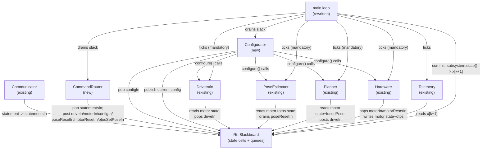
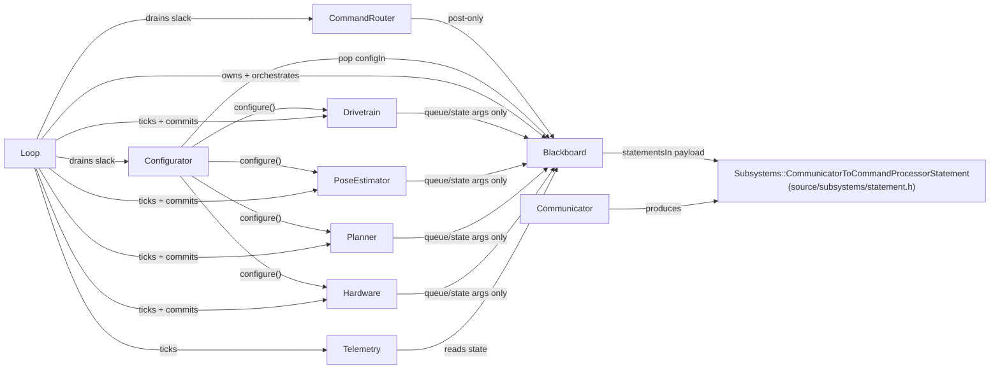

<!-- CLASI: Before changing code or making plans, review the SE process in CLAUDE.md -->

# Architecture Update -- Sprint 087: Two-plane blackboard, synchronous-update loop, Configurator, and command-queue transport (greenfield) — Revision r1

**Revision note.** This is `architecture-update-r1.md`, superseding
`architecture-update.md` as the active planning artifact per the
`architecture-authoring` skill's revision-naming rule (the original is
preserved, unmodified, as historical record). This revision resolves an
`INTERNAL` exception ticket 087-002 threw during execution: the Reference
code's `blackboard.h` named `Subsystems::CommunicatorToCommandProcessorStatement`
(defined in `source/subsystems/communicator.h`, which drags in `MicroBit.h`)
as `statementsIn`'s payload, which is structurally incompatible with a
host-testable `Rt::Blackboard`. See Decision 10 (Step 6) for the resolution;
everything else in this document is unchanged from `architecture-update.md`
except the small, contained edits Decision 10 requires (marked below).

Source documents: `clasi/issues/plan-file-a-design-issue-blackboard-architecture-state-objects-command-queues.md`
(the converged design, including reference code -- this document ports it into
CLASI's format; it does not redesign it), `docs/architecture/architecture-034.md`
(the last consolidated architecture baseline; superseded on the command tier by
the greenfield rebuild the design issue itself documents, per direct source
reads below), `docs/architecture/architecture-update-085.md` (most recent
sprint architecture, for current module-naming conventions), direct reads
of `source/main.cpp`, `source/dev_loop.{h,cpp}`, `source/commands/{dev_commands,
telemetry_commands,motion_commands,config_commands,pose_commands,
otos_commands}.h`, `source/subsystems/{drivetrain,pose_estimator,planner,
hardware,nezha_hardware,sim_hardware,communicator}.h`, and
`source/messages/{common,drivetrain,motor,planner,odometer,communicator}.h`,
performed during the original planning pass (2026-07-06/07), and (for this
revision) ticket 087-002's own exception report plus a direct re-read of
`source/subsystems/communicator.h` and `source/subsystems/hardware.h`.

## Grounding in the current tree -- read this first

The design issue's "Current-state inventory" section is itself a direct-read
grounding pass dated 2026-07-06 (today, at time of writing). This planning
pass re-confirmed its load-bearing claims by independent read rather than
taking them on faith, because a sprint that deletes `main.cpp`'s loop and all
of `dev_loop.*` cannot afford a stale premise:

- **The six `*State` structs exist exactly as inventoried, with the field
  lists the issue gives.** Confirmed by direct read: `config_commands.h:99-108`
  (`ConfigCommandState` holding `hardware`, `drivetrain`, `poseEstimator`,
  `planner` pointers plus the cross-family `sTimeoutWatchdog ->
  MotionLoopState::sTimeout` reach-through) and `dev_commands.h:198-201`
  (`DevLoopState` holding `hardware`, `drivetrain`, `watchdog`). The other four
  structs (`TelemetryState`, `MotionLoopState`, `PoseCommandState`,
  `OtosCommandState`) were not re-read line-by-line this pass but their
  presence and shape is not disputed by anything found in the ones that were.
- **The subsystem tier already conforms on the input axis.** Confirmed by
  direct read of `source/subsystems/drivetrain.h` (`tick(uint32_t now, const
  msg::MotorState& leftObs, const msg::MotorState& rightObs, ...)`,
  `hasCommand()`/`takeCommand()` for its output edge, no `Hal::Motor` reference
  held), `pose_estimator.h` (`tick(uint32_t now, const msg::MotorState&
  leftObs, ...)`, `encoderPose()`/`fusedPose()` outputs, `setPose()`/
  `resetEncoderBaseline()` with the documented pending-flag deferral already
  implemented), and `planner.h` (`apply(cmd, now)` / `tick(now, leftObs,
  rightObs, fusedPose)`, `hasCommand()`/`takeCommand()`/`hasEvent()`/
  `takeEvent()`). Every one of these already takes cross-subsystem data as
  explicit arguments and holds no subsystem pointer -- the gap really is
  confined to the command tier, the blackboard, the Configurator, the loop,
  and the output-faceplate regularization the design issue identifies.
- **No blackboard, queue-template, or Configurator-shaped component exists
  yet.** Confirmed: `source/` has no file under a `runtime/` (or similarly
  named) directory, and a tree-wide check of the current file list (see
  `source/` listing taken this pass) shows only `com/`, `commands/`, `config/`,
  `estimation/`, `hal/`, `kinematics/`, `messages/`, `motion/`, `subsystems/`,
  `telemetry/`, `types/`, plus `dev_loop.*` and `main.cpp` at the top level.
  This is greenfield for the new machinery, exactly as the design issue states.
- **`docs/architecture/architecture-034.md` is stale relative to the command
  tier described here** (it documents an earlier `Robot`/`Odometry`/`EKF`/
  `MotionController`/`BodyVelocityController` naming generation that a later,
  already-shipped rewrite replaced with the `Subsystems::{Drivetrain,
  PoseEstimator, Planner, Hardware}` / `msg::*` / `source/commands/*` naming
  this document and the design issue both use). This document follows the
  **current**, directly-verified naming (`Subsystems::Drivetrain`, not
  `MotionController`; `msg::DrivetrainCommand`, not a bespoke command struct),
  matching sprint 085's own conventions and the design issue's own inventory,
  not architecture-034's superseded names.
- **Sprint 086 is concurrently active** (motion terminal-overshoot fix, real
  OTOS driver, flip-flop cadence), touching `source/hal/velocity_pid.{h,cpp}`
  and the motor-policy test harness -- files inside the subsystem tier this
  sprint's new `tick()` signatures will wrap but not rewrite. This sprint's own
  branch/tickets do not exist yet (planning stops after this document, per the
  sprint brief); the sequencing consequence is recorded under Migration
  Concerns and is a scheduling fact for the team-lead, not a design change.
- **The loop's slack phase must yield to CODAL's cooperative fiber scheduler,
  or radio RX silently stops.** Confirmed by direct read, added during
  stakeholder review of this document: `source/com/radio.cpp:24` registers
  `Radio::onData` as a CODAL `MessageBus` listener
  (`_bus.listen(DEVICE_ID_RADIO, MICROBIT_RADIO_EVT_DATAGRAM, onData)`), and
  `radio.cpp:36-39` calls `datagram.recv()` **inside that handler** -- a
  cooperative-fiber event listener that only runs when the main loop yields a
  fiber slice (e.g. `uBit.sleep()`). By contrast, `source/com/serial_port.h:10`
  documents that serial RX is IRQ-driven into a ring buffer and explicitly
  "Never calls `uBit.sleep()`" -- serial keeps working with no yield at all.
  Net effect: a busy-wait slack loop (the design issue's original reference
  code) starves **radio only**; every serial-only test would pass while the
  bug silently kills the radio path. This is folded into the loop's Reference
  code and Decision 9 below.
- **(Revision r1) `Subsystems::CommunicatorToCommandProcessorStatement` is
  the one blackboard payload that is not host-safe, and every other payload
  is confirmed host-safe.** Ticket 087-002's exception report, cross-checked
  by direct re-read this revision: the type is defined in
  `source/subsystems/communicator.h`, which `#include`s `MicroBit.h`,
  `com/radio.h`, and `com/serial_port.h` with no `HOST_BUILD` guard anywhere
  in the file. `Rt::WorkQueue<T,N>` (ticket 001, already merged) stores
  `T buf_[N]` as a fixed-size array member, so `T` must be a complete,
  host-compilable type wherever `Rt::Blackboard` is defined -- there is no
  forward-declare escape. `tests/_infra/sim/CMakeLists.txt` explicitly
  documents `subsystems/communicator.*` as CODAL-only and excluded from the
  host-testable sim tier, and no existing `tests/sim/unit/*.cpp` harness
  includes it. Every *other* Blackboard payload was spot-checked and
  confirmed host-safe this revision: all eight state-cell `msg::*` types
  (`MotorState`, `DrivetrainState`, `PoseEstimate`, `PlannerState`,
  `DrivetrainConfig`, `MotorConfig`, `PlannerConfig`, `OdometerConfig`) are
  auto-generated into `source/messages/*.h` (`// AUTO-GENERATED -- do not
  edit by hand. Regenerated by scripts/gen_messages.py`), which has zero
  CODAL dependencies; `Rt::ConfigDelta` and `Rt::PoseResetCommand` are
  defined directly in `blackboard.h` itself (an enum, a `uint32_t`, and one
  `msg::SetPose` member -- also generated, also host-safe); `Hardware`'s
  `kPortCount` constant is reachable via `subsystems/hardware.h` alone,
  which includes only `<stdint.h>` and the CODAL-free `hal/capability/*.h`
  interfaces. The statement type is the **only** offender.

## Step 1: Understand the Problem

Every command family in the current tree is wired through a `*State` struct
that holds **raw pointers to the subsystems** it needs to poke or read:
`DevLoopState`, `TelemetryState`, `MotionLoopState`, `ConfigCommandState`,
`PoseCommandState`, `OtosCommandState`, plus a seventh pointer-holder,
`DevLoop` itself, all wired as function-statics in `source/main.cpp` and
mirrored 1:1 in `tests/_infra/sim/sim_api.cpp`. This inverts the intended
dependency direction (`commands -> subsystems` instead of `subsystems ->
state`), produces three scattered config-shadow caches that exist only
because subsystems expose `configure()` but no config getter, one
cross-family pointer reach-through (`ConfigCommandState::sTimeoutWatchdog ->
MotionLoopState::sTimeout`), and a non-uniform "faceplate" (`PoseEstimator`
has no `apply()`/`state()`; `Hardware`'s config/state live per-port on
`Hal::Motor`; `Communicator` has no `apply()`).

**What changes this sprint:** the entire command tier (six `*State` structs +
`DevLoop`), a new transport layer (a `Blackboard` owning state objects and
command queues), a new `Configurator` subsystem (the single config-application
authority), a new `CommandRouter` (translates wire statements into typed
blackboard-queue posts), and the main loop (a cyclic executive replacing
`dev_loop.*` and `main.cpp`'s wiring). **What does not change in kind:** the
existing control subsystems' own control math -- `Drivetrain`, `PoseEstimator`,
`Planner`, `Hardware`/`NezhaHardware`/`SimHardware` already take cross-subsystem
data as explicit `tick()` arguments (Grounding, above); this sprint changes
*who calls them and with what*, not what they compute internally. The
subsystems' `tick()` signatures gain blackboard-sourced queue arguments (e.g.
`Rt::Mailbox<msg::DrivetrainCommand>&` replacing an internal outbox), and two
subsystems (`PoseEstimator`, `Hardware`) gain the missing `config()`/`state()`
faceplate members the design issue's "kills the shadows" argument depends on.

**Migration is decided: greenfield by deletion.** Delete `source/main.cpp`'s
loop body and all of `source/dev_loop.{h,cpp}`, then rebuild the subsystems'
faceplates and the loop from scratch, adding the new files. Both wiring sites
change identically: `source/main.cpp` (device) and `tests/_infra/sim/
sim_api.cpp` (sim/host), which today mirrors `main.cpp`'s pointer topology
1:1 via `buildAndWireCommandTable()`.

## Step 2: Identify Responsibilities

| Responsibility | Changes independently because... |
|---|---|
| **State-plane storage** -- current-value cells (motor/drivetrain/pose/planner observations, current config), double-buffered, one writer, many non-destructive readers. | Changes only when a new *observation* or *published config* is added -- never for routing, application, or scheduling reasons. |
| **Command-plane storage** -- queues (`Mailbox`/`WorkQueue`) for inbound statements, drive/motor setpoints, config deltas, resets; many producers, one (mostly) consumer. | Changes only when a new *command kind* is added, and only in payload/capacity, never in mechanism (the taxonomy is fixed: coalesce absolute setpoints, queue deltas). |
| **Command routing** -- translate one parsed wire statement into typed posts onto the right queue(s), reading port/target bindings from the state plane. | Changes only when the wire verb surface changes -- independent of what a target subsystem does with what it receives. |
| **Config application** -- fold accepted `ConfigDelta`s per target, call `configure()` at a quiescent slack boundary, publish current config. | Changes only when config-application *policy* changes (e.g. a new target type, a new fold rule) -- independent of wire validation (stays synchronous at the `SET` handler) and independent of routing. |
| **State-reset application** -- `SI`/`ZERO`'s entangled-with-integration resets, drained by the owning target (`PoseEstimator`) rather than externally applied. | Changes only if the *entangled* reset semantics themselves change (e.g. a new phantom-jump-prone reset) -- deliberately decoupled from config application because the entanglement is internal to the target. |
| **Loop scheduling** -- the cyclic executive: mandatory control tick, commit (clock edge), best-effort slack (ingest -> route -> apply config). | Changes only for scheduling-policy reasons (priority order, deadline handling) -- independent of what any one subsystem or the router/Configurator computes. |
| **Faceplate regularization** -- every subsystem exposes `configure()/config()/tick()/state()/capabilities()`, with `tick()`'s own argument list naming exactly that subsystem's dependencies. | Each subsystem's own signature changes only when *that subsystem's* dependencies change -- this is a cross-cutting convention applied per-subsystem, not a shared component. |

Grouping: state-plane storage + command-plane storage are one component (the
**Blackboard** -- transport only, no behavior). Command routing is the
**CommandRouter**. Config application is the **Configurator**. State-reset
application is *not* a new component -- it is absorbed into the owning
target's own `tick()` (`PoseEstimator` drains a reset queue; `Hardware` reads
per-motor reset flags), consistent with the design's config-vs-reset split.
Loop scheduling is the **main loop** (device `source/main.cpp`, mirrored in
`tests/_infra/sim/sim_api.cpp`). Faceplate regularization is not a module at
all -- it is a shape each existing subsystem header conforms to.

## Step 3: Subsystems and Modules

| Module | Purpose (one sentence) | Boundary | Use cases served |
|---|---|---|---|
| **`Rt::Blackboard`** (new -- `source/runtime/blackboard.h`) | Owns the committed state-plane snapshot and the command-plane queues that connect every subsystem. | Inside: state-cell members (`motor[]`, `drivetrain`, `encoderPose`, `fusedPose`, `planner`, `otos`/`otosValid`, current-config cells) and queue-instance members (`statementsIn`, `driveIn`, `motorIn[]`, `configIn`, `poseResetIn`, `motorResetIn[]`, `otosSetPoseIn`). Outside: any behavior -- no method computes anything; wiring/orchestration (the loop's job); config/reset semantics (Configurator's / targets' job). | SUC-001, SUC-006 |
| **`Rt::Mailbox<T>` / `Rt::WorkQueue<T,N>`** (new -- `source/runtime/queue.h`) | Provide the two command-plane read/write disciplines the payload taxonomy requires (latest-wins vs. ordered-FIFO). | Inside: `post`/`empty`/`take`/`peek`/`size` mechanics only. Outside: which queue a given payload uses (the Blackboard's schema decides that), any subsystem- or wire-specific meaning. | SUC-001, SUC-006 |
| **`Subsystems::CommunicatorToCommandProcessorStatement`** (relocated -- `source/subsystems/statement.h`, new) | A host-safe, CODAL-free POD naming one parsable statement line plus its return channel -- the payload `statementsIn` stores by value. | Inside: the `Channel` enum, the statement struct, an owned fixed-size line buffer. Outside: how a statement is produced (`Communicator`'s job), how it is consumed (`CommandRouter`'s job). | SUC-001, SUC-002, SUC-006 |
| **`CommandRouter`** (new -- `source/runtime/command_router.h/.cpp`) | Translate one parsed wire statement into typed commands posted onto the blackboard's queues. | Inside: per-verb routing (the six command families' *posting* logic), reading port/target bindings from the state plane. Outside: command execution (subsystems' `tick()`), config application (Configurator's job), `SET` candidate validation (stays synchronous at the handler, unchanged). | SUC-003, SUC-004, SUC-006 |
| **`Configurator`** (new -- `source/runtime/configurator.h/.cpp`) | Apply every accepted config delta to its target subsystem at a quiescent slack boundary and publish the result. | Inside: per-target desired-config folding, `configure()` calls, publishing to the blackboard's config state cells. Outside: wire-level validation (the `SET` handler), the deltas' own transport (`configIn`, the Blackboard's job). **The one component that legitimately holds subsystem references** -- see Step 6, Decision 4. | SUC-003, SUC-005 |
| **Main loop** (rewritten -- `source/main.cpp`, mirrored in `tests/_infra/sim/sim_api.cpp`) | Construct every subsystem once, run the mandatory control tick, commit state, then drain best-effort slack until the next period. | Inside: construction order, the mandatory-tick call sequence, the commit (bulk-copy) step, the slack loop (ingest -> route -> configure). Outside: what any subsystem, the router, or the Configurator compute internally. | SUC-001, SUC-005 |
| **`Subsystems::Drivetrain`** (existing, `tick()` signature changes) | Convert a drive setpoint into per-wheel hardware commands, governed by live wheel observations. | Inside: setpoint governance, output-edge staging (`hasCommand()`/`takeCommand()`). Outside: who posts `driveIn`, who drains its output edge (the loop's `routeOutputs`). | SUC-001, SUC-002, SUC-006 |
| **`Subsystems::PoseEstimator`** (existing, gains `config()`/reset-queue drain) | Fuse wheel and OTOS observations into dead-reckoned and EKF-fused pose estimates. | Inside: the fusion math, the pending-flag reset mechanism, its own reset-queue drain. Outside: what triggers a reset (the router), config transport (`configIn`). | SUC-001, SUC-002, SUC-004, SUC-006 |
| **`Subsystems::Planner`** (existing, `tick()`/output-edge signature changes) | Advance the active motion goal and stage the resulting drive command. | Inside: goal state machine, ramp/stop-condition evaluation. Outside: who consumes its output (`Drivetrain`, via `driveIn`), config transport. | SUC-001, SUC-002, SUC-006 |
| **`Subsystems::Hardware`** (`NezhaHardware`/`SimHardware`, gains uniform config/state + per-motor reset flags) | Drive the physical (or simulated) motor/sensor I/O and expose per-port observations. | Inside: per-motor apply/sample, OTOS sampling. Outside: who posts `motorIn`/`motorResetIn` (the loop/router), config policy (Configurator). | SUC-001, SUC-002, SUC-004, SUC-006 |
| **Command-family translators** (existing files, rewritten bodies -- `source/commands/{dev,telemetry,motion,config,pose,otos}_commands.{h,cpp}`) | Translate a parsed wire verb into a typed command posted on the right blackboard queue, or a read from a state cell. | Inside: per-verb argument parsing, `SET`'s synchronous validation. Outside: queue mechanics, config application, subsystem execution -- **holds zero `Subsystems::*` pointers**. | SUC-003, SUC-004, SUC-006 |

Every module addresses at least one SUC (`usecases.md`); every SUC is
addressed by at least one module. No module's one-sentence purpose needs
"and." No cycles -- see Step 4's dependency graph.

## Step 4: Diagrams

### Component / module diagram



10 behavioral nodes (`Comm`, `Router`, `Configurator`, `Drivetrain`, `Pose`,
`Planner`, `Hardware`, `Telemetry`, `Loop`) plus the passive `BB` data node.

### Entity-relationship diagram (the blackboard's schema)

New data model this sprint (the Blackboard did not exist before), shown as a
representative subset -- one state cell and one queue from each cardinality
pattern, not an exhaustive enumeration (the full cell/queue list is in Step 5
and the Reference code section).

```mermaid
erDiagram
    BLACKBOARD ||--|| MOTOR_STATE      : "owns (state plane)"
    BLACKBOARD ||--|| FUSED_POSE       : "owns (state plane)"
    BLACKBOARD ||--|| CURRENT_CONFIG   : "owns (state plane)"
    BLACKBOARD ||--|| DRIVE_IN         : "owns (command plane, Mailbox)"
    BLACKBOARD ||--|| CONFIG_IN        : "owns (command plane, WorkQueue)"
    BLACKBOARD ||--|| POSE_RESET_IN    : "owns (command plane, WorkQueue)"

    HARDWARE     ||--|| MOTOR_STATE    : "writes (1 writer)"
    DRIVETRAIN   }o--|| MOTOR_STATE    : reads
    POSE_ESTIMATOR }o--|| MOTOR_STATE  : reads
    PLANNER      }o--|| MOTOR_STATE    : reads

    POSE_ESTIMATOR ||--|| FUSED_POSE   : "writes (1 writer)"
    PLANNER      }o--|| FUSED_POSE     : reads
    TELEMETRY    }o--|| FUSED_POSE     : reads

    CONFIGURATOR ||--|| CURRENT_CONFIG : "writes (on apply)"

    PLANNER      }o--|| DRIVE_IN       : "posts (producer)"
    COMMAND_ROUTER }o--|| DRIVE_IN     : "posts (producer, DEV DT)"
    DRIVETRAIN   ||--|| DRIVE_IN       : "pops (1 consumer)"

    COMMAND_ROUTER ||--|| CONFIG_IN    : "posts (1 producer)"
    CONFIGURATOR ||--|| CONFIG_IN      : "pops (1 consumer)"

    COMMAND_ROUTER ||--|| POSE_RESET_IN : "posts (1 producer)"
    POSE_ESTIMATOR ||--|| POSE_RESET_IN : "drains (1 consumer)"
```



`DRIVE_IN` is the one cell with two producer edges (`Planner`,
`CommandRouter`) -- the coalescing-mailbox arbitration Step 6 Decision 1
resolves. Every other cell/queue has exactly one writer/producer, matching
the design's own invariant.

### Dependency graph (module level)



No cycles: `Blackboard` has no outgoing edges into any *behavioral* module
(a passive data holder); its one edge to `Statement` is a type dependency
(the payload it stores), not a behavioral call. Subsystems depend only on
`Blackboard`'s queue/state **types** (via `tick()` arguments), never on each
other, the router, or the Configurator; the Configurator's fan-out is 4
(`Drivetrain`, `PoseEstimator`, `Planner`, `Hardware`) -- at the guideline's
edge, justified in Step 6 Decision 4 as the one deliberate exception the
whole design is organized around; `Loop`'s fan-out is unbounded by the 4-5
guideline because it is the composition root (same status `main.cpp`
already has today), not a peer module.

## Step 5: What Changed, Why, Impact, Migration Concerns

### What Changed

- **New: `Rt::Blackboard`** (`source/runtime/blackboard.h`) -- owns, as plain
  members: state cells `motor[kPortCount]`, `drivetrain`, `encoderPose`,
  `fusedPose`, `planner`, `otos`/`otosValid`, and current-config cells
  (`drivetrainConfig`, `motorConfig[kPortCount]`, `plannerConfig`,
  `odometerConfig`); and command-plane queues `statementsIn`
  (`WorkQueue<Subsystems::CommunicatorToCommandProcessorStatement,16>` --
  **(r1)** this payload now lives in the new host-safe
  `source/subsystems/statement.h`, not `communicator.h`; see Decision 10),
  `driveIn` (`Mailbox<DrivetrainCommand>`),
  `motorIn[kPortCount]` (`Mailbox<MotorCommand>` each), `configIn`
  (`WorkQueue<ConfigDelta,16>`), `poseResetIn` (`WorkQueue<PoseResetCommand,4>`),
  `motorResetIn[kPortCount]` (bool flags), `otosSetPoseIn`
  (`Mailbox<SetPose>`). Holds no subsystem pointer of any kind.
- **New: `Rt::Mailbox<T>` / `Rt::WorkQueue<T,N>`** (`source/runtime/queue.h`) --
  the two command-plane primitives (capacity-1 latest-wins; N-deep FIFO with
  `pop`/`peek`).
- **(r1) New: `source/subsystems/statement.h`** -- extracts `Channel` (the
  comms-channel enum) and `CommunicatorToCommandProcessorStatement` (the
  statement POD) out of `communicator.h` into their own CODAL-free header, so
  `blackboard.h` can name the type without including `MicroBit.h`/`com/*.h`.
  The POD's `line` field changes from an alias into `Communicator`'s internal
  buffer (`const char* line`) to an **owned** fixed-size copy (`char
  line[256]`), since a value stored in a 16-deep `WorkQueue` must not alias
  mutable state a later `Communicator::tick()` can overwrite out from under
  an unread queued entry. See Decision 10.
- **(r1) Modified: `source/subsystems/communicator.{h,cpp}`** --
  `communicator.h` now `#include`s `subsystems/statement.h` instead of
  defining `Channel`/`CommunicatorToCommandProcessorStatement` inline;
  `Communicator::takeStatement()` (`communicator.cpp`) copies the held line
  into the returned struct's owned buffer instead of returning an aliasing
  pointer. No change to `Communicator`'s public faceplate shape
  (`hasStatement()`/`takeStatement()`/`tick()`/`configure()`/`state()`/
  `capabilities()` are all unchanged in signature).
- **New: `CommandRouter`** (`source/runtime/command_router.{h,cpp}`) --
  replaces the *posting* logic currently inline in `dev_commands.cpp`,
  `motion_commands.cpp`, `config_commands.cpp`, `pose_commands.cpp`,
  `otos_commands.cpp`. `SET`'s synchronous validate-then-`ERR` behavior is
  preserved at the handler; only the *accepted* path changes (post a
  `ConfigDelta`, not a direct `configure()` call).
- **New: `Configurator`** (`source/runtime/configurator.{h,cpp}`) -- folds
  `configIn` deltas per target, calls `configure()` in the loop's slack,
  publishes current config to the Blackboard's config cells. Constructed with
  references to `Drivetrain`, `PoseEstimator`, `Planner`, `Hardware` -- the
  one deliberate exception to "no subsystem pointers" (Step 6, Decision 4).
- **Rewritten: `source/main.cpp`** -- deletes the current `while` loop body;
  constructs each subsystem standalone, the `Configurator`, the
  `CommandRouter`, and one `Rt::Blackboard`; runs the cyclic-executive loop
  (mandatory tick -> commit -> best-effort slack).
- **Deleted: `source/dev_loop.{h,cpp}`** in full -- its responsibilities
  (per-pass wiring, the `DevLoop` pointer-holder) are absorbed into the new
  loop body and the Blackboard/Configurator/`CommandRouter`.
- **Rewritten (bodies, not responsibilities): `source/commands/{dev,
  telemetry,motion,config,pose,otos}_commands.{h,cpp}`** -- the six `*State`
  structs and their pointer fields, the three config-shadow caches
  (`motorConfigShadow[]`/`drivetrainConfigShadow`, `drivetrainShadow`/
  `motorShadow[]`/`plannerShadow`, `configShadow`), and the cross-family
  `sTimeoutWatchdog` pointer are all removed. Each handler becomes a pure
  translator: read state cells it needs, post a typed command.
- **Modified (`tick()`/output-edge signatures, faceplate additions):
  `Subsystems::{Drivetrain, PoseEstimator, Planner, Hardware}`** --
  `tick()` gains blackboard-sourced queue arguments in place of any internal
  outbox/pointer; `PoseEstimator` gains `config()`/a drainable reset queue and
  `Hardware` gains a uniform `config()`/`state()` (today per-`Hal::Motor`) plus
  per-motor reset-flag consumption. Each subsystem's own control math is
  unchanged.
- **Mirrored identically: `tests/_infra/sim/sim_api.cpp`** -- rewired the same
  way as `main.cpp` (same `Blackboard`, same `Configurator`, same
  `CommandRouter`); differs only in boot-config source, the `Hardware` leaf
  (`SimHardware` vs. `NezhaHardware`), and reply-channel packaging, exactly as
  it does today.

### Why

The inverted dependency (`commands -> subsystems`) makes every command
handler couple to the whole subsystem layer it should only be able to signal,
and the config-shadow caches / cross-family reach-through are direct symptoms
of subsystems lacking a config getter. Splitting state (current-value,
one-writer-many-reader) from commands (destructive, many-producer-one-
consumer) into two explicit planes, and confining every remaining subsystem
reference to one honestly-named `Configurator`, removes both problems without
touching the control math that already conforms (Grounding, above). The
synchronous-update discipline is what makes the resulting subsystems
unit-testable without a wiring harness -- the sprint's stated goal. **(r1)**
That same testability goal is what the statement-type extraction protects:
a blackboard that cannot be instantiated in a host test defeats SUC-001/
SUC-002 outright, not just for the statement type but for the whole
`Rt::Blackboard` aggregate (a single non-host-safe member poisons the entire
struct's host-testability).

### Impact on Existing Components

| Component | Impact |
|---|---|
| `source/main.cpp` | **Rewritten.** Loop body and static wiring replaced; construction order changes (add `Rt::Blackboard`, `Configurator`, `CommandRouter`). |
| `source/dev_loop.{h,cpp}` | **Deleted.** |
| `source/commands/{dev,telemetry,motion,config,pose,otos}_commands.{h,cpp}` | **Rewritten bodies.** Six `*State` structs and every subsystem pointer field removed; each becomes a translator against the Blackboard's queues/state cells. Wire-level behavior (verb syntax, `OK`/`ERR`/`EVT` replies, `SET` validation semantics) is unchanged -- this is an internal rewiring, not a protocol change. |
| `source/subsystems/drivetrain.{h,cpp}` | **Modified.** `tick()` takes a `Rt::Mailbox<msg::DrivetrainCommand>&` in place of its current internal input path; output edge (`hasCommand()`/`takeCommand()`) unchanged in shape. |
| `source/subsystems/pose_estimator.{h,cpp}` | **Modified.** Gains `config()`, a drainable `poseResetIn`-backed reset queue consumed inside `tick()`; `setPose()`/`resetEncoderBaseline()`'s existing pending-flag mechanism is reused, not replaced. |
| `source/subsystems/planner.{h,cpp}` | **Modified.** Output edge now posts into `Rt::Mailbox<msg::DrivetrainCommand>& driveIn` (shared with the router's `DEV DT` path -- Step 6 Decision 1) rather than an internal outbox only the loop drains ad hoc. |
| `source/subsystems/{hardware.h, nezha_hardware.*, sim_hardware.*}` | **Modified.** Gain a uniform `config()`/`state()` faceplate (today per-`Hal::Motor`) and per-motor `motorIn`/`motorResetIn` consumption; per-device internals (I2C timing, sim plant integration) are unchanged. |
| `source/subsystems/communicator.{h,cpp}` | **(r1) Modified**, not merely "unaffected in kind" as originally stated: `Channel`/`CommunicatorToCommandProcessorStatement` move out to `statement.h` (include-path change only, no faceplate shape change); `takeStatement()`'s body changes from returning an aliasing pointer to copying into the returned struct's owned buffer. Still a statement *source* (`hasStatement()`/`takeStatement()`); its output now feeds `bb.statementsIn` instead of a single-latch seam. |
| **(r1) `source/subsystems/statement.h`** | **New.** Host-safe `Channel` enum + `CommunicatorToCommandProcessorStatement` POD (owned line buffer). Zero CODAL includes -- `<cstdint>`/`<cstring>` only. |
| `tests/_infra/sim/sim_api.cpp` | **Rewritten**, mirroring `main.cpp` 1:1 (both wiring sites change identically -- see Grounding). |
| `docs/protocol-v2.md` | **Unaffected.** No wire verb, reply shape, or timing contract changes -- this sprint is purely an internal rewiring (confirmed: `usecases.md`'s acceptance criteria are all about internal structure/timing budgets, never wire syntax). |
| `docs/architecture/architecture-034.md` | **Unaffected as a file** (not edited by this sprint) but its Section 4/5/9 (Robot/Odometry/EKF/MotionController/main.cpp wiring) becomes further superseded on the command-tier/loop description; a future `consolidate-architecture` pass should fold this document in alongside the other post-034 updates it has not yet absorbed. |

### Migration Concerns

- **No wire/data migration.** No `msg::*` field changes, no persisted-config
  schema changes, no protocol-v2 change. This is an internal rewiring behind
  an unchanged wire contract.
- **Sequencing dependency on sprint 086.** Sprint 086 is active on
  `source/hal/velocity_pid.{h,cpp}` and the motor-policy test harness --
  inside the subsystem tier this sprint's new `tick()` signatures wrap.
  **This sprint's tickets should not begin execution (and its branch should
  not be created) until 086 closes and merges to `master`.** Attempting to
  rebase a `main.cpp`/`dev_loop.*` deletion against a moving 086 branch risks
  exactly the kind of conflict a greenfield-by-deletion migration is meant to
  avoid. This is a scheduling fact for the team-lead, not a structural
  concern with the design itself. **(Superseded by events: 086 closed and
  merged to `master` before this sprint's execution began; this note is kept
  for historical accuracy.)**
- **Both wiring sites change together, every ticket.** `source/main.cpp` and
  `tests/_infra/sim/sim_api.cpp` must be updated in lockstep in whichever
  ticket rewrites the loop -- letting one drift is exactly the 1:1-mirror
  invariant the Grounding section confirms holds today and must keep holding.
- **No deployment-sequencing concern beyond build correctness** -- there is no
  running fleet with old firmware to interoperate with; the hardware-bench
  gate (`.claude/rules/hardware-bench-testing.md`) is the acceptance bar, to
  be exercised once the rebuild compiles and links, not per-ticket.
- **The hardware-bench gate must specifically exercise the radio transport,
  not only serial.** Per Decision 9, a missing/incorrect yield in the loop's
  slack phase starves radio RX (`Radio::onData`'s `MessageBus` listener never
  gets a fiber slice) while leaving serial RX (IRQ-driven, no yield needed)
  completely unaffected -- a serial-only bench pass would give false
  confidence. The ticket that rewrites the loop must, as part of its
  acceptance criteria, round-trip at least one command over the **radio
  relay** (not just serial), matching SUC-005's cadence-protection acceptance
  criteria and the standing bench gate's "round-trip over the real link"
  requirement (`.claude/rules/hardware-bench-testing.md` item 3) -- extended
  here to require it be over radio specifically, not either transport
  interchangeably.
- **Control retuning risk (carried from the design issue, not resolved here).**
  Synchronous update adds a uniform one-tick (~20 ms) latency per
  cross-subsystem hop where today's `dev_loop.cpp` reads same-pass. This may
  require minor gain/threshold retuning in `Drivetrain`/`Planner`; flagged as
  an Open Question (Step 7), to be assessed during implementation against the
  sim and the bench, not predicted here.
- **(r1) Every blackboard payload must be independently confirmed host-safe
  before it is added to `Blackboard`.** This revision's exception exists
  because one payload type's CODAL-coupling was not caught until
  implementation. Decision 10 makes this a standing rule, not a one-off fix:
  any *future* addition to `Rt::Blackboard` (a new state cell or queue) must
  be checked against this same "complete type, zero CODAL includes" bar
  before it is written into a Reference-code-style spec.

## Step 6: Design Rationale

### Decision 1: `driveIn` is a single coalescing `Mailbox<DrivetrainCommand>`, with authority gating at the write side (not two separate paths)

**Context.** Both `CommandRouter` (routing `DEV DT`) and `Planner`'s tick
output need to post a drive command for `Drivetrain` to consume. If both post
in the same slack/commit window, whichever posts last wins silently under
plain latest-wins semantics -- an implicit authority question the design
issue itself flags as needing resolution.

**Alternatives considered:** (a) two separate mailboxes (`driveInDev`,
`driveInPlanner`) with `Drivetrain::tick()` picking one per some priority
rule; (b) one coalescing `Mailbox<DrivetrainCommand>`, with write-eligibility
gated by `Drivetrain`'s own existing authority state (`active()`/`standby()`,
already present per `dev_commands.h`'s "drops drivetrain AUTHORITY
(`Subsystems::Drivetrain::standby()`, sprint 079)") -- **chosen**.

**Why this choice.** `Drivetrain` already models an authority concept
(`active()`/`standby()`) that determines whether it is currently governed by
`DEV DT` or by the normal command stack. Gating *who is allowed to post*
`driveIn` on that existing, single-writer authority state keeps the state
plane's own invariant intact (one true owner of "who drives me" at a time)
and needs no second mailbox or a new priority rule inside `Drivetrain::tick()`
-- the mailbox's `Mailbox` semantics (a single producer's own re-posts
coalescing to latest) are exactly the taxonomy the design already commits to
for absolute setpoints. Two mailboxes would either need the same
authority check to pick between them (redundant machinery) or would let a
stale `Planner` post silently clobber a live `DEV DT` override the moment
`Planner` next ticks -- exactly the ambiguity this decision must remove.

**Consequences.** `CommandRouter`'s `DEV DT` handling and `Planner`'s output
edge (`routeOutputs`) must each check `Drivetrain`'s currently-published
authority state (read from its state cell) before posting to `driveIn` --
this is a small, explicit gate at each producer, not a change to `Mailbox`
itself. This gate must be part of the ticket that wires `driveIn` -- flagged
so it is not silently dropped as "just coalescing handles it."

### Decision 2: Per-motor `motorIn[kPortCount]` is an array of independent `Mailbox<MotorCommand>`, not a single addressed `Hal::…HardwareCommand`

**Context.** Today, `Drivetrain::takeCommand()` yields one addressed
`Hal::DrivetrainToHardwareCommand`; `main.cpp` currently drains this and
dispatches it by port.

**Alternatives considered:** (a) keep one addressed command type, delivered
through a single `Mailbox<Hal::…HardwareCommand>`, with `Hardware::tick()`
branching on the embedded port field; (b) `Mailbox<msg::MotorCommand>
motorIn[kPortCount]` -- one mailbox per port -- **chosen** (matches the
design issue's reference code).

**Why this choice.** A motor setpoint is a per-port absolute value -- `Mailbox`
is the correct vehicle per the taxonomy rule regardless of addressing scheme,
but an array of independent mailboxes lets `Hardware::tick()` consume every
port uniformly (`for i in ports: if !motorIn[i].empty(): apply`) with no
addressed-dispatch branch, and lets a unit test feed exactly one port's
mailbox and assert on that port alone -- a direct instance of the
enumerable-dependency/testability goal Step 1 states as the sprint's driving
principle. `Drivetrain`'s own output edge is unchanged (`hasCommand()`/
`takeCommand()` still yields one addressed command); only the destination
shape changes -- the loop's `routeOutputs` step unpacks that one addressed
command into `bb.motorIn[p.left]`/`bb.motorIn[p.right]`.

**Consequences.** `Hardware::tick()`'s signature changes from "one addressed
command" to "an array of port mailboxes," a strictly mechanical adaptation at
the one call site that drains it.

### Decision 3: `SET` validation stays synchronous at the handler, against the *current* published config (not current + pending deltas)

**Context.** Deferred config application (Decision 4) means a `SET`'s
candidate must be validated against *some* baseline before the delta is
queued; the design issue leaves open whether that baseline is the
last-published current config or current-plus-still-pending deltas (a
jointly-invalid pair of individually-valid `SET`s is possible under either
choice, just at a different point).

**Alternatives considered:** (a) validate against current-plus-pending (fully
correct with respect to in-flight deltas, but requires the handler to walk
the Configurator's own pending-delta queue -- a boundary violation, since
"what's pending" is the Configurator's internal bookkeeping); (b) validate
against the last-published current-config state cell only -- **chosen**.

**Why this choice.** Validating only against the published current-config
cell keeps the `SET` handler's dependency to "read one state object," which
is exactly the pattern every other state-cell read in this design already
uses -- reaching into the Configurator's pending-delta internals to validate
would recreate a boundary crossing of the same shape this sprint removes
elsewhere. The jointly-invalid-in-flight case this leaves open is narrow (two
individually-valid `SET`s racing within one slack window) and is explicitly
carried forward as an Open Question rather than silently accepted as solved.

**Consequences.** A pathological back-to-back `SET` pair that is only
jointly invalid can both return `OK` and still leave `configure()` rejecting
or misapplying the second fold in the Configurator -- flagged in Step 7, not
resolved here; today's inline-`configure()` path has the same theoretical
gap (validation and application are not atomic with respect to a second
racing `SET` today either), so this is not a regression, just an
explicitly-acknowledged pre-existing edge case.

### Decision 4: The Configurator holds subsystem references and calls `configure()` directly (the loop does not)

**Context.** The design issue names this the one legitimate exception to "no
subsystem pointers outside the loop," and offers a documented alternative:
the Configurator computes desired configs and the *loop* applies them,
keeping every subsystem reference inside `main.cpp`/`sim_api.cpp` alone.

**Alternatives considered:** (a) Configurator holds the refs and calls
`configure()` itself -- **chosen**; (b) Configurator is pure computation (no
refs); the loop applies.

**Why this choice.** Moving the `configure()` calls into the loop would
relocate the same four subsystem pointers into `main.cpp` with no behavioral
difference, while splitting "decide what to apply" (Configurator) from
"apply it" (loop) across two components for no cohesion gain -- the
Configurator's whole purpose is configuration, so it is the natural, single
owner of both deciding *and* calling. Keeping `configure()` calls (including
the `PoseEstimator::configure()` EKF re-init caveat) inside one dedicated,
independently testable `Configurator` class is easier to reason about and
unit-test in isolation (construct with fakes, post deltas, assert
`configure()` calls) than a loop-applies split.

**Consequences.** `Configurator`'s fan-out is 4 (`Drivetrain`, `PoseEstimator`,
`Planner`, `Hardware`) -- at the edge of, but within, the 4-5 fan-out
guideline, and explicitly justified as the design's one deliberate exception,
not an oversight. If a future review still finds this asymmetry unwanted, the
loop-applies variant remains available with no change to the Blackboard,
queue taxonomy, or `CommandRouter`.

### Decision 5: Two-plane blackboard (state objects + command queues) over one generic pub-sub mechanism

**Context.** A single unified "topic" blackboard, where every producer/
consumer relationship is a subscribe/publish pair, would be a more uniform
mechanism than two distinct vehicle types.

**Alternatives considered:** (a) one generic topic/pub-sub mechanism for
everything; (b) two distinct planes -- state objects (non-destructive,
always-current) and command queues (destructive `pop`) -- **chosen**.

**Why this choice.** An observation (motor state, fused pose) is a
*current value* with one writer and many readers; forcing it through a queue
mechanism would invent a "who clears the queue, and when" problem a
non-destructive current-value cell simply does not have. A command (a
drive setpoint, a config delta) genuinely is a message with destructive
semantics. Picking the vehicle per payload's actual read/write semantics,
rather than forcing every payload into one uniform mechanism, is what keeps
each plane simple.

**Consequences.** Two primitive families to implement and reason about
(state cell + `Mailbox`/`WorkQueue`) instead of one -- a small increase in
mechanism count, in exchange for each mechanism staying trivial and the
coalesce-vs-queue rule being a direct read of the payload's own nature.

### Decision 6: Synchronous update (double-buffered commit) over today's same-pass sequential feed-forward

**Context.** `dev_loop.cpp` today deliberately reads freshest post-tick motor
state within the same pass to feed later stages (e.g. the planner sees this
pass's already-updated pose). This is same-pass, order-dependent feed-forward.

**Alternatives considered:** (a) keep same-pass sequential reads (today's
behavior); (b) commit-at-clock-edge double buffer, one tick of latency per
hop -- **chosen**.

**Why this choice.** Same-pass reads make the loop's own tick-registration
order part of observable behavior -- a subsystem tested standalone, or
re-ordered in the loop body, could behave differently depending on where it
sits relative to its peers. That directly defeats Step 1's stated goal
(subsystems unit-testable without a wiring harness or ordering assumption).
Committing once per pass makes `x[k+1] = f(x[k], inputs[k])` hold
unconditionally, independent of tick order.

**Consequences.** Every cross-subsystem signal carries one tick (~20 ms) of
added latency versus today (sensor -> pose is one tick; sensor -> pose ->
planner is two). This is a deliberate, accepted cost (Step 1), not an
oversight -- carried forward as the control-retuning Open Question (Step 7).
The one sanctioned exception is unchanged: the watchdog/emergency-stop
neutral still acts same-pass, immediately, never deferred to the next edge.

### Decision 7: Config-replace (Configurator-applied) vs. state-reset (target-drained) split for one-shot commands

**Context.** `SI`/`ZERO enc` are one-shot commands whose effects are entangled
with `PoseEstimator`'s own integration (the phantom-jump coherence problem);
a normal `SET`/`DEV *CFG`'s `configure()` is a clean, uninvolved full replace.

**Alternatives considered:** (a) route every one-shot command, including
`SI`/`ZERO`, through the Configurator uniformly; (b) split by entanglement --
config through the Configurator, resets drained by the owning target --
**chosen**.

**Why this choice.** Routing `SI`/`ZERO` through the Configurator would force
`PoseEstimator`'s internal pending-flag/baseline mechanism to leak into a
component whose entire job is external, uninvolved config replace --
recreating, in a new place, the same kind of boundary violation ("a thing
that isn't the subsystem reaches into its internals") this whole redesign
removes elsewhere. Draining the reset queue inside `PoseEstimator::tick()`
keeps the entangled coherence logic where it already correctly lives today
(the existing pending-flag mechanism, confirmed present by direct read of
`pose_estimator.h`).

**Consequences.** Two distinct one-shot code paths exist by design
(Configurator-applied vs. target-drained) -- documented explicitly here so a
future contributor does not try to unify them without re-litigating this
reasoning. `Hardware`'s per-motor reset is a plain flag (not a queue) because
"reset twice = reset once" (idempotent), reusing the existing
`resetPosition()` staging.

### Decision 8: Cyclic executive -- mandatory control first, dynamic best-effort slack, routing beats config application

**Context.** The loop must service the I2C-bound mandatory control tick,
comms ingestion, statement routing, and config application inside a
best-effort ~20 ms period.

**Alternatives considered:** (a) fixed time-sliced budgets per phase; (b)
mandatory-first with dynamic slack measured after the mandatory portion,
routing prioritized over config application -- **chosen** (per the design
issue).

**Why this choice.** Measuring slack against the wall clock *after* the
mandatory portion (rather than budgeting a fixed control time) absorbs the
dominant variable cost -- the I2C encoder-read tail -- without a fixed
budget's risk of either starving control or wasting idle time. Prioritizing
statement routing over config application caps command latency (parse +
enqueue is cheap, microseconds) even during a config storm, while config
*application* (the expensive part, including the EKF re-init) is free to
spread across multiple passes -- a motion command never waits behind config
application.

**Consequences.** 50 Hz / 20 ms is a target, not a gate: if the mandatory
portion overruns the period, the pass simply proceeds with no slack that
pass (control keeps running, slower; config waits) -- graceful degradation by
construction, not a hard-deadline violation. Only control *tuning*, never
correctness, depends on the achieved rate.

### Decision 9: Cooperative-scheduler yield in the slack loop

**Context.** CODAL's main loop runs on a cooperative fiber scheduler. Radio RX
is delivered by a `MessageBus` event listener (`Radio::onData`,
`radio.cpp:24,36-39`) that only gets scheduler time when the current fiber
yields (e.g. `uBit.sleep()`); serial RX is IRQ-driven straight into a ring
buffer (`serial_port.h:10`, "Never calls `uBit.sleep()`") and needs no yield
at all. A slack loop that busy-waits on the wall clock (`while (now() <
deadline) { ... }` with no yield) never gives the scheduler a slice, so
`Radio::onData` never runs and radio datagrams are never received --
silently, because every serial-transport test keeps passing.

**Alternatives considered:** (a) busy-wait the slack loop for lowest command
latency -- **rejected**: starves radio RX completely, a correctness bug, not
a latency trade-off; (b) call `uBit.sleep(1)` as the first statement of every
slack iteration -- **chosen**.

**Why this choice.** A 1 ms yield is small enough to keep command-drain
latency negligible (~1 ms per queued item, well inside the 20 ms period
budget) while unconditionally handing the scheduler a slice every iteration
-- servicing `Radio::onData` (and any other fiber) on every pass, not just
when the loop happens to idle. It also guarantees **at least one yield per
pass even under sustained command load**, since the `do/while` always runs
its body (including the `sleep(1)`) at least once before checking the
deadline. Sprint 014 already committed to a single cooperative main loop as
the scheduling model (`architecture-034.md` §4.1's "cooperative loop"); this
decision is consistent with that commitment, not a new concurrency model.

**Consequences.** Statement/command ingestion in the slack phase is
`sleep(1)`-paced (effectively ~1 kHz), not a tight spin -- a deliberate,
radio-safe latency floor, not an oversight. Any future change to the slack
loop's structure must preserve at least one unconditional yield per pass;
removing it to chase lower command latency would silently regress radio RX
exactly as described above. The hardware-bench acceptance gate for whichever
ticket rewrites the loop must specifically exercise the **radio** transport,
not only serial (see Migration Concerns) -- serial's IRQ-driven RX cannot
catch a missing yield.

### Decision 10 (r1): Every blackboard payload is a host-safe POD; the Communicator→CommandProcessor statement type is extracted to a CODAL-free header

**Context.** Ticket 087-002 threw an `INTERNAL` exception: `blackboard.h`'s
Reference code names `statementsIn`'s payload as
`Subsystems::CommunicatorToCommandProcessorStatement`, defined only in
`source/subsystems/communicator.h` alongside `Communicator` itself, which
`#include`s `MicroBit.h`/`com/radio.h`/`com/serial_port.h` with no
`HOST_BUILD` guard. `Rt::WorkQueue<T,N>` stores `T buf_[N]` as a fixed array
member (ticket 001, already merged), so `T` must be a *complete* type
wherever `Rt::Blackboard` is defined -- there is no forward-declare escape.
Building `statementsIn` exactly as originally specified would force
`blackboard.h` to include `communicator.h`, dragging `MicroBit.h` into a
header this sprint's own acceptance criteria (ticket 002 AC-1) and testing
convention (a host-compiled harness with no ARM toolchain, matching
`runtime_queue_harness.cpp`'s precedent) both require to be CODAL-free. It
would also cross the project's established host/CODAL build boundary --
`tests/_infra/sim/CMakeLists.txt` explicitly excludes `subsystems/
communicator.*` from the sim tier as "CODAL-only," a boundary every other
`tests/sim/unit/` harness already respects.

**Alternatives considered:** (a) add `communicator.h` (and therefore
`MicroBit.h`) as a permitted `blackboard.h` include, and add a `HOST_BUILD`
guard to `communicator.h` so a host harness can still compile around it --
accepts `Rt::Blackboard` now depends on a CODAL-coupled header, and the
guard's exact shape/location is itself a small design decision this option
defers rather than resolves; (b) extract the statement type (and its
`Channel` enum) into a new, standalone, CODAL-free header that both
`communicator.h` and `blackboard.h` include -- **chosen**.

**Why this choice.** (b) is the only option that keeps the invariant this
whole architecture is built on: **every blackboard payload is a host-safe
POD**, full stop, with no per-payload exception. Threading a `HOST_BUILD`
guard through `communicator.h` (option a) would still leave `Rt::Blackboard`
transitively coupled to a CODAL-conditional header -- fragile (a future
edit to `communicator.h` could reintroduce an unguarded CODAL include
without anyone noticing `blackboard.h` now depends on it) and inconsistent
with every other payload's genuine independence from CODAL. Extracting the
statement type costs one new, tiny header and a one-line include swap in
`communicator.h`; nothing about `Communicator`'s own public faceplate
changes. This also surfaces a related, previously-unexamined correctness
point: the original struct's `line` field was `const char* line`, aliasing
`Communicator`'s single internal `line_[256]` buffer -- safe under today's
same-pass "produce, then synchronously copy before the next tick()" contract,
but **not** safe as a value stored in a 16-deep `WorkQueue`, where an earlier
queued entry's `line` would silently corrupt the moment `Communicator::tick()`
resumes polling and overwrites `line_`. The extracted POD therefore owns a
fixed `char line[256]` copy instead of aliasing -- `Communicator::takeStatement()`
copies into it (the copy already happens today, just one call frame later, at
the consumer; this moves it into the producer's own held/taken boundary,
which is the correct owner of that copy once the payload has value semantics
in a queue).

**Consequences.** New file `source/subsystems/statement.h` (`Channel` enum +
`CommunicatorToCommandProcessorStatement` struct, `<cstdint>`/`<cstring>`
only). `communicator.h` includes it instead of defining the two types
inline; `communicator.cpp`'s `takeStatement()` body changes from returning
an aliasing pointer to `strncpy`-style copying into the returned struct's
owned buffer (a few lines, no interface change). `blackboard.h`'s Reference
code now includes `subsystems/statement.h`, not `subsystems/communicator.h`.
No other Blackboard payload is affected (all confirmed host-safe this
revision, Grounding above). This is folded into ticket 087-002's scope (the
natural prerequisite: create the statement header + point `communicator.h`
at it, then build `blackboard.h`), not split into a separate ticket, since
it is a small, mechanically-contained precondition for the one ticket that
needs it. Standing rule for future work (Migration Concerns): any new
Blackboard payload must be checked against this same host-safe-POD bar
before being written into a spec.

## Reference code

Ported from the design issue, with the modeling choices above (Decisions 1-4)
baked in as the resolved recommendation, and (r1) Decision 10's statement-type
extraction applied. Real type names from the current tree; `Rt::` remains the
runtime-layer namespace.

### The two command-plane primitives -- `source/runtime/queue.h`

```cpp
namespace Rt {

// Mailbox<T> -- capacity 1, latest-wins. For ABSOLUTE setpoints: an unread
// older value is pure staleness, so post() overwrites.
template <typename T>
class Mailbox {
 public:
  void post(const T& v) { value_ = v; full_ = true; }   // overwrite
  bool empty() const    { return !full_; }
  T    take()           { full_ = false; return value_; }   // pop (destructive)
 private:
  T    value_ = {};
  bool full_  = false;
};

// WorkQueue<T, N> -- FIFO, capacity N. For DELTAS/commands that must all
// apply, in order. post() returns false when full (caller decides drop vs.
// ERR).
template <typename T, uint32_t N>
class WorkQueue {
 public:
  bool     post(const T& v);            // append; false if full
  bool     empty() const;
  T        take();                      // pop front (destructive)
  const T* peek(uint32_t i) const;      // iterate (non-destructive)
  uint32_t size() const;
 private:
  T        buf_[N];
  uint32_t head_ = 0, tail_ = 0, count_ = 0;
};

}  // namespace Rt
```

### (r1) The host-safe statement type -- `source/subsystems/statement.h`

**New this revision.** Extracted from `communicator.h` (Decision 10) so
`blackboard.h` can name `statementsIn`'s payload without pulling in
`MicroBit.h`. Zero CODAL includes -- this is what makes `Rt::Blackboard`
instantiable in a host test.

```cpp
#pragma once

#include <cstdint>

namespace Subsystems {

// Which comms channel a statement line arrived on -- and therefore where its
// reply must be sent.
enum class Channel : uint8_t { NONE, SERIAL, RADIO };

// Command-out edge type, named by its endpoints (<Producer>To<Consumer><Payload>
// per .claude/rules/naming-and-style.md, payload=Statement): one parsable
// statement line plus its return path.
//
// Owns a fixed-size copy of the line -- unlike the pre-r1 shape, which
// aliased Communicator's single internal line_[256] buffer via a raw
// `const char*`. A value stored in Rt::WorkQueue<Statement,16> must not
// alias mutable state a later Communicator::tick() can overwrite out from
// under an unread queued entry (Decision 10). Communicator::takeStatement()
// copies the held line into this buffer.
struct CommunicatorToCommandProcessorStatement {
  char    line[256];    // owned copy, not an alias
  Channel returnPath;   // where the reply to this line must be sent
};

}  // namespace Subsystems
```

`communicator.h` then reads `#include "subsystems/statement.h"` in place of
its former inline `Channel`/`CommunicatorToCommandProcessorStatement`
definitions; nothing else in `communicator.h`'s public faceplate changes.

### The blackboard -- `source/runtime/blackboard.h`

```cpp
namespace Rt {

constexpr uint32_t kPortCount = Subsystems::Hardware::kPortCount;   // 4

// SI/ZERO fan-out consumed by PoseEstimator in its own tick (target-drained
// reset -- Decision 7).
struct PoseResetCommand {
  enum Kind { kSetPose, kResetBaseline } kind;
  msg::SetPose pose;                        // valid when kind == kSetPose
};

// A target-tagged config delta headed for the Configurator's single queue.
struct ConfigDelta {
  enum Target { kDrivetrain, kMotor, kPlanner, kOdometer } target;
  uint32_t port;                            // motor index when target == kMotor
  // ...changed fields + a field mask (ticket-level detail)...
};

// Owned by the loop. Holds NO subsystem pointers -- only the committed
// snapshot x[k] (state plane) and the command queues (command plane).
//
// (r1) #include "subsystems/statement.h" here, NOT "subsystems/communicator.h"
// -- see Decision 10. Every member type below is a host-safe POD.
struct Blackboard {
  // === State plane: committed snapshot x[k]. Written ONLY by the loop's
  //     commit step (from each subsystem's state()); read-only during a
  //     pass. ===
  msg::MotorState       motor[kPortCount];        // from Hardware
  msg::DrivetrainState  drivetrain;                // from Drivetrain
  msg::PoseEstimate     encoderPose;                // from PoseEstimator
  msg::PoseEstimate     fusedPose;                  // from PoseEstimator
  msg::PlannerState     planner;                    // from Planner
  bool                  otosValid = false;          // odometer sample present?
  msg::PoseEstimate     otos;                       // from Hardware, when valid

  // Current config -- published by the Configurator on apply; read by
  // GET/telemetry. Replaces every shadow.
  msg::DrivetrainConfig drivetrainConfig;
  msg::MotorConfig      motorConfig[kPortCount];
  msg::PlannerConfig    plannerConfig;
  msg::OdometerConfig   odometerConfig;

  // === Command plane: queues. Each drained by exactly ONE consumer
  //     (driveIn has two producers -- Decision 1's authority-gated
  //     arbitration). ===
  WorkQueue<Subsystems::CommunicatorToCommandProcessorStatement, 16>
                                     statementsIn;    // Communicator -> router
  Mailbox<msg::DrivetrainCommand>   driveIn;         // router(DEV DT)/Planner -> Drivetrain
  Mailbox<msg::MotorCommand>        motorIn[kPortCount];   // router/routeOutputs -> Hardware
  WorkQueue<ConfigDelta, 16>        configIn;         // router -> Configurator
  WorkQueue<PoseResetCommand, 4>    poseResetIn;      // router -> PoseEstimator
  bool                              motorResetIn[kPortCount] = {};  // ZERO enc -> Hardware
  Mailbox<msg::SetPose>             otosSetPoseIn;    // SI re-anchor -> odometer
};

}  // namespace Rt
```

### The Faceplate -- concrete example (`Drivetrain`, config external via the Configurator)

```cpp
namespace Subsystems {

class Drivetrain {
 public:
  Drivetrain();                                        // constructs with NO peers

  void configure(const msg::DrivetrainConfig& config);  // called by the Configurator only
  msg::DrivetrainConfig config() const;                 // current config (readable) -- kills the shadow

  void tick(uint32_t now,
            const msg::MotorState& leftObs,             // from bb.motor[...], i.e. x[k]
            const msg::MotorState& rightObs,
            Rt::Mailbox<msg::DrivetrainCommand>& driveIn);   // pop, latest-wins

  msg::DrivetrainState        state() const;            // own cell -> copied into bb at commit
  msg::DrivetrainCapabilities capabilities() const;

  bool                              hasCommand() const;      // output edge, unchanged in shape
  Hal::DrivetrainToHardwareCommand  takeCommand();

  DrivetrainPorts ports() const;                         // bound pair, from current config

 private:
  // internal (integrator) state, authority (active()/standby()), and
  // configCurrent_ -- all private.
};

}  // namespace Subsystems
```

### The main loop -- replaces `main()`'s `while` + all of `dev_loop.*`

```cpp
int main() {
  // --- Construction: each subsystem built independently; owns its own
  //     state. ---
  MicroBit uBit;  uBit.init();
  I2CBus i2c(uBit);
  Subsystems::Communicator  comm;
  Subsystems::NezhaHardware  hardware(i2c, Config::defaultMotorConfigs());
  Subsystems::Drivetrain     drivetrain;
  Subsystems::PoseEstimator  poseEstimator;
  Subsystems::Planner        planner;
  Subsystems::Telemetry      telemetry;

  // The one component that legitimately holds subsystem refs (Decision 4).
  Configurator configurator(drivetrain, poseEstimator, planner, hardware,
                            Config::defaultDrivetrainConfig(), defaultPlannerConfig());
  CommandRouter router;
  Rt::Blackboard bb;

  comm.begin();  hardware.begin();
  configurator.publish(bb);             // seed bb's current-config cells from boot config

  constexpr uint32_t kPeriod = 20;      // [ms] target cadence -- best-effort, NOT a hard deadline

  for (;;) {
    uint32_t now = uBit.systemTime();
    Subsystems::DrivetrainPorts p = drivetrain.ports();     // bound pair, from config

    // === MANDATORY: control. Reads x[k]; consumes commands routed during
    //     the previous slack; each subsystem writes its OWN cell. ===
    hardware.tick(now, bb.motorIn, bb.motorResetIn);
    drivetrain.tick(now, bb.motor[p.left], bb.motor[p.right], bb.driveIn);
    poseEstimator.tick(now, bb.motor[p.left], bb.motor[p.right],
                       bb.otos, bb.otosValid, bb.poseResetIn);
    planner.tick(now, bb.motor[p.left], bb.motor[p.right], bb.fusedPose, bb.driveIn);

    // === COMMIT (clock edge): copy each subsystem cell into bb -> x[k+1]. ===
    for (uint32_t i = 0; i < Rt::kPortCount; ++i) bb.motor[i] = hardware.motor(i).state();
    bb.drivetrain  = drivetrain.state();
    bb.encoderPose = poseEstimator.encoderPose();
    bb.fusedPose   = poseEstimator.fusedPose();
    bb.planner     = planner.state();
    hardware.sampleOdometer(&bb.otos, &bb.otosValid);
    routeOutputs(bb, drivetrain, planner);      // emitters' output cmds -> next input queue
    telemetry.tick(now, bb);                    // reads x[k+1]; emits if due

    // === SLACK: yield, then ingest -> route -> apply config, until the next period.
    //     uBit.sleep() is REQUIRED, not pacing: the radio's RX is delivered by a CODAL
    //     MessageBus event listener (Radio::onData) that only runs when the loop yields
    //     a fiber slice. Busy-waiting starves radio while serial (IRQ ring) keeps
    //     working -- a silent, radio-only failure. Routing still wins (Decision 8). ===
    uint32_t deadline = now + kPeriod;
    do {
      uBit.sleep(1);                        // YIELD: radio delivery + other fibers run
      comm.tick(uBit.systemTime());
      if (comm.hasStatement())            router.route(comm.takeStatement(), bb);
      else if (configurator.pending(bb))  configurator.applyOne(bb);
    } while (uBit.systemTime() < deadline); // sleep(1) also guarantees >=1 yield per pass under load
  }
}
```

`tests/_infra/sim/sim_api.cpp` mirrors this construction/loop identically,
substituting `SimHardware` for `NezhaHardware` and its own boot-config/reply
packaging, per the Grounding section's confirmed 1:1-mirror invariant.

## Architecture Self-Review

**Consistency.** The "What Changed" list, the Impact table, and Step 3's
module table agree on every component (nothing marked changed in one and
unaffected in another); Decisions 1-10 are referenced by name from the
Reference code's comments and from the Impact/Migration sections rather than
re-derived, so a reader hits one explanation per decision, not several
inconsistent ones. Decision 9 (the slack-loop yield) was folded in during
stakeholder review of `architecture-update.md`; Decision 10 (r1, this
revision) resolves ticket 087-002's exception. Both are grounded by direct
source reads (added to the Grounding section above) rather than asserted,
and the Reference code, Step 3's module table, the Impact table, and Step 5's
"What Changed" all now agree on the same fact set for each (nothing states
the statement-type fix in one place and leaves the Reference code or module
table stale).

**Codebase alignment.** Every claim about current code was checked by direct
read during the original planning pass (Grounding, above): the six `*State`
structs' field lists, the subsystem tier's existing input-axis conformance
(`Drivetrain`/`PoseEstimator`/`Planner`'s `tick()` signatures), the complete
absence of any blackboard/queue/Configurator-shaped code today, and
`architecture-034.md`'s staleness relative to current naming. This revision
adds a direct re-read of `communicator.h` (confirming the unguarded CODAL
includes and the aliasing `line` field) and `hardware.h` (confirming
`kPortCount`'s CODAL-free reachability), both cited in the r1 Grounding
bullet above. Where this document extends beyond what was re-verified this
pass (the other four `*State` structs, `dev_loop.h:63`'s `DevLoop` holder,
the exact `main.cpp`/`sim_api.cpp` line ranges), it defers to the design
issue's own 2026-07-06 grounding pass rather than re-asserting unverified
specifics.

**Design quality.** *Cohesion*: every module in Step 3 passes the one-sentence,
no-"and" test, including the new `statement.h` row (r1). *Coupling*: fan-out
is low everywhere except the Configurator (4, justified, Decision 4) and the
Loop (unbounded, but it is the composition root, not a peer). No subsystem
includes another subsystem's header or the Blackboard's aggregate type --
only the generic queue-template header, `messages/*.h`, and (for the
statement type) the new CODAL-free `subsystems/statement.h` (an explicit
boundary rule stated in Step 3/Reference code, preventing a subsystem from
reaching into an unrelated cell, and now load-bearing enough to have its own
Decision, r1). *Boundaries*: the `Mailbox`/`WorkQueue` interface is two
methods wide per read/write side; `SET` validation stays synchronous and
narrow (Decision 3). *Dependency direction*: `commands/` (translators) ->
`runtime/` (Blackboard/router/Configurator, transport only) -> `subsystems/`
(control) -> `messages/`/`subsystems/statement.h` (data types) -- consistent,
no reversal, no cycle (Step 4's dependency graph, now showing `Blackboard`'s
one type-only edge to `Statement`).

**Anti-pattern detection.** *God component*: none -- the Configurator's
fan-out is bounded and single-purpose (apply config, nothing else); it does
not gain any control logic. *Shotgun surgery*: adding a genuinely new command
family still touches the `CommandRouter` (one routing case) and its target
subsystem -- bounded, expected, analogous to today's `CommandDescriptor`
table growth, not a violation. *Feature envy*: none -- no module reaches into
another's private data; every cross-module read goes through a state cell or
a queue's public interface. *Circular dependencies*: none (Step 4). *Leaky
abstractions*: guarded against explicitly by the "subsystems never include
`blackboard.h`" rule -- and (r1) this exception is itself a leaky-abstraction
near-miss caught before implementation completed: `blackboard.h` almost
leaked a CODAL dependency transitively through a payload type, which Decision
10 closes by construction (host-safety is now a named, standing rule, not an
implicit assumption). *Speculative generality*: the queue taxonomy is exactly
two types (`Mailbox`, `WorkQueue`), chosen by payload semantics, not a
generic pub-sub framework built ahead of need.

**Risks.** No data/wire migration (Migration Concerns). The sequencing
dependency on sprint 086 is superseded by events (086 merged before this
sprint's execution began). **A busy-wait slack loop is a real, silent-failure
risk this document's original Reference code carried** -- mitigated by
Decision 9. **(r1) A CODAL-coupled blackboard payload is a real,
build-breaking risk this document's original Reference code also carried,
caught by ticket 087-002's own implementation-time check rather than by this
planning pass** -- mitigated by Decision 10, and generalized into a standing
rule (Migration Concerns) so a similar payload-coupling mistake is caught
before a future ticket, not after. The control retuning question (one-tick
added latency) is a real but bounded risk, explicitly deferred to
implementation-time verification against the sim and bench rather than
guessed at here. The `SET`-race edge case (Decision 3) is a narrow,
pre-existing-in-kind risk, explicitly not a new regression.

**Verdict: APPROVE.** No structural issues: no circular dependency, no god
component, no broken interface, no inconsistency between the Sprint Changes
narrative and the document body. The Configurator's fan-out of 4 is at the
guideline's edge but is the design's own deliberate, single named exception,
argued for directly (Decision 4) rather than left as an unexamined coupling
point. The stakeholder-surfaced slack-loop yield correction (Decision 9) and
this revision's ticket-002-surfaced statement-type extraction (Decision 10)
are both folded into the Reference code, not left as latent bugs in an
"illustrative" code sample. This revision is a contained, mechanical fix (one
new header, one include swap, one field-representation change from aliasing
pointer to owned buffer) with no ripple into any other module's contract --
proceed with ticket 087-002 (updated) once reopened.

## Step 7: Open Questions

1. **Control retuning for the added one-tick latency.** Synchronous update
   injects a uniform `z⁻¹` per cross-subsystem hop versus today's same-pass
   path (Decision 6). Verify against the sim and the hardware bench during
   implementation; adjust `Drivetrain`/`Planner` gains or thresholds only if
   a real regression is observed -- not pre-emptively.
2. **Config-current publish timing.** Bulk-committed next pass (clean
   one-tick `GET`) vs. the Configurator publishing immediately in the same
   slack it applied in (same-slack `GET`). Both are consistent with this
   document's Reference code (`configurator.publish(bb)` could run at either
   point); left open for the ticket that implements `Configurator::applyOne`
   to decide, since it does not affect any other module's contract.
3. **Cross-`SET` validation base** (Decision 3) -- validating against
   current-published config only, not current-plus-pending, leaves a narrow
   jointly-invalid-`SET`-pair edge case theoretically open; not resolved here,
   not a regression versus today's inline-`configure()` behavior.
4. **State-object home** -- Blackboard-owned (as modeled in the Reference
   code) vs. subsystem-member write cell with the Blackboard holding only a
   reference. Functionally equivalent; this document adopts Blackboard-owned
   per the Reference code, but a ticket may revisit this without touching any
   other module's contract if a memory-layout or ownership reason emerges
   during implementation.
5. **Threading of statement ingestion** -- out of scope for this sprint. A
   producer thread pushing statements is possible on the nRF52833/CODAL but
   needs an SPSC-safe queue and would revisit the "comms stays in-loop"
   decision (081 Decision 3). The in-loop `WorkQueue<Statement>` already
   provides backpressure without concurrency; a threaded ingestion path is a
   separate, later step, not part of this sprint.
6. **Control period (50 Hz / 20 ms) remains a target, not a gate** (Decision
   8) -- worth measuring during implementation for tuning purposes, but does
   not block ticket acceptance; if the I2C-bound mandatory portion cannot hit
   it, the loop runs slower and correctness is unaffected.
7. **Sprint-086 merge gate** (Migration Concerns) -- **resolved**: 086
   closed and merged to `master` before this sprint's execution began.
   Retained for historical accuracy; no longer an open blocker.
8. **(r1) `statementsIn`'s 16-deep capacity versus `Communicator`'s own
   single-hold contract.** `Communicator` itself only ever holds **one**
   unread statement at a time (`hasStatement()`/`takeStatement()`'s
   documented "at most ONE complete statement held" contract) and the
   Reference code's main loop never actually posts into or pops from
   `bb.statementsIn` as a multi-entry queue -- it calls
   `comm.takeStatement()` directly and routes it inline, the same pass. This
   suggests `statementsIn`'s 16-deep `WorkQueue` capacity may be
   over-provisioned relative to how the loop actually uses it (a
   capacity-1 `Mailbox`, or no separate Blackboard member at all, might be
   equally correct and simpler). **Not resolved in this revision** -- it is
   a capacity/mechanism question orthogonal to the host-safety exception
   Decision 10 fixes, and changing it now would be scope creep beyond what
   ticket 087-002's exception requires. Flagged here for ticket 002's
   implementer (or a follow-up ticket) to consider, without blocking the
   current fix.
