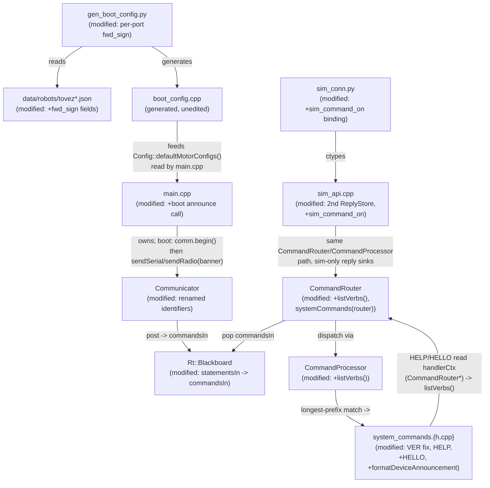

<!-- CLASI: Before changing code or making plans, review the SE process in CLAUDE.md -->

# Architecture Update -- Sprint 088: Testing sprint: all commands functional + full test coverage + device announcement

Source documents: `docs/overview.md`, `docs/architecture.md` (consolidated,
but pre-077 -- see Grounding below), `docs/architecture/architecture-update-087.md`
(the current, load-bearing description of the runtime tier this sprint
touches), the six sprint issues linked in `sprint.md`, and direct reads of
`source/commands/{system_commands,command_processor}.{h,cpp}`,
`source/runtime/{blackboard,command_router}.{h,cpp}`,
`source/subsystems/{communicator,statement}.h`, `source/main.cpp`,
`scripts/gen_boot_config.py`, `data/robots/tovez*.json`,
`tests/_infra/sim/sim_api.cpp`, `host/robot_radio/io/sim_conn.py`,
`tests/CLAUDE.md`, and `pyproject.toml`, performed during this planning pass
(2026-07-07).

## Grounding in the current tree -- read this first

- **`docs/architecture.md` is stale relative to the current tree.** It
  describes the pre-077 `Robot`/`CommandProcessor`/`Announcer` design
  (single-class `Robot` owning all subsystems, an `Announcer` class). The
  current tree (confirmed by direct read) has no `Robot` class and no
  `Announcer` class; it has `Subsystems::{Drivetrain, PoseEstimator,
  Planner, Hardware, Communicator}`, `Rt::{Blackboard, CommandRouter,
  Configurator, MainLoop}`, and the six pointerless command-family
  translators under `source/commands/`, per sprint 087's own architecture
  update. This document follows the **current**, sprint-087-verified
  naming, not `docs/architecture.md`'s superseded one -- consistent with
  087's own note that a future `consolidate-architecture` pass still owes
  `docs/architecture.md` a refresh.
- **`VER` and `PING` are structurally identical at every layer this
  planning pass could inspect.** Confirmed by direct read of
  `system_commands.cpp:31-55` (both handlers: no schema, no parseFn, one
  `snprintf` into a stack buffer, one `replyOK` call) and
  `command_processor.cpp`'s `dispatchTable()`/`prefixMatchLen()` (exact
  token match, no substring/prefix-collision path for a 3-token verb like
  `VER`). `FIRMWARE_VERSION`/`PROTO_VERSION` (`types/protocol.h:17,31`,
  `types/version_generated.h`) are ordinary constants with no formatting
  hazard. No compile-time or dispatch-table defect was found by static
  reading -- Step 7 carries this forward as a bisection requirement for
  ticket execution, not a solved bug.
- **The wheel-polarity bug is a config-generation gap, not a runtime
  defect.** Confirmed by direct read of `scripts/gen_boot_config.py:71-74,
  258-266`: `FWD_SIGN = 1` is applied to every port unconditionally, while
  the adjacent `travel_calib_for_ports()` (lines 176-194) already
  demonstrates the exact per-port, JSON-sourced-with-placeholder-fallback
  pattern the fix needs -- confirmed `data/robots/tovez_nocal.json`'s
  `calibration` block has `mm_per_wheel_deg_left/right` but no per-port
  sign field yet. `msg::MotorConfig::fwd_sign` itself (consumed by
  `NezhaMotor`) is unchanged and already correct; only the generator's
  input is wrong.
- **`HELP`'s handler has no path to the live table.** Confirmed:
  `system_commands.cpp:129-137`'s `systemCommands()` takes no arguments and
  is called as `systemCommands()` (no `router`) at
  `command_router.cpp:25`, while the other six families are already called
  as `family(router)` (lines 27-38) and their headers already
  `#include "runtime/command_router.h"` and take `Rt::CommandRouter&`
  (confirmed via `dev_commands.h:121,184`). `system_commands.h` has no such
  include today -- `systemCommands()` is the one family that never joined
  this pattern.
- **The device-announcement hook point is exactly where the issue says.**
  Confirmed `main.cpp:104-106`: `comm.begin()` runs once, standalone,
  before the `ROBOT_DEV_BUILD` hardware block and before any
  `CommandRouter`/`Configurator` exists. `Communicator::sendSerial()`/
  `sendRadio()` (`communicator.h:91-92`) are already public primitives
  requiring no new Communicator capability -- only a new caller.
- **The "statement" identifier is load-bearing and pervasive in the tier
  087 just built.** Confirmed 101 occurrences of `statement`/`Statement`
  in `source/` (17 files) and 1 in `host/` by direct grep. The heaviest
  concentrations are `source/subsystems/communicator.{h,cpp}` (the
  produced-edge type and its held/taken accessors), `source/runtime/
  {blackboard.h, command_router.{h,cpp}}` (the queue cell and the
  parameter/comment names), and `source/subsystems/statement.h` (the
  edge-type definition itself, extracted in ticket 087-002 specifically so
  a host-safe `Rt::Blackboard` could name it without pulling in
  `MicroBit.h`).
- **The sim harness's channel collapse is real and precisely as the issue
  describes.** Confirmed `tests/_infra/sim/sim_api.cpp:230`:
  `router.setReplyChannels(storeReply, &syncStore, storeReply, &syncStore)`
  -- one `ReplyStore` instance bound to both of `CommandRouter`'s reply
  channels -- and `sim_command()` (line ~301) hardcodes
  `stmt.returnPath = Subsystems::Channel::SERIAL`. `tests/sim/unit/`
  already holds 44 test files totaling roughly 183 test functions
  (counted directly from each file's `def test_` occurrences) sharing this
  same synchronous `sim_command()`-backed fixture entry point -- any fix
  must not force every existing call site to change.
- **`pyproject.toml`'s `testpaths` already lists `tests/sim`, `tests/unit`,
  and `tests/testgui` as three separate collected roots** (confirmed,
  `pyproject.toml:111`), and `tests/CLAUDE.md` documents `tests/unit/` as
  "host-side unit tests that aren't scenario/domain-specific ... Skeleton
  only" -- i.e. it has no firmware/sim dependency today. This resolves the
  smoke-suite issue's own open question (Design Rationale, Decision 6,
  below).

## Step 1: Understand the Problem

Seven gaps block the stakeholder's bar ("all commands are there, and they
work"): three small firmware defects in the liveness/identity command
family (`VER` no-reply, `HELP`'s hardcoded list, no device-identity
announcement), one config-generation defect (uniform `fwd_sign` on a
mirror-mounted drive pair), one large but purely mechanical identifier
rename the stakeholder has mandated (statement -> command/message), and two
testing-infrastructure gaps (the sim harness cannot distinguish SERIAL from
RADIO; there is no smoke/completeness coverage of the registered command
table, no closing bench proof).

**What changes this sprint:** `source/commands/system_commands.{h,cpp}`
(VER fix, HELP gains live-table access, new HELLO handler, new shared
`formatDeviceAnnouncement()` helper), `source/commands/command_processor.
{h,cpp}` (new narrow verb-enumeration accessor), `source/runtime/
command_router.{h,cpp}` (forwarding accessor, `systemCommands()` joins the
existing six-family `(router)` call pattern), `source/main.cpp` (one new
boot-time announcement call), `scripts/gen_boot_config.py` +
`data/robots/tovez*.json` (per-port `fwd_sign`), a sprint-wide identifier
rename (`statement`/`Statement` -> `command`/`Command` for the wire-inbound
edge, everything else already `message`/`msg::*`), `tests/_infra/sim/
sim_api.cpp` + `host/robot_radio/io/sim_conn.py` (channel-distinct reply
sinks, a new `sim_command_on()` entry point), and new test content under
`tests/sim/unit/`. **What does not change in kind:** no new runtime module
is introduced -- every firmware change is a modification to an existing
component (`system_commands.*`, `command_processor.*`, `command_router.*`,
`communicator.*`, the config generator); the control/subsystem tier
(`Drivetrain`, `PoseEstimator`, `Planner`, `Hardware`, `Blackboard`,
`Configurator`) is untouched except for the identifier rename, which is
behavior-preserving by construction.

## Step 2: Identify Responsibilities

| Responsibility | Changes independently because... |
|---|---|
| **Liveness/identity command correctness** -- `VER` actually replies, `HELP` enumerates the live table, a `DEVICE:` banner is announced on boot and `HELLO`. | All three live in the same existing family (`system_commands.{h,cpp}`) and change for the same reason (make the liveness/identity family honest and complete) -- but are independently testable/shippable defects, not one coupled change. |
| **Wheel-polarity config generation** -- per-port `fwd_sign` baked from the robot JSON instead of a blanket `+1`. | A build-time config-generation concern (`scripts/gen_boot_config.py` + `data/robots/*.json`), unrelated to runtime command dispatch; changes only when boot-config mapping rules change. |
| **Command/message vocabulary** -- remove `statement`/`Statement`; wire-inbound = command, internal = message. | Triggered purely by a stakeholder naming decision, orthogonal to any behavior; touches many existing modules' identifiers without changing any module's boundary or behavior. |
| **Command-surface test observability** -- the sim harness can select and observe a reply on a specific channel. | Pure testing infrastructure (`tests/_infra/sim/sim_api.cpp`, `host/robot_radio/io/sim_conn.py`); changes only when the harness's own capabilities change, decoupled from firmware runtime behavior. |
| **Command-surface test content** -- smoke coverage of every registered command, a completeness guard, and behavioral coverage of the subsystems backing motion/config commands. | Pure test content (`tests/sim/unit/*.py`); changes only as commands/subsystems are added or gain new behavior to prove. |
| **On-stand functional verification** -- proving motion/config commands work on real hardware via encoders. | A process/acceptance concern (a bench checklist), not a module; depends on the wheel-polarity fix and the rename landing first, but is not itself a code change. |

Grouping: the first three rows above are each realized as **modifications
to existing modules**, not new components (Step 3). The fourth and fifth
rows are test-only changes with no `source/` behavior impact. The sixth is
a sprint-closing procedure, not a module -- covered in Migration Concerns.

## Step 3: Subsystems and Modules

Every module below already exists; none is new this sprint.

| Module | Purpose (one sentence) | Boundary | Use cases served |
|---|---|---|---|
| `source/commands/system_commands.{h,cpp}` (**modified**) | Answer firmware liveness/identity queries (`PING`, `VER`, `HELP`, `ECHO`, `ID`, `HELLO`). | Inside: the six handler bodies, the shared `formatDeviceAnnouncement()` helper. Outside: tokenization/dispatch (`CommandProcessor`'s job), any subsystem state (this family holds zero `Subsystems::*`/`Rt::Blackboard` references, unchanged). | SUC-002, SUC-003, SUC-004 |
| `source/commands/command_processor.{h,cpp}` (**modified**) | Dispatch one tokenized wire line to its longest-matching registered descriptor. | Inside: `parseTokens`/`dispatchTable`/`prefixMatchLen`, the new narrow `listVerbs(buf, size)` accessor (joins registered descriptor prefixes). Outside: what a handler does with parsed args, which descriptors exist. | SUC-003 |
| `source/runtime/command_router.{h,cpp}` (**modified**) | Translate one parsed wire command into typed posts on the right blackboard queue(s), or (for the liveness family) a direct reply. | Inside: the forwarding `listVerbs()` accessor, `systemCommands(router)` joining the existing six-family construction pattern. Outside: unchanged -- still holds the one `CommandProcessor` and the reply-channel resolution logic. | SUC-002, SUC-003, SUC-004 |
| `source/main.cpp` (**modified**) | Construct every subsystem once, bring up comms, run the loop. | Inside: one new call (format + send the boot announcement on both channels, right after `comm.begin()`). Outside: everything else, unchanged. | SUC-004 |
| `source/subsystems/communicator.{h,cpp}` (**modified, renamed identifiers only**) | Own the comms drivers, turning "a complete wire line arrived" into a held, takeable edge. | Inside: unchanged behavior; `hasStatement()`/`takeStatement()` -> `hasCommand()`/`takeCommand()`, `CommunicatorToCommandProcessorStatement` -> `CommunicatorToCommandProcessorCommand`. Outside: unchanged (still no command-in channel; still a source, not a sink). | SUC-005 |
| `source/subsystems/statement.h` -> **renamed** `source/subsystems/wire_command.h` | Define the host-safe, CODAL-free wire-inbound edge type `Subsystems::Channel` / `Subsystems::CommunicatorToCommandProcessorCommand`. | Inside: the two-field POD and the channel enum. Outside: everything else -- unchanged host-safety rationale (087's Decision 10). | SUC-005 |
| `source/runtime/blackboard.h` (**modified, renamed identifiers only**) | Own the committed state-plane snapshot and every command-plane queue. | Unchanged shape; `statementsIn` -> `commandsIn`. | SUC-005 |
| `scripts/gen_boot_config.py` + `data/robots/tovez*.json` (**modified**) | Bake per-robot boot configuration from the robot JSON into generated C++. | Inside: a new `fwd_sign_for_ports()` mirroring the existing `travel_calib_for_ports()` left/right-with-placeholder pattern. Outside: `boot_config.cpp` itself (generated, never hand-edited), `NezhaMotor`'s consumption of `fwd_sign` (already correct). | SUC-001 |
| `tests/_infra/sim/sim_api.cpp` (**modified**) | Bridge Python ctypes calls to the firmware sim build for host-side testing. | Inside: a second, channel-distinct `ReplyStore`; a new `sim_command_on(h, line, channel, reply, size)` entry point. Outside: `sim_command()` stays a SERIAL-only convenience wrapper -- every existing call site is unaffected. | SUC-006 |
| `host/robot_radio/io/sim_conn.py` (**modified**) | ctypes bindings the Python test suite calls into the sim harness through. | Inside: the new `sim_command_on` binding + channel constants. Outside: everything else, unchanged. | SUC-006 |
| `tests/sim/unit/` (**new test content, no new module**) | House the per-command smoke suite, its completeness meta-test, and new/expanded behavioral coverage. | Inside: test files only. Outside: no `source/` behavior. | SUC-007, SUC-008 |
| `.claude/rules/naming-and-style.md` (**modified, rule text**) | State the project's naming conventions. | Rule 4's payload vocabulary rewritten (Design Rationale, Decision 1). | SUC-005 |

Every module addresses at least one SUC (`usecases.md`); every SUC is
addressed by at least one module (SUC-009, the bench-verification use
case, is a procedure covered in Migration Concerns, not a module -- by
design, since it produces no `source/` change). No module's one-sentence
purpose needs "and." No new dependency cycle -- see Step 4.

## Step 4: Diagrams

### Component / module diagram

Shows the liveness/identity command path (this sprint's densest cluster of
change) plus the config-generation and sim-harness paths. Existing,
unmodified subsystems below the command tier (`Drivetrain`, `PoseEstimator`,
`Planner`, `Hardware`, `Configurator`) are omitted -- this sprint does not
touch them (087's diagram already covers that tier and is unchanged).

11 nodes, all pre-existing components except the generated-file leaf
(`boot_config.cpp`, itself unchanged in kind -- still generated, never
hand-edited). No new box; every edge already existed in shape (the
`SysCmd -> Router` edge is the one genuinely new dependency, matching the
pattern the other six command families already have -- see below).

### Entity-relationship diagram

Not included -- no data model or wire schema changes this sprint.
`CommunicatorToCommandProcessorCommand` is a rename of
`CommunicatorToCommandProcessorStatement` with the same two fields (`line`,
`returnPath`); `msg::*` schemas are untouched; the new `fwd_sign` JSON
fields are scalar additions to an existing per-port config table, not a
new entity or relationship.

### Dependency graph

Not shown as a separate diagram -- the only dependency-direction change is
`system_commands.{h,cpp}` gaining a dependency on `runtime/command_router.h`
(confirmed via the Grounding section: `dev_commands.h` already
`#include`s it and takes `Rt::CommandRouter&`; `system_commands.h` is the
one family that had not yet joined that pattern). This is an existing edge
shape applied to the seventh family, not a new direction: `commands/*` ->
`runtime/` (CommandRouter, transport-only) -> nothing further (system
commands read no `Subsystems::*`/`Blackboard` state; `HELP`/`HELLO` only
call `router.listVerbs()`, a narrow, non-blackboard accessor). No cycle:
`command_router.h` does not, and will not, include `system_commands.h`
(only `command_router.cpp` does, a `.cpp`-only include that cannot
participate in a header cycle).

## Step 5: What Changed, Why, Impact, Migration Concerns

### What Changed

- **`source/commands/system_commands.{h,cpp}`** -- `handleVer`'s dispatch
  path is bisected against `handlePing`'s during ticket execution (root
  cause not resolved by static reading, Grounding above); `handleHelp`
  reads the live table via the new `CommandRouter::listVerbs()` accessor
  instead of a literal string; a new `handleHello` mirrors `handleId`'s
  bare-reply style (`replyFn(banner, replyCtx)`, no `OK`/`ERR` wrapper); a
  new shared `formatDeviceAnnouncement(char* buf, int size)` free function
  (same `#ifdef HOST_BUILD` identity-source branch `handleId` already
  uses) is called by both `handleHello` and `main.cpp`'s boot sequence.
  `systemCommands()` becomes `systemCommands(Rt::CommandRouter& router)`,
  joining the other six families' construction signature; only `HELP`'s
  descriptor binds `handlerCtx = &router` (every other liveness handler's
  `handlerCtx` stays `nullptr`, unchanged).
- **`source/commands/command_processor.{h,cpp}`** -- new
  `int listVerbs(char* buf, int size) const`, iterating `_cmds` and joining
  each descriptor's `prefix` space-separated (mirrors `HELP`'s own
  pre-existing body-construction style; keeps `_cmds` private).
- **`source/runtime/command_router.{h,cpp}`** -- new forwarding
  `int listVerbs(char* buf, int size) const { return processor_.listVerbs(buf, size); }`;
  `buildTable()`'s `all = systemCommands()` becomes
  `all = systemCommands(router)`.
- **`source/main.cpp`** -- one new call sequence immediately after
  `comm.begin()`: format the announcement into a stack buffer, send it on
  both `comm.sendSerial()` and `comm.sendRadio()`.
- **`scripts/gen_boot_config.py`** -- new `fwd_sign_for_ports(cfg)`,
  mirroring `travel_calib_for_ports(cfg)`'s exact shape: reads
  `calibration.fwd_sign_left`/`fwd_sign_right` from the robot JSON when
  present, falls back to the existing `FWD_SIGN = 1` placeholder for every
  other port. `data/robots/tovez.json` and `tovez_nocal.json` gain those
  two fields once the physically-reversed port is identified on the bench
  (Step 7, Open Question 2) -- the generator change lands first and is
  correct with either value.
- **Renamed (identifiers only, no behavior change) across ~85 `source/`
  sites and 1 `host/` site:** `Subsystems::CommunicatorToCommandProcessorStatement`
  -> `Subsystems::CommunicatorToCommandProcessorCommand`;
  `source/subsystems/statement.h` -> `source/subsystems/wire_command.h`;
  `Communicator::hasStatement()`/`takeStatement()` ->
  `hasCommand()`/`takeCommand()`; `Rt::Blackboard::statementsIn` ->
  `commandsIn`; every comment across `command_processor.*`,
  `dev_commands.h`, `motion_commands.h`, `telemetry_commands.cpp`,
  `radio.h`, `nezha_motor.cpp`, `main.cpp`, `main_loop.{h,cpp}`,
  `commands.h` that describes the removed "statement" concept, reworded to
  "command" (wire-inbound) or "message" (internal `msg::*`) as the comment
  actually meant; `host/robot_radio/io/preview.py:5`'s comment.
- **`.claude/rules/naming-and-style.md` rule 4** -- rewritten (Design
  Rationale, Decision 1).
- **`tests/_infra/sim/sim_api.cpp`** -- `SimHandle` gains a second
  `ReplyStore` (`syncStoreSerial`/`syncStoreRadio` naming, replacing the
  single `syncStore`); `router.setReplyChannels()` wires each store to its
  matching channel instead of both to one store; new
  `int sim_command_on(void* h, const char* line, int channel, char* reply, int size)`
  sets `stmt.returnPath` from the `channel` argument and reads the
  matching store. `sim_command()` becomes a thin wrapper:
  `sim_command_on(h, line, /*SERIAL*/ 1, reply, size)` -- every existing
  call site is source-compatible and unaffected.
- **`host/robot_radio/io/sim_conn.py`** -- new `sim_command_on` ctypes
  binding (`argtypes`/`restype` matching `sim_command`'s pattern plus one
  `c_int` channel argument) and `CHANNEL_SERIAL`/`CHANNEL_RADIO` constants
  mirroring `Subsystems::Channel`'s enum values.
- **New test content under `tests/sim/unit/`** -- one smoke-test function
  per registered command (both channels), a completeness meta-test
  (enumerates the live table the same way `HELP` now does and fails on any
  gap), and behavioral-coverage additions/extensions for the motion/config
  command families where a gap exists (existing files like
  `test_motion_commands.py`, `test_drivetrain.py`, `test_configurator.py`
  are extended, not replaced).
- **`tests/bench/`** -- existing/refreshed CLI tools drive the on-stand
  verification pass; no new tool is architecturally required beyond what
  `tests/CLAUDE.md` already documents (`DEV` family exercise scripts).

### Why

The liveness/identity fixes (VER, HELP, HELLO) all live in one existing,
already-cohesive family and are grouped there rather than spread out,
keeping `system_commands.{h,cpp}` the single place "does the robot
correctly answer who/what/how-alive-am-I" questions get read or changed.
The wheel-polarity fix stays a config-generation change, not a runtime
one, because `msg::MotorConfig::fwd_sign` and `NezhaMotor`'s consumption of
it are already correct -- the bug is entirely in what boot config bakes,
so the single-sourced fix is to make the generator port-aware, matching
the pattern its own neighbor function already established. The rename is
mechanical by design (Decision 1) -- it changes names, not behavior, and
every renamed identifier is a private testable no-op if the rename is
complete. The sim-harness extension is required infrastructure, not
optional polish: without a channel-distinct reply sink, no test can
actually prove a command dispatches correctly on radio, only that a
`Channel::RADIO`-tagged struct field can be set.

### Impact on Existing Components

| Component | Impact |
|---|---|
| `source/commands/system_commands.{h,cpp}` | **Modified.** New `#include "runtime/command_router.h"`; `systemCommands()` gains a parameter; `HELP`/`HELLO` handlers change; new shared helper. Wire-level behavior of `PING`/`ECHO`/`ID` unchanged. |
| `source/commands/command_processor.{h,cpp}` | **Modified.** New narrow read-only accessor; `_cmds` stays private; dispatch logic untouched. |
| `source/runtime/command_router.{h,cpp}` | **Modified.** New forwarding accessor; one call-site signature change in `buildTable()`. |
| `source/main.cpp` | **Modified.** One new call sequence after `comm.begin()`; everything else unchanged. |
| `source/subsystems/communicator.{h,cpp}` | **Modified (renamed identifiers only).** Held-output contract, polling order, backpressure behavior all unchanged -- this is a pure rename, confirmed by the "no behavior change" acceptance criterion in SUC-005. |
| `source/subsystems/statement.h` | **Renamed** to `source/subsystems/wire_command.h`; struct fields unchanged. |
| `source/runtime/blackboard.h` | **Modified (renamed identifier only).** `WorkQueue<..., 16>` capacity/semantics unchanged. |
| `scripts/gen_boot_config.py`, `data/robots/tovez*.json` | **Modified.** New per-port fwd_sign mapping function + two new JSON fields; every other generated field unchanged. |
| `source/config/boot_config.cpp` | **Unaffected as hand-written code** (it is never hand-edited); its generated content changes the next time `gen_boot_config.py` runs, per its own "regenerated before each build" contract. |
| `tests/_infra/sim/sim_api.cpp` | **Modified.** `SimHandle` gains one field; `sim_command()` becomes a wrapper; every existing test using `sim_command()` is unaffected. |
| `host/robot_radio/io/sim_conn.py` | **Modified.** New binding added; existing bindings unchanged. |
| `docs/protocol-v2.md` | **Modified (docs, not code).** Re-adds `HELLO` and the boot `DEVICE:` announcement (both currently listed as removed under v2) -- explicitly called out in the device-announcement issue. |
| `.claude/rules/naming-and-style.md` | **Modified.** Rule 4 rewritten (Decision 1). |
| `docs/architecture.md` | **Unaffected as a file this sprint** (it is already stale pre-077, per Grounding) -- a future `consolidate-architecture` pass still owes it a full refresh; this sprint does not attempt that. |
| `Subsystems::{Drivetrain, PoseEstimator, Planner, Hardware, Configurator}` | **Unaffected in behavior.** Any `statement`/`Statement` text in their comments (none found holding the identifier itself; `dev_commands.h`/`motion_commands.h`/`telemetry_commands.cpp` carry the comment-level references) is reworded, not restructured. |

### Migration Concerns

- **No wire/data migration.** The `DEVICE:` banner format is a stakeholder
  decision already fixed in the issue (`NEZHA2`/`robot` tokens, matching
  the host's existing parsers/cache exactly); `HELLO`'s reply shape mirrors
  the pre-v2 firmware's own format. No `msg::*` field changes, no
  persisted-config schema break (the two new JSON fields are additive and
  optional, matching every other field in `travel_calib_for_ports()`'s
  pattern).
- **Sequencing: rename before the harness/test work; the wheel fix and the
  rename before the bench pass.** The statement->command/message rename
  should land early (Wave 2) so `tests/sim/unit/`'s new smoke/completeness
  tests, written later in the sprint, reference final identifier names
  from the start rather than needing a second pass. The wheel-direction
  fix (Wave 1) and the rename (Wave 2) must both be merged before the
  on-stand bench pass (Wave 4, sequenced last): a straight-drive
  verification attempted before the wheel fix lands would read as a
  failure for the wrong reason, and any bench script referencing renamed
  identifiers must target their final names.
- **The sim-harness extension (Wave 3) is a prerequisite for the smoke
  suite, not parallel work.** `sim_command_on()` must exist and be proven
  channel-distinct before the per-command smoke tests are written against
  it.
- **No deployment-sequencing concern beyond the standing hardware-bench
  gate** (`.claude/rules/hardware-bench-testing.md`) -- this sprint's own
  closing acceptance bar (SUC-009) already requires exactly that gate,
  extended (per the sprint's own mandate) to explicitly include radio
  relay for the commands practical to test that way, not serial-only.
- **`docs/protocol-v2.md` update is in scope; `docs/architecture.md`'s full
  refresh is not** (Impact table, above) -- do not let this sprint's rename
  and additions balloon into an unplanned architecture-document
  consolidation.

## Step 6: Design Rationale

### Decision 1: The wire-inbound edge is renamed to end in `...Command`; pre-existing `...Command`-suffixed internal payload types are grandfathered, not touched

**Context.** The stakeholder's new vocabulary is: things arriving over
radio/serial are "commands"; internal typed representations are
"messages." But the codebase already uses "Command" as an edge-type
payload suffix to mean something different: `Hal::DrivetrainToHardwareCommand`
and similar edges carry a *parsed* `msg::*Command` struct (an internal
message whose own type happens to be named `...Command`, e.g.
`msg::MotorCommand` -- "a command telling the motor what speed to be").
Renaming `CommunicatorToCommandProcessorStatement` to end in `...Command`
too creates one word, "Command," meaning two different things depending on
which edge you're looking at: "one raw wire line" (the newly-renamed edge)
vs. "carries a parsed `msg::*Command` struct" (every pre-existing
`...Command` edge).

**Alternatives considered:** (a) rename the wire-inbound edge to something
that avoids the overload entirely, e.g. `CommunicatorToCommandProcessorLine`
or `...RawCommand`; (b) accept the overload, rename to
`CommunicatorToCommandProcessorCommand` (the issue's own suggested
example) -- **chosen**; (c) additionally rename every pre-existing
`...Command`-suffixed internal edge to `...Message` for full consistency,
eliminating the overload at the cost of a much larger sweep.

**Why this choice.** (b) is the issue's own explicit suggestion and, more
importantly, is the most consistent choice available given the rest of the
codebase's existing vocabulary: `CommandProcessor`, `CommandRouter`,
`CommandDescriptor`, "command table," "registered command," "command
family" -- the whole liveness/dispatch layer already calls the wire verb a
"command," independent of this rename. Calling the raw line anything other
than "command" (option a) would put it at odds with the vocabulary
everywhere else in the same file. Option (c) is explicitly out of the
issue's stated scope (it lists ~85 sites, all under the `statement` word
itself, never `Hal::DrivetrainToHardwareCommand` or `msg::MotorCommand`)
and would roughly double this sprint's rename footprint for a consistency
gain that does not block any acceptance criterion. The raw-vs-parsed
distinction the old "Statement" word carried is preserved structurally,
not lexically: the renamed type's own shape (`char line[256]` + `Channel
returnPath`) already signals "this is an unparsed line," and its doc
comment says so explicitly -- exactly the way `msg::MotorCommand`'s own
struct definition (typed fields, no raw buffer) signals "this is parsed."

**Consequences.** "Command" is now a legitimately overloaded edge-payload
word in the codebase: `CommunicatorToCommandProcessorCommand` (a raw wire
line) vs. `Hal::DrivetrainToHardwareCommand` (a parsed `msg::*` struct).
This is documented explicitly here and in the rewritten naming rule (rule
4) so a future reader is not confused into thinking the two are the same
shape. Step 7 flags unifying the vocabulary (renaming the older edges to
`...Message`) as a possible future issue, not resolved here.

### Decision 2: HELP's live-table access is a narrow `listVerbs()` accessor threaded through the existing six-family `(router)` construction pattern, not a new registry or a second table

**Context.** `HELP` needs to enumerate the full registered command table,
but `systemCommands()` builds its descriptors before any `CommandProcessor`
exists (the descriptors are the input to `CommandProcessor`'s constructor),
and the six other command families already solve an analogous problem
(reaching shared runtime state from a `handlerCtx`) via `Rt::CommandRouter&`.

**Alternatives considered:** (a) a second, separately-maintained verb list
`HELP` reads from -- rejected outright, it is the exact defect being
fixed; (b) a global/static registry populated during table construction --
rejected, introduces global mutable state with no ownership story, the
class of thing sprint 087 spent an entire sprint removing from this tier;
(c) give `systemCommands()` a `Rt::CommandRouter&` parameter (joining the
other six families) and add one narrow, read-only accessor from
`CommandProcessor` up through `CommandRouter` -- **chosen**.

**Why this choice.** (c) reuses a pattern already proven correct for six
other families rather than inventing a seventh mechanism for the same
problem shape ("a handler needs to reach shared runtime state"). The
accessor is narrow (`listVerbs(buf, size)`, one method, no iterator/vector
exposed) so `CommandProcessor::_cmds` stays private -- consistent with
every other cross-boundary read in this tier going through a single-method
interface rather than a leaked internal collection.

**Consequences.** `system_commands.h` gains a real (not forward-declared)
dependency on `runtime/command_router.h`, matching every other command
family -- not a new dependency direction, just the seventh instance of an
existing one (Step 4).

### Decision 3: The device-announcement banner is a shared free function in `system_commands.{h,cpp}`, not a revived `Announcer` class

**Context.** The stale `docs/architecture.md` describes a dedicated
`Announcer` class from the pre-077 design. The issue's own recommended
hook is `Communicator::begin()`, using `Communicator`'s existing
`sendSerial()`/`sendRadio()` primitives.

**Alternatives considered:** (a) revive a dedicated `Announcer`
subsystem/class; (b) put the formatting+send logic directly inside
`Communicator::begin()`; (c) a shared free function living beside the
other identity-formatting code (`system_commands.cpp`'s `handleId`),
called once by `main.cpp` at boot and once by the new `HELLO` handler --
**chosen**.

**Why this choice.** A whole class for one line of wire format and two
call sites is speculative generality -- there is no other work in this
sprint, or visibly on the near-term roadmap, that would grow into needing
a dedicated `Announcer`. Option (b) was rejected because `Communicator`
does not otherwise know firmware identity (`microbit_friendly_name()`/
`microbit_serial_number()`) or the `DEVICE:` wire format -- that knowledge
already lives in `system_commands.cpp`'s `handleId`, and duplicating it
into `Communicator` would split one concept (how the firmware describes
its own identity on the wire) across two files. Option (c) keeps that
knowledge in one place (system/liveness commands own identity-formatting)
while `Communicator` keeps owning only transport primitives, matching each
component's existing one-sentence purpose without inventing a new one.

**Consequences.** `main.cpp` calls a free function from
`commands/system_commands.h` at boot, a small but real dependency
(`main.cpp` already depends on far more of `commands/`, so this adds no
new dependency direction). If a genuine second identity-announcement
concern ever appears, promoting this helper into a small class remains
available with no interface break to `Communicator` or any command
family.

### Decision 4: Per-port `fwd_sign` lives in the same generator mapping as `travel_calib`, not a second polarity knob on `DrivetrainConfig`

**Context.** The issue names two candidate homes for wheel polarity:
`MotorConfig::fwd_sign` (already exists, already correctly consumed by
`NezhaMotor`) baked per-port by the generator, or a new
`DrivetrainConfig::fwd_sign_l/fwd_sign_r` pair.

**Alternatives considered:** (a) add `DrivetrainConfig::fwd_sign_l/r`,
applied at the drivetrain layer; (b) make the generator port-aware for the
existing `MotorConfig::fwd_sign`, mirroring `travel_calib_for_ports()` --
**chosen**.

**Why this choice.** `fwd_sign` is a per-motor hardware-mounting fact
(which way is "forward" for *this physical shaft*), which is exactly what
`MotorConfig::fwd_sign` already models and `NezhaMotor` already applies
correctly to both the drive command and the encoder reading (confirmed by
direct read, Grounding). The defect is entirely that the generator writes
the same value to every port. Adding a second, drivetrain-layer polarity
knob would create two places a wheel's sign could be set (per-motor
`fwd_sign` and a new per-pair `fwd_sign_l/r`), an ownership/consistency
risk with no corresponding benefit -- the single-sourced fix is to make
the *generator* port-aware, reusing the exact pattern its neighbor
function already established for a structurally identical problem
(per-port value, JSON-sourced when present, placeholder otherwise).

**Consequences.** No `msg::*` schema change. The concrete sign value for
each port is a bench fact (which physical motor is mirror-mounted),
determined during ticket execution, not this planning pass (Step 7).

### Decision 5: `sim_command()` stays a SERIAL-only wrapper over a new channel-aware `sim_command_on()`

**Context.** A large share of the ~183 existing test functions across
`tests/sim/unit/` (Grounding, above) call `sim_command()` today with no
channel argument.

**Alternatives considered:** (a) add a channel parameter to
`sim_command()` itself, updating every call site; (b) add a new
`sim_command_on()` entry point and keep `sim_command()` as a thin
SERIAL-only wrapper over it -- **chosen**.

**Why this choice.** (a) would touch a large fraction of `tests/sim/unit/`'s
~183 test functions for a capability only the new smoke suite actually
needs, a large, purely-mechanical diff with no behavioral benefit to the
tests that don't care about channel selection. (b) adds the new capability
additively -- every existing test keeps compiling and passing unmodified,
and the new smoke suite is the only caller that needs to reach for
`sim_command_on()`.

**Consequences.** Two C-ABI entry points to maintain instead of one, a
small, explicitly-accepted mechanism-count increase in exchange for zero
churn on the existing suite.

### Decision 6: The smoke suite and new behavioral coverage land in `tests/sim/unit/`, not the top-level `tests/unit/`

**Context.** The smoke-test issue states the stakeholder said "tests/unit,"
but `pyproject.toml` already collects `tests/sim`, `tests/unit`, and
`tests/testgui` as three separate roots, and `tests/CLAUDE.md` describes
`tests/unit/` as host-only tests with no firmware/sim dependency
(confirmed still a near-empty skeleton).

**Alternatives considered:** (a) create the smoke suite under the
top-level `tests/unit/`, extending its scope to include firmware-dependent
tests; (b) place it in `tests/sim/unit/`, alongside the existing
command-family tests it is a direct sibling of (`test_motion_commands.py`,
`test_otos_commands.py`, `test_protocol_roundtrips.py`) -- **chosen**.

**Why this choice.** The smoke suite fundamentally needs the ctypes-loaded
firmware sim harness (`tests/_infra/sim/`), which only `tests/sim/`'s
`conftest.py` and fixtures wire up. Placing a firmware-dependent suite
under `tests/unit/` would blur a boundary `tests/CLAUDE.md` states
explicitly (`tests/unit/` = "host-side unit tests that aren't
scenario/domain-specific," i.e. no firmware dependency) for the sake of
matching a casual stakeholder phrasing rather than the actual repo
structure. `tests/sim/unit/` is both collected today and the direct
sibling of every test the smoke suite most resembles.

**Consequences.** None beyond the naming reconciliation itself -- both
paths are already collected by `pytest`, so this is purely a "where does
the file live" choice with no gate/CI change required.

## Step 7: Open Questions

1. **`VER`'s root cause.** Static reading found no defect -- `VER` and
   `PING` are byte-for-byte structurally identical through tokenization,
   prefix matching, and reply construction. The ticket that fixes this
   must bisect on-target (pyOCD/gdb, per `.claude/rules/debugging.md`) if
   a source-level cause is not found by closer inspection during
   implementation.
2. **Which physical drive port is mirror-mounted.** A bench fact
   (`fwd_sign = -1` on port 1 or port 2), determined on the stand during
   ticket execution, not knowable from planning.
3. **`HELLO`'s re-announce channel scope.** This document adopts the
   issue's own recommendation (re-announce on the arriving channel only,
   matching the old firmware's serial-only precedent) as the default
   design in SUC-004. Re-announcing on *both* channels regardless of
   arrival channel remains a one-line change if reconsidered during
   implementation -- does not affect any other module's contract.
4. **Vocabulary overload (Decision 1).** Whether a future issue should
   rename the pre-existing `...Command`-suffixed internal edge types
   (`Hal::DrivetrainToHardwareCommand` and similar) to `...Message` for
   full consistency with the new command/message split is explicitly not
   resolved here -- flagged as a candidate future issue, not a defect in
   this sprint's own scope.
5. **The missing `ver-command-returns-no-reply.md` issue file.** Referenced
   in this sprint's dispatch but not present anywhere in the repo
   (confirmed: not on disk, not in git history). The bug is real and is
   investigated directly above (Grounding); the team-lead should create
   the issue file (or confirm one is intentionally not wanted) so
   `clasi/issues/` and this sprint's linkage stay consistent -- only 6 of
   the 7 referenced issues are linked in `sprint.md`.
6. **`docs/architecture.md`'s full staleness.** Already stale before this
   sprint (pre-077 `Robot`/`Announcer` design); this sprint does not
   attempt to fix it (Migration Concerns) -- a future
   `consolidate-architecture` pass still owes it a refresh, as 087's own
   architecture update already noted.

## Architecture Self-Review

**Consistency.** The "What Changed" list, the Impact table, and Step 3's
module table agree on every component -- nothing marked "modified" in one
and "unaffected" in another. Every Decision in Step 6 is referenced by
name from the Impact/Migration sections rather than re-derived. The
Grounding section's claims (VER/PING identical, HELP's missing table
access, the hook point, the rename's footprint, the sim harness's
collapsed channels, the `tests/unit` vs `tests/sim/unit` split) are each
confirmed by a specific direct read cited inline, and every one of those
claims is then acted on consistently in Steps 3, 5, and 6 -- none is
asserted once and contradicted later.

**Codebase alignment.** Every load-bearing claim in this document was
checked by direct read during this planning pass (Grounding, above), not
taken from the issues on faith: the VER/PING dispatch-path comparison, the
`fwd_sign`/`travel_calib_for_ports()` generator pattern, `HELP`'s missing
`(router)` parameter versus the other six families' existing pattern, the
exact `comm.begin()` hook line, the 101-occurrence rename footprint, the
sim harness's single shared `ReplyStore`, and `pyproject.toml`'s
`testpaths`. Where this document extends beyond what was directly
re-verified (e.g. the full 85-site enumeration from the rename issue, or
every individual comment site listed in "What Changed"), it defers to the
issue's own stated inventory rather than re-asserting unverified specifics.

**Design quality.** *Cohesion*: every modified module in Step 3 passes the
one-sentence, no-"and" test; the liveness/identity fixes stay inside the
one family that already owns "answer who/what/how-alive-am-I" questions,
resisting the temptation (Decision 3) to split identity-announcement into
a new class. *Coupling*: the one new dependency edge
(`system_commands.h` -> `runtime/command_router.h`) is the seventh
instance of an already-established pattern, not a new shape; fan-out is
unchanged everywhere else. *Boundaries*: `listVerbs()` is one narrow
method, keeping `CommandProcessor::_cmds` and `CommandRouter::processor_`
private; the rename does not cross any component boundary, only relabels
what already crosses it. *Dependency direction*: unchanged --
`commands/` -> `runtime/` -> `subsystems/` -> `messages/`, no reversal, no
new cycle (Step 4).

**Anti-pattern detection.** *God component*: none -- `system_commands.*`
gains three small handlers and one helper, still cohesive around
"liveness/identity," not accreting unrelated responsibility. *Shotgun
surgery*: the rename genuinely touches ~85+1 sites, which superficially
resembles this anti-pattern, but it is not the harmful pattern the term
describes -- a single semantic concept (one identifier's meaning) is
being intentionally, mechanically propagated with zero behavior change,
not an unrelated behavioral change scattered across modules for lack of a
proper abstraction. Called out explicitly here so a reviewer does not
mistake sprint-wide grep-and-rename breadth for a design smell. *Feature
envy*: none -- `HELP`/`HELLO` reach `CommandRouter` through one narrow
accessor, not into its private state; the generator fix reads only its
own input JSON. *Circular dependencies*: none (Step 4's dependency-graph
analysis). *Leaky abstractions*: `CommandProcessor::_cmds` and
`CommandRouter::processor_` both stay private behind `listVerbs()`.
*Speculative generality*: explicitly rejected in Decision 3 (no
`Announcer` class for a two-call-site concern) and Decision 1 (no
speculative extra rename of unrelated pre-existing `...Command` edges
beyond this issue's stated scope).

**Risks.** No data/wire migration (Migration Concerns). The rename's
principal risk is completeness, not design -- a missed identifier is a
grep-detectable, not a structural, failure, and the acceptance criterion
(SUC-005) is explicitly `grep -rn "[Ss]tatement" source/ host/` returning
nothing. `VER`'s root cause is a genuine open risk (Step 7, Item 1): if
static/on-target inspection during implementation still finds nothing,
the ticket must escalate via `systematic-debugging` rather than guess.
The wheel-polarity fix's correctness depends on an as-yet-undetermined
bench fact (which port), a normal, bounded implementation-time unknown,
not a planning gap. The sim-harness extension (Decision 5) is
low-risk by construction (additive, zero existing-test churn). Sequencing
risk (Migration Concerns) is the most concrete near-term risk and is
called out explicitly with a recommended wave order matching the
dispatch's own proposal, validated against this document's dependency
analysis.

**Verdict: APPROVE.** No structural issues: no circular dependency, no
god component, no broken interface, no inconsistency between the Sprint
Changes narrative and the document body. The rename's breadth is real but
is explicitly argued to be the acceptable, non-smell kind (Anti-Pattern
Detection, above), and the one genuine naming tension it introduces
(Decision 1's "Command" overload) is named and justified rather than
silently left for a future reader to discover. Every new dependency edge
is the extension of an already-proven pattern (Decision 2), not a new
mechanism. Proceed to ticketing once the stakeholder/team-lead has
reviewed Decision 1 (the vocabulary overload) and confirmed the missing
`ver-command-returns-no-reply.md` issue file (Step 7, Item 5) does not
block sprint execution.
