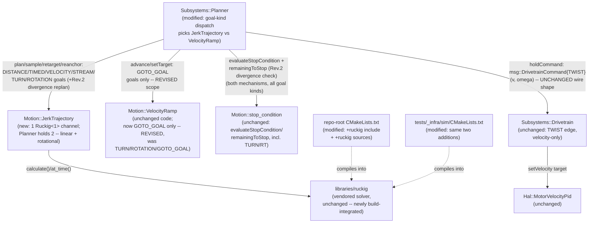

<!-- CLASI: Before changing code or making plans, review the SE process in CLAUDE.md -->

# Architecture Update -- Sprint 089: Planner motion planning via vendored Ruckig -- build integration and D/T terminal-overshoot fix

Source documents: `docs/overview.md` (stale pre-077, see Grounding), `docs/architecture.md`
(stale pre-077, per sprint 088's own note -- not refreshed by this sprint either),
`docs/architecture/architecture-update-088.md` (the current, load-bearing description
of the runtime tier this sprint touches), `clasi/issues/planner-motion-planning-via-vendored-ruckig.md`
and `clasi/issues/rt-open-loop-overshoot-under-synchronous-update.md` (both linked to
this sprint), `libraries/ruckig/README.vendored.md`, and direct reads performed during
this planning pass (2026-07-07) of `source/subsystems/planner.{h,cpp}`,
`source/motion/{velocity_ramp,stop_condition,motion_baseline}.{h,cpp}`,
`source/subsystems/drivetrain.{h,cpp}`, `source/hal/velocity_pid.cpp`,
`source/commands/motion_commands.cpp`, `source/messages/{planner,drivetrain,common}.h`,
`source/main.cpp`'s `defaultPlannerConfig()`, the repo-root `CMakeLists.txt`,
`tests/_infra/sim/CMakeLists.txt`, `tests/sim/unit/{test_ruckig_smoke.py,ruckig_smoke_harness.cpp}`,
and `libraries/ruckig/include/ruckig/{ruckig,trajectory,input_parameter}.hpp`.

## Grounding in the current tree -- read this first

- **The C++20/Ruckig-vendoring foundation is already done and committed.**
  `libraries/ruckig/` holds all 16 headers and the 11 core state-to-state
  solver `.cpp` files (cloud client / waypoints excluded, per
  `README.vendored.md`). The repo-root `CMakeLists.txt` appends
  `-std=gnu++20` (GNU extensions -- needed because Ruckig's `roots.hpp` uses
  `M_PI`, which newlib hides under strict `-std=c++20`) as the LAST `-std`
  flag, overriding the vendored CODAL target's `-std=c++11` without editing
  the fetched `target.json`. `tests/_infra/sim/CMakeLists.txt` sets
  `CMAKE_CXX_STANDARD 20` to match. `tests/sim/unit/test_ruckig_smoke.py` +
  `ruckig_smoke_harness.cpp` prove Ruckig compiles under the firmware's EXACT
  flags (`gnu++20 -fno-exceptions -fno-rtti`, `Ruckig<1>` -- no heap) and
  produces a trajectory whose sampled velocity never goes negative and whose
  final velocity is ~0 at the target position. This sprint does **not**
  redo any of that -- it builds on it.
- **Ruckig is not yet wired into either real build.** Confirmed:
  `tests/_infra/sim/CMakeLists.txt`'s `FIRMWARE_SOURCES` list has no
  `libraries/ruckig` entry and no `include_directories()` for
  `libraries/ruckig/include`; the repo-root `CMakeLists.txt`'s
  `RECURSIVE_FIND_FILE(SOURCE_FILES ... "*.cpp")` only scans
  `CODAL_APP_SOURCE_DIR` (`source/`), which does not reach
  `libraries/ruckig/src/`. Today the ONLY place Ruckig's sources are
  compiled is `test_ruckig_smoke.py`'s own ad hoc `subprocess` compile
  command -- a standalone harness, not part of either CMake target. The
  existing vendored-header-only libraries (`libraries/cmon-pid`,
  `libraries/tinyekf`) are wired in via a bare `include_directories()` call
  (repo-root `CMakeLists.txt` lines 221-226) because they have no `.cpp` to
  compile; Ruckig's 11 core sources need the same `include_directories()`
  call **plus** an explicit `list(APPEND SOURCE_FILES ...)` (or equivalent)
  in both CMake files, since `RECURSIVE_FIND_FILE`/the host build's own
  explicit `FIRMWARE_SOURCES` list never look outside `source/`.
- **`msg::PlannerConfig` already has a jerk config surface -- no proto/wire
  change needed.** Confirmed `source/messages/planner.h`: `j_max` and
  `yaw_jerk_max` fields already exist, consumed today only by
  `Motion::VelocityRamp::advance()`'s optional S-curve branch
  (`if (config_.j_max > 0.0f) { ... } else { /* pure trapezoid */ }`).
  `main.cpp`'s `defaultPlannerConfig()` sets both to `0.0f` ("trapezoid
  ramp, no S-curve, this sprint" -- ticket 084-002's own comment). This
  sprint reuses these two fields as Ruckig's per-channel `max_jerk` inputs
  (Decision 6) -- no `protos/*.proto` edit, no `scripts/gen_messages.py`
  regen.
- **The confirmed bug's mechanism is fully traced to two call sites.**
  `Planner::tick()`'s `stopping_` branch (`planner.cpp:509-521`) does
  `ramp_.setTarget(0.0f, 0.0f)` on a SMOOTH stop, and
  `VelocityRamp::advance()` (`velocity_ramp.cpp:30-65`) then chases that
  target via `approach()` -- a per-tick step-limited walk toward a literal
  velocity target of exactly 0, independent of the wheel's own physical
  coast. `Hal::MotorVelocityPid::compute()` (`hal/velocity_pid.cpp`) is
  unmodified by this sprint (confirmed by direct read: its deadband/
  integrator-freeze logic, ported byte-for-byte from `source_old` in ticket
  081-001, has no defect of its own -- the bug is entirely that the
  VELOCITY TARGET it is asked to track crosses from "still tracking a
  moving target" to "flat 0" faster than the physical wheel can coast,
  producing a large negative `err` that the PID correctly, but
  undesirably, brakes against).
- **`Planner::applyStopAnticipation()`'s dead-time-compensation precedent is
  directly relevant to this sprint's own current-state seeding design**
  (Decision 8). Its own doc comment (`planner.h:219-251`,
  `planner.cpp:336-448`) documents a prior, now-abandoned version of the
  DISTANCE/ROTATION anticipation cap that fed the CURRENTLY MEASURED wheel
  speed into the cap formula, closing a loop through the plant's own
  delayed velocity response and producing a genuine, traced limit-cycle
  oscillation (087-009's own completion notes: velocity dipped to ~0
  mid-approach, then rebounded to 72 mm/s just before the stop fired). The
  fix was to make the cap a pure function of geometry (`remaining`) and
  constants only, never of measured speed. This sprint's Ruckig
  `current_velocity`/`current_acceleration` seeding (Decision 8) applies
  the identical lesson: seed every new solve from the PLANNER'S OWN last
  commanded/sampled state, never from `leftObs`/`rightObs`.
- **`Drivetrain` has no PID and no acceleration input today.** Confirmed
  `source/subsystems/drivetrain.{h,cpp}`: `Drivetrain::apply()`'s `TWIST`
  arm reads only `msg::BodyTwist3{v_x, v_y, omega}` (a velocity twist, no
  acceleration field); `commandedWheelTargets()`/`governRatio()` produce a
  per-wheel velocity target consumed by `msg::MotorCommand::setVelocity()`;
  `Hal::MotorVelocityPid` is the only control law downstream, and it reads
  only `target`/`measured` velocity, never an acceleration feedforward.
  Extending this edge with acceleration (the issue's literal "command the
  drive frame by acceleration" framing) would touch `msg::BodyTwist3` (or a
  new companion message), `Drivetrain::apply()`/`commandedWheelTargets()`,
  `msg::MotorCommand`, and `Hal::MotorVelocityPid` -- three layers, a
  proto/codegen change, and a re-tune of a PID that 081/086/087 spent three
  sprints stabilizing. See Decision 3.
- **`Subsystems::Planner::tick()` already dispatches its per-tick math on
  goal kind/`mode_`** (the `mode_ == GO_TO && gPhase_ == PURSUE` vs.
  `mode_ != GO_TO` branch immediately before `ramp_.advance()`,
  `planner.cpp:484-505`). This is the existing seam this sprint's staged
  goal-kind migration (Decision 5) extends -- see that Decision for why the
  REVISED (stakeholder-expanded) scope keeps this a clean two-way split
  rather than needing a third branch.
- **[Revision] `msg::DriveMode` collapses `TURN`/`ROTATION` into the SAME
  wire-facing bucket as `TIMED`.** Confirmed by direct read of
  `planner.cpp`'s `velocityShapedMode()` (084-005 Decision 6): a
  `TURN`/`ROTATION` goal ALWAYS carries a built-in stop (its own
  HEADING/ROTATION stop, appended unconditionally by `handleTURN`/
  `handleRT`), so `velocityShapedMode()` always resolves it to
  `DriveMode::TIMED` -- the SAME `mode_` value a plain `T` command produces.
  `Planner::mode_` therefore CANNOT, by itself, distinguish "a `TIMED`-mode
  goal that came from `TURN`" from "one that came from `T`" at `tick()`
  time. This matters directly for Decision 5's revised scope: it is the
  reason the ORIGINAL (`D`/`T`-only) scope this document first proposed
  would have needed a new internal discriminator it never specified, and
  the reason the REVISED (stakeholder-expanded) scope does not need one.
- **[Revision] `msg::RotationGoal.angle` already exists on the wire/internal
  schema and is currently unused.** Confirmed `source/messages/planner.h`:
  `RotationGoal { float angle; float speed; }`. `handleRT`
  (`motion_commands.cpp`) already populates it correctly and signed
  (`goal.angle = static_cast<float>(relAngle) * kCdegToRad;`) before
  staging; `planner.h`'s own class comment confirms `Planner`'s `ROTATION`
  case today reads only `goal.rotation.speed` ("angle: informational only").
  `TurnGoal` has an analogous `heading` field (the ABSOLUTE target, also
  currently only informational) -- but `TURN`'s RELATIVE target delta
  (what a Ruckig position-control solve needs, Decision 9) already lives
  elsewhere: `cmd.stops_[0].a`, the built-in `STOP_HEADING` condition
  `handleTURN` always appends before staging.
- **[Revision] The 086/087 rotation-accuracy calibration surface is smaller
  than it looks.** Direct grep across `source/` for `rotation_gain_pos`/
  `rotation_gain_neg`/`rotation_offset`/`rotation_offset_neg`
  (`msg::DrivetrainConfig` fields) finds them written ONLY by
  `Rt::Configurator`'s `SET` path (`runtime/configurator.cpp:52-55`) and
  read NOWHERE else in `source/` or `tests/sim/` -- they are a
  settable-but-currently-unconsumed config surface (most likely inherited
  from `source_old`'s pre-rewrite rotation tuning, never wired into this
  tree's `Planner`/`Drivetrain`/`PoseEstimator` path). `rotational_slip`, by
  contrast, IS consumed -- but entirely inside `PoseEstimator::configure()`/
  `effectiveSlip()` (`pose_estimator.cpp:17-27`), correcting the
  encoder-differential-to-heading integration that PRODUCES
  `fusedPose.pose.h` -- upstream of, and invisible to, `Planner`/
  `Motion::stop_condition` alike. Confirmed by direct read of
  `motion/stop_condition.cpp`: `headingError()` (`TURN`'s `STOP_HEADING`)
  reads `fusedPose.pose.h` directly (already slip-corrected by the time it
  reaches `Planner`); `rotationProgress()` (`RT`'s `STOP_ROTATION`) reads
  the RAW encoder differential (`rightObs.position.val -
  leftObs.position.val`), matching `handleRT`'s own comment ("ideal
  spin-in-place geometry, no slip correction") exactly -- confirming the
  fused-heading-vs-encoder-arc distinction is real, already implemented,
  and entirely inside `motion/stop_condition.cpp`, not `Planner` itself.
  See Decision 9.
- **[Revision 2, new] `Motion::remainingToStop()` (added ticket 086-003) is
  already exactly the query this revision's divergence trigger needs, and
  already has exactly one consumer today.** Confirmed by direct read of
  `source/motion/stop_condition.h`/`.cpp`:
  `remainingToStop(cond, baseline_, leftObs, rightObs, fusedPose, &remaining)`
  returns `FIRED`/`NOT_FIRED`/`UNSUPPORTED` and writes a clamped-`>= 0`
  remaining distance (`STOP_DISTANCE`, mm), arc (`STOP_ROTATION`, mm), or
  heading error (`STOP_HEADING`, rad) -- built from the SAME per-kind
  geometry `evaluateStopCondition()` uses. Its only current caller is
  `Planner::applyStopAnticipation()` (`planner.cpp:388-392`), which this
  sprint deletes in full (ticket 005) -- so `remainingToStop()` itself is
  NOT deleted (its declaration/definition are untouched by this sprint), it
  simply loses its one caller and gains a new one: this revision's
  divergence check (Decision 10). This is exactly the "function stays, its
  old caller goes, a new caller arrives" shape, not a coincidence.

## Step 1: Understand the Problem

The Planner has no real motion plan for any goal kind: `Motion::VelocityRamp`
is a per-tick "step toward whatever the target currently is" chaser, and a
terminal stop sets that target to a literal `(0, 0)` regardless of the
wheel's actual physical coast. This produces two hardware-confirmed symptoms
on `D`/`T`: an un-shaped velocity profile (292 mm/s overshoot on a commanded
200) and a terminal reverse-spin (16-23 mm of backward travel after `EVT
done`) as the velocity PID reverse-brakes against a target that dropped to
zero faster than the wheel could coast. 086/087 patched around this
(integrator-freeze reset, closed-form stop-distance/stop-heading
anticipation caps) without eliminating it, because the underlying mechanism
-- an emergent per-tick chase, not an actual plan -- is unchanged.

> **[Revision, post-stakeholder-review]** This document was revised in
> place after the stakeholder reviewed the first pass. Two decisions were
> confirmed/changed and are marked `[Revision]` at their point of change
> throughout: **Decision 3 (accel edge) is CONFIRMED as originally
> recommended** -- velocity-only this sprint, no change. **Decision 5
> (scope) is EXPANDED**: `TURN` and `RT` (`HEADING`/`ROTATION` goal kinds)
> now migrate onto Ruckig THIS sprint, alongside `DISTANCE`/`TIMED`/
> `VELOCITY`/`STREAM`. Only `GOTO_GOAL` (`G`) remains deferred to a
> follow-on sprint. The stakeholder explicitly accepted the added risk of
> re-verifying turn accuracy. See Decision 5 and the new Decision 9 for the
> full revised rationale.

> **[Revision 2, post-stakeholder-design-discussion]** This document was
> revised a SECOND time after a stakeholder design discussion held
> 2026-07-07 surfaced a real gap the approved plan did not address: the
> "solve once at `apply()` time, sample many times" position-control
> pattern (Decision 2) has no defense against the plant's own tracking lag
> accumulating over a long move -- the commanded plan can converge to rest
> strictly short of the real target while the live encoder/heading never
> crosses the `STOP_DISTANCE`/`STOP_HEADING`/`STOP_ROTATION` threshold, so
> the goal only ends via the `STOP_TIME` safety net, seconds late and short
> of target: the stall-short flavor of the old tree's documented D-drive
> terminal instability, reborn under the new mechanism. A THIRD solve
> trigger -- **divergence-triggered replan** -- is added to close this gap,
> for the POSITION-CONTROL goal kinds only (`DISTANCE`/`TURN`/`ROTATION`;
> `TIMED`/`VELOCITY`/`STREAM` have no position target and are unaffected;
> `GOTO_GOAL` stays out of scope, Decision 5). This revision touches
> Decision 2 (the new trigger), Decision 8 (EXTENDED, not overturned -- a
> new seeding policy for this specific trigger), and adds Decision 10 (the
> trigger's own full design: guards, seeding, threshold policy) plus a new
> Open Question 7 (terminal stiction chatter). Marked `[Revision 2,
> post-stakeholder-design-discussion]` at each point of change; all
> original and Revision 1 text is preserved alongside, per this document's
> own historical-record discipline. Ticket scope changes accordingly:
> ticket 002 (`Motion::JerkTrajectory` gains retarget/reanchor entry
> points), tickets 003/005 (`D`/`TURN`/`RT` gain the trigger, its guards,
> and dead-time position projection), ticket 006 (sim coverage, including
> the caveat that the sim's idealized plant may need an injected-lag knob
> or synthetic Planner-tier observations to exercise this path), and ticket
> 007 (a crisp completion-mode bench criterion plus terminal-chatter
> characterization) -- see each ticket file for its own revision markers.

**What changes this sprint:** a new host-safe wrapper class around the
already-vendored `Ruckig<1>` solver (`source/motion/jerk_trajectory.{h,cpp}`,
new); `Subsystems::Planner` (`planner.{h,cpp}`) gains a Ruckig-backed path
for the `DISTANCE`/`TIMED`/`VELOCITY`/`STREAM`/`TURN`/`ROTATION` goal kinds
(the `D`/`T`/`R`/`S`/`TURN`/`RT` wire verbs) that replaces
`Motion::VelocityRamp` and `applyStopAnticipation()` in full (all three of
its `STOP_DISTANCE`/`STOP_HEADING`/`STOP_ROTATION` branches, not `
STOP_DISTANCE` alone) for those goal kinds; the repo-root `CMakeLists.txt`
and `tests/_infra/sim/CMakeLists.txt` gain the Ruckig include path and its
11 `.cpp` sources; new sim test content proves the sampled/commanded
velocity/rotation trace never reverses; bench verification re-proves
`TURN`/`RT`'s 086/087 accuracy bars are not regressed under the new
Ruckig-shaped profile (Decision 9). **[Revision 2]** `Subsystems::Planner`
additionally gains a divergence-triggered replan for `DISTANCE`/`TURN`/
`ROTATION` (Decision 10): while a goal's stop condition has not yet fired,
the Planner compares the active channel's own plan-remaining against the
MEASURED remaining (`Motion::remainingToStop()`) and re-solves the
position-control channel, with a corrected remaining, when they diverge
beyond a threshold -- closing a stall-short completion gap the original
design left open.

**What does not change in kind:** `GOTO_GOAL` (the `G` wire verb) alone
keeps using `Motion::VelocityRamp` + `pursueSteer()`/`enterPursue()`'s
`PRE_ROTATE`/`PURSUE` state machine, byte-for-byte unchanged -- a
deliberate, staged scope decision (Decision 5), not an oversight; it needs
the structurally different online/per-tick solve pattern (Decision 2)
whose per-tick cost is unmeasured (Open Question). `Motion::
stop_condition.{h,cpp}` (the sole place stop-condition MATH lives) is
unchanged and reused as-is by every migrated goal kind, including `TURN`/
`RT` -- Ruckig replaces how the commanded velocity/rotation is SHAPED, not
how "is the goal complete" is decided (Decision 4, extended by Decision 9).
`PoseEstimator` (and its `rotational_slip`-corrected fused heading) is
unchanged -- `TURN`'s Ruckig plan still only ever reads the ALREADY-RESOLVED
target delta the wire-layer handler computes from live fused heading, the
same division of labor as today (Decision 9). No `msg::*`/proto/wire change
(Decisions 3, 6, 9). No new runtime module below the Planner tier --
`Drivetrain`, `Hal::MotorVelocityPid`, `PoseEstimator` are untouched.

## Step 2: Identify Responsibilities

| Responsibility | Changes independently because... |
|---|---|
| **Vendored-solver build integration** -- compile `libraries/ruckig/src/*.cpp` and expose `libraries/ruckig/include` to both the ARM firmware build and the host-sim build. | A build-system concern (`CMakeLists.txt` x2), unrelated to any runtime behavior; changes only when the vendored library's own file set changes. |
| **Single-channel jerk-limited trajectory planning** -- a host-safe wrapper around one `Ruckig<1>` instance that can solve "reach this position at rest" or "reach this velocity," then be sampled at an elapsed time. | A pure-math motion primitive (mirrors `Motion::VelocityRamp`'s own existing role), with no Planner-specific goal-kind knowledge and no CODAL/Drivetrain dependency -- testable and reusable in isolation, the same way `VelocityRamp`/`stop_condition` already are. |
| **Goal-kind dispatch: which motion-generation mechanism owns this tick's (v, omega)** -- `DISTANCE`/`TIMED`/`VELOCITY`/`STREAM`/`TURN`/`ROTATION` route through the new Ruckig channels; `GOTO_GOAL` alone keeps routing through `VelocityRamp`/`pursueSteer`. **[Revision: was `TURN`/`ROTATION`/`GOTO_GOAL` on `VelocityRamp`; now only `GOTO_GOAL` is.]** | Lives entirely inside `Planner::tick()`'s existing per-goal-kind dispatch (the same seam that already branches on `mode_ == GO_TO`); changes only as goal kinds are migrated on or off Ruckig, independent of the trajectory-math primitive itself. |
| **Stop-condition evaluation ("is this goal complete")** -- unchanged: `Motion::evaluateStopCondition`/`remainingToStop` against live encoder/pose feedback, `stops_[]`, `baseline_`, INCLUDING `TURN`'s fused-heading `STOP_HEADING` and `RT`'s encoder-arc `STOP_ROTATION`. | Already an independently-cohesive, unmodified module (`motion/stop_condition.{h,cpp}`); this sprint reuses it as the authoritative completion signal for every migrated goal kind, so it changes for reasons unrelated to this sprint's own scope. |
| **Jerk config plumbing** -- map `PlannerConfig.j_max`/`yaw_jerk_max`'s existing `0 == trapezoid` sentinel onto Ruckig's `max_jerk = +infinity`, positive values straight through. | A narrow, self-contained mapping inside the new trajectory wrapper's `configure()`; changes only if the sentinel convention itself changes. |
| **Rotational-channel target resolution for `TURN`/`RT`** -- read `TURN`'s already-resolved relative heading delta (`cmd.stops_[0].a`) and `RT`'s already-resolved relative angle (`cmd.goal.rotation.angle`, an existing-but-previously-unused field) as the rotational channel's Ruckig target; preserve the fused-heading-vs-encoder-arc completion-signal distinction untouched. | A narrow addition inside `Planner::apply()`'s existing `TURN`/`ROTATION` cases; independent of the linear-channel/build-integration/config work, and independent of `Motion::stop_condition` (which it explicitly does not change, Decision 9). |
| **Sim/bench proof that the commanded profile never reverses, and that `TURN`/`RT` accuracy is not regressed** -- new `Motion::JerkTrajectory` unit tests plus Planner-level `D`/`T`/`TURN`/`RT` trajectory-sampling tests; bench velocity-profile AND heading/rotation-accuracy observation. | Pure test content, changes only as the goal-kind migration itself changes; the sim PLANT already masks the reverse symptom (Grounding, prior sprints) and cannot fully prove real-world turn accuracy either, so this is deliberately testing the PLAN in sim and the ACCURACY on the bench, not just plant convergence. |
| **[Revision 2, new] Divergence-triggered replan triggering** -- for POSITION-CONTROL goal kinds only (`DISTANCE`/`TURN`/`ROTATION`), compare the active channel's own plan-remaining against measured remaining (`Motion::remainingToStop()`) each tick while the goal's stop condition has not fired; when they diverge beyond a threshold, request a re-solve (`Motion::JerkTrajectory`'s retarget/reanchor entry points, Decision 10) with the corrected remaining. | A robustness/correctness concern distinct from BOTH the initial dispatch decision (which mechanism owns this goal, row 3) and the trajectory math itself (row 2) -- it is about keeping an already-dispatched Ruckig plan honest against live feedback, changing only if the divergence-detection policy (thresholds, rate limit, guards) itself changes, independent of how a solve is computed or which mechanism was chosen. | SUC-002, SUC-005 |

Grouping: the first two rows are realized as one new module (Step 3); the
third is a modification to the existing `Planner` module's internal
dispatch, not a new component; the fourth is unchanged (explicitly called
out to make clear it is NOT touched); the fifth is a narrow addition inside
the new module; the sixth is test-only content with no `source/` behavior
impact beyond what the second/third rows already produce. **[Revision 2]**
The seventh (new) row is ALSO a modification to `Planner`'s existing
internal dispatch/tick logic, not a new component -- it reuses row two's
solve entry points (extended, ticket 002) and row four's unchanged
`Motion::remainingToStop()` query; it introduces no new module and no new
dependency edge (Step 4).

## Step 3: Subsystems and Modules

| Module | Purpose (one sentence) | Boundary | Use cases served |
|---|---|---|---|
| `libraries/ruckig/` (**unchanged code, newly build-integrated**) | Solve a jerk-limited single-channel trajectory between two kinematic states. | Inside: the vendored solver itself (11 `.cpp` + 16 headers). Outside: everything about WHEN/why a solve happens, or what a channel's numbers mean physically -- that is `Motion::JerkTrajectory`'s job. | SUC-001 |
| `source/motion/jerk_trajectory.{h,cpp}` (**new**) | Plan and sample one jerk-limited channel (position-at-rest or open-ended-velocity) via Ruckig. | Inside: one `Ruckig<1>` + one held `Trajectory<1>`, the two solve entry points (Decision 2) plus their retarget/reanchor variants for divergence-triggered replan (**[Revision 2]**, Decision 10 -- still the SAME position-control solve mode, not a third mode), sampling, jerk-sentinel mapping (Decision 6). Outside: which goal kind is active, stop-condition evaluation, any `msg::*`/CODAL type, and (**[Revision 2]**) the never-solves-backward guard/divergence threshold/rate limit -- all Planner-enforced (Decision 10) -- this class knows nothing about `Subsystems::Planner`, mirroring `Motion::VelocityRamp`'s existing boundary. | SUC-002, SUC-003, SUC-004, SUC-005 (**[Revision 2]**: SUC-005 added -- `TURN`/`RT` already used this class via Decision 9, this row's use-case list simply hadn't listed it) |
| `source/subsystems/planner.{h,cpp}` (**modified**) | Stage the goal (dispatch on goal kind), advance the active goal's motion-generation mechanism once per tick, evaluate stop conditions, hold the resulting `msg::DrivetrainCommand{TWIST}`/`Event`. | Inside: two new `Motion::JerkTrajectory` members (linear, rotational channels) alongside the existing `ramp_`; the per-tick dispatch that picks which mechanism owns the goal (Decision 5, revised: `mode_ == GO_TO` -> `VelocityRamp`, everything else -> Ruckig -- a clean two-way split, not a third leg, per the Grounding note on `DriveMode`'s `TIMED` collapse). **[Revision 2]** Also owns the divergence-triggered replan check (Decision 10) for `DISTANCE`/`TURN`/`ROTATION`: each tick, while the goal's stop condition has not fired, compare the active channel's plan-remaining to `Motion::remainingToStop()`'s measured remaining and request a retarget/reanchor solve when they diverge beyond threshold, subject to the three guards (Decision 10). Outside: stop-condition math (unchanged, `motion/stop_condition.h`), the Drivetrain/PoseEstimator/MotorState types it already only takes as tick() arguments. | SUC-002, SUC-003, SUC-005 |
| `source/motion/velocity_ramp.{h,cpp}` (**unchanged code; role narrows**) | Ramp a body twist toward a target under accel/jerk limits. | Unchanged boundary; still owned exclusively by `Planner::ramp_`, now invoked ONLY for the `GOTO_GOAL` goal kind (`G`'s `PRE_ROTATE`/`PURSUE`). **[Revision: was `TURN`/`ROTATION`/`GOTO_GOAL`; now `GOTO_GOAL` alone.]** | SUC-006 |
| `source/motion/stop_condition.{h,cpp}` (**unchanged**) | Evaluate whether one `StopCondition` has fired against live baseline/observation data. | Unchanged -- reused as-is by every migrated goal kind, including `TURN`'s `STOP_HEADING` and `RT`'s `STOP_ROTATION` (Step 2, row 3; Decision 9). | SUC-002, SUC-003, SUC-005, SUC-006 |
| `source/messages/planner.h` (**unchanged**) | Define `PlannerConfig`/`PlannerCommand`/`StopCondition`/goal-kind wire schema. | `j_max`/`yaw_jerk_max` already exist (Grounding) -- no edit needed. `RotationGoal.angle` already exists and gains a real consumer (Decision 9) -- no field added. | SUC-004, SUC-005 |
| Repo-root `CMakeLists.txt` (**modified**) | Build the ARM firmware image. | Inside: `include_directories()` for `libraries/ruckig/include` (mirrors the existing `cmon-pid`/`tinyekf` pattern) plus an explicit source-list append for `libraries/ruckig/src/*.cpp` (a NEW pattern -- those two precedents are header-only). Outside: everything else about the build, unchanged. | SUC-001 |
| `tests/_infra/sim/CMakeLists.txt` (**modified**) | Build `firmware_host`, the host-sim shared library the Python test harness loads. | Same two additions as the ARM build, applied to `FIRMWARE_SOURCES`/`target_include_directories`. | SUC-001 |
| `tests/sim/unit/` (**new test content, no new module**) | House `Motion::JerkTrajectory` unit tests and Planner-level `D`/`T`/`TURN`/`RT` no-reverse trajectory-sampling tests. | Inside: test files only. Outside: no `source/` behavior. | SUC-002, SUC-003, SUC-004, SUC-005, SUC-006 |
| `tests/bench/` (**existing tooling, extended**) | Drive `D`/`T`/`TURN`/`RT`/`G` on the stand; observe the encoder-derived velocity/rotation profile for reverse motion/overshoot, re-verify 086/087 heading/rotation accuracy bars, and spot-check `G` unregressed. | Extends existing `DEV`-family exercise scripts; no new architectural component. | SUC-002, SUC-003, SUC-005, SUC-006 |

Every module addresses at least one SUC (`usecases.md`); every SUC is
addressed by at least one module. No module's one-sentence purpose needs
"and." No new dependency cycle -- see Step 4.

## Step 4: Diagrams

### Component / module diagram

10 nodes. `Planner` gains one new outgoing edge (`-> JerkTrajectory`); every
other edge already existed in shape (`Planner -> VelocityRamp`,
`Planner -> stop_condition`, `Planner -> Drivetrain` via the held
`msg::DrivetrainCommand{TWIST}`, which is byte-for-byte unchanged -- Decision
3). `JerkTrajectory -> Ruckig` is the one genuinely new dependency in the
whole tree, and it is a leaf (Ruckig depends on nothing in this diagram).

**[Revision 2]** No new node or edge: the divergence-triggered replan
(Decision 10) reuses the SAME two edges already in this diagram --
`Planner -> JerkTrajectory` for the re-solve call (retarget/reanchor are new
CALLS on the existing edge, not a new edge), `Planner -> stop_condition` for
the measured-remaining query (`remainingToStop()` is an existing function on
the existing edge, not a new one, Grounding) -- only the edge LABELS change
to reflect the new call shapes, not the dependency graph itself.

### Entity-relationship diagram

Not included -- no data model or wire schema change this sprint.
`msg::PlannerConfig`/`PlannerCommand`/`DrivetrainCommand`/`BodyTwist3` are
all unchanged (Decisions 3, 6); Ruckig's own `InputParameter<1>`/
`Trajectory<1>` are internal-only C++ types, never serialized, never crossing
the wire.

### Dependency graph

Not shown as a separate diagram -- the only new dependency edge is
`Motion::JerkTrajectory -> libraries/ruckig` (Step 4's component diagram),
which is a leaf dependency (Ruckig depends on nothing project-side). The
existing shape `subsystems/ -> motion/ -> (nothing further)` is preserved:
`Planner` (a `subsystems/` module) depends on `Motion::JerkTrajectory` and
`Motion::VelocityRamp` (both `motion/` modules), exactly the same direction
it already depends on `Motion::VelocityRamp`/`stop_condition` today. No
cycle: `libraries/ruckig` has zero includes back into `source/`.

## Step 5: What Changed, Why, Impact, Migration Concerns

### What Changed

- **`libraries/ruckig/`** -- no code change; newly referenced by both CMake
  builds (Decision 7).
- **`source/motion/jerk_trajectory.{h,cpp}`** (new) -- a host-safe class
  wrapping one `ruckig::Ruckig<1>`/`ruckig::Trajectory<1>` pair: a
  position-control solve-to-rest entry point (current state -> a target
  position at rest, used by `DISTANCE`'s initial plan), a velocity-control
  solve-to-a-velocity entry point (current state -> a target velocity,
  open-ended -- used for cruise ramp-up AND, with `target_velocity = 0`, for
  every stop-triggered terminal decel, Decision 2), a sampling accessor
  (position/velocity/acceleration at an elapsed time -- Ruckig's own
  past-duration "hold at final state" extrapolation is relied on directly,
  Decision 2), and a `configure()` that maps `PlannerConfig`'s existing
  `a_max`/`a_decel`/`v_body_max`/`j_max` (linear) or
  `yaw_rate_max`/`yaw_acc_max`/`yaw_jerk_max` (rotational) onto Ruckig's
  `max_velocity`/`max_acceleration`/`max_jerk`, with the `j_max == 0`
  sentinel mapped to `max_jerk = +infinity` (Decision 6). **[Revision 2]**
  two additional divergence-replan entry points: a retarget call (re-solve
  position-control-to-rest, seeded from the channel's own last sampled
  velocity/acceleration, given an externally supplied new remaining) and a
  gross-re-anchor call (re-solve position-control-to-rest seeded from
  caller-supplied position/velocity, acceleration forced to 0) -- both
  detailed in Decision 10; the never-solves-backward guard is enforced by
  the caller (`Planner`), not this class (Decision 10's own boundary call,
  ticket 002).
- **`source/subsystems/planner.{h,cpp}`** -- gains two
  `Motion::JerkTrajectory` members (linear, rotational). `apply()`'s
  `DISTANCE`/`TIMED`/`VELOCITY`/`STREAM`/`TURN`/`ROTATION` cases stage a
  Ruckig plan instead of calling `ramp_.setTarget()`: `DISTANCE`/`TURN`/
  `ROTATION` (all three now share the SAME "bounded target known at
  apply()-time" shape, Decision 9) stage a position-control solve-to-rest
  on the appropriate channel(s); `TIMED`/`VELOCITY`/`STREAM` stage a
  velocity-control solve-to-cruise. `tick()`'s dispatch simplifies to
  `mode_ == GO_TO` (still `VelocityRamp`/`pursueSteer`) vs. everything else
  (Ruckig channels) -- a clean two-way split, NOT a three-way one, because
  `DriveMode` already collapses `TURN`/`ROTATION`/`TIMED`/bounded-`VELOCITY`
  into the same `TIMED` bucket (Grounding) -- `GO_TO` is the only `mode_`
  value that still needs distinguishing. The `stopping_`/SMOOTH ramp-down
  branch, for every migrated goal kind, re-solves a fresh velocity-control
  decel-to-rest trajectory from the channels' own current sampled state
  (Decision 8) instead of `ramp_.setTarget(0, 0)` -- for `DISTANCE`/`TURN`/
  `ROTATION` this is typically a no-op (their position-control plan is
  already at/converging to rest by the time a stop fires, Decision 9).
  `applyStopAnticipation()` is deleted IN FULL -- all three of its
  `STOP_DISTANCE`/`STOP_HEADING`/`STOP_ROTATION` branches, not
  `STOP_DISTANCE` alone (**[Revision]**: subsumed by the Ruckig
  position-control plan itself, Decision 4/9, for every goal kind that used
  to call it). `holdTwistCommand()` is unchanged -- still packs `(v, omega)`
  into `msg::BodyTwist3`, now sometimes sourced from a `JerkTrajectory`
  sample instead of `ramp_.currentV()`/`currentOmega()` (Decision 3: no new
  field, CONFIRMED by stakeholder). **[Revision 2]** For `DISTANCE`/`TURN`/
  `ROTATION` only, `tick()` additionally runs a divergence check each tick
  the goal's stop condition has not fired: compare the active channel's own
  plan-remaining to `Motion::remainingToStop()`'s measured remaining, and
  when they diverge past a threshold, call the channel's retarget (normal
  divergence) or reanchor (gross divergence) entry point with a
  dead-time-projected or fully re-measured remaining respectively (Decision
  10). `TIMED`/`VELOCITY`/`STREAM` goal kinds are unaffected -- they have no
  target position to diverge from.
- **`source/motion/velocity_ramp.{h,cpp}`** -- no code change. Its class
  comment's "the sole caller of this class" statement becomes
  narrower-but-still-true ("the sole caller of this class, for the
  `GOTO_GOAL` goal kind") -- **[Revision: was "`TURN`/`ROTATION`/
  `GOTO_GOAL`"; now `GOTO_GOAL` alone]** -- a doc-comment-only follow-up
  during ticket execution, not a behavior change.
- **`source/motion/stop_condition.{h,cpp}`** -- no change.
- **Repo-root `CMakeLists.txt`** -- new
  `include_directories(${PROJECT_SOURCE_DIR}/libraries/ruckig/include)`
  (mirrors the existing `cmon-pid`/`tinyekf` lines) plus a new
  `file(GLOB RUCKIG_SOURCES "${PROJECT_SOURCE_DIR}/libraries/ruckig/src/*.cpp")`
  appended into `SOURCE_FILES` before the `if("${SOURCE_FILES}" STREQUAL "")`
  guard (Decision 7).
- **`tests/_infra/sim/CMakeLists.txt`** -- the same two additions applied to
  `FIRMWARE_SOURCES`/`target_include_directories(firmware_host ...)`.
- **New test content under `tests/sim/unit/`** -- `Motion::JerkTrajectory`
  unit tests (compile-and-run harness, mirroring
  `test_ruckig_smoke.py`/`velocity_pid_harness.cpp`'s existing pattern) plus
  Planner-level tests that stage a `D`/`T` goal and sample the FULL
  commanded velocity trace (not just final plant position) asserting it
  never goes negative.
- **`tests/bench/`** -- existing `DEV`-family exercise tooling extended (not
  replaced) with a velocity-profile observation pass for `D`/`T`.

### Why

Ruckig's own solve, told to arrive at the target `target_velocity = 0`, is
by construction a monotonically-converging-to-rest profile -- the smoke test
already proves this (`test_ruckig_smoke.py`). Routing `DISTANCE`/`TIMED`/
`VELOCITY`/`STREAM`/`TURN`/`ROTATION` (every goal kind whose SMOOTH terminal
stop shares the SAME `stopping_`/`ramp_.setTarget(0,0)` mechanism, per the
Grounding note on `applyStopAnticipation()`'s STOP_HEADING/STOP_ROTATION
branches already existing alongside its STOP_DISTANCE one) through it
removes the root cause (a step-to-zero velocity/rotation target) rather than
adding a fourth anticipation patch on top of 086/087's three. **[Revision]**
The stakeholder reviewed the original, narrower `D`/`T`-only-plus-`R`/`S`
recommendation and explicitly expanded scope to include `TURN`/`RT`,
accepting the added risk of re-verifying turn accuracy (Decision 5) --
`GOTO_GOAL` alone is deliberately left on the existing mechanism, since it
needs the structurally different online/per-tick solve pattern (Decision 2)
whose per-tick cost is unmeasured. Stop-condition evaluation stays on
`Motion::stop_condition` unchanged (Decision 4, extended by Decision 9 to
`TURN`/`RT` explicitly) because it is the one piece of this system that
already reads LIVE encoder/pose feedback -- Ruckig's own plan is an
idealization that may not match the real plant's stiction/slip exactly, so
the existing live-feedback completion signal remains the safety net, with
Ruckig now only responsible for HOW the commanded velocity/rotation is
shaped in between.

**[Revision 2]** That safety net has a gap the original document did not
address: `Motion::evaluateStopCondition()` only fires when the live
observation actually CROSSES the stop threshold. If the plant's own
tracking lag (a finite-bandwidth PID with no acceleration feedforward,
Decision 3) makes the real robot converge to rest strictly SHORT of that
threshold -- plausibly 5-15 mm over a 500 mm move -- the threshold never
crosses, `STOP_DISTANCE`/`STOP_HEADING`/`STOP_ROTATION` never fire, and the
goal only ends via the `STOP_TIME` safety net: seconds late and short of
target -- the stall-short flavor of the old tree's documented D-drive
terminal instability, reborn under the new mechanism. The
divergence-triggered replan (Decision 10) closes this gap directly, for the
goal kinds where it can happen (a target position exists to fall short of)
-- `TIMED`/`VELOCITY`/`STREAM` have no target position and so no analogous
gap; their own stop clauses (`STOP_TIME`, user `stop=`) are unaffected by
plant tracking lag in the same way.

### Impact on Existing Components

| Component | Impact |
|---|---|
| `source/subsystems/planner.{h,cpp}` | **Modified.** New members, simplified two-way dispatch, `applyStopAnticipation()` removed in full (all three branches -- **[Revision]**, was `STOP_DISTANCE` only). `GOTO_GOAL`'s code paths (`pursueSteer()`, `enterPursue()`, `PRE_ROTATE`) byte-for-byte unchanged; that is now the ONLY goal kind still routed to `VelocityRamp`. |
| `source/motion/velocity_ramp.{h,cpp}` | **Unaffected as code.** Still compiled, still tested, now the mechanism for exactly 1 of 8 goal kinds (`GOTO_GOAL`'s `PRE_ROTATE`/`PURSUE`) -- **[Revision: was 3 of 8 -- `TURN`/`ROTATION`/`GOTO_GOAL`]**. |
| `source/motion/stop_condition.{h,cpp}` | **Unaffected.** Reused as-is by every migrated goal kind, `TURN`/`RT` included. |
| `source/hal/velocity_pid.cpp` | **Unaffected.** No change to its control law, gains, or deadband logic -- confirmed by this sprint's own design (Decision 3: velocity-only edge, no new feedforward term) and by Grounding's direct read. |
| `source/subsystems/drivetrain.{h,cpp}` | **Unaffected.** `TWIST` arm's `msg::BodyTwist3` shape is unchanged; `Drivetrain` cannot tell whether the `(v, omega)` it receives came from `VelocityRamp` or `Motion::JerkTrajectory`. |
| `source/messages/planner.h` | **Unaffected.** `j_max`/`yaw_jerk_max` already existed; no field added, no proto regenerated. |
| Repo-root `CMakeLists.txt`, `tests/_infra/sim/CMakeLists.txt` | **Modified.** Additive only (new include dir, new source-file glob) -- no existing target's flags/sources change. |
| `docs/protocol-v2.md` | **Unaffected.** No verb/argument/reply-shape change -- `D`/`T`/`R`/`S` keep their exact wire grammar; only what happens between `OK` and `EVT done` changes. |
| `docs/architecture.md` | **Unaffected as a file this sprint** (already stale pre-077, per sprint 088's own note) -- this sprint does not attempt that refresh. |
| `tests/sim/unit/test_ruckig_smoke.py` | **Unaffected.** Stays as a lightweight, standalone Ruckig-compiles-under-firmware-flags regression check, independent of the new CMake-integrated build path. |

### Migration Concerns

- **No wire/data migration.** No `msg::*` field added or changed; no
  persisted-config schema change (Decision 6 reuses existing fields).
- **Temporary dual-mechanism state inside `Planner` is a deliberate,
  time-boxed cost, not an oversight -- now smaller than originally scoped.**
  **[Revision]** For the duration between this sprint and a follow-on
  `GOTO_GOAL`-only migration sprint, `Planner` holds BOTH `ramp_`
  (`VelocityRamp`) and the new `JerkTrajectory` pair, dispatching on
  `mode_ == GO_TO`. This is smaller than the ORIGINAL plan's dual-mechanism
  window (which also carried `TURN`/`ROTATION` on `VelocityRamp`) --
  `applyStopAnticipation()` is deleted IN FULL this sprint, not partially,
  since every goal kind that used to call it (`DISTANCE`/`TURN`/`ROTATION`)
  is now migrated.
- **Sequencing: build integration (Decision 7) must land before any Ruckig
  usage inside `Planner`.** `Motion::JerkTrajectory` cannot compile in
  either CMake target until `libraries/ruckig/src/*.cpp` is in the source
  list -- this is a hard, mechanical prerequisite, not a design choice.
- **The stop-triggered re-solve's current-state seeding (Decision 8) is the
  one piece of new control-theoretic reasoning in this sprint** and is
  where 087-009's own documented limit-cycle lesson (Grounding) is
  directly at stake -- getting the seeding source wrong (measured wheel
  speed instead of the Planner's own last commanded/sampled state)
  reproduces a bug class this codebase has already found and fixed once.
  Ticket execution must seed from the JerkTrajectory channel's own last
  sample, never from `leftObs`/`rightObs`. This applies to the rotational
  channel too -- `TURN`/`RT`'s solves are seeded identically, never from
  `leftObs`/`rightObs`.
- **[Revision 2] Decision 8's "never seed from measured state" rule is now
  SCOPED, not absolute** -- extended (not overturned) by this revision:
  measured POSITION (dead-time-projected) feeds the target remaining of
  every divergence replan; measured VELOCITY feeds the seed only for the
  rarer GROSS-divergence case. Both are guarded (stop-not-fired, no-reverse,
  deadband+rate-limit, Decision 10) precisely because Decision 8's original
  limit-cycle concern was about ROUTINE, UNGUARDED, every-tick measured-speed
  feedback -- not about a rate-limited, threshold-gated correction. See
  Decision 8's own revision text for the full argument.
- **[Revision 2, new] Divergence-replan thresholds are ticket-owned,
  unmeasured constants, deliberately not pre-specified here.** Per this
  document's own anti-speculative-generality discipline (already applied to
  Open Questions 2/3/6's numeric bars), the divergence threshold,
  gross-divergence threshold, and minimum replan interval (Decision 10) are
  named as ticket-owned constants (e.g. `kDivergenceThreshold`/
  `kGrossDivergenceThreshold`/`kMinReplanInterval`, following this
  codebase's existing `kOutputHops`/`kDeadTime`/`kTurnOmega` constant style)
  with default VALUES to be characterized during ticket execution/bench
  (tickets 003/005/007), not invented in this document. See Step 7's new
  Open Question 7 for the specific near-rest chatter risk this leaves open.
- **Bench verification (SUC-002/SUC-003/SUC-005) is the sprint's actual
  acceptance gate**, per `.claude/rules/hardware-bench-testing.md` -- sim
  tests alone cannot close this sprint. The sim plant already masks the
  D/T reverse symptom the bug report is about, and cannot fully validate
  real-world turn accuracy either (slip/stiction the sim's idealized
  physics does not reproduce) -- **[Revision]** now that `TURN`/`RT` are
  in scope, the bench pass must ALSO re-verify their 086/087 accuracy bars
  (heading/rotation error tolerances), not only prove no-reverse. This is
  the concrete cost of the stakeholder's accepted added risk (sprint.md).
  **[Revision 2]** The bench pass gains one further, crisp criterion
  (Decision 10, ticket 007): every `D`/`TURN`/`RT` must complete via ITS OWN
  stop condition (`STOP_DISTANCE`/`STOP_HEADING`/`STOP_ROTATION` firing),
  never via the `STOP_TIME` safety net -- a `STOP_TIME`-net completion is the
  exact stall-short symptom this revision exists to close, so it is now a
  sprint-blocking bench failure, not a footnote.
- **`GOTO_GOAL` regression risk is structural, not behavioral** --
  **[Revision: was "`TURN`/`ROTATION`/`GOTO_GOAL`"]** -- since its code path
  is untouched, the only realistic regression vector is an accidental
  shared-state collision inside `Planner` (e.g. a new member initialized
  wrong, or the dispatch branch mis-routing a goal kind). SUC-006's
  acceptance criteria (existing `G` sim test pass status unchanged) is the
  guard. `TURN`/`RT` regression risk is NOT purely structural anymore --
  their code paths DO change now (Decision 9) -- so their guard is
  SUC-005's accuracy re-verification, not a pass/xfail-status check alone.

## Step 6: Design Rationale

### Decision 1: Two independent `Ruckig<1>` channels (linear, rotational), not one coupled multi-DoF Ruckig instance

**Context.** The issue's own open question asks: one 1-DoF Ruckig per
channel, or a coupled 2-DoF instance? The Drivetrain is differential-only
(`Drivetrain::setTwist()`'s `v_y` is always ignored, confirmed by direct
read) and `Motion::VelocityRamp` already treats the linear (`v`) and
rotational (`omega`) channels as fully independent -- separate `approach()`
calls, separate config fields (`a_max`/`a_decel`/`v_body_max` vs.
`yaw_rate_max`/`yaw_acc_max`/`yaw_jerk_max`), no shared state between them.

**Alternatives considered:** (a) one coupled `Ruckig<2>` instance (position
DoFs `[v-channel, omega-channel]`) with `Synchronization::Time` so both
channels always finish together; (b) one coupled `Ruckig<2>` instance with
`Synchronization::None` (each DoF solved independently inside one Ruckig
instance -- functionally close to two separate instances, but sharing one
`Calculator`); (c) two fully independent `Ruckig<1>` instances, one per
channel -- **chosen**.

**Why this choice.** (c) is a direct, minimal-risk continuation of
`VelocityRamp`'s own existing channel decomposition (Decision-consistent
with that class's own doc comment: "duplicating kinematics/saturation here
would be the shotgun-surgery risk... Decision 3 explicitly rejects" --
coupling the channels now would be the same kind of premature coupling in
the other direction). `Synchronization::Time` (option a) would force the
rotational channel's decel to stretch to match the linear channel's
duration (or vice versa) for goals like `T`'s arbitrary `(v_x, omega)`
combination -- a behavior change from today's independent-channel ramp with
no stated requirement driving it, and a footprint/complexity cost (a 2-DoF
`Ruckig<2>` calculator is heavier than two `Ruckig<1>`s) with no offsetting
benefit for THIS sprint's migrated goal kinds (`DISTANCE` is always
`omega = 0`; `TIMED`/`VELOCITY`/`STREAM` have no stated requirement that
their linear and rotational stops finish in lockstep). Option (b) offers no
real advantage over (c) at `DOFs <= 2` and adds one more Ruckig API surface
(vector-valued `InputParameter<2>`) for no benefit.

**Consequences.** `Planner` holds two `Motion::JerkTrajectory` members. A
verb that commands both `v_x` and `omega` simultaneously (`T`/`R` with
unequal `l`/`r`) gets two independently-shaped jerk-limited profiles that
may finish at slightly different times -- exactly the same characteristic
`VelocityRamp`'s own independent-channel `advance()` already has today, so
this is not a new behavior, only a jerk-limited version of an existing one.

### Decision 2: Two Ruckig solve modes, dispatched by WHEN they are invoked, not by wire verb

**Context.** The issue's own open question asks: offline `calculate()` once
vs. online `update()` reactively, per verb. Naively this suggests a
per-verb table (`D`=offline, `T`=?, `G`=online). Direct analysis of what each
migrated goal kind actually needs shows the real axis is not "verb" but
"does a natural terminal STATE exist at command time."

**Alternatives considered:** (a) a fixed offline-vs-online table keyed by
wire verb; (b) exactly two solve modes -- **position-control, solve-to-rest-
at-a-known-target** (used once, at `apply()` time, only when a target
position is known -- `DISTANCE` only) and **velocity-control, solve-to-a-
target-velocity, open-ended** (used for EVERY ramp-up AND, with
`target_velocity = 0`, for every stop-triggered terminal decel, across ALL
four migrated goal kinds) -- dispatched by WHEN the solve happens (goal
start vs. stop-condition fire), not by which verb produced the goal --
**chosen**; (c) a single always-online `update()` call every tick for every
migrated goal kind (simplest code, but re-solves a trajectory every 20 ms
even for a goal that is not changing, an unmeasured and likely unnecessary
CPU/footprint cost on the M4F's software `double` path, Grounding's
feasibility concern 3).

**Why this choice.** (b) falls directly out of what Ruckig's own two control
interfaces already provide (`ControlInterface::Position` needs a target
position; `ControlInterface::Velocity` explicitly ignores position) and
what `Trajectory::at_time()` already does for free past a trajectory's own
duration -- it holds at the final sampled state (`trajectory.hpp`'s
`state_to_integrate_from`: `if (time >= duration) { /* Keep constant
acceleration */ ... }`), confirmed by direct read. That single library
behavior is exactly "cruise sustain" (a velocity-control solve's terminal
state IS the cruise velocity, held forever until re-solved) and exactly
"stay at rest" (a position-control solve's terminal state IS rest, held
forever) -- no additional Planner-side bookkeeping needed for either. A
stop-triggered re-solve (regardless of whether it fires early, exactly on
plan, or late relative to the live encoder vs. the idealized plan) is
therefore the SAME velocity-control-to-zero solve in every case, seeded from
wherever the channel's own last sample was (Decision 8) -- unifying what
would otherwise be four separate per-verb code paths into one mechanism
invoked from two call sites (`apply()`, and the `stopping_` branch).
`DISTANCE` uses ONLY the position-control solve (no separate cruise phase --
Ruckig's own accelerate/cruise/decelerate shape is already the whole plan,
matching the issue's own smoke-test example exactly). Option (c) was
rejected because it re-solves even when nothing has changed (e.g. every tick
of a long, steady `S`/`T` cruise), an unjustified cost given Grounding's own
open feasibility concern about `double`-precision solve cost on the M4F's
single-precision FPU; per-tick reactive solving is reserved for
`GOTO_GOAL`'s `PURSUE` phase specifically because ITS target genuinely moves
every tick (the live fused pose) -- and that goal kind is explicitly out of
this sprint's scope (Decision 5).

**Consequences.** `Motion::JerkTrajectory` needs exactly two solve entry
points plus a sampling accessor -- a narrow, three-method-shaped public
surface, not a per-verb-parameterized one. `Planner`'s own dispatch
complexity is bounded: "is a target position known at goal-start" (`DISTANCE`/
`TURN`/`ROTATION`, Decision 9) plus "has a stop fired and the channel not
yet converged" (the re-solve trigger, shared by every migrated goal kind).

**[Revision] Correction surfaced while designing Decision 9: `max_velocity`
is a PER-SOLVE-CALL argument, not a single static per-channel ceiling read
from `configure()`.** Working through `TURN`/`RT`'s addition exposed an
under-specification in this Decision's original wording ("a `configure()`
that maps... `v_body_max`... onto Ruckig's `max_velocity`", Step 5): if
`max_velocity` were a single static value read once at `configure()` time,
`D 200 200 1000` would plan its cruise against the GLOBAL ceiling
(`v_body_max`, 1000 mm/s in `defaultPlannerConfig()`) instead of the
COMMANDED speed (200 mm/s) -- a real behavior change from today's
`VelocityRamp`, where `setTarget(v, omega)`'s `v` (the commanded speed) IS
the cruise target, and `v_body_max` is only an outer safety clamp that
rarely binds. The same issue applies to `TURN`/`RT`'s historical, ALREADY
BELOW-`yaw_rate_max` fixed spin rates (`kTurnOmega`/`kRotationOmega`,
`motion_commands.cpp` -- ~70/100 deg/s, vs. `yaw_rate_max`'s ~343 deg/s
default) -- see Decision 9. The corrected design: each solve call takes its
OWN velocity ceiling as an argument (`min(commandedSpeed, v_body_max)` for
`D`/linear-channel `T`/`R`/`S`; `min(kTurnOmega, yaw_rate_max)`/
`min(kRotationOmega, yaw_rate_max)` for `TURN`/`RT`'s rotational channel),
with the global `PlannerConfig` ceiling (`v_body_max`/`yaw_rate_max`) as an
outer clamp, not the sole ceiling -- `configure()` still owns
`a_max`/`a_decel`/`j_max`/`yaw_acc_max`/`yaw_jerk_max` (genuinely global,
un-per-command limits) and the global ceilings themselves; only the
EFFECTIVE per-solve `max_velocity` moves to being an argument. This is a
correction to this document's own original wording, not a new mechanism --
flagged explicitly here rather than silently fixed, per this document's own
consistency discipline.

**[Revision 2, post-stakeholder-design-discussion] A third invocation
moment is added: divergence-triggered replan, for position-control goal
kinds only.** This document's original two-trigger design (apply()-time
position-control solve; stop-fire velocity-control solve) assumed the
position-control plan, once solved, needs no further correction before its
own stop fires. A stakeholder design discussion surfaced a real gap in that
assumption (Step 5's Why, this revision): plant tracking lag can make the
plan converge to rest short of the real target with the stop condition
never firing at all. The fix is a THIRD trigger, added to this Decision's
two-trigger enumeration: while a `DISTANCE`/`TURN`/`ROTATION` goal's stop
condition has NOT fired, compare the active channel's own plan-remaining
(available internally -- Decision 8's remembered last sample) against the
MEASURED remaining (`Motion::remainingToStop()`, already computed today for
`applyStopAnticipation()`, Grounding) each tick; when they diverge beyond a
threshold, re-solve the SAME position-control-to-rest mode (not a new mode)
with a corrected target, via the channel's new retarget/reanchor entry
points. This is still exactly TWO solve MODES (position-control,
velocity-control) -- only a third WHEN a position-control re-solve can
happen, alongside goal-start and (if the plan hadn't already converged) a
stop-triggered decel. `TIMED`/`VELOCITY`/`STREAM` (velocity-control only, no
target position) and `GOTO_GOAL` (out of scope, Decision 5) are unaffected.
Full guard/seeding/threshold design: Decision 10.

### Decision 3: The Planner→Drivetrain edge stays velocity-only (`msg::BodyTwist3`, unchanged); no acceleration field this sprint

**Context.** The issue's own design sketch says "command the drive frame by
acceleration... the Planner→Drivetrain edge carries the trajectory's
acceleration (and/or velocity) rather than only a velocity twist." Taken
literally this implies extending `msg::BodyTwist3`/`DrivetrainCommand`/
`MotorCommand` with an acceleration field feeding a new feedforward term in
`Hal::MotorVelocityPid`.

**Alternatives considered:** (a) extend the wire/internal message schema
(`msg::BodyTwist3` or a new companion type) end to end -- Planner ->
Drivetrain -> `MotorCommand` -> `MotorVelocityPid`'s feedforward -- the
issue's literal framing; (b) feed ONLY the Ruckig-sampled VELOCITY through
the existing, unchanged `msg::BodyTwist3`/`DrivetrainCommand{TWIST}` edge;
use the sampled acceleration purely INTERNALLY inside `Planner`/
`JerkTrajectory` (as the next solve's `current_acceleration` seed, Decision
8) -- never serialized past `Planner` -- **chosen**.

**Why this choice.** The confirmed bug's root cause (Grounding) is a
velocity target that STEPS to zero while the wheel is still coasting -- a
smoothly-decreasing velocity target alone (which (b) already delivers, via
Ruckig's own jerk-limited decel-to-rest shape) removes that step and, with
it, the large negative error the PID reverse-brakes against. No acceleration
feedforward is REQUIRED to fix the confirmed bug; option (a) is not proven
necessary by anything measured yet. Option (a) is also a materially larger,
riskier change: a proto/codegen edit, changes across three layers
(`Drivetrain`, `MotorCommand`, `MotorVelocityPid`), and a re-tune of a PID
that 081/086/087 already spent three sprints stabilizing (Grounding) --
introducing it now, before bench data shows velocity-only tracking is
insufficient, is the speculative-generality anti-pattern this document's own
quality bar flags against. Option (b) is also strictly smaller-blast-radius:
`Drivetrain` cannot even tell which mechanism produced the twist it
receives (Step 5's Impact table).

**Consequences.** If bench verification (SUC-002/SUC-003) shows
velocity-only tracking is NOT tight enough -- e.g. a measurable residual lag
at the terminal stop, the same class of dead-time issue 087-009's closed-form
compensation targeted -- extending the edge with acceleration becomes a
justified, evidence-driven follow-on sprint rather than a speculative one
now. Flagged explicitly in Step 7 (Open Questions) and `sprint.md`'s Out of
Scope.

**[Revision] Stakeholder-confirmed, unchanged.** The stakeholder reviewed
this Decision and CONFIRMED it as originally recommended: the
Planner→Drivetrain edge stays velocity-only this sprint; the acceleration
feedforward field is deferred to a follow-on, added only if bench tracking
shows it is needed. No change to this Decision's content.

### Decision 4: Ruckig replaces HOW the commanded velocity is shaped; `Motion::stop_condition`'s live-feedback evaluation stays the authoritative completion signal

**Context.** `DISTANCE`'s position-control Ruckig plan is computed once at
`apply()` time from a known target distance -- but the real robot's actual
distance traveled may not match that idealized plan exactly (slip,
stiction, encoder resolution). Something must decide "is the goal actually
done," and today that is `Motion::evaluateStopCondition()` reading live
`leftObs`/`rightObs`/`fusedPose`.

**Alternatives considered:** (a) trust the Ruckig plan's OWN duration as the
completion signal (goal is "done" once `elapsed >= trajectory.get_duration()`),
dropping `evaluateStopCondition()`'s `STOP_DISTANCE`/`STOP_TIME` evaluation
for the migrated goal kinds entirely; (b) keep `evaluateStopCondition()` as
the authoritative "is this goal complete" signal for every goal kind,
migrated or not -- Ruckig only shapes the commanded velocity IN BETWEEN --
**chosen**.

**Why this choice.** (a) would discard the one piece of this system that
already accounts for real-world plant mismatch, and would leave `TIMED`/
`VELOCITY`/`STREAM` (which have NO target position, hence no Ruckig-plan
"duration" that means "goal complete" in the first place -- only
`STOP_TIME`/user `stop=` clauses decide that) with no completion signal at
all for their cruise phase. (b) requires no change to `stops_[]`/
`baseline_`/`copyCallerStops()`/`appendStop()`/`captureBaseline()` -- all
already-cohesive, already-tested machinery -- and composes cleanly with
Decision 2's re-solve-on-stop-fire design: whether `evaluateStopCondition()`
fires EARLY relative to the idealized plan (re-solve needed, converges
safely regardless of when triggered, per Decision 2) or LATE (the channel
has typically already converged to rest on its own, so the re-solve is a
no-op), the SAME mechanism handles both, with no special-casing.

**Consequences.** `applyStopAnticipation()`'s `STOP_DISTANCE` branch (the
closed-form `vCap`/dead-time-compensated cap) is deleted for the migrated
goal kinds -- Ruckig's own position-control plan already produces the
equivalent (and jerk-limited, strictly better-shaped) anticipation as an
intrinsic property of the whole-trajectory solve, not a separate heuristic
layered on top. **[Revision]** With `TURN`/`ROTATION` now ALSO migrated
(Decision 5, revised), the SAME reasoning applies to their
`STOP_HEADING`/`STOP_ROTATION` anticipation branches -- both are deleted
too, not retained; see Decision 9 for the full disposition of `TURN`/`RT`'s
086/087 calibration surface, including confirmation that
`evaluateStopCondition()`'s OWN `STOP_HEADING`/`STOP_ROTATION` evaluation
(a different piece of code from `applyStopAnticipation()`'s anticipation
branches of the same name) is unaffected and stays authoritative.

### Decision 5: Stage the migration by goal kind -- `DISTANCE`/`TIMED`/`VELOCITY`/`STREAM`/`TURN`/`ROTATION` this sprint (stakeholder-expanded); only `GOTO_GOAL` deferred

> **[Revision, post-stakeholder-review]** This Decision's ORIGINAL
> recommendation (below, preserved for the record) staged the migration at
> `DISTANCE`/`TIMED`/`VELOCITY`/`STREAM` only, deferring `TURN`/`ROTATION`
> alongside `GOTO_GOAL`. The stakeholder reviewed this and EXPANDED scope:
> `TURN`/`RT` are added to this sprint's migration; only `GOTO_GOAL` (`G`)
> remains deferred. The stakeholder explicitly accepted the added risk of
> re-verifying turn accuracy. The REVISED decision and its own rationale
> follow the preserved original below.

**Context (original).** The confirmed hardware bug is specifically `D`/`T`.
`TURN`/`RT` have a DIFFERENT, separately-tracked symptom (over-rotation from
the SMOOTH ramp-down's post-fire coast, not reverse-spin --
`rt-open-loop-overshoot-under-synchronous-update.md`) with its own
documented `xfail`s and its own closed-form 087-009 tuning already invested.
`GOTO_GOAL` additionally needs the online/per-tick solve pattern (Decision
2's option (c), rejected as this sprint's DEFAULT but not as a future
pattern) whose per-tick cost is unmeasured.

**Alternatives considered (original).** (a) migrate every goal kind onto
Ruckig in one sprint, fully retiring `VelocityRamp`/`applyStopAnticipation`
now; (b) migrate only `DISTANCE`+`TIMED` (the two verbs in the confirmed bug
report); (c) migrate `DISTANCE`/`TIMED`/`VELOCITY`/`STREAM` (every goal kind
sharing the SAME `stopping_`/SMOOTH-ramp-down code path as `TIMED`, i.e.
every non-closed-loop, non-`GOTO_GOAL` goal kind), leaving `TURN`/
`ROTATION`/`GOTO_GOAL` on the existing mechanism -- originally chosen, now
**superseded by the stakeholder's expanded scope below**.

**Why (original).** (a) was assessed as the largest, riskiest option: it
would touch `TURN`/`RT`'s separately-tuned 086/087 calibration (Grounding:
"carry delicate calibration tied to it") AND commit to the unmeasured
per-tick `GOTO_GOAL` solve cost in the same sprint as the FIRST real Ruckig
integration. (b) under-fixes: `R`/bare `S` share IDENTICAL code paths with
`TIMED` and would be left migrated-or-not by wire-verb accident. (c) drew
the boundary at the `stopping_` mechanism but still excluded `TURN`/
`ROTATION` despite them sharing it, for schedule-risk reasons the
stakeholder has now reviewed and decided are acceptable to take on.

---

**REVISED Decision: `DISTANCE`/`TIMED`/`VELOCITY`/`STREAM`/`TURN`/
`ROTATION` all migrate this sprint; only `GOTO_GOAL` is deferred.**

**Context (revision).** The stakeholder reviewed the original staged
recommendation and its own stated reason for excluding `TURN`/`ROTATION`
(Open Question 1, original text: "the honest answer is scope discipline,
not a structural reason") and judged that reason insufficient to leave a
known-shared-mechanism bug unfixed on 2 of the 6 non-`GOTO_GOAL` goal
kinds. `TURN`/`ROTATION` share the EXACT `stopping_`/SMOOTH-ramp-down
mechanism `DISTANCE`/`TIMED`/`VELOCITY`/`STREAM` do (confirmed, Grounding)
-- the only thing that made this document originally hesitate was the
SEPARATELY-TRACKED over-rotation symptom and 086/087's calibration
investment, not a structural reason `TURN`/`RT` can't also be fixed the
same way.

**Alternatives considered (revision).** (a) keep the original staged
scope, defer `TURN`/`RT` to a follow-on sprint -- rejected by the
stakeholder; (b) migrate `DISTANCE`/`TIMED`/`VELOCITY`/`STREAM`/`TURN`/
`ROTATION` this sprint, deferring ONLY `GOTO_GOAL` -- **chosen (stakeholder
directive)**; (c) migrate everything including `GOTO_GOAL` in one sprint --
still rejected: `GOTO_GOAL` genuinely needs the different online/per-tick
solve pattern (Decision 2), whose cost is unmeasured (Open Question), and
the stakeholder's own decision did not ask for it to be included.

**Why this choice.** (b) fixes every goal kind sharing the `stopping_`
mechanism in one pass, closing the gap Open Question 1 flagged in the
original document rather than leaving it open for a second sprint. It also
turns out to SIMPLIFY `Planner::tick()`'s own dispatch relative to the
original (narrower) scope, not complicate it: `msg::DriveMode` collapses
`TURN`/`ROTATION` into the SAME `mode_` value (`TIMED`) that plain `T`
already produces (Grounding) -- so `mode_` alone cannot distinguish them.
The ORIGINAL, narrower scope would therefore have needed an ADDITIONAL
internal discriminator inside `Planner` (to route a `TIMED`-mode goal that
came from `TURN` to `VelocityRamp` while routing one that came from `T` to
Ruckig) that this document's first pass did not specify -- a genuine,
if minor, design gap the expanded scope makes moot: with `TURN`/`ROTATION`
ALSO migrated, `mode_ == GO_TO` is once again the ONLY case needing a
separate mechanism, restoring a clean binary dispatch. `GOTO_GOAL` remains
excluded because its exclusion reason is STRUCTURAL (a genuinely different
solve pattern with unmeasured cost), not a scope-discipline choice the way
`TURN`/`RT`'s was -- the two exclusions were never the same KIND of
decision, and the revision only reverses the scope-discipline one.

**Consequences.** `Planner` runs two motion-generation mechanisms side by
side until a follow-on `GOTO_GOAL`-only migration sprint -- a SMALLER
dual-mechanism window than the original plan (Migration Concerns).
`applyStopAnticipation()` is deleted in full this sprint (Decision 4's
consequences, revised) rather than partially. `rt-open-loop-overshoot-
under-synchronous-update.md`'s own tracked over-rotation symptom is now
DIRECTLY addressed by this sprint's work (not deferred) -- Ruckig's
inherently smoother terminal decel may resolve it as a side effect, but
this is NOT assumed or required; SUC-005's bench acceptance criteria is
"086/087's existing accuracy bars are not regressed," with un-`xfail`ing
the tracked RT tests as a welcome-but-not-required bonus if it happens to
fall out. See Decision 9 for the full technical design of how `TURN`/`RT`
map onto the rotational Ruckig channel and what happens to their
calibration surface.

### Decision 6: `PlannerConfig.j_max`/`yaw_jerk_max`'s existing `0.0` sentinel maps to Ruckig `max_jerk = +infinity`, not to a literal zero

**Context.** These two fields already exist in the wire schema (Grounding)
and today mean "off -- pure trapezoid, no S-curve" at their default `0.0f`.
Ruckig, unlike `VelocityRamp`, is UNCONDITIONALLY jerk-limited -- there is no
"jerk limiting off" branch in its solver; `max_jerk` is a required input to
every solve.

**Alternatives considered:** (a) require `PlannerConfig.j_max`/
`yaw_jerk_max` to be reconfigured to a large-but-finite value before this
sprint's Ruckig code path can be used, treating `0.0` as invalid input; (b)
map `j_max == 0.0f`/`yaw_jerk_max == 0.0f` to Ruckig's `max_jerk = +infinity`
per channel (matching `InputParameter`'s own default-initialization,
confirmed by direct read of `input_parameter.hpp`'s `initialize()`:
`max_jerk[dof] = std::numeric_limits<double>::infinity();` is literally the
library's OWN out-of-the-box default) -- **chosen**.

**Why this choice.** (b) requires zero config migration: every existing
robot config (`data/robots/*.json`, boot config, `main.cpp`'s
`defaultPlannerConfig()`) keeps working unchanged, producing the same
trapezoid PROFILE SHAPE as before (modulo the terminal-rest-arrival fix
itself). It also happens to be Ruckig's own library default for an
unconfigured `max_jerk`, so this is not inventing a new convention, only
choosing to route the ALREADY-EXISTING `0.0` sentinel through it rather than
introducing a second, competing "jerk limiting is off" representation.
Option (a) would force a config/boot-config change as a hard prerequisite of
this sprint's own bug fix, for no correctness benefit -- pure churn.

**Consequences.** A future bench-tuning pass can set a positive `j_max`/
`yaw_jerk_max` at any time with zero further code change, immediately
getting a genuinely S-curve-shaped profile instead of a trapezoid one --
the config surface was already forward-compatible; this sprint is the first
consumer to actually exercise the positive-value path meaningfully (Ruckig
always uses SOME jerk limit; `VelocityRamp`'s `j_max > 0` branch was, before
this sprint, the only place a positive value did anything).

### Decision 7: Ruckig's sources are appended to each CMake build's existing source list, not built as a separate static library target

**Context.** `libraries/cmon-pid`/`libraries/tinyekf` are header-only and
wired in via a bare `include_directories()` call. Ruckig has 11 real `.cpp`
translation units that must be compiled and linked into BOTH the ARM
firmware image and `firmware_host` (the host-sim shared library) --
confirmed neither build currently reaches `libraries/ruckig/src/` (Grounding).

**Alternatives considered:** (a) `add_subdirectory(libraries/ruckig)` using
Ruckig's own upstream `CMakeLists.txt` (not vendored -- `README.vendored.md`
confirms only `include/`, `src/*.cpp`, `LICENSE`, and the vendored doc were
kept; no build file was vendored) as a separate static-library target
linked into both firmware/host-sim targets; (b) append
`libraries/ruckig/src/*.cpp` directly into each build's existing top-level
source list (`SOURCE_FILES` for the ARM build, `FIRMWARE_SOURCES` for the
host-sim build) plus an `include_directories()`/`target_include_directories()`
call for `libraries/ruckig/include` -- **chosen**.

**Why this choice.** (a) is not actually available -- vendoring deliberately
excluded upstream's own build files (`README.vendored.md`'s own "what was
left out" list), and reconstructing a matching `CMakeLists.txt` would
reintroduce exactly the kind of external-dependency surface vendoring was
meant to avoid. (b) requires no new CMake target, mirrors how EVERY other
`source/` translation unit already reaches the ARM/host-sim binaries (a
flat compiled-together source list, per both files' own existing structure,
confirmed by direct read), and keeps Ruckig's object files subject to the
SAME compiler flags (`-std=gnu++20 -fno-exceptions -fno-rtti`) the rest of
the firmware already builds under, with no risk of a per-target flag
mismatch a separate static-library target could introduce.

**Consequences.** Ruckig's `.cpp` files are recompiled whenever either CMake
target is reconfigured/rebuilt, same as every other firmware source file --
no separate build/link step to keep synchronized. Flash/RAM footprint
(Grounding's feasibility concern 4) is measured as part of ticket execution
against the REAL integrated build (not just the standalone smoke harness,
which links a bare host executable, not the ARM image) -- flagged in Step 7.

### Decision 8: Every new Ruckig solve is seeded from the Planner's own last commanded/sampled channel state, never from measured wheel velocity

**Context.** Each new solve (goal-start, or a stop-triggered re-solve) needs
`current_position`/`current_velocity`/`current_acceleration` inputs. Two
candidate sources exist: the channel's own last SAMPLED state (continuity of
the ideal plan, mirroring `VelocityRamp::seedCurrent()`'s existing "seed the
live profiler state directly... when handing off from another mode" role),
or the live MEASURED wheel state (`leftObs`/`rightObs`).

**Alternatives considered:** (a) seed from `leftObs`/`rightObs` (the
CURRENTLY MEASURED wheel velocity/derived acceleration) -- intuitively
appealing ("plan from where the wheel actually is"); (b) seed from the
channel's own last commanded/sampled `(position, velocity, acceleration)`,
i.e. continuity of the Planner's own ideal trajectory -- **chosen**.

**Why this choice.** (a) is the EXACT mechanism `applyStopAnticipation()`'s
own doc comment (Grounding) documents as a PRIOR, ALREADY-FIXED bug: an
earlier version of that formula fed measured wheel speed into the
anticipation cap, closing a loop through the plant's own delayed velocity
response, and produced a traced limit-cycle oscillation (velocity dipping
to ~0 mid-approach, then rebounding to 72 mm/s just before the stop fired).
The fix there was to make the cap a pure function of geometry and constants
only. (b) applies the identical principle to this sprint's own new
mechanism: seeding from the Planner's own last sampled state is a pure
function of the Planner's own prior output, with no path back through the
measured, delayed plant response -- so there is no possible feedback loop
through plant lag for this seeding step to create. It is also the direct
generalization of `VelocityRamp::seedCurrent()`'s already-established role
in this same class (`Planner`) for the same reason (a mode handoff should
continue from where the PROFILER currently is, not restart from a
observation that may lag the profiler by up to the two-pass output latency
086/087 already characterized).

**Consequences.** `Motion::JerkTrajectory` needs to remember its own last
sampled `(position, velocity, acceleration)` so a subsequent solve call can
read it back as the new `current_*` input -- a small, self-contained piece
of state entirely internal to the class, not exposed to `Planner` as a
separate accessor beyond the existing sampling call. `leftObs`/`rightObs`
remain used ONLY by `Motion::evaluateStopCondition()`/`remainingToStop()`
(Decision 4) -- i.e. only to decide WHETHER a goal is complete, never to
seed HOW the commanded velocity is computed.

**[Revision 2, post-stakeholder-design-discussion] Seeding policy for
divergence replans -- extends this Decision, does not overturn it.**
Decision 10 (new) adds a third solve trigger (divergence-triggered replan,
extending Decision 2) for `DISTANCE`/`TURN`/`ROTATION`. Two seeding cases
arise, and this Decision's own rule ("never from `leftObs`/`rightObs`")
needed to be examined for each rather than assumed to extend automatically:

- **NORMAL divergence replan** (the common case: plant tracking lag has
  grown past a threshold, but this is not a genuine plant failure): the new
  solve's VELOCITY and ACCELERATION seeds still come from the channel's OWN
  last sampled state, exactly per this Decision's original rule,
  UNCHANGED. Only the TARGET changes -- the new solve's remaining
  distance/angle is computed from MEASURED, dead-time-PROJECTED position
  (`remaining = target - (measured + v * tau)`, `tau` the same two-pass
  dead time 087-009 already characterized, Grounding) -- not from the
  channel's own idealized plan-position. This is a change to WHAT TARGET is
  solved for, not to HOW the current kinematic state is seeded, so it does
  not reopen the limit-cycle risk this Decision's Context section
  documents: that risk was specifically about feeding MEASURED VELOCITY
  into a formula that then shapes the COMMANDED velocity, closing a loop
  through the plant's own delayed velocity response. Feeding measured
  POSITION into the TARGET, while still seeding velocity/acceleration from
  the plan's own continuity, breaks that loop -- the commanded velocity at
  the instant of replan is still a continuous function of the plan's own
  last sample, not of what the wheel is measured to be doing right now.

  The stakeholder's own initial proposal in the design discussion was
  broader: seed every replan's velocity (and, with dead-time projection,
  position) from measurement directly. Converged position, after argument:
  snapping the reference VELOCITY to measured injects the wheel PID's
  tracking error into the setpoint as a step at every replan seam -- down
  during accel, up during decel -- the SAME mechanism as 087-009's own
  traced 72 mm/s terminal rebound (this Decision's Context, above), and
  dead-time projection cannot remove it, because the tracking-error
  component is not a transport delay: a finite-bandwidth PID with no
  acceleration feedforward (Decision 3) NEEDS a persistent tracking error to
  generate torque, and projecting a delay forward does not remove an error
  that is not a delay in the first place. Separately, measured
  ACCELERATION on this plant is a double-difference of encoder counts at
  tick rate -- numerically a noise amplifier -- and filtering it to make it
  usable reintroduces the same lag the projection is meant to compensate.
  Framing that resolved the discussion: the PLAN leads velocity;
  MEASUREMENT leads position, slowly, through a threshold-gated outer loop;
  the PID owns the instantaneous gap between them -- a cascade separation
  in both which variable crosses the boundary and at what bandwidth. The
  stakeholder accepted this explicitly ("I'll trust you on the velocity
  point"); the position-from-measurement half of the original proposal
  survives in full, including the where-it-WILL-be dead-time projection
  refinement, which is the stakeholder's own contribution.

- **GROSS divergence replan** (a second, LARGER threshold -- the plant has
  genuinely departed the plan: stall, collision, wedge, not routine
  tracking lag): full re-anchor from measurement INCLUDING velocity
  (`current_velocity` = measured, `current_acceleration` = 0). This IS a
  deliberate, narrow exception to this Decision's general rule, not an
  oversight -- accepted because, past the gross threshold, the plan's own
  remembered state is known to be fiction (the whole premise of "seed from
  the plan's own continuity" is that the plan is a good approximation of
  reality; a gross divergence is the plan failing that test outright), so
  preserving continuity with a state already known to be wrong is
  worthless, and a clean discontinuity that snaps to truth is strictly
  better. This does not reopen 087-009's limit-cycle risk either: that bug
  was a ROUTINE, UNGUARDED, every-relevant-tick feedback path; a
  gross-divergence re-anchor is threshold-gated to a rare condition AND
  rate-limited (Decision 10's guards), so it cannot iterate every tick
  chasing measurement the way the original bug did.

**Consequence for this Decision's own Consequences paragraph, above.** "
`leftObs`/`rightObs` remain used ONLY by `Motion::evaluateStopCondition()`/
`remainingToStop()`... never to seed HOW the commanded velocity is
computed" is NOW NARROWER, not overturned: still true for the routine,
every-goal seeding this Decision was written to describe (goal-start,
ordinary stop-triggered decel); no longer true, by explicit, guarded
design, for the two divergence-replan cases above. A future reader should
read this Decision's original Consequences text as describing the
DEFAULT/routine case, with Decision 10 carrying the two narrow, guarded
exceptions.

### Decision 9 [Revision, new]: How `TURN`/`RT` map onto the rotational Ruckig channel, and what happens to their 086/087 calibration surface

**Context.** Decision 5's revised, stakeholder-expanded scope adds `TURN`
(`HEADING`) and `RT` (`ROTATION`) to this sprint's migration. Both are
turn-in-place goals (`v = 0` always) whose non-trivial state lives on the
ROTATIONAL channel only -- but they reach their target through genuinely
different completion signals today (Grounding): `TURN`'s `STOP_HEADING`
reads the FUSED heading (`fusedPose.pose.h`, itself corrected by
`PoseEstimator`'s `rotational_slip`); `RT`'s `STOP_ROTATION` reads the RAW
encoder DIFFERENTIAL arc (no slip correction, by design -- `handleRT`'s own
comment). Both also carry other config surfaces
(`rotation_gain_pos`/`rotation_gain_neg`/`rotation_offset`/
`rotation_offset_neg`) whose disposition needs stating explicitly.

**What the Ruckig rotational-channel PLAN targets.** Both `TURN` and `RT`
use Pattern A (position-control, single whole-trajectory solve-to-rest) on
the rotational channel -- joining `DISTANCE` (which already uses this
pattern on the LINEAR channel), not a new pattern. The channel operates
UNIFORMLY IN RADIANS (matching `yaw_rate_max`/`yaw_acc_max`/
`yaw_jerk_max`'s existing units), with `current_position = 0` at solve time
(a relative-displacement channel, exactly like `DISTANCE`'s linear channel):
- **`TURN`**'s target is `cmd.stops_[0].a` -- the ALREADY-RESOLVED, signed,
  shortest-path heading delta `handleTURN` computes from LIVE fused heading
  AT COMMAND TIME (`wrapAngle(target - b.fusedPose.pose.h)`), exactly as
  today. This division of labor is UNCHANGED: `Planner::apply()` still has
  no pose argument (`planner.h`'s locked signature, unchanged), so it still
  cannot resolve this delta itself -- the wire-layer handler still does,
  and `Planner` still just reads the resolved value, now from the stop
  condition's own `a` field instead of only using it as a stop threshold.
- **`RT`**'s target is `cmd.goal.rotation.angle` -- an EXISTING,
  currently-unused `msg::RotationGoal` field (Grounding) that `handleRT`
  already populates correctly (`relAngle * kCdegToRad`, signed, no pose
  dependency needed since `RT` is a RELATIVE command). This is a
  genuinely idle field gaining a real purpose, with ZERO wire-schema
  change.
- Each command's rotational-channel `max_velocity` is the SAME per-call
  ceiling Decision 2's revision established -- `kTurnOmega`/`kRotationOmega`
  (the existing fixed spin rates in `motion_commands.cpp`, ~70/100 deg/s),
  clamped by the global `yaw_rate_max` (~343 deg/s default), NOT
  `yaw_rate_max` itself. This preserves the exact cruise-rate
  characteristic 086/087's accuracy tuning was measured against --
  switching to the global ceiling would be an unintended, much faster spin
  rate and a guaranteed accuracy regression, not a neutral change.
- `max_acceleration`/`min_acceleration` for the rotational channel need NO
  direction-mirroring correction (unlike the linear channel, Open Question
  2): `VelocityRamp::advance()`'s yaw branch is already symmetric
  (`config_.yaw_acc_max` in both directions, confirmed by direct read,
  `velocity_ramp.cpp`), so `max_acceleration = min_acceleration =
  yaw_acc_max` (Ruckig's own default when `min_acceleration` is omitted)
  is a direct, uncomplicated mapping.

**What happens to the 086/087 calibration surface -- stays in the
`Drivetrain`/`stop_condition`/`PoseEstimator` layer, untouched; Ruckig only
shapes the commanded rotational velocity:**
- **`rotational_slip`** -- UNTOUCHED. Lives entirely inside
  `PoseEstimator::configure()`/`effectiveSlip()`, upstream of and invisible
  to `Planner`. `TURN`'s Ruckig plan never reads it directly -- it only
  consumes the ALREADY-slip-corrected `fusedPose.pose.h` indirectly, via
  the wire-layer's `delta` resolution (unchanged) and via
  `evaluateStopCondition()`'s `headingError()` (unchanged).
- **`rotation_gain_pos`/`rotation_gain_neg`/`rotation_offset`/
  `rotation_offset_neg`** -- UNTOUCHED, and (Grounding) currently
  UNCONSUMED by any runtime code in this tree regardless of this sprint --
  this migration has literally nothing to preserve or move for these four
  fields, since nothing reads them today. Flagged explicitly so a future
  reader does not assume they are load-bearing when they are not, and does
  not mistake this sprint's silence on them for an oversight.
- **`applyStopAnticipation()`'s `STOP_HEADING`/`STOP_ROTATION` anticipation
  branches (the dead-time-compensated angular-rate caps)** -- REMOVED
  (Decision 4's consequences, revised), for the identical reason
  `STOP_DISTANCE`'s branch was removed: the whole-trajectory position-control
  solve already produces the equivalent, better-shaped anticipation as an
  intrinsic property of the plan, not a heuristic layered on afterward.
- **`Motion::evaluateStopCondition()`'s `STOP_HEADING`/`STOP_ROTATION`
  evaluation (a DIFFERENT piece of code from the anticipation branches just
  above, despite the shared names)** -- UNTOUCHED, stays the authoritative
  "is this goal complete" signal for `TURN`/`RT` too, exactly mirroring
  Decision 4's treatment of `D`/`T`. `headingError()` (fused-heading-based)
  and `rotationProgress()` (encoder-arc-based) are unmodified.
- **`kTurnOmega`/`kRotationOmega`** -- UNTOUCHED as constants; their role
  changes from "the `VelocityRamp` target `omega` chases" to "the
  Ruckig rotational channel's per-call `max_velocity` ceiling" (this
  Decision, above) -- same physical meaning, different consumer.

**Turn-accuracy re-verification.** The sim CANNOT fully prove 086/087's
accuracy claims were preserved -- sim's idealized physics does not
reproduce the slip/stiction those bars were bench-tuned against, mirroring
exactly why `D`/`T`'s no-reverse property also needs bench proof (Grounding,
Migration Concerns). Bench verification (SUC-005) must re-run `TURN`'s
~90°-turn accuracy check and `RT`'s tracked tests (including the
DOCUMENTED `xfail`s in `rt-open-loop-overshoot-under-synchronous-update.md`)
against the SAME tolerance bars 086/087 established, on the stand, with the
Ruckig-shaped profile. Un-`xfail`ing the RT tests is an accepted possible
side effect (Ruckig's inherently smoother terminal decel may fix the
tracked over-rotation symptom too), NOT a requirement of this sprint's
acceptance bar -- overclaiming that outcome here would be exactly the kind
of unverified assertion this document's own quality bar (Codebase
Alignment, Architecture Self-Review) argues against.

**Consequences.** `Planner::apply()`'s `TURN`/`ROTATION` cases change from
staging a raw `(0, omega)` `VelocityRamp` target to staging a
position-control Ruckig solve on the rotational channel, reading the target
from `cmd.stops_[0].a` (`TURN`) or `cmd.goal.rotation.angle` (`RT`)
respectively -- both values ALREADY resolved by the existing wire-layer
handlers, zero change to `handleTURN`/`handleRT`'s own resolution logic. No
`msg::*`/proto change (`RotationGoal.angle` already existed). `Drivetrain`/
`PoseEstimator`/`Motion::stop_condition` are all unaffected -- this
migration is entirely contained inside `Planner`'s own internal dispatch
and the new `Motion::JerkTrajectory`, exactly like the `D`/`T` migration
was (Step 5's Impact table). **[Revision 2]** The rotational channel's
measured-remaining input for divergence-triggered replan (Decision 10)
reuses this EXACT split unchanged: `TURN`'s measured remaining comes from
`headingError()` (fused heading), `RT`'s from `rotationProgress()` (encoder
arc) -- both already exposed via `Motion::remainingToStop()` (Grounding), so
Decision 10 adds a new CONSUMER of this existing split, not a new fork of
it.

### Decision 10 [Revision 2, new]: Divergence-triggered replan -- closing the solve-once-sample-many stall-short gap, with guards against chatter and reverse motion

**Context.** Decision 2's two-trigger design (apply()-time position-control
solve; stop-fire velocity-control solve) assumes the position-control plan
needs no correction between those two moments -- correct only if the live
plant tracks the plan closely enough that `Motion::evaluateStopCondition()`
still crosses its threshold at roughly the planned time. A stakeholder
design discussion held after the first approval surfaced a real gap in that
assumption: plant tracking lag (the SAME finite-bandwidth-PID,
no-acceleration-feedforward characteristic Decision 3 already accepts) can
accumulate over a long move -- plausibly 5-15 mm over a 500 mm `D` -- so the
commanded plan converges to rest strictly SHORT of the real target,
`STOP_DISTANCE`/`STOP_HEADING`/`STOP_ROTATION` never fires, and the goal
only ends via the `STOP_TIME` safety net: seconds late and short of target.
This is the stall-short flavor of the old tree's documented D-drive terminal
instability, reborn under the new mechanism -- a genuine correctness gap
the approved document did not address, not a hypothetical one.

**Alternatives considered:**
(a) Leave the `STOP_TIME` safety net as the only backstop -- rejected: it
silently converts a correctness bug (the goal completes short of target)
into an availability-only guarantee (the goal eventually completes, just
wrong and late); this sprint's own bench acceptance bar (ticket 007) already
commits to every `D`/`TURN`/`RT` completing via its OWN stop condition, not
the time net, so this alternative fails the sprint's own bar, not an
external one.
(b) Always re-solve every tick from live measurement (a fully closed-loop
position-control re-plan every tick) -- rejected: this is Decision 2's
option (c), already rejected there for the identical reason (the CPU cost
of a double-precision Ruckig solve every 20 ms tick, Grounding's Open
Question 4), PLUS it reopens exactly the every-tick, unguarded
measured-feedback path Decision 8's Context documents as a previously-fixed
bug class -- now on every tick instead of only at a stop.
(c) Threshold-gated, rate-limited divergence replan, applying only when
tracking has ACTUALLY diverged past a threshold, for position-control goal
kinds only -- **chosen**.

**Why this choice.** (c) pays the re-solve cost only when it is needed --
the common case (tracking within tolerance of the plan) triggers zero
replans, matching the sim's own idealized-plant behavior and most real
bench runs -- and, by construction, cannot iterate every tick the way (b)
or the original `applyStopAnticipation()` bug did, because it is gated on
BOTH a divergence threshold and a minimum time between replans. Three
guards are load-bearing (not optional refinements) and are stated
explicitly so ticket execution does not drop one silently:

1. **Stop-not-fired guard.** Once `Motion::evaluateStopCondition()` reports
   FIRED for the goal's stop condition, the existing stop-triggered
   decel-to-rest path (Decision 2's second trigger) owns completion
   outright; divergence-triggered replan never runs concurrently with it.
   Exactly one mechanism decides the terminal approach at any moment.
2. **No-reverse-target guard.** A replan may only fire while the measured
   remaining (after dead-time projection, Decision 8's revision) is
   POSITIVE in the direction of travel. If the plant has already reached or
   passed the target (projected remaining `<= 0`), the replan is SKIPPED and
   the existing stop condition owns completion. This is the guard that
   PRESERVES the sprint's whole no-reverse property (Decision 4/Step 5's
   Why) against this new mechanism -- a divergence replan must never be the
   thing that points the plan backward.
3. **Deadband + rate limit.** A minimum interval between replans (a
   ticket-owned constant, e.g. `kMinReplanInterval`) plus the divergence
   threshold itself (also ticket-owned, e.g. `kDivergenceThreshold`/
   `kGrossDivergenceThreshold` per channel) together bound how often a
   replan can fire, preventing chatter -- particularly important near rest,
   where small absolute errors can be a large fraction of a shrinking
   remaining (Open Question 7).

Applies identically to BOTH channels: the linear channel (`DISTANCE`,
plan-remaining vs. `STOP_DISTANCE`'s measured remaining) and the rotational
channel (`TURN` via `headingError()`'s fused-heading remaining, `RT` via
`rotationProgress()`'s encoder-arc remaining -- Decision 9's existing split,
unchanged, now with a second consumer). Does NOT apply to `TIMED`/
`VELOCITY`/`STREAM` (no target position exists to diverge from -- their
cruise/decel triggers are unaffected) or to `GOTO_GOAL` (out of scope,
Decision 5; its own `PURSUE` phase already re-steers every tick against the
live target by a structurally different mechanism, Open Question 1a).

**Threshold values are ticket-owned, not specified here.** Per this
document's own anti-speculative-generality discipline (already the pattern
for Open Questions 2/3/6's exact numeric bars), the divergence threshold,
gross-divergence threshold, and minimum replan interval are named as
constants (following the codebase's existing `kOutputHops`/`kDeadTime`/
`kTurnOmega` naming style) with default VALUES characterized during ticket
execution and bench verification (tickets 003, 005, 007), not invented
here.

**Consequences.** `Planner::tick()` gains a small per-tick COMPARISON (not
a re-solve) for `DISTANCE`/`TURN`/`ROTATION` goals whose stop has not
fired: read the active channel's own remembered plan-remaining, call
`Motion::remainingToStop()` for the measured remaining, and check the three
guards above before requesting a retarget (normal) or reanchor (gross)
solve from `Motion::JerkTrajectory` (ticket 002's new entry points). This is
a cheap comparison against an already-computed query (`remainingToStop()`
is not new -- Grounding), not a new dependency edge (Step 4). Ticket-level
impact: 002 gains the retarget/reanchor entry points and their unit tests;
003/005 gain the trigger, guards, and dead-time projection for their
respective channel; 006 gains divergence-replan sim coverage (with the
caveat that the sim's idealized plant tracks too well to produce natural
divergence without an injected-lag knob or synthetic Planner-tier
observations); 007 gains the crisp completion-mode criterion (every bench
`D`/`TURN`/`RT` completes via its OWN stop condition, never the `STOP_TIME`
net) and the terminal-chatter characterization (Open Question 7). No
`msg::*`/wire change -- every input this trigger needs
(`Motion::remainingToStop()`, the channel's own remembered sample) already
exists internally to `Planner`/`JerkTrajectory`.

## Step 7: Open Questions

1. **RESOLVED by stakeholder review (was: "why are `TURN`/`ROTATION`
   excluded despite sharing the mechanism?").** The original text of this
   question (preserved for the record): "the honest answer is scope
   discipline, not a structural reason... stakeholder should confirm this
   scoping is acceptable, or direct that `TURN`/`ROTATION` be pulled into
   this sprint's ticket scope after all." The stakeholder reviewed and
   chose the latter -- Decision 5 is revised accordingly, and Decision 9
   details the resulting design. No longer open.
1a. **[Revision, new] Is `GOTO_GOAL`'s `PRE_ROTATE` sub-phase now an
   inconsistency worth flagging for the follow-on sprint?** `PRE_ROTATE` is
   structurally a turn-in-place-to-a-bearing-gate, similar in shape to
   `TURN` -- but it stays on `VelocityRamp` this sprint since `GOTO_GOAL` as
   a whole is deferred (Decision 5). Once a follow-on sprint migrates
   `GOTO_GOAL`, `PRE_ROTATE` is a natural candidate to ALSO become a
   position-control Ruckig solve on the rotational channel (Pattern A,
   Decision 9's own pattern) rather than inventing a new mechanism for it --
   noted here as a design breadcrumb for that future sprint, not resolved
   or acted on in this one.
2. **Asymmetric `a_max`/`a_decel` and direction sign, for Ruckig's
   `max_acceleration`/`min_acceleration` -- LINEAR CHANNEL ONLY.** **[Revision:
   Decision 9 confirms the ROTATIONAL channel does NOT have this issue --
   `yaw_acc_max` is already symmetric in `VelocityRamp` today, so `TURN`/`RT`
   need no direction-mirroring logic.]** Ruckig's acceleration limits are
   ABSOLUTE-signed (`max_acceleration` bounds positive-direction
   acceleration, `min_acceleration` -- default `-max_acceleration` -- bounds
   negative), not direction-of-travel-relative the way `VelocityRamp`'s
   `a_max`(accelerating)/`a_decel`(decelerating) pair is. For a
   POSITIVE-direction command this maps directly
   (`max_acceleration = a_max`, `min_acceleration = -a_decel`); for a
   NEGATIVE-direction command (`D` with a negative distance, "back up") the
   mapping must mirror (`max_acceleration = a_decel`,
   `min_acceleration = -a_max`) to keep "accelerating"/"decelerating"
   meaning the same physical thing regardless of travel direction. Today's
   default config has `a_max == a_decel == 800.0f` (symmetric), so this
   distinction is currently a no-op in practice -- ticket execution should
   implement the direction-mirrored mapping (it is a small, mechanical
   `if` on commanded-direction sign) but this document flags it explicitly
   so it is not silently dropped, and so bench verification tests a
   negative-distance `D` at least once even though the CONFIRMED bug report
   used only positive distances.
3. **Output-latency/dead-time interaction with Ruckig's own elapsed-time
   sampling.** 087-009 added a fixed `kDeadTime` (2 output-passes'
   worth) compensation specifically because the OLD mechanism's cap
   computation ran one tick before its effect reached the wheel. Whether
   Ruckig's continuously-shaped (not step-shaped) commanded velocity still
   needs an analogous elapsed-time offset when sampling (`at_time(elapsed -
   kDeadTime)` rather than `at_time(elapsed)`) is UNMEASURED -- flagged for
   ticket execution/bench verification to characterize with real data rather
   than pre-emptively adding a compensation term that may not be needed
   (this document deliberately does not speculate a fix here -- see the
   quality bar's anti-speculative-generality principle).
4. **Ruckig solve cost on-target.** Grounding's feasibility concern 3 (double
   -precision math on the M4F's single-precision FPU) is UNMEASURED for the
   REAL integrated build (the smoke test measures compile-and-run success,
   not timing). Ticket execution for the build-integration ticket should
   capture a rough on-target solve-time number (e.g. via the existing
   `DBG`/bench instrumentation) since it directly bears on whether Decision
   2's "solve once, not every tick" choice has adequate headroom, and on
   whether a future `GOTO_GOAL` per-tick solve (explicitly deferred,
   Decision 5) is even feasible.
5. **Flash/RAM footprint delta.** Also unmeasured until the build-integration
   ticket actually links Ruckig into the ARM image (Decision 7's
   consequence) -- the nRF52833 has 512 KB flash / 128 KB RAM shared with
   CODAL; Ruckig's solver is "algorithmically nontrivial" per its own
   upstream README (CI runs 5e9 random trajectories, per the issue). No
   evidence yet that this is a problem, but it is unverified.
6. **[Revision, new] Exact bench acceptance bars for `TURN`/`RT` accuracy
   re-verification.** Decision 9/SUC-005 says "re-run against the SAME
   tolerance bars 086/087 established," but this document does not
   enumerate those bars' exact numeric values (they live in 086/087's own
   sprint artifacts and `tests/sim/unit/test_motion_commands_arc_turn.py`/
   `test_motion_overshoot_regression.py`'s existing assertions) -- ticket
   execution should pull the exact tolerance from those sources rather than
   this document re-deriving or re-stating them, to avoid a transcription
   drift between this architecture doc and the actual test bar.
7. **[Revision 2, new] Terminal stiction chatter near rest.** A near-rest
   divergence replan ("creep the last few mm/deg") commands a velocity in
   stiction territory; if the plant does not actually move in response, the
   divergence PERSISTS, and replans could repeat -- chatter at rest.
   Candidate mitigations, NOT pre-built here per this document's own
   anti-speculative-generality discipline (Decision 10, Design Quality
   self-review): a completion tolerance (treat "close enough" as done rather
   than replanning forever), a replan cap (stop retrying after N attempts,
   fall back to the `STOP_TIME` net or an explicit failure), or a
   minimum-velocity floor (never command a velocity below the plant's known
   stiction threshold). Characterize the actual behavior on the bench
   (ticket 007) before choosing a mitigation.

## Architecture Self-Review

**[Revision] This self-review was re-run in full against the revised
document, not patched -- both mechanically-changed sections (Step 3-5, the
module/diagram/impact updates) and the newly-added rationale (Decision 9)
were re-checked, not assumed correct because the original passed.**

**[Revision 2] This self-review was re-run a SECOND time against the
Revision 2 whole** -- the divergence-triggered replan's changes to Steps
1-5, the new Decision 10, and the extensions to Decisions 2 and 8 were all
re-checked against the FULL document (original + Revision 1 + Revision 2),
not assumed correct because Revision 1's pass approved a subset of the same
text.

**Consistency.** Step 5's "What Changed"/Impact/Migration Concerns sections
name every module Step 3 lists and no others; every Decision in Step 6 is
referenced by name from Step 5 rather than re-derived silently, INCLUDING
the new Decision 9. The Grounding section's claims (foundation already
committed, Ruckig not yet build-integrated, `j_max`/`yaw_jerk_max` already
exist, the bug's exact two call sites, `applyStopAnticipation()`'s own
documented limit-cycle history, `Drivetrain`'s velocity-only edge,
`Planner::tick()`'s existing dispatch seam, `DriveMode`'s `TURN`/`ROTATION`
collapse into `TIMED`, `RotationGoal.angle`'s existing-but-unused status,
the rotation-calibration fields' actual consumers) are each cited from a
specific direct read and then acted on consistently in Steps 3, 5, 6, and 9
-- none is asserted once and contradicted later. The original Decision 5 and
Open Question 1 are PRESERVED (not deleted) alongside the revision, per this
document's own historical-record discipline -- a future reader can see both
what was first proposed and why the stakeholder changed it.

**[Revision 2]** The new Decision 10 and the extensions to Decisions 2 and 8
are each referenced by name from Step 5's "What Changed"/"Why"/Migration
Concerns, exactly like every earlier Decision -- none is asserted only
inside Step 6 and left undiscussed in Step 5. Decision 8's original
Consequences text ("never seed from measured state") is explicitly marked
as NARROWED, not silently contradicted, by Decision 8's own Revision 2
addendum -- a case where this document's own prior text needed correction
and says so in place, the same discipline Decision 2's Revision 1
correction ("`max_velocity` is a per-call argument") already established as
precedent. Revision 1's text and Revision 2's text are both preserved
alongside the original, in the same historical-record style.

**Codebase alignment.** Every load-bearing claim was checked by direct read
during this planning pass, not taken from the issue files on faith: the
CMake source-scanning mechanism (both files), the exact `stopping_`/
`ramp_.setTarget(0,0)` bug mechanism, `PlannerConfig`'s existing `j_max`/
`yaw_jerk_max` fields, `Drivetrain`'s velocity-only `TWIST` arm,
`applyStopAnticipation()`'s own documented prior limit-cycle fix, Ruckig's
own `InputParameter` default-initialization (`max_jerk = infinity`) and
`Trajectory::at_time()`'s past-duration hold-at-final-state behavior. The
revision pass added and directly verified: `msg::DriveMode`'s `TURN`/
`ROTATION`-into-`TIMED` collapse (`velocityShapedMode()`), `RotationGoal
.angle`'s existing-but-unread status (`planner.h`'s own class comment plus
`handleRT`'s assignment), `stop_condition.cpp`'s `headingError()`/
`rotationProgress()` (confirming the fused-heading-vs-encoder-arc split
precisely), and a full-repo grep confirming `rotation_gain_pos/neg`/
`rotation_offset(_neg)` are written-but-never-read in the current tree --
a genuinely surprising finding stated precisely rather than assumed. Where
this document extends beyond what was directly re-verified (e.g. the exact
on-target solve-time/footprint numbers, or 086/087's precise numeric
tolerance bars), it says so explicitly as an Open Question (7.4, 7.5, 7.6)
rather than asserting an unverified number.

**[Revision 2]** This revision's one new load-bearing codebase claim --
`Motion::remainingToStop()`'s exact signature, return semantics, and its
sole current caller (`Planner::applyStopAnticipation()`, about to be
deleted by ticket 005) -- was directly re-read (`source/motion/
stop_condition.h`/`.cpp`, `source/subsystems/planner.cpp:388-392`,
Grounding) rather than assumed from this document's own Decision 8/
Grounding prose about it. Where this revision extends beyond what bench
data can yet confirm -- the exact divergence/gross-divergence/rate-limit
threshold values, and whether terminal chatter actually occurs at rest --
it is flagged as the new Open Question 7 and as ticket-owned constants
(Decision 10), not asserted as a working number.

**Design quality.** *Cohesion*: `Motion::JerkTrajectory` passes the
one-sentence, no-"and" test ("plan and sample one jerk-limited channel");
it has zero knowledge of goal kinds, wire verbs, or `msg::*` types, mirroring
`VelocityRamp`/`stop_condition`'s existing boundary discipline exactly --
unchanged by the expanded scope, since `TURN`/`RT` reuse the SAME two solve
modes (Decision 2/9), not a new one. *Coupling*: the one new dependency edge
(`JerkTrajectory -> libraries/ruckig`) is a leaf; `Planner`'s fan-out grows
by exactly one (the new `JerkTrajectory` dependency), staying well under the
4-5 guideline -- unchanged by the expanded scope, since `TURN`/`RT` are new
CALLERS of the same edge, not a new edge. *Boundaries*: `Motion::
JerkTrajectory`'s public surface is still three methods (two solve entry
points, one sample accessor, now with a per-call `max_velocity` argument,
Decision 2's revision) -- narrow, matching `VelocityRamp`'s own
three-ish-method surface. *Dependency direction*: unchanged --
`subsystems/ -> motion/ -> (leaf)`, no reversal, no new cycle (Step 4). The
expanded scope is a NOTABLE SIMPLIFICATION, not a complication: `Planner
::tick()`'s dispatch collapses from what would have been a fragile
three-way split (Grounding's `DriveMode` collapse note) to a clean binary
one (`mode_ == GO_TO` vs. not).

**[Revision 2]** *Cohesion*: the divergence trigger's WHEN-to-replan logic
stays inside `Planner` (already the owner of every other per-tick dispatch
decision, Step 2); the HOW-to-re-solve logic (retarget/reanchor) stays
inside `JerkTrajectory` (already the owner of every other solve variant) --
the split does not blur either module's one-sentence purpose. *Coupling*:
ZERO new dependency edges (Step 4) -- the trigger reuses the two edges
(`Planner -> JerkTrajectory`, `Planner -> stop_condition`) already in the
diagram; `Planner`'s fan-out is unchanged by this revision. *Boundaries*:
this revision UPDATES the "still three methods" claim above --
`JerkTrajectory`'s public surface grows from three methods to five (the
retarget/reanchor entry points, ticket 002) but stays inside the SAME
two-solve-mode taxonomy (Decision 2/10) -- no third mode, no goal-kind or
wire-verb awareness added, and the class still never sees a `msg::*` type
(the gross-reanchor call's `position`/`velocity` arguments are plain floats
the Planner already extracts). *Dependency direction*: unchanged.

**Anti-pattern detection.** *God component*: none -- `Planner` gains two
members and a dispatch branch, not a redesign; `JerkTrajectory` is a small,
single-purpose addition, and taking on `TURN`/`RT` did not require growing
its public surface. *Shotgun surgery*: none -- the change is concentrated
in one new module plus one modified module plus two build files; the
expanded scope touches MORE of `Planner::apply()`'s existing switch cases
(`TURN`/`ROTATION` alongside `DISTANCE`/`TIMED`/`VELOCITY`/`STREAM`) but
each is a local, independent case-arm change, not a change rippling outward
into unrelated components. *Feature envy*: none -- `JerkTrajectory` never
reaches into `Planner`'s state, and `Planner` never reaches into Ruckig's
internals directly (always through `JerkTrajectory`); `TURN`/`RT`'s target
resolution reads existing `msg::PlannerCommand` fields already available to
`Planner::apply()`, not a new cross-module reach. *Circular dependencies*:
none (Step 4). *Leaky abstractions*: Ruckig's own `InputParameter`/
`Trajectory` types stay entirely inside `jerk_trajectory.{h,cpp}` --
`Planner` never constructs or reads a Ruckig type directly. *Speculative
generality*: explicitly rejected -- Decision 3 (CONFIRMED unchanged: no
acceleration wire field until bench evidence justifies it) and Decision 2
(no per-tick online solving for goal kinds that do not need it, no premature
`GOTO_GOAL` migration -- the ONE remaining deferred goal kind, for a
structural not scope-discipline reason, Decision 5's revision). This
document's own Open Questions section (7.2, 7.3, 7.6) deliberately flags
several mechanically-simple gaps (direction-mirrored LINEAR-channel accel
limits, dead-time-sampling offset, exact bench tolerance numbers) rather
than pre-building unverified compensation or re-deriving numbers that
already exist elsewhere -- the same discipline 087-009's own history
(Grounding) shows this codebase already values.

**[Revision 2]** *Speculative generality*: the gross-divergence path is
deliberately narrow (a single, threshold-gated re-anchor, not a general
"always trust measurement" mode) and Open Question 7's mitigations
(completion tolerance, replan cap, minimum-velocity floor) are explicitly
NOT pre-built, matching this document's existing discipline (Decision 3,
Decision 2's option (c) rejection, Decision 10's own alternatives). *God
component*: `Planner` gains one more per-tick check, not a redesign -- the
check is a comparison plus a conditional call into an existing dependency,
not new internal state beyond what Decision 8 already required
`JerkTrajectory` to remember. *Leaky abstraction*: the gross-divergence
re-anchor's caller-supplied `(position, velocity)` arguments are plain
floats the Planner already extracts from `leftObs`/`fusedPose` for
`remainingToStop()`'s own call -- `JerkTrajectory` still never sees a
`msg::*` type, preserving its existing boundary.

**Risks.** No data/wire migration (Migration Concerns). The dual-mechanism
period (Decision 5's consequence) is SMALLER than originally scoped --
bounded to `GOTO_GOAL` alone now, with a named exit path (a follow-on
`GOTO_GOAL`-only migration sprint). The stop-triggered re-solve's seeding
source (Decision 8) is the one genuine control-theoretic risk in this
sprint, and is pre-empted by direct reference to a bug class this codebase
has already found and fixed once (087-009) -- ticket execution must not
regress that lesson, and this now applies to the rotational channel's
`TURN`/`RT` solves too, not only the linear channel's. Ruckig solve cost
and firmware footprint (Open Questions 4, 5) are the two genuinely
UNVERIFIED risks -- both measurable only once the build-integration ticket
lands, both explicitly flagged rather than assumed benign; the expanded
scope does not change these risks' nature, only their stakes slightly (more
goal kinds depend on the same solve-cost assumption holding). Bench
verification (not sim alone) is the sprint's real acceptance gate, since
the sim plant masks the confirmed D/T symptom AND cannot fully validate
turn accuracy (Decision 9) -- the bench pass is now LARGER in scope (must
re-verify 086/087's accuracy bars, not only no-reverse), which is the
concrete, accepted cost of the stakeholder's expanded-scope decision.

**[Revision 2]** The divergence-replan trigger is a SECOND piece of genuine
control-theoretic reasoning in this sprint (alongside Decision 8's seeding
rule) and carries the same CLASS of risk Decision 8 already flags -- getting
the NORMAL-vs-GROSS seeding split wrong (e.g. accidentally seeding velocity
from measurement on every routine replan, not only past the gross
threshold) would reproduce 087-009's limit-cycle bug a second time, now
through this new mechanism instead of `applyStopAnticipation()`. Ticket
execution (003/005) must keep the two cases distinct, exactly as Decision
8's revision specifies. The exact threshold VALUES (divergence,
gross-divergence, rate limit) are UNVERIFIED until bench characterization
(ticket 007) -- an explicitly flagged risk (Open Question 7), not assumed
benign, mirroring how Open Questions 4/5's solve-cost/footprint risk is
already handled in this document.

**Verdict: APPROVE.** No structural issues: no circular dependency, no god
component, no broken interface, no inconsistency between the Sprint Changes
narrative and the document body -- confirmed on a full re-review of both
the original and the revised sections, not the revision alone. Every
decision in Step 6, including the new Decision 9, carries full
context/alternatives/rationale/consequences. **[Revision]** The three
decisions the original verdict flagged for the separate `stakeholder_approval`
gate are now RESOLVED: (1) Decision 5's goal-kind migration boundary --
RESOLVED, stakeholder expanded scope to include `TURN`/`ROTATION`; (2)
Decision 3's velocity-only edge -- RESOLVED, stakeholder confirmed as
originally recommended; (3) Open Questions 2/3 (direction-mirrored accel
limits, dead-time-offset sampling) remain small, ticket-owned implementation
details, unchanged in status, still not requiring separate stakeholder
sign-off. One NEW item for the team-lead to note at the `stakeholder_approval`
gate (informational, not a decision needing further stakeholder input --
this document already reflects the stakeholder's own directive): the bench
verification ticket's scope is now larger (must re-verify `TURN`/`RT`
accuracy, Decision 9/Open Question 6), which is the concrete, already-
accepted cost of the expanded scope, not a new open decision.

**[Revision 2]** Verdict RE-CONFIRMED: **APPROVE.** The divergence-triggered
replan is a real, previously-unaddressed gap closed by a narrow, guarded
mechanism (three explicit load-bearing guards, Decision 10) that reuses
existing dependencies (no new edge, Step 4) and EXTENDS rather than
contradicts Decision 8's seeding discipline (the extension is stated
explicitly, in place, not silently). One NEW informational item for the
team-lead to note (not a decision needing further stakeholder input -- this
document already reflects the stakeholder's own design-discussion
directive): tickets 002/003/005/006/007 all grow in scope to carry the
divergence-replan trigger, its guards, its seeding policy, and its bench
characterization (including the new terminal-chatter Open Question 7) --
the concrete, already-accepted cost of this second revision, not a new open
design decision.
