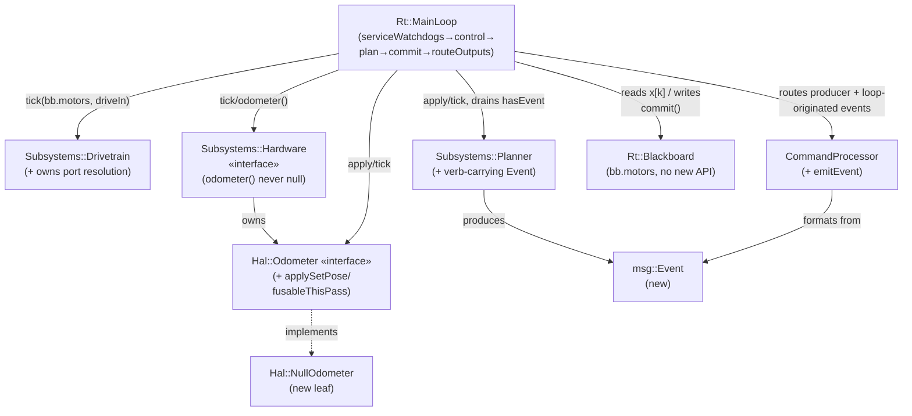
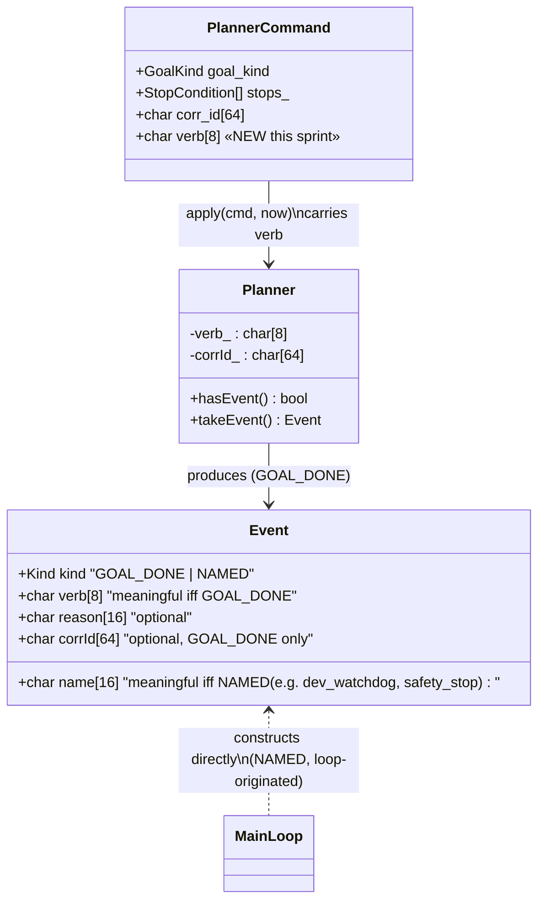

<!-- CLASI: Before changing code or making plans, review the SE process in CLAUDE.md -->

# Architecture Update -- Sprint 090: MainLoop cohesion cleanup

## Step 1: Understand the Problem

`Rt::MainLoop::tick()` (`source/runtime/main_loop.cpp`) is the ordered-tick
cyclic executive established by sprints 060/087 and most recently trimmed by
the `serviceWatchdogs()` extraction (commit `0b2929c5`, landed on this same
branch). It is deliberately the one place a maintainer reads to reason about
tick-pass sequencing and the x[k]→x[k+1] commit edge (see the file's own
header comment). Over several sprints it accumulated five pieces of logic
that are not sequencing at all — they are subsystem-domain knowledge that
leaked into the orchestrator:

1. Port-index arithmetic (`bb.motor[p.left - 1]`) that only `Drivetrain`'s
   own port binding should need.
2. The `SetPose → Pose2D → OdometerCommand` translation and the
   `odometerResetThisPass` stale-reading fusability gate — a
   measurement/odometer property computed as a loop-local `bool`.
3. Three `if (odometer != nullptr)` branches guarding a pointer that, on
   direct inspection of both concrete `Hardware` owners
   (`NezhaHardware::odometer()`, `SimHardware::odometer()`), is **already
   never null in any build this tree produces** — the base class's
   defaulted `nullptr` (`Subsystems::Hardware::odometer()`) is reachable
   only through the abstract interface, not through any owner actually
   constructed today.
4. Hand-assembled `EVT` wire-text `snprintf`s (the `safety_stop` watchdog
   event, and the Planner "done `<verb>`" completion event) — wire-format
   string assembly inside the sequencing code.
5. A long inline COMMIT block that buries `tick()`'s phase structure.

All five are pure internal refactors: no wire verb, EVT name, TLM field, or
timing-sensitive behavior changes. The acceptance bar for every ticket is
`uv run python -m pytest tests/sim` green AND no observable behavior
change — with one load-bearing exception that is NOT just "don't break
it": the odometer reset/fusability work (tickets 002/003) touches the
live-debugged stale-OTOS EKF fix (the fix that skips fusing a stale,
pre-reset OTOS reading for exactly the one pass a reset lands). The
SI/OZ/OR/OV regression tests must be run and shown green both before and
after, not inferred from reading the diff.

This sprint reconciles with sprint 089 (Planner's migration onto vendored
Ruckig, `Motion::JerkTrajectory`): issue 4's event-emission work retypes
`Subsystems::Planner::Event` (currently a private nested struct, unchanged
by 089) into `msg::Event` and threads a `verb` field through it — a small,
additive touch on top of 089's landed work, not a revision of it. Planner's
`hasEvent()/takeEvent()` shape, its Ruckig-driven `tick()`, and its
goal-kind dispatch are untouched.

## Step 2: Identify Responsibilities

- **Motor-observation port resolution** — resolving which two
  `msg::MotorState` cells a differential Drivetrain's bound ports
  correspond to. Changes only when port-binding conventions change.
  Belongs with `Drivetrain`, which already owns `ports()`.
- **Odometer reset translation + per-pass fusability** — translating a
  wire-shaped `SetPose` into the odometer's own command type, and knowing
  whether this pass's own sample is safe to fuse. Changes only when the
  odometer's own reset/staleness semantics change. Belongs with
  `Hal::Odometer`.
- **Odometer presence** — whether a caller can assume a non-null
  `Hal::Odometer&` exists at all. Changes only when `Hardware`'s
  ownership/construction contract changes. Belongs with `Subsystems::
  Hardware` (a `NullOdometer` closes the interface).
- **EVT wire-text formatting** — the `EVT <name> <body>` grammar, the
  `[#<corr> ]reason=` shaping, and (new) the `done <verb>` name
  composition for a completed goal. Changes only when the wire format
  changes. Belongs with `CommandProcessor` (the wire layer) — already the
  sole owner of `replyOK`/`replyErr`/`replyEvt`.
- **Tick-pass phase sequencing** — the order subsystems tick in and the
  x[k]→x[k+1] commit edge. Changes only when the ordered-tick model itself
  changes. Belongs with `Rt::MainLoop` (the composition root) — this
  responsibility is NOT being moved anywhere; ticket 5 only gives its
  existing COMMIT sub-responsibility a name and a function boundary,
  exactly like `serviceWatchdogs()` already got.

These five responsibilities group into four ticket-sized units (odometer
presence and odometer reset/fusability are two DIFFERENT responsibilities
that happen to share one collaborator — sequenced as separate tickets
specifically so the risky, EKF-fix-preserving relocation (fusability) does
not ride on the same commit as the mechanical null-object pattern swap
(presence); see Decision 2/3's own "why separate" note) plus the pure
loop-internal method extraction, which introduces no new module at all.

## Step 3: Define Subsystems and Modules

**`Subsystems::Drivetrain`** (existing, extended) — Purpose: turn a
commanded body twist or wheel target into a ratio-governed motor command
for its own bound pair of wheels. Boundary: inside — port binding
(`ports_`), the ratio governor, TWIST/WHEELS/NEUTRAL dispatch, and (new)
resolving its own bound pair's index into the per-port observation array
handed to it; outside — the array's own population (`Hardware`'s job),
any other port's data, actuation. Use cases served: SUC-001.

**`Hal::Odometer`** (existing interface, extended contract) — Purpose:
represent one pose-and-velocity-reporting device's reset/read contract.
Boundary: inside — `pose()`/`tick()`/the four reset primitives, and (new)
`applySetPose()` (the `SetPose→Pose2D→OdometerCommand` translation, built
on the existing `setPose()` primitive exactly like `apply()`/`configure()`
already build on primitives) and `fusableThisPass()` (a fusability query);
outside — deciding WHETHER to fuse a reading into a pose estimate (that
stays `PoseEstimator`'s call — the odometer only reports whether ITS OWN
reading is trustworthy this pass, it never touches the EKF). Use cases
served: SUC-002, SUC-003.

**`Hal::NullOdometer`** (new leaf) — Purpose: stand in for "no odometer
device is bound" so every caller can treat `Hardware::odometer()` as
always valid. Boundary: inside — inert overrides of every `Hal::Odometer`
primitive (`tick()` no-ops, `pose()` returns identity, every setter
discards, `fusableThisPass()` unconditionally `false`); outside — any real
I/O, any `HOST_BUILD`/`PhysicsWorld`/sim-only dependency (unlike
`Hal::SimOdometer`, this is a pure, dependency-free interface
implementation — it belongs beside `odometer.h` in `hal/capability/`, not
in `hal/sim/`). Use cases served: SUC-003.

**`msg::Event`** (new message type, `source/messages/`) — Purpose:
represent one pending wire-reportable occurrence as typed data. Boundary:
inside — the data a producer already has (a verb or a standalone name, an
optional reason token, an optional correlation id); outside — any wire-text
formatting decision (that is `CommandProcessor::emitEvent()`'s job
entirely — see Decision 4 on why the struct carries a discriminant rather
than a pre-composed name string). Use cases served: SUC-004.

**`CommandProcessor`** (existing, extended) — Purpose: parse wire commands
and format wire replies. Boundary: inside — `emitEvent()`, the new single
authority for `EVT` text (built on the existing `replyEvt()` primitive, the
same way `replyOKf`/`replyErrf` are built on `replyOK`/`replyErr`); outside
— any subsystem's internal state, any decision about WHEN to emit (that is
the draining caller's job, same as today). Use cases served: SUC-004.

**`Subsystems::Planner`** (existing, extended) — Purpose: close a staged
motion goal via a ramp or a whole-trajectory solve, emitting a completion
signal without knowing wire format. Boundary: inside — its retyped
`hasEvent()/takeEvent() → msg::Event`, a new persisted `verb` bookkeeping
field (mirrors its existing `corrId_` persistence) populated from a new
field on `msg::PlannerCommand`; outside — `CommandProcessor`, `snprintf`,
any wire string (unchanged — Planner has never depended on
`CommandProcessor` and does not start now; see Decision 4's "formatting
does not go into the subsystem"). Use cases served: SUC-004.

**`Rt::MainLoop`** (existing, extended) — Purpose: sequence one control
pass across the four owned subsystems and commit their published state.
Boundary: inside — `serviceWatchdogs()`/`routeOutputs()`/(new) `commit()`
as named private phases, the composition-root's own persistent state
(watchdogs, `activeVelocityVerb_` — retained, see Decision 4); outside —
any subsystem's own internal computation, any wire formatting (moved out
by ticket 4), any Blackboard-owned execution (Decision 5's own rejection).
Use cases served: SUC-001–005 (every ticket touches this orchestrator, none
relocates its core sequencing responsibility).

## Step 4: Diagrams

### Component / dependency diagram

No new dependency edges cross a layer boundary the wrong way: `Planner`
still has no edge to `CommandProcessor` (the boundary Decision 4 protects);
`Hal::NullOdometer` only implements `Hal::Odometer`, it does not depend on
`Subsystems::Hardware`; `Rt::Blackboard` gains a renamed field
(`motors`) but no new method and no new dependency (it still depends on
nobody — Decision 5). Fan-out: `MainLoop` already depended on all four
subsystems plus `CommandProcessor`/`Blackboard` before this sprint; this
sprint adds no new top-level dependency to `MainLoop`, only deepens
existing ones.

### `msg::Event` data shape (new type — the "data model changed" diagram)

`Event.kind` is the discriminant `CommandProcessor::emitEvent()` reads to
decide whether the wire name is `"done " + verb` (a completed goal) or
`name` verbatim (`dev_watchdog`/`safety_stop`, loop-originated) — see
Decision 4. This is deliberately a module-level sketch, not a locked
struct: the ticket owns the exact field layout.

## Step 5: What Changed / Why / Impact / Migration

### What Changed

- `Drivetrain::tick()`'s signature changes to accept the whole per-port
  motor-observation array (renamed `bb.motors`) instead of two individual
  `msg::MotorState` references; it resolves its own bound pair internally
  and range-asserts against the array's bound.
- `Hal::Odometer` gains `applySetPose(const msg::SetPose&)` (concrete,
  built on the existing `setPose()` primitive) and `fusableThisPass()` (a
  one-shot query, read-and-clear like the codebase's existing
  `hasEvent()/takeEvent()` convention — see Decision 2).
- A new `Hal::NullOdometer` leaf; `Subsystems::Hardware::odometer()`'s
  default changes from `return nullptr` to returning a valid
  `NullOdometer`; three call sites collapse their null branches — the
  issue's own stated one (`main_loop.cpp`) plus two this sprint's own
  codebase-alignment review found (`main.cpp`'s `bb.otosPresent` boot
  snapshot, `configurator.cpp`'s odometer-config guard) — see Decision 3.
- `msg::Event` (new, `source/messages/`), `CommandProcessor::emitEvent()`
  (new), `msg::PlannerCommand` gains a `verb` field (`protos/
  planner.proto`), `Subsystems::Planner`'s private `Event` struct retypes
  to `msg::Event` and gains persisted verb bookkeeping.
- `Rt::MainLoop` gains a private `commit(bb, now)` method; `tick()`'s
  inline COMMIT block moves into it verbatim.

### Why

Each change follows directly from Step 2/3's responsibility assignment:
move the logic to the module whose OWN state the logic already reasons
about, so `MainLoop::tick()` is left with pure sequencing. None of these
are behavior changes — they are relocations, verified by the existing
`tests/sim` suite (extended, for tickets 002/003, by an explicit
before/after regression run of the SI/OZ/OR/OV tests, since those are the
tests that actually exercise the invariant being relocated).

### Impact on Existing Components

- **Drivetrain callers**: `main_loop.cpp`'s single call site changes shape;
  no other production caller exists. Test harnesses that call
  `Drivetrain::tick()` directly (grep `tests/sim/unit/` — this project's
  own "rename sprint: latent call-site breakage" lesson applies) must be
  found and updated; do not trust the issue's own stated Scope list as
  exhaustive.
- **`Hal::Odometer` leaves**: `Hal::SimOdometer` and `Hal::OtosOdometer`
  each need real implementations of `applySetPose()`/`fusableThisPass()`
  (ticket 002); `Hal::NullOdometer` needs the full interface (ticket 003).
  Both existing leaves already implement every OTHER primitive this
  contract needs — this is pure interface widening, no existing method's
  behavior changes.
- **`Hardware::odometer()` callers beyond `main_loop.cpp`**: confirmed by
  direct grep — `main.cpp:174` (`bb.otosPresent = (hardware.odometer() !=
  nullptr)`) and `configurator.cpp:199-201` (odometer config null-guard)
  both depend on the nullable contract and are NOT listed in the source
  issue's own Scope section. Both are safe to simplify to their
  unconditional form: direct inspection of `NezhaHardware::odometer()`
  and `SimHardware::odometer()` (both override to always-non-null, since
  tickets 086-006/081-003 respectively) plus this project's own test
  suite (`otos_commands_harness.cpp`'s docstring: "`hardware.odometer()`
  is NEVER nullptr for `NezhaHardware` any more... this harness now
  asserts the CURRENT invariant: all seven verbs reach dispatch and reply
  OK") together confirm the "device absent" branch is ALREADY dead code
  in every build this tree produces today. Ticket 003's scope is widened
  to include these two files.
- **`CommandProcessor` callers**: `main_loop.cpp`'s two direct
  `CommandProcessor::replyEvt()` call sites (watchdog-fire, safety_stop)
  and its one Planner-event call site all move to `emitEvent()`.
  `replyEvt()` itself is unchanged and stays available as `emitEvent()`'s
  own low-level primitive (mirrors `replyOKf`/`replyErrf` being built on
  `replyOK`/`replyErr`) — no existing caller of `replyEvt()` elsewhere in
  the tree breaks.
- **`msg::PlannerCommand` producers**: `source/commands/
  motion_commands.cpp`'s handlers (which already compute the verb for
  `Rt::MotionCommand::verb`) additionally set the new `cmd.verb` field
  when building the `msg::PlannerCommand` they post — an additive field
  population, not a new responsibility.
- **`MainLoop::activeVelocityVerb_`**: RETAINED (not removed) — it still
  gates the stream-watchdog's S-vs-R distinction (`activeVelocityVerb_[0]
  == '\0'`), a loop-owned concern unrelated to event formatting. Only its
  USE in `motionVerbForMode()`/`activeModeBeforeTick` (event-name
  composition) is removed. See Decision 4's Consequences and Step 7 Open
  Question 1.

### Migration Concerns

None are data-migration or deployment-sequencing concerns (no persisted
state, no wire format change). The operative concern is purely
**execution-order risk**: all five tickets touch overlapping regions of
one file (`main_loop.cpp`) and must land strictly in dependency order
(001→002→003→004→005) to avoid diff conflicts — ticket 3 literally cannot
be written against ticket 2's still-nullable contract, and ticket 5's
extraction target (the COMMIT block) is smaller once 1/2/3 land. There is
also a pre-existing housekeeping item this sprint's setup surfaced (not
this sprint's own defect): `git status` on this branch shows sprint 089's
ticket 005 file duplicated between `tickets/` and `tickets/done/` — the
known "move-to-done is filesystem-only, gets half-reverted" gotcha. This
should be resolved (commit the move) before this sprint's branch is cut,
so sprint 090's own ticket work does not inherit that dirty state.

## Step 6: Design Rationale

**Decision 1 — Drivetrain resolves ports over the observation plane, not a
`Hardware&`.**
- Context: `main_loop.cpp` indexes `bb.motor[p.left - 1]`/`[p.right - 1]`
  before calling `Drivetrain::tick()`, duplicating knowledge Drivetrain
  already has (`ports()`).
- Alternatives considered: pass `Hardware&` into `Drivetrain::tick()` so it
  can read observations itself. Rejected (carried forward from the source
  issue, not re-litigated here): Drivetrain only needs read-only
  observations (never actuates directly); a live `Hardware&` read would
  return intra-pass state `hardware_.tick()` mutated earlier THIS pass,
  breaking the x[k] committed-snapshot discipline the two-plane
  ordered-tick model (sprints 060/087) exists to enforce; it would also
  reintroduce direct-call coupling the blackboard command plane replaced.
- Why this choice: passing the observation array (not a hardware handle)
  keeps Drivetrain reading only the committed snapshot, matching every
  other subsystem's `tick()` contract (`PoseEstimator`, `Planner` already
  take observations as bare arguments, never a `Hardware*`).
- Consequences: `Drivetrain::tick()`'s signature widens from two
  individual `MotorState` references to an array + a range assert; the
  loop still computes `p = drivetrain_.ports()` locally for its OTHER two
  call sites (`poseEstimator_.tick()`, `planner_.tick()`, unchanged by this
  ticket — those are out of this issue's scope).

**Decision 2 — Odometer reset-fusability is a read-and-clear query, not a
tick()-cleared flag.**
- Context: the loop currently computes `odometerResetThisPass` fresh each
  pass (default false, set true only if a drain happened THIS pass) and
  reads it exactly once, immediately, at the `poseEstimator_.tick()` call
  site.
- Alternatives considered: clear the "reset just happened" flag inside
  `Hal::Odometer::tick()` (called later, at COMMIT). Rejected: `tick()` is
  pure virtual with no shared base implementation — every leaf
  (`SimOdometer`, `OtosOdometer`, future leaves, `NullOdometer`) would have
  to remember to clear the flag itself, a silent-breakage footgun if any
  leaf's `tick()` override forgets it.
- Why this choice: `fusableThisPass()` is read exactly once per pass, by
  exactly one caller, immediately after any reset that pass would have
  applied — the same "one-shot signal, one consumer, this pass only"
  shape the codebase already has a convention for
  (`hasEvent()/takeEvent()`, `hasCommand()/takeCommand()`). Making
  `fusableThisPass()` itself consume/clear the underlying flag (a
  concrete, non-virtual method on the `Hal::Odometer` base, needing no
  leaf cooperation) reproduces the exact per-pass timing the loop-local
  bool had, with no reliance on `tick()` ordering.
- Consequences: `fusableThisPass()` is virtual (so `NullOdometer` can
  override it to unconditionally return `false`, regardless of the base
  flag's state — see Decision 3); calling it more than once in the same
  pass would incorrectly report "not fusable" on the second call — a
  documented single-caller contract, not a general-purpose getter. This is
  the sprint's one genuinely load-bearing timing invariant; the SI/OZ/OR/OV
  regression tests exist specifically to catch a mis-port of it.

**Decision 3 — NullOdometer lives in `hal/capability/`, and ticket 3's
scope widens beyond the source issue's own Scope section.**
- Context: the source issue's Scope section lists only
  `hal/.../null_odometer.{h,cpp}`, `hardware.h`'s owners, and
  `main_loop.cpp`'s three branches.
- Alternatives considered: place `NullOdometer` in `hal/sim/` (beside
  `SimOdometer`). Rejected: `NullOdometer` has zero `HOST_BUILD`/
  `PhysicsWorld` dependency and must be reachable from a real-hardware
  build (`NezhaHardware`'s own base-class default), so it does not belong
  in the sim-only directory CMake excludes from the ARM build.
- Why the widened scope: this sprint's own codebase-alignment review
  (grepping every `.odometer()` call site, not only the issue's stated
  ones) found `main.cpp:174` and `configurator.cpp:199-201` also branch on
  the nullable contract. Both are safe to simplify to their unconditional
  form — confirmed by direct inspection that both concrete `Hardware`
  owners already override `odometer()` to non-null (tickets 086-006/
  081-003), and by `otos_commands_harness.cpp`'s own docstring, which
  already asserts the "always reaches dispatch, replies OK" invariant
  against real `NezhaHardware`. Leaving these two call sites on the old
  nullable contract would either leave dead defensive code behind (a
  half-finished cleanup) or, worse, leave `bb.otosPresent`/the config
  guard silently reading a stale assumption once the base default changes.
- Consequences: ticket 3's Files-to-modify list is `hal/capability/
  null_odometer.h` (new), `hardware.h` + both owners (if needed), AND
  `main.cpp` + `configurator.cpp` — the ticket's own acceptance criteria
  say so explicitly rather than relying on the issue text.

**Decision 4 — `msg::Event` carries a discriminant; formatting stays
entirely in `CommandProcessor`.**
- Context: today's three EVT call sites are shaped differently —
  `dev_watchdog` (bare name, no body), `safety_stop` (name + `reason=`,
  no corr id), Planner's `done <verb>` (composed name + `[#corr ]reason=`).
  A single flat struct with only `{name, reason, corrId}` cannot express
  "compose `done <verb>`" vs. "use this literal name verbatim" without the
  PRODUCER deciding the composition — which would put wire-adjacent string
  assembly (or at least string-shape decisions) back in the subsystem.
- Alternatives considered: (a) have Planner pre-compose `"done <verb>"`
  into a `name` field itself. Rejected: this is exactly the
  smell the issue exists to remove — "a subsystem snprintf-ing wire
  strings would just move the smell one layer down and break the
  command(wire-inbound)/message(internal) boundary" (source issue, Key
  Decision section). (b) Two separate emit methods
  (`emitGoalDone`/`emitNamed`) instead of one discriminated type. Rejected:
  the issue's own text is explicit that loop-originated events (dev_
  watchdog, safety_stop) must route through "the SAME `emitEvent`" as
  subsystem-produced ones, for uniform formatting — a discriminated single
  type is the natural way to satisfy "one emitter, uniform formatting."
- Why this choice: the discriminant (`kind`) lets `emitEvent()` — the wire
  layer — own the ENTIRE decision of how to spell the EVT name, while the
  producer only ever hands over data it already has.
- Consequences: `msg::PlannerCommand` gains a `verb` field (an internal
  message, not a wire-inbound command — excluded from the units/wire-key
  stability rule the same way every other internal `msg::*` field is);
  `MainLoop::activeVelocityVerb_` is RETAINED for the unrelated
  stream-watchdog gate (Step 5's own note) — this ticket removes its use
  for event-NAME composition only, not the field itself. A future sprint
  could go further and have the loop read the verb back from Planner's own
  published state instead of keeping a private duplicate, but that would
  widen `msg::PlannerState` (a TLM-adjacent type) and is explicitly
  deferred (Step 7, Open Question 1) rather than folded in here.

**Decision 5 — `MainLoop::commit()` is a private method, not a
`Blackboard::update(...)` API.**
- Context: carried forward verbatim from the source issue, which already
  recorded and rejected this alternative; restated here because it is the
  one ticket whose "obvious" alternative would violate this sprint's own
  cross-cutting constraint (the two-plane ordered-tick model's dependency
  direction).
- Alternatives considered: `Blackboard::update(drivetrain, poseEstimator,
  planner, odometer, hardware)`. Rejected: `Blackboard` is a dumb DTO that
  today depends on nobody; `update(all subsystems)` would make it depend
  on the entire subsystem graph — a coupling knot and cycle risk. The
  block is not pure copying either (`odometer->tick(now)` is a
  side-effecting call) — `bb.update()` would drive subsystem execution
  from inside a data struct. COMMIT is also the one clock-edge the
  composition root most needs visible, not buried in a DTO method.
- Why this choice: mirrors the already-landed `serviceWatchdogs()`
  precedent exactly (commit `0b2929c5`) — a private `MainLoop` method,
  same class, same ownership, just named.
- Consequences: `Blackboard` gains no new dependency and no new method
  (confirmed by this sprint's own dependency graph, Step 4) — it remains
  the "pure data, no subsystem pointers, depends on nobody" DTO its own
  file header documents.

## Step 7: Open Questions

1. **`MainLoop::activeVelocityVerb_`'s remaining scope.** Once ticket 4
   lands, this field's only remaining reader is the stream-watchdog's
   S-vs-R gate. Should the loop instead read the verb back from Planner's
   own state (eliminating the loop-owned duplicate entirely) rather than
   keeping a private copy fed the same way as today? This would require
   widening `msg::PlannerState` (a TLM-adjacent generated type) and is
   judged out of this ticket's scope — surfacing it here so it is not
   lost, not silently declined.
2. **Exact `msg::Event` field layout.** Step 4's class diagram is a
   module-level sketch (a `kind` discriminant + verb/name/reason/corrId).
   The literal struct shape, `Kind` enum naming, and whether it is
   hand-authored or `protos/`-generated are ticket 004's own
   implementation call — Phase 2's methodology deliberately keeps this
   document at module level.
3. **`NullOdometer::connected()`'s return value.** `false` (no real device)
   is the obvious choice, but `Hal::Odometer::connected()`'s existing
   callers (if any beyond telemetry) should be checked at ticket time for
   any behavior that keys off `connected()` specifically rather than
   `fusableThisPass()`.
4. **Sprint-089 branch hygiene.** This branch's working tree currently
   shows sprint 089's ticket 005 file duplicated between `tickets/` and
   `tickets/done/` (an uncommitted filesystem-only move — see Step 5's
   Migration Concerns). This is not sprint 090's defect, but it should be
   resolved before sprint 090's own branch is cut from this one, so the
   duplicate is not carried forward.
