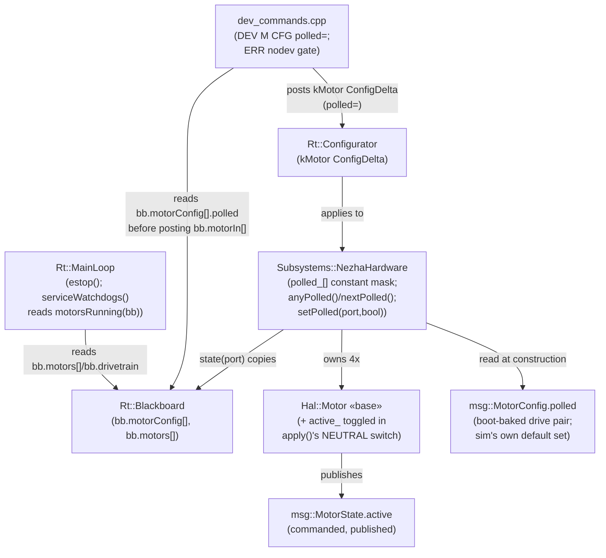
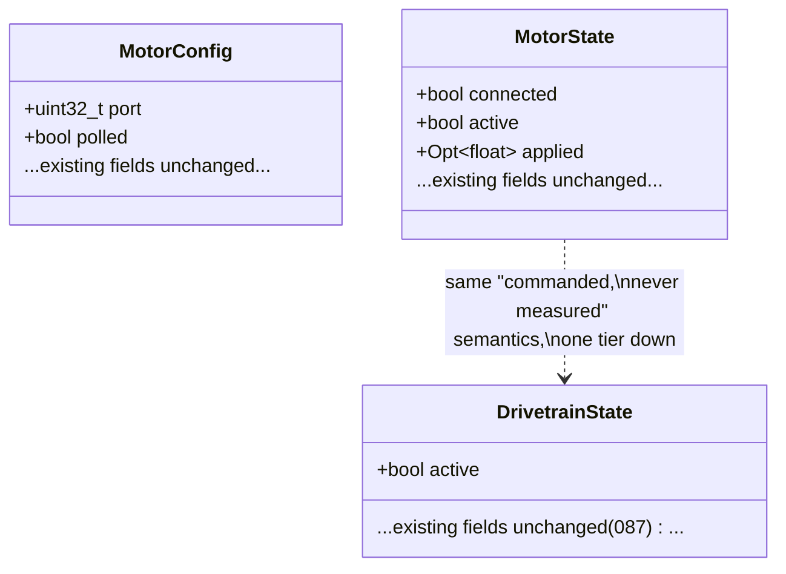

<!-- CLASI: Before changing code or making plans, review the SE process in CLAUDE.md -->

# Architecture Update -- Sprint 091: Hardware-leaf and safety cleanups

## Step 1: Understand the Problem

Three independent pool issues, sequenced so the trivial one lands first and
the two hardware-leaf issues don't collide:

1. `Rt::MainLoop::emergencyNeutralize()` carries a stakeholder `// FIXME
   rename to "estop"` comment, deferred out of sprint 088. Pure rename,
   zero behavior change. Goes first because ticket 3 (the watchdog) touches
   this method's call site again -- better to touch it once, under its
   final name.
2. `Subsystems::NezhaHardware::portInUse_` is a command-derived schedule
   flag masquerading as an "in-use" fact. It has three side-effect write
   sites (`tick()`'s motorIn[] drain, `apply(CommandProcessorToHardware
   Command&)`'s addressed branch, `apply(DrivetrainToHardwareCommand&)`),
   a broadcast-exemption special case, and no release mechanism.
   `SimHardware` has no equivalent concept at all (it ticks all four ports
   unconditionally every pass), so the whole invariant is untestable in
   sim today.
3. The serial-silence watchdog fires on ANY comms silence past its window,
   including while the robot is completely idle. `DrivetrainState.active`
   (added 087) is the obvious gate, but reading the actual command paths
   (`isBoundPort()`'s authority-steal in `dev_commands.cpp`) shows it is
   NOT sufficient on its own -- a bound-port `DEV M <n> VEL` steals
   Drivetrain authority and puts it into STANDBY (`active_ = false`) the
   moment the motion verb lands, even though the wheel is now genuinely
   spinning under the standalone command. A correct fire-gate needs
   per-port commanded state too, which does not exist on the blackboard
   yet.

A textual read of issue 2 in isolation would produce a design that breaks
a real, currently-working, documented capability: the coupled PID/governor
bench rig (`docs/protocol-v2.md` §16; `tests/bench/pid_hold_speed.py`;
`tests/bench/ratio_governor_curve.py`), which drives ports 3/4 (or any
combination outside the Drivetrain's bound pair, e.g. `ratio_governor_
curve.py`'s primary protocol: Drivetrain bound to 2/3, port 4 driven
standalone) as first-class, currently-accepted commands (`test_dev_
command_outbox.py`'s `scenarioUnboundPortLeavesDrivetrainUntouched` proves
this is accepted today). A poll-set that is purely boot-config-fixed to the
two drive-pair ports would silently stop sampling those bench ports'
encoders -- breaking `VEL` mode's embedded PID (which needs its own
`tick()` to close the loop) with no error, no wire change, and no sim test
to catch it, since no current sim test exercises a standalone port. This
architecture resolves that tension explicitly (Decision 1) rather than
importing the issue's literal design unchanged.

This sprint reconciles with sprint 090 (landed, `v0.20260708.6`): `bb.
motors[]`, `Hal::Odometer::applySetPose()`/`fusableThisPass()`, `Hal::
NullOdometer`, `msg::Event`/`CommandProcessor::emitEvent()`, and the
private `MainLoop::commit()` are all read, not re-touched, except that
ticket 3's watchdog-fire branch (inside `serviceWatchdogs()`, itself a
090-005 extraction) gains one boolean AND-gate and ticket 1's rename
touches the same method's call site.

## Step 2: Identify Responsibilities

- **Emergency-stop naming** -- what the loop's immediate-neutralize entry
  point is called. Changes only when the stakeholder's naming convention
  changes. Belongs with `Rt::MainLoop` (already owns it).
- **Poll-schedule membership** -- which motor ports the I2C flip-flop
  sequencer bothers to sample each pass. Changes only when the boot
  config's drive-pair binding changes, or an operator explicitly opts a
  bench port in/out. Belongs with `Subsystems::NezhaHardware` (already
  owns the flip-flop), fed by a `msg::MotorConfig` fact set at
  construction and mutable thereafter through exactly one config-plane
  door.
- **Poll-membership opt-in/out (config-plane)** -- the explicit `DEV M
  <n> CFG polled=<bool>` action and its wire acceptance/rejection shape.
  Changes only when the config-key surface changes. Belongs with
  `source/commands/dev_commands.cpp` (already the sole translator for
  `DEV M <n> CFG`).
- **Unpolled-port rejection** -- deciding that a motion verb (DUTY/VEL/POS)
  addressed at an unpolled port is an `ERR`, and which token. Changes only
  when the poll-set's own semantics change. Belongs beside `isBoundPort()`
  in `dev_commands.cpp` (the same file already gates DEV M by capability
  and by bound-port authority-steal).
- **Per-motor commanded-running state** -- whether a single motor is
  currently under a non-neutral commanded mode, independent of Drivetrain.
  Changes only when `Hal::Motor::apply()`'s own dispatch changes. Belongs
  with `Hal::Motor` (the base class already special-cases NEUTRAL in
  `apply()`; this is one more branch of the same switch).
- **Watchdog fire-gate policy** -- whether "motors running" is true this
  pass. Changes only when the definition of "running" changes. Belongs
  with `Rt::MainLoop::serviceWatchdogs()` (already the sole caller of
  `SerialSilenceWatchdog::check()`).

Five responsibilities, three tickets: naming (1) is standalone; poll-set
membership + its config-plane door + its rejection gate (2, 3, 4) are one
ticket because they share one collaborator and one config key's round
trip; per-motor commanded state + the fire-gate policy (5, 6) are one
ticket because the fire-gate is meaningless without the state it reads,
and both are small.

## Step 3: Define Subsystems and Modules

**`Rt::MainLoop`** (existing, extended) -- Purpose: sequence one control
pass and commit subsystem state. Boundary: inside -- `estop()` (renamed
from `emergencyNeutralize()`, same bypass semantics), `serviceWatchdogs()`
gaining a `motorsRunning(bb)` read before acting on `watchdog_.check()`;
outside -- the definition of what makes a motor "running" (that is `Hal::
Motor`'s/`Subsystems::Drivetrain`'s own published state, MainLoop only
reads `bb`). Use cases served: SUC-001, SUC-005.

**`Subsystems::NezhaHardware`** (existing, extended) -- Purpose: schedule
and distribute motor commands across the shared I2C bus. Boundary: inside
-- `polled_[kPortCount]` (a constant mask read from `configs[].polled` at
construction), `anyPolled()`/`nextPolled()` (renamed from `anyPortInUse()`/
`nextPortInUse()`), a new `setPolled(port, bool)` mutator reached only
through the config-plane door below; outside -- deciding WHICH ports get
`polled=true` at boot (that is boot config's job) or in response to a bench
operator's request (that is `dev_commands.cpp`'s job, via the mutator).
`apply()`/`tick()` no longer write to poll state at all -- the broadcast
exemption comment/branch is deleted because there is nothing left to
exempt it from. Use cases served: SUC-002, SUC-003, SUC-004.

**`msg::MotorConfig.polled`** (new field) -- Purpose: represent one port's
boot-established (and operator-adjustable) poll-schedule membership as
data. Boundary: inside -- a plain bool, defaulted false, set true for the
boot drive pair by `Config::defaultMotorConfigs()`/`gen_boot_config.py`
(mirroring the existing `LEFT_PORT`/`RIGHT_PORT`-vs-"every other port"
specialization `travel_calib_for_ports()`/`fwd_sign_for_ports()` already
apply) and by `tests/_infra/sim/sim_api.cpp`'s own `defaultMotorConfigSet()`
(ports 1/2, matching `defaultSimDrivetrainConfig()`); outside -- any
scheduling decision (that is `NezhaHardware`'s job). Use cases served:
SUC-002, SUC-003, SUC-004.

**`source/commands/dev_commands.cpp`** (existing, extended) -- Purpose:
translate wire `DEV` commands into blackboard posts/rejections. Boundary:
inside -- `DEV M <n> CFG polled=<bool>` (routed through the existing
`applyMotorCfgKey()`/`Rt::ConfigDelta(kMotor)` path, landing on
`NezhaHardware::setPolled()` via the Configurator exactly the way every
other `DEV M <n> CFG` key already lands on a `NezhaHardware`/`Hal::Motor`
setter), and a new pre-validation gate (beside the existing capability
gate) that rejects DUTY/VEL/POS on an unpolled port with `ERR nodev`;
outside -- the poll mask's own storage (`NezhaHardware`'s), the
"is this port polled" fact itself (read from `bb.motorConfig[port-1].
polled`, the Configurator's published snapshot -- no new blackboard cell
needed). Use cases served: SUC-003, SUC-004.

**`Hal::Motor`** (existing base class, extended) -- Purpose: the shared,
leaf-independent message-plane translator every motor leaf gets once
(`apply()`/`state()`, sprint 077/078). Boundary: inside -- a new `active_`
bool, toggled in the SAME `apply()` switch that already special-cases
NEUTRAL (`false` on `NEUTRAL`, `true` on `DUTY_CYCLE`/`VOLTAGE`/`VELOCITY`/
`POSITION`, untouched on `NONE`), surfaced via `active()`/`msg::MotorState.
active`; outside -- any Drivetrain-level or watchdog-level interpretation
of that bit (those are `MainLoop`'s job, reading `bb.motors[i].active`).
Use cases served: SUC-005.

**`msg::MotorState.active`** (new field) -- Purpose: represent one motor's
current commanded (never measured) running/neutral state as published
data, mirroring `msg::DrivetrainState.active`'s own semantics one tier
down. Boundary: inside -- a plain bool, always populated (unlike `wedged`/
`position`, it needs no `has_encoder` gate -- every leaf can answer "am I
under a non-neutral command"); outside -- the fire-gate decision itself
(`MainLoop`'s job). Use cases served: SUC-005.

## Step 4: Diagrams

### Component / dependency diagram

No new dependency edges cross a layer boundary the wrong way:
`dev_commands.cpp` still never holds a `NezhaHardware*`/`Hal::Motor*`
(Decision 7 of sprint 087, unchanged -- it only reads/posts against `bb`
and the Configurator); `Hal::Motor` gains no new outward dependency (the
new bool is entirely internal bookkeeping surfaced through its own already
existing `state()` assembly); `NezhaHardware`'s constructor dependency on
`msg::MotorConfig` is unchanged (one more field on a struct it already
takes). Fan-out is unchanged for every touched module.

### Data shape: the two new fields

## Step 5: Complete the Document

### What Changed

1. `Rt::MainLoop::emergencyNeutralize()` renamed to `estop()`. No signature,
   call-site count, or behavior change.
2. `NezhaHardware::portInUse_` (a command-derived, latch-forever,
   three-write-site flag) replaced by `polled_[kPortCount]`, a constant
   mask established once at construction from `configs[].polled`, mutable
   only through a new `setPolled(port, bool)` reached exclusively via the
   Configurator's `kMotor` `ConfigDelta` path (the same door every other
   `DEV M <n> CFG` key already uses). `anyPortInUse()`/`nextPortInUse()`
   renamed `anyPolled()`/`nextPolled()`. The broadcast-exemption branch/
   comment in `apply(const Hal::CommandProcessorToHardwareCommand&)` is
   deleted -- `apply()` no longer touches poll state in any branch, so
   there is nothing to exempt broadcast from.
3. `msg::MotorConfig` gains `polled` (bool, default false). Baked true for
   the boot drive pair by `Config::defaultMotorConfigs()`/
   `gen_boot_config.py` (mirroring the existing `LEFT_PORT`/`RIGHT_PORT`
   specialization already used for `travel_calib`/`fwd_sign`) and by
   `tests/_infra/sim/sim_api.cpp`'s own `defaultMotorConfigSet()`.
4. `dev_commands.cpp` gains the `polled` key on `DEV M <n> CFG` (routed
   through the existing generic CFG-delta mechanism, no new command verb)
   and a pre-validation gate: DUTY/VEL/POS addressed at a port with
   `bb.motorConfig[port-1].polled == false` is rejected `ERR nodev <mode>`,
   posting nothing. NEUTRAL/RESET/STATE/CAPS/CFG are unaffected.
5. `Hal::Motor` gains `active_` (bool, default false), toggled inside the
   existing `apply()` switch (false on NEUTRAL, true on the four other
   control kinds, untouched on NONE), surfaced as `active()` and folded
   into `state()`'s existing assembly as `msg::MotorState.active` (new
   field, always populated).
6. `Rt::MainLoop::serviceWatchdogs()`'s fire branch gains one AND-gate:
   `watchdog_.check(now) && (bb.drivetrain.active || bb.motors[0].active ||
   ... || bb.motors[kPortCount-1].active)` before calling `estop()`/
   emitting `EVT dev_watchdog`. `check()` itself is still called
   unconditionally every pass (preserving its fire-once/re-arm-on-feed
   semantics -- see Decision 3's "why gate the action, not the check").

### Why

Each item removes a specific, named smell (a lying name, a hidden side
effect, an un-releasable latch, a spurious safety-stop) without changing
any wire verb's shape and, for items 2-4, without breaking the coupled
bench rig's existing, documented, currently-passing capability (Decision
1). Items 5-6 close a real gate-adequacy gap `DrivetrainState.active`
alone cannot close (Decision 2/3).

### Impact on Existing Components

- `test_nezha_flipflop.py`'s harness scenarios shift from "command
  triggers in-use" to "construction-time config triggers polled" for the
  idle/rotation/broadcast scenarios; the harness's own local config-builder
  gains a per-scenario `polled` parameter.
- `test_dev_command_outbox.py`'s `scenarioUnboundPortLeavesDrivetrainUntouched`
  changes from proving acceptance to proving `ERR nodev` rejection (the
  ticket's deliberate change), plus a new scenario proves the
  `CFG polled=true` escape hatch flips that same port to accepted.
- `tests/bench/pid_hold_speed.py`/`tests/bench/ratio_governor_curve.py`
  gain one `DEV M <n> CFG polled=true` line per non-default port in their
  existing setup preambles (beside their existing `DEV WD 3000` line);
  `docs/protocol-v2.md` §16 documents the new CFG key and the `ERR nodev`
  reply.
- `test_watchdog_policy.py` gains an idle-silence-does-not-fire test;
  existing driving-fires tests are unmodified (they already command a
  motor before going silent, so `bb.motors[0].active` is true throughout).

### Migration Concerns

- Regenerating `protos/motor.proto` via `scripts/gen_messages.py` touches
  every file under `source/messages/motor.h`-adjacent generated output --
  routine, already the established pattern for every prior schema
  addition this project has made (e.g. sprint 087's six blackboard-facing
  fields).
- `gen_boot_config.py` changes are generator-only (per this project's
  generated-code exemption); `source/config/boot_config.cpp` itself is
  regenerated, never hand-edited.
- No data migration: both new fields default to their zero-value/`false`,
  which is exactly today's implicit starting state for a port nobody has
  yet touched.

## Step 6: Design Rationale

### Decision 1: Poll-set gains a config-plane opt-in door, not a pure
boot-time-only constant

- **Context**: Issue 2's own text says the poll-set is "a pure
  configuration fact -- we already know it" and should be "established
  once at construction... never mutated." Read literally, `NezhaHardware`
  would poll exactly the boot-baked drive pair for the life of the boot.
- **Alternatives considered**:
  (a) Literal reading -- poll-set fixed at construction, never
      changeable. Rejected: breaks `ratio_governor_curve.py`'s primary
      protocol (drives port 4 standalone while Drivetrain is bound to
      2/3) and `pid_hold_speed.py` (drives ports 3/4 standalone), both
      real, currently-passing bench workflows that need those ports'
      encoders sampled.
  (b) Poll ALL `kPortCount` ports unconditionally, always. Rejected: this
      is what the issue is trying to get away from in spirit (it halves
      the normal 2-wheel drive pair's sample cadence for the ENTIRE life
      of every boot, not just during a bench excursion -- worse than
      today's behavior in the common case).
  (c) Derive poll-set dynamically from `DrivetrainConfig.left_port/
      right_port` on every `DEV DT PORTS` rebind. Rejected: does not cover
      `ratio_governor_curve.py`'s primary protocol, which needs a port
      (4) polled that is never part of ANY Drivetrain-bound pair in that
      test.
- **Why this choice**: A config-plane `DEV M <n> CFG polled=<bool>` key
  keeps the issue's real goal (delete hidden, one-way, command-flow-
  derived mutation) while giving bench operators an explicit, visible,
  reversible, deliberate way to extend the poll-set exactly the way they
  already deliberately extend Drivetrain's bound pair via `DEV DT PORTS`
  -- both are config-plane actions now, neither is a command-plane side
  effect.
- **Consequences**: `pid_hold_speed.py`/`ratio_governor_curve.py` need one
  new setup line each; `docs/protocol-v2.md` needs a new CFG key
  documented. No sim test currently exercises a standalone unpolled port,
  so this is additive to sim coverage, not a fix to a passing test.

### Decision 2: Unpolled-port `DEV M` motion verbs are rejected (`ERR
nodev`), not silently accepted

- **Context**: Issue 2 flags this as the one deliberate, must-document
  behavior change.
- **Alternatives considered**: applied-but-unsampled (accept the command,
  but the port never gets ticked). Rejected: `VEL` mode's embedded PID
  needs `tick()` to close the loop at all -- an accepted-but-never-ticked
  `VEL` command would silently never converge, a worse failure mode
  (looks accepted, never works) than a clear, immediate `ERR`.
- **Why this choice**: Mirrors the existing capability-rejection shape
  (`ERR unsupported <mode>`) and the existing device-presence convention
  (`ERR nodev` on `OI`/`OZ`/`OR`/`OV` with no odometer) -- one more
  instance of a pattern already in the codebase, not a new error
  vocabulary.
- **Consequences**: `test_dev_command_outbox.py`'s
  `scenarioUnboundPortLeavesDrivetrainUntouched` changes meaning (from
  "accepted" to "rejected") -- the sprint's own sanctioned deliberate
  change, proven by an updated/added sim test per the hard constraint.

### Decision 3: Watchdog fire-gate reads `bb.drivetrain.active ||
any(bb.motors[i].active)`, and `active` is a new commanded (not measured)
per-motor bit

- **Context**: The issue suggests `DrivetrainState.active` "plus the
  commanded drive/motor state." Tracing `isBoundPort()`'s authority-steal
  in `dev_commands.cpp` shows `DrivetrainState.active` alone goes FALSE
  the instant a bound-port `DEV M` motion verb lands (an intentional
  077-007 fix for a different bug -- Drivetrain going to standby so a
  standalone motor command doesn't fight the governor) -- so gating on it
  alone would silently stop protecting the single most common bench
  pattern (`DEV M 1 VEL 100` on the normal drive pair).
- **Alternatives considered**: (a) `DrivetrainState.active` alone --
  rejected per the gap just described. (b) Infer "running" from `msg::
  MotorState.applied` (already published) -- rejected: `applied` is a
  raw duty-cycle float whose meaning varies by control kind (a `POSITION`
  target's `applied` reflects a duty snapshot mid-move, not a reliable
  "is this port under a non-neutral command" signal) and can legitimately
  sit near zero while a `VELOCITY` command still holds a small target --
  not deterministic enough for a safety gate. (c) A new command-derived
  latch at the `MainLoop`/blackboard level tracking "was ever commanded"
  -- rejected: reintroduces the exact one-way-latch anti-pattern ticket 2
  is deleting elsewhere in the same sprint, just relocated.
- **Why this choice**: `Hal::Motor::apply()` already special-cases
  NEUTRAL in its dispatch switch (the base class every leaf shares) --
  adding a symmetric `active_` toggle there (true on the four non-neutral
  control kinds, false on NEUTRAL) is the smallest, most cohesive place
  to derive a commanded, always-current, never-latching per-motor bit,
  exactly mirroring how `Drivetrain::active_`/`standby()` already work
  one tier up.
- **Why gate the action, not the `check()` call**: `SerialSilenceWatchdog::
  check()` must still run every pass so its internal `fired_`/re-arm
  bookkeeping stays correct; because ANY command that starts driving also
  calls `feedWatchdog()` (fed on arrival of any command, regardless of
  content, before routing), a silence episode that elapses while idle and
  is (correctly) not acted upon can never "leak" into a later driving
  episode without an intervening `feed()` resetting the clock. Gating the
  RESULT, not suppressing the call, keeps this invariant intact with a
  one-line change.
- **Consequences**: `msg::MotorState` gains one field; `Hal::Motor` gains
  one bool + two branch edits. Standalone bench-motor sessions are now
  correctly covered by the SAME gate that covers normal driving -- not a
  narrower, Drivetrain-only interpretation.

## Step 7: Open Questions

1. **Radio-path HITL bench (issue 3's own ask) is deferred, not answered
   here.** The relay dongle is unplugged this run; ticket 3 delivers only
   the sim tests and instructs a fresh `clasi/issues/` follow-on for the
   radio-path bench (which also re-verifies sprint 087's still-open
   watchdog-over-radio concern -- see that issue's own closing paragraph).
   Not a blocking acceptance criterion for this sprint.
2. **Should `DEV DT PORTS <left> <right>` auto-follow the poll-set** (so a
   plain rebind, with no separate `CFG polled=` call, "just works" for the
   simple single-pair-swap case)? This sprint deliberately does NOT do
   this (Decision 1 keeps poll membership on ONE explicit door to avoid
   two mechanisms disagreeing about a port's state). If bench operators
   find the extra `CFG polled=true` line onerous in practice, a follow-up
   could revisit auto-following specifically for `DEV DT PORTS`'s own
   newly-bound pair -- deferred, not decided against permanently.
3. **`msg::MotorState.active` vs. a future richer "why is this motor
   active" enum.** This sprint adds only a bool (sufficient for the
   watchdog's OR-gate). If a future sprint needs to distinguish "actively
   PID-holding" from "mid-slew toward neutral," that is a separate,
   larger design not needed for this sprint's acceptance bar.
