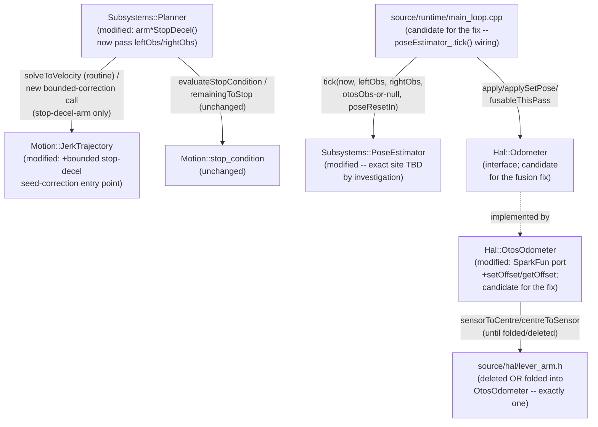

<!-- CLASI: Before changing code or making plans, review the SE process in CLAUDE.md -->

# Architecture Update -- Sprint 092: Motion & OTOS hardware fixes: bounded stop-decel seed correction, hardware pose-fusion investigation, and OTOS SparkFun library port

Source documents: `clasi/issues/d-t-terminal-reverse-persists-decel-reseed-from-plan-velocity.md`,
`clasi/issues/poseestimator-fused-pose-frozen-on-hardware.md`,
`clasi/issues/otos-lever-arm-necessity-and-library-port.md` (all three linked
to this sprint); `docs/architecture/architecture-update-089.md` (the
Ruckig/Planner migration this sprint's D/T fix directly extends) and
`docs/architecture/architecture-update-090.md` (the most recent rework of
`PoseEstimator`'s reset/fusability plumbing, load-bearing context for this
sprint's SUC-002); direct reads performed during this planning pass
(2026-07-08) of `source/motion/jerk_trajectory.{h,cpp}`,
`source/subsystems/planner.{h,cpp}`, `source/subsystems/pose_estimator.{h,cpp}`,
`source/hal/capability/odometer.h`, `source/hal/otos/otos_odometer.{h,cpp}`,
`source/hal/lever_arm.h`, `source/runtime/main_loop.cpp`, and
`clasi/sprints/done/089-.../tickets/done/006-...md`'s completion notes (for
the existing synthetic-observation sim-test pattern this sprint's own D/T
coverage reuses).

## Grounding in the current tree -- read this first

- **The D/T reverse-creep bug is narrowly localized to three call sites,
  already named in the issue.** `Subsystems::Planner::armDistanceStopDecel()`/
  `armVelocityStopDecel()`/`armRotationalStopDecel()` (`planner.cpp:730-770`)
  each call `linear_.solveToVelocity(0.0f, linearCeiling_)` and/or
  `rotational_.solveToVelocity(0.0f, rotationalCeiling_)` the instant a
  SMOOTH-style stop condition fires. Per 089 Decision 8, that solve is seeded
  from the channel's own remembered `lastVelocity_`/`lastAcceleration_` --
  which `Motion::JerkTrajectory::sample()` (`jerk_trajectory.cpp:170-179`)
  overwrites with the PLAN's theoretical value on every call, never the
  measured wheel speed. On hardware the bench-tuned `Hal::MotorVelocityPid`
  tracks loosely enough (measured ~250-310 mm/s on a commanded 200) that this
  seed is a poor proxy for the real wheel at the exact arm instant, so the
  resulting decel-to-rest trajectory commands a lower velocity than the wheel
  is actually running, and the PID brakes the difference into 11-23 mm of
  reverse creep (089-007's bench measurement).
- **089's divergence-triggered replan (Decision 10) does not, and structurally
  cannot, catch this case.** `maybeReplanDistance()`/`maybeReplanRotational()`
  (`planner.cpp:558-728`) only run while the goal's stop condition has NOT
  yet fired (guard 1); by the time `armXStopDecel()` runs, the stop has
  already fired this same tick, so guard 1 alone rules out any interaction.
  Separately, guard 2 (no-reverse-target: `Motion::remainingToStop()`'s
  projected remaining must be `> 0`) would, in this exact failure mode
  (plant already at/past the target when the stop fires), read a
  near-zero-or-negative remaining and skip a replan even if guard 1 did not
  already exclude it -- exactly the issue's own root-cause narrative ("the
  divergence replan correctly does NOT fire... its no-reverse-target guard
  skips"). This sprint's fix is a genuinely new, narrower mechanism, not a
  parameter tweak to an existing one.
- **`Motion::JerkTrajectory` already has a precedent for a narrow, guarded
  exception to Decision 8's "never seed from measured state" rule --
  `retarget()`/`reanchor()` (`jerk_trajectory.h:147-167`, added 089 Decision
  10).** Both are additional, purpose-built entry points alongside
  `solveToRest()`/`solveToVelocity()`, not a modification to either method's
  existing signature or seeding behavior; both keep the never-solves-backward
  guard, the divergence thresholds, and the rate limit OUTSIDE the class,
  enforced entirely by the caller (`Planner`). This sprint's stop-decel
  correction follows the identical shape: a new, narrow entry point, not a
  change to `solveToVelocity()`'s own contract.
- **`Subsystems::Planner::tick()` already has `leftObs`/`rightObs` in scope
  at every one of the three `armXStopDecel()` call sites** (`planner.cpp`'s
  `tick()` signature takes them, `armXStopDecel()` calls happen inside the
  same stop-evaluation loop that already reads `leftObs`/`rightObs` for
  `Motion::evaluateStopCondition()`). Threading a measured-velocity value
  into these three methods is a same-function-scope plumbing change, not a
  new dependency edge.
- **`Subsystems::PoseEstimator::tick()`'s sequencing is fully documented and
  has exactly one shared early-out.** (`pose_estimator.h:99-111`,
  confirmed by direct read of `pose_estimator.cpp`): step 0 drains
  `poseResetIn`; step 1, if `leftObs.position.has`/`rightObs.position.has` is
  false, the ENTIRE tick is skipped -- no encoder-accumulator advance
  (`encoderPose()`), no `EkfTiny::predict()` (`fusedPose()`); step 2 (valid
  tick) integrates the encoder delta into the encoder-only accumulator; step
  3 runs `EkfTiny::predict()` UNCONDITIONALLY (dead-reckoning always
  advances, with or without an odometer); step 4 runs
  `updatePosition()`/`updateHeading()` ONLY when `otosObs` is non-null and
  `otosObs->stamp.valid`. `Motion::stop_condition.cpp`'s `rotationProgress()`
  (RT's own completion path) ALSO gates on `leftObs.position.has`/
  `rightObs.position.has` -- the SAME two flags -- so a stuck-false `.has` on
  hardware cannot be the sole explanation for "`RT` unaffected, `TURN`/`G`
  frozen": if `.has` were false, `RT` would fail identically. This rules out
  the most obvious single-flag hypothesis and narrows the search (Decision
  5).
- **`encoderPose()`'s accumulation needs no `dt`; `EkfTiny::predict()`
  does.** Step 2 (encoder-only dead reckoning) integrates a pure position
  DELTA between this tick's encoder reading and `prevEncLeft_`/
  `prevEncRight_` -- no timestamp involved. Step 3 (`EkfTiny::predict()`)
  needs `dt` from `lastTick_`/`haveLastTick_`. If `now` (the main-loop clock
  argument `tick()` receives) were somehow not advancing correctly on
  hardware at this exact call site, `encoderPose()` would still accumulate
  normally while `fusedPose()` would freeze (a zero- or degenerate-`dt`
  `predict()` call changes nothing) -- a SHARPLY different signature from a
  stuck `.has` (which would freeze both readings identically). The 089-007
  bench evidence checked `pose=` (fused) against `enc=` (raw cumulative wheel
  telemetry, not `PoseEstimator::encoderPose()` itself) -- it does NOT yet
  establish whether `encoderPose()`/`encpose=` also froze. This single,
  cheap check is this sprint's fastest way to narrow the search space
  (Decision 5).
- **`PoseEstimator`'s only real-hardware pose-correction source is
  `Hal::OtosOdometer`; there is no separate "encoder odometer" HAL leaf.**
  Confirmed: `source/hal/capability/odometer.h` declares one interface;
  `source/hal/otos/otos_odometer.{h,cpp}` (real), `source/hal/sim/sim_odometer.{h,cpp}`
  (sim), and `source/hal/capability/null_odometer.h` (no-sensor default) are
  its only three implementations. `PoseEstimator`'s OWN encoder dead
  reckoning (steps 1-2 above) is internal to `PoseEstimator`, sourced
  directly from `msg::MotorState` arguments, never through the `Odometer`
  interface. This is why `otos-lever-arm-necessity-and-library-port.md`
  calls out that it "shares the OTOS-on-hardware fusion path" with the
  frozen-pose issue -- both touch the one hardware odometer leaf -- but it is
  NOT evidence that `OtosOdometer` is the frozen-pose root cause: a
  permanently-unfusable/disconnected `OtosOdometer` would only ever suppress
  step 4 (the OTOS correction), never steps 1-3 (encoder accumulation +
  predict), so it cannot by itself explain BOTH `encoderPose()` and
  `fusedPose()` freezing -- only `fusedPose()` freezing WHILE `encoderPose()`
  keeps advancing would be consistent with an OTOS-side (or EKF-predict-side)
  explanation; a frozen `encoderPose()` implicates step 1/2 instead
  (Decision 5).
- **`Hal::Odometer::fusableThisPass()`/`main_loop.cpp`'s `otosFusableThisPass`
  gate (090-002/090-003) only controls whether `otosObs` is null this pass --
  it does not gate `leftObs`/`rightObs` or steps 1-3 at all.** Confirmed by
  direct read of `main_loop.cpp:208-243`: `poseEstimator_.tick(now,
  bb.motors[p.left-1], bb.motors[p.right-1], otosFusableThisPass ? &bb.otos :
  nullptr, bb.poseResetIn)` -- `bb.motors[...]` (the `leftObs`/`rightObs`
  arguments) are passed unconditionally, regardless of
  `otosFusableThisPass`. A perpetually-`false` `fusableThisPass()` would
  suppress OTOS correction every pass (step 4 only) but cannot, by itself,
  freeze `encoderPose()` or stall `EkfTiny::predict()`'s dead-reckoning
  advance. This rules out "090/091's fusability rework broke everything" as
  a complete explanation, though it remains a candidate for a
  fusedPose()-only freeze (an EKF permanently rejecting every correction is
  a different failure shape than the EKF's `predict()` never running at
  all -- see Decision 5 for both candidates stated precisely).
- **`Hal::OtosOdometer` already implements the register map, scaling
  constants, and safety fixes 086-006/086-007 landed, but is a partial port,
  not a faithful line-by-line one.** Confirmed by direct read of
  `otos_odometer.{h,cpp}`: `kPosMmPerLsb`/`kHdgRadPerLsb` already match
  upstream's `kInt16ToMeter`/`kInt16ToRad`; `begin()`/`tick()`/`init()`/
  `resetTracking()`/`setPose()`/`setLinearScalar()`/`setAngularScalar()`
  exist. `REG_OFFSET` (`kRegOffXL`-equivalent) is deliberately NEVER
  written today -- the class's own file header states the prior "unwritable"
  finding as settled fact and routes mounting-offset compensation
  host-side via `source/hal/lever_arm.h` instead. There is no `setOffset()`/
  `getOffset()` method on this class at all today -- the issue's own
  suspicion (the identical write path/scaling already proven to work for
  the position registers) has never actually been re-tested against this
  driver, because the driver never tried.
- **`source/hal/lever_arm.h` has exactly one production consumer.**
  Confirmed: `LeverArm::sensorToCentre()`/`centreToSensor()` are called only
  from `otos_odometer.cpp` (`:148`, `:195` per the issue; direct read
  confirms both call sites live inside `OtosOdometer::tick()`/`setPose()`).
  Its own file header already documents the same-instant-heading contract
  this sprint's port work must preserve regardless of which end state
  (deleted or folded) this sprint lands in.

## Step 1: Understand the Problem

Three independent, hardware-confirmed-or-suspected defects remain from
sprint 089's own bench pass and a subsequent stakeholder design review, none
of which the sim's idealized plant reproduces on its own:

1. `D`/`T`/`TURN`/`RT`'s stop-triggered decel re-solve seeds from the plan's
   own believed velocity, which on hardware under-estimates the real wheel
   speed at the exact stop-arm instant, producing 11-23 mm of reverse creep
   (Grounding).
2. `Subsystems::PoseEstimator`'s fused pose (and possibly its encoder-only
   pose too -- unconfirmed, Grounding) does not accumulate on real hardware,
   blocking `TURN`/`G` completion.
3. `Hal::OtosOdometer` is a partial port of the upstream SparkFun OTOS
   library, and a plausible-but-unverified claim that its `REG_OFFSET`
   register is unwritable has never been re-tested against a driver that
   actually implements the write.

**What changes this sprint:** `Motion::JerkTrajectory` gains one new, narrow
entry point for a bounded, one-shot seed correction, used only by
`Subsystems::Planner`'s three stop-decel-arm methods (linear and rotational
channels alike); `Subsystems::PoseEstimator` (and/or `Hal::OtosOdometer`/the
`main_loop.cpp` wiring around it, depending on what the investigation finds)
gains a fix for the frozen-pose defect; `Hal::OtosOdometer` gains the ported
SparkFun register surface (`setOffset`/`getOffset` foremost) and, depending
on the bench re-test's outcome, either absorbs `source/hal/lever_arm.h`'s
two functions or the register write replaces host-side compensation
entirely and that file is deleted.

**What does not change in kind:** 089's overall Ruckig architecture (two
independent `Motion::JerkTrajectory` channels, `solveToRest()`/
`solveToVelocity()`'s existing seeding contract for every OTHER call site,
the divergence-triggered replan's own three guards) is unchanged --
this sprint adds a third, narrower exception alongside `retarget()`/
`reanchor()`, not a fourth trigger or a change to the existing two.
`Motion::stop_condition` (completion-signal math) is unchanged.
`Hal::Odometer`'s `apply()`/`fusableThisPass()` message-plane contract
(090-002) is unchanged unless Decision 5's investigation implicates it
directly -- flagged as an open question, not assumed.

## Step 2: Identify Responsibilities

| Responsibility | Changes independently because... |
|---|---|
| **Bounded stop-decel seed correction** -- nudge the velocity seed fed into a stop-triggered decel re-solve toward the measured wheel velocity, by at most a ticket-owned bound, exactly once per stop-arm event. | A narrow control-correctness concern living entirely inside `Motion::JerkTrajectory`'s existing seeding boundary and `Subsystems::Planner`'s existing stop-arm call sites; changes only if the correction's bound/policy itself changes, independent of both the goal-kind dispatch (unchanged) and the divergence-triggered replan (a different trigger, unchanged). |
| **Hardware pose-fusion root cause and fix** -- determine why `PoseEstimator`'s pose(s) do not accumulate from real wheel motion, and land a fix. | A diagnosis-and-repair concern scoped to whichever of `PoseEstimator::tick()`'s own sequencing, the `Hal::Odometer`/`OtosOdometer` fusion-admission path, or the `main_loop.cpp` wiring between them turns out to be at fault -- changes independently of the D/T control fix (a different subsystem, a different failure mode) and independently of the OTOS driver port (Grounding's own ruling-out of a simple shared-root-cause assumption). |
| **OTOS driver fidelity -- SparkFun library port** -- extend `Hal::OtosOdometer` to the full upstream register/primitive surface. | A driver-completeness concern, changing only as the upstream reference implementation's own surface is matched; independent of the pose-fusion investigation (Grounding: a suppressed OTOS correction cannot by itself explain the frozen-pose symptom) and of the D/T control fix. |
| **Lever-arm architecture disposition** -- finalize `source/hal/lever_arm.h` into exactly one end state based on the `REG_OFFSET` bench verdict. | Depends on the port (needs `setOffset`/`getOffset` to exist before it can be bench-tested) but is its own decision -- a code-architecture choice (delete vs. fold) conditioned on a bench result, not a mechanical consequence of the port itself. |

Grouping: the first row is a modification inside two already-cohesive
existing modules (`Motion::JerkTrajectory`, `Subsystems::Planner`) -- no new
module. The second row's exact module(s) affected are not yet known (that is
what the ticket investigates); Step 3 names the CANDIDATE modules and their
boundaries rather than asserting a specific one changes. The third and
fourth rows both modify `Hal::OtosOdometer` (and, for the fourth, delete or
fold `source/hal/lever_arm.h`) but are sequenced and reasoned about
separately (Decision 6/7).

## Step 3: Subsystems and Modules

| Module | Purpose (one sentence) | Boundary | Use cases served |
|---|---|---|---|
| `source/motion/jerk_trajectory.{h,cpp}` (**modified**) | Plan and sample one jerk-limited channel via Ruckig, now including a bounded, measurement-informed correction at the stop-decel handoff. | Inside: the new entry point's bounded-blend math and its own internal seed-state update. Outside: the threshold/guard/rate-limit POLICY of when to invoke it (Planner's job, mirroring `retarget()`/`reanchor()`'s existing split) -- this class still knows nothing about goal kinds or stop conditions. | SUC-001 |
| `source/subsystems/planner.{h,cpp}` (**modified**) | Stage goals, advance the active motion-generation mechanism, evaluate stop conditions, arm stop-triggered decels. | Inside: `armDistanceStopDecel()`/`armVelocityStopDecel()`/`armRotationalStopDecel()` gain a `leftObs`/`rightObs` parameter and call the new bounded-correction entry point instead of the plain `solveToVelocity(0, ...)`. Outside: goal-kind dispatch, the divergence-triggered replan (unchanged, different trigger), stop-condition math. | SUC-001 |
| `source/subsystems/pose_estimator.{h,cpp}` (**modified, exact change TBD by investigation**) | Fuse encoder dead-reckoning with an optional odometer reading into a believed pose. | Inside: `tick()`'s own sequencing (steps 0-4, Grounding); whichever step the investigation finds at fault. Outside: `Hal::Odometer`'s own fusion-admission contract (unless the investigation finds the DEFECT there instead -- see next row), `Motion::stop_condition`'s consumption of `fusedPose`. | SUC-002 |
| `source/hal/capability/odometer.h` / `source/hal/otos/otos_odometer.{h,cpp}` (**candidate for the pose-fusion fix; DEFINITELY modified for the SparkFun port**) | Read the real OTOS chip's tracked pose and expose it through the `Hal::Odometer` interface. | Inside: register I/O, scaling, the new `setOffset`/`getOffset`/full signal-process-config surface (SUC-003), `fusableThisPass()`'s reset-bookkeeping (090-002, unchanged unless implicated). Outside: `PoseEstimator`'s own dead-reckoning math, which never depends on this leaf being present (`Hal::NullOdometer` already proves this). | SUC-002 (conditionally), SUC-003, SUC-004 |
| `source/hal/lever_arm.h` (**deleted, or folded into the row above -- exactly one, per the bench verdict**) | Convert between the OTOS sensor's own mounting position and the chassis centre pose. | Today: a standalone, stateless namespace, one consumer. After this sprint: either gone (chip-native offset) or a private implementation detail of `OtosOdometer` (no longer standalone). | SUC-004 |
| `source/runtime/main_loop.cpp` (**candidate for the pose-fusion fix; otherwise unaffected**) | Wire each pass's HAL reads/commands through the Subsystems tier in a fixed sequence. | Inside: the exact `poseEstimator_.tick(...)` call site and its argument derivation (`otosFusableThisPass`, `bb.motors[...]`) -- read during investigation; touched only if the defect is found here. Outside: everything else this file orchestrates, unchanged. | SUC-002 (conditionally) |
| `Motion::stop_condition.{h,cpp}` (**unchanged**) | Evaluate whether a stop condition has fired against live feedback. | Reused as-is; the D/T fix does not touch completion logic, only the decel-arm seed. | SUC-001 |

Every module addresses at least one SUC; the pose-fusion investigation
(row 3/4/6) deliberately names candidate modules rather than asserting a
single certain one, per Grounding's own ruling-out of the simplest
hypotheses -- this is a diagnostic scope, not a guess dressed as a decision.
No module's one-sentence purpose needs "and." No new dependency cycle --
Step 4.

## Step 4: Diagrams

### Component / module diagram

8 nodes. `Planner -> JerkTrajectory` gains a new CALL shape on the existing
edge (the bounded-correction entry point), not a new edge -- mirrors 089
Revision 2's own precedent for `retarget()`/`reanchor()`. `MainLoop ->
PoseEstimator` and `MainLoop -> Hal::Odometer` are both PRE-EXISTING edges;
this sprint's pose-fusion fix, wherever it lands, modifies behavior on one
of these edges or inside one of the two endpoint modules -- it does not add
a new edge. `OtosOdometer -> LeverArm` is the one edge this sprint may
REMOVE entirely (if the register verdict is "honors it," Decision 7) rather
than add.

### Entity-relationship diagram

Not included -- no `msg::*`/wire schema change this sprint. The bounded
stop-decel correction reads existing `msg::MotorState` fields already
passed into `Planner::tick()`; the pose-fusion fix (whatever it turns out to
be) is expected to be a logic fix, not a data-model change (flagged as an
open question if investigation finds otherwise, Step 7); the OTOS port adds
C++-internal register constants/methods to `Hal::OtosOdometer`, not a new
`msg::*` type (`OdometerCommand`/`OdometerConfig` already exist, 084-008).

### Dependency graph

Not shown separately -- no new dependency edge. `Subsystems::Planner`
already depends on `Motion::JerkTrajectory` (089); `Subsystems::PoseEstimator`
already depends on nothing outside its own tick() arguments (it holds no
`Hal::` reference, by design -- `pose_estimator.h`'s own file header); the
`Hal::Odometer` interface and its `OtosOdometer` implementation already
exist. `source/hal/lever_arm.h` has exactly one dependent
(`OtosOdometer`) today and will have zero or that same one dependent
after this sprint -- never more.

## Step 5: What Changed, Why, Impact, Migration Concerns

### What Changed

- **`source/motion/jerk_trajectory.{h,cpp}`** -- one new entry point: a
  bounded, one-shot correction of the remembered seed velocity toward a
  caller-supplied measured velocity, clamped to a ticket-owned magnitude cap,
  used in place of the plain internal seed the instant a stop-triggered decel
  is armed. This is the SAME `solveToVelocity()`-style velocity-control mode
  (not a new mode) -- mirrors `retarget()`/`reanchor()`'s own "same mode,
  new invocation shape" precedent (089 Decision 10). Acceleration seeding is
  unaffected (still the channel's own remembered `lastAcceleration_`) -- only
  the velocity seed is corrected, since the confirmed root cause (Grounding)
  is specifically a velocity-tracking mismatch, not an acceleration one.
- **`source/subsystems/planner.{h,cpp}`** -- `armDistanceStopDecel()`/
  `armVelocityStopDecel()`/`armRotationalStopDecel()` gain `leftObs`/
  `rightObs` parameters (already in scope at every call site, Grounding) and
  compute an averaged measured velocity for the affected channel(s) --
  mirroring `maybeReplanDistance()`'s own existing per-wheel-averaging
  pattern -- passed to the new `JerkTrajectory` entry point instead of the
  plain `solveToVelocity(0, ...)` call.
- **`source/subsystems/pose_estimator.{h,cpp}` and/or
  `source/hal/otos/otos_odometer.{h,cpp}` and/or
  `source/runtime/main_loop.cpp`** -- exactly one of these (the ticket's own
  investigation determines which) gains the fix for the frozen-pose defect.
  This document does not pre-assert which, per Grounding's own ruling-out of
  the too-simple hypotheses; ticket 002 records the actual finding.
- **`source/hal/otos/otos_odometer.{h,cpp}`** -- gains the ported SparkFun
  surface: `setOffset()`/`getOffset()` (the register write this sprint's
  bench re-test needs), and whichever other upstream primitives
  (signal-process config detail, IMU calibration parity, product-ID check
  parity) the port finds genuinely missing relative to the upstream
  reference. Existing 086-007 bus-clearance/rate-limiting behavior is
  preserved unchanged (Decision 6).
- **`source/hal/lever_arm.h`** -- deleted (register confirmed working) or
  its two functions folded directly into `OtosOdometer` as private
  implementation details (default, Decision 7). `tests/sim/unit/
  lever_arm_harness.cpp`/`test_lever_arm.py` are deleted either way, their
  coverage subsumed by the chip-native path (if deleted) or folded into
  `otos_odometer_harness.cpp`'s own assertions (if folded).

### Why

The D/T fix (Decision 1-3) closes the one gap 089's own divergence-replan
mechanism structurally cannot reach (Grounding) -- a narrow, one-shot,
capped exception to Decision 8's seeding contract, at exactly the
call sites 089-007's bench evidence traced the defect to. The pose-fusion
fix addresses a pre-existing, hardware-only defect that blocks `TURN`/`G`
from ever completing on the stand -- sim cannot reproduce it, so root-cause
investigation (not a test-driven fix) is this sprint's actual method,
with sim regression coverage as the safety net rather than the reproduction.
The OTOS port and `REG_OFFSET` re-test resolve a real, if secondary, design
question: whether this project needs host-side lever-arm math at all, or
whether its prior "unwritable register" finding was itself a driver defect
(Grounding's own suspicion, inherited from the issue).

### Impact on Existing Components

| Component | Impact |
|---|---|
| `source/motion/jerk_trajectory.{h,cpp}` | **Modified, additive.** `solveToRest()`/`solveToVelocity()`/`retarget()`/`reanchor()`'s existing signatures and seeding behavior are UNCHANGED -- the new entry point is a fifth, narrower one. |
| `source/subsystems/planner.{h,cpp}` | **Modified.** Three private methods gain a parameter; the divergence-triggered replan (089 Decision 10) is untouched -- a different trigger, different guards, unaffected by this sprint. |
| `source/subsystems/pose_estimator.{h,cpp}` | **Modified (site TBD).** `tick()`'s public signature/sequencing contract (Grounding) is expected to be preserved -- the fix is expected to be internal, not a caller-visible change; flagged as an open question if investigation finds otherwise. |
| `source/hal/otos/otos_odometer.{h,cpp}` | **Modified, additive + one conditional deletion path.** 086-007's bus-clearance/rate-limiting fixes are untouched (Decision 6). |
| `source/hal/lever_arm.h` | **Deleted or absorbed** -- never left standalone (SUC-004). |
| `source/hal/capability/odometer.h` | **Unaffected unless Decision 5's investigation implicates the `fusableThisPass()`/reset-bookkeeping path directly** -- flagged, not assumed. |
| `source/runtime/main_loop.cpp` | **Unaffected unless Decision 5's investigation implicates the wiring itself** -- flagged, not assumed. |
| `Motion::stop_condition.{h,cpp}` | **Unaffected.** Completion-signal math is untouched by every change this sprint makes. |
| `docs/protocol-v2.md` | **Unaffected.** No wire verb/argument/reply-shape change. |

### Migration Concerns

- **No wire/data migration.** No `msg::*` field added or changed.
- **Sequencing: the OTOS port (ticket 003) must land before the
  `REG_OFFSET` bench re-test (ticket 004)** -- `setOffset()`/`getOffset()`
  do not exist until the port lands; this is a hard, mechanical
  prerequisite, matching 089 Decision 10's "build integration before usage"
  precedent.
- **The D/T fix and the pose-fusion fix are independent and may be executed
  in either order** -- different subsystems, different failure modes,
  no shared state. Ordered D/T first in this sprint only because it is the
  more fully-understood, more directly actionable of the two (Grounding
  already traces its exact root cause; the pose-fusion defect's exact
  location is still to be determined by ticket execution).
- **The bounded stop-decel correction's cap value(s) are ticket-owned,
  unmeasured constants** -- per this document's own anti-speculative-
  generality discipline (matching 089's treatment of its own divergence
  thresholds), named as constants (e.g. `kStopDecelSeedCorrectionCap`/
  `kRotStopDecelSeedCorrectionCap`) with default values characterized during
  sim-test design and refined at bench time, not invented here.
- **Bench verification is secondary, best-effort, for every ticket in this
  sprint** -- per the sprint's own constraint (relay dongle unplugged,
  direct-USB-only bench access): sim is the blocking gate; a bench step that
  cannot be completed is recorded honestly and descoped to a fresh
  `clasi/issues/` follow-on, never silently dropped and never blocking
  sprint close (mirroring 089 ticket 007's own descope precedent).
- **The pose-fusion fix's exact scope is genuinely open until ticket
  execution's own first diagnostic step** -- whether `encoderPose()` froze
  too, or only `fusedPose()` (Grounding) -- resolves which of this
  document's candidate modules (Step 3) is actually at fault. This is
  disclosed explicitly (Step 7) rather than guessed at.

## Step 6: Design Rationale

### Decision 1: The bounded correction lives inside `Motion::JerkTrajectory`, as a new entry point -- not as pre-adjustment logic inside `Planner`

**Context.** All three call sites (`armDistanceStopDecel()`/
`armVelocityStopDecel()`/`armRotationalStopDecel()`) need the identical
correction shape (blend the seed velocity toward a measured value, bounded).
The remembered seed state (`lastVelocity_`) is a private member of
`Motion::JerkTrajectory`; `Planner` has no access to it except through the
class's own public methods.

**Alternatives considered:** (a) expose a setter for `lastVelocity_` (or an
equivalent) and let `Planner` compute the bounded blend itself, once per
call site (three near-identical copies); (b) add one new `JerkTrajectory`
method that accepts a measured velocity and a cap, computes the bounded
blend internally against its own remembered seed, and solves --
**chosen**.

**Why this choice.** (b) keeps the seeding contract's enforcement inside the
one class that already owns it (mirrors `retarget()`/`reanchor()`'s
existing precedent exactly -- both are "the class computes the correction
against its own private state," never a caller-computed value poked in).
(a) would either force `lastVelocity_` to become non-private (breaking the
class's existing "the seeding contract is enforced here" boundary,
Grounding) or triplicate the same clamp arithmetic across three `Planner`
methods -- a shotgun-surgery risk if the bound's formula ever needs to
change (three edit sites instead of one).

**Consequences.** `Motion::JerkTrajectory` gains one new public method (name
and exact parameter shape are a ticket-002-owned -- rather, ticket-001-owned
-- implementation detail, not fixed here); `Planner`'s three call sites each
become a one-line call-site change (pass `leftObs`/`rightObs`-derived
measured velocity instead of nothing).

### Decision 2: The correction is a symmetric magnitude clamp, not a one-directional (only-correct-upward) rule

**Context.** The confirmed bench symptom is specifically the real wheel
running FASTER than the plan believes (measured ~250-310 mm/s vs. plan
~200). A correction could be written to only ever raise the seed toward a
faster measurement, never lower it.

**Alternatives considered:** (a) one-directional -- only correct the seed
upward, toward a faster measurement, never downward; (b) symmetric -- clamp
the correction's MAGNITUDE (the absolute difference between measured and
plan-believed velocity), regardless of sign, to a ticket-owned cap --
**chosen**.

**Why this choice.** (b) is simpler (one clamp, not a conditional plus a
clamp) and more general: nothing in the underlying mechanism (a
loosely-tracking PID) guarantees the mismatch is always in one direction --
a future robot, gearing, or PID tune could plausibly run slower than
believed instead. A one-directional rule would silently fail to correct
that case for no principled reason, and would need its own separate
justification for why only one direction matters. (a) is not proven
necessary by anything measured -- the bench evidence supports "bound the
correction," not "bound AND restrict its direction."

**Consequences.** The correction formula is a single `clamp(measured -
believed, -cap, +cap)` added to the believed seed, applied identically
regardless of which direction the real wheel diverges. No behavior change
for the routine case (small or zero divergence): the clamp is a no-op when
`|measured - believed| <= cap`.

### Decision 3: The correction fires exactly once per stop-arm event, never per tick -- and does not reopen the 087-009 limit-cycle risk

**Context.** 089 Decision 8's whole reason for existing is a previously-
fixed bug class: an earlier `applyStopAnticipation()` formula fed measured
wheel speed into a cap computation EVERY relevant tick, closing a loop
through the plant's own delayed velocity response and producing a traced
limit-cycle oscillation (velocity dipping to ~0 mid-approach, then
rebounding to 72 mm/s just before the stop fired, 087-009). Any new
measured-velocity consumer must be checked against this specific failure
mode, not just asserted safe.

**Alternatives considered:** (a) apply the bounded correction every tick
while `stopping_` is true (continuously nudging the seed toward
measurement as the decel proceeds); (b) apply it exactly once, at the
instant `armXStopDecel()` runs (the stop condition fires and the decel
trajectory is (re-)solved) -- after that one call, the held trajectory is
sampled repeatedly via the unmodified `sample()` path, with no further
seed correction until (if ever) a NEW stop-arm event occurs -- **chosen**.

**Why this choice.** (b) is a single, bounded, one-shot correction at a
MODE-TRANSITION instant (goal-running -> stop-triggered decel), structurally
different from 087-009's bug: that bug's feedback loop existed because the
SAME formula ran every tick DURING an ongoing approach, continuously
re-coupling the commanded value to a delayed measurement. Here, the
corrected solve happens once; the resulting trajectory is then a fixed,
open-loop plan for the remainder of the decel, identical in kind to every
other `solveToVelocity()`/`solveToRest()` call 089 already established as
safe (Decision 8's own "seed once, sample many times" pattern) -- the ONLY
difference is what value seeds that one solve. (a) was rejected without
implementation specifically because it WOULD reintroduce the every-tick
shape of 087-009's bug (a persistent, iterative closing of the loop through
measurement), for no evidenced benefit over a single correction at the
handoff -- the confirmed defect (Grounding) is about the SEED at the
handoff instant, not about ongoing tracking during the decel itself.

**Consequences.** This must be provable in sim, not just argued: the sim
test suite (ticket 001) includes a scenario asserting the corrected decel
trajectory converges MONOTONICALLY to rest (no dip-then-rebound) under an
injected divergence -- the specific, checkable signature that would appear
if this reasoning were wrong. If that scenario cannot be made to pass
without reintroducing oscillation, ticket 001 must flag this for a
stakeholder decision (per the sprint's own exception protocol) rather than
ship a blind control change -- see Step 7.

### Decision 4: Correction cap values are ticket-owned constants, not specified here

**Context.** Mirrors 089 Decision 10's own treatment of its divergence
thresholds -- a numeric bound is needed, but this document has no bench
data yet to set one correctly.

**Alternatives considered:** (a) specify an exact cap value here, derived
from the 089-007 bench numbers (measured ~250-310 vs. commanded 200, so a
cap of roughly 50-110 mm/s); (b) name the cap as a ticket-owned constant
(e.g. `kStopDecelSeedCorrectionCap`/`kRotStopDecelSeedCorrectionCap`),
characterized during sim-test design and refined at bench time --
**chosen**.

**Why this choice.** (b) follows this codebase's own established pattern
(089's `kDivergenceThreshold`/`kGrossDivergenceThreshold`/
`kMinReplanInterval`, all ticket-owned) precisely because a single bench
run's numbers are a starting point, not a validated constant -- inventing
an exact value here, before the sim test that must exercise it even exists,
would be premature precision.

**Consequences.** Ticket 001 picks an initial value (informed by the
089-007 bench numbers cited in Grounding), justifies it in the sim test's
own comments, and the bench step (best-effort) either confirms it or
records a refinement need as a follow-on.

### Decision 5: The pose-fusion investigation is scoped to two named candidate mechanisms, not a single asserted root cause

**Context.** Grounding rules out the two simplest hypotheses (a stuck
`.has` flag -- would also break `RT`, which it does not; a stuck
`fusableThisPass()` -- cannot by itself explain a frozen `encoderPose()`,
since it only gates step 4). Two more specific, still-unconfirmed
candidates remain, distinguished by one cheap diagnostic.

**Alternatives considered:** (a) assert a specific root cause and design
its fix now, without the diagnostic data to support the assertion; (b)
name the diagnostic (does `encoderPose()`/`encpose=` freeze too, or only
`fusedPose()`/`pose=`?) and the two candidate mechanisms it discriminates
between, leaving the actual fix to ticket execution -- **chosen**.

**Why this choice.** (a) would be exactly the kind of unverified,
speculative design this document's own quality bar (and 089's precedent,
e.g. Open Question 3's dead-time-offset question) explicitly avoids --
inventing a fix for a mechanism not yet confirmed risks solving the wrong
problem. (b) is honest about what is and is not yet known, while still
giving ticket execution a fast, concrete starting point instead of an
open-ended "go investigate everything" mandate:
- **Candidate A (both readings frozen):** `PoseEstimator::tick()`'s step 1
  guard (`leftObs.position.has`/`rightObs.position.has`) is failing on
  hardware for a reason NOT shared with `Motion::stop_condition.cpp`'s
  identical-looking guard (e.g., a difference in WHICH `MotorState` reaches
  `PoseEstimator::tick()` vs. `Planner::tick()`/`evaluateStopCondition()` --
  worth checking `main_loop.cpp`'s exact `bb.motors[p.left-1]`/
  `bb.motors[p.right-1]` indexing against whatever `Planner`/`stop_condition`
  actually read), or a `haveEncBaseline_`/`encBaselineResetPending_`
  bookkeeping issue that perpetually treats every tick as "no prior
  baseline" (each such tick reports zero delta, matching a frozen
  `encoderPose()` even with a real, non-frozen `.has`).
- **Candidate B (only `fusedPose()` frozen, `encoderPose()` fine):**
  `EkfTiny::predict()`'s `dt` computation (`haveLastTick_`/`lastTick_`) is
  degenerate on hardware (Grounding), or `EkfTiny`'s own state/covariance has
  entered a numerically stuck condition (e.g. a NaN or a covariance collapse
  from an early bad correction) that persists across every subsequent
  `predict()` call.

**Consequences.** Ticket 002's FIRST step is the cheap diagnostic
(Grounding), not a deep dive into either candidate blind. Whichever
candidate the diagnostic points to determines which module in Step 3's
table is actually modified -- this document deliberately does not commit
to one in advance.

### Decision 6: The SparkFun port extends the existing `OtosOdometer` class in place -- not a rewrite, not a new class

**Context.** `Hal::OtosOdometer` already implements the register map,
scaling constants, and two hard-won hardware-stability fixes (086-007's
bus-clearance/rate-limiting). The port needs to ADD primitives
(`setOffset`/`getOffset` foremost), not replace working code.

**Alternatives considered:** (a) rewrite `OtosOdometer` from the upstream
reference top to bottom, re-deriving the bus-safety fixes from scratch; (b)
extend the existing class in place, adding only the missing upstream
primitives, leaving 086-007's already-hard-won bus-clearance/rate-limiting
logic untouched -- **chosen**.

**Why this choice.** (a) would risk silently regressing the exact
CODAL `NRF52I2C::waitForStop()` stall 086-007 spent real stand time
eliminating (Grounding) -- a rewrite has no reason to reintroduce it, but
also no structural guarantee against it, whereas (b) cannot regress code it
never touches. (b) also matches the issue's own framing ("port... near
line-by-line" is about matching the upstream PRIMITIVE surface -- register
map, scaling, calibration -- not about matching upstream's own bus-timing
strategy, which this project's hardware-specific fixes already supersede
for good, traced reasons.

**Consequences.** `otos_odometer.{h,cpp}`'s existing `kBusClearance`/
`kReadPeriod`/`readPositionVelocity()` burst-read consolidation are
untouched; the new `setOffset()`/`getOffset()` (and any other genuinely
missing primitive the port finds) are added using the SAME
`writeReg8()`/`readReg8()`-style helpers already in the class, carrying the
same `kBusClearance` discipline every existing register access already
uses.

### Decision 7: Lever-arm disposition defaults to FOLD when the bench verdict is unavailable or inconclusive -- DELETE requires positive confirmation

**Context.** The issue's own acceptance bar is "the driver left in exactly
one of the two end states... never standalone." This sprint's bench access
is best-effort (relay unplugged, direct-USB-only) -- the re-test may not be
completable.

**Alternatives considered:** (a) delete `lever_arm.h` unconditionally, on
the assumption the issue's own suspicion (the register write path is
identical to the already-working position-register path) is correct; (b)
leave the disposition genuinely open/unresolved if the bench cannot run,
violating the issue's own "never standalone" bar; (c) default to FOLD
(keep host-side compensation, but no longer standalone) whenever the bench
verdict is unavailable or inconclusive, upgrading to DELETE only on a
clean, positive bench confirmation that the chip honors the register --
**chosen**.

**Why this choice.** (a) treats a plausible suspicion as a confirmed fact
without the evidence this sprint's own scoping says must come from a real
bench re-test -- deleting a working compensation mechanism on an
unconfirmed assumption is the riskier direction of error (a wrong deletion
produces the `db11b7c`-class phantom-translation regression on hardware,
silently, since sim cannot detect a lever-arm math omission that only
manifests as a mounting-offset error). (b) fails this sprint's own explicit
acceptance bar. (c) is the conservative default any inconclusive-evidence
policy should take here: the DOWNSIDE of wrongly keeping (and folding) a
compensation that turns out to be unnecessary is a small amount of
avoidable code (a future sprint's easy cleanup once the bench is
achievable again); the downside of wrongly deleting a compensation that IS
necessary is a live-hardware regression. The two error costs are not
symmetric, so the default should not be either.

**Consequences.** Ticket 004's code-side deliverable (fold `lever_arm.h`'s
two functions into `OtosOdometer` as private methods, delete the standalone
file and its dedicated tests, fold their assertions into
`otos_odometer_harness.cpp`) is achievable and sim-testable regardless of
bench outcome -- this is the BLOCKING acceptance. Only a clean, positive
bench confirmation upgrades the outcome to full deletion of the
compensation math itself (not just the standalone file). If the bench
cannot run this sprint, a follow-on issue carries the re-test forward.

## Step 7: Open Questions

1. **Can the bounded stop-decel correction be proven safe against the
   087-009 limit-cycle signature in sim, or does it need a stakeholder
   decision?** Decision 3 argues it structurally cannot reopen that bug
   class (a one-shot correction at a mode transition, not a per-tick
   feedback loop) -- but this is an argument, not yet a proof. Ticket 001
   must attempt the monotonic-convergence sim scenario (Decision 3's own
   consequence); if it cannot be made to pass cleanly, this becomes a
   stakeholder decision (per the sprint's exception protocol) between this
   sprint's approach, issue 1's option (b) (retune the velocity PID), or
   option (c) (an accepted terminal-tolerance bar) -- not a silent fallback.
2. **Does `encoderPose()` (`encpose=`) freeze on hardware alongside
   `fusedPose()` (`pose=`), or only the latter?** Decision 5's own
   diagnostic; genuinely unknown until ticket 002 checks it (a fresh bench
   capture, or the existing 089-007 raw trace if it happens to already
   contain `encpose=` samples).
3. **Is the pose-fusion defect's fix confined to `PoseEstimator`/
   `OtosOdometer`/`main_loop.cpp`'s own internals, or could it require a
   `Hal::Odometer` interface change?** This document assumes (Step 5's
   Impact table) the fix is internal; flagged in case ticket 002's own
   investigation finds otherwise.
4. **What is `setOffset()`/`getOffset()`'s exact register-write sequencing
   relative to the chip's own internal Kalman/tracking state?** The upstream
   reference presumably documents whether the offset must be set before or
   after `resetTracking()`/`init()` for it to take effect cleanly -- ticket
   003 should confirm this from the upstream source directly rather than
   guessing at an ordering.
5. **If the `REG_OFFSET` bench re-test is not achievable this sprint (relay
   unplugged is not itself a blocker here, since this is a direct-USB bench
   step, but robot availability/wedging could still prevent it), does the
   FOLD default (Decision 7) get revisited in a dedicated small follow-on
   sprint, or folded into whatever sprint next touches the OTOS driver?**
   Not decided here -- the follow-on issue ticket 004 files (if the bench
   cannot run) should let the team-lead/stakeholder make that call with
   fresh context, not pre-commit to a specific future sprint.

## Architecture Self-Review

**Consistency.** Step 5's What Changed/Impact/Migration Concerns name every
module Step 3 lists and no others; every Decision in Step 6 is referenced by
name from Step 5. The Grounding section's claims (the three exact call
sites for the D/T bug, 089 Decision 10's guards structurally excluding an
overlap, `retarget()`/`reanchor()`'s existing precedent, `PoseEstimator`'s
exact tick() sequencing, the `.has`-shared-with-RT ruling-out, the
`fusableThisPass()`-cannot-freeze-encoderPose ruling-out, `OtosOdometer`'s
existing register/scaling parity, `lever_arm.h`'s single consumer) are each
cited from a direct read, not asserted from memory. Internally consistent:
nothing in Step 5/6 contradicts Step 3's module table or Step 4's diagram.

**Codebase Alignment.** Every file path, method name, and line-range-scale
claim in Grounding was confirmed by direct read during this planning pass
(2026-07-08), not carried over from a prior sprint's document without
re-verification -- 089's architecture-update.md itself was re-read, but its
claims about `armXStopDecel()`/`JerkTrajectory`'s current shape were
independently re-confirmed against the ACTUAL current `planner.cpp`/
`jerk_trajectory.h`, not assumed unchanged since 089 closed (a real risk,
given 090/091 also touched adjacent code). Sprints 090/091's own changes
(`Hal::Odometer::fusableThisPass()`, `main_loop.cpp`'s drain/tick wiring)
were read directly, not inferred from their own sprint's architecture
document alone, precisely because this sprint's pose-fusion investigation
depends on that wiring being accurately understood.

**Design Quality.** Cohesion: each of the four responsibility groups (Step
2) changes for one clearly-stated reason; none needs "and" in its purpose
sentence. Coupling: the D/T fix's new `JerkTrajectory` entry point is
narrower than, and does not modify, any existing public method; the
pose-fusion investigation deliberately does not commit to touching more
than one candidate module. Boundaries: `Motion::JerkTrajectory` still
enforces its own seeding contract internally (Decision 1); `Planner` still
owns policy/guards (unchanged division of labor from 089). Dependency
direction: unchanged from 089/090 -- `Subsystems` depends on `Motion`/`Hal`
interfaces, never the reverse; no new edge, no cycle (Step 4).

**Anti-Pattern Detection.** No god component -- each module's responsibility
stays narrow. No shotgun surgery -- the D/T fix touches exactly two files
(`jerk_trajectory.{h,cpp}`, `planner.{h,cpp}`) via one new entry point and
three call-site edits, not a scattered set of copies (Decision 1's own
argument against alternative (a)). No feature envy -- `Planner` does not
reach into `JerkTrajectory`'s private seed state; the correction stays
inside the class that owns it. No circular dependencies (Step 4). No leaky
abstraction -- the new entry point's public signature stays in terms of
`float`/`State`, matching every other `JerkTrajectory` method (089's own
established discipline). No speculative generality -- the correction cap is
a single bounded scalar per channel, not a generalized "measured-feedback
policy" framework; the pose-fusion fix is scoped to what was actually
observed broken, not generalized to a broader re-architecture of pose
fusion pre-emptively.

**Risks.** The bounded correction is a genuine control-behavior change on
real hardware -- Decision 3's own argument must hold up under the sim test
ticket 001 writes, or this escalates to a stakeholder decision (Open
Question 1) rather than shipping unproven. The pose-fusion fix's exact
scope is unknown until ticket 002's own first diagnostic step -- this is
disclosed, not hidden, and the ticket's acceptance is structured (sim green
+ recorded root cause) so an inconclusive-but-honest outcome does not block
sprint close. The lever-arm disposition risks a live-hardware regression if
resolved by unconfirmed assumption rather than bench evidence or the
conservative FOLD default (Decision 7) -- mitigated by making FOLD the
explicit default rather than DELETE.

**Verdict: APPROVE.** No structural issues (no circular dependencies, no god
component, no broken interface, no inconsistency between this section and
the document body). The two genuinely open items (Open Questions 1 and 2)
are disclosed, not silently assumed, and both have a defined resolution
path (stakeholder decision; a cheap ticket-002 diagnostic) rather than being
left ambiguous for ticket execution to guess at -- proceeding to ticketing.
