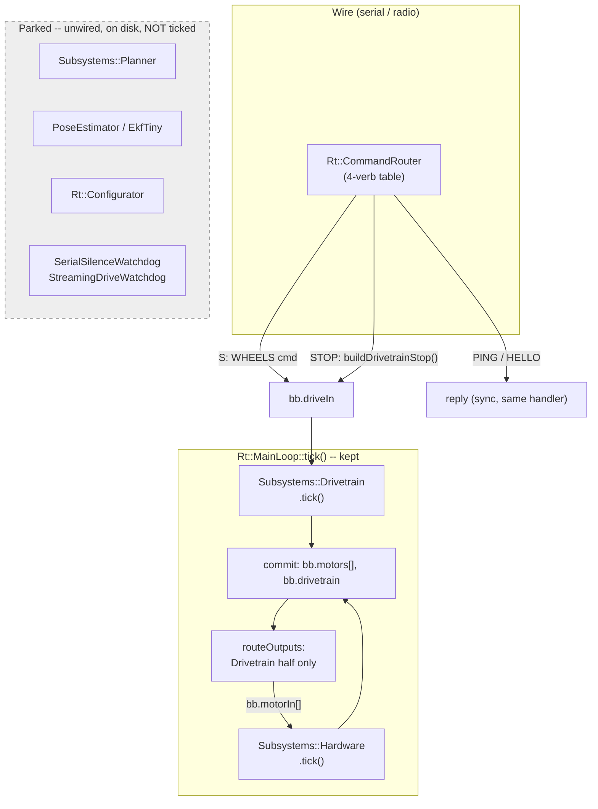
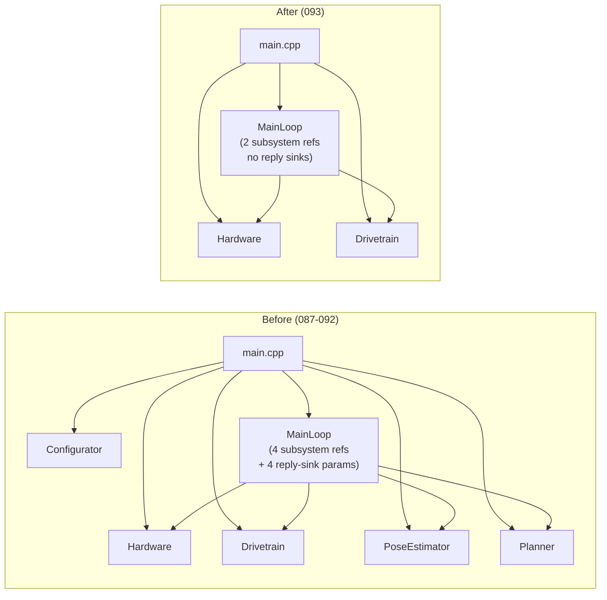

<!-- CLASI: Before changing code or making plans, review the SE process in CLAUDE.md -->

# Architecture Update -- Sprint 093: Simplify the main loop — bare wheel-driving executive

## Step 1: Understand the Problem

`Rt::MainLoop::tick()` (`source/runtime/main_loop.cpp`, 280+ lines) has grown
into a single-pass orchestrator of seven concerns: the serial-silence safety
watchdog + `estop()`, the streaming-drive watchdog, the odometer tick/drain,
`PoseEstimator`/`EkfTiny` fusion, the `Planner` motion-goal executor (which
`S`/`T`/`D`/`R`/`TURN`/`RT`/`G` all feed through `bb.motionIn`), loop-
originated `EVT`/`TLM` wire output, and two-plane output routing for both
`Drivetrain` and `Planner`. The command surface is ~30 verbs across seven
family files. Even the simplest verb, `S`, doesn't drive the wheels: it
converts wheel speeds to a body twist, hands it to the Planner, which ramps
it and converts back to wheels — three translations for what the stakeholder
wants to be a direct assignment.

The stakeholder's instruction (2026-07-08, verbatim): *"We're going to strip
out all the shit from the main loop and make it be simple, focusing on the
drivetrain… The planner is out… What I want to have is a real simple main
loop. It should read like a shopping list, not like a Tolstoy novel."* No
prints/EVT/telemetry in the loop either.

This sprint does not refactor the loop — it deletes nearly everything from
it and rebuilds `tick()` as a four-line command→wheels path, while leaving
every removed **class** (`Planner`, `PoseEstimator`, `EkfTiny`, both
watchdogs, `Rt::Configurator`) parked, un-wired, on disk. It is scoped
strictly to the gut: relocating motion planning (Ruckig) into `Drivetrain` is
explicitly a **separate, already-drafted future sprint**
(`drivetrain-becomes-the-motion-planner-segment-executing-subsystem.md`,
`communicator-drivetrain-motion-command-segment.md`) and is out of scope
here — this sprint's job is only to leave that seam clean.

## Step 2: Identify Responsibilities

Responsibilities the current loop bundles, and what happens to each this
sprint:

1. **Safety supervision** (serial-silence watchdog, streaming-drive
   watchdog, `estop()`) — **removed from the tick**, stakeholder-owned,
   acceptable only because the robot runs on a stand with wheels off the
   ground.
2. **Hardware I/O commit** (`Hardware::tick()`, per-port state commit) —
   **kept**, unchanged.
3. **Direct wheel-target governance** (`Drivetrain::tick()`/`apply()`,
   authority arbitration, capability clamping) — **kept**, unchanged; this
   is the one subsystem the sprint keeps ticking beyond raw hardware.
4. **Body-twist kinematics + motion-goal closure** (`Planner`,
   `BodyKinematics::forward()`, stop-condition evaluation) — **removed from
   the tick and from `S`'s handler**; `S` now posts wheel targets straight to
   `Drivetrain`, no twist conversion, no ramp, no stop clauses.
5. **Pose estimation** (`PoseEstimator`, `EkfTiny`, odometer tick/drain) —
   **removed from the tick**; nothing in the four-verb surface needs a pose.
6. **Runtime config application** (`Rt::Configurator`, `bb.configIn`) —
   **removed from both composition roots**; boot config is applied once,
   directly, at construction (`drivetrain.configure(dtConfig)` stays; the
   `SET`/`GET` runtime path that Configurator existed to serve is gone with
   `configCommands`).
7. **Loop-originated wire output** (`EVT` for watchdog/safety_stop/goal-done,
   periodic `TLM`) — **removed by removing its producers**, not replaced by
   a queue. See Decision 1 below — this also resolves the companion issue
   `get-wire-output-events-telemetry-out-of-the-main-loop.md`.
8. **Command surface** (`Rt::CommandRouter`'s table: `system`, `dev`,
   `telemetry`, `motion`, `config`, `pose`, `otos` families) — **reduced to
   four verbs**: `PING`, `HELLO` (from `systemCommands()`), `S`, `STOP`
   (rewritten in `motionCommands()`). The other five families' files and
   handler functions are untouched on disk; `buildTable()` simply stops
   calling them.

Grouping: responsibilities 2+3 (hardware + drivetrain governance) are the
ONE thing that survives ticking — everything else is either deleted from the
tick (4, 5, 6, 7, safety half of 1) or reduced to a pass-through (8). These
group naturally into two modules below: the unchanged `Hardware`/`Drivetrain`
pair, and the shrunk `MainLoop`/`CommandRouter` pair that wires them to the
wire protocol.

## Step 3: Define Subsystems and Modules

### `Rt::MainLoop` (modified, not new)
- **Purpose**: Ticks `Hardware` and `Drivetrain` once per pass and commits
  their state.
- **Boundary**: Inside — the two subsystem references, the per-pass
  tick/commit/route sequence. Outside — command parsing (CommandRouter),
  wire formatting (CommandProcessor/telemetry_commands, now unreferenced by
  the loop entirely), config application (gone), safety supervision (gone).
- **Use cases served**: SUC-001, SUC-002.

### `Subsystems::Drivetrain` (unchanged)
- **Purpose**: Governs the bound wheel pair's authority and targets.
- **Boundary**: Inside — `WHEELS`/`TWIST`/`NEUTRAL` control-kind dispatch,
  authority-steal/standby, capability clamping. Outside — kinematics
  (deleted call site was in `motion_commands.cpp`, not here), motion-goal
  closure (`Planner`'s job, now unwired).
- **Use cases served**: SUC-001, SUC-002.

### `Subsystems::Hardware` / `NezhaHardware` (unchanged)
- **Purpose**: Applies staged per-port motor commands to the real (or
  simulated) actuators and reports their state.
- **Boundary**: Inside — per-port PID, encoder read, capability reporting.
  Outside — everything above.
- **Use cases served**: SUC-001, SUC-002.

### `Rt::CommandRouter` (modified, not new)
- **Purpose**: Dispatches an inbound wire line to exactly one of four
  registered handlers.
- **Boundary**: Inside — the four-entry table (`buildTable()`), reply-
  channel selection. Outside — everything the four verbs' handlers do
  themselves (that is `source/commands/*.cpp`'s job).
- **Use cases served**: SUC-001, SUC-002, SUC-003.

### `source/commands/motion_commands.cpp` — `handleS`/`handleStop` (modified)
- **Purpose**: Translates the wire `S`/`STOP` verbs into a
  `msg::DrivetrainCommand` posted to `bb.driveIn`.
- **Boundary**: Inside — arg parsing (`±1000` clamp), command construction.
  Outside — kinematics, ramp, stop-condition evaluation (all deleted from
  this path); the class itself (`Planner`) that used to own those.
- **Use cases served**: SUC-001, SUC-002.

### `source/main.cpp` / `tests/_infra/sim/sim_api.cpp` (modified, not new)
- **Purpose**: Composition root — constructs `Hardware`, `Drivetrain`,
  `Blackboard`, `CommandRouter`, `MainLoop`; runs the slack loop (real) or
  exposes the C ABI (sim).
- **Boundary**: Inside — construction and wiring only. Outside — anything
  the loop or a command handler does at runtime.
- **Use cases served**: SUC-001, SUC-002, SUC-003.

### Parked, unwired classes (files unchanged, presence only)
`Subsystems::Planner`, `Subsystems::PoseEstimator`, `EkfTiny`,
`Rt::Configurator`, `SerialSilenceWatchdog`, `StreamingDriveWatchdog`, and
the command family files `dev_commands.{h,cpp}`, `config_commands.{h,cpp}`,
`pose_commands.{h,cpp}`, `otos_commands.{h,cpp}`, `telemetry_commands.{h,cpp}`
— no responsibility, by design, for the duration of this sprint. Their
purpose statements are unchanged from prior architecture docs; they simply
have no caller.

## Step 4: Diagrams

### Component diagram — the new loop (kept vs. removed)

### Dependency graph — composition root wiring (before → after)

No entity-relationship diagram: this sprint changes no persisted/wire data
model (no new message fields, no schema). `msg::DrivetrainCommand`/
`msg::WheelTargets` are reused as-is from `messages/drivetrain.h`.

## Step 5: Complete the Document

### What Changed

- **`source/runtime/main_loop.h`/`.cpp`**: `MainLoop`'s constructor drops
  `poseEstimator`, `planner`, and all four `ReplyFn`/`ctx` parameters —
  down to `MainLoop(Hardware&, Drivetrain&)`. `tick()` shrinks to: tick
  Hardware, tick Drivetrain, commit `bb.motors[]`/`bb.drivetrain`, route
  Drivetrain's own output back to `bb.motorIn[]`. `serviceWatchdogs()`,
  `estop()`, the odometer/pose/planner portions of `commit()`, the Planner
  half of `routeOutputs()`, and the periodic-telemetry block are deleted.
  `watchdog_`, `streamWatchdog_`, `activeVelocityVerb_`, and the four
  reply-sink fields are deleted from the class. `feedWatchdog()` is deleted
  (no watchdog left to feed).
- **`source/main.cpp`**: stops constructing `PoseEstimator`, `Planner`,
  `Rt::Configurator`; drops `defaultPlannerConfig()`, the `bb.motorCaps[]`/
  `bb.otosPresent` boot seeding (no longer read by any live verb), and
  `loop.feedWatchdog(...)` calls (boot and slack). Keeps
  `drivetrain.configure(dtConfig)` and
  `drivetrain.setMotorCapabilities(...)` — governance still needs them. The
  slack loop becomes `comm.tick() → route (if a command arrived) → yield
  once per slack`; the `configurator.pending()/applyOne()` branch is
  deleted. The `uBit.sleep(1)`-once-per-slack yield is UNCHANGED (093's
  prior fix, unrelated to this gut — still required for radio RX delivery).
- **`tests/_infra/sim/sim_api.cpp`**: `SimHandle` drops its
  `PoseEstimator`/`Planner`/`Configurator` members and the
  `asyncStore`/`syncStoreRadio`/`syncStoreSerial` three-store split narrows
  — `MainLoop` no longer takes reply sinks, so `asyncStore` has no writer.
  `sim_tick()`/`sim_command_on()` drop their `configurator.pending()` drain
  loops. `sim_get_async_evts()` is KEPT as a C ABI stub (always returns 0
  bytes) rather than deleted, so the existing ctypes binding
  (`host/robot_radio/io/sim_conn.py`) does not need a matching change this
  sprint (see Decision 4).
- **`source/runtime/command_router.cpp`**: `buildTable()` stops calling
  `devCommands()`, `telemetryCommands()`, `configCommands()`, `poseCommands()`,
  `otosCommands()` — only `systemCommands()` (PING/HELLO) + the (rewritten)
  `motionCommands()` remain.
- **`source/commands/motion_commands.cpp`**: `handleS` drops
  `BodyKinematics::forward()`, stop-clause parsing, and the `bb.motionIn`
  post; builds `msg::DrivetrainCommand{WHEELS}` directly and posts to
  `bb.driveIn`. `handleStop` posts `buildDrivetrainStop(msg::Neutral::BRAKE)`
  to `bb.driveIn` (a helper already declared in `dev_commands.h`, included
  here even though the `DEV` family stays unregistered). `T`/`D`/`R`/`TURN`/
  `RT`/`G` handlers are left in place, source-unchanged, simply
  unregistered.
- **`tests/sim/`**: obsoleted unit/system tests moved to a parked location
  (Decision 3); `tests/sim/conftest.py`'s `sim` fixture drops the
  `s.command("DEV WD ...")` widen call (the watchdog it widens no longer
  exists); a small focused suite proves `S`/`STOP`/`PING`/`HELLO`.

### Why

Every change traces to the stakeholder's instruction: shrink the loop to a
"shopping list" — one thing per line, drivetrain-and-hardware only — and
reduce the live command surface to match. See Step 1.

### Impact on Existing Components

- **Behavior change (accepted)**: `S` no longer ramps. Wheel-velocity
  targets are applied immediately; the `NezhaMotor` PID tracks them at
  whatever rate its own gains allow. All accel/decel/dead-time shaping lived
  in `Planner` and disappears with it.
- **Behavior change (accepted, safety-relevant)**: no serial-silence
  watchdog, no `estop()`, no streaming-drive watchdog. A wire stall no
  longer neutralizes the motors. Justified ONLY by the stand-mounted,
  wheels-off-the-ground bench posture (`.claude/rules/hardware-bench-testing.md`).
  See Decision 2 and SUC-004.
- **Behavior change (accepted)**: no `EVT`, no `TLM`, no `GET`/`SET`, no
  `STREAM`/`SNAP`, no pose/OTOS verbs. Any host tool (TestGUI, `robot_radio`)
  that depends on those verbs will get `ERR unknown` — this sprint does not
  touch host-side code; that fallout is explicitly accepted for the bench-
  bring-up phase this sprint targets.
- **`tests/sim/`**: the CLASI close-gate suite loses most of its current
  scope (Planner goal closure, pose/EKF, telemetry, config, otos, most
  motion verbs). Decision 3 describes the parking scheme.
- **No wire protocol/schema change**: `msg::DrivetrainCommand`/
  `msg::WheelTargets` are pre-existing types, reused, not modified. No
  `docs/protocol-v2.md` update is in scope beyond noting (in a later
  ticket, out of THIS sprint's file list, but worth flagging as an open
  question — Step 7) that the live verb table has shrunk.

### Migration Concerns

- **No data migration** — no persisted state, no schema.
- **No deployment sequencing risk beyond the usual flash-and-verify** — this
  is firmware; a rollback is a re-flash of the pre-093 `.hex`.
- **Reversibility is the point**: because removed classes/files are parked
  rather than deleted, un-wiring this sprint's changes (re-adding
  `PoseEstimator`/`Planner`/`Configurator` construction, restoring
  `buildTable()`'s five families) is a bounded, mechanical operation against
  code that still compiles standalone — not an archaeology project.

## Step 6: Design Rationale

### Decision 1 — Loop-originated wire output: removed, not queued

**Context**: The companion issue
`get-wire-output-events-telemetry-out-of-the-main-loop.md` designed an
`eventsOut`/`telemetryOut` queue pair + a `drainLoopOutputs()` wire-layer
drain, so `MainLoop` would post typed messages instead of formatting/sending
wire text inline. That design assumed the loop would keep producing events
(watchdog fire, `safety_stop`, goal-done) and periodic telemetry.

**Alternatives considered**:
1. Build the queue+drain seam as designed, wire it to the (now much smaller)
   set of remaining loop-originated outputs.
2. Remove the producers outright — once the watchdogs, `Planner`, and
   periodic-telemetry gating are gone, there is nothing left in `tick()`
   that originates wire output.

**Why this choice**: Option 2. The gut removes every producer the queue
design existed to serve — `serviceWatchdogs()`'s `EVT dev_watchdog`, the
stream-watchdog's `EVT safety_stop`, `Planner`'s `EVT done`, and periodic
`TLM`. Building a queue+drain seam for zero producers is speculative
generality with no current caller — it would be dead infrastructure the
instant it compiled. `S`/`STOP`/`PING`/`HELLO` all reply synchronously
through the command handler's own `ReplyFn`/`ctx` (`CommandRouter::route()`'s
existing per-command reply channel) — no loop-originated wire output remains
by construction, so option 2 satisfies the companion issue's end state (zero
string-copying, zero synchronous emit inside `tick()`) through removal
rather than through the queue it proposed.

**Consequences**: The companion issue's queue/drain design is marked
**deferred-or-obsolete** (see the issue file's own frontmatter update below
this sprint closes) — not implemented this sprint. If a future sprint
reintroduces a loop-originated event (e.g. the Planner returns in the
motion-planner-segment sprint), that sprint should re-evaluate whether the
queue+drain pattern is warranted at that point, rather than resurrecting
this sprint's removed code verbatim.

### Decision 2 — Safety-watchdog removal is stakeholder-owned, bench-only

**Context**: `main_loop.h`'s own file header calls the serial-silence
watchdog "non-negotiable" (`preserve-serial-silence-safety-watchdog-in-
greenfield-loop.md`). This sprint removes it, `estop()`, and the streaming-
drive watchdog entirely from the tick.

**Alternatives considered**: keep the safety watchdog alive as a lone
survivor bolted onto the otherwise-minimal loop (contradicts "read like a
shopping list" — a five-line loop with one orphaned safety subsystem is not
simpler, it's inconsistent); keep it but move it to the slack phase (still
adds a concern the stakeholder explicitly said to strip).

**Why this choice**: The stakeholder directed this removal explicitly and
was informed it contradicts the standing "non-negotiable" note
(`clasi/issues/simplify-the-main-loop-strip-it-to-bare-wheel-driving.md`'s
own "Safety note"). It is accepted **only** because
`.claude/rules/hardware-bench-testing.md` establishes the robot runs
mounted on a stand with wheels off the ground for the whole of this
sprint's operating envelope — a wire stall spinning a wheel in the air is
not the hazard the watchdog existed to prevent.

**Consequences**: This is a standing risk the moment the robot is ever
un-mounted from the stand with this firmware loaded. See Step 7 open
question 1.

### Decision 3 — Test parking scheme

**Context**: `tests/sim/unit/` (49 files) and `tests/sim/system/`
(1 file) are the CLASI close-gate (`uv run python -m pytest`, scoped by
`pyproject.toml`'s `testpaths`). Most of it exercises the removed surface.

**Alternatives considered**:
1. Delete the obsoleted test files outright.
2. Leave them in place, expect them red, and treat the sprint's gate as
   "known-red" until a future sprint restores them.
3. Move obsoleted files to a new, uncollected leaf directory inside the
   `sim/` domain, add it to `pyproject.toml`'s `norecursedirs`, and keep a
   small, curated, currently-green suite in `tests/sim/unit/`/`system/`.

**Why this choice**: Option 3, mirroring the project's own established
precedent (`tests_old/`/`source_old/` — greenfield-rebuild preference:
park, don't drag along, don't delete). Concretely: a new
`tests/sim/parked-093/` directory (inside the `sim/` domain, since these
remain sim-domain tests in shape — not a new top-level tree), added to
`norecursedirs` alongside `tests_old`/`source_old`, with a short header
note (mirroring `tests_old/CLAUDE.md`'s own pattern) naming what would need
to return (`Planner`/`PoseEstimator`/command families re-wired) before a
given file could be un-parked. Deleting (option 1) destroys real test
coverage the motion-planner-segment follow-on sprint will want back;
leaving them red in place (option 2) pollutes the CI gate signal and makes
"is this sprint's OWN work green" unanswerable.

**Triage criterion** (for the ticket to apply, not exhaustively pre-decided
here — this is implementation-level triage, not a module boundary): a test
is PARKED if it dispatches any wire verb outside `{PING, HELLO, S, STOP}`
via `sim_command()`/`sim_command_on()`, or asserts on `Planner`/
`PoseEstimator`/`Rt::Configurator`/watchdog behavior being driven BY
`Rt::MainLoop::tick()`. A test is KEPT as-is if it exercises a class in
isolation via its own harness (e.g. `drivetrain_harness.cpp`,
`pose_estimator_harness.cpp`, `configurator_harness.cpp` — these test the
parked classes' own internal correctness, independent of whether `MainLoop`
ticks them) or a HAL/plant-level primitive untouched by the gut (encoders,
PID, I2C, Ruckig math, `Rt::Blackboard`/`Rt::Queue` structure).

**Consequences**: The close-gate suite shrinks sharply in count but stays
100% green and honest about what it covers. Restoring parked tests is a
one-line `norecursedirs` edit plus re-verifying each file, not a rewrite —
each parked file's own commands still exist unregistered.

### Decision 4 — Keep `sim_get_async_evts()` as an empty stub, not deleted

**Context**: `sim_api.cpp`'s C ABI is consumed by
`host/robot_radio/io/sim_conn.py` via `ctypes`. Removing a declared symbol
risks a load-time/attribute error on the Python side if any binding still
references it, and host-side Python changes are outside this sprint's file
list.

**Alternatives considered**: delete the function and update
`sim_conn.py`/callers to match; keep the function signature but make it a
permanent no-op (always returns 0 bytes, writes nothing).

**Why this choice**: The no-op stub. Least churn (matches the sprint's
own "removed code is left un-wired, not deleted" philosophy, applied here to
a C ABI surface rather than a C++ class) and keeps the host/firmware ABI
contract stable while the host side is untouched. A future sprint that
either restores loop-originated events or does a host-side cleanup pass can
remove the stub then.

**Consequences**: Any test that calls `sim_get_async_evts()` expecting
non-empty output is, by construction, one of the PARKED tests under
Decision 3 (nothing produces async events anymore).

## Step 7: Open Questions

1. **Un-mounting risk.** Nothing in this sprint prevents a future session
   from flashing this firmware onto a robot that is NOT on the stand. There
   is no software guard against it once the watchdog is gone — the sprint's
   only mitigation is the stakeholder-facing call-out (Step 6, Decision 2)
   and the standing bench-testing rule. Flag to the stakeholder: should the
   sprint doc / a boot banner note the missing watchdog explicitly, so a
   future session re-reads this before driving off the stand? (Recommend:
   yes, a one-line addition to the `DEVICE:` banner or a `HELLO` reply
   annotation — deferred to the stakeholder, not decided here, since it
   touches the wire banner format.)
2. **`docs/protocol-v2.md` currency.** The live verb table is now `PING`/
   `HELLO`/`S`/`STOP` — a drastic subset of what protocol-v2.md documents.
   This sprint's file list does not include updating that doc. Should a
   ticket in THIS sprint update it (at least to note which verbs are
   currently live vs. parked), or is that deferred to whichever future
   sprint restores/extends the surface? Recommend deciding before ticket 4
   closes, since the bench-gate verification steps reference it.
3. **Host tooling fallout.** `robot_radio`/TestGUI will get `ERR unknown`
   for the vast majority of what they currently send. Out of scope for
   THIS sprint's file list (host Python), but the team-lead should confirm
   the stakeholder is aware host tooling is not being updated in lockstep —
   bench verification (ticket 4) will need a bare serial terminal or a
   minimal script, not the existing TestGUI/`robot_radio` clients.
4. **`tests/sim/conftest.py`'s `sim` fixture DEV WD widen.** Confirmed
   during planning: nearly every sim test uses the `sim` fixture, which
   currently issues `DEV WD 60000` at setup. Since `DEV` is unregistered,
   this becomes a silent `ERR unknown` at every test's setup unless removed.
   This is folded into ticket 3 (not left as an open question for
   execution), called out here so the programmer doesn't miss it hiding in
   a shared fixture rather than in the test bodies being triaged.
