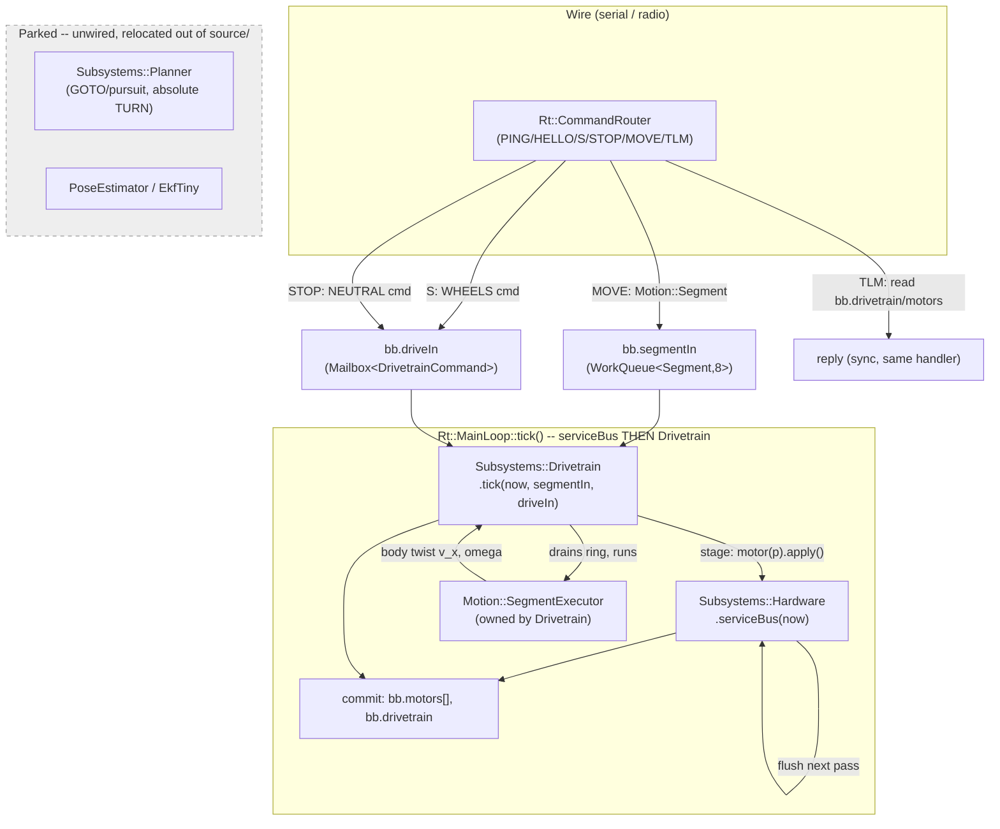
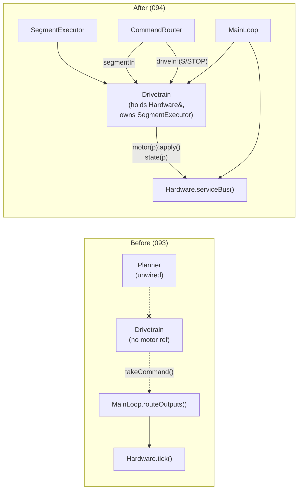

<!-- CLASI: Before changing code or making plans, review the SE process in CLAUDE.md -->

# Architecture Update -- Sprint 094: Drivetrain becomes the motion planner — segment executor + MOVE command

## Step 1: Understand the Problem

Sprint 093 gutted `Rt::MainLoop` to a four-line command→wheels path
(`Hardware`+`Drivetrain` only, verbs `PING`/`HELLO`/`S`/`STOP`) and parked
every removed class — `Planner`, `PoseEstimator`, `EkfTiny`,
`Rt::Configurator`, both watchdogs — unwired, on disk, deliberately leaving
"the seam clean" for this sprint. Today, `Subsystems::Drivetrain` is a thin
faceplate: it holds no motor reference, receives a
`msg::DrivetrainCommand{TWIST|WHEELS|NEUTRAL}` through `bb.driveIn`, and its
`tick(now, motors[], motorCount, driveIn)` signature takes the full per-port
observation array as an argument every pass
(`source/subsystems/drivetrain.h:149-152`). Motion planning — Ruckig
trajectory generation, stop-condition evaluation, the divergence replan, the
presolved graceful decel-to-zero that fixed 092/093's terminal reverse-creep
— all still lives in `Subsystems::Planner` (`source/subsystems/planner.h`),
which is fully built and correct but has no live caller since 093 unwired
`bb.motionIn`.

Two issues define this sprint's scope, explicitly "plan/land together":
`drivetrain-becomes-the-motion-planner-segment-executing-subsystem.md` (the
Drivetrain-internal restructure: motor ownership, the executor, the segment
queue, the graceful stop) and
`communicator-drivetrain-motion-command-segment.md` (the wire command
surface: one new verb, `MOVE`, that hands a segment to the Drivetrain
directly with "no hiccups" — stakeholder, 2026-07-08).

Re-reading the current tree (`spike/093-presolved-decel-to-zero`, confirmed
fresh via direct `Read`, not a stale `/Volumes` cache) against the sprint's
design note confirms every load-bearing claim still holds:
- `Subsystems::Drivetrain::tick()` still takes `motors[]`/`motorCount`/
  `driveIn` as arguments (drivetrain.h:149) — the "resolve motors via the
  container" rewrite has not happened yet.
- `NezhaHardware::tick()` (nezha_hardware.cpp:34) still runs the brick
  flip-flop `REQUEST_DUE`/`COLLECT_DUE` state machine unrenamed.
- `Hal::NezhaMotor::setVelocity()`/`setDutyCycle()`
  (nezha_motor.cpp:130-134, 115-119) are confirmed **staging-only** — they
  only set `mode_`/`velocityTarget_`/`dutyTarget_`; the actual I2C `0x60`
  write happens inside `tick()`'s mode dispatch
  (`armoredWrite()`→`writeRawDuty()`, nezha_motor.cpp:184-257), called only
  from `NezhaHardware::tick()`'s `COLLECT_DUE` case
  (nezha_hardware.cpp:63). This is the load-bearing assumption the whole
  "Drivetrain stages, `serviceBus` flushes" ownership model depends on — it
  holds.
- `codal.json` sets `"application": "source"` (codal.json:14) — CODAL globs
  `source/` recursively, confirming `planner.{h,cpp}` must be **physically
  relocated**, not merely left unregistered, once `velocity_ramp.h` (which
  `planner.cpp` includes and uses via `ramp_`) is deleted.
- `msg::PlannerConfig` already carries `j_max`/`yaw_jerk_max`
  (messages/planner.h:227-228) end to end, and
  `Motion::JerkTrajectory::configure()` already consumes them
  (jerk_trajectory.h:121) — the jerk knob needs no new message-schema work,
  only a live way to set it (this sprint: per-segment `MOVE` args + baked
  boot defaults).
- `main.cpp`/`sim_api.cpp` construct `Drivetrain drivetrain;` with **no**
  `Hardware&` argument (main.cpp:111, sim_api.cpp:174) — confirming the
  container-reference wiring is net-new work for this sprint, not already
  landed.

This sprint does not touch absolute heading control, GOTO/pursuit, or any
pose-dependent stop condition — `PoseEstimator` stays parked (093), so
`STOP_HEADING`/`STOP_POSITION` stay unavailable. The new `MOVE` verb and its
segment executor are **pose-free**: every stop condition it evaluates reads
only the wheel encoders (`MotionBaseline.enc0`/`encDiff0`), matching what
093's Drivetrain already has direct access to via `hardware.state(port)`.

## Step 2: Identify Responsibilities

1. **Bus scheduling** (the Nezha split-phase flip-flop, the dt=0 sim guard,
   per-port command/reset draining) — stays exactly where it is
   (`NezhaHardware`/`SimHardware`), **renamed** `serviceBus()` to signal its
   new role: a container the Drivetrain writes through, not a ticked
   controller in its own right.
2. **Motion-limit trajectory generation** (Ruckig solve-to-rest/
   solve-to-velocity, the divergence replan, dead-time compensation, the
   presolved decel-to-zero) — **moves** from `Planner` into a new,
   Drivetrain-owned `Motion::SegmentExecutor`, unchanged in its own internal
   math.
3. **Multi-phase segment sequencing** (PRE_PIVOT → TRANSLATE →
   TERMINAL_PIVOT for one `Motion::Segment`) — **new**: the one piece of
   genuinely new control code this sprint writes, layered on top of (2).
4. **Wheel ownership + governance** (ratio/sync governor, capability
   clamping, direct S/STOP escape hatch) — **stays** in `Drivetrain`,
   **gains** direct motor references (`hardware.motor(port)`) instead of
   receiving observations as tick() arguments and holding an addressed
   output for someone else to route.
5. **Command-surface translation** (parsing `MOVE`'s wire grammar into a
   `Motion::Segment`, rewriting `STOP` to trigger a graceful stop, adding a
   pull-based `TLM`) — stays in `source/commands/*.cpp`, gains one new
   handler and one rewritten one.
6. **Loop sequencing** (`serviceBus` → `Drivetrain::tick` → commit) — stays
   in `Rt::MainLoop`, loses `routeOutputs()` (nothing left to route: writes
   go straight through the motor refs Drivetrain now holds).
7. **Config defaults** (jerk-limit boot values) — **returns** to both
   composition roots (`main.cpp`, `sim_api.cpp`) as a small, boot-only
   `defaultPlannerConfig()`-equivalent; no runtime `SET`/`GET` path is
   revived.

Grouping: (2)+(3) are a single new module (`Motion::SegmentExecutor`) with
one purpose — turn one `Motion::Segment` into a per-tick body twist. (1) is
a rename-only container change. (4) absorbs the executor and stays the
"governs the wheels" module it already is. (5)+(6)+(7) are the wiring layer
that stays split exactly as it is today (command handlers vs. loop vs.
composition root) — none of them gain a new responsibility beyond what they
already have, only new call targets.

## Step 3: Define Subsystems and Modules

### `Motion::Segment` (new) — the pose-free relative motion command
- **Purpose**: describes one relative motion (translate + optional pivots)
  plus its own motion-limit overrides.
- **Boundary**: inside — plain POD fields, no behavior. Outside — no wire
  parsing, no kinematics, no executor state.
- **Serves**: SUC-001 (the new "one motion command" use case, see
  usecases.md).

### `Motion::SegmentExecutor` (new) — the lifted trajectory engine
- **Purpose**: turns one `Motion::Segment` into a per-tick body twist
  `(v_x, omega)`, phase by phase, through to its own trailing graceful stop.
- **Boundary**: inside — the two `Motion::JerkTrajectory` channels,
  `Motion::MotionBaseline` capture (encoder fields only — pose fields dead),
  stop-condition evaluation (`STOP_DISTANCE`/`STOP_ROTATION`/`STOP_TIME`
  safety net only — no `STOP_HEADING`/`STOP_POSITION`), the divergence
  replan and its compile-split dead-time, the presolved decel-to-zero, and
  the new PRE_PIVOT→TRANSLATE→TERMINAL_PIVOT sequencer. Outside — wire
  verbs, `msg::PlannerCommand`, the blackboard, any authority concept,
  GOTO/pursuit (stays with parked `Planner`).
- **Serves**: SUC-001, SUC-002 (the graceful-stop path is shared by both).

### `Subsystems::Drivetrain` (rewrite) — the motion planner
- **Purpose**: governs how the bound wheel pair moves — direct escape-hatch
  targets or an executed segment queue, always ratio-governed.
- **Boundary**: inside — `hardware.motor(port)`/`hardware.state(port)`
  resolution, the `Motion::SegmentExecutor` + 8-slot segment ring, the
  driveIn-escape-hatch-wins-over-segmentIn precedence, `governRatio` (kept
  as-is), staging writes via `motor(p).apply()`. Outside — the bus schedule
  (container's job), wire parsing (command layer's job), path/route
  selection (parked with `Planner`), pose/EKF (removed in 093).
- **Serves**: SUC-001, SUC-002.

### `Subsystems::Hardware` / `NezhaHardware` / `SimHardware` (rename only) — the bus container
- **Purpose**: owns the 4 `Hal::Motor`s, the shared `I2CBus`, the odometer;
  runs the brick flip-flop bus schedule once per pass.
- **Boundary**: inside — the flip-flop state machine, per-port
  command/reset draining, the dt=0 sim re-entry guard. Outside — motion
  planning, kinematics, the segment queue (all now Drivetrain's).
- **Serves**: SUC-001, SUC-002, SUC-004 (the container's `serviceBus` rename
  is what SUC-004's flip-flop-timing verification checks).

### Command layer — `handleMove`/`handleS`/`handleStop`/`handleTlm` (extend)
- **Purpose**: parse the wire line, build a `Motion::Segment` (MOVE) or a
  `msg::DrivetrainCommand` (S/STOP), post it to the blackboard; reply
  synchronously (including `TLM`'s measured-state reply).
- **Boundary**: inside — arg parse, segment/command construction,
  `bb.*.post(...)`. Outside — any subsystem pointer (handlers reach only the
  blackboard, via `router.blackboard()`).
- **Serves**: SUC-001, SUC-002, SUC-003.

### `Rt::MainLoop` (shrink) — the sequencing shell
- **Purpose**: ticks `Hardware` (bus) then `Drivetrain` (planning) once per
  pass, commits state.
- **Boundary**: inside — the two-step tick + commit sequence. Outside —
  everything `routeOutputs()` used to do (deleted: nothing to route,
  Drivetrain writes directly through its own motor refs).
- **Serves**: SUC-001, SUC-002.

### Parked (relocated, not deleted): `Subsystems::Planner`
- **Purpose (unchanged)**: absolute-pose motion goals (GOTO/pursuit,
  absolute TURN) for whenever `PoseEstimator` returns.
- **Boundary**: physically moved out of `source/` (a new parked tree —
  ticket 002 picks the exact location, mirroring the `source_old`/`tests/
  sim/parked-093` precedent) so `codal.json`'s recursive `source/` glob
  cannot pull it into the build once its `velocity_ramp.h` include is
  deleted out from under it.
- **Serves**: nothing this sprint (parked). A follow-up issue tracks its
  revival alongside `PoseEstimator`.

## Step 4: Diagrams

### Component diagram — 094's data path (MOVE / S / STOP / TLM)



### Dependency graph — before → after this sprint



No entity-relationship diagram: this sprint adds one new POD type
(`Motion::Segment`) but no persisted/relational data model — it is a
command-plane payload, not a schema.

## Step 5: Complete the Document

### What Changed

- **New**: `source/motion/segment.h` (`Motion::Segment` POD — see the
  segment-shape section below), `source/motion/segment_executor.{h,cpp}`
  (`Motion::SegmentExecutor` — the lift + the 3-phase sequencer).
- **`source/subsystems/hardware.h`, `nezha_hardware.{h,cpp}`,
  `sim_hardware.{h,cpp}`**: `tick(now, motorIn[], motorResetIn[])` renamed
  `serviceBus(now, motorIn[], motorResetIn[])`. Pure rename — flip-flop
  body, `bus_.clear()` gate, dt=0 guard, motorIn/motorResetIn draining all
  byte-for-byte unchanged. Every call site (`MainLoop`, tests, sim
  harnesses) updates its call to match.
- **`source/subsystems/drivetrain.{h,cpp}`** (rewrite):
  - Constructor becomes `Drivetrain(Hardware& hardware)`; stores
    `hardware_`.
  - `tick()` signature becomes `tick(now, Rt::WorkQueue<Motion::Segment,8>&
    segmentIn, Rt::Mailbox<msg::DrivetrainCommand>& driveIn)` — drops the
    `motors[]`/`motorCount` arguments (resolved internally via
    `hardware_.state(port)`).
  - Gains a `Motion::SegmentExecutor` member and an internal segment ring
    (drain `segmentIn` into it each tick, up to its own bound).
  - Drain precedence: `driveIn` (S/STOP escape hatch) drained and applied
    FIRST each tick; a WHEELS/NEUTRAL command clears the segment ring and
    switches to direct mode. Otherwise, `segmentIn` drains into the ring and
    the executor runs.
  - `STOP`'s `NEUTRAL` arm no longer produces an instant brake — it clears
    the ring and arms the executor's graceful decel-to-zero
    (`solveToVelocity(0, ...)` from the last sampled state), then idles.
  - Writes are staged via `hardware_.motor(port).apply(cmd)` instead of
    held in a `Hal::DrivetrainToHardwareCommand` for `MainLoop` to route.
    `hasCommand()`/`takeCommand()` are deleted — nothing left to route.
  - `state()` sources `enc=`/`vel=` from `hardware_.state(port)` (measured),
    preserving the existing "measured, not commanded" telemetry semantic.
- **`source/runtime/main_loop.{h,cpp}`**: constructor unchanged in shape
  (`Hardware&`, `Drivetrain&`); `tick()` becomes: `hardware_.serviceBus(now,
  ...)` → `drivetrain_.tick(now, bb.segmentIn, bb.driveIn)` → commit.
  `routeOutputs()` is deleted (nothing to route — Drivetrain writes
  directly).
- **`source/runtime/blackboard.h`**: adds `Rt::WorkQueue<Motion::Segment, 8>
  segmentIn` (new command-plane queue, one producer — `MOVE`'s handler —
  one consumer — `Drivetrain::tick()`). `driveIn`'s doc comment is updated:
  it is now the S/STOP escape-hatch input to `Drivetrain` only (no more
  Planner producer, no more `routeOutputs` consumer).
- **`source/main.cpp` / `tests/_infra/sim/sim_api.cpp`** (both change in
  lockstep — the 1:1-mirror invariant): construct `Drivetrain
  drivetrain(hardware);` instead of `Drivetrain drivetrain;`; re-add a
  small boot-only jerk-config default (`jMax ≈ 5000 mm/s^3`, `yawJerkMax ≈
  100 rad/s^3`) applied once at construction via
  `drivetrain.configureMotion(...)`; **run `arm-none-eabi-size
  build/MICROBIT` before and after** and record both figures in the ticket
  (mandatory flash-budget gate — see Step 7 Risk 1).
- **`source/commands/motion_commands.cpp`**: add `parseMove`/`handleMove`
  (new `MOVE <distance> <direction> <finalHeading> [v=][a=][j=][w=][wa=]
  [wj=]` verb — centidegrees on the wire for angles, matching TURN/RT
  convention, converted to radians internally); `handleStop` changes from
  `cmd.setNeutral(BRAKE)` (093's instant-brake fix) to the new graceful-stop
  semantics (still posts to `bb.driveIn`, but `Drivetrain::apply()`'s
  `NEUTRAL` handling now arms the executor's decel-to-zero instead of an
  immediate zero-velocity command). Add a minimal `handleTlm` (new `TLM`
  verb, one-shot synchronous reply reading `bb.drivetrain`/`bb.motors[]`).
- **`source/runtime/command_router.cpp`**: `buildTable()` registers `MOVE`
  and `TLM` alongside 093's `PING`/`HELLO`/`S`/`STOP`.
- **Deleted**: `source/motion/velocity_ramp.{h,cpp}`.
- **Relocated (parked, not deleted)**: `source/subsystems/planner.{h,cpp}`
  moved out of `source/` (ticket 002 names the exact destination tree).
- **New `clasi/issues/` follow-up**: GOTO/pursuit + absolute-heading
  revival, tracking that `Planner`'s relocation must be reversed and
  `PoseEstimator` restored together before those verbs can return.

### The segment shape (`Motion::Segment`, `source/motion/segment.h`)

Per the design note's resolution of the issue's `vMax`/`aMax`/`omegaMax`
naming against `.claude/rules/naming-and-style.md` (quantities, not units;
units in `// [unit]` tags):

```cpp
namespace Motion {
struct Segment {
  // --- geometry: all RELATIVE to the segment's start pose (pose-free) ---
  float distance = 0.0f;      // [mm] signed straight-line translation
  float direction = 0.0f;     // [rad] pre-pivot heading change, CCW+ (0 = straight ahead)
  float finalHeading = 0.0f;  // [rad] final heading relative to start, CCW+

  // --- per-segment motion-limit overrides (0 => fall back to the
  //     executor's configured default, msg::PlannerConfig; matches
  //     JerkTrajectory's own jerk-off sentinel) ---
  float speedMax = 0.0f;      // [mm/s]     translation speed ceiling
  float accelMax = 0.0f;      // [mm/s^2]   translation accel
  float jerkMax = 0.0f;       // [mm/s^3]   translation jerk (0 => trapezoid)
  float yawRateMax = 0.0f;    // [rad/s]    pivot angular-speed ceiling
  float yawAccelMax = 0.0f;   // [rad/s^2]  pivot angular accel
  float yawJerkMax = 0.0f;    // [rad/s^3]  pivot angular jerk
};
}  // namespace Motion
```

No `duration` field — it is an output of the Ruckig solve. A differential
drive decomposes one segment into up to three phases, each a single Ruckig
profile against an encoder-only stop condition:

| Phase | Fires when | Channel | Stop condition |
|---|---|---|---|
| PRE_PIVOT (skip if `direction≈0`) | rotate by `direction` | rotational | `STOP_ROTATION`, arc = `\|direction\|·trackwidth/2` |
| TRANSLATE (skip if `distance≈0`) | drive straight `distance` | linear | `STOP_DISTANCE` at `\|distance\|` |
| TERMINAL_PIVOT (skip if `finalHeading≈direction`) | rotate by `finalHeading − direction` | rotational | `STOP_ROTATION`, arc = `\|Δ\|·trackwidth/2` |

Degenerate cases fall out for free: `distance==0` → pure in-place turn; a
plain straight is `{distance, 0, 0}`. This is why `MOVE` and the executor
are pose-free: `STOP_DISTANCE`/`STOP_ROTATION` read the wheel encoders
directly (`MotionBaseline.enc0`/`encDiff0`), never a fused heading/pose —
unlike `STOP_HEADING`/`STOP_POSITION`, which stay unavailable with
`PoseEstimator` parked.

### The `MOVE` wire verb

```
MOVE <distance_mm> <direction_cdeg> <finalHeading_cdeg>
     [v=<mm/s>] [a=<mm/s^2>] [j=<mm/s^3>] [w=<cdeg/s>] [wa=<cdeg/s^2>] [wj=<cdeg/s^3>]
```

Chosen over re-parsing `D`/`TURN`/`RT` onto segments: `MOVE` mirrors
`Segment`'s fields 1:1 (the compact "one motion" surface the stakeholder
asked for); `D` is a wheel-speed idiom needing `BodyKinematics::forward`,
not a "how far / which way / final heading" idiom; `TURN` (absolute
heading) cannot ship pose-free at all (needs the removed fused heading) —
re-parsing it onto a pose-free segment would silently change its contract.
`D`→`{mm,0,0}` and `RT`→`{0,0,relAngle}` remain trivial future conveniences,
explicitly deferred, not required for this sprint.

### Command precedence and the "no hiccups" requirement

`segmentIn` is an `Rt::WorkQueue<Motion::Segment, 8>` (FIFO), **not** a
latest-wins `Mailbox` — the communicator issue's "no dropped commands"
requirement rules out a Mailbox, since multiple `MOVE`s can arrive between
ticks (093's yield-once-per-slack RX fix routes one command per slack
iteration) and a Mailbox would silently drop all but the last. `Drivetrain`
drains the whole `segmentIn` into its internal ring every tick, then drains
`driveIn` FIRST within that same tick (an S/STOP escape hatch always wins:
if a WHEELS/NEUTRAL command arrived, the ring is cleared and the escape
hatch takes over immediately, regardless of ring depth). A `MOVE` posted
during slack is drained by the very next mandatory tick — no multi-hop
mailbox latency, matching the issue's "takes effect the tick after it
arrives" acceptance spirit.

### Telemetry and the deferred completion event

093 Decision 1 removed all loop-originated wire output and marked the
`eventsOut`/`telemetryOut` queue+drain seam deferred-or-obsolete. Both 094
issues want output back; this sprint resolves it as follows, staying fully
consistent with that decision:

- **`TLM`** (new, one-shot, SNAP-style): reads `bb.drivetrain` (populated by
  `commit()` from `Drivetrain::state()`, itself sourced from
  `hardware_.state(port)` — measured, not commanded) and replies
  synchronously through the command's own `ReplyFn`/`ctx`, exactly the
  mechanism `PING`/`HELLO`/`S`/`STOP` already use. Zero new loop-output
  infrastructure.
- **Completion** is observable by **polling** `TLM`'s exposed
  active/idle flag (`msg::DrivetrainState.active`) plus the settled encoder
  position — sufficient for the bench gate's graceful-stop/no-reverse-creep
  check, which is a visual + encoder-poll check, not event-dependent.
- The push **`done` event** is explicitly **deferred** to the
  get-wire-output-events-telemetry follow-up issue: it is the only thing
  that genuinely needs a loop-originated-output seam, and reintroducing
  that seam for a single producer is exactly what 093 ruled out as dead
  infrastructure for near-zero producers.

### The jerk config knob

`msg::PlannerConfig` already carries `j_max`/`yaw_jerk_max` end to end
(confirmed in Step 1); `JerkTrajectory::configure()` already consumes them.
This sprint:
- Re-adds boot defaults in both composition roots (093 deleted
  `defaultPlannerConfig()`): `jMax ≈ 5000 mm/s^3` (~6x `aMax` 800,
  ~0.16s jerk-limited edges), `yawJerkMax ≈ 100 rad/s^3` (~5x
  `yawAccMax` 20, ~0.2s) — replacing the `0.0` trapezoid sentinel.
- Ships live per-segment override via `MOVE`'s `j=`/`wj=` args (and
  `v=`/`a=`/`w=`/`wa=`), which set the `Segment`'s own limit fields; the
  executor falls back to the boot config when a field is 0.
- Does **not** revive global `SET jmax`/`GET jmax` wire keys or
  `Rt::Configurator` — that is a documented stretch/follow-up (would also
  require re-registering `configCommands()` and re-wiring `Configurator` to
  fold a config delta into `Drivetrain`'s motion config — outside 093's
  minimal-loop spirit). Per-segment `j=`/`wj=` covers the tuning need this
  sprint targets.

### Impact on Existing Components

- **Behavior change (intended)**: `STOP` no longer brakes instantly — it
  triggers a graceful decel-to-zero. This is the fix the communicator issue
  asks for ("STOP triggers the graceful decel-to-zero") and matches the
  bench-gate acceptance criterion (no terminal reverse-creep). Anyone
  depending on 093's instant-brake `STOP` semantic sees a (short, bounded by
  the executor's own decel limits) delay before the wheels fully stop.
- **Behavior change (intended)**: `S` continues to bypass all planning
  (direct wheel targets, no kinematics) — unchanged from 093 — but now also
  clears any in-flight segment ring, since the escape hatch always wins.
- **No wire-protocol regression for existing verbs**: `PING`/`HELLO`/`S`/
  `STOP` keep their existing reply shapes (`STOP`'s reply text is unchanged
  — only its physical effect changes). `docs/protocol-v2.md` needs a
  follow-up update to document `MOVE`/`TLM` and the `STOP` semantic change
  — flagged as an open question (Step 7) since it is a docs-only change
  outside this sprint's own file list unless a ticket explicitly claims it.
- **Flash footprint**: re-linking Ruckig into the live tick path returns the
  firmware to roughly its pre-093 footprint (Ruckig-in-use ~151 KB; pre-093
  build had ~43 KB / 11.7% free). It fit before, so it fits now, but
  headroom is tight — see Step 7 Risk 1 for the mandatory measurement gate.
- **`tests/sim/`**: 093's parked-093 triage (Decision 3) already removed
  most Planner/motion-verb-dependent tests from the live gate. This sprint
  adds new, currently-green tests for the executor and the new command
  surface; it does not need to un-park any 093-parked file (GOTO/pursuit
  tests stay parked with `Planner`).

### Migration Concerns

- **No data migration** — no persisted state, no schema (the new
  `Motion::Segment` type is a command-plane payload, not a stored/versioned
  format).
- **No deployment sequencing risk beyond the usual build-and-verify** —
  firmware; rollback is a re-flash of the pre-094 `.hex`.
- **Reversibility**: `Planner`/`velocity_ramp` relocation/deletion is the
  one non-trivial-to-reverse step (deleting `velocity_ramp.{h,cpp}` is a
  real deletion, not a park) — but `Planner`'s own GOTO/pursuit logic is
  fully preserved (relocated, not deleted, not rewritten), so restoring
  absolute-heading motion later needs only: restore `PoseEstimator`
  (093's job, already parked intact), move `planner.{h,cpp}` back into
  `source/`, and either restore a small `VelocityRamp`-equivalent or port
  GOTO/pursuit onto a fresh profiler. That work is out of this sprint's
  scope and is the subject of the new GOTO-revival follow-up issue.
- **Blackboard growth**: `segmentIn` is a new, small (8-slot), host-safe POD
  queue — it satisfies the existing "every Blackboard member must be a
  host-safe POD" bar (`Rt::Blackboard`'s own file header) since
  `Motion::Segment` is a plain float-only struct with no CODAL dependency.

## Step 6: Design Rationale

### Decision 1 — One new `MOVE` verb, not re-parsed `D`/`TURN`/`RT`

**Context**: the communicator issue's own open question asks whether to
reuse an existing verb (re-parsed into segments) or add one new compact
verb.

**Alternatives considered**: (a) re-parse `D` into `{distance, 0, 0}`,
`TURN` into an absolute-heading segment, `RT` into `{0, 0, relAngle}`; (b)
add one new `MOVE` verb mirroring the segment shape 1:1.

**Why this choice**: (b). `D` carries wheel speeds (`l r mm`), a
fundamentally different idiom (needs `BodyKinematics::forward` to become a
body-frame quantity) from "how far / which way / final heading." `TURN` is
absolute-heading and **cannot** ship pose-free — `PoseEstimator` is parked,
so there is no fused heading to compute a shortest-path delta from; forcing
`TURN` onto the pose-free segment executor would either silently change its
contract (relative instead of absolute) or require reviving pose
estimation, both out of scope. `RT` (relative turn) is a genuine trivial
future convenience once `MOVE` exists (`RT n` ≈ `MOVE 0 0 n`) but is not
needed by this sprint's acceptance bar.

**Consequences**: `D`/`TURN`/`RT`'s existing parse/handle functions stay
in `motion_commands.cpp`, source-unchanged and unregistered — the same
"unregistered, not deleted" treatment 093 established for the whole
motion-verb family. A future sprint can register `RT`/`D` as thin wrappers
over `MOVE`'s segment construction with no executor change.

### Decision 2 — Pull-based `TLM` + deferred push `done` event, not a full drain seam

**Context**: both issues want telemetry/completion signaling back; 093
Decision 1 explicitly ruled out rebuilding the `eventsOut`/`telemetryOut`
queue+drain seam for zero producers.

**Alternatives considered**: (a) ship nothing — `S`/`STOP`/`MOVE` only,
rejected because the bench gate needs measured `enc=`/`vel=`; (b) rebuild
the full `drainLoopOutputs()` seam (loop reply sinks, an event queue) to
serve `MOVE`'s completion signal; (c) a synchronous, pull-based `TLM` verb
using the same per-command reply channel every other verb already uses,
with the push `done` event explicitly deferred.

**Why this choice**: (c). Every producer the queue+drain design existed to
serve (watchdog fire, `safety_stop`, `Planner`'s own `done` event, periodic
telemetry) is either gone (093) or would be reintroduced only for this one
new completion signal. Building a loop-output seam for exactly one producer
is the same "dead infrastructure the instant it compiles" 093's Decision 1
already rejected. `TLM` needs no new mechanism at all — it is a fifth
command handler using the router's existing per-command reply channel.

**Consequences**: segment completion is polling-observable, not
event-pushed, this sprint. A future sprint that wants a push `done` event
must design the loop-output seam properly (queue sizing, drain cadence,
multi-producer arbitration) rather than resurrect 093's removed code
verbatim — tracked by the existing get-wire-output-events-telemetry issue,
whose frontmatter should note this sprint's `TLM` addition as a partial,
pull-only resolution.

### Decision 3 — Relocate `Planner`, don't leave it unregistered in `source/`

**Context**: 093's precedent for every removed responsibility was "leave
the file in `source/`, unregistered." This sprint cannot follow that
precedent for `Planner` specifically.

**Alternatives considered**: (a) leave `planner.{h,cpp}` in `source/`,
simply never construct/tick a `Planner` instance (093's own pattern); (b)
physically move `planner.{h,cpp}` out of `source/` into a parked tree.

**Why this choice**: (b), forced by a structural fact 093's other removals
didn't hit: `codal.json`'s `"application": "source"` setting makes CODAL
compile every file under `source/` recursively, regardless of whether
anything constructs the class it defines (unlike, say, `Rt::Configurator`,
which 093 left unregistered in place because nothing about deleting some
other file broke its compilation). `planner.cpp` `#include`s
`motion/velocity_ramp.h` and calls `ramp_.setTarget()`/`ramp_.advance()`/
`ramp_.reset()` — this sprint deletes `velocity_ramp.{h,cpp}` (Decision 4),
which would break `planner.cpp`'s compilation the moment it is deleted,
while `planner.{h,cpp}` remains in the CODAL-globbed `source/` tree. Leaving
it in place (a) is therefore not an option once (b)'s sibling decision
(deleting `VelocityRamp`) is made; relocating it out of `source/` (mirroring
the existing `source_old`/`tests/sim/parked-093` precedent) is the only way
to park it without breaking the build.

**Consequences**: ticket 002 must delete `VelocityRamp` and relocate
`Planner` in the same ticket (they are coupled by this compile
dependency) — see the ticket's own acceptance criteria. A new
`clasi/issues/` entry tracks GOTO/pursuit's eventual revival, since its
logic (PRE_ROTATE/PURSUE, world-frame anchoring) is preserved verbatim in
the relocated files, not reimplemented.

### Decision 4 — Delete `Motion::VelocityRamp`, don't park it

**Context**: `VelocityRamp` is used only by `Planner`'s `GOTO_GOAL` path
(PRE_ROTATE/PURSUE) — every other goal kind migrated onto
`Motion::JerkTrajectory` in prior sprints (089).

**Alternatives considered**: (a) delete it outright; (b) relocate it
alongside `Planner` (parked, not deleted), preserving it for GOTO's eventual
revival.

**Why this choice**: (a), per the issue's own locked stakeholder decision
("consolidate on Ruckig... retire `Motion::VelocityRamp`"). A future GOTO
revival is expected to re-profile PRE_ROTATE/PURSUE onto
`Motion::JerkTrajectory` (consistent with every other goal kind's own
migration), not resurrect the ramp-based profiler — reviving `VelocityRamp`
alongside a Ruckig-based `SegmentExecutor` would reintroduce exactly the
two-motion-generation-mechanism duplication the issue's locked decision 3
already closed off project-wide.

**Consequences**: `Planner`'s relocated copy still references
`Motion::VelocityRamp` in its own source (it is parked, not recompiled) —
its header comment must be updated to note that a future revival needs a
`JerkTrajectory`-based PRE_ROTATE/PURSUE port, not a resurrected
`VelocityRamp`. This is a doc-comment change inside the relocated,
non-compiled files — it does not affect this sprint's own build.

## Step 7: Open Questions

1. **`docs/protocol-v2.md` currency.** This sprint adds `MOVE`/`TLM` and
   changes `STOP`'s physical semantics; the doc is not automatically
   updated (093 left the same question open and deferred it). Should a
   ticket in this sprint update it, or does that wait for whichever future
   sprint does a documentation pass across the whole 093+094 verb-set
   change? Recommend deciding before ticket 006 closes.
2. **Push `done` event.** Deferred per Decision 2. If the stakeholder needs
   it sooner than the next natural touch of the wire-output seam, that
   pulls in a materially larger scope (the `drainLoopOutputs()` seam +
   loop reply sinks) — flagged so the team-lead can raise it before
   execution starts, not discover it mid-sprint.
3. **Global `SET jmax`/`GET jmax`.** Deferred per the issue's own "STRETCH"
   framing (§8 of the design note). If bench tuning proves per-segment
   `j=`/`wj=` insufficient (e.g. the stakeholder wants to tune once and
   have every subsequent `MOVE` inherit it without repeating the args),
   that is a follow-up sprint reviving `Rt::Configurator`, not a change to
   this sprint's scope.
4. **`RT`/`D` as `MOVE` wrappers.** Explicitly deferred (Decision 1's
   consequence) — noted here so it isn't silently forgotten as "this
   sprint should have done it."
5. **Un-mounting risk (inherited from 093).** This sprint does not restore
   any safety watchdog — the loop still assumes the stand-mounted,
   wheels-off-the-ground posture 093's Decision 2 accepted. `MOVE`
   introduces sustained multi-second motion (unlike 093's `S`, which a
   human releases by ceasing to send commands); the standing bench-testing
   rule and the HITL ticket's own safety framing are the only mitigation.
   No change to that risk is proposed here — flagged for the stakeholder's
   awareness given `MOVE` is a bigger behavior surface than `S`/`STOP`.
