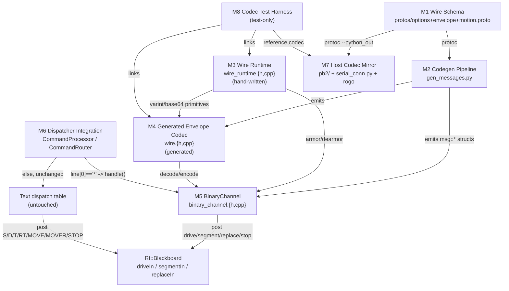
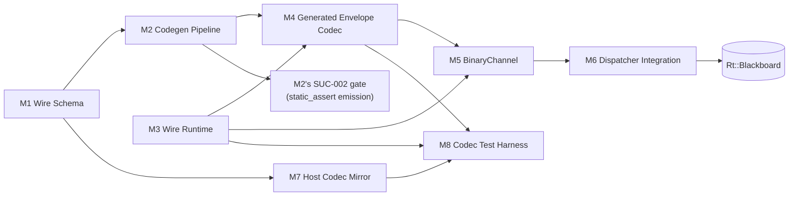
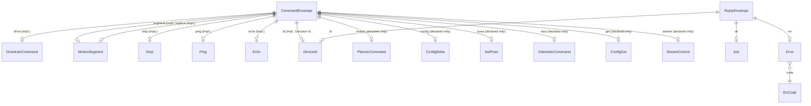

<!-- CLASI: Before changing code or making plans, review the SE process in CLAUDE.md -->

# Architecture Update -- Sprint 095: Protocol v3 Sprint 1: Codec foundation and binary command plane (dual stack)

## Step 1: Understand the Problem

`source/commands/` (~4,900 lines) is dominated by hand-rolled per-verb
text parsing, and the host maintains a second hand-written parser of the
same grammar. The stakeholder decided (2026-07-09,
`clasi/issues/protocol-v3-schema-driven-binary-command-plane-protobuf.md`)
to build a schema-driven binary command plane over 3 sprints, reusing the
proto3 pipeline already in the tree (`protos/*.proto` ->
`scripts/gen_messages.py` -> `source/messages/*.h`), which today generates
structs but no wire codec. Sprint 095 is "Sprint 1" of that program: land
the codec foundation and the binary command plane for the highest-traffic
verbs, while the text plane stays untouched code (not just untouched
behavior) so the robot is drivable at every commit.

I read the current tree directly (not just the issue) to plan against
reality:

- **Command dispatch today** is already trimmed to a minimal table by
  sprints 093/094: `Rt::CommandRouter::buildTable()`
  (`source/runtime/command_router.cpp`) wires only `systemCommands()`
  (PING/VER/HELP/ECHO/ID/HELLO) and `motionCommands()` (S/STOP/D/T/RT/
  MOVE/MOVER/TLM/QLEN). `CommandProcessor::process()`
  (`source/commands/command_processor.cpp:421`) tokenizes the line and
  dispatches through `dispatchTable()`'s prefix-match/`ArgList` machinery
  — this whole path stays untouched.
- **The Blackboard command-plane queues this sprint's arms feed**
  (`source/runtime/blackboard.h`) already exist and are already the exact
  posts the text handlers make: `driveIn` (S/STOP ->
  `msg::DrivetrainCommand`), `segmentIn` (MOVE -> `Motion::Segment`,
  WorkQueue, no-drop), `replaceIn` (MOVER -> `Motion::Segment`, Mailbox,
  latest-wins). `motionIn` (R/TURN/G's target) has **no live consumer**
  today — `Subsystems::Planner` was parked in 093/094 — confirmed by
  grepping `buildTable()`: R/TURN/G are not registered even on the text
  side.
- **`Motion::Segment` (`source/motion/segment.h`) is explicitly NOT a
  generated proto type** — its own header comment (ticket 094-005)
  rejected that shape because the wire, at the time, only ever carried
  `MOVE <args>` text and a hand-authored addition to the generator's
  output tree would be fragile. That reasoning predates this sprint: a
  binary wire plane now exists, and the issue's own envelope sketch names
  a `MotionSegment` message. This update makes an explicit call (Decision
  2 below) rather than silently reinterpreting 094-005.
- **`CommandProcessor` has no `Rt::Blackboard` reference of its own.**
  Every command family reaches the Blackboard through
  `handlerCtx` (opaque `void*`, cast back to `Rt::CommandRouter*`, which
  owns `Blackboard& blackboard()`) — set per-descriptor at table-build
  time. The issue names `CommandProcessor::process()` as the `*`-discriminator
  insertion point, but `process()` itself never receives a `handlerCtx`
  (that field lives on `CommandDescriptor`, consumed only inside
  `dispatchTable()`). This is a real gap between the issue's sketch and
  the actual call graph — resolved as Decision 1 below.
- **The reader-thread classification in `host/robot_radio/io/
  serial_conn.py`** (`_reader_loop`) already silently drops any line that
  doesn't start with `TLM`/`EVT`/`OK`/`ERR`/`CFG`/`ID`/`#`/contain
  `keepalive` — a `*`-prefixed line falls through to that silent drop
  today. Adding a `*` branch is a pure addition with no existing-branch
  risk.
- **`protos/options.proto`** currently declares only `units`/`max_count`
  (50000/50001) — the next free extension numbers are 50002+, matching the
  issue's proposed `min`/`max`/`abs_max`/`req` = 50002-50005.
- **`gen_messages.py`** (1121 lines) already has everything needed to grow
  in place: it parses `FieldDescriptorProto`s via `google.protobuf`, reads
  custom options via a small varint-scanning `_read_max_count`-style
  helper (a second helper generalizes this for `min`/`max`/`abs_max`/
  `req`), and already distinguishes real oneofs (union + `*Kind` enum)
  from proto3-optional synthetic oneofs (`Opt<T>`) — exactly the
  structure `CommandEnvelope`'s `cmd` oneof and `ReplyEnvelope`'s `body`
  oneof need.

## Step 2: Identify Responsibilities

1. **Declare the wire contract** — what fields exist, their types, their
   validation bounds, and which oneof arm maps to which Blackboard queue.
   Changes only when the schema changes. (-> Wire Schema)
2. **Turn the schema into C++** — structs, field-descriptor tables, and
   the standard-layout decision gate. Changes only when `gen_messages.py`
   or the schema changes; runs at build time, never on-device. (-> Codegen
   Pipeline)
3. **Speak raw protobuf bytes** — varint/zigzag/fixed/length-delimited/
   base64, with no knowledge of any specific message. Changes only when a
   wire-format primitive itself needs fixing (rare, hand-written once).
   (-> Wire Runtime)
4. **Walk a message's field table to decode/encode/validate it generically**
   — built on (3), driven by (2)'s tables. Changes only when the generic
   walking algorithm itself changes (also generated, alongside (2)).
   (-> Generated Envelope Codec)
5. **Translate one armored wire line into a Blackboard action** — dearmor,
   decode, oneof-arm dispatch, Blackboard post, encode+armor the reply.
   Changes when a new oneof arm is implemented or a Blackboard queue's
   shape changes. (-> BinaryChannel)
6. **Decide which plane a wire line belongs to, and give the binary plane
   a path to the Blackboard** — one conditional branch plus one context
   pointer. Changes only if the framing discriminator itself changes.
   (-> Dispatcher Integration)
7. **Give the host the identical schema and a receive/send path on the
   same transport** — protoc Python codegen, reader-thread branch, send
   path. Changes when the schema changes or a new host client needs the
   binary plane. (-> Host Codec Mirror)
8. **Prove (3)+(4) agree with the reference implementation** — differential,
   fuzz, and boundary tests. Changes when the schema or codec changes; ships
   nowhere (test-only). (-> Codec Test Harness)

Responsibilities 1 and 2 are grouped only insofar as (2) is generated FROM
(1) by the same tool (`gen_messages.py`); they are still separate concerns
(schema authoring is a human editing `.proto` files; codegen is a
deterministic build step) and are kept as separate modules below because
they change for different reasons (a human adds a field vs. the generator
algorithm itself changes).

## Step 3: Define Subsystems and Modules

### M1 — Wire Schema
**Purpose**: Declare the binary wire contract as the single source of
truth for both firmware and host.
**Boundary**: `protos/options.proto` (extended), `protos/envelope.proto`
(new), `protos/motion.proto` (new). Proto source only — no generated code,
no runtime behavior. Everything downstream depends on this; it depends on
nothing in this tree.
**Use cases served**: SUC-001.

### M2 — Codegen Pipeline
**Purpose**: Deterministically turn the wire schema into C++ POD structs,
field-descriptor tables, and the layout decision gate on every build.
**Boundary**: `scripts/gen_messages.py` (extended). Host-only Python;
reads `protos/`, writes `source/messages/*.h` + `source/messages/wire.{h,cpp}`.
Never runs on-device; never hand-edited output.
**Use cases served**: SUC-001 (regenerating existing headers unmodified),
SUC-002 (layout asserts), SUC-004 (field tables + `wire.{h,cpp}`).

### M3 — Wire Runtime
**Purpose**: Encode and decode raw protobuf byte-level primitives with no
schema knowledge.
**Boundary**: `source/messages/wire_runtime.{h,cpp}` (new, hand-written,
the ONE hand-written file in the codec stack — never regenerated). Knows
varint/zigzag/fixed32/length-delimited/base64; knows nothing about
`CommandEnvelope` or any specific message.
**Use cases served**: SUC-003.

### M4 — Generated Envelope Codec
**Purpose**: Walk a message's generated field table to decode, encode, and
validate that exact message.
**Boundary**: `source/messages/wire.{h,cpp}` (generated, by M2, built on
M3). `msg::wire::decode(CommandEnvelope&, buf, len)` / `msg::wire::encode
(const ReplyEnvelope&, buf, cap)`. Knows field numbers/offsets/bounds; knows
nothing about framing (the `*B...` armor) or Blackboard queues.
**Use cases served**: SUC-004.

### M5 — BinaryChannel
**Purpose**: Translate one armored binary wire line into a Blackboard
post or an inline system-verb reply.
**Boundary**: `source/commands/binary_channel.{h,cpp}` (new, hand-written).
Owns the `*B<base64>` armor/dearmor and the oneof-arm switch. Reaches the
Blackboard only through the same opaque `handlerCtx`-cast-to-
`Rt::CommandRouter*` idiom every text command family already uses (see
Decision 1) — never a stored pointer of its own, never touches hardware.
**Use cases served**: SUC-006.

### M6 — Dispatcher Integration
**Purpose**: Decide, from the first byte, whether a wire line belongs to
the text table or M5; give M5 a path to the currently-routed Blackboard.
**Boundary**: `source/commands/command_processor.{h,cpp}` (one new
private member + one new public setter + one new branch at the top of
`process()`), `source/runtime/command_router.{h,cpp}` (one new
constructor-time wiring call). The existing `dispatchTable()`/`ArgList`/
`CommandDescriptor` text machinery is untouched code.
**Use cases served**: SUC-006.

### M7 — Host Codec Mirror
**Purpose**: Give the host the identical schema (compiled Python bindings)
and a receive/send path for the binary plane on the same transport the
text plane already uses.
**Boundary**: `host/robot_radio/robot/pb2/` (generated by `grpc_tools.protoc`,
wired into `justfile`/`build.py`), `host/robot_radio/io/serial_conn.py`
(one new reader-thread branch + `send_envelope()`), `host/robot_radio/io/
cli.py` (`rogo` binary send). Python only; consumes M1 directly via
`protoc`, never reimplements M3/M4's algorithms.
**Use cases served**: SUC-005 (provides the reference codec), SUC-007.

### M8 — Codec Test Harness (test-only, never shipped)
**Purpose**: Prove M3+M4 agree with `google.protobuf` byte-for-byte, in
both directions, and reject malformed/boundary input cleanly.
**Boundary**: `tests/sim/unit/*_harness.cpp` (new, host-compiled, follows
`runtime_blackboard_harness.cpp`'s existing pattern exactly) +
`tests/sim/unit/test_*.py` drivers. Never linked into the ARM build.
**Use cases served**: SUC-005.

**Cohesion check**: each module above has a one-sentence purpose with no
"and". **Fan-out check**: M5 (BinaryChannel) is the widest — it depends on
M1 (types), M3 (base64 in the armor layer), M4 (decode/encode), and the
Blackboard's queue types (M6's constructor-time wiring gives it that path)
— 4 dependencies, at the fan-out-4-5 guideline ceiling, which is expected
and acceptable for a dispatcher-shaped module whose entire job IS routing
between those things (the same shape `CommandRouter`/`dispatchTable()`
already have on the text side).

## Step 4: Diagrams

### Component diagram

### Dependency graph (module level)

No cycles: M1 -> M2 -> M4 -> M5 -> M6 is a strict chain; M3 and M7 are
leaves M4/M5/M8 and M8 pull from, never pulled back into. M6's only
downstream is the pre-existing `Rt::Blackboard`, which none of M1-M5/M7/M8
depend on directly (M5 reaches it only through M6's constructor-time
wiring — see Decision 1).

### Message-schema diagram (data model — the schema itself is this
sprint's "data model change", so an ER-style diagram is included even
though there is no relational/persistent store involved)

## Step 5: Complete the Document

### What Changed

**New proto files**: `protos/envelope.proto` (`CommandEnvelope`,
`ReplyEnvelope`, `Ack`, `Error`, `ErrCode`, `Ping`, `Echo`, `ConfigGet`,
`StreamControl`, `Stop`, `DeviceId`), `protos/motion.proto`
(`MotionSegment`). **Extended**: `protos/options.proto` (`min`/`max`/
`abs_max`/`req` at 50002-50005).

**New generated code**: `source/messages/envelope.h`, `source/messages/
motion.h` (ordinary generator output, same shape every existing header
already has), `source/messages/wire.{h,cpp}` (new generator OUTPUT KIND —
field-descriptor tables + generic decode/encode/validate, not a POD
struct header).

**New hand-written firmware code**: `source/messages/wire_runtime.{h,cpp}`
(byte-level codec primitives), `source/commands/binary_channel.{h,cpp}`
(the oneof-arm dispatcher and armor layer).

**Edited firmware code**: `source/commands/command_processor.{h,cpp}`
(one new member, one new setter, one new branch at the top of `process()`
— see Decision 1), `source/runtime/command_router.cpp` (one new
constructor-time call wiring that setter). `scripts/gen_messages.py`
grows a new emission mode (field tables + `wire.{h,cpp}` + layout
asserts) alongside its existing struct emission.

**New host code**: `host/robot_radio/robot/pb2/` (generated), a
`*`-line branch + `send_envelope()` in `host/robot_radio/io/serial_conn.py`,
a binary send path in `host/robot_radio/io/cli.py`. **Edited**:
`justfile`/`build.py` gain a `grpc_tools.protoc --python_out=...` step
beside the existing `gen_messages.py` invocation.

**New tests**: `tests/sim/unit/wire_runtime_harness.cpp` +
`wire_codec_harness.cpp` (or one combined harness — ticket 004's call) and
their Python drivers, differential/fuzz/range test suite against
`google.protobuf` (M8).

**Untouched, by design**: `source/commands/motion_commands.cpp`,
`system_commands.cpp`, every other command family file; `source/com/
serial_port.cpp`, `source/com/radio.cpp`, `Communicator`, the relay
firmware; `source/runtime/blackboard.h` (no new queues — every implemented
arm posts to a queue that already exists); `docs/protocol-v2.md` (no text
verb changes this sprint).

### Why

Per the issue: the stakeholder wants a schema system that validates
messages and drastically reduces hand-rolled parsing on both sides,
reached via a straight-to-binary path (no interim text rewrite) in
protobuf (leveraging the pipeline already in the tree), migrated dual-stack
so the robot is drivable at every commit. Sprint 095 is scoped to exactly
the "Sprint 1" bullet of that program: codec foundation + the highest-
traffic verbs (drive/segment/replace/stop/ping/echo/id), leaving binary
telemetry/config (096) and pose/otos/host-completion/text-retirement
(097/098) untouched.

### Impact on Existing Components

- **`CommandProcessor`**: gains a `void* _binaryCtx` member and a
  `setBinaryContext(void*)` setter (mirrors the existing
  `setSerialReply()` precedent), and one branch at the top of `process()`.
  Zero change to `dispatchTable()`, `parseTokens()`, `parseKV()`, or any
  reply-builder helper. `CommandProcessor` still has no `#include` of
  `blackboard.h` or any `msg::*` type beyond what it already includes
  (`messages/event.h`) — it forwards an opaque pointer, exactly as it
  already forwards every `CommandDescriptor::handlerCtx`.
- **`CommandRouter`**: constructor gains one line
  (`processor_.setBinaryContext(this)`), mirroring how every
  `motionCommands(router)`/`systemCommands(router)` call already threads
  `&router` through as `handlerCtx`. `route()` itself is unchanged.
- **`Rt::Blackboard`**: no new members. `driveIn`/`segmentIn`/`replaceIn`
  already exist and already have exactly the semantics (WorkQueue no-drop
  for `segmentIn`, latest-wins Mailbox for `replaceIn`) BinaryChannel needs.
- **`scripts/gen_messages.py`**: grows a second emission mode. The
  existing `_emit_message`/`_emit_file`/`_run_codegen_pipeline` functions
  are extended, not replaced — every currently-generated header keeps its
  exact current shape (verified by SUC-001's "zero diff to any
  pre-existing header" acceptance criterion).
- **Flash/RAM**: peak dual-stack budget +12-15 KB flash (interpreter
  2-3 KB, tables ~4 KB, `BinaryChannel`/envelope glue/base64 the rest)
  against ~90 KB current headroom (image at 0x684B8 of 0x80000, verified
  against `build/MICROBIT.map`'s `.data`/`.bss` load addresses this
  sprint). RAM: ~1-1.5 KB static scratch (shared decode/encode buffers,
  the same "one static buffer, reused" pattern `command_processor.cpp`'s
  own `rbuf[520]` already uses) — RAM sits at ~98% by design on this
  target (never a regression signal on its own; only flash and the new
  `.bss` delta are tracked).
- **Host `justfile`/`build.py`**: gain one new codegen step; the existing
  `gen_messages.py` step is unmodified.

### Migration Concerns

None in the data-migration sense (no persisted/on-disk format changes;
`RobotConfig`/calibration files are untouched). Deployment sequencing:
this sprint's firmware and host changes must ship together for the binary
plane to be exercised at all, but since the binary plane is strictly
additive (new `*`-prefixed framing, zero existing-branch changes), an
OLDER host talking to this sprint's NEWER firmware (or vice versa) simply
never sends/recognizes `*` lines and behaves exactly as it does today —
there is no partial-rollout hazard the way a breaking wire change would
have. Rollback is a plain revert of this sprint's diff (no other sprint's
files are touched).

## Step 6: Document Design Rationale

### Decision 1 — BinaryChannel reaches the Blackboard via a new
`CommandProcessor::setBinaryContext()`, not by moving the discriminator
into `CommandRouter::route()`

**Context**: the issue and `sprint.md` name
`command_processor.cpp::process()` (~line 421) as the `*`-discriminator
insertion point. But `CommandProcessor` has no `Rt::Blackboard` reference
— only `Rt::CommandRouter` does (`bb_`, refreshed each `route()` call), and
every existing command family reaches it through `handlerCtx`, a field
that lives on `CommandDescriptor` and is only read inside `dispatchTable()`
— never available to `process()` itself.

**Alternatives considered**:
(a) Move the `*` check into `CommandRouter::route()`, before it calls
`processor_.process(...)`, since `route()` already has both `bb_` and the
resolved `replyFn`/`replyCtx`.
(b) Give `CommandProcessor` a single stored opaque context (mirroring
`setSerialReply()`'s existing "wire it once after construction" pattern),
set once from `CommandRouter`'s constructor to `this`, and branch inside
`process()` itself.

**Why (b)**: it keeps the insertion point literally where the issue and
`sprint.md` specify, and — more importantly — it reuses the EXACT idiom
every text command family already uses (an opaque `void*` context, cast
back to `Rt::CommandRouter*` only by the code that needs it, never by
`CommandProcessor` itself) instead of inventing a second "how do I reach
the Blackboard" mechanism. Alternative (a) is not wrong, but it would make
`CommandRouter::route()` — currently a thin, five-line resolve-and-forward
method — start branching on wire-format details that belong to
`CommandProcessor`'s layer, which is a worse cohesion trade for no
behavioral benefit.

**Consequences**: `CommandProcessor` gains one private `void* _binaryCtx =
nullptr` member and one public `setBinaryContext(void* ctx)` setter (2-3
lines, same shape as `setSerialReply`). `BinaryChannel::handle()` receives
that pointer as its own opaque context and casts it to
`Rt::CommandRouter*` exactly the way every `commands/*.cpp` handler already
casts `handlerCtx`. `CommandProcessor` still never `#include`s
`blackboard.h` or names a `msg::*`/`Rt::*` type beyond what it already
does.

### Decision 2 — `Motion::Segment` stays hand-owned; a new
`protos/motion.proto` `MotionSegment` message is added and `BinaryChannel`
translates between them

**Context**: `source/motion/segment.h`'s own header comment (ticket
094-005) explicitly rejected making `Motion::Segment` a generated proto
type, reasoning that "the wire carries `MOVE <args>`" (text only) and "a
hand-authored type [in `source/messages/*.h`] would be fragile" (that tree
is 100% generator output). A binary wire plane now exists, and the issue's
own envelope sketch names a `MotionSegment` message as `segmentIn`'s
payload type.

**Alternatives considered**:
(a) Reverse 094-005 and make `Motion::Segment` itself the generated type
(delete the hand-written struct, generate an equivalent one, update the
executor to use `msg::MotionSegment` directly).
(b) Add a new, separate proto message (`MotionSegment`) and translate
field-by-field at the one boundary that needs it.

**Why (b)**: 094-005's underlying reasoning still holds — `Motion::
Segment` is the `SegmentExecutor`'s own internal representation, evolved
alongside the executor's Ruckig phase machinery (its own doc comment notes
fields like `stream`/`time`/`v`/`omega` were added post-hoc for MOVER's
teleop shape); coupling it to the generator would mean every future
executor-internal field either becomes wire-visible or requires a second,
non-generated escape hatch in the generator itself. A translation at
`BinaryChannel` is the SAME shape `handleMove`/`handleMover`
(`motion_commands.cpp`) already perform going the OTHER direction (parsed
wire ints/floats -> `Motion::Segment`) — one small, explicit, one-directional
copy, not a structural coupling.

**Also decided**: `MotionSegment`'s proto fields use `Motion::Segment`'s
own NATIVE units (radians, mm, mm/s, ...) directly, not the text plane's
centidegree-integer convention. The cdeg convention exists in the text
protocol only because a hand-rolled tokenizer avoided float parsing; the
binary plane parses real floats natively (protobuf `float`), so
introducing cdeg here would add a pure round-trip cost at the
`BinaryChannel` boundary for no benefit.

**Consequences**: `protos/motion.proto` is new (mirrors the one-proto-
file-per-subsystem-area convention `drivetrain.proto`/`motor.proto`/
`odometer.proto` already establish). `BinaryChannel`'s `segment`/`replace`
arm handling does one field-by-field copy from the decoded
`msg::MotionSegment` into a local `Motion::Segment` before posting —
documented inline the same way `protos/odometer.proto`'s own header
comment documents its `Pose2D`-vs-`SetPose` reuse decision (an established
precedent in this tree for recording a wire/message-shape discrepancy
rather than silently reconciling it).

### Decision 3 — `Stop` stays a dedicated, zero-field oneof arm rather
than requiring `drive{neutral: BRAKE}`

**Context**: `msg::DrivetrainCommand` (already generated, unchanged) can
already express a neutral/brake command via its `control` oneof, so a
binary client COULD stop the robot by sending `drive{neutral: BRAKE}`
through the `drive` arm alone — a dedicated `stop` arm is not strictly
required for expressiveness. The issue's end-state design keeps a minimal
text rump where `STOP` is explicitly "the bare-terminal safety affordance"
in the protocol-v3 direction.

**Alternatives considered**: (a) drop the `Stop` leaf message, route a
binary stop through `drive{neutral: BRAKE}`; (b) keep `Stop` as its own
zero-field oneof arm.

**Why (b)**: a panic-stop should have zero ways to be malformed. `Stop{}`
has no fields to get wrong (no oneof-kind to mis-set, no enum value to
typo); `BinaryChannel` handles it by constructing `msg::DrivetrainCommand{
NEUTRAL=BRAKE}` itself — byte-identical to `handleStop()`'s own
construction (`motion_commands.cpp`) — before posting to `driveIn`. This
mirrors the SAME safety intent the text plane's retained rump already
encodes for `STOP`, on the binary side.

**Consequences**: `CommandEnvelope.cmd` carries both `drive` (general
`DrivetrainCommand`, including neutral) and `stop` (a fixed, un-mistakable
shorthand for the one neutral command that matters most). No wire
ambiguity: both arms are still legal, `stop` is just the safety-affordance
shortcut.

### Decision 4 — `DeviceId id` is added as a `CommandEnvelope` REQUEST arm
(the issue's sketch only shows it as a `ReplyEnvelope` body variant)

**Context**: `sprint.md`'s own Scope/Success Criteria (written during
roadmap planning) explicitly commit this sprint to implementing binary
`id`, alongside `ping`/`echo`. But the issue's `envelope.proto` sketch
lists `CommandEnvelope.cmd`'s oneof arms as
`drive/segment/replace/motion/config/pose/otos/ping/echo/get/stream/stop`
— no request-side `id` arm — while `ReplyEnvelope.body` already has
`DeviceId id = 7`. Implementing `id` this sprint therefore requires
closing a schema gap the issue's sketch left open, not overriding
anything the issue or a prior sprint decided.

**Resolution**: add `DeviceId id = 14` to `CommandEnvelope.cmd` as an
EMPTY request message (zero fields — the same "cannot be malformed" shape
Decision 3 gives `Stop`), pairing with the reply side's already-declared
`DeviceId` body variant (`model`/`name`/`serial`/`fw_version`/
`proto_version`, mirroring `handleId()`'s text reply fields in
`system_commands.cpp` exactly).

**Consequences**: none beyond the added field — this is additive schema
completion, doesn't touch any arm the issue did define, and is called out
explicitly (per the Exception Protocol's guidance to flag schema
completeness fixes rather than silently absorb them) so a reviewer can
confirm it against the issue text themselves.

### Decision 5 — Binary validation bounds are transcribed from the text
handlers' existing constants, never independently re-derived

**Context**: `parseMove`/`parseMover`/`parseD`/`parseT`/`parseRT`/`parseS`
(`motion_commands.cpp`) already enforce specific numeric bounds (e.g.
`kMoveMaxSpeedMax = 3000` mm/s, `kMoveMaxAccelMax = 6000` mm/s²,
direction/finalHeading at ±180000 cdeg = ±31.416 rad, `S`'s l/r at
±1000).

**Decision**: every `(min)`/`(max)`/`(abs_max)` option in
`protos/motion.proto`/`envelope.proto` is set FROM the matching text
constant (converted to native units per Decision 2), not re-derived from
first principles.

**Why**: a binary client sending the "same" logical command must be
accepted or rejected under the identical physical envelope the text plane
already enforces — a bound that drifted between the two planes would be
exactly the kind of silent divergence SUC-006's "text plane byte-identical"
acceptance criterion exists to catch, just moved one level up into the
validation bounds instead of the dispatch code.

**Consequences**: ticket 001 (schema) must cite the specific text constant
each binary bound is transcribed from, in a comment, so a future reviewer
can re-verify the transcription without re-deriving it.

## Step 7: Open Questions

1. **`min`/`max`/`abs_max` table storage width** — the proto option
   fields are declared `double` (matching `(units)`'s existing `string`/
   `(max_count)`'s `uint32` precedent for custom options), but storing
   bounds as `double` in the generated `FieldDesc` table costs 8 bytes/
   bound against the ~4 KB table budget. Ticket 004 should decide
   float32-in-table (halves the cost, matches every generated field's own
   `float` type) vs. double-in-table (simpler generator code, matches the
   proto option's own declared width) and document the choice.
2. **Base64 alphabet** — standard (`+/`) vs. URL-safe (`-_`) doesn't
   affect wire correctness (both are `\0 \r \n #`-free), but must be
   pinned ONCE in `wire_runtime.h`'s doc comment so `serial_conn.py`/
   `rogo`'s encoder can't silently pick the other one.
3. **`DeviceId` reply size vs. the 186-byte envelope cap** — `ID`'s reply
   is the widest reply this sprint (`model`+`name`+`fw_version` strings,
   each generator-mapped to `char[64]`, plus `serial`/`proto_version`).
   Ticket 001/004 should size-check `ReplyEnvelope{DeviceId}`'s
   `kMaxEncodedSize` explicitly against 186 bytes; if it doesn't fit
   as-is, shrink the string fields (protobuf `string` is generator-mapped
   to a fixed `char[64]` regardless of actual content length, unlike wire
   protobuf's own variable-length encoding of a SHORT string) rather than
   let the generated `static_assert` simply fail the build with no
   guidance.
4. **`ErrCode` exact enumerators** — this document assumes
   `ERR_NONE/ERR_UNKNOWN/ERR_BADARG/ERR_RANGE/ERR_FULL/ERR_DECODE/
   ERR_UNIMPLEMENTED/ERR_OVERSIZE` (mirroring the text plane's existing
   `"unknown"/"badarg"/"range"/"full"` reply codes plus binary-specific
   additions); ticket 001 owns finalizing the exact list and any renames
   needed for `.claude/rules/naming-and-style.md` compliance (enum values
   are wire-key-adjacent but the ENUM NAME itself is a source identifier,
   not a serialized string — normal CamelCase naming rules apply to the
   C++ enum class name, not to the numeric wire values).
5. **`offsetof` on standard-layout-but-non-trivial structs under C++11**
   — flagged in Risks below; not blocking, but the stakeholder/reviewer
   should be aware the day-one gate checks the theoretically load-bearing
   property (standard-layout) while the project's actual toolchain
   (arm-none-eabi-g++) is relied on, in practice, to define `offsetof`'s
   behavior for such types even though the strict C++11 standard text
   calls it conditionally-supported before C++17.

## Risks

1. **Self-written codec correctness** (issue's #1 ranked risk) — mitigated
   by SUC-005's differential/fuzz/range suite against `google.protobuf`
   before `BinaryChannel` (ticket 006) is built on top of it.
2. **`std::is_standard_layout`/`offsetof` risk on generated oneof-union
   structs** — SUC-002's day-one gate (ticket 002) decides this BEFORE the
   expensive field-table generator work (ticket 004) is written, per the
   issue's own "day-one decision gate" framing. Secondary technical nuance
   (Open Question 5): `offsetof` on a standard-layout-but-non-trivial type
   (every generated struct here, due to default member initializers) is
   conditionally-supported, not guaranteed, before C++17 per the strict
   standard text — GCC/Clang (this project's actual toolchain) define it
   in practice, matching universal embedded-C++ practice (nanopb and
   protobuf-c generated bindings rely on the identical guarantee), but the
   generated table's own header comment should say so explicitly rather
   than let a future compiler swap silently invalidate the assumption.
3. **186-byte payload cap** — enforced by a generated
   `static_assert(kMaxEncodedSize<=186)` per envelope type, which FAILS
   THE BUILD (not a runtime surprise) if a future field addition (this
   sprint's `DeviceId` reply is the closest to the ceiling — Open Question
   3) outgrows the line budget.
4. **Declared-but-unimplemented oneof arms** (`motion`/`config`/`pose`/
   `otos`/`get`/`stream`) are live on the wire this sprint (the schema
   accepts them) but reply `Error{UNIMPLEMENTED}` — a client that assumes
   the full oneof list is functional this sprint will be surprised.
   Mitigated by SUC-006's explicit acceptance criterion and this document
   naming every declared-only arm; the actual wire behavior (a typed
   error, never silent drop or crash) is itself tested by SUC-005's
   coverage.
5. **Relay/base64 framing collision** — by design there is none (verified:
   base64's alphabet excludes `\0 \r \n #`; `*` does not collide with any
   uppercase text verb, `OK/ERR/...` reply prefix, or the relay's `#`-line
   convention; `serial_conn.py`'s reader already silently drops unrecognized
   lines, so a `*`-branch is additive) — but this is a DESIGN argument, not
   yet a bench-verified one; SUC-006's bench acceptance criterion (radio
   relay path specifically) is where this gets proven on real hardware,
   not during planning.

## Quality Checks

- Every module (M1-M8) addresses at least one use case (SUC-001..007) —
  verified in each module's "Use cases served" line above.
- No cycles in the dependency graph (Step 4) — verified by inspection;
  M1 -> M2 -> M4 -> M5 -> M6 is the longest chain, M3/M7 are pure leaves
  pulled from but never pulling back.
- Cohesion test (one-sentence-no-"and" purpose) — passes for all 8 modules
  (Step 3).
- Fan-out <= 4-5 — M5 (BinaryChannel) is the widest at 4, at the ceiling
  but justified (Step 3) since routing between exactly those 4 things IS
  its entire job, the same shape the pre-existing `CommandRouter`/
  `dispatchTable()` already have on the text side.

## Self-Review (architecture-review phase)

**Consistency**: the "Sprint Changes" (What Changed) section matches the
document body — every file listed there is backed by a Step 3 module and
either a Step 6 decision (where reality diverged from the issue's sketch)
or a direct restatement of the issue's design. No section contradicts
another.

**Codebase Alignment**: every current-state claim in Step 1 was verified
by reading the actual file (`blackboard.h`, `command_processor.{h,cpp}`,
`command_router.{h,cpp}`, `command_types.h`, `wire_command.h`,
`motion_commands.cpp`, `system_commands.cpp`, `segment.h`,
`serial_conn.py`, `gen_messages.py`, `options.proto`, `drivetrain.proto`,
`odometer.proto`, `motor.proto`, `common.proto`), not assumed from the
issue text. Two real drifts were found between the issue's sketch and
reality (`CommandProcessor` has no Blackboard access; `Motion::Segment`
was explicitly designed NOT to be a proto type) and both are resolved as
explicit Decisions (1 and 2) rather than silently patched over. Proposed
changes are feasible given the actual code state: every Blackboard queue
this sprint's implemented arms post to already exists with the exact
semantics needed (WorkQueue vs. Mailbox), and the `handlerCtx` idiom
`BinaryChannel` reuses is already exercised by every text command family.

**Design Quality**: cohesion — each module's purpose is one sentence, no
"and" (Step 3). Coupling — dependency direction is one-way schema-to-
consumer (M1 -> M2 -> M4 -> M5 -> M6), no circular dependencies (Step 4),
M3/M7 are intentionally schema/framing-agnostic leaves. Boundaries — M3
(wire runtime) knows nothing about message shapes; M4 (generated codec)
knows nothing about framing/transport; M5 (BinaryChannel) knows nothing
about hardware, only Blackboard queue shapes the text handlers already
established. Fan-out — M5 at 4, justified above.

**Anti-Pattern Detection**: no god component (the 8 modules split cleanly
along "changes for different reasons" lines — schema author vs. codegen
tool vs. hand-written byte primitives vs. generated per-message logic vs.
dispatcher vs. host mirror vs. tests). No shotgun surgery (this sprint's
ENTIRE firmware edit footprint outside new files is 2 small, localized
edits: one setter + one branch in `command_processor.{h,cpp}`, one
constructor line in `command_router.cpp`). No feature envy (BinaryChannel
posts the same pre-built message types the text handlers already
construct; it does not reach into Blackboard internals beyond `.post()`).
No circular dependencies (Step 4). No leaky abstraction (M4's generic
walker is the same abstraction for every message type; M5 never needs to
know a specific message's byte layout). No speculative generality beyond
what the issue's OWN 3-sprint program requires: the declared-but-
unimplemented oneof arms (motion/config/pose/otos/get/stream) are not
speculative — they are the issue's explicit "declare all arms now so
096/097/098 slot in without a schema break" design, cited directly in the
issue text, not an invention of this document.

**Risks**: enumerated above (Risks section) — self-written codec
correctness (mitigated by test harness before dependents are built), the
standard-layout/offsetof technicality (mitigated by an explicit day-one
gate plus a documented fallback), the 186-byte cap (compile-time
enforced), declared-but-unimplemented arms (typed-error behavior, tested),
and the relay/base64 collision argument (design-verified now, bench-
verified at sprint close, not conflated with each other).

### Verdict: **APPROVE**

No structural issues (no god component, no circular dependency, no broken
interface, no inconsistency between Sprint Changes and the document body).
Two genuine gaps between the issue's sketch and the actual codebase were
found during Step 1 research and resolved as explicit, justified Decisions
(1, 2) rather than either silently patched or left for a ticket to
discover mid-implementation. Proceeding to ticketing.
