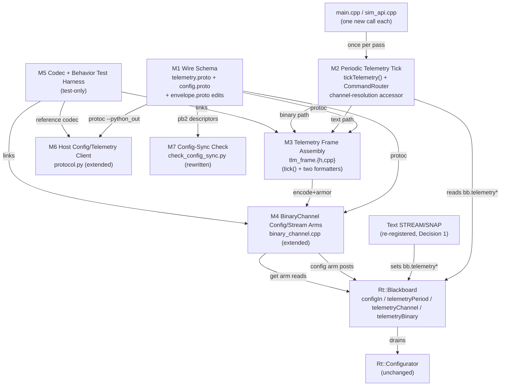
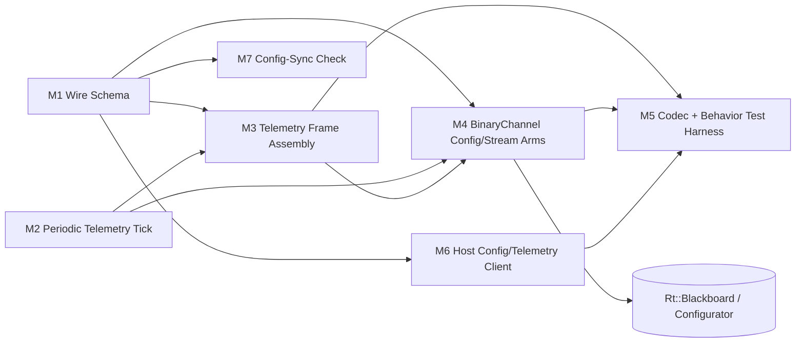
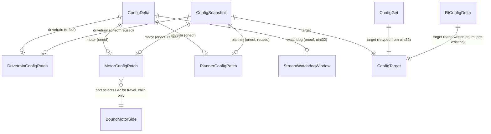

<!-- CLASI: Before changing code or making plans, review the SE process in CLAUDE.md -->

# Architecture Update -- Sprint 096: Protocol v3 Sprint 2: Binary telemetry and config plane

## Step 1: Understand the Problem

Sprint 095 landed the codec foundation and the highest-traffic binary
verbs (drive/segment/replace/stop/ping/echo/id), leaving `Telemetry`,
`ConfigDelta`, and `ConfigSnapshot` as empty placeholder proto messages
and `CommandEnvelope.cmd`'s `config`/`get`/`stream` arms wired to reply
`Error{ERR_UNIMPLEMENTED}`. Sprint 096 is "Sprint 2" of the 3-sprint
protocol-v3 program
(`clasi/issues/protocol-v3-schema-driven-binary-command-plane-protobuf.md`):
give those three arms real schemas and real behavior.

I read the current tree directly (not just `sprint.md`) to plan against
reality, and found more drift between `sprint.md`'s framing and the actual
code than 095 found against the issue:

- **`configCommands()` (SET/GET, `source/commands/config_commands.cpp`)
  and `telemetryCommands()` (STREAM/SNAP, `source/commands/
  telemetry_commands.cpp`) are BOTH currently unregistered** in
  `Rt::CommandRouter::buildTable()` (`command_router.cpp`) — only
  `systemCommands()` and `motionCommands()` are wired, per that file's own
  comment ("the `dev`/`telemetry`/`config`/`pose`/`otos` families are left
  un-wired here... `buildTable()` simply stops calling them"). `sprint.md`'s
  own Architecture Notes names `config`/`pose`/`otos`/`dev` as the parked
  families needing binary restoration — **it does not mention `telemetry`**,
  but the code shows `telemetry` is in the identical parked state.
- **The periodic-emission mechanism STREAM's own design depends on does
  not exist anywhere in the current tree.** `telemetry_commands.cpp`'s own
  comments describe "the loop's own later per-pass check (dev_loop.cpp)"
  and "bb.telemetryChannel/the loop's own resolveTelemetryReply()" as if
  live; `source/runtime/main_loop.h`'s own header comment says otherwise,
  explicitly: sprint 093's loop rewrite deleted "loop-originated wire
  output (`EVT`/periodic `TLM`)... not stubbed, deleted." A direct grep
  confirms `telemetryEmit()` (the only function that formats and sends a
  frame) is called from nowhere but `telemetry_commands.cpp`'s own two
  handlers (`STREAM`'s immediate first frame, `SNAP`'s one-shot reply) —
  there is no per-pass loop step anywhere that re-fires it. `STREAM <ms>`
  today, even if re-registered as-is, would emit exactly one frame and
  never again.
- **Two DIFFERENT "TLM" surfaces exist**, not one: (a) `telemetry_commands.cpp`'s
  STREAM/SNAP periodic emitter (`Telemetry::tick()`/`buildTlmFrame()`,
  `source/telemetry/tlm_frame.{h,cpp}`) — fields `t`/`mode`/`seq`/`enc`/
  `vel`/`cmd`/`pose`/`encpose`/`otos`+`otosconn`/`twist`; and (b) a
  separate, LIVE, one-shot `TLM` verb (`handleTlm()`,
  `motion_commands.cpp`, registered via `motionCommands()`) replying
  `OK tlm enc=... vel=... cmd=... acc=... active=... conn=... glitch=...
  ts=... now=...` — a DIFFERENT field set (`acc`/`active`/`conn`/`glitch`/
  `ts` appear ONLY here, sourced from `bb.drivetrain.acc[]`/`.busy`,
  `bb.motors[].connected`/`.enc_glitch_count`/`.sampled_at`). `StreamControl`
  (095, declared-only) pairs structurally with (a) (`binary`+`period`
  fields mirror `STREAM <ms>` exactly); the bench-diagnostic fields the
  hardware-bench-testing gate cares about (`conn=`/`glitch=`/`active=`)
  live only in (b).
- **`DrivetrainConfig` (41 fields), `MotorConfig` (10 fields), and
  `PlannerConfig` (10 fields) — the full generated proto messages
  `Rt::ConfigDelta` already carries — cannot fit the 186-byte envelope
  budget individually**, let alone as one combined slice. A rough
  worst-case tally of `DrivetrainConfig` alone (39 scalar fields at 2-byte
  tags for field numbers > 15, two `(max_count)=4` repeated-float arrays,
  one nested `Gains` message) lands well over 260 bytes before any other
  arm is counted. `config_commands.cpp`'s actual registered SET/GET
  surface (`kAllKeys`) is a MUCH smaller, already-curated 15-key subset
  spanning only 6 `DrivetrainConfig` fields, 6 `MotorConfig` fields
  (`travel_calib` + the 5 `Gains` members), 1 `PlannerConfig` field
  (`min_speed`), and one field outside the Configurator's four targets
  entirely (`sTimeout`, the loop-owned `StreamingDriveWatchdog` window).
- **`Rt::ConfigDelta`** (`source/runtime/commands.h`) is a hand-written,
  target+port+bitmask+value struct — `envelope.proto`'s own header comment
  (095) already flags it as "a completely different shape... target+port+
  field-mask, not a wire-friendly value message. No collision risk
  (different namespace), but no reusable shape either." The Configurator
  (`source/runtime/configurator.cpp`) folds a delta's masked fields onto
  its own persistent per-target config and calls the matching subsystem's
  `configure()` — this machinery is complete and untouched-by-095;
  whatever posts to `bb.configIn` today (only `config_commands.cpp`'s
  `handleSet()`, currently unregistered) drives it identically to whatever
  a binary arm would post.
- **`scripts/check_config_sync.py`'s current implementation targets files
  that do not exist in the current tree** (`source/types/Config.h`,
  `source/robot/ConfigRegistry.cpp` — both confirmed absent by direct
  search; they are `source_old`-era artifacts from before the greenfield
  rebuild). The script has been silently non-functional independent of
  this sprint — "retool" understates the actual scope, which is a full
  rewrite against a different pair of inputs entirely.
- **`gen_messages.py` already supports every mechanism this sprint's
  schema needs**, with zero new generator capability required: `oneof`-of-
  submessages (`CommandEnvelope.cmd` itself), `optional` scalar fields
  inside an ordinary message (`MotorConfig.reversal_dwell`/
  `.output_deadband` already do this today), and enums. No new emission
  mode, no new custom option, no offsetof/layout risk beyond what 095
  already gated.

## Step 2: Identify Responsibilities

1. **Declare the config and telemetry wire contracts** — curated field
   sets, traceable to existing text surfaces, each independently under the
   186-byte cap. Changes only when the schema changes. (-> Wire Schema)
2. **Make periodic wire emission actually happen, once per loop pass** — a
   mechanism that has not existed since sprint 093's loop rewrite, needed
   by BOTH the text STREAM verb (to give this sprint's own bench criteria
   a live baseline) and the new binary `stream` arm. Changes only if the
   loop-pass cadence or channel-resolution mechanism itself changes.
   (-> Periodic Telemetry Tick)
3. **Assemble one frame's worth of telemetry fields from the committed
   Blackboard, then format it two ways** — extend the existing pure
   `tick()`/format split (`source/telemetry/tlm_frame.{h,cpp}`) with the
   bench-diagnostic fields, and add a binary formatter alongside the
   existing text one. Changes when a telemetry field is added, removed, or
   re-sourced. (-> Telemetry Frame Assembly)
4. **Translate a decoded binary `stream`/`config`/`get` command into
   Blackboard state or a Configurator-bound delta, and reply** — the same
   "oneof-arm switch, `handlerCtx`-idiom Blackboard access" shape 095's
   `BinaryChannel` already established for drive/segment/replace/stop.
   Changes when a new arm's translation logic changes. (-> BinaryChannel
   Config/Stream Arms)
5. **Prove the new schema's codec agrees with the reference implementation,
   and that the new arms' Blackboard/Configurator effects match their text
   equivalents** — extends 095's differential harness plus fresh
   sim-level behavioral tests (the issue's own Risk 6: "parked text
   families have no live regression tests"). Changes when the schema or
   the arms' logic changes; ships nowhere. (-> Codec + Behavior Test
   Harness)
6. **Give the host the same schema and a binary telemetry/config client,
   with zero call-site change to existing consumers** — extends 095's `pb2`
   generation (already schema-agnostic, no change needed) and
   `NezhaProtocol`'s compatibility-shim posture. Changes when the schema
   changes or a new host client capability is needed. (-> Host Config/
   Telemetry Client)
7. **Verify the pydantic config model and the wire schema stay in sync** —
   an independent, CI-facing check with no runtime role. Changes when
   either the pydantic model or the curated wire config surface changes.
   (-> Config-Sync Check)

Responsibility 2 is new work this sprint has to do that neither `sprint.md`
nor the driving issue anticipated as a distinct line item — it surfaced
during Step 1 research (see Decision 1) and is treated as its own module
because it changes for a reason (loop-pass cadence / channel resolution)
that is independent of both the wire schema (1) and the frame-assembly
logic (3).

## Step 3: Define Subsystems and Modules

### M1 — Wire Schema (Config + Telemetry)
**Purpose**: Declare the binary wire contract for telemetry and config as
the single source of truth for both firmware and host.
**Boundary**: `protos/telemetry.proto` (new), `protos/config.proto` (new),
`protos/envelope.proto` (edited: real `Telemetry`/`ConfigDelta`/
`ConfigSnapshot` bodies replacing 095's empty placeholders; `ConfigGet.target`
retyped `uint32` -> `ConfigTarget`). Proto source only — no generated code,
no runtime behavior. Depends on nothing in this tree; everything downstream
depends on it.
**Use cases served**: SUC-001.

### M2 — Periodic Telemetry Tick
**Purpose**: Fire the current telemetry formatter (text or binary) once
per loop pass when a period has elapsed, on the channel that last asked
for it.
**Boundary**: `source/commands/telemetry_commands.{h,cpp}` (extended: a new
`tickTelemetry(Rt::Blackboard&, Rt::CommandRouter&, uint32_t now)` free
function alongside the existing `telemetryEmit()`), `source/runtime/
command_router.{h,cpp}` (one new accessor resolving a `Subsystems::Channel`
to a live `ReplyFn`/`void*` pair outside an active `route()` call),
`source/main.cpp` and `tests/_infra/sim/sim_api.cpp` (one new call each, in
the same "both real hardware and sim call the identical function" spirit
`Rt::MainLoop::tick()` already establishes for motion). Knows about
Blackboard state and channel resolution; knows nothing about telemetry
FIELD content (that is M3's job) or wire framing (M4's job for the binary
half).
**Use cases served**: SUC-002, SUC-003.

### M3 — Telemetry Frame Assembly
**Purpose**: Turn the committed Blackboard's state into one frame's worth
of telemetry values, then format that once value bag two ways.
**Boundary**: `source/telemetry/tlm_frame.{h,cpp}` (extended: `TlmFrameInput`
gains `acc`/`active`/`conn`/`glitch`/`ts` fields, sourced identically to
`handleTlm()`'s own computation; a new binary formatter is added alongside
the existing `buildTlmFrame()`). Pure: reads only the Blackboard snapshot
and its own input struct, writes only its output; unchanged text output
format (this module's existing consumer, `buildTlmFrame()`, is untouched
code, not just untouched behavior).
**Use cases served**: SUC-003.

### M4 — BinaryChannel Config/Stream Arms
**Purpose**: Translate one decoded `stream`/`config`/`get` command into
Blackboard state, a Configurator-bound `Rt::ConfigDelta`, or a
`ConfigSnapshot` read, and reply.
**Boundary**: `source/commands/binary_channel.cpp` (extended: the three
`ERR_UNIMPLEMENTED` stubs for `STREAM`/`CONFIG`/`GET` become real cases).
Reaches the Blackboard only through the same opaque `handlerCtx`-idiom
every arm already uses (095 Decision 1); never touches `Rt::ConfigDelta`'s
`mask`/target internals from outside this file, mirroring how `toSegment()`
already owns the one translation boundary between a decoded wire message
and an internal representation (095 Decision 2).
**Use cases served**: SUC-003, SUC-004.

### M5 — Codec + Behavior Test Harness (test-only, never shipped)
**Purpose**: Prove the new schema's codec agrees with `google.protobuf`,
and that the new arms' Blackboard/Configurator effects match their text
equivalents.
**Boundary**: `tests/sim/unit/*` (differential harness extension, following
095's M8 pattern exactly) plus new sim-level behavioral tests exercising
`BinaryChannel`'s `stream`/`config`/`get` end-to-end. Never linked into the
ARM build.
**Use cases served**: SUC-005.

### M6 — Host Config/Telemetry Client
**Purpose**: Give the host a binary telemetry/config client built on 095's
already-generic envelope demux, with zero call-site change to existing
consumers.
**Boundary**: `host/robot_radio/robot/protocol.py` (`TLMFrame` gains a
`pb2.Telemetry`-based alternate constructor; `NezhaProtocol` gains binary
set/get config methods alongside its existing text wrappers). No change to
`host/robot_radio/io/serial_conn.py` — 095's `ReplyEnvelope` reader-thread
branch already demuxes by `corr_id` generically, regardless of which
`body` oneof arm arrives.
**Use cases served**: SUC-006.

### M7 — Config-Sync Check
**Purpose**: Verify the pydantic config model and the curated wire config
surface stay consistent.
**Boundary**: `scripts/check_config_sync.py` (full rewrite; its current
target files do not exist in this tree — see Step 1), `scripts/
config_sync_allowlist.json` (format preserved). Reads `host/robot_radio/
config/robot_config.py` and the generated `pb2` descriptors for M1's Patch
messages; writes nothing, has no runtime role.
**Use cases served**: SUC-007.

**Cohesion check**: each module's purpose is one sentence, no "and".
**Fan-out check**: M4 (BinaryChannel Config/Stream Arms) is the widest —
it depends on M1 (types), M2 (the channel-resolution accessor, for
`stream`'s channel-binding), M3 (the binary formatter it doesn't directly
call but whose output shape it decodes on the `tlm` reply side is
symmetric with), and the Blackboard/Configurator's existing queue types —
3-4 dependencies, under the fan-out-4-5 ceiling, and the same
dispatcher-shaped justification 095 already gave M5 (`BinaryChannel`)
applies here: routing between exactly those things IS this module's job.

## Step 4: Diagrams

### Component diagram

### Dependency graph (module level)

No cycles: M1 is a pure leaf everything reads from; M2 and M1 both feed M3;
M3 feeds M4; M4's only downstream is the pre-existing `Rt::Blackboard`/
`Configurator`, which none of M1/M2/M3/M6/M7 depend on directly. M5/M6/M7
are pulled from but never pull back into the firmware modules.

### Config data-model diagram

## Step 5: Complete the Document

### What Changed

**New proto files**: `protos/telemetry.proto` (`Telemetry`), `protos/
config.proto` (`ConfigTarget`, `DrivetrainConfigPatch`, `MotorConfigPatch`,
`PlannerConfigPatch`).

**Edited proto files**: `protos/envelope.proto` — `ConfigDelta`/
`ConfigSnapshot` gain real bodies (built from `config.proto`'s Patch
types via a `oneof`, mirroring `CommandEnvelope.cmd`'s own idiom);
`Telemetry` gains a real body (built from `telemetry.proto`); `ConfigGet.target`
retyped `uint32` -> `ConfigTarget`.

**New generated code**: `source/messages/telemetry.h`, `source/messages/
config.h` (ordinary generator output). No new generator emission mode, no
new custom option — `gen_messages.py` itself is untouched (Step 1's
finding: every mechanism this sprint needs already exists).

**Edited firmware code**: `source/commands/binary_channel.cpp` (three
`ERR_UNIMPLEMENTED` stubs become real `stream`/`config`/`get` handling);
`source/commands/telemetry_commands.{h,cpp}` (new `tickTelemetry()`);
`source/telemetry/tlm_frame.{h,cpp}` (`TlmFrameInput` gains `acc`/`active`/
`conn`/`glitch`/`ts`; a new binary formatter added; the existing text
`buildTlmFrame()` is untouched code); `source/runtime/command_router.{h,cpp}`
(one new channel-resolution accessor; `buildTable()` re-adds
`telemetryCommands()` — see Decision 1); `source/runtime/blackboard.h`
(one new field, `telemetryBinary`); `source/main.cpp` and `tests/_infra/
sim/sim_api.cpp` (one new `tickTelemetry(...)` call each, same call site
shape as the existing `router.route(...)`/`loop.tick(...)` calls).

**New tests**: differential coverage for `Telemetry`/`ConfigDelta`/
`ConfigSnapshot` (extends 095's harness); new sim-level behavioral tests
for binary `stream`/`config`/`get` (M5).

**New host code**: `TLMFrame`'s pb2-based alternate constructor,
`NezhaProtocol`'s binary config set/get methods (`host/robot_radio/robot/
protocol.py`). No change to `host/robot_radio/io/serial_conn.py` — its
`ReplyEnvelope` demux is already generic across `body` oneof arms.

**Rewritten**: `scripts/check_config_sync.py` (full rewrite against pb2
descriptors + pydantic, not a "retool" of live logic — see Step 1 and
Decision 6).

**Untouched, by design**: `source/commands/config_commands.cpp` (SET/GET
text handlers stay unregistered — Decision 1); `source/commands/
motion_commands.cpp`'s `handleTlm()` (the one-shot `TLM` verb keeps its own
text wire format byte-for-byte; this sprint reads the SAME Blackboard
cells it reads, never its code); `source/runtime/configurator.cpp` (no
change — it already folds whatever lands on `bb.configIn`, text- or
binary-originated, identically); `scripts/gen_messages.py`;
`host/robot_radio/io/serial_conn.py`.

### Why

Per the issue and `sprint.md`: extend the binary plane to the two
remaining high-traffic text surfaces (telemetry, config), keeping the dual
stack (text SET/GET stays parked/unregistered per Decision 1, not
resurrected; the `TLM` one-shot verb and its own text format are left
alone). Sprint 096 additionally has to build the periodic-emission
mechanism the STREAM verb's design has always assumed but which sprint
093's loop rewrite deleted — a genuine gap discovered during this
document's own Step 1 research, without which the sprint's own "text vs.
binary TLM at matched rates" bench criterion would have no live baseline.

### Impact on Existing Components

- **`Rt::CommandRouter::buildTable()`**: re-adds `telemetryCommands()`
  (STREAM/SNAP). `configCommands()` (SET/GET) is deliberately NOT
  re-added — Decision 1.
- **`Rt::CommandRouter`**: gains one small accessor resolving
  `Subsystems::Channel` -> `(ReplyFn, void*)`, reusing the SAME
  `serialReply_`/`serialCtx_`/`radioReply_`/`radioCtx_` private state
  `route()` already branches on internally — no new state, just a second
  entry point to the existing branch.
- **`Rt::Blackboard`**: one new field, `telemetryBinary` (bool), alongside
  the existing `telemetryPeriod`/`telemetryChannel`/`telemetrySeq`/
  `telemetryLastEmitMs`/`telemetryHasLastEmit`. No new queues — `bb.configIn`
  already exists and already has exactly the semantics (`Rt::ConfigDelta`
  target+mask+value) the `config` arm needs.
- **`Rt::Configurator`**: zero changes. It has never cared which command
  family produced a `bb.configIn` entry; a binary-originated
  `Rt::ConfigDelta` folds and applies identically to a text-SET-originated
  one.
- **`source/telemetry/tlm_frame.{h,cpp}`**: `TlmFrameInput` grows; the
  text formatter (`buildTlmFrame()`) does not change its output for any
  existing field — verified by SUC-003's "byte-identical before and
  after" acceptance criterion.
- **`source/main.cpp`**: one new line in the bare `for(;;)` loop, in the
  same minimal, explicit style 093 established (a peer of the existing
  `comm.tick(now)`/`router.route(...)` calls, not a new abstraction layer).
- **Flash/RAM**: two new small messages (`Telemetry`, three `*ConfigPatch`
  types) plus their field tables — comparable in size to 095's per-arm
  cost (a few hundred bytes to ~1-2 KB of `.rodata`, well under the ~90 KB
  headroom tracked since 095); the NEW periodic-tick code (M2) is small
  (a channel-resolution accessor plus a per-pass period/elapsed check) and
  has no meaningful RAM cost beyond the one new `bool` on `Blackboard`.
  Ticket-level `.map` measurement is still required (constraint from
  `sprint.md`) since 095's own `kMaxEncodedSize` static_assert is the
  authority on wire size, not this document's hand estimate (095
  Decision 6's own lesson, reapplied).

### Migration Concerns

None in the data-migration sense. Deployment sequencing: like 095, this
sprint's binary additions are strictly additive (new oneof-arm bodies for
already-declared field numbers; unknown-field-skip covers any transient
host/firmware version skew). The ONE behavior change with a real blast
radius is Decision 1 (STREAM/SNAP becoming live again) — a client that
happens to send `STREAM`/`SNAP` today gets `ERR unknown` (unregistered
verb); after this sprint it gets real, periodic frames. This is a
strictly-more-capable change (an unregistered verb becoming registered),
not a breaking one, but is called out explicitly since it is the one
place this sprint changes TEXT-plane behavior rather than only adding to
the binary plane.

## Step 6: Document Design Rationale

### Decision 1 — Restore `telemetryCommands()` (STREAM/SNAP) to
`buildTable()` and build the first-ever loop-owned periodic-emission tick;
leave `configCommands()` (SET/GET) unregistered

**Context**: Step 1 found `telemetryCommands()` and `configCommands()` in
the identical unregistered state, but `sprint.md`'s own Architecture Notes
names only `config`/`pose`/`otos`/`dev` as parked families this program
restores via binary arms — it does not mention telemetry, and its Success
Criteria explicitly requires "text-vs-binary TLM streamed at matched rates
on the bench shows no regression in `tlm_drop_rate()`," which is
impossible to satisfy without a LIVE, genuinely-periodic text baseline.
Separately, `sprint.md`'s own Architecture Notes states plainly that
config's "functionality [comes] back through binary arms in 095/096 — the
text versions stay parked" — an explicit instruction that text SET/GET
stays unregistered, config's binary arm being the ONLY live path this
sprint, not a dual-stack pairing the way drive/segment/replace/stop were
in 095.

**Alternatives considered**:
1. Leave both `telemetryCommands()` and `configCommands()` unregistered;
   satisfy the drop-rate criterion by having the host poll the LIVE
   one-shot `TLM` verb (`motion_commands.cpp`) at a fixed interval instead
   of a true push stream. *Rejected*: `tlm_drop_rate()` (the bench
   tooling `sprint.md` names) and the existing memory note that "relay
   drops async EVT/STREAM (SNAP reliable)" both imply the metric is
   specifically about UNSOLICITED PUSH frame loss in transit — a
   request/reply RPC pattern (poll-and-wait) cannot experience the same
   failure mode, so this alternative would silently change what the
   bench criterion measures rather than satisfy it.
2. Register `telemetryCommands()` as-is, without building a periodic tick,
   accepting that `STREAM <ms>` only ever emits its one immediate frame.
   *Rejected*: this does not produce a genuine "streamed at matched rates"
   comparison — it is a mislabeled one-shot, not a fix.
3. Register `telemetryCommands()` AND build the periodic tick; also
   re-register `configCommands()` for full dual-stack symmetry with 095's
   drive/segment/replace/stop precedent. *Rejected the config half*:
   `sprint.md`'s own explicit design statement (quoted above) already
   settled this — config's dual-stack pairing does not exist this sprint,
   only telemetry's does (STREAM/SNAP is a pure diagnostic read path with
   no `CMD_ACCESS_HARDWARE` motion-safety concern SET's atomic-multi-key
   validation has; reviving it costs nothing extra to the sprint's own
   config scope and is orthogonal to whether SET is revived).
4. **Register `telemetryCommands()` and build the periodic tick; leave
   `configCommands()` unregistered.** *Chosen.*

**Why the chosen alternative**: it is the smallest change that makes
`sprint.md`'s own stated success criterion measurable, follows the
sprint's own explicit config-plane design statement precisely, and
attributes the periodic-tick gap to where it actually lives (a dead
subsystem since sprint 093, unrelated to whether config text stays
parked).

**Consequences**: `source/commands/telemetry_commands.{h,cpp}` gains a new
`tickTelemetry()` function; `source/runtime/command_router.{h,cpp}` gains
a channel-resolution accessor; `source/main.cpp` and `tests/_infra/sim/
sim_api.cpp` each gain one new call. `source/commands/config_commands.cpp`
is untouched and its handlers remain dead code on disk, exactly as they
were before this sprint — ticket 097 (text retirement) is still the
sprint that decides SET/GET's final fate (revive-then-delete, or delete
outright), not this one.

### Decision 2 — `ConfigDelta`/`ConfigSnapshot` are new, purpose-built,
curated messages mirroring `config_commands.cpp`'s existing 15-key
surface, never the full `DrivetrainConfig`/`MotorConfig`/`PlannerConfig`
messages directly

**Context**: The driving issue's own envelope sketch and `sprint.md` both
describe `ConfigDelta`/`ConfigSnapshot` at the "config plane" level of
abstraction without specifying field-for-field shape; Step 1's sizing
shows the full generated config messages (41/10/10 fields) cannot fit the
186-byte budget individually, and marking every one of their fields
`optional` would ripple `Opt<T>` into every `configure()` call site across
the firmware (`Drivetrain::configure()`, `PoseEstimator::configure()`,
`Hal::Motor::configure()`) — exactly the "config presence semantics
(`Opt<T>` reaching `configure()` paths)" risk the issue names as risk #4
and `sprint.md` explicitly quarantines to this sprint.

**Alternatives considered**:
1. Mark every field of `DrivetrainConfig`/`MotorConfig`/`PlannerConfig`
   `optional`, chunk the resulting message into multiple 186-byte-fitting
   replies. *Rejected*: the `Opt<T>` blast radius into every existing
   `configure()` call site is precisely the risk #4 quarantine this
   sprint is supposed to respect, not walk into; it also does not stay
   inside `sprint.md`'s own scope boundary ("new functionality beyond
   restoring existing parked coverage is out of scope" — most of those
   41/10/10 fields have no existing wire-config verb at all today).
2. **New, purpose-built, curated `*ConfigPatch` messages mirroring ONLY
   the 15 keys `config_commands.cpp` already registers.** *Chosen.*

**Why the chosen alternative**: this is the SAME move 095's Decision 2
made for `MotionSegment` versus `Motion::Segment` — a purpose-built,
independently-bounded wire type, translated at one boundary
(`BinaryChannel`), rather than coupling the wire schema to an internal
type's full shape. It keeps every arm trivially under 186 bytes, touches
zero existing `configure()` signatures, and matches `sprint.md`'s own
scope boundary exactly (restoring existing parked coverage, not inventing
new configurable surface).

**Consequences**: `protos/config.proto` declares `DrivetrainConfigPatch`
(6 fields: `trackwidth`, `rotational_slip`, `ekf_q_xy`, `ekf_q_theta`,
`ekf_r_otos_xy`, `ekf_r_otos_theta`), `MotorConfigPatch` (6 fields:
`travel_calib` + the 5 `Gains` members, plus a side selector — see
Decision 5), `PlannerConfigPatch` (1 field: `min_speed`), and a
`ConfigTarget` enum with a 4th value for the watchdog window (`sTimeout`,
outside the Configurator's own four targets). `ConfigDelta`/
`ConfigSnapshot` are built as a `oneof` over these three Patch types plus
the bare `uint32` watchdog case — the SAME oneof idiom `CommandEnvelope.cmd`
already uses, requiring no new generator capability.

### Decision 3 — The config-delta "merge" is a small, hand-written
translation in `BinaryChannel`, not a new generator emission mode

**Context**: `sprint.md`'s Scope literally says "generated config merge
(apply-present-fields), replacing the five strcmp chains." Taken literally,
this would mean `gen_messages.py` emits a function that patches an
arbitrary target struct from an arbitrary `Opt<T>`-bearing source struct
by field-name matching — new generator machinery that would need to know
about `Rt::ConfigDelta`'s hand-written `mask`/`*ConfigField` enum types,
which live outside `protos/` and outside `gen_messages.py`'s current
boundary entirely (it "reads `protos/`, writes `source/messages/*.h`...
never hand-edited output" — M2's boundary, unchanged since 095). (Step 1's
own recount, from the actual current tree, found two `strcmp` chains in
`config_commands.cpp`'s top-level SET/GET surface, not five — the larger
count in the issue's own framing bundles in `dev_commands.cpp`'s separate
per-motor/per-drivetrain `DEV *CFG` chains, which are a different,
lower-level debug surface this sprint does not touch; see Decision 2's
own scope boundary.)

**Alternatives considered**:
1. Extend `gen_messages.py` with a new custom option (e.g.
   `(config_field) = "kTrackwidth"`) letting the generator cross-reference
   the hand-written `Rt::*ConfigField` enums and emit a generic merge
   function. *Rejected*: couples the generator to a hand-written,
   non-`protos/` C++ enum — a real boundary violation of M1/M2's
   established "generator knows nothing outside `protos/`" contract, for
   a mechanism this sprint only needs ~15 times total (3 Patch types,
   2-6 fields each).
2. **`BinaryChannel`'s `config` arm hand-translates the ONE populated
   Patch's present `Opt<T>` fields into a freshly-built `Rt::ConfigDelta{
   target, mask, value}`**, one `if (patch.field.has) { ...; mask |=
   bitOf(...); }` per field — mirroring `applyConfigKey()`'s existing
   per-key assignment shape exactly, minus the `strcmp` dispatch (replaced
   by the oneof's own typed `cmd_kind` discriminant) and minus the manual
   `parseFloatStrict`/`parseLongStrict` parsing (replaced by the generated
   decoder's typed field decode plus its `min`/`max`/`abs_max`/`req`
   validation, which IS generated, satisfying that half of `sprint.md`'s
   claim in full). *Chosen.*

**Why the chosen alternative**: "the strcmp chains" are genuinely
eliminated on the binary path — no field lookup by string name happens
anywhere in `BinaryChannel`. What remains hand-written is the mechanical
last mile (copy a present field into the matching `Rt::ConfigDelta` member
and OR its mask bit), the same size and shape as `toSegment()`'s existing
one-directional copy (095 Decision 2) — the smallest, most
consistent-with-precedent footprint, and it does not touch the
generator's established boundary.

**Consequences**: `sprint.md`'s literal phrase "generated config merge" is
satisfied in effect (string-keyed dispatch and manual parsing/validation
are both gone from the binary path) but not in the most literal reading
(the field-by-field copy itself is hand-written, not emitted). Flagged
explicitly per the Exception Protocol's "record the discrepancy, don't
silently reconcile" guidance — this is a design-authority call within a
sprint-planner's remit (an implementation-mechanism choice, not an
override of any upstream architecture decision or use-case boundary), not
an exception requiring escalation.

### Decision 4 — `ConfigSnapshot` chunking granularity is one reply per
`ConfigTarget` (drivetrain / motor(+port) / planner / watchdog), reusing
the Configurator's own four-way split; no multi-reply-per-request protocol

**Context**: `sprint.md` says "CHUNK per Decision 6 [ed.: 095's
per-arm-budget rule] — one subsystem slice per reply." Taken as "one
`DrivetrainConfig` struct per reply," this does not fit 186 bytes (Step 1).
Taken as "one CURATED slice per reply," it fits trivially (Decision 2's
Patch types are a handful of fields each).

**Alternatives considered**:
1. One binary `get` request triggers a SEQUENCE of replies (all
   `ConfigTarget` slices, or all touched fields), correlated by the SAME
   `corr_id`. *Rejected for this sprint*: this is new multi-reply-per-
   request protocol machinery (095's envelope design is strictly
   one-request-one-reply, mirroring `Ack`/`Error`/`Ping`'s own shape) —
   speculative generality for a convenience (avoiding 4 round-trips) the
   sprint's own Success Criteria do not ask for ("every config slice
   round-trips" reads naturally as one request per slice).
2. **One `get{target}` request names exactly one `ConfigTarget`; the reply
   is exactly one `ConfigSnapshot` for that target.** A client wanting
   "every slice" issues up to 4 requests (pipelineable, per 095's own
   corr_id-correlated design). *Chosen.*

**Why the chosen alternative**: matches the request/reply shape every
other implemented arm (095 and this sprint) already uses; the "chunk
boundary = `ConfigTarget`" choice reuses a distinction
(`Rt::ConfigDelta::Target`) the Configurator already enforces, rather than
inventing a new one.

**Consequences**: a binary "dump everything" convenience (mirroring bare
text `GET`'s all-keys dump) is host-side looping, not a server-side
feature, this sprint. Flagged as Open Question 1 below for 097 if a real
need for a single-request full-dump emerges.

### Decision 5 — `MotorConfigPatch`'s side-selector disambiguates ONLY
`travel_calib`; the five `Gains` fields are unconditionally applied to
BOTH bound motors

**Context**: In `config_commands.cpp`'s existing text surface, `ml`/`mr`
each address exactly one side's `travel_calib`, while `pid.kp`/`ki`/`kff`/
`iMax`/`kaw` always write BOTH bound motors' `Gains` identically
(`applyConfigKey()`'s own hard-coded `cand.touchedLeft = true; cand.touchedRight
= true;` for every `pid.*` key). A binary `MotorConfigPatch` needs a way
to express "just the left travel_calib" without accidentally implying
"just the left PID gains" (which the text surface has never supported).

**Decision**: `MotorConfigPatch` carries a `port` (or `side`) selector
that disambiguates `travel_calib` ONLY; `BinaryChannel`'s translation
applies any present `kp`/`ki`/`kff`/`i_max`/`kaw` field to BOTH bound
motors unconditionally, regardless of `port` — i.e., posting TWO
`Rt::ConfigDelta{target: kMotor}` entries (one per bound index) whenever
any `Gains` field is present, mirroring `applyConfigKey()`'s exact
both-sides behavior byte-for-byte.

**Why**: this is not a new semantic choice — it is a direct transcription
of behavior `config_commands.cpp` already has, the same "transcribe, never
re-derive" discipline 095's Decision 5 applied to numeric bounds.
Inventing an independently-addressable per-side PID surface would be new
capability beyond `sprint.md`'s "restoring existing parked coverage"
boundary.

**Consequences**: `BinaryChannel`'s `config` arm case is slightly
asymmetric (one field's presence maps to one delta post; five fields'
presence maps to two delta posts) but requires no new schema shape — a
single `port` field alongside `travel_calib`/the five `Gains` fields in
one `MotorConfigPatch` message.

### Decision 6 — `Telemetry`'s field set is the curated union of the
STREAM/SNAP text frame AND the separate one-shot `TLM` verb's
bench-diagnostic fields; `check_config_sync.py` is a full rewrite, not a
retool

**Context (telemetry)**: the team-lead's own brief for this sprint lists
"enc, vel, cmd, acc, active, conn, glitch, ts, now" as the fields to
mirror — this is `handleTlm()`'s (motion_commands.cpp) field set, NOT
`Telemetry::TlmFrameInput`'s (which additionally has `pose`/`encpose`/
`otos`+`otosconn`/`twist`, and omits `acc`/`active`/`conn`/`glitch`/`ts`
entirely). These are two different, currently-disjoint text surfaces (Step
1). `StreamControl` (095) structurally pairs with the STREAM/SNAP
periodic emitter, not the one-shot `TLM` verb.

**Decision**: `Telemetry` carries the UNION — both surfaces' fields —
sourced from a single extended `TlmFrameInput` (M3), with the bench-
diagnostic fields (`acc`/`active`/`conn`/`glitch`/`ts`) computed exactly
the way `handleTlm()` already computes them (same Blackboard cells:
`bb.drivetrain.acc[]`/`.busy`, `bb.motors[].connected`/`.enc_glitch_count`/
`.sampled_at`), without touching `handleTlm()`'s own code or text wire
format.

**Why**: the team-lead's brief is the more authoritative signal for what
the bench gate actually needs (the bench-diagnostic fields are exactly
what `.claude/rules/hardware-bench-testing.md`'s "sensors are alive" /
"encoders increment" verification reads), and Step 1's rough sizing shows
the union comfortably fits 186 bytes (an estimate; the ticket's generated
`kMaxEncodedSize` static_assert is the actual authority, per 095 Decision
6's own lesson). Dropping the STREAM-only fields (`pose`/`encpose`/`otos`/
`twist`) instead of including them would silently narrow what "mirror the
text TLM frame" means without a documented reason; including both keeps
the binary plane at PARITY with both existing text surfaces at once,
which is the more defensible reading of "mirror the text TLM frame's
fields... etc." in the team-lead's own brief.

**Consequences**: if ticket implementation finds the real (not estimated)
worst-case `kMaxEncodedSize` exceeds 186 bytes, the documented trim order
is: drop `encpose` first (reconstructable from `enc`+`twist`; least
bench-critical), then `otos`+`otosconn` (already a diagnostic-only field
per its own 092-002 doc comment) — never trim `enc`/`vel`/`cmd`/`active`/
`conn`/`glitch` (the bench gate's own core signals).

**Context (check_config_sync.py)**: see Step 1 — the current script's two
input files do not exist in this tree at all.

**Decision**: full rewrite against `host/robot_radio/config/robot_config.py`
(pydantic) vs. the generated `pb2` descriptors for Decision 2's three
Patch messages, preserving the allowlist mechanism's spirit (an escape
hatch for known-intentional exceptions) but not its exact category names
(the old Set-A/B/C-against-a-C-struct framing does not map onto a
pydantic-vs-protobuf-descriptor comparison).

**Why**: "retool" (sprint.md's word) undersells the actual state — there
is no live logic to retool, only a script that has been silently
non-functional since before the greenfield rebuild. Flagged here rather
than silently absorbed, per the Exception Protocol's "record the
discrepancy" guidance (this is a design-authority call within a
sprint-planner's remit, not an escalation-requiring exception — it does
not override any upstream decision or use-case boundary).

**Consequences**: ticket 008 owns defining the new allowlist JSON shape
(same file, `scripts/config_sync_allowlist.json`, new category names) and
documenting the mapping from the old Set-A/B/C language to the new
pydantic-vs-pb2-descriptor comparison in the script's own module
docstring.

## Step 7: Open Questions

1. **Single-request "dump every config slice"** — Decision 4 chose
   4-round-trips-max over a new multi-reply-per-request mechanism. If a
   future bench workflow finds 4 round-trips too slow/awkward, 097 should
   revisit this as a deliberate protocol extension, not retrofit it here.
2. **A binary one-shot "pull one Telemetry frame now" (SNAP-equivalent)**
   is explicitly NOT built this sprint — `sprint.md`'s In-Scope list names
   only `StreamControl.binary`. If a client needs a synchronous binary
   telemetry read without arming periodic emission, that is a 097
   candidate (a new, tiny request arm reusing `Telemetry` on the reply
   side, the same "reuse the leaf message on a new oneof arm" move 095
   Decision 4 already made for `id`/`echo`).
3. **`Telemetry`'s exact worst-case `kMaxEncodedSize`** — Step 1's ~110-byte
   estimate is a hand computation (095 Decision 6 already warns hand
   computation is not authoritative); ticket 003/004's own generated
   static_assert is what actually gates this, with Decision 6's trim order
   as the documented fallback if it doesn't fit.
4. **`sTimeout`'s `ConfigTarget` value and Configurator relationship** —
   `sTimeout` (the loop-owned `StreamingDriveWatchdog` window) is NOT one
   of `Rt::ConfigDelta`'s four Configurator targets; it posts to
   `bb.streamWatchdogWindowIn` directly (a separate queue,
   `config_commands.cpp`'s existing `handleSet()` behavior). `ConfigTarget`
   needs a 4th enumerator for it, and `BinaryChannel`'s `config` arm must
   branch to the DIFFERENT queue for this one case — ticket 004 owns
   getting this right and should say so explicitly in its own code
   comments (mirroring `config_commands.h`'s existing file-header note
   about `sTimeout` being "the one key that is NOT one of the
   Configurator's four targets").
5. **Text STREAM/SNAP's pre-093 "immediate first frame concatenated into
   the SAME reply as the ACK" optimization** — Decision 1's new,
   loop-owned periodic tick does not reproduce this micro-optimization
   (the first frame now arrives one pass later, via the normal periodic
   path's own `!telemetryHasLastEmit` trigger, for both text and binary
   uniformly). This is a minor, deliberate behavior refinement, not a
   regression the acceptance criteria need to preserve byte-for-byte —
   flagged so a future reader does not mistake the timing difference for
   a bug.

## Risks

1. **Same self-written-codec risk 095 already carries** (issue's #1 ranked
   risk) — mitigated identically: SUC-005's differential suite runs before
   `BinaryChannel`'s new arms are exercised against real hardware.
2. **The new periodic-tick mechanism (M2) is genuinely new code with no
   pre-093 behavior to regression-test against** — mitigated by SUC-002's
   explicit acceptance criteria (monotonic `seq=`, correct on/off
   behavior) and by building it once, shared by both text and binary
   paths, rather than twice.
3. **186-byte cap for `Telemetry`** — Decision 6's estimate is
   comfortable but unverified; the generated `static_assert` is the
   actual gate (095's own established pattern), with a documented trim
   order if it fails.
4. **Config presence semantics (`Opt<T>` reaching `configure()` paths)** —
   the issue's risk #4, explicitly quarantined to this sprint by
   `sprint.md`. Resolved by Decision 2: `Opt<T>` never reaches any
   existing `configure()` signature at all — it only ever appears on the
   new, purpose-built `*ConfigPatch` messages, translated at the
   `BinaryChannel` boundary into the SAME `Rt::ConfigDelta` shape
   text-SET already produces.
5. **`configCommands()` staying unregistered while `telemetryCommands()`
   is restored is an asymmetry a future reader could mistake for an
   oversight** — mitigated by Decision 1's explicit rationale and by
   `sprint.md`'s own quoted language being cited directly, so the
   asymmetry traces to a stated design choice, not an inconsistency.

## Quality Checks

- Every module (M1-M7) addresses at least one use case (SUC-001..007) —
  verified in each module's "Use cases served" line above.
- No cycles in the dependency graph (Step 4) — verified by inspection.
- Cohesion test (one-sentence-no-"and" purpose) — passes for all 7
  modules (Step 3).
- Fan-out <= 4-5 — M4 (BinaryChannel Config/Stream Arms) is the widest at
  3-4, under the ceiling, justified the same way 095's M5 was.

## Self-Review (architecture-review phase)

**Consistency**: the "Sprint Changes" (What Changed) section matches the
document body — every file listed there is backed by a Step 3 module and
a Step 6 decision wherever this document's design diverges from
`sprint.md`'s literal text (Decisions 1, 3, 4, 6). No section contradicts
another; Decision 1's config/telemetry asymmetry is stated once (Step 5's
Migration Concerns, Step 6 Decision 1, Risk 5) and consistently, not
reconciled differently in different places.

**Codebase Alignment**: every current-state claim in Step 1 was verified
by reading the actual file (`command_router.cpp`'s `buildTable()`,
`main_loop.h`'s own header comment, `main.cpp`, `telemetry_commands.{h,cpp}`,
`tlm_frame.{h,cpp}`, `motion_commands.cpp`'s `handleTlm()`, `config_commands.{h,cpp}`,
`commands.h` (`Rt::ConfigDelta`), `configurator.cpp`, `drivetrain.proto`/
`motor.proto`/`planner.proto`, `envelope.proto`, `options.proto`,
`gen_messages.py`'s `Opt<T>` handling, `check_config_sync.py`), not assumed
from `sprint.md`. Three real drifts were found between `sprint.md`'s
framing and reality (telemetry is parked exactly like config, contradicting
`sprint.md`'s Architecture Notes; STREAM's periodic mechanism does not
exist at all; the full config messages cannot fit 186 bytes, and neither
can a "one subsystem struct per reply" reading of the chunking
instruction) — all three are resolved as explicit, justified Decisions (1,
2, 4) rather than silently patched or left for a ticket to discover
mid-implementation. Proposed changes are feasible given the actual code
state: `bb.configIn`/the Configurator need zero changes; `gen_messages.py`
needs zero new capability; the periodic-tick's channel-resolution need is
satisfiable from `CommandRouter`'s already-existing private state.

**Design Quality**: cohesion — each module's purpose is one sentence, no
"and" (Step 3). Coupling — dependency direction is schema-and-tick-to-
consumer (M1/M2 -> M3 -> M4), no circular dependencies (Step 4); M5/M6/M7
are pulled from but never pull back into the firmware modules. Boundaries
— M1 (schema) knows nothing about the Configurator's `mask` representation;
M3 (frame assembly) knows nothing about wire framing; M4 (BinaryChannel)
knows nothing about hardware, only Blackboard/Configurator queue shapes
the text handlers already established; M2 (periodic tick) knows nothing
about telemetry field content. Fan-out — M4 at 3-4, justified above.

**Anti-Pattern Detection**: no god component (7 modules split along
"changes for different reasons" lines: schema vs. loop-cadence vs.
frame-content vs. dispatch-translation vs. tests vs. host vs. sync-check).
No shotgun surgery (the firmware edit footprint outside new files is
small and localized: one `buildTable()` line, one new `CommandRouter`
accessor, one `Blackboard` field, extensions to two existing files
(`binary_channel.cpp`, `tlm_frame.{h,cpp}`), one new loop-call line in two
files). No feature envy (`BinaryChannel` posts the same `Rt::ConfigDelta`
shape `config_commands.cpp` already builds; it does not reach into the
Configurator's internals). No circular dependencies (Step 4). No leaky
abstraction (M3's two formatters share one pure `tick()`; M4 never needs
to know a specific Patch message's byte layout — that is still M4-via-M1's
generated decoder's job). No speculative generality: Decision 4
explicitly REJECTED a multi-reply mechanism the sprint does not need;
Decision 2 explicitly REJECTED exposing config fields with no existing
wire verb. The one place this document adds capability beyond a literal
reading of `sprint.md` (Decision 1's periodic-tick build, Decision 6's
telemetry-field union) is justified by what the sprint's OWN stated
Success Criteria and the team-lead's own brief require, not invented.

**Risks**: enumerated above — self-written-codec risk (mitigated
identically to 095), the new periodic-tick mechanism having no prior
behavior to regress against (mitigated by explicit acceptance criteria and
building it once for both planes), the 186-byte cap (compile-time
enforced, documented trim order), the `Opt<T>`-into-`configure()` risk
(resolved structurally by Decision 2, not just mitigated), and the
telemetry/config asymmetry being legible as a decision rather than an
oversight.

### Verdict: **APPROVE**

No structural issues (no god component, no circular dependency, no broken
interface, no inconsistency between Sprint Changes and the document body).
Three genuine gaps between `sprint.md`'s framing and the actual codebase
were found during Step 1 research (telemetry's true parked state and dead
periodic-emission mechanism; the full config messages' incompatibility
with the 186-byte budget; the literal "generated merge"/"one subsystem
slice" phrasing not matching what actually fits) and resolved as explicit,
justified Decisions (1, 2, 3, 4, 6) rather than either silently patched or
left for a ticket to discover mid-implementation — the same posture 095's
own architecture-review took toward its own two sketch-vs-reality drifts.
Proceeding to ticketing.
