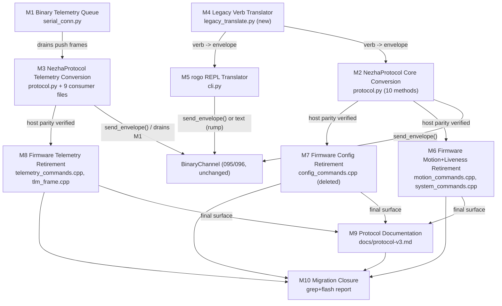
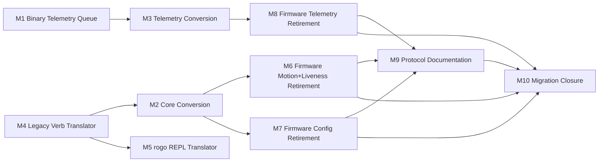
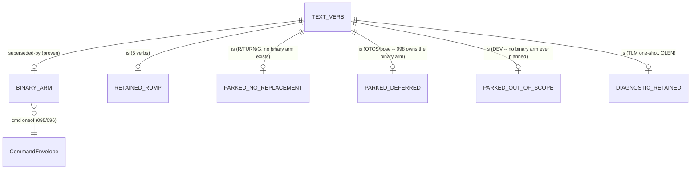

<!-- CLASI: Before changing code or making plans, review the SE process in CLAUDE.md -->

# Architecture Update -- Sprint 097: Protocol v3 Sprint 3: Host completion and text retirement

## Step 1: Understand the Problem

Sprints 095/096 built the binary command plane (drive/segment/replace/stop/
ping/echo/id, then config/get/stream/telemetry) alongside the text plane,
touching zero existing host call sites. Sprint 097 is "Sprint 3" (the FINAL
sprint) of the protocol-v3 program
(`clasi/issues/protocol-v3-schema-driven-binary-command-plane-protobuf.md`):
finish converting `NezhaProtocol` to binary, then delete the now-redundant
text code down to a five-verb safety rump (PING, ID, HELLO, HELP, STOP).

I read the current tree directly (not just the sprint brief) to plan
against reality, and found more drift than either 095 or 096 found — this
sprint's host side has aged relative to the trimmed 093/094 firmware in
ways that materially change scope.

- **`Rt::CommandRouter::buildTable()` registers exactly three families
  today**: `systemCommands()` (PING/VER/HELP/ECHO/ID/HELLO),
  `motionCommands()` trimmed to S/STOP/D/T/RT/MOVE/MOVER/TLM/QLEN (R/TURN/G
  are source-present but NOT registered — parked since 093/094, no live
  consumer), and `telemetryCommands()` (STREAM/SNAP, re-registered 096).
  `configCommands()` (SET/GET) is deliberately unregistered (096 Decision
  1). `dev_commands.cpp`, `otos_commands.cpp`, `pose_commands.cpp` are
  present but unregistered.
- **`NezhaProtocol` (`host/robot_radio/robot/protocol.py`, 1272 lines) is
  substantially stale relative to the trimmed firmware.** Of its ~35 wire
  methods, a large fraction target verbs that do not exist ANYWHERE in the
  current source tree at all — not merely unregistered, never ported to
  the greenfield rebuild: `X` (`cancel()`), `VW` (`vw()`), `GRIP`
  (`grip()`), `P`/`PA` (`port_read/write*()`). Others target verbs that
  exist but are unregistered/parked: `R` (`arc()`), `TURN` (`turn()`), `G`
  (`go_to()`), `OI`/`OZ`/`OR`/`OP`/`OV`/`OL`/`OA` (`otos_*()`), `SI`
  (`set_internal_pose()`), `ZERO` (`zero_encoders/otos/all()`). This is the
  pre-existing drift the separate
  `realign-host-tooling-to-gutted-four-verb-wire-surface.md` issue tracks
  (16 pre-existing `tests/testgui` failures) — explicitly out of scope
  here per the team-lead's brief. "Convert all remaining `NezhaProtocol`
  methods to envelope builders" is scoped, in this document, to the
  subset targeting verbs with a PROVEN binary replacement; the rest are
  named explicitly below and left untouched (Decision 1).
- **A genuine, code-verified gap blocks binary telemetry streaming from
  ever reaching a host caller.** `serial_conn.py`'s `_handle_binary_reply()`
  routes every binary reply — solicited or not — through
  `_reply_queues[str(reply.corr_id)]`, a table populated only while a
  `send()`/`send_envelope()` call is actively blocked awaiting that exact
  corr_id. `telemetryEmitBinary()` (096) sets `reply.corr_id = 0` on every
  unsolicited push frame; no queue is ever registered under `"0"`. Today, a
  binary streaming client's periodic frames are silently dropped by
  `_handle_binary_reply()`'s own "no listener -> drop" fallback — the
  firmware and wire are correct (096), but the host cannot currently drain
  binary telemetry at all. This is NOT called out in `sprint.md` or the
  issue; it is a Step 1 finding (Decision 2).
- **`parse_tlm()` (the text `TLM ...` line parser) has real, live call
  sites across nine files** — `nezha.py`, `nezha_state.py`,
  `testgui/transport.py`, `calibration/linear.py`, `calibration/angular.py`,
  `calibration/fit_sim_error_model.py`, `sensors/odom_tracker.py`,
  `io/cli.py`, `playfield/world_goto_chart.py` — none of which the sprint
  brief enumerates. `parse_cfg()`, by contrast, has ZERO real call sites
  (grep-confirmed; only its own definition/export) — it is already dead
  and trivially deletable, unlike `parse_tlm()`. Deleting `parse_tlm()`
  cleanly requires sweeping every one of those nine files onto a
  binary-native `TLMFrame` delivery path first (Decision 3), not a
  single-file change.
- **No binary one-shot telemetry read exists.** 096's own Open Question 2
  explicitly deferred a SNAP-equivalent binary arm to "097, if a real need
  emerges." Adding a brand-new wire arm is out of this sprint's scope
  (`sprint.md`: "no new binary functionality beyond what 095/096
  established"). `snap()`'s existing public contract (`TLMFrame | None`,
  synchronous) must still work — resolved by synthesizing it host-side from
  the EXISTING binary `stream` arm (Decision 4), not by adding wire
  capability.
- **`R`/`TURN`/`G` (the Planner-bound motion family) have NO binary
  replacement, proven or otherwise, and none is planned by this sprint.**
  095's own r1 revision explicitly REMOVED `PlannerCommand motion` from
  `CommandEnvelope.cmd` (it does not fit the 186-byte envelope budget) and
  deferred it: "field number 5 stays reserved... until a future sprint
  reintroduces `motion` with a bounded payload type." `Subsystems::Planner`
  has been parked, with zero live consumer, since 093/094. Deleting
  `parseR`/`handleR`/`parseTURN`/`handleTURN`/`parseG`/`handleG` now would
  not be "retiring a proven family" — there is nothing to compare it
  against, and no sprint (097, 098, or otherwise) is currently scoped to
  un-park the Planner. This is a real gap between `sprint.md`'s literal
  "delete... the stop-clause text grammar" phrasing and what has an actual
  binary replacement (Decision 5).
- **`otos_commands.cpp`/`pose_commands.cpp` are unregistered, but sprint
  098 (pose estimation) is expected to need their EXACT documented
  behavior** (bounds, reply shapes) as transcription source material for
  its own binary `pose`/`otos` arms — the same "transcribe, never
  re-derive" discipline 095 Decision 5 established for numeric bounds.
  Deleting them now, before 098's architecture is written, risks losing
  reference material 098 will want (Decision 6).
- **`handleTlm` (one-shot `TLM` verb, `motion_commands.cpp`) and
  `handleQlen` (`QLEN`) are a THIRD, disjoint text surface from
  STREAM/SNAP** — 096's own Step 1 already established this ("two
  different TLM surfaces... a DIFFERENT field set"). Both are
  bench-diagnostic tools used directly by `tests/bench/*.py` scripts via
  ad-hoc `conn.send("TLM"/"QLEN", ...)` calls, with no dedicated
  `NezhaProtocol` wrapper method. Neither is named in the issue's "what
  gets deleted" list. Deleting them is not required to satisfy any use
  case this sprint serves, and doing so would force multiple bench-script
  edits for a small, low-risk, low-flash-impact pair of handlers (Decision
  7).
- **`Rt::MotionCommand::feedStreamWatchdog`/`StreamingDriveWatchdog`
  (`motion_commands.h`) is already dead code.** Grep-confirmed: no live
  handler (`handleS`, `handleD`, `handleT`, `handleRT`, `handleMove`,
  `handleMover`) ever sets `feedStreamWatchdog = true`; only the parked
  `Rt::MotionCommand`-constructing handlers (`handleR`/`handleTURN`/
  `handleG`) even touch that wrapper type, and none of them set the flag
  either. This predates this sprint and is not a regression this sprint
  introduces or is responsible for fixing — noted, not actioned (Open
  Question 1).
- **`command_types.h`'s `ParsedCommand` struct has zero references anywhere
  in the tree** (grep-confirmed) — safe, mechanical deletion, exactly as
  the issue states.

## Step 2: Identify Responsibilities

1. **Receive an unsolicited binary telemetry push frame on the host.**
   Changes only if the reply-routing mechanism itself changes. (-> Binary
   Telemetry Queue)
2. **Speak binary for liveness/drive/config, with the exact same public
   method signatures.** Changes when one of those methods' semantics
   changes. (-> NezhaProtocol Core Conversion)
3. **Speak binary for telemetry streaming and one-shot reads, and keep
   every existing internal `TLMFrame` consumer fed.** Changes when the
   telemetry wire shape or the sweep of internal consumers changes. (->
   NezhaProtocol Telemetry Conversion)
4. **Translate a legacy verb's wire-shaped arguments into the matching
   binary message, in one place.** Changes only when a legacy verb's
   translation rule itself changes; consumed by (2), (3), and (5), never
   duplicated. (-> Legacy Verb Translator)
5. **Let a human type v2 text at a REPL while the wire carries binary.**
   Changes when the REPL's grammar or decode-formatting changes. (-> rogo
   REPL Translator)
6. **Delete the migrated motion and liveness text families once host
   parity is verified.** Changes when a migrated family's deletion scope
   changes. (-> Firmware Motion+Liveness Retirement)
7. **Delete the migrated config text family once host parity is
   verified.** Changes independently of (6) — different file, different
   subsystem, different flash-cost profile. (-> Firmware Config
   Retirement)
8. **Delete the migrated telemetry text family once host parity is
   verified.** Changes independently of (6)/(7) — a genuinely different
   emission mechanism (`tickTelemetry()`'s loop-owned periodic tick vs.
   (6)'s per-dispatch handlers). (-> Firmware Telemetry Retirement)
9. **Keep the wire's prose specification truthful.** Changes only after
   (6)/(7)/(8) land — otherwise it would document a moving target. (->
   Protocol Documentation)
10. **Prove the migration is actually finished and record the numbers the
    issue itself asks for.** Changes only at sprint close; ships nowhere.
    (-> Migration Closure)

Responsibility 4 exists as its own item, distinct from (2)/(3)/(5), because
it changes for a reason none of them do (a legacy verb's wire-to-binary
mapping rule itself) and would otherwise be duplicated between
`NezhaProtocol`'s convenience methods and `rogo`'s generic text-line
translator.

## Step 3: Define Subsystems and Modules

### M1 -- Binary Telemetry Queue
**Purpose**: Deliver every unsolicited binary telemetry push frame to a
drainable host-side queue.
**Boundary**: `host/robot_radio/io/serial_conn.py` (`_handle_binary_reply()`
gains a `body == "tlm"` branch routing to a new `_binary_tlm_queue`, checked
BEFORE the corr-id lookup — mirrors the text plane's own
`text.startswith("TLM")` branch ordering, checked before the
`OK`/`ERR`/`CFG`/`ID` corr-id branch). No change to any other reply body's
routing.
**Use cases served**: SUC-001.

### M2 -- NezhaProtocol Core Conversion
**Purpose**: Make `ping`/`echo`/`get_id`/`get_ver`/`stop`/`drive`/`timed`/
`distance`/`get_config`/`set_config` build and send `CommandEnvelope`s,
with unchanged signatures and return shapes.
**Boundary**: `host/robot_radio/robot/protocol.py` (these ten methods'
bodies only). Depends on M4 for `timed`/`distance`'s legacy-shape
translation and on `SerialConnection.send_envelope()` (095, unchanged).
Every OTHER `NezhaProtocol` method (`cancel`/`arc`/`vw`/`go_to`/`turn`/
`drive_until_sensor`/`grip`/`zero_*`/`otos_*`/`port_*`/`stream_fields`) is
explicitly OUTSIDE this module's boundary (Decision 1) — untouched.
**Use cases served**: SUC-002.

### M3 -- NezhaProtocol Telemetry Conversion
**Purpose**: Make `stream`/`snap` build and send `CommandEnvelope`s, and
keep every internal `TLMFrame` consumer fed from the binary plane.
**Boundary**: `host/robot_radio/robot/protocol.py` (`stream`/`snap` bodies,
plus deletion of module-level `parse_tlm`/`parse_cfg` and the
`NezhaProtocol.parse_tlm`/`.parse_cfg` static wrappers once their last real
call site is swept), and the nine internal consumer files enumerated in
Step 1. Depends on M1 (the queue to drain). Does NOT depend on M4 (stream/
snap have no legacy l/r/mm-shaped arguments to translate — `stream`'s
existing `period` argument already maps 1:1 onto `StreamControl.period`).
**Use cases served**: SUC-003.

### M4 -- Legacy Verb Translator
**Purpose**: Turn one legacy verb's wire-shaped arguments into the matching
binary message.
**Boundary**: New, small, pure/stateless functions (no I/O, no
`SerialConnection` reference) — e.g. `host/robot_radio/robot/
legacy_translate.py` (new file) or equivalent module-level functions in
`protocol.py`, the ticket's own call to make. Ports exactly the
computation `handleT()`/`handleD()`/`handleRT()`/`handleMove()`/
`handleMover()`/`handleS()` already perform firmware-side (e.g.
`BodyKinematics::forward()`'s sign/distance derivation for `T`/`D`) — never
re-derived independently (095 Decision 5's "transcribe, don't re-derive"
discipline, reapplied host-side). Depends on nothing in this tree beyond
the generated `pb2` types.
**Use cases served**: SUC-002 (via M2), SUC-004 (via M5).

### M5 -- rogo REPL Translator
**Purpose**: Let a human type familiar v2 text at `rogo send` while the
wire carries binary, and pretty-print a decoded reply on request.
**Boundary**: `host/robot_radio/io/cli.py` (`cmd_send`/`_print_binary_reply`
extended; a new `--decode` flag). Depends on M4 for the verb-to-envelope
mapping; `rogo binary <arm>` (095/096) is unaffected, staying available for
direct, low-level envelope construction.
**Use cases served**: SUC-004.

### M6 -- Firmware Motion+Liveness Retirement
**Purpose**: Delete the motion and liveness text handlers whose binary
replacement is proven, once M2/M3's host parity is verified.
**Boundary**: `source/commands/motion_commands.{h,cpp}` (`parseS`/`handleS`,
`parseD`/`handleD`, `parseT`/`handleT`, `parseRT`/`handleRT`,
`parseMove`/`handleMove`, `parseMover`/`handleMover`, and their
`motionCommands()` registrations only), `source/commands/
system_commands.cpp` (`ECHO`'s registration; `handleVer`/`VER`),
`source/types/command_types.h` (`ParsedCommand`). Explicitly PRESERVES,
unregistered and unchanged: `parseR`/`handleR`, `parseTURN`/`handleTURN`,
`parseG`/`handleG`, the shared stop-clause grammar helpers
(`parseStopClauseValue`/`collectStopClauses`/`packStopKVs`/
`kMaxStopConds`/`replyStopBadarg`), `handleTlm`, `handleQlen`,
`StreamingDriveWatchdog`. `STOP`, `PING`, `ID`, `HELLO`, `HELP` are
untouched (the rump).
**Use cases served**: SUC-006, SUC-009.

### M7 -- Firmware Config Retirement
**Purpose**: Delete the text config family once M2's `get_config`/
`set_config` host parity is verified.
**Boundary**: `source/commands/config_commands.{h,cpp}` — deleted in full.
Does not touch `dev_commands.cpp`'s own, separate `DEV *CFG` chains (096
Decision 3's boundary, unchanged).
**Use cases served**: SUC-007.

### M8 -- Firmware Telemetry Retirement
**Purpose**: Delete the text STREAM/SNAP handlers and the text-only
telemetry formatter once M3's host parity is verified.
**Boundary**: `source/commands/telemetry_commands.{h,cpp}`
(`handleStream`/`handleSnap`, `kStreamSchema`, their `telemetryCommands()`
registrations; `tickTelemetry()`'s now-unreachable text branch),
`source/telemetry/tlm_frame.{h,cpp}` (`Telemetry::buildTlmFrame()`, the
text-only formatter -- `Telemetry::tick()`/`buildTelemetryMessage()`,
shared with the binary path, are untouched). Does not touch `handleTlm`/
`handleQlen` (M6's boundary, a disjoint surface).
**Use cases served**: SUC-008.

### M9 -- Protocol Documentation
**Purpose**: Describe the actual, final wire surface in one truthful
document.
**Boundary**: `docs/protocol-v3.md` (new), `docs/protocol-v2.md` (marked
superseded). No runtime behavior.
**Use cases served**: SUC-010.

### M10 -- Migration Closure
**Purpose**: Prove every deletion target is gone and record the numbers
the issue asks for.
**Boundary**: No new source files -- a grep-clean report, a
`source/commands/` line-count comparison against the issue's own estimate,
and a flash-footprint report (`.map` diff) against the pre-095 baseline,
recorded in the closing ticket's own notes.
**Use cases served**: SUC-011.

**Cohesion check**: each module's purpose is one sentence, no "and".
**Fan-out check**: M2 depends on M4 + `SerialConnection` (2); M3 depends on
M1 (1, plus the nine consumer files it sweeps, which are call-site edits,
not architectural dependencies); M5 depends on M4 (1); M6/M7/M8 each depend
only on the (unchanged) generated `msg::wire`/Blackboard machinery 095/096
already built. No module exceeds the fan-out-4-5 ceiling.

## Step 4: Diagrams

### Component diagram

### Dependency graph (module level)

No cycles: M1/M4 are leaves; M2/M3/M5 (host completion) feed M6/M7/M8
(firmware retirement, gated on host parity), which feed M9 (docs), which
feeds M10 (closure). Every arrow points from "completed sooner" to
"depends on it" -- the same host-before-firmware sequencing the sprint's
own brief mandates, made explicit here as a dependency-graph property, not
just a ticket-ordering convention.

### Wire-surface state diagram (data model -- the "data" here is which
verbs are live on which plane, which is what this sprint actually changes)

## Step 5: Complete the Document

### What Changed

**New host files**: `host/robot_radio/robot/legacy_translate.py` (M4, or
equivalent module-level functions in `protocol.py` -- ticket 002's call,
documented either way).

**Edited host files**: `host/robot_radio/io/serial_conn.py` (M1: new
`_binary_tlm_queue` + routing branch), `host/robot_radio/robot/protocol.py`
(M2/M3: ten-plus-two methods' bodies become envelope builders;
`parse_tlm`/`parse_cfg` deleted once swept), `host/robot_radio/robot/
nezha.py`, `nezha_state.py`, `host/robot_radio/testgui/transport.py`,
`host/robot_radio/calibration/linear.py`, `angular.py`,
`fit_sim_error_model.py`, `host/robot_radio/sensors/odom_tracker.py`,
`host/robot_radio/io/cli.py`, `tests/playfield/world_goto_chart.py` (M3:
swept off text `parse_tlm(line)` onto binary-native `TLMFrame` delivery).

**Edited firmware files**: `source/commands/motion_commands.{h,cpp}` (M6:
six handler/parser pairs + their registrations deleted),
`source/commands/system_commands.cpp` (M6: ECHO registration + `handleVer`
deleted), `source/types/command_types.h` (M6: `ParsedCommand` deleted),
`source/commands/config_commands.{h,cpp}` (M7: deleted in full),
`source/commands/telemetry_commands.{h,cpp}` (M8: STREAM/SNAP handlers +
registrations deleted; `tickTelemetry()`'s text branch removed),
`source/telemetry/tlm_frame.{h,cpp}` (M8: text formatter deleted).

**New/rewritten docs**: `docs/protocol-v3.md` (M9, new), `docs/
protocol-v2.md` (M9, marked superseded).

**Updated sim tests**: any `tests/sim/unit/*` test that currently exercises
a deleted text verb (`S`/`D`/`T`/`RT`/`MOVE`/`MOVER`/`ECHO`/`VER`/`SET`/
`GET`/`STREAM`/`SNAP` as TEXT) is re-pointed at the equivalent binary arm,
per M6/M7/M8's own ticket testing plans -- this is NOT a new test module,
it is maintaining the existing `tests/sim` gate's coverage across the
deletion, ticket by ticket.

**Untouched, by design**: `source/runtime/command_router.cpp`'s
`buildTable()` structure (only its `motionCommands()`/`systemCommands()`/
`telemetryCommands()` OUTPUTS shrink, not the wiring), `source/commands/
binary_channel.cpp` (095/096, no oneof-arm behavior changes -- POSE/OTOS
stay `ERR_UNIMPLEMENTED`, 098's job), `source/commands/dev_commands.{h,cpp}`,
`otos_commands.{h,cpp}`, `pose_commands.{h,cpp}` (Decision 6/7), `source/
commands/motion_commands.cpp`'s `handleR`/`handleTURN`/`handleG`/
stop-clause helpers/`handleTlm`/`handleQlen`/`StreamingDriveWatchdog`
(Decision 5/7), `rogo binary <arm>` subcommands (095/096, M5 adds to
`rogo send`, does not replace them), `scripts/check_config_sync.py` (096,
reads pb2 descriptors + pydantic, unaffected by `config_commands.cpp`'s
deletion), `source/commands/binary_channel.cpp`'s `sendAck`/`sendError`
helpers.

### Why

Per the issue and `sprint.md`: finish the host-side migration (public API
unchanged, per the compatibility-shim design 095 established for
`NezhaProtocol`) and then delete the now-redundant text code, retaining a
minimal safety rump. This document's own Step 1 research found the host
side is more work than "convert every method" literally implies (much of
`NezhaProtocol`'s surface targets verbs with no binary counterpart at all,
because they target verbs that do not exist in the current firmware) and
less risky than a blanket text-family deletion would be (R/TURN/G and
OTOS/pose have no proven or in-scope binary replacement respectively, and
must stay).

### Impact on Existing Components

- **`SerialConnection`**: gains one new bounded queue and one new
  routing branch (M1) -- the same shape `_tlm_queue`'s existing
  `text.startswith("TLM")` special-case already has, just for the binary
  plane's own push-frame signal (`corr_id == 0` / `body == "tlm"`).
- **`NezhaProtocol`**: ten-plus-two method BODIES change (text send ->
  envelope send); every signature, return type, and docstring-documented
  contract is unchanged (M2/M3). `parse_tlm`/`parse_cfg` (module-level) and
  their static-method mirrors are deleted once M3's sweep completes.
- **Nine internal host files**: each gains a small, localized edit
  (swap `parse_tlm(line)` for the binary-native `TLMFrame` already
  delivered by M1/M3) -- not a rewrite of any of these files' own business
  logic.
- **`rogo` (`cli.py`)**: `cmd_send` gains the M4 translation step and a
  `--decode` flag; every existing `rogo binary <arm>`/`rogo <legacy-verb>`
  subcommand is unaffected.
- **`source/commands/`**: shrinks from ~4,900 lines (pre-095 baseline) to
  an estimated 1,000-1,300 lines (the issue's own estimate) -- M6 removes
  the largest single chunk (six handler/parser pairs in
  `motion_commands.cpp`), M7 removes `config_commands.{h,cpp}` in full
  (~644 lines), M8 removes the STREAM/SNAP handlers and the text
  `tlm_frame.cpp` formatter. `motion_commands.cpp` itself does NOT shrink
  to zero -- `handleR`/`handleTURN`/`handleG`/the stop-clause grammar/
  `handleTlm`/`handleQlen`/`StreamingDriveWatchdog` all remain, by design
  (Decision 5/7).
- **Flash**: 095 measured +12-15 KB dual-stack peak; the issue's own
  estimate for this sprint is 15-30 KB reclaimed, a plausible net negative
  against the pre-095 baseline. M10 measures and records the actual
  number -- this document does not assert one.
- **`docs/protocol-v2.md`**: superseded by `docs/protocol-v3.md` (M9), not
  deleted (history stays reachable).

### Migration Concerns

No data-migration concerns (no persisted format changes). Deployment
sequencing is the central concern this sprint's own module dependency
graph (Step 4) encodes directly: M6/M7/M8 (firmware deletion) each depend
on their corresponding host-conversion module (M2 or M3) having landed AND
been verified (`tests/sim` green, `tests/unit` green, `tests/testgui`
failure count not increased) -- deleting a text handler before its host
caller has moved off it would strand every consumer of that verb with no
recourse. This is why host completion (M1-M5) is ticketed entirely before
any firmware retirement ticket (M6-M8) begins, matching the sprint's own
"robot drivable + sim green at every ticket" requirement. Rollback is a
plain revert of whichever ticket's diff, in reverse order, exactly as
095/096 established -- no ticket depends on a LATER ticket's file changes.

## Step 6: Document Design Rationale

### Decision 1 -- `NezhaProtocol`'s "remaining methods" conversion scope is
the subset targeting verbs with a proven binary replacement, not literally
every method

**Context**: `sprint.md`'s Solution paragraph says "Convert all remaining
`NezhaProtocol` methods to envelope builders." Taken literally, this
includes `cancel()`/`arc()`/`vw()`/`go_to()`/`turn()`/
`drive_until_sensor()`/`grip()`/`zero_otos()`/`zero_all()`/`otos_*()`/
`port_*()`/`stream_fields()` -- twelve-plus methods targeting verbs
(`X`/`VW`/`GRIP`/`P`/`PA`/`R`/`TURN`/`G`/`OI`/`OZ`/`OR`/`OP`/`OV`/`OL`/`OA`/
`SI`) that either do not exist anywhere in the current source tree, or are
parked with no binary replacement.

**Alternatives considered**:
1. Convert every method literally, including the ones above -- either by
   adding new binary arms for them (out of scope: "no new binary
   functionality beyond what 095/096 established") or by leaving their
   bodies sending text that the firmware will reject with `ERR unknown`
   regardless (no actual conversion possible without a wire target).
2. **Convert only the subset with a proven binary replacement (ping/echo/
   id/ver/stop/drive/timed/distance/config/get/stream/snap); leave every
   other method's body untouched, sending the same (already broken) text
   it sends today.** *Chosen.*

**Why the chosen alternative**: alternative 1 is not actually achievable
within this sprint's own explicit scope boundary (no new wire arms) for
most of the listed methods, since their target verbs do not exist in
`source/` at all -- there is nothing to build an envelope FOR. These
methods are already non-functional against the current firmware (the same
root cause as the 16 pre-existing `tests/testgui` failures, tracked by
`realign-host-tooling-to-gutted-four-verb-wire-surface.md`); leaving them
as-is changes nothing about their (already broken) behavior and does not
regress anything a passing test currently depends on.

**Consequences**: `NezhaProtocol`'s surface remains a mix of binary
(converted) and legacy-text (unconverted, already-non-functional) methods
after this sprint -- documented explicitly in M2's boundary and in the
closing report (M10) so a future reader does not mistake the unconverted
methods for an oversight.

### Decision 2 -- Binary telemetry push frames need a NEW host-side queue;
this is a bug fix within scope, not new wire functionality

**Context**: Step 1 found `_handle_binary_reply()`'s corr-id-only routing
silently drops every unsolicited (`corr_id=0`) binary reply, which is
exactly the shape `telemetryEmitBinary()` (096) already sends on every
periodic tick. Without a fix, M3's `stream()`/`snap()` conversion would be
building and sending correct envelopes into a host that can never receive
their replies.

**Alternatives considered**:
1. Route `corr_id=0` binary replies into the EXISTING `_tlm_queue` (the
   text plane's queue), reformatting the binary `Telemetry` message back
   into a synthetic text `"TLM t=... enc=..."` line so every consumer
   keeps calling `parse_tlm()` unchanged.
2. **Add a new, separate `_binary_tlm_queue` holding decoded
   `pb2.Telemetry` (or `TLMFrame`) objects directly; sweep every internal
   consumer onto it (M3).** *Chosen.*

**Why the chosen alternative**: alternative 1 would keep `parse_tlm()`
permanently necessary, directly contradicting the sprint's own explicit
"Delete: ... host `parse_tlm`/`parse_cfg`" instruction, and would mean
every binary telemetry frame pays a decode-then-re-encode-to-text-then-
reparse round trip for no reason. Alternative 2 is the smallest change
that both fixes the real gap and is consistent with the sprint's own
stated deletion target -- it costs nine call-site edits (M3) instead of
zero, but those edits are mechanical (swap one parse call for an
already-adapted object) and were going to be needed regardless once
`parse_tlm()` is deleted.

**Consequences**: M1 is a small, independent, host-only ticket with no
firmware dependency -- it can be verified with a unit test against a fake
serial port before M2/M3 are written, the same "de-risk before building on
top of it" posture 095's own M8 (codec test harness before `BinaryChannel`)
established.

### Decision 3 -- `parse_tlm`'s nine real call sites are swept as part of
M3, not deferred or left for a future sprint

**Context**: `parse_tlm()` is named for deletion by the sprint's own
brief, but has real, non-test call sites in nine files this document's own
Step 1 research found by direct grep, none of which `sprint.md` or the
issue enumerate.

**Alternatives considered**:
1. Leave `parse_tlm()` in place indefinitely (never delete it), letting
   the text-plane function keep working on... nothing, since no text `TLM`
   line will ever arrive again once M8 lands -- effectively dead code with
   a live-looking signature.
2. **Sweep every real call site onto the binary-native `TLMFrame`
   delivery M1 provides, then delete `parse_tlm`/`parse_cfg`.** *Chosen.*

**Why the chosen alternative**: alternative 1 leaves a function that LOOKS
callable but silently returns `None` forever once M8 lands (since its
input, a text `TLM` line, will never exist) -- a much worse failure mode
(silent, delayed) than either keeping it honestly functional (this
sprint's chosen path) or removing it explicitly. The sprint's own
"Delete: ... host `parse_tlm`/`parse_cfg`" instruction is honored in full,
not in name only.

**Consequences**: M3 is the largest single host ticket this sprint (nine
files touched, all small/mechanical edits) -- sized accordingly in
ticketing, with its own explicit acceptance criterion (`grep -rn
"parse_tlm" host/` returns no hits outside test files exercising the
historical text/binary parity claim).

### Decision 4 -- `snap()` is synthesized host-side from the existing
binary `stream` arm, not a new wire arm

**Context**: 096's Open Question 2 already anticipated this exact gap
("if a real need emerges [for a binary one-shot telemetry read], that is a
097 candidate") but left the resolution open. `sprint.md`'s own Out of
Scope section forbids "any new binary functionality beyond what 095/096
established."

**Alternatives considered**:
1. Add a new, tiny request-side oneof arm reusing `Telemetry` on the reply
   side (096's own suggested shape for a future sprint).
2. **Synthesize `snap()`'s one-shot contract host-side, using ONLY the
   already-implemented `stream` arm: drain stale frames, arm a brief
   period, wait for exactly one frame off M1's queue, disarm.** *Chosen.*

**Why the chosen alternative**: alternative 1 is explicitly out of this
sprint's scope (new wire capability). Alternative 2 needs zero firmware
changes and preserves `snap()`'s existing public contract exactly --
the SAME "compatibility shim, body changes, signature doesn't" posture
095 established for `NezhaProtocol` as a whole. The cost is a
two-round-trip latency profile (arm, wait, disarm) instead of a true
single request/reply, which is a documented, acceptable trade for staying
inside scope.

**Consequences**: `snap()`'s docstring is updated to describe the new
implementation strategy (M3); its return type/behavior contract is
unchanged, so no caller needs to know.

### Decision 5 -- `R`/`TURN`/`G` and their shared stop-clause grammar are
explicitly NOT deleted this sprint, despite `sprint.md`'s literal
"delete... the stop-clause text grammar" phrasing

**Context**: `sprint.md`'s Solution paragraph lists "the stop-clause text
grammar" among this sprint's deletion targets, in the same sentence as
proven-replacement families (SET/GET chains, TLM/CFG emitters). But
`parseStopClauseValue`/`collectStopClauses`/`packStopKVs`/
`kMaxStopConds`/`replyStopBadarg` exist ONLY to serve `parseR`/`handleR`
and `parseTURN`/`handleTURN` (both unregistered/parked, zero live
consumer since 093/094) -- 095's own r1 revision explicitly REMOVED the
`motion` oneof arm from `CommandEnvelope.cmd` for being oversized and
deferred it to "a future sprint [that] reintroduces `motion` with a
bounded payload type," a sprint that does not exist on any current
roadmap. This is not "a text family whose binary replacement is proven" --
there is no binary replacement, proven or otherwise, and the issue's own
rule ("a text family is deleted only after its binary replacement is
bench-proven") therefore does not license deleting it.

**Alternatives considered**:
1. Delete `parseR`/`handleR`/`parseTURN`/`handleTURN`/`parseG`/`handleG`
   and the shared stop-clause helpers anyway, reasoning that since they
   are already unreachable at the wire (unregistered since 093/094),
   deleting them is "dead code cleanup," not "text family retirement,"
   and therefore not subject to the proven-replacement rule.
2. **Preserve all of it, unregistered and unchanged, exactly as 093/094
   and 095/096 left it.** *Chosen.*

**Why the chosen alternative**: alternative 1 is a defensible reading, but
the team-lead's own brief is explicit and conservative here: "if unsure a
deletion is safe... leave the dead code and flag it rather than delete."
Un-parking the Planner is not scoped to ANY current or announced sprint
(098 is pose estimation, a different subsystem); deleting this code now
forecloses whatever shape a future "un-park the Planner" sprint might
want, for a flash saving the issue's own numbers do not depend on (095/096
scoped the program's flash-reduction estimate around the proven-replacement
families, not the always-parked ones). The conservative choice costs
nothing this sprint and preserves optionality.

**Consequences**: `motion_commands.cpp` does not shrink to a pure S/STOP/
D/T/RT/MOVE/MOVER-minus-those file -- it retains `parseR`/`handleR`/
`parseTURN`/`handleTURN`/`parseG`/`handleG` and the shared stop-clause
grammar as source-present, unregistered code, exactly as before this
sprint. `motion_commands.h`'s own file-header comment (already documenting
this "removed code is left un-wired, not deleted" convention since 093-001)
needs no revision. Flagged as Open Question 2 below for whichever future
sprint, if any, un-parks the Planner.

### Decision 6 -- `otos_commands.cpp`/`pose_commands.cpp` are preserved,
not deleted, as transcription reference material for sprint 098

**Context**: The team-lead's brief explicitly grants latitude to delete
these IF confident 098 (pose estimation, binary FIX/SI/ZERO arms) does not
need them, but says to be conservative otherwise. 095's own Decision 5
established a firm precedent in THIS codebase: binary validation bounds
are "transcribed from the text handlers' existing constants, never
independently re-derived." 098's architecture-writing sprint-planner will
need the CURRENT, exact text behavior (bounds, reply shapes, the `OI`/
`OZ`/`OR`/`OP`/`OV`/`OL`/`OA`/`SI`/`ZERO` handlers' precise semantics) to
do the same for pose/otos.

**Alternatives considered**:
1. Delete `otos_commands.{h,cpp}`/`pose_commands.{h,cpp}` now (both are
   fully unregistered dead code today, so nothing on the wire changes).
2. **Preserve both files, unregistered and unchanged.** *Chosen.*

**Why the chosen alternative**: alternative 1 saves a small amount of
flash-irrelevant dead-code line count (unregistered code contributes
nothing to the shipped binary's flash footprint in the first place -- the
linker drops uncalled functions the same way 093/094's own parking already
relied on) for a real risk: 098 loses its transcription source. There is
no flash-budget reason to delete them now, and a real reason not to.

**Consequences**: `otos_commands.{h,cpp}`/`pose_commands.{h,cpp}` remain on
disk, exactly as before this sprint. This is explicitly a sprint-097
decision, not a permanent one -- 098's own architecture document should
revisit and may retire them once its binary arms land with equivalent
transcribed behavior, per the team-lead's own framing.

### Decision 7 -- `handleTlm` (one-shot `TLM`) and `handleQlen` are
preserved as a de-facto second, small, bench-diagnostic rump

**Context**: Neither verb is named in the issue's "what gets deleted"
list or `sprint.md`'s explicit rump list (PING/ID/HELLO/HELP/STOP). Both
are used directly, ad-hoc, by `tests/bench/*.py` scripts
(`dtr_drive_demo.py`, `random_segment_demo.py`, `comms_plane_verify.py`)
via `conn.send("TLM"/"QLEN", ...)` -- no `NezhaProtocol` wrapper method
exists for either, so there is no "convert the method" path available even
in principle. `handleTlm`'s bench-diagnostic fields (`acc`/`active`/
`conn`/`glitch`/`ts`) ARE now also present in binary `Telemetry` (096
Decision 6's union), so a binary substitute is technically reachable via a
brief `stream` burst -- but `QLEN` (blackboard queue-depth introspection)
has no binary equivalent, planned or possible, since it is not a
Blackboard-queue-post verb at all.

**Alternatives considered**:
1. Delete both, updating the three bench scripts to pull one binary
   `Telemetry` frame (for `TLM`'s bench-diagnostic fields) and accepting
   `QLEN`'s diagnostic capability is simply gone.
2. **Preserve both, registered and unchanged.** *Chosen.*

**Why the chosen alternative**: neither is named as a deletion target;
both are small (a few dozen lines combined) with negligible flash impact
relative to the ~15-30 KB the issue's own estimate is built around (S/D/T/
RT/MOVE/MOVER's parse tables, the two config strcmp chains, and the text
TLM/CFG snprintf emitters are where that estimate's mass actually is);
deleting `QLEN` specifically would remove a diagnostic capability with NO
substitute at all, for scripts that are hardware-only tooling outside
`tests/sim`'s CI gate.

**Consequences**: `motionCommands()` keeps registering `TLM`/`QLEN` after
this sprint, unchanged -- documented explicitly here so a future reader
does not mistake their survival for an oversight (the same posture 096
Decision 1 took toward the STREAM/CONFIG asymmetry it introduced).

## Step 7: Open Questions

1. **`Rt::MotionCommand::feedStreamWatchdog`/`StreamingDriveWatchdog` is
   already dead code, predating this sprint** (Step 1) -- not actioned
   here (out of this sprint's stated deletion scope, and touching it risks
   scope creep into a genuinely separate latent-bug investigation). Flagged
   for a future sprint or issue, not this one.
2. **Whoever eventually un-parks `Subsystems::Planner`** will need to
   design a bounded `motion` oneof arm from scratch (095 r1's own forward
   note) and decide, at that point, whether `parseR`/`handleR`/
   `parseTURN`/`handleTURN`/`parseG`/`handleG`/the stop-clause grammar
   (preserved this sprint, Decision 5) become the binary arm's translation
   reference or are deleted outright in favor of a fresh design. No sprint
   currently owns this.
3. **`otos_commands.cpp`/`pose_commands.cpp`'s eventual retirement** is
   098's call, not this sprint's (Decision 6) -- 098's own architecture
   document should explicitly revisit whether they can be deleted once its
   binary `pose`/`otos` arms land with transcribed-and-verified parity.
4. **`stream_fields()`'s pre-existing brokenness** (it sends a `fields=`
   kv the current text `STREAM` handler has never accepted) is untouched
   by this sprint (Decision 1) -- tracked by the separate
   `realign-host-tooling-to-gutted-four-verb-wire-surface.md` issue, not
   re-scoped here.
5. **The exact file location for M4's Legacy Verb Translator** (a new
   `legacy_translate.py` vs. module-level functions inside `protocol.py`)
   is left to ticket 002's own implementation judgment -- either satisfies
   this document's boundary (pure, stateless, no I/O), and the choice does
   not affect any use case's acceptance criteria.

## Risks

1. **Self-written translation-layer correctness (M4)** -- a host-side
   port of `BodyKinematics::forward()`'s sign/distance logic for `timed`/
   `distance` could silently drift from the firmware's own computation.
   Mitigated by a host unit test comparing M4's output against known
   firmware behavior for representative `l`/`r`/`mm`/`ms` inputs (ticket
   002's own acceptance criterion), the same "transcribe, verify, don't
   trust by inspection" discipline 095 Decision 5 established.
2. **Sequencing violation (a firmware deletion ticket landing before its
   host-conversion ticket is verified)** -- mitigated structurally by the
   Step 4 dependency graph and by ticketing (Phase 4) enforcing `depends-on`
   edges that make this ordering mechanically checkable, not just
   documented intent.
3. **`snap()`'s two-round-trip latency (Decision 4)** could be too slow
   for a caller expecting single-request-response timing (e.g. a tight
   polling loop). Mitigated by keeping the floor period small (the
   existing 20ms `kStreamFloorMs`) and by this being a documented,
   flagged trade, not a silent regression -- a caller that finds it too
   slow has a clear, named follow-up (096 Open Question 2 / this
   document's Decision 4).
4. **The nine-file `parse_tlm` sweep (M3) missing a call site** -- grep
   is exhaustive for literal `parse_tlm(` call syntax, but a dynamic/
   indirect call (unlikely in this codebase's style, but not
   structurally impossible) could be missed. Mitigated by M3's own
   acceptance criterion (`grep -rn "parse_tlm" host/` returns no hits
   outside test files) being a hard, automatable gate, not a one-time
   manual check.
5. **Flash reduction not materializing at the estimated 15-30 KB** -- the
   issue's own number is an estimate; M10 measures and reports the actual
   figure rather than asserting the estimate as fact. A shortfall is not,
   by itself, a reason to expand this sprint's deletion scope into the
   explicitly-preserved families (Decision 5/6/7) -- those decisions stand
   on their own correctness/risk merits, independent of the flash number.

## Quality Checks

- Every module (M1-M10) addresses at least one use case (SUC-001..011) --
  verified in each module's "Use cases served" line above.
- No cycles in the dependency graph (Step 4) -- verified by inspection;
  M1/M4 are leaves, M2/M3/M5 (host) strictly precede M6/M7/M8 (firmware),
  which strictly precede M9 (docs), which precedes M10 (closure).
- Cohesion test (one-sentence-no-"and" purpose) -- passes for all 10
  modules (Step 3).
- Fan-out <= 4-5 -- every module in this sprint is at or under 2, well
  under the ceiling (Step 3's own fan-out check).

## Self-Review (architecture-review phase)

**Consistency**: the "Sprint Changes" (What Changed) section matches the
document body -- every file listed there is backed by a Step 3 module and
either a Step 6 decision (where this document's design diverges from
`sprint.md`'s literal text: Decisions 1, 2, 3, 4, 5, 6, 7) or a direct
restatement of the sprint brief's design. No section contradicts another;
the R/TURN/G and OTOS/pose preservation calls are stated once each (Step 5
"Untouched, by design", Step 6 Decisions 5/6, Step 7 Open Questions 2/3)
and consistently, not reconciled differently in different places.

**Codebase Alignment**: every current-state claim in Step 1 was verified
by reading the actual file (`command_router.cpp`'s `buildTable()`,
`protocol.py` in full, `serial_conn.py`'s `_reader_loop`/
`_handle_binary_reply`/`send_envelope`, `binary_channel.cpp`,
`motion_commands.{h,cpp}`, `system_commands.cpp`, `config_commands.cpp`,
`telemetry_commands.cpp`, `command_types.h`, `otos_commands.cpp`,
`pose_commands.cpp`, `dev_commands.h`, and grep sweeps across `host/`,
`tests/`, and `source/` for every claimed call-site count), not assumed
from `sprint.md` or the issue. Four genuine gaps were found between
`sprint.md`'s framing and reality (the binary telemetry push-frame
dead-end; `parse_tlm`'s nine real call sites vs. `parse_cfg`'s zero;
`R`/`TURN`/`G`'s total absence of any binary replacement, proven or
otherwise; `NezhaProtocol`'s large fraction of already-non-functional
methods) and all four are resolved as explicit, justified Decisions (2, 3,
5, 1) rather than silently patched or left for a ticket to discover
mid-implementation -- the same posture 095/096's own architecture reviews
took toward their own sketch-vs-reality drifts.

**Design Quality**: cohesion -- each module's purpose is one sentence, no
"and" (Step 3). Coupling -- dependency direction is strictly host-before-
firmware-before-docs-before-closure (Step 4), no circular dependencies;
M4 is a deliberate shared leaf specifically to avoid M2/M5 duplicating
translation logic. Boundaries -- M1 (queue) knows nothing about
`TLMFrame`'s shape; M4 (translator) knows nothing about `SerialConnection`
or I/O; M6/M7/M8 (firmware retirement) each touch a disjoint set of files
with no overlap. Fan-out -- every module at or under 2, well under the
ceiling.

**Anti-Pattern Detection**: no god component (ten modules split cleanly
along "changes for different reasons" lines: queue plumbing vs. core
methods vs. telemetry methods vs. translation logic vs. REPL UX vs. three
independently-scoped firmware deletions vs. docs vs. closure). No shotgun
surgery in the sense that matters here -- M3's nine-file sweep LOOKS like
shotgun surgery by file count, but every one of those nine edits is the
SAME mechanical change (swap a text-parse call for an already-adapted
object), for the SAME reason (M1's new delivery path), which is the
textbook case shotgun-surgery detection is meant to distinguish from a
genuine anti-pattern (one conceptual change, one reason, many files,
versus one file needing many DIFFERENT unrelated changes). No feature
envy (M6/M7/M8 each delete code wholesale rather than reaching into
another module's internals). No circular dependencies (Step 4). No
leaky abstraction (M4's translator functions take and return plain
values/messages, no `SerialConnection` or Blackboard leakage). No
speculative generality -- Decision 5/6/7 each explicitly REJECT deleting
code for a marginal, unrequired win, which is the opposite failure mode
(under-, not over-, engineering) and is justified on its own risk merits
in each Decision, not invented caution.

**Risks**: enumerated above (Risks section) -- translation-layer
correctness (mitigated by a differential-style unit test against known
firmware behavior), sequencing violation (mitigated structurally by the
dependency graph plus ticket `depends-on` edges), `snap()`'s latency
trade (documented, not silent), the nine-file sweep's completeness
(mitigated by an automatable grep gate), and the flash estimate not
materializing (measured and reported, not asserted, and explicitly not a
license to expand into the conservatively-preserved families).

### Verdict: **APPROVE**

No structural issues (no god component, no circular dependency, no broken
interface, no inconsistency between Sprint Changes and the document body).
Four genuine gaps between `sprint.md`'s framing and the actual codebase
were found during Step 1 research (the binary telemetry push-frame
dead-end; the real scope of `parse_tlm`'s call sites vs. `parse_cfg`'s
absence of any; the total absence of any binary replacement for R/TURN/G,
which the issue's own r1 revision had already deferred; the large
fraction of `NezhaProtocol` targeting verbs that do not exist in the
current firmware at all) and all four are resolved as explicit, justified
Decisions rather than silently patched or left for a ticket to discover
mid-implementation. Where `sprint.md`'s literal deletion list runs ahead
of what the codebase can safely support (R/TURN/G, OTOS/pose), this
document takes the conservative path the team-lead's own brief explicitly
sanctions, and names the future decision point rather than making it
unilaterally now. Proceeding to ticketing.
