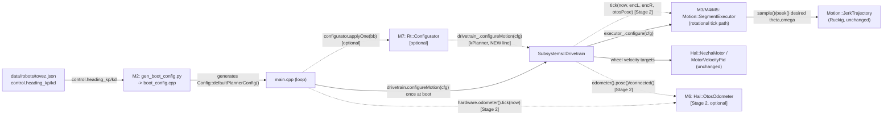

<!-- CLASI: Before changing code or making plans, review the SE process in CLAUDE.md -->

# Architecture Update -- Sprint 098: Heading-loop cascade control: turns terminate on target

## Step 1: Understand the Problem

A 58-turn playfield dataset (`heading-loop-cascade-control-turns-terminate-
on-target.md`) proved that in-place turns overshoot in a way that is
**neither momentum coast (~1° at command-zero) nor geometry** — it is built
WHILE the robot is moving: a ~−22° commanded/measured tracking deficit
during acceleration versus a ~+24..+30° surplus during deceleration, whose
small difference is the landed error, and whose sign/magnitude scatters
run-to-run (σ≈2°) because it is the residue of two ~25° open-loop
transients, not a converged servo. On some short fast turns the
threshold-triggered divergence replan (`maybeReplanPivot()`) re-anchors to
the lagging measured position and re-commands the very accel deficit that
would otherwise have cancelled the decel surplus, producing a 90° ridge
(+4..+6° worse than the 2-parameter empirical fit's best case). After the
encoder stop fires, the executor rides the Ruckig plan's remaining tail
open-loop, adding whatever the plant happened to be ahead-or-behind by at
fire time.

**Root cause, one sentence: nothing in the firmware regulates heading.**
Sprint 097's velocity-loop redesign (`real-robot-motion-calibration-
undershoot.md`) made the inner wheel-velocity PID loops track their
setpoint well (holds within ±3%, step overshoot ~1%). But
`Motion::SegmentExecutor` (source/motion/segment_executor.{h,cpp}, lifted
near-verbatim from `Subsystems::Planner` in ticket 094-001) plays the
rotational channel's Ruckig-solved velocity sample straight through to the
wheel-velocity setpoint every tick — an OPEN control loop on heading, with
two patches standing in for the missing feedback: the divergence replan
(a bang-bang re-solve, not a continuous corrector) and the ride-the-tail
terminal (whatever the plant is ahead/behind by at stop-fire time is simply
accepted). A fixed empirical aim-short table cannot fix this — the best fit
still leaves the 90° ridge and cannot touch the run-to-run variance,
because the variance is a property of an unconverged open-loop transient,
not a bias a table can subtract.

The fix, specified by the stakeholder: add the missing OUTER heading
feedback loop, cascaded onto the UNCHANGED inner wheel-velocity PID loops —
classic cascade control. Stage it: Stage 1 closes the loop on
encoder-derived heading (`(encR−encL)/trackwidth`), already available every
tick with zero new sensor plumbing, and is sufficient by itself (the
dataset's own ground truth was encoders) to satisfy the acceptance
criterion. Stage 2 (OTOS heading, slip-immunity) and a minimal
`Rt::Configurator` revival (live gain tuning) are valuable but explicitly
deferrable if they threaten to endanger Stage 1's shippability in one
overnight run.

Current architecture reviewed for this update: `docs/architecture/
architecture-update-097.md` (latest — sprint 097, protocol v3 host
completion) plus direct reads of `source/motion/segment_executor.{h,cpp}`,
`source/subsystems/drivetrain.{h,cpp}`, `source/subsystems/nezha_hardware.
{h,cpp}`, `source/runtime/{blackboard,configurator}.{h,cpp}`,
`source/messages/planner.h`/`protos/planner.proto`, `source/main.cpp`,
`scripts/gen_boot_config.py`, `data/robots/tovez.json`, and the sim test
harness `tests/sim/unit/segment_executor_harness.cpp`. Sprint 099
(`restore-pose-estimation-otos-encoders-delayed-camera-fixes.md`, currently
`roadmap`) owns FULL pose fusion restoration — this sprint's Stage 2 is
scoped narrower (heading only, with fallback) and does not anticipate 099's
design.

## Step 2: Identify Responsibilities

1. **Outer heading regulation** — comparing the Ruckig plan's own desired
   (θ, ω) against measured heading/rate and correcting the commanded
   angular rate before it reaches the (unchanged) inner wheel-velocity
   loop. NEW this sprint.
2. **Completion semantics for a rotational phase** — deciding when
   PRE_PIVOT/TERMINAL_PIVOT is DONE. CHANGES this sprint: from
   "arc-threshold stop condition fired, or the profile's own duration
   elapsed" to "target heading error and measured rate are both within
   tolerance, held for a dwell."
3. **Divergence-replan scope** — what `maybeReplanPivot()` is FOR once a
   continuous corrector exists. NARROWS this sprint: from "chase nominal
   tracking deficit AND catch stalls" to "catch stalls only."
4. **Per-robot control tunables and their delivery path** — how a gain
   value gets from `data/robots/*.json` into the firmware that runs on the
   robot. EXTENDS this sprint: `msg::PlannerConfig` gains two new fields;
   the boot-config generator gains a `PlannerConfig` code path it did not
   have before (today `main.cpp` hand-writes these values; sprint 098 moves
   them to the SAME generated-from-JSON path the velocity gains already
   use).
5. **Heading measurement source** — encoder-only today (Stage 1, unchanged
   plumbing) versus OTOS-with-encoder-fallback (Stage 2, NEW this sprint,
   optional).
6. **Live config application** — whether a `SET` config delta reaches a
   running subsystem. UNCHANGED by default (093/094's "boot config applied
   once at construction" model stays); OPTIONALLY extended this sprint by a
   minimal `Rt::Configurator` revival, additive only.
7. **Hardware acceptance** — unchanged responsibility (the standing bench
   gate, `.claude/rules/hardware-bench-testing.md`), exercised against this
   sprint's own new behavior.

Responsibilities 1-3 change together (all three live inside `Motion::
SegmentExecutor`'s rotational tick path and are meaningless independently —
grouped into one module below). Responsibility 4 is independent (a
data-plumbing change with zero control-law coupling) and lands FIRST so 1-3
have somewhere to read gains from. Responsibilities 5 and 6 are independent
of each other and of 1-4's correctness — both are explicitly optional
add-ons layered on top of an already-shippable Stage 1.

## Step 3: Define Subsystems and Modules

### M1 -- Heading-gain config schema (`msg::PlannerConfig` extension)

**Purpose**: Carries the outer heading loop's per-robot PD gains from the
robot JSON to the executor that consumes them.

**Boundary**: Inside — two new float fields (`heading_kp`, `heading_kd`) on
the existing `msg::PlannerConfig` message (`protos/planner.proto` fields
13/14, the next free numbers after the existing 1-9/12 and the `reserved
10, 11`) and the regenerated `source/messages/planner.h`. Outside — the
gains' NUMERIC VALUES (M2's job), how they reach a live `Motion::
SegmentExecutor` (already true today for every other `PlannerConfig`
field via `Drivetrain::configureMotion()` — no new wiring needed for the
boot path), and live re-application after boot (M6's job, optional).

**Use cases served**: SUC-001, SUC-003.

### M2 -- Boot-config generation for `PlannerConfig` (`scripts/
gen_boot_config.py`)

**Purpose**: Bakes each robot's motion-limit and heading-gain defaults from
its JSON into generated C++, the same way the velocity-PID gains already
are.

**Boundary**: Inside — a new `defaultPlannerConfig()` code path in the
generator (mirroring `vel_gains_for_config()`'s existing shape): reads
`control.heading_kp`/`control.heading_kd` from the robot JSON (falling back
to firmware defaults, unmigrated-robot-safe, matching every other mapping
in this file), and ALSO now bakes the seven motion-limit fields
(`a_max`/`a_decel`/`v_body_max`/`yaw_rate_max`/`yaw_acc_max`/`j_max`/
`yaw_jerk_max`) that `main.cpp`'s hand-written `defaultMotionConfig()`
currently hardcodes — moving them to this generator retires that
duplicate, ungoverned copy. `arrive_tol`/`turn_in_place_gate`/`min_speed`
stay at their current zero-default (unchanged behavior — `main.cpp` never
set them either). Outside — the numeric TUNING of `heading_kp`/
`heading_kd` (that is bench work product landing in the robot JSON, not
this generator's own logic) and the control law that consumes the gains
(M3's job).

**Use cases served**: SUC-001, SUC-003.

### M3 -- Outer heading PD cascade (`Motion::SegmentExecutor`, rotational
tick path)

**Purpose**: Regulates PRE_PIVOT/TERMINAL_PIVOT's commanded angular rate
against MEASURED heading, instead of playing the Ruckig plan's own velocity
sample straight through.

**Boundary**: Inside — each tick, for PRE_PIVOT/TERMINAL_PIVOT only:
sampling the rotational channel's desired (θ, ω); deriving measured heading
(relative to the phase's own baseline, mirroring how `baseline_.encDiff0`
already anchors the existing divergence-replan math) and measured rate;
computing `ω_cmd = ω_desired + Kp·(θ_desired−θ_measured) +
Kd·(ω_desired−ω_measured)`; emitting `ω_cmd` as the phase's commanded
twist. Outside — the wheel-velocity PID loop that consumes the resulting
wheel targets (`Hal::NezhaMotor`/`Hal::MotorVelocityPid`, UNCHANGED — this
is the cascade's inner loop and this sprint does not touch it), the Ruckig
solve itself (`Motion::JerkTrajectory`, UNCHANGED — M3 reads its `sample()`/
`peek()` output, never its solving), and the TRANSLATE/linear channel
(untouched — this sprint's scope is the rotational channel only, per the
issue's own "turns terminate on target" framing) and the BLEND
(streaming/teleop) phase (untouched — deliberately out of scope, see Step 7
Open Question 1).

**Use cases served**: SUC-001.

### M4 -- Tolerance/dwell completion for PRE_PIVOT/TERMINAL_PIVOT

**Purpose**: Declares a rotational phase DONE when the robot is actually
near the target and nearly still, not when a plan-derived threshold fires.

**Boundary**: Inside — for PRE_PIVOT/TERMINAL_PIVOT only, a new completion
gate (`|rotationalTarget_ − θ_measured| < tol` AND `|measured rate| <
rate_tol`, held for a dwell) that SUPERSEDES `STOP_ROTATION`'s role for
these two phases (the arc-threshold stop condition is no longer appended to
their `stops_[]`); the `STOP_TIME` safety net stays, unchanged, as an
independent backstop against pathological non-convergence. Tolerance,
rate-tolerance, and dwell are NEW file-local `constexpr` constants in
`segment_executor.cpp` — see Decision 3 for why these are constants, not
`PlannerConfig` fields, matching the existing `kDivergenceThreshold`-family
precedent. Outside — BLEND's own completion (untouched, still
plan-exhaustion-based) and TRANSLATE's own `STOP_DISTANCE` completion
(untouched).

**Use cases served**: SUC-001.

### M5 -- Divergence-replan retirement to stall-protection (`maybeReplanPivot()`)

**Purpose**: Keeps only the gross-divergence (stall) branch of the existing
mid-plan replan for PRE_PIVOT/TERMINAL_PIVOT, now that M3 is the continuous
corrector for nominal tracking lag.

**Boundary**: Inside — the sub-gross (`kRotDivergenceThreshold`, EXTEND-
only) branch becomes a no-op for these two phases (chasing a nominal
tracking deficit is now M3's job — leaving the old EXTEND branch live would
have it re-solve the Ruckig plan out from under the PD loop's own
correction, a double-correction hazard). The gross-divergence
(`kRotGrossDivergenceThreshold`, reanchor) branch is UNCHANGED — a
genuinely stalled/bogged wheel is not something `ω_cmd`'s gain alone can
fix if the wheel-level PID/motor cannot achieve it, so re-anchoring the
plan to reality stays as a safety measure. Outside —
`maybeReplanTranslate()` (the linear-channel replan, completely untouched)
and BLEND's replan suppression (already disabled, unchanged).

**Use cases served**: SUC-002.

### M6 -- OTOS heading source with encoder fallback [Stage 2, optional]

**Purpose**: Supplies M3/M4 a slip-immune measured heading when OTOS is
connected and fresh, falling back to M3's existing encoder-derived heading
otherwise.

**Boundary**: Inside — `main.cpp` ticking the OTOS leaf once per pass
(`hardware.odometer()->tick(now)`, a new call — OTOS is I2C address `0x17`,
a separate device from the Nezha brick at `0x10`, outside the flip-flop
sequencer `motor-actuation-latency-flipflop-coupling.md` documents) and
committing `bb.otos`/`bb.otosConnected` (already-declared, currently-
unwritten blackboard fields) for telemetry; `Subsystems::Drivetrain`
reading `hardware_.odometer()->pose()`/`connected()` directly (it already
holds `Hardware&`) each tick and threading a real `msg::PoseEstimate` into
`Motion::SegmentExecutor::tick()`'s existing (currently always-empty)
pose parameter — the exact seam the issue calls out ("the stop conditions
today evaluate with an empty `PoseEstimate` — there is already a plumbing
seam to upgrade the heading authority"); M3's measured-heading step
preferring OTOS when valid, falling back to encoder otherwise (mirrors a
new `otosHeading0` baseline field alongside the existing `encDiff0`, so
either source is measured relative to the SAME phase-start convention).
Outside — full pose fusion / EKF (sprint 099's scope, not this sprint's),
OTOS position (the off-center lever-arm problem — heading is
mount-offset-independent and is deliberately the only OTOS quantity this
sprint trusts).

**Use cases served**: SUC-004.

### M7 -- Live Configurator wiring for heading/velocity gains [optional]

**Purpose**: Makes a live `SET` config delta actually reach the running
`Drivetrain`/`Hardware`, cutting gain-tuning iteration from a reflash to
seconds.

**Boundary**: Inside — constructing and ticking one `Rt::Configurator` in
`main.cpp`'s loop (seeded from the SAME boot configs already applied
directly at construction — boot behavior is unchanged); adding ONE new
line to `Configurator::applyOne()`'s existing `kPlanner` case —
`drivetrain_.configureMotion(plannerConfig_)` — since today that case only
folds and publishes to `bb.plannerConfig` (a residue of ticket 094-002
relocating `Subsystems::Planner` out of `source/`; `Subsystems::Drivetrain`
is the correct live target now, and the Configurator already holds a
`Drivetrain&`). Outside — any change to `kMotor`/`kDrivetrain`/`kOdometer`'s
existing, already-correct fold paths, and any return to 093/094-era full
runtime config authority (this is additive: boot config still applies once,
directly, at construction; the Configurator only drains LIVE deltas
arriving afterward).

**Use cases served**: SUC-003.

## Step 4: Diagrams

### Component/module diagram

Solid edges: Stage 1 (mandatory). Dashed edges: Stage 2 / M7 (optional,
additive — removing them leaves every solid edge, and Stage 1's behavior,
intact).

### Entity-relationship diagram

Not included — this sprint extends an existing message schema
(`msg::PlannerConfig` gains two scalar fields) and a robot JSON's flat
`control` block (two new keys); neither is a relational data model with
new entities or cardinality. See M1/M2 above for the full field-level
description.

### Dependency graph

Not included as a separate diagram — this sprint introduces **no new
inter-module edges**. Every solid edge in the component diagram above
already existed (`Drivetrain` already held `Hardware&` and `Executor&`
references; `Configurator` already held `Drivetrain&`); this sprint only
adds NEW BEHAVIOR inside those existing edges (a real `PoseEstimate`
argument where an empty one was always passed; one new line in an existing
fold-only case). The dependency direction (`main.cpp` → `Drivetrain` →
{`SegmentExecutor`, `Hardware`} → `Hal` leaves) is unchanged and stays
acyclic.

## Step 5: Complete the Document

### What Changed

- **`protos/planner.proto` / `source/messages/planner.h`**: `PlannerConfig`
  gains `heading_kp` (field 13) and `heading_kd` (field 14) — the first
  free field numbers after the existing 1-9/12 and `reserved 10, 11`.
- **`scripts/gen_boot_config.py`**: new `defaultPlannerConfig()` generator
  output, folding in the seven motion-limit fields `main.cpp` currently
  hardcodes plus the two new heading gains, sourced from the robot JSON's
  `control.heading_kp`/`control.heading_kd` (bench-default fallback,
  matching every other mapping in this file).
- **`data/robots/tovez.json`**: new `control.heading_kp`/`control.
  heading_kd` keys with an explanatory note (starting values, not yet
  bench-tuned — see Decision 2).
- **`source/main.cpp`**: calls the new `Config::defaultPlannerConfig()`
  instead of the local hand-written `defaultMotionConfig()` (deleted);
  [Stage 2] adds one `hardware.odometer()->tick(now)` call and commits
  `bb.otos`/`bb.otosConnected`; [M7] optionally constructs and ticks one
  `Rt::Configurator`.
- **`source/motion/segment_executor.{h,cpp}`**: the rotational tick
  path (PRE_PIVOT/TERMINAL_PIVOT only) gains the PD cascade (M3), the
  tolerance/dwell completion gate that replaces `STOP_ROTATION` for these
  two phases (M4), and `maybeReplanPivot()`'s sub-gross branch is retired
  to a no-op for these phases (M5). [Stage 2] `tick()`'s signature gains a
  real (possibly-invalid) `msg::PoseEstimate` parameter, filling the
  existing always-empty seam; a new baseline field anchors OTOS heading the
  same way `encDiff0` already anchors encoder heading.
- **`source/subsystems/drivetrain.{h,cpp}`**: [Stage 2 only] `tick()` reads
  `hardware_.odometer()->pose()`/`connected()` and passes it through to
  `executor_.tick()`.
- **`source/runtime/configurator.cpp`**: [M7 only] `applyOne()`'s
  `kPlanner` case gains one new line, `drivetrain_.configureMotion(
  plannerConfig_)`.

### Why

The dataset (Step 1) proved the overshoot/scatter is a converged-servo
problem, not a coast/geometry/table problem — the only structural fix is a
feedback loop on the quantity that is actually wrong (heading), not another
open-loop patch. Cascading the new outer loop onto the ALREADY-fixed inner
wheel-velocity loop (sprint 097) is the textbook shape for this, and
matches the stakeholder-provided architecture verbatim. Staging Stage 1
(encoder) ahead of Stage 2 (OTOS) follows directly from the dataset itself:
encoders were the ground truth the dataset was scored against, so an
encoder-closed loop is PROVEN sufficient before any new sensor plumbing is
risked in the same overnight run.

### Impact on Existing Components

- **`Motion::JerkTrajectory` (Ruckig)**: none — M3 only READS its
  `sample()`/`peek()` output; the solve itself, its jerk/accel/velocity
  limits, and its `retarget()`/`reanchor()` contract are untouched.
- **Wheel-velocity PID (`Hal::NezhaMotor`/`MotorVelocityPid`)**: none by
  contract — the cascade's entire point is that this inner loop is
  UNCHANGED; it receives a different (PD-corrected) setpoint, exactly the
  way it already receives a different setpoint for a WHEELS/TWIST
  escape-hatch command versus a segment-driven one.
  `Hal::Motor`'s reversal-dwell/deadband armor (ticket 078) is likewise
  untouched — but a PD servo nulling small residual error implies tiny
  terminal corrections that MUST be verified against that armor on the
  stand, not assumed safe (SUC-001's acceptance criteria; ticket
  003/006's hardware gate).
- **TRANSLATE / linear channel**: none — the PD cascade and the new
  completion gate are scoped to the rotational channel only.
- **BLEND (streaming/teleop) phase**: none — deliberately out of scope
  (Step 7, Open Question 1).
- **`Motion::MotionBaseline`**: extended (Stage 2 only) with one new field
  (an OTOS-heading baseline), mirroring the existing `encDiff0`/`enc0`
  fields' own "captured once per phase, relative measurement thereafter"
  convention — no change to how the linear channel's baseline fields are
  used.
- **`msg::PlannerConfig` consumers**: every existing consumer (`Motion::
  SegmentExecutor::configure()`, `Configurator::applyOne()`'s `kPlanner`
  fold, `bb.plannerConfig`) already round-trips the WHOLE struct — two new
  fields need no consumer-side change beyond M3 actually reading them.
- **`gen_messages.py`-generated headers**: regenerated, not hand-edited
  (project convention, `.claude/rules/coding-standards.md`) — the two new
  setter methods (`setHeadingKp`/`setHeadingKd`) are generator output.
- **Sim plant fidelity**: the sim plant has ~no tracking asymmetry
  already (turns land within ±0.3° pre-sprint) — the PD cascade must be a
  NO-OP-TO-IMPROVEMENT there; a sim regression would mean the gains (or the
  completion gate) are mistuned for a plant that has almost nothing to
  correct, not that the mechanism is wrong.

### Migration Concerns

- **None for the message schema**: `PlannerConfig` fields 13/14 are new,
  additive, and default to `0.0f` (an unmigrated robot JSON simply has no
  heading loop correction — `Kp=Kd=0` degenerates the cascade to exactly
  today's open-loop behavior, a safe fallback, not a crash or an
  undefined state).
- **Deployment sequencing**: Stage 1 requires a single reflash (M1-M5 are
  all firmware-side). Stage 2 additionally requires the robot to be moved
  from the USB bench (reflash) to the playfield (radio relay) for its own
  acceptance pass — this is a two-location dependency the closure ticket
  must call out explicitly, not a migration concern in the data sense.
- **No backward-incompatible wire change**: `heading_kp`/`heading_kd` are
  NOT wire/serialized key strings in the sense
  `.claude/rules/coding-standards.md` excludes from the no-units-in-
  identifiers rule (they ARE new wire-visible config field names, but this
  is a NEW field, not a rename of an existing wire key — no existing
  client breaks).

## Step 6: Document Design Rationale

### Decision 1 -- The PD cascade lands as a modification to the EXISTING
`Motion::SegmentExecutor`, not a new class

**Context**: The cascade could instead be a new `Motion::HeadingController`
class wrapping/decorating the executor, keeping the executor itself
untouched.

**Alternatives considered**: (a) a separate `HeadingController` class the
executor delegates to for its rotational output; (b) the cascade as
proposed, inline in `SegmentExecutor::tick()`'s existing rotational branch.

**Why this choice**: The executor already OWNS every input the PD law
needs (the rotational `JerkTrajectory`'s own `sample()`, the phase baseline,
`config_`'s `PlannerConfig`) and already computes the measured-rate value
the PD's D-term needs, in `maybeReplanPivot()`'s existing reanchor path
(`measuredOmega = (encRight.velocity.val − encLeft.velocity.val) /
trackwidth_`, with the SAME plan-sampled fallback the PD law should reuse).
A separate class would need the executor to EXPORT baseline/plan-sample
internals it currently keeps private, widening its interface for a
consumer that has exactly one call site. The cohesion test still passes
inline: `SegmentExecutor`'s one-sentence purpose — "executes one segment's
phases, converging each to its target" — already covers "regulates the
rotational phases' convergence," it does not smuggle in a second
responsibility.

**Consequences**: `segment_executor.cpp` grows by roughly the size of the
PD law plus the tolerance/dwell gate (a few dozen lines in an already
900-line file) rather than spawning a new file/class pair. If a FUTURE
sprint extends the cascade to the linear channel or to BLEND, extracting a
shared helper at that point (once there are two call sites, not one) is the
right time to reconsider this decision — not now (see Step 7, Open
Question 1).

### Decision 2 -- Heading gains ship with conservative starting values, not
a bench-tuned final answer

**Context**: Unlike the velocity-loop redesign (097), which measured the
plant BEFORE picking gains, this sprint's `heading_kp`/`heading_kd` have no
equivalent open-loop characterization step in the sprint's own scope —
the loop-separation guidance (issue: inner loops corner ~1-4 Hz, so an
outer Kp "on the order of a few /s" sits a decade below) is a starting
point, not a measurement.

**Alternatives considered**: (a) block ticket 002 on a bench
characterization session before picking any numbers; (b) ship conservative
starting values now, let the hardware acceptance ticket (003) iterate them
against `turn_sweep.py` on the real plant, since that IS the acceptance
instrument this sprint already needs to run.

**Why this choice**: (b) — the sprint's own acceptance procedure (turn_sweep
on the playfield) already gives the exact feedback signal gain-tuning
needs; adding a SEPARATE characterization ticket ahead of it would
duplicate bench time. Sim tests (ticket 002) only need the gains to be
NONZERO and STABLE (no oscillation, no sign error) — sim's own near-zero
tracking asymmetry means sim cannot discriminate a good Kp from a merely
adequate one anyway (see the sim-plant note in Impact on Existing
Components).

**Consequences**: `data/robots/tovez.json`'s `heading_kp`/`heading_kd`
values are explicitly labeled "starting values, not yet bench-tuned" and
MAY need iteration during ticket 003's hardware pass, entirely within that
ticket's own acceptance criteria (which already requires the ≈±1° result,
not a specific gain value) — this is not scope creep, it is the ticket
doing what it says.

### Decision 3 -- Tolerance/rate-tolerance/dwell are file-local constants,
not `PlannerConfig` fields

**Context**: `heading_kp`/`heading_kd` are per-robot tunables (plant-scale-
dependent — a heavier/lighter robot's inertia changes what gain is stable).
The completion tolerance/dwell are a CONTROL-DESIGN choice (how precise is
"done," how long must it hold), not a per-robot physical quantity.

**Alternatives considered**: (a) promote tolerance/rate-tolerance/dwell to
`PlannerConfig` fields alongside the gains, wire-configurable per robot;
(b) file-local `constexpr` constants in `segment_executor.cpp`, matching
the EXISTING `kDivergenceThreshold`/`kRotDivergenceThreshold`/
`kGrossDivergenceThreshold`/`kMinReplanInterval`/`kReplanWindowFraction`
precedent — every one of which was empirically measured/recalibrated
per-session (per that file's own extensive 2026-07-11 comments) yet stays
a compile-time constant, not a wire field.

**Why this choice**: (b) — matches house precedent exactly, and the issue
itself only calls out Kp/Kd (and "any residual empirical TRIM," a bias
correction, not tolerance/dwell) as the per-robot tunables requiring the
JSON/`gen_boot_config.py` plumbing. Promoting tolerance/dwell to wire
fields would be speculative generality: nothing in this sprint's scope
needs them to differ per robot, and a wrong value there is a firmware bug
to fix in code, not a calibration to dial in per unit.

**Consequences**: If a future robot genuinely needs a different tolerance
(e.g. a much larger/smaller drivetrain where 0.5°/1°/150ms stops making
sense), promoting these three constants to `PlannerConfig` fields is a
small, well-understood follow-up — not blocked by anything in this
sprint's design.

### Decision 4 -- Stage 2's OTOS reading is threaded through the executor's
EXISTING `PoseEstimate` parameter, not a new heading-only type

**Context**: The executor's stop-condition evaluation already accepts a
`msg::PoseEstimate` argument, hardcoded to an empty `msg::PoseEstimate{}`
at every call site today (the issue's own "plumbing seam" observation).

**Alternatives considered**: (a) a new, minimal `HeadingSource{float
heading; bool valid;}` type, narrower than the full `PoseEstimate`; (b)
fill the existing (always-empty) `PoseEstimate` seam with a real value.

**Why this choice**: (b) — the seam already exists, is already threaded
through every call site that would need it (`remainingToStop()`/
`evaluateStopCondition()`), and `msg::PoseEstimate` already carries exactly
`Pose2D{x,y,h}` + `BodyTwist3` + a freshness `ValueSet stamp` — heading
(`pose.h`) and its freshness (`stamp.valid`) are already fields on it. A
narrower bespoke type would need its own translation step FROM
`PoseEstimate` (since that is what `Hal::Odometer::pose()` returns) for no
narrowing benefit — the executor already ignores every `PoseEstimate` field
it does not need (x/y/twist), exactly as it does today with the empty one.

**Consequences**: `SegmentExecutor` remains "pose-shaped-parameter-capable"
even in its Stage-1-only configuration (Stage 1 keeps passing an empty
`PoseEstimate{}`, exactly as today — Stage 1 requires NO signature change
if `tick()`'s pose parameter already existed; since it does not yet, Stage
1's ticket adds it once, Stage 2 just starts filling it with real data).
This softens Stage 2's risk: reverting Stage 2 to encoder-only is a
one-line change at the call site (pass `msg::PoseEstimate{}` again), not a
signature rollback.

## Step 7: Open Questions

1. **Should the cascade eventually cover BLEND (streaming/teleop turns)?**
   Out of scope this sprint (the issue's acceptance criterion is
   specifically discrete in-place turns, which never enter BLEND — that
   phase is MOVE-streaming/MOVER-teleop only). A future sprint could extend
   it once there is a concrete teleop-precision complaint to justify the
   risk to the deadman-velocity path — not speculative generality to add
   now. Flagged for the team-lead/stakeholder, not blocking.
2. **Does the dwell requirement (~100-200ms) interact with the STOP_TIME
   safety net's own timeout budget for very slow (low-ceiling) turns?**
   The `STOP_TIME` nominal-duration formula (`beginPrePivot()`/
   `beginTerminalPivot()`) already sizes its own budget from the phase's
   own ceiling, with a 2x-plus-2s margin — the added dwell is small (≤200ms)
   relative to that margin for any turn slow enough to need it, but this
   should be an explicit sim-test assertion (ticket 002), not an assumption.
3. **Stage 2's per-pass OTOS I2C transaction cost, precisely.** The issue
   flags this as a caution, not a known number — ticket 004 (if executed)
   must measure the actual loop-period impact on real hardware before
   declaring Stage 2 safe, not just reason about it from the `0x17`-vs-`0x10`
   device separation. If the measured cost is unacceptable, Stage 2 stays
   deferred past this sprint — that is an acceptable outcome per the
   sprint's own scope guidance.
4. **Should `data/robots/togov.json` (the mecanum robot) also get
   `heading_kp`/`heading_kd`?** Out of scope — this sprint's dataset,
   acceptance instrument, and hardware access are all `tovez` (differential)
   only. `togov` inherits the same firmware-default fallback (`Kp=Kd=0`,
   today's open-loop behavior) until a future sprint characterizes it
   separately. Not blocking.

## Risks

- **Terminal-reversal safety** (highest priority — see
  `.claude/rules/hardware-bench-testing.md` and the project's own
  encoder-wedge history, `[[encoder-wedge-boundary-latch]]`,
  `[[wedge-latch-terminology-and-repro]]`): a PD servo nulling residual
  error implies small terminal corrections that could, in principle, ask
  for a brief reversal. Mitigation: the `Hal::Motor` reversal-dwell/
  deadband armor is UNCHANGED and already exists for exactly this; ticket
  002's sim acceptance criteria explicitly re-run the existing
  no-reverse-creep regression scenario, and ticket 003's hardware
  acceptance explicitly re-verifies zero commanded reversal beyond the
  armor's own window on the stand BEFORE the playfield pass.
- **Sim-plant insensitivity masking a bad gain choice**: sim's own
  near-zero tracking asymmetry (Step 5's Impact note) means a sim-green
  result does not by itself prove `heading_kp`/`heading_kd` are good
  values — only that they are not badly WRONG (unstable/oscillating).
  Mitigation: Decision 2 explicitly defers final gain values to the
  hardware acceptance ticket, which has the real discriminating signal.
- **`maybeReplanPivot()` retirement removing a safety margin the dataset
  did not stress-test**: retiring the sub-gross EXTEND branch removes a
  path that, historically, also caught some non-stall tracking-lag cases
  the PD loop is now solely responsible for. Mitigation: SUC-002's sim
  scenarios explicitly prove the gross-divergence (stall) branch still
  fires within the same ~2-pass budget; ticket 003's hardware pass is the
  real-plant confirmation this margin loss is safe.
- **Deployment sequencing (two-location dependency)**: Stage 1's hardware
  acceptance needs the robot on USB (reflash) THEN on the playfield (radio
  relay) — a session that loses the robot mid-way (radio drops, USB
  disconnect) needs to restart from a known-good state, not assume partial
  progress. Mitigation: ticket 003/006 call this out explicitly and require
  the stand check (USB-local) to pass BEFORE the playfield leg begins.
- **Optional tickets (004/005) creating scope pressure on an "overnight
  run"**: explicitly mitigated by ticketing them last, clearly marked
  optional/deferrable, each individually depending only on ticket 003
  (Stage 1's own closure) — skipping either leaves the mandatory path
  (001→002→003→006) fully coherent and shippable on its own.

## Quality Checks

- Every module (M1-M7) traces to at least one SUC (M1/M2 → SUC-001/003; M3/
  M4 → SUC-001; M5 → SUC-002; M6 → SUC-004; M7 → SUC-003). SUC-005 (hardware
  acceptance) is served by the closure tickets directly, not by a
  design/code module — it is a verification procedure, not a subsystem.
- No cycles in the dependency graph (Step 4 — no new edges at all this
  sprint; the pre-existing graph was already acyclic).
- Each module passes the cohesion test (Step 3's one-sentence purposes, no
  "and").
- Fan-out: `Drivetrain` (already) depends on `Hardware`, `SegmentExecutor`,
  and (M7, optional) is depended-ON by `Configurator` — no module's fan-out
  grows past the existing shape; nothing approaches the 4-5 guidance limit.

## Self-Review (architecture-review phase)

**Consistency**: Sprint Changes (Step 5's "What Changed") matches Step 3's
module list one-for-one (M1→proto/generated header, M2→gen_boot_config.py,
M3-M5→segment_executor.{h,cpp}, M6→main.cpp+drivetrain.cpp [optional],
M7→configurator.cpp [optional]). Design rationale (Step 6) is updated for
every genuinely NEW decision this sprint introduces (cascade placement,
starting-gain policy, constant-vs-config-field split, pose-seam reuse); no
PRE-EXISTING decision (e.g. the compile-split dead-time, the presolved
graceful decel-to-zero, the divergence-replan's own thresholds) is
re-litigated or silently contradicted — M5 narrows one branch's SCOPE, it
does not change the gross-divergence threshold values or rationale
themselves.

**Codebase Alignment**: Every file/function named in this document was read
directly this session (`segment_executor.{h,cpp}` in full, `drivetrain.
{h,cpp}` in full, `nezha_hardware.{h,cpp}` in full, `blackboard.h`,
`configurator.{h,cpp}` in full, `planner.h`/`planner.proto`, `main.cpp`,
`gen_boot_config.py`'s config-resolution and generation sections,
`tovez.json`, `segment_executor_harness.cpp`, `odometer.h`,
`motor-actuation-latency-flipflop-coupling.md`) — no function signature or
field name above is guessed. The one piece of ACTUAL code drift this
review surfaced and accounted for: `main.cpp`'s `defaultMotionConfig()`
hardcodes `PlannerConfig` fields OUTSIDE the `gen_boot_config.py` path
entirely (unlike every other boot default) — this is the exact gap M2
closes, not a surprise discovered mid-ticket. `Configurator::applyOne()`'s
`kPlanner` case being fold-only (no live subsystem call, a residue of
ticket 094-002) was likewise confirmed by direct read, not assumed — M7's
one-line fix is precise, not speculative.

**Design Quality**: Cohesion — each module's one-sentence purpose (Step 3)
holds without "and." Coupling — no new inter-module edges (Step 4); the
one interface WIDENING (`SegmentExecutor::tick()`'s new pose parameter) is
additive and defaults to today's empty-`PoseEstimate` behavior for Stage-1-
only configurations. Boundaries — M3/M4/M5 are a single, narrow change
inside one class's one code path (the rotational phases' tick branch);
M1/M2 are a single, narrow schema+generator extension; M6/M7 are each a
one-or-two-line addition to an EXISTING call site, not a new subsystem.
Dependency direction — unchanged (`main.cpp` → `Drivetrain` →
{`SegmentExecutor`, `Hardware`} → `Hal` leaves; `Configurator` already
depended on `Drivetrain`/`Hardware`/`PoseEstimator`).

**Anti-Pattern Detection**: No god component (the change is distributed
across 6-7 small, single-purpose edits, not concentrated in one class
growing new unrelated responsibilities). No shotgun surgery (every file
touched is touched for exactly one of M1-M7's reasons, traceable 1:1). No
feature envy (M3/M4/M5 read `SegmentExecutor`'s own state, not another
module's internals; M6 reads `Hardware`'s existing public `odometer()`
accessor, not private state). No new shared mutable state (the blackboard
fields M6 commits, `bb.otos`/`bb.otosConnected`, already exist and are
already documented as loop-committed, subsystem-read-only). No circular
dependencies (Step 4). No leaky abstraction (M4's tolerance/dwell constants
stay inside `segment_executor.cpp`, per Decision 3 — not exposed as a wire
surface that would leak an implementation-detail knob to every caller). No
speculative generality (Decision 3 explicitly rejects promoting
tolerance/dwell to config fields ahead of any need; M6/M7 are scoped to
exactly what the issue asks for, not a general "runtime config authority"
revival — see Decision 4's Stage-1-reversion note and M7's boundary).

**Risks**: See the "Risks" section above (terminal-reversal safety,
sim-plant insensitivity, replan-retirement safety margin, deployment
sequencing, optional-ticket scope pressure) — each has a stated mitigation
tied to a specific ticket's acceptance criteria, not a general assurance.

### Verdict: **APPROVE**

No structural issues (no god component, no circular dependency, no
inconsistency between this document's Sprint Changes and its own body).
The design is a narrow, additive extension of one existing class's one
code path plus a config-plumbing extension that mirrors an established
precedent exactly (`vel_gains_for_config()`) — proceed to ticketing. The
optional Stage 2 (M6)/Configurator (M7) modules carry acknowledged,
ticket-scoped risk (I2C timing cost, unverified until measured) that is
appropriately deferrable, not a reason to withhold approval from the
mandatory Stage 1 path (M1-M5).
