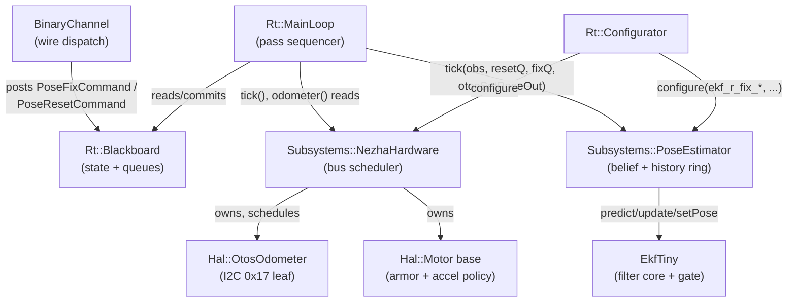
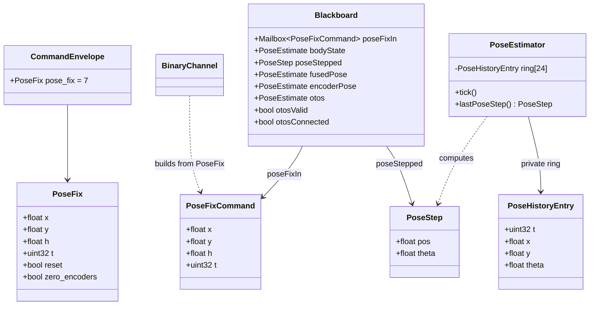
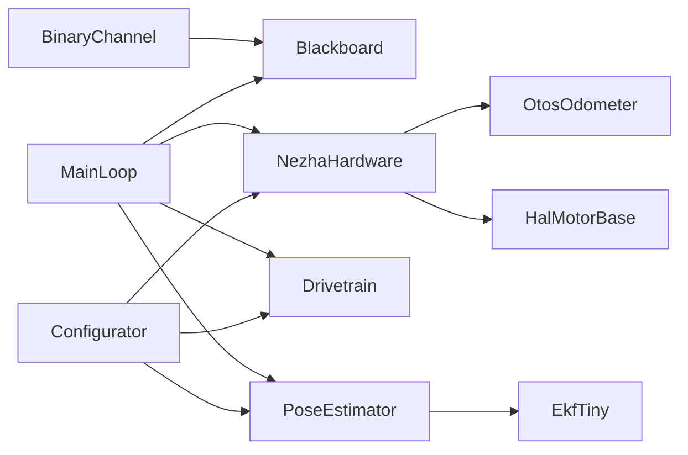

<!-- CLASI: Before changing code or making plans, review the SE process in CLAUDE.md -->

# Architecture Update -- Sprint 099: Restore pose estimation: OTOS, encoders, and delayed camera fixes

## Step 1: Understand the Problem

Sprints 093/094 gutted the live main loop to
`Communicator -> Hardware -> Drivetrain`. `Subsystems::PoseEstimator`
(encoder dead-reckoning + `EkfTiny` OTOS fusion) and `Hal::OtosOdometer`
(the real OTOS I2C leaf) are both fully implemented and unit-tested, but
**never ticked** by the live loop: `main.cpp:124` constructs
`poseEstimator` solely so `Rt::Configurator`'s constructor has something to
re-propagate `DrivetrainConfig` deltas to. `bb.fusedPose`/`bb.encoderPose`/
`bb.otos*` sit at zero forever. `Rt::MainLoop` (used only by the sim
harness) ticks `Hardware`+`Drivetrain` only.

Meanwhile, by the time this sprint executes, protocol v3 (sprints 095-097)
has landed: the command plane is `*B<base64(CommandEnvelope)>` binary, not
text. `CommandEnvelope.cmd.pose` (field 7) is declared with a `SetPose`
payload and replies `ERR_UNIMPLEMENTED` — reserved, unimplemented,
literally waiting for this sprint (`docs/protocol-v3.md` §3, §8). The old
text `SI`/`ZERO`/OTOS verb family and their handler source
(`pose_commands.cpp`/`otos_commands.cpp`) are **deleted outright**, not
merely unregistered — there is nothing to "re-register," only a live
binary arm to implement from scratch.

This sprint has two goals, layered:

1. **Restore what already exists but never runs**: tick the OTOS (safely,
   inside the existing I2C flip-flop's safety envelope — a naive
   unconditional per-pass OTOS tick already caused a bus-hang-class
   incident once, ticket 098-004, reverted), tick `PoseEstimator`
   (encoder-only, then OTOS-fused once a rejection gate exists), and
   publish per-motor acceleration.
2. **Add a genuinely new capability**: a timestamped delayed camera-fix,
   `PoseFix`, expressed as a binary `CommandEnvelope` arm — plus two small
   forward-looking cells (`bb.bodyState`, `bb.poseStepped`) the *next*
   sprint's motion-v2 subsystem will read directly, so this sprint pays
   that design cost once instead of motion-v2 having to reach back into
   `PoseEstimator`'s internals later.

Everything here executes and is bench-verified **on the old motion stack**
— `source/motion/` (`Motion::SegmentExecutor`) is untouched. The
`Subsystems::Drivetrain` control path is not modified by any ticket in
this sprint.

## Step 2: Identify Responsibilities

Distinct responsibilities this sprint introduces or changes, grouped by
what changes for the same reason:

1. **Main-loop composition** — one more subsystem (`PoseEstimator`) joins
   the mandatory per-pass sequence; the commit step grows five cells
   (`encoderPose`, `fusedPose`, `otos`, `otosValid`, `otosConnected`) plus
   two new ones (`bodyState`, `poseStepped`). Changes because the loop's
   *shape* changes, not because any control law changes.
2. **OTOS bus scheduling** — the OTOS chip (I2C 0x17) needs a tick
   cadence that structurally cannot land inside the Nezha motor bus's
   (0x10) request/collect settle window. Changes because this is a
   scheduling-safety concern, orthogonal to what the OTOS reading is used
   for.
3. **Per-motor acceleration** — a numeric derivative of an already-sampled
   quantity (velocity), computed once, generically, in the `Hal::Motor`
   base. Changes because it is base-class policy, not per-leaf hardware
   detail.
4. **Pose wire surface** — a `CommandEnvelope` arm, its dispatch, and the
   Blackboard mailboxes it feeds. Changes because it is a protocol/command-
   routing concern: parsing and validating a wire request, not the pose
   math itself.
5. **Pose estimation core** — `PoseEstimator`'s encoder dead-reckoning
   (unchanged), the new pose-history ring, delayed-fix interpolate/
   compose/apply, and the `PoseStep`/`BodyState` derivations. Changes
   because it is one cohesive belief-maintenance algorithm with one
   reason to change: "how the robot's pose belief evolves."
6. **OTOS fusion gating** — `EkfTiny`'s bounded innovation-consistency
   gate and rejection-streak recovery. Changes for numerical/statistical
   reasons (sensor trust), independent of what feeds the gate or what
   consumes its output.
7. **Config/wire schema growth** — two new `DrivetrainConfig` fields
   (`ekf_r_fix_xy`/`ekf_r_fix_theta`), a new `MotorState.acceleration`
   field, the `PoseFix`/`PoseStep` messages, and the generator/JSON/
   sync-check chain that keeps them consistent. Changes because it is
   schema bookkeeping, not behavior.
8. **Verification** — sim/unit harness extensions and one new end-to-end
   aprilcam bench/playfield script. Changes because it is test
   infrastructure, not production code.

## Step 3: Define Subsystems and Modules

For each responsibility group, the module, its one-sentence purpose, its
boundary, and the use cases it serves (see `usecases.md`).

### `Rt::MainLoop` (existing, extended)

**Purpose**: sequence one control-loop pass across `Hardware`,
`Drivetrain`, and `PoseEstimator`, and commit their fresh state onto the
`Blackboard`.

**Boundary**: owns exactly three subsystem references (`Hardware&`,
`Drivetrain&`, `PoseEstimator&` — the third is new this sprint) and
nothing else — no wire knowledge, no config-application authority, no
control math of its own. Everything it does is call another subsystem's
`tick()`/accessor and copy the result onto `bb`.

**Serves**: SUC-001 (OTOS ticks live), SUC-002 (encoder pose live),
SUC-003 (fused pose live), SUC-006 (`BodyState` published), SUC-007
(`PoseStepped` published).

### `Subsystems::NezhaHardware` (existing, extended)

**Purpose**: distribute motor commands to, and schedule safe I2C bus
access for, every device (motor bricks + OTOS) on the shared bus.

**Boundary**: unchanged — it already owns `Hal::OtosOdometer` (a separate
I2C address, 0x17); this sprint only teaches its existing `tick()`
scheduler a second, narrower rule for when it is safe to also service that
device. No new public dependency.

**Serves**: SUC-001 (OTOS ticks live, no bus hang).

### `Hal::Motor` (existing, extended)

**Purpose**: apply shared, hardware-generic write/armor/telemetry policy
on top of a leaf's raw primitives.

**Boundary**: unchanged (still headers-only, still the one place armor
policy lives per project convention — see `.claude/knowledge` /
`motor-armor-policy-lives-in-base`). Gains one more piece of generic
policy (`trackAcceleration()`), the same shape as the existing wedge/reset
policy already living here.

**Serves**: SUC-004 (per-motor acceleration published).

### `Subsystems::PoseEstimator` (existing, substantially extended)

**Purpose**: maintain the robot's belief about its own pose from wheel
encoders and (when available) an external observation, and apply
corrections to that belief — either immediately (a hard re-anchor) or
against a short history (a timestamped delayed fix).

**Boundary**: unchanged discipline — still holds no `Hal::*` reference,
still takes every input as a `tick()` argument, still exposes only
`encoderPose()`/`fusedPose()` plus a small set of new pure accessors
(`lastPoseStep()`). The pose-history ring is **private** — nothing outside
this class ever sees a `PoseHistoryEntry`.

**Serves**: SUC-002, SUC-003, SUC-005 (delayed camera-fix), SUC-007.

### `EkfTiny` (existing, extended)

**Purpose**: the 3-state Kalman core — predict from odometry, correct from
a trusted observation, with a bounded gate protecting against a
momentarily-disagreeing (not necessarily wrong) sensor.

**Boundary**: unchanged (still un-namespaced pure math, still owns only
filter state). Gains gate/streak bookkeeping as private state; its public
`updatePosition()`/`updateHeading()` signatures are unchanged — the gate
is internal to those two methods, invisible to `PoseEstimator`.

**Serves**: SUC-003 (fused pose does not freeze/drag on a momentary OTOS
disagreement).

### `BinaryChannel` (existing, extended)

**Purpose**: dearmor, decode, and dispatch one `CommandEnvelope` arm to
its Blackboard destination, and armor exactly one reply.

**Boundary**: unchanged. Gains one new arm handler (`handlePose()`,
replacing the `ERR_UNIMPLEMENTED` stub for arm 7); never reaches into
`PoseEstimator` directly — it only posts to `Blackboard` mailboxes, the
same discipline every other arm handler already follows.

**Serves**: SUC-002 (SI/ZERO on the wire), SUC-005 (FIX on the wire).

### `Rt::Blackboard` / `Rt::commands.h` (existing, extended)

**Purpose**: the two-plane transport — committed state cells plus
command-plane queues connecting every subsystem.

**Boundary**: unchanged (pure data, no subsystem pointers, host-safe
PODs only). Gains one mailbox (`poseFixIn`), two state cells
(`bodyState`, `poseStepped`), and one new POD (`PoseFixCommand`).

**Serves**: all of the above (it is the medium, not an actor).

### `Rt::Configurator` (existing, extended)

**Purpose**: the one live config-application authority; folds a
field-masked delta onto its own persistent per-target config and
re-propagates it to the owning subsystem(s).

**Boundary**: unchanged (still the one class allowed to hold concrete
subsystem references outside the loop). `foldDrivetrain()` gains two more
fields, mirroring `ekf_r_otos_xy`/`ekf_r_otos_theta`'s existing lines
exactly.

**Serves**: SUC-005 (the fix's `ekf_r_fix_*` noise is live-tunable, same
as the existing four EKF fields).

### Config sync-check (`scripts/check_config_sync.py`) (existing, extended)

**Purpose**: keep the wire schema (`DrivetrainConfigPatch`) and the
host-side pydantic config model from silently drifting apart.

**Boundary**: unchanged. **Correction versus this sprint's initial
framing** (verified against source, not assumed): `ekf_r_otos_xy`/
`ekf_r_otos_theta` — the two fields `ekf_r_fix_xy`/`ekf_r_fix_theta`
directly mirror — do **not** flow through `scripts/gen_boot_config.py` or
`data/robots/tovez.json` at all today. `gen_boot_config.py`'s
`defaultDrivetrainConfig()` bakes only `trackwidth`/`left_port`/
`right_port`; `tovez.json`'s own `ekf_r_otos_theta` entry is a stray,
unconsumed key (no `ekf_r_otos_xy` sibling, no pydantic field reads it);
`check_config_sync.py:181-187` explicitly allowlists both as
wire-only/host-unmapped (`[]`, with an inline "no host-side pydantic
field yet ... register as tunable in a future sprint" comment) — this is
the established, deliberate pattern for an EKF noise field that is
live-tunable over the wire (`SET`/binary `config`) but has no boot-time
JSON default yet. `ekf_r_fix_xy`/`ekf_r_fix_theta` follow the *exact same*
pattern: a `check_config_sync.py` allowlist addition, no
`gen_boot_config.py`/`tovez.json` change. (This corrects an earlier,
unverified assumption in this sprint's own task brief that these fields
would be "wired via `gen_boot_config.py` + `tovez.json` + `check_config_
sync.py`" — the sync-check step is real, the generator/JSON step is not,
for this specific field pair, matching its own sibling fields' precedent
exactly.)

**Serves**: SUC-005.

### `tests/bench/` or `tests/playfield/` aprilcam end-to-end script (new file)

**Purpose**: demonstrate the full path — PING clock-sync, tag-pose-to-FIX
send, convergence check — against the real robot.

**Boundary**: a Python HITL script, not pytest-collected (per
`tests/CLAUDE.md`'s three-domain split); talks to the robot only through
`robot_radio`'s `NezhaProtocol` and to the camera only through the
`aprilcam` MCP/daemon API. No production code depends on it.

**Serves**: SUC-005 (bench/playfield acceptance).

## Step 4: Diagrams

### Component diagram



Edges are labeled with the call, not just "uses" — `BinaryChannel` never
reaches `PoseEstimator` directly (it only touches `Blackboard`);
`MainLoop` is the only caller of `PoseEstimator::tick()`.

### Data model: new/changed message and Blackboard shapes



`PoseHistoryEntry` is private to `PoseEstimator` — it is drawn here only
to show where the wire-level `PoseFix`/blackboard-level `PoseFixCommand`
ultimately get resolved, not as a shared type.

### Dependency graph (module-level, unchanged direction)



No cycles. `Configurator`'s three concrete-subsystem references are the
one pre-existing, documented exception to "no subsystem pointers outside
the loop" (`configurator.h`'s own class comment) — unchanged by this
sprint, not a new violation.

## Step 5: Complete the Document

### What Changed

**D1 — `Rt::MainLoop` gains `PoseEstimator&` and a five-step pass body.**
`main.cpp` stops hand-rolling its bare loop and calls
`Rt::MainLoop::tick(bb, now)`, the same function the sim harness already
calls — reversing sprint 094's "explicit inline loop, no MainLoop wrapper"
decision (flagged explicitly; approving this plan approves the reversal).
Landed in two steps for reviewability: Ticket 001 is a pure structural
move (bare loop → `MainLoop{hardware, drivetrain}`, zero behavior change,
byte-identical TLM) so a regression in the refactor itself is trivially
isolated from a regression in new behavior; Ticket 004 grows `MainLoop`'s
constructor to the final three-reference shape and adds the new pass
steps.

The pass, after all of this sprint's tickets land:

```
hardware_.tick(now)                          // flip-flop; OTOS slot inside (D2)
drivetrain_.tick(now, segmentIn, replaceIn, driveIn)
leftIdx/rightIdx = bb.drivetrainConfig.left_port/right_port - 1
leftObs, rightObs = hardware_.motorState(leftIdx/rightIdx)   // FRESH, post-tick
fusable = hardware_.odometer()->fusableThisPass()            // ONE call/pass (090-002 contract)
otosSample = hardware_.odometer()->pose()
otosArg = (fusable && otosSample.stamp.valid) ? &otosSample : nullptr
poseEstimator_.tick(now, leftObs, rightObs, otosArg,
                     bb.poseResetIn, bb.poseFixIn, bb.otosSetPoseIn)
if (!bb.otosSetPoseIn.empty())
    hardware_.odometer()->applySetPose(bb.otosSetPoseIn.take())
commit(bb, now):
    bb.motors = hardware_.motorStates()
    bb.drivetrain = drivetrain_.state()
    bb.encoderPose = poseEstimator_.encoderPose()
    bb.fusedPose = poseEstimator_.fusedPose()
    bb.otos = otosSample
    bb.otosValid = fusable
    bb.otosConnected = hardware_.odometer()->connected()
    bb.poseStepped = poseEstimator_.lastPoseStep()
    bb.bodyState.pose = bb.fusedPose.pose
    BodyKinematics::forward(leftObs.velocity, rightObs.velocity,
                             poseEstimator_.trackwidth(),
                             bb.bodyState.twist.v_x, bb.bodyState.twist.omega)
    bb.bodyState.twist.v_y = 0.0f
    bb.bodyState.stamp = bb.fusedPose.stamp
    bb.loopNow = now
```

`hardware_.odometer()->tick(now)` is deliberately **not** called from
`MainLoop` — D2 moves that call inside `NezhaHardware::tick()` itself (see
below). `Odometer::fusableThisPass()` and `applySetPose()` are both
pre-existing methods whose own doc comments already name this exact call
site as their one sanctioned caller (`hal/capability/odometer.h`) — this
sprint is completing wiring the codebase's own prior design left ready,
not inventing a new contract.

**D2 — OTOS tick is a scheduled slot inside `NezhaHardware::tick()`.**
`Hal::OtosOdometer` gains one new public query,
`bool readDue(uint32_t now) const` (`!hasRead_ || (now - lastReadMs_) >=
kReadPeriod`, signed-cast rollover-safe). `NezhaHardware::tick()` gains
one new branch at its very top, before the existing `anyPolled()`/phase
switch:

```cpp
if (phase_ == Phase::REQUEST_DUE && otosOdometer_.readDue(now)) {
    otosOdometer_.tick(now);
    return;   // this call's bus action; the Nezha flip-flop resumes next call
}
```

This structurally rules out 0x17 traffic ever landing inside a 0x10
REQUEST/COLLECT settle window — `phase_ == REQUEST_DUE` means no
outstanding, unsettled 0x46 request exists. One stolen motor-poll call at
most every 20ms is negligible against the flip-flop's own ~40-80ms
per-motor cadence. `Subsystems::SimHardware` already ticks its own
odometer internally (081-003) — sim and hardware converge without a
matching sim-side change.

**D3 — Per-motor acceleration in the `Hal::Motor` base.**
`Hal::Motor` gains a protected `float acceleration_ = 0.0f;` and a
concrete `void trackAcceleration(float velocity, uint32_t dtUs)` (EMA,
alpha = 0.25 — the same value `Drivetrain::updateAccelEma()` already uses)
plus a public `float acceleration() const`. Both leaves
(`Hal::NezhaMotor::tick()`, `Hal::SimMotor::tick()`) call it once, right
after they refresh their own filtered `velocity()` for this tick, using
their own already-computed per-tick `dt`. `Motor::state()` gains
`s.acceleration.has/val` inside the existing `caps.has_encoder` block,
alongside `position`/`velocity`/`wedged`. New `MotorState.acceleration`
field (`motor.proto`, field 12).

**D4 — `EkfTiny` gains a bounded innovation gate + rejection-streak
recovery**, guarding `updatePosition()`/`updateHeading()` only (the OTOS
channel) — never the delayed-fix update (D5's ungated path stays
ungated). Starting constants (bench-characterized in the harness, not
freehand — see Design Rationale below): position gate on the Mahalanobis
statistic `d² = yᵀS⁻¹y` against a 2-DOF chi-square critical value;
heading gate on `|y| > kSigma·sqrt(S)`. A run of consecutive rejections
on either channel inflates that channel's own diagonal `P` entries
(never a hard `setPose()`-style reset) so a genuinely-shifted sensor is
eventually re-trusted rather than locked out forever.

**D5/D6/D7/D8 — the delayed camera-fix, expressed as a binary
`CommandEnvelope` arm.** `protos/envelope.proto`'s arm 7 is **retyped**:
`SetPose pose = 7` becomes `PoseFix pose_fix = 7` (new message,
`drivetrain.proto`, next to `SetPose` — `SetPose` itself is untouched and
keeps its unrelated existing use inside `DrivetrainCommand.control.pose`,
arm 2's `drive` payload):

```protobuf
message PoseFix {
  float  x = 1;              // [mm] world x (meaningless when only zero_encoders is set)
  float  y = 2;              // [mm] world y
  float  h = 3;               // [rad] world heading
  uint32 t = 4;               // [ms] robot-clock timestamp this observation was true (D6)
  bool   reset = 5;           // true = SI-equivalent hard re-anchor now
  bool   zero_encoders = 6;   // true = ZERO-equivalent: resync encoder baseline
}
```

`BinaryChannel::handlePose()` (new, replacing the `ERR_UNIMPLEMENTED`
stub):

```
if reset:          post PoseResetCommand{kSetPose, {x,y,h}} -> bb.poseResetIn
if zero_encoders:   post PoseResetCommand{kResetBaseline}    -> bb.poseResetIn
if neither:         post PoseFixCommand{x,y,h,t}             -> bb.poseFixIn
```

`reset`/`zero_encoders` reuse `PoseEstimator`'s existing, already-tested
`setPose()`/`resetEncoderBaseline()` dispatch through the **unchanged**
`poseResetIn` queue — no new PoseEstimator code path for SI/ZERO. Only the
"neither" branch (a genuine delayed fix) is new capability, and it is the
only branch gated behind ticket sequencing (Ticket 004 replies
`ERR_UNIMPLEMENTED` for it; Ticket 008 makes it live) — the exact same
"declare the arm, land its arms incrementally, `ERR_UNIMPLEMENTED` for
what's not live yet" pattern `config`/`get`/`stream` already used across
sprints 095→097.

`PoseEstimator` gains a private, fixed-size pose-history ring
(`PoseHistoryEntry{t, x, y, theta}`, 16B × 24 entries = 384B, recorded
every 50ms from `(encX_, encY_, encTheta_)` — **never** from `fusedPose`,
since `encoderPose` is the one series the EKF/OTOS/a prior fix never
writes, so its own deltas stay clean and composable), a new
`Rt::Mailbox<Rt::PoseFixCommand>& poseFixIn` parameter, and a new
`Rt::Mailbox<msg::SetPose>& otosSetPoseOut` parameter on `tick()`.
Applying a fix:

1. Reject a `t` older than the ring's oldest entry (`fixDropped_`
   counter, no state change) or newer than `now` (clamp to `now`).
2. Interpolate `enc(T)` — linear on x/y, wrapped-angle on theta — between
   the two ring entries bracketing `T` (or from the newest entry to `now`
   if `T` is more recent than the ring's last snapshot).
3. Compose in the shared world frame `encoderPose` already accumulates
   in: `implied.x = fix.x + (encNow.x - enc(T).x)`, same for `y`;
   `implied.h = wrap(fix.h + wrap(encNow.theta - enc(T).theta))`. This is
   an exact composition (not an approximation) *because* `encX_/encY_`
   already integrate `cosf/sinf(encThetaMid)` at each step — the delta
   between two world-frame dead-reckoning samples is already the correct
   rigid transform the robot underwent between them.
4. Apply as an **ungated** `EkfTiny` position+heading update using new
   `ekf_r_fix_xy`/`ekf_r_fix_theta` noise (D5 — the camera is an
   authoritative absolute source; the innovation gate exists only to
   protect against the OTOS).
5. Record the applied step (`‖Δp‖`, `|Δθ|` of the fused pose,
   pre- vs. post-update) into `lastPoseStep()`'s backing state (D-new,
   addition 1 below).
6. Post the new fused pose to `otosSetPoseOut` (D8) — `MainLoop` drains
   it the same way it drains an SI reset.

SI (`reset=true`) clears the ring (continuity is broken by a hard
re-anchor); `zero_encoders`/ZERO does not (only the delta baseline moves,
`encX_/encY_/encTheta_`/the ring stay valid); a delayed fix does not
either (`encoderPose` itself is never touched by a fix).

**Addition 1 — `PoseStep`/`bb.poseStepped`.** A new tiny message
(`drivetrain.proto`, pose-estimation vocabulary, not a general shared
kinematic type — kept out of `common.proto`):

```protobuf
message PoseStep {
  float pos   = 1;  // [mm] |Δp| of a correction applied THIS tick; 0 = none
  float theta = 2;  // [rad] |Δθ| of a correction applied THIS tick; 0 = none
}
```

`PoseEstimator::lastPoseStep()` returns the magnitude of whatever
correction (SI reset or delayed fix) was applied on the immediately-prior
`tick()` call, and zero on every tick nothing was applied. Committed every
pass to `bb.poseStepped` by `MainLoop`. **Not** on the wire this sprint —
the only consumer is in-process (the motion-v2 adapter reads the
Blackboard cell directly, per
`clasi/issues/motion-stack-v2-....md`'s `StepInput.poseStep` field) — this
keeps `Telemetry`'s 166B budget untouched.

**Addition 2 — `bb.bodyState`.** Reuses the existing `msg::PoseEstimate`
shape (`pose` + `twist` + `stamp`) rather than inventing a new message —
it already carries exactly "fused pose + body twist." `MainLoop::commit()`
writes it every pass: `pose` from `bb.fusedPose.pose`, `twist` from
`BodyKinematics::forward()` applied to the SAME two directly-read wheel
velocities `bb.bodyState`'s TLM cousin `twist=` already uses (never a
second, independently-configured trackwidth — `poseEstimator_.trackwidth()`
is the single source, matching `pose_estimator.h`'s own existing
`trackwidth()` accessor's documented purpose). This is the one cell the
follow-on motion-v2 subsystem's thin adapter is designed to read
(`bb fused pose + BodyKinematics::forward twist -> Drive::BodyState`,
motion-stack-v2 issue's "wafer adapter" section) — this sprint pre-computes
it once so that adapter's conversion boundary is a straight copy, not a
second kinematic transform.

**Addition 3 — encoder-delta timestamp/predict staleness.** Investigated,
not silently accepted: see Design Rationale, Decision 6, below. Ticketed
(005) as a real fix, not a documentation-only close.

**D9 — TLM restoration is (mostly) already done.** `telemetry/
tlm_frame.cpp`'s `Telemetry::tick()` already reads `bb.fusedPose`,
`bb.encoderPose`, `bb.otos`/`bb.otosConnected` (gated on `bb.otosPresent`),
and already derives `twist=` via `BodyKinematics::forward()` on the same
directly-read wheel velocities — this code was written against the
pre-093 design and never touched since. Once `MainLoop::commit()` starts
publishing these cells (D1/D2), `pose=`/`otos=`/`otosconn=`/`twist=`
light up on the wire with **zero changes** to `tlm_frame.cpp`,
`telemetry_tick.cpp`, or `telemetry.proto`. `encpose=` was already trimmed
from the wire in 096-001 (186B budget) and stays trimmed — `bb.encoderPose`
is reconstructable by a host that also reads `enc=`/`twist=`, per that
trim's own rationale; this sprint does not reopen that decision.

### Why

Per sprint.md's Goals/Problem: the pose stack was parked, not deleted,
and the stakeholder wants it reincorporated cleanly (main loop stays a
1-2 line pose incorporation) plus a genuinely new delayed camera-fix
capability. The binary-plane reconciliation is forced by timing — this
sprint executes after protocol v3 retired every text verb the original
issue was written against.

### Impact on Existing Components

- **`main.cpp`**: loses its hand-rolled loop body (D1); gains no new
  wire-facing behavior itself (BinaryChannel absorbs that).
- **`tests/_infra/sim/sim_api.cpp`**: `SimHandle::loop` construction grows
  from `loop(hardware, drivetrain)` to `loop(hardware, drivetrain,
  poseEstimator)` — `SimHandle` already constructs a `poseEstimator`
  member (096-004, for the `Configurator` test-only wiring), so this is a
  one-line constructor-call change, not a new member.
- **`NezhaHardware::tick()`**: gains one new early-return branch; the
  existing flip-flop switch is otherwise untouched.
- **`Hal::NezhaMotor`/`Hal::SimMotor`**: each gains one new call
  (`trackAcceleration(...)`) inside their existing `tick()`.
- **`BinaryChannel::handle()`**: `CmdKind::POSE`'s case changes from a
  bare `sendError(ERR_UNIMPLEMENTED, 7, ...)` to a real dispatch;
  `CmdKind::OTOS` (arm 8, `OdometerCommand` — OI/OZ/OR/OV-equivalent
  direct chip commands) is **unaffected by this sprint** — it stays
  `ERR_UNIMPLEMENTED` (it is a separate, still-reserved arm; nothing in
  this sprint's scope requires it, and `otosCommandIn` is left for a
  later sprint to wire live).
- **`Rt::Configurator::foldDrivetrain()`**: two more `if (m & bitOf(...))`
  lines, mirroring the four existing EKF-field lines exactly.
- **`docs/protocol-v3.md`**: needs a follow-up edit (not part of this
  sprint's tickets, since it is documentation, not code) once the `pose`
  arm's retype ships — flagged as a Migration Concern below, not silently
  dropped.
- **Nothing under `source/motion/` changes.** `Motion::SegmentExecutor`,
  `PlannerConfig`'s motion-limit fields, and the Drivetrain control path
  are untouched by every ticket in this sprint.

### Migration Concerns

- **Wire compatibility**: `CommandEnvelope.cmd.pose`'s payload type
  changes from `SetPose` to `PoseFix`. No compatibility concern exists —
  arm 7 has never had a live consumer (`ERR_UNIMPLEMENTED` since it was
  declared, docs/protocol-v3.md §3/§8) and no client anywhere in this tree
  builds a `{pose: SetPose{...}}` envelope today (`rogo`'s own
  `_POSE_OTOS_BINARY = False` gate confirms the proxy never routed
  anything through it). Retyping the arm rather than reserving 7 and
  declaring a new field number keeps the schema table small and matches
  the follow-on motion-v2 issue's own pre-approved design
  ("`PoseFix` (sprint 099 scope): retype stubbed envelope arm 7").
- **`docs/protocol-v3.md` goes stale the moment this sprint's tickets
  land** (its §3 table row for arm 7 and its §8 "sprint 098 lands their
  live implementation" note both predate this sprint's binary-plane
  reconciliation). Flagged as an Open Question below — not this sprint's
  ticket scope (doc maintenance for a wire-spec document is normally a
  closing-sprint or dedicated-doc-sprint task per project convention),
  but the team-lead should track it so the doc does not silently drift
  further from the shipped wire surface.
- **RAM**: +384B pose-history ring, +5 Blackboard state cells (~40-60B),
  +1 mailbox. Check the map file at Ticket 008's completion; per project
  convention ~98% reported RAM is normal by design and not itself a risk
  signal — only a flash overflow is a real budget concern.
- **The hardware-register half of the historical "ZERO enc" verb is
  deliberately NOT restored.** The pre-097 text `ZERO enc` handler did two
  things: (a) `PoseEstimator::resetEncoderBaseline()` (restored this
  sprint, via `zero_encoders`), and (b) staged a raw hardware encoder-
  register zero on the bound motor pair via `Hal::Motor::resetPosition()`.
  There is currently no wire path from `DrivetrainCommand`/`WheelTargets`
  to a per-motor `reset_position` (that field lives on `MotorCommand`,
  which `WheelTargets` does not carry) — adding one is itself a small
  wire-schema change this sprint does not need for correctness:
  `resetEncoderBaseline()` re-synchronizes the dead-reckoning delta
  baseline to whatever the current encoder reading is, regardless of
  whether the underlying hardware counter itself reads zero. The
  hardware-register zero was a cosmetic affordance (so a raw `enc=`
  readout looks like a friendly 0 to a human), not a pose-correctness
  requirement. Flagged as an Open Question below for a future sprint to
  pick up if a stakeholder wants it back.
- **No golden-TLM/existing-test breakage expected**: every existing sim
  test that predates this sprint ran with `bb.fusedPose`/`bb.encoderPose`/
  `bb.otos*` at their zero defaults; those tests' assertions do not
  reference pose fields (grep confirms no `tests/sim/unit/*.py` currently
  asserts on `pose=`/`encpose=`/`otos=`/`twist=` output — pose telemetry
  has never been live to assert against). No golden regeneration is
  expected to be needed, but Ticket 004's acceptance criteria include
  running the full sim suite to catch any latent assumption.

## Step 6: Design Rationale

### Decision 1: `PoseFix` retypes arm 7 rather than declaring a new arm

**Context**: the sprint needed a wire shape for a new delayed-fix
capability, and arm 7 (`pose`, `SetPose`) already existed, declared-only,
with the SI-equivalent semantics the issue's own D5-D8 wanted to extend.

**Alternatives considered**: (a) leave arm 7 as `SetPose`/SI-only and add
a brand-new arm (e.g. field 18) for `PoseFix`; (b) retype arm 7 to
`PoseFix` with a `reset` flag standing in for SI.

**Why this choice**: (a) costs a second oneof arm and a second
`ERR_UNIMPLEMENTED`-then-live dance for what is, at the wire level, the
same concept (a claim about where the robot's true pose is, just with
different trust/timing semantics) — SI is definitionally a `PoseFix` with
`t` = now and infinite trust. (b) costs nothing (arm 7 never shipped a
live consumer) and matches the follow-on motion-v2 issue's own
pre-approved design note verbatim. The 186-byte envelope budget also
favors fewer, richer arms over more, narrower ones — `CommandEnvelope`
already sits close to its 168B generated worst case.

**Consequences**: `SI`/`ZERO` are no longer their own arms (they never
were, under v3 — this sprint is the first time either reaches the wire at
all) — a client library wraps both as `PoseFix` variants. `docs/
protocol-v3.md` needs a follow-up edit (Migration Concerns, above).

### Decision 2: OTOS scheduling lives inside `NezhaHardware::tick()`, not in `MainLoop`

**Context**: ticket 098-004 tried "the loop ticks the odometer once per
pass, directly" (mirroring the pre-093 `dev_loop.cpp` pattern) and it
over-rotated a live turn (heading loop `-90 -> -192deg`) — a shared-bus
timing regression, documented in `.clasi/knowledge/
otos-per-pass-i2c-tick-wrecks-motion-timing.md`.

**Alternatives considered**: (a) `MainLoop` calls
`hardware_.odometer()->tick(now)` directly, relying on `OtosOdometer`'s
own internal `kReadPeriod` rate limit to make most calls cheap no-ops
(this is what 098-004 did — the rate limit alone does not prevent a call
from *starting* mid a 0x10 settle window, only from doing so *often*);
(b) fold the OTOS's own scheduling decision into the ONE class that
already owns bus-scheduling policy for this bus, `NezhaHardware`, gated on
its own phase state.

**Why this choice**: (b) is structural, not probabilistic — it is
impossible for OTOS traffic to start while `phase_ == COLLECT_DUE`
(an outstanding, unsettled 0x10 transaction), because the check that
gates it is the same phase enum the flip-flop itself uses to know that.
(a) merely made the collision *rare*; a stand session run long enough
(this sprint's own bench gate requires >=10 minutes) will eventually hit
the rare case. Bus-scheduling policy belongs in the one class that
already owns bus-scheduling policy for this bus (cohesion) rather than
being re-derived by a caller two layers up that has no visibility into
`phase_` at all (that caller would need `NezhaHardware` to expose its
internal phase just so `MainLoop` could re-implement the same gate — a
worse coupling than folding the gate into the class that already has the
state).

**Consequences**: `NezhaHardware`'s public interface is unchanged (no new
method) — the fix is entirely inside `tick()`. `SimHardware` needs no
matching change (already ticks its odometer internally, unconditionally
safe since it has no real bus to hang).

### Decision 3: `MotorState.acceleration` (D3) is a separate, generic surface — not a rewire of `DrivetrainState.acc_[]`

**Context**: `Drivetrain` already computes and publishes a bound-pair-only
acceleration EMA (`updateAccelEma()`, feeding `DrivetrainState.acc_[]`,
which TLM's `acc_left`/`acc_right` already reads). Sprint.md's own
acceptance criterion asks for "motors publish position/velocity/
acceleration to the Blackboard."

**Alternatives considered**: (a) add `Hal::Motor::trackAcceleration()` as
a NEW, generic, all-4-ports base-class policy (`MotorState.acceleration`)
and leave `DrivetrainState.acc_[]`/TLM's `acc_left`/`acc_right` untouched;
(b) delete `Drivetrain::updateAccelEma()` and have TLM's `acc_left`/
`acc_right` read `bb.motors[boundIdx].acceleration` instead, one source of
truth.

**Why this choice**: (a). `DrivetrainState.acc_[]` is bench-proven and
live on the wire today (`acc_left`/`acc_right`, `handleTlm()`'s original
bench-diagnostic field, transcribed verbatim into `Telemetry` by 096-003)
— rewiring a working, already-verified TLM path for a sprint whose own
constraints explicitly forbid touching the Drivetrain control path is an
unjustified regression risk for zero behavior gain (the two EMAs would
report the same number for the bound pair anyway, since both use
alpha=0.25 on the same underlying `velocity()`). `Hal::Motor`'s own base
policy is also the correct HOME for this per D3's stated rationale
("generic policy in the base, hardware primitives in leaves") — it is
useful for any of the 4 ports (including an unbound one, e.g. a future
`DEV M` diagnostic), which `DrivetrainState.acc_[]` structurally cannot be
(it only ever has 2 entries, the bound pair).

**Consequences**: two acceleration numbers exist for the bound pair,
computed by two different (currently identical-formula) EMAs, in two
different places, for two different reasons. Flagged as Open Question 1
below — a future sprint may choose to consolidate once/if `Drivetrain`'s
own acceleration reporting is ever revisited for an unrelated reason;
this sprint does not force that choice.

### Decision 4: EKF gate constants are named starting values, not stakeholder-set

**Context**: D4 in the driving issue explicitly says the gate's design is
"LOCKED only after ticket 002's bench session confirms the frozen-pose
hazard hypothesis via `otosconn=`" — i.e. the exact thresholds cannot be
responsibly fixed at planning time, before any bench evidence exists.

**Alternatives considered**: (a) leave the thresholds as an unresolved
"TBD, figure it out during the ticket"; (b) pick concrete, documented
starting values (2-DOF chi-square critical value for position, a sigma
multiple for heading, a streak count, an inflation step) that the ticket
characterizes and may retune in its own sim harness, never freehand on
the bench.

**Why this choice**: (b) — an unresolved "TBD" is not a plannable
acceptance criterion; a concrete starting point with an explicit
characterize-in-harness requirement is. Ticket 006 depends on Ticket 002
specifically so the programmer has real `otosconn=`/bench evidence before
finalizing the constants, per the issue's own sequencing mandate.

**Consequences**: Ticket 006's acceptance criteria require the
implementer to record what evidence from Ticket 002's bench session
informed the final threshold choice — not merely "gate exists," but "gate
exists and its thresholds are justified."

### Decision 5: `bb.poseStepped`/`bb.bodyState` are Blackboard cells, not wire fields

**Context**: the motion-v2 follow-on issue's stated consumer for both is
an in-process adapter (`Subsystems::Drivetrain`'s future thin wafer
adapter), not a host tool — and `Telemetry`'s 166B/186B budget has no
slack for two more field groups.

**Alternatives considered**: (a) add both to `Telemetry` now, ready for a
host to read; (b) Blackboard-only, in-process.

**Why this choice**: (b) — the one stated consumer this sprint needs to
satisfy is in-process (per the motion-v2 issue: "Sprint A = 099 (pose
restore) — as designed; adds `PoseStepped` event + `BodyState` publish for
v2" — explicitly a for-the-next-sprint addition, not a for-the-host
addition), and growing `Telemetry` risks the same kind of budget
violation 096-001 already had to trim `encpose=` to avoid. If a host
consumer for either value materializes later, that is a new, separately-
justified wire-schema ticket.

**Consequences**: neither value is observable from `robot_radio`/TestGUI
this sprint. Not a regression — neither existed at all before this
sprint.

### Decision 6: the encoder-delta timestamp/predict staleness gets a real fix, not a doc-only close

**Context**: `bb.motors[]`'s wheel positions refresh on the flip-flop's
own ~40-80ms-per-motor cadence, while `PoseEstimator::tick()` (once wired,
D1) runs every 20ms main-loop pass. The existing joint arc-integration
math (`dCenter = (dL+dR)/2`, `dTheta = (dR-dL)/trackwidth`) implicitly
assumes `dL` and `dR` are simultaneous, same-epoch samples.

**Analysis**: over many ticks, the *total* accumulated translation/
rotation is exact regardless of staleness — each wheel's true delta is
counted exactly once, in total (a telescoping sum: whichever tick a fresh
sample lands on, that tick's delta captures the full gap since the
previous fresh sample; a stale-repeat tick correctly contributes zero).
What is **not** exact is the *local* attribution: a tick where only the
left wheel refreshed computes `dCenter`/`dTheta` as if the robot pivoted
around a point for that instant, when physically both wheels were moving
continuously and the flip-flop simply had not sampled the right wheel
yet. This is the same *class* of bug already documented and fixed once in
this codebase for OTOS heading (`otos_odometer.h`'s "same-instant-heading
contract," commit db11b7c) — applied here to left/right encoder skew
instead of OTOS mounting-offset skew. It does not cancel over a sustained
one-directional turn (the exact scenario the 098 heading-loop work cares
most about accuracy for), so it is a real, currently-uncharacterized
source of heading bias in `fusedPose`/`encoderPose` — **not** in the
018-proven wheel *velocity* control loop, which never used this math at
all.

**Alternatives considered**: (a) do nothing — accept the local
misattribution as within the EKF's existing process noise; (b) gate the
joint arc-integration step on BOTH wheels having a genuinely fresh sample
since the last joint step, using their own `sampled_at` timestamps
(already on `MotorState`, unused for this purpose today) to compute the
true inter-sample `dt` for that step, decoupling the 20ms tick cadence
from the ~40-80ms flip-flop cadence for this one computation.

**Why this choice**: (b), ticketed separately (005) from the encoder-only
wiring ticket (004) so it can be bisected and, if the sim/bench evidence
shows the bias is smaller than the EKF's own process noise already
absorbs, safely reverted without unwinding the rest of PoseEstimator's
restoration. (a) is not chosen outright because the magnitude is
currently *unknown*, not *known-small* — accepting an unquantified risk
silently contradicts the sprint's own "no attribute to hand-wave" bar,
and the fix is small and low-risk (a state-machine change local to
`PoseEstimator::tick()`, no new dependency, host-testable in the existing
`nezha_flipflop_harness.cpp`/`pose_estimator_harness.cpp` pattern).

**Consequences**: `PoseEstimator` gains two more private fields
(`prevSampledAtLeft_`/`prevSampledAtRight_`) and the joint-step
computation only fires once both sides have advanced past their
previously-consumed `sampled_at`, using the true elapsed time between
those two stamps (not the calling tick's wall-clock `dt`) for that step's
own `dTheta`/`dCenter`. `encoderPose`/`fusedPose` update less often in
wall-clock terms (once per genuinely-fresh paired sample, ~40-80ms, not
every 20ms) but each update is now geometrically exact rather than an
approximation — a strictly more correct trade, at the cost of slightly
coarser update granularity (immaterial next to the ~130-170ms actuation
lag already characterized in sprint 093's own findings).

## Step 7: Flag Open Questions

1. **`docs/protocol-v3.md` needs a follow-up edit** for arm 7's retype
   (§3's table row, §8's "sprint 098 lands..." note) and to record the
   new `pose_fix` arm's live status. Not a ticket in this sprint (doc
   maintenance, not code) — flagged for the team-lead to schedule,
   likely at sprint close.
2. **Two acceleration sources for the bound pair** (`DrivetrainState.
   acc_[]` vs. the new `MotorState.acceleration`) — see Decision 3.
   Consolidating them is explicitly deferred, not decided against
   forever.
3. **The hardware-register half of "ZERO enc" stays unrestored** — see
   Migration Concerns. No wire path exists to trigger
   `Hal::Motor::resetPosition()` on the bound pair via
   `DrivetrainCommand`/`WheelTargets` today; adding one is a small,
   separately-scoped follow-up if a stakeholder wants the cosmetic
   raw-`enc=`-reads-zero behavior back.
4. **`otos` (CommandEnvelope arm 8, `OdometerCommand` — direct
   OI/OZ/OR/OV-equivalent chip commands) stays `ERR_UNIMPLEMENTED`** —
   out of this sprint's scope (nothing in sprint.md's acceptance criteria
   requires direct low-level OTOS chip control on the wire; `PoseFix`'s
   `reset`/`zero_encoders` cover the pose-estimator-level re-anchor needs
   this sprint's use cases actually call for). A later sprint can wire it
   live using the exact same "declare arm, implement handler, drain
   `bb.otosCommandIn`" pattern this sprint used for arm 7.
5. **EKF gate threshold constants are starting values** — see Decision 4.
   Final values depend on Ticket 002's bench evidence and Ticket 006's own
   harness characterization; this document does not lock them.
6. **Stakeholder confirmation needed on `PoseFix.t`'s wraparound/dropout
   behavior at 24.8-day uptime** — `uint32` robot-ms matches the existing
   `Ack.t`/PING convention; the driving issue already flagged this as
   "document, acceptable" (not blocking) — carried forward here
   unchanged, not re-litigated.
