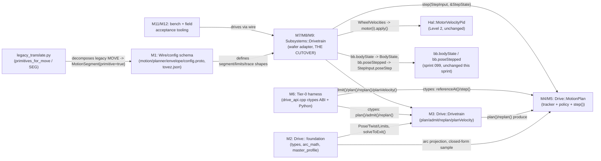
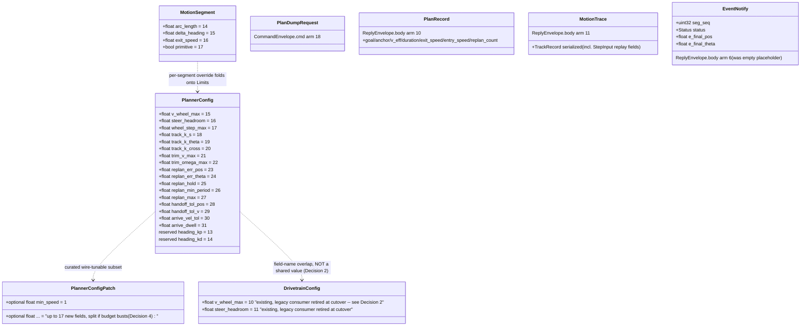
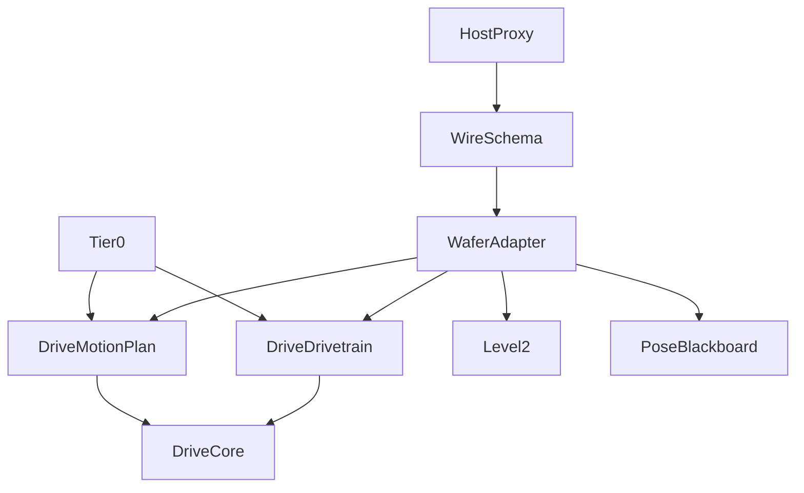

<!-- CLASI: Before changing code or making plans, review the SE process in CLAUDE.md -->

# Architecture Update -- Sprint 100: Motion stack v2: self-contained stateless drive subsystem

## Step 1: Understand the Problem

The current motion pipeline (`Motion::SegmentExecutor`: a 3-phase machine +
divergence replans + dead-time-projected stops, `source/motion/
segment_executor.{h,cpp}`, ~900 lines) fails audit against the canonical
control model documented in `clasi/issues/
motion-stack-v2-a-self-contained-stateless-motion-control-subsystem.md`
(the sprint's source of truth, approved 2026-07-12): feedback is
implemented as replanning tuned by ~12 gain-dependent constants
(`kDivergenceThreshold`/`kRotDivergenceThreshold`/
`kGrossDivergenceThreshold`/`kMinReplanInterval`/... — the same family
sprint 098's own architecture-update.md M5 already narrowed once); the
plan is knowingly infeasible (`v_body_max`=1000 vs ~400 sim / ~620-740
real plateau, per `tovez.json`'s own `_vel_gains_note`); segments carry
no pose and no boundary velocities; `Subsystems::PoseEstimator` is
constructed but never ticked outside sim (sprint 099, planned but not yet
executed, restores that). Sprint 098's own outer heading PD loop (`kp`=6,
cascaded onto the unchanged inner wheel-velocity PID) is the one piece of
this codebase that already matches the target shape and lands reliably
(±1° turns on hardware, `tovez.json`'s `_heading_gains_note`) — this
sprint generalizes that pattern into a named, general-purpose subsystem:
two explicit control levels, a stateless Level-1 planner/tracker
(`source/drive/`) over an unchanged, bench-proven Level-2 wheel velocity
PID (`Hal::MotorVelocityPid`).

This is Sprint B of the issue's own two-sprint packaging. **Sprint A =
099** (pose restore) is a separately-planned, separately-executed sprint
that lands the two shapes this sprint's wafer adapter consumes:
`bb.bodyState` (`msg::PoseEstimate` — fused pose + body twist, computed
via `BodyKinematics::forward()` on the two directly-read wheel
velocities) and `bb.poseStepped`/`PoseEstimator::lastPoseStep()`
(`PoseStep{pos, theta}` — the magnitude of any correction `PoseEstimator`
applied on the immediately-prior tick), plus the `PoseFix` envelope arm 7
retype. As of this sprint's planning, sprint 099 is fully planned (9
tickets) but not executed; this sprint's cutover ticket (007) therefore
carries an explicit **precondition** — "sprint 099 closed" — rather than a
`depends-on` ticket ID (CLASI ticket dependencies are intra-sprint; a
cross-sprint execution-order requirement is expressed in prose, per the
team-lead's direction for this sprint).

Current architecture reviewed for this update: `docs/architecture/
architecture-update-098.md` (the latest consolidated architecture — sprint
098, heading-loop cascade control) plus direct reads of `source/motion/
jerk_trajectory.h` (the Ruckig-wrapper pattern being generalized),
`source/kinematics/body_kinematics.h` (the IK/saturation math being
copied in), `source/subsystems/drivetrain.h` (the existing Drivetrain
being thinned into the wafer adapter), `protos/{envelope,motion,planner,
config,drivetrain,telemetry}.proto` (the wire surface this sprint grows),
`source/runtime/{blackboard.h,commands.h}` (the queue/mailbox shapes the
adapter drains), `tests/_infra/sim/{sim_api.cpp,firmware.py}` (the
ctypes/Sim pattern tier 0's `drive_api.cpp` mirrors), `tests/sim/unit/
{jerk_trajectory_harness.cpp,test_jerk_trajectory.py}` (the compile-and-
run C++ unit-harness pattern), `tests/bench/turn_sweep.py` and
`host/robot_radio/robot/{legacy_translate.py,legacy_verbs.py}` (the host
proxy this sprint extends), `scripts/{gen_boot_config.py,
check_config_sync.py}` (the config-generation pattern this sprint's
`PlannerConfig` growth follows), `data/robots/tovez.json` (the live
per-robot tunables), and `CMakeLists.txt`/`codal.json` (the build's source
enumeration — see Decision 3 below for why this matters to the "zero
flash cost until cutover" claim). `clasi/sprints/
099-restore-pose-estimation-otos-encoders-and-delayed-camera-fixes/
architecture-update.md` was read in full for the exact landed shapes this
sprint's adapter consumes.

## Step 2: Identify Responsibilities

Distinct responsibilities this sprint introduces or changes, grouped by
what changes for the same reason:

1. **Wire/config schema growth** -- new `MotionSegment` fields (arc/pivot/
   `primitive`), `PlannerConfig` fields 15-31 (`Drive::Limits` source),
   new `PlanRecord`/`PlanDumpRequest`/`MotionTrace` wire arms,
   `EventNotify`'s real body, and the `tovez.json`/generator/sync-check
   chain that keeps them consistent. Changes because it is schema
   bookkeeping -- a wire/config contract -- not motion-control behavior.
2. **Self-contained geometric/trajectory primitives** -- `Drive::` value
   types, exact-circle arc math, and the generalized Ruckig wrapper
   (`solveToExit`). Changes because these are the directory's own copied-
   in foundation, with one reason to change: "the math `source/drive/`
   itself needs," never a reason that originates outside the directory.
3. **Segment planning and feasibility** -- `Drive::Drivetrain`'s
   `plan()`/`admit()`/`replan()`/`planVelocity()` and `Drive::MotionPlan`'s
   const query surface (`referenceAt()`, `duration()`, `kappa()`, ...).
   Changes because it is one cohesive concern: "given a goal and limits,
   is it feasible, and what is the reference trajectory" -- entirely
   before any tracking happens.
4. **Per-tick tracking control law** -- the Kanayama P-trim law, IK,
   curvature-preserving saturation, and the one-sided forward-arc wheel
   clamp. Changes because it is one control law with one reason to
   change: "how a reference-vs-measured error becomes a wheel-velocity
   command," independent of *when* to replan or stop.
5. **Per-tick policy/terminal decision** -- envelope evaluation, the
   replan-sustain/rate-limit/N-max state machine, and the terminal
   settle/handoff machine, all folded into `MotionPlan::step()`'s
   `Status` output and the caller-owned `StepState`. Changes because it
   is one cohesive concern: "given tracked error and elapsed time, what
   should happen next" -- independent of *how* the error became a
   command (responsibility 4).
6. **Host-side, firmware-free verification** -- the ctypes ABI
   (`tests/_infra/drive/drive_api.cpp`) and the tier-0 Python suite (plant
   model, purity/replay, plan-table notebooks). Changes because it is
   test infrastructure whose only reason to change is "make `source/
   drive/` steppable and inspectable from Python," never firmware
   integration concerns.
7. **Firmware integration (the wafer adapter)** -- `Subsystems::
   Drivetrain`, thinned to hold zero control math: queue draining, type
   conversion at the boundary, `Status` reaction, wire admission, host
   proxy decomposition (`primitives_for_move()`, `SEG`). Changes because
   it is exactly one thing: "bridge the pure subsystem to the rest of the
   firmware," never control-law logic (responsibilities 3-5 own that).
8. **Teleop velocity-mode path (MOVER)** -- `planVelocity()` plus the
   adapter's `replaceIn` wiring. Changes because it is the one additional
   entry point the cutover's plan/step contract needs for deadman-
   velocity teleop, distinct from goal-directed segment planning.
9. **Interpretability over the wire** -- `PlanDumpRequest`/`PlanRecord`/
   `MotionTrace` wiring and notebook overlay tooling. Changes because it
   is a diagnostics/observability surface, not a control-law concern.
10. **Integration and plant-fault verification** -- the tier-1 sim
    fault-knob matrix with lag on. Changes because it is a verification
    concern (does the adapter+tracker combination survive a realistic,
    non-ideal plant), not a design concern.
11. **Real-plant acceptance** -- bench (arc/pivot/chain grids, plateau
    re-measure, the 098 pivot grid re-run) and field (camera-verified
    chain, live `PoseFix`) verification. Changes because these are
    acceptance procedures against real hardware, not code modules --
    matching sprint 098's own "hardware acceptance is served by closure
    tickets directly, not a design module" precedent.
12. **Retirement of the old stack** -- deleting `segment_executor.*`/
    `segment.h`/`motion_baseline.h`/`stop_condition.*`, reserving retired
    proto fields, retiring `heading_kp`/`heading_kd` and the
    `governRatio` segment-mode call path. Changes because it is cleanup,
    gated on bench/field sign-off, not a design decision of its own.

Responsibilities 2-5 form the dependency spine of `source/drive/` itself
(2 underlies 3, 3 underlies 4/5) and are ticketed in that order (002-005).
Responsibility 1 lands first (ticket 001) because 2-9 all read the schema
it defines. Responsibility 6 (ticket 006) is the first point `source/
drive/` becomes *observable*, and is deliberately sequenced before
responsibility 7 (the cutover, ticket 007) so every control-law defect is
caught at the cheapest tier before the firmware's live call path is ever
touched. Responsibilities 8-9 (tickets 008-009) both depend only on the
cutover, not on each other, and could run in either order; 8 is
sequenced first because MOVER is the smaller of the two independent
adapter extensions. Responsibility 10 (ticket 010) depends on both,
since the fault matrix exercises segment AND velocity-mode plans.
Responsibilities 11-12 (tickets 011-013) are strictly sequential
acceptance/cleanup gates.

## Step 3: Define Subsystems and Modules

### M1 -- Wire/config schema (`protos/{motion,planner,envelope,config}.proto`, `tovez.json`, generators)

**Purpose**: Defines the wire and boot-config contract for arc/pivot
segments, `Drive::Limits`, and plan interpretability, before any consumer
exists.

**Boundary**: Inside -- `MotionSegment` fields 14-17 (`arc_length`,
`delta_heading`, `exit_speed`, `primitive`); `PlannerConfig` fields 15-31
(the `Drive::Limits` source -- see Decision 2 for why these are new
fields rather than a reuse of `DrivetrainConfig`'s existing `v_wheel_max`/
`steer_headroom`); `PlannerConfigPatch` growth (with a budget-verified
split fallback, Decision 4); new `PlanDumpRequest` (`CommandEnvelope` arm
18), `PlanRecord` (`ReplyEnvelope` arm 10), `MotionTrace` (`ReplyEnvelope`
arm 11); `EventNotify`'s real body (`seg_seq`, `status`, `e_final_pos`,
`e_final_theta`); `tovez.json`'s new `control.*`/`geometry.*` keys plus
`gen_boot_config.py`/`check_config_sync.py` updates mirroring the
existing `heading_kp`/`heading_kd`/`vel_gains_for_config()` pattern.
Outside -- any C++ consumer of these fields (M2-M9's job); the *numeric
tuning* of any new gain (bench work product, M11's job, matching sprint
098 Decision 2's "ship conservative starting values, iterate on the real
plant" precedent).

**Use cases served**: SUC-001 through SUC-014 all indirectly depend on
this schema existing; most directly SUC-011 (plan dump/trace wire arms).

### M2 -- `source/drive/` foundation (`types.h`, `arc_math.{h,cpp}`, `master_profile.{h,cpp}`)

**Purpose**: Provides the self-contained value types and geometric/
trajectory primitives every other `source/drive/` module builds on.

**Boundary**: Inside -- `Pose`/`Twist`/`WheelState`/`BodyState`/
`WheelVelocities`/`Limits` (plain values, no `msg::`); `composeArc`/
`poseAlongArc`/exact-circle-projection/`wrapAngle` (copied and adapted
from `kinematics/body_kinematics`); the generalized Ruckig wrapper
(`solveToExit`, copied and adapted from `motion/jerk_trajectory.h`'s
`solveToRest`/`solveToVelocity` pattern -- Ruckig's own
`InputParameter::target_velocity`, valid iff `|v_target| <=
max_velocity`; the directional no-reversal band generalizes to a
same-sign band for a nonzero exit speed). Also inside: the grep test
(SUC-008) that structurally enforces the directory's isolation (no
`msg::`/`Hal::`/`Subsystems::`/`MicroBit`/`kOutputHops`/`kDeadTime`, no
`#include` outside `source/drive/`, libc/libm, or `libraries/ruckig`).
Outside -- the original `body_kinematics.{h,cpp}`/`jerk_trajectory.
{h,cpp}` files themselves, which stay untouched until the cleanup ticket
(013) -- this is a **copy**, not a move, per the issue's explicit
direction ("code that exists elsewhere is copied in").

**Use cases served**: SUC-002 (purity), SUC-008 (isolation) directly; the
foundation for every other SUC.

### M3 -- `Drive::Drivetrain` façade + `Drive::MotionPlan`'s const query surface

**Purpose**: Given a goal and configured limits, decides feasibility and
produces the immutable, closed-form-samplable reference trajectory for
one segment.

**Boundary**: Inside -- `Drivetrain::admit()`/`advance()`/`plan()`/
`replan()`/`planVelocity()` (all pure, per the two core header sketches
in the driving issue, transcribed verbatim); `MotionPlan::duration()`/
`kappa()`/`anchor()`/`goal()`/`exitSpeed()`/`effectiveCeiling()`/
`isPivot()`/`isVelocityMode()`/`referenceAt()`. Outside -- `step()`
itself (M4/M5's job -- `MotionPlan` also holds the immutable solve
result `step()` reads, but the tracking/policy logic that consumes it is
a separate responsibility per Step 2).

**Use cases served**: SUC-001 (plan-table inspection), SUC-003 (admission/
feasibility), SUC-006 (chained handoff's `replan()`/re-aim), SUC-010
(MOVER's `planVelocity()`).

### M4 -- Tracker + IK/saturate/clamp cascade (`tracker.{h,cpp}`)

**Purpose**: Converts one tick's reference-vs-measured error into a
wheel-velocity command, pure.

**Boundary**: Inside -- exact arc-frame error projection (`eAlong`,
`eCross`, `eTheta`); the Kanayama P-trim law (`k_s`/`k_θ`/`k_c`, clamped
to `trimVMax`/`trimOmegaMax`; pivot mode forces `v_cmd` to a literal
0.0f); `BodyKinematics`-derived IK; curvature-preserving saturation; the
one-sided forward-arc wheel clamp. Outside -- deciding *when* this
cascade runs, or what `Status` results (M5's job); the reference sample
itself (M3's `referenceAt()`, called by `MotionPlan::step()` before the
tracker runs).

**Use cases served**: SUC-004 (closed-loop tracking convergence).

### M5 -- Policy (envelopes/terminal machine) + `MotionPlan::step()` composition (`policy.{h,cpp}`, `motion_plan.cpp`)

**Purpose**: Given tracked error and elapsed time (plus the caller-owned
`StepState`), decides the segment's `Status` and updates the policy
timers -- the subsystem's one explicit statelessness residue.

**Boundary**: Inside -- replan envelope evaluation (`e_along`/`e_cross`/
`e_theta` vs. the rate-scheduled allowances); the sustain/rate-limit/
`N-max` replan state machine; the terminal settle machine (dwell,
one-sided walk-in, literal-zero snap, timeout); the flying-handoff
envelope check; pose-fix step absorption/bypass (`StepInput.poseStep`/
`poseStepTheta` vs. the 30mm/3° threshold); `MotionPlan::step()` itself,
which composes M3's reference sample, M4's tracker cascade, and this
module's policy evaluation into one `StepOutput`. Outside -- actually
calling `replan()` (the caller/adapter's job on `REPLAN_DUE` -- M5 only
emits the status, per the issue's explicit "never replans itself" rule).

**Use cases served**: SUC-005 (state-based terminal completion), SUC-006
(flying handoff), SUC-007 (pose-fix absorption/replan).

### M6 -- Tier-0 verification (`tests/_infra/drive/drive_api.cpp`, tier-0 Python suite)

**Purpose**: Makes `source/drive/` steppable, plottable, and replayable
from Python with zero firmware/hardware involvement.

**Boundary**: Inside -- the ctypes C ABI (mirrors `tests/_infra/sim/
sim_api.cpp`'s proven shape: create `Drivetrain(limits)`, `plan()`,
`referenceAt()` table dump, `step(input, state)` with `StepState` as a
ctypes struct, `replan()`); the Python plant model of the level-2
velocity servo (lag, stiction, staleness, quantization, slip -- all
knobs); the replay harness (feeds recorded `TrackRecord.in` sequences
from any higher tier); plan-table notebooks. Outside -- any firmware
integration (M7's job); the plant model is a Python-side approximation
of Level 2, never a reimplementation of `Hal::MotorVelocityPid` itself
(that stays the single source of truth, per the issue's "never fork the
one control law that must never drift between sim and hardware").

**Use cases served**: SUC-001, SUC-002, SUC-004 (against the Python plant
model specifically), SUC-005, SUC-006, SUC-007 (all as tier-0-first
proofs, ahead of any firmware involvement).

### M7 -- Wafer adapter (`Subsystems::Drivetrain`, thinned) -- THE CUTOVER

**Purpose**: Bridges `source/drive/` to the rest of the firmware --
queues, blackboard, HAL staging, wire acks -- with zero control math.

**Boundary**: Inside -- draining `driveIn`/`replaceIn`/`segmentIn` with
existing precedence (unchanged from today); holding the current
`Drive::MotionPlan` value, `Drive::StepState`, plan-start timestamp, and
`ChainTail`; boundary type conversion (`msg::MotorState` ->
`Drive::WheelState`; `bb.bodyState` -> `Drive::BodyState`; `bb.
poseStepped` -> `StepInput.poseStep`/`poseStepTheta`;
`Drive::WheelVelocities` -> `msg::MotorCommand` velocity staging via
`hardware_.motor(i).apply()`, exactly today's path); reacting to
`Status` (`REPLAN_DUE` -> call `replan()`; `DONE_*` -> pop next ring
segment or neutral; `ABORT_*` -> flush ring, re-anchor `ChainTail`, emit
`EventNotify`); wire admission (`admit()`/`plan()` verdict -> `OK` or
typed `ERR`, queue untouched on rejection); committing `StepOutput.
record` -> `bb.motionTrace` each pass; the host proxy decomposition
(`legacy_translate.py`'s `primitives_for_move()`, the new `SEG` verb).
Outside -- any control math (M3-M5's job, entirely); pose ownership
(`PoseEstimator`, sprint 099's subsystem, untouched by this sprint);
`Hal::MotorVelocityPid` (Level 2, untouched).

**Use cases served**: SUC-009 (the cutover itself); indirectly gates
SUC-013/SUC-014 (bench/field acceptance depend on this landing first).

### M8 -- MOVER velocity-mode adapter path

**Purpose**: Routes deadman-velocity teleop through `planVelocity()` and
the adapter's existing `replaceIn` latest-wins mailbox.

**Boundary**: Inside -- the `replaceIn` -> `planVelocity(target, deadman,
current)` call, replacing the held plan on every fresh `MOVER`; wire
shape unchanged (`time`/`v`/`omega` + `primitive=true`, per the facts
carried into this sprint -- MOVER's wire contract does not change, only
what solves it). Outside -- BLEND (`MOVE s=1` streaming merge, explicitly
deferred -- replies `ERR` to `stream=true`); any new wire message (MOVER
reuses `MotionSegment`'s existing time/velocity arm).

**Use cases served**: SUC-010.

### M9 -- Plan-dump/trace wire arms + notebook overlay tooling

**Purpose**: Exposes the live plan and per-tick track record over the
wire for interpretability, without extending `Telemetry`.

**Boundary**: Inside -- `BinaryChannel`'s handlers for `PlanDumpRequest`
(-> N `PlanRecord` replies sharing `corr_id`, one per ring entry) and
`StreamControl.trace` (-> `MotionTrace` at the TLM period, from `bb.
motionTrace`); host-side notebook overlay tooling (plan table vs.
streamed track). Outside -- `Telemetry` itself (M1 already decided:
`MotionTrace` is a new reply arm, never a `Telemetry` extension -- the
166B budget stays untouched).

**Use cases served**: SUC-011.

### M10 -- Tier-1 fault-knob + lag-on validation

**Purpose**: Proves the adapter+tracker combination survives a realistic
(non-ideal) plant, not just the sim's zero-error path.

**Boundary**: Inside -- exercising the sim's existing `motor_lag`/
`enc_slip`/`stiction`/`trackwidth`/`scrub` knobs against `source/drive/`
through the now-live adapter, with `motor_lag` at 120-140ms as the
default for every tracker/replan scenario. Outside -- the zero-lag
path, reserved for golden-TLM bit-exactness only (M7's regeneration
step); adding new fault knobs to the sim (none needed -- all required
knobs already exist, per the facts carried into this sprint).

**Use cases served**: SUC-012.

### M11 -- Bench acceptance (`tests/bench/arc_sweep.py`)

**Purpose**: Proves the real plant meets the issue's control-law
tolerances and that the 098 pivot result is preserved or improved.

**Boundary**: Inside -- the `turn_sweep.py`-pattern dual-transport
capture script, arc/pivot/chain grids, `v_wheel_max` plateau
re-measurement pinned into `tovez.json`, the 098 pivot grid re-run.
Outside -- any code change to `source/drive/` itself (a bench-discovered
defect reopens the relevant M3-M5 ticket, it is not fixed inline here).

**Use cases served**: SUC-013.

### M12 -- Field acceptance (playfield camera-verified chain)

**Purpose**: Proves the full camera -> EKF -> tracker loop closes
end-to-end in the one environment that can actually fail badly.

**Boundary**: Inside -- a playfield chain script (the
`playfield_camera_run.py` pattern) with live `PoseFix` corrections
mid-chain, geofenced; the plan-vs-actual overlay. Outside -- any
firmware/adapter code change (same posture as M11).

**Use cases served**: SUC-014.

### M13 -- Retirement of the old stack

**Purpose**: Removes the old motion stack once the new one is proven, so
exactly one motion stack exists in the repository.

**Boundary**: Inside -- deleting `segment_executor.*`/`segment.h`/
`motion_baseline.h`/`stop_condition.*` (parked since M7, not before);
reserving `PlannerConfig`'s retired `heading_kp`/`heading_kd` field
numbers (`reserved`, never reassigned, matching `motion` field 5's own
precedent); retiring the `governRatio` segment-mode call path; a full
sim-suite re-run. Outside -- any new capability -- this module removes
code, it adds none.

**Use cases served**: SUC-015.

## Step 4: Diagrams

### Component/module diagram

Edges are labeled with the call/conversion, not just "uses" -- `Drive::`
(`DriveCore`/`DriveDrivetrain`/`DriveMotionPlan`) never appears as a
source node pointing outward except into itself: every arrow into a
`Drive::` node originates from a caller (`WaferAdapter`/`Tier0`), never
the reverse, matching the statelessness/pure-function contract (Step 3).
`WaferAdapter`'s fan-out is 5 (`WireSchema` reads, `DriveDrivetrain`,
`DriveMotionPlan`, `Level2`, `PoseBlackboard`) -- at the guidance ceiling,
justified in Design Quality below: this node's entire one-sentence
purpose IS being the boundary layer between five neighbors, the same
shape the pre-existing `Subsystems::Drivetrain` already had (it already
held `Hardware&` and owned `Motion::SegmentExecutor` before this sprint;
this sprint changes what it fans out to, not that it fans out).

### Entity-relationship / data-model diagram (wire schema growth)

`heading_kp`/`heading_kd` (fields 13/14) are marked `reserved` here as a
forward statement of ticket 013's own action (M13) -- they stay LIVE
fields through this sprint's execution (the old stack still reads them
until the cutover) and are only actually reserved once M13 executes,
after bench/field sign-off. `DrivetrainConfig.v_wheel_max`/
`steer_headroom` (fields 10/11) are drawn to make the field-name overlap
with the NEW `PlannerConfig.v_wheel_max`/`steer_headroom` (15/16)
explicit -- see Decision 2 for why these are two deliberately separate
fields, not a consolidation, during this sprint.

### Dependency graph

No cycles. `DriveCore`/`DriveDrivetrain`/`DriveMotionPlan` (the `Drive::`
domain) have no outward dependencies at all -- the dependency-direction
rule (`[Presentation/API] -> [Business Logic/Domain] -> [Infrastructure]`)
holds with `WaferAdapter` as the presentation/API layer, `Drive::` as the
domain (zero outward deps, per the issue's own "no references outside
the directory" rule -- this is not merely good practice here, it is a
grep-enforced invariant, M2/SUC-008), and `Level2`/`PoseBlackboard` as
infrastructure `WaferAdapter` plugs into. This is a NEW dependency
subtree (`source/drive/` did not exist before this sprint); the
PRE-EXISTING graph's direction (`main.cpp` -> `Drivetrain` ->
{`SegmentExecutor`, `Hardware`}) is preserved in shape -- `WaferAdapter`
(the renamed/thinned `Subsystems::Drivetrain`) still sits exactly where
the old `Drivetrain` sat, still depends on `Hardware`
(`Level2`/`PoseBlackboard` here are more precise labels for what it
actually touches post-cutover) -- only what it depends ON for control
math changes (`Drive::` instead of `Motion::SegmentExecutor`).

## Step 5: Complete the Document

### What Changed

- **New directory `source/drive/`** (namespace `Drive`): `types.h`,
  `arc_math.{h,cpp}`, `master_profile.{h,cpp}`, `tracker.{h,cpp}`,
  `policy.{h,cpp}`, `drivetrain.{h,cpp}`, `motion_plan.{h,cpp}` -- the
  issue's two core header sketches (`drivetrain.h`, `motion_plan.h`)
  transcribed verbatim, elaborated to the rest of the directory.
- **`protos/motion.proto`**: `MotionSegment` gains `arc_length`(14)/
  `delta_heading`(15)/`exit_speed`(16)/`primitive`(17); firmware rejects
  `primitive=false` after cutover.
- **`protos/planner.proto`**: `PlannerConfig` gains fields 15-31 (the
  `Drive::Limits` source -- see M1/Decision 2).
- **`protos/config.proto`**: `PlannerConfigPatch` grows to cover the new
  live-tunable subset of fields 15-31, budget-checked (Decision 4).
- **`protos/envelope.proto`**: `PlanDumpRequest` (`CommandEnvelope` arm
  18), `PlanRecord` (`ReplyEnvelope` arm 10), `MotionTrace`
  (`ReplyEnvelope` arm 11); `EventNotify` (existing declared-only
  placeholder, arm 6) gets a real body.
- **`data/robots/tovez.json` + `scripts/gen_boot_config.py` + `scripts/
  check_config_sync.py`**: new `control.*`/`geometry.*` keys for the
  `Drive::Limits`/tracker/policy tunables, mirroring the existing
  `heading_kp`/`vel_gains_for_config()` pattern exactly; the sync-check
  gains entries for every new `PlannerConfigPatch` field (allowlisted
  where no host pydantic field exists yet, per the established
  `ekf_r_otos_*` precedent).
- **`tests/_infra/drive/drive_api.cpp`** (new): ctypes C ABI over
  `Drive::Drivetrain`/`Drive::MotionPlan`, mirroring `tests/_infra/sim/
  sim_api.cpp`'s proven shape.
- **`tests/sim/unit/`**: new grep-isolation test, arc-math/`solveToExit`/
  admission-verdict C++ unit harnesses (minimal -- tier 0 covers
  behavior).
- **`source/subsystems/drivetrain.{h,cpp}`**: rewritten to the wafer
  adapter shape (M7) -- holds a `Drive::Drivetrain`, a `Drive::
  MotionPlan` value, `Drive::StepState`, `ChainTail`; drains queues with
  unchanged precedence; converts types at the boundary; stages
  `WheelVelocities` via the unchanged `hardware_.motor(i).apply()` path.
- **`host/robot_radio/robot/legacy_translate.py`**: new
  `primitives_for_move()` (decomposes a legacy `MOVE` into <=3
  `MotionSegment{primitive=true}` primitives) and a new `segment_for_seg`-
  style builder for the new `SEG` proxy verb; `host/robot_radio/robot/
  legacy_verbs.py` registers `SEG`.
- **Build**: `source/drive/*.cpp` join both the host (`CMakeLists.txt`'s
  `RECURSIVE_FIND_FILE`) and firmware (`codal.json`'s `"application":
  "source"`) source enumeration AUTOMATICALLY the moment the files exist
  -- there is no explicit "add to build" step in this tree (see Decision
  3 for why this does not contradict the issue's "zero flash cost until
  cutover" claim, and how ticket 002 verifies it rather than assumes it).
- **Retired at M13 (ticket 013, gated on bench+field sign-off)**:
  `source/motion/segment_executor.{h,cpp}`, `segment.h`,
  `motion_baseline.h`, `stop_condition.{h,cpp}` deleted; `PlannerConfig`
  fields 13/14 (`heading_kp`/`heading_kd`) marked `reserved`; the
  `governRatio` segment-mode call path retired (the DIRECT/escape-hatch
  path's own `governRatio()` call, used for TWIST/WHEELS, is UNCHANGED --
  only the segment-mode invocation retires, since `Drive::`'s own
  saturate/clamp cascade supersedes it for planned motion).

### Why

Per sprint.md's Goals/Problem and the issue's own Context: the current
stack's replan-tuned-by-constants shape does not match the canonical
control model, terminates on prediction rather than state, and plans
against an infeasible ceiling. Sprint 098 already proved the fix's shape
works on hardware (a cascaded outer loop over an unchanged inner PID);
this sprint generalizes it into a self-contained, testable subsystem per
explicit stakeholder decision (statelessness, two levels of control, one
directory). The four-tier test ladder and hard-cutover strategy exist so
every defect is caught at the cheapest possible tier, and so the robot
never runs a dual/ambiguous stack.

### Impact on Existing Components

- **`source/motion/jerk_trajectory.{h,cpp}`**: none -- read-only pattern
  source for `master_profile.{h,cpp}`'s generalization; stays live for
  the old stack until M13 deletes `segment_executor.{h,cpp}` (its only
  consumer). Not touched by any ticket in this sprint before M13, and
  M13 deletes only `segment_executor`'s own files, not
  `jerk_trajectory.{h,cpp}` itself (it has no other consumer to check for
  first, but is left in place per the issue's "copy, not move" framing --
  removing it is a separate, unscoped future cleanup, flagged as Open
  Question 3 below).
- **`source/kinematics/body_kinematics.{h,cpp}`**: same posture --
  read-only pattern source, untouched, still used by the old
  `Subsystems::Drivetrain`'s pre-cutover `commandedWheelTargets()`/
  DIRECT-mode path until the cutover ticket rewrites that class.
- **`Subsystems::Drivetrain`**: REWRITTEN (M7) -- every method that
  today dispatches into `Motion::SegmentExecutor` (`tick()`'s
  SEGMENT-mode branch) is replaced by calls into `Drive::Drivetrain`/
  `Drive::MotionPlan`. The DIRECT/escape-hatch path (`setTwist()`/
  `setWheelTargets()`/`setNeutral()`, `governRatio()` for TWIST/WHEELS)
  is UNCHANGED -- it never went through `SegmentExecutor` and has no
  `Drive::` equivalent to migrate to (per the issue's scope, DIRECT mode
  stays untouched and unwired by the subsystem).
- **`Hal::MotorVelocityPid` (NezhaMotor/SimMotor)**: none -- Level 2 is
  explicitly, structurally unchanged by this sprint (the "two levels of
  control" decision's entire point).
- **`Subsystems::PoseEstimator`**: none -- this sprint only READS
  `bb.bodyState`/`bb.poseStepped`, both published by sprint 099; no
  ticket in this sprint modifies `PoseEstimator` itself.
- **`Telemetry` (`protos/telemetry.proto`)**: none -- `MotionTrace` is a
  new `ReplyEnvelope` arm, never a `Telemetry` field; the existing ~166B
  budget is untouched (M1/M9).
- **Sim plant/golden-TLM**: the golden-TLM zero-error path's bit-
  exactness is preserved at cutover via an explicit, reviewed
  regeneration step (M7's own acceptance criteria) -- not silently
  re-baselined.
- **`docs/protocol-v3.md`** (or whatever version is current by this
  sprint's execution): goes stale the moment this sprint's wire arms
  land, same as sprint 099's own Migration Concern -- flagged as an Open
  Question below, not a ticket in this sprint (doc maintenance, per
  project convention, is a closing-sprint/dedicated-doc-sprint task).

### Migration Concerns

- **Wire compatibility**: `MotionSegment`'s new fields are additive
  (protobuf unknown-field-skip means an older client sending only the
  legacy fields still decodes) -- but firmware REJECTING
  `primitive=false` after cutover IS a breaking behavior change for any
  client still sending the old (non-primitive) segment shape directly.
  Mitigated by the host proxy's `primitives_for_move()` decomposition,
  which every legacy text `MOVE`/`S`/`T`/`D` verb routes through -- no
  client this tree controls sends `primitive=false` post-cutover.
  External clients (if any) are out of this project's control surface,
  same posture as every prior wire-breaking cutover in this tree
  (protocol v2 -> v3).
- **`PlannerConfig`/`PlannerConfigPatch` budget**: 17 new fields (15-31)
  is the single largest schema growth any `Patch` message has taken in
  this tree's history (`PlannerConfigPatch` currently has 3 fields
  totaling well under 186B). Ticket 001's acceptance criteria REQUIRE
  running `scripts/gen_messages.py`'s `kMaxEncodedSize` report (the same
  tool `envelope.proto`'s own comments cite as the wire-budget source of
  truth) for `ConfigDelta`/`ConfigSnapshot` after the growth, not
  assuming it fits -- see Decision 4 for the split fallback if it does
  not.
- **Flash/build footprint**: `source/drive/*.cpp` automatically joins
  both the host and firmware source enumeration the moment the files
  exist (Decision 3) -- ticket 002's acceptance criteria include an
  actual `just build` + `arm-none-eabi-size` before/after comparison
  (flash delta near-zero, given `-ffunction-sections -fdata-sections`
  and CODAL's own `--gc-sections` linking), not an assumption. RAM: the
  issue estimates ~43KB flash total for the fully-wired subsystem
  (post-cutover) -- a real number ticket 007 verifies at cutover, not a
  design constraint.
- **Deployment sequencing**: this sprint's execution requires sprint 099
  closed BEFORE ticket 007 (the cutover); tickets 007/008/011/012 further
  require the robot USB-attached (currently only the relay dongle is
  connected) -- see sprint.md's HITL/hardware note. A session that loses
  USB access mid-cutover needs the pre-cutover state (old stack) to still
  be the working tree until the cutover ticket's own acceptance criteria
  pass on hardware -- the hard-cutover strategy's "no runtime dual stack"
  is about the SHIPPED artifact, not about being unable to abort a
  half-finished cutover attempt (a failed cutover ticket simply does not
  merge).
- **No backward-incompatible EventNotify change**: `EventNotify` was
  already declared-only/empty (`envelope.proto`'s own comment: "096/097
  must decide how to reconcile it with the hand-authored `msg::Event`").
  This sprint resolves that standing open question by giving it a real
  body (Decision 5) -- an additive change to an arm with no live
  consumer today, not a breaking one.

## Step 6: Design Rationale

### Decision 1: Ticket 4 (the issue's "step(): tracker + policy + terminal machine + IK/saturate/clamp/PI cascade") is split into two tickets

**Context**: the issue's own sequencing table lists ticket 4 as one unit
covering both the per-tick control LAW (tracker + IK + saturate + clamp)
and the per-tick POLICY decision (envelopes, replan sustain/rate-limit/
N-max, terminal settle machine, handoff, pose-fix absorption) plus
`MotionPlan::step()`'s own composition of both. The team-lead's dispatch
explicitly authorized splitting this ticket if judged too large for one
programmer session, while holding every other ticket's count fixed.

**Alternatives considered**: (a) keep ticket 4 as one unit, matching the
issue's table exactly; (b) split along the Step 2 responsibility
boundary already identified (responsibility 4: control law: vs.
responsibility 5: policy/terminal decision) into two tickets (004:
tracker + IK/saturate/clamp; 005: policy + terminal machine + `step()`
composition + `StepState`).

**Why this choice**: (b). The two halves are independently testable
(the tracker cascade's correctness -- does a given error produce the
right wheel command -- is provable without any policy/terminal-machine
code existing yet; the terminal settle machine's five-scalar `StepState`
and Kanayama-independent envelope logic is a second, separately-sized
unit of work) and independently COHESIVE (Step 2's responsibility split
already names them as two separate concerns with two separate reasons to
change: "how an error becomes a command" vs. "what to do given tracked
error over time"). Combined, the issue's own control-law table (six
gains, five envelope parameters, a five-branch terminal machine, a
four-branch handoff check, and a two-threshold pose-fix rule) is
substantial enough that a single ticket risks either a rushed
implementation of the terminal machine (the most safety-relevant piece,
per the terminal-reversal risk this project has hit before -- see
`.clasi/knowledge/encoder-wedge-boundary-latch.md`/
`wedge-latch-terminology-and-repro.md`) or an oversized programmer
dispatch that is hard to review as one diff.

**Consequences**: ticket count grows from the issue's 12 to 13 (numbered
001-013 in this sprint, not matching the issue's 1-12 numbering 1:1
after the split point -- see the ticket table in sprint.md for the exact
renumbering and the cross-reference to the issue's original numbers).
Ticket 005 depends on 004 (the tracker cascade must exist before the
policy layer that decides WHEN to invoke it and what status to report).
The cutover ticket's dependency (originally "5" in the issue's own
table) becomes "006" in this sprint's numbering (tier-0 verification,
itself now dependent on both 004 and 005).

### Decision 2: `PlannerConfig` fields 15-31 (including `v_wheel_max`/`steer_headroom`) are NEW fields, not a reuse of `DrivetrainConfig`'s existing fields 10/11 of the same name

**Context**: `protos/drivetrain.proto`'s `DrivetrainConfig` already
declares `v_wheel_max`(10)/`steer_headroom`(11), consumed today by the
OLD `Subsystems::Drivetrain`'s `governRatio()`/`BodyKinematics::
saturate()` DIRECT-mode path. The issue's own config-surface list
(`clasi/issues/motion-stack-v2-...md`, "Wire schema & config" section)
places `v_wheel_max`/`steer_headroom` inside `PlannerConfig`'s NEW
fields 15-31 (`Drive::Limits`'s source), verbatim alongside 15 other new
tracker/policy tunables -- a literal field-name collision across two
different proto messages (legal in protobuf; each message has its own
number space), discovered during this sprint's own codebase-alignment
read of `drivetrain.proto`, not called out explicitly by the issue
itself.

**Alternatives considered**: (a) reuse `DrivetrainConfig.v_wheel_max`/
`steer_headroom` as `Drive::Limits`'s source too (avoiding the name
collision, avoiding duplication of the same physical quantity in two
messages), converting the field-number list to 15-29 (15 new fields
instead of 17); (b) add `PlannerConfig.v_wheel_max`/`steer_headroom` as
genuinely new, separate fields (15/16) exactly as the issue's table
specifies, leaving `DrivetrainConfig`'s existing 10/11 in place
(orphaned once the old `Drivetrain`'s DIRECT-mode consumer is the only
thing left reading them, post-cutover).

**Why this choice**: (b) -- the issue is the sprint's source of truth and
its field-number table is explicit and deliberate (17 fields spanning
15-31, not 15-29), not an oversight to silently correct. Reusing
`DrivetrainConfig`'s fields would also be semantically wrong during the
PARKED WINDOW (before cutover, tickets 001-006): the old `Drivetrain`'s
DIRECT/escape-hatch path (TWIST/WHEELS, untouched by this sprint, see
Impact on Existing Components) still legitimately reads
`DrivetrainConfig.v_wheel_max`/`steer_headroom` for its OWN saturation
during this entire sprint -- `Drive::Limits` reading the SAME wire field
would create a hidden coupling between two config messages that this
sprint's own module boundaries (M1 vs. the old `DrivetrainConfig`
schema, untouched) do not otherwise have, and would make Level 1's
config surface not self-contained (a `Drive::Limits` value populated
partly from `PlannerConfig`, partly from `DrivetrainConfig`, is a leaky
boundary the issue's "one directory, self-contained" rule argues
against at the CONFIG layer, not just the code layer).

**Consequences**: `v_wheel_max`/`steer_headroom` exist as two physically-
duplicated values on the wire during tickets 001-013 -- `tovez.json`'s
`gen_boot_config.py` mapping must set BOTH the old `DrivetrainConfig`
path (unchanged, feeding the old `Drivetrain` until cutover) and the new
`PlannerConfig` path (feeding `Drive::Limits` from ticket 006 onward)
from the SAME bench-measured plateau number, or the two stacks will
disagree on wheel ceiling during any period both exist side-by-side
pre-cutover (they never run simultaneously in production, only in
sequential ticket development -- but tier-0/tier-1 tests for `source/
drive/` must not accidentally read the old field). Flagged as Open
Question 1 below: whether `DrivetrainConfig.v_wheel_max`/
`steer_headroom` should be marked `DEPRECATED` (matching
`vel_gains`/`min_wheel`'s existing precedent in that same message) once
M13 retires their only remaining consumer -- left to ticket 013's own
judgment, not decided here.

### Decision 3: "Zero flash cost until cutover" rests on the build's existing dead-code elimination, verified not assumed

**Context**: the issue states `source/drive/` + tier-0 lands "WITHOUT
entering the firmware build -- robot stays drivable on the old stack;
zero flash cost until cutover." Direct read of `CMakeLists.txt`
(`RECURSIVE_FIND_FILE(SOURCE_FILES ... "*.cpp")` over the WHOLE
`source/` tree) and `codal.json` (`"application": "source"`, CODAL's own
recursive source discovery) shows there is no explicit "add file to
build" step anywhere in this tree for a NEW file under `source/` -- every
`.cpp` under `source/drive/` is compiled into both the host test build
and the real firmware image the moment it exists, automatically, for
BOTH the host build and the firmware build.

**Alternatives considered**: (a) take the issue's "does not enter the
firmware build" claim as meaning `source/drive/` should be filtered OUT
of `codal.json`'s source enumeration via a `CMakeLists.txt`-style
`EXCLUDE REGEX` (mirroring the existing `hal/sim/`/`ReplayHAL.cpp`/
`SimCommands.cpp` host-only exclusions), landing only in the host build
until cutover; (b) let the files compile into the firmware image from
ticket 002 onward (as the existing build mechanics do automatically with
no code change needed), relying on `-ffunction-sections -fdata-sections`
(already set, `CMakeLists.txt` line 159) plus CODAL's own linker
`--gc-sections` to strip the unreferenced `Drive::` translation units'
code from the final flash image, since nothing calls into `Drive::*`
until the cutover ticket wires the adapter.

**Why this choice**: (b) -- (a) would require inventing a NEW build-
exclusion mechanism the existing `EXCLUDE REGEX` precedent is not
designed for (those exclude HOST-only files that must never reach the
firmware at all, e.g. `hal/sim/*` genuinely cannot compile against
CODAL; `source/drive/` is the OPPOSITE case -- code that WILL become
production firmware, just not wired to any caller yet) and would
contradict the issue's own "one directory... driven through an
exceedingly thin adapter" framing by adding conditional-compilation
machinery this sprint's own isolation rule (M2/SUC-008) already argues
against. (b) matches how the codebase already handles "compiled but not
yet load-bearing" code elsewhere (e.g. `PlannerCommand`'s reserved field
5 sits declared-but-unused in the wire schema without any special
exclusion). The claim is EMPIRICAL, not architectural -- so it is
verified, not assumed: ticket 002's acceptance criteria require an
actual `just build` + `arm-none-eabi-size` before/after comparison.

**Consequences**: if the size check in ticket 002 (or any subsequent
host-side ticket) shows a NON-negligible flash delta from dead `Drive::`
code that `--gc-sections` failed to strip (e.g. because a stray call
site, a vtable, or a static initializer keeps a translation unit
reachable), that is a real finding this sprint's own acceptance
criteria surface immediately, not a silent regression discovered at
cutover. This is a stronger verification posture than the issue's own
text implies, not a contradiction of it.

### Decision 4: `PlannerConfigPatch`'s budget-check fallback is an explicit two-target split, not an unspecified "figure it out"

**Context**: the issue says "Budget check on the grown
`PlannerConfigPatch` (<= 186B or split the patch target)" without
specifying HOW to split it. `ConfigTarget` (`config.proto`) is the enum
that already selects which `Patch` a `ConfigDelta`/`ConfigSnapshot`
carries (`CONFIG_DRIVETRAIN`/`CONFIG_MOTOR_LEFT`/`CONFIG_MOTOR_RIGHT`/
`CONFIG_PLANNER`/`CONFIG_WATCHDOG`).

**Alternatives considered**: (a) leave the split strategy fully open to
ticket 001's own judgment at implementation time; (b) specify NOW that if
`PlannerConfigPatch`'s worst-case `kMaxEncodedSize` (wrapped in
`ConfigSnapshot`/`ConfigDelta`, plus `ReplyEnvelope`/`CommandEnvelope`
overhead) exceeds 186B, ticket 001 splits it into `PlannerConfigPatch`
(the existing 3 fields + whichever of the 17 new fields fit) and a new
`PlannerConfigPatch2` selected by a new `CONFIG_PLANNER_TRACK`
`ConfigTarget` value, mirroring `CONFIG_MOTOR_LEFT`/`CONFIG_MOTOR_RIGHT`'s
existing precedent for splitting one logical config surface across two
wire-addressable targets.

**Why this choice**: (b) -- an unspecified fallback risks ticket 001
inventing an ad hoc split under implementation pressure with no
established naming pattern to follow; specifying the exact mechanism
(a second `ConfigTarget` value, matching `CONFIG_MOTOR_LEFT`/
`CONFIG_MOTOR_RIGHT`'s own precedent for the identical problem --
"too much per-target config to fit one `Patch` message") keeps the
eventual split, if needed, consistent with how this project has already
solved this exact problem once. This is a DEFAULT, not a mandate: ticket
001's own acceptance criteria require running the actual
`kMaxEncodedSize` check FIRST -- if 17 new fields fit under budget as a
single `PlannerConfigPatch` growth, no split happens at all, and this
decision is moot.

**Consequences**: if a split is needed, `Drive::Limits`'s consumer (the
wafer adapter, M7) reads from TWO `ConfigDelta`/`ConfigSnapshot` targets
instead of one to assemble one `Drive::Limits` value -- a small but real
increase in the adapter's boundary-conversion surface, acceptable since
the adapter's whole job is exactly this kind of boundary conversion.

### Decision 5: `EventNotify` gets its real body in this sprint, resolving sprints 096/097's standing open question

**Context**: `envelope.proto`'s `EventNotify` message has been an
intentionally empty placeholder since sprint 096 (`"EventNotify" here
instead, as a minimal declared-only placeholder; 096/097 must decide how
to reconcile it with the hand-authored `msg::Event`... flagged, not
resolved`). This sprint's own issue requires `EventNotify` to carry
`seg_seq`/`status`/`e_final_pos`/`e_final_theta` for abort/flush
notifications (M1/M7).

**Alternatives considered**: (a) leave `EventNotify` exactly as it is
and invent a SEPARATE message for this sprint's abort/flush
notifications, deferring the 096/097 reconciliation question further;
(b) give `EventNotify` its real body now, using the four fields this
sprint actually needs, resolving the standing question for THIS sprint's
use case (unsolicited abort/flush notification) without attempting to
also resolve the SEPARATE `msg::Event` ODR-collision question
`envelope.proto`'s own comment describes (the hand-authored
`source/messages/event.h` `msg::Event` type, needed because
`gen_messages.py` cannot express its four differently-sized char
arrays).

**Why this choice**: (b) -- (a) would leave `EventNotify` permanently
empty and pointlessly duplicate a "declared oneof arm with a body"
concept this sprint already needs; the ODR-collision concern
`envelope.proto`'s comment raises is about a DIFFERENT, TEXT-oriented
`msg::Event` shape (four char arrays) that this sprint's four SCALAR
fields (`seg_seq`/`status`/`e_final_pos`/`e_final_theta`) do not
resemble and do not need to reconcile with -- `EventNotify` filling its
body with scalars this sprint needs does not collide with `msg::Event`'s
own struct shape (different field types entirely), so no ODR hazard is
introduced by this sprint's choice.

**Consequences**: the STANDING reconciliation question (should
`msg::Event`'s own hand-authored type eventually be retired in favor of
a proto round-trip once `gen_messages.py` can express per-field char-
array sizes) remains open -- this sprint answers "what does `EventNotify`
carry for a motion-abort/flush," not "should `msg::Event` still exist."
Flagged as Open Question 2 below, carried forward unchanged from
096/097's own framing, not re-litigated here.

## Step 7: Flag Open Questions

1. **Should `DrivetrainConfig.v_wheel_max`/`steer_headroom` (fields
   10/11) be marked `DEPRECATED`** (matching `vel_gains`/`min_wheel`'s
   existing precedent in that same message) once ticket 013 retires
   their only remaining consumer (the old `Drivetrain`'s DIRECT-mode
   `governRatio()`/saturate path)? See Decision 2. Left to ticket 013's
   own judgment -- not blocking, not decided here.
2. **The `msg::Event`/`EventNotify` reconciliation question** (should the
   hand-authored `msg::Event` type retire in favor of a proto round-trip
   once `gen_messages.py` can express per-field char-array sizes) remains
   open, carried forward from sprints 096/097 unchanged -- this sprint's
   Decision 5 resolves only `EventNotify`'s OWN body, not that broader
   question.
3. **`jerk_trajectory.{h,cpp}`/`body_kinematics.{h,cpp}` are left in
   place after `master_profile`/`arc_math` copy their patterns in** --
   `jerk_trajectory.{h,cpp}` has exactly one consumer left after M13
   (none -- `segment_executor.cpp` is deleted, and nothing else in the
   tree calls `Motion::JerkTrajectory`). Whether to delete the now-
   unreferenced originals is NOT this sprint's ticket 013 scope (the
   issue's own "Kept / copied / gutted" section does not list them under
   "Gutted at cutover") -- flagged for a future cleanup sprint if a
   stakeholder wants the duplication removed once both patterns have
   diverged enough that the "copy, don't move" rationale (Level 1 stays
   self-contained even after this sprint) has served its purpose.
4. **`docs/protocol-v3.md` (or whichever protocol doc is current by this
   sprint's execution) needs a follow-up edit** for the new `pose`
   arm-adjacent motion wire surface (arms 10/11/18, `MotionSegment`'s
   grown fields, `EventNotify`'s real body) -- same posture as sprint
   099's own Open Question 1: not a ticket in this sprint (doc
   maintenance), flagged for the team-lead to schedule, likely at sprint
   close.
5. **`PlannerConfigPatch`'s exact split strategy (Decision 4) is a
   default, contingent on ticket 001's own `kMaxEncodedSize` measurement**
   -- if the 17-field growth fits under budget as-is, no split occurs and
   `CONFIG_PLANNER_TRACK` is never created. Not blocking; ticket 001's
   acceptance criteria record which outcome occurred.
6. **Should `data/robots/togov.json` (the mecanum robot) also get this
   sprint's new `control.*`/`geometry.*` tracker/policy keys?** Out of
   scope, same posture as sprint 098's own Open Question 4 -- this
   sprint's bench/field acceptance instruments are `tovez` (differential)
   only; `togov` inherits firmware-default fallback values until a future
   sprint characterizes it separately.

## Quality Checks

- Every module (M1-M13) traces to at least one SUC (see each module's
  "Use cases served," Step 3) and every SUC (SUC-001 through SUC-015) is
  served by at least one module -- SUC-015 (retirement) is served by M13
  directly; SUC-013/SUC-014 (bench/field acceptance) are served by
  M11/M12 as verification PROCEDURES, not design modules, matching
  sprint 098's own "hardware acceptance is served by closure tickets
  directly" precedent.
- No cycles in the dependency graph (Step 4) -- `Drive::` (`DriveCore`/
  `DriveDrivetrain`/`DriveMotionPlan`) has zero outward dependencies, a
  grep-enforced invariant (M2/SUC-008), not merely a diagram convention.
- Each module passes the cohesion test (Step 3's one-sentence purposes,
  no "and" smuggled in) -- M7 (the wafer adapter)'s purpose reads
  "bridges `source/drive/` to the rest of the firmware... with zero
  control math," a single sentence covering five neighbor conversions
  because bridging IS its one job, not five jobs (see Design Quality
  below for the fan-out discussion).
- Fan-out: `WaferAdapter` (M7/M8/M9, `Subsystems::Drivetrain`) is 5
  (`WireSchema`, `DriveDrivetrain`, `DriveMotionPlan`, `Level2`,
  `PoseBlackboard`) -- at the guidance ceiling, justified (Design Quality
  below). No other module's fan-out approaches the limit.

## Self-Review (architecture-review phase)

**Consistency**: Step 5's "What Changed" matches Step 3's module list
one-for-one (M1 -> proto/tovez.json/generators, M2 -> `source/drive/`
foundation, M3 -> `Drivetrain`/`MotionPlan` query surface, M4/M5 ->
`tracker`/`policy`/`step()`, M6 -> `drive_api.cpp`/tier-0 suite, M7 ->
`Subsystems::Drivetrain` rewrite + host proxy, M8 -> MOVER's
`planVelocity` wiring, M9 -> plan-dump/trace arms, M10-M12 -> tier-1/
bench/field verification, M13 -> retirement). Design rationale (Step 6)
is recorded for every genuinely NEW decision this sprint introduces
beyond the issue's own text (the ticket-4 split, the `PlannerConfig`/
`DrivetrainConfig` field-name duplication, the build/flash verification
posture, the `PlannerConfigPatch` split fallback, `EventNotify`'s
resolution) -- no decision already made BY THE ISSUE (the statelessness
rule, the two-levels-of-control rule, the no-dead-time rule, the
control-law gains/envelopes, the hard-cutover strategy) is re-litigated,
watered down, or silently contradicted anywhere in this document; every
one of those issue-level decisions is transcribed verbatim into Step 3's
module boundaries and Step 5's "What Changed."

**Codebase Alignment**: every file/function/field named in this document
was read directly this session -- `source/motion/jerk_trajectory.h` (in
full), `source/kinematics/body_kinematics.h` (in full),
`source/subsystems/drivetrain.h` (in full), `protos/{envelope,motion,
planner,config,drivetrain,telemetry}.proto` (in full),
`source/runtime/{blackboard.h,commands.h}` (in full),
`tests/_infra/sim/{sim_api.cpp,firmware.py}` (partial, the documented
pattern sections), `tests/sim/unit/{jerk_trajectory_harness.cpp,
test_jerk_trajectory.py}` (partial, the pattern sections),
`tests/bench/turn_sweep.py` (partial), `host/robot_radio/robot/
{legacy_translate.py,legacy_verbs.py}` (in full/partial), `scripts/
{gen_boot_config.py,check_config_sync.py}` (in full/partial),
`data/robots/tovez.json` (in full), `CMakeLists.txt`/`codal.json`
(the source-enumeration sections) -- no function signature or field
name above is guessed. The one piece of ACTUAL schema drift this review
surfaced and accounted for, not assumed: `DrivetrainConfig` already
declares `v_wheel_max`(10)/`steer_headroom`(11), a field-name collision
with the issue's own `PlannerConfig`(15/16) list that the issue's text
does not call out explicitly -- Decision 2 above resolves it, not
silently. The `source/drive/*.cpp` automatic-build-entry fact (Decision
3) is likewise a verified codebase fact (`RECURSIVE_FIND_FILE`/
`"application": "source"`), not an assumption carried over from the
issue's own "zero flash cost" framing.

**Design Quality**: Cohesion -- every module's one-sentence purpose
(Step 3) holds without "and," including M7's five-neighbor fan-out
(its ONE job is being the boundary, not five separate jobs). Coupling --
`Drive::` depends on nothing outside itself (grep-enforced); the wafer
adapter's coupling to `Drive::`/`Level2`/`PoseBlackboard`/`WireSchema` is
intentional and narrow (each edge is a single, named conversion, per
Step 4's labeled edges), matching the pre-existing `Subsystems::
Drivetrain`'s own shape (it already held `Hardware&` and owned
`SegmentExecutor` before this sprint -- this sprint changes WHAT it
depends on for control math, not that it has dependencies at all).
Boundaries -- `source/drive/`'s boundary is the strictest in this
codebase (grep-enforced, not merely documented); the wafer adapter's
boundary (zero control math) is equally explicit and will be checked at
ticket 007's own review (no Kanayama/IK/saturation math appearing
outside `source/drive/` after the cutover is a concrete, greppable
acceptance criterion). Dependency direction -- consistent with
`[Presentation/API] -> [Domain] -> [Infrastructure]`
(`WaferAdapter` -> `Drive::` -> nothing; `WaferAdapter` -> `Level2`/
`PoseBlackboard`, infrastructure plugins).

**Anti-Pattern Detection**: No god component -- M7's fan-out is at
guidance ceiling but justified by its single boundary-bridging purpose,
and it holds NO control-law logic (the actual complexity lives in M3-M5,
each independently cohesive and independently testable at tier 0). No
shotgun surgery -- M1's schema growth touches many files, but all for
ONE reason (the wire/config contract), matching sprint 098/099's own
M1/M2-style schema modules. No feature envy -- M4 (tracker) and M5
(policy) each operate on their own `Plan`/`StepState`, never reaching
into the adapter's blackboard/queue state; the adapter never computes
control math itself (that would be reverse feature envy -- the adapter
reaching into `Drive::`'s job -- explicitly ruled out by M7's boundary).
No shared mutable state -- the ONLY mutable state in `source/drive/` is
the caller-owned `StepState` value, passed explicitly, never a static/
global; the wire schema is immutable data. No circular dependencies
(Step 4). No leaky abstraction -- the wafer adapter converts at the
boundary in both directions (wire/blackboard <-> `Drive::` value types);
no `msg::`/`Hal::` type ever crosses INTO `source/drive/` (grep-
enforced). No speculative generality -- BLEND (streaming merge) is
explicitly NOT built this sprint despite being an obvious "while we're
in here" extension; `PlanDumpRequest`/`MotionTrace` are built because
SUC-011 needs them now, not preemptively for a hypothetical future
consumer.

**Risks**: See "Migration Concerns" above for the full list
(wire-compatibility, config-budget, flash-footprint, deployment-
sequencing, `EventNotify` risk) -- each has a stated mitigation tied to a
specific ticket's acceptance criteria. Additional risk specific to this
sprint's scale: this is a 13-ticket, multi-week sprint touching the
firmware's core motion path -- the hard-cutover strategy (no runtime
dual stack) means ticket 007 is a single high-stakes atomic change;
mitigated by tickets 001-006 (host/tier-0 only, zero live-firmware risk)
front-loading every possible defect catch before ticket 007 ever touches
the robot, and by tickets 001-006 being independently re-runnable/
re-reviewable without any hardware session at all.

### Verdict: **APPROVE**

No structural issues (no god component beyond a justified, single-
purpose boundary fan-out; no circular dependency; no inconsistency
between this document's Sprint Changes and its own body). The design
transcribes a stakeholder-approved plan faithfully, resolves the two
implementation-level gaps the issue's text did not fully specify
(the `PlannerConfig`/`DrivetrainConfig` field-name duplication, Decision
2; the `PlannerConfigPatch` budget-check fallback mechanism, Decision 4)
with documented, precedent-matching choices rather than silent
assumptions, and verifies rather than assumes the one empirical claim
(zero flash cost pre-cutover, Decision 3) whose truth this project's own
rules require checking, not trusting. Proceed to ticketing.

**Stakeholder approval basis**: the issue file
(`clasi/issues/motion-stack-v2-a-self-contained-stateless-motion-control-subsystem.md`)
IS the stakeholder-approved plan -- approved 2026-07-12, plan-mode
approval plus the explicit "plan sprints and execute them" directive.
Recorded as the `stakeholder_approval` gate with this note (see the
`record_gate_result` call in this sprint's planning log); this
architecture update is a faithful transcription of that plan into CLASI
sprint artifacts, not an independent design requiring separate
stakeholder sign-off.
