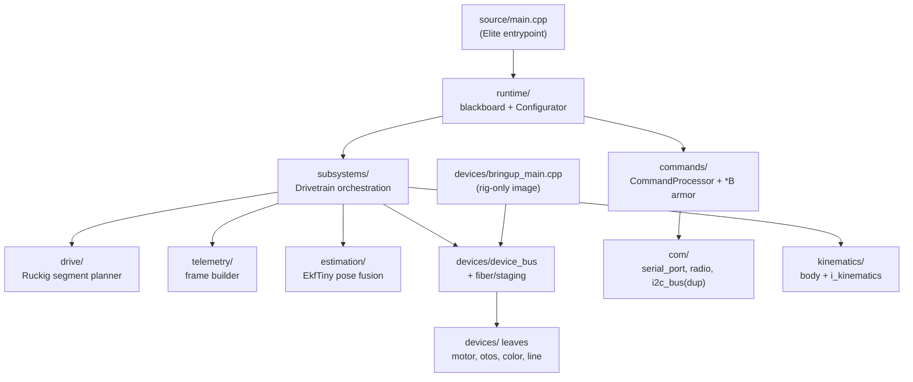
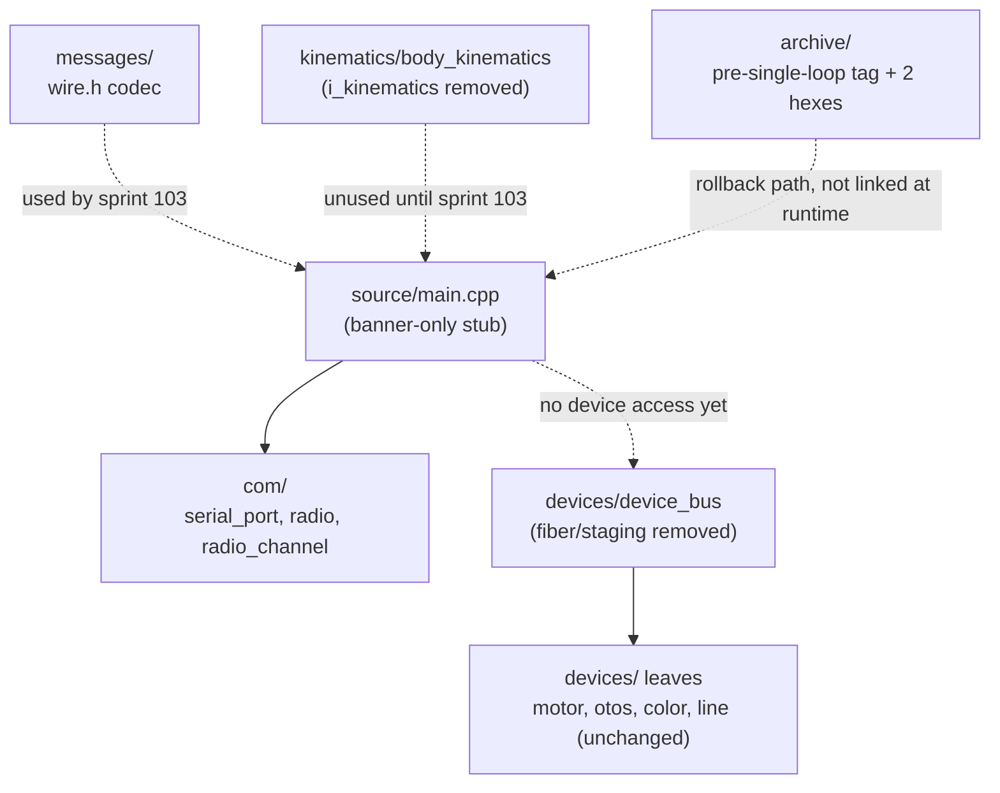
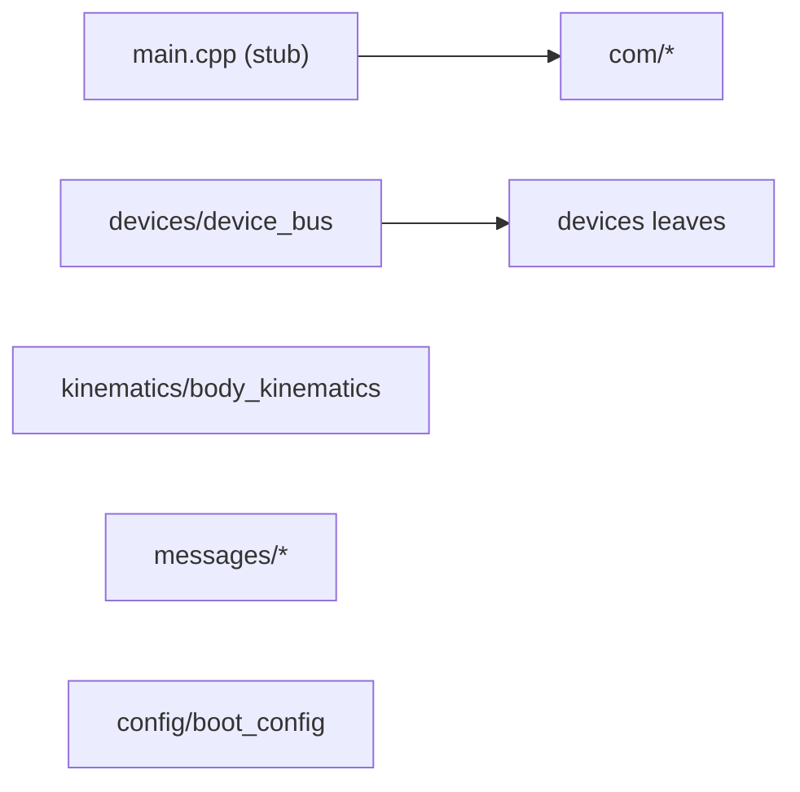

<!-- CLASI: Before changing code or making plans, review the SE process in CLAUDE.md -->

# Architecture Update — Sprint 102: Single-loop firmware: spikes, archive, and delete to stub (P0-P2)

## Step 1: Understand the Problem

The 2026-07-13/14 code review found that nearly every major DeviceBus defect
lives at the fiber boundary and in the Elite architecture's orchestration
plumbing (blackboard, router, Hal seam, Configurator, segment planner). The
stakeholder decided (2026-07-14) to stop planning trajectories on-robot: the
host will plan, the robot will follow as a velocity/yaw follower with
continuous, honest telemetry (`clasi/issues/single-loop-firmware-de-fiber-delete-the-elite-plumbing-telemetry-only-return-path.md`).
The stakeholder further decided to delete the old stack up front rather than
migrate it incrementally — the safety net is a git tag plus archived,
reflash-proven hexes, not parked code. A further stakeholder decision
(2026-07-14, later the same day) dropped the originally-planned serial
baud-ceiling spike: the radio relay is the robot's production interface and
its throughput is fixed, so raising the USB baud would only let the bench
diverge from the field. In its place, the relay telemetry-push spike now also
sets the shared telemetry rate budget for both transports — serial stays at
115200 and carries whatever cadence the radio sustains, never more (see
Step 6, Decision 6).

Sprint 102 is phases P0–P2 of that plan only: de-risk the delete with two
measurement spikes (P0), build the rollback artifacts (P1), then execute the
delete down to a banner-only stub (P2). It does **not** design or build the
new single-loop `main()`, the new wire protocol, or any host changes — those
are sprint 103 (P3–P4) and sprint 104 (P5–P6).

Current state verified against the actual tree at HEAD (`3f25f902`, this
branch, ahead of `master`): commit `3c4a8c0a` already deleted
`source/motion/`, `subsystems/nezha_hardware`, `hal/nezha/*`, `hal/otos/*`,
the four `hal/capability` faceplates, several dead CMake flags, and some
member-level dead code. A directory survey of `source/` confirms every
remaining item in the issue's delete list is still present exactly as
described, and every item in its keep list is present at the path named
(`com/{serial_port,radio,radio_channel}`, `devices/` core incl.
`i2c_bus.{h,cpp}`/`i2c_bus_host.cpp` — kept as CMake duplicate-symbol guards,
`kinematics/body_kinematics.*`, `types/{protocol.h,version_generated.h}`,
`config/boot_config.*`). No further inventory correction is needed beyond
what `sprint.md`'s Architecture Notes already state.

## Step 2: Identify Responsibilities

This sprint introduces very little new code — it is almost entirely
subtraction. The responsibilities in scope:

1. **Pre-delete risk verification** — two independent, non-destructive
   measurements (relay telemetry push — which also sets the shared telemetry
   rate budget for both transports, per the 2026-07-14 stakeholder decision —
   and wire-frame budget) that inform P4/P5 design decisions without touching
   production code. These change independently of each other (different
   subsystems: radio/serial path, proto/codegen) and are packaged as two
   separate tickets for that reason. (A third measurement, the serial
   baud-ceiling spike, was dropped by stakeholder decision — see Decision 6.)
2. **Rollback artifact custody** — tagging the pre-deletion commit and
   archiving two proven, flashable hexes so the delete is reversible without
   parked source. Changes for a different reason than the spikes (it's a
   release/ops concern, not a measurement), and is ordered strictly after
   P0 and strictly before P2 (P1 must archive the devicebus-bringup hex
   *before* P2 deletes the `codal.devicebus.json` build config that produces
   it — after that deletion, the config no longer exists to rebuild from).
3. **Structural contraction of the firmware tree** — removing the entire
   Elite orchestration stack (`runtime/`, `subsystems/`, `commands/`,
   `drive/`, `telemetry/`, `hal/` capability & sim & nezha remnants,
   `com/i2c_bus*` duplicate, `estimation/`, dead `types/`,
   `kinematics/i_kinematics.h`, fiber/staging machinery in `devices/`, dead
   vendored libs) and replacing the executable surface with a banner-only
   stub. This is one responsibility (one commit, one gate: flashable +
   bootable + inert) even though it touches many directories, because every
   file in it is being removed for the same reason — none of it survives
   the "host plans, robot follows" redesign, and partial deletion would
   leave a tree that neither builds as the old architecture nor as the new
   one.
4. **Matching test/build/host surface pruning** — the corollary of (3): dead
   pytest files, `tests/_infra/{sim,drive}`, build recipes, and config-sync
   maps that only existed to exercise or configure what (3) removes. Bundled
   into ticket 5 rather than split out, because a partial deletion (source
   gone, tests still referencing it) would leave the surviving pytest suite
   red — the gate for (3) requires it green.

## Step 3: Define Subsystems and Modules

Only one new module is introduced. Everything else in this section is either
unchanged (survives untouched), narrowed (an existing module loses
responsibilities), or removed outright.

### New

- **Boot Stub (`source/main.cpp`, replaced)** — Purpose: bring the board up
  and announce itself over serial, doing nothing else. Boundary: inside —
  `uBit.init()`, serial banner, an idle loop; outside — no device access, no
  motor energization, no command handling (that is sprint 103's `source/app/`).
  Serves SUC-005.

### Narrowed (interface shrinks, module stays)

- **DeviceBus (`source/devices/device_bus.{h,cpp}`, `handles.h`)** — Purpose:
  own I2C bus arbitration and per-device readiness scheduling for the leaf
  devices. Boundary: inside — bus transaction sequencing, `readyAt` safety
  net, leaf device handles; outside (removed this sprint) — the
  fiber/staging handoff machinery and `bringup_main.cpp`/`fiber_runner.h`
  entrypoints that drove it as a standalone image. Serves SUC-005. This
  module's leaf devices (`nezha_motor`, `otos`, `color_sensor`,
  `line_sensor`, `motor_armor`, `velocity_pid`, `clock*`, `measurement_ring`)
  are unchanged and are the foundation sprint 103 builds the new loop on.

### Unchanged (survive intact, no code touched this sprint)

- **Communication Primitives (`source/com/{serial_port,radio,radio_channel}`)**
  — Purpose: move bytes over USB serial and the radio, nothing else. Serves
  SUC-001 (measurement target for the relay/serial telemetry-rate spike, not
  modified by it) and remains the transport sprint 103/104 build on.
  (SUC-002, the serial baud-ceiling spike that also targeted this module, was
  dropped by stakeholder decision — see Decision 6; `serial_port`'s baud
  stays at the current default and is not exercised at alternate rates this
  sprint.)
- **Wire/Message Layer (`source/messages/`, generated from `protos/`)** —
  Purpose: encode/decode typed messages to/from wire bytes; enforce the
  envelope size ceiling via `wire.h` static_asserts. Serves SUC-003 as the
  pass/fail oracle. Not regenerated from pruned protos this sprint (the
  wire-frame budget spike is a scratch-branch dry run only).
- **Kinematics Primitives (`source/kinematics/body_kinematics.*`)** —
  Purpose: convert between body twist and wheel targets and back
  (`inverse()`/`forward()`). No use case in this sprint touches it; kept
  because P3 needs it.
- **Boot Config (`source/config/boot_config.*`)** — Purpose: hold
  per-robot calibration read at boot. Unchanged this sprint; the issue notes
  it will be slimmed in a later sprint (planner-emission fields drop when
  `gen_boot_config` is touched — not this sprint).
- **Protocol Types (`source/types/{protocol.h,version_generated.h}`)** —
  Purpose: shared wire-adjacent type definitions and the build-stamped
  version string. Unchanged.

### Removed (full responsibility, module deleted)

- **Runtime/Orchestration (`source/runtime/`)** — was: blackboard, tick
  ordering, Configurator. Removed because the two-plane blackboard model is
  exactly the "plumbing that hides behavior" the review flagged; sprint 103
  replaces it with a single sequential loop.
- **Subsystems (`source/subsystems/`)** — was: Drivetrain/hardware
  orchestration wrapping the leaf devices. Removed with Runtime; sprint 103's
  `Drive`/`Odometry`/`Preamble` in `source/app/` take over its job with a
  flat, non-fiber structure.
- **Commands (`source/commands/`)** — was: `CommandProcessor`, command
  routing, `binary_channel.cpp` (the `*B` armor codec). Removed as a module,
  but its one load-bearing piece — the armor/`msg::wire` codec — is
  transcribed out before deletion (SUC-005 step 1) because it is the only
  working framing implementation and sprint 103's `Comms` needs it.
- **Drive (`source/drive/`)** — was: the on-robot segment/trajectory
  planner (Ruckig-based). Removed outright — this is the literal
  "on-robot trajectory planning" the stakeholder decided to eliminate; no
  successor keeps this responsibility on the robot.
- **Telemetry (`source/telemetry/`)** — was: the old frame builder. Removed;
  sprint 103's `Telemetry` (always-on frame + ack ring) is a different
  design, not a port of this one.
- **Hal capability/sim/velocity-pid remnants (`source/hal/`)** — was: the
  capability-faceplate seam and simulation HAL. Removed; the review already
  took most of `hal/` in commit `3c4a8c0a`, this sprint takes the rest.
- **I2C Bus duplicate (`source/com/i2c_bus.{h,cpp}`,
  `source/com/i2c_bus_host.cpp`)** — was: a parked, superseded duplicate of
  `devices/i2c_bus`. Removed along with its sole test consumer,
  `tests/sim/unit/i2c_bus_clearance_harness.cpp`
  (`test_i2c_bus_clearance`).
- **Estimation (`source/estimation/`)** — was: `EkfTiny` on-robot pose
  fusion. Removed — the host fuses pose now, per the "host plans, robot
  follows" decision.
- **Dead Types (`source/types/{arg_schema,command_types,clock*,value_set}`)**
  — was: schema/registry types serving the deleted `commands/` module.
  Removed as orphans.
- **`i_kinematics.h` interface (`source/kinematics/i_kinematics.h`)** — was:
  an abstraction point with a single concrete implementation and no second
  implementor after `drive/` is gone. Removed as speculative generality that
  no longer has a caller.
- **Bring-up entrypoints (`source/devices/bringup_main.cpp`,
  `source/devices/fiber_runner.h`) + fiber/staging machinery inside
  `device_bus.{h,cpp}`/`handles.h`** — was: the standalone devicebus-bringup
  image's `main()` and the fiber-based staging handoff. The bringup
  *responsibility* (rig-only build) is retired as source; its last known-good
  *artifact* survives as an archived hex (P1) until sprint 103 reintroduces
  bring-up capability inside the new single loop.
- **Orphaned vendored libraries (`libraries/{ruckig,tinyekf,cmon-pid}`)** —
  were: dependencies of `drive/` (Ruckig), `estimation/` (TinyEKF), and the
  old PID consolidation (cmon-pid). Removed with their sole consumers, plus
  their CMake lines.
- **`codal.devicebus.json` + dead CMake flags/filters** — was: the
  standalone bring-up build target and stale conditional-compile flags
  (`BENCH_OTOS_ENABLED`, `PRODUCTION_BUILD`, `USE_ORDERED_TICK`, stale
  exclusion regexes, the `application_entry` block). Removed; P1 archives
  the hex this config last produced before the config itself is deleted.

## Step 4: Diagrams

### Component diagram — before this sprint (P0 start)

### Component diagram — after P2 (this sprint's end state)

Nodes removed entirely between the two diagrams (`Runtime`, `Subsystems`,
`Commands`, `Drive`, `Telemetry`, `Estimation`, `Bringup`, the `com/`
i2c_bus duplicate) are this sprint's deletion inventory; they do not appear
in the "after" diagram because they no longer exist in the tree.

### Dependency graph — after P2

No edges connect the five surviving nodes to each other beyond
`device_bus → leaves` — this sprint's deletion removes every cross-cutting
dependency the old orchestration layer introduced (nothing left depends on
`runtime/`, `subsystems/`, `commands/`, `drive/`, `telemetry/`, or
`estimation/`, because grep confirms zero surviving references after SUC-005's
final grep check). There is no cycle: `main.cpp` is the only node with
outward edges to more than one other node, and nothing points back to it.

## Step 5: Complete the Document

### What Changed

- P0: no code changes — two measurement spikes against current firmware,
  producing a knowledge-note update, a recommended common telemetry cadence
  for both transports (no baud change), and a wire-budget pass/fail verdict.
- P1: no source changes — a git tag and two archived hex binaries added
  under `archive/`.
- P2: `source/{runtime,subsystems,commands,drive,telemetry}` deleted in
  full; `source/hal/` deleted (remaining capability/sim/velocity_pid
  content — most of `hal/` was already removed in commit `3c4a8c0a`);
  `source/com/i2c_bus.{h,cpp}` + `i2c_bus_host.cpp` deleted;
  `source/estimation/` deleted; `source/types/{arg_schema,command_types,
  clock*,value_set}` deleted; `source/kinematics/i_kinematics.h` deleted;
  `source/devices/{bringup_main.cpp,fiber_runner.h}` deleted plus
  fiber/staging code inside `device_bus.{h,cpp}`/`handles.h`;
  `codal.devicebus.json` deleted; `libraries/{ruckig,tinyekf,cmon-pid}` and
  their CMake lines deleted; dead CMake flags/filters and the
  `application_entry` block deleted. `source/main.cpp` replaced with a
  ~50-line banner-only stub. Matching test/build/host surface pruned:
  `tests/_infra/{sim,drive}`, ~35 dead pytest files/harnesses,
  `tests/sim/unit/i2c_bus_clearance_harness.cpp`, `pyproject` testpaths,
  justfile `build-sim`/`build-drive` recipes, `check_config_sync` map.

### Why

Per the stakeholder's 2026-07-14 decision, the robot is becoming a
velocity/yaw follower with no on-robot trajectory planning. Nearly every
defect the 2026-07-13/14 review found lives inside the modules this sprint
removes (fiber boundary, blackboard/router/Configurator plumbing, segment
planner). Rather than migrate ~15,900 lines of code that implements a
discarded design, the stakeholder chose to delete it outright, with
reversibility provided by a tag and archived hexes instead of parked source.
P0's spikes exist because that delete is irreversible in the sense that
matters (no parked fallback code) — the two open questions (relay push
behavior, which also sets the shared telemetry rate budget; and wire budget)
must be answered before, not after, because P4/P5's design depends on their
answers and re-deriving them after the delete would mean re-adding
scaffolding that was just removed. (A third open question, the serial baud
ceiling, was closed by stakeholder decision instead of measurement — see
Decision 6.)

### Impact on Existing Components

- **`devices/` core (leaves, armor, PID, rings, I2CBus, preamble state
  machines)** — unchanged in this sprint except the removal of
  fiber/staging code from `device_bus.{h,cpp}`/`handles.h`; this narrows the
  class's public interface but does not change its bus-arbitration
  responsibility or the leaf devices sprint 103 will drive directly.
  Existing device-level unit tests (`devices_*`) are unaffected and stay
  green.
- **`messages/`** — untouched this sprint; the wire-frame budget dry run
  happens on a scratch branch that never merges, so the live generated
  headers and their `wire_*` tests are unaffected.
- **`com/{serial_port,radio,radio_channel}`** — untouched by P2; the P0(a)
  relay spike exercises them read-only to measure the sustainable telemetry
  rate on both the relay and direct-USB-at-115200 paths. No baud switch is
  exercised or committed to firmware this sprint or any later one — per the
  2026-07-14 stakeholder decision, serial stays at 115200 permanently and
  sprint 104 applies only the measured cadence, not a new baud.
- **Build system** — `CMakeLists.txt` loses the `codal.devicebus.json`
  target, the three vendored-library include lines, and several dead
  filter/flag lines. `just build` continues to produce the default hex;
  `just build-sim`/`build-drive` recipes are removed since their source
  trees no longer exist.
- **Host (`host/`)** — untouched by this sprint's code (host changes are
  sprint 104/P5), but its pytest surface loses the ~35 files/harnesses that
  exercised the deleted `drive/`/`telemetry/`/`estimation/` modules;
  `nav/`/`path/`/`controllers/` survive untouched as the future host
  planner's foundation.

### Migration Concerns

- **No data migration** — no persisted data model changes this sprint (P4's
  proto changes don't merge).
- **Deployment sequencing is the core risk this sprint manages**: P1 must
  complete (tag pushed, both hexes archived and reflash-proven) before P2
  runs, because P2 deletes `codal.devicebus.json` — the only source that
  builds the devicebus-bringup image. After P2, that image exists only as
  the archived binary until sprint 103 reintroduces bring-up capability
  inside the new single loop. This ordering is enforced by ticket
  dependencies (ticket 5 depends on tickets 1, 3, and 4 — ticket 2, the
  dropped baud spike, no longer exists in the dependency chain).
  Similarly, P0 must complete before P2, because both P0(a)'s measurement
  subject (current relay/serial behavior, and the shared rate budget it
  sets) and P0(b)'s budget numbers are needed to inform P4's protocol
  design — re-deriving them after the delete would require re-adding what
  was just removed, or waiting until sprint 103's partially-built loop
  exists to remeasure against, which is strictly worse for decision timing.
- **No firmware regression across P2's boundary in the sense that matters**:
  the stub never energizes motors, so "no working firmware" is scoped to
  "no working *motion* firmware" for exactly one commit — the boot/banner
  path is proven working before that commit lands (build + flash + banner
  is the P2 gate itself).
  ("No firmware regression" is not the standing project term — this is
  explicitly the opposite: the change is a controlled, one-commit inert
  window flanked by a tag and archived hexes as backward compatibility.)

## Step 6: Document Design Rationale

**Decision 1 — Delete up front, roll back via tag + archived hex, not
parked code.**
- *Context*: ~15,900 lines implement a discarded on-robot-planning
  architecture; every major review-flagged defect lives inside it.
- *Alternatives considered*: (a) incremental migration, keeping the old
  stack live behind a flag until the new loop matches its behavior; (b) park
  the old stack in a side directory/branch instead of deleting it.
- *Why this choice*: stakeholder decision 2026-07-14. Incremental migration
  (a) would require making the discarded design correct enough to serve as a
  parity oracle, which is exactly the effort the stakeholder is trying to
  avoid spending on code being thrown away. Parking (b) keeps ~15,900 lines
  of known-buggy code physically present, which the "greenfield rebuild"
  preference this project already follows explicitly rejects — parked code
  invites accidental reuse. A git tag plus two archived, reflash-proven
  hexes gives a stronger rollback guarantee than parked source (a tag is a
  point-in-time commit; parked code drifts and rots) at a fraction of the
  maintenance cost.
- *Consequences*: rollback restores the OLD firmware wholesale (whole
  behavior, whole bugs); there is no way to cherry-pick one old subsystem
  back without reverting to the tag and re-deriving the delete. This is
  accepted because the goal is a clean architectural break, not a hybrid.

**Decision 2 — Spikes (P0) strictly before delete (P2), delete strictly
before build (P3).**
- *Context*: two open questions (relay push behavior — which also sets the
  shared telemetry rate budget for both transports — and wire budget)
  directly shape the P4 protocol design and P5's host-side cadence
  application (no baud raise; see Decision 6).
- *Alternatives considered*: run the spikes concurrently with or after P2's
  delete, since they don't touch the modules being deleted.
- *Why this choice*: P0's relay spike (a) needs the *current, working*
  firmware as its measurement subject — deleting first would remove the
  working baseline it measures against (or force measuring against an inert
  stub, which produces no telemetry to measure). The wire-frame budget spike
  (b) has no hardware dependency but is grouped into P0 because both answer
  the same class of question — "is the new design's assumption viable" —
  before the design is committed to by deleting its alternative.
- *Consequences*: this sprint is strictly sequential (spikes → archive →
  delete) rather than parallelizable across P0/P1/P2; ticket dependencies
  enforce this (see Phase 4 tickets).

**Decision 3 — P2's delete lands as exactly one commit.**
- *Context*: the deleted modules cross-reference each other heavily
  (`subsystems/` depends on `drive/`, `telemetry/`, `estimation/`,
  `commands/`); a partial deletion leaves a tree that fails to build.
- *Alternatives considered*: delete subsystem-by-subsystem across several
  commits, each individually buildable.
- *Why this choice*: the interdependencies mean an individually-buildable
  intermediate state would require temporarily stubbing call sites inside
  modules that are about to be deleted anyway — wasted, throwaway work. A
  single commit keeps the "no working firmware" window to its true minimum
  (one commit) and matches the issue's explicit phase gate ("flashable image
  at every boundary" — P1 end and P2 end are the boundaries, not every
  file deleted in between).
- *Consequences*: the P2 commit is large and cannot be bisected internally;
  its correctness rests entirely on the ticket's exit gate (build + flash +
  banner + green pytest + empty grep), not on incremental review of smaller
  commits.

**Decision 4 — `devices/{i2c_bus_host,clock_host}.cpp` and
`com/i2c_bus_host.cpp` are treated differently despite similar names.**
- *Context*: both pairs look like host-build shims, inviting a single
  "delete all `*_host.cpp`" sweep.
- *Alternatives considered*: delete both host-side pairs uniformly.
- *Why this choice*: `devices/{i2c_bus_host,clock_host}.cpp` are load-bearing
  CMake duplicate-symbol exclusion guards for the *surviving*
  `devices/i2c_bus` and `devices/clock`, per the issue and this sprint's
  keep list — deleting them breaks the host build. `com/i2c_bus_host.cpp`
  is the host shim for the *deleted* `com/i2c_bus` duplicate and has no
  surviving consumer once `com/i2c_bus.{h,cpp}` is gone. The distinguishing
  fact is which sibling `.h`/`.cpp` survives, not the filename pattern.
- *Consequences*: ticket 5's acceptance criteria name both files explicitly
  (keep the `devices/` pair, delete the `com/` one) rather than relying on a
  glob, to prevent exactly this mix-up.

**Decision 5 — the stub `main.cpp` is not moved to `source/app/` or
`source/robot/`.**
- *Context*: sprint 103 will introduce `source/app/` for the new loop; a
  premature move now would touch build wiring twice.
- *Alternatives considered*: pre-create `source/app/` this sprint and put
  the stub there.
- *Why this choice*: `source/robot/` specifically is a trap —
  `build.py:85-90` treats that directory name as a dead generator trigger,
  so it must never be (re)introduced. `source/app/` is out of scope for
  this sprint's gate (a banner-only stub, not the new loop) — introducing
  the directory now without its real contents would be speculative
  generality the "greenfield rebuild" preference explicitly warns against
  (build the new tree fresh in the sprint that needs it, not ahead of it).
- *Consequences*: the stub stays at `source/main.cpp` (its current path);
  sprint 103 creates `source/app/` and wires it in when the real loop lands.

**Decision 6 — Serial baud stays fixed at 115200; the radio's measured
sustainable rate sets the shared telemetry cadence for both transports (no
baud-ceiling spike, no baud raise).**
- *Context*: the original P0 plan included a third spike (former ticket 002,
  SUC-002) to measure the highest safe baud on both the robot's DAPLink USB
  and the relay dongle's USB side, feeding a P4/P5 baud raise. The
  stakeholder revisited this on 2026-07-14 (later the same day as the
  original P0 plan approval).
- *Alternatives considered*: (a) keep the baud-ceiling spike and raise
  serial to whatever rate it proves safe, independent of the radio; (b) drop
  the spike and instead let the radio's measured sustainable rate (already
  being gathered by ticket 001's relay spike) set one shared cadence for
  both transports, with serial staying at its current 115200 default.
- *Why this choice*: the radio relay is the robot's production interface in
  the field; its throughput is fixed by hardware/protocol constraints the
  firmware cannot change. Raising serial's baud (a) would only widen the
  bench's bandwidth past what the field can ever have, so a design validated
  at the higher bench cadence could silently fail once deployed over radio —
  exactly the kind of hidden bench/field divergence this project's hardware
  bench-testing discipline exists to prevent. Option (b) closes that gap by
  construction: the telemetry cadence is derived from the weaker transport's
  measured capability (the minimum of the relay-sustained and
  115200-serial-sustained rates, with headroom), so anything that works on
  the bench is guaranteed to work in the field. It also removes an entire
  spike ticket (002) and its P4/P5 baud-raise follow-on work at zero cost to
  the sprint's other goals, since ticket 001 was already measuring direct-USB
  delivery as its comparison baseline.
- *Consequences*: `SerialPort::setBaud()` (`source/com/serial_port.cpp:70-82`,
  supporting 230400/921600/1M) is exercised by nothing in this sprint or its
  successors' current plans — it remains dead-but-present API, not deleted
  (out of scope for this sprint's delete inventory, which targets the Elite
  orchestration stack, not `com/serial_port`). Ticket 001's acceptance
  criteria now require it to report three numbers instead of one: the
  relay-sustained rate, the direct-USB-at-115200-sustained rate, and the
  recommended common cadence (their minimum, with headroom) — this is the
  number P4 (protocol) and P5 (host) must design to. Step 7's former open
  question 4 (baud recommendation hand-off) is withdrawn — there is no baud
  recommendation to hand off.

## Step 7: Flag Open Questions

1. **Devicebus-bringup rebuildability gap.** After P2 deletes
   `codal.devicebus.json`, the devicebus-bringup image can no longer be
   rebuilt from source — only reflashed from the archived hex (P1). If the
   rig needs a *modified* bringup image between P2 and sprint 103's
   reintroduction of bring-up capability, there is no source to modify.
   Flagging for stakeholder awareness; the plan already accepts this
   (P1's note: "rig keeps working through P3–P5" refers to the archived
   binary, not a rebuildable target).
2. **P0(a) contingency is unresolved by definition.** If the relay spike
   finds the `!GO` data plane hard-blocks pushed telemetry, the issue names
   two possible responses — fix the relay firmware, or fall back to
   host-paced polling — but does not pre-decide which. That decision belongs
   to whoever picks up sprint 103/104 (P4 design), informed by this sprint's
   ticket 1 verdict; it is out of this sprint's scope to resolve.
3. **The wire-frame budget spike (P0(b)) is a paper exercise this sprint;
   P4 still has to land it for real.** A passing `wire.h` static_assert on a
   scratch branch proves the *field layout* fits; it does not prove the
   generator/build wiring for the pruned protos is production-ready (that
   integration happens in sprint 103/104, ticket TBD). No action needed this
   sprint — noted so the successor sprint doesn't treat this spike's pass as
   more than a budget sanity check.
4. **WITHDRAWN (2026-07-14 stakeholder decision).** ~~Baud selection from
   P0(b) is not applied to firmware this sprint; flagging so the successor
   sprint's ticket list picks up the recommended value.~~ There is no longer
   a baud-ceiling spike or a baud recommendation to hand off — the
   baud-raise idea itself was dropped. Ticket 001's measured common
   telemetry cadence (see Decision 6) is what sprint 103/104 must consume
   instead; that hand-off is already covered by open question 2 and by
   ticket 001's acceptance criteria, so no separate open question remains
   here.
