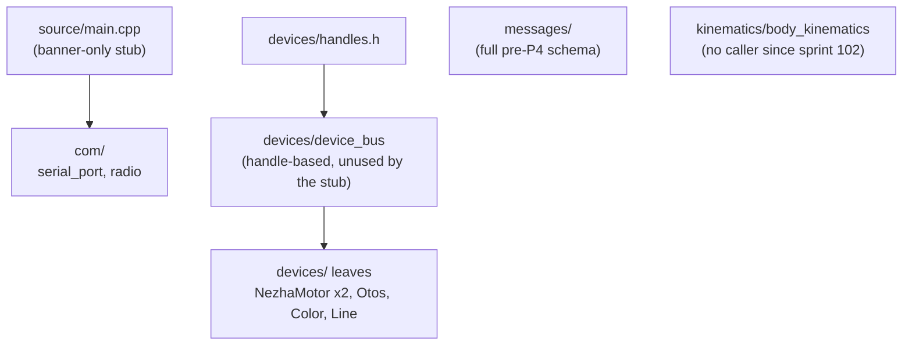
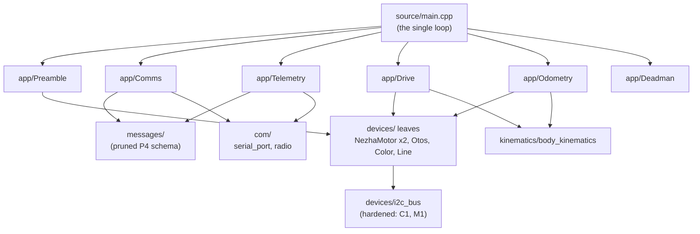
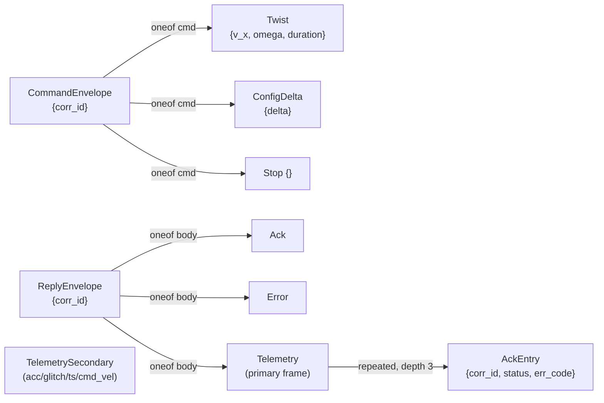
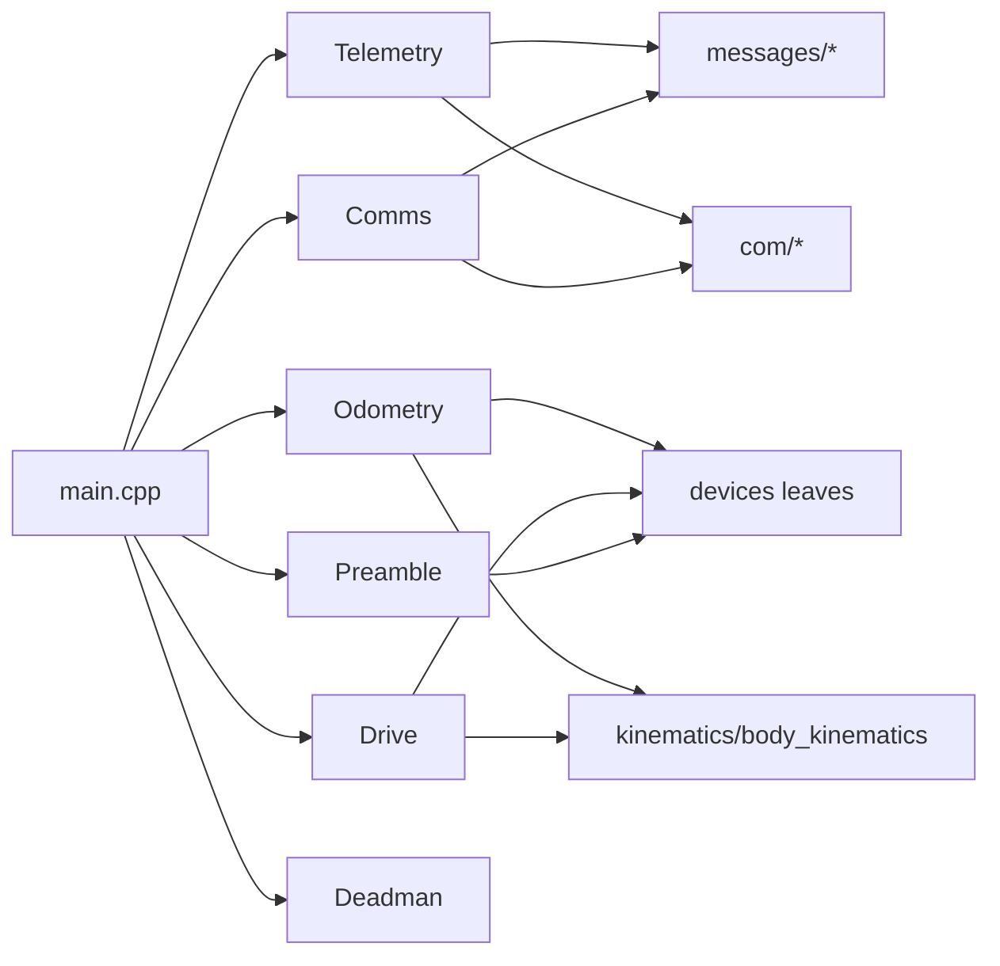

<!-- CLASI: Before changing code or making plans, review the SE process in CLAUDE.md -->

# Architecture Update — Sprint 103: Single-loop firmware: the loop, the wire, and first drive

## Step 1: Understand the Problem

Sprint 102 executed P0–P2 of the single-loop firmware rebuild: two
measurement spikes (relay telemetry push behavior, wire-frame budget),
rollback artifacts (a git tag + two archived hexes), and the delete-to-stub
commit that removed ~15,900 lines of the old Elite orchestration stack
(`runtime/`, `subsystems/`, `commands/`, `drive/`, `telemetry/`, `hal/`
remnants, `estimation/`, dead types). What remains at `source/main.cpp`
today is a ~50-line banner-only stub: it boots, announces itself, replies
to `HELLO`/`PING`, and touches no I2C bus and energizes no motor.

This sprint builds the real firmware on top of that stub: the single
foreground loop (`runAndWait`/`markTime`/`sleepUntil`) the archived plan
specifies, the pruned twist/config/stop wire protocol with an always-on
ack-ring telemetry return path, and — per the 2026-07-14 stakeholder hard
scoping rule ("every sprint ends bench-runnable") — enough of the host side
to actually drive the rig and prove it on the stand in this same sprint.

**A material finding from reading the actual tree (not just the archived
plan) drives this document's central decision.** The archived plan's
main-loop sketch constructs devices directly and says explicitly: *"leaves
own their hardware; no fiber, no handles, no staging layer"* — i.e., bare
`Devices::I2CBus`/`Devices::NezhaMotor`/`Devices::Otos`/etc., with a new
app-level `Preamble`/`Perception`/`Odometry` replacing whatever previously
sequenced them. But `source/devices/device_bus.h` — kept and narrowed
(not deleted) by sprint 102 — is a fully-built aggregate class,
`Devices::DeviceBus`, that already implements almost exactly this
sequencing: `runPreamble()` (a boot detection driver), `runCycleOnce()`
(request→settle→collect for both motors, a perception round-robin,
publish), and a `Motor`/`ColorSensor`/`LineSensor`/`Odometer` handle
surface (`handles.h`) as the only way callers are meant to reach the
leaves. Sprint 102's own architecture-update.md called `DeviceBus`
"the foundation sprint 103 builds the new loop on," which — read against
the archived plan's own explicit "no handles" sketch — is ambiguous about
which of two real, already-existing designs sprint 103 is supposed to
extend: the handle-mediated aggregate (`DeviceBus`), or the archived
sketch's bare-leaf composition. These are not compatible: `DeviceBus`'s
`runCycleOnce()` owns its own internal settle-sleep via a private
`Sleeper`, which the archived plan's `runAndWait` scheme requires the LOOP
to own instead (so `Comms::pump()`/`Telemetry::emit()` can borrow the
settle window) — `DeviceBus` as built cannot host that interleaving without
being restructured into something that is no longer really `DeviceBus`.
Decision 1 below resolves this in favor of the archived plan's explicit
wording and retires `DeviceBus`/`handles.h`. See Decision 1 for the full
argument and its consequences.

Also material: the current `protos/envelope.proto`/`telemetry.proto` still
carry the FULL pre-102 arm set (drive/segment/replace/pose_fix/otos/get/
stream/plan_dump on the command side; the STREAM/SNAP-era field set with no
`line`/`color` fields on the telemetry side). Sprint 102's spike-003 drafted
a pruned schema on an unmerged scratch branch (`scratch/102-003-frame-budget`)
and measured a hard number: ack ring depth 3 (179B) is the maximum that
fits the 186B envelope ceiling with the full primary-frame field set;
depth 4 requires a real trim. This sprint re-derives that schema for real
(merged, not scratch) rather than inheriting the draft's judgment calls
silently, per spike-003's own hand-off note.

## Step 2: Identify Responsibilities

1. **Wire protocol definition** — the pruned command-in/telemetry-out byte
   layout (`protos/*.proto` → generated `source/messages/*` and host
   `*_pb2`). Changes for schema/codegen reasons, independent of any
   firmware logic; ships first because every other C++ responsibility below
   depends on the generated types it produces.
2. **Existing device-leaf correctness hardening** (C1/M1) — a bug fix in
   code sprint 102 already decided to KEEP unchanged
   (`NezhaMotor`/`I2CBus`). Changes for a correctness/safety reason, not an
   architectural one; independent of every other responsibility here (it
   would be exactly the same fix even if this sprint built nothing new).
3. **Device-layer orchestration retirement** — deleting `DeviceBus`/
   `handles.h`. Changes for a structural-fit reason (Decision 1): the
   archived plan's bare-leaf composition supersedes it. Ordered before the
   new `source/app/` modules so there is only one device-access pattern in
   the tree at any commit, never two competing ones.
4. **Inbound command handling + the one safety rule** (`Comms`, `Deadman`)
   — converting wire bytes to a decoded command, and the single staleness
   rule that gates all actuation. These two are grouped because Deadman is
   armed/disarmed directly by what Comms decodes (a twist arms it, a stop
   disarms it) and neither is more than a few functions — splitting them
   into separate tickets would be over-fragmentation for two responsibilities
   this tightly coupled at the call-site level, even though they are
   logically distinct (framing vs. a safety timer).
5. **Outbound telemetry** (`Telemetry`) — assembling and emitting the
   always-on frame, the ack ring, fault/event bits, and the secondary
   slow frame. Its own responsibility because it is the highest-risk,
   most budget-constrained piece of this sprint (7B margin at ring depth
   3) and changes for reasons (wire budget, cadence) that are unrelated to
   why Comms or Drive would ever change.
6. **Actuation + on-robot dead-reckoning** (`Drive`, `Odometry`, minimal
   OTOS sampling) — converting a twist into wheel targets and wheel motion
   back into a world pose estimate. Grouped because both are thin wrappers
   around the same unchanged `BodyKinematics` primitives and both read
   (never own) the same two motor leaves each cycle.
7. **Boot-time device resolution** (`Preamble`) — sequencing each leaf's
   own already-existing detection state machine to a done() signal. Its
   own responsibility because it runs in a DIFFERENT loop (the boot loop)
   than everything above (the main cycle), with different call-order rules.
8. **Loop integration** (`main.cpp`) — wiring every module above into one
   sequential, per-cycle schedule using the `runAndWait`/`markTime`/
   `sleepUntil` primitives. Its own responsibility (composition only, no
   original logic) because it is the one place ticket ordering REQUIRES
   every other piece to already exist.
9. **Minimal host command surface** — `NezhaProtocol.twist()`/`stop()` +
   an ack-ring matcher, host-side. A different subsystem (Python, not
   C++) that changes independently of the firmware internals, coupled only
   through the wire schema (responsibility 1).
10. **Bench-gate verification** — not a code responsibility, but the
    sprint's actual Definition of Done; grouped last because it depends on
    everything above existing and flashed.

## Step 3: Define Subsystems and Modules

### New

- **Wire Protocol (`protos/envelope.proto`, `protos/telemetry.proto`,
  generated `source/messages/*`, host `envelope_pb2`/`telemetry_pb2`)** —
  Purpose: define the byte layout of every command in and telemetry frame
  out. Boundary: inside — field definitions, the generator's encode/decode
  tables, `wire.h`'s static-asserted size ceiling; outside — what any field
  MEANS to application code. Serves SUC-001.
- **Comms (`source/app/comms.{h,cpp}`)** — Purpose: convert an armored wire
  line into a decoded command, and a `ReplyEnvelope` into an armored wire
  line, one frame at a time. Boundary: inside — the `"*B"` armor/dearmor
  sequence (transcribed from the deleted `binary_channel.cpp`, per sprint
  102's transcription note), `msg::wire::encode()`/`decode()` calls;
  outside — deciding what a decoded command DOES (that is the loop's
  dispatch switch, `main.cpp`). Serves SUC-004.
- **Deadman (`source/app/deadman.{h,cpp}`)** — Purpose: gate every
  actuation source behind one staleness rule. Boundary: inside —
  `arm(duration)`/`disarm()`/`expired()` and the one timer they operate on;
  outside — what happens when it expires (the loop calls `drive.stop()`,
  `Deadman` itself never touches `Drive`). Serves SUC-004.
- **Telemetry (`source/app/telemetry.{h,cpp}`)** — Purpose: build and emit
  the always-on outbound frame. Boundary: inside — primary/secondary frame
  assembly, the depth-3 ack ring, fault/event bit encoding, cadence
  pacing; outside — deciding WHEN a fault occurred (callers — `I2CBus`'s
  safety net, `Deadman`'s trip — set the bit; `Telemetry` only carries it).
  Serves SUC-005.
- **Drive (`source/app/drive.{h,cpp}`)** — Purpose: convert a body twist
  into wheel velocity targets. Boundary: inside — staging `vL`/`vR` from
  `BodyKinematics::inverse()` onto the two `NezhaMotor` leaves' existing
  `setVelocity()` setter; outside — the kinematics math itself (stays in
  `BodyKinematics`, untouched) and the deadman decision (the loop calls
  `Drive::stop()`, `Drive` does not poll `Deadman`). Serves SUC-006.
- **Odometry (`source/app/odometry.{h,cpp}`)** — Purpose: integrate wheel
  motion into a world pose estimate. Boundary: inside — reading both
  motors' position deltas, calling `BodyKinematics::forward()`,
  accumulating `x`/`y`/`theta`; outside — fusing with OTOS/camera (host's
  job, unchanged by this sprint) and minimal OTOS sampling (below). Serves
  SUC-006.
- **Preamble (`source/app/preamble.{h,cpp}`)** — Purpose: sequence each
  leaf's own boot-time detection state machine to completion. Boundary:
  inside — calling order (`begin()`/`beginStep(nowUs)` at most once per
  `step()`) and a `done()` terminal signal; outside — each leaf's own
  detection retry logic (unchanged, leaves own it). Serves SUC-007.
- **Boot Stub → Loop (`source/main.cpp`, replaced)** — Purpose: wire every
  module above into one sequential, per-cycle schedule. Boundary: inside —
  construction order, the `markTime()`/`sleepUntil()`/`runAndWait()`
  primitives, the cycle body's fixed call sequence; outside — the internal
  behavior of anything it calls (composition only). Serves SUC-008 and,
  transitively, every use case in this sprint.
- **Minimal Host Command Surface (`host/robot_radio/robot/protocol.py`
  additions)** — Purpose: let a host script command a twist/stop and
  confirm its ack via telemetry, with no synchronous per-command reply.
  Boundary: inside — envelope construction for `twist`/`stop`, an ack-ring
  poll/match loop; outside — the full host realignment (legacy translator
  deletion, `rig_dev`/`rig_soak` rewrite — sprint 104). Serves SUC-009.

### Narrowed (interface unchanged, internal correctness improved)

- **NezhaMotor / I2CBus (`source/devices/{nezha_motor,i2c_bus}.{h,cpp}`)**
  — Purpose unchanged (drive one motor channel safely / arbitrate I2C
  transactions safely). Internal change only: `writeRawDuty()` commits
  write-path state on success only (C1); the clearance safety net degrades
  to a telemetry fault bit instead of an undetected silent busy-spin risk
  (M1, now that the LOOP, not `I2CBus`, owns the real clearance gaps via
  `runAndWait`). Serves SUC-002.

### Removed (full responsibility, module deleted — Decision 1)

- **DeviceBus (`source/devices/device_bus.{h,cpp}`)** — was: fiber-owned
  (pre-102)/then single-loop-narrowed (102) cycle orchestration —
  `runPreamble()`, `runCycleOnce()` (request→settle→collect for both
  motors + perception round-robin + publish, pacing its OWN sleep
  internally), `neutralizeAllMotors()`. Removed because its internal,
  opaque pacing cannot host the archived plan's `runAndWait` interleaving
  (Comms/Telemetry work borrowing the settle window) without becoming a
  different class in practice — and the archived plan explicitly specifies
  bare-leaf construction instead. Its responsibilities are redistributed:
  boot detection → new `Preamble`; per-cycle motor service → the loop's own
  `runAndWait` blocks calling `NezhaMotor` directly; perception → folded
  into `Drive`/`Odometry`'s ticket as a minimal OTOS-only read (Step 7 open
  question on `line`/`color`); staged-input safety → `Deadman` (a narrower,
  single-purpose replacement for `DeviceBus`'s stale-target neutralize
  gate).
- **handles.h (`source/devices/handles.h`)** — was: the `Motor`/
  `ColorSensor`/`LineSensor`/`Odometer` indirection layer, `DeviceBus`'s
  sole reason to mediate access to the leaves. Removed with `DeviceBus`
  (no remaining caller).

### Unchanged (survive intact, no code touched this sprint)

- **Device leaves minus NezhaMotor/I2CBus (`Otos`, `ColorSensorLeaf`,
  `LineSensorLeaf`, `MotorArmor`, `VelocityPid`, `Clock`,
  `MeasurementRing`, `interpolation.h`, `device_config.h`,
  `device_types.h`)** — Purpose: each owns one device's register-level
  protocol and, where applicable, its own detection state machine. No
  interface or behavior change this sprint; `Preamble` and `Drive`/
  `Odometry` become their new (only) callers in place of `DeviceBus`.
- **Kinematics Primitives (`kinematics/body_kinematics.*`)** — Purpose:
  convert between body twist and wheel targets and back. Unchanged; this
  sprint is its first real caller since `i_kinematics.h`/`drive/` were
  deleted (sprint 102).
- **Communication Primitives (`com/{serial_port,radio,radio_channel}`)**
  — Purpose: move bytes over USB serial and the radio. Unchanged; `Comms`
  and `Telemetry` become their callers.
- **Boot Config (`config/boot_config.*`)** — Purpose: hold per-robot
  calibration baked at build time. Unchanged this sprint (Step 7 flags a
  latent `kMotorConfigCount=4` vs. this robot's 2-motor differential target
  as a pre-existing, not-this-sprint's-fault mismatch).

## Step 4: Diagrams

### Component diagram — before this sprint (sprint 102 end state)

### Component diagram — after this sprint

`DeviceBus`/`handles.h` do not appear in the "after" diagram — they no
longer exist in the tree (Decision 1). `Deadman` has no outgoing edges to
`Leaves`/`Kinematics`/`Messages` — it is a pure timer the loop consults,
matching its narrow boundary in Step 3.

### Message composition (wire shape, not a persisted-entity ER diagram —
this sprint changes wire schema, not stored data)

`TelemetrySecondary`'s own edge back onto the wire (a second `*B` line vs.
a `ReplyEnvelope` oneof arm) is Step 6 Decision 3's open call for ticket
001 to make — shown here as a standalone node, not yet wired to either
parent, matching that decision's actual undecided state at planning time.

### Dependency graph — after this sprint

No cycles: `Main` is the only node with outward edges to more than two
other nodes (it is the composition root — see Design Quality/Coupling
below for why this fan-out of 6 is accepted rather than flagged as a
god-component smell). Nothing points back to `Main`. `Leaves`,
`Messages`, `Com`, `Kinematics` have no outward edges of their own —
they are the dependency graph's stable base, matching the required
`[Presentation] → [Domain] → [Infrastructure]` direction (`app/*` is the
domain layer here; `devices/`, `com/`, `messages/`, `kinematics/` are
infrastructure/primitives).

## Step 5: Complete the Document

### What Changed

- **Wire protocol**: `protos/envelope.proto`/`telemetry.proto` pruned to
  twist/config/stop + an ack-ring telemetry return path; every other
  pre-102 command arm deleted (reserved, not reused); `source/messages/*`
  and host `*_pb2` regenerated; wire test harnesses rewritten against the
  pruned schema.
- **Device leaves**: `NezhaMotor::writeRawDuty()` and `I2CBus`'s clearance
  handling hardened (C1, M1) — no interface change, `devices_*` unit tests
  unaffected.
- **Device orchestration**: `Devices::DeviceBus` and `handles.h` deleted;
  their C++ test harnesses deleted with them.
- **New `source/app/`**: `Comms`, `Deadman`, `Telemetry`, `Drive`,
  `Odometry` (+ minimal OTOS sampling), `Preamble` — six small modules,
  each driving the bare `devices/` leaves directly.
- **`source/main.cpp`**: replaced with the real single loop —
  telemetry-emitting boot loop, then the `runAndWait`/`markTime`/
  `sleepUntil` main cycle per the archived plan.
- **Host**: `NezhaProtocol` gains `twist()`/`stop()` builders and an
  ack-ring matcher; one new `tests/bench/` drive script.

### Why

Per the 2026-07-14 stakeholder decision (sprint 102), the robot becomes a
velocity/yaw follower with no on-robot trajectory planning and
continuous, honest telemetry. Sprint 102 cleared the ground; this sprint
builds the replacement. The DeviceBus/handles.h retirement (Decision 1) is
this sprint's own finding, not a pre-decided stakeholder instruction — it
resolves a genuine conflict between two existing, incompatible designs by
following the archived plan's explicit wording over a same-repo class that
predates the "no fiber, no handles, no staging layer" framing.

### Impact on Existing Components

- **`devices/` leaves (minus NezhaMotor/I2CBus)** — no code change; a NEW
  caller (`app/Preamble`, `app/Drive`, `app/Odometry`) replaces the OLD
  caller (`DeviceBus`). Their own public surface (`begin()`,
  `beginStep(nowUs)`, `setVelocity()`, `position()`, etc.) is exactly what
  this sprint's `app/` modules already assume — confirmed against the
  actual headers, not the archived plan's prose, during this sprint's own
  planning research.
- **`kinematics/body_kinematics.*`** — gains its first real caller since
  `i_kinematics.h`/`drive/` were deleted; no code change (its API already
  matches `Drive`/`Odometry`'s needs exactly — `inverse()`/`forward()` with
  the exact signature this sprint's modules call).
- **`com/{serial_port,radio,radio_channel}`** — gains `Comms`/`Telemetry`
  as new callers; no code change (their existing `readLine()`/`send()`/
  `sendReliable()`/`poll()`/`send()` surface is sufficient).
- **`config/boot_config.*`** — unchanged; `main.cpp` calls its existing
  `defaultMotorConfigs()`/`defaultDrivetrainConfig()` (Step 7 flags the
  `kMotorConfigCount=4` vs. 2-motor-differential mismatch as pre-existing,
  not a regression this sprint introduces).
- **Host (`host/robot_radio/`)** — `NezhaProtocol` gains two new methods
  and an ack-matcher; every EXISTING method (the large pre-built binary/
  text surface: `drive()`/`arc()`/`vw()`/`get_config()`/etc.) is left in
  place this sprint even though most of it now targets deleted wire arms —
  its deletion is explicitly sprint 104 scope (Migration Concerns below).
- **`tests/bench/{rig_dev,rig_soak,device_bus_bringup}.py`,
  `tests/unit/test_device_bus_bringup_bench.py`** — untouched this sprint;
  they will not run against this sprint's firmware (they assume the
  retired wire arms and/or `DeviceBus`'s bringup image) until sprint 104
  rewrites them (continuation issue P6). Accepted per this sprint's own
  Out of Scope.

### Migration Concerns

- **No data migration** — no persisted data model; only the wire schema
  changes, and it changes in a non-additive way (arms deleted, not just
  added) — this is a breaking wire change, mitigated by the fact that BOTH
  firmware and the host's new minimal slice ship together in this sprint
  (nothing that speaks the old schema needs to keep working against new
  firmware, and vice versa, once this sprint's bench gate passes).
- **Host tooling breaking change, deliberately incomplete this sprint**:
  most of `NezhaProtocol`'s existing methods (drive/arc/vw/segment/etc.)
  will fail against this sprint's firmware (their target wire arms are
  deleted). This sprint does not fix that — it is sprint 104's full P5
  realignment. Any workflow relying on those methods against a robot
  flashed with this sprint's firmware breaks until sprint 104. This is an
  accepted, scoped-out consequence (sprint.md Out of Scope), not an
  oversight — the alternative (deleting the dead methods this sprint) was
  considered and rejected (Decision 4) as scope creep against an
  already-large sprint.
- **Deployment sequencing**: ticket 001 (wire protocol) must land before
  every `source/app/` ticket (004–007) — they compile against its
  generated types. Ticket 003 (DeviceBus retirement) should land before
  004–007 so there is never a commit with two competing device-access
  patterns. Ticket 008 (main.cpp) depends on all of 002/004/005/006/007.
  Ticket 009 (host slice) depends only on 001 (schema) and can be authored
  in parallel with 002–008 if a future execution pass chooses to
  parallelize despite this plan's serial ticket order; ticket 010 (bench
  gate) is strictly last. Per the sprint's own hard scoping rule, mid-sprint
  tickets may leave the firmware build broken between 001 and 008 landing
  (no stub-main ceremony) — only the ticket 010 gate must pass.
- **Rollback**: unchanged from sprint 102's posture — the `pre-single-loop`
  tag and archived hexes remain the rollback path if this sprint's own
  firmware needs to be abandoned; this sprint adds no new rollback
  mechanism of its own (a mid-sprint revert is a normal git revert of this
  sprint's branch, not a hex-reflash scenario, since — per the hard
  scoping rule — only the FINAL state need work).

## Step 6: Document Design Rationale

**Decision 1 — Retire `Devices::DeviceBus`/`handles.h`; `source/app/`
drives the bare leaves directly.**
- *Context*: two incompatible, already-existing designs both claim to be
  "the foundation sprint 103 builds on" — the archived plan's explicit
  bare-leaf sketch ("no fiber, no handles, no staging layer") and
  `DeviceBus`'s own already-narrowed (by sprint 102) but still
  handle-mediated, internally-paced `runCycleOnce()`.
- *Alternatives considered*: (a) build `source/app/` ON `DeviceBus`'s
  existing `runPreamble()`/`runCycleOnce()`/handle surface, treating the
  archived plan's "no handles" wording as stale prose superseded by
  `DeviceBus`'s later construction; (b) extend `DeviceBus` with a
  callback-injection seam (e.g. `runCycleOnce(duringSettle1, duringSettle2)`)
  so the archived plan's `runAndWait` interleaving could happen INSIDE
  `DeviceBus`'s existing settle windows without retiring the class.
- *Why this choice*: (a) is rejected because `DeviceBus::runCycleOnce()`'s
  settle-sleep is a private implementation detail (`Sleeper::sleepMillis()`
  called from `serviceMotor()`, itself private) — the app layer has no way
  to run `Comms::pump()`/`Telemetry::emit()` during that window without a
  structural change to `DeviceBus` itself, which means the class would stop
  being the thing sprint 102 built and reviewed. (b) is rejected as
  needless indirection: the callback seam would only ever be called by
  exactly one caller (`main.cpp`), so the interface exists to satisfy an
  abstraction with a single implementation and a single call site — the
  "reuse the existing class" motivation dissolves once the callback
  parameters are the SAME two things (`Comms::pump`, `Telemetry::emit`)
  every real call site would ever pass, at which point a thin loop calling
  the leaves directly is simpler code, not more. The archived plan's
  wording is explicit enough ("no handles, no staging layer" is not
  ambiguous) that this sprint follows it as the load-bearing sketch, with
  `DeviceBus` understood as a superseded, pre-archived-plan design
  iteration that sprint 102 correctly narrowed (fiber removal) but did not
  fully retire because that was out of sprint 102's own scope.
- *Consequences*: ~700 lines of already-written, already-reviewed
  `DeviceBus`/`handles.h` code and its dedicated test harness
  (`device_bus_cycle_harness.cpp`/`test_device_bus_cycle.py`) are deleted,
  not reused — a real cost, accepted because keeping it around
  unreferenced would violate the project's greenfield/no-dead-code
  preference and because its perception round-robin/staged-input-safety
  responsibilities are cleanly redistributed to smaller, single-purpose
  `app/` modules (`Preamble`, `Deadman`) rather than lost. `DeviceBus`'s
  4-channel-ready construction signature (`motor1Config`, `motor2Config`)
  and its `OtosProbeDiag` bench-triage struct are also lost — if a future
  sprint needs OTOS probe diagnostics again, it is rebuilt against
  `Preamble`, not recovered from git history (the same "delete up front,
  don't park" posture sprint 102's own Decision 1 already established for
  the Elite stack).

**Decision 2 — Ship ack-ring depth 3, not the continuation issue's stated
4–8 target.**
- *Context*: spike-003 measured, with a real `gen_messages.py` run
  (not arithmetic), that depth 3 (179B) is the maximum that fits the 186B
  ceiling against the primary frame's current field set; depth 4 needs a
  real trim (`active`/`conn_left`/`conn_right`, 9B) that lands at exactly
  186B with zero margin.
- *Alternatives considered*: (a) trim `active`/`conn_left`/`conn_right` out
  of the primary frame to reach depth 4 at zero margin; (b) also trim
  `otos`/`otos_connected` (freeing ~21B) to reach depth 5+ with real
  margin; (c) ship depth 3 as spike-003 recommended.
- *Why this choice*: (a)'s zero margin is fragile per spike-003's own
  explicit warning — the next field this sprint or sprint 104 needs to add
  (e.g. a fault-bit width increase) would immediately blow the budget
  again, and `active`/`conn_left`/`conn_right` are exactly the fields
  `.claude/rules/hardware-bench-testing.md`'s "sensors are alive"
  gate reads at full rate, making them poor trim candidates. (b) is
  rejected for this sprint specifically because `otos`/`otos_connected`
  ARE this sprint's own bench-gate signal (SUC-006/SUC-010 — OTOS
  perception feeds telemetry this sprint) — trimming them now would remove
  a field this sprint's own gate needs, for a ring-depth increase this
  sprint does not need (3 is enough for one twist + one stop in flight with
  a spare slot). (c) is chosen: it is below the continuation issue's stated
  4–8 target, which this document flags explicitly (per the issue's own
  instruction) rather than silently splitting the difference.
- *Consequences*: a client that sends commands faster than roughly one
  per ~3 telemetry frames risks a ring wrap before it observes an ack for
  an older command. At the 25 Hz/40ms cadence this sprint targets, that is
  one ack lost only if 3+ commands are sent within ~120ms with no telemetry
  read in between — not a realistic pattern for this sprint's own bench
  gate (single twist, single stop, read continuously) but a real
  constraint sprint 104's host realignment must respect when designing its
  own command pacing.

**Decision 3 — `TelemetrySecondary`'s wire framing is decided by ticket
001, not pre-decided here.**
- *Context*: spike-003 measured `TelemetrySecondary` at 52B standalone but
  explicitly left open HOW it rides the wire (a second `*B`-armored line,
  a new `ReplyEnvelope` oneof arm, or something else) — flagged as "not a
  design recommendation," just a real byte count for whichever shape
  ticket 001 picks.
- *Alternatives considered*: (a) a second, independently-armored `*B` line
  emitted on its own cadence slot; (b) a new `ReplyEnvelope.body` oneof arm
  (`tlm2`), riding the same envelope-per-line framing as `tlm`.
- *Why this choice*: left to ticket 001's own implementation — this
  document does not pre-decide it because doing so without the ticket's
  own real `gen_messages.py` measurement would repeat spike-003's own
  flagged mistake (treating a hypothetical wrapping as a recommendation).
  Ticket 001's acceptance criteria (SUC-001) require the decision to be
  made AND documented, not deferred again.
- *Consequences*: none yet — this is a placeholder decision resolved
  during ticket 001's own execution, recorded here as an explicit gap
  rather than an implicit one.

**Decision 4 — Do not delete `NezhaProtocol`'s existing (soon-dead)
methods this sprint.**
- *Context*: pruning `protos/envelope.proto` orphans most of
  `NezhaProtocol`'s existing binary/text methods (drive/arc/vw/segment/
  turn/go_to/etc.) — their target wire arms no longer exist.
- *Alternatives considered*: (a) delete the orphaned methods in this
  sprint, alongside the schema prune, so the host tree never contains
  dead-target code; (b) leave them in place, deleting only in sprint 104.
- *Why this choice*: (b) — deleting ~30 methods across `protocol.py`/
  `cli.py` and their call sites is real, separable work matching the
  continuation issue's own P5 scoping ("host realignment... legacy
  translator deletion... sprint 104"), not incidental cleanup this
  sprint's tickets can absorb without threatening the hard scoping rule
  (every sprint ends bench-runnable — this sprint's own bench gate needs
  exactly two NEW host methods, not a clean host tree). Sprint 103 adding
  `twist()`/`stop()` alongside the now-dead methods is a real but bounded
  and explicitly-flagged inconsistency, not a silent one.
- *Consequences*: `host/robot_radio/robot/protocol.py` briefly contains
  both live (twist/stop/ping/echo/id/hello/ver/help — the six-verb text
  rump plus this sprint's two new binary verbs) and dead (drive/arc/vw/
  segment/turn/go_to/stream/etc. — anything targeting a deleted
  `CommandEnvelope` arm) methods until sprint 104. Any host script calling
  a dead method against this sprint's firmware gets a decode error from
  firmware (`ERR_UNKNOWN`/`ERR_DECODE`), not a host-side failure — an
  acceptable, temporary state per the Migration Concerns section above.

## Step 7: Flag Open Questions

1. **`line`/`color` steady-state telemetry: not wired this sprint, no
   field exists to wire them to.** The current `telemetry.proto` (and
   spike-003's pruned draft) carries no `line=`/`color=` fields at all —
   this predates sprint 103 and is not something this sprint removes. The
   archived plan's full 3-way `Perception` round-robin (otos|line|color)
   is therefore built OTOS-only this sprint (SUC-006); `Preamble` still
   detects line/color presence at boot (boot telemetry reports it), but no
   steady-state raw value reaches the wire. If `.claude/rules/
   hardware-bench-testing.md`'s standing "line sensor 4 channels, color
   sensor RGBC" gate needs to be satisfied by TELEMETRY specifically (vs.
   by boot-time presence detection), a future sprint must add `line`/
   `color` fields to the schema first — this document does not commit to
   when.
2. **`config/boot_config.h`'s `kMotorConfigCount=4` vs. this sprint's
   2-motor differential target.** `defaultMotorConfigs()` fills a 4-entry
   array (mecanum-ready); `main.cpp` this sprint constructs exactly two
   `NezhaMotor`s. This mismatch pre-dates this sprint (`boot_config.h`'s
   own header comment already notes it must equal
   `Subsystems::NezhaHardware::kMotorCount`, a type that no longer exists
   post-102) and is not blocking — `main.cpp` uses `out[0]`/`out[1]` for
   L/R and ignores `out[2]`/`out[3]`. Flagging for whichever future sprint
   next touches `boot_config`/`gen_boot_config.py` (sprint 102's own Step 5
   already noted this file "will be slimmed in a later sprint").
3. **`ConfigDelta`/`config` command arm: schema exists, runtime wiring is
   ticket-time discretion.** SUC-001 keeps `ConfigDelta config` as a
   `CommandEnvelope` oneof arm (the continuation issue's P4 scope names
   it), but this document does not commit any ticket to applying it at
   runtime this sprint — `Comms`/`main.cpp`'s dispatch switch may decode
   it and reply `ERR_UNIMPLEMENTED` (matching the project's own established
   "schema now, runtime later" precedent, e.g. 095/096's config/get/stream
   arms) if ticket 008's own acceptance criteria don't require live config
   application for the bench gate. This is a ticket-008-time decision, not
   pre-decided here, because it does not affect this sprint's Success
   Criteria (twist + ack + deadman), only whether `SET`-equivalent
   behavior exists this sprint or next.
4. **`TelemetrySecondary`'s cadence relative to the primary frame** —
   Decision 3 leaves the WIRE FRAMING open; the CADENCE (does it ride every
   Nth primary frame, or its own independent 25 Hz stream, competing for
   the same ~186B/~40ms budget) is a related but separate ticket-005
   decision, also not pre-decided here.
5. **Sprint 102's flagged pacing gap** (~30.3 Hz armed vs. ~26.8 Hz actual,
   spike-001) is explicitly NOT root-caused by this document — ticket 005
   re-measures the NEW loop's own emission pacing as its own acceptance
   criterion; this sprint does not promise to match or explain the old
   loop's number, only to measure its own.
