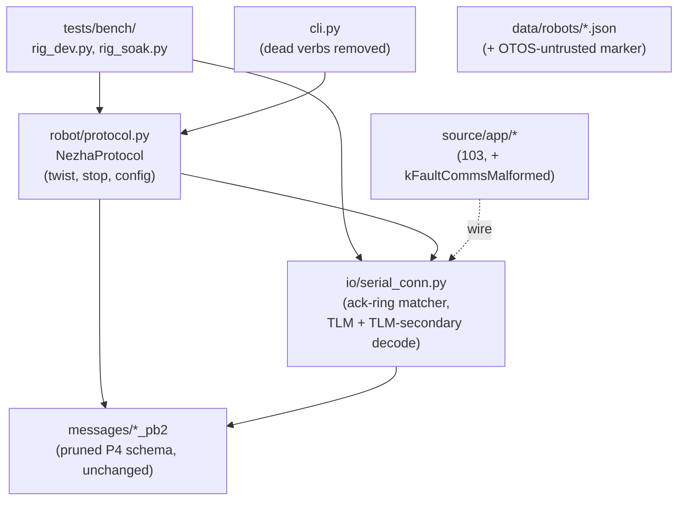
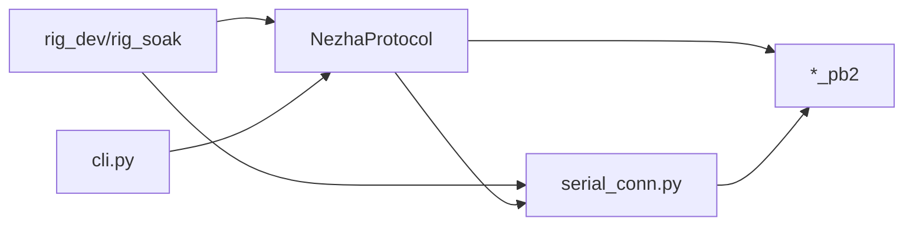
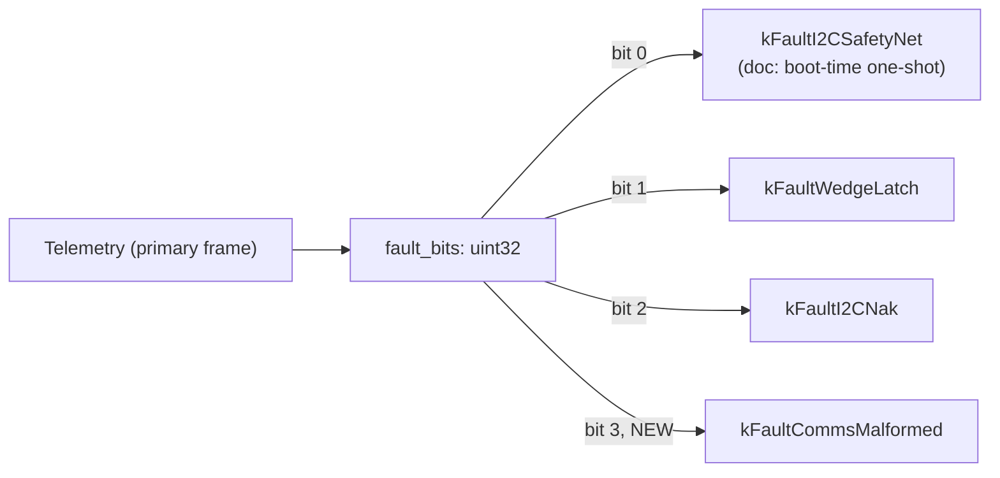

<!-- CLASI: Before changing code or making plans, review the SE process in CLAUDE.md -->

# Architecture Update — Sprint 104: Host realignment and full bench gate

## Step 1: Understand the Problem

Sprint 103 built and proved the single-loop firmware on real hardware: the
`runAndWait` main loop, the pruned twist/config/stop wire protocol with a
depth-3 ack-ring telemetry return path, and — per the stakeholder's hard
scoping rule — just enough host tooling (`NezhaProtocol.twist()`/`stop()`
+ an inline ack-ring matcher) to drive the rig and pass a bench gate in
that same sprint. 103's own architecture-update.md (Decision 4, Migration
Concerns) is explicit that this leaves the host tree in a deliberately
incomplete, partially-broken state: ~30 `NezhaProtocol`/`SerialConnection`
methods (drive/arc/vw/segment/turn/go_to/stream/pose_fix/etc.) still exist
in `host/robot_radio/` targeting `CommandEnvelope` oneof arms that 103's
schema prune deleted. Measured directly against the merged 103 tree
(2026-07-14): `uv run python -m pytest tests/unit` reports **112 failed, 5
errors, 297 passed** — almost entirely these orphaned methods and the
tests written against them.

103 ticket 010's bench gate also surfaced two real, small firmware gaps
that were flagged but not fixed in-sprint (out of that ticket's own
"verification only" scope): `Comms::malformedCount_` has existed since
103-004 with an explicit comment promising it would be "surfaced later as
a Telemetry fault bit (ticket 005)" — 103-005 did not do this (confirmed
by reading `telemetry.h`: only bits 0-2 are claimed). And
`kFaultI2CSafetyNet` was observed to be a boot-time one-shot latch (fires
once during `Preamble`, never again), a behavior the bit's own doc comment
does not yet state, risking a future bench reader chasing a healthy
`fault=1` as a live defect.

Separately, `clasi/issues/rig-persistent-otos-distrust.md` flags that the
bench rig's OTOS is mechanically decoupled from the wheels — under the
pre-103 architecture this required a manual per-session `SET` ritual.
103-010's own bench session drove the rig cleanly with **no** manual SET,
first-hand evidence the failure mode's root cause (an on-robot EKF gating
motion on a poisoned fused pose) is structurally gone under the new
architecture (the robot no longer fuses pose at all). What is NOT yet
in place is a persisted, version-controlled marker that the rig's OTOS is
untrusted, for the host-side fusion sprint 106 will eventually build to
read — this sprint adds that marker without building fusion logic that
doesn't exist yet.

This sprint (P5 remainder + P6 of the continuation issue) finishes what
103 deliberately deferred: complete the host command surface, delete what
no longer has a firmware target and fix or retire everything that breaks
as a result, harden the ack-ring matcher into a shared location, wire the
two flagged fault-bit follow-ups, persist the OTOS-distrust marker, and
rewrite the bench-script family (`rig_dev.py`/`rig_soak.py`) onto the
binary plane — then prove the whole stack survives sustained (not just
smoke-duration) load on both transports.

## Step 2: Identify Responsibilities

1. **Host command surface completion** — the `config` builder
   (`NezhaProtocol.config()`), the last `CommandEnvelope` arm from 103's
   schema without a host-side builder. Changes for the same reason 103's
   `twist()`/`stop()` did (SUC-011); grouped separately from deletion
   below because it is additive, not destructive, and can land first with
   no dependency on the deletion sweep.
2. **Legacy translator and dead-verb deletion** — removing ~30 orphaned
   methods across `protocol.py`/`serial_conn.py`/`cli.py` and
   triaging every currently-failing `tests/unit` test (fix if it targets a
   live arm, delete if it targets a dead one). Its own responsibility
   because it is a large, mechanical sweep that changes for a completely
   different reason (dead code, not new capability) than responsibility 1;
   ordered after 1 so the two "does this method still target something
   real" questions (config lands as live, everything else is triaged as
   dead) are never open at the same time on the same file.
3. **Ack-ring matcher hardening + `TelemetrySecondary` consumption** —
   promoting 103's inline matcher into `serial_conn.py` as the one shared
   implementation, and decoding the secondary telemetry frame. Grouped
   together because both live in the same file and both are "make the
   telemetry-consumption surface complete," distinct from responsibility 2
   (deletion) and responsibility 1 (a new command builder) — this is
   telemetry IN, not commands OUT.
4. **Firmware fault-bit follow-ups** — `kFaultCommsMalformed` (new bit,
   wired from the already-existing `Comms::malformedCount()`) and the
   `kFaultI2CSafetyNet` doc-comment correction. Its own responsibility
   because it is the only firmware (C++) work in an otherwise host-only
   (Python) sprint, and changes for a correctness/observability reason
   unrelated to any host responsibility above.
5. **Rig profile — persistent OTOS-untrusted marker** — a data/config
   change to the rig's robot profile JSON, plus a bench re-verification.
   Its own responsibility because it changes a different kind of artifact
   (persisted robot config, not code) for a different reason (documenting
   a physical/mechanical fact about one specific robot) than any
   responsibility above.
6. **Bench-script family rewrite** — `rig_dev.py`/`rig_soak.py`/
   `device_bus_bringup.py` onto the binary plane. Depends on
   responsibilities 1 and 3 (needs the complete command surface and the
   hardened matcher to build on); its own responsibility because it is
   tooling for a human bench operator, not library code other host
   modules import.
7. **P6 soak gate** — not a code responsibility but this sprint's actual
   Definition of Done; depends on everything above existing and flashed
   (firmware side of responsibility 4 flashed; every host responsibility
   merged). Grouped last, matching 103's own precedent of ordering its
   bench gate strictly last.

## Step 3: Define Subsystems and Modules

### New

- **`NezhaProtocol.config()` (`host/robot_radio/robot/protocol.py`)** —
  Purpose: build and send a `ConfigDelta` `CommandEnvelope`. Boundary:
  inside — envelope construction for the `config` oneof arm, delta-field
  mapping; outside — what the delta MEANS to firmware (that is
  `main.cpp`'s dispatch, unchanged by this sprint unless SUC-011's own
  investigation finds live-apply isn't wired, in which case wiring it is
  this ticket's own scoped addition). Serves SUC-011.
- **Ack-Ring Matcher (`host/robot_radio/io/serial_conn.py`, promoted)** —
  Purpose: match an outbound command's `corr_id` against inbound telemetry
  ack-ring entries, tolerating re-delivery and bounding the wait. Boundary:
  inside — the match/timeout/ring-wrap-detection algorithm itself;
  outside — what a caller does with a matched/timed-out result (still the
  caller's job). Serves SUC-011, SUC-013, SUC-016 (every command-issuing
  caller becomes a client of this one implementation instead of each
  re-deriving it).
- **`TelemetrySecondary` Decoder (`host/robot_radio/io/serial_conn.py`)**
  — Purpose: decode the secondary telemetry frame (whatever wire shape
  103-001's Decision 3 chose) into the same field-access surface primary
  telemetry already exposes. Boundary: inside — frame recognition/decode;
  outside — what a caller does with `acc`/`glitch`/`ts`/`cmd_vel` (bench
  scripts, future notebooks). Serves SUC-013.
- **Fault Bit `kFaultCommsMalformed` (`source/app/telemetry.h`,
  `source/main.cpp`)** — Purpose: surface a malformed/undecodable inbound
  frame on the wire. Boundary: inside — the bit constant and the one
  `setFault()` call site reading `Comms::malformedCount()`; outside — how
  `Comms` itself detects malformed input (unchanged, `malformedCount_`
  already exists). Serves SUC-014.
- **Rig OTOS-Untrusted Marker (`data/robots/*.json`)** — Purpose: persist
  a per-robot-profile fact ("this OTOS does not track the wheels").
  Boundary: inside — the field itself and its doc comment; outside — any
  code that reads and acts on it (none yet — that is sprint 106's host
  fusion, explicitly out of scope here). Serves SUC-015.
- **Bench Scripts (`tests/bench/rig_dev.py`, `rig_soak.py`, rewritten)** —
  Purpose: let a bench operator drive/soak-test the rig interactively or
  unattended over the binary plane. Boundary: inside — script-level
  sequencing, logging, drop-rate/fault-bit reporting; outside — the wire
  protocol itself (calls `NezhaProtocol`/`serial_conn.py`, does not
  reimplement framing). Serves SUC-016, SUC-017.

### Modified (interface addition, no removal)

- **`serial_conn.py`** — gains the promoted ack-ring matcher (moved in
  from `NezhaProtocol`, not duplicated) and the `TelemetrySecondary`
  decoder; its existing primary-frame decode path is unchanged. Serves
  SUC-013.
- **`main.cpp`** — gains one `setFault(kFaultCommsMalformed, ...)` call
  site, following the exact pattern already used for
  `kFaultI2CSafetyNet`/`kFaultWedgeLatch`; no other change. Serves
  SUC-014.

### Removed (full responsibility, deleted — the deletion sweep)

- **Legacy/dead `NezhaProtocol`/`SerialConnection`/`cli.py` methods** —
  drive/arc/vw/segment/turn/go_to/stream/pose_fix/get_config-via-legacy-
  arm and every other method whose target `CommandEnvelope`/text-plane arm
  103's schema prune deleted. Removed because they have no firmware target
  left to reach (103 Decision 4 already named this deletion as sprint
  104's own job); their now-meaningless tests are removed alongside them
  (SUC-012). Any test that targets a still-live concept (e.g. envelope
  encoding correctness in the abstract) is fixed to target the live arm
  instead of deleted — this sweep is a triage, not a blanket delete.
- **`tests/bench/device_bus_bringup.py` /
  `tests/unit/test_device_bus_bringup_bench.py`** — targets
  `Devices::DeviceBus`, deleted by 103 Decision 1. Rewritten against
  `Preamble` (103's replacement) or retired outright if ticket-time
  investigation finds no equivalent bringup diagnostic is needed
  post-103 — a ticket-time call, not pre-decided here.

### Unchanged (survive intact, no code touched this sprint)

- **`source/app/{Comms,Deadman,Telemetry,Drive,Odometry,Preamble}`,
  `source/main.cpp`'s loop body** — Purpose unchanged from 103. This
  sprint's one firmware touch (responsibility 4) is additive
  (`kFaultCommsMalformed`) and documentation-only (`kFaultI2CSafetyNet`'s
  comment) — no behavioral change to the loop, dispatch, or actuation
  path.
- **`protos/envelope.proto` / `protos/telemetry.proto` field set** —
  unchanged; SUC-014's fault bit is a bit constant within the existing
  `fault_bits: uint32` field, not a new proto field (confirmed against
  103-001's schema before this document was written — see Step 7 if
  ticket-time investigation finds otherwise).
- **`host/robot_radio/config/robot_config.py`'s `RobotConfig` pydantic
  model structure** — unchanged in shape; SUC-015 adds a field to a robot
  profile JSON instance, and (per Step 7 Open Question 1) may need one new
  optional field on `CalibrationConfig` or a sibling section to carry it —
  a ticket-time schema decision, not a structural rewrite.

## Step 4: Diagrams

### Component diagram — after this sprint (host side; firmware side
unchanged from 103 except the one fault-bit addition)

### Dependency graph — after this sprint

No cycles: `serial_conn.py` (the ack-ring matcher + telemetry decode) is
the dependency graph's stable base on the host side — matching
`[Presentation/Tooling] → [Domain: NezhaProtocol] →
[Infrastructure: serial_conn, messages]`. `Profile` (robot JSON) has no
outward code edges this sprint (Step 3: no reader exists yet — that is
106's job). Fan-out from `Scripts` is 2; from `Protocol` is 2 — both well
under the 4-5 guideline.

### Message composition — unchanged from 103 (no wire schema change this
sprint; `kFaultCommsMalformed` is a bit within the existing `fault_bits`
field, not a new message field)

## Step 5: Complete the Document

### What Changed

- **Host command surface**: `NezhaProtocol.config()` added; the ack-ring
  matcher is promoted from `NezhaProtocol`-inline into `serial_conn.py` as
  the one shared implementation; `TelemetrySecondary` decoding added to
  `serial_conn.py`.
- **Host dead-code removal**: ~30 orphaned `NezhaProtocol`/
  `SerialConnection`/`cli.py` methods deleted; every associated failing
  `tests/unit` test fixed or deleted; `uv run python -m pytest tests/unit`
  goes from 112 failed/5 errors/297 passed to 0 failed/0 errors.
- **Bench scripts**: `rig_dev.py`/`rig_soak.py` rewritten onto the binary
  plane; `device_bus_bringup.py`/its test rewritten against `Preamble` or
  retired.
- **Firmware**: one new fault bit (`kFaultCommsMalformed`, bit 3) wired
  from the already-existing `Comms::malformedCount()`; one doc-comment
  correction (`kFaultI2CSafetyNet`, boot-time-one-shot characterization).
- **Rig profile**: a persistent OTOS-untrusted marker added to the rig's
  robot profile JSON.

### Why

Per 103's own explicitly-deferred scope (Decision 4, Migration Concerns)
and the continuation issue's P5/P6 phase split: 103 proved the loop CAN be
driven and trusted for one bench session; this sprint proves the FULL host
tooling surface works and survives sustained load, and closes two small,
already-flagged gaps (fault bit, OTOS-distrust persistence) rather than
letting them age into tribal knowledge.

### Impact on Existing Components

- **`host/robot_radio/robot/protocol.py`** — shrinks materially (dead
  methods removed) and gains one new builder (`config()`); its remaining
  surface (`twist`/`stop`/`config`/`ping`/`echo`/`id`/`hello`/`ver`/`help`)
  is now fully live — every method targets a real wire arm.
- **`host/robot_radio/io/serial_conn.py`** — gains the promoted ack-ring
  matcher and secondary-frame decode; every existing caller of the old
  inline matcher (currently just `NezhaProtocol`) is updated to call the
  shared implementation instead — no behavior change to callers, only to
  where the logic lives.
- **`tests/unit/`** — net reduction in file count (dead-target tests
  removed) and a full pass restored; CI meaning of "green" becomes
  trustworthy again (currently 112 tests are silently expected-red, which
  masks a real regression if a new one appears alongside them).
- **`tests/bench/`** — `rig_dev.py`/`rig_soak.py` behavior changes
  completely (different wire calls) even though their operator-facing
  purpose (drive/soak the rig) does not; anyone with a saved invocation
  command line for the old scripts needs to re-learn the new one (no
  argument-compatibility promise made or implied).
- **`data/robots/*.json`** — the profile carrying the new OTOS-untrusted
  marker gains one field; `RobotConfig`'s pydantic model may gain one
  matching optional field (Step 7 Open Question 1) — no reader consumes it
  yet, so this is inert until sprint 106.
- **`source/app/telemetry.h`, `source/main.cpp`** — one bit constant, one
  `setFault()` call site, one doc-comment edit; every other firmware
  module from 103 is untouched.

### Migration Concerns

- **No data migration** — no persisted, versioned data model; the robot
  profile JSON field addition is additive and optional (a robot profile
  without it simply has no marker, which is the current state for every
  profile today — no default assumed either way until sprint 106 defines
  one).
- **Breaking host-tooling change, but a corrective one**: any external
  script (outside this repo) calling a deleted `NezhaProtocol` method
  breaks. This is the intended outcome — those methods already do not
  work against 103-or-later firmware (they encode a deleted wire arm and
  firmware replies `ERR_UNKNOWN`/`ERR_DECODE`); deleting them converts a
  silent-at-import, loud-at-runtime failure into a loud-at-import
  failure, which is strictly better for anyone still holding an old
  script.
- **No wire schema change** — `kFaultCommsMalformed` is a bit within the
  existing `fault_bits: uint32` field (Step 3's Unchanged section); no
  `.proto` edit, no `gen_messages.py` re-run, no envelope-budget impact.
  If ticket-time investigation of the actual generated field type finds
  this assumption wrong (Step 7 Open Question 2), the fix is scoped to
  that one ticket, not a schema-wide re-plan.
- **Deployment sequencing**: firmware (SUC-014) must be flashed before the
  P6 soak gate (SUC-017) can observe `kFaultCommsMalformed`'s behavior;
  the host-side deletion sweep (SUC-012) has no firmware dependency and
  can proceed in parallel with SUC-014 if a future execution pass chooses
  to parallelize despite this plan's serial ticket order. SUC-016 (bench
  scripts) depends on SUC-011 and SUC-013 (needs the complete, hardened
  command/telemetry surface to build against). SUC-017 (soak gate) is
  strictly last, matching 103's own precedent.
- **Rollback**: unchanged from 103's posture — the `pre-single-loop` tag
  and archived hexes remain the rollback path for the firmware line; this
  sprint's own firmware change (one bit, one doc comment) is small enough
  that a mid-sprint revert is a normal git revert, not a hex-reflash
  scenario.

## Step 6: Document Design Rationale

**Decision 1 — Promote the ack-ring matcher into `serial_conn.py` rather
than leaving it inline in `NezhaProtocol` and duplicating it for new
callers.**
- *Context*: 103 built the matcher as a minimal, single-caller slice
  inside `NezhaProtocol` (its own architecture-update.md Step 3 says so
  explicitly). This sprint adds new callers (`config()`'s ack, the bench
  scripts' direct telemetry reads) that need the same matching guarantee.
- *Alternatives considered*: (a) leave the matcher in `NezhaProtocol` and
  have new callers call through `NezhaProtocol` even when they don't need
  its other builders; (b) copy the matcher's logic into each new caller
  that needs it; (c) promote it into `serial_conn.py`, the layer every
  caller (including `NezhaProtocol` itself) already depends on.
- *Why this choice*: (a) forces bench scripts that want low-level
  telemetry access to route through a command-builder class for a
  telemetry-matching concern, coupling two things (building commands,
  matching acks) that 103's own Step 3 already treats as logically
  distinct. (b) duplicates a subtle, timeout/re-delivery/ring-wrap-aware
  algorithm — exactly the kind of logic that silently drifts between
  copies (the project's own `.claude/rules/naming-and-style.md`-adjacent
  precedent of "don't propagate a violation" extends naturally to "don't
  duplicate a hazard-prone algorithm"). (c) is chosen: `serial_conn.py` is
  already the lowest common dependency of every caller in the diagrams
  above, so promoting the matcher there adds no new dependency edge to any
  caller, only removes a currently-hidden coupling to `NezhaProtocol`.
- *Consequences*: `NezhaProtocol`'s `twist()`/`stop()`/`config()` become
  thin callers of `serial_conn.py`'s matcher instead of owning it; the
  matcher gets dedicated unit coverage (SUC-013) it did not have as an
  inline 103 slice.

**Decision 2 — Fix-or-delete every failing test individually; no blanket
`xfail`/skip sweep.**
- *Context*: 112 tests currently fail against the merged 103 tree. The
  fastest way to reach "green" is to mark them `xfail`/`skip` en masse.
- *Alternatives considered*: (a) blanket `xfail(strict=False)` or `skip`
  on every currently-failing test, deferring real triage; (b) individual
  triage per SUC-012's acceptance criteria — fix if the test targets a
  live arm, delete alongside its dead target method if not.
- *Why this choice*: (a) produces a "green" suite that lies about coverage
  — a future regression in a genuinely-still-relevant area (e.g. envelope
  encoding correctness) would hide behind an `xfail` nobody re-examines,
  which is exactly the failure mode `.claude/rules/mcp-required.md`-
  adjacent process discipline (and this project's own stated preference
  for deleting dead code rather than parking it, per 103's Decision 1
  consequences) argues against. (b) costs more ticket time (117 individual
  triage decisions) but produces a suite where "green" means what it says.
- *Consequences*: SUC-012's acceptance criteria are explicit and
  file-level (grep for retired verb names, 0 failed/0 errors) rather than
  "most tests pass" — a future reader can verify the sweep was complete
  without re-reading every diff.

**Decision 3 — This sprint documents the OTOS-distrust marker; it does
NOT build host-side fusion logic to consume it.**
- *Context*: `rig-persistent-otos-distrust.md` was written against the
  pre-single-loop architecture, where the marker's consumer (an on-robot
  EKF) already existed and just needed a persistent config source instead
  of a per-session `SET`. Under the single-loop architecture, the
  consumer (host-side pose fusion) does not exist yet — it is sprint 106's
  scope.
- *Alternatives considered*: (a) defer the whole issue to sprint 106,
  since its original consumer no longer exists; (b) persist the marker now
  (inert, unconsumed) so sprint 106 has an authoritative source to read
  from day one, without building any fusion logic early.
- *Why this choice*: (a) risks losing the physical fact (the rig's OTOS is
  servo-mounted and decoupled) as tribal knowledge between now and
  whenever 106 starts, re-litigating something already established twice
  over (the original issue, and 103-010's own bench confirmation). (b) is
  a small, inert, version-controlled fact — costs one JSON field and one
  doc note, and directly matches this project's own "no units in
  identifiers, but do persist meaningful config" precedent (the field is
  a per-robot physical property, not a runtime tuning knob, matching the
  issue's own diagnosis: "a per-robot property, not a runtime tuning
  decision"). Building fusion logic now would be speculative generality
  against a sprint (106) that hasn't been detailed yet — explicitly
  rejected.
- *Consequences*: sprint 106's own detail-mode planning inherits a
  ready-made, already-verified data point instead of having to
  re-derive it; this sprint adds zero behavioral risk (nothing reads the
  new field yet).

## Step 7: Flag Open Questions

1. **`data/robots/*.json` schema location for the OTOS-untrusted
   marker** — whether it belongs on `CalibrationConfig`, a new
   `PeripheralsConfig` sub-field, or a standalone top-level key, and
   whether it applies to `tovez_nocal.json` (the profile 103-010's session
   actually used) or a new dedicated rig profile, is a ticket-time
   decision (SUC-015), not pre-decided here — the issue itself says the
   choice is real per-robot config, and this document does not want to
   guess a shape the pydantic model then has to migrate away from.
2. **Whether `kFaultCommsMalformed` truly needs zero `.proto` changes** —
   Step 3/5 assume `fault_bits` is already a plain `uint32` field wide
   enough for a 4th bit (matching bits 0-2's existing pattern). This
   should be confirmed by reading the actual generated `telemetry_pb2`/
   `messages/telemetry.h` field type at ticket-execution time before
   SUC-014 is implemented; if the field is narrower than 32 bits or
   already full, that changes SUC-014's ticket into a real schema change
   with its own budget-impact analysis (per 103 Decision 2/spike-003's own
   precedent for treating wire budget as a real, measured constraint, not
   an assumption).
3. **`ConfigDelta` live-apply vs. `ERR_UNIMPLEMENTED`** — 103 Step 7 Open
   Question 3 left this as ticket-008-time discretion and it is not
   restated here whether 103's merged tree actually wired live config
   application. SUC-011's own acceptance criteria require confirming this
   against the real merged tree rather than assuming either answer; if
   `config` currently replies `ERR_UNIMPLEMENTED`, `NezhaProtocol.config()`
   still ships (the builder/ack path is real and testable independent of
   firmware-side application), but SUC-011's ticket should say clearly
   which case it found.
4. **Soak-run duration** — SUC-017 deliberately does not pin an exact
   soak-window length (e.g. minutes vs. hours), only that it must be
   "materially longer" than 103-010's short bench-gate captures. This is
   left to ticket-time/stakeholder judgment about what "sustained load"
   needs to mean for this specific rig and this specific claim (P6's
   "soak testing... not just the short bench-gate windows"), rather than
   picking an arbitrary number in a planning document with no data to
   justify it.
5. **103-010's own flagged 15.62 Hz vs. 25 Hz telemetry cadence gap** —
   noted in 103-010's own Results as "worth a closer look in a future
   ticket" but explicitly NOT a gate failure there (continuity, not
   cadence, was that ticket's acceptance bar). This document does not
   assign it to a specific 104 ticket — if SUC-017's soak run reproduces
   or worsens the gap under sustained load, that is new evidence this
   sprint's own ticket execution should act on (likely folding a
   root-cause investigation into SUC-017 or spinning a follow-up issue),
   not a pre-committed scope item here, since the telemetry cadence budget
   materially affects sprint 106's own heading-feedback bandwidth
   assumption (the drive-review issue's binding requirement #10) and
   deserves real measurement, not a guess, before that sprint is planned
   in detail.
