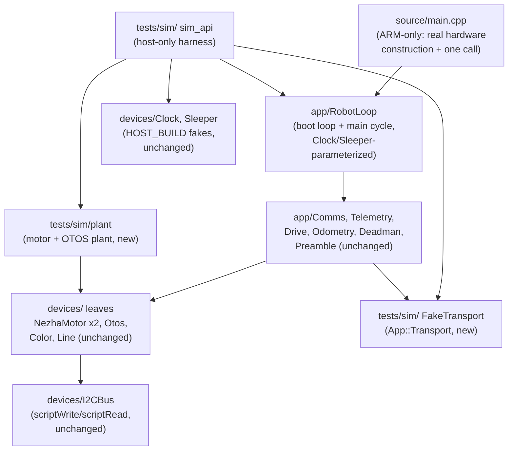
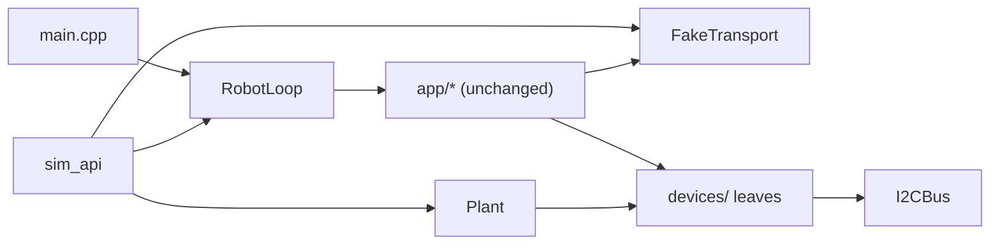

<!-- CLASI: Before changing code or making plans, review the SE process in CLAUDE.md -->

# Architecture Update — Sprint 105: Sim rebuild around the steppable loop

## Step 1: Understand the Problem

Sprint 102 deleted the old sim build (`tests/_infra/{sim,drive}`,
`SimMotor`/`PhysicsWorld`) wholesale rather than migrate it, explicitly
deferring simulation to "its own later phase" once a steppable loop existed
to build it around (102's own architecture-update.md). Sprints 103 and 104
built and proved that loop on real hardware; `tests/sim/conftest.py` today
still references that deleted infrastructure (`tests/_infra/sim`,
`firmware.py`'s `Sim` class, a `just build-sim` recipe the `justfile` no
longer defines — confirmed by reading both files) — any test depending on
its `sim`/`build_lib` fixtures fails immediately, and `tests/sim/system/`
is still the 077-006 skeleton, never populated. This sprint (P7 of
`single-loop-firmware-p3-p7-continuation.md`) is the sim rebuild.

**A material finding from reading the actual tree drives this document's
central decision, the same way sprint 103's own planning pass found a real
gap between the archived plan and the as-built tree.** `source/main.cpp`'s
`int main()` unconditionally declares `static MicroBit uBit;` and
`#include "MicroBit.h"`, and its own timing primitives — `markTime()`
(`system_timer_current_time()`), `sleepUntil()` (`uBit.sleep()`) — call
vendor/ARM-only functions directly, with no `#ifndef HOST_BUILD` guard
anywhere in the file. `main.cpp` therefore cannot be compiled under
`-DHOST_BUILD` at all today. This is despite the fact that `source/devices/
clock.h`'s own file header already states the intended design in so many
words: *"The cycle body is parameterized on a sleeper/clock interface:
fiber_sleep + system_timer on hardware; the steppable fake clock in host
tests"* — and `App::Deadman`/`App::Preamble` (both built in 103) already
take a `const Devices::Clock&` for exactly this reason. Every module
`main.cpp` composes (`App::Comms`, `App::Telemetry`, `App::Drive`,
`App::Odometry`, `App::Deadman`, `App::Preamble`, every `Devices::` leaf) is
*already* `HOST_BUILD`-safe. `main.cpp`'s own outer-loop composition and
pacing is the one piece that is not — an orphaned corner of a design whose
seam (`Devices::Clock`/`Devices::Sleeper`) was already built in 103 but never
finished being wired all the way to the top. Decision 1 resolves this: the
loop's own timing primitives are rewired onto `Devices::Clock`/`Devices::
Sleeper`, and the boot loop + main cycle body are extracted into a new,
host-buildable `source/app/` module, leaving `main.cpp` as a thin ARM-only
construction shell. This directly answers the sprint's own Design Question 1
("extract the cycle body ... vs re-instantiate the composition in the
harness") in favor of extraction — the composition is not re-derived by the
harness, it is the SAME code, called from two different entry points (ARM
`main.cpp`, host `sim_api`).

A second material finding shapes the plant design (Design Question 2).
`Devices::I2CBus`'s `HOST_BUILD` fork (`i2c_bus_host.cpp`) is a static,
pre-scripted FIFO — `scriptWrite()`/`scriptRead()` — with no live response
capability, and `scriptWrite()` does not even record the payload a caller
sent (confirmed by reading `i2c_bus.h`'s own comment on
`scriptEncoderRequestCollect()`: *"this fake's scriptWrite() never checks
the written payload, only address+order"*). A live plant therefore cannot
observe commanded duty by intercepting bus bytes. It does not need to:
`Devices::NezhaMotor::appliedDuty()` is already a public getter, and
`devices_motor_harness.cpp`'s own scenario 6 ("PID-on chases a velocity
target") already proves the pattern this sprint generalizes — read
`appliedDuty()` after a cycle, compute a first-order-lag plant response,
script the resulting encoder reading for the NEXT cycle via
`scriptEncoderRequestCollect()`'s two-write-one-read shape. This sprint
promotes that one-off in-test pattern into a small, reusable, deterministic
plant class exercised across the WHOLE loop (both motors + OTOS), not one
leaf in isolation.

**Carried caution (sprint.md, from `docs/code_review/2026-07-13-devices-
drive-review.md` Part 0 finding B3):** the pre-rebuild sim's 180°/360°
pivot runs both landed at ~272–273° — "smells like an angle-wrap attractor"
in the deleted `drive/` v2 sim-plant heading path, never root-caused. This
document's plant design (Step 3, Decision 3) keeps the new plant free of any
heading state or wrap/projection logic of its own — all heading lives in
`App::Odometry`'s existing, already-bench-proven midpoint-arc integration
over `BodyKinematics::forward()`, unchanged since 103 — so the attractor's
own precondition (reused heading-wrap math) does not exist in the new
design. Decision 3 below documents this explicitly, and SUC-020's own
acceptance criteria require a direct code check, not an assumption.

## Step 2: Identify Responsibilities

1. **Extract the steppable loop** (`source/main.cpp` → new `source/app/`
   module + `Devices::Clock`/`Sleeper`-based timing) — a structural/
   correctness fix independent of any sim-specific code; it would be the
   same fix even if this sprint built no plant at all. Ordered first
   because every other responsibility below depends on the loop being
   linkable under `HOST_BUILD`.
2. **Wire-level fake transport** (`App::Transport` `HOST_BUILD`
   implementation) — a small, standalone, test-only primitive; changes for
   a completely different reason (wire I/O faking) than the loop extraction
   above. No dependency on responsibility 1 or 3 — can be built in
   parallel.
3. **Deterministic plant model** (motor duty→velocity→position,
   OTOS-from-wheel-positions) — new physics/test code; changes for a
   different reason (simulating hardware, not restructuring firmware) than
   either responsibility above. No dependency on 1 or 2 — can be built in
   parallel.
4. **`sim_api` composition** — wires responsibilities 1, 2, and 3 together
   into one reusable, steppable harness, plus the virtual-cycle-timing
   diagnostic (Design Question 5). Its own responsibility because it is
   integration/composition work, not new logic of its own, and it is the
   one piece that REQUIRES 1, 2, and 3 to already exist.
5. **Fault injection** — extends the plant (responsibility 3) with three
   fault knobs (disconnect, wedge, dropout) and retargets the parked
   `later/sim-hardware-fault-injection.md` issue. Its own responsibility
   because it changes for a distinct reason (regression-testing firmware
   fault REACTIONS, not simulating healthy operation) and depends on both
   the plant (3) and the harness (4) already existing to verify against.
6. **Pytest sim tier + headless demo** — not a code responsibility so much
   as this sprint's actual Definition of Done: fixing the stale
   `tests/sim/conftest.py`, adding the `tests/sim/system/` scripted-twist
   scenario, wiring the fault-injection scenarios (5) into pytest, and
   updating `tests/CLAUDE.md`. Grouped last because it depends on
   everything above existing.

## Step 3: Define Subsystems and Modules

### New

- **`RobotLoop` (`source/app/robot_loop.{h,cpp}`, new)** — Purpose: run the
  boot loop and the main per-cycle schedule (`runAndWait`/`markTime`/
  `sleepUntil`, the command-dispatch switch) against injected devices and
  time seams. Boundary: inside — the cycle's own fixed call sequence and
  timing primitives (now built on `Devices::Clock&`/`Devices::Sleeper&`
  instead of vendor calls); outside — device construction (the caller's
  job — `main.cpp` on ARM, `sim_api` on host) and each called module's own
  internal behavior (unchanged). Takes references to already-constructed
  `Devices::` leaves, `App::Comms`, `App::Telemetry`, `App::Drive`,
  `App::Odometry`, `App::Deadman`, `App::Preamble`, a `Devices::Clock&`, and
  a `Devices::Sleeper&`. Serves SUC-018 and, transitively, every other use
  case in this sprint (nothing else can exist without it).
- **`source/main.cpp` (rewritten, not replaced)** — Purpose unchanged
  (own the `MicroBit` hardware singleton and be the ARM entry point).
  Boundary: inside — real hardware construction (`MicroBit`, `SerialPort`,
  `Radio`, `I2CBus`, the leaves, the real `Devices::Clock`/`Sleeper`) and
  one call into `RobotLoop`; outside — the cycle logic itself (moved to
  `RobotLoop`). Serves SUC-018.
- **`FakeTransport` (test-only, e.g. `tests/sim/support/fake_transport.h`)**
  — Purpose: let a host test drive `App::Comms`/`App::Telemetry` with no
  real serial port or radio. Boundary: inside — an in-memory FIFO
  implementing `App::Transport` (`readLine()`/`send()`/`sendReliable()`);
  outside — armor/dearmor and encode/decode (unchanged, `Comms`'s own job).
  Serves SUC-019.
- **Plant (test-only, `tests/sim/plant/`)** — Purpose: stand in for the
  physical drivetrain + OTOS deterministically. Boundary: inside — reading
  `appliedDuty()`, a first-order duty→velocity→position integration per
  wheel, scripting the resulting `Devices::I2CBus` reads/writes for the
  NEXT cycle (both motors), and an OTOS register responder computing pose
  from the SAME two wheel positions via `BodyKinematics::forward()`;
  outside — any heading/wrap logic of its own (there is none — see
  Decision 3) and anything about `main.cpp`/`RobotLoop`'s own schedule
  (the plant is driven BY the harness, between cycles, never inside a
  `runAndWait` block). Serves SUC-020.
- **`sim_api` (test-only, `tests/sim/system/sim_api.{h,cpp}` or a
  dedicated `tests/sim/support/` library — ticket-time file placement)** —
  Purpose: compose `RobotLoop` + the plant + `FakeTransport` +
  `Devices::Clock`/`Sleeper` (host fakes) + every `Devices::`/`App::`
  instance into one reusable, steppable harness. Boundary: inside —
  construction, `step(cycles)`, `injectCommand(line)`, decoded-telemetry
  drain, and the virtual-cycle-timing diagnostic (reading `Devices::
  Sleeper`'s existing `sleepCount()`/`lastSleepMillis()`/`yieldCount()`);
  outside — the cycle logic (`RobotLoop`), the physics (the plant), and the
  wire framing (`FakeTransport`/`Comms`) — `sim_api` calls these, it does
  not reimplement any of them. Serves SUC-021, and — as a reusable
  library — sprint 106's future profile-validation work.
- **Fault knobs (extension of the plant, `tests/sim/plant/`)** — Purpose:
  deterministically provoke three specific firmware fault-reaction paths.
  Boundary: inside — the three knob implementations (disconnect, wedge,
  dropout) as plant-level state toggles; outside — the firmware's own
  detection/reaction logic (`MotorArmor::wedged()`, the freshness gate,
  `connected()` — all unchanged, this sprint only provokes them). Serves
  SUC-022.
- **`tests/sim/system/` scripted-twist scenario + pytest wrappers** —
  Purpose: the sprint's own bench-runnable-equivalent proof and the
  restored green pytest sim tier. Boundary: inside — scenario scripting
  and assertion against `sim_api`'s decoded telemetry; outside — `sim_api`
  itself (calls it, does not extend it). Serves SUC-023.

### Modified (interface addition, no removal)

- **`source/devices/clock.h`'s `Sleeper`** — no interface change; this
  sprint is its first REAL caller for cycle-level pacing (previously
  exercised only in isolation by unit harnesses). `sleepCount()`/
  `lastSleepMillis()`/`yieldCount()` — already present — become `sim_api`'s
  own timing-diagnostic data source (Design Question 5).
- **`tests/sim/conftest.py`** — stale `build_lib`/`sim` fixtures (targeting
  the deleted `tests/_infra/sim`/`firmware.py`/`just build-sim`) are
  removed; if a shared fixture is still useful for `tests/sim/system/`'s
  new scenario tests, it is added fresh against `sim_api`, not patched
  onto the dead one. Ticket-time call (Step 7 Open Question 2).

### Removed (full responsibility, deleted)

- **None.** This sprint adds test-only infrastructure and refactors
  `main.cpp`'s composition; it deletes no production module. The stale
  `tests/sim/conftest.py` fixtures (above) are a dead-code cleanup, not a
  responsibility retirement — nothing currently depends on them (confirmed:
  no test in the tree references the `sim`/`build_lib` fixtures — the
  `tests/sim/unit/` module harnesses each compile their own throwaway
  binary ad hoc, per `test_app_drive.py`'s own docstring).

### Unchanged (survive intact, no code touched this sprint)

- **`App::Comms`, `App::Telemetry`, `App::Drive`, `App::Odometry`,
  `App::Deadman`, `App::Preamble`** — Purpose and internal behavior
  unchanged; `RobotLoop` becomes their caller in place of `main.cpp`'s
  inline `for(;;)` body, with byte-identical call order and arguments.
- **`Devices::` leaves (`NezhaMotor`, `Otos`, `ColorSensorLeaf`,
  `LineSensorLeaf`, `I2CBus`, `Clock`, `MotorArmor`, `VelocityPid`)** — no
  interface or behavior change; the plant is a NEW caller of `I2CBus`'s
  already-existing `scriptWrite()`/`scriptRead()`/`setClock()`/
  `advanceClock()` surface, not a change to it.
- **`kinematics/body_kinematics.*`** — unchanged; the OTOS plant becomes
  its second host-side caller (alongside `App::Odometry`), reusing
  `forward()` rather than re-deriving heading math (Decision 3).
- **Wire schema (`protos/*.proto`, generated `messages/*`)** — unchanged;
  the fake transport and plant operate entirely below/around the existing
  wire format, adding no new field.

## Step 4: Diagrams

### Component diagram — after this sprint

### Dependency graph — after this sprint

No cycles: `RobotLoop` has exactly two callers (`main.cpp`, `sim_api`), both
composition roots with no incoming edges of their own — matching the
project's `[Presentation] → [Domain] → [Infrastructure]` direction
(`RobotLoop`/`app/*` is the domain layer; `devices/`, `tests/sim/plant`,
`tests/sim/` `FakeTransport` are infrastructure/test-primitives).
`Plant`/`FakeTransport` have no outward edges beyond `Leaves`/nothing —
they are the sim side's own stable base, mirroring `Leaves`/`Messages`/
`Com` in 103's dependency graph. Fan-out from `sim_api` is 3
(`RobotLoop`, `Plant`, `FakeTransport`), from `RobotLoop` is 1
(`AppModules`, an aggregate node standing for six already-small classes it
calls in a fixed sequence — the same accepted fan-out reasoning 103's own
Design Quality section used for `main.cpp`'s own six-module composition
root) — both within the 4-5 guideline.

### Message composition — unchanged (no wire schema change this sprint)

The plant and `FakeTransport` operate entirely on the existing
`CommandEnvelope`/`ReplyEnvelope`/`Telemetry`/`TelemetrySecondary` wire
shapes (103/104's schema); no field is added, removed, or reinterpreted.

## Step 5: Complete the Document

### What Changed

- **`source/main.cpp`**: split into `source/app/robot_loop.{h,cpp}` (the
  boot loop + main cycle, now parameterized on `Devices::Clock&`/
  `Devices::Sleeper&` instead of raw vendor timer/sleep calls) and a
  shrunk `main.cpp` (real hardware construction + one call into
  `RobotLoop`). Zero behavior change on ARM — verified by the bench gate,
  not merely diffed.
- **New test-only infrastructure**: `FakeTransport` (`App::Transport`
  implementation), a deterministic motor+OTOS plant (`tests/sim/plant/`),
  `sim_api` (the composed, steppable harness), three fault-injection knobs
  on the plant, a `tests/sim/system/` scripted-twist scenario, and fixed
  (or replaced) `tests/sim/conftest.py` fixtures.
- **Documentation**: `tests/CLAUDE.md`'s `sim/` section updated to
  describe the real harness; `clasi/issues/later/sim-hardware-fault-
  injection.md` updated to reflect delivered vs. deferred (OTOS staleness)
  scope.

### Why

Per the continuation issue's P7 scope and the sprint's own goal: rebuild
simulation around the steppable loop that 103/104 built and proved on
hardware, using the SAME production loop code (not a parallel model),
reusing the `HOST_BUILD` scripted-fake surface `devices/` already carries.
The `main.cpp` extraction is this sprint's own finding (not pre-decided in
the sprint stub) — it resolves a genuine, previously-unnoticed gap between
`clock.h`'s already-stated design intent and what `main.cpp` actually does,
the same class of finding sprint 103's own Decision 1 made about
`DeviceBus`.

### Impact on Existing Components

- **`source/main.cpp`** — shrinks materially; every line of actual cycle
  logic moves to `RobotLoop`, callable from two entry points instead of
  one. No behavior change to the compiled ARM binary.
- **`source/app/{comms,telemetry,drive,odometry,deadman,preamble}`** — no
  code change; each gains a second real caller (`RobotLoop`, called from
  `sim_api` on host as well as `main.cpp` on ARM) exercising the exact
  same call sequence.
- **`source/devices/i2c_bus.h`'s `HOST_BUILD` scripted-fake surface** — no
  interface change; the plant becomes a new, more sophisticated caller
  (scripting per-cycle, computed responses instead of a fixed canned
  sequence), proving out a usage pattern future device-leaf tests can also
  adopt.
- **`tests/sim/unit/`** — unaffected; its existing 103/104 module-level
  harnesses (`app_comms_harness.cpp`, `app_telemetry_harness.cpp`, etc.)
  keep working unchanged and continue validating each module in isolation,
  complementary to (not replaced by) this sprint's system-level harness.
- **`tests/sim/conftest.py`** — its two stale fixtures are removed or
  replaced; nothing in the current tree depends on them, so this is a pure
  dead-code fix, not a breaking change to any passing test.
- **`tests/CLAUDE.md`** — updated to stop stating the sim harness "does not
  exist yet."
- **`clasi/issues/later/sim-hardware-fault-injection.md`** — updated from
  "RETARGETED, pending" to reflect actual delivered scope.

### Migration Concerns

- **No data migration** — no persisted, versioned data model; this sprint
  is firmware-composition refactor + new test-only code.
- **No wire schema change** — the fake transport, plant, and `sim_api` all
  operate on the existing 103/104 wire shapes; no `.proto` edit, no
  `gen_messages.py` re-run.
- **ARM behavior-preservation risk is the one real migration risk**: the
  `main.cpp` → `RobotLoop` extraction touches the file that IS the
  production firmware's entry point. Mitigated by (a) the extraction being
  mechanical (move code, change timer/sleep calls to go through
  `Clock`/`Sleeper`, no logic rewrite) and (b) SUC-018's own acceptance
  criteria requiring a bench-gate re-verification per
  `.claude/rules/hardware-bench-testing.md`, not a diff-only sign-off —
  this sprint does not skip the standing hardware verification gate just
  because most of its own scope is host-side.
- **Deployment sequencing**: ticket 001 (`RobotLoop` extraction) must land
  and bench-verify before any other ticket, since every later ticket's sim
  harness calls `RobotLoop` and a silent ARM behavior change would poison
  every sim result built on top of it without being caught by the sim
  itself (the sim cannot detect its own foundation drifting from real
  hardware — only the bench gate can). Tickets 002 (`FakeTransport`) and
  003 (plant) have no dependency on each other or on 001 and may be
  authored in parallel if a future execution pass chooses to; ticket 004
  (`sim_api`) depends on 001-003; ticket 005 (fault injection) depends on
  003-004; ticket 006 (pytest tier + demo) depends on 004-005 and is
  strictly last, matching 103/104's own precedent of ordering the
  Definition-of-Done gate last.
- **Rollback**: unchanged from 103/104's posture — this sprint touches
  `main.cpp` (a real firmware-behavior risk) but adds no new rollback
  mechanism of its own; a mid-sprint revert of the `RobotLoop` extraction
  is a normal git revert, and the bench-gate re-verification (SUC-018) is
  the check that catches a bad extraction before it merges, not after.

## Step 6: Document Design Rationale

**Decision 1 — Extract `RobotLoop` from `main.cpp`, rewired onto
`Devices::Clock`/`Devices::Sleeper`, rather than re-instantiating the
composition inside the sim harness.**
- *Context*: the sprint's own Design Question 1. `main.cpp` cannot compile
  under `HOST_BUILD` (hard `MicroBit.h`/`uBit` dependency, raw vendor timer/
  sleep calls with no seam). Two ways to get a steppable loop: (a) extract
  the existing cycle body into a `Clock`/`Sleeper`-parameterized function
  callable from both `main.cpp` and a host harness, or (b) leave `main.cpp`
  untouched and have the sim harness build its own SEPARATE composition
  that calls the same `app/`/`devices/` modules in what the harness AUTHOR
  believes is the same order.
- *Alternatives considered*: (a) extraction (chosen); (b) harness
  re-instantiation; (c) a middle path — leave `main.cpp` as-is but ALSO
  hand-copy its cycle body into a second, host-only file, keeping the two
  in sync by convention/comment cross-reference.
- *Why this choice*: (b) creates exactly the failure mode 103's own
  Decision 1 reasoning warned against with `DeviceBus`/handles: two
  designs claiming to be authoritative, with no structural guarantee they
  stay in sync — a future firmware change to the real cycle's ordering
  (e.g. a new `runAndWait` block) would silently NOT be reflected in the
  harness's separately-authored copy, and the sim would keep passing while
  testing a schedule the real robot no longer runs. This is precisely the
  failure mode a simulator exists to prevent, not reproduce. (c) is a
  weaker version of the same problem — "kept in sync by convention" is not
  a structural guarantee, only a hope, and this project's own repeated
  precedent (103 Decision 1, the naming-and-style "don't duplicate a
  hazard-prone algorithm" reasoning 104 Decision 1 reused) is to promote
  shared logic into one place rather than trust two copies to stay
  identical. (a) is chosen: it is also the ONLY option that satisfies the
  continuation issue's own explicit steer ("a host-buildable seam over the
  SAME production loop code — not a parallel model") and the already-
  stated design intent in `clock.h`'s own header comment, which this
  sprint is completing, not inventing.
- *Consequences*: `main.cpp` shrinks to a construction shell; `RobotLoop`
  becomes a second, real, host-buildable entry point with its own bench-
  gate obligation (a behavior-preservation risk this sprint accepts and
  mitigates via SUC-018's bench re-verification, per Migration Concerns
  above) — a real but bounded cost, paid once, that removes the
  sync-drift risk for every future sprint's sim work, not just this one.

**Decision 2 — The plant reads `appliedDuty()` and schedules
`I2CBus`-level responses between cycles; it does not intercept raw I2C
transaction bytes.**
- *Context*: the sprint's own Design Question 2. `I2CBus`'s `HOST_BUILD`
  scripted-fake surface is a static FIFO that does not record write
  payloads (confirmed, `i2c_bus.h`'s own comment). A byte-level plant would
  need to either extend `I2CBus` itself with a live-responder mode (a
  production-adjacent class gaining sim-only complexity) or fully decode
  the Nezha/OTOS register protocols at the raw-byte level in test code.
- *Alternatives considered*: (a) read `appliedDuty()`/leaf-level getters
  and script `I2CBus` responses at the FIFO level between cycles (chosen);
  (b) extend `I2CBus` itself with an injectable "live responder" callback
  seam, replacing the FIFO; (c) a byte-level register decoder in the
  plant, parsing raw `write()` payloads directly.
- *Why this choice*: (b) adds a new abstraction to a PRODUCTION class
  (`I2CBus`, compiled into the ARM firmware image under `#ifndef HOST_BUILD`
  too) for a capability only the `HOST_BUILD` fork would ever use —
  unnecessary surface area on a class whose real-hardware fork must stay
  exactly as simple as `MicroBitI2C` forwarding. (c) duplicates
  register-protocol knowledge `NezhaMotor`/`Otos` already own privately
  (the 0x46 split-phase encoder sequence, OTOS's burst-read block layout)
  in a second place that must be kept in sync with any future register
  change — exactly the kind of duplication Decision 1 above already
  rejected for a different reason. (a) is chosen because
  `devices_motor_harness.cpp`'s own scenario 6 already PROVES this exact
  pattern works correctly for one motor in isolation — this sprint is
  generalizing a proven idiom across the full loop, not inventing an
  unproven one, and it adds zero new surface to any production class.
- *Consequences*: the plant is leaf-getter-driven, not bus-byte-driven —
  it can only simulate what a leaf's own public surface already exposes
  (`appliedDuty()`, `position()`/encoder-register shape via
  `scriptEncoderRequestCollect()`'s existing convention, OTOS's existing
  register block). This is not a real limitation for this sprint's scope
  (SUC-020 through SUC-022 need exactly this level of fidelity) but means a
  FUTURE fault mode that must be expressed as a raw bus-protocol violation
  (e.g. a truncated I2C transfer mid-byte) is out of reach without
  revisiting this decision — not needed by any use case in this sprint.

**Decision 3 — The plant carries no heading/angle-wrap state or logic of
its own; all heading comes from `App::Odometry`'s existing integration.**
- *Context*: the carried B3 caution — the deleted pre-rebuild sim's
  180°/360° pivot runs both converged on ~272-273°, "smells like an
  angle-wrap attractor... in the sim plant's heading convention" per the
  code review. `App::Odometry` already computes world-frame heading via
  midpoint-arc integration over `BodyKinematics::forward()`, proven on real
  hardware through 103/104's bench gates — a completely independent,
  already-correct implementation with no relationship to the deleted sim's
  own heading math.
- *Alternatives considered*: (a) give the plant no heading state at all —
  it tracks two independent linear wheel positions only, and OTOS's
  simulated pose is DERIVED from those two positions via the SAME
  `BodyKinematics::forward()` call `Odometry` itself uses (chosen); (b)
  give the plant its own independent heading integrator (mirroring how a
  REAL OTOS chip has its own onboard IMU/heading state, physically
  independent of the wheels) for higher physical fidelity; (c) port
  formulas from the deleted `drive/` v2 sim plant as a starting point,
  adjusting for the new architecture.
- *Why this choice*: (c) is explicitly forbidden by the sprint's own
  carried caution — "do NOT port PhysicsWorld... even by porting a
  formula, not the class" — and directly risks re-introducing B3 by
  construction. (b) is more physically realistic (a real OTOS's heading
  does drift independently of wheel odometry) but is speculative
  generality against this sprint's own stated fidelity bar ("enough for
  twist-follows/deadman/fault tests... not a physics engine") — no use
  case in this sprint or the immediately-following one (106, profile
  validation) needs OTOS/encoder heading DIVERGENCE, only that both report
  plausible, moving values. (a) is chosen: it is the simplest design that
  satisfies every SUC-020 acceptance criterion, and because it reuses
  `BodyKinematics::forward()` (the exact function `Odometry` itself calls)
  rather than any formula from the deleted sim, it structurally cannot
  reintroduce B3's own reused-heading-wrap-math precondition.
- *Consequences*: the simulated OTOS pose and the firmware's own
  encoder-only `Odometry` pose will always agree closely (both derive from
  the same two wheel positions via the same kinematics function) — by
  design, not by coincidence. A future sprint building host-side
  OTOS/encoder fusion (106+) that wants the sim to exercise DIVERGENCE
  between the two sources (to test fusion's disagreement-handling) will
  need to revisit this decision and add independent OTOS drift/noise —
  flagged in Step 7, not built speculatively here.

**Decision 4 — `io/sim_conn.py` (a Python-facing serial-like transport) is
explicitly deferred to sprint 107, not built this sprint.**
- *Context*: the sprint's own Design Question 3 asks whether Python host
  tooling needs a sim-facing connection object this sprint, given the
  bench-runnable-equivalent deliverable (SUC-023) requires a runnable,
  observable demo.
- *Alternatives considered*: (a) build `io/sim_conn.py` now so
  `NezhaProtocol`/host scripts can address the sim exactly like a real
  serial port (chosen: no); (b) defer it to sprint 107, where `testgui`'s
  own revival is the actual consumer that needs a Python-facing sim
  transport, and satisfy this sprint's demo requirement with a pure-C++
  `sim_api` harness driven by a thin Python (or direct binary) wrapper that
  decodes and prints telemetry without needing a full `NezhaProtocol`-
  compatible connection object (chosen).
- *Why this choice*: this sprint's own Out of Scope explicitly excludes
  TestGUI revival, and `io/sim_conn.py`'s only real consumer in the
  codebase today is testgui-shaped tooling (a Python client wanting a
  drop-in replacement for `serial_conn.py`'s real-port object). Building it
  now, with no real consumer to validate its shape against, risks
  guessing an interface 107 then has to revise — the same "speculative
  generality against a sprint that hasn't been detailed yet" reasoning
  104's own Decision 3 already used for host-side OTOS fusion. This
  sprint's existing test convention (compile a small C++ harness, run it
  via `subprocess`, assert/parse its output — `test_app_drive.py`'s own
  established shape) already satisfies "run one command and see the sim
  loop move" without a Python transport object.
- *Consequences*: sprint 107 builds `io/sim_conn.py` against a real,
  already-proven `sim_api` (this sprint's own deliverable) instead of
  guessing at `sim_api`'s shape before it exists; this sprint's own demo is
  a compiled-and-run C++ binary (or a thin Python `subprocess` wrapper
  around one), not a `NezhaProtocol`-compatible connection.

## Step 7: Flag Open Questions

1. **Exact file placement for `sim_api` and the plant** — `tests/sim/
   plant/` for the plant is named directly in the sprint's own Design
   Question 2 and adopted here; whether `sim_api` itself lives at
   `tests/sim/system/sim_api.{h,cpp}` (colocated with its primary
   consumer, the scripted-twist scenario) or a new shared `tests/sim/
   support/` directory (parallel to `tests/sim/unit/`'s existing
   per-module harnesses) is left to ticket 004's own implementation,
   since either satisfies every SUC-021 acceptance criterion and the
   choice has no architectural consequence beyond import paths.
2. **`tests/sim/conftest.py`'s stale fixtures: delete outright, or replace
   with a `sim_api`-backed equivalent?** Step 3/5 note the current
   `sim`/`build_lib` fixtures have no live caller, so deleting them is
   safe. Whether a NEW shared fixture is worth adding (vs. every
   `tests/sim/system/` test compiling its own harness ad hoc, matching
   `tests/sim/unit/`'s established per-file convention) is a ticket-006
   judgment call once the actual number/shape of system-level tests this
   sprint ends up writing is known.
3. **Independent OTOS drift/noise model** — explicitly NOT built this
   sprint (Decision 3's own Consequences); flagged here as the concrete
   follow-up a future host-side-fusion sprint (106+) would need before the
   sim can exercise OTOS/encoder DISAGREEMENT, as opposed to this sprint's
   by-construction agreement.
4. **Sim-side line/color device simulation** — out of scope this sprint
   because telemetry carries no `line=`/`color=` fields yet (103's own Open
   Question 1, still unresolved as of this sprint); `Preamble`'s boot-time
   presence probe for color/line is satisfied in the sim by scripting
   "absent" (present()==false), the simplest response that keeps the boot
   loop terminating without inventing steady-state values nothing on the
   wire consumes yet. Revisit alongside whichever future sprint adds those
   wire fields.
5. **Whether sprint 106's profile-validation work needs anything from
   `sim_api` beyond what SUC-021 already specifies** — not knowable until
   106 is itself detailed; this document deliberately keeps `sim_api`'s
   surface minimal (construct/step/inject/drain + the timing diagnostic)
   rather than speculatively widening it, per this sprint's own "keep it
   lean" framing and the project's standing anti-speculative-generality
   posture.
