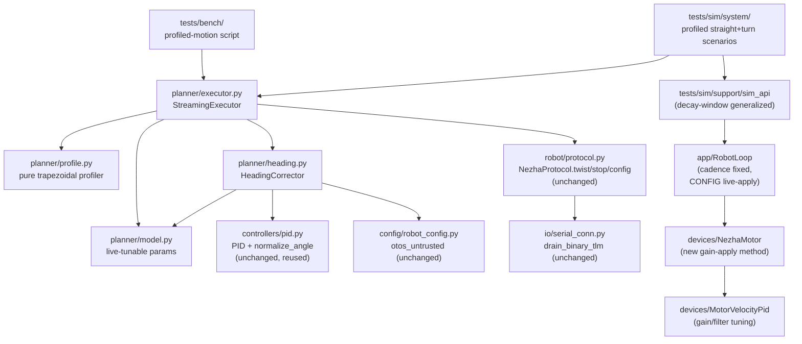
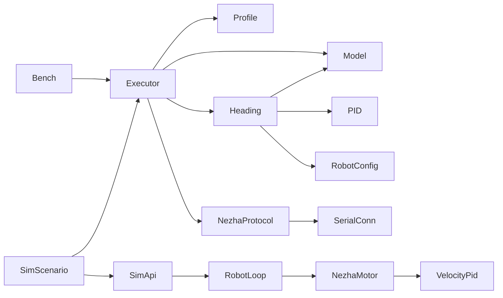

<!-- CLASI: Before changing code or making plans, review the SE process in CLAUDE.md -->

# Architecture Update — Sprint 106: Host trajectory planner: profiled twists, straights and turns

## Step 1: Understand the Problem

Sprint 102 deleted all on-robot trajectory planning: the P4 firmware is a
pure velocity/yaw follower (`twist`/`config`/`stop`, telemetry-only return
path). Sprints 103–105 built and proved the loop, the wire, and a sim tier
around it, but nothing today can command a multi-leg path with smooth
acceleration/deceleration — only a single constant-velocity twist has been
exercised. The stakeholder's stated end goal (sprint 107's notebook: "clean
acceleration and deceleration on straights and turns") requires host-side
motion profiling that does not exist yet.

This sprint's own reading of the current tree (not assumed from the sprint
stub) surfaces four material findings that shape the design below, each
carried into a numbered decision in Step 6:

1. **The loop-cadence bug is a scheduling defect, proven deterministically by
   sim, not an environmental slowdown.** `source/app/robot_loop.cpp`'s
   `cycle()` already writes `sleepUntil(cycleStart, kCycle)` — syntactically
   "anchored" — but ticket 105-004's virtual-cycle-timing diagnostic proved
   the schedule itself requests `4+4+4+16=28ms` per cycle (12ms over the
   stated 16ms target), because the three settle/clearance windows
   (`kSettle`×2, `kClear`×1) are not absorbed into the 16ms figure — they are
   additional to it. This is provable with zero real-hardware noise (the
   `HOST_BUILD` fake `Devices::Clock` never advances mid-cycle, so every
   `sleepUntil` call in a single `cycle()` requests its own gap in full).
   Sprint 104 bench-measured ~36ms real; the ack-ring issue
   (`ack-ring-intermittent-delivery-gap.md`) separately cites ~13.87 Hz
   (~72ms) — a further, currently unreconciled gap this sprint's own ticket
   001 must re-measure fresh rather than assume. Telemetry is the planner's
   ONLY feedback channel (binding requirement #10), so this bounds
   everything downstream.
2. **`ConfigDelta` is decoded but never applied — binding requirement #9 is
   currently unmet at the firmware boundary.** `RobotLoop::cycle()`'s
   `CmdKind::CONFIG` case unconditionally acks `ERR_UNIMPLEMENTED`
   (confirmed live in the current tree), and `Devices::NezhaMotor` has **no
   runtime gain mutator** — only a constructor-time `const MotorConfig&`
   (confirmed: `config_` has no setter anywhere in `nezha_motor.h`). The
   resonance-taming issue's own prescribed bench method (`SET pid.kp` on the
   stand) is pre-P4 text-protocol vocabulary that no longer exists on the
   wire. Without closing this gap, sprint 106 cannot live-tune the inner
   velocity loop at all — every gain change would require a reflash,
   directly violating binding requirement #9 and stalling the resonance
   characterization ticket.
3. **No jerk-limited trajectory library is an actual project dependency.**
   `tests/bench/bench_ruckig_motion_verify.py`'s name notwithstanding, that
   script targets the retired pre-102 `D`/`T`/`TURN`/`RT` text verbs — no
   `ruckig` (or equivalent) package appears in `pyproject.toml`. The profile
   generator this sprint builds is a hand-rolled trapezoidal profiler, not a
   library integration.
4. **`nav/`, `io/calibrate.py`, and the rest of the `Nezha` facade are
   confirmed non-functional against the P4 wire**
   (`nezha-facade-and-midlayer-dead-verb-residue.md`) — every motion
   primitive they call (`drive()`, `go_to()`, blocking T/D/G) was retired in
   103. That issue's own Direction explicitly defers `nav/`'s fate to a
   future stakeholder call, not a default. This sprint therefore builds a
   FRESH host package rather than extending `nav/`, and touches nothing
   under `nav/`/`io/calibrate.py`.

## Step 2: Identify Responsibilities

1. **Firmware loop-cadence fix** (`source/app/robot_loop.cpp`) — a pacing/
   scheduling correction, independent of everything else in this sprint; it
   would be the same fix even if this sprint built no planner at all.
   Ordered first because it changes the feedback rate every other
   responsibility below is designed against.
2. **Firmware live gain-apply + inner-loop resonance taming**
   (`source/devices/nezha_motor.{h,cpp}`, `source/app/robot_loop.cpp`'s
   `CONFIG` case, and gain/filter tuning in
   `source/devices/velocity_pid.{h,cpp}` if constants alone are
   insufficient) — changes for a different reason (closing a live-tunability
   gap, then a control-law tuning pass) than the cadence fix. Depends on
   nothing else in this sprint; the resonance characterization itself
   depends on the cadence fix only insofar as a faster telemetry read helps
   diagnose it (not a hard dependency — the step-response harness samples
   independently).
3. **Sim decay-window generalization** (`tests/sim/support/sim_api.{h,cpp}`)
   — test-infrastructure-only; changes because a future sim scenario
   (responsibility 6) needs to observe a full closed-loop settle, not
   because of any production-code change. No dependency on 1 or 2.
4. **Pure profile generation** (new `host/robot_radio/planner/profile.py`)
   — new, standalone domain logic; changes for a reason distinct from every
   other responsibility here (motion-profile math, not wire I/O, not
   firmware). No dependency on anything else in this sprint — the most
   stable, most reusable piece.
5. **Streaming execution + binding-requirement compliance** (new
   `host/robot_radio/planner/executor.py`) — orchestrates responsibility 4's
   output over the wire; changes for a reason distinct from profile
   generation itself (pacing, safety, preemption, telemetry consumption).
   Depends on 4 (consumes its output) and indirectly on 1 (the cadence it
   paces against) and 2 (the gains it is tuning against are stable).
6. **Host-side heading correction** (new `host/robot_radio/planner/
   heading.py`) — a distinct control loop with its own reason to change
   (heading error correction, not velocity profiling); depends on 4/5 for
   the commanded heading and on the telemetry stream 5 already drains.
   Reuses `host/robot_radio/controllers/pid.py` rather than re-deriving a PD
   loop.
7. **Bench-runnable proof, sim-validated first** (`tests/sim/system/` new
   scenarios + a new `tests/bench/` script) — this sprint's own Definition
   of Done; depends on everything above existing.

## Step 3: Define Subsystems and Modules

### New

- **`host/robot_radio/planner/profile.py`** — Purpose: convert a signed
  straight distance or signed in-place turn angle, plus acceleration/
  cruise/deceleration limits, into a deterministic sequence of
  `(elapsed, v_x, omega)` setpoints. Boundary: inside — pure trapezoidal
  math and input validation (binding requirement #5); outside — anything
  about the wire, the robot, timing/pacing of ACTUAL sends (that is the
  executor's job), and heading correction (a separate concern layered on
  top by the executor). No I/O, no clock reads beyond its own `elapsed`
  parameterization. Serves SUC-027.
- **`host/robot_radio/planner/executor.py`** — Purpose: stream one
  profile's setpoints to the robot at a live-tunable paced interval,
  applying the heading trim, re-arming the deadman each send, and enforcing
  every binding requirement (sign-aware completion, no bounded-ack gating,
  single segment-global clock, preemption invalidation, defense-in-depth
  validation, bounded overshoot, terminal `stop()`). Boundary: inside — the
  send/pace/drain/preempt loop and its own completion/fault bookkeeping;
  outside — profile math (calls `profile.py`, does not reimplement it),
  wire encode/decode (calls `NezhaProtocol`/`SerialConnection`, unchanged),
  and heading math (calls `heading.py`). Serves SUC-028.
- **`host/robot_radio/planner/heading.py`** — Purpose: compute a clamped
  omega trim from commanded vs. measured heading, reading `otos_untrusted`
  to select the encoder-derived `Telemetry.pose` source. Boundary: inside —
  the trim computation and the config-driven source selection; outside —
  sending anything over the wire (the executor adds the trim to its own
  outgoing twist) and the underlying PID math (delegates to
  `controllers/pid.py`'s `PID`, not a new implementation). Serves SUC-029.
- **`host/robot_radio/planner/model.py`** — Purpose: hold the sprint's
  live-tunable numeric parameters as one small, explicit surface — streaming
  cadence, accel/decel limits, heading gains/clamp, and the actuation
  latency constant (binding requirements #8, #9) — so every other planner
  module reads from one place instead of scattering constants. Boundary:
  inside — a plain, serializable parameter set (and load/override
  plumbing, e.g. JSON/env, ticket-time call); outside — no behavior of its
  own. Serves SUC-028/SUC-029's own live-tunability acceptance criteria.
- **`Devices::NezhaMotor` live gain-apply method** (extension of the
  existing class, `source/devices/nezha_motor.{h,cpp}`) — Purpose: let
  `RobotLoop` push individual, already-translated `Devices::Gains`/
  `wheelTravelCalib` values onto an already-constructed motor's live
  `config_` without reconstructing the object. Boundary: inside — updating
  `config_`'s relevant fields, taking ONLY `Devices`-local types
  (`Devices::Gains`, plain floats) as parameters; outside — the PID math
  itself (`Devices::MotorVelocityPid`, unchanged), and decoding/translating
  the wire `MotorConfigPatch` itself, which stays `RobotLoop`'s job (in
  `source/app/`, which already includes `messages/...`) — `source/devices/`
  keeps the standing isolation invariant (`nezha_motor.h`'s own file
  header: never `#include "messages/..."`) exactly as `Devices::Gains`
  already does relative to `msg::Gains`. `RobotLoop`'s `CONFIG` case is
  therefore the one translation boundary between the wire patch and this
  method, mirroring `config.proto`'s own documented `BinaryChannel`
  translation-boundary precedent for the SAME `MotorConfigPatch` type.
  Serves SUC-025.
- **`tests/sim/system/` profiled-straight and profiled-turn scenarios** —
  Purpose: sim-validate the real profile generator + executor against
  `SimApi` before any bench time is spent. Boundary: inside — scenario
  scripting and assertions; outside — `SimApi` itself (calls it) and the
  planner modules (calls them, does not reimplement their logic). Serves
  SUC-030.
- **`tests/bench/` profiled-motion bench script** — Purpose: this sprint's
  own bench-runnable proof — run a profiled straight and turn for real,
  capture the telemetry trace. Boundary: inside — HITL orchestration and
  trace capture (following the established `tests/bench/` safety
  conventions — `DEV`-watchdog widening/restore has no P4 equivalent, so
  this instead follows `rig_soak.py`'s own STOP-in-`finally` convention);
  outside — the planner logic itself (calls it). Serves SUC-030.

### Modified (interface addition, no removal)

- **`source/app/robot_loop.cpp`** — `kSettle`/`kClear`/`kCycle` retargeted
  to an internally-consistent schedule (SUC-024); `CmdKind::CONFIG` case
  gains a real apply path for `MotorConfigPatch` fields, acking `OK`
  instead of `ERR_UNIMPLEMENTED` for that one patch type only
  (`DrivetrainConfigPatch`/`PlannerConfigPatch` stay `ERR_UNIMPLEMENTED`,
  unchanged, explicitly out of scope). No change to `TWIST`/`STOP`
  handling or the telemetry frame's own field set.
- **`source/devices/velocity_pid.{h,cpp}`** — gain/filter tuning only
  (values, not the control-law shape) if the now-live-tunable
  `kp`/`ki`/`kff`/`iMax`/`kaw` surface cannot alone hit the `<~10%`
  overshoot bar (Step 6 Decision 4). No interface change expected; an
  Open Question (Step 7) if a new tunable field turns out to be needed.
- **`tests/sim/support/sim_api.{h,cpp}`** — `scriptCycleBusResponses()`
  generalized to detect an actual `appliedDuty()` change per cycle rather
  than a single hand-derived `pendingEventCycle_` index (SUC-026). Public
  `SimApi` surface (`step`/`injectCommand`/`drainTelemetry`/timing
  diagnostic) unchanged.

### Removed (full responsibility, deleted)

- **None.** This sprint adds a new host package and extends two existing
  firmware classes; it deletes no production module. `nav/`,
  `io/calibrate.py`, and the rest of the dead-verb `Nezha` facade are left
  exactly as they are — their fate is explicitly out of this sprint's
  authority (Step 1 finding 4).

### Unchanged (survive intact, no code touched this sprint)

- **`envelope.proto`/`config.proto`/`telemetry.proto`** — no wire schema
  change is committed by this document; `MotorConfigPatch` already carries
  every field ticket 002 needs to apply. A new tunable field (e.g.
  `velFiltAlpha`) is possible but deferred to an Open Question, not
  pre-built here.
- **`App::Drive`, `App::Odometry`, `App::Deadman`, `App::Comms`,
  `App::Telemetry`, `App::Preamble`** — no code change; `RobotLoop` remains
  their only caller, with the same call order.
- **`host/robot_radio/robot/protocol.py` (`NezhaProtocol`),
  `host/robot_radio/io/serial_conn.py` (`SerialConnection`)** — the
  planner is a new CALLER of `twist()`/`stop()`/`config()`/
  `drain_binary_tlm()`/`wait_for_ack()`, not a change to any of them.
- **`host/robot_radio/controllers/pid.py`** — reused as-is by `heading.py`;
  no change.
- **`host/robot_radio/config/robot_config.py`** — reused as-is (reads
  `geometry.otos_untrusted`); no change.
- **`nav/`, `path/`, `kinematics/`, `io/calibrate.py`, `io/robot_mcp.py`,
  `testgui/`, `testkit/`** — untouched (Step 1 finding 4).

## Step 4: Diagrams

### Component diagram — after this sprint

### Dependency graph — after this sprint

No cycles. `Profile` has zero outward edges (the sprint's own most stable
module — pure math, no dependency on anything). `Executor`'s fan-out is 4
(`Profile`, `Heading`, `Model`, `NezhaProtocol`) — within the 4-5 guideline.
`Heading`'s fan-out is 3. The host planner package and the firmware
(`RobotLoop`/`NezhaMotor`/`MotorVelocityPid`) are two separate dependency
trees joined only through the wire (`NezhaProtocol` talking to a real or
simulated robot) — matching the project's established
`[Host/Presentation] → [Wire] → [Firmware/Domain] → [Infrastructure]`
direction; the host planner never reaches into firmware internals, and
firmware never depends on anything host-side.

### Entity/data note

No persisted or relational data model changes this sprint — `profile.py`'s
setpoint sequence is an in-memory, ephemeral list; `model.py`'s tunable
parameters are process-local config (JSON/dataclass, ticket-time call), not
a new schema. No ER diagram required (Step 4's own "if the data model
changes" condition is not met).

## Step 5: Complete the Document

### What Changed

- **Firmware**: `source/app/robot_loop.cpp`'s cycle-pacing constants and
  `sleepUntil` accounting retargeted to an internally-consistent ~25 Hz
  schedule; its `CONFIG` dispatch case gains a real apply path for
  `MotorConfigPatch`; `Devices::NezhaMotor` gains a live gain-apply method;
  `Devices::MotorVelocityPid`'s gains/filter tuned (values only) if needed
  to hit the resonance bar.
- **Sim**: `tests/sim/support/sim_api.{h,cpp}`'s bus-response scripting
  generalized to a duty-changed-detection model; new `tests/sim/system/`
  scenarios for a profiled straight and a profiled turn (and, if ticket
  sequencing allows, an arc).
- **Host**: a new `host/robot_radio/planner/` package
  (`profile.py`/`executor.py`/`heading.py`/`model.py`) implementing the
  trapezoidal profiler, the streaming executor, and the heading-correction
  loop; a new `tests/bench/` script for the real profiled-motion proof.
- **No wire schema change** is committed by this document (Step 7 flags the
  possible `velFiltAlpha` addition as an open question, not a decision).

### Why

Per the sprint's own goal: build host-side motion profiling for the first
time under the P4 architecture, closing two gaps this document's own Step 1
reading found (the loop-cadence scheduling defect and the un-applied
`ConfigDelta`) that would otherwise silently undermine the sprint's stated
acceptance bar (clean, non-ringing accel/decel traces) before any profiler
code is even written.

### Impact on Existing Components

- **`source/app/robot_loop.cpp`** — pacing and one dispatch-case body
  change; no change to the cycle's own call sequence or telemetry field
  set. Every existing `tests/sim/unit/`/`tests/sim/system/` test that
  doesn't assert the specific old cadence numbers is unaffected; any that
  does (105-004's own diagnostic) is updated as part of SUC-024.
- **`source/devices/nezha_motor.h`** — a new public method; no existing
  caller's behavior changes (the method is inert until `RobotLoop`'s
  `CONFIG` case calls it).
- **`host/robot_radio/controllers/pid.py`, `config/robot_config.py`,
  `robot/protocol.py`, `io/serial_conn.py`** — gain a new caller
  (`planner/`); no code in any of them changes.
- **`nav/`, `io/calibrate.py`** — no impact; not touched, not depended on.
- **Sprint 107 (testgui revival, notebook)** — this sprint is a direct
  prerequisite: 107's notebook consumes the telemetry traces SUC-030
  captures, and any testgui revival that wants profiled motion would call
  `planner/executor.py` rather than reimplementing streaming.

### Migration Concerns

- **No data migration** — no persisted schema change.
- **No wire schema change (committed)** — `MotorConfigPatch` already has
  every field ticket 002 needs; a possible future field addition
  (`velFiltAlpha`) is flagged, not built, this sprint.
- **Firmware behavior-preservation risk**: both firmware changes
  (cadence retarget, `CONFIG` live-apply) touch `RobotLoop::cycle()`, the
  same production entry point 105's own extraction risk-managed. Mitigated
  the same way: each change is bench-gate-verified
  (`.claude/rules/hardware-bench-testing.md`) before being considered done,
  not diff-only sign-off. `TWIST`/`STOP` handling and the telemetry frame's
  own field set are untouched by either change, bounding the blast radius.
- **Deployment sequencing**: ticket 001 (cadence fix) must land and
  bench-verify before ticket 002 begins its bench characterization (a
  faster, internally-consistent telemetry cadence is a precondition for
  trusting ticket 002's own step-response measurements) and strictly before
  any ticket that streams commands at a rate assumed to track the new
  cadence. Ticket 003 (sim decay-window) has no dependency on 001/002 and
  may be built in parallel. Ticket 004 (pure profiler) has no dependency on
  anything in this sprint and may also be built in parallel with 001-003.
  Ticket 005 (executor + heading loop) depends on 002 (stable, tamed gains
  to stream against), 003 (sim validation needs the decay-window fix), and
  004 (consumes its output). Ticket 006 (bench gate) depends on everything
  and is strictly last, matching 103/104/105's own precedent.
- **Rollback**: normal git revert for either firmware change; both are
  small, localized diffs (pacing constants + one dispatch-case body,
  and a new but inert method) with no new persisted state.

## Step 6: Document Design Rationale

**Decision 1 — Retarget the loop-cadence schedule to ~25 Hz (~40ms), not
the original 16ms target; fix `sleepUntil` so the three settle/clearance
windows are absorbed into the stated budget, not additive to it.**
- *Context*: Step 1 finding 1 — 105-004 proved the current schedule
  deterministically requests 28ms virtual time against a 16ms target, and
  even that lower bound is already below the ~36-72ms range two different
  bench measurements report.
- *Alternatives considered*: (a) keep `kCycle=16` and just "fix" the
  accounting, accepting whatever real cadence falls out (rejected — 16ms
  was never achievable once the three mandatory 4ms hardware windows are
  correctly counted, since they alone consume 12 of the 16ms budget, leaving
  4ms for two PID ticks, two encoder requests, a full telemetry frame
  build+emit, an OTOS sample, and odometry integration); (b) retarget to a
  new, honest total (chosen) that both the schedule's own arithmetic and
  real hardware can actually deliver; (c) leave cadence alone this sprint
  and have the planner adapt to whatever rate telemetry happens to arrive
  at, no firmware change (rejected — the team-lead's own directive and this
  document's binding-requirement #10 both require empirically verifying
  correction bandwidth against a KNOWN, stable rate; an uncontrolled,
  possibly-still-drifting rate makes that verification meaningless, and
  every other sprint in the single-loop arc has treated a proven scheduling
  defect as worth fixing at the source, not working around).
- *Why this choice*: (b) is the only option that leaves the constants file
  internally consistent (readable, provably correct by inspection AND by
  the sim's zero-noise virtual clock) and gives the planner a stable,
  documented cadence to design its own pacing/bandwidth assumptions against.
- *Consequences*: telemetry cadence roughly doubles (~13.9 Hz → ~25 Hz)
  which directly benefits the heading loop's own achievable bandwidth
  (binding requirement #10); the sim's virtual-cycle-timing diagnostic
  becomes a hard regression assertion, permanently guarding this fix.

**Decision 2 — Wire `ConfigDelta` live-apply for `MotorConfigPatch` only
this sprint; leave `DrivetrainConfigPatch`/`PlannerConfigPatch` as
`ERR_UNIMPLEMENTED`.**
- *Context*: Step 1 finding 2 — binding requirement #9 is unmet at the
  firmware boundary; SUC-025's resonance work needs SOME live-tuning path.
- *Alternatives considered*: (a) apply only `MotorConfigPatch` (chosen);
  (b) apply the full `ConfigDelta` surface (drivetrain, planner, watchdog)
  this sprint; (c) skip live-apply entirely and characterize the resonance
  via a sequence of reflashes.
- *Why this choice*: (b) is speculative generality against this sprint's
  own scope — nothing in 106 applies `DrivetrainConfigPatch` (trackwidth,
  EKF noise — no on-robot fusion this sprint) or `PlannerConfigPatch`
  (`heading_kp`/`heading_kd` target `Motion::SegmentExecutor`, which is
  DELETED post-102; applying them on-robot would configure a control loop
  that no longer exists). (c) directly violates binding requirement #9 and
  would make the characterization pass unacceptably slow (a reflash per
  gain trial). (a) is the minimal change that unblocks SUC-025 without
  building unused capability.
- *Consequences*: `Devices::NezhaMotor` gains its first-ever runtime
  mutator (previously config was fully fixed at construction) — a real,
  bounded new capability, not a config-application framework. A future
  sprint that needs `DrivetrainConfigPatch`/`PlannerConfigPatch` applied
  live repeats this same, now-proven pattern.

**Decision 3 — Build a fresh `host/robot_radio/planner/` package; do not
extend `nav/`.**
- *Context*: Step 1 finding 4 — `nav/`'s own primitives (`Navigator`,
  `camera_goto.py`) call retired blocking verbs with no P4 equivalent, and
  the dead-verb-residue issue explicitly defers `nav/`'s fate to a future,
  separate stakeholder call.
- *Alternatives considered*: (a) fresh `planner/` package (chosen); (b)
  gut and rebuild `nav/` in place; (c) add the profiler/executor as new
  files inside the existing `nav/` directory alongside its current
  (non-functional) contents.
- *Why this choice*: (b) is explicitly out of this sprint's authority per
  the issue's own Direction ("a stakeholder call, not a default") — 106
  deciding `nav/`'s fate unilaterally would be exactly the kind of upstream
  override this agent's own exception protocol exists to catch, not a
  design decision this document may make silently. (c) would sit new,
  working, P4-native code next to old, confirmed-broken, pre-P4 code in the
  same directory with no structural signal distinguishing them — a
  readability/maintenance hazard for zero benefit, since nothing in `nav/`
  is reused (Step 3's own module list shows zero dependency on `nav/`). (a)
  cleanly avoids the authority question and the readability hazard: the new
  package depends on nothing `nav/`-shaped, and `nav/`'s own eventual
  fate (rebuild, retire, or something else) is unaffected either way.
- *Consequences*: `host/robot_radio/README.md`'s package layout table
  (already stale, per its own banner) gains a `planner/` entry in a future
  doc-refresh ticket, not this sprint's; the dependency-direction diagram
  (`controllers/nav/path → kinematics → sensors/config → robot → io`) gets
  a new top-level sibling to `nav/`, not a change to the existing tiers.

**Decision 4 — Tame the resonance by exhausting the already-wire-tunable
gain surface first; only add a new wire field if that proves insufficient.**
- *Context*: the resonance issue names three candidate fixes: the velocity
  filter (`velFiltAlpha`, currently reflash-only), an acceleration
  feedforward term, or a notch. `MotorConfigPatch` already carries
  `kp`/`ki`/`kff`/`i_max`/`kaw` — `kff` in particular is an existing
  feedforward gain already on the wire.
- *Alternatives considered*: (a) try `kp`/`ki`/`kff`/`iMax`/`kaw` first
  against the `<~10%` bar, using Decision 2's newly-live config path
  (chosen); (b) go straight to promoting `velFiltAlpha` to a wire-tunable
  field; (c) implement a notch filter in `MotorVelocityPid::compute()`.
- *Why this choice*: (b) and (c) both add new surface (a wire field, or a
  new filter stage in a control-law class that today has none) before
  confirming the EXISTING surface can't do the job — speculative generality
  against this sprint's own anti-pattern posture, especially since `kff`
  (feedforward) is a textbook resonance-damping lever that has apparently
  never been tuned for this purpose (the issue's own history only discusses
  `kp`/`ki`/`kaw` detuning). (a) is strictly cheaper to try first and, if it
  works, ships zero wire-schema or control-law changes at all.
- *Consequences*: Step 7 carries an explicit Open Question — if
  constants-only tuning cannot hit `<~10%` overshoot with rise time
  preserved, ticket 002 (or a fast-follow) promotes `velFiltAlpha` to
  wire-tunable (the smallest of the three original candidates) before
  reaching for a notch filter.

**Decision 5 — The executor consumes telemetry via continuous
`drain_binary_tlm()` polling, never a bounded per-command `wait_for_ack()`,
for any control decision.**
- *Context*: `ack-ring-intermittent-delivery-gap.md`'s own 104-007
  characterization: a discrete, wait-then-give-up caller (`wait_for_ack()`'s
  own shape) hits a real, reproducible ~20-30% "stall" pattern that a
  continuously-draining consumer never hits, because the ack is delayed,
  not lost — the ring never evicts it in that pattern. The issue's own
  "Recommendation" section says this explicitly, for exactly this planner's
  use case.
- *Alternatives considered*: (a) continuous drain for all control decisions,
  `wait_for_ack()` reserved for optional, non-blocking diagnostic
  confirmation only (chosen); (b) use `wait_for_ack()` per streamed twist to
  confirm each one landed before sending the next.
- *Why this choice*: (b) is the issue's own explicitly-named anti-pattern
  for this exact scenario, and would also cap the executor's own streaming
  rate at whatever `wait_for_ack()`'s timeout allows per tick — directly
  working against the pacing this sprint needs to be reliable AND
  responsive.
- *Consequences*: the executor's completion/fault detection reads the same
  continuously-drained `Telemetry` stream the heading loop already needs
  for pose — one drain loop serves both concerns, no duplicate polling.

**Decision 6 — Streaming cadence defaults to the ONLY empirically
soak-tested paced rate (~150ms/~6.7Hz), live-tunable, not the new ~25Hz
telemetry cadence from Decision 1.**
- *Context*: `ack-ring-intermittent-delivery-gap.md`'s finding 2 proved
  `rig_soak.py`'s 150ms reissue period reliable (0.07%/2.17% ack loss
  direct/relay) over a real 240s soak window; finding 3 proved a
  fully-unpaced burst is a real, sharp cliff (worse over the relay). No
  finding in that issue validates streaming COMMANDS at anything close to
  25Hz — only TELEMETRY EMISSION is being sped up by Decision 1, a
  different quantity.
- *Alternatives considered*: (a) default to 150ms, live-tunable, treat
  faster as a bench-verified stretch goal (chosen); (b) default to
  match the new ~40ms telemetry cadence, assuming command-send reliability
  scales with it (rejected — no evidence for this assumption; conflating
  "telemetry arrives faster" with "the robot/link can absorb commands
  faster" is exactly the kind of unverified assumption binding requirement
  #10 exists to catch for the heading loop, and the same caution applies to
  raw streaming rate).
- *Why this choice*: (a) ships on the only rate this project has actually
  soak-proven reliable; the live-tunable knob (binding requirement #9)
  means ticket 006's bench session can push the rate down toward 40ms and
  observe reliability directly, with the 150ms default as a safe fallback
  if that exploration runs out of sprint time.
- *Consequences*: profiles this sprint ship at a coarser setpoint
  granularity (~6.7 updates/sec) than telemetry's own new ~25Hz rate; Step
  7 flags closing this gap as a follow-up once a real soak measurement at
  a faster paced rate exists.

**Decision 7 — The heading corrector reuses `controllers/pid.py`'s `PID`
class (with its existing `out_min`/`out_max` clamp) rather than a new
hand-rolled PD loop.**
- *Context*: the resonance issue's own Part 1 (obsolete on-robot, but its
  LESSON survives): an unclamped heading-loop output over-drove the wheels
  into the resonance band. `controllers/pid.py`'s `PID` already has a
  built-in output clamp and `normalize_angle()` helper, unused by anything
  currently functional (its prior consumers were `nav/`-family code).
- *Alternatives considered*: (a) reuse `controllers/pid.py` (chosen); (b)
  hand-roll a small dedicated PD class inside `planner/heading.py`.
- *Why this choice*: (b) duplicates a generic, already-correct, already
  clamp-carrying control primitive for no gain — the exact
  don't-duplicate-a-hazard-prone-algorithm reasoning this project has
  applied before (104 Decision 1, cited by 105 Decision 1). `PID`'s
  clamping constructor argument is a direct, structural carrier of the
  Part 1 lesson, not something `heading.py` needs to reimplement.
  Reusing it also means `controllers/pid.py`, previously stranded with only
  dead-verb callers, gets its first live P4-era caller.
- *Consequences*: `heading.py`'s own responsibility narrows to source
  selection (`otos_untrusted`) and wiring the commanded-vs-measured error
  into `PID.update()`, not control-law math.

### Binding requirements — explicit disposition (per `host-planner-design-
lessons-from-drive-v2-review.md`)

| # | Requirement | Disposition |
|---|---|---|
| 1 | Sign-aware completion, no `fabsf`-blind predicates | `planner/profile.py` and `planner/executor.py` — SUC-027/028 acceptance criteria; grep-checked. |
| 2 | No silent drops | `planner/executor.py` logs every validation reject/fault/timeout; Decision 5 removes the one place (`wait_for_ack()` gating) most likely to silently stall. |
| 3 | Clock discipline across replans | `planner/executor.py` — one segment-global clock per profile run (SUC-028). |
| 4 | Preemption invalidates chain state | `planner/executor.py` — preempt always `stop()`s and replans from freshly-measured telemetry (SUC-028), unit-tested. |
| 5 | Validate wire inputs | `planner/profile.py` (boundary validation) AND `planner/executor.py` (defense-in-depth re-check before every send) — SUC-027/028. |
| 6 | Bounded overshoot | `planner/executor.py`'s completion check — outer bound both directions (SUC-028). |
| 7 | Terminal-phase care, no zero-dwell reversal | `planner/profile.py`'s deceleration-to-exactly-zero shape + `planner/executor.py`'s explicit terminal `stop()` (SUC-027/028). |
| 8 | Latency as a first-class parameter | `planner/model.py`'s explicit, live-tunable latency constant (SUC-028/029). |
| 9 | Everything tunable live | `planner/model.py` (host-side) + Decision 2's firmware `ConfigDelta` live-apply (closes the firmware-side half of this requirement, previously unmet). |
| 10 | Heading-loop bandwidth verified empirically before committing to a control split | SUC-029's own acceptance criteria — bench-measured, not assumed; Decision 1's cadence fix is a precondition, not a substitute, for this verification. |

**Also carried**: the sim 180°/360° angle-wrap attractor caution
(`host-planner-design-lessons-from-drive-v2-review.md`'s "Also carried"
section) does not apply structurally to this sprint's own sim work — the
profiled-turn scenario (SUC-030) exercises `SimApi`'s existing plant, whose
own heading math (105 Decision 3) already deliberately carries no
independent wrap/projection logic of its own, and `planner/profile.py`
generates a turn profile from a single scalar angle input with no
angle-wrap normalization of its own beyond what `controllers/pid.py`'s
`normalize_angle()` (Decision 7) already provides. No old `drive/` v2
formula is ported by this sprint (Step 1 finding 4 — nothing from `nav/`
is reused either).

## Step 7: Flag Open Questions

1. **Is constants-only gain tuning (Decision 4) sufficient to hit `<~10%`
   step overshoot, or does ticket 002 need to promote `velFiltAlpha` to
   wire-tunable (or add a notch)?** Not knowable until the on-stand
   step-response harness runs against live-tunable gains for the first
   time. If constants alone are insufficient, the fast-follow is a small,
   already-scoped wire addition (Decision 4's own Consequences), not a
   redesign.
2. **Can streaming cadence safely push below the 150ms default (Decision
   6) toward the new ~40ms telemetry period, and if so how far?** No
   existing soak data covers this; ticket 006's bench session is the
   earliest point real data exists. Left live-tunable specifically so this
   can be explored empirically without a design change.
3. **Exact reconciliation of the three conflicting real-hardware cadence
   figures** (105-004's ~36ms, ack-ring issue's ~72ms/13.87Hz, and
   whatever ticket 001 measures fresh post-fix) — ticket 001's own
   acceptance criteria require stating and reconciling all three, but the
   root cause of the ~36ms-vs-~72ms discrepancy itself (different
   measurement methodology? different firmware build? session-to-session
   variance?) is not resolved by this document and may need its own
   follow-up if the reconciliation surfaces something unexpected.
4. **Whether an arc-shaped (simultaneous translate+rotate) profile is
   in-reach this sprint** — sprint.md's own Success Criteria treat it as
   a stretch ("if the ticket structure allows"), not a committed
   deliverable; `planner/profile.py`'s straight/turn split (Decision-free,
   Step 3) does not preclude a later arc profile reusing the same
   trapezoidal timing shape with both `v_x` and `omega` populated
   simultaneously, but that combination (and its own heading-loop
   interaction) is not designed here.
5. **`planner/model.py`'s persistence format** (JSON file mirroring
   `data/robots/*.json`'s own convention, a Python dataclass with
   in-process overrides only, or something else) is left to ticket 005's
   own implementation — every SUC-028/029 acceptance criterion is satisfied
   by any format that is genuinely live-editable without a code redeploy;
   the choice has no architectural consequence beyond that.
6. **`host/robot_radio/README.md`'s package-layout table** is already
   stale (pre-P4) and this sprint adds yet another package
   (`planner/`) without refreshing it — left as a documentation debt item,
   not blocking, since the README already carries its own "STALE" banner
   and a future doc-refresh ticket (possibly 107's own) is a better place
   to fix the whole table at once rather than one more incremental patch.
