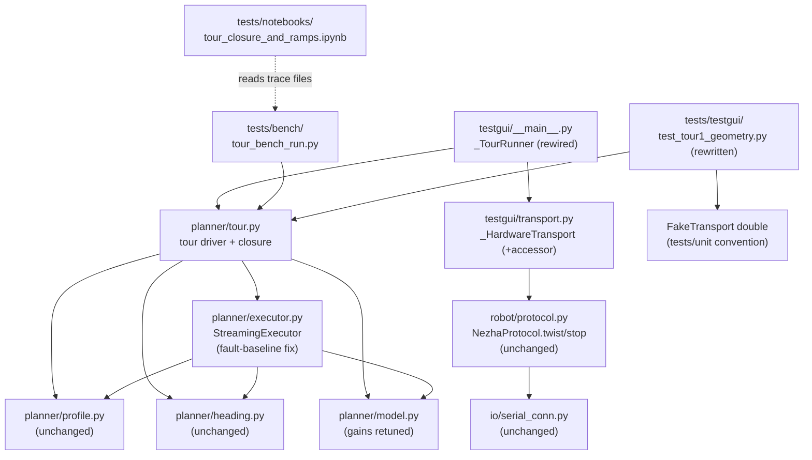
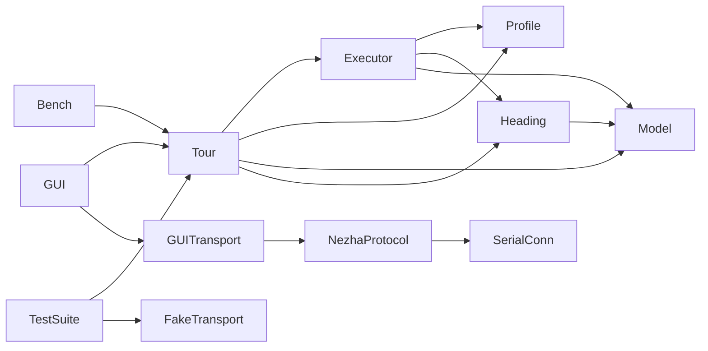

<!-- CLASI: Before changing code or making plans, review the SE process in CLAUDE.md -->

# Architecture Update — Sprint 107: TestGUI revival: tours execute and close

## Step 1: Understand the Problem

The stakeholder's stated end goal for the ENTIRE single-loop rebuild arc
(103–107): "demonstrate that the tours that we have in our test GUI
actually execute... I want those tours to be closed. I want to see charts
in Jupyter Notebooks that show nice acceleration and deceleration on
straights and turns." Sprint 106 built the only thing that can make a tour
execute under the post-102 architecture (host-side profiled twists); this
sprint wires that capability to the TestGUI's existing tour buttons, proves
closure on the bench, and produces the notebook.

This sprint's own reading of the current tree (not assumed from the sprint
stub) surfaces four material findings:

1. **`testgui/binary_bridge.py`'s D/RT translation targets envelope arms
   that no longer exist.** `translate_command()` routes `D`/`RT` through
   `legacy_verbs.BINARY_DISPATCH` to build `segment`/`replace` envelopes
   (per that module's own 097-era docstring: "R/TURN/G... translate to an
   open-loop `segment`/`replace` envelope"). Reading `protos/envelope.proto`
   directly confirms the current `CommandEnvelope.cmd` oneof carries
   exactly **`twist`/`config`/`stop`** — no `segment`/`replace` arm exists.
   Those arms belonged to the pre-102 on-robot `Motion::SegmentExecutor`,
   deleted in the single-loop rebuild. Every tour step the TestGUI sends
   today is therefore silently targeting dead wire vocabulary — confirmed
   consistent with `nezha-facade-and-midlayer-dead-verb-residue.md`'s own
   listing of `testgui/binary_bridge.py` as known-broken dead-verb residue.
2. **`SimTransport`'s backing library was deleted wholesale at sprint 102,
   not merely left stale.** `io/sim_conn.py`'s `SimConnection` and
   `tests/testgui/test_tour1_geometry.py` both resolve to
   `tests/_infra/sim/build/libfirmware_host.{dylib,so}`. `git log --
   tests/_infra/sim` shows the entire `tests/_infra/sim/` directory
   (`CMakeLists.txt`, `sim_api.cpp`, `firmware.py`, `smoke_check.py` — 226 +
   895 + 590 + 81 lines) was **deleted** by commit `72d8be7e` ("feat(102-005):
   delete Elite plumbing + banner-only stub main"). The directory does not
   exist in the working tree today. `test_tour1_geometry.py`'s own
   `_LIB_PRESENT` guard means that file **silently skips**, not fails, every
   time `uv run python -m pytest` runs (and `tests/testgui/` is not even in
   `pyproject.toml`'s `testpaths` — dropped at 102) — it has not actually
   executed since before the rebuild. Sprint 105 built a DIFFERENT sim
   harness (`tests/sim/support/sim_api.h`, a C++ class linked directly into
   pytest-driven host-build test binaries) with no ctypes-callable C ABI
   equivalent to the deleted one — there is no drop-in replacement library
   for `io/sim_conn.py` to point at. Building one is a genuinely new
   engineering task (a fresh ctypes C ABI over `SimApi`), not "point the
   existing wiring at a rebuilt artifact."
3. **Sprint 106's `StreamingExecutor` has one shipped-but-unfixed production
   bug and one un-promoted bench finding that would make EVERY tour run
   fail immediately if left as-is**: the fault-check baseline-exclusion gap
   (`executor-fault-check-needs-baseline-exclusion.md` — the executor
   fault-stops on tick 2 of every real run, 100% reproducible, because
   `kFaultI2CSafetyNet` is latched from boot) and the heading-loop default
   gains that overshoot a profiled turn on this bench rig by up to ~32%
   (`heading-loop-default-gains-overshoot-on-bench-rig.md`). Both were
   found and worked around ad hoc in 106-006's own bench script, never
   promoted into production `planner/` code. A tour chains 7+ legs through
   the SAME executor those bugs live in — without fixing them at the
   source, this sprint's own tour driver would need to reimplement both
   workarounds itself, and every future caller would inherit the same
   footgun.
4. **The tour GEOMETRY is a real, reusable asset; the completion-detection
   mechanism is not.** `TOUR_1`/`TOUR_2` (`testgui/commands.py`) are
   authored, tuned leg sequences (7-leg closing loops) that took real
   design effort to shape correctly. `_TourRunner`'s `_wait_for_idle()`
   SNAP-poll mechanism, by contrast, is pure wire-protocol plumbing tied to
   the retired `mode=I`/`active` telemetry semantics of the deleted
   on-robot executor — sprint 106's `StreamingExecutor.run()` already knows
   synchronously when a leg finishes (no polling needed at all). Reusing
   the geometry while discarding the completion mechanism is not a
   judgment call this sprint invents — it is what the sprint stub's own
   Solution steer already named ("Tour definitions re-expressed as
   host-planner calls... Completion detection moves from `SNAP mode=I`
   polling to whatever telemetry-based signal 106's planner exposes").

## Step 2: Identify Responsibilities

1. **Planner production hardening** (`planner/executor.py`,
   `planner/model.py`) — fixes two real bugs/gaps sprint 106 shipped but did
   not have bench time to promote to production; changes for a reason
   independent of tours existing at all (any future planner caller
   benefits). No dependency on anything else in this sprint.
2. **Tour geometry → chained execution + closure bookkeeping** (new
   `planner/tour.py`) — a distinct responsibility from a single profiled
   run (sprint 106's own scope): sequencing MULTIPLE leg runs and computing
   whole-tour pose closure. Depends on responsibility 1 (the executor it
   chains) and on `commands.py`'s existing `TOUR_1`/`TOUR_2` geometry
   (read-only; no change to that data).
3. **TestGUI transport/tour-button rewire** (`testgui/__main__.py`,
   `testgui/transport.py`) — changes for a reason distinct from tour
   execution logic itself (Qt threading, button enablement, canvas/log
   wiring). Depends on responsibility 2 (calls the tour driver) and needs a
   new, narrow accessor from `transport.py` (exposing the underlying
   `NezhaProtocol` the tour driver needs).
4. **Tour test-suite rewrite** (`tests/testgui/test_tour1_geometry.py`,
   `test_tour_stop.py`, `test_tour_idle_detection.py`) — changes because the
   thing being tested changed shape (responsibilities 2/3), and because the
   OLD backing fixture (the deleted ctypes sim) is gone. Depends on 2 and 3
   existing to have something correct to test against.
5. **Bench-runnable tour proof + trace capture** (new `tests/bench/`
   script) — this sprint's own bench-runnable Definition of Done; depends
   on 1–3.
6. **The deliverable notebook** (new `tests/notebooks/`) — depends on 5's
   captured traces existing; the stakeholder's own literal, named
   deliverable.

## Step 3: Define Subsystems and Modules

### New

- **`host/robot_radio/planner/tour.py`** — Purpose: run a named, ordered
  sequence of straight/turn legs through a `StreamingExecutor`, recording
  each leg's outcome and the tour's own whole-run pose closure. Owns
  `TOUR_1`/`TOUR_2`'s raw wire-string geometry as its own module-level data
  (moved here from `testgui/commands.py` — Decision 3) — the domain-layer
  source of truth for tour geometry, independent of any GUI. Boundary:
  inside — the geometry data itself, parsing it into typed leg specs, the
  per-leg run loop (build a `profile.py` sequence, run it through the
  caller-supplied executor, capture the measured pose before leg 1 and
  after the final leg), and closure-delta computation; outside —
  profile math (calls `profile.py`), pacing/safety/preemption (calls
  `executor.py`, does not reimplement any binding requirement), heading
  correction (calls `heading.py` indirectly via the executor it is handed),
  the wire/transport itself (accepts a `TwistTransport`-compatible object
  from the caller, same as `executor.py` does — never imports
  `NezhaProtocol` directly), and any GUI or trace-file-format concern (a
  per-leg row-callback hook is the only surface offered to callers that
  want to capture a trace — this module itself writes nothing to disk).
  Serves SUC-033.
- **`tests/bench/tour_bench_run.py`** — Purpose: this sprint's own
  bench-runnable proof — run Tour 1 and Tour 2 for real, capture per-leg
  traces and tour closure. Boundary: inside — HITL orchestration
  (`.claude/rules/hardware-bench-testing.md`'s standing verification gate),
  CSV/JSON trace writing (mirrors `profiled_motion_verify.py`'s own
  `write_trace()` shape, extended to a whole tour), and closure gate
  checking; outside — the tour-execution/closure-math logic itself (calls
  `planner/tour.py`, does not reimplement it). Serves SUC-036.
- **`tests/notebooks/tour_closure_and_ramps.ipynb`** (exact filename,
  implementer's call) — Purpose: chart the stakeholder's own literal,
  stated deliverable from the captured bench traces. Boundary: inside —
  loading trace files and rendering charts (per the `dataviz` skill);
  outside — everything else (no new data generation, no robot/sim
  dependency; reads files sprint's ticket 005 already wrote). Serves
  SUC-037.

### Modified (interface addition/behavior fix, no removal)

- **`host/robot_radio/planner/executor.py`** — `StreamingExecutor.begin()`
  captures a baseline `fault_bits` from the first drained frame; `tick()`'s
  fault check becomes baseline-relative (SUC-031). No change to any other
  binding-requirement mechanism, no change to `TwistTransport`'s protocol
  surface.
- **`host/robot_radio/planner/model.py`** — `PlannerParams.heading_kp`
  default `2.0 → 0.4`; `heading_omega_clamp` default `0.5 → 0.2`
  (SUC-032). No new fields, no change to `load()`'s override plumbing.
- **`host/robot_radio/testgui/transport.py`** — `_HardwareTransport` (the
  base `SerialTransport`/`RelayTransport` share) gains a narrow accessor
  exposing its already-constructed `NezhaProtocol` instance, so
  `planner/tour.py` can be handed a real `TwistTransport` without
  `testgui` reaching into `_HardwareTransport`'s private state. No change
  to `Transport`'s existing `connect()`/`send()`/`command()` surface;
  `SimTransport` gains no equivalent accessor this sprint (SUC-034's own
  documented scope boundary — see Step 1 finding 2).
- **`host/robot_radio/testgui/__main__.py`** — `_TourRunner.run()`'s body
  is rewired to call `planner/tour.py` against the connected transport's
  new accessor instead of sending `D`/`RT` wire strings through
  `binary_bridge.translate_command()`; `_wait_for_idle()` and its SNAP-poll
  machinery are removed (no longer needed — SUC-033's tour driver already
  knows synchronously when a leg finishes). Tour buttons' enable/disable
  logic gains a transport-type check (real hardware only this sprint).
  `_TourRunner`'s public shape (`log_line`/`finished` signals, `stop()`)
  is unchanged — only its internal `run()` implementation changes, so
  nothing else in `__main__.py` that references `_TourRunner` needs to
  change.
- **`tests/testgui/test_tour1_geometry.py`, `test_tour_stop.py`** —
  rewritten to run against a `FakeTransport`-backed harness (mirroring
  `tests/unit/test_planner_executor.py`'s own double convention) instead of
  the deleted `tests/_infra/sim` ctypes library (SUC-035).
- **`pyproject.toml`** — `testpaths` gains the rewritten subset of
  `tests/testgui/` (SUC-035).
- **`host/robot_radio/testgui/commands.py`** — `TOUR_1`/`TOUR_2`'s raw
  wire-string geometry MOVES to `planner/tour.py` (Decision 3, corrected by
  this document's own self-review); `commands.py`'s `TOURS` dict becomes a
  read FROM `planner.tour.TOUR_1`/`TOUR_2` (GUI labeling only). No other
  field of `commands.py` (`COMMANDS`, `build_wire_string()`,
  `parse_tlm_mode()`, `goto_distance()`/`goto_reached()`) changes.

### Removed (full responsibility, deleted)

- **`_TourRunner._wait_for_idle()`** (`testgui/__main__.py`) — the SNAP-poll/
  `frame.active` completion-detection mechanism. Superseded entirely by
  `StreamingExecutor.run()`'s own synchronous per-leg completion (SUC-033).
  Nothing else in the tree calls `_wait_for_idle()` (grep-verified: it is a
  private method of `_TourRunner`, called only from `_TourRunner.run()`
  itself).
- **`tests/testgui/test_tour_idle_detection.py`** — tests the mechanism
  above; deleted (or, implementer's call, rewritten to cover whatever
  narrow completion-detection behavior remains relevant — ticket 004's own
  call, since nothing this sprint adds needs a poll-based completion
  check).

### Unchanged (survive intact, no code touched this sprint)

- **`testgui/commands.py`'s `build_wire_string()`/`COMMANDS`** — the
  individual command-row schema for S/T/D/R/TURN/RT/G is untouched — those
  rows still build `D`/`RT`/etc. wire strings for the GUI's manual
  single-command rows, independent of the tour buttons.
  `parse_tlm_mode()`/`goto_distance()`/`goto_reached()` untouched. (`TOUR_1`/
  `TOUR_2`/`TOURS` themselves move — see Modified, Decision 3.)
- **`testgui/binary_bridge.py`** — untouched. Its D/RT/R/TURN/G→
  `segment`/`replace` translation remains exactly as broken as Step 1
  finding 1 describes for every OTHER caller (the manual command rows, the
  `_GotoRunner`) — only the TOUR path is rerouted around it this sprint. A
  fresh follow-up issue is filed for the remainder (see this document's
  Step 7).
- **`planner/profile.py`, `planner/heading.py`** — reused as-is by
  `planner/tour.py`/the tour driver; no change.
- **`robot/protocol.py` (`NezhaProtocol`), `io/serial_conn.py`
  (`SerialConnection`)** — gain a new caller (the tour driver, via
  `transport.py`'s new accessor); no code in either changes.
- **`io/sim_conn.py`, `SimTransport`** — untouched; both remain
  non-functional for tour purposes (Step 1 finding 2), explicitly deferred,
  not silently ignored.
- **`nav/`, `io/calibrate.py`, `testkit/safety.py`** — untouched; still out
  of every prior sprint's authority (106 Decision 3, carried forward).

## Step 4: Diagrams

### Component diagram — after this sprint

### Dependency graph — after this sprint

No cycles. `Tour`'s fan-out is 4 (`Executor`, `Profile`, `Model`,
`Heading`) — at the top of, but within, the 4-5 guideline; justified
because `Tour` is `profiled_motion_verify.py`'s own `run_leg()` promoted to
production and parameterized over an ordered leg list, and that bench
script already needed exactly these four collaborators for a single leg.
`Tour` never imports `NezhaProtocol` — it accepts a `TwistTransport`-shaped
object from its caller, the same pattern `Executor` itself already uses,
keeping `Tour` decoupled from the wire layer. `GUI`/`Bench`/`TestSuite` are
three independent consumers of `Tour`, none of which depend on each other —
the "no duplicated per-leg execution logic between the GUI and the bench
script" acceptance criterion (SUC-033) is structurally enforced by this
shape, not just a code-review convention.

### Entity/data note

No persisted or relational data model changes this sprint. Trace files
(`tests/bench/out/tour_*.csv/.json`) are a new FILE convention, not a
schema — same shape sprint 106 already established (`profiled_*.csv/.json`),
extended to cover a multi-leg tour rather than one leg. No ER diagram
required.

## Step 5: Complete the Document

### What Changed

- **Host**: `planner/executor.py` gains baseline-relative fault handling;
  `planner/model.py`'s heading-loop gain defaults are retuned to the
  bench-proven values; a new `planner/tour.py` owns `TOUR_1`/`TOUR_2`'s
  geometry (moved from `testgui/commands.py`) and chains it through the
  executor with closure bookkeeping; `testgui/commands.py`'s `TOURS` dict
  reads that geometry back for GUI labeling; `testgui/transport.py` gains a
  narrow `NezhaProtocol` accessor; `testgui/__main__.py`'s `_TourRunner` is
  rewired onto the new tour driver and its SNAP-poll completion mechanism
  is removed; a new `tests/bench/tour_bench_run.py` captures real bench
  traces; a new notebook charts them.
- **Tests**: `tests/testgui/test_tour1_geometry.py`/`test_tour_stop.py` are
  rewritten against a fake-transport harness (no dependency on the deleted
  `tests/_infra/sim`); `test_tour_idle_detection.py` is deleted or
  rewritten; `tests/testgui/` (the rewritten subset) rejoins
  `pyproject.toml`'s `testpaths`.
- **No wire schema change** — this sprint sends nothing new over the wire;
  it uses `twist`/`stop` exactly as sprint 106 already proved.
- **No firmware change** — every change this sprint makes is host-side
  Python (planner package, TestGUI) plus tests/tooling.

### Why

Per the sprint's own goal and the stakeholder's literal words: the tour
buttons are the stakeholder-visible proof that the entire single-loop
rebuild arc (102–106) actually works end to end. Sprint 106 built the only
mechanism that CAN drive a tour under the current architecture; this
sprint is the wiring and proof pass that makes that visible and closes the
arc.

### Impact on Existing Components

- **`planner/executor.py`/`planner/model.py`** — both changes are
  narrowly-scoped bug fixes/gain retunes to code sprint 106 shipped this
  same arc; every existing `tests/unit/test_planner_executor.py` case that
  does not specifically assert the OLD (non-baseline-relative) fault
  behavior is unaffected, and any that does is updated as part of SUC-031.
  `profiled_motion_verify.py` (106-006) can drop its own
  `BaselineFaultMaskingTransport` wrapper now that the fix lives in
  production `executor.py` — not required this sprint, but an immediate,
  free simplification available to a future touch of that script.
- **`testgui/transport.py`** — a new accessor is additive; no existing
  caller of `_HardwareTransport`'s current public surface changes behavior.
- **`testgui/__main__.py`** — `_TourRunner`'s public signals/`stop()` are
  unchanged, so nothing outside `_TourRunner` itself needs to change; the
  tour buttons' tooltip/enablement text changes (real-hardware-only scope).
- **`testgui/binary_bridge.py`** — UNCHANGED, and therefore still broken
  for every non-tour caller (manual `D`/`RT`/`R`/`TURN`/`G` command rows,
  `_GotoRunner`) exactly as it was before this sprint. This sprint does not
  claim to fix binary_bridge.py generally — only the tour path is rerouted
  around it. Flagged explicitly (Step 7 and a fresh follow-up issue) so
  this is a documented, deliberate scope boundary, not an accidental gap.
- **Sprint 106's own `profiled_motion_verify.py`** — unaffected; still
  works exactly as it does today (its own CLI overrides for heading gains
  remain functional even though they are no longer strictly necessary
  given the new `PlannerParams` defaults).

### Migration Concerns

- **No data migration** — no persisted schema change.
- **No wire schema change** — `twist`/`stop` only, already proven by
  sprint 106.
- **Behavior-preservation risk**: the `PlannerParams` default-gain change
  (SUC-032) changes behavior for EVERY caller that does not explicitly
  override `heading_kp`/`heading_omega_clamp`, not just tours —
  `profiled_motion_verify.py` (106-006) is one such caller, but its own
  explicit CLI defaults happen to already match the new field defaults
  (`None` → falls through), so its behavior is unchanged in practice; any
  FUTURE caller that relies on the OLD defaults (none exist today) would
  see different behavior. Documented here so it is not a silent surprise.
- **Deployment sequencing**: ticket 001 (executor/model fixes) must land
  and its own unit tests pass before ticket 002 (tour driver) is built
  against it — a tour chaining 7 legs would immediately fault-stop on leg 1
  without the SUC-031 fix. Ticket 002 has no dependency on ticket 003.
  Ticket 003 (TestGUI rewire) depends on 002 (calls its public API).
  Ticket 004 (test rewrite) depends on 002 and 003 both existing to have a
  correct target to test. Ticket 005 (bench run) depends on 003 (uses the
  same live surface, proven end to end) — strictly, only on 002, but is
  sequenced after 003 so the SAME bench session that proves the GUI path
  also captures the trace, avoiding two separate bench sessions. Ticket 006
  (notebook) depends on 005's captured traces existing.
- **Rollback**: normal git revert for any of these changes; all are
  small, localized, additive-or-narrowly-corrective diffs with no new
  persisted state and no firmware involvement.

## Step 6: Document Design Rationale

**Decision 1 — Real-hardware transport only this sprint; `SimTransport`
tour support is explicitly out of scope, not silently deferred.**
- *Context*: Step 1 finding 2 — `SimTransport`'s backing ctypes library
  (`tests/_infra/sim/`) was deleted wholesale at sprint 102 ticket 005 (`git
  show 72d8be7e --stat`); sprint 105 built an unrelated C++-only sim
  harness with no ctypes ABI. The sprint stub's own steer named sim-mode
  tours as a possible in-scope item ("sim via 105's `sim_api`... so tours
  can be exercised headless/in CI") and 105's own architecture Decision 4
  pointed at "sprint 107 builds `io/sim_conn.py`" — but `io/sim_conn.py`
  ALREADY EXISTS (reconciled against the now-deleted 081-004 ABI) with
  nothing left to build there; the actual gap is a NEW ctypes C ABI over
  105's `SimApi` C++ class, which does not exist in any form today.
- *Alternatives considered*: (a) real-hardware-only this sprint, file a
  follow-up for sim-mode tours (chosen); (b) build a new ctypes ABI over
  `SimApi` this sprint so `SimTransport` tours work too; (c) attempt to
  resurrect `tests/_infra/sim` from git history and rebuild it against
  current `source/`.
- *Why this choice*: (b) is a genuinely new, non-trivial engineering task
  (design and implement a C-linkage export surface over a C++ harness that
  has never had one) with no existing consumer to validate its shape
  against — the exact "speculative generality against a sprint that hasn't
  been detailed yet" reasoning 105's own Decision 4 already used once for
  this same seam, and 104's Decision 3 used before that. (c) resurrects
  code that predates the 102 single-loop rebuild and would need a
  from-scratch reconciliation against `source/`'s current shape (the SAME
  kind of reconciliation `io/sim_conn.py`'s own header describes doing
  once already, for a different, now also-obsolete ABI) — strictly more
  work than (b) for the same missing capability. The stakeholder's own
  literal acceptance wording ("demonstrate that the tours... actually
  execute," backed by `.claude/rules/hardware-bench-testing.md`'s standing
  gate) is satisfied entirely by the real-hardware path — sim-mode tours
  are a CI/headless convenience, not part of the stated acceptance bar.
- *Consequences*: tour buttons are disabled with a clear tooltip when
  connected via Sim (SUC-034); `tests/testgui/`'s rewritten tests use a
  `FakeTransport` double (SUC-035) rather than the sim, so CI coverage of
  the tour CONTROL FLOW does not depend on this gap either. A fresh
  follow-up issue is filed recommending a new `sim_api` ctypes ABI as its
  own future sprint's scope, once there is a concrete consumer (this
  sprint's own `planner/tour.py` gives that future sprint a real interface
  to validate the ABI's shape against, unlike today).

**Decision 2 — Fix `StreamingExecutor`'s fault-baseline gap and retune
`PlannerParams`' heading-loop defaults IN PRODUCTION `planner/` code, not
as a tour-local workaround.**
- *Context*: Step 1 finding 3 — both issues were found and worked around
  ad hoc in 106-006's bench script only; a tour chains many legs through
  the same executor.
- *Alternatives considered*: (a) fix both at the source in `executor.py`/
  `model.py` (chosen); (b) reimplement `profiled_motion_verify.py`'s own
  `BaselineFaultMaskingTransport` wrapper and CLI gain overrides inside
  `planner/tour.py` instead.
- *Why this choice*: (b) duplicates a known-correct fix pattern for no
  reason other than avoiding a two-line change to `executor.py`/
  `model.py` — exactly the kind of "leave a proven fix stranded in one
  script" anti-pattern the filed issues themselves recommend against
  (`executor-fault-check-needs-baseline-exclusion.md`'s own "Recommended
  fix" section explicitly asks for this). (a) benefits every current and
  future caller, including 106's own bench script (which can drop its
  wrapper, though doing so is not required this sprint).
- *Consequences*: `PlannerParams()`'s behavior changes for every caller
  that does not override the two heading fields (Migration Concerns, above)
  — a deliberate, documented, low-risk change (the OLD defaults were never
  bench-validated to begin with; the NEW ones are bench-proven, if not
  yet swept to a tight tolerance).

**Decision 3 — `TOUR_1`/`TOUR_2`'s raw wire-string geometry MOVES into
`planner/tour.py` (domain layer owns the data); `testgui/commands.py`
imports it back for GUI labeling. `planner/tour.py` parses it into typed
leg specs rather than hand-transcribing a new data structure.**
- *Context*: Step 1 finding 4 — the tour geometry is real, tuned, reusable
  authored content; `commands.py` is its only home today. A first draft of
  this document had `planner/tour.py` (domain) read the constants FROM
  `testgui/commands.py` (presentation) — caught in this document's own
  self-review as backwards against the project's standing
  `[Presentation]→[Domain]→[Infrastructure]` dependency direction (a
  domain module should not depend on a presentation module for data, even
  read-only, even for two plain constants).
- *Alternatives considered*: (a) move `TOUR_1`/`TOUR_2` into `planner/
  tour.py` as the new source of truth, `commands.py` imports them back for
  its `TOURS` dict (chosen); (b) leave the constants in `commands.py`,
  have `planner/tour.py` import them (the caught, backwards-direction
  draft); (c) hand-transcribe `TOUR_1`/`TOUR_2` into a new typed data
  structure living in `planner/tour.py`, leaving `commands.py`'s copies as
  now-unused/legacy duplicates.
- *Why this choice*: (c) creates two sources of truth for the same 7+14
  leg magic numbers with no structural guard against them silently
  drifting apart — a real, concrete correctness hazard for exactly the
  kind of data (leg distances/angles) where a silent transcription error
  is easy to make and hard to notice. (b) is functionally fine (no
  duplication) but gets the dependency direction backwards for zero
  benefit — nothing about `TOUR_1`/`TOUR_2` is presentation-specific (they
  are plain `list[str]` wire-string data with no Qt/GUI coupling), so
  there is no reason `planner/` (domain) should depend on `testgui/`
  (presentation) to read them. (a) is strictly better than (b) at equal
  cost: moving two constants and updating one import is a trivial diff,
  fully resolves the direction issue, and still keeps a single,
  already-tuned source of truth with a thin parser unit-tested directly
  against it (SUC-033's own acceptance criterion) — a transcription error
  would show up as a parser unit-test failure or a visibly wrong leg
  count/magnitude, not a silent drift.
- *Consequences*: `commands.py`'s `TOURS: dict[str, list[str]]` (used only
  for GUI button labeling/tooltips) becomes `{"Tour 1": tour.TOUR_1,
  "Tour 2": tour.TOUR_2}`, a read FROM `planner/tour.py` — the correct
  `[Presentation]→[Domain]` direction. No other caller of `commands.
  TOUR_1`/`TOUR_2`/`TOURS` exists today (grep-verified: `__main__.py`'s own
  `TOURS` import is the only consumer), so this is a clean, low-risk move
  with a single call-site update.

## Step 7: Flag Open Questions

1. **Does `StreamingExecutor`'s own continuous telemetry drain compete
   with, or complement, the TestGUI's existing `on_telemetry` canvas-update
   callback path?** `_HardwareTransport` already delivers frames to the
   canvas/avatar via a push callback as they arrive; `StreamingExecutor`
   pulls frames via `read_pending_binary_tlm_frames()`. Whether these are
   two independent consumers of the same underlying queue (fine) or would
   starve each other (a real bug) is not resolved by this document — ticket
   003's own implementation investigates and, if they compete, either taps
   the existing callback path to feed the executor or drives canvas updates
   from the executor's own `latest_frame` instead.
2. **Exact tour-closure tolerance** (position + heading) is left to ticket
   005's own bench session, chosen empirically from the captured runs with
   documented headroom (matching 106-006/086-004's own "measure then set
   tolerance" precedent) — the pre-098 tours' now-inapplicable 100mm figure
   (measured against a completely different, open-loop RT-based control
   scheme) is not assumed to carry over.
3. **Resolved during this document's own self-review** (recorded here for
   the record, not left open): an earlier draft had `planner/tour.py`
   (domain) read `TOUR_1`/`TOUR_2` FROM `testgui/commands.py`
   (presentation) — backwards against the project's `[Presentation]` →
   `[Domain]` → `[Infrastructure]` direction. Decision 3 corrects this: the
   geometry now lives in `planner/tour.py`, and `commands.py` reads it back
   for GUI labeling. A future sprint could go further and move the
   geometry to a presentation-AND-domain-independent location (e.g. a
   `data/tours/*.json` file, mirroring `data/robots/*.json`'s own
   convention) if a THIRD consumer ever needs it with no Python-import
   coupling to `planner/` at all — not built speculatively here, since
   only two consumers (`planner/tour.py` itself and `testgui`) exist today.
4. **A new ctypes C ABI over `SimApi` for sim-mode tours** (Decision 1) is
   explicitly NOT this sprint's job. A fresh follow-up issue is filed
   recommending it as a future sprint's scope, now that `planner/tour.py`
   gives that future work a concrete, already-proven consumer interface to
   design the ABI's shape against.
5. **`testgui/binary_bridge.py`'s remaining dead-verb translation**
   (R/TURN/G → deleted `segment`/`replace` envelope arms, confirmed by this
   sprint's own reading of `protos/envelope.proto` — Step 1 finding 1) is
   untouched and still broken for every non-tour caller. A fresh follow-up
   issue is filed documenting this precisely (the existing
   `nezha-facade-and-midlayer-dead-verb-residue.md` issue names
   `binary_bridge.py` generally but predates this sprint's own confirmation
   that the specific failure mode is "targets envelope arms that no longer
   exist on the wire at all," not merely "calls a retired `NezhaProtocol`
   method") — a future sprint's scope, not this one's.
