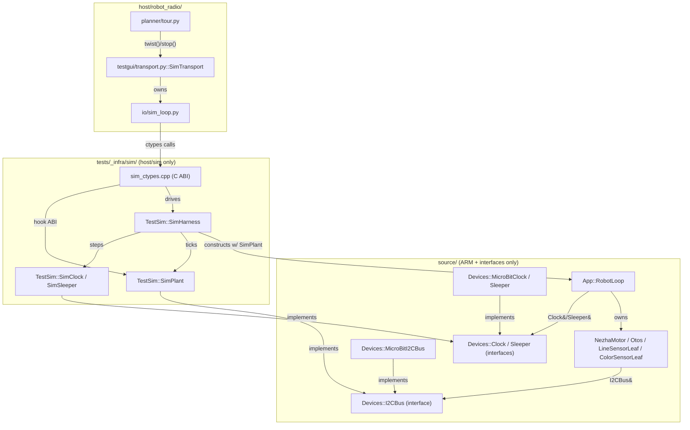
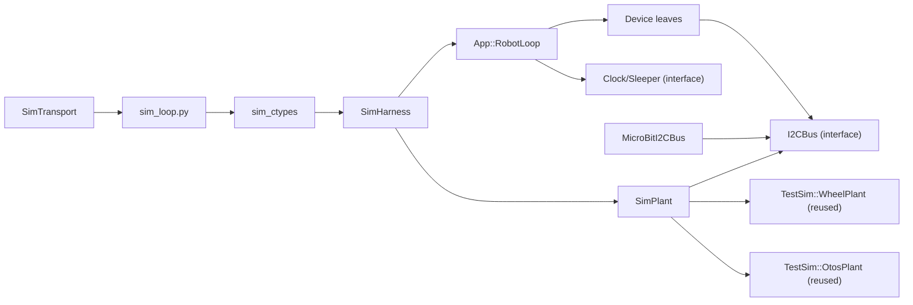

<!-- CLASI: Before changing code or making plans, review the SE process in CLAUDE.md -->

# Architecture Update -- Sprint 108: Pure I2CBus/Clock interfaces and a real SimPlant simulator (sim-mode tours)

This document follows the binding, stakeholder-approved plan at
`clasi/issues/plan-pure-i2cbus-clock-interfaces-a-real-simplant-simulator.md`
(the "master plan"). It is not re-litigated here; this document turns it
into module boundaries, diagrams, and rationale, and resolves the three
satellite issues it also closes: `sim-api-ctypes-abi-for-sim-mode-tours.md`,
`binary-bridge-segment-replace-arms-deleted.md`, and
`color-sensor-apds-probe-success-on-failure.md`.

## Step 1: Understand the Problem

Today's host simulator is built on a **scripted-FIFO fake bus**
(`i2c_bus_host.cpp`'s `scriptWrite`/`scriptRead`, living inside
`i2c_bus.h` behind `#ifdef HOST_BUILD`) plus a per-cycle write-count
**predictor** (`tests/sim/support/sim_api.h`'s `SimApi` + `DutyPredictor`).
Three problems compound:

1. `source/devices/i2c_bus.h` is a **concrete class with two `#ifdef`
   forks** — the production header carries test-only scripting machinery,
   and the ARM build depends on a CMake `FILTER EXCLUDE` hack to avoid
   linking the host fork's `.cpp`. The same fork exists in
   `source/devices/clock.h`.
2. The simulator **predicts** firmware I2C behavior (from a duty-write
   count) instead of **responding** to what the firmware actually put on
   the wire — under an arbitrary twist stream this desyncs, and the wheels
   diverge (left encoder freezes, right runs away).
3. Register-level fault injection (13 pytest scenarios) is scripted in
   **C++**, one bespoke harness per scenario, with no path for a Python
   caller (the ctypes-driven TestGUI Sim backend, or CI) to inject the same
   faults without a C++ rebuild.

The fix is architectural, not a patch: split `I2CBus`/`Clock` into pure
interfaces (mirroring the existing `App::Transport` pattern), replace the
scripted fake with one honest simulator (`SimPlant`) that parses the real
wire protocol and integrates real physics, and expose all scripting
through a Python-callable read/write hook on `SimPlant` — never on the
interface itself.

## Step 2: Identify Responsibilities

Distinct responsibilities this sprint introduces or changes, grouped by
what changes together:

- **The I2C contract** (what any bus implementation must do for a device
  leaf to talk to it) — changes only when the wire-level contract itself
  changes (add a method firmware actually calls). Today: `write`, `read`,
  `clearanceSafetyNetCount()` — grep-confirmed as the only members any
  command-handler or device leaf calls outside `i2c_bus.h`/`.cpp`
  themselves.
- **Real bus I/O on the ARM target** (MicroBitI2C transaction plumbing,
  re-entrancy guard, clearance timers, per-device stats, ring log) —
  changes only for real-hardware reasons (errata workarounds, new
  diagnostics for a live bus).
- **Simulated bus protocol + physics** (parsing the Nezha/OTOS wire frames,
  integrating wheel/OTOS physics, holding fault-injection knobs) — changes
  when a new simulated device or fault model is added; independent of both
  the real bus and the interface.
- **Python-side test/scripting surface** (the read/write hook + its ctypes
  export) — changes when a new register-level scenario needs scripting;
  independent of the physics it wraps.
- **The composed sim harness** (wiring the real `App::RobotLoop` graph to a
  `SimPlant`, stepping both, draining telemetry) — changes when the
  firmware graph's construction shape changes; a thin composition root, not
  a behavior owner.
- **The ctypes ABI + host Python consumer** (`sim_ctypes.cpp`,
  `sim_loop.py`) — changes when a new capability needs exposing to Python;
  owns marshaling only, no simulation logic of its own.
- **The time/yield contract** (`Clock`/`Sleeper`) — same shape as the I2C
  contract, entirely independent of it (a different seam, not a special
  case of the bus).
- **TestGUI's Sim transport wiring** — changes when the GUI's Sim backend
  needs a different underlying connection; independent of everything above
  except its dependency on the ctypes ABI's exported shape.
- **The color sensor's own probe-status logic** — a one-leaf, self-
  contained bug fix (uses an existing status-returning read already on the
  class); does not touch the bus contract.

## Step 3: Define Subsystems and Modules

### `Devices::I2CBus` (interface) — `source/devices/i2c_bus.h`
**Purpose**: Declares the I2C contract a device leaf depends on.
**Boundary**: Inside — `write()`, `read()`, `clearanceSafetyNetCount()`,
virtual dtor. Outside — any implementation detail (real transaction
mechanics, scripted fakes, physics). No data members, no `#ifdef`.
**Serves**: SUC-038.

### `Devices::MicroBitI2CBus` — `source/devices/microbit_i2c_bus.{h,cpp}`
**Purpose**: Talks to the real MicroBitI2C peripheral.
**Boundary**: Inside — everything `i2c_bus.cpp` did (re-entrancy guard,
lazy clearance timers, per-device stats, ring log, IRQ guard). Outside —
anything not reachable from a real ARM I2C transaction.
**Serves**: SUC-038.

### `TestSim::SimPlant` — `tests/_infra/sim/sim_plant.{h,cpp}`
**Purpose**: Behaves as an honest I2C bus for the simulated robot.
**Boundary**: Inside — parsing Nezha `0x60`/`0x46` frames and OTOS register
protocol off the wire, owning two `WheelPlant` + one `OtosPlant`, `tick()`
physics stepping, fault-injection knobs (disconnect, wedge, dropout, OTOS
drift/noise), the read/write hook wrappers. Outside — deciding what
firmware does with the bytes it reads/writes (that is the firmware's own
job, unchanged), and any Python/ctypes marshaling (that is `sim_ctypes`'s
job).
**Serves**: SUC-040, SUC-041, SUC-044.

### `TestSim::SimHarness` — `tests/_infra/sim/sim_harness.h`
**Purpose**: Composes the real firmware graph against a `SimPlant`.
**Boundary**: Inside — constructing `App::RobotLoop` with a `SimPlant` in
the `I2CBus&` slot, `boot()`, `step(n)` (tick plant + run one loop cycle),
injecting commands via `serialLink`/`armor*Command`, draining telemetry,
exposing true pose. Outside — any simulation physics itself (delegates to
`SimPlant`) and any ctypes marshaling.
**Serves**: SUC-041.

### `sim_ctypes` — `tests/_infra/sim/sim_ctypes.cpp`
**Purpose**: Exposes `SimHarness`/`SimPlant` to Python as a flat C ABI.
**Boundary**: Inside — create/destroy/step/inject_twist/inject_stop/
drain_tlm/true-pose exports, fault-condition setters, the hook-registration
exports (`sim_set_read_hook`/`sim_set_write_hook`/`sim_default_read`/
`sim_default_write`). Outside — any decision logic; every export is a thin
call-through.
**Serves**: SUC-040, SUC-042.

### `sim_loop` — `host/robot_radio/io/sim_loop.py`
**Purpose**: Presents the sim as a `TwistTransport`-shaped Python object.
**Boundary**: Inside — `twist()`/`stop()`/`read_pending_binary_tlm_frames()`,
a wall-clock tick thread stepping the sim, a `set_read_hook`/
`set_write_hook` Python wrapper (ctypes `CFUNCTYPE`) with a `pass_through()`
helper. Outside — anything GUI-specific (that is `transport.py`'s job) and
anything about WHAT a hook scripts (that is the test author's job).
**Serves**: SUC-040, SUC-042.

### `SimTransport` (updated) — `host/robot_radio/testgui/transport.py`
**Purpose**: Backs the TestGUI's Sim connection.
**Boundary**: Inside — owning a `sim_loop` object across the tick-thread's
lifetime, `.protocol`, `suspend_telemetry_reader`/
`resume_telemetry_reader`, un-gated Tour buttons. Outside — sim physics,
ctypes marshaling, and (per SUC-043) any dependency on
`binary_bridge.translate_command()`'s dead `segment`/`replace` builders.
**Serves**: SUC-042, SUC-043.

### `Devices::Clock` / `Devices::Sleeper` (interfaces) — `source/devices/clock.h`
**Purpose**: Declares the time/yield contract the loop cycle depends on.
**Boundary**: Same pattern as `I2CBus` — pure interface, real vs. sim
implementations chosen by injection.
**Serves**: SUC-039.

### `Devices::MicroBitClock` / `Devices::MicroBitSleeper` — `source/devices/microbit_clock.{h,cpp}`
**Purpose**: Real time source / real sleep-and-yield.
**Serves**: SUC-039.

### `TestSim::SimClock` / `TestSim::SimSleeper` — under `tests/_infra/sim/`
**Purpose**: Steppable fake time source / sleep-and-yield counters for the
sim harness.
**Serves**: SUC-039, SUC-041.

### `Devices::ColorSensorLeaf` (fix only) — `source/devices/color_sensor.cpp`
**Purpose**: Unchanged (detects and reads the color sensor); this sprint
fixes only its APDS presence probe to require transaction status OK.
**Serves**: SUC-044.

## Step 4: Diagrams

### Component diagram

### Dependency graph (module fan-out, both trees)

No cycles: interfaces have zero outward dependencies; both concrete bus
implementations depend only on the interface; the sim harness depends on
the interface's concrete sim side plus the (unmodified) real loop; ctypes
and Python layer strictly downward. Fan-out: `SimPlant` (3: interface,
WheelPlant, OtosPlant) and `SimHarness` (2) both stay within the 4-5 no-
justification-needed bound.

## Step 5: What Changed / Why / Impact / Migration

### What Changed

- `source/devices/i2c_bus.h` reduced to a pure `I2CBus` interface (3
  methods + dtor). `source/devices/i2c_bus.cpp` and
  `source/devices/i2c_bus_host.cpp` deleted; replaced by
  `source/devices/microbit_i2c_bus.{h,cpp}`.
- `source/devices/clock.h` reduced to pure `Clock`/`Sleeper` interfaces.
  `clock_real.cpp`/`clock_host.cpp` deleted; replaced by
  `source/devices/microbit_clock.{h,cpp}`.
- `source/main.cpp:99` injects `MicroBitI2CBus` (was `I2CBus`); its
  `Clock`/`Sleeper` construction updated to `MicroBitClock`/
  `MicroBitSleeper`.
- `CMakeLists.txt:300-301`'s two FILTER-EXCLUDE lines are deleted (the
  files they excluded no longer exist).
- New `tests/_infra/sim/` tree (did not exist in the working tree before
  this sprint — the directory was deleted wholesale by commit `72d8be7e`):
  `sim_plant.{h,cpp}`, `sim_harness.h`, `sim_clock.{h,cpp}` (or colocated
  in the harness), `sim_ctypes.cpp`, `CMakeLists.txt`. `build.py`'s
  existing (currently dormant) `build_host_sim()` self-heals once this
  directory exists again.
- Deleted: `tests/sim/support/sim_api.{h,cpp}` (+ `DutyPredictor`), the 13
  register-scripting `tests/sim/unit/*_harness.cpp` files (replaced by
  Python hook tests), `host/robot_radio/io/sim_conn.py`.
- New `host/robot_radio/io/sim_loop.py`; `SimTransport`
  (`host/robot_radio/testgui/transport.py`) rewired onto it;
  `sim_prefs.py`'s fault knobs repointed at `SimPlant`'s setters; Sim Tour
  buttons un-gated (`__main__.py`).
- `source/devices/color_sensor.cpp`'s `beginStep()` APDS probe fixed to
  check transaction status.

### Why

Per the master plan's Context: the prior sim predicted instead of
responded, desyncing under a real twist stream; the interface carried
test-only scripting inside a production header behind `#ifdef`; three
parallel, duplicate sim implementations existed. This sprint replaces all
three sims with one, makes the interface genuinely pure (mirroring
`App::Transport`, an established pattern in this codebase), and moves
every scripting decision into Python where a test author can express a
fault scenario without a C++ rebuild.

### Impact on Existing Components

- Every device leaf (`NezhaMotor`, `Otos`, `LineSensorLeaf`,
  `ColorSensorLeaf`) is unaffected — they already hold `I2CBus&`/
  reference types and call only the 3 interface methods; nothing about
  their code changes.
- `App::RobotLoop` is unaffected in its own logic; only what gets injected
  into its bus/clock/sleeper references changes, at `main.cpp` (real) and
  `sim_harness.h` (sim) — never inside `RobotLoop` itself.
- `tests/sim/plant/{wheel_plant,otos_plant}.{h,cpp}` are reused verbatim
  (physics unchanged) — only their consumer changes, from ad hoc scenario
  harnesses to `SimPlant`'s owned instances.
- `tests/sim/support/fake_transport.h`/`wire_test_codec.*` are reused by
  `sim_harness.h` for command injection/telemetry decode, unchanged.
- `planner/tour.py` is unaffected — it already presents a
  transport-agnostic twist interface; `sim_loop.py` is built to satisfy
  that existing shape, not the other way around.
- `testgui/binary_bridge.py` is untouched beyond verifying `SimTransport`'s
  call graph never reaches its `segment`/`replace` builders (SUC-043) — no
  rewrite of its manual-command translation; that remains the filed
  issue's own separate, deferred scope (see Decision 4 below).

### Migration Concerns

- **CI goes red then green within this sprint, by design.** The 13
  register-scripting sim-unit tests are red the moment Stage 1 removes the
  scripted fake and green again once Stage 4's Python hook tests land. The
  ARM firmware build and every non-scripting test stay green throughout.
  This is the master plan's own explicit, approved transition and is
  called out in `sprint.md`'s Test Strategy so a mid-sprint CI failure is
  not mistaken for a regression.
- No data migration (no persisted schema changes). No deployment
  sequencing concern — firmware and host sim are independently built
  artifacts; a partially-migrated tree still produces a working ARM
  firmware build at every ticket boundary in Stage 1 and Stage 5.
- `docs/testgui/sim_error_profile.json`'s persisted keys are unaffected in
  shape; only their application path (`sim_conn` → `sim_loop`) changes.

## Step 6: Design Rationale

**Decision 1 — The hook lives on `SimPlant`, not on the `I2CBus`
interface.**
- *Context*: Master plan's Target architecture explicitly places the hook
  on `SimPlant`. A first-glance alternative would put an optional hook
  slot directly on `I2CBus` so any implementation (real or sim) could be
  scripted.
- *Alternatives considered*: (a) hook on `SimPlant` only (chosen — the
  plan's own directive); (b) hook as an optional member of the `I2CBus`
  interface itself, implemented as a no-op by `MicroBitI2CBus`.
- *Why this choice*: (b) pollutes the ARM-facing interface with a
  Python-scripting concern the real bus never needs — exactly the kind of
  "leaky abstraction downstream of a test-only need" this sprint exists to
  remove. `SimPlant` is the only implementation that has anything to hook;
  putting it there keeps the interface at 3 methods and keeps every
  test-only concern inside the sim tree.
- *Consequences*: A future third `I2CBus` implementation (should one ever
  be needed) gets hooking for free only if it also chooses to be
  `SimPlant`-shaped; this is judged acceptable since no such need exists
  today and speculative generality is explicitly a watched anti-pattern.

**Decision 2 — Source placement: `source/` holds only interfaces + ARM
impls; every host/sim/test impl lives under `tests/`.**
- *Context*: Master plan's "Source placement rule" — this kills the CMake
  `FILTER EXCLUDE` hack outright, because the ARM glob of `source/**` then
  structurally never sees a host `.cpp`.
- *Alternatives considered*: (a) move all host/sim impls to `tests/`
  (chosen); (b) keep host impls in `source/devices/` but rely on a
  `#ifdef`-free naming convention (e.g. `*_sim.cpp`) with CMake still
  filtering by filename.
- *Why this choice*: (b) still requires a CMake filter list a developer can
  forget to update when adding a new sim file — the exact class of bug
  this sprint is fixing. (a) makes the ARM build correct by construction:
  there is nothing to filter because there is nothing to see.
- *Consequences*: `source/devices/microbit_i2c_bus.{h,cpp}` and
  `source/devices/microbit_clock.{h,cpp}` are new ARM-only files;
  `tests/_infra/sim/` becomes the sole home for every simulated device
  implementation, matching where the (now-deleted) original
  `tests/_infra/sim/sim_api.cpp` used to live before commit `72d8be7e`.

**Decision 3 — `SimPlant` reuses `TestSim::WheelPlant`/`OtosPlant` physics
verbatim; it owns only the wire *protocol*.**
- *Context*: Master plan Stage 2 — "reuse the physics — good models;
  SimPlant owns the *protocol*."
- *Alternatives considered*: (a) reuse the existing plant physics
  unchanged, `SimPlant` is purely a protocol/dispatch layer over them
  (chosen); (b) fold protocol parsing directly into `WheelPlant`/
  `OtosPlant` themselves.
- *Why this choice*: (b) would make each plant responsible for both "how
  the wheel/OTOS behaves physically" and "how its controller talks over
  I2C" — two reasons to change, failing the cohesion test. (a) keeps each
  plant a pure physics model (already validated, sprint 105-derived) and
  puts all wire-format knowledge in exactly one place (`SimPlant`), where
  a NAK'd probe or a malformed frame can be reasoned about without touching
  physics code at all.
- *Consequences*: `SimPlant::defaultWrite()`/`defaultRead()` are the only
  places that know the Nezha `0x60`/`0x46` frame layout and OTOS register
  map; a future new simulated device (e.g. a second color sensor variant)
  extends `SimPlant`'s dispatch, not the plant classes.

**Decision 4 — `testgui/binary_bridge.py`'s dead-verb translation
(`R`/`TURN`/`G` → `segment`/`replace`) is NOT rewritten this sprint; only
`SimTransport`'s independence from it is verified.**
- *Context*: `binary-bridge-segment-replace-arms-deleted.md`'s own
  "Recommended direction" step 2 frames rewiring the manual command rows
  onto the twist-based planner surface (or retiring them) as "a
  stakeholder call, not a default." Sprint 107 already scoped this the
  same way for its own tour-path fix.
- *Alternatives considered*: (a) verify-only — confirm the GUI launches
  (107-003's import guard holds) and that `SimTransport`'s call graph never
  reaches the dead builders, leave the manual-row translation itself alone
  (chosen); (b) rewire `D`/`RT`/`R`/`TURN`/`G` manual rows and
  `_GotoRunner` onto the twist-based planner surface this sprint, closing
  the issue fully.
- *Why this choice*: (b) is a materially larger scope — redesigning every
  manual command row's execution path — that the sprint's own stated
  ticketing guidance explicitly did not ask for ("Pair the fix with
  [Stage 3]" for the *import*/sim-path scope, not a full rewrite). Taking
  it on unilaterally would override a decision sprint 107 already
  explicitly deferred to a future stakeholder call. (a) fully satisfies
  what blocks this sprint's own critical path (the GUI must launch and
  `SimTransport` must not depend on dead wire arms) without overriding that
  deferred decision.
- *Consequences*: `binary-bridge-segment-replace-arms-deleted.md` stays
  open after this sprint, narrowed to exactly the remaining scope (manual
  GUI command rows for hardware transports) — noted in Step 7 below.

## Step 7: Open Questions

1. **`binary_bridge.py`'s manual command-row rewrite** (Decision 4) remains
   open — a future sprint decides whether `D`/`RT`/`R`/`TURN`/`G` manual
   rows and `_GotoRunner` get rewired onto the twist-based planner surface
   or are retired. Not this sprint's call.
2. **Where `SimClock`/`SimSleeper` physically live** — colocated inside
   `sim_harness.h` (like the deleted `clock_host.cpp` was colocated with
   `i2c_bus_host.cpp`'s sibling file) or split into their own
   `sim_clock.{h,cpp}` pair mirroring `sim_plant.{h,cpp}`'s own file
   split. Left to ticket 010's own implementation judgment — either is
   consistent with the "all host impls under `tests/`" rule; this is a
   file-organization choice, not an interface question.
3. **Fan-out on `sim_ctypes.cpp`** — the ctypes export surface is
   necessarily wide (create/destroy/step/inject/drain/fault-setters/hook
   registration) because it is a flat C ABI, not an object graph; this is
   accepted as the nature of a marshaling boundary, not treated as a
   cohesion violation (it does no decision-making of its own — every
   export is a one-line call-through to `SimHarness`/`SimPlant`).
4. **A `data/tours/*.json` extraction for `TOUR_1`/`TOUR_2`** (flagged as a
   possible future step by sprint 107's own Open Question 3) is unrelated
   to this sprint's scope and not addressed here.
