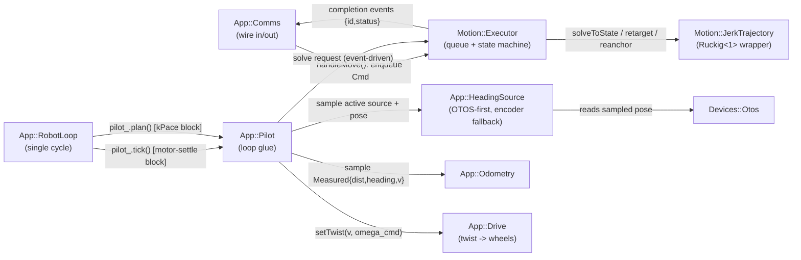
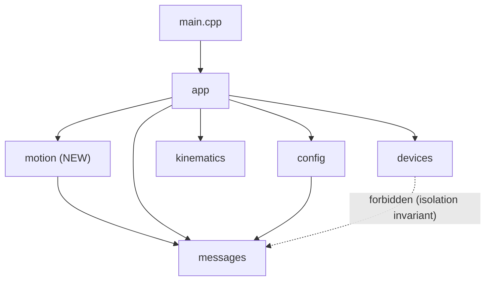

<!-- CLASI: Before changing code or making plans, review the SE process in CLAUDE.md -->

# Sprint 109: Firmware jerk-limited motion: Ruckig return + arc-command queue

## Goals

Return trajectory planning and closed-loop turn accuracy to the firmware,
where the single-loop rebuild (sprints 102-108) left it: the host-side
planner streams plain trapezoid twists at ~6.7 Hz with `heading_kp=0.4` and
plan-exhaustion completion, and turns regressed from sprint 098's 100%
within ±1° to ~±4° with a live +15° outlier. The host loop is too slow to
close a heading loop; this sprint moves jerk-limited trajectory planning
(vendored Ruckig) and heading closure back into the firmware's single-loop
schedule, replaces the old TURN/DISTANCE/dead-time phase machine with a
single arc-command primitive (coupled linear distance + delta-heading, a
constant-radius curve), and adds the fixed-depth command queue and
boundary-velocity carry needed for multi-leg tours to run without
decelerating to zero between same-direction legs.

Folded into this sprint (all four are prerequisites or companions to the
sim-side acceptance gate, filed out-of-process 2026-07-16 during the
TestGUI Sim-mode revival):
- `sim-honors-otos-calibration.md` — the simulated OTOS chip must model a
  raw scale error that the calibration scalars correct, so the sim is a
  faithful testbed once calibration is live.
- `otos-calibration-config-message.md` — the runtime wire path for OTOS
  `OL`/`OA`/`OI` calibration, currently dead on both hardware and sim.
- `sim-transport-command-set-get-not-supported.md` — `SimTransport`'s
  `SET`/`GET` capability gap from sprint 108 ticket 007; without this,
  calibration push-on-connect and fault-injection knobs silently no-op in
  Sim, which would mask the sim-fidelity gate below.
- `tour1-freeze-investigation-2026-07-15.md` — an investigation record for
  a 2026-07-15 out-of-process "tour froze" report, verdict: a real
  wedge-latch fault + inter-leg settle timing, not a Qt deadlock. The new
  MOVE-queue tour path (this sprint's host-adoption ticket) supersedes the
  streaming path that report was filed against; this sprint verifies the
  freeze symptom cannot recur on the new path and closes the issue.

## Problem

1. **No jerk-limited trajectory planning in firmware.** Deleted with the
   pre-rebuild `libraries/ruckig/` + `source/motion/jerk_trajectory.*` +
   `source/segment_executor.*` at sprint 102-107's greenfield cut. Host
   trapezoid streaming cannot replace it — network/host-loop latency (~150
   ms round trip) is too coarse to close a heading loop at the cadence
   sprint 098 proved necessary (`heading_kp=6` at a 40 ms cycle).
2. **No arc/queue command model on the wire.** The current `Twist` command
   is a raw instantaneous velocity target; there is no way to hand the
   firmware a bounded, jerk-limited motion request with a known distance
   and heading delta, nor to queue more than one so consecutive same-
   direction legs don't decelerate to a stop at each boundary.
3. **Turn accuracy regression.** ~±4° with a persistent +15° outlier vs.
   sprint 098's 100%-within-±1° (`.clasi/knowledge` /
   `heading-loop-solves-turn-accuracy.md`) — root cause is the missing
   firmware-side heading PD cascade, not a geometry or coast-arc defect.
4. **OTOS calibration and Sim fidelity gaps** block validating any of the
   above in Sim: no runtime OTOS-calibration wire path (real hardware),
   no simulated OTOS scale error for that path to correct (Sim), and a
   `SimTransport` capability regression that no-ops `SET`/`GET` for Sim
   entirely (blocks calibration push-on-connect and fault-injection knobs
   in the TestGUI Sim backend).

## Solution

Restore vendored Ruckig (`git show c63ec6c`) into `src/vendor/ruckig/`, port
the CODAL-free `Ruckig<1>` wrapper into `Motion::JerkTrajectory`
(`src/firm/motion/`) with an added `solveToState(pos, vel, vmax)` entry
point for nonzero-target-velocity chaining, and build a new
`Motion::Cmd`/`Motion::Executor` pair around it: a fixed ring queue of 8
normalized arc commands, a state machine (IDLE / RUNNING / RAMP_TO_REST /
STOPPING), one-command-lookahead boundary velocities so same-`v_max` legs
carry speed through the boundary, and the sprint-098 heading PD cascade
(`heading_kp=6`) restored at the firmware's 40 ms cycle. Every motion
command is an arc: signed linear distance + signed delta-heading, coupled
as a constant-radius curve (`distance==0` is a pure pivot; `delta_heading
==0` is a straight leg) — there is no separate TURN kind and no
pivot-translate-pivot phase machine. A new `App::HeadingSource` seam picks
OTOS when present/connected/fresh, falls back to encoder-differential
heading after N stale cycles, and makes the active source visible in
telemetry and the TestGUI. A new `App::Pilot` glues the executor into the
loop's existing `tick()`/`plan()` cadence — sampling only in the motor-
settle blocks, Ruckig solves (≤1/cycle) only in the `kPace` budget block —
respecting every single-loop invariant in `src/firm/DESIGN.md` §3.

On the wire, a new lean `Move` message (`CmdKind::MOVE`) replaces the dead,
wrong-shaped `PlannerCommand`/`MotionSegment` protos (which stay dead — see
Migration Concerns). `TWIST`/`STOP`/`CONFIG` stay wire-compatible; `TWIST`
still preempts (flushes) the queue.

Folded-in work: a new `OtosConfigPatch` in the `ConfigDelta` oneof gives
`OL`/`OA`/`OI` a live runtime path (both hardware and, once the sim models
a correctable raw OTOS scale error, Sim); `SimTransport.send()`/`.command()`
regain a real `SET`/`GET` bridge over `SimLoop.inject_command()` so
calibration push-on-connect and fault injection work for the Sim backend
again; and the host adoption ticket verifies the 2026-07-15 tour-freeze
symptom is structurally impossible on the new MOVE-queue tour path.

The sprint's decisive acceptance is a simulation gate, not a bench
walkthrough: TestGUI → Sim → Tour 1 AND Tour 2 must complete, close the
loop, and visibly look like a square — not "cockeyed sketches" — with
every turn within 1° of commanded, and with sim OTOS error/noise disabled,
turns must be exact. This is the sprint's final ticket and is
iterate-until-done: keep working until it passes, or produce a written
impossibility argument.

## Success Criteria

- [ ] TestGUI → Sim → Tour 1 completes end-to-end, closes the loop
      (returns to start pose within tolerance), and its trace is visibly
      square (not cockeyed).
- [ ] TestGUI → Sim → Tour 2 completes end-to-end with the same visual/
      closure standard.
- [ ] Every turn in both tours lands within 1° of its commanded
      delta-heading, measured against sim ground truth, with sim OTOS
      drift + encoder error enabled.
- [ ] With sim OTOS error/noise disabled (ideal chip), turns are exact
      (bit-for-bit/negligible-epsilon, not "within 1°").
- [ ] Consecutive same-`v_max` DISTANCE commands do not decelerate to zero
      at the shared boundary (`velocity_step_response.py`-style trace
      assertion, sim + bench).
- [ ] Every ticket touching `src/firm/` has an updated `DESIGN.md` (root
      map/diagram if structure changed, subsystem doc otherwise; new
      `src/firm/motion/` gets its own).
- [ ] `arm-none-eabi-size` flash budget still fits after the Ruckig
      restore (sprint-1 gate; regression tracked, not just checked once).
- [ ] Bench: firmware-touching tickets are exercised on the stand per
      `.claude/rules/hardware-bench-testing.md` (sensors alive, wheels
      drive, encoders increment) before being called done; a full
      hardware tour run is a stretch goal for the final ticket, not a
      blocker for it (the decisive gate is Sim).
- [ ] `tour1-freeze-investigation-2026-07-15.md` is resolved: the new
      MOVE-queue tour path is checked against the freeze symptom and the
      issue is closed with the verdict recorded.

## Scope

### In Scope

- Vendored Ruckig restore + `Motion::JerkTrajectory` port + `solveToState`.
- `Move` wire message, `CmdKind::MOVE`, `Motion::Cmd` ring queue (depth 8),
  `Motion::Executor` state machine, boundary-velocity carry, replan
  triggers (enqueue-adjacent, replace, divergence, handoff, STOP).
- Firmware heading PD cascade (`heading_kp=6`, `heading_kd`), dwell
  completion for rest-terminated pivots, `App::HeadingSource` (OTOS-first,
  encoder fallback, telemetry visibility).
- `App::Pilot` (loop glue: `tick()`/`plan()`), wiring in `main.cpp` and
  `src/sim/sim_harness.h`.
- `OtosConfigPatch` wire + firmware apply path (`RobotLoop::handleConfig`).
- Sim plant fidelity: OTOS drift/noise + raw-scale-error model (honoring
  calibration scalars), encoder tick-quantization/scale/slip error model.
- `SimTransport` `SET`/`GET` binary bridge over `SimLoop.inject_command()`.
- Host adoption: TestGUI/tours send `MOVE` queues instead of streamed
  twists; host planner demoted to teleop input shaping; dead host
  streaming path for tours retired; live `PlannerConfig` gain patches
  un-stubbed.
- `binary_bridge`/`NezhaProtocol` translation for `OL`/`OA`/`OI` and for
  the new `Move` verb.
- New `src/firm/motion/DESIGN.md`; updates to root `src/firm/DESIGN.md`
  and any other touched subsystem `DESIGN.md`.

### Out of Scope

- Curvature-step smoothing across arc-command boundaries beyond PD +
  wheel-level slew (noted known v1 simplification in the issue).
- Mecanum/holonomic twist components (`v_y`) — this sprint's arcs are
  differential-drive constant-radius curves; the coupled-arc model does
  not need `v_y`.
- A second heading source beyond OTOS/encoder (e.g. IMU fusion).
- Any redesign of the `MotorArmor`/wedge-latch policy in `devices/`.
- Any change to the deadman's fundamental role as the only staleness gate.

## Test Strategy

- **Firmware/sim unit + system tests** (`src/tests/sim/system/`, plus new
  unit tests alongside `motion/`): single-arc S-curve trace with jerk
  bound asserted; two same-`v_max` DISTANCE commands with no inter-command
  decel; teleop replace stream then silence → smooth ramp to zero; pivot
  accuracy vs. sim-OTOS drift + fallback-to-encoder transition (asserting
  TLM `headingSource` visibility); TWIST/STOP preemption; queue overflow
  → `ERR_FULL`; `JerkTrajectory` seeding-contract regression test (ported
  from c63ec6c); boundary-velocity table unit tests.
- **Host tests** (`uv run python -m pytest`): `SimTransport` SET/GET round
  trip; OTOS calibration push-on-connect (un-skips the four tests parked
  by `sim-transport-command-set-get-not-supported.md`); `enc_scale_err_l/r`
  fault-injection regression (un-skips `test_error_divergence.py`); Move
  command encoding in `wire_test_codec.cpp` (`armorMoveCommand()`).
- **Sim tour-closure gate** (decisive acceptance, final ticket): TestGUI →
  Sim → Tour 1 and Tour 2, both with and without OTOS drift/encoder error
  enabled; visual + numeric (1° / exact) verification; iterate until
  achieved or a written impossibility argument is produced.
- **Bench** (every firmware-touching ticket, `.claude/rules/hardware-
  bench-testing.md`): sensors alive, wheels drive + encoders increment,
  round-trip over the real link. Sprint-1-specific: `solve_time_
  characterize.py` (p99 solve/sample time) + `arm-none-eabi-size` flash
  check. Later tickets: `bench_ruckig_motion_verify.py` + `turn_sweep.py`
  (±1° gate) + `velocity_step_response.py` (no resonance regression). A
  full hardware tour-closure run is encouraged for the final ticket but is
  not required to close it — the decisive gate is Sim, per the
  stakeholder's own framing of this sprint's acceptance.

## Architecture

This sprint reintroduces a whole subsystem (`src/firm/motion/`) and adds
one new app-layer seam (`App::HeadingSource`), replacing the deleted
`SegmentExecutor` line of work with a queue-based executor built on a
restored Ruckig. The methodology below follows the sprint-planner's
7-step architecture process; the write-up stays at module level per
`src/firm/DESIGN.md`'s own documentation conventions.

**Step 1 — Understand the problem.** Recapped in Problem/Solution above:
firmware lost trajectory planning and heading closure in the single-loop
rebuild; host-side streaming cannot substitute because it cannot hit the
40 ms cycle sprint 098 proved necessary for `heading_kp=6` to land turns
within ±1°. The fix returns planning and closure to the loop without
reintroducing the pre-rebuild subsystem/dispatch architecture the rebuild
deliberately eliminated (single-loop bus ownership, passive/bounded
modules — `src/firm/DESIGN.md` §3 — are hard invariants for every new
module in this sprint).

**Step 2 — Identify responsibilities.** Five responsibility groups, each
changing for its own reason:
1. *Jerk-limited single-channel solving* (does the math for one channel:
   linear or rotational; changes only if Ruckig's contract or the seeding/
   retarget/reanchor rules change).
2. *Command queue + state machine* (owns the ring buffer, boundary-
   velocity table, replan-trigger dispatch, per-command lifecycle events;
   changes with queueing/replan policy, not with the solver math).
3. *Loop-cycle glue* (when solves happen, when samples happen, how the
   result becomes a twist on `Drive`; changes only with cycle-placement/
   timing budget concerns).
4. *Heading source selection* (which sensor is truth for heading right
   now, and making that visible; changes only with sensor-fusion/fallback
   policy).
5. *Wire/config surface* (the `Move` message, `OtosConfigPatch`, their
   host-side encode/decode; changes only with the wire schema).
   Sim-fidelity (OTOS scale error, encoder error) and `SimTransport` SET/
   GET are a sixth, sim-only concern — plant/harness fidelity, not
   firmware behavior — kept structurally separate (`src/sim/`, `tests/
   _infra/sim/`) from the five firmware groups above.

**Step 3 — Subsystems and modules.**

| Module | Purpose (one sentence) | Boundary | Use cases served |
|---|---|---|---|
| `Motion::JerkTrajectory` (`src/firm/motion/jerk_trajectory.{h,cpp}`) | Solves a jerk-limited motion profile for one channel. | Wraps vendored `Ruckig<1>`; owns the seeding/retarget/reanchor contract and the jerk==0 trapezoid sentinel; no queue or wire awareness inside. | SUC-001, SUC-002 |
| `Motion::Cmd` + `Motion::Executor` (`src/firm/motion/{cmd,executor}.{h,cpp}`) | Sequences normalized arc commands into continuous motion. | Owns the ring queue, state machine, boundary-velocity table, replan-trigger dispatch, per-command completion events; calls into `JerkTrajectory` for the actual solve, never does the solve math itself. | SUC-001, SUC-002, SUC-003 |
| `App::Pilot` (`src/firm/app/pilot.{h,cpp}`) | Bridges the Executor into the loop's cycle. | `tick()` samples and drives `Drive::setTwist`; `plan()` requests ≤1 solve per cycle in the `kPace` budget block; no bus traffic of its own — reads what the loop already sampled. | SUC-001, SUC-002, SUC-003, SUC-005 |
| `App::HeadingSource` (`src/firm/app/heading_source.{h,cpp}`) | Decides which sensor is truth for heading right now. | Passive reader over OTOS pose + encoder differential already sampled by the loop; owns the OTOS-first/encoder-fallback policy and the active-source flag; never issues bus reads itself. | SUC-004 |
| `messages` additions (`Move`, `OtosConfigPatch`) | Carry arc commands and OTOS calibration over the wire. | Generated from `protos/*.proto` via `scripts/gen_messages.py`; no hand edits. | SUC-001, SUC-002, SUC-005 |
| Sim plant fidelity (`src/sim/sim_plant.{h,cpp}`, `tests/_infra/sim/`) | Models a real (imperfect) OTOS + encoder so the sim is a fair test of the firmware above. | Sim-only; the firmware under test cannot tell it isn't real hardware. | SUC-002 (validates), SUC-004 |
| Host adoption (`host/robot_radio/planner/`, `testgui/`) | Sends `MOVE` command queues instead of streamed twists; surfaces active heading source. | Host-side only; demotes host planning to teleop input shaping. | SUC-003, SUC-005 |

**Step 4 — Diagrams.**

Component/module diagram (firmware-side; cycle placement per
`src/firm/DESIGN.md` §4):

Dependency graph (module-level `#include`/link direction; a new leaf and
one new `app/` module are added, no cycle introduced):

`motion` sits where `kinematics` sits today: a leaf library with no
project dependencies of its own except `messages` (for `msg::Move`'s
normalized field types) — it does not depend on `devices` or `config`,
and nothing depends on it except `app`. This keeps the devices-isolation
invariant intact (`devices/` still never includes `messages/`) and adds
no new cycle.

No entity-relationship diagram: this sprint has no persisted data model
change (firmware is stateless across reboots except baked boot config).

**Step 5 — What Changed / Why / Impact / Migration.**

*What changed:* a new `src/firm/motion/` subsystem (JerkTrajectory,
Cmd, Executor); a new `App::Pilot` and `App::HeadingSource` in `app/`;
a new `Move` wire message and `OtosConfigPatch` config patch; sim plant
fidelity upgrades; host-side adoption of MOVE-queue tours.

*Why:* restore the turn-accuracy and multi-leg-tour-continuity behavior
sprint 098 proved and the rebuild (necessarily) deleted, without
reintroducing the pre-rebuild subsystem/dispatch architecture — the new
modules are passive/bounded and cycle-driven exactly like every existing
`app/` module, per `src/firm/DESIGN.md` §3's non-negotiable invariants.

*Impact on existing components:* `App::RobotLoop` gains two call sites
(`pilot_.tick()`, `pilot_.plan()`) at the documented points in
`robot_loop.cpp`; `App::Comms`/`processMessage()` gains a `handleMove()`
case; `main.cpp` gains construction/wiring for `Pilot` and `HeadingSource`
(and, per the devices-isolation invariant, is where any wire-plane-to-
device-plane conversion for the new messages happens, exactly as it
already does for `MotorConfig`); `src/sim/sim_harness.h` gains the mirrored
wiring so sim runs the real `Pilot`. No existing module's own internal
behavior changes except `RobotLoop::handleConfig` (new `OtosConfigPatch`
case, additive) and `Drive` (unchanged interface, now also driven by
`Pilot` instead of only by raw `Twist` staging).

*Migration concerns:* None for persisted data (no persisted data model
here). Wire compatibility: `Move`/`CmdKind::MOVE` is a pure addition to
the envelope's command-kind union; existing `Twist`/`Stop`/`Config`
commands are untouched and remain wire-compatible. The dead `PlannerCommand`
/`MotionSegment` protos are explicitly NOT revived (wrong-shaped for the
186-byte envelope `static_assert`) — anything still referencing them
host-side is stale and should be treated as dead code, not migrated.
Deployment sequencing: firmware and host must ship together once `Move`
lands (a host sending `MOVE` to old firmware gets an unknown-command
error, not silent misbehavior, because `CmdKind` is a closed enum the
firmware already rejects unknown values for).

**Step 6 — Design rationale.**

- *Decision: one coupled arc primitive, no separate TURN kind.*
  **Context**: the pre-rebuild architecture had a 3-phase pivot-translate-
  pivot state machine. **Alternatives**: (a) keep three command kinds
  (TURN/DISTANCE/ARC); (b) a single arc primitive with `distance` +
  `delta_heading` coupled. **Why this choice**: (b) collapses the phase
  machine into one solve-and-slave model (dominant channel solved,
  other slaved by the arc ratio + heading PD), matching how a
  differential-drive robot actually moves along a curve, and it is what
  the stakeholder explicitly decided (2026-07-16). **Consequences**:
  curvature steps at command boundaries are absorbed by PD + wheel-level
  slew rather than solved exactly — an accepted v1 simplification, not a
  defect (see Out of Scope).
- *Decision: dominant-channel planning with the other channel slaved,
  rather than a true 2-DOF (v, omega) simultaneous solve.*
  **Context**: Ruckig here is `Ruckig<1>` (single-channel) per the
  restored c63ec6c wrapper. **Alternatives**: (a) port a multi-DOF Ruckig
  configuration; (b) solve one dominant channel, slave the other by
  the arc ratio, correct with heading PD. **Why this choice**: (b) reuses
  the proven, bench-tested single-channel wrapper unchanged and keeps the
  M4F soft-double solve-time budget from ~doubling; the heading PD already
  has to run every cycle regardless (sensor noise, boundary curvature
  steps), so it absorbs the slaved channel's error too. **Consequences**:
  the plan is technically approximate off the dominant channel during a
  curved arc; accuracy is empirical (this sprint's sim gate), not
  provable from the solve alone — flagged as an open question below only
  if the gate cannot be hit.
- *Decision: `App::HeadingSource` as a new seam rather than inlining the
  OTOS-vs-encoder choice into `Pilot` or `Odometry`.*
  **Context**: sprint 098-era failure mode was OTOS per-pass I2C ticks
  wrecking motion timing; that motivated hiding OTOS sampling entirely
  inside the loop's existing cadence. **Alternatives**: (a) inline the
  fallback logic in `Pilot`; (b) a dedicated passive seam. **Why this
  choice**: (b) isolates a policy (which sensor is truth, and visibility
  of that choice) that other consumers (Telemetry, TestGUI) also need,
  without duplicating the fallback logic or coupling `Pilot` to Telemetry
  wire concerns. **Consequences**: one more module in `app/`, justified
  because it passes the cohesion test standalone ("decide and expose
  which sensor is heading truth" — one sentence, no "and").
- *Decision: fold OTOS-calibration wire path and sim-OTOS-fidelity issues
  into this sprint rather than a separate one.*
  **Context**: both were filed out-of-process 2026-07-16 as standalone
  issues. **Alternatives**: (a) separate follow-up sprint; (b) fold into
  109. **Why this choice**: (b) — the sim tour-closure gate (this
  sprint's own decisive acceptance) explicitly requires sim OTOS
  drift/error to be present and, per the stakeholder's own words on
  `sim-honors-otos-calibration.md`, a faithful sim of an OTOS chip means
  simulating its calibration; deferring calibration would leave the sim
  gate testing an easier-than-real-life plant. **Consequences**: this
  sprint's scope is larger than the base issue alone; tickets 002/004/007
  carry the folded work as clearly separable units.

**Step 7 — Open questions.**

1. Dominant-channel-with-slaved-PD accuracy under curved arcs is an
   empirical bet on the sim/bench gate, not derived analytically — if the
   1°/exact acceptance cannot be hit with this model, the next escalation
   (true multi-DOF solve, or an explicit curvature-step re-solve at
   boundaries) is out of this sprint's scope and would need a follow-up
   decision, not a silent scope creep during ticket 009.
2. `kDeadTime` re-derivation at the 40 ms cycle (previously tuned at 120
   ms assuming a 20 ms tick) is bench-tune-only; no firmware behavior
   should be hand-picked from the old constant without a fresh bench
   characterization (ticket 005's acceptance criteria call this out).
3. Whether `messages/event.h` (flagged orphaned in `src/firm/DESIGN.md`
   §6) should carry the new per-command completion events
   (`DONE/TRIVIAL/SUPERSEDED/FLUSHED/TIMEOUT/SOLVE_FAIL`) or whether they
   belong on the existing reply/TLM path instead is left to ticket 003's
   implementer to resolve consistently with the current wire schema —
   flagged here so it isn't silently decided without anyone noticing the
   orphaned-module question it brushes against.

## Use Cases

### SUC-001: Firmware solves a jerk-limited trajectory for a single arc command
Parent: UC (motion execution)

- **Actor**: `App::Pilot` (on behalf of the host/TestGUI operator)
- **Preconditions**: A `Move` command (DISTANCE mode, `time==0`) has been
  enqueued and is the active command; Ruckig is available and within its
  solve-time budget.
- **Main Flow**:
  1. Executor validates and normalizes the `Move` into a `Motion::Cmd`.
  2. Executor requests a solve from `Motion::JerkTrajectory` for the
     dominant channel (linear for `|distance|>0`), with an exit speed of 0
     (no successor) or per the boundary-velocity table (successor
     present).
  3. `Pilot::plan()` performs the solve inside the `kPace` cycle budget
     (≤1 solve/cycle).
  4. `Pilot::tick()` samples the trajectory each cycle and drives
     `Drive::setTwist()` with the dominant-channel velocity and the
     arc-ratio-slaved rotational velocity, corrected by the heading PD.
  5. Command completes: distance criterion (encoder-relative travel ≥
     `|distance|`, signed overshoot carried into a same-sign successor).
- **Postconditions**: Robot has traveled `distance` along the commanded
  arc; a `DONE` event is emitted with the command's `id`.
- **Acceptance Criteria**:
  - [ ] A single arc command's velocity trace is jerk-bounded (asserted in
        a sim system test).
  - [ ] Solve happens within the `kPace` budget; ≤1 Ruckig solve per cycle.

### SUC-002: Firmware closes a commanded pivot/turn to within 1° using the heading PD cascade
Parent: UC (motion execution) / traces to the sprint-098 turn-accuracy fix

- **Actor**: `App::Pilot` + `App::HeadingSource`
- **Preconditions**: A `Move` command with `delta_heading != 0` is active;
  `App::HeadingSource` reports a current heading estimate (OTOS or
  encoder-fallback).
- **Main Flow**:
  1. Executor plans the rotational channel (pure pivot) or slaves it to
     the linear channel (arc) via `omega_ff(t) = (delta_heading/distance)
     * v(t)`.
  2. Each cycle, `Pilot::tick()` computes `omega_cmd = omega_ff +
     heading_kp*(theta_des − theta_meas) + heading_kd*(omega_des −
     omega_meas)`, gated off during terminal decel.
  3. For a rest-terminated command with heading content, completion
     requires `|err| < 0.5°` AND rate `< 1°/s` held 150 ms (dwell), with a
     STOP_TIME backstop.
  4. Chained (non-terminal) pivots use encoder/OTOS-accurate handoff
     without a dwell (only the final pivot in a chain dwells).
- **Postconditions**: Robot heading matches the commanded `delta_heading`
  within 1° (sim gate) / within ±1° on the bench sweep
  (`turn_sweep.py`); with sim OTOS error disabled, heading matches
  exactly.
- **Acceptance Criteria**:
  - [ ] `turn_sweep.py`-equivalent sim test: every turn within 1° with
        drift/noise enabled; exact with drift/noise disabled.
  - [ ] TLM exposes the active heading source and an event fires on any
        OTOS→encoder fallback transition.

### SUC-003: Host enqueues a multi-leg tour that carries velocity through same-direction boundaries
Parent: UC (tour execution)

- **Actor**: Host tour runner (TestGUI, real or Sim transport)
- **Preconditions**: A tour (sequence of arc legs) is translated to a
  sequence of `Move` commands and sent to the firmware queue (ring depth
  8; overflow → `ERR_FULL`, plan untouched).
- **Main Flow**:
  1. Host sends leg N+1 while leg N is still active (`replace=false`,
     normal enqueue).
  2. Executor computes `exitSpeed(active, next)` per the boundary-velocity
     table; if same-sign, non-pivot, same/compatible `v_max`, exit speed
     is nonzero and Ruckig's `target_velocity` input plans a non-stopping
     handoff.
  3. On completion of leg N, Executor activates leg N+1 with velocity
     continuity by construction (handoff replan trigger).
  4. Divergence replan triggers (5 mm retarget / 40 mm reanchor linear,
     0.3 rad reanchor rotational, 60 ms min interval) fire if actual state
     diverges from plan; reanchor is the only sanctioned measured-state
     reseed.
- **Postconditions**: The tour completes without decelerating to zero
  between compatible same-`v_max` legs; the tour trace is visibly the
  intended shape (square, for Tour 1/2) when plotted against sim/camera
  ground truth.
- **Acceptance Criteria**:
  - [ ] Sim system test: two same-`v_max` DISTANCE commands show velocity
        never dipping below `v_max * (1 - epsilon)` at the boundary.
  - [ ] TestGUI → Sim → Tour 1 and Tour 2 complete and close the loop.

### SUC-004: Firmware falls back from OTOS to encoder heading when OTOS is stale, and the fallback is visible
Parent: UC (sensing / observability)

- **Actor**: `App::HeadingSource`
- **Preconditions**: OTOS was present/connected/fresh; it becomes stale
  (N consecutive cycles without a fresh pose).
- **Main Flow**:
  1. `App::HeadingSource` detects staleness and switches its reported
     heading to encoder-differential `(encR - encL) / trackwidth`.
  2. A fallback-transition event fires; the primary TLM frame's
     `headingSource` field flips.
  3. TestGUI surfaces a non-gyro indicator.
  4. When OTOS pose freshness resumes, `App::HeadingSource` re-promotes
     OTOS as the active source.
- **Postconditions**: Motion continues without a hard stop; the operator
  can always tell which sensor is currently truth for heading.
- **Acceptance Criteria**:
  - [ ] Sim system test drives an OTOS staleness fault and asserts both
        the fallback transition event and telemetry field change.
  - [ ] TestGUI indicator changes state on fallback and on re-promotion.

### SUC-005: Operator calibrates the OTOS chip at runtime (hardware and Sim) and sees the effect
Parent: UC (configuration / calibration)

- **Actor**: TestGUI operator
- **Preconditions**: `OtosConfigPatch` wire path exists; on Sim, the
  simulated OTOS models a raw scale error that the calibration scalars
  correct.
- **Main Flow**:
  1. Operator issues `OL <scale>` / `OA <scale>` / `OI` from the TestGUI
     (or connect-time calibration push).
  2. `binary_bridge`/`NezhaProtocol` translates to an `OtosConfigPatch`
     envelope; `RobotLoop::handleConfig` applies it via
     `Otos::setLinearScalar()`/`setAngularScalar()`.
  3. On Sim, `SimTransport`'s SET/GET bridge round-trips the patch through
     `SimLoop.inject_command()`; `SimPlant`'s OTOS burst-read response
     already includes a raw scale error that the newly-applied scalar
     corrects.
  4. Operator reads back OTOS pose/velocity (real or Sim) and observes
     truth when correctly calibrated, and a proportional error when not.
- **Postconditions**: OTOS calibration is a live, no-reflash operation on
  hardware, and a testable, visible effect in Sim.
- **Acceptance Criteria**:
  - [ ] `test_calibration_push_on_connect.py`'s four skipped
        `@_requires_sim_lib` tests pass (un-skipped).
  - [ ] A sim test sets a raw OTOS scale error, confirms uncalibrated
        pose diverges from truth, applies `OtosConfigPatch`, confirms
        pose converges to truth.

## GitHub Issues

(None linked yet — this sprint's issues are internal `clasi/issues/*.md`
files, listed in frontmatter `issues:`.)

## Definition of Ready

- [x] Sprint planning document is complete (sprint.md, including its
      Architecture and Use Cases sections)
- [x] Architecture review passed (see review verdict recorded via
      `record_gate_result`)
- [x] Stakeholder has approved the sprint plan (pre-approved for tonight's
      autonomous execution per team-lead dispatch)

## Tickets

| # | Title | Depends On |
|---|-------|------------|
| 001 | Vendor Ruckig restore + Motion::JerkTrajectory port + build/solve-time gates | — |
| 002 | SimTransport SET/GET binary bridge over SimLoop.inject_command() | — |
| 003 | Move wire message + Motion::Cmd ring queue + Executor TIMED/velocity mode + Pilot wiring | 001 |
| 004 | OtosConfigPatch wire + firmware apply path + host verb translation | 003 |
| 005 | DISTANCE arcs + heading PD cascade + dwell completion + HeadingSource seam | 003 |
| 006 | Cross-boundary carry: boundary-velocity table + divergence replan triggers | 005 |
| 007 | Sim fidelity: OTOS drift/raw-scale-error + calibration honoring + encoder error model | 002, 004, 006 |
| 008 | Host adoption: MOVE-queue tours, config-patch live tuning, retire streaming path, tour1-freeze verification | 007 |
| 009 | Sim tour-closure gate (decisive acceptance) — iterate until Tour 1/2 close within 1°/exact | 008 |

Tickets execute serially in the order listed.
