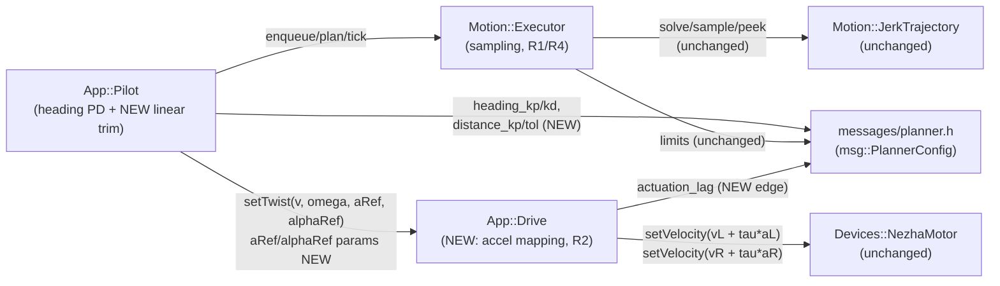

<!-- CLASI: Before changing code or making plans, review the SE process in CLAUDE.md -->

# Sprint 112: Motion-control terminal blips: close the loop (feedback + feedforward), delete the compensator stack

## Goals

This is **arc sprint 2** of the multi-sprint motion-control arc driven by
`clasi/issues/motion-control-terminal-blips-reconciled-fix-plan.md` (the
"reconciled fix plan"). Sprint 111 (closed, tag `v0.20260719.1`) built the
foundation: the numeric behavior-lock harness
(`src/tests/sim/system/behavior_lock_harness.cpp` +
`test_behavior_lock.py`, SUC-001), the stale-twist-on-idle fix, and the
18-dead-field config strip — the issue's steps 0, 1, and 7. **Sprint 112 is
the actual control-law surgery**: the issue's steps 3-6, implemented
end-to-end for **both** the D700 straight and the 360° pivot, verified
entirely by flipping sprint 111's own harness `xfail` markers to passing.

- **Step 3** — delete the `plan_lead` time-shifted-sampling machinery
  (F2's jerk-warp bug: sampling at `elapsed + lead` evaluates the
  reference at `2t`, doubling commanded accel and quadrupling commanded
  jerk during the lead ramp-in). Sample the trajectory at `t`.
- **Step 4** — pass Ruckig's already-computed acceleration through
  `App::Drive`'s existing wheel-space mapping as a model feedforward term,
  cancelling the nominal actuation-lag ramp lag analytically.
- **Step 5** — add a bounded linear position-feedback trim in `App::Pilot`
  (mirroring the existing heading PD exactly), mopping up residual/
  model-mismatch error the feedforward alone cannot.
- **Step 6** — delete the terminal patch stack (straight-lead padding,
  terminal top-up + cross-bias, pivot overshoot lead, same-sign overshoot
  carry, the min-speed floor, the EMA/leaky-counter dwell machinery) and
  replace the ad hoc completion logic with one unified rule: `done = t >=
  duration + margin AND |s_err| < s_tol AND |theta_err| < theta_tol`, held
  for `arrive_dwell`, one timeout backstop.

Step 2 (the F1 cycle-order A/B revert-and-compare) stays deferred to its
own issue (`cycle-order-reorder-experiment-ab-before-hardware.md`), exactly
as sprint 111 left it. Steps 8-10 (ideal/parity sim split, `Executor`
decomposition, real-hardware tuning) remain future arc sprints.

## Problem

Sprint 111 documented, but did not fix, two known-bad shapes: the D700
straight's ~44mm/s post-completion velocity hump and the 360° pivot's
±15mm/s sign-changing terminal tail. Both are software-synthesized — present
in the *commanded* trace, generated by a patch stack of open-loop lead
compensation (`plan_lead`, the pivot overshoot lead) and terminal top-up
logic (straight-lead padding, cross-bias, the min-speed floor, an EMA/leaky-
counter dwell gate) layered around an otherwise-sound Ruckig jerk-limited
solve. The two independent 2026-07-18 reviews that diagnosed this agree the
cure is **both** a corrected model feedforward (cancelling the nominal
actuation-lag ramp lag Ruckig's own acceleration already predicts) **and** a
bounded feedback trim (mopping up residual/model-mismatch error) — not
either alone. Sprint 111's own harness now exists specifically to gate this
surgery numerically instead of by eyeball, with six assertions pinned
`xfail(strict=False)` as the explicit target for this sprint to flip.

## Solution

Four sequenced tickets, each independently leaving the full suite green
(pass or intentional, cited `xfail`) and individually revertible, executed
in the reconciled fix plan's own dependency order (delete the ad hoc
compensation first, land its principled replacements, only then delete the
terminal patches that the replacements make redundant):

1. Delete the `plan_lead`/pivot-overshoot-lead peek-ahead sampling in
   `Motion::Executor::tick()` (issue step 3). Flips `straight_ramp_bounds`
   and `pivot_ramp_bounds`.
2. Add acceleration feedforward through `App::Drive`'s existing wheel-space
   mapping (issue step 4): `Motion::Executor::Twist` exposes the dominant
   channel's sampled acceleration; `App::Drive::setTwist()` gains two
   defaulted parameters and combines `tau * a_ref` into each wheel's
   velocity target via the same linear `BodyKinematics::inverse()` map
   already used for velocity.
3. Add a bounded linear position-feedback trim in `App::Pilot` (issue step
   5), mirroring the existing heading PD's own gain/arithmetic split:
   `v_cmd = v_ref(t) + distance_kp * (s_ref - s_meas)`, clamped.
4. Delete the terminal patch stack and unify completion into one rule
   (issue step 6). Flips `straight_terminal_bounds`,
   `pivot_single_lobe_left`, `pivot_single_lobe_right`, and
   `pivot_lobes_opposite_sign`. Bumps the `heading_kp` boot default from
   3.0 to 6.0 so the deadband inequality holds without the deleted
   min-speed floor (see Design Rationale).

## Success Criteria

- `uv run python -m pytest` (the canonical command — bare `uv run pytest`
  hits a known collection error) is green at the end of every ticket.
  Baseline: 1224 passed / 18 xfailed / 2 xpassed / 0 failed.
- All six targeted `xfail` markers in `test_behavior_lock.py` flip to
  passing by the end of ticket 004: `test_straight_ramp_bounds`,
  `test_straight_terminal_bounds`, `test_pivot_ramp_bounds`,
  `test_pivot_single_lobe_left`, `test_pivot_single_lobe_right`,
  `test_pivot_lobes_opposite_sign`.
- No regression on the harness's already-passing checks:
  `test_straight_single_lobe_left/right`,
  `test_straight_no_command_after_terminal_zero`,
  `test_straight_shelf_collapsed`, `test_pivot_terminal_bounds`,
  `test_pivot_no_command_after_terminal_zero`,
  `test_pivot_shelf_collapsed`, `test_same_boot_all_moves_completed`,
  `test_behavior_lock_harness_compiles_and_runs`.
- No guardrail regression: `JerkTrajectory` solves stay plan-state-seeded
  (never solved from measured state near the target) except the existing,
  unchanged, 40mm gross-divergence reanchor; `robot_loop.cpp`'s cycle
  order/request-collect sequencing is untouched; `runAndWait(gap, body)`
  stays the timing primitive; hardware deadband/reversal-dwell armor is
  untouched.
- The deadband inequality (`k_h * heading_dwell_tol >= omega_deadband`)
  is verified to hold for the deleted min-speed floor's replacement
  (`heading_kp` bumped to 6.0); the analogous linear inequality
  (`distance_kp * distance_tol >= v_deadband`) is verified empirically
  against the harness by ticket 004.

## Scope

### In Scope

- `src/firm/motion/executor.{h,cpp}` — delete `plan_lead`/pivot-overshoot-
  lead peek sampling (ticket 001); delete the terminal patch stack
  (straight-lead padding, terminal top-up/`pendingLinearRetarget_`,
  same-sign overshoot carry/`pendingOvershoot_`, the EMA/leaky-counter
  dwell machinery, `terminal_lead`/`thetaErrLead`) and unify completion
  (ticket 004); add `Twist::aRef`/`alphaRef` (ticket 002) and
  `Twist::sRef`/`sMeas` (ticket 003).
- `src/firm/app/pilot.{h,cpp}` — add the bounded linear position-feedback
  trim (ticket 003); delete the min-speed floor (ticket 004); forward
  `aRef`/`alphaRef` to `Drive::setTwist()` (ticket 002).
- `src/firm/app/drive.{h,cpp}` — `setTwist()` gains two defaulted
  parameters (`a_x`, `alpha`); `tick()` combines a model-feedforward term
  into each wheel's velocity target via `BodyKinematics::inverse()`; gains
  a `configure(const msg::PlannerConfig&)` method for `actuation_lag`
  (ticket 002).
- `src/protos/planner.proto` and generated outputs
  (`src/firm/messages/planner.h`, `wire.{h,cpp}`, `layout_checks.{h,cpp}`)
  — three new fields: `distance_kp`, `distance_tol` (ticket 003),
  `actuation_lag` (ticket 002).
- `src/scripts/gen_boot_config.py` — bake the three new fields' defaults;
  bump `HEADING_KP_DEFAULT` 3.0 -> 6.0 (ticket 004).
- `src/tests/sim/system/test_behavior_lock.py` — remove the `xfail` marker
  from each assertion the owning ticket's change makes pass; never remove
  one a ticket's own change does not actually fix.
- `src/firm/motion/DESIGN.md`, `src/firm/app/DESIGN.md` — doc-comment
  updates strictly where this sprint's own deletions/additions make an
  existing section stale (the lead-compensation §2c entry, the dwell-
  completion write-up, `Drive`'s own interface list).

### Out of Scope

- **Step 2** (the F1 cycle-order A/B revert-and-compare) — deferred to
  `cycle-order-reorder-experiment-ab-before-hardware.md`, per sprint 111.
  `robot_loop.cpp`'s current reordering is **not touched** by any ticket
  in this sprint.
- **`App::HeadingSource`'s `headingLead()` / `heading_lead_bias` (locus 1)**
  — the reconciled fix plan's own combined patch-stack list names it, but
  the dispatching brief's step-3 description scopes this sprint's lead-
  sampling deletion to `plan_lead` only. `heading_lead_bias`'s shipped
  default already neutralizes the projection (109-010's own documented
  finding — zero regression, not a live contributor to either terminal
  blip), and touching `App::HeadingSource` would add a fifth module to an
  already-substantial sprint for a mechanism that is not implicated in the
  hump/tail shapes the harness measures. Left untouched; flagged as a
  candidate for a future mechanical cleanup sprint alongside the dead
  `min_speed`/`plan_lead`/`terminal_lead` fields (see Design Rationale).
- **Steps 8-9** (split ideal vs. hardware-parity sim; decompose `Executor`
  into four responsibilities) — deferred to later arc sprints.
- **Step 10** (bench tuning on real hardware) — sim-verification only this
  sprint; the stakeholder does hardware testing separately.
- Removing the now-dead `min_speed`, `plan_lead`, `terminal_lead` wire
  fields from the schema — left declared (not `reserved`) this sprint;
  see Design Rationale Decision 7. A follow-up issue should be filed for
  a future mechanical cleanup sprint (matching sprint 111 ticket 004's own
  precedent of doing schema-dead-field removal as its own separate,
  low-risk ticket).
- Any change to `data/robots/*.json` per-robot overrides beyond what
  `gen_boot_config.py`'s new-field defaults require.

## Test Strategy

Sim-only this sprint (the stakeholder does hardware testing separately).
Every ticket's own acceptance criteria require `uv run python -m pytest`
green at that ticket's completion, verified primarily through sprint 111's
existing harness rather than new test infrastructure:

- Ticket 001 is verified by `test_straight_ramp_bounds` and
  `test_pivot_ramp_bounds` flipping from `xfail` to passing, with every
  other harness check unregressed.
- Ticket 002 is verified by the harness staying green/xfail-as-expected
  (accel feedforward must not introduce a NEW ramp-region or terminal-
  region bound violation) plus a targeted check that `App::Drive`'s
  existing raw-`TWIST` teleop path is byte-for-byte unaffected (defaulted
  parameters).
- Ticket 003 is verified the same way — harness stays green/xfail-as-
  expected; a targeted check that the trim's clamp genuinely bounds its
  authority (the 087-009 guardrail — see Use Cases SUC-007).
- Ticket 004 is verified by `straight_terminal_bounds`,
  `pivot_single_lobe_left`, `pivot_single_lobe_right`, and
  `pivot_lobes_opposite_sign` flipping from `xfail` to passing, with the
  full harness green, plus the deadband-inequality derivation recorded in
  the ticket's own completion notes.

## Architecture

**Sizing: Substantial** — this sprint touches 4 existing modules
(`Motion::Executor`, `App::Pilot`, `App::Drive`, the `messages/` wire
schema) and introduces one new cross-module dependency edge
(`App::Drive` -> `messages/planner.h`, for the new `actuation_lag` field) —
both independently sufficient to cross the substantial-tier threshold. A
component diagram is included because, unlike sprint 111's "independent,
non-interacting fixes" precedent, this sprint's changes genuinely compose:
`Motion::Executor`'s new `Twist` fields flow into `App::Pilot`'s new
arithmetic, which flows into `App::Drive`'s new mapping — a real
composition a diagram clarifies.

### Architecture Overview

**Step 1 — the problem.** Two terminal shapes (D700-straight hump, 360°-
pivot tail) are generated by open-loop lead compensation and terminal
top-up logic layered around a sound Ruckig solve. The reconciled fix
replaces both mechanisms with two principled, bounded control-law
components (model feedforward + position/heading feedback) and one
unified, measured-state completion rule — verified entirely against
sprint 111's own numeric harness.

**Step 2 — responsibilities this sprint introduces or changes:**

- **R1 — Trajectory-sampling honesty.** Sample the currently-solved
  trajectory at the actual elapsed time, never a time-shifted peek. Fixes
  F2's jerk-warp bug (peeking at `elapsed + lead` evaluates the reference
  at `2t`, doubling commanded accel). Lives in `Motion::Executor::tick()`.
- **R2 — Actuation-lag compensation via model feedforward.** Cancel the
  *nominal* `v * tau` ramp lag analytically using Ruckig's own already-
  computed acceleration, mapped through the existing wheel-space
  kinematics. Lives in `App::Drive` (the "mapping layer" the issue names).
- **R3 — Residual tracking correction via bounded feedback.** Mop up
  *residual/model-mismatch* error the feedforward alone cannot, via a
  bounded proportional trim mirroring the existing heading PD exactly.
  Lives in `App::Pilot` (gains/arithmetic — the same boundary the heading
  PD already established).
- **R4 — Unified completion decision.** One measured-state rule
  (`t >= duration+margin AND |s_err| < s_tol AND |theta_err| < theta_tol`,
  held for `arrive_dwell`, one timeout backstop) replaces the ad hoc
  terminal patch stack. Lives in `Motion::Executor::tick()` (completion
  stays this class's own decision, per its existing boundary).

These four responsibilities change independently (R1 is a pure deletion;
R2 and R3 are additive, independently toggleable via their own config
gains; R4 depends on R2+R3 existing to be *safely* deletable, per the
ticket sequencing below) — grouping them under existing modules rather
than a new one is correct: none is a new concern, each is either a
deletion from or a natural extension of a responsibility its owning
module already has.

**Step 3 — modules (all four pre-existing; none is new):**

- **`Motion::Executor`** (`src/firm/motion/executor.{h,cpp}`) — purpose:
  sequences arc/pivot commands into continuous jerk-limited motion and
  decides completion from measured state. Boundary: inside — the ring
  queue/state machine, `JerkTrajectory` dispatch, current-time sampling,
  the unified completion decision; outside — the heading PD and new linear
  trim's own gains and arithmetic (`App::Pilot`), the wheel-space mapping
  and feedforward combination (`App::Drive`). Serves SUC-005, SUC-006,
  SUC-007.
- **`App::Pilot`** (`src/firm/app/pilot.{h,cpp}`) — purpose: bridges
  `Motion::Executor` into the loop's cycle and computes every closed-loop
  correction's arithmetic. Boundary: inside — the existing heading PD
  arithmetic, the new bounded linear position-feedback trim arithmetic,
  both gains read from `msg::PlannerConfig`; outside — trajectory solving
  (`Motion::Executor`), wheel-space mapping (`App::Drive`). Serves
  SUC-005, SUC-007.
- **`App::Drive`** (`src/firm/app/drive.{h,cpp}`) — purpose: converts a
  body twist, now optionally paired with a body acceleration, into
  per-wheel velocity targets. Boundary: inside — `BodyKinematics::
  inverse()` applied to both velocity and acceleration (the same linear
  map), combining the two into each wheel's model-feedforward-augmented
  velocity target; outside — the gains/arithmetic that produced
  `v_x`/`omega`/`a_x`/`alpha` (`App::Pilot`/`Motion::Executor`), the PID
  that tracks the wheel target (`Devices::NezhaMotor`). Serves SUC-005,
  SUC-006.
- **`messages/`** (`src/protos/planner.proto` -> `src/firm/messages/
  planner.h` + generated siblings) — purpose: the wire schema for every
  tunable this sprint's control law needs. Boundary unchanged (a
  dependency-free leaf every `App::`/`Motion::` module already depends
  on). Gains three fields: `distance_kp`, `distance_tol`,
  `actuation_lag`.

**Step 4 — diagram.**

The only genuinely new edge is `App::Drive -> messages/planner.h` (for
`actuation_lag`) — every other edge shown already existed; this sprint
extends what flows over it (`Twist` gains fields, `setTwist()` gains
defaulted parameters) rather than introducing a new dependency direction.
No entity-relationship diagram (no persisted/on-disk data model changes —
three additive wire tunables, not a new shape) and no separate dependency
graph (the one component diagram above already shows every edge that
changes).

**Step 5 — What Changed / Why / Impact / Migration Concerns** — below.

**Step 6 — Design Rationale** — below.

**Step 7 — Open Questions** — below.

**What Changed**

- **`Motion::Executor::tick()`** loses the `plan_lead`/pivot-overshoot-lead
  peek-ahead sampling (`linLead`/`rotLead`/`kPivotOvershootLeadSlope`,
  ticket 001) — `out.v`/`omegaFf` are computed from the same-instant
  `sample()` result, not a `peek(elapsed + lead)` one. It loses the
  terminal patch stack (ticket 004): `kStraightLeadBias`/
  `kStraightLeadSlope` (straight-lead padding in `plan()`'s `kArc`
  branch), the `pendingLinearRetarget_` terminal top-up + its cross-bias
  epsilon nudge, the same-sign `pendingOvershoot_` carry between chained
  `kArc` commands, `dwellRateFilt_`'s EMA and `dwellHeldMs_`'s leaky
  counter, `terminal_lead`/`thetaErrLead`. It gains `Twist::aRef`/
  `alphaRef` (ticket 002 — the dominant channel's own sampled
  acceleration, 0 for `kTimed`) and `Twist::sRef`/`sMeas` (ticket 003 —
  the linear reference/measured position `App::Pilot`'s new trim needs,
  0/0 for `kPivot` and `kTimed`, matching how `thetaRef`/`omegaDes`
  already default to 0 outside their own heading-bearing case). Completion
  becomes the single unified rule (ticket 004): `t >= duration + margin
  AND |s_err| < distance_tol AND |theta_err| < heading_dwell_tol`, held
  for `arrive_dwell`, one `stopTimeBackstopMs()` timeout. The existing
  40mm gross-divergence reanchor tier (`checkDivergence()`'s
  `pendingLinearReanchor_` path) is **untouched** — it is a mid-command
  recovery mechanism, distinct from the between-command
  `pendingOvershoot_` carry this sprint deletes. The boundary-velocity-
  carry chained-pivot dwell-skip exception (109-009's
  `carryingRotationalVelocity` branch: a command carrying a nonzero
  `exitVelocity_` into a compatible successor completes on
  `withinTol OR crossedTarget` alone, no hold) is **preserved** under the
  new unified rule — the unified rule's dwell-hold applies to the
  "not carrying" branch exactly as today; see Open Questions for the
  coverage caveat.
- **`App::Pilot`** gains the bounded linear position-feedback trim (ticket
  003): `v_cmd = twist.v + distance_kp * (twist.sRef - twist.sMeas)`,
  clamped, computed and applied the same place/shape the existing heading
  PD term already is — mirrors `omega`'s own `heading_kp*(thetaRef-
  thetaMeasLead) + heading_kd*(omegaDes-omegaMeasEst)` construction. It
  loses the min-speed floor (`minSpeed_`, the whole terminal-stiction
  `if` block in `tick()`, ticket 004). It forwards `twist.aRef`/
  `twist.alphaRef` to `Drive::setTwist()`'s two new parameters (ticket
  002) — Pilot does not compute the feedforward combination itself, only
  passes the reference through, matching the issue's own assignment of
  the *mapping* to `App::Drive`.
- **`App::Drive::setTwist()`** gains two DEFAULTED parameters,
  `a_x = 0.0f`/`alpha = 0.0f` (ticket 002) — every existing call site
  (`RobotLoop::handleTwist()`'s raw teleop `TWIST` path, which never goes
  through `Motion::Executor` and has no acceleration reference to offer)
  is unaffected. `tick()` reuses `BodyKinematics::inverse()` a second
  time (the same linear map, `aL = a_x - alpha*b/2`, `aR = a_x +
  alpha*b/2` — kinematics is linear, so the identical function is exact
  for acceleration too) and adds `actuation_lag * aL`/`actuation_lag *
  aR` to each wheel's velocity target before `setVelocity()`. `Drive`
  gains a `configure(const msg::PlannerConfig&)` method (mirroring
  `Motion::Executor::configure()`/`App::HeadingSource::configure()`'s own
  convention) that reads `actuation_lag` — a genuinely new dependency
  edge (`App::Drive` -> `messages/planner.h`), in the same leaf-ward
  direction every other `App::` module's `messages/` dependency already
  runs.
- **`msg::PlannerConfig`/`PlannerConfigPatch`** (`src/protos/
  planner.proto`) gain three fields (numbers 38-40, the next free numbers
  after 37/`terminal_lead`): `distance_kp` ([1/s], ticket 003 — the
  linear trim's own gain, named to mirror `heading_kp`), `distance_tol`
  ([mm], ticket 003 — the linear completion tolerance, `s_tol`, mirroring
  `heading_dwell_tol`; repurposes the role `kDistanceSettleEpsilonMm`
  currently plays as a hardcoded constant, made live-tunable), and
  `actuation_lag` ([s], ticket 002 — the model feedforward's own `tau`,
  shared by both the linear and rotational domains since both ride the
  same wheel PID). Generated via `scripts/gen_messages.py`, never
  hand-edited. `src/scripts/gen_boot_config.py` bakes their defaults and
  bumps `HEADING_KP_DEFAULT` from 3.0 to 6.0 (ticket 004 — see Design
  Rationale Decision 5).

**Why**

Deleting the ad hoc lead/top-up machinery first (ticket 001) restores an
honest jerk-limited profile and immediately fixes the activation-region
accel spike (F2's jerk-warp bug) both scenarios share. Landing the
principled replacements next (tickets 002-003) gives the plant a real,
bounded way to track that honest profile before ticket 004 removes the
patches that were compensating for its absence — deleting the terminal
patch stack before its replacements exist would leave the plant genuinely
undershooting or oscillating, not merely losing an eyeball-tuned hack.
Both straight and pivot are scoped into one sprint (not split across two)
because all four responsibilities (R1-R4) touch the SAME `executor.cpp`
regions for both scenarios — `plan_lead`'s peek machinery and the unified
completion rule are shared code paths, not per-scenario branches — so
splitting straight-only into this sprint and pivot into a third sprint
would mean revisiting the identical code twice, a higher total-risk
approach than doing both now behind a harness sprint 111 already proved
out over four green/xfail-as-expected tickets.

**Impact on Existing Components**

- `Motion::Executor`: behavior change — the emitted straight/pivot
  velocity traces lose their activation-region accel spike and terminal
  hump/tail; completion timing changes (governed by the new unified rule
  instead of the deleted dwell/top-up machinery). `Motion::JerkTrajectory`
  is unchanged — its `sample()`/`peek()` already return acceleration in
  `State`; `Executor` simply starts reading a field it already receives.
- `App::Pilot`: behavior change — commanded linear velocity now includes
  a bounded feedback trim; the terminal-stiction min-speed floor is gone.
- `App::Drive`: behavior change for any `Motion::Executor`-originated
  twist (a nonzero `aRef`/`alphaRef` now perturbs the wheel target by
  `actuation_lag * a`); byte-for-byte unchanged for raw `TWIST` teleop
  (defaulted parameters). Gains a new, one-file dependency on
  `messages/planner.h`.
- `messages/` wire schema: additive only (three new optional fields); no
  removal, no renumbering.
- `robot_loop.cpp`, `App::HeadingSource`: **untouched** by every ticket in
  this sprint.

### Design Rationale

**Decision 1 — four tickets, one per issue step (3, 4, 5, 6), sequenced
in the issue's own dependency order.**
- *Context*: the issue's steps 3-6 could be delivered as one large
  ticket or split more/less finely than one-per-step.
- *Alternatives considered*: (a) one combined ticket for all of steps
  3-6 (rejected); (b) one ticket per issue step, sequenced 3->4->5->6
  (chosen); (c) split further, e.g. separate tickets for the straight vs.
  pivot halves of step 6's deletion (rejected — the deletions are the
  SAME code paths for both scenarios, see "Why" above).
- *Why this choice*: (a) risks exactly the failure sprint 111's own
  Decision 1 flagged for a *smaller* slice of this same surgery — too
  much to verify against the harness at once, with no way to isolate
  which change caused a regression. (b) matches the issue's own explicit,
  reasoned dependency order (delete-then-replace-then-delete-more) and
  gives each ticket an independently checkable harness outcome (either a
  specific `xfail`-to-pass flip, or "no regression on everything already
  green").
- *Consequences*: four tickets, each individually revertible; the
  ramp-bounds fix (ticket 001) lands and is verified before any
  feedforward/feedback code exists, isolating F2's jerk-warp bug from the
  control-law additions.

**Decision 2 — scope BOTH the D700 straight and the 360° pivot in this
sprint, not straight-only.**
- *Context*: sprint 111's own Design Rationale Decision 1 explicitly
  deferred a straight-only slice of this surgery because the harness had
  "zero track record" at that point. The harness has since run cleanly
  through all four of sprint 111's tickets.
- *Alternatives considered*: (a) straight-only this sprint, pivot as a
  sprint 3 (the dispatching brief's own offered fallback); (b) both
  scenarios this sprint (chosen).
- *Why this choice*: `plan_lead`'s deletion (ticket 001) and the unified
  completion rule (ticket 004) are NOT per-scenario branches in
  `executor.cpp` — they are shared code paths that both the `kArc`
  straight and the `kPivot` pivot flow through. Scoping straight-only
  would still require touching the SAME lines the pivot needs, deferring
  only the pivot-specific verification (the lobe-count/opposite-sign
  checks) to a later sprint that would then have to re-review code
  already merged — more total review overhead, not less, and the harness
  now has the track record sprint 111 said it lacked.
- *Consequences*: this sprint's four tickets carry both scenarios' own
  acceptance criteria; SUC-005 (straight) and SUC-006 (pivot) are both
  in this sprint's Use Cases, not split across sprints.

**Decision 3 — the linear position-feedback trim's gain/arithmetic lives
in `App::Pilot`, not `Motion::Executor`; named `distance_kp`/
`distance_tol` mirroring `heading_kp`/`heading_dwell_tol`.**
- *Context*: `motion/DESIGN.md` §2c already documents, as a deliberate
  and load-bearing boundary, that the heading PD's gains/arithmetic live
  in `Pilot`, not `Executor` — "keeps every sensor type and every gain
  entirely out of `motion/`."
- *Alternatives considered*: (a) compute the linear trim inside
  `Motion::Executor::tick()` alongside the rest of the completion math
  (rejected); (b) mirror the existing heading-PD split exactly — Executor
  exposes `sRef`/`sMeas`, Pilot owns the gain and the arithmetic (chosen).
- *Why this choice*: (a) reintroduces exactly the coupling sprint 109-005
  deliberately factored out (a gain and a control-law decision inside the
  "pure planner" module); (b) is symmetric with the existing, proven
  split and keeps `Executor`'s own boundary comment ("no gain, no sensor
  type") true without a carve-out.
- *Consequences*: `App::Pilot::tick()` grows one more small, bounded
  arithmetic block, directly next to the heading PD it mirrors — a
  reviewer already familiar with the heading PD's shape reads the new
  trim for free.

**Decision 4 — `actuation_lag` is a new, Drive-configured `PlannerConfig`
field, not a reuse of `Motion::kDeadTime`.**
- *Context*: `Motion::kDeadTime` (`executor.h`) is a declared-but-unused
  130ms constant, derived from the SAME bench-measured `motor_lag`
  figure (120-140ms, sprint 100's `architecture-update.md`) the model
  feedforward's own `tau` needs — numerically the right value, but
  reserved for a DIFFERENT, already-reverted use (a divergence-check
  dead-time projection that produced false positives at that locus).
- *Alternatives considered*: (a) have `App::Drive` read `Motion::
  kDeadTime` directly (rejected); (b) a new, live-tunable
  `PlannerConfig` field, `actuation_lag`, defaulting to `kDeadTime`'s own
  130ms value (chosen).
- *Why this choice*: (a) creates a NEW `App::Drive -> Motion::` namespace
  dependency in a direction that does not exist today — `App::Drive`
  currently depends on nothing in `Motion::` at all; only `App::Pilot`
  (which already owns a `Motion::Executor&`) has that edge. Introducing
  it into `Drive` for one constant's value is a worse coupling than
  adding one config field. (b) matches this project's own established
  preference for bench-tunable control gains (heading_kp/kd, arrive_dwell
  are all already live-tunable) and is numerically informed by the SAME
  bench data `kDeadTime` itself cites, without creating the unwanted
  edge.
- *Consequences*: `Motion::kDeadTime` remains declared-but-unused,
  unchanged, its own separate story (`motion/DESIGN.md`'s existing Open
  Question); `actuation_lag` starts at 130ms and is independently
  live-tunable from the bench once hardware work resumes.

**Decision 5 — bump `HEADING_KP_DEFAULT` from 3.0 to 6.0 as part of
deleting the min-speed floor.**
- *Context*: the sprint's own guardrail requires the deadband inequality
  `heading_kp * heading_dwell_tol >= omega_deadband` to hold before the
  min-speed floor is safely deletable (else the heading PD can stall with
  its output below what the write-shaping deadband/motor stiction
  actually moves, exactly the failure `pilot.cpp`'s own pre-sprint
  comment documents: "kp=1 froze 5.7deg out, kp=6 froze ~1deg out").
  Measured from source: the output deadband is 3% duty
  (`MotorArmor::kDefaultMotionThreshold`, `motor_armor.h`);
  `MIN_SPEED_DEFAULT`'s own comment (`gen_boot_config.py`) puts the
  equivalent linear deadband speed at ~15-19mm/s; with a ~128mm track
  width (`Pilot::tick()`'s own `minOmega = 2*minSpeed_/trackWidth`
  formula), that is `omega_deadband ~= 2*17/128 ~= 0.27rad/s`
  (~15.3deg/s). At the CURRENT `heading_dwell_tol` default (3deg =
  0.0524rad, widened by an earlier sprint specifically to sit above the
  min-speed-floored terminal PD's own stopping point), `heading_kp=3.0`
  gives `k_h*theta_tol = 0.157rad/s < omega_deadband` — the inequality
  FAILS. `heading_kp=6.0` gives `0.314rad/s >= omega_deadband` — it
  HOLDS, and 6.0 is not a fresh guess: it is the same value sprint 098
  already bench-validated for turn accuracy ("kp=6 beats terminal
  stiction... 100% within +-1 degree").
- *Alternatives considered*: (a) keep `heading_kp=3.0` and add a small,
  explicit floor as the guardrail's own stated fallback (valid, but
  reintroduces the exact terminal-stiction workaround this sprint exists
  to delete); (b) bump `heading_kp` to the already bench-validated 6.0
  (chosen).
- *Why this choice*: (b) satisfies the inequality with a number that has
  independent prior validation, rather than inventing a new floor
  constant or a new unvalidated gain.
- *Consequences*: ticket 004 must re-verify this arithmetic against
  whatever `v_deadband`/`trackWidth` the harness's own sim configuration
  actually uses (the derivation above is a starting point, not a
  guarantee) — the ticket's real acceptance bar is the harness turning
  green, not matching this arithmetic exactly. A per-robot
  `control.heading_kp` override, if any robot already sets one, is
  unaffected (this changes only the fallback default).

**Decision 6 — the linear channel's own deadband inequality
(`distance_kp * distance_tol >= v_deadband`) is left for ticket 004 to
tune empirically, not fixed by this document.**
- *Context*: unlike `heading_kp=6.0`, no prior sprint has bench-validated
  a `distance_kp` value — there is no equivalent precedent to cite.
- *Alternatives considered*: (a) pick a number now (rejected — false
  precision at architecture altitude, for a value this document has no
  evidence to justify); (b) state the required inequality and the known
  `v_deadband` range (~15-19mm/s, from `MIN_SPEED_DEFAULT`'s own comment)
  and let the harness be the arbiter during implementation (chosen).
- *Why this choice*: matches this project's own "stay at module level —
  no function signatures or column schemas" convention for architecture
  documents; the exact gain is an implementation-time tuning decision the
  harness directly verifies.
- *Consequences*: ticket 003's completion notes must record the chosen
  `distance_kp`/`distance_tol` defaults and confirm the inequality holds
  against them.

**Decision 7 — leave `min_speed`, `plan_lead`, `terminal_lead` declared
(not `reserved`) even though this sprint makes all three dead.**
- *Context*: sprint 111's own ticket 004 established the precedent that
  schema-dead-field removal is its own separate, low-risk, mechanical
  ticket — never bundled into risky control-law work (that sprint's own
  Decision 2: "grep-then-remove, not remove-then-see-what-breaks",
  performed as an independent, narrowly-scoped ticket).
- *Alternatives considered*: (a) `reserved`-mark the three newly-dead
  fields in this same sprint (rejected); (b) leave them declared, file a
  follow-up issue for a future mechanical cleanup sprint (chosen).
- *Why this choice*: (a) mixes a risky control-law sprint with an
  unrelated schema edit for a marginal wire-schema savings, against the
  project's own established separation-of-concerns precedent; (b) keeps
  this sprint's diff strictly additive to the schema (three new fields,
  zero removed), the lowest-risk shape for the schema half of a
  control-law sprint.
- *Consequences*: `PlannerConfigPatch`'s wire surface grows by exactly
  three fields this sprint; a follow-up issue (filed at sprint close)
  should name `min_speed`/`plan_lead`/`terminal_lead` — and, separately,
  `heading_lead_bias` once/if a future sprint also retires `App::
  HeadingSource`'s `headingLead()` — for a later mechanical sweep.

### Migration Concerns

**Wire compatibility.** Three new `PlannerConfig`/`PlannerConfigPatch`
optional (explicit-presence) fields, proto3-additive — a host binary that
predates this sprint simply never sets them, and they fall back to the
baked boot default. No field is removed or renumbered this sprint (see
Design Rationale Decision 7).

**Behavioral default change, not a wire change.** `HEADING_KP_DEFAULT`
moves from 3.0 to 6.0 in `gen_boot_config.py` — this changes what a robot
with no `control.heading_kp` override in its JSON gets baked at build
time; any robot that already sets its own value is unaffected. This is a
firmware-image rebuild + reflash concern, not a wire-protocol concern
(sim-only this sprint; the stakeholder handles the reflash separately).

**No data migration** — every change is an in-memory tunable or a
control-law computation; nothing persisted changes shape.

**No deployment sequencing concern** — sim-only this sprint; nothing here
requires a coordinated host/firmware rollout.

## Use Cases

### SUC-005: D700 straight completes with an honest jerk-limited profile, no terminal hump
Parent: (arc-level; implements the driving issue's steps 3-6 for the `kArc` linear channel)

- **Actor**: host (sends a `Move`), firmware (`Motion::Executor`/
  `App::Pilot`/`App::Drive`)
- **Preconditions**: sprint 111's behavior-lock harness exists and its
  `straight_*` checks are wired against the real `App::RobotLoop`/
  `App::Pilot`/`Motion::Executor` graph.
- **Main Flow**:
  1. A D700 (`distance=700`, `deltaHeading=0`) `kArc` Move activates.
     `Motion::Executor` solves once, direct to `effectiveDistance_` (no
     straight-lead padding).
  2. Each cycle, `Executor::tick()` samples the CURRENT elapsed time (no
     `plan_lead` peek-ahead) and exposes `Twist::aRef` (the dominant
     channel's sampled acceleration) alongside the existing `v`.
  3. `App::Pilot::tick()` adds the bounded linear trim
     (`distance_kp * (sRef - sMeas)`, clamped) to `twist.v`, and forwards
     `aRef` to `Drive::setTwist()`.
  4. `App::Drive::tick()` maps `(v_cmd, aRef)` through
     `BodyKinematics::inverse()` (twice — velocity and acceleration are
     the same linear map) and stages each wheel's velocity target as
     `v_wheel + actuation_lag * a_wheel`.
  5. The command completes on the unified rule
     (`t >= duration+margin AND |s_err| < distance_tol`, held
     `arrive_dwell`) — no top-up, no cross-bias, no reversal.
- **Postconditions**: the commanded wheel-velocity trace shows exactly one
  lobe per wheel, no activation-region accel/jerk spike, no terminal
  hump, no nonzero command after the terminal zero.
- **Acceptance Criteria**:
  - [ ] `test_straight_ramp_bounds` passes (was `xfail`).
  - [ ] `test_straight_terminal_bounds` passes (was `xfail`).
  - [ ] `test_straight_single_lobe_left`/`test_straight_single_lobe_right`
        stay passing (no regression).
  - [ ] `test_straight_no_command_after_terminal_zero` and
        `test_straight_shelf_collapsed` stay passing (no regression).

### SUC-006: 360° pivot completes with a single +lobe/-lobe pair, no sign-changing tail
Parent: (arc-level; implements the driving issue's steps 3, 4, 6 for the `kPivot` rotational channel — step 5's linear trim does not drive a pure pivot's linear channel, see Architecture "What Changed")

- **Actor**: host (sends a `Move`), firmware (`Motion::Executor`/
  `App::Pilot`/`App::Drive`)
- **Preconditions**: as SUC-005.
- **Main Flow**:
  1. A 360° (`distance=0`, `deltaHeading=2*pi`) `kPivot` Move activates.
     `Motion::Executor` solves once, direct to `deltaHeading` (no pivot
     overshoot lead).
  2. Each cycle, `Executor::tick()` samples the current elapsed time (no
     `rotTargetLead` peek-ahead) and exposes `Twist::alphaRef` (the
     rotational channel's sampled angular acceleration).
  3. `App::Pilot::tick()`'s existing heading PD is unchanged in law
     (`heading_kp*(thetaRef-thetaMeasLead) + heading_kd*(omegaDes-
     omegaMeasEst)`, `heading_kp` now defaulting to 6.0); the min-speed
     floor is gone. `alphaRef` forwards to `Drive::setTwist()`.
  4. `App::Drive::tick()` maps `(omega_cmd, alphaRef)` through the same
     linear kinematics and stages each wheel's velocity target with the
     rotational feedforward term added.
  5. The command completes on the unified rule's angular half
     (`|theta_err| < heading_dwell_tol`, held `arrive_dwell` unless
     carrying a nonzero `exitVelocity_` into a compatible successor, per
     the preserved 109-009 exception).
- **Postconditions**: each wheel's commanded trace shows exactly one
  lobe, the two wheels' lobes carry opposite sign, no sign-changing
  terminal tail.
- **Acceptance Criteria**:
  - [ ] `test_pivot_ramp_bounds` passes (was `xfail`).
  - [ ] `test_pivot_single_lobe_left` passes (was `xfail`).
  - [ ] `test_pivot_single_lobe_right` passes (was `xfail`).
  - [ ] `test_pivot_lobes_opposite_sign` passes (was `xfail`).
  - [ ] `test_pivot_terminal_bounds`,
        `test_pivot_no_command_after_terminal_zero`,
        `test_pivot_shelf_collapsed` stay passing (no regression).

### SUC-007: Guardrails hold across the whole surgery
Parent: (arc-level; process/safety precondition, per this sprint's dispatching brief)

- **Actor**: engineer / CI
- **Preconditions**: the arc's own standing cautionary example (bug
  087-009, a terminal-reversal failure from re-solving a trajectory from
  measured state near the target).
- **Main Flow**:
  1. Every `JerkTrajectory` solve this sprint's tickets touch stays
     plan-state-seeded (`solveToRest`/`solveToState`/`solveToVelocity`,
     seeded from the channel's own remembered last sample) — no ticket
     adds a new measured-state solve seed.
  2. The existing 40mm gross-divergence reanchor (`checkDivergence()`'s
     `pendingLinearReanchor_` path, the ONE sanctioned measured-state
     seed exception) is left untouched by ticket 004's deletion of the
     between-command `pendingOvershoot_` carry — the two are distinct
     mechanisms (mid-command recovery vs. between-command bookkeeping).
  3. The new linear feedback trim's authority is bounded (clamped) such
     that near the target its magnitude (`distance_kp * distance_tol`)
     stays below what a full re-solve-style reversal would need — a
     residual-error nudge, never a re-plan.
  4. No ticket edits `robot_loop.cpp`'s cycle order or request/collect
     sequencing.
  5. `runAndWait(gap, body)` remains the only timing primitive; no ticket
     adds a sleep outside it.
- **Postconditions**: the arc's own guardrails (087-009 non-regression,
  cycle-order deferral, `runAndWait` timing, hardware deadband/reversal
  armor) hold at the end of every ticket, not just the sprint's end.
- **Acceptance Criteria**:
  - [ ] Each ticket's own acceptance criteria include an explicit
        guardrail check (see each ticket's Implementation Plan).
  - [ ] `grep 'runAndWait\|sleepUntil' src/firm/app/robot_loop.cpp`
        output is unchanged by this sprint (per `app/DESIGN.md`'s own
        invariant).
  - [ ] `git diff` against `src/firm/app/robot_loop.cpp` is empty at
        every ticket's completion.
  - [ ] `test_same_boot_all_moves_completed` stays passing throughout
        (no stale-executor-state regression from any ticket).

## GitHub Issues

(None — this sprint is driven by a CLASI issue file, not a GitHub issue.)

## Definition of Ready

Before tickets can be created, all of the following must be true:

- [x] Sprint planning document is complete (sprint.md, including its
      Architecture and Use Cases sections)
- [x] Architecture review passed (self-review, see gate record)
- [ ] Stakeholder has approved the sprint plan

## Tickets

| # | Title | Depends On |
|---|-------|------------|
| 001 | Delete `plan_lead`/pivot-overshoot-lead peek sampling (issue step 3) | — |
| 002 | Acceleration feedforward through the `Drive` mapping layer (issue step 4) | 001 |
| 003 | Bounded linear position-feedback trim in `Pilot` (issue step 5) | 002 |
| 004 | Delete the terminal patch stack; unify completion; bump `heading_kp` default (issue step 6) | 003 |

Tickets execute serially in the order listed.
